# 54. Cardiovascular Aspects of Kidney Disease - Figures and Tables Index

This document lists all figures, tables and boxes extracted from `54. Cardiovascular Aspects of Kidney Disease.pdf`.

## Table of Contents
- [Figures](#figures)
- [Tables](#tables)
- [Boxes](#boxes)

---

## Figures

### Fig_54_1

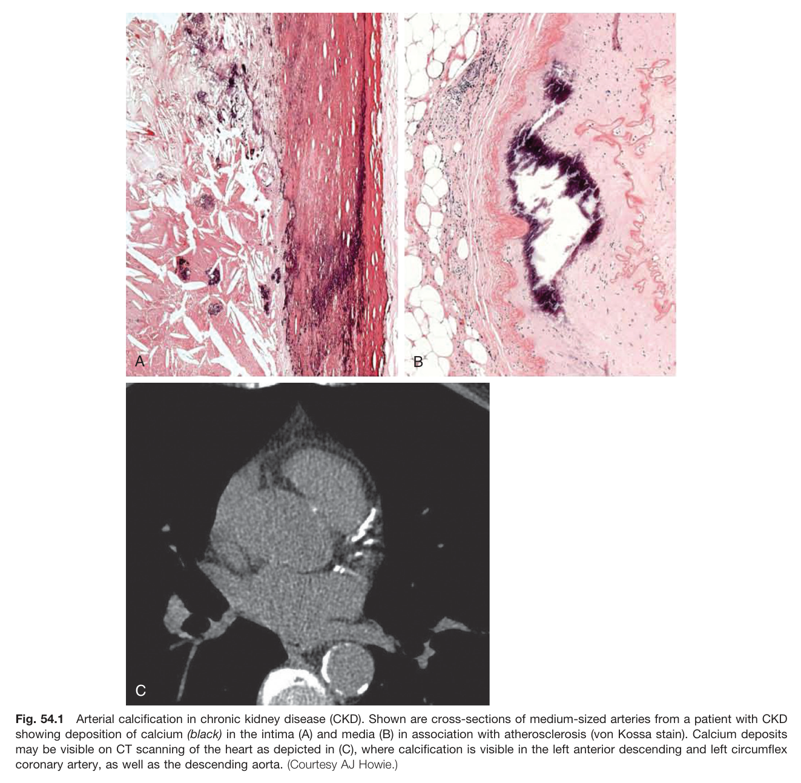

Fig. 54.1 Arterial calcification in chronic kidney disease (CKD). Shown are cross-sections of medium-sized arteries from a patient with CKD showing deposition of calcium (black) in the intima (A) and media (B) in association with atherosclerosis (von Kossa stain). Calcium deposits may be visible on CT scanning of the heart as depicted in (C), where calcification is visible in the left anterior descending and left circumflex coronary artery, as well as the descending aorta. (Courtesy AJ Howie.)

---

### Fig_54_2

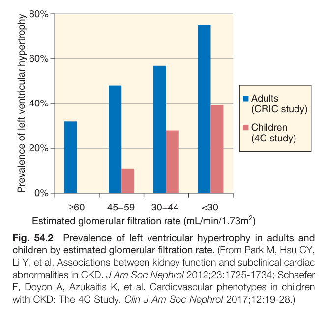

Fig. 54.2 Prevalence of left ventricular hypertrophy in adults and children by estimated glomerular filtration rate. (From Park M, Hsu CY, Li Y, et al. Associations between kidney function and subclinical cardiac abnormalities in CKD. J Am Soc Nephrol 2012;23:1725-1734; Schaefer F, Doyon A, Azukaitis K, et al. Cardiovascular phenotypes in children with CKD: The 4C Study. Clin J Am Soc Nephrol 2017;12:19-28.) Prevalence of left ventricular hypertrophy 80% 60% 40% 20% 0% ■ Adults (CRIC study) Children (4C study) ≥60 45-59 30-44 <30 Estimated glomerular filtration rate (mL/min/1.73m²)

---

### Fig_54_3

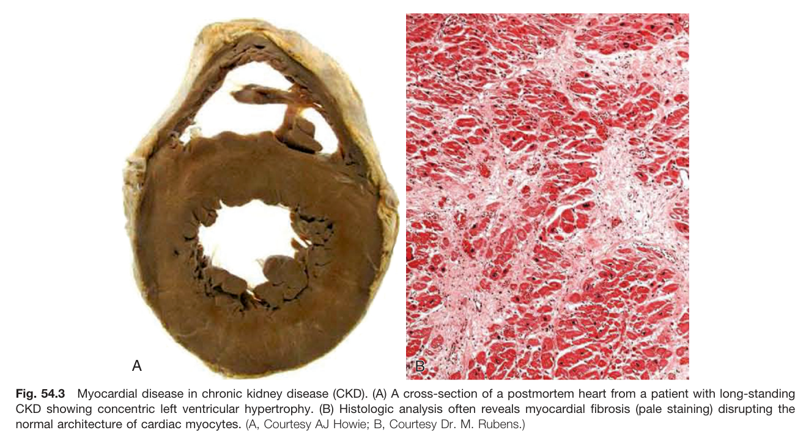

Fig. 54.3 Myocardial disease in chronic kidney disease (CKD). (A) A cross-section of a postmortem heart from a patient with long-standing CKD showing concentric left ventricular hypertrophy. (B) Histologic analysis often reveals myocardial fibrosis (pale staining) disrupting the normal architecture of cardiac myocytes. (A, Courtesy AJ Howie; B, Courtesy Dr. M. Rubens.)

---

### Fig_54_4

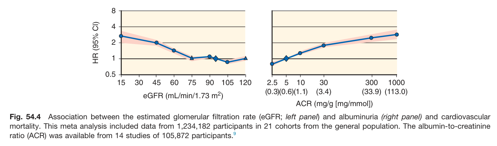

Fig. 54.4 Association between the estimated glomerular filtration rate (eGFR; left panel) and albuminuria (right panel) and cardiovascular mortality. This meta analysis included data from 1,234,182 participants in 21 cohorts from the general population. The albumin-to-creatinine ratio (ACR) was available from 14 studies of 105,872 participants.

---

### Fig_54_5

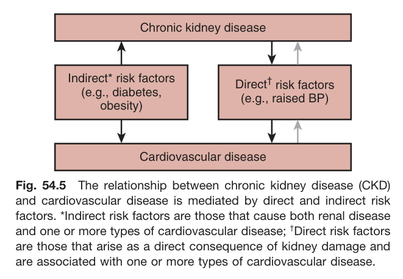

Fig. 54.5 The relationship between chronic kidney disease (CKD) and cardiovascular disease is mediated by direct and indirect risk factors. *Indirect risk factors are those that cause both renal disease and one or more types of cardiovascular disease; Direct risk factors are those that arise as a direct consequence of kidney damage and are associated with one or more types of cardiovascular disease. Chronic kidney disease Indirect* risk factors (e.g., diabetes, obesity) -> Cardiovascular disease <- Direct¹ risk factors (e.g., raised BP)

---

### Fig_54_6

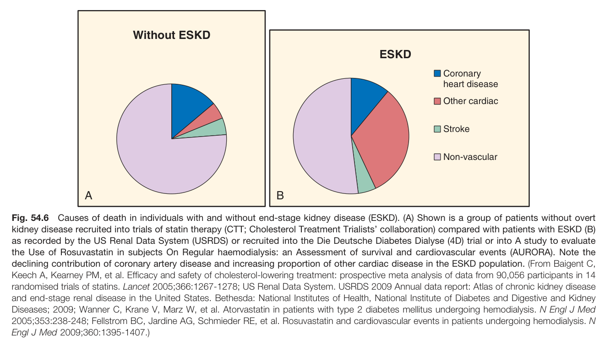

Fig. 54.6 Causes of death in individuals with and without end-stage kidney disease (ESKD). (A) Shown is a group of patients without overt kidney disease recruited into trials of statin therapy (CTT; Cholesterol Treatment Trialists' collaboration) compared with patients with ESKD (B) as recorded by the US Renal Data System (USRDS) or recruited into the Die Deutsche Diabetes Dialyse (4D) trial or into A study to evaluate the Use of Rosuvastatin in subjects On Regular haemodialysis: an Assessment of survival and cardiovascular events (AURORA). Note the declining contribution of coronary artery disease and increasing proportion of other cardiac disease in the ESKD population. (From Baigent C, Keech A, Kearney PM, et al. Efficacy and safety of cholesterol-lowering treatment: prospective meta analysis of data from 90,056 participants in 14 randomised trials of statins. Lancet 2005;366:1267-1278; US Renal Data System. USRDS 2009 Annual data report: Atlas of chronic kidney disease and end-stage renal disease in the United States. Bethesda: National Institutes of Health, National Institute of Diabetes and Digestive and Kidney Diseases; 2009; Wanner C, Krane V, Marz W, et al. Atorvastatin in patients with type 2 diabetes mellitus undergoing hemodialysis. N Engl J Med 2005;353:238-248; Fellstrom BC, Jardine AG, Schmieder RE, et al. Rosuvastatin and cardiovascular events in patients undergoing hemodialysis. N Engl J Med 2009;360:1395-1407.)

---

### Fig_54_7

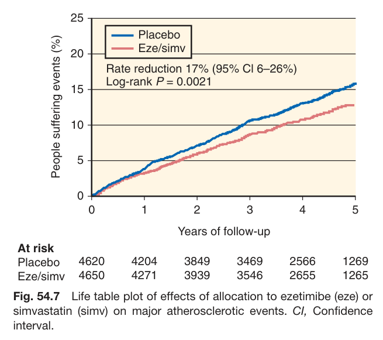

Fig. 54.7 Life table plot of effects of allocation to ezetimibe (eze) or simvastatin (simv) on major atherosclerotic events. Cl, Confidence interval.

---

### Fig_54_8

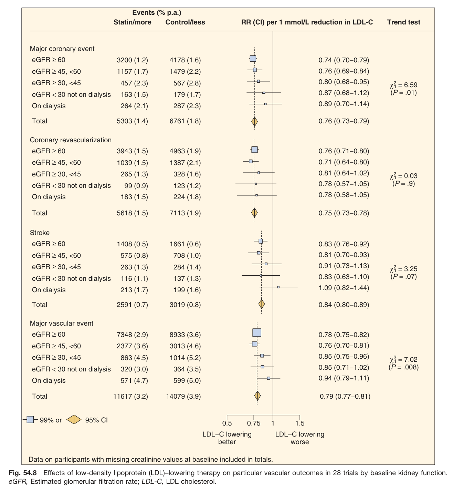

Fig. 54.8 Effects of low-density lipoprotein (LDL)-lowering therapy on particular vascular outcomes in 28 trials by baseline kidney function. eGFR, Estimated glomerular filtration rate; LDL-C, LDL cholesterol.

---

## Tables

### Table_54_1

#### Table Images (2 Parts)

- **Part 1 (Page 9)**:
  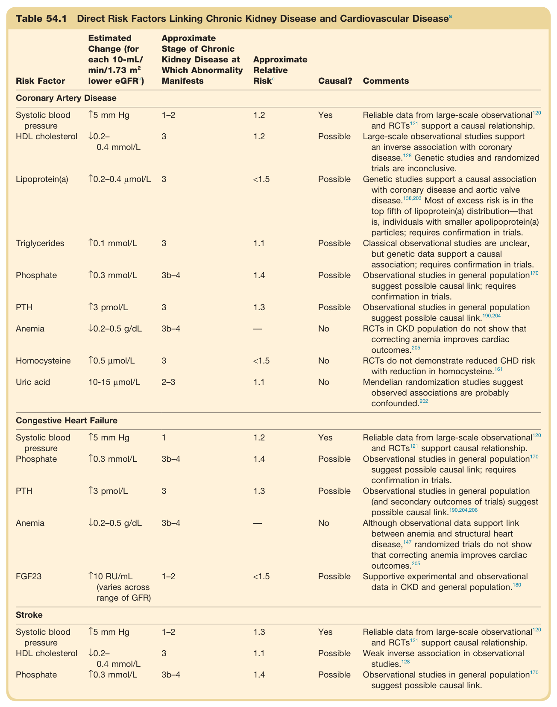

- **Part 2 (Page 10)**:
  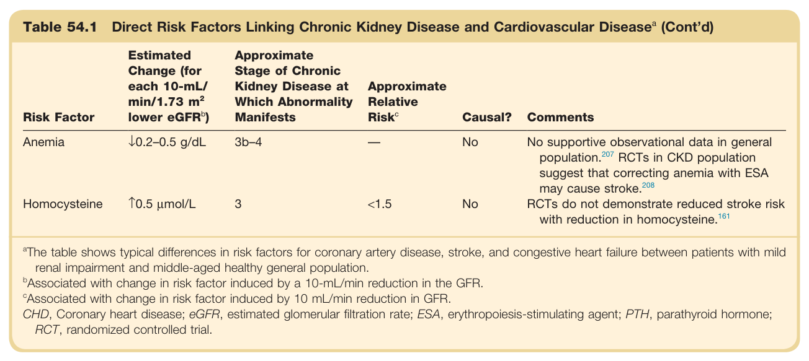

#### Table Data (CSV: [Table_54_1.csv](Table_54_1.csv))

```markdown
| Table Text (OCR) |
| :--- |
| Table 54.1 Direct Risk Factors Linking Chronic Kidney Disease and Cardiovascular Disease<sup>a</sup> Risk Factor  Estimated Change (for each 10-mL/min/1.73  m^2  lower eGFRb)  Approximate Stage of Chronic Kidney Disease at Which Abnormality Manifests  Approximate Relative Riskc  Causal?  Comments    Coronary Artery Disease    Systolic blood pressure  ↑5 mm Hg  1-2  1.2  Yes  Reliable data from large-scale observational ^{120}  and RCTs ^{121}  support a causal relationship.    HDL cholesterol  ↓0.2-0.4 mmol/L  3  1.2  Possible  Large-scale observational studies support an inverse association with coronary disease. ^{128}  Genetic studies and randomized trials are inconclusive.    Lipoprotein(a)  ↑0.2-0.4 μmol/L  3  <1.5  Possible  Genetic studies support a causal association with coronary disease and aortic valve disease. ^{138,203}  Most of excess risk is in the top fifth of lipoprotein(a) distribution—that is, individuals with smaller apolipoprotein(a) particles; requires confirmation in trials.    Triglycerides  ↑0.1 mmol/L  3  1.1  Possible  Classical observational studies are unclear, but genetic data support a causal association; requires confirmation in trials.    Phosphate  ↑0.3 mmol/L  3b-4  1.4  Possible  Observational studies in general population ^{170}  suggest possible causal link; requires confirmation in trials.    PTH  ↑3 pmol/L  3  1.3  Possible  Observational studies in general population suggest possible causal link. ^{190,204}     Anemia  ↓0.2-0.5 g/dL  3b-4  —  No  RCTs in CKD population do not show that correcting anemia improves cardiac outcomes. ^{205}     Homocysteine  ↑0.5 μmol/L  3  <1.5  No  RCTs do not demonstrate reduced CHD risk with reduction in homocysteine. ^{161}     Uric acid  10-15 μmol/L  2-3  1.1  No  Mendelian randomization studies suggest observed associations are probably confounded. ^{202}     Congestive Heart Failure    Systolic blood pressure  ↑5 mm Hg  1  1.2  Yes  Reliable data from large-scale observational ^{120}  and RCTs ^{121}  support causal relationship.    Phosphate  ↑0.3 mmol/L  3b-4  1.4  Possible  Observational studies in general population ^{170}  suggest possible causal link; requires confirmation in trials.    PTH  ↑3 pmol/L  3  1.3  Possible  Observational studies in general population (and secondary outcomes of trials) suggest possible causal link. ^{190,204,206}     Anemia  ↓0.2-0.5 g/dL  3b-4  —  No  Although observational data support link between anemia and structural heart disease, ^{147}  randomized trials do not show that correcting anemia improves cardiac outcomes. ^{205}     FGF23  ↑10 RU/mL (varies across range of GFR)  1-2  <1.5  Possible  Supportive experimental and observational data in CKD and general population. ^{180}     Stroke    Systolic blood pressure  ↑5 mm Hg  1-2  1.3  Yes  Reliable data from large-scale observational ^{120}  and RCTs ^{121}  support causal relationship.    HDL cholesterol  ↓0.2-0.4 mmol/L  3  1.1  Possible  Weak inverse association in observational studies. ^{128}     Phosphate  ↑0.3 mmol/L  3b-4  1.4  Possible  Observational studies in general population ^{170}  suggest possible causal link.    Anemia  ↓0.2–0.5 g/dL  3b–4  —  No  No supportive observational data in general population.207 RCTs in CKD population suggest that correcting anemia with ESA may cause stroke.208    Homocysteine  ↑0.5 μmol/L  3  <1.5  No  RCTs do not demonstrate reduced stroke risk with reduction in homocysteine.161 <sup>a</sup>The table shows typical differences in risk factors for coronary artery disease, stroke, and congestive heart failure between patients with mild renal impairment and middle-aged healthy general population. <sup>b</sup>Associated with change in risk factor induced by a 10-mL/min reduction in the GFR. <sup>c</sup>Associated with change in risk factor induced by 10 mL/min reduction in GFR. CHD, Coronary heart disease; eGFR, estimated glomerular filtration rate; ESA, erythropoiesis-stimulating agent; PTH, parathyroid hormone; RCT, randomized controlled trial. |
```

Table 54.1 Direct Risk Factors Linking Chronic Kidney Disease and Cardiovascular Disease a | Risk Factor | Estimated Change (for each 10-mL/min/1.73 m² lower eGFR) | Approximate Stage of Chronic Kidney Disease at Which Abnormality Manifests | Approximate Relative Risk | Causal? | Comments | | :--- | :--- | :--- | :--- | :--- | :--- | | **Coronary Artery Disease** | | | | | | | Systolic blood pressure | ↑5 mm Hg | 1-2 | 1.2 | Yes | Reliable data from large-scale observational and RCTs support a causal relationship. | | HDL cholesterol | ↓0.2-0.4 mmol/L | 3 | 1.2 | Possible | Large-scale observational studies support an inverse association with coronary disease. Genetic studies and randomized trials are inconclusive. | | Lipoprotein(a) | ↑0.2-0.4 µmol/L | 3 | <1.5 | Possible | Genetic studies support a causal association with coronary disease and aortic valve disease. Most of excess risk is in the top fifth of lipoprotein(a) distribution-that is, individuals with smaller apolipoprotein(a) particles; requires confirmation in trials. | | Triglycerides | ↑0.1 mmol/L | 3 | 1.1 | Possible | Classical observational studies are unclear, but genetic data support a causal association; requires confirmation in trials. | | Phosphate | ↑0.3 mmol/L | 3b-4 | 1.4 | Possible | Observational studies in general population suggest possible causal link; requires confirmation in trials. | | PTH | ↑3 pmol/L | 3 | 1.3 | Possible | Observational studies in general population suggest possible causal link. | | Anemia | ↓0.2-0.5 g/dL | 3b-4 | — | No | RCTs in CKD population do not show that correcting anemia improves cardiac outcomes. | | Homocysteine | ↑0.5 µmol/L | 3 | <1.5 | No | RCTs do not demonstrate reduced CHD risk with reduction in homocysteine. | | Uric acid | ↑10-15 μmol/L | 2-3 | 1.1 | No | Mendelian randomization studies suggest observed associations are probably confounded. | | **Congestive Heart Failure** | | | | | | | Systolic blood pressure | ↑5 mm Hg | 1 | 1.2 | Yes | Reliable data from large-scale observational and RCTs support causal relationship. | | Phosphate | ↑0.3 mmol/L | 3b-4 | 1.4 | Possible | Observational studies in general population suggest possible causal link; requires confirmation in trials. | | PTH | ↑3 pmol/L | 3 | 1.3 | Possible | Observational studies in general population (and secondary outcomes of trials) suggest possible causal link. | | Anemia | ↓0.2-0.5 g/dL | 3b-4 | — | No | Although observational data support link between anemia and structural heart disease, randomized trials do not show that correcting anemia improves cardiac outcomes. | | FGF23 | ↑10 RU/mL (varies across range of GFR) | 1-2 | <1.5 | Possible | Supportive experimental and observational data in CKD and general population. | | **Stroke** | | | | | | | Systolic blood pressure | ↑5 mm Hg | 1-2 | 1.3 | Yes | Reliable data from large-scale observational and RCTs support causal relationship. | | HDL cholesterol | ↓0.2-0.4 mmol/L | 3 | 1.1 | Possible | Weak inverse association in observational studies. | | Phosphate | ↑0.3 mmol/L | 3b-4 | 1.4 | Possible | Observational studies in general population suggest possible causal link. | | Anemia | ↓0.2-0.5 g/dL | 3b-4 | — | No | No supportive observational data in general population. RCTs in CKD population suggest that correcting anemia with ESA may cause stroke. | | Homocysteine | ↑0.5 µmol/L | 3 | <1.5 | No | RCTs do not demonstrate reduced stroke risk with reduction in homocysteine. | *The table shows typical differences in risk factors for coronary artery disease, stroke, and congestive heart failure between patients with mild renal impairment and middle-aged healthy general population. bAssociated with change in risk factor induced by a 10-mL/min reduction in the GFR. Associated with change in risk factor induced by 10 mL/min reduction in GFR. CHD, Coronary heart disease; eGFR, estimated glomerular filtration rate; ESA, erythropoiesis-stimulating agent; PTH, parathyroid hormone; RCT, randomized controlled trial.

---

## Boxes

### Box_54_1

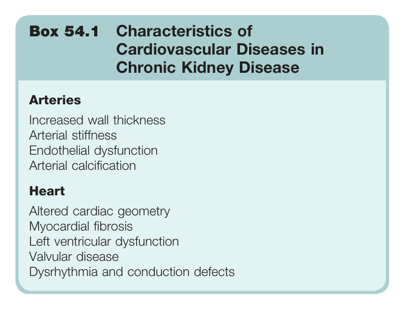

#### Box Text

```markdown
Box 54.1 Characteristics of Cardiovascular Diseases in Chronic Kidney Disease **Arteries** Increased wall thickness Arterial stiffness Endothelial dysfunction Arterial calcification **Heart** Altered cardiac geometry Myocardial fibrosis Left ventricular dysfunction Valvular disease Dysrhythmia and conduction defects
```

Box 54.1 Characteristics of Cardiovascular Diseases in Chronic Kidney Disease **Arteries** Increased wall thickness Arterial stiffness Endothelial dysfunction Arterial calcification **Heart** Altered cardiac geometry Myocardial fibrosis Left ventricular dysfunction Valvular disease Dysrhythmia and conduction defects

---
