# 55. Hematologic Aspects of Kidney Disease - Figures and Tables Index

This document lists all figures and tables extracted from `55. Hematologic Aspects of Kidney Disease.pdf`.

## Table of Contents
- [Figures](#figures)
- [Tables](#tables)

---

## Figures

### Fig_55_1

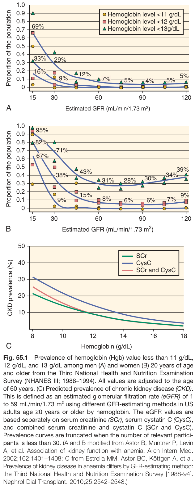

Fig. 55.1 Prevalence of hemoglobin (Hgb) value less than 11 g/dL, 12 g/dL, and 13 g/dL among men (A) and women (B) 20 years of age and older from the Third National Health and Nutrition Examination Survey (NHANES III; 1988–1994). All values are adjusted to the age of 60 years. (C) Predicted prevalence of chronic kidney disease (CKD). This is defined as an estimated glomerular filtration rate (eGFR) of 1 to 59 mL/min/1.73 m² using different GFR-estimating methods in US adults age 20 years or older by hemoglobin. The eGFR values are based separately on serum creatinine (SCr), serum cystatin C (CysC), and combined serum creatinine and cystatin C (SCr and CysC). Prevalence curves are truncated when the number of relevant partici- pants is less than 30. (A and B modified from Astor B, Muntner P, Levin A, et al. Association of kidney function with anemia. Arch Intern Med. 2002;162:1401-1408; C from Estrella MM, Astor BC, Köttgen A, et al. Prevalence of kidney disease in anaemia differs by GFR-estimating method: the Third National Health and Nutrition Examination Survey [1988-94]. Nephrol Dial Transplant. 2010;25:2542-2548.)

---

### Fig_55_2

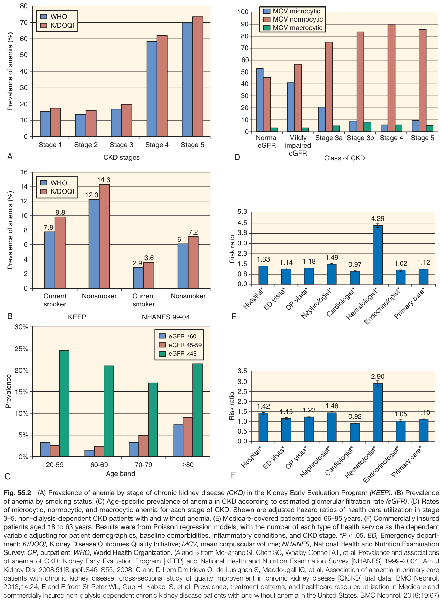

Fig. 55.2 (A) Prevalence of anemia by stage of chronic kidney disease (CKD) in the Kidney Early Evaluation Program (KEEP). (B) Prevalence of anemia by smoking status. (C) Age-specific prevalence of anemia in CKD according to estimated glomerular filtration rate (eGFR). (D) Rates of microcytic, normocytic, and macrocytic anemia for each stage of CKD. Shown are adjusted hazard ratios of health care utilization in stage 3-5, non-dialysis-dependent CKD patients with and without anemia. (E) Medicare-covered patients aged 66-85 years. (F) Commercially insured patients aged 18 to 63 years. Results were from Poisson regression models, with the number of each type of health service as the dependent variable adjusting for patient demographics, baseline comorbidities, inflammatory conditions, and CKD stage. *P < .05. ED, Emergency depart- ment; K/DOQI, Kidney Disease Outcomes Quality Initiative; MCV, mean corpuscular volume; NHANES, National Health and Nutrition Examination Survey; OP, outpatient; WHO, World Health Organization. (A and B from McFarlane SI, Chen SC, Whaley-Connell AT, et al. Prevalence and associations of anemia of CKD: Kidney Early Evaluation Program [KEEP] and National Health and Nutrition Examination Survey [NHANES] 1999-2004. Am J Kidney Dis. 2008;51 [Suppl]:S46-S55, 2008; C and D from Dmitrieva O, de Lusignan S, Macdougall IC, et al. Association of anaemia in primary care patients with chronic kidney disease: cross-sectional study of quality improvement in chronic kidney disease [QICKD] trial data. BMC Nephrol. 2013;14:24; E and F from St Peter WL, Guo H, Kabadi S, et al. Prevalence, treatment patterns, and healthcare resource utilization in Medicare and commercially insured non-dialysis-dependent chronic kidney disease patients with and without anemia in the United States. BMC Nephrol. 2018;19:67)

---

### Fig_55_3

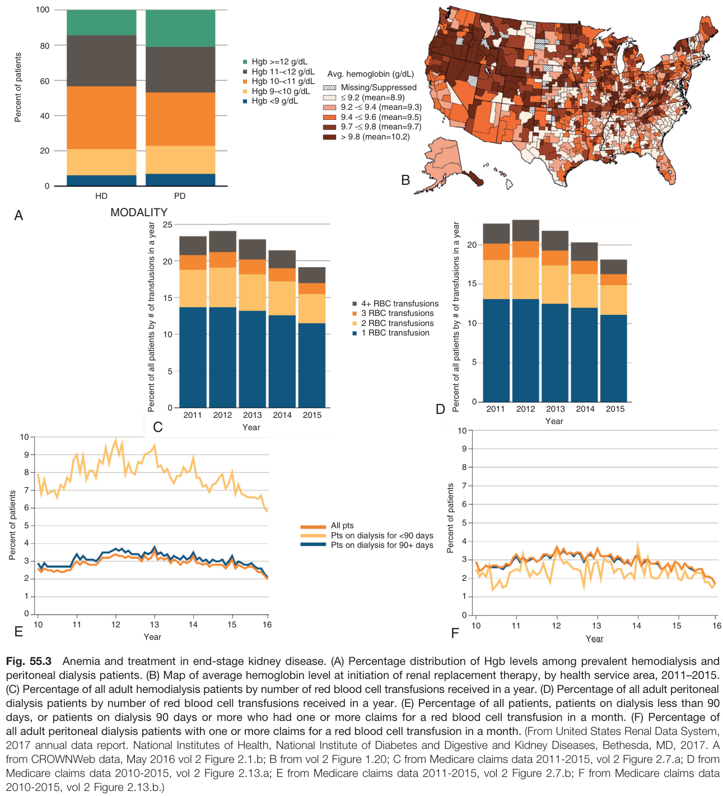

Fig. 55.3 Anemia and treatment in end-stage kidney disease. (A) Percentage distribution of Hgb levels among prevalent hemodialysis and peritoneal dialysis patients. (B) Map of average hemoglobin level at initiation of renal replacement therapy, by health service area, 2011-2015. (C) Percentage of all adult hemodialysis patients by number of red blood cell transfusions received in a year. (D) Percentage of all adult peritoneal dialysis patients by number of red blood cell transfusions received in a year. (E) Percentage of all patients, patients on dialysis less than 90 days, or patients on dialysis 90 days or more who had one or more claims for a red blood cell transfusion in a month. (F) Percentage of all adult peritoneal dialysis patients with one or more claims for a red blood cell transfusion in a month. (From United States Renal Data System, 2017 annual data report. National Institutes of Health, National Institute of Diabetes and Digestive and Kidney Diseases, Bethesda, MD, 2017. A from CROWNWeb data, May 2016 vol 2 Figure 2.1.b; B from vol 2 Figure 1.20; C from Medicare claims data 2011-2015, vol 2 Figure 2.7.a; D from Medicare claims data 2010-2015, vol 2 Figure 2.13.a; E from Medicare claims data 2011-2015, vol 2 Figure 2.7.b; F from Medicare claims data 2010-2015, vol 2 Figure 2.13.b.)

---

### Fig_55_4

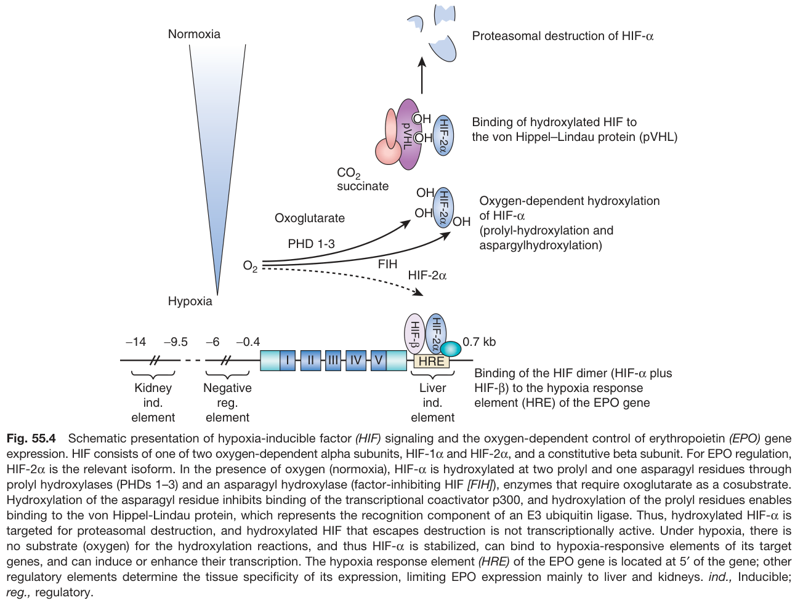

Fig. 55.4 Schematic presentation of hypoxia-inducible factor (HIF) signaling and the oxygen-dependent control of erythropoietin (EPO) gene expression. HIF consists of one of two oxygen-dependent alpha subunits, HIF-1α and HIF-2α, and a constitutive beta subunit. For EPO regulation, HIF-2a is the relevant isoform. In the presence of oxygen (normoxia), HIF-a is hydroxylated at two prolyl and one asparagyl residues through prolyl hydroxylases (PHDs 1-3) and an asparagyl hydroxylase (factor-inhibiting HIF [FIH]), enzymes that require oxoglutarate as a cosubstrate. Hydroxylation of the asparagyl residue inhibits binding of the transcriptional coactivator p300, and hydroxylation of the prolyl residues enables binding to the von Hippel-Lindau protein, which represents the recognition component of an E3 ubiquitin ligase. Thus, hydroxylated HIF-a is targeted for proteasomal destruction, and hydroxylated HIF that escapes destruction is not transcriptionally active. Under hypoxia, there is no substrate (oxygen) for the hydroxylation reactions, and thus HIF-a is stabilized, can bind to hypoxia-responsive elements of its target genes, and can induce or enhance their transcription. The hypoxia response element (HRE) of the EPO gene is located at 5' of the gene; other regulatory elements determine the tissue specificity of its expression, limiting EPO expression mainly to liver and kidneys. ind., Inducible; reg., regulatory.

---

### Fig_55_5

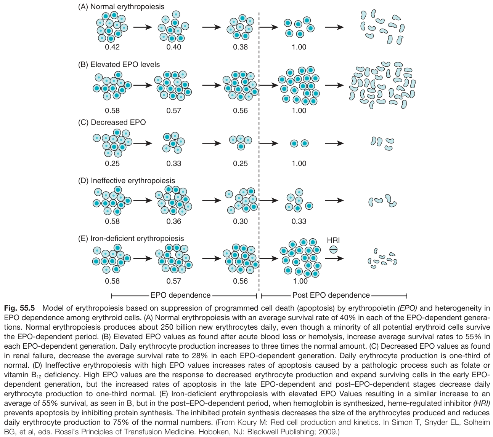

Fig. 55.5 Model of erythropoiesis based on suppression of programmed cell death (apoptosis) by erythropoietin (EPO) and heterogeneity in EPO dependence among erythroid cells. (A) Normal erythropoiesis with an average survival rate of 40% in each of the EPO-dependent genera- tions. Normal erythropoiesis produces about 250 billion new erythrocytes daily, even though a minority of all potential erythroid cells survive the EPO-dependent period. (B) Elevated EPO values as found after acute blood loss or hemolysis, increase average survival rates to 55% in each EPO-dependent generation. Daily erythrocyte production increases to three times the normal amount. (C) Decreased EPO values as found in renal failure, decrease the average survival rate to 28% in each EPO-dependent generation. Daily erythrocyte production is one-third of normal. (D) Ineffective erythropoiesis with high EPO values increases rates of apoptosis caused by a pathologic process such as folate or vitamin B12 deficiency. High EPO values are the response to decreased erythrocyte production and expand surviving cells in the early EPO- dependent generation, but the increased rates of apoptosis in the late EPO-dependent and post-EPO-dependent stages decrease daily erythrocyte production to one-third normal. (E) Iron-deficient erythropoiesis with elevated EPO Values resulting in a similar increase to an average of 55% survival, as seen in B, but in the post-EPO-dependent period, when hemoglobin is synthesized, heme-regulated inhibitor (HRI) prevents apoptosis by inhibiting protein synthesis. The inhibited protein synthesis decreases the size of the erythrocytes produced and reduces daily erythrocyte production to 75% of the normal numbers. (From Koury M: Red cell production and kinetics. In Simon T, Snyder EL, Solheim BG, et al, eds. Rossi's Principles of Transfusion Medicine. Hoboken, NJ: Blackwell Publishing; 2009.)

---

### Fig_55_6

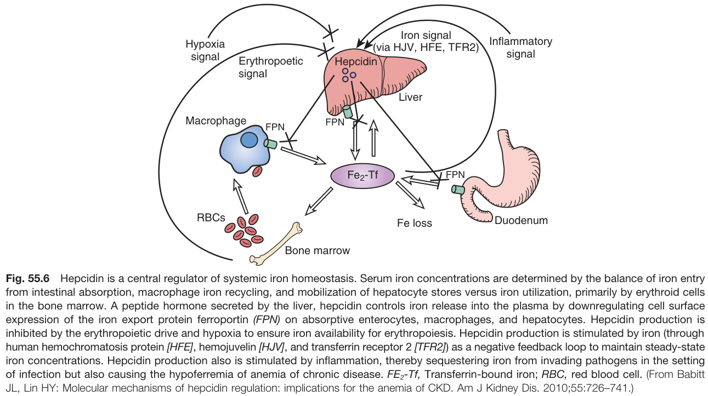

Fig. 55.6 Hepcidin is a central regulator of systemic iron homeostasis. Serum iron concentrations are determined by the balance of iron entry from intestinal absorption, macrophage iron recycling, and mobilization of hepatocyte stores versus iron utilization, primarily by erythroid cells in the bone marrow. A peptide hormone secreted by the liver, hepcidin controls iron release into the plasma by downregulating cell surface expression of the iron export protein ferroportin (FPN) on absorptive enterocytes, macrophages, and hepatocytes. Hepcidin production is inhibited by the erythropoietic drive and hypoxia to ensure iron availability for erythropoiesis. Hepcidin production is stimulated by iron (through human hemochromatosis protein [HFE], hemojuvelin [HJV], and transferrin receptor 2 [TFR2]) as a negative feedback loop to maintain steady-state iron concentrations. Hepcidin production also is stimulated by inflammation, thereby sequestering iron from invading pathogens in the setting of infection but also causing the hypoferremia of anemia of chronic disease. FE2-Tf, Transferrin-bound iron; RBC, red blood cell. (From Babitt JL, Lin HY: Molecular mechanisms of hepcidin regulation: implications for the anemia of CKD. Am J Kidney Dis. 2010;55:726-741.)

---

### Fig_55_7

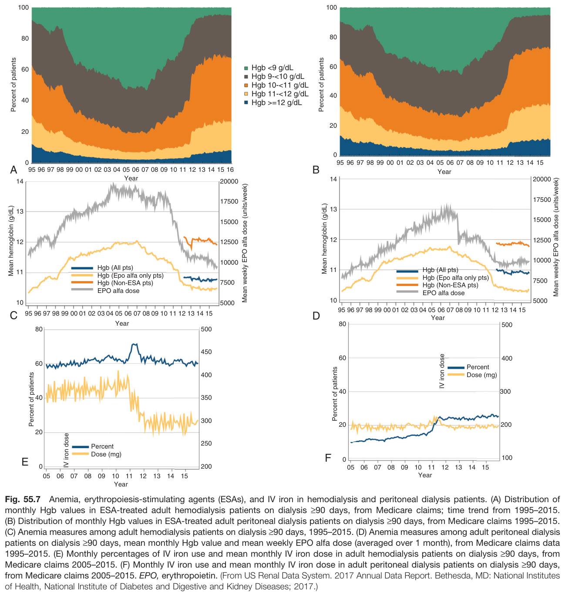

Fig. 55.7 Anemia, erythropoiesis-stimulating agents (ESAs), and IV iron in hemodialysis and peritoneal dialysis patients. (A) Distribution of monthly Hgb values in ESA-treated adult hemodialysis patients on dialysis ≥90 days, from Medicare claims; time trend from 1995-2015. (B) Distribution of monthly Hgb values in ESA-treated adult peritoneal dialysis patients on dialysis ≥90 days, from Medicare claims 1995-2015. (C) Anemia measures among adult hemodialysis patients on dialysis ≥90 days, 1995-2015. (D) Anemia measures among adult peritoneal dialysis patients on dialysis ≥90 days, mean monthly Hgb value and mean weekly EPO alfa dose (averaged over 1 month), from Medicare claims data 1995-2015. (Ε) Monthly percentages of IV iron use and mean monthly IV iron dose in adult hemodialysis patients on dialysis ≥90 days, from Medicare claims 2005-2015. (F) Monthly IV iron use and mean monthly IV iron dose in adult peritoneal dialysis patients on dialysis ≥90 days, from Medicare claims 2005-2015. EPO, erythropoietin. (From US Renal Data System. 2017 Annual Data Report. Bethesda, MD: National Institutes of Health, National Institute of Diabetes and Digestive and Kidney Diseases; 2017.)

---

### Fig_55_8

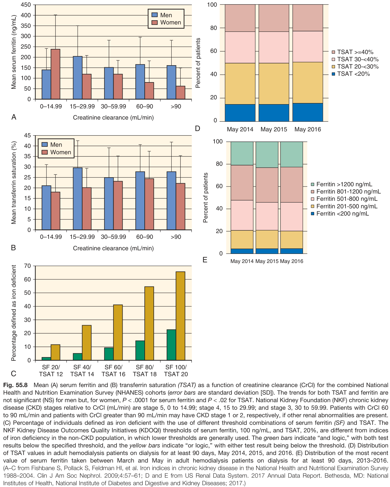

Fig. 55.8 Mean (A) serum ferritin and (B) transferrin saturation (TSAT) as a function of creatinine clearance (CrCl) for the combined National Health and Nutrition Examination Survey (NHANES) cohorts (error bars are standard deviation [SD]). The trends for both TSAT and ferritin are not significant (NS) for men but, for women, P < .0001 for serum ferritin and P < .02 for TSAT. National Kidney Foundation (NKF) chronic kidney disease (CKD) stages relative to CrCl (mL/min) are stage 5, 0 to 14.99; stage 4, 15 to 29.99; and stage 3, 30 to 59.99. Patients with CrCl 60 to 90 mL/min and patients with CrCl greater than 90 mL/min may have CKD stage 1 or 2, respectively, if other renal abnormalities are present. (C) Percentage of individuals defined as iron deficient with the use of different threshold combinations of serum ferritin (SF) and TSAT. The NKF Kidney Disease Outcomes Quality Initiatives (KDOQI) thresholds of serum ferritin, 100 ng/mL, and TSAT, 20%, are different from indices of iron deficiency in the non-CKD population, in which lower thresholds are generally used. The green bars indicate "and logic," with both test results below the specified threshold, and the yellow bars indicate "or logic," with either test result being below the threshold. (D) Distribution of TSAT values in adult hemodialysis patients on dialysis for at least 90 days, May 2014, 2015, and 2016. (E) Distribution of the most recent value of serum ferritin taken between March and May in adult hemodialysis patients on dialysis for at least 90 days, 2013-2016. (A-C from Fishbane S, Pollack S, Feldman HI, et al. Iron indices in chronic kidney disease in the National Health and Nutritional Examination Survey 1988-2004. Clin J Am Soc Nephrol. 2009;4:57-61; D and E from US Renal Data System. 2017 Annual Data Report. Bethesda, MD: National Institutes of Health, National Institute of Diabetes and Digestive and Kidney Diseases; 2017.)

---

### Fig_55_9

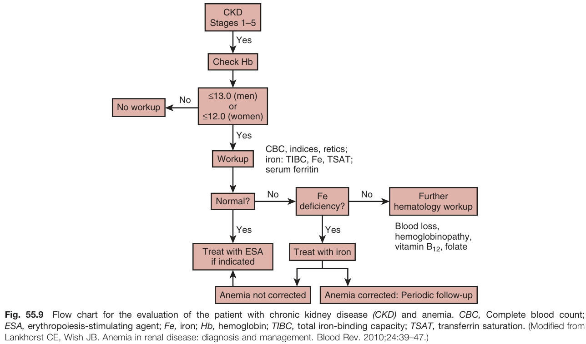

Fig. 55.9 Flow chart for the evaluation of the patient with chronic kidney disease (CKD) and anemia. CBC, Complete blood count; ESA, erythropoiesis-stimulating agent; Fe, iron; Hb, hemoglobin; TIBC, total iron-binding capacity; TSAT, transferrin saturation. (Modified from Lankhorst CE, Wish JB. Anemia in renal disease: diagnosis and management. Blood Rev. 2010;24:39-47.)

---

### Fig_55_10

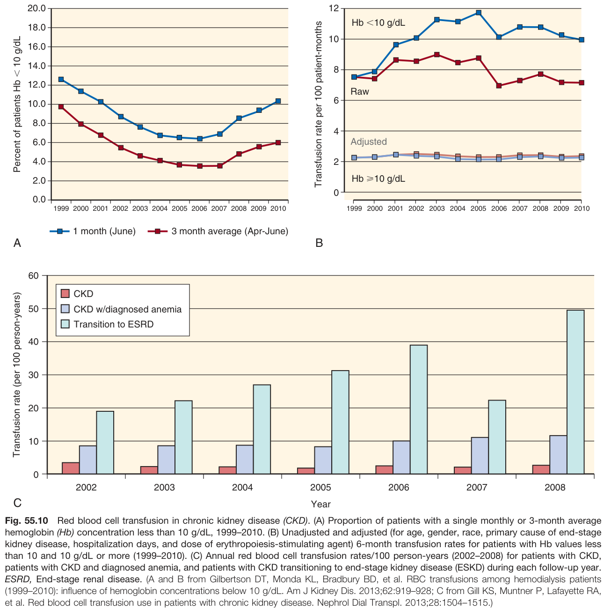

Fig. 55.10 Red blood cell transfusion in chronic kidney disease (CKD). (A) Proportion of patients with a single monthly or 3-month average hemoglobin (Hb) concentration less than 10 g/dL, 1999-2010. (B) Unadjusted and adjusted (for age, gender, race, primary cause of end-stage kidney disease, hospitalization days, and dose of erythropoiesis-stimulating agent) 6-month transfusion rates for patients with Hb values less than 10 and 10 g/dL or more (1999-2010). (C) Annual red blood cell transfusion rates/100 person-years (2002-2008) for patients with CKD, patients with CKD and diagnosed anemia, and patients with CKD transitioning to end-stage kidney disease (ESKD) during each follow-up year. ESRD, End-stage renal disease. (A and B from Gilbertson DT, Monda KL, Bradbury BD, et al. RBC transfusions among hemodialysis patients (1999-2010): influence of hemoglobin concentrations below 10 g/dL. Am J Kidney Dis. 2013;62:919-928; C from Gill KS, Muntner P, Lafayette RA, et al. Red blood cell transfusion use in patients with chronic kidney disease. Nephrol Dial Transpl. 2013;28:1504-1515.)

---

### Fig_55_11

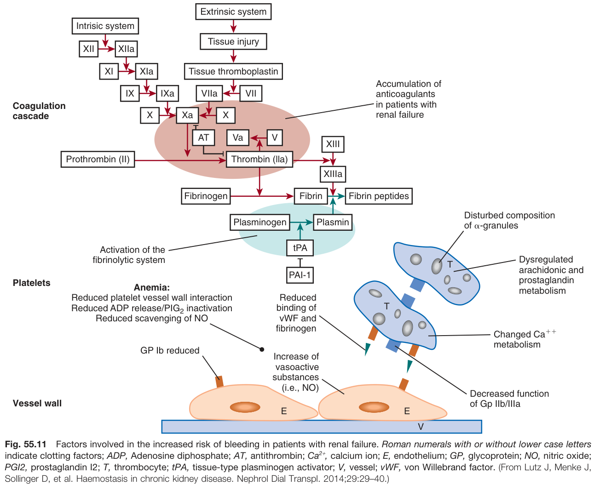

Fig. 55.11 Factors involved in the increased risk of bleeding in patients with renal failure. Roman numerals with or without lower case letters indicate clotting factors; ADP, Adenosine diphosphate; AT, antithrombin; Ca2+, calcium ion; E, endothelium; GP, glycoprotein; NO, nitric oxide; PGI2, prostaglandin 12; T, thrombocyte; tPA, tissue-type plasminogen activator; V, vessel; vWF, von Willebrand factor. (From Lutz J, Menke J, Sollinger D, et al. Haemostasis in chronic kidney disease. Nephrol Dial Transpl. 2014;29:29-40.)

---

### Fig_55_12

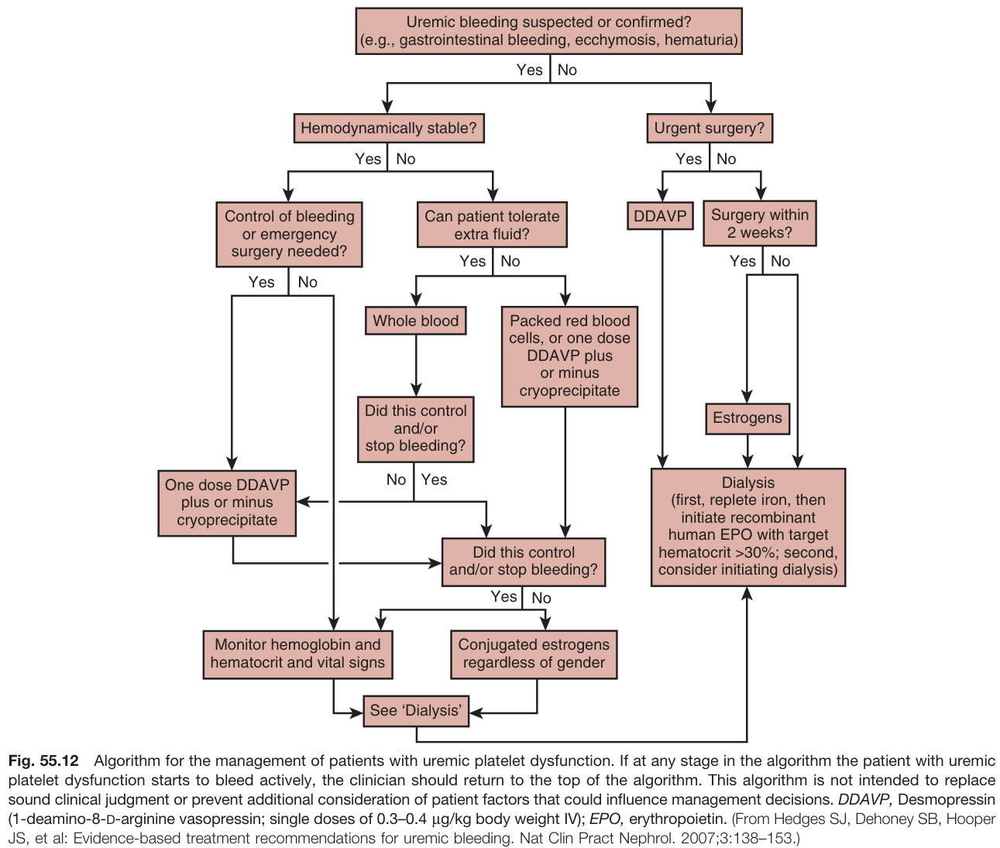

Fig. 55.12 Algorithm for the management of patients with uremic platelet dysfunction. If at any stage in the algorithm the patient with uremic platelet dysfunction starts to bleed actively, the clinician should return to the top of the algorithm. This algorithm is not intended to replace sound clinical judgment or prevent additional consideration of patient factors that could influence management decisions. DDAVP, Desmopressin (1-deamino-8-D-arginine vasopressin; single doses of 0.3-0.4 µg/kg body weight IV); EPO, erythropoietin. (From Hedges SJ, Dehoney SB, Hooper JS, et al: Evidence-based treatment recommendations for uremic bleeding. Nat Clin Pract Nephrol. 2007;3:138-153.)

---

### Fig_55_13

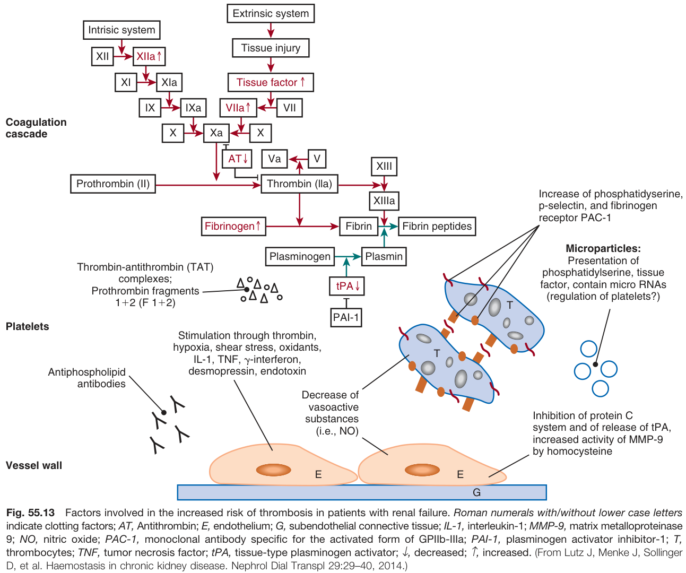

Fig. 55.13 Factors involved in the increased risk of thrombosis in patients with renal failure. Roman numerals with/without lower case letters indicate clotting factors; AT, Antithrombin; E, endothelium; G, subendothelial connective tissue; IL-1, interleukin-1; MMP-9, matrix metalloproteinase 9; NO, nitric oxide; PAC-1, monoclonal antibody specific for the activated form of GPIlb-Illa; PAI-1, plasminogen activator inhibitor-1; T, thrombocytes; TNF, tumor necrosis factor; tPA, tissue-type plasminogen activator; 1, decreased; 1, increased. (From Lutz J, Menke J, Sollinger D, et al. Haemostasis in chronic kidney disease. Nephrol Dial Transpl 29:29-40, 2014.)

---

## Tables

### Table_55_1

#### Table Image

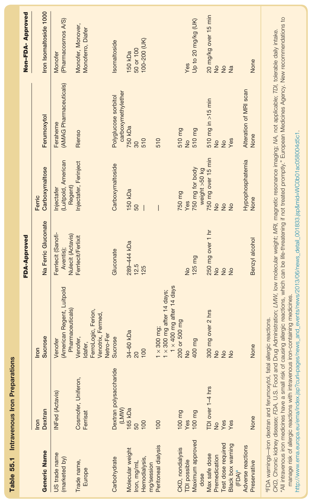

#### Table Data (CSV: [Table_55_1.csv](Table_55_1.csv))

```markdown
| Table Text (OCR) |
| :--- |
| Table 55.1 Intravenous Iron Preparations \| Generic Name \| Iron Dextran \| Iron Sucrose \| Na Ferric Gluconate \| Ferric Carboxymaltose \| Ferumoxytol \| Iron Isomaltoside 1000 (Non-FDA- Approved) \| \| :--- \| :--- \| :--- \| :--- \| :--- \| :--- \| :--- \| \| **US trade name (marketed by)** \| INFed (Actavis) \| Venofer (American Regent, Luitpold Pharmaceuticals) \| Ferrlecit (Sanofi-Aventis); Nulecit (Actavis) \| Injectafer (Luitpold, American Regent) \| Feraheme (AMAG Pharmaceuticals) \| Monofer (Pharmacosmos A/S) \| \| **Trade name, Europe** \| Cosmofer, Uniferon, Ferrisat \| Venofer, Idafer, Ferro Logic, Ferion, Venotrix, Fermed, Netro-Fer \| Ferrlecit/Ferlixit \| Injectafer, Ferinject \| Rienso \| Monofer, Monover, Monoferro, Diafer \| \| **Carbohydrate** \| Dextran polysaccharide (LMW) \| Sucrose \| Gluconate \| Carboxymaltoside \| Polyglucose sorbitol carboxymethylether \| Isomaltoside \| \| **Molecular weight** \| 165 kDa \| 34-60 kDa \| 289-444 kDa \| 150 kDa \| 750 kDa \| 150 kDa \| \| **Iron, mg/mL** \| 50 \| 20 \| 12.5 \| 50 \| 30 \| 50 or 100 \| \| **Hemodialysis, mg/session** \| 100 \| 100 \| 125 \| — \| 510 \| 100-200 (UK) \| \| **Peritoneal dialysis** \| 100 \| 1 × 300 mg; 1 x 300 mg after 14 days; 1 x 400 mg after 14 days \| — \| — \| 510 \| — \| \| **CKD, nondialysis** \| 100 mg \| 200 or 500 mg \| No \| 750 mg \| 510 mg \| Yes \| \| **TDI possible** \| Yes \| No \| No \| Yes \| No \| Yes \| \| **Maximum approved dose** \| 100 mg \| 400 mg \| 125 mg \| 750 mg for body weight >50 kg \| 510 mg \| Up to 20 mg/kg (UK) \| \| **Max safe dose** \| TDI over 1-4 hrs \| 300 mg over 2 hrs \| 250 mg over 1 hr \| 750 mg over 15 min \| 510 mg in >15 min \| 20 mg/kg over 15 min \| \| **Premedication** \| No \| No \| No \| No \| No \| No \| \| **Test dose required** \| Yes \| No \| No \| No \| No \| No \| \| **Black box warning (FDA)a** \| Yes \| No \| No \| No \| Yes \| NA \| \| **Adverse reactions** \| — \| — \| Benzyl alcohol \| Hypophosphatemia \| Alteration of MRI scan \| None \| \| **Preservative** \| None \| None \| None \| None \| None \| None \| *aFDA warnings—iron dextran and ferumoxytol, fatal allergic reactions.* *CKD, Chronic kidney disease; FDA, U.S. Food and Drug Administration; LMW, low molecular weight; MRI, magnetic resonance imaging; NA, not applicable; TDI, tolerable daily intake.* *"All intravenous iron medicines have a small risk of causing allergic reactions, which can be life-threatening if not treated promptly." European Medicines Agency. New recommendations to manage risk of allergic reactions with intravenous iron-containing medicines.* |
```

Table 55.1 Intravenous Iron Preparations | Generic Name | Iron Dextran | Iron Sucrose | Na Ferric Gluconate | Ferric Carboxymaltose | Ferumoxytol | Iron Isomaltoside 1000 (Non-FDA- Approved) | | :--- | :--- | :--- | :--- | :--- | :--- | :--- | | **US trade name (marketed by)** | INFed (Actavis) | Venofer (American Regent, Luitpold Pharmaceuticals) | Ferrlecit (Sanofi-Aventis); Nulecit (Actavis) | Injectafer (Luitpold, American Regent) | Feraheme (AMAG Pharmaceuticals) | Monofer (Pharmacosmos A/S) | | **Trade name, Europe** | Cosmofer, Uniferon, Ferrisat | Venofer, Idafer, Ferro Logic, Ferion, Venotrix, Fermed, Netro-Fer | Ferrlecit/Ferlixit | Injectafer, Ferinject | Rienso | Monofer, Monover, Monoferro, Diafer | | **Carbohydrate** | Dextran polysaccharide (LMW) | Sucrose | Gluconate | Carboxymaltoside | Polyglucose sorbitol carboxymethylether | Isomaltoside | | **Molecular weight** | 165 kDa | 34-60 kDa | 289-444 kDa | 150 kDa | 750 kDa | 150 kDa | | **Iron, mg/mL** | 50 | 20 | 12.5 | 50 | 30 | 50 or 100 | | **Hemodialysis, mg/session** | 100 | 100 | 125 | — | 510 | 100-200 (UK) | | **Peritoneal dialysis** | 100 | 1 × 300 mg; 1 x 300 mg after 14 days; 1 x 400 mg after 14 days | — | — | 510 | — | | **CKD, nondialysis** | 100 mg | 200 or 500 mg | No | 750 mg | 510 mg | Yes | | **TDI possible** | Yes | No | No | Yes | No | Yes | | **Maximum approved dose** | 100 mg | 400 mg | 125 mg | 750 mg for body weight >50 kg | 510 mg | Up to 20 mg/kg (UK) | | **Max safe dose** | TDI over 1-4 hrs | 300 mg over 2 hrs | 250 mg over 1 hr | 750 mg over 15 min | 510 mg in >15 min | 20 mg/kg over 15 min | | **Premedication** | No | No | No | No | No | No | | **Test dose required** | Yes | No | No | No | No | No | | **Black box warning (FDA)a** | Yes | No | No | No | Yes | NA | | **Adverse reactions** | — | — | Benzyl alcohol | Hypophosphatemia | Alteration of MRI scan | None | | **Preservative** | None | None | None | None | None | None | *aFDA warnings—iron dextran and ferumoxytol, fatal allergic reactions.* *CKD, Chronic kidney disease; FDA, U.S. Food and Drug Administration; LMW, low molecular weight; MRI, magnetic resonance imaging; NA, not applicable; TDI, tolerable daily intake.* *"All intravenous iron medicines have a small risk of causing allergic reactions, which can be life-threatening if not treated promptly." European Medicines Agency. New recommendations to manage risk of allergic reactions with intravenous iron-containing medicines.*

---

### Table_55_2

#### Table Image

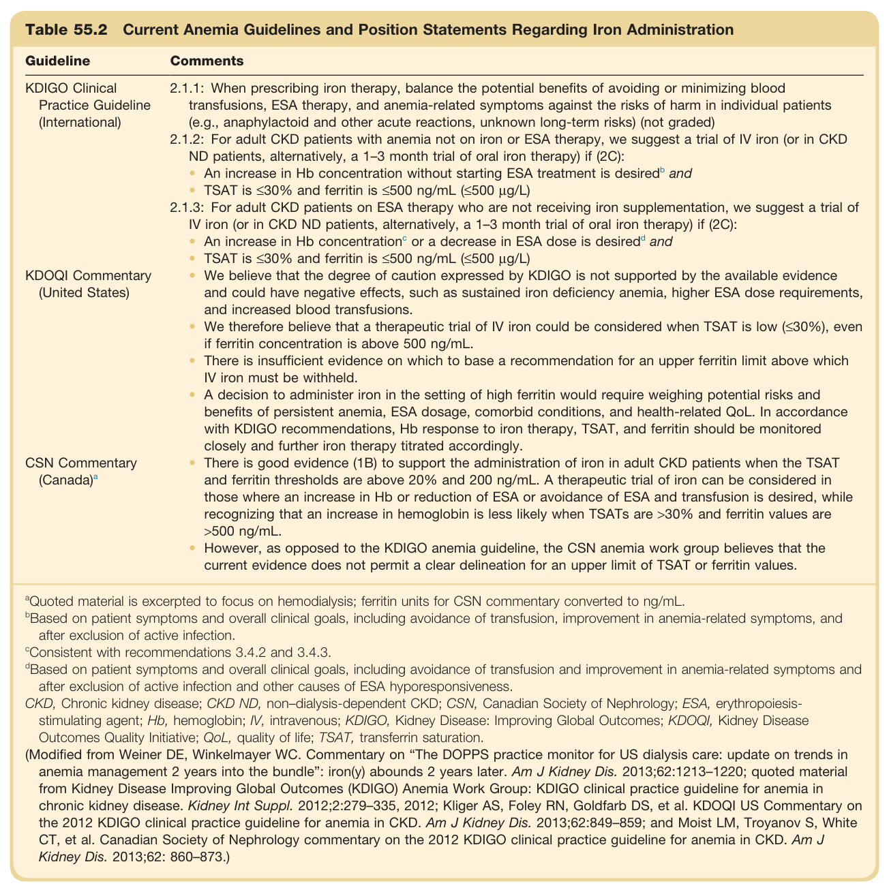

#### Table Data (CSV: [Table_55_2.csv](Table_55_2.csv))

```markdown
| Table Text (OCR) |
| :--- |
| Table 55.2 Current Anemia Guidelines and Position Statements Regarding Iron Administration Guideline  Comments    KDIGO Clinical Practice Guideline (International)  2.1.1: When prescribing iron therapy, balance the potential benefits of avoiding or minimizing blood transfusions, ESA therapy, and anemia-related symptoms against the risks of harm in individual patients (e.g., anaphylactoid and other acute reactions, unknown long-term risks) (not graded)2.1.2: For adult CKD patients with anemia not on iron or ESA therapy, we suggest a trial of IV iron (or in CKD ND patients, alternatively, a 1–3 month trial of oral iron therapy) if (2C):An increase in Hb concentration without starting ESA treatment is  desired^b  andTSAT is ≤30% and ferritin is ≤500 ng/mL (≤500 μg/L)2.1.3: For adult CKD patients on ESA therapy who are not receiving iron supplementation, we suggest a trial of IV iron (or in CKD ND patients, alternatively, a 1–3 month trial of oral iron therapy) if (2C):An increase in Hb  concentration^c  or a decrease in ESA dose is  desired^d  andTSAT is ≤30% and ferritin is ≤500 ng/mL (≤500 μg/L)    KDOQI Commentary (United States)  We believe that the degree of caution expressed by KDIGO is not supported by the available evidence and could have negative effects, such as sustained iron deficiency anemia, higher ESA dose requirements, and increased blood transfusions.We therefore believe that a therapeutic trial of IV iron could be considered when TSAT is low (≤30%), even if ferritin concentration is above 500 ng/mL.There is insufficient evidence on which to base a recommendation for an upper ferritin limit above which IV iron must be withheld.A decision to administer iron in the setting of high ferritin would require weighing potential risks and benefits of persistent anemia, ESA dosage, comorbid conditions, and health-related QoL. In accordance with KDIGO recommendations, Hb response to iron therapy, TSAT, and ferritin should be monitored closely and further iron therapy titrated accordingly.    CSN  Commentary (Canada)^a   There is good evidence (1B) to support the administration of iron in adult CKD patients when the TSAT and ferritin thresholds are above 20% and 200 ng/mL. A therapeutic trial of iron can be considered in those where an increase in Hb or reduction of ESA or avoidance of ESA and transfusion is desired, while recognizing that an increase in hemoglobin is less likely when TSATs are >30% and ferritin values are >500 ng/mL.However, as opposed to the KDIGO anemia guideline, the CSN anemia work group believes that the current evidence does not permit a clear delineation for an upper limit of TSAT or ferritin values.    \( ^aQuoted material is excerpted to focus on hemodialysis; ferritin units for CSN commentary converted to ng/mL. ^bBased on patient symptoms and overall clinical goals, including avoidance of transfusion, improvement in anemia-related symptoms, and after exclusion of active infection.\( ^cConsistent with recommendations 3.4.2 and 3.4.3. ^dBased on patient symptoms and overall clinical goals, including avoidance of transfusion and improvement in anemia-related symptoms and after exclusion of active infection and other causes of ESA hyporesponsiveness. CKD, Chronic kidney disease; CKD ND, non-dialysis-dependent CKD; CSN, Canadian Society of Nephrology; ESA, erythropoiesis-stimulating agent; Hb, hemoglobin; IV, intravenous; KDIGO, Kidney Disease: Improving Global Outcomes; KDOQI, Kidney Disease Outcomes Quality Initiative; QoL, quality of life; TSAT, transferrin saturation.(Modified from Weiner DE, Winkelmayer WC. Commentary on “The DOPPS practice monitor for US dialysis care: update on trends in anemia management 2 years into the bundle”: iron(y) abounds 2 years later. Am J Kidney Dis. 2013;62:1213–1220; quoted material from Kidney Disease Improving Global Outcomes (KDIGO) Anemia Work Group: KDIGO clinical practice guideline for anemia in chronic kidney disease. Kidney Int Suppl. 2012;2:279–335, 2012; Kliger AS, Foley RN, Goldfarb DS, et al. KDOQI US Commentary on the 2012 KDIGO clinical practice guideline for anemia in CKD. Am J Kidney Dis. 2013;62:849–859; and Moist LM, Troyanov S, White CT, et al. Canadian Society of Nephrology commentary on the 2012 KDIGO clinical practice guideline for anemia in CKD. Am J Kidney Dis. 2013;62: 860–873.) |
```

Table 55.2 Current Anemia Guidelines and Position Statements Regarding Iron Administration | Guideline | Comments | | :--- | :--- | | **KDIGO Clinical Practice Guideline (International)** | 2.1.1: When prescribing iron therapy, balance the potential benefits of avoiding or minimizing blood transfusions, ESA therapy, and anemia-related symptoms against the risks of harm in individual patients (e.g., anaphylactoid and other acute reactions, unknown long-term risks) (not graded)<br>2.1.2: For adult CKD patients with anemia not on iron or ESA therapy, we suggest a trial of IV iron (or in CKD ND patients, alternatively, a 1-3 month trial of oral iron therapy) if (2C):<br>• An increase in Hb concentration without starting ESA treatment is desired and<br>• TSAT is ≤30% and ferritin is ≤500 ng/mL (≤500 µg/L)<br>2.1.3: For adult CKD patients on ESA therapy who are not receiving iron supplementation, we suggest a trial of IV iron (or in CKD ND patients, alternatively, a 1-3 month trial of oral iron therapy) if (2C):<br>• An increase in Hb concentration or a decrease in ESA dose is desiredd and<br>• TSAT is ≤30% and ferritin is ≤500 ng/mL (≤500 µg/L) | | **KDOQI Commentary (United States)** | • We believe that the degree of caution expressed by KDIGO is not supported by the available evidence and could have negative effects, such as sustained iron deficiency anemia, higher ESA dose requirements, and increased blood transfusions.<br>• We therefore believe that a therapeutic trial of IV iron could be considered when TSAT is low (≤30%), even if ferritin concentration is above 500 ng/mL.<br>• There is insufficient evidence on which to base a recommendation for an upper ferritin limit above which IV iron must be withheld.<br>• A decision to administer iron in the setting of high ferritin would require weighing potential risks and benefits of persistent anemia, ESA dosage, comorbid conditions, and health-related QoL. In accordance with KDIGO recommendations, Hb response to iron therapy, TSAT, and ferritin should be monitored closely and further iron therapy titrated accordingly. | | **CSN Commentary (Canada)a** | • There is good evidence (1B) to support the administration of iron in adult CKD patients when the TSAT and ferritin thresholds are above 20% and 200 ng/mL. A therapeutic trial of iron can be considered in those where an increase in Hb or reduction of ESA or avoidance of ESA and transfusion is desired, while recognizing that an increase in hemoglobin is less likely when TSATs are >30% and ferritin values are >500 ng/mL.<br>• However, as opposed to the KDIGO anemia guideline, the CSN anemia work group believes that the current evidence does not permit a clear delineation for an upper limit of TSAT or ferritin values. | *Quoted material is excerpted to focus on hemodialysis; ferritin units for CSN commentary converted to ng/mL.* *Based on patient symptoms and overall clinical goals, including avoidance of transfusion, improvement in anemia-related symptoms, and after exclusion of active infection.* *Consistent with recommendations 3.4.2 and 3.4.3.* *Based on patient symptoms and overall clinical goals, including avoidance of transfusion and improvement in anemia-related symptoms and after exclusion of active infection and other causes of ESA hyporesponsiveness.* *CKD, Chronic kidney disease; CKD ND, non-dialysis-dependent CKD; CSN, Canadian Society of Nephrology; ESA, erythropoiesis- stimulating agent; Hb, hemoglobin; IV, intravenous; KDIGO, Kidney Disease: Improving Global Outcomes; KDOQI, Kidney Disease Outcomes Quality Initiative; QoL, quality of life; TSAT, transferrin saturation.*

---

### Table_55_3

#### Table Image

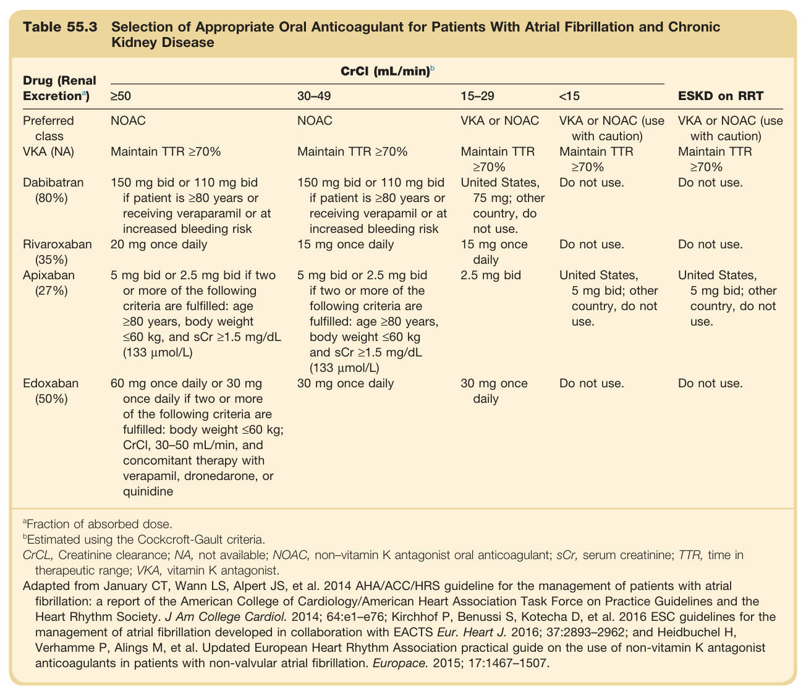

#### Table Data (CSV: [Table_55_3.csv](Table_55_3.csv))

```markdown
| Table Text (OCR) |
| :--- |
| Table 55.3 Selection of Appropriate Oral Anticoagulant for Patients With Atrial Fibrillation and Chronic Kidney Disease Drug (Renal Excretion ^{a} )  CrCl (mL/min) ^{b}   ESKD on RRT    ≥50  30-49  15-29  <15    Preferred class  NOAC  NOAC  VKA or NOAC  VKA or NOAC (use with caution)  VKA or NOAC (use with caution)    VKA (NA)  Maintain TTR ≥70%  Maintain TTR ≥70%  Maintain TTR ≥70%  Maintain TTR ≥70%  Maintain TTR ≥70%    Dabibatran (80%)  150 mg bid or 110 mg bid if patient is ≥80 years or receiving verapamil or at increased bleeding risk  150 mg bid or 110 mg bid if patient is ≥80 years or receiving verapamil or at increased bleeding risk  United States, 75 mg; other country, do not use.  Do not use.  Do not use.    Rivaroxaban (35%)  20 mg once daily  15 mg once daily  15 mg once daily  Do not use.  Do not use.    Apixaban (27%)  5 mg bid or 2.5 mg bid if two or more of the following criteria are fulfilled: age ≥80 years, body weight ≤60 kg, and sCr ≥1.5 mg/dL (133 μmol/L)  5 mg bid or 2.5 mg bid if two or more of the following criteria are fulfilled: age ≥80 years, body weight ≤60 kg and sCr ≥1.5 mg/dL (133 μmol/L)  2.5 mg bid  United States, 5 mg bid; other country, do not use.  United States, 5 mg bid; other country, do not use.    Edoxaban (50%)  60 mg once daily or 30 mg once daily if two or more of the following criteria are fulfilled: body weight ≤60 kg; CrCl, 30-50 mL/min, and concomitant therapy with verapamil, dronedarone, or quinidine  30 mg once daily  30 mg once daily  Do not use.  Do not use. <sup>a</sup>Fraction of absorbed dose. <sup>b</sup>Estimated using the Cockcroft-Gault criteria. CrCL, Creatinine clearance; NA, not available; NOAC, non–vitamin K antagonist oral anticoagulant; sCr, serum creatinine; TTR, time in therapeutic range; VKA, vitamin K antagonist. Adapted from January CT, Wann LS, Alpert JS, et al. 2014 AHA/ACC/HRS guideline for the management of patients with atria fibrillation: a report of the American College of Cardiology/American Heart Association Task Force on Practice Guidelines and the Heart Rhythm Society. J Am College Cardiol. 2014; 64:e1–e76; Kirchhof P, Benussi S, Kotecha D, et al. 2016 ESC guidelines for the management of atrial fibrillation developed in collaboration with EACTS Eur. Heart J. 2016; 37:2893–2962; and Heidbuchel H, Verhamme P, Alings M, et al. Updated European Heart Rhythm Association practical guide on the use of non-vitamin K antagonist anticoagulants in patients with non-valvular atrial fibrillation. Europace. 2015; 17:1467–1507. |
```

Table 55.3 Selection of Appropriate Oral Anticoagulant for Patients With Atrial Fibrillation and Chronic Kidney Disease | Drug (Renal Excretion) | CrCl (mL/min) | | | | ESKD on RRT | | :--- | :--- | :--- | :--- | :--- | :--- | | | **≥50** | **30-49** | **15-29** | **<15** | | | **Preferred class** | NOAC | NOAC | VKA or NOAC | VKA or NOAC (use with caution) | VKA or NOAC (use with caution) | | **VKA (NA)** | Maintain TTR ≥70% | Maintain TTR ≥70% | Maintain TTR ≥70% | Maintain TTR ≥70% | Maintain TTR ≥70% | | **Dabibatran (80%)** | 150 mg bid or 110 mg bid if patient is ≥80 years or receiving veraparamil or at increased bleeding risk | 150 mg bid or 110 mg bid if patient is ≥80 years or receiving verapamil or at increased bleeding risk | United States, 75 mg; other country, do not use. | Do not use. | Do not use. | | **Rivaroxaban (35%)** | 20 mg once daily | 15 mg once daily | 15 mg once daily | Do not use. | Do not use. | | **Apixaban (27%)** | 5 mg bid or 2.5 mg bid if two or more of the following criteria are fulfilled: age ≥80 years, body weight ≤60 kg, and sCr ≥1.5 mg/dL (133 µmol/L) | 5 mg bid or 2.5 mg bid if two or more of the following criteria are fulfilled: age ≥80 years, body weight ≤60 kg and sCr ≥1.5 mg/dL (133 µmol/L) | 2.5 mg bid | United States, 5 mg bid; other country, do not use. | United States, 5 mg bid; other country, do not use. | | **Edoxaban (50%)** | 60 mg once daily or 30 mg once daily if two or more of the following criteria are fulfilled: body weight ≤60 kg; CrCl, 30-50 mL/min, and concomitant therapy with verapamil, dronedarone, or quinidine | 30 mg once daily | 30 mg once daily | Do not use. | Do not use. | *Fraction of absorbed dose.* *Estimated using the Cockcroft-Gault criteria.* *CrCL, Creatinine clearance; NA, not available; NOAC, non-vitamin K antagonist oral anticoagulant; sCr, serum creatinine; TTR, time in therapeutic range; VKA, vitamin K antagonist.*

---
