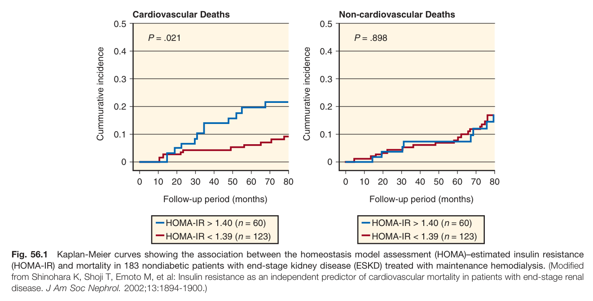
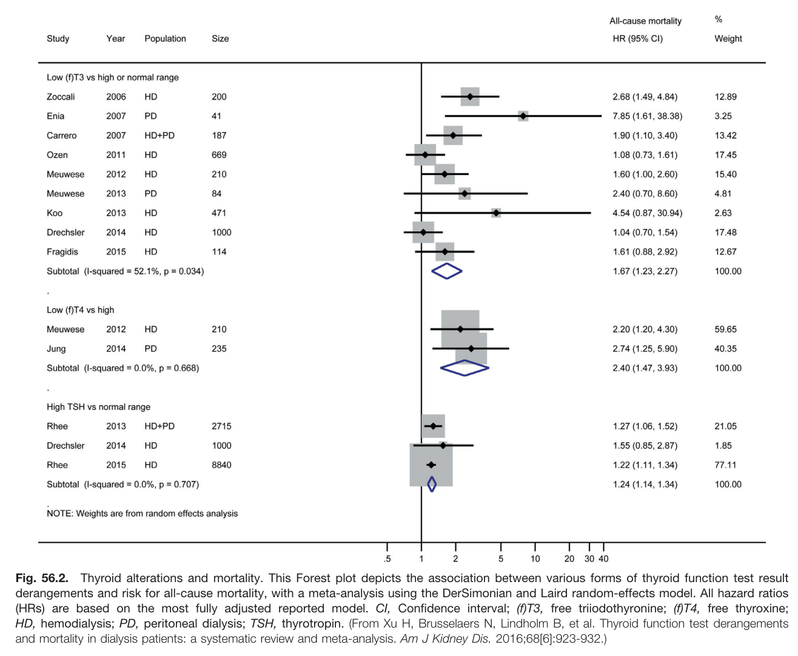
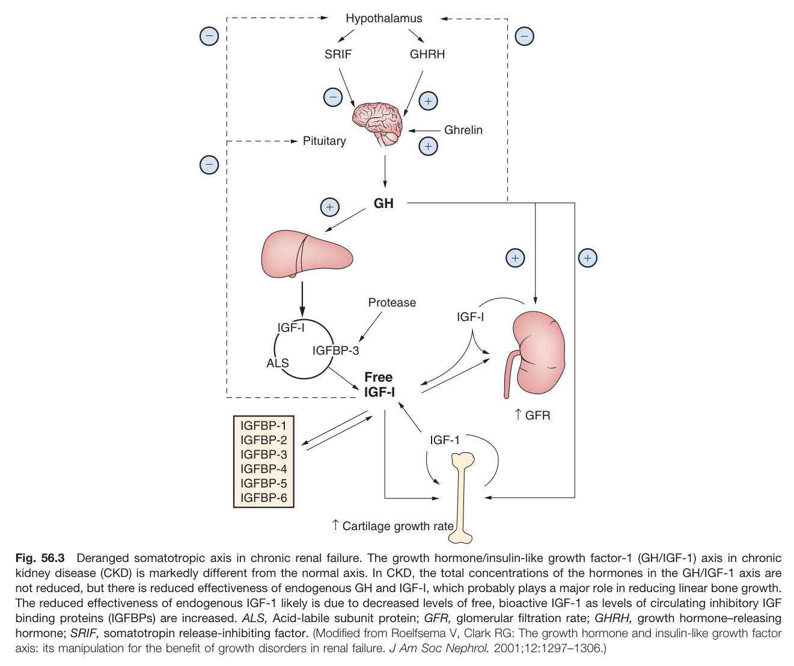
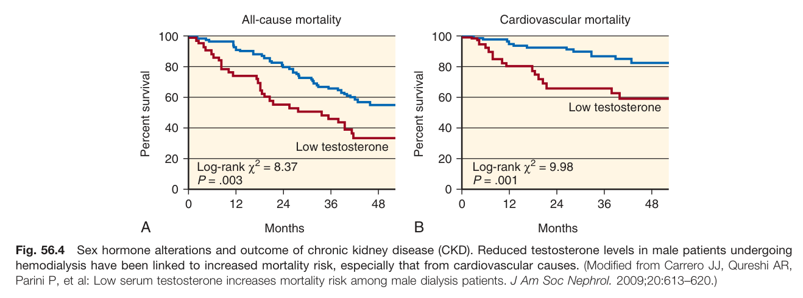
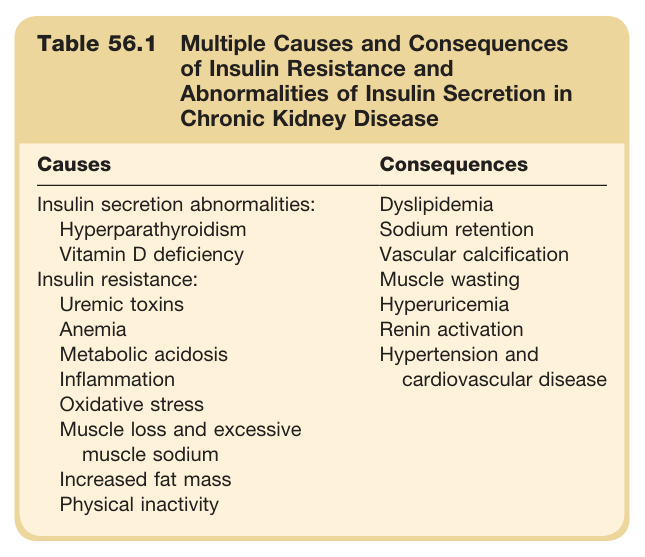
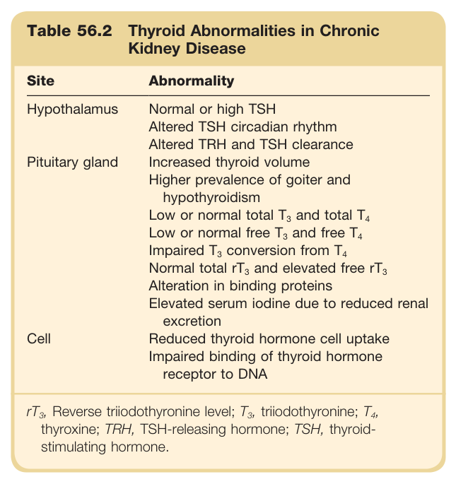
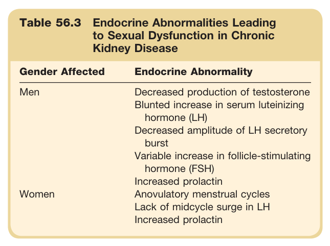

# 56. Endocrine Aspects of Chronic Kidney Disease - Figures and Tables Index

This document lists all figures and tables extracted from `56. Endocrine Aspects of Chronic Kidney Disease.pdf`.

## Table of Contents
- [Figures](#figures)
- [Tables](#tables)

---

## Figures

### Fig_56_1



Fig. 56.1 Kaplan-Meier curves showing the association between the homeostasis model assessment (HOMA)-estimated insulin resistance (HOMA-IR) and mortality in 183 nondiabetic patients with end-stage kidney disease (ESKD) treated with maintenance hemodialysis. (Modified from Shinohara K, Shoji T, Emoto M, et al: Insulin resistance as an independent predictor of cardiovascular mortality in patients with end-stage renal disease. J Am Soc Nephrol. 2002;13:1894-1900.)

---

### Fig_56_2



Fig. 56.2 Thyroid alterations and mortality. This Forest plot depicts the association between various forms of thyroid function test result derangements and risk for all-cause mortality, with a meta-analysis using the DerSimonian and Laird random-effects model. All hazard ratios (HRs) are based on the most fully adjusted reported model. Cl, Confidence interval; (f)T3, free triiodothyronine; (f)T4, free thyroxine; HD, hemodialysis; PD, peritoneal dialysis; TSH, thyrotropin. (From Xu H, Brusselaers N, Lindholm B, et al. Thyroid function test derangements and mortality in dialysis patients: a systematic review and meta-analysis. Am J Kidney Dis. 2016;68[6]:923-932.)

---

### Fig_56_3



Fig. 56.3 Deranged somatotropic axis in chronic renal failure. The growth hormone/insulin-like growth factor-1 (GH/IGF-1) axis in chronic kidney disease (CKD) is markedly different from the normal axis. In CKD, the total concentrations of the hormones in the GH/IGF-1 axis are not reduced, but there is reduced effectiveness of endogenous GH and IGF-I, which probably plays a major role in reducing linear bone growth. The reduced effectiveness of endogenous IGF-1 likely is due to decreased levels of free, bioactive IGF-1 as levels of circulating inhibitory IGF binding proteins (IGFBPs) are increased. ALS, Acid-labile subunit protein; GFR, glomerular filtration rate; GHRH, growth hormone-releasing hormone; SRIF, somatotropin release-inhibiting factor. (Modified from Roelfsema V, Clark RG: The growth hormone and insulin-like growth factor axis: its manipulation for the benefit of growth disorders in renal failure. J Am Soc Nephrol. 2001;12:1297-1306.)

---

### Fig_56_4



Fig. 56.4 Sex hormone alterations and outcome of chronic kidney disease (CKD). Reduced testosterone levels in male patients undergoing hemodialysis have been linked to increased mortality risk, especially that from cardiovascular causes. (Modified from Carrero JJ, Qureshi AR, Parini P, et al: Low serum testosterone increases mortality risk among male dialysis patients. J Am Soc Nephrol. 2009;20:613-620.)

---

## Tables

### Table_56_1

#### Table Image



#### Table Data (CSV: [Table_56_1.csv](Table_56_1.csv))

```markdown
| Table Text (OCR) |
| :--- |
| Table 56.1 Multiple Causes and Consequences of Insulin Resistance and Abnormalities of Insulin Secretion in Chronic Kidney Disease Causes  Consequences    Insulin secretion abnormalities:  Dyslipidemia    Hyperparathyroidism  Sodium retention    Vitamin D deficiency  Vascular calcification    Insulin resistance:  Muscle wasting    Uremic toxins  Hyperuricemia    Anemia  Renin activation    Metabolic acidosis  Hypertension and cardiovascular disease    Inflammation    Oxidative stress      Muscle loss and excessive muscle sodium      Increased fat mass      Physical inactivity |
```

Table 56.1 Multiple Causes and Consequences of Insulin Resistance and Abnormalities of Insulin Secretion in Chronic Kidney Disease **Causes** Insulin secretion abnormalities: Hyperparathyroidism Vitamin D deficiency Insulin resistance: Uremic toxins Anemia Metabolic acidosis Inflammation Oxidative stress Muscle loss and excessive muscle sodium Increased fat mass Physical inactivity **Consequences** Dyslipidemia Sodium retention Vascular calcification Muscle wasting Hyperuricemia Renin activation Hypertension and cardiovascular disease

---

### Table_56_2

#### Table Image



#### Table Data (CSV: [Table_56_2.csv](Table_56_2.csv))

```markdown
| Table Text (OCR) |
| :--- |
| Table 56.2 Thyroid Abnormalities in Chronic Kidney Disease Site  Abnormality    Hypothalamus  Normal or high TSH    Altered TSH circadian rhythm    Altered TRH and TSH clearance    Pituitary gland  Increased thyroid volume    Higher prevalence of goiter and hypothyroidism    Low or normal total  T_{3}  and total  T_{4}     Low or normal free  T_{3}  and free  T_{4}     Impaired  T_{3}  conversion from  T_{4}     Normal total  rT_{3}  and elevated free  rT_{3}     Alteration in binding proteins    Elevated serum iodine due to reduced renal excretion    Cell  Reduced thyroid hormone cell uptake    Impaired binding of thyroid hormone receptor to DNA rT<sub>3</sub>, Reverse triiodothyronine level; T<sub>3</sub>, triiodothyronine; T<sub>4</sub>, thyroxine; TRH, TSH-releasing hormone; TSH, thyroid- stimulating hormone. |
```

Table 56.2 Thyroid Abnormalities in Chronic Kidney Disease **Site** Hypothalamus Pituitary gland Cell **Abnormality** Normal or high TSH Altered TSH circadian rhythm Altered TRH and TSH clearance Increased thyroid volume Higher prevalence of goiter and hypothyroidism Low or normal total T3 and total T4 Low or normal free T3 and free T4 Impaired T3 conversion from T4 Normal total rT3 and elevated free rT3 Alteration in binding proteins Elevated serum iodine due to reduced renal excretion Reduced thyroid hormone cell uptake Impaired binding of thyroid hormone receptor to DNA rT3, Reverse triiodothyronine level; T3, triiodothyronine; T4, thyroxine; TRH, TSH-releasing hormone; TSH, thyroid-stimulating hormone.

---

### Table_56_3

#### Table Image



#### Table Data (CSV: [Table_56_3.csv](Table_56_3.csv))

```markdown
| Table Text (OCR) |
| :--- |
| Table 56.3 Endocrine Abnormalities Leading to Sexual Dysfunction in Chronic Kidney Disease Gender Affected  Endocrine Abnormality    Men  Decreased production of testosteroneBlunted increase in serum luteinizing hormone (LH)Decreased amplitude of LH secretory burstVariable increase in follicle-stimulating hormone (FSH)Increased prolactin    Women  Anovulatory menstrual cyclesLack of midcycle surge in LHIncreased prolactin |
```

Table 56.3 Endocrine Abnormalities Leading to Sexual Dysfunction in Chronic Kidney Disease **Gender Affected** Men Women **Endocrine Abnormality** Decreased production of testosterone Blunted increase in serum luteinizing hormone (LH) Decreased amplitude of LH secretory burst Variable increase in follicle-stimulating hormone (FSH) Increased prolactin Anovulatory menstrual cycles Lack of midcycle surge in LH Increased prolactin

---
