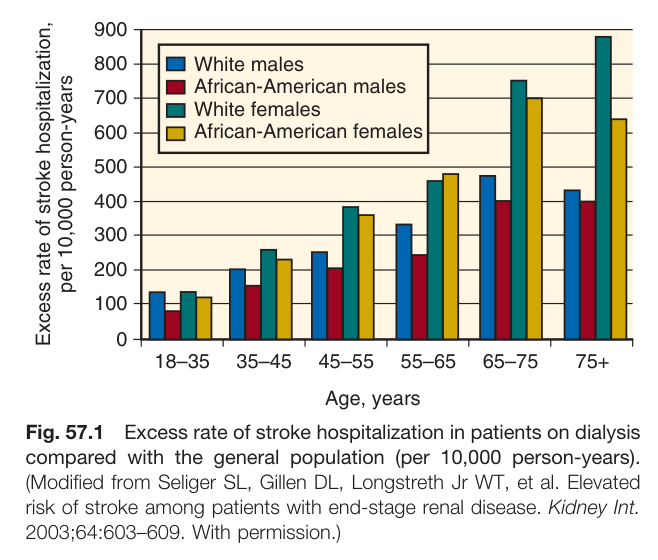
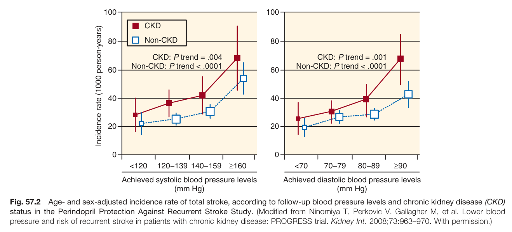
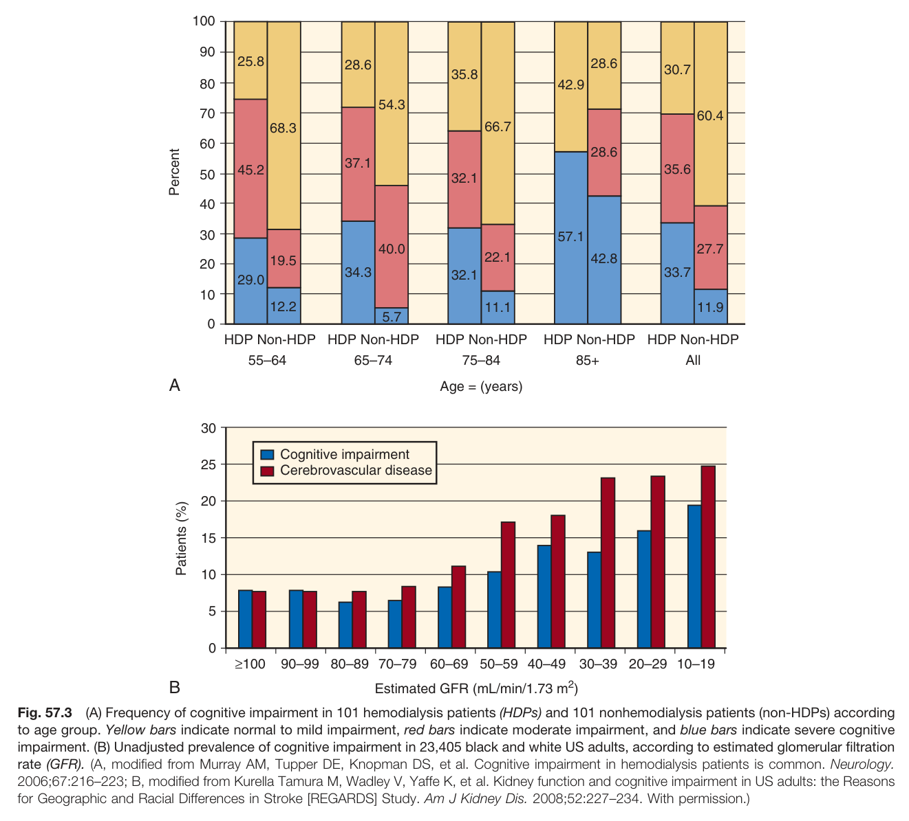
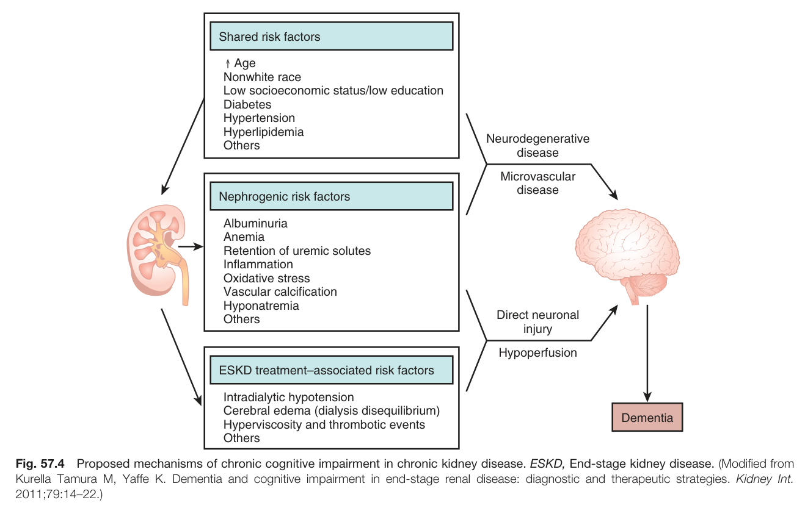
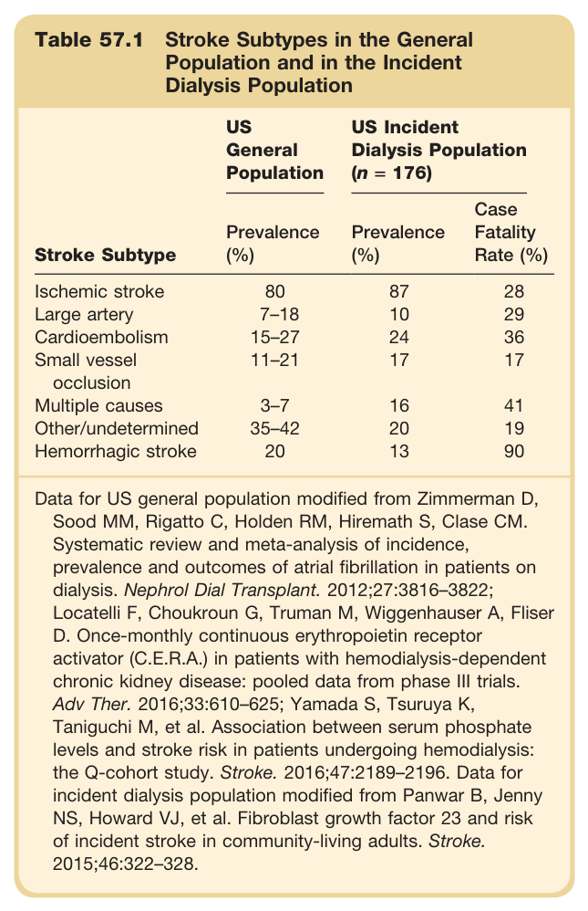
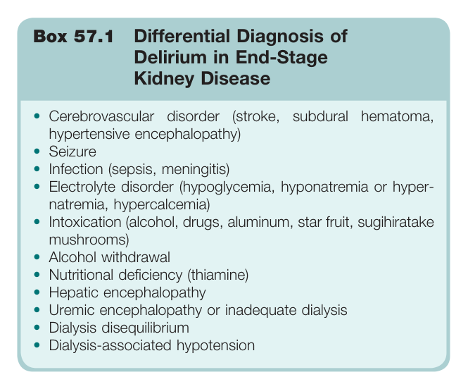
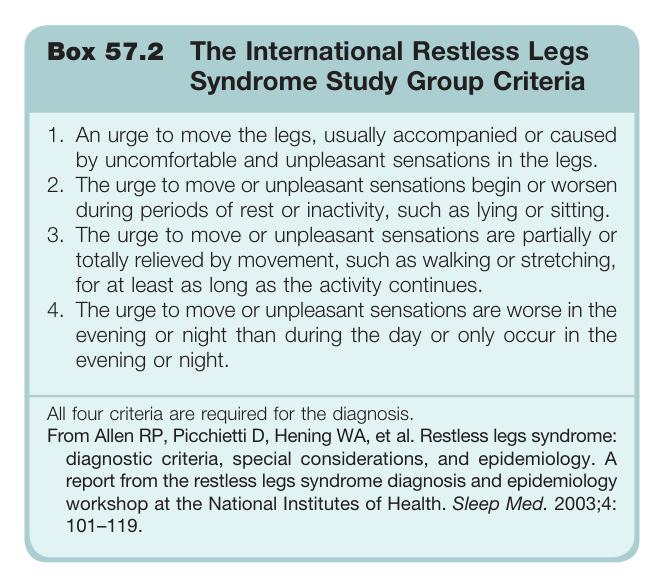

# 57. Neurologic Aspects of Kidney Disease - Figures and Tables Index

This document lists all figures, tables and boxes extracted from `57. Neurologic Aspects of Kidney Disease.pdf`.

## Table of Contents
- [Figures](#figures)
- [Tables](#tables)
- [Boxes](#boxes)

---

## Figures

### Fig_57_1



Fig. 57.1 Excess rate of stroke hospitalization in patients on dialysis compared with the general population (per 10,000 person-years). (Modified from Seliger SL, Gillen DL, Longstreth Jr WT, et al. Elevated risk of stroke among patients with end-stage renal disease. Kidney Int. 2003;64:603-609. With permission.)

---

### Fig_57_2



Fig. 57.2 Age- and sex-adjusted incidence rate of total stroke, according to follow-up blood pressure levels and chronic kidney disease (CKD) status in the Perindopril Protection Against Recurrent Stroke Study. (Modified from Ninomiya T, Perkovic V, Gallagher M, et al. Lower blood pressure and risk of recurrent stroke in patients with chronic kidney disease: PROGRESS trial. Kidney Int. 2008;73:963-970. With permission.)

---

### Fig_57_3



Fig. 57.3 (A) Frequency of cognitive impairment in 101 hemodialysis patients (HDPs) and 101 nonhemodialysis patients (non-HDPs) according to age group. Yellow bars indicate normal to mild impairment, red bars indicate moderate impairment, and blue bars indicate severe cognitive impairment. (B) Unadjusted prevalence of cognitive impairment in 23,405 black and white US adults, according to estimated glomerular filtration rate (GFR). (A, modified from Murray AM, Tupper DE, Knopman DS, et al. Cognitive impairment in hemodialysis patients is common. Neurology. 2006;67:216-223; B, modified from Kurella Tamura M, Wadley V, Yaffe K, et al. Kidney function and cognitive impairment in US adults: the Reasons for Geographic and Racial Differences in Stroke [REGARDS] Study. Am J Kidney Dis. 2008;52:227-234. With permission.)

---

### Fig_57_4



Fig. 57.4 Proposed mechanisms of chronic cognitive impairment in chronic kidney disease. ESKD, End-stage kidney disease. (Modified from Kurella Tamura M, Yaffe K. Dementia and cognitive impairment in end-stage renal disease: diagnostic and therapeutic strategies. Kidney Int. 2011;79:14-22.)

---

## Tables

### Table_57_1

#### Table Image



#### Table Data (CSV: [Table_57_1.csv](Table_57_1.csv))

```markdown
| Table Text (OCR) |
| :--- |
| Table 57.1 Stroke Subtypes in the General Population and in the Incident Dialysis Population Stroke Subtype  US General Population  US Incident Dialysis Population (n = 176)    Prevalence (%)  Prevalence (%)  Case Fatality Rate (%)    Ischemic stroke  80  87  28    Large artery  7–18  10  29    Cardioembolism  15–27  24  36    Small vessel occlusion  11–21  17  17    Multiple causes  3–7  16  41    Other/undetermined  35–42  20  19    Hemorrhagic stroke  20  13  90 |
```

Table 57.1 Stroke Subtypes in the General Population and in the Incident Dialysis Population | Stroke Subtype | US General Population Prevalence (%) | US Incident Dialysis Population (n = 176) Prevalence (%) | Case Fatality Rate (%) | | :--- | :--- | :--- | :--- | | **Ischemic stroke** | 80 | 87 | 28 | | Large artery | 7-18 | 10 | 29 | | Cardioembolism | 15-27 | 24 | 36 | | Small vessel occlusion | 11-21 | 17 | 17 | | Multiple causes | 3-7 | 16 | 41 | | Other/undetermined | 35-42 | 20 | 19 | | **Hemorrhagic stroke** | 20 | 13 | 90 | Data for US general population modified from Zimmerman D, Sood MM, Rigatto C, Holden RM, Hiremath S, Clase CM. Systematic review and meta-analysis of incidence, prevalence and outcomes of atrial fibrillation in patients on dialysis. Nephrol Dial Transplant. 2012;27:3816-3822; Locatelli F, Choukroun G, Truman M, Wiggenhauser A, Fliser D. Once-monthly continuous erythropoietin receptor activator (C.E.R.A.) in patients with hemodialysis-dependent chronic kidney disease: pooled data from phase III trials. Adv Ther. 2016;33:610-625; Yamada S, Tsuruya K, Taniguchi M, et al. Association between serum phosphate levels and stroke risk in patients undergoing hemodialysis: the Q-cohort study. Stroke. 2016;47:2189-2196. Data for incident dialysis population modified from Panwar B, Jenny NS, Howard VJ, et al. Fibroblast growth factor 23 and risk of incident stroke in community-living adults. Stroke. 2015;46:322-328.

---

## Boxes

### Box_57_1



#### Box Text

```markdown
Box 57.1 Differential Diagnosis of Delirium in End-Stage Kidney Disease • Cerebrovascular disorder (stroke, subdural hematoma, hypertensive encephalopathy) • Seizure • Infection (sepsis, meningitis) • Electrolyte disorder (hypoglycemia, hyponatremia or hyper- natremia, hypercalcemia) • Intoxication (alcohol, drugs, aluminum, star fruit, sugihiratake mushrooms) • Alcohol withdrawal • Nutritional deficiency (thiamine) • Hepatic encephalopathy • Uremic encephalopathy or inadequate dialysis • Dialysis disequilibrium • Dialysis-associated hypotension
```

Box 57.1 Differential Diagnosis of Delirium in End-Stage Kidney Disease * Cerebrovascular disorder (stroke, subdural hematoma, hypertensive encephalopathy) * Seizure * Infection (sepsis, meningitis) * Electrolyte disorder (hypoglycemia, hyponatremia or hypernatremia, hypercalcemia) * Intoxication (alcohol, drugs, aluminum, star fruit, sugihiratake mushrooms) * Alcohol withdrawal * Nutritional deficiency (thiamine) * Hepatic encephalopathy * Uremic encephalopathy or inadequate dialysis * Dialysis disequilibrium * Dialysis-associated hypotension

---

### Box_57_2



#### Box Text

```markdown
Box 57.2 The International Restless Legs Syndrome Study Group Criteria 1. An urge to move the legs, usually accompanied or caused by uncomfortable and unpleasant sensations in the legs. 2. The urge to move or unpleasant sensations begin or worsen during periods of rest or inactivity, such as lying or sitting. 3. The urge to move or unpleasant sensations are partially or totally relieved by movement, such as walking or stretching, for at least as long as the activity continues. 4. The urge to move or unpleasant sensations are worse in the evening or night than during the day or only occur in the evening or night. All four criteria are required for the diagnosis. From Allen RP, Picchietti D, Hening WA, et al. Restless legs syndrome: diagnostic criteria, special considerations, and epidemiology. A report from the restless legs syndrome diagnosis and epidemiology workshop at the National Institutes of Health. Sleep Med. 2003;4: 101–119.
```

Box 57.2 The International Restless Legs Syndrome Study Group Criteria 1. An urge to move the legs, usually accompanied or caused by uncomfortable and unpleasant sensations in the legs. 2. The urge to move or unpleasant sensations begin or worsen during periods of rest or inactivity, such as lying or sitting. 3. The urge to move or unpleasant sensations are partially or totally relieved by movement, such as walking or stretching, for at least as long as the activity continues. 4. The urge to move or unpleasant sensations are worse in the evening or night than during the day or only occur in the evening or night. All four criteria are required for the diagnosis. From Allen RP, Picchietti D, Hening WA, et al. Restless legs syndrome: diagnostic criteria, special considerations, and epidemiology. A report from the restless legs syndrome diagnosis and epidemiology workshop at the National Institutes of Health. Sleep Med. 2003;4: 101-119.

---
