# 58. Dermatologic Conditions in Kidney Disease - Figures and Tables Index

This document lists all figures, tables and boxes extracted from `58. Dermatologic Conditions in Kidney Disease.pdf`.

## Table of Contents
- [Figures](#figures)
- [Tables](#tables)
- [Boxes](#boxes)

---

## Figures

### Fig_58_1

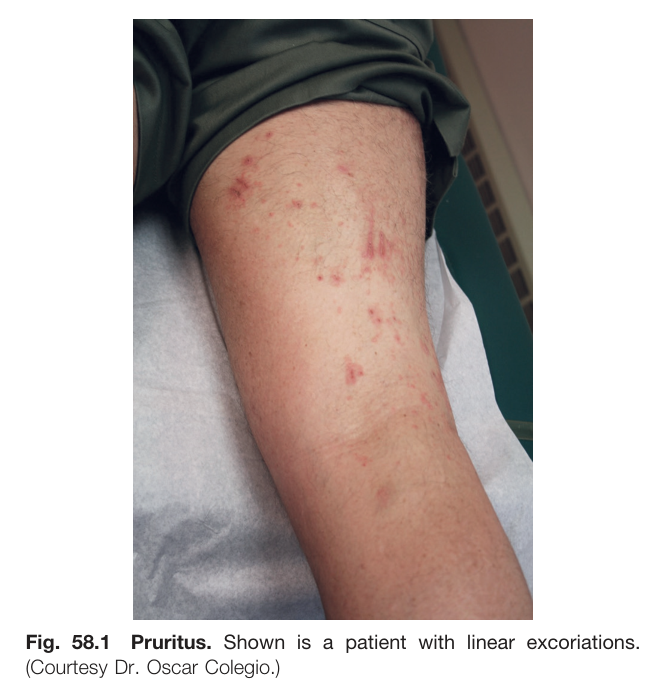

Fig. 58.1 Pruritus. Shown is a patient with linear excoriations. (Courtesy Dr. Oscar Colegio.)

---

### Fig_58_2

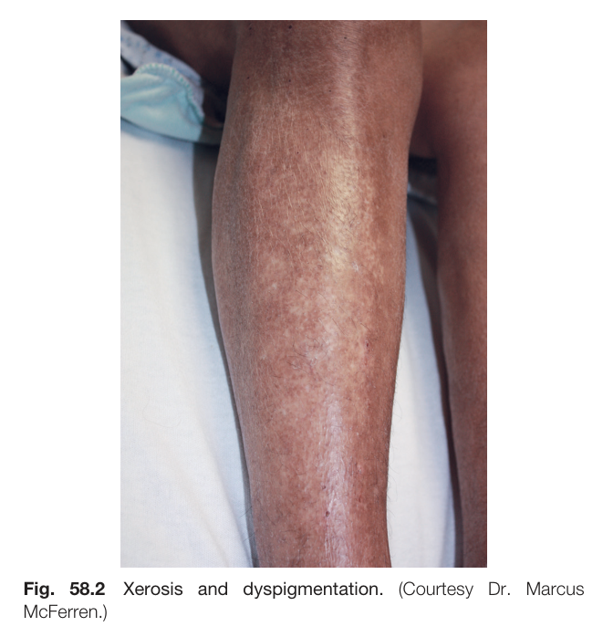

Fig. 58.2 Xerosis and dyspigmentation. (Courtesy Dr. Marcus McFerren.)

---

### Fig_58_3

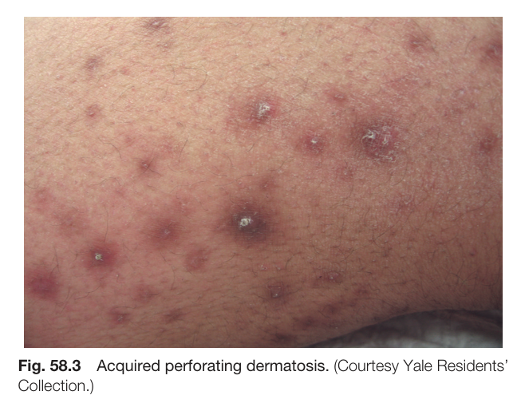

Fig. 58.3 Acquired perforating dermatosis. (Courtesy Yale Residents' Collection.)

---

### Fig_58_4

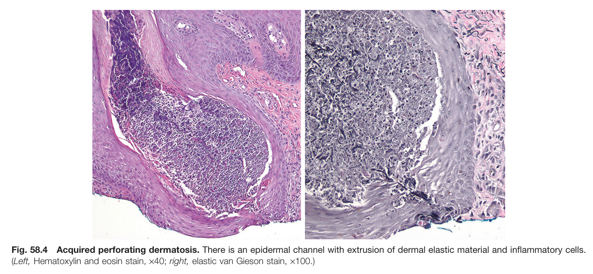

Fig. 58.4 Acquired perforating dermatosis. There is an epidermal channel with extrusion of dermal elastic material and inflammatory cells. (Left, Hematoxylin and eosin stain, x40; right, elastic van Gieson stain, x100.)

---

### Fig_58_5

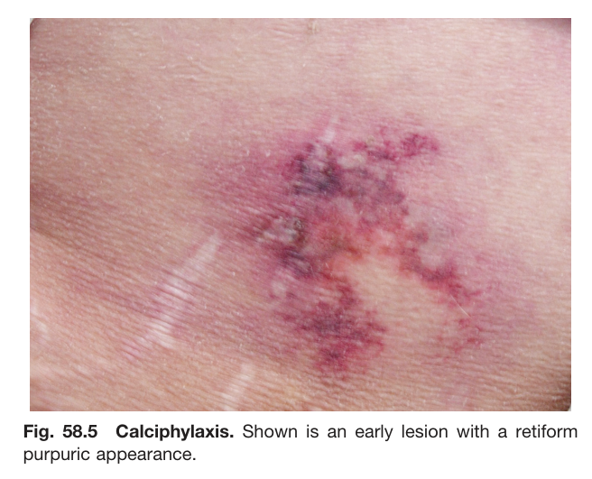

Fig. 58.5 Calciphylaxis. Shown is an early lesion with a retiform purpuric appearance.

---

### Fig_58_6

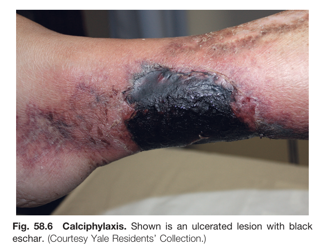

Fig. 58.6 Calciphylaxis. Shown is an ulcerated lesion with black eschar. (Courtesy Yale Residents' Collection.)

---

### Fig_58_7

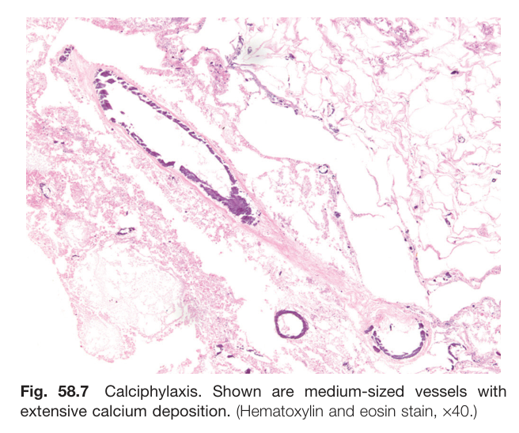

Fig. 58.7 Calciphylaxis. Shown are medium-sized vessels with extensive calcium deposition. (Hematoxylin and eosin stain, x40.)

---

### Fig_58_8

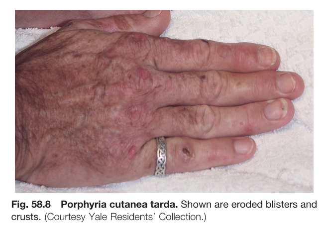

Fig. 58.8 Porphyria cutanea tarda. Shown are eroded blisters and crusts. (Courtesy Yale Residents' Collection.)

---

### Fig_58_9

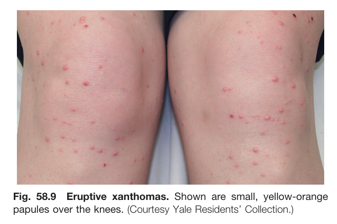

Fig. 58.9 Eruptive xanthomas. Shown are small, yellow-orange papules over the knees. (Courtesy Yale Residents' Collection.)

---

### Fig_58_10

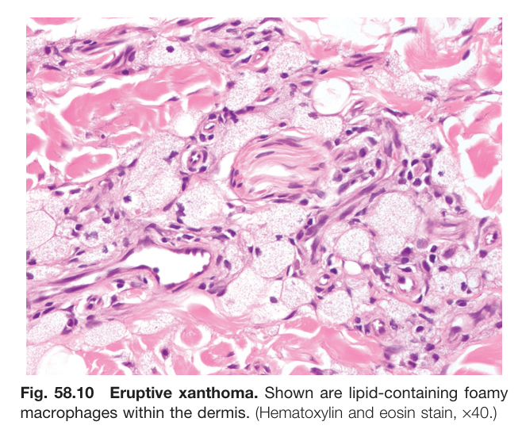

Fig. 58.10 Eruptive xanthoma. Shown are lipid-containing foamy macrophages within the dermis. (Hematoxylin and eosin stain, x40.)

---

### Fig_58_11

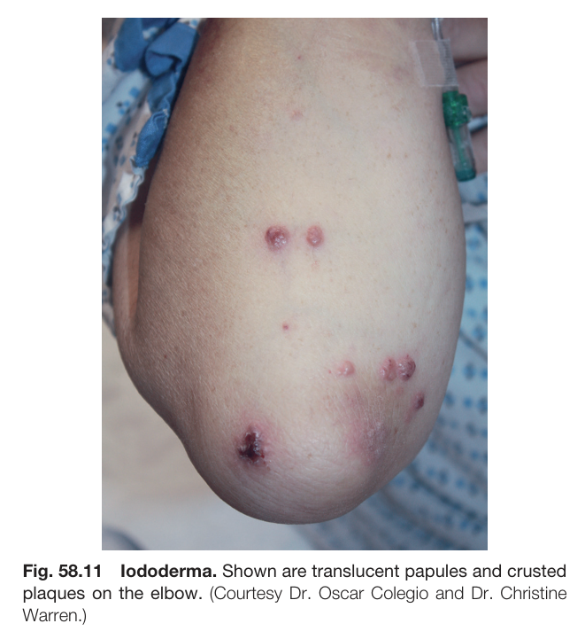

Fig. 58.11 Iododerma. Shown are translucent papules and crusted plaques on the elbow. (Courtesy Dr. Oscar Colegio and Dr. Christine Warren.)

---

### Fig_58_12

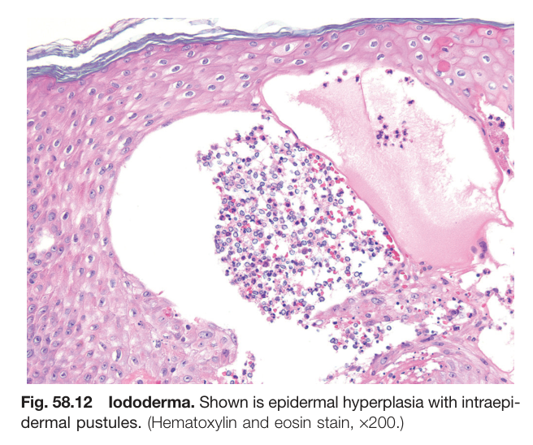

Fig. 58.12 Iododerma. Shown is epidermal hyperplasia with intraepidermal pustules. (Hematoxylin and eosin stain, x200.)

---

### Fig_58_13

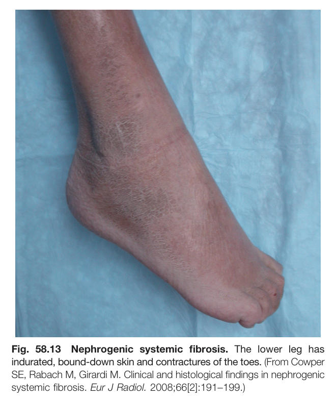

Fig. 58.13 Nephrogenic systemic fibrosis. The lower leg has indurated, bound-down skin and contractures of the toes. (From Cowper SE, Rabach M, Girardi M. Clinical and histological findings in nephrogenic systemic fibrosis. Eur J Radiol. 2008;66[2]:191–199.)

---

### Fig_58_14

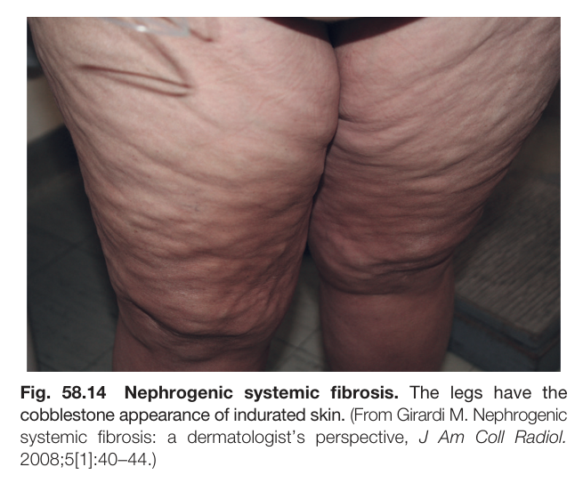

Fig. 58.14 Nephrogenic systemic fibrosis. The legs have the cobblestone appearance of indurated skin. (From Girardi M. Nephrogenic systemic fibrosis: a dermatologist's perspective, J Am Coll Radiol. 2008;5[1]:40-44.)

---

### Fig_58_15

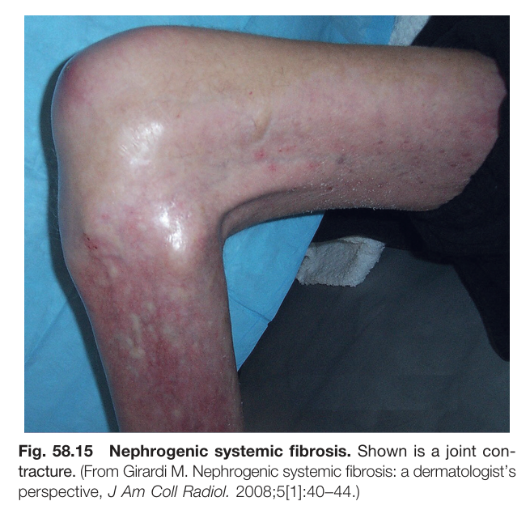

Fig. 58.15 Nephrogenic systemic fibrosis. Shown is a joint contracture. (From Girardi M. Nephrogenic systemic fibrosis: a dermatologist's perspective, J Am Coll Radiol. 2008;5[1]:40-44.)

---

### Fig_58_16

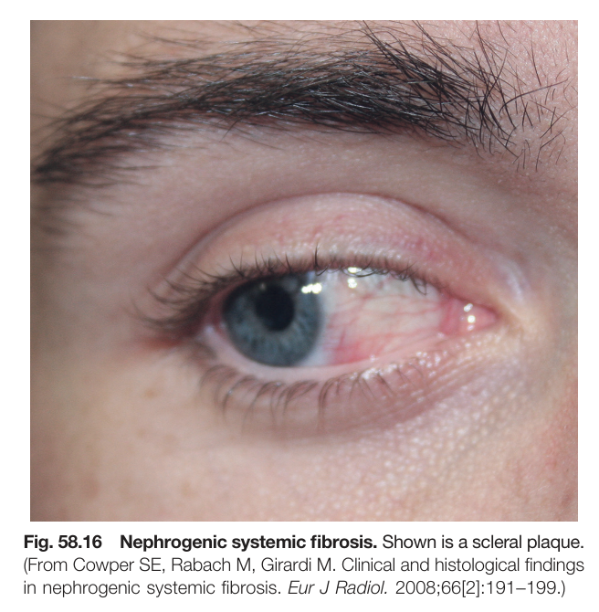

Fig. 58.16 Nephrogenic systemic fibrosis. Shown is a scleral plaque. (From Cowper SE, Rabach M, Girardi M. Clinical and histological findings in nephrogenic systemic fibrosis. Eur J Radiol. 2008;66[2]:191-199.)

---

### Fig_58_17

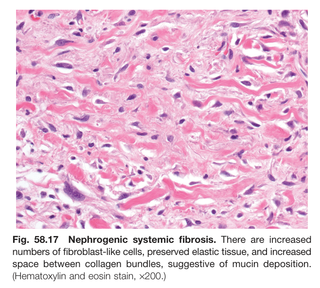

Fig. 58.17 Nephrogenic systemic fibrosis. There are increased numbers of fibroblast-like cells, preserved elastic tissue, and increased space between collagen bundles, suggestive of mucin deposition. (Hematoxylin and eosin stain, x200.)

---

### Fig_58_18

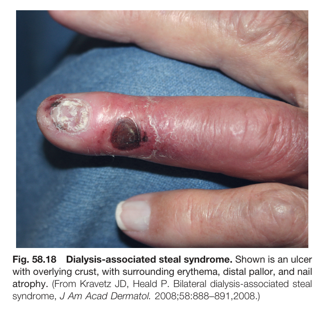

Fig. 58.18 Dialysis-associated steal syndrome. Shown is an ulcer with overlying crust, with surrounding erythema, distal pallor, and nail atrophy. (From Kravetz JD, Heald P. Bilateral dialysis-associated steal syndrome, J Am Acad Dermatol. 2008;58:888-891,2008.)

---

### Fig_58_19

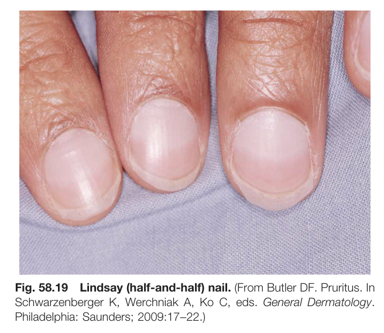

Fig. 58.19 Lindsay (half-and-half) nail. (From Butler DF. Pruritus. In Schwarzenberger K, Werchniak A, Ko C, eds. General Dermatology. Philadelphia: Saunders; 2009:17-22.)

---

### Fig_58_20

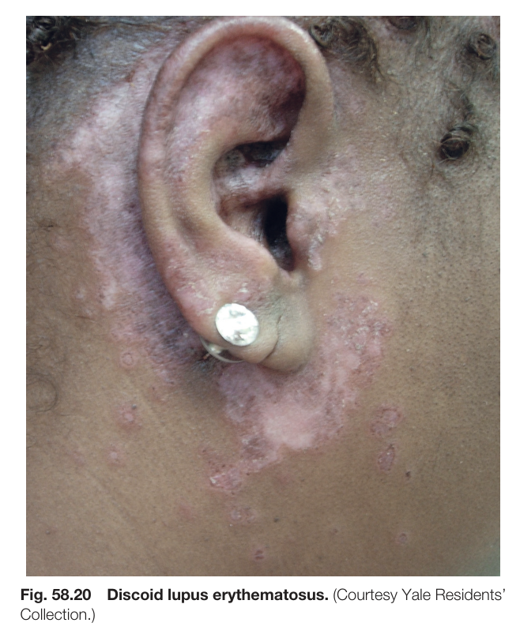

Fig. 58.20 Discoid lupus erythematosus. (Courtesy Yale Residents' Collection.)

---

### Fig_58_21

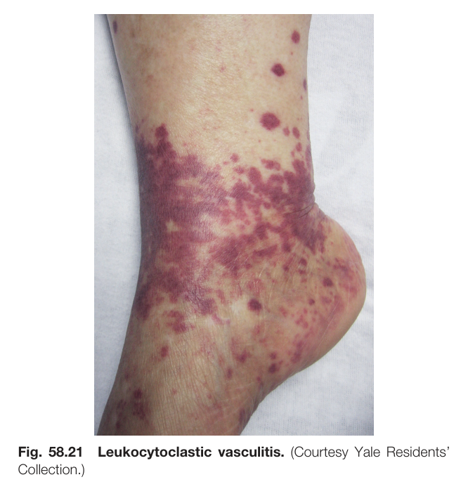

Fig. 58.21 Leukocytoclastic vasculitis. (Courtesy Yale Residents' Collection.)

---

### Fig_58_22

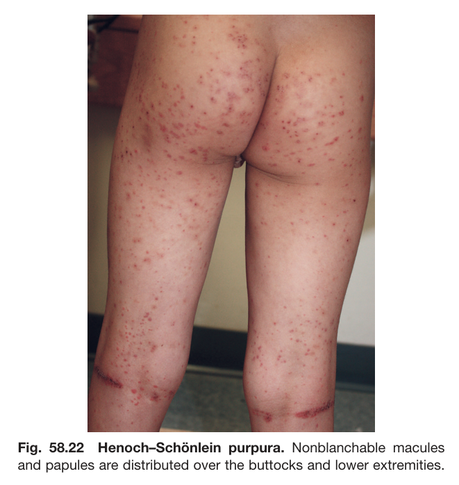

Fig. 58.22 Henoch-Schönlein purpura. Nonblanchable macules and papules are distributed over the buttocks and lower extremities.

---

### Fig_58_23

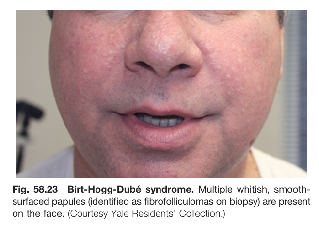

Fig. 58.23 Birt-Hogg-Dubé syndrome. Multiple whitish, smooth-surfaced papules (identified as fibrofolliculomas on biopsy) are present on the face. (Courtesy Yale Residents' Collection.)

---

### Fig_58_24

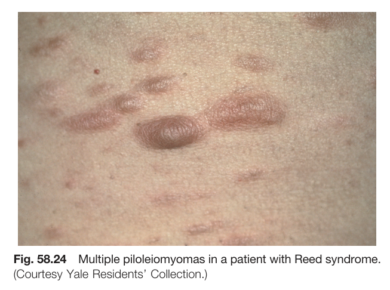

Fig. 58.24 Multiple piloleiomyomas in a patient with Reed syndrome. (Courtesy Yale Residents' Collection.)

---

## Tables

### Table_58_1

#### Table Image

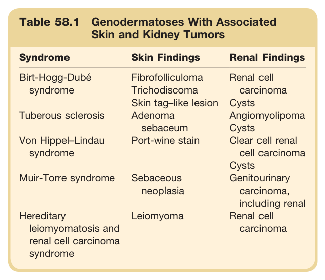

#### Table Data (CSV: [Table_58_1.csv](Table_58_1.csv))

```markdown
| Table Text (OCR) |
| :--- |
| Table 58.1 Genodermatoses With Associated Skin and Kidney Tumors Syndrome  Skin Findings  Renal Findings    Birt-Hogg-Dubé syndrome  Fibrofolliculoma  Renal cell carcinoma    Trichodiscoma    Skin tag-like lesion  Cysts    Tuberous sclerosis  Adenoma  Angiomyolipoma    sebaceum  Cysts    Von Hippel-Lindau syndrome  Port-wine stain  Clear cell renal cell carcinoma      Cysts    Muir-Torre syndrome  Sebaceous neoplasia  Genitourinary carcinoma, including renal    Hereditary leiomyomatosis and renal cell carcinoma syndrome  Leiomyoma  Renal cell carcinoma |
```

Table 58.1 Genodermatoses With Associated Skin and Kidney Tumors | Syndrome | Skin Findings | Renal Findings | | :--- | :--- | :--- | | Birt-Hogg-Dubé syndrome | Fibrofolliculoma, Trichodiscoma, Skin tag-like lesion | Renal cell carcinoma, Cysts | | Tuberous sclerosis | Adenoma sebaceum | Angiomyolipoma, Cysts | | Von Hippel-Lindau syndrome | Port-wine stain | Clear cell renal cell carcinoma, Cysts | | Muir-Torre syndrome | Sebaceous neoplasia | Genitourinary carcinoma, including renal | | Hereditary leiomyomatosis and renal cell carcinoma syndrome | Leiomyoma | Renal cell carcinoma |

---

## Boxes

### Box_58_1

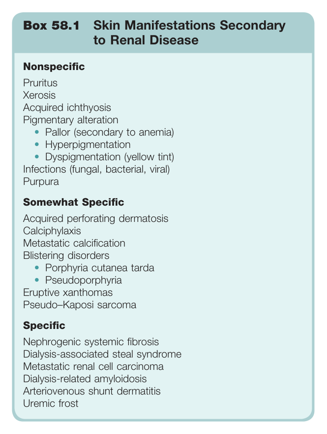

#### Box Text

```markdown
Box 58.1 Skin Manifestations Secondary to Renal Disease **Nonspecific** * Pruritus * Xerosis * Acquired ichthyosis * Pigmentary alteration * Pallor (secondary to anemia) * Hyperpigmentation * Dyspigmentation (yellow tint) * Infections (fungal, bacterial, viral) * Purpura **Somewhat Specific** * Acquired perforating dermatosis * Calciphylaxis * Metastatic calcification * Blistering disorders * Porphyria cutanea tarda * Pseudoporphyria * Eruptive xanthomas * Pseudo-Kaposi sarcoma **Specific** * Nephrogenic systemic fibrosis * Dialysis-associated steal syndrome * Metastatic renal cell carcinoma * Dialysis-related amyloidosis * Arteriovenous shunt dermatitis * Uremic frost
```

Box 58.1 Skin Manifestations Secondary to Renal Disease **Nonspecific** * Pruritus * Xerosis * Acquired ichthyosis * Pigmentary alteration * Pallor (secondary to anemia) * Hyperpigmentation * Dyspigmentation (yellow tint) * Infections (fungal, bacterial, viral) * Purpura **Somewhat Specific** * Acquired perforating dermatosis * Calciphylaxis * Metastatic calcification * Blistering disorders * Porphyria cutanea tarda * Pseudoporphyria * Eruptive xanthomas * Pseudo-Kaposi sarcoma **Specific** * Nephrogenic systemic fibrosis * Dialysis-associated steal syndrome * Metastatic renal cell carcinoma * Dialysis-related amyloidosis * Arteriovenous shunt dermatitis * Uremic frost

---

### Box_58_2

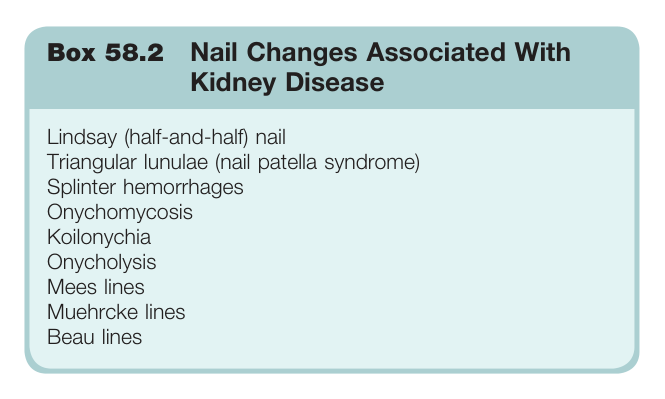

#### Box Text

```markdown
Box 58.2 Nail Changes Associated With Kidney Disease * Lindsay (half-and-half) nail * Triangular lunulae (nail patella syndrome) * Splinter hemorrhages * Onychomycosis * Koilonychia * Onycholysis * Mees lines * Muehrcke lines * Beau lines
```

Box 58.2 Nail Changes Associated With Kidney Disease * Lindsay (half-and-half) nail * Triangular lunulae (nail patella syndrome) * Splinter hemorrhages * Onychomycosis * Koilonychia * Onycholysis * Mees lines * Muehrcke lines * Beau lines

---

### Box_58_3

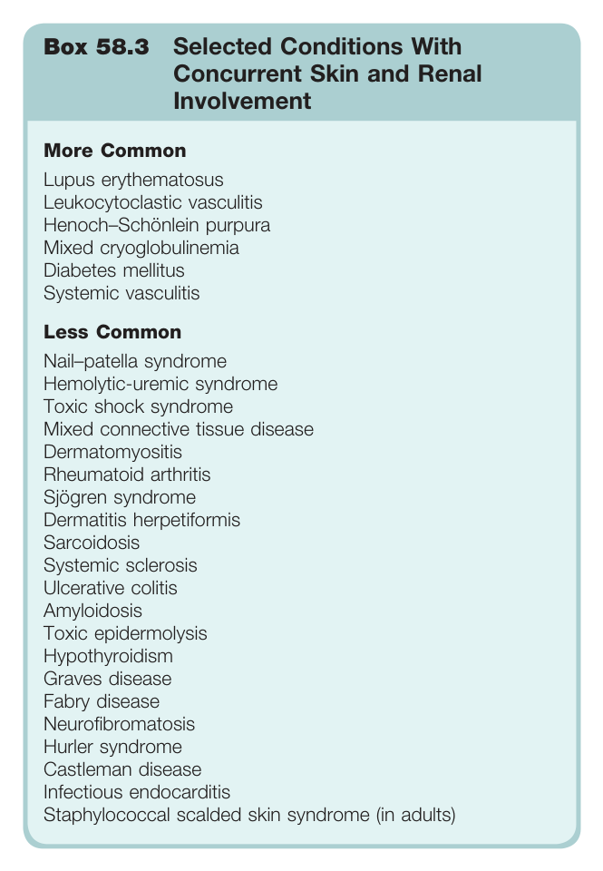

#### Box Text

```markdown
Box 58.3 Selected Conditions With Concurrent Skin and Renal Involvement **More Common** * Lupus erythematosus * Leukocytoclastic vasculitis * Henoch-Schönlein purpura * Mixed cryoglobulinemia * Diabetes mellitus * Systemic vasculitis **Less Common** * Nail-patella syndrome * Hemolytic-uremic syndrome * Toxic shock syndrome * Mixed connective tissue disease * Dermatomyositis * Rheumatoid arthritis * Sjögren syndrome * Dermatitis herpetiformis * Sarcoidosis * Systemic sclerosis * Ulcerative colitis * Amyloidosis * Toxic epidermolysis * Hypothyroidism * Graves disease * Fabry disease * Neurofibromatosis * Hurler syndrome * Castleman disease * Infectious endocarditis * Staphylococcal scalded skin syndrome (in adults)
```

Box 58.3 Selected Conditions With Concurrent Skin and Renal Involvement **More Common** * Lupus erythematosus * Leukocytoclastic vasculitis * Henoch-Schönlein purpura * Mixed cryoglobulinemia * Diabetes mellitus * Systemic vasculitis **Less Common** * Nail-patella syndrome * Hemolytic-uremic syndrome * Toxic shock syndrome * Mixed connective tissue disease * Dermatomyositis * Rheumatoid arthritis * Sjögren syndrome * Dermatitis herpetiformis * Sarcoidosis * Systemic sclerosis * Ulcerative colitis * Amyloidosis * Toxic epidermolysis * Hypothyroidism * Graves disease * Fabry disease * Neurofibromatosis * Hurler syndrome * Castleman disease * Infectious endocarditis * Staphylococcal scalded skin syndrome (in adults)

---

### Box_58_4

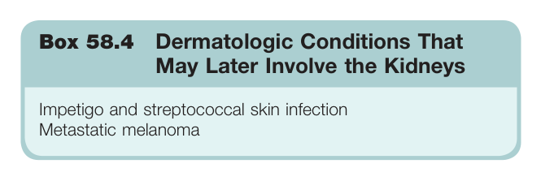

#### Box Text

```markdown
Box 58.4 Dermatologic Conditions That May Later Involve the Kidneys 76. Shimizu S, Yasui C, Yasukawa K, et al. Subcutaneous nodules on the buttocks as a manifestation of dialysis-related amyloidosis: a clinicopathological entity? Br J Dermatol. 2003;149:400–404. Impetigo and streptococcal skin infection Metastatic melanoma 78. Goh CL, Phay KL. Arterio-venous shunt dermatitis in chronic renal failure patients on maintenance haemodialysis. Clin Exp Dermatol. 1988;13:379–381. 79. Bagavant H, Fu SM. Pathogenesis of kidney disease in systemic lupus erythematosus. Curr Opin Rheumatol. 2009;21(5):489–494.
```

Box 58.4 Dermatologic Conditions That May Later Involve the Kidneys * Impetigo and streptococcal skin infection * Metastatic melanoma

---
