# 59. Classification and Management of Chronic Kidney Disease - Figures and Tables Index

This document lists all figures and tables extracted from `59. Classification and Management of Chronic Kidney Disease.pdf`.

## Table of Contents
- [Figures](#figures)
- [Tables](#tables)

---

## Figures

### Fig_59_1

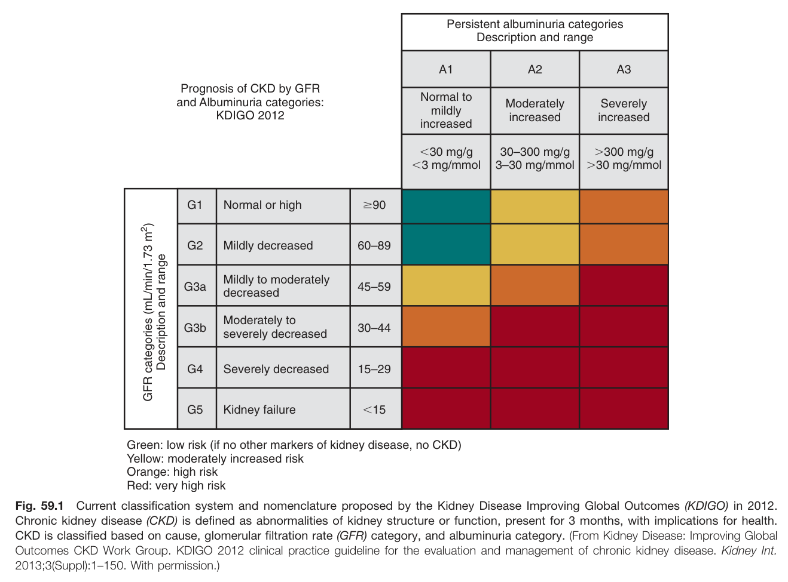

Fig. 59.1 Current classification system and nomenclature proposed by the Kidney Disease Improving Global Outcomes (KDIGO) in 2012. Chronic kidney disease (CKD) is defined as abnormalities of kidney structure or function, present for 3 months, with implications for health. CKD is classified based on cause, glomerular filtration rate (GFR) category, and albuminuria category. (From Kidney Disease: Improving Global Outcomes CKD Work Group. KDIGO 2012 clinical practice guideline for the evaluation and management of chronic kidney disease. Kidney Int. 2013;3(Suppl):1-150. With permission.) **Prognosis of CKD by GFR and Albuminuria categories: KDIGO 2012** | GFR categories (mL/min/1.73 m²) | Description and range | ≥90 | 60-89 | 45-59 | 30-44 | 15-29 | <15 | | :--- | :--- | :--- | :--- | :--- | :--- | :--- | :--- | | **G1** | Normal or high | | | | | | | | **G2** | Mildly decreased | | | | | | | | **G3a** | Mildly to moderately decreased | | | | | | | | **G3b** | Moderately to severely decreased | | | | | | | | **G4** | Severely decreased | | | | | | | | **G5** | Kidney failure | | | | | | | | Persistent albuminuria categories | Description and range | | :--- | :--- | | **A1** | Normal to mildly increased (<30 mg/g, <3 mg/mmol) | | **A2** | Moderately increased (30-300 mg/g, 3-30 mg/mmol) | | **A3** | Severely increased (>300 mg/g, >30 mg/mmol) | Green: low risk (if no other markers of kidney disease, no CKD) Yellow: moderately increased risk Orange: high risk Red: very high risk

---

### Fig_59_2

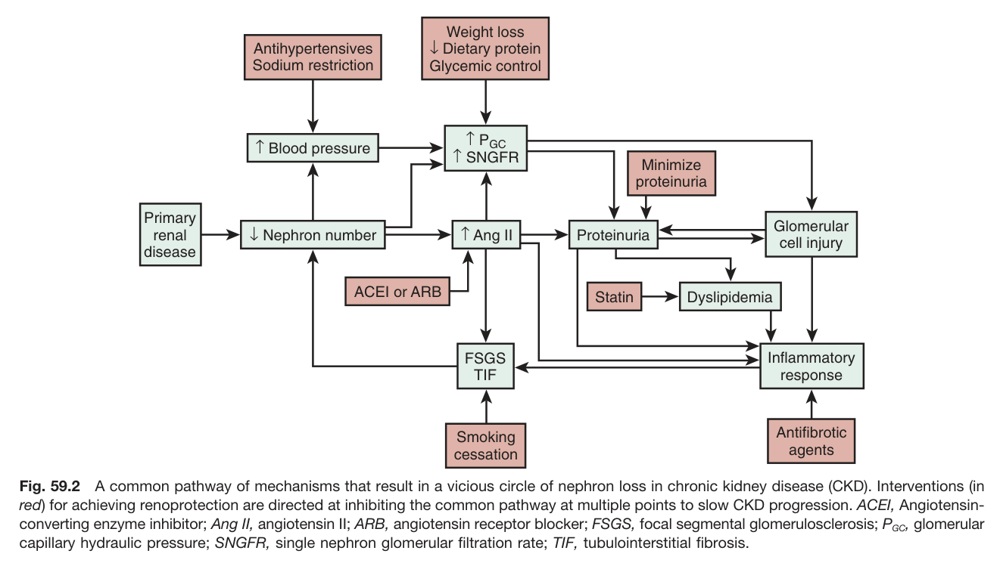

Fig. 59.2 A common pathway of mechanisms that result in a vicious circle of nephron loss in chronic kidney disease (CKD). Interventions (in red) for achieving renoprotection are directed at inhibiting the common pathway at multiple points to slow CKD progression. ACEI, Angiotensin-converting enzyme inhibitor; Ang II, angiotensin II; ARB, angiotensin receptor blocker; FSGS, focal segmental glomerulosclerosis; PGC, glomerular capillary hydraulic pressure; SNGFR, single nephron glomerular filtration rate; TIF, tubulointerstitial fibrosis.

---

### Fig_59_3

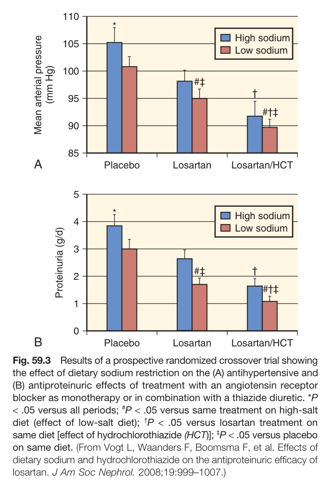

Fig. 59.3 Results of a prospective randomized crossover trial showing the effect of dietary sodium restriction on the (A) antihypertensive and (B) antiproteinuric effects of treatment with an angiotensin receptor blocker as monotherapy or in combination with a thiazide diuretic. *P < .05 versus all periods; P < .05 versus same treatment on high-salt diet (effect of low-salt diet); †P < .05 versus losartan treatment on same diet [effect of hydrochlorothiazide (HCT)]; P < .05 versus placebo on same diet. (From Vogt L, Waanders F, Boomsma F, et al. Effects of dietary sodium and hydrochlorothiazide on the antiproteinuric efficacy of losartan. J Am Soc Nephrol. 2008;19:999-1007.)

---

### Fig_59_4

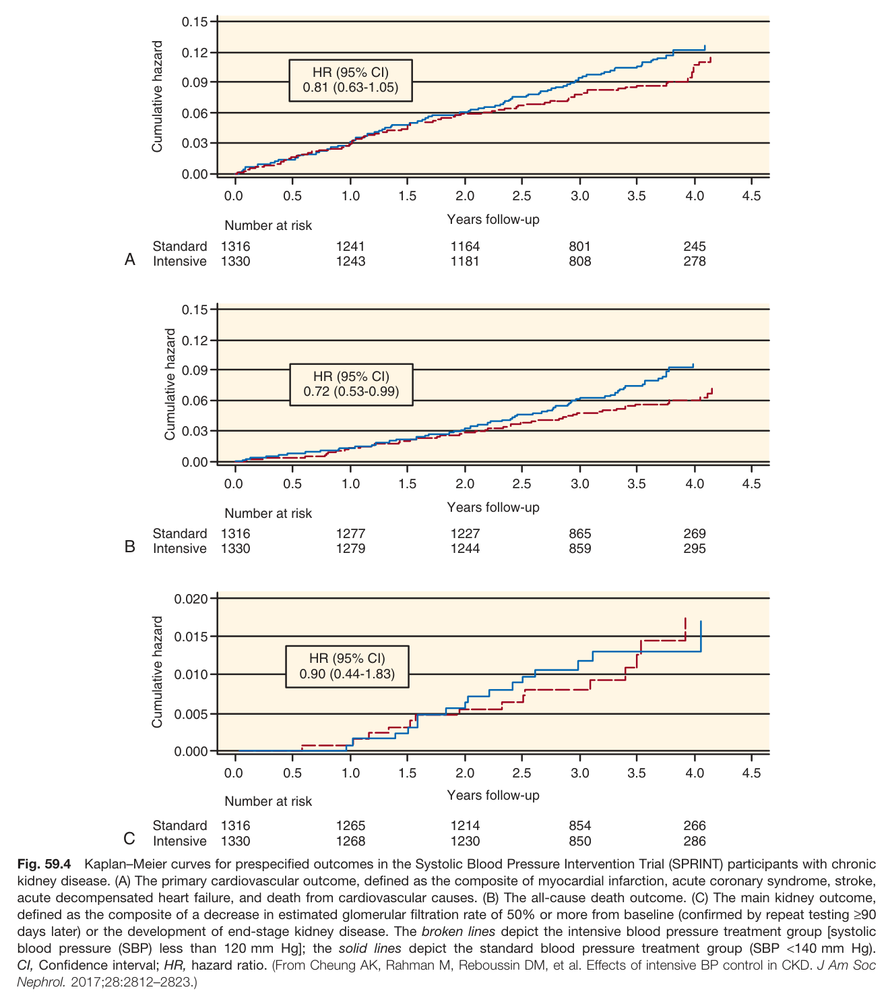

Fig. 59.4 Kaplan-Meier curves for prespecified outcomes in the Systolic Blood Pressure Intervention Trial (SPRINT) participants with chronic kidney disease. (A) The primary cardiovascular outcome, defined as the composite of myocardial infarction, acute coronary syndrome, stroke, acute decompensated heart failure, and death from cardiovascular causes. (B) The all-cause death outcome. (C) The main kidney outcome, defined as the composite of a decrease in estimated glomerular filtration rate of 50% or more from baseline (confirmed by repeat testing ≥90 days later) or the development of end-stage kidney disease. The broken lines depict the intensive blood pressure treatment group [systolic blood pressure (SBP) less than 120 mm Hg]; the solid lines depict the standard blood pressure treatment group (SBP <140 mm Hg). Cl, Confidence interval; HR, hazard ratio. (From Cheung AK, Rahman M, Reboussin DM, et al. Effects of intensive BP control in CKD. J Am Soc Nephrol. 2017;28:2812-2823.)

---

### Fig_59_5

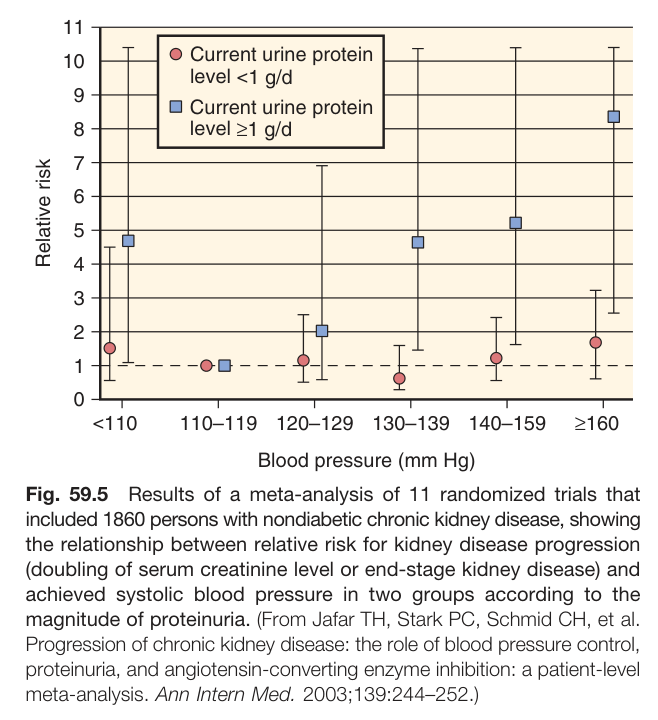

Fig. 59.5 Results of a meta-analysis of 11 randomized trials that included 1860 persons with nondiabetic chronic kidney disease, showing the relationship between relative risk for kidney disease progression (doubling of serum creatinine level or end-stage kidney disease) and achieved systolic blood pressure in two groups according to the magnitude of proteinuria. (From Jafar TH, Stark PC, Schmid CH, et al. Progression of chronic kidney disease: the role of blood pressure control, proteinuria, and angiotensin-converting enzyme inhibition: a patient-level meta-analysis. Ann Intern Med. 2003;139:244-252.)

---

### Fig_59_6

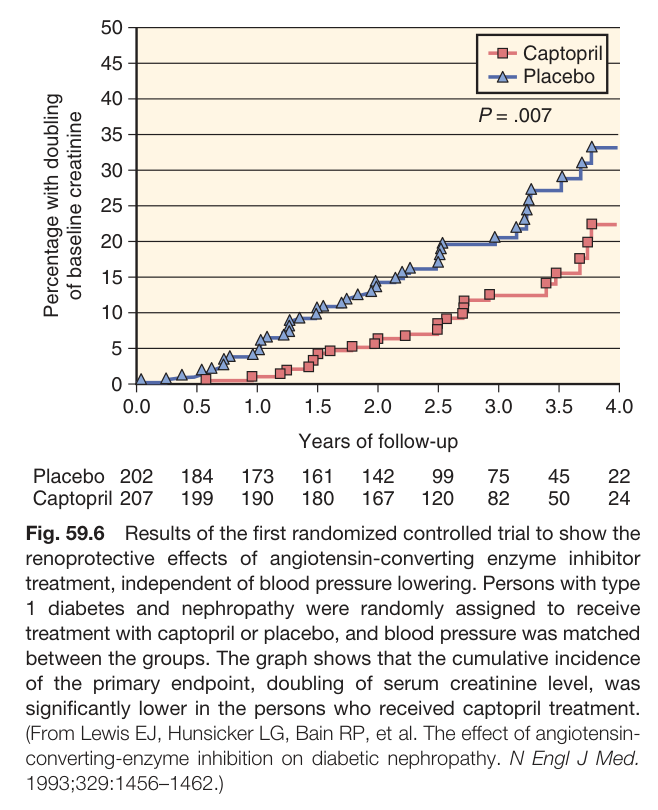

Fig. 59.6 Results of the first randomized controlled trial to show the renoprotective effects of angiotensin-converting enzyme inhibitor treatment, independent of blood pressure lowering. Persons with type 1 diabetes and nephropathy were randomly assigned to receive treatment with captopril or placebo, and blood pressure was matched between the groups. The graph shows that the cumulative incidence of the primary endpoint, doubling of serum creatinine level, was significantly lower in the persons who received captopril treatment. (From Lewis EJ, Hunsicker LG, Bain RP, et al. The effect of angiotensin-converting-enzyme inhibition on diabetic nephropathy. N Engl J Med. 1993;329:1456-1462.)

---

### Fig_59_7

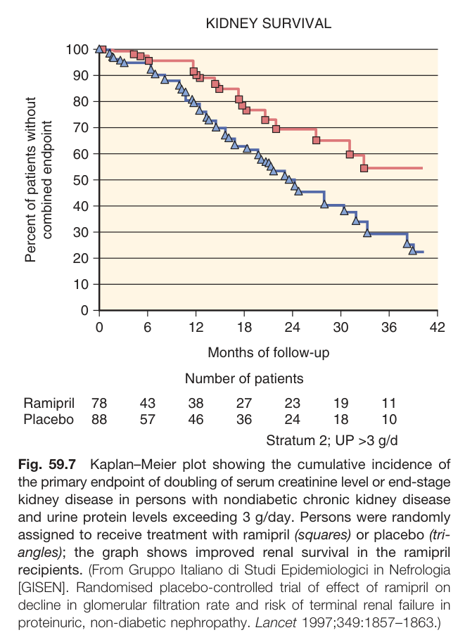

Fig. 59.7 Kaplan-Meier plot showing the cumulative incidence of the primary endpoint of doubling of serum creatinine level or end-stage kidney disease in persons with nondiabetic chronic kidney disease and urine protein levels exceeding 3 g/day. Persons were randomly assigned to receive treatment with ramipril (squares) or placebo (triangles); the graph shows improved renal survival in the ramipril recipients. (From Gruppo Italiano di Studi Epidemiologici in Nefrologia [GISEN]. Randomised placebo-controlled trial of effect of ramipril on decline in glomerular filtration rate and risk of terminal renal failure in proteinuric, non-diabetic nephropathy. Lancet 1997;349:1857-1863.)

---

### Fig_59_8

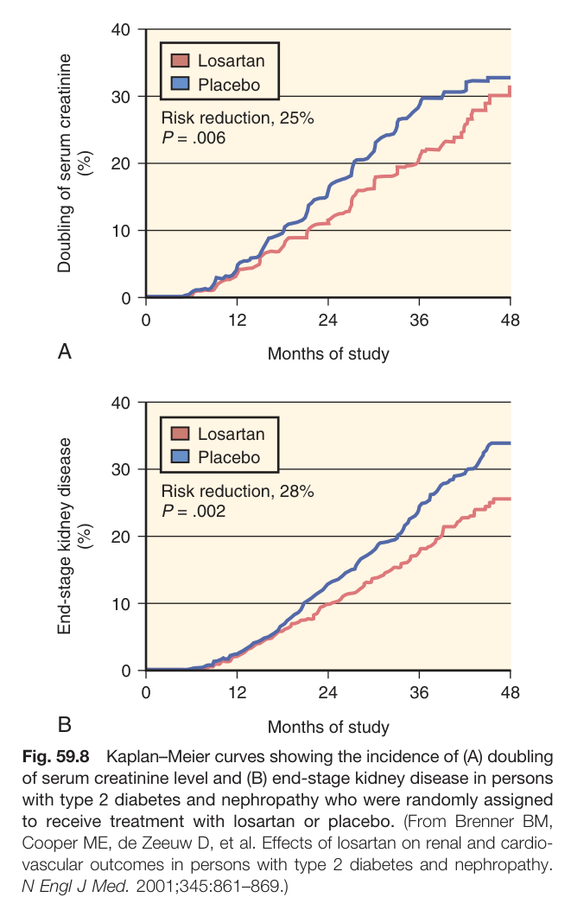

Fig. 59.8 Kaplan-Meier curves showing the incidence of (A) doubling of serum creatinine level and (B) end-stage kidney disease in persons with type 2 diabetes and nephropathy who were randomly assigned to receive treatment with losartan or placebo. (From Brenner BM, Cooper ME, de Zeeuw D, et al. Effects of losartan on renal and cardiovascular outcomes in persons with type 2 diabetes and nephropathy. N Engl J Med. 2001;345:861-869.)

---

### Fig_59_9

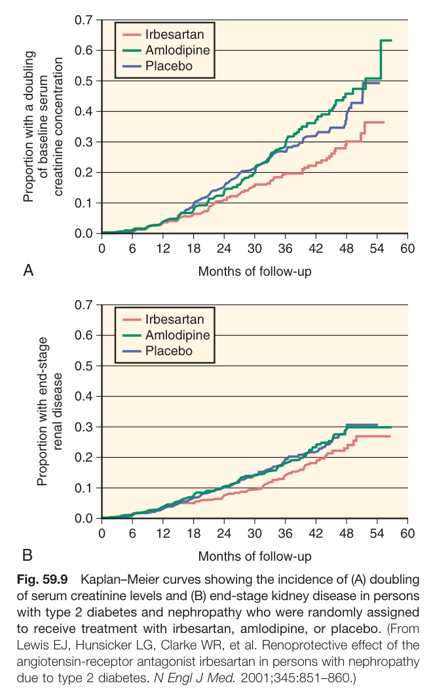

Fig. 59.9 Kaplan-Meier curves showing the incidence of (A) doubling of serum creatinine levels and (B) end-stage kidney disease in persons with type 2 diabetes and nephropathy who were randomly assigned to receive treatment with irbesartan, amlodipine, or placebo. (From Lewis EJ, Hunsicker LG, Clarke WR, et al. Renoprotective effect of the angiotensin-receptor antagonist irbesartan in persons with nephropathy due to type 2 diabetes. N Engl J Med. 2001;345:851-860.)

---

### Fig_59_10

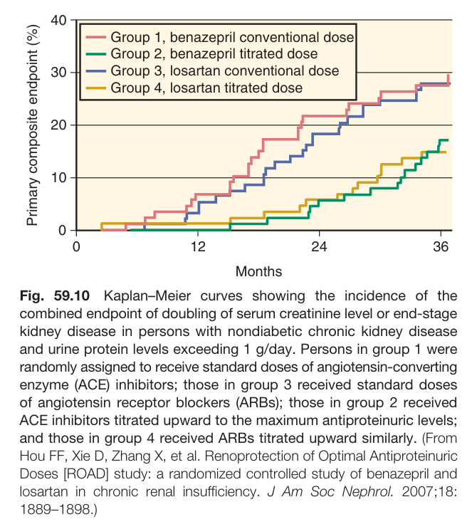

Fig. 59.10 Kaplan-Meier curves showing the incidence of the combined endpoint of doubling of serum creatinine level or end-stage kidney disease in persons with nondiabetic chronic kidney disease and urine protein levels exceeding 1 g/day. Persons in group 1 were randomly assigned to receive standard doses of angiotensin-converting enzyme (ACE) inhibitors; those in group 3 received standard doses of angiotensin receptor blockers (ARBs); those in group 2 received ACE inhibitors titrated upward to the maximum antiproteinuric levels; and those in group 4 received ARBs titrated upward similarly. (From Hou FF, Xie D, Zhang X, et al. Renoprotection of Optimal Antiproteinuric Doses [ROAD] study: a randomized controlled study of benazepril and losartan in chronic renal insufficiency. J Am Soc Nephrol. 2007;18: 1889-1898.)

---

### Fig_59_11

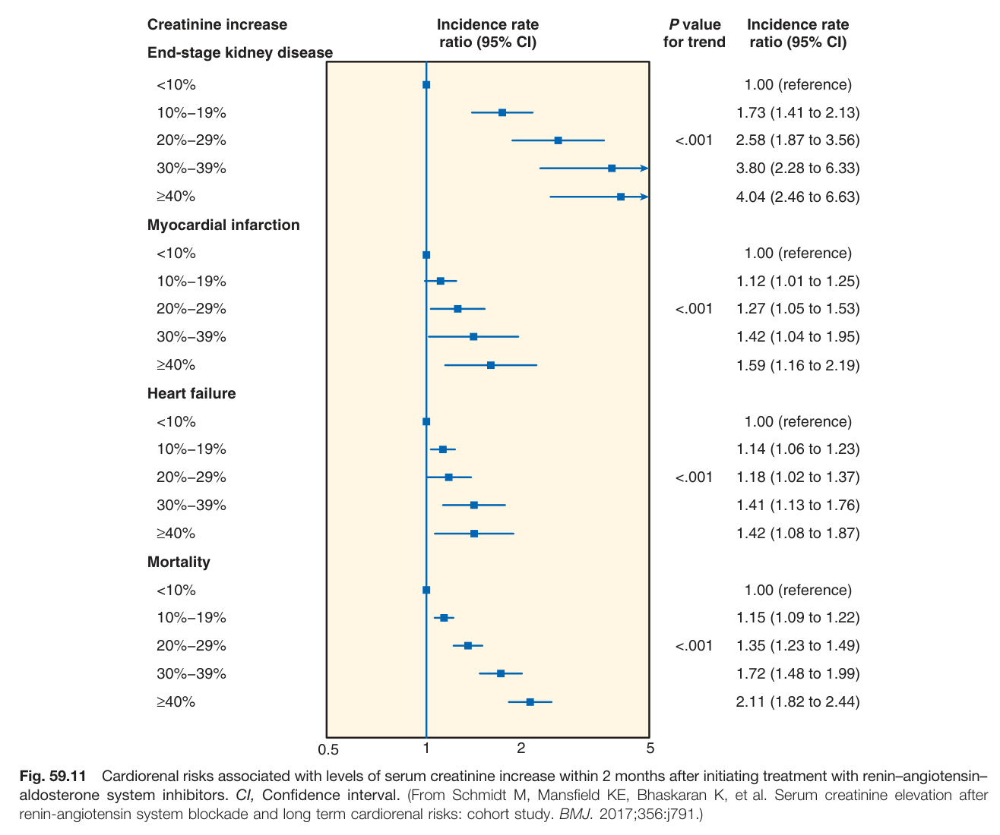

Fig. 59.11 Cardiorenal risks associated with levels of serum creatinine increase within 2 months after initiating treatment with renin-angiotensin-aldosterone system inhibitors. Cl, Confidence interval. (From Schmidt M, Mansfield KE, Bhaskaran K, et al. Serum creatinine elevation after renin-angiotensin system blockade and long term cardiorenal risks: cohort study. BMJ. 2017;356:j791.)

---

### Fig_59_12

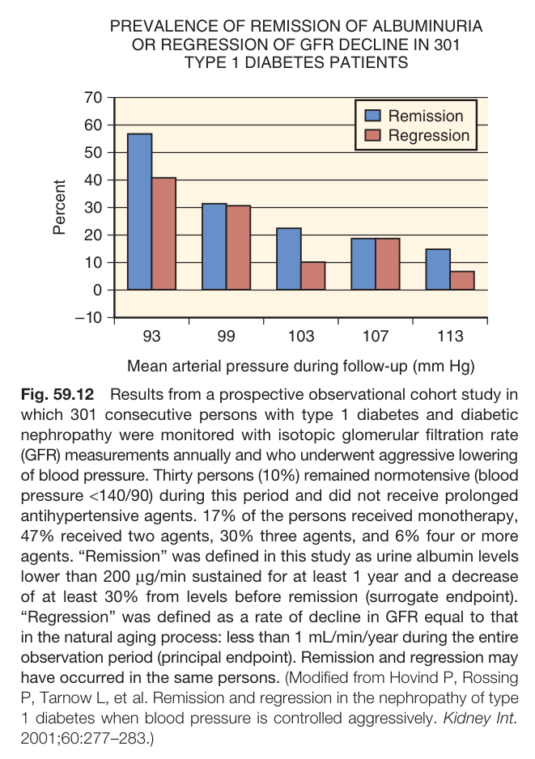

Fig. 59.12 Results from a prospective observational cohort study in which 301 consecutive persons with type 1 diabetes and diabetic nephropathy were monitored with isotopic glomerular filtration rate (GFR) measurements annually and who underwent aggressive lowering of blood pressure. Thirty persons (10%) remained normotensive (blood pressure <140/90) during this period and did not receive prolonged antihypertensive agents. 17% of the persons received monotherapy, 47% received two agents, 30% three agents, and 6% four or more agents. "Remission" was defined in this study as urine albumin levels lower than 200 µg/min sustained for at least 1 year and a decrease of at least 30% from levels before remission (surrogate endpoint). "Regression" was defined as a rate of decline in GFR equal to that in the natural aging process: less than 1 mL/min/year during the entire observation period (principal endpoint). Remission and regression may have occurred in the same persons. (Modified from Hovind P, Rossing P, Tarnow L, et al. Remission and regression in the nephropathy of type 1 diabetes when blood pressure is controlled aggressively. Kidney Int. 2001;60:277-283.)

---

## Tables

### Table_59_1

#### Table Image

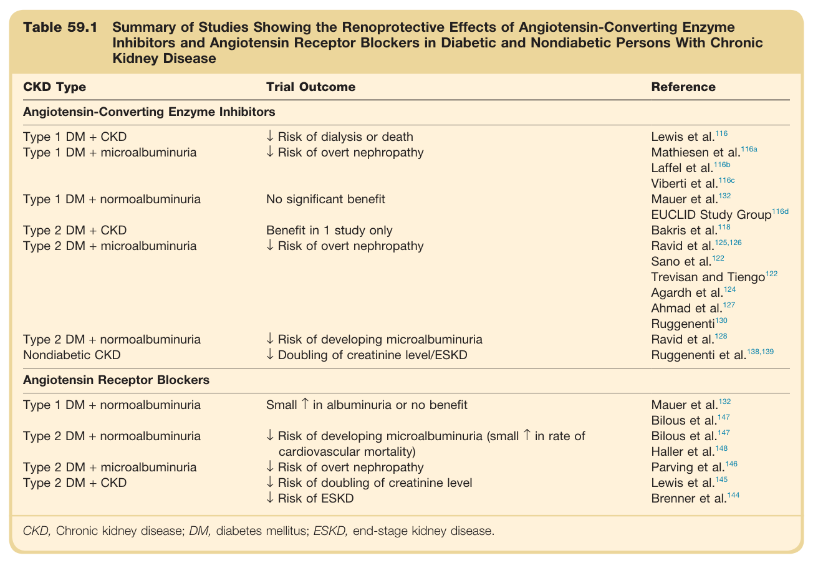

#### Table Data (CSV: [Table_59_1.csv](Table_59_1.csv))

```markdown
| Table Text (OCR) |
| :--- |
| Table 59.1 Summary of Studies Showing the Renoprotective Effects of Angiotensin-Converting Enzyme Inhibitors and Angiotensin Receptor Blockers in Diabetic and Nondiabetic Persons With Chronic Kidney Disease CKD Type  Trial Outcome  Reference    Angiotensin-Converting Enzyme Inhibitors    Type 1 DM + CKD  ↓ Risk of dialysis or death  Lewis et al. ^{116}     Type 1 DM + microalbuminuria  ↓ Risk of overt nephropathy  Mathiesen et al. ^{116a} Laffel et al. ^{116b} Viberti et al. ^{116c}     Type 1 DM + normoalbuminuria  No significant benefit  Mauer et al. ^{132} EUCLID Study Group ^{116d}     Type 2 DM + CKD  Benefit in 1 study only  Bakris et al. ^{118}     Type 2 DM + microalbuminuria  ↓ Risk of overt nephropathy  Ravid et al. ^{125,126} Sano et al. ^{122} Trevisan and Tiengo ^{122} Agardh et al. ^{124} Ahmad et al. ^{127} Ruggenenti ^{130}     Type 2 DM + normoalbuminuria  ↓ Risk of developing microalbuminuria  Ravid et al. ^{128}     Nondiabetic CKD  ↓ Doubling of creatinine level/ESKD  Ruggenenti et al. ^{138,139}     Angiotensin Receptor Blockers    Type 1 DM + normoalbuminuria  Small ↑ in albuminuria or no benefit  Mauer et al. ^{132} Bilous et al. ^{147}     Type 2 DM + normoalbuminuria  ↓ Risk of developing microalbuminuria (small ↑ in rate of cardiovascular mortality)  Bilous et al. ^{147} Haller et al. ^{148}     Type 2 DM + microalbuminuria  ↓ Risk of overt nephropathy  Parving et al. ^{146}     Type 2 DM + CKD  ↓ Risk of doubling of creatinine level  Lewis et al. ^{145} Brenner et al. ^{144}       ↓ Risk of ESKD CKD, Chronic kidney disease; DM, diabetes mellitus; ESKD, end-stage kidney disease. |
```

Table 59.1 Summary of Studies Showing the Renoprotective Effects of Angiotensin-Converting Enzyme Inhibitors and Angiotensin Receptor Blockers in Diabetic and Nondiabetic Persons With Chronic Kidney Disease | CKD Type | Trial Outcome | Reference | | :--- | :--- | :--- | | **Angiotensin-Converting Enzyme Inhibitors** | | | | Type 1 DM + CKD | ↓Risk of dialysis or death | Lewis et al. | | Type 1 DM + microalbuminuria | ↓Risk of overt nephropathy | Mathiesen et al., Laffel et al., Viberti et al. | | Type 1 DM + normoalbuminuria | No significant benefit | Mauer et al., EUCLID Study Group | | Type 2 DM + CKD | Benefit in 1 study only | Bakris et al. | | Type 2 DM + microalbuminuria | ↓Risk of overt nephropathy | Ravid et al., Sano et al., Trevisan and Tiengo, Agardh et al., Ahmad et al. | | Type 2 DM + normoalbuminuria | ↓Risk of developing microalbuminuria | Ruggenenti, Ravid et al. | | Nondiabetic CKD | ↓ Doubling of creatinine level/ESKD | Ruggenenti et al. | | **Angiotensin Receptor Blockers** | | | | Type 1 DM + normoalbuminuria | Small ↑ in albuminuria or no benefit | Mauer et al., Bilous et al. | | Type 2 DM + normoalbuminuria | ↓ Risk of developing microalbuminuria (small ↑ in rate of cardiovascular mortality) | Bilous et al., Haller et al. | | Type 2 DM + microalbuminuria | ↓ Risk of overt nephropathy | Parving et al. | | Type 2 DM + CKD | ↓Risk of doubling of creatinine level, ↓Risk of ESKD | Lewis et al., Brenner et al. | *CKD, Chronic kidney disease; DM, diabetes mellitus; ESKD, end-stage kidney disease.*

---

### Table_59_2

#### Table Image

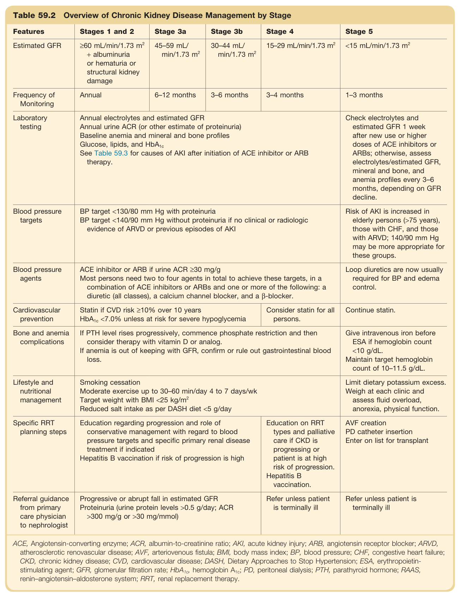

#### Table Data (CSV: [Table_59_2.csv](Table_59_2.csv))

```markdown
| Table Text (OCR) |
| :--- |
| Table 59.2 Overview of Chronic Kidney Disease Management by Stage Features  Stages 1 and 2  Stage 3a  Stage 3b  Stage 4  Stage 5    Estimated GFR  ≥60 mL/min/1.73  m^2 + albuminuria or hematuria or structural kidney damage  45-59 mL/min/1.73  m^2   30-44 mL/min/1.73  m^2   15-29 mL/min/1.73  m^2   <15 mL/min/1.73  m^2     Frequency of Monitoring  Annual  6-12 months  3-6 months  3-4 months  1-3 months    Laboratory testing  Annual electrolytes and estimated GFRAnnual urine ACR (or other estimate of proteinuria)Baseline anemia and mineral and bone profilesGlucose, lipids, and  HbA_{1c} See Table 59.3 for causes of AKI after initiation of ACE inhibitor or ARB therapy.  Check electrolytes and estimated GFR 1 week after new use or higher doses of ACE inhibitors or ARBs; otherwise, assess electrolytes/estimated GFR, mineral and bone, and anemia profiles every 3-6 months, depending on GFR decline.    Blood pressure targets  BP target <130/80 mm Hg with proteinuriaBP target <140/90 mm Hg without proteinuria if no clinical or radiologic evidence of ARVD or previous episodes of AKI  Risk of AKI is increased in elderly persons (>75 years), those with CHF, and those with ARVD; 140/90 mm Hg may be more appropriate for these groups.    Blood pressure agents  ACE inhibitor or ARB if urine ACR ≥30 mg/gMost persons need two to four agents in total to achieve these targets, in a combination of ACE inhibitors or ARBs and one or more of the following: a diuretic (all classes), a calcium channel blocker, and a β-blocker.  Loop diuretics are now usually required for BP and edema control.    Cardiovascular prevention  Statin if CVD risk ≥10% over 10 years HbA_{1c}  <7.0% unless at risk for severe hypoglycemia  Consider statin for all persons.  Continue statin.    Bone and anemia complications  If PTH level rises progressively, commence phosphate restriction and then consider therapy with vitamin D or analog.If anemia is out of keeping with GFR, confirm or rule out gastrointestinal blood loss.  Give intravenous iron before ESA if hemoglobin count <10 g/dLMaintain target hemoglobin count of 10-11.5 g/dL.    Lifestyle and nutritional management  Smoking cessationModerate exercise up to 30-60 min/day 4 to 7 days/wkTarget weight with BMI <25  kg/m^2 Reduced salt intake as per DASH diet <5 g/day  Limit dietary potassium excess.Weigh at each clinic and assess fluid overload, anorexia, physical function.    Specific RRT planning steps  Education regarding progression and role of conservative management with regard to blood pressure targets and specific primary renal disease treatment if indicatedHepatitis B vaccination if risk of progression is high  Education on RRT types and palliative care if CKD is progressing or patient is at high risk of progression.Hepatitis B vaccination.  AVF creationPD catheter insertionEnter on list for transplant    Referral guidance from primary care physician to nephrologist  Progressive or abrupt fall in estimated GFRProteinuria (urine protein levels >0.5 g/day; ACR >300 mg/g or >30 mg/mmol)  Refer unless patient is terminally ill  Refer unless patient is terminally ill ACE, Angiotensin-converting enzyme; ACR, albumin-to-creatinine ratio; AKI, acute kidney injury; ARB, angiotensin receptor blocker; ARVD, atherosclerotic renovascular disease; AVF, arteriovenous fistula; BMI, body mass index; BP, blood pressure; CHF, congestive heart failure; CKD, chronic kidney disease; CVD, cardiovascular disease; DASH, Dietary Approaches to Stop Hypertension; ESA, erythropoietin- stimulating agent; GFR, glomerular filtration rate; HbA , hemoglobin A ; PD, peritoneal dialysis; PTH, parathyroid hormone; RAAS, renin–angiotensin–aldosterone system; RRT, renal replacement therapy. |
```

Table 59.2 Overview of Chronic Kidney Disease Management by Stage | Features | Stages 1 and 2 | Stage 3a | Stage 3b | Stage 4 | Stage 5 | | :--- | :--- | :--- | :--- | :--- | :--- | | Estimated GFR | ≥60 mL/min/1.73 m² + albuminuria or hematuria or structural kidney damage | 45-59 mL/ min/1.73 m² | 30-44 mL/ min/1.73 m² | 15-29 mL/min/1.73 m² | <15 mL/min/1.73 m² | | Frequency of Monitoring | Annual | 6-12 months | 3-6 months | 3-4 months | 1-3 months | | Laboratory testing | Annual electrolytes and estimated GFR. Annual urine ACR (or other estimate of proteinuria). Baseline anemia and mineral and bone profiles. Glucose, lipids, and HbA1c. See Table 59.3 for causes of AKI after initiation of ACE inhibitor or ARB therapy. | | | | Check electrolytes and estimated GFR 1 week after new use or higher doses of ACE inhibitors or ARBs; otherwise, assess electrolytes/estimated GFR, mineral and bone, and anemia profiles every 3-6 months, depending on GFR decline. | | Blood pressure targets | BP target <130/80 mm Hg with proteinuria. BP target <140/90 mm Hg without proteinuria if no clinical or radiologic evidence of ARVD or previous episodes of AKI. | | | | Risk of AKI is increased in elderly persons (>75 years), those with CHF, and those with ARVD; 140/90 mm Hg may be more appropriate for these groups. | | Blood pressure agents | ACE inhibitor or ARB if urine ACR ≥30 mg/g. Most persons need two to four agents in total to achieve these targets, in a combination of ACE inhibitors or ARBs and one or more of the following: a diuretic (all classes), a calcium channel blocker, and a β-blocker. | | | | Loop diuretics are now usually required for BP and edema control. | | Cardiovascular prevention | Statin if CVD risk ≥10% over 10 years. HbA1c <7.0% unless at risk for severe hypoglycemia. | | | Consider statin for all persons. | Continue statin. | | Bone and anemia complications | If PTH level rises progressively, commence phosphate restriction and then consider therapy with vitamin D or analog. If anemia is out of keeping with GFR, confirm or rule out gastrointestinal blood loss. | | | | Give intravenous iron before ESA if hemoglobin count <10 g/dL. Maintain target hemoglobin count of 10-11.5 g/dL. | | Lifestyle and nutritional management | Smoking cessation. Moderate exercise up to 30-60 min/day 4 to 7 days/wk. Target weight with BMI <25 kg/m². Reduced salt intake as per DASH diet <5 g/day. | | | | Limit dietary potassium excess. Weigh at each clinic and assess fluid overload, anorexia, physical function. | | Specific RRT planning steps | Education regarding progression and role of conservative management with regard to blood pressure targets and specific primary renal disease treatment if indicated. Hepatitis B vaccination if risk of progression is high. | | | Education on RRT types and palliative care if CKD is progressing or patient is at high risk of progression. Hepatitis B vaccination. | AVF creation. PD catheter insertion. Enter on list for transplant. | | Referral guidance from primary care physician to nephrologist | Progressive or abrupt fall in estimated GFR. Proteinuria (urine protein levels >0.5 g/day; ACR >300 mg/g or >30 mg/mmol). | | | Refer unless patient is terminally ill. | Refer unless patient is terminally ill. | *ACE, Angiotensin-converting enzyme; ACR, albumin-to-creatinine ratio; AKI, acute kidney injury; ARB, angiotensin receptor blocker; ARVD, atherosclerotic renovascular disease; AVF, arteriovenous fistula; BMI, body mass index; BP, blood pressure; CHF, congestive heart failure; CKD, chronic kidney disease; CVD, cardiovascular disease; DASH, Dietary Approaches to Stop Hypertension; ESA, erythropoietin-stimulating agent; GFR, glomerular filtration rate; HbA1c, hemoglobin A1c; PD, peritoneal dialysis; PTH, parathyroid hormone; RAAS, renin-angiotensin-aldosterone system; RRT, renal replacement therapy.*

---

### Table_59_3

#### Table Image

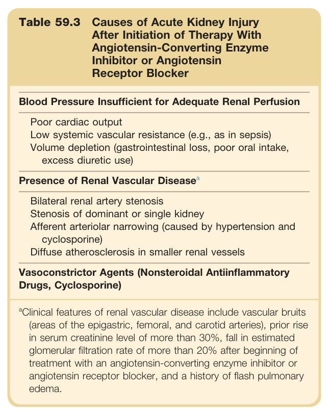

#### Table Data (CSV: [Table_59_3.csv](Table_59_3.csv))

```markdown
| Table Text (OCR) |
| :--- |
| Table 59.3 Causes of Acute Kidney Injury After Initiation of Therapy With Angiotensin-Converting Enzyme Inhibitor or Angiotensin Receptor Blocker Blood Pressure Insufficient for Adequate Renal Perfusion Poor cardiac output    Low systemic vascular resistance (e.g., as in sepsis)    Volume depletion (gastrointestinal loss, poor oral intake, excess diuretic use) |
```

Table 59.3 Causes of Acute Kidney Injury After Initiation of Therapy With Angiotensin-Converting Enzyme Inhibitor or Angiotensin Receptor Blocker | | | | :--- | :--- | | **Blood Pressure Insufficient for Adequate Renal Perfusion** | | | | Poor cardiac output | | | Low systemic vascular resistance (e.g., as in sepsis) | | | Volume depletion (gastrointestinal loss, poor oral intake, excess diuretic use) | | **Presence of Renal Vascular Disease a** | | | | Bilateral renal artery stenosis | | | Stenosis of dominant or single kidney | | | Afferent arteriolar narrowing (caused by hypertension and cyclosporine) | | | Diffuse atherosclerosis in smaller renal vessels | | **Vasoconstrictor Agents (Nonsteroidal Antiinflammatory Drugs, Cyclosporine)** | | *aClinical features of renal vascular disease include vascular bruits (areas of the epigastric, femoral, and carotid arteries), prior rise in serum creatinine level of more than 30%, fall in estimated glomerular filtration rate of more than 20% after beginning of treatment with an angiotensin-converting enzyme inhibitor or angiotensin receptor blocker, and a history of flash pulmonary edema.*

---

### Table_59_4

#### Table Image

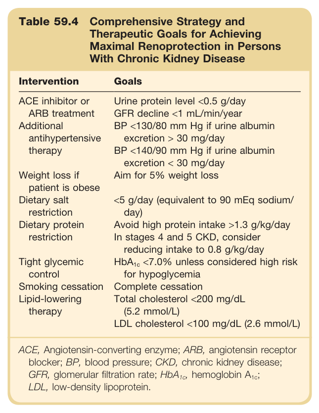

#### Table Data (CSV: [Table_59_4.csv](Table_59_4.csv))

```markdown
| Table Text (OCR) |
| :--- |
| Table 59.4 Comprehensive Strategy and Therapeutic Goals for Achieving Maximal Renoprotection in Persons With Chronic Kidney Disease Intervention  Goals    ACE inhibitor or ARB treatment  Urine protein level <0.5 g/dayGFR decline <1 mL/min/year    Additional antihypertensive therapy  BP <130/80 mm Hg if urine albumin excretion > 30 mg/dayBP <140/90 mm Hg if urine albumin excretion < 30 mg/day    Weight loss if patient is obese  Aim for 5% weight loss    Dietary salt restriction  <5 g/day (equivalent to 90 mEq sodium/day)    Dietary protein restriction  Avoid high protein intake >1.3 g/kg/dayIn stages 4 and 5 CKD, consider reducing intake to 0.8 g/kg/day    Tight glycemic control   HbA_{1c}  <7.0% unless considered high risk for hypoglycemia    Smoking cessation  Complete cessation    Lipid-lowering therapy  Total cholesterol <200 mg/dL(5.2 mmol/L)LDL cholesterol <100 mg/dL (2.6 mmol/L) ACE, Angiotensin-converting enzyme; ARB, angiotensin receptor blocker; BP, blood pressure; CKD, chronic kidney disease; GFR, glomerular filtration rate; HbA , hemoglobin A ; LDL, low-density lipoprotein. |
```

Table 59.4 Comprehensive Strategy and Therapeutic Goals for Achieving Maximal Renoprotection in Persons With Chronic Kidney Disease | Intervention | Goals | | :--- | :--- | | ACE inhibitor or ARB treatment | Urine protein level <0.5 g/day. GFR decline <1 mL/min/year. | | Additional antihypertensive therapy | BP <130/80 mm Hg if urine albumin excretion > 30 mg/day. BP <140/90 mm Hg if urine albumin excretion < 30 mg/day. | | Weight loss if patient is obese | Aim for 5% weight loss. | | Dietary salt restriction | <5 g/day (equivalent to 90 mEq sodium/day). | | Dietary protein restriction | Avoid high protein intake >1.3 g/kg/day. In stages 4 and 5 CKD, consider reducing intake to 0.8 g/kg/day. | | Tight glycemic control | HbA1c <7.0% unless considered high risk for hypoglycemia. | | Smoking cessation | Complete cessation. | | Lipid-lowering therapy | Total cholesterol <200 mg/dL (5.2 mmol/L). LDL cholesterol <100 mg/dL (2.6 mmol/L). | *ACE, Angiotensin-converting enzyme; ARB, angiotensin receptor blocker; BP, blood pressure; CKD, chronic kidney disease; GFR, glomerular filtration rate; HbA1c, hemoglobin A1c; LDL, low-density lipoprotein.*

---

### Table_59_5

#### Table Image

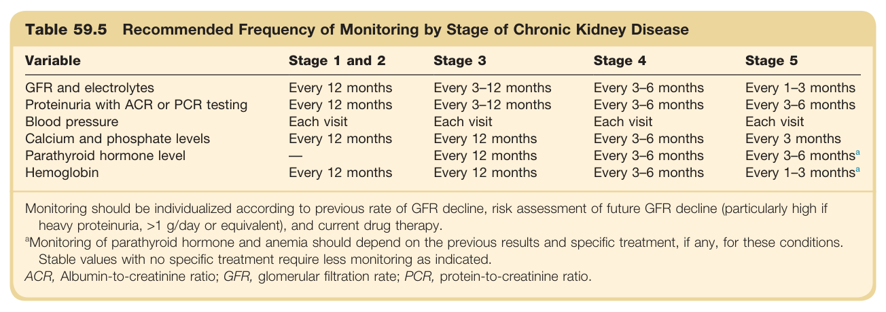

#### Table Data (CSV: [Table_59_5.csv](Table_59_5.csv))

```markdown
| Table Text (OCR) |
| :--- |
| Table 59.5 Recommended Frequency of Monitoring by Stage of Chronic Kidney Disease Variable  Stage 1 and 2  Stage 3  Stage 4  Stage 5    GFR and electrolytes  Every 12 months  Every 3–12 months  Every 3–6 months  Every 1–3 months    Proteinuria with ACR or PCR testing  Every 12 months  Every 3–12 months  Every 3–6 months  Every 3–6 months    Blood pressure  Each visit  Each visit  Each visit  Each visit    Calcium and phosphate levels  Every 12 months  Every 12 months  Every 3–6 months  Every 3 months    Parathyroid hormone level  —  Every 12 months  Every 3–6 months  Every 3–6 months ^{a}     Hemoglobin  Every 12 months  Every 12 months  Every 3–6 months  Every 1–3 months ^{a} Monitoring should be individualized according to previous rate of GFR decline, risk assessment of future GFR decline (particularly high if heavy proteinuria, >1 g/day or equivalent), and current drug therapy. <sup>a</sup>Monitoring of parathyroid hormone and anemia should depend on the previous results and specific treatment, if any, for these conditions. Stable values with no specific treatment require less monitoring as indicated. ACR, Albumin-to-creatinine ratio; GFR, glomerular filtration rate; PCR, protein-to-creatinine ratio. |
```

Table 59.5 Recommended Frequency of Monitoring by Stage of Chronic Kidney Disease | Variable | Stage 1 and 2 | Stage 3 | Stage 4 | Stage 5 | | :--- | :--- | :--- | :--- | :--- | | GFR and electrolytes | Every 12 months | Every 3-12 months | Every 3-6 months | Every 1-3 months | | Proteinuria with ACR or PCR testing | Every 12 months | Every 3-12 months | Every 3-6 months | Every 3-6 months | | Blood pressure | Each visit | Each visit | Each visit | Each visit | | Calcium and phosphate levels | Every 12 months | Every 12 months | Every 3-6 months | Every 3 months | | Parathyroid hormone level | | Every 12 months | Every 3-6 months | Every 3-6 monthsª | | Hemoglobin | Every 12 months | Every 12 months | Every 3-6 months | Every 1-3 monthsª | *Monitoring should be individualized according to previous rate of GFR decline, risk assessment of future GFR decline (particularly high if heavy proteinuria, >1 g/day or equivalent), and current drug therapy.* *ªMonitoring of parathyroid hormone and anemia should depend on the previous results and specific treatment, if any, for these conditions. Stable values with no specific treatment require less monitoring as indicated.* *ACR, Albumin-to-creatinine ratio; GFR, glomerular filtration rate; PCR, protein-to-creatinine ratio.*

---
