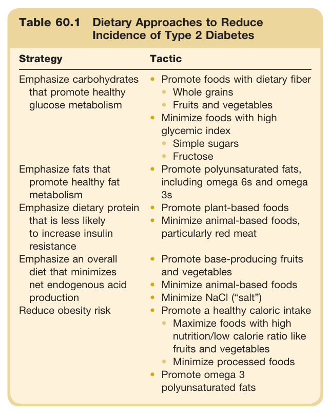
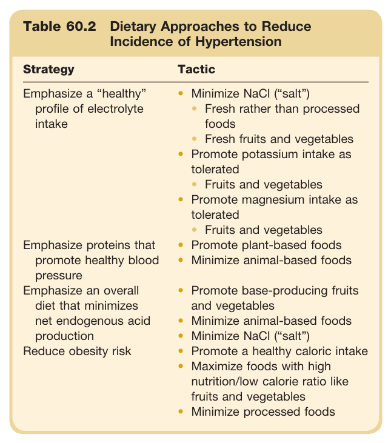
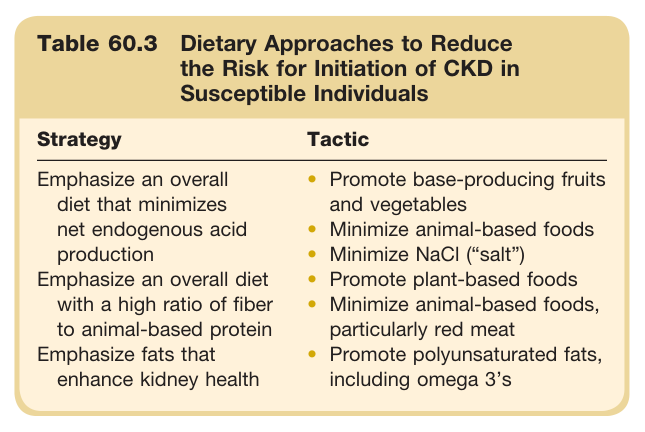
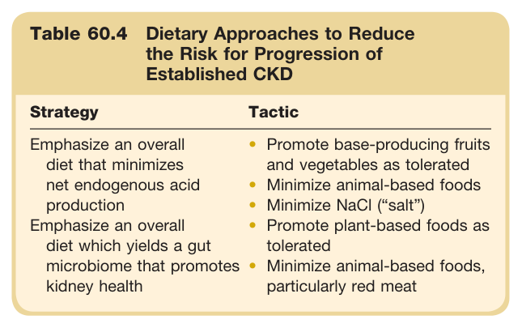
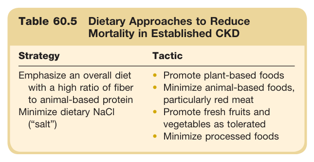
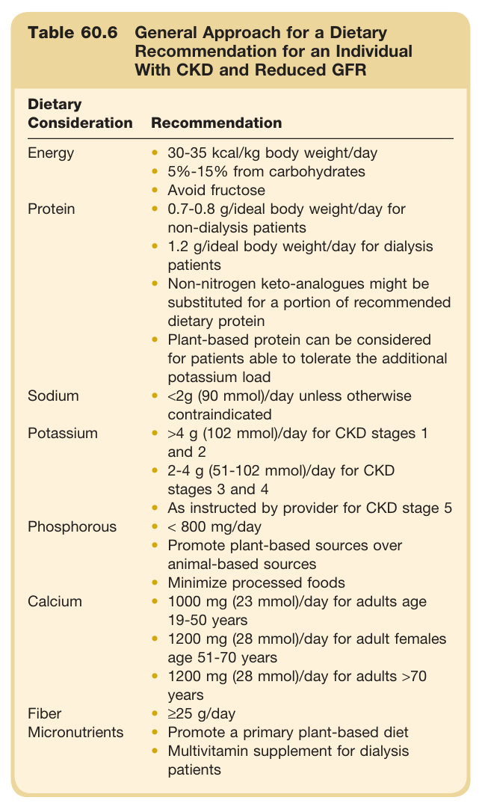
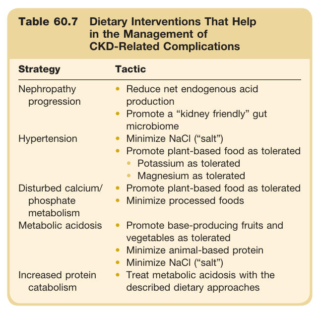

# 60. Dietary Approaches to Kidney Diseases - Figures and Tables Index

This document lists all figures and tables extracted from `60. Dietary Approaches to Kidney Diseases.pdf`.

## Table of Contents
- [Figures](#figures)
- [Tables](#tables)

---

## Figures

*No figures resolved for this chapter.*

## Tables

### Table_60_1

#### Table Image



#### Table Data (CSV: [Table_60_1.csv](Table_60_1.csv))

```markdown
| Table Text (OCR) |
| :--- |
| Table 60.1 Dietary Approaches to Reduce Incidence of Type 2 Diabetes Strategy  Tactic    Emphasize carbohydrates that promote healthy glucose metabolism  Promote foods with dietary fiberWhole grainsFruits and vegetablesMinimize foods with high glycemic indexSimple sugarsFructose    Emphasize fats that promote healthy fat metabolism  Promote polyunsaturated fats, including omega 6s and omega 3s    Emphasize dietary protein that is less likely to increase insulin resistance  Promote plant-based foodsMinimize animal-based foods, particularly red meat    Emphasize an overall diet that minimizes net endogenous acid production  Promote base-producing fruits and vegetablesMinimize animal-based foodsMinimize NaCl (“salt”)    Reduce obesity risk  Promote a healthy caloric intakeMaximize foods with high nutrition/low calorie ratio like fruits and vegetablesMinimize processed foodsPromote omega 3 polyunsaturated fats |
```

Table 60.1 Dietary Approaches to Reduce Incidence of Type 2 Diabetes | Strategy | Tactic | | :--- | :--- | | Emphasize carbohydrates that promote healthy glucose metabolism | • Promote foods with dietary fiber<br>• Whole grains<br>• Fruits and vegetables<br>• Minimize foods with high glycemic index<br>• Simple sugars<br>• Fructose | | Emphasize fats that promote healthy fat metabolism | • Promote polyunsaturated fats, including omega 6s and omega 3s | | Emphasize dietary protein that is less likely to increase insulin resistance | • Promote plant-based foods<br>• Minimize animal-based foods, particularly red meat | | Emphasize an overall diet that minimizes net endogenous acid production | • Promote base-producing fruits and vegetables<br>• Minimize animal-based foods<br>• Minimize NaCl ("salt") | | Reduce obesity risk | • Promote a healthy caloric intake<br>• Maximize foods with high nutrition/low calorie ratio like fruits and vegetables<br>• Minimize processed foods<br>• Promote omega 3 polyunsaturated fats |

---

### Table_60_2

#### Table Image



#### Table Data (CSV: [Table_60_2.csv](Table_60_2.csv))

```markdown
| Table Text (OCR) |
| :--- |
| Table 60.2 Dietary Approaches to Reduce Incidence of Hypertension Strategy  Tactic    Emphasize a “healthy”profile of electrolyte intake  Minimize NaCl (“salt”)Fresh rather than processed foodsFresh fruits and vegetablesPromote potassium intake as toleratedFruits and vegetablesPromote magnesium intake as toleratedFruits and vegetables    Emphasize proteins that promote healthy blood pressure  Promote plant-based foodsMinimize animal-based foods    Emphasize an overall diet that minimizes net endogenous acid production  Promote base-producing fruits and vegetablesMinimize animal-based foodsMinimize NaCl (“salt”)Promote a healthy caloric intakeMaximize foods with high nutrition/low calorie ratio like fruits and vegetablesMinimize processed foods    Reduce obesity risk |
```

Table 60.2 Dietary Approaches to Reduce Incidence of Hypertension | Strategy | Tactic | | :--- | :--- | | Emphasize a "healthy" profile of electrolyte intake | • Minimize NaCl ("salt")<br>• Fresh rather than processed foods<br>• Fresh fruits and vegetables<br>• Promote potassium intake as tolerated<br>• Fruits and vegetables<br>• Promote magnesium intake as tolerated<br>• Fruits and vegetables | | Emphasize proteins that promote healthy blood pressure | • Promote plant-based foods<br>• Minimize animal-based foods | | Emphasize an overall diet that minimizes net endogenous acid production | • Promote base-producing fruits and vegetables<br>• Minimize animal-based foods<br>• Minimize NaCl ("salt") | | Reduce obesity risk | • Promote a healthy caloric intake<br>• Maximize foods with high nutrition/low calorie ratio like fruits and vegetables<br>• Minimize processed foods |

---

### Table_60_3

#### Table Image



#### Table Data (CSV: [Table_60_3.csv](Table_60_3.csv))

```markdown
| Table Text (OCR) |
| :--- |
| Table 60.3 Dietary Approaches to Reduce the Risk for Initiation of CKD in Susceptible Individuals Strategy  Tactic    Emphasize an overall diet that minimizes net endogenous acid productionEmphasize an overall diet with a high ratio of fiber to animal-based proteinEmphasize fats that enhance kidney health  Promote base-producing fruits and vegetablesMinimize animal-based foodsMinimize NaCl (“salt”)Promote plant-based foodsMinimize animal-based foods, particularly red meatPromote polyunsaturated fats, including omega 3’s |
```

Table 60.3 Dietary Approaches to Reduce the Risk for Initiation of CKD in Susceptible Individuals | Strategy | Tactic | | :--- | :--- | | Emphasize an overall diet that minimizes net endogenous acid production | • Promote base-producing fruits and vegetables<br>• Minimize animal-based foods<br>• Minimize NaCl ("salt") | | Emphasize an overall diet with a high ratio of fiber to animal-based protein | • Promote plant-based foods<br>• Minimize animal-based foods, particularly red meat | | Emphasize fats that enhance kidney health | • Promote polyunsaturated fats, including omega 3's |

---

### Table_60_4

#### Table Image



#### Table Data (CSV: [Table_60_4.csv](Table_60_4.csv))

```markdown
| Table Text (OCR) |
| :--- |
| Table 60.4 Dietary Approaches to Reduce the Risk for Progression of Established CKD Strategy  Tactic    Emphasize an overall diet that minimizes net endogenous acid productionEmphasize an overall diet which yields a gut microbiome that promotes kidney health  Promote base-producing fruits and vegetables as toleratedMinimize animal-based foodsMinimize NaCl (“salt”)Promote plant-based foods as toleratedMinimize animal-based foods, particularly red meat |
```

Table 60.4 Dietary Approaches to Reduce the Risk for Progression of Established CKD | Strategy | Tactic | | :--- | :--- | | Emphasize an overall diet that minimizes net endogenous acid production | • Promote base-producing fruits and vegetables as tolerated<br>• Minimize animal-based foods<br>• Minimize NaCl ("salt") | | Emphasize an overall diet which yields a gut microbiome that promotes kidney health | • Promote plant-based foods as tolerated<br>Minimize animal-based foods, particularly red meat |

---

### Table_60_5

#### Table Image



#### Table Data (CSV: [Table_60_5.csv](Table_60_5.csv))

```markdown
| Table Text (OCR) |
| :--- |
| Table 60.5 Dietary Approaches to Reduce Mortality in Established CKD Strategy  Tactic    Emphasize an overall diet with a high ratio of fiber to animal-based proteinMinimize dietary NaCl (“salt”)  Promote plant-based foodsMinimize animal-based foods, particularly red meatPromote fresh fruits and vegetables as toleratedMinimize processed foods |
```

Table 60.5 Dietary Approaches to Reduce Mortality in Established CKD | Strategy | Tactic | | :--- | :--- | | Emphasize an overall diet with a high ratio of fiber to animal-based protein | • Promote plant-based foods<br>• Minimize animal-based foods, particularly red meat | | Minimize dietary NaCl ("salt") | • Promote fresh fruits and vegetables as tolerated<br>• Minimize processed foods |

---

### Table_60_6

#### Table Image



#### Table Data (CSV: [Table_60_6.csv](Table_60_6.csv))

```markdown
| Table Text (OCR) |
| :--- |
| Table 60.6 General Approach for a Dietary Recommendation for an Individual With CKD and Reduced GFR Dietary Consideration  Recommendation    Energy  30-35 kcal/kg body weight/day5%-15% from carbohydratesAvoid fructose    Protein  0.7-0.8 g/ideal body weight/day for non-dialysis patients1.2 g/ideal body weight/day for dialysis patientsNon-nitrogen keto-analogues might be substituted for a portion of recommended dietary proteinPlant-based protein can be considered for patients able to tolerate the additional potassium load    Sodium  <2g (90 mmol)/day unless otherwise contraindicated    Potassium  >4 g (102 mmol)/day for CKD stages 1 and 22-4 g (51-102 mmol)/day for CKD stages 3 and 4As instructed by provider for CKD stage 5    Phosphorous  < 800 mg/dayPromote plant-based sources over animal-based sourcesMinimize processed foods    Calcium  1000 mg (23 mmol)/day for adults age 19-50 years1200 mg (28 mmol)/day for adult females age 51-70 years1200 mg (28 mmol)/day for adults >70 years    Fiber  ≥25 g/day    Micronutrients  Promote a primary plant-based dietMultivitamin supplement for dialysis patients |
```

Table 60.6 General Approach for a Dietary Recommendation for an Individual With CKD and Reduced GFR | Dietary Consideration | Recommendation | | :--- | :--- | | **Energy** | • 30-35 kcal/kg body weight/day<br>• 5%-15% from carbohydrates<br>• Avoid fructose | | **Protein** | • 0.7-0.8 g/ideal body weight/day for non-dialysis patients<br>• 1.2 g/ideal body weight/day for dialysis patients<br>• Non-nitrogen keto-analogues might be substituted for a portion of recommended dietary protein<br>• Plant-based protein can be considered for patients able to tolerate the additional potassium load | | **Sodium** | • <2g (90 mmol)/day unless otherwise contraindicated | | **Potassium** | • >4 g (102 mmol)/day for CKD stages 1 and 2<br>• 2-4 g (51-102 mmol)/day for CKD stages 3 and 4<br>• As instructed by provider for CKD stage 5 | | **Phosphorous** | • < 800 mg/day<br>• Promote plant-based sources over animal-based sources<br>• Minimize processed foods | | **Calcium** | • 1000 mg (23 mmol)/day for adults age 19-50 years<br>• 1200 mg (28 mmol)/day for adult females age 51-70 years<br>• 1200 mg (28 mmol)/day for adults >70 years | | **Fiber** | • ≥25 g/day | | **Micronutrients** | • Promote a primary plant-based diet<br>• Multivitamin supplement for dialysis patients |

---

### Table_60_7

#### Table Image



#### Table Data (CSV: [Table_60_7.csv](Table_60_7.csv))

```markdown
| Table Text (OCR) |
| :--- |
| Table 60.7 Dietary Interventions That Help in the Management of CKD-Related Complications Strategy  Tactic    Nephropathy progression  Reduce net endogenous acid productionPromote a “kidney friendly” gut microbiome    Hypertension  Minimize NaCl (“salt”)Promote plant-based food as toleratedPotassium as toleratedMagnesium as tolerated    Disturbed calcium/phosphate metabolism  Promote plant-based food as toleratedMinimize processed foods    Metabolic acidosis  Promote base-producing fruits and vegetables as toleratedMinimize animal-based proteinMinimize NaCl (“salt”)    Increased protein catabolism  Treat metabolic acidosis with the described dietary approaches |
```

Table 60.7 Dietary Interventions That Help in the Management of CKD-Related Complications | Strategy | Tactic | | :--- | :--- | | Nephropathy progression | • Reduce net endogenous acid production<br>• Promote a "kidney friendly" gut microbiome<br>• Minimize NaCl ("salt") | | Hypertension | • Promote plant-based food as tolerated<br>• Potassium as tolerated<br>• Magnesium as tolerated | | Disturbed calcium/phosphate metabolism | • Promote plant-based food as tolerated<br>• Minimize processed foods | | Metabolic acidosis | • Promote base-producing fruits and vegetables as tolerated<br>• Minimize animal-based protein<br>• Minimize NaCl ("salt") | | Increased protein catabolism | • Treat metabolic acidosis with the described dietary approaches |

---
