# 61. Drug Dosing Considerations in Patients With Acute Kidney Injury and Chronic Kidney Disease - Figures and Tables Index

This document lists all figures and tables extracted from `61. Drug Dosing Considerations in Patients With Acute Kidney Injury and Chronic Kidney Disease.pdf`.

## Table of Contents
- [Figures](#figures)
- [Tables](#tables)

---

## Figures

### Fig_61_1

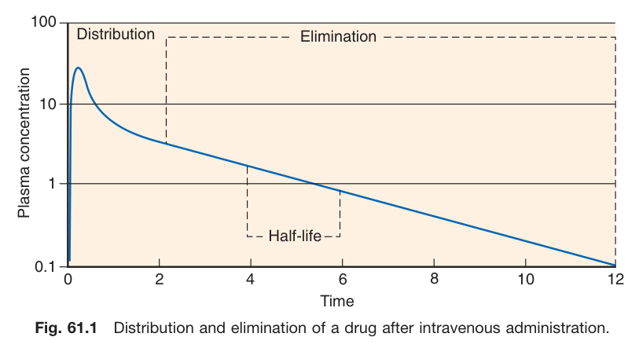

Fig. 61.1 Distribution and elimination of a drug after intravenous administration. An image of a graph showing the plasma concentration of a drug over time after intravenous administration. The y-axis is Plasma concentration on a logarithmic scale from 0.1 to 100. The x-axis is Time from 0 to 12. The curve starts high, drops rapidly in the "Distribution" phase (from time 0 to about 2), and then declines more slowly and linearly on the log scale in the "Elimination" phase (from time 2 to 12). A "Half-life" is indicated during the elimination phase.

---

### Fig_61_2

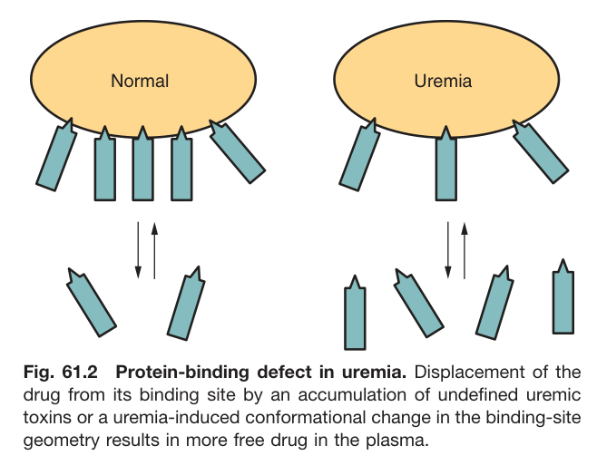

Fig. 61.2 Protein-binding defect in uremia. Displacement of the drug from its binding site by an accumulation of undefined uremic toxins or a uremia-induced conformational change in the binding-site geometry results in more free drug in the plasma.

---

### Fig_61_3

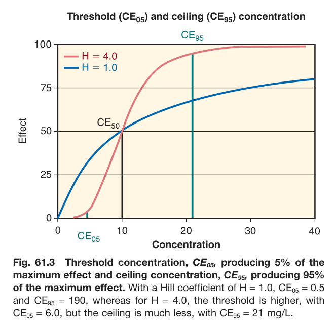

Fig. 61.3 Threshold concentration, CE05, producing 5% of the maximum effect and ceiling concentration, CE95, producing 95% of the maximum effect. With a Hill coefficient of H = 1.0, CE05 = 0.5 and CE95 = 190, whereas for H = 4.0, the threshold is higher, with CE05 = 6.0, but the ceiling is much less, with CE95 = 21 mg/L.

---

### Fig_61_4

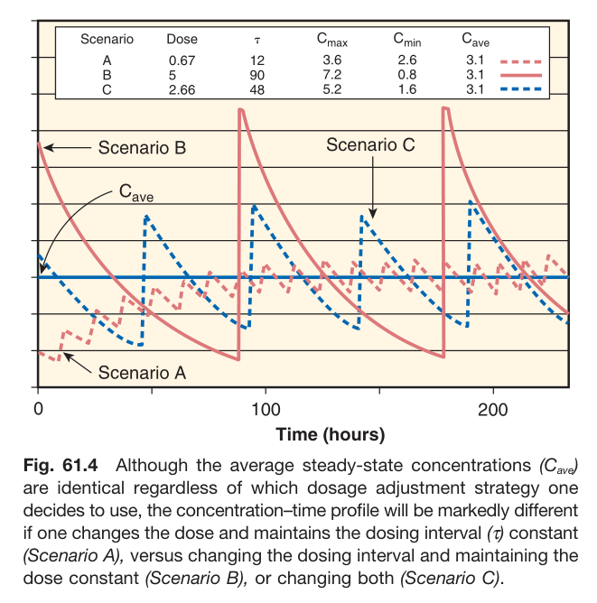

Fig. 61.4 Although the average steady-state concentrations (Cave) are identical regardless of which dosage adjustment strategy one decides to use, the concentration-time profile will be markedly different if one changes the dose and maintains the dosing interval (t) constant (Scenario A), versus changing the dosing interval and maintaining the dose constant (Scenario B), or changing both (Scenario C). An image of a graph showing three different drug concentration profiles over time for three dosing scenarios (A, B, C). All three scenarios result in the same average steady-state concentration (Cave), indicated by a dashed line. Scenario A shows frequent, small peaks and troughs. Scenario B shows infrequent, very high peaks and very low troughs. Scenario C is intermediate between A and B. A table indicates the dose, interval (T), Cmax, Cmin, and Cave for each scenario.

---

### Fig_61_5

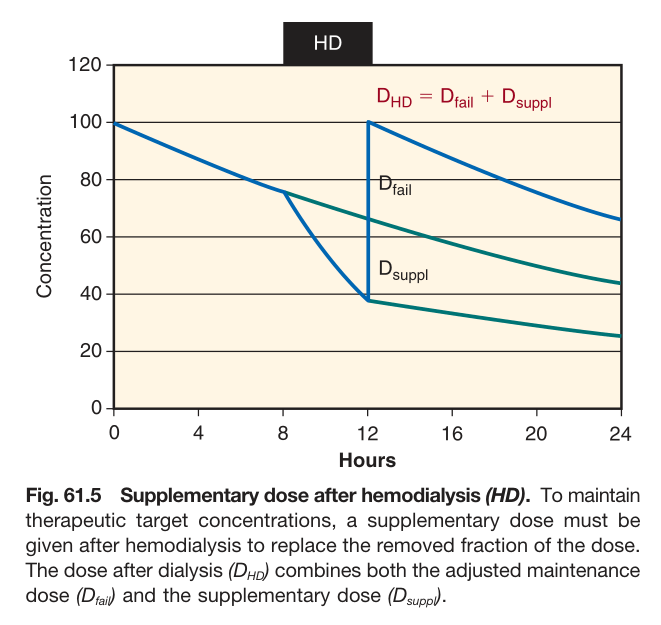

Fig. 61.5 Supplementary dose after hemodialysis (HD). To maintain therapeutic target concentrations, a supplementary dose must be given after hemodialysis to replace the removed fraction of the dose. The dose after dialysis (DHD) combines both the adjusted maintenance dose (Dfail) and the supplementary dose (Dsuppl).

---

## Tables

### Table_61_1

#### Table Image

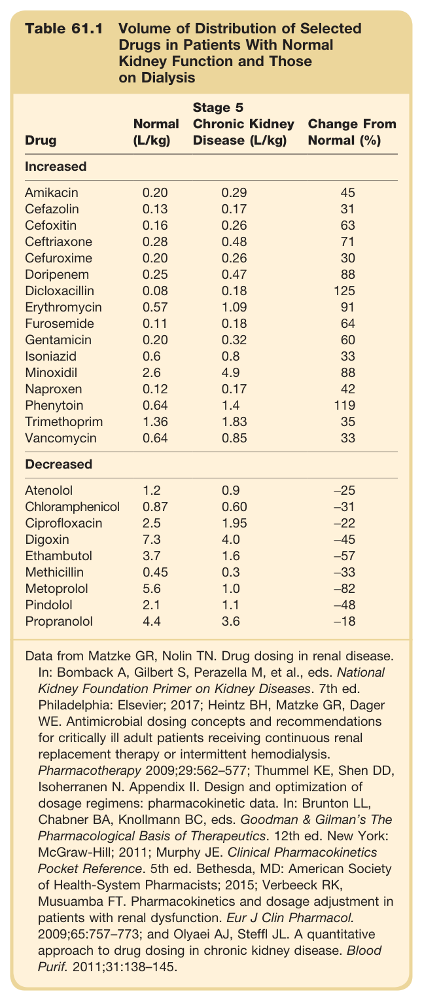

#### Table Data (CSV: [Table_61_1.csv](Table_61_1.csv))

```markdown
| Table Text (OCR) |
| :--- |
| Table 61.1 Volume of Distribution of Selected Drugs in Patients With Normal Kidney Function and Those on Dialysis Drug  Stage 5    Normal (L/kg)  Chronic Kidney Disease (L/kg)  Change From Normal (%)    Increased    Amikacin  0.20  0.29  45    Cefazolin  0.13  0.17  31    Cefoxitin  0.16  0.26  63    Ceftriaxone  0.28  0.48  71    Cefuroxime  0.20  0.26  30    Doripenem  0.25  0.47  88    Dicloxacillin  0.08  0.18  125    Erythromycin  0.57  1.09  91    Furosemide  0.11  0.18  64    Gentamicin  0.20  0.32  60    Isoniazid  0.6  0.8  33    Minoxidil  2.6  4.9  88    Naproxen  0.12  0.17  42    Phenytoin  0.64  1.4  119    Trimethoprim  1.36  1.83  35    Vancomycin  0.64  0.85  33    Decreased    Atenolol  1.2  0.9  -25    Chloramphenicol  0.87  0.60  -31    Ciprofloxacin  2.5  1.95  -22    Digoxin  7.3  4.0  -45    Ethambutol  3.7  1.6  -57    Methicillin  0.45  0.3  -33    Metoprolol  5.6  1.0  -82    Pindolol  2.1  1.1  -48    Propranolol  4.4  3.6  -18 |
```

Table 61.1 Volume of Distribution of Selected Drugs in Patients With Normal Kidney Function and Those on Dialysis | Drug | Normal (L/kg) | Stage 5 Chronic Kidney Disease (L/kg) | Change From Normal (%) | | :--- | :--- | :--- | :--- | | **Increased** | | | | | Amikacin | 0.20 | 0.29 | 45 | | Cefazolin | 0.13 | 0.17 | 31 | | Cefoxitin | 0.16 | 0.26 | 63 | | Ceftriaxone | 0.28 | 0.48 | 71 | | Cefuroxime | 0.20 | 0.26 | 30 | | Doripenem | 0.25 | 0.47 | 88 | | Dicloxacillin | 0.08 | 0.18 | 125 | | Erythromycin | 0.57 | 1.09 | 91 | | Furosemide | 0.11 | 0.18 | 64 | | Gentamicin | 0.20 | 0.32 | 60 | | Isoniazid | 0.6 | 0.8 | 33 | | Minoxidil | 2.6 | 4.9 | 88 | | Naproxen | 0.12 | 0.17 | 42 | | Phenytoin | 0.64 | 1.4 | 119 | | Trimethoprim | 1.36 | 1.83 | 35 | | Vancomycin | 0.64 | 0.85 | 33 | | **Decreased** | | | | | Atenolol | 1.2 | 0.9 | -25 | | Chloramphenicol | 0.87 | 0.60 | -31 | | Ciprofloxacin | 2.5 | 1.95 | -22 | | Digoxin | 7.3 | 4.0 | -45 | | Ethambutol | 3.7 | 1.6 | -57 | | Methicillin | 0.45 | 0.3 | -33 | | Metoprolol | 5.6 | 1.0 | -82 | | Pindolol | 2.1 | 1.1 | -48 | | Propranolol | 4.4 | 3.6 | -18 | Data from Matzke GR, Nolin TN. Drug dosing in renal disease. In: Bomback A, Gilbert S, Perazella M, et al., eds. National Kidney Foundation Primer on Kidney Diseases. 7th ed. Philadelphia: Elsevier; 2017; Heintz BH, Matzke GR, Dager WE. Antimicrobial dosing concepts and recommendations for critically ill adult patients receiving continuous renal replacement therapy or intermittent hemodialysis. Pharmacotherapy 2009;29:562-577; Thummel KE, Shen DD, Isoherranen N. Appendix II. Design and optimization of dosage regimens: pharmacokinetic data. In: Brunton LL, Chabner BA, Knollmann BC, eds. Goodman & Gilman's The Pharmacological Basis of Therapeutics. 12th ed. New York: McGraw-Hill; 2011; Murphy JE. Clinical Pharmacokinetics Pocket Reference. 5th ed. Bethesda, MD: American Society of Health-System Pharmacists; 2015; Verbeeck RK, Musuamba FT. Pharmacokinetics and dosage adjustment in patients with renal dysfunction. Eur J Clin Pharmacol. 2009;65:757-773; and Olyaei AJ, Steffl JL. A quantitative approach to drug dosing in chronic kidney disease. Blood Purif. 2011;31:138-145.

---

### Table_61_2

#### Table Image

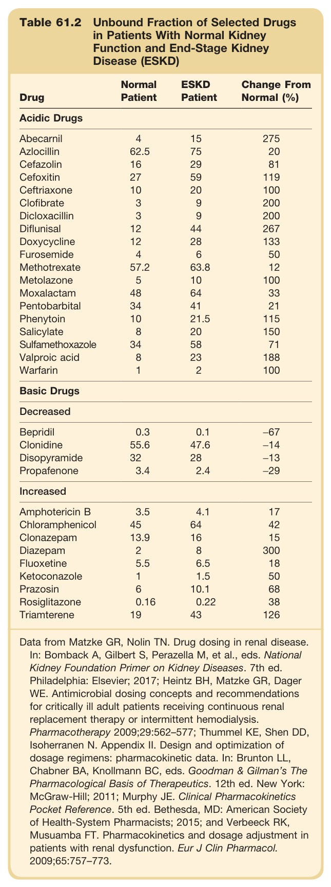

#### Table Data (CSV: [Table_61_2.csv](Table_61_2.csv))

```markdown
| Table Text (OCR) |
| :--- |
| Table 61.2 Unbound Fraction of Selected Drugs in Patients With Normal Kidney Function and End-Stage Kidney Disease (ESKD) Drug  Normal Patient  ESKD Patient  Change From Normal (%)    Acidic Drugs    Abecarnil  4  15  275    Azlocillin  62.5  75  20    Cefazolin  16  29  81    Cefoxitin  27  59  119    Ceftriaxone  10  20  100    Clofibrate  3  9  200    Dicloxacillin  3  9  200    Diflunisal  12  44  267    Doxycycline  12  28  133    Furosemide  4  6  50    Methotrexate  57.2  63.8  12    Metolazone  5  10  100    Moxalactam  48  64  33    Pentobarbital  34  41  21    Phenytoin  10  21.5  115    Salicylate  8  20  150    Sulfamethoxazole  34  58  71    Valproic acid  8  23  188    Warfarin  1  2  100    Basic Drugs    Decreased    Bepridil  0.3  0.1  -67    Clonidine  55.6  47.6  -14    Disopyramide  32  28  -13    Propafenone  3.4  2.4  -29    Increased    Amphotericin B  3.5  4.1  17    Chloramphenicol  45  64  42    Clonazepam  13.9  16  15    Diazepam  2  8  300    Fluoxetine  5.5  6.5  18    Ketoconazole  1  1.5  50    Prazosin  6  10.1  68    Rosiglitazone  0.16  0.22  38    Triamterene  19  43  126 |
```

Table 61.2 Unbound Fraction of Selected Drugs in Patients With Normal Kidney Function and End-Stage Kidney Disease (ESKD) | Drug | Normal Patient | ESKD Patient | Change From Normal (%) | | :--- | :--- | :--- | :--- | | **Acidic Drugs** | | | | | Abecarnil | 4 | 15 | 275 | | Azlocillin | 62.5 | 75 | 20 | | Cefazolin | 16 | 29 | 81 | | Cefoxitin | 27 | 59 | 119 | | Ceftriaxone | 10 | 20 | 100 | | Clofibrate | 3 | 9 | 200 | | Dicloxacillin | 3 | 9 | 200 | | Diflunisal | 12 | 44 | 267 | | Doxycycline | 12 | 28 | 133 | | Furosemide | 4 | 6 | 50 | | Methotrexate | 57.2 | 63.8 | 12 | | Metolazone | 5 | 10 | 100 | | Moxalactam | 48 | 64 | 33 | | Pentobarbital | 34 | 41 | 21 | | Phenytoin | 10 | 21.5 | 115 | | Salicylate | 8 | 20 | 150 | | Sulfamethoxazole | 34 | 58 | 71 | | Valproic acid | 8 | 23 | 188 | | Warfarin | 1 | 2 | 100 | | **Basic Drugs** | | | | | **Decreased** | | | | | Bepridil | 0.3 | 0.1 | -67 | | Clonidine | 55.6 | 47.6 | -14 | | Disopyramide | 32 | 28 | -13 | | Propafenone | 3.4 | 2.4 | -29 | | **Increased** | | | | | Amphotericin B | 3.5 | 4.1 | 17 | | Chloramphenicol | 45 | 64 | 42 | | Clonazepam | 13.9 | 16 | 15 | | Diazepam | 2 | 8 | 300 | | Fluoxetine | 5.5 | 6.5 | 18 | | Ketoconazole | 1 | 1.5 | 50 | | Prazosin | 6 | 10.1 | 68 | | Rosiglitazone | 0.16 | 0.22 | 38 | | Triamterene | 19 | 43 | 126 | Data from Matzke GR, Nolin TN. Drug dosing in renal disease. In: Bomback A, Gilbert S, Perazella M, et al., eds. National Kidney Foundation Primer on Kidney Diseases. 7th ed. Philadelphia: Elsevier; 2017; Heintz BH, Matzke GR, Dager WE. Antimicrobial dosing concepts and recommendations for critically ill adult patients receiving continuous renal replacement therapy or intermittent hemodialysis. Pharmacotherapy 2009;29:562-577; Thummel KE, Shen DD, Isoherranen N. Appendix II. Design and optimization of dosage regimens: pharmacokinetic data. In: Brunton LL, Chabner BA, Knollmann BC, eds. Goodman & Gilman's The Pharmacological Basis of Therapeutics. 12th ed. New York: McGraw-Hill; 2011; Murphy JE. Clinical Pharmacokinetics Pocket Reference. 5th ed. Bethesda, MD: American Society of Health-System Pharmacists; 2015; and Verbeeck RK, Musuamba FT. Pharmacokinetics and dosage adjustment in patients with renal dysfunction. Eur J Clin Pharmacol. 2009;65:757-773.

---

### Table_61_3

#### Table Image

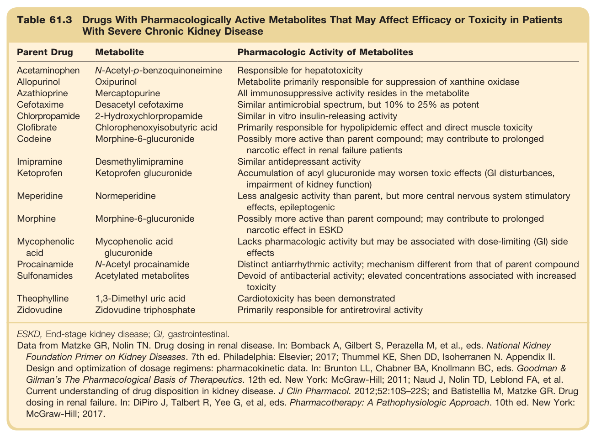

#### Table Data (CSV: [Table_61_3.csv](Table_61_3.csv))

```markdown
| Table Text (OCR) |
| :--- |
| Table 61.3 Drugs With Pharmacologically Active Metabolites That May Affect Efficacy or Toxicity in Patients With Severe Chronic Kidney Disease Parent Drug  Metabolite  Pharmacologic Activity of Metabolites    Acetaminophen  N-Acetyl-p-benzoquinoneimine  Responsible for hepatotoxicity    Allopurinol  Oxipurinol  Metabolite primarily responsible for suppression of xanthine oxidase    Azathioprine  Mercaptopurine  All immunosuppressive activity resides in the metabolite    Cefotaxime  Desacetyl cefotaxime  Similar antimicrobial spectrum, but 10% to 25% as potent    Chlorpropamide  2-Hydroxychlorpropamide  Similar in vitro insulin-releasing activity    Clofibrate  Chlorophenoxyisobutyric acid  Primarily responsible for hypolipidemic effect and direct muscle toxicity    Codeine  Morphine-6-glucuronide  Possibly more active than parent compound; may contribute to prolonged narcotic effect in renal failure patients    Imipramine  Desmethylimipramine  Similar antidepressant activity    Ketoprofen  Ketoprofen glucuronide  Accumulation of acyl glucuronide may worsen toxic effects (GI disturbances, impairment of kidney function)    Meperidine  Normeperidine  Less analgesic activity than parent, but more central nervous system stimulatory effects, epileptogenic    Morphine  Morphine-6-glucuronide  Possibly more active than parent compound; may contribute to prolonged narcotic effect in ESKD    Mycophenolic acid  Mycophenolic acid glucuronide  Lacks pharmacologic activity but may be associated with dose-limiting (GI) side effects    Procainamide  N-Acetyl procainamide  Distinct antiarrhythmic activity; mechanism different from that of parent compound    Sulfonamides  Acetylated metabolites  Devoid of antibacterial activity; elevated concentrations associated with increased toxicity    Theophylline  1,3-Dimethyl uric acid  Cardiotoxicity has been demonstrated    Zidovudine  Zidovudine triphosphate  Primarily responsible for antiretroviral activity ESKD, End-stage kidney disease; GI, gastrointestinal. Data from Matzke GR, Nolin TN. Drug dosing in renal disease. In: Bomback A, Gilbert S, Perazella M, et al., eds. National Kidney Foundation Primer on Kidney Diseases. 7th ed. Philadelphia: Elsevier; 2017; Thummel KE, Shen DD, Isoherranen N. Appendix II. Design and optimization of dosage regimens: pharmacokinetic data. In: Brunton LL, Chabner BA, Knollmann BC, eds. Goodman & Gilman’s The Pharmacological Basis of Therapeutics. 12th ed. New York: McGraw-Hill; 2011; Naud J, Nolin TD, Leblond FA, et al. Current understanding of drug disposition in kidney disease. J Clin Pharmacol. 2012;52:10S–22S; and Batistellia M, Matzke GR. Drug dosing in renal failure. In: DiPiro J, Talbert R, Yee G, et al, eds. Pharmacotherapy: A Pathophysiologic Approach. 10th ed. New York: McGraw-Hill; 2017. |
```

Table 61.3 Drugs With Pharmacologically Active Metabolites That May Affect Efficacy or Toxicity in Patients With Severe Chronic Kidney Disease | Parent Drug | Metabolite | Pharmacologic Activity of Metabolites | | :--- | :--- | :--- | | Acetaminophen | N-Acetyl-p-benzoquinoneimine | Responsible for hepatotoxicity | | Allopurinol | Oxipurinol | Metabolite primarily responsible for suppression of xanthine oxidase | | Azathioprine | Mercaptopurine | All immunosuppressive activity resides in the metabolite | | Cefotaxime | Desacetyl cefotaxime | Similar antimicrobial spectrum, but 10% to 25% as potent | | Chlorpropamide | 2-Hydroxychlorpropamide | Similar in vitro insulin-releasing activity | | Clofibrate | Chlorophenoxyisobutyric acid | Primarily responsible for hypolipidemic effect and direct muscle toxicity | | Codeine | Morphine-6-glucuronide | Possibly more active than parent compound; may contribute to prolonged narcotic effect in renal failure patients | | Imipramine | Desmethylimipramine | Similar antidepressant activity | | Ketoprofen | Ketoprofen glucuronide | Accumulation of acyl glucuronide may worsen toxic effects (Gl disturbances, impairment of kidney function) | | Meperidine | Normeperidine | Less analgesic activity than parent, but more central nervous system stimulatory effects, epileptogenic | | Morphine | Morphine-6-glucuronide | Possibly more active than parent compound; may contribute to prolonged narcotic effect in ESKD | | Mycophenolic acid | Mycophenolic acid glucuronide | Lacks pharmacologic activity but may be associated with dose-limiting (GI) side effects | | Procainamide | N-Acetyl procainamide | Distinct antiarrhythmic activity; mechanism different from that of parent compound | | Sulfonamides | Acetylated metabolites | Devoid of antibacterial activity; elevated concentrations associated with increased toxicity | | Theophylline | 1,3-Dimethyl uric acid | Cardiotoxicity has been demonstrated | | Zidovudine | Zidovudine triphosphate | Primarily responsible for antiretroviral activity | ESKD, End-stage kidney disease; Gl, gastrointestinal. Data from Matzke GR, Nolin TN. Drug dosing in renal disease. In: Bomback A, Gilbert S, Perazella M, et al., eds. National Kidney Foundation Primer on Kidney Diseases. 7th ed. Philadelphia: Elsevier; 2017; Thummel KE, Shen DD, Isoherranen N. Appendix II. Design and optimization of dosage regimens: pharmacokinetic data. In: Brunton LL, Chabner BA, Knollmann BC, eds. Goodman & Gilman's The Pharmacological Basis of Therapeutics. 12th ed. New York: McGraw-Hill; 2011; Naud J, Nolin TD, Leblond FA, et al. Current understanding of drug disposition in kidney disease. J Clin Pharmacol. 2012;52:10S-22S; and Batistellia M, Matzke GR. Drug dosing in renal failure. In: DiPiro J, Talbert R, Yee G, et al, eds. Pharmacotherapy: A Pathophysiologic Approach. 10th ed. New York: McGraw-Hill; 2017.

---

### Table_61_4

#### Table Image

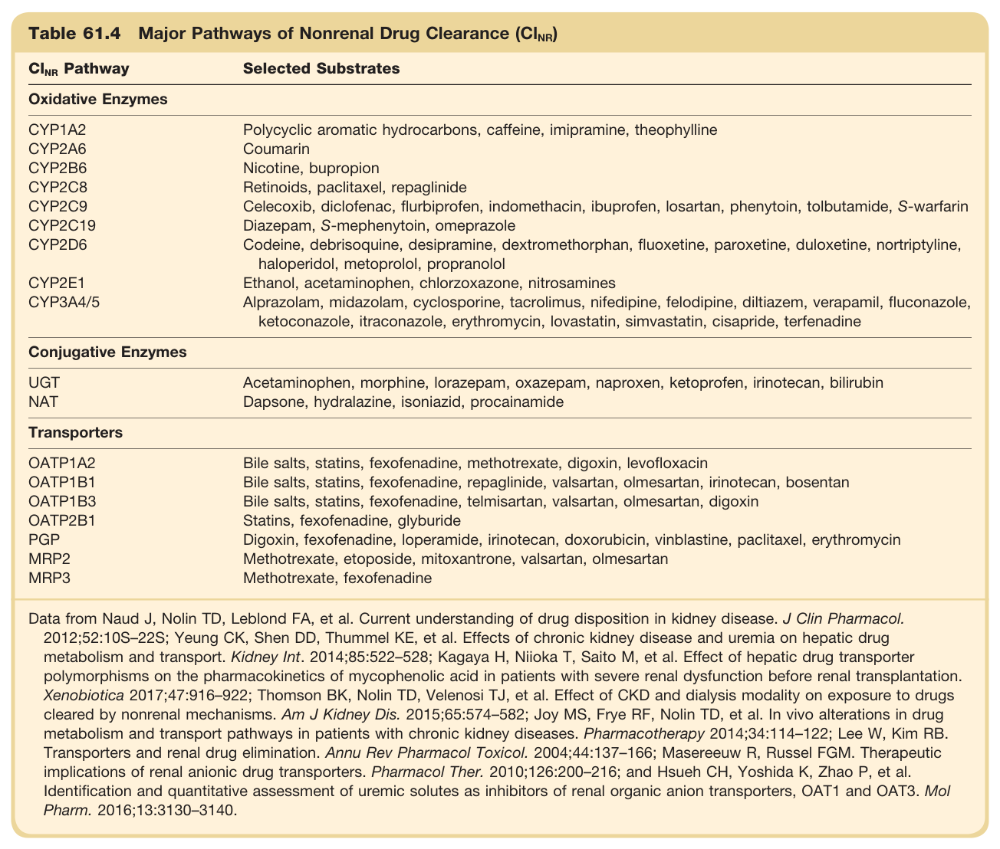

#### Table Data (CSV: [Table_61_4.csv](Table_61_4.csv))

```markdown
| Table Text (OCR) |
| :--- |
| Table 61.4 Major Pathways of Nonrenal Drug Clearance (Cl<sub>NR</sub>) Cl_{NR}  Pathway  Selected Substrates    Oxidative Enzymes    CYP1A2  Polycyclic aromatic hydrocarbons, caffeine, imipramine, theophylline    CYP2A6  Coumarin    CYP2B6  Nicotine, bupropion    CYP2C8  Retinoids, paclitaxel, repaglinide    CYP2C9  Celecoxib, diclofenac, flurbiprofen, indomethacin, ibuprofen, losartan, phenytoin, tolbutamide, S-warfarin    CYP2C19  Diazepam, S-mephenytoin, omeprazole    CYP2D6  Codeine, debrisoquine, desipramine, dextromethorphan, fluoxetine, paroxetine, duloxetine, nortriptyline, haloperidol, metoprolol, propranolol    CYP2E1  Ethanol, acetaminophen, chlorzoxazone, nitrosamines    CYP3A4/5  Alprazolam, midazolam, cyclosporine, tacrolimus, nifedipine, felodipine, diltiazem, verapamil, fluconazole, ketoconazole, itraconazole, erythromycin, lovastatin, simvastatin, cisapride, terfenadine    Conjugative Enzymes    UGT  Acetaminophen, morphine, lorazepam, oxazepam, naproxen, ketoprofen, irinotecan, bilirubin    NAT  Dapsone, hydralazine, isoniazid, procainamide    Transporters    OATP1A2  Bile salts, statins, fexofenadine, methotrexate, digoxin, levofloxacin    OATP1B1  Bile salts, statins, fexofenadine, repaglinide, valsartan, olmesartan, irinotecan, bosentan    OATP1B3  Bile salts, statins, fexofenadine, telmisartan, valsartan, olmesartan, digoxin    OATP2B1  Statins, fexofenadine, glyburide    PGP  Digoxin, fexofenadine, loperamide, irinotecan, doxorubicin, vinblastine, paclitaxel, erythromycin    MRP2  Methotrexate, etoposide, mitoxantrone, valsartan, olmesartan    MRP3  Methotrexate, fexofenadine    Data from Naud J, Nolin TD, Leblond FA, et al. Current understanding of drug disposition in kidney disease. J Clin Pharmacol. 2012;52:10S-22S; Yeung CK, Shen DD, Thummel KE, et al. Effects of chronic kidney disease and uremia on hepatic drug metabolism and transport. Kidney Int. 2014;85:522-528; Kagaya H, Niioka T, Saito M, et al. Effect of hepatic drug transporter polymorphisms on the pharmacokinetics of mycophenolic acid in patients with severe renal dysfunction before renal transplantation. Xenobiotica 2017;47:916-922; Thomson BK, Nolin TD, Velenosi TJ, et al. Effect of CKD and dialysis modality on exposure to drugs cleared by nonrenal mechanisms. Am J Kidney Dis. 2015;65:574-582; Joy MS, Frye RF, Nolin TD, et al. In vivo alterations in drug metabolism and transport pathways in patients with chronic kidney diseases. Pharmacotherapy 2014;34:114-122; Lee W, Kim RB. Transporters and renal drug elimination. Annu Rev Pharmacol Toxicol. 2004;44:137-166; Masereeuw R, Russel FGM. Therapeutic implications of renal anionic drug transporters. Pharmacol Ther. 2010;126:200-216; and Hsueh CH, Yoshida K, Zhao P, et al. Identification and quantitative assessment of uremic solutes as inhibitors of renal organic anion transporters, OAT1 and OAT3. Mol Pharm. 2016;13:3130-3140. |
```

Table 61.4 Major Pathways of Nonrenal Drug Clearance (ClNR) | ClNR Pathway | Selected Substrates | | :--- | :--- | | **Oxidative Enzymes** | | | CYP1A2 | Polycyclic aromatic hydrocarbons, caffeine, imipramine, theophylline | | CYP2A6 | Coumarin | | CYP2B6 | Nicotine, bupropion | | CYP2C8 | Retinoids, paclitaxel, repaglinide | | CYP2C9 | Celecoxib, diclofenac, flurbiprofen, indomethacin, ibuprofen, losartan, phenytoin, tolbutamide, S-warfarin | | CYP2C19 | Diazepam, S-mephenytoin, omeprazole | | CYP2D6 | Codeine, debrisoquine, desipramine, dextromethorphan, fluoxetine, paroxetine, duloxetine, nortriptyline, haloperidol, metoprolol, propranolol | | CYP2E1 | Ethanol, acetaminophen, chlorzoxazone, nitrosamines | | CYP3A4/5 | Alprazolam, midazolam, cyclosporine, tacrolimus, nifedipine, felodipine, diltiazem, verapamil, fluconazole, ketoconazole, itraconazole, erythromycin, lovastatin, simvastatin, cisapride, terfenadine | | **Conjugative Enzymes** | | | UGT | Acetaminophen, morphine, lorazepam, oxazepam, naproxen, ketoprofen, irinotecan, bilirubin | | NAT | Dapsone, hydralazine, isoniazid, procainamide | | **Transporters** | | | OATP1A2 | Bile salts, statins, fexofenadine, methotrexate, digoxin, levofloxacin | | OATP1B1 | Bile salts, statins, fexofenadine, repaglinide, valsartan, olmesartan, irinotecan, bosentan | | OATP1B3 | Bile salts, statins, fexofenadine, telmisartan, valsartan, olmesartan, digoxin | | OATP2B1 | Statins, fexofenadine, glyburide | | PGP | Digoxin, fexofenadine, loperamide, irinotecan, doxorubicin, vinblastine, paclitaxel, erythromycin | | MRP2 | Methotrexate, etoposide, mitoxantrone, valsartan, olmesartan | | MRP3 | Methotrexate, fexofenadine | Data from Naud J, Nolin TD, Leblond FA, et al. Current understanding of drug disposition in kidney disease. J Clin Pharmacol. 2012;52:10S-22S; Yeung CK, Shen DD, Thummel KE, et al. Effects of chronic kidney disease and uremia on hepatic drug metabolism and transport. Kidney Int. 2014;85:522-528; Kagaya H, Niioka T, Saito M, et al. Effect of hepatic drug transporter polymorphisms on the pharmacokinetics of mycophenolic acid in patients with severe renal dysfunction before renal transplantation. Xenobiotica 2017;47:916–922; Thomson BK, Nolin TD, Velenosi TJ, et al. Effect of CKD and dialysis modality on exposure to drugs cleared by nonrenal mechanisms. Am J Kidney Dis. 2015;65:574-582; Joy MS, Frye RF, Nolin TD, et al. In vivo alterations in drug metabolism and transport pathways in patients with chronic kidney diseases. Pharmacotherapy 2014;34:114-122; Lee W, Kim RB. Transporters and renal drug elimination. Annu Rev Pharmacol Toxicol. 2004;44:137-166; Masereeuw R, Russel FGM. Therapeutic implications of renal anionic drug transporters. Pharmacol Ther. 2010;126:200-216; and Hsueh CH, Yoshida K, Zhao P, et al. Identification and quantitative assessment of uremic solutes as inhibitors of renal organic anion transporters, OAT1 and OAT3. Mol Pharm. 2016;13:3130-3140.

---

### Table_61_5

#### Table Image

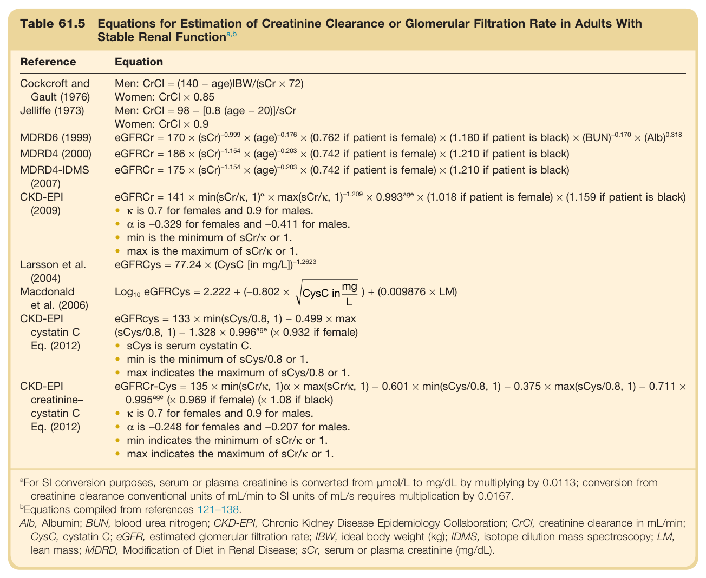

#### Table Data (CSV: [Table_61_5.csv](Table_61_5.csv))

```markdown
| Table Text (OCR) |
| :--- |
| Table 61.5 Equations for Estimation of Creatinine Clearance or Glomerular Filtration Rate in Adults With Stable Renal Function<sup>a,b</sup> Reference  Equation    Cockcroft and Gault (1976)  Men: CrCl = (140 - age)IBW/(sCr × 72)Women: CrCl × 0.85    Jelliffe (1973)  Men: CrCl = 98 - [0.8 (age - 20)]/sCrWomen: CrCl × 0.9    MDRD6 (1999)   eGFRCr = 170 \times (sCr)^{-0.999} \times (age)^{-0.176} \times (0.762 \text{ if patient is female}) \times (1.180 \text{ if patient is black}) \times (BUN)^{-0.170} \times (Alb)^{0.318}     MDRD4 (2000)   eGFRCr = 186 \times (sCr)^{-1.154} \times (age)^{-0.203} \times (0.742 \text{ if patient is female}) \times (1.210 \text{ if patient is black})     MDRD4-IDMS (2007)   eGFRCr = 175 \times (sCr)^{-1.154} \times (age)^{-0.203} \times (0.742 \text{ if patient is female}) \times (1.210 \text{ if patient is black})     CKD-EPI (2009)   eGFRCr = 141 \times \min(sCr/\kappa, 1)^{\alpha} \times \max(sCr/\kappa, 1)^{-1.209} \times 0.993^{age} \times (1.018 \text{ if patient is female}) \times (1.159 \text{ if patient is black}) ·κ is 0.7 for females and 0.9 for males.·α is -0.329 for females and -0.411 for males.·min is the minimum of sCr/κ or 1.·max is the maximum of sCr/κ or 1.    Larsson et al. (2004)   eGFRCys = 77.24 \times (CysC [in mg/L])^{-1.2623}     Macdonald et al. (2006)   Log_{10} eGFRCys = 2.222 + (-0.802 \times \sqrt{CysC in \frac{mg}{L}}) + (0.009876 \times LM)     CKD-EPI cystatin C Eq. (2012)   eGFRCys = 133 \times \min(sCys/0.8, 1) - 0.499 \times \max(sCys/0.8, 1) - 1.328 \times 0.996^{age} \times 0.932 \text{ if female}) ·sCys is serum cystatin C.·min is the minimum of sCys/0.8 or 1.·max indicates the maximum of sCys/0.8 or 1.    CKD-EPI creatinine-cystatin C Eq. (2012)   eGFRCr-Cys = 135 \times \min(sCr/\kappa, 1)\alpha \times \max(sCr/\kappa, 1) - 0.601 \times \min(sCys/0.8, 1) - 0.375 \times \max(sCys/0.8, 1) - 0.711 \times 0.995^{age} \times 0.969 \text{ if female}) \times 1.08 \text{ if black}) ·κ is 0.7 for females and 0.9 for males.·α is -0.248 for females and -0.207 for males.·min indicates the minimum of sCr/κ or 1.·max indicates the maximum of sCr/κ or 1. <sup>a</sup>For SI conversion purposes, serum or plasma creatinine is converted from µmol/L to mg/dL by multiplying by 0.0113; conversion from creatinine clearance conventional units of mL/min to SI units of mL/s requires multiplication by 0.0167. <sup>b</sup>Equations compiled from references 121–138. Alb, Albumin; BUN, blood urea nitrogen; CKD-EPI, Chronic Kidney Disease Epidemiology Collaboration; CrCl, creatinine clearance in mL/min; CysC, cystatin C; eGFR, estimated glomerular filtration rate; IBW, ideal body weight (kg); IDMS, isotope dilution mass spectroscopy; LM, lean mass; MDRD, Modification of Diet in Renal Disease; sCr, serum or plasma creatinine (mg/dL). |
```

Table 61.5 Equations for Estimation of Creatinine Clearance or Glomerular Filtration Rate in Adults With Stable Renal Functiona,b | Reference | Equation | | :--- | :--- | | Cockcroft and Gault (1976) | Men: CrCl = (140 - age)IBW/(sCr × 72)<br>Women: CrCl × 0.85 | | Jelliffe (1973) | Men: CrCl = 98 - [0.8 (age - 20)]/sCr<br>Women: CrCl × 0.9 | | MDRD6 (1999) | eGFRCr = 170 × (sCr)^-0.999 × (age)^-0.176 x (0.762 if patient is female) × (1.180 if patient is black) × (BUN)^-0.170 × (Alb)^0.318 | | MDRD4 (2000) | eGFRCr = 186 × (sCr)^-1.154 × (age)^-0.203 × (0.742 if patient is female) × (1.210 if patient is black) | | MDRD4-IDMS (2007) | eGFRCr = 175 × (sCr)^-1.154 × (age)^-0.203 × (0.742 if patient is female) × (1.210 if patient is black) | | CKD-EPI (2009) | eGFRCr = 141 × min(sCr/к, 1)^a × max(sCr/к, 1)^-1.209 × 0.993^age × (1.018 if patient is female) × (1.159 if patient is black)<br>• к is 0.7 for females and 0.9 for males.<br>• a is -0.329 for females and -0.411 for males.<br>• min is the minimum of sCr/k or 1.<br>• max is the maximum of sCr/k or 1. | | Larsson et al. (2004) | eGFRCys = 77.24 × (CysC [in mg/L])^-1.2623 | | Macdonald et al. (2006) | Log10 eGFRCys = 2.222 + (-0.802 × CysC in mg/L) + (0.009876 × LM) | | CKD-EPI cystatin C Eq. (2012) | eGFRcys = 133 × min(sCys/0.8, 1)^–0.499 × max(sCys/0.8, 1)^1.328 × 0.996^age (x 0.932 if female)<br>• sCys is serum cystatin C.<br>• min is the minimum of sCys/0.8 or 1.<br>• max indicates the maximum of sCys/0.8 or 1. | | CKD-EPI creatinine-cystatin C Eq. (2012) | eGFRCr-Cys = 135 × min(sCr/к, 1)^α × max(sCr/к, 1)^–0.601 × min(sCys/0.8, 1)^–0.375 × max(sCys/0.8, 1)^–0.711 × 0.995^age (x 0.969 if female) (x 1.08 if black)<br>• к is 0.7 for females and 0.9 for males.<br>• a is -0.248 for females and -0.207 for males.<br>• min indicates the minimum of sCr/к or 1.<br>• max indicates the maximum of sCr/к or 1. | For Sl conversion purposes, serum or plasma creatinine is converted from µmol/L to mg/dL by multiplying by 0.0113; conversion from creatinine clearance conventional units of mL/min to Sl units of mL/s requires multiplication by 0.0167. Equations compiled from references. Alb, Albumin; BUN, blood urea nitrogen; CKD-EPI, Chronic Kidney Disease Epidemiology Collaboration; CrCl, creatinine clearance in mL/min; CysC, cystatin C; eGFR, estimated glomerular filtration rate; IBW, ideal body weight (kg); IDMS, isotope dilution mass spectroscopy; LM, lean mass; MDRD, Modification of Diet in Renal Disease; sCr, serum or plasma creatinine (mg/dL).

---

### Table_61_6

#### Table Image

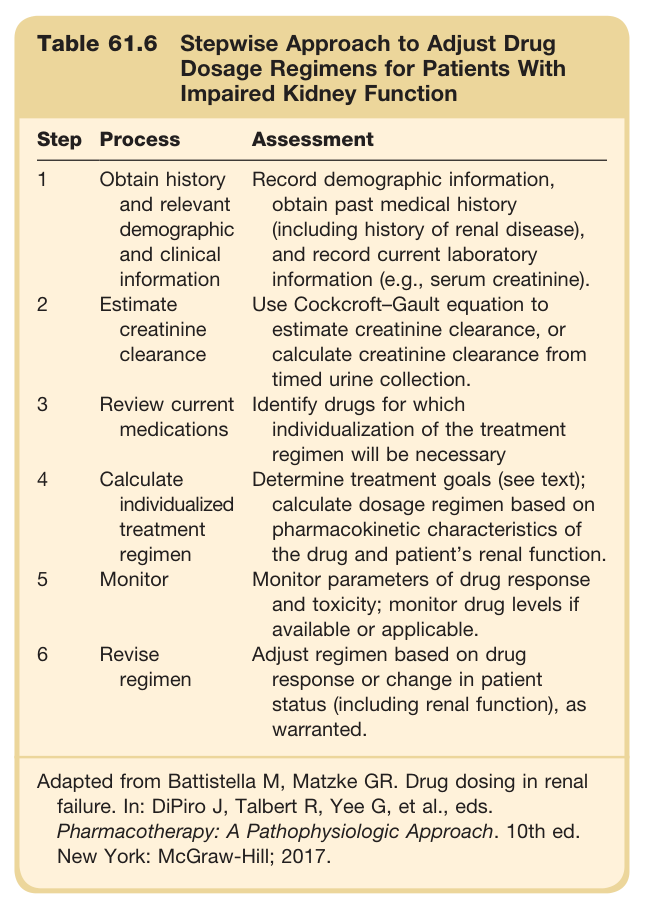

#### Table Data (CSV: [Table_61_6.csv](Table_61_6.csv))

```markdown
| Table Text (OCR) |
| :--- |
| Table 61.6 Stepwise Approach to Adjust Drug Dosage Regimens for Patients With Impaired Kidney Function Step  Process  Assessment    1  Obtain history and relevant demographic and clinical information  Record demographic information, obtain past medical history (including history of renal disease), and record current laboratory information (e.g., serum creatinine).    2  Estimate creatinine clearance  Use Cockcroft-Gault equation to estimate creatinine clearance, or calculate creatinine clearance from timed urine collection.    3  Review current medications  Identify drugs for which individualization of the treatment regimen will be necessary    4  Calculate individualized treatment regimen  Determine treatment goals (see text); calculate dosage regimen based on pharmacokinetic characteristics of the drug and patient’s renal function.    5  Monitor  Monitor parameters of drug response and toxicity; monitor drug levels if available or applicable.    6  Revise regimen  Adjust regimen based on drug response or change in patient status (including renal function), as warranted. Adapted from Battistella M, Matzke GR. Drug dosing in renal failure. In: DiPiro J, Talbert R, Yee G, et al., eds. Pharmacotherapy: A Pathophysiologic Approach. 10th ed. New York: McGraw-Hill; 2017. |
```

Table 61.6 Stepwise Approach to Adjust Drug Dosage Regimens for Patients With Impaired Kidney Function | Step | Process | Assessment | | :--- | :--- | :--- | | 1 | Obtain history and relevant demographic and clinical information | Record demographic information, obtain past medical history (including history of renal disease), and record current laboratory information (e.g., serum creatinine). | | 2 | Estimate creatinine clearance | Use Cockcroft-Gault equation to estimate creatinine clearance, or calculate creatinine clearance from timed urine collection. | | 3 | Review current medications | Identify drugs for which individualization of the treatment regimen will be necessary | | 4 | Calculate individualized treatment regimen | Determine treatment goals (see text); calculate dosage regimen based on pharmacokinetic characteristics of the drug and patient's renal function. | | 5 | Monitor | Monitor parameters of drug response and toxicity; monitor drug levels if available or applicable. | | 6 | Revise regimen | Adjust regimen based on drug response or change in patient status (including renal function), as warranted. | Adapted from Battistella M, Matzke GR. Drug dosing in renal failure. In: DiPiro J, Talbert R, Yee G, et al., eds. Pharmacotherapy: A Pathophysiologic Approach. 10th ed. New York: McGraw-Hill; 2017.

---

### Table_61_7

#### Table Image

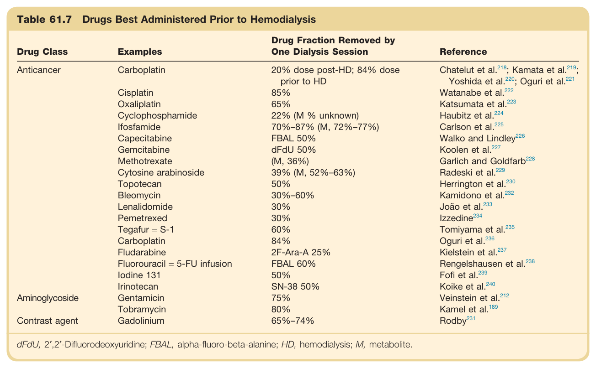

#### Table Data (CSV: [Table_61_7.csv](Table_61_7.csv))

```markdown
| Table Text (OCR) |
| :--- |
| Table 61.7 Drugs Best Administered Prior to Hemodialysis Drug Class  Examples  Drug Fraction Removed by One Dialysis Session  Reference    Anticancer  Carboplatin  20% dose post-HD; 84% dose prior to HD  Chatelut et al.218; Kamata et al.219; Yoshida et al.220; Oguri et al.221    Cisplatin  85%  Watanabe et al.222    Oxaliplatin  65%  Katsumata et al.223    Cyclophosphamide  22% (M % unknown)  Haubitz et al.224    Ifosfamide  70%-87% (M, 72%-77%)  Carlson et al.225    Capecitabine  FBAL 50%  Walko and Lindley226    Gemcitabine  dFdU 50%  Koolen et al.227    Methotrexate  (M, 36%)  Garlich and Goldfarb228    Cytosine arabinoside  39% (M, 52%-63%)  Radeski et al.229    Topotecan  50%  Herrington et al.230    Bleomycin  30%-60%  Kamidono et al.232    Lenalidomide  30%  João et al.233    Pemetrexed  30%  Izzedine234    Tegafur = S-1  60%  Tomiyama et al.235    Carboplatin  84%  Oguri et al.236    Fludarabine  2F-Ara-A 25%  Kielstein et al.237    Fluorouracil = 5-FU infusion  FBAL 60%  Rengelshausen et al.238    Iodine 131  50%  Fofi et al.239    Irinotecan  SN-38 50%  Koike et al.240    Aminoglycoside  Gentamicin  75%  Veinstein et al.212    Tobramycin  80%  Kamel et al.189    Contrast agent  Gadolinium  65%-74%  Rodby231 dFdU, 2′,2′-Difluorodeoxyuridine; FBAL, alpha-fluoro-beta-alanine; HD, hemodialysis; M, metabolite. |
```

Table 61.7 Drugs Best Administered Prior to Hemodialysis | Drug Class | Examples | Drug Fraction Removed by One Dialysis Session | Reference | | :--- | :--- | :--- | :--- | | Anticancer | Carboplatin | 20% dose post-HD; 84% dose prior to HD | Chatelut et al.; Kamata et al., Yoshida et al.; Oguri et al. | | | Cisplatin | 85% | Watanabe et al. | | | Oxaliplatin | 65% | Katsumata et al. | | | Cyclophosphamide | 22% (M% unknown) | Haubitz et al. | | | Ifosfamide | 70%-87% (M, 72%-77%) | Carlson et al. | | | Capecitabine | FBAL 50% | Walko and Lindley | | | Gemcitabine | dFdU 50% | Koolen et al. | | | Methotrexate | (Μ, 36%) | Garlich and Goldfarb | | | Cytosine arabinoside | 39% (Μ, 52%-63%) | Radeski et al. | | | Topotecan | 50% | Herrington et al. | | | Bleomycin | 30%-60% | Kamidono et al. | | | Lenalidomide | 30% | João et al. | | | Pemetrexed | 30% | Izzedine | | | Tegafur = S-1 | 60% | Tomiyama et al. | | | Carboplatin | 84% | Oguri et al. | | | Fludarabine | 2F-Ara-A 25% | Kielstein et al. | | | Fluorouracil = 5-FU infusion | FBAL 60% | Rengelshausen et al. | | | lodine 131 | 50% | Fofi et al. | | | Irinotecan | SN-38 50% | Koike et al. | | Aminoglycoside | Gentamicin | 75% | Veinstein et al. | | | Tobramycin | 80% | Kamel et al. | | Contrast agent | Gadolinium | 65%-74% | Rodby | dFdU, 2',2'-Difluorodeoxyuridine; FBAL, alpha-fluoro-beta-alanine; HD, hemodialysis; M, metabolite.

---

### Table_61_8

#### Table Images (6 Parts)

- **Part 1 (Page 20)**:
  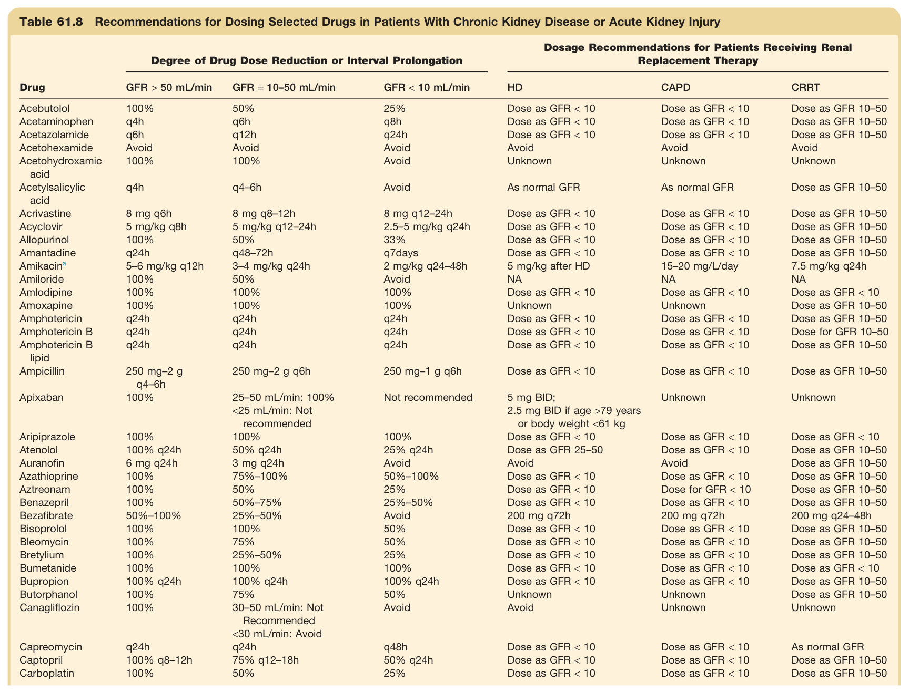

- **Part 2 (Page 21)**:
  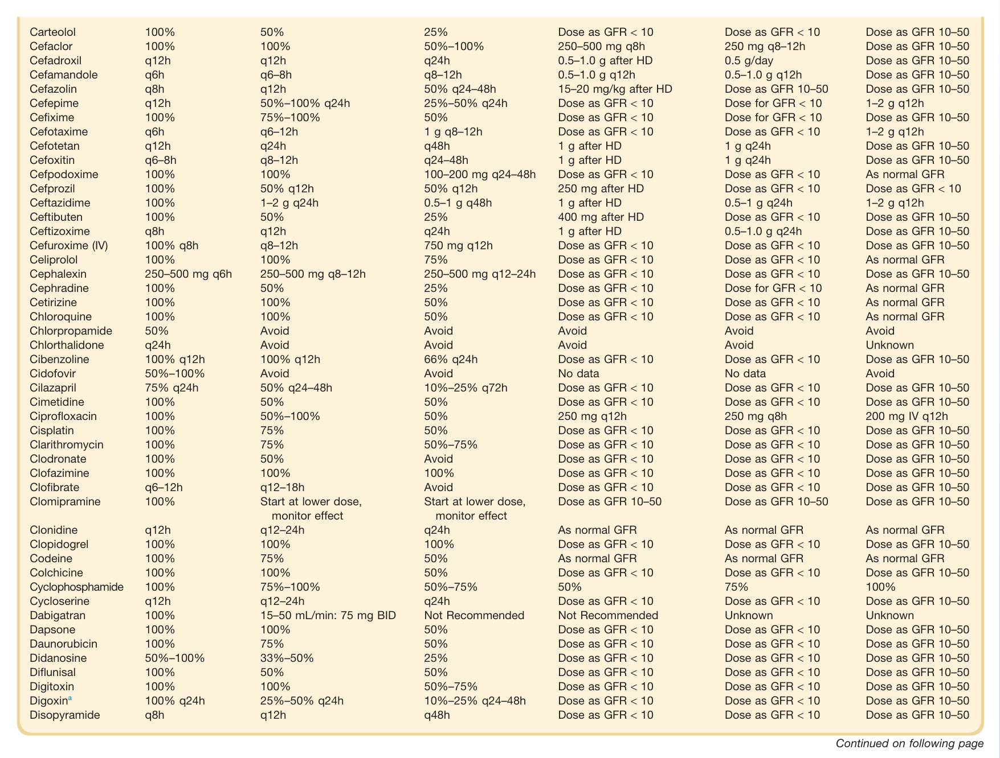

- **Part 3 (Page 22)**:
  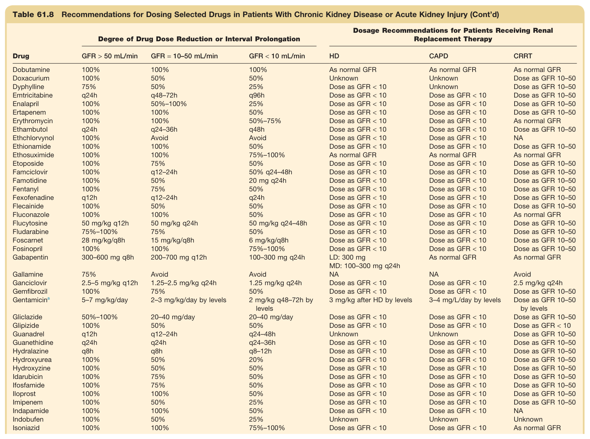

- **Part 4 (Page 23)**:
  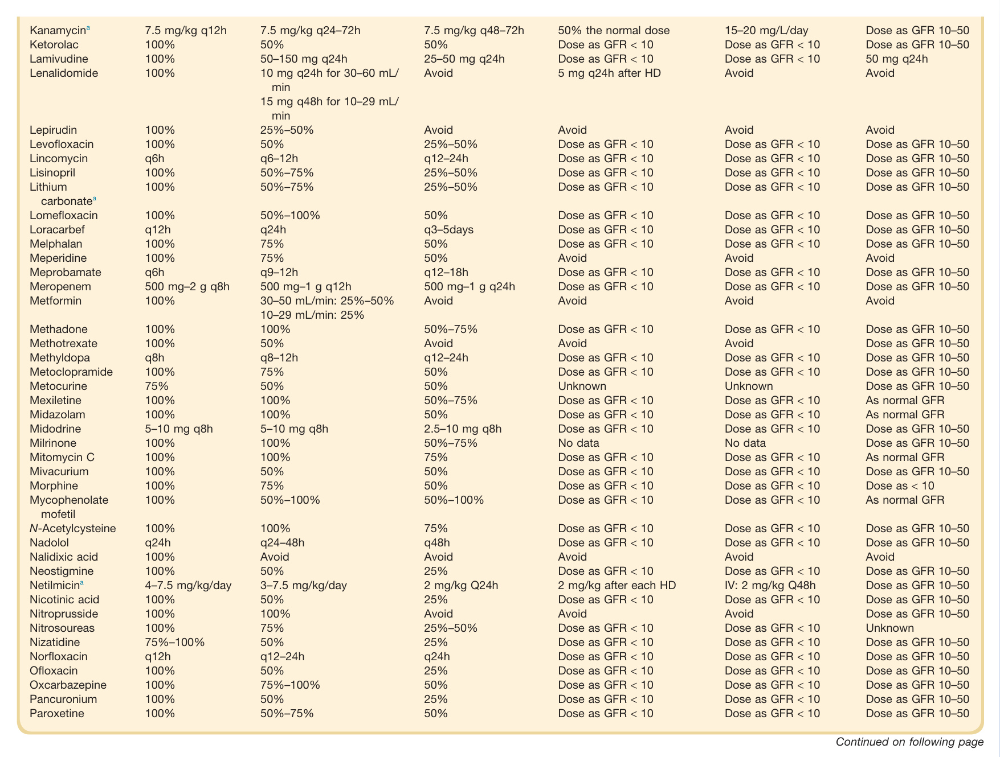

- **Part 5 (Page 24)**:
  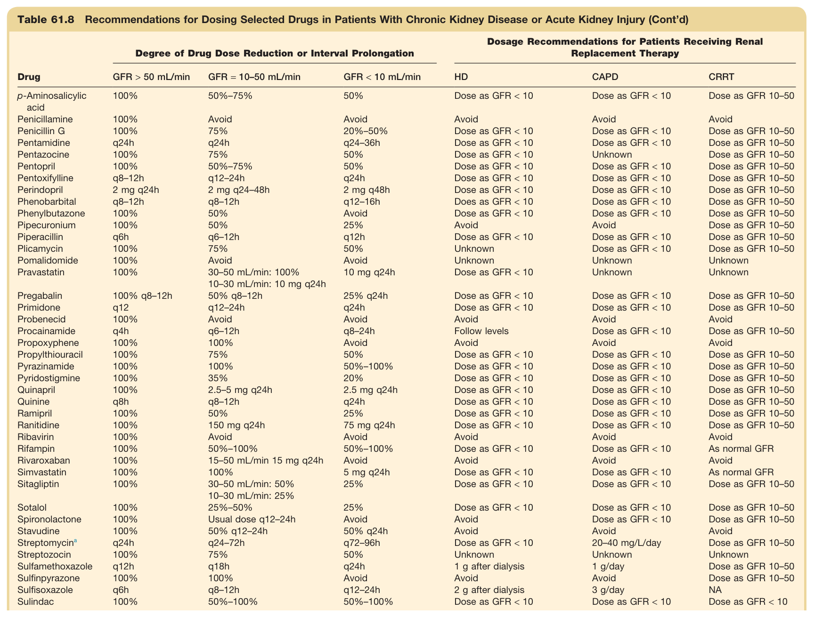

- **Part 6 (Page 25)**:
  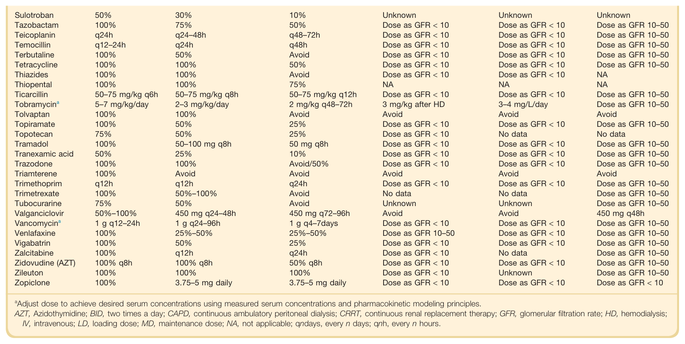

#### Table Data (CSV: [Table_61_8.csv](Table_61_8.csv))

```markdown
| Table Text (OCR) |
| :--- |
| Table 61.8 Recommendations for Dosing Selected Drugs in Patients With Chronic Kidney Disease or Acute Kidney Injury A multi-page table providing dosing recommendations for various drugs based on glomerular filtration rate (GFR) categories (>50, 10-50, <10 mL/min) and for patients receiving renal replacement therapies (HD, CAPD, CRRT). The table lists drugs alphabetically and provides dose reduction percentages or interval prolongations for each GFR category, followed by specific dosing guidance for each type of renal replacement therapy. |
```

Table 61.8 Recommendations for Dosing Selected Drugs in Patients With Chronic Kidney Disease or Acute Kidney Injury A multi-page table providing dosing recommendations for various drugs based on glomerular filtration rate (GFR) categories (>50, 10-50, <10 mL/min) and for patients receiving renal replacement therapies (HD, CAPD, CRRT). The table lists drugs alphabetically and provides dose reduction percentages or interval prolongations for each GFR category, followed by specific dosing guidance for each type of renal replacement therapy.

---
