# 62. Supportive Care in Advanced Chronic Kidney Disease - Figures and Tables Index

This document lists all figures, tables and boxes extracted from `62. Supportive Care in Advanced Chronic Kidney Disease.pdf`.

## Table of Contents
- [Figures](#figures)
- [Tables](#tables)
- [Boxes](#boxes)

---

## Figures

### Fig_62_1

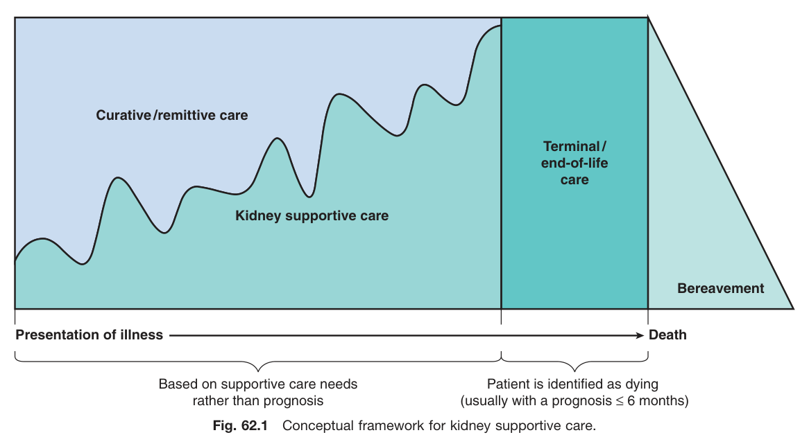

Fig. 62.1 Conceptual framework for kidney supportive care. A graph shows two overlapping curves over a timeline from "Presentation of illness" to "Death". The first curve, labeled "Curative/remittive care," starts high and gradually decreases. The second curve, "Kidney supportive care," starts low and gradually increases, eventually encompassing a final phase labeled "Terminal/end-of-life care." After death, a period of "Bereavement" is shown. Below the timeline, text explains that care is "Based on supportive care needs rather than prognosis" until a "Patient is identified as dying (usually with a prognosis ≤ 6 months)."

---

### Fig_62_2

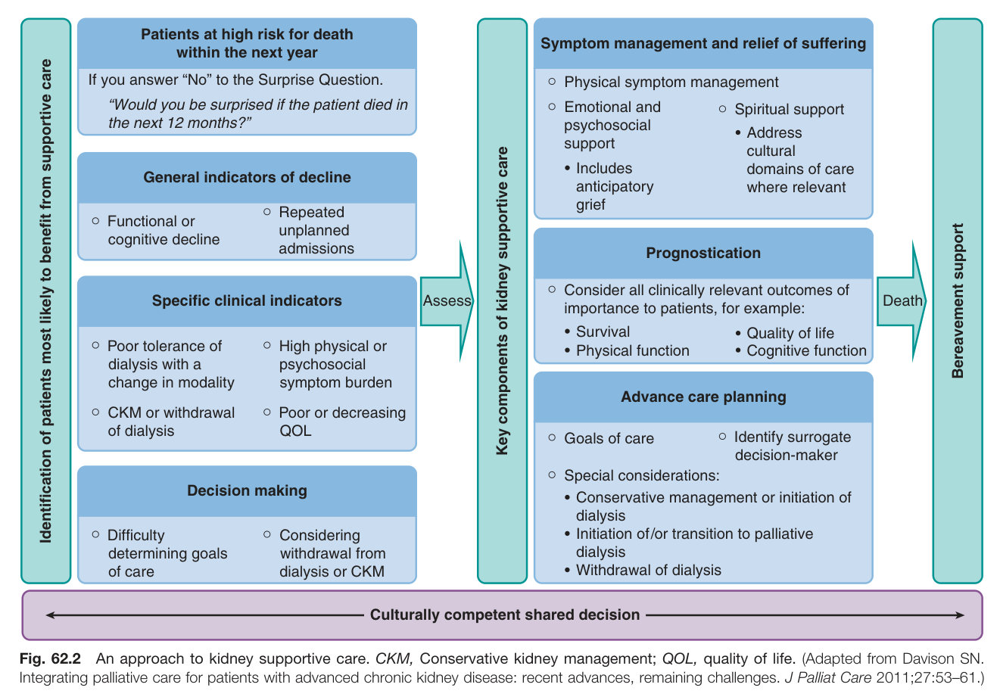

Fig. 62.2 An approach to kidney supportive care. This flowchart illustrates an approach to kidney supportive care. It begins with "Identification of patients most likely to benefit from supportive care," which involves assessing "Patients at high risk for death within the next year" using the "Surprise Question." It then lists "General indicators of decline" (e.g., functional decline, repeated admissions), "Specific clinical indicators" (e.g., poor tolerance of dialysis, high symptom burden), and "Decision making" issues (e.g., difficulty determining goals of care). These assessments feed into the "Key components of kidney supportive care," which include "Symptom management and relief of suffering," "Prognostication," and "Advance care planning." All these components are underpinned by "Culturally competent shared decision" making and lead towards "Death" and subsequent "Bereavement support." CKM, Conservative kidney management; QOL, quality of life. (Adapted from Davison SN. Integrating palliative care for patients with advanced chronic kidney disease: recent advances, remaining challenges. J Palliat Care 2011;27:53-61.)

---

### Fig_62_3

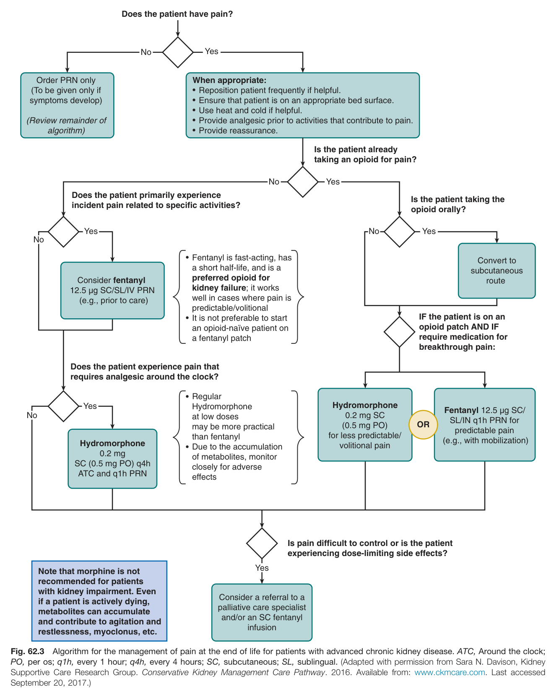

Fig. 62.3 Algorithm for the management of pain at the end of life for patients with advanced chronic kidney disease. This is a flowchart for pain management at the end of life. It starts with "Does the patient have pain?". If yes, it advises non-pharmacological interventions like repositioning and reassurance. It then asks if the patient is already on an opioid. The algorithm branches based on whether pain is incident (related to specific activities) or around the clock. For incident pain, fentanyl is recommended. For around-the-clock pain, low-dose hydromorphone is suggested. The flowchart provides specific dosages for oral (PO) and subcutaneous (SC) routes and advises converting to subcutaneous route if oral intake is not possible. It includes a strong note that morphine is not recommended for patients with kidney impairment. If pain is difficult to control, a referral to a palliative care specialist is recommended. ATC, Around the clock; PO, per os; q1h, every 1 hour; q4h, every 4 hours; SC, subcutaneous; SL, sublingual. (Adapted with permission from Sara N. Davison, Kidney Supportive Care Research Group. Conservative Kidney Management Care Pathway. 2016. Available from: www.ckmcare.com. Last accessed September 20, 2017.)

---

### Fig_62_4

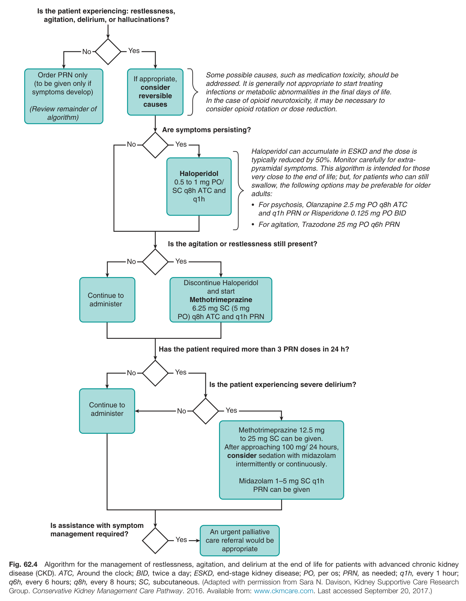

Fig. 62.4 Algorithm for the management of restlessness, agitation, and delirium at the end of life for patients with advanced chronic kidney disease (CKD). This flowchart details the management of restlessness, agitation, delirium, or hallucinations at the end of life. It begins by assessing if the patient is experiencing these symptoms. If yes, it suggests considering reversible causes. If symptoms persist, the first-line treatment is Haloperidol. The algorithm notes that Haloperidol can accumulate in ESKD and the dose should be reduced. If agitation or restlessness continues, Haloperidol should be discontinued and Methotrimeprazine started. The dose of Methotrimeprazine can be increased if the patient requires more than 3 PRN doses in 24 hours. For severe delirium, sedation with Midazolam is considered. If assistance with symptom management is required, an urgent palliative care referral is appropriate. ATC, Around the clock; BID, twice a day; ESKD, end-stage kidney disease; PO, per os; PRN, as needed; q1h, every 1 hour; q6h, every 6 hours; q8h, every 8 hours; SC, subcutaneous. (Adapted with permission from Sara N. Davison, Kidney Supportive Care Research Group. Conservative Kidney Management Care Pathway. 2016. Available from: www.ckmcare.com. Last accessed September 20, 2017.)

---

### Fig_62_5

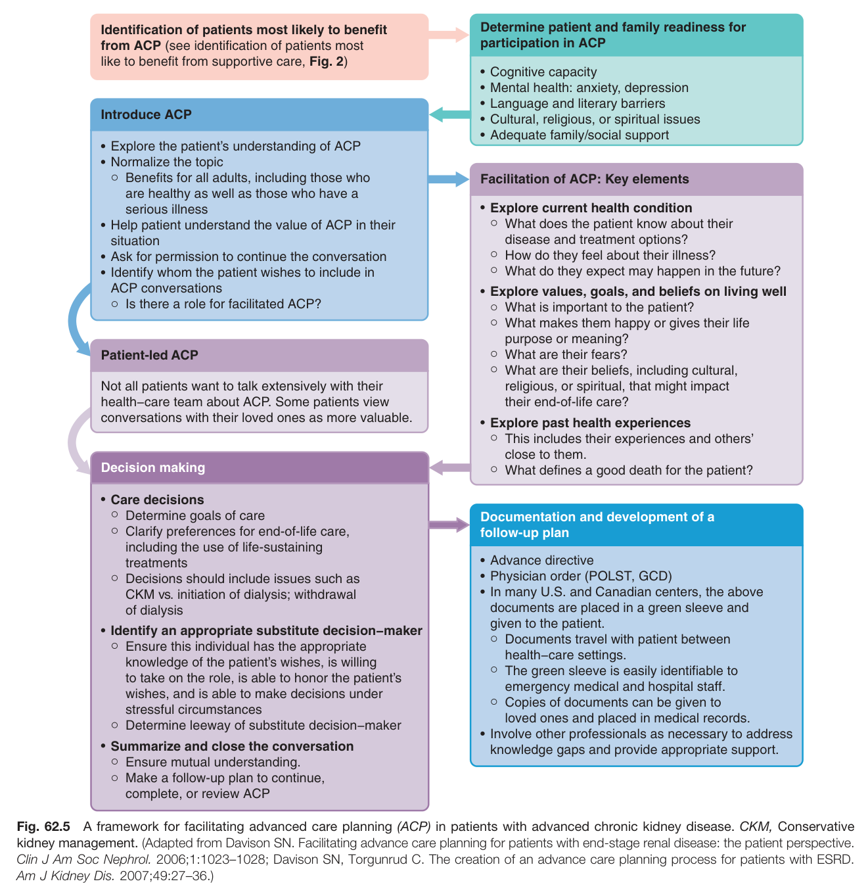

Fig. 62.5 A framework for facilitating advanced care planning (ACP) in patients with advanced chronic kidney disease. This is a detailed flowchart for facilitating ACP. It starts with "Identification of patients most likely to benefit from ACP." The process involves several stages: "Introduce ACP" (normalizing the topic), "Determine patient and family readiness," "Patient-led ACP" (respecting patient preferences), "Facilitation of ACP: Key elements" (exploring health condition, values, goals, and past experiences), "Decision making" (determining goals of care, identifying a substitute decision-maker), and finally "Documentation and development of a follow-up plan" (creating advance directives, physician orders like POLST). CKM, Conservative kidney management. (Adapted from Davison SN. Facilitating advance care planning for patients with end-stage renal disease: the patient perspective. Clin J Am Soc Nephrol. 2006;1:1023-1028; Davison SN, Torgunrud C. The creation of an advance care planning process for patients with ESRD. Am J Kidney Dis. 2007;49:27-36.)

---

### Fig_62_6

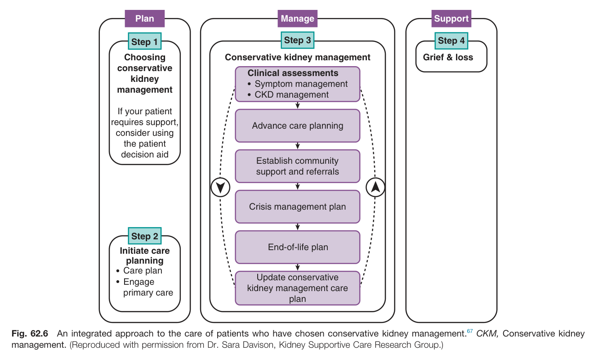

Fig. 62.6 An integrated approach to the care of patients who have chosen conservative kidney management. This diagram shows a four-step process for conservative kidney management. Step 1 (Plan) is "Choosing conservative kidney management." Step 2 (Plan) is "Initiate care planning." Step 3 (Manage) is a cyclical process involving "Conservative kidney management" (clinical assessments, symptom management, CKD management), "Advance care planning," "Establish community support and referrals," "Crisis management plan," "End-of-life plan," and "Update conservative kidney management care plan." Step 4 (Support) is "Grief & loss." CKM, Conservative kidney management. (Reproduced with permission from Dr. Sara Davison, Kidney Supportive Care Research Group.)

---

### Fig_62_7

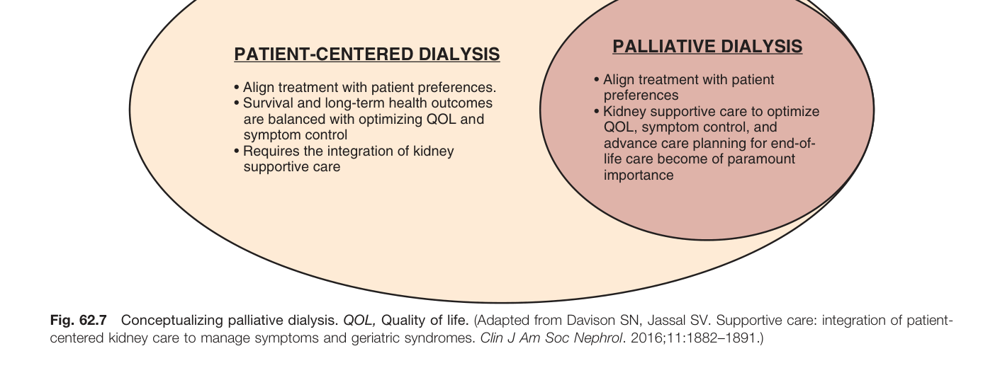

Fig. 62.7 Conceptualizing palliative dialysis. This diagram shows two overlapping circles. The larger circle is "PATIENT-CENTERED DIALYSIS," with bullet points: Align treatment with patient preferences, Survival and long-term health outcomes are balanced with optimizing QOL and symptom control, and Requires the integration of kidney supportive care. The smaller, overlapping circle is "PALLIATIVE DIALYSIS," with bullet points: Align treatment with patient preferences, Kidney supportive care to optimize QOL, symptom control, and advance care planning for end-of-life care become of paramount importance. QOL, Quality of life. (Adapted from Davison SN, Jassal SV. Supportive care: integration of patient-centered kidney care to manage symptoms and geriatric syndromes. Clin J Am Soc Nephrol. 2016;11:1882-1891.)

---

## Tables

### Table_62_1

#### Table Image

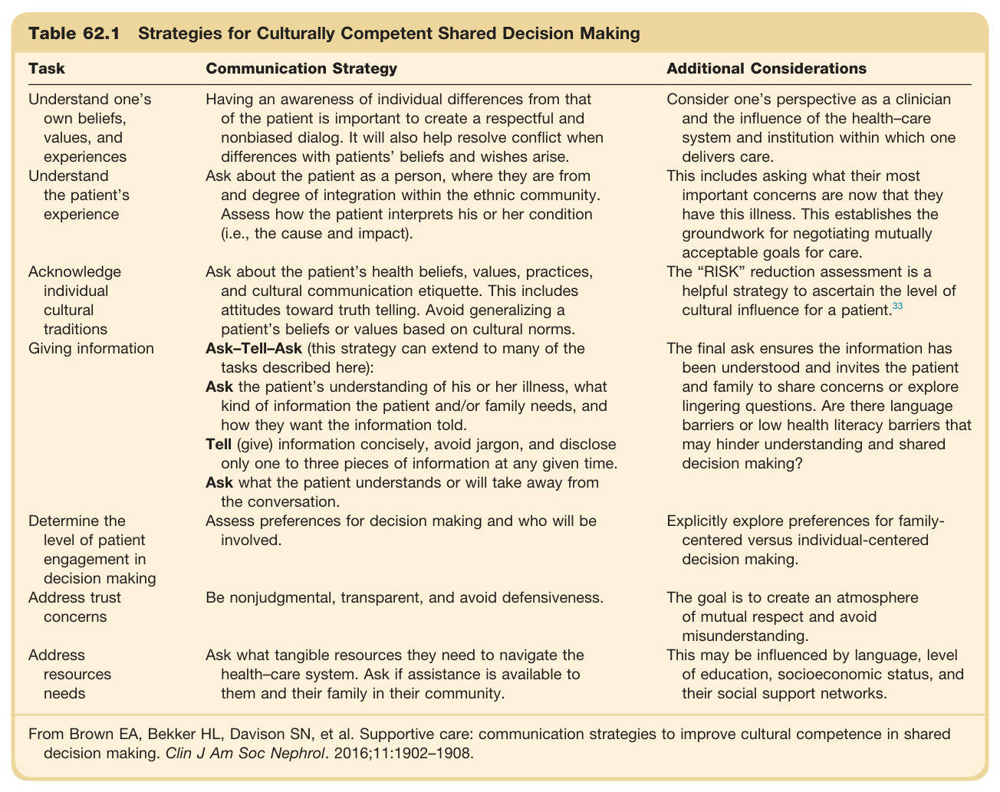

#### Table Data (CSV: [Table_62_1.csv](Table_62_1.csv))

```markdown
| Table Text (OCR) |
| :--- |
| Table 62.1 Strategies for Culturally Competent Shared Decision Making Task  Communication Strategy  Additional Considerations    Understand one's own beliefs, values, and experiences  Having an awareness of individual differences from that of the patient is important to create a respectful and nonbiased dialog. It will also help resolve conflict when differences with patients' beliefs and wishes arise.  Consider one's perspective as a clinician and the influence of the health-care system and institution within which one delivers care.    Understand the patient's experience  Ask about the patient as a person, where they are from and degree of integration within the ethnic community. Assess how the patient interprets his or her condition (i.e., the cause and impact).  This includes asking what their most important concerns are now that they have this illness. This establishes the groundwork for negotiating mutually acceptable goals for care.    Acknowledge individual cultural traditions  Ask about the patient's health beliefs, values, practices, and cultural communication etiquette. This includes attitudes toward truth telling. Avoid generalizing a patient's beliefs or values based on cultural norms.  The "RISK" reduction assessment is a helpful strategy to ascertain the level of cultural influence for a patient. ^{33}     Giving information  Ask-Tell-Ask (this strategy can extend to many of the tasks described here):Ask the patient's understanding of his or her illness, what kind of information the patient and/or family needs, and how they want the information told.Tell (give) information concisely, avoid jargon, and disclose only one to three pieces of information at any given time.Ask what the patient understands or will take away from the conversation.  The final ask ensures the information has been understood and invites the patient and family to share concerns or explore lingering questions. Are there language barriers or low health literacy barriers that may hinder understanding and shared decision making?    Determine the level of patient engagement in decision making  Assess preferences for decision making and who will be involved.  Explicitly explore preferences for family-centered versus individual-centered decision making.    Address trust concerns  Be nonjudgmental, transparent, and avoid defensiveness.  The goal is to create an atmosphere of mutual respect and avoid misunderstanding.    Address resources needs  Ask what tangible resources they need to navigate the health-care system. Ask if assistance is available to them and their family in their community.  This may be influenced by language, level of education, socioeconomic status, and their social support networks. From Brown EA, Bekker HL, Davison SN, et al. Supportive care: communication strategies to improve cultural competence in shared decision making. Clin J Am Soc Nephrol. 2016;11:1902–1908. |
```

Table 62.1 Strategies for Culturally Competent Shared Decision Making | Task | Communication Strategy | Additional Considerations | | :----------------------------------------------------------- | :----------------------------------------------------------- | :----------------------------------------------------------- | | Understand one's own beliefs, values, and experiences | Having an awareness of individual differences from that of the patient is important to create a respectful and nonbiased dialog. It will also help resolve conflict when differences with patients' beliefs and wishes arise. | Consider one's perspective as a clinician and the influence of the health-care system and institution within which one delivers care. | | Understand the patient's experience | Ask about the patient as a person, where they are from and degree of integration within the ethnic community. Assess how the patient interprets his or her condition (i.e., the cause and impact). | This includes asking what their most important concerns are now that they have this illness. This establishes the groundwork for negotiating mutually acceptable goals for care. | | Acknowledge individual cultural traditions | Ask about the patient's health beliefs, values, practices, and cultural communication etiquette. This includes attitudes toward truth telling. Avoid generalizing a patient's beliefs or values based on cultural norms. | The "RISK" reduction assessment is a helpful strategy to ascertain the level of cultural influence for a patient. | | Giving information | **Ask-Tell-Ask** (this strategy can extend to many of the tasks described here): **Ask** the patient's understanding of his or her illness, what kind of information the patient and/or family needs, and how they want the information told. **Tell** (give) information concisely, avoid jargon, and disclose only one to three pieces of information at any given time. **Ask** what the patient understands or will take away from the conversation. | The final ask ensures the information has been understood and invites the patient and family to share concerns or explore lingering questions. Are there language barriers or low health literacy barriers that may hinder understanding and shared decision making? | | Determine the level of patient engagement in decision making | Assess preferences for decision making and who will be involved. | Explicitly explore preferences for family-centered versus individual-centered decision making. | | Address trust concerns | Be nonjudgmental, transparent, and avoid defensiveness. | The goal is to create an atmosphere of mutual respect and avoid misunderstanding. | | Address resources needs | Ask what tangible resources they need to navigate the health-care system. Ask if assistance is available to them and their family in their community. | This may be influenced by language, level of education, socioeconomic status, and their social support networks. | | From Brown EA, Bekker HL, Davison SN, et al. Supportive care: communication strategies to improve cultural competence in shared decision making. Clin J Am Soc Nephrol. 2016;11:1902-1908. | | |

---

### Table_62_2

#### Table Image

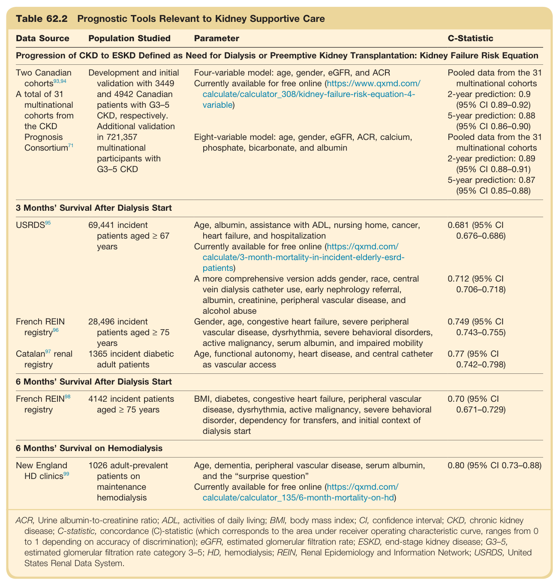

#### Table Data (CSV: [Table_62_2.csv](Table_62_2.csv))

```markdown
| Table Text (OCR) |
| :--- |
| Table 62.2 Prognostic Tools Relevant to Kidney Supportive Care Data Source  Population Studied  Parameter  C-Statistic    Progression of CKD to ESKD Defined as Need for Dialysis or Preemptive Kidney Transplantation: Kidney Failure Risk Equation    Two Canadian  cohorts^{93,94} A total of 31 multinational cohorts from the CKD Prognosis  Consortium^{71}   Development and initial validation with 3449 and 4942 Canadian patients with G3-5 CKD, respectively.Additional validation in 721,357 multinational participants with G3-5 CKD  Four-variable model: age, gender, eGFR, and ACRCurrently available for free online (https://www.qxmd.com/calculate/calculator_308/kidney-failure-risk-equation-4-variable)Eight-variable model: age, gender, eGFR, ACR, calcium, phosphate, bicarbonate, and albumin  Pooled data from the 31 multinational cohorts2-year prediction: 0.9 (95% CI 0.89-0.92)5-year prediction: 0.88 (95% CI 0.86-0.90)Pooled data from the 31 multinational cohorts2-year prediction: 0.89 (95% CI 0.88-0.91)5-year prediction: 0.87 (95% CI 0.85-0.88)    3 Months' Survival After Dialysis Start     USRDS^{95}   69,441 incident patients aged ≥ 67 years  Age, albumin, assistance with ADL, nursing home, cancer, heart failure, and hospitalizationCurrently available for free online (https://qxmd.com/calculate/3-month-mortality-in-incident-elderly-esrd-patients)A more comprehensive version adds gender, race, central vein dialysis catheter use, early nephrology referral, albumin, creatinine, peripheral vascular disease, and alcohol abuse  0.681 (95% CI 0.676-0.686)0.712 (95% CI 0.706-0.718)    French REIN  registry^{96}   28,496 incident patients aged ≥ 75 years  Gender, age, congestive heart failure, severe peripheral vascular disease, dysrhythmia, severe behavioral disorders, active malignancy, serum albumin, and impaired mobility  0.749 (95% CI 0.743-0.755)     Catalan^{97}  renal registry  1365 incident diabetic adult patients  Age, functional autonomy, heart disease, and central catheter as vascular access  0.77 (95% CI 0.742-0.798)    6 Months' Survival After Dialysis Start    French  REIN^{98}  registry  4142 incident patients aged ≥ 75 years  BMI, diabetes, congestive heart failure, peripheral vascular disease, dysrhythmia, active malignancy, severe behavioral disorder, dependency for transfers, and initial context of dialysis start  0.70 (95% CI 0.671-0.729)    6 Months' Survival on Hemodialysis    New England  HD clinics^{99}   1026 adult-prevalent patients on maintenance hemodialysis  Age, dementia, peripheral vascular disease, serum albumin, and the "surprise question"Currently available for free online (https://qxmd.com/calculate/calculator_135/6-month-mortality-on-hd)  0.80 (95% CI 0.73-0.88) ACR, Urine albumin-to-creatinine ratio; ADL, activities of daily living; BMI, body mass index; CI, confidence interval; CKD, chronic kidney disease; C-statistic, concordance (C)-statistic (which corresponds to the area under receiver operating characteristic curve, ranges from 0 to 1 depending on accuracy of discrimination); eGFR, estimated glomerular filtration rate; ESKD, end-stage kidney disease; G3–5, estimated glomerular filtration rate category 3–5; HD, hemodialysis; REIN, Renal Epidemiology and Information Network; USRDS, United States Renal Data System. |
```

Table 62.2 Prognostic Tools Relevant to Kidney Supportive Care | Data Source | Population Studied | Parameter | C-Statistic | | :----------------------------------------------------------- | :----------------------------------------------------------- | :----------------------------------------------------------- | :----------------------------------------------------------- | | **Progression of CKD to ESKD Defined as Need for Dialysis or Preemptive Kidney Transplantation: Kidney Failure Risk Equation** | | | | | Two Canadian cohorts; A total of 31 multinational cohorts from the CKD Prognosis Consortium | Development and initial validation with 3449 and 4942 Canadian patients with G3-5 CKD, respectively. Additional validation in 721,357 multinational participants with G3-5 CKD | Four-variable model: age, gender, eGFR, and ACR. Currently available for free online. Eight-variable model: age, gender, eGFR, ACR, calcium, phosphate, bicarbonate, and albumin | Pooled data from the 31 multinational cohorts: 2-year prediction: 0.9 (95% CI 0.89-0.92); 5-year prediction: 0.88 (95% CI 0.86-0.90). Pooled data from the 31 multinational cohorts: 2-year prediction: 0.89 (95% CI 0.88-0.91); 5-year prediction: 0.87 (95% CI 0.85-0.88) | | **3 Months' Survival After Dialysis Start** | | | | | USRDS | 69,441 incident patients aged ≥ 67 years | Age, albumin, assistance with ADL, nursing home, cancer, heart failure, and hospitalization. Currently available for free online. A more comprehensive version adds gender, race, central vein dialysis catheter use, early nephrology referral, albumin, creatinine, peripheral vascular disease, and alcohol abuse | 0.681 (95% CI 0.676-0.686); 0.712 (95% CI 0.706-0.718) | | French REIN registry | 28,496 incident patients aged ≥ 75 years | Gender, age, congestive heart failure, severe peripheral vascular disease, dysrhythmia, severe behavioral disorders, active malignancy, serum albumin, and impaired mobility | 0.749 (95% CI 0.743-0.755) | | Catalan renal registry | 1365 incident diabetic adult patients | Age, functional autonomy, heart disease, and central catheter as vascular access | 0.77 (95% CI 0.742-0.798) | | **6 Months' Survival After Dialysis Start** | | | | | French REIN registry | 4142 incident patients aged ≥ 75 years | BMI, diabetes, congestive heart failure, peripheral vascular disease, dysrhythmia, active malignancy, severe behavioral disorder, dependency for transfers, and initial context of dialysis start | 0.70 (95% CI 0.671-0.729) | | **6 Months' Survival on Hemodialysis** | | | | | New England HD clinics | 1026 adult-prevalent patients on maintenance hemodialysis | Age, dementia, peripheral vascular disease, serum albumin, and the "surprise question". Currently available for free online. | 0.80 (95% CI 0.73-0.88) | | ACR, Urine albumin-to-creatinine ratio; ADL, activities of daily living; BMI, body mass index; CI, confidence interval; CKD, chronic kidney disease; C-statistic, concordance (C)-statistic (which corresponds to the area under receiver operating characteristic curve, ranges from 0 to 1 depending on accuracy of discrimination); eGFR, estimated glomerular filtration rate; ESKD, end-stage kidney disease; G3-5, estimated glomerular filtration rate category 3-5; HD, hemodialysis; REIN, Renal Epidemiology and Information Network; USRDS, United States Renal Data System. | | | |

---

### Table_62_3

#### Table Image

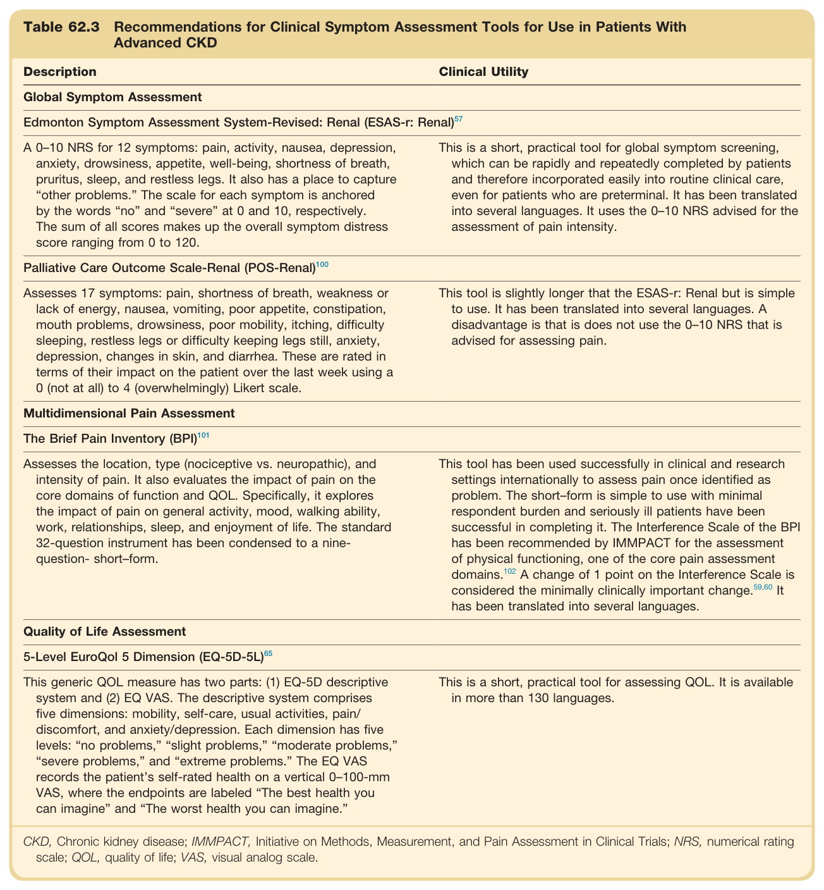

#### Table Data (CSV: [Table_62_3.csv](Table_62_3.csv))

```markdown
| Table Text (OCR) |
| :--- |
| Table 62.3 Recommendations for Clinical Symptom Assessment Tools for Use in Patients With Advanced CKD Description  Clinical Utility    Global Symptom Assessment    Edmonton Symptom Assessment System-Revised: Renal (ESAS-r: Renal) ^{57}     A 0-10 NRS for 12 symptoms: pain, activity, nausea, depression, anxiety, drowsiness, appetite, well-being, shortness of breath, pruritus, sleep, and restless legs. It also has a place to capture “other problems.” The scale for each symptom is anchored by the words “no” and “severe” at 0 and 10, respectively. The sum of all scores makes up the overall symptom distress score ranging from 0 to 120.  This is a short, practical tool for global symptom screening, which can be rapidly and repeatedly completed by patients and therefore incorporated easily into routine clinical care, even for patients who are preterminal. It has been translated into several languages. It uses the 0-10 NRS advised for the assessment of pain intensity.    Palliative Care Outcome Scale-Renal (POS-Renal) ^{100}     Assesses 17 symptoms: pain, shortness of breath, weakness or lack of energy, nausea, vomiting, poor appetite, constipation, mouth problems, drowsiness, poor mobility, itching, difficulty sleeping, restless legs or difficulty keeping legs still, anxiety, depression, changes in skin, and diarrhea. These are rated in terms of their impact on the patient over the last week using a 0 (not at all) to 4 (overwhelmingly) Likert scale.  This tool is slightly longer that the ESAS-r: Renal but is simple to use. It has been translated into several languages. A disadvantage is that is does not use the 0-10 NRS that is advised for assessing pain.    Multidimensional Pain Assessment    The Brief Pain Inventory (BPI) ^{101}     Assesses the location, type (nociceptive vs. neuropathic), and intensity of pain. It also evaluates the impact of pain on the core domains of function and QOL. Specifically, it explores the impact of pain on general activity, mood, walking ability, work, relationships, sleep, and enjoyment of life. The standard 32-question instrument has been condensed to a nine-question- short-form.  This tool has been used successfully in clinical and research settings internationally to assess pain once identified as problem. The short-form is simple to use with minimal respondent burden and seriously ill patients have been successful in completing it. The Interference Scale of the BPI has been recommended by IMMPACT for the assessment of physical functioning, one of the core pain assessment domains. ^{102}  A change of 1 point on the Interference Scale is considered the minimally clinically important change. ^{59,60}  It has been translated into several languages.    Quality of Life Assessment    5-Level EuroQol 5 Dimension (EQ-5D-5L) ^{65}     This generic QOL measure has two parts: (1) EQ-5D descriptive system and (2) EQ VAS. The descriptive system comprises five dimensions: mobility, self-care, usual activities, pain/discomfort, and anxiety/depression. Each dimension has five levels: “no problems,” “slight problems,” “moderate problems,” “severe problems,” and “extreme problems.” The EQ VAS records the patient’s self-rated health on a vertical 0-100-mm VAS, where the endpoints are labeled “The best health you can imagine” and “The worst health you can imagine.”  This is a short, practical tool for assessing QOL. It is available in more than 130 languages.    CKD, Chronic kidney disease; IMMPACT, Initiative on Methods, Measurement, and Pain Assessment in Clinical Trials; NRS, numerical rating scale; QOL, quality of life; VAS, visual analog scale. |
```

Table 62.3 Recommendations for Clinical Symptom Assessment Tools for Use in Patients With Advanced CKD | Description | Clinical Utility | | :----------------------------------------------------------- | :----------------------------------------------------------- | | **Global Symptom Assessment** | | | Edmonton Symptom Assessment System-Revised: Renal (ESAS-r: Renal) | This is a short, practical tool for global symptom screening, which can be rapidly and repeatedly completed by patients and therefore incorporated easily into routine clinical care, even for patients who are preterminal. It has been translated into several languages. It uses the 0-10 NRS advised for the assessment of pain intensity. | | A 0-10 NRS for 12 symptoms: pain, activity, nausea, depression, anxiety, drowsiness, appetite, well-being, shortness of breath, pruritus, sleep, and restless legs. It also has a place to capture "other problems." The scale for each symptom is anchored by the words "no" and "severe" at 0 and 10, respectively. The sum of all scores makes up the overall symptom distress score ranging from 0 to 120. | | | Palliative Care Outcome Scale-Renal (POS-Renal) | This tool is slightly longer that the ESAS-r: Renal but is simple to use. It has been translated into several languages. A disadvantage is that is does not use the 0-10 NRS that is advised for assessing pain. | | Assesses 17 symptoms: pain, shortness of breath, weakness or lack of energy, nausea, vomiting, poor appetite, constipation, mouth problems, drowsiness, poor mobility, itching, difficulty sleeping, restless legs or difficulty keeping legs still, anxiety, depression, changes in skin, and diarrhea. These are rated in terms of their impact on the patient over the last week using a 0 (not at all) to 4 (overwhelmingly) Likert scale. | | | **Multidimensional Pain Assessment** | | | The Brief Pain Inventory (BPI) | This tool has been used successfully in clinical and research settings internationally to assess pain once identified as problem. The short-form is simple to use with minimal respondent burden and seriously ill patients have been successful in completing it. The Interference Scale of the BPI has been recommended by IMMPACT for the assessment of physical functioning, one of the core pain assessment domains. A change of 1 point on the Interference Scale is considered the minimally clinically important change. It has been translated into several languages. | | Assesses the location, type (nociceptive vs. neuropathic), and intensity of pain. It also evaluates the impact of pain on the core domains of function and QOL. Specifically, it explores the impact of pain on general activity, mood, walking ability, work, relationships, sleep, and enjoyment of life. The standard 32-question instrument has been condensed to a nine-question- short-form. | | | **Quality of Life Assessment** | | | 5-Level EuroQol 5 Dimension (EQ-5D-5L) | This is a short, practical tool for assessing QOL. It is available in more than 130 languages. | | This generic QOL measure has two parts: (1) EQ-5D descriptive system and (2) EQ VAS. The descriptive system comprises five dimensions: mobility, self-care, usual activities, pain/discomfort, and anxiety/depression. Each dimension has five levels: "no problems," "slight problems," "moderate problems," "severe problems," and "extreme problems." The EQ VAS records the patient's self-rated health on a vertical 0-100-mm VAS, where the endpoints are labeled "The best health you can imagine" and "The worst health you can imagine." | | | CKD, Chronic kidney disease; IMMPACT, Initiative on Methods, Measurement, and Pain Assessment in Clinical Trials; NRS, numerical rating scale; QOL, quality of life; VAS, visual analog scale. | |

---

### Table_62_4

#### Table Images (4 Parts)

- **Part 1 (Page 8)**:
  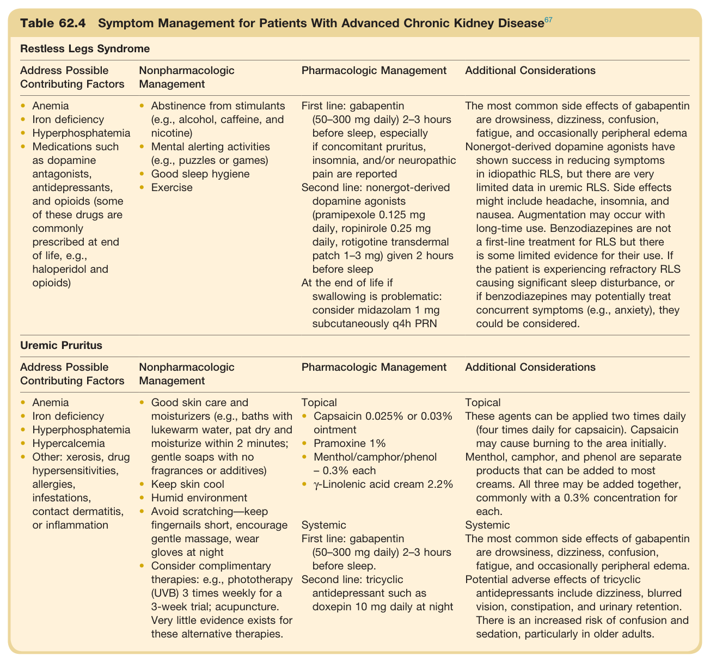

- **Part 2 (Page 9)**:
  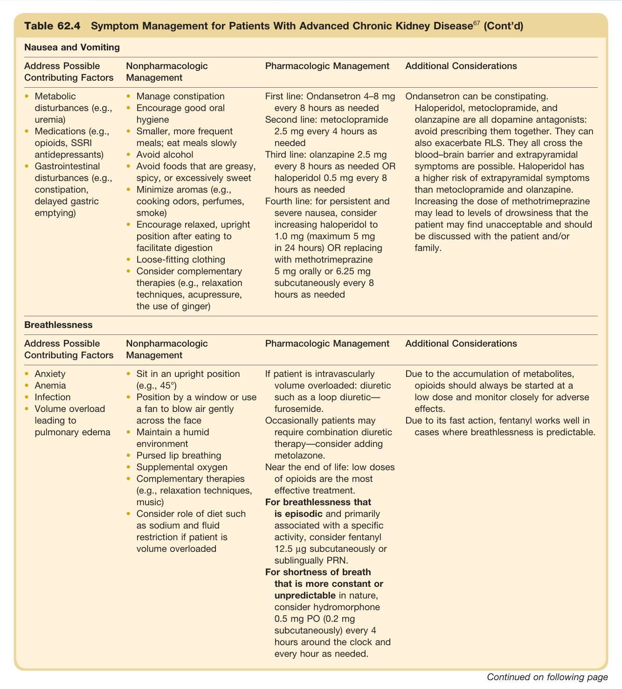

- **Part 3 (Page 10)**:
  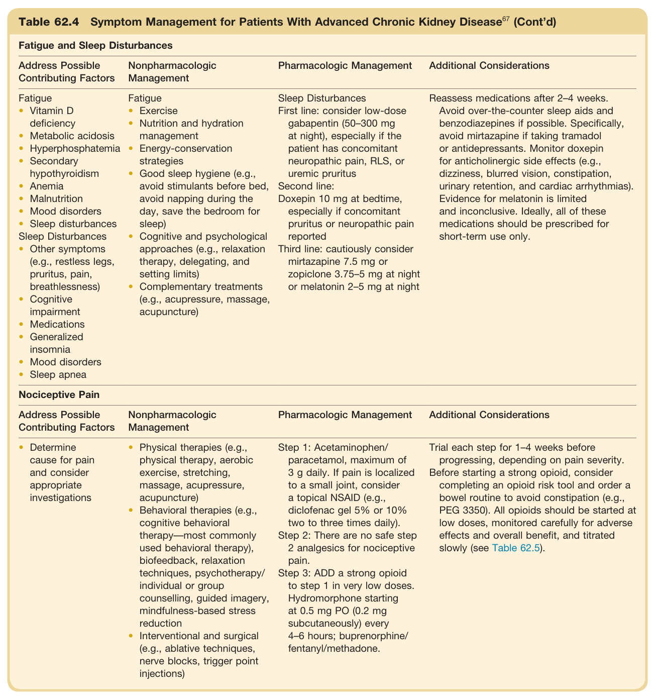

- **Part 4 (Page 11)**:
  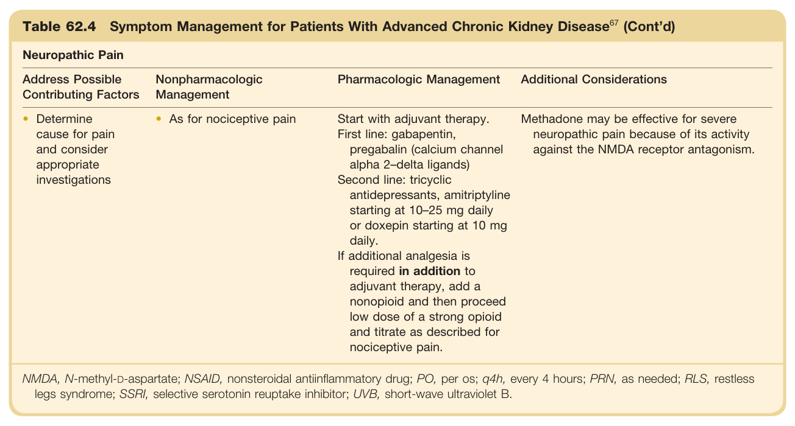

#### Table Data (CSV: [Table_62_4.csv](Table_62_4.csv))

```markdown
| Table Text (OCR) |
| :--- |
| Table 62.4 Symptom Management for Patients With Advanced Chronic Kidney Disease<sup>67</sup> Restless Legs Syndrome Address Possible Contributing Factors  Nonpharmacologic Management  Pharmacologic Management  Additional Considerations    AnemiaIron deficiencyHyperphosphatemiaMedications such as dopamine antagonists, antidepressants, and opioids (some of these drugs are commonly prescribed at end of life, e.g., haloperidol and opioids)  Abstinence from stimulants (e.g., alcohol, caffeine, and nicotine)Mental alerting activities (e.g., puzzles or games)Good sleep hygieneExercise  First line: gabapentin (50–300 mg daily) 2–3 hours before sleep, especially if concomitant pruritus, insomnia, and/or neuropathic pain are reportedSecond line: nonergot-derived dopamine agonists (pramipexole 0.125 mg daily, ropinirole 0.25 mg daily, rotigotine transdermal patch 1–3 mg) given 2 hours before sleepAt the end of life if swallowing is problematic: consider midazolam 1 mg subcutaneously q4h PRN  The most common side effects of gabapentin are drowsiness, dizziness, confusion, fatigue, and occasionally peripheral edemaNonergot-derived dopamine agonists have shown success in reducing symptoms in idiopathic RLS, but there are very limited data in uremic RLS. Side effects might include headache, insomnia, and nausea. Augmentation may occur with long-time use. Benzodiazepines are not a first-line treatment for RLS but there is some limited evidence for their use. If the patient is experiencing refractory RLS causing significant sleep disturbance, or if benzodiazepines may potentially treat concurrent symptoms (e.g., anxiety), they could be considered. |
```

Table 62.4 Symptom Management for Patients With Advanced Chronic Kidney Disease **Restless Legs Syndrome** | Address Possible Contributing Factors | Nonpharmacologic Management | Pharmacologic Management | Additional Considerations | | :----------------------------------------------------------- | :----------------------------------------------------------- | :----------------------------------------------------------- | :----------------------------------------------------------- | | • Anemia<br>• Iron deficiency<br>• Hyperphosphatemia<br>• Medications such as dopamine antagonists, antidepressants, and opioids (some of these drugs are commonly prescribed at end of life, e.g., haloperidol and opioids) | • Abstinence from stimulants (e.g., alcohol, caffeine, and nicotine)<br>• Mental alerting activities (e.g., puzzles or games)<br>• Good sleep hygiene<br>• Exercise | First line: gabapentin (50-300 mg daily) 2-3 hours before sleep, especially if concomitant pruritus, insomnia, and/or neuropathic pain are reported<br>Second line: nonergot-derived dopamine agonists (pramipexole 0.125 mg daily, ropinirole 0.25 mg daily, rotigotine transdermal patch 1-3 mg) given 2 hours before sleep<br>At the end of life if swallowing is problematic: consider midazolam 1 mg subcutaneously q4h PRN | The most common side effects of gabapentin are drowsiness, dizziness, confusion, fatigue, and occasionally peripheral edema<br>Nonergot-derived dopamine agonists have shown success in reducing symptoms in idiopathic RLS, but there are very limited data in uremic RLS. Side effects might include headache, insomnia, and nausea. Augmentation may occur with long-time use. Benzodiazepines are not a first-line treatment for RLS but there is some limited evidence for their use. If the patient is experiencing refractory RLS causing significant sleep disturbance, or if benzodiazepines may potentially treat concurrent symptoms (e.g., anxiety), they could be considered. | **Uremic Pruritus** | Address Possible Contributing Factors | Nonpharmacologic Management | Pharmacologic Management | Additional Considerations | | :----------------------------------------------------------- | :----------------------------------------------------------- | :----------------------------------------------------------- | :----------------------------------------------------------- | | • Anemia<br>• Iron deficiency<br>• Hyperphosphatemia<br>• Hypercalcemia<br>• Other: xerosis, drug hypersensitivities, allergies, infestations, contact dermatitis, or inflammation | • Good skin care and moisturizers (e.g., baths with lukewarm water, pat dry and moisturize within 2 minutes; gentle soaps with no fragrances or additives)<br>• Keep skin cool<br>• Humid environment<br>• Avoid scratching—keep fingernails short, encourage gentle massage, wear gloves at night<br>• Consider complimentary therapies: e.g., phototherapy (UVB) 3 times weekly for a 3-week trial; acupuncture. Very little evidence exists for these alternative therapies. | **Topical**<br>• Capsaicin 0.025% or 0.03% ointment<br>• Pramoxine 1%<br>• Menthol/camphor/phenol 0.3% each<br>• γ-Linolenic acid cream 2.2%<br>**Systemic**<br>First line: gabapentin (50-300 mg daily) 2-3 hours before sleep.<br>Second line: tricyclic antidepressant such as doxepin 10 mg daily at night | **Topical**<br>These agents can be applied two times daily (four times daily for capsaicin). Capsaicin may cause burning to the area initially. Menthol, camphor, and phenol are separate products that can be added to most creams. All three may be added together, commonly with a 0.3% concentration for each.<br>**Systemic**<br>The most common side effects of gabapentin are drowsiness, dizziness, confusion, fatigue, and occasionally peripheral edema. Potential adverse effects of tricyclic antidepressants include dizziness, blurred vision, constipation, and urinary retention. There is an increased risk of confusion and sedation, particularly in older adults. | **Nausea and Vomiting** | Address Possible Contributing Factors | Nonpharmacologic Management | Pharmacologic Management | Additional Considerations | | :----------------------------------------------------------- | :----------------------------------------------------------- | :----------------------------------------------------------- | :----------------------------------------------------------- | | • Metabolic disturbances (e.g., uremia)<br>• Medications (e.g., opioids, SSRI antidepressants)<br>• Gastrointestinal disturbances (e.g., constipation, delayed gastric emptying) | • Manage constipation<br>• Encourage good oral hygiene<br>• Smaller, more frequent meals; eat meals slowly<br>• Avoid alcohol<br>• Avoid foods that are greasy, spicy, or excessively sweet<br>• Minimize aromas (e.g., cooking odors, perfumes, smoke)<br>• Encourage relaxed, upright position after eating to facilitate digestion<br>• Loose-fitting clothing<br>• Consider complementary therapies (e.g., relaxation techniques, acupressure, the use of ginger) | First line: Ondansetron 4-8 mg every 8 hours as needed<br>Second line: metoclopramide 2.5 mg every 4 hours as needed<br>Third line: olanzapine 2.5 mg every 8 hours as needed OR haloperidol 0.5 mg every 8 hours as needed<br>Fourth line: for persistent and severe nausea, consider increasing haloperidol to 1.0 mg (maximum 5 mg in 24 hours) OR replacing with methotrimeprazine 5 mg orally or 6.25 mg subcutaneously every 8 hours as needed | Ondansetron can be constipating. Haloperidol, metoclopramide, and olanzapine are all dopamine antagonists: avoid prescribing them together. They can also exacerbate RLS. They all cross the blood-brain barrier and extrapyramidal symptoms are possible. Haloperidol has a higher risk of extrapyramidal symptoms than metoclopramide and olanzapine. Increasing the dose of methotrimeprazine may lead to levels of drowsiness that the patient may find unacceptable and should be discussed with the patient and/or family. | **Breathlessness** | Address Possible Contributing Factors | Nonpharmacologic Management | Pharmacologic Management | Additional Considerations | | :----------------------------------------------------------- | :----------------------------------------------------------- | :----------------------------------------------------------- | :----------------------------------------------------------- | | • Anxiety<br>• Anemia<br>• Infection<br>• Volume overload leading to pulmonary edema | • Sit in an upright position (e.g., 45°)<br>• Position by a window or use a fan to blow air gently across the face<br>• Maintain a humid environment<br>• Pursed lip breathing<br>• Supplemental oxygen<br>• Complementary therapies (e.g., relaxation techniques, music)<br>• Consider role of diet such as sodium and fluid restriction if patient is volume overloaded | If patient is intravascularly volume overloaded: diuretic such as a loop diuretic—furosemide. Occasionally patients may require combination diuretic therapy—consider adding metolazone.<br>Near the end of life: low doses of opioids are the most effective treatment.<br>**For breathlessness that is episodic** and primarily associated with a specific activity, consider fentanyl 12.5 µg subcutaneously or sublingually PRN.<br>**For shortness of breath that is more constant or unpredictable** in nature, consider hydromorphone 0.5 mg PO (0.2 mg subcutaneously) every 4 hours around the clock and every hour as needed. | Due to the accumulation of metabolites, opioids should always be started at a low dose and monitor closely for adverse effects.<br>Due to its fast action, fentanyl works well in cases where breathlessness is predictable. | **Fatigue and Sleep Disturbances** | Address Possible Contributing Factors | Nonpharmacologic Management | Pharmacologic Management | Additional Considerations | | :----------------------------------------------------------- | :----------------------------------------------------------- | :----------------------------------------------------------- | :----------------------------------------------------------- | | **Fatigue**<br>• Vitamin D deficiency<br>• Metabolic acidosis<br>• Hyperphosphatemia<br>• Secondary hypothyroidism<br>• Anemia<br>• Malnutrition<br>• Mood disorders<br>• Sleep disturbances<br>**Sleep Disturbances**<br>• Other symptoms (e.g., restless legs, pruritus, pain, breathlessness)<br>• Cognitive impairment<br>• Medications<br>• Generalized insomnia<br>• Mood disorders<br>• Sleep apnea | **Fatigue**<br>• Exercise<br>• Nutrition and hydration management<br>• Energy-conservation strategies<br>• Good sleep hygiene (e.g., avoid stimulants before bed, avoid napping during the day, save the bedroom for sleep)<br>• Cognitive and psychological approaches (e.g., relaxation therapy, delegating, and setting limits)<br>• Complementary treatments (e.g., acupressure, massage, acupuncture) | **Sleep Disturbances**<br>First line: consider low-dose gabapentin (50-300 mg at night), especially if the patient has concomitant neuropathic pain, RLS, or uremic pruritus<br>Second line: Doxepin 10 mg at bedtime, especially if concomitant pruritus or neuropathic pain reported<br>Third line: cautiously consider mirtazapine 7.5 mg or zopiclone 3.75-5 mg at night or melatonin 2-5 mg at night | Reassess medications after 2-4 weeks. Avoid over-the-counter sleep aids and benzodiazepines if possible. Specifically, avoid mirtazapine if taking tramadol or antidepressants. Monitor doxepin for anticholinergic side effects (e.g., dizziness, blurred vision, constipation, urinary retention, and cardiac arrhythmias). Evidence for melatonin is limited and inconclusive. Ideally, all of these medications should be prescribed for short-term use only. | **Nociceptive Pain** | Address Possible Contributing Factors | Nonpharmacologic Management | Pharmacologic Management | Additional Considerations | | :----------------------------------------------------------- | :----------------------------------------------------------- | :----------------------------------------------------------- | :----------------------------------------------------------- | | • Determine cause for pain and consider appropriate investigations | • Physical therapies (e.g., physical therapy, aerobic exercise, stretching, massage, acupressure, acupuncture)<br>• Behavioral therapies (e.g., cognitive behavioral therapy—most commonly used behavioral therapy), biofeedback, relaxation techniques, psychotherapy/individual or group counselling, guided imagery, mindfulness-based stress reduction<br>• Interventional and surgical (e.g., ablative techniques, nerve blocks, trigger point injections) | Step 1: Acetaminophen/paracetamol, maximum of 3 g daily. If pain is localized to a small joint, consider a topical NSAID (e.g., diclofenac gel 5% or 10% two to three times daily).<br>Step 2: There are no safe step 2 analgesics for nociceptive pain.<br>Step 3: ADD a strong opioid to step 1 in very low doses. Hydromorphone starting at 0.5 mg PO (0.2 mg subcutaneously) every 4-6 hours; buprenorphine/fentanyl/methadone. | Trial each step for 1-4 weeks before progressing, depending on pain severity. Before starting a strong opioid, consider completing an opioid risk tool and order a bowel routine to avoid constipation (e.g., PEG 3350). All opioids should be started at low doses, monitored carefully for adverse effects and overall benefit, and titrated slowly (see Table 62.5). | **Neuropathic Pain** | Address Possible Contributing Factors | Nonpharmacologic Management | Pharmacologic Management | Additional Considerations | | :----------------------------------------------------------- | :-------------------------- | :----------------------------------------------------------- | :----------------------------------------------------------- | | • Determine cause for pain and consider appropriate investigations | • As for nociceptive pain | Start with adjuvant therapy.<br>First line: gabapentin, pregabalin (calcium channel alpha 2-delta ligands)<br>Second line: tricyclic antidepressants, amitriptyline starting at 10-25 mg daily or doxepin starting at 10 mg daily.<br>If additional analgesia is required **in addition** to adjuvant therapy, add a nonopioid and then proceed low dose of a strong opioid and titrate as described for nociceptive pain. | Methadone may be effective for severe neuropathic pain because of its activity against the NMDA receptor antagonism. | | NMDA, N-methyl-D-aspartate; NSAID, nonsteroidal antiinflammatory drug; PO, per os; q4h, every 4 hours; PRN, as needed; RLS, restless legs syndrome; SSRI, selective serotonin reuptake inhibitor; UVB, short-wave ultraviolet B. | | | |

---

### Table_62_5

#### Table Image

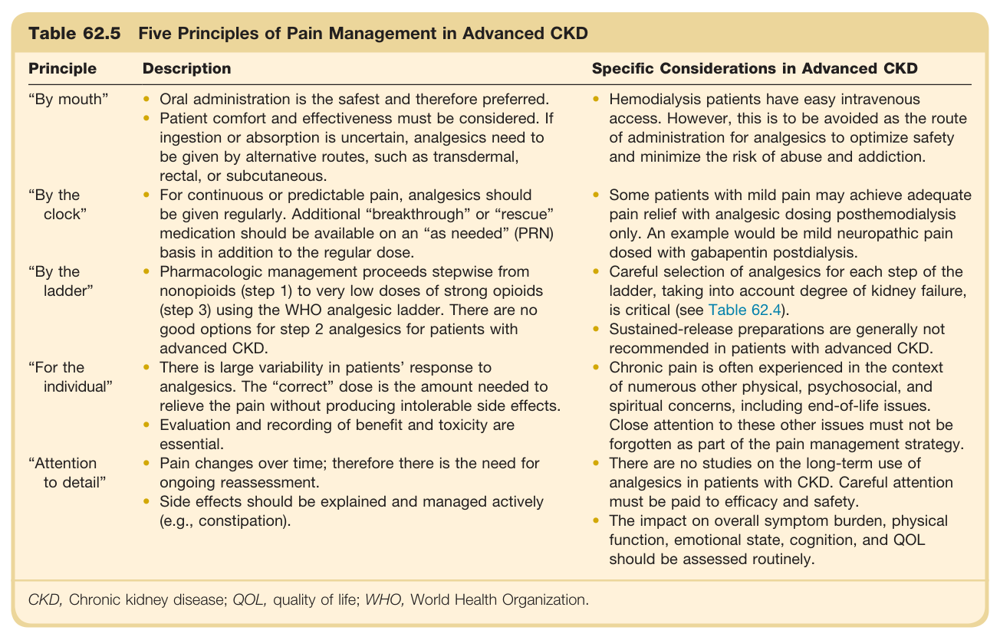

#### Table Data (CSV: [Table_62_5.csv](Table_62_5.csv))

```markdown
| Table Text (OCR) |
| :--- |
| Table 62.5 Five Principles of Pain Management in Advanced CKD Principle  Description  Specific Considerations in Advanced CKD    “By mouth”  Oral administration is the safest and therefore preferred.Patient comfort and effectiveness must be considered. If ingestion or absorption is uncertain, analgesics need to be given by alternative routes, such as transdermal, rectal, or subcutaneous.  Hemodialysis patients have easy intravenous access. However, this is to be avoided as the route of administration for analgesics to optimize safety and minimize the risk of abuse and addiction.    “By the clock”  For continuous or predictable pain, analgesics should be given regularly. Additional “breakthrough” or “rescue” medication should be available on an “as needed” (PRN) basis in addition to the regular dose.  Some patients with mild pain may achieve adequate pain relief with analgesic dosing posthemodialysis only. An example would be mild neuropathic pain dosed with gabapentin postdialysis.    “By the ladder”  Pharmacologic management proceeds stepwise from nonopioids (step 1) to very low doses of strong opioids (step 3) using the WHO analgesic ladder. There are no good options for step 2 analgesics for patients with advanced CKD.  Careful selection of analgesics for each step of the ladder, taking into account degree of kidney failure, is critical (see Table 62.4).Sustained-release preparations are generally not recommended in patients with advanced CKD.    “For the individual”  There is large variability in patients’ response to analgesics. The “correct” dose is the amount needed to relieve the pain without producing intolerable side effects.Evaluation and recording of benefit and toxicity are essential.  Chronic pain is often experienced in the context of numerous other physical, psychosocial, and spiritual concerns, including end-of-life issues. Close attention to these other issues must not be forgotten as part of the pain management strategy.    “Attention to detail”  Pain changes over time; therefore there is the need for ongoing reassessment.Side effects should be explained and managed actively (e.g., constipation).  There are no studies on the long-term use of analgesics in patients with CKD. Careful attention must be paid to efficacy and safety.The impact on overall symptom burden, physical function, emotional state, cognition, and QOL should be assessed routinely. CKD, Chronic kidney disease; QOL, quality of life; WHO, World Health Organization. |
```

Table 62.5 Five Principles of Pain Management in Advanced CKD | Principle | Description | Specific Considerations in Advanced CKD | | :----------------------------------------------------------- | :----------------------------------------------------------- | :----------------------------------------------------------- | | "By mouth" | • Oral administration is the safest and therefore preferred.<br>• Patient comfort and effectiveness must be considered. If ingestion or absorption is uncertain, analgesics need to be given by alternative routes, such as transdermal, rectal, or subcutaneous. | • Hemodialysis patients have easy intravenous access. However, this is to be avoided as the route of administration for analgesics to optimize safety and minimize the risk of abuse and addiction. | | "By the clock" | • For continuous or predictable pain, analgesics should be given regularly. Additional "breakthrough" or "rescue" medication should be available on an "as needed" (PRN) basis in addition to the regular dose. | • Some patients with mild pain may achieve adequate pain relief with analgesic dosing posthemodialysis only. An example would be mild neuropathic pain dosed with gabapentin postdialysis. | | "By the ladder" | • Pharmacologic management proceeds stepwise from nonopioids (step 1) to very low doses of strong opioids (step 3) using the WHO analgesic ladder. There are no good options for step 2 analgesics for patients with advanced CKD. | • Careful selection of analgesics for each step of the ladder, taking into account degree of kidney failure, is critical (see Table 62.4).<br>• Sustained-release preparations are generally not recommended in patients with advanced CKD. | | "For the individual" | • There is large variability in patients' response to analgesics. The "correct" dose is the amount needed to relieve the pain without producing intolerable side effects.<br>• Evaluation and recording of benefit and toxicity are essential. | • Chronic pain is often experienced in the context of numerous other physical, psychosocial, and spiritual concerns, including end-of-life issues. Close attention to these other issues must not be forgotten as part of the pain management strategy. | | "Attention to detail" | • Pain changes over time; therefore there is the need for ongoing reassessment.<br>• Side effects should be explained and managed actively (e.g., constipation). | • There are no studies on the long-term use of analgesics in patients with CKD. Careful attention must be paid to efficacy and safety.<br>• The impact on overall symptom burden, physical function, emotional state, cognition, and QOL should be assessed routinely. | | CKD, Chronic kidney disease; QOL, quality of life; WHO, World Health Organization. | | |

---

### Table_62_6

#### Table Image

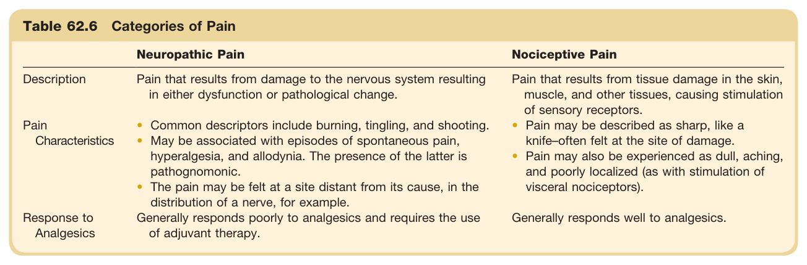

#### Table Data (CSV: [Table_62_6.csv](Table_62_6.csv))

```markdown
| Table Text (OCR) |
| :--- |
| Table 62.6 Categories of Pain Neuropathic Pain  Nociceptive Pain    Description  Pain that results from damage to the nervous system resulting in either dysfunction or pathological change.  Pain that results from tissue damage in the skin, muscle, and other tissues, causing stimulation of sensory receptors.    Pain Characteristics  Common descriptors include burning, tingling, and shooting.May be associated with episodes of spontaneous pain, hyperalgesia, and allodynia. The presence of the latter is pathognomonic.The pain may be felt at a site distant from its cause, in the distribution of a nerve, for example.  Pain may be described as sharp, like a knife–often felt at the site of damage.Pain may also be experienced as dull, aching, and poorly localized (as with stimulation of visceral nociceptors).    Response to Analgesics  Generally responds poorly to analgesics and requires the use of adjuvant therapy.  Generally responds well to analgesics. |
```

Table 62.6 Categories of Pain | | Neuropathic Pain | Nociceptive Pain | | :-------------------------- | :----------------------------------------------------------- | :----------------------------------------------------------- | | **Description** | Pain that results from damage to the nervous system resulting in either dysfunction or pathological change. | Pain that results from tissue damage in the skin, muscle, and other tissues, causing stimulation of sensory receptors. | | **Pain Characteristics** | • Common descriptors include burning, tingling, and shooting.<br>• May be associated with episodes of spontaneous pain, hyperalgesia, and allodynia. The presence of the latter is pathognomonic.<br>• The pain may be felt at a site distant from its cause, in the distribution of a nerve, for example. | • Pain may be described as sharp, like a knife—often felt at the site of damage.<br>• Pain may also be experienced as dull, aching, and poorly localized (as with stimulation of visceral nociceptors). | | **Response to Analgesics** | Generally responds poorly to analgesics and requires the use of adjuvant therapy. | Generally responds well to analgesics. |

---

### Table_62_7

#### Table Images (2 Parts)

- **Part 1 (Page 17)**:
  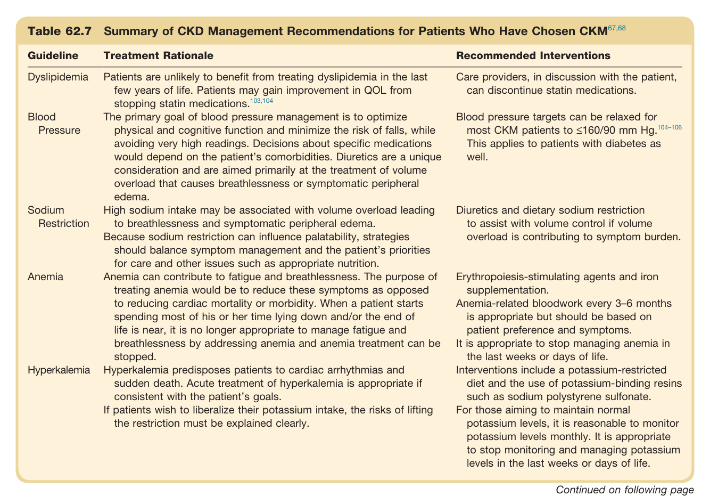

- **Part 2 (Page 18)**:
  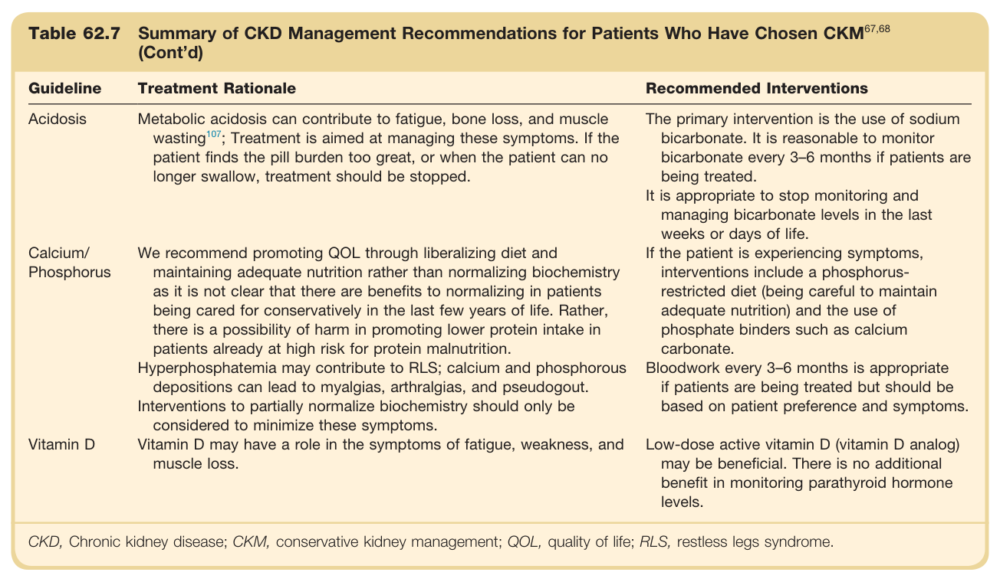

#### Table Data (CSV: [Table_62_7.csv](Table_62_7.csv))

```markdown
| Table Text (OCR) |
| :--- |
| Table 62.7 Summary of CKD Management Recommendations for Patients Who Have Chosen CKM<sup>67,68</sup> Guideline  Treatment Rationale  Recommended Interventions    Dyslipidemia  Patients are unlikely to benefit from treating dyslipidemia in the last few years of life. Patients may gain improvement in QOL from stopping statin medications. ^{103,104}   Care providers, in discussion with the patient, can discontinue statin medications.    Blood Pressure  The primary goal of blood pressure management is to optimize physical and cognitive function and minimize the risk of falls, while avoiding very high readings. Decisions about specific medications would depend on the patient's comorbidities. Diuretics are a unique consideration and are aimed primarily at the treatment of volume overload that causes breathlessness or symptomatic peripheral edema.  Blood pressure targets can be relaxed for most CKM patients to ≤160/90 mm Hg. ^{104-106} This applies to patients with diabetes as well.    Sodium Restriction  High sodium intake may be associated with volume overload leading to breathlessness and symptomatic peripheral edema.Because sodium restriction can influence palatability, strategies should balance symptom management and the patient's priorities for care and other issues such as appropriate nutrition.  Diuretics and dietary sodium restriction to assist with volume control if volume overload is contributing to symptom burden.    Anemia  Anemia can contribute to fatigue and breathlessness. The purpose of treating anemia would be to reduce these symptoms as opposed to reducing cardiac mortality or morbidity. When a patient starts spending most of his or her time lying down and/or the end of life is near, it is no longer appropriate to manage fatigue and breathlessness by addressing anemia and anemia treatment can be stopped.  Erythropoiesis-stimulating agents and iron supplementation.Anemia-related bloodwork every 3-6 months is appropriate but should be based on patient preference and symptoms.It is appropriate to stop managing anemia in the last weeks or days of life.    Hyperkalemia  Hyperkalemia predisposes patients to cardiac arrhythmias and sudden death. Acute treatment of hyperkalemia is appropriate if consistent with the patient's goals.If patients wish to liberalize their potassium intake, the risks of lifting the restriction must be explained clearly.  Interventions include a potassium-restricted diet and the use of potassium-binding resins such as sodium polystyrene sulfonate.For those aiming to maintain normal potassium levels, it is reasonable to monitor potassium levels monthly. It is appropriate to stop monitoring and managing potassium levels in the last weeks or days of life. |
```

Table 62.7 Summary of CKD Management Recommendations for Patients Who Have Chosen CKM | Guideline | Treatment Rationale | Recommended Interventions | | :----------------------------------------------------------- | :----------------------------------------------------------- | :----------------------------------------------------------- | | Dyslipidemia | Patients are unlikely to benefit from treating dyslipidemia in the last few years of life. Patients may gain improvement in QOL from stopping statin medications. | Care providers, in discussion with the patient, can discontinue statin medications. | | Blood Pressure | The primary goal of blood pressure management is to optimize physical and cognitive function and minimize the risk of falls, while avoiding very high readings. Decisions about specific medications would depend on the patient's comorbidities. Diuretics are a unique consideration and are aimed primarily at the treatment of volume overload that causes breathlessness or symptomatic peripheral edema. | Blood pressure targets can be relaxed for most CKM patients to ≤160/90 mm Hg. This applies to patients with diabetes as well. | | Sodium Restriction | High sodium intake may be associated with volume overload leading to breathlessness and symptomatic peripheral edema. Because sodium restriction can influence palatability, strategies should balance symptom management and the patient's priorities for care and other issues such as appropriate nutrition. | Diuretics and dietary sodium restriction to assist with volume control if volume overload is contributing to symptom burden. | | Anemia | Anemia can contribute to fatigue and breathlessness. The purpose of treating anemia would be to reduce these symptoms as opposed to reducing cardiac mortality or morbidity. When a patient starts spending most of his or her time lying down and/or the end of life is near, it is no longer appropriate to manage fatigue and breathlessness by addressing anemia and anemia treatment can be stopped. | Erythropoiesis-stimulating agents and iron supplementation. Anemia-related bloodwork every 3-6 months is appropriate but should be based on patient preference and symptoms. It is appropriate to stop managing anemia in the last weeks or days of life. | | Hyperkalemia | Hyperkalemia predisposes patients to cardiac arrhythmias and sudden death. Acute treatment of hyperkalemia is appropriate if consistent with the patient's goals. If patients wish to liberalize their potassium intake, the risks of lifting the restriction must be explained clearly. | Interventions include a potassium-restricted diet and the use of potassium-binding resins such as sodium polystyrene sulfonate. For those aiming to maintain normal potassium levels, it is reasonable to monitor potassium levels monthly. It is appropriate to stop monitoring and managing potassium levels in the last weeks or days of life. | | Acidosis | Metabolic acidosis can contribute to fatigue, bone loss, and muscle wasting; Treatment is aimed at managing these symptoms. If the patient finds the pill burden too great, or when the patient can no longer swallow, treatment should be stopped. | The primary intervention is the use of sodium bicarbonate. It is reasonable to monitor bicarbonate every 3-6 months if patients are being treated. It is appropriate to stop monitoring and managing bicarbonate levels in the last weeks or days of life. | | Calcium/ Phosphorus | We recommend promoting QOL through liberalizing diet and maintaining adequate nutrition rather than normalizing biochemistry as it is not clear that there are benefits to normalizing in patients being cared for conservatively in the last few years of life. Rather, there is a possibility of harm in promoting lower protein intake in patients already at high risk for protein malnutrition. Hyperphosphatemia may contribute to RLS; calcium and phosphorous depositions can lead to myalgias, arthralgias, and pseudogout. Interventions to partially normalize biochemistry should only be considered to minimize these symptoms. | If the patient is experiencing symptoms, interventions include a phosphorus-restricted diet (being careful to maintain adequate nutrition) and the use of phosphate binders such as calcium carbonate. Bloodwork every 3-6 months is appropriate if patients are being treated but should be based on patient preference and symptoms. | | Vitamin D | Vitamin D may have a role in the symptoms of fatigue, weakness, and muscle loss. | Low-dose active vitamin D (vitamin D analog) may be beneficial. There is no additional benefit in monitoring parathyroid hormone levels. | | CKD, Chronic kidney disease; CKM, conservative kidney management; QOL, quality of life; RLS, restless legs syndrome. | | |

---

## Boxes

### Box_62_1

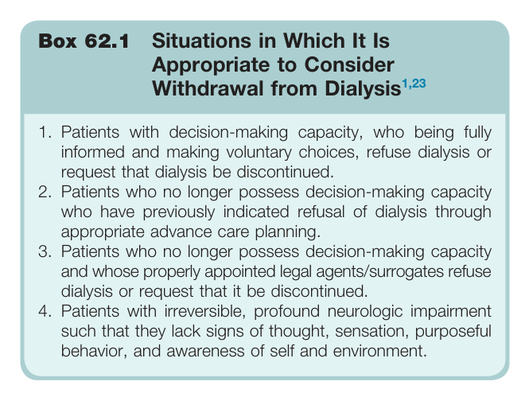

#### Box Text

```markdown
Box 62.1 Situations in Which It Is Appropriate to Consider Withdrawal from Dialysis<sup>1,23</sup> 1. Patients with decision-making capacity, who being fully informed and making voluntary choices, refuse dialysis or request that dialysis be discontinued. 2. Patients who no longer possess decision-making capacity who have previously indicated refusal of dialysis through appropriate advance care planning. 3. Patients who no longer possess decision-making capacity and whose properly appointed legal agents/surrogates refuse dialysis or request that it be discontinued. 4. Patients with irreversible, profound neurologic impairment such that they lack signs of thought, sensation, purposeful behavior, and awareness of self and environment.
```

Box 62.1 Situations in Which It Is Appropriate to Consider Withdrawal from Dialysis 1. Patients with decision-making capacity, who being fully informed and making voluntary choices, refuse dialysis or request that dialysis be discontinued. 2. Patients who no longer possess decision-making capacity who have previously indicated refusal of dialysis through appropriate advance care planning. 3. Patients who no longer possess decision-making capacity and whose properly appointed legal agents/surrogates refuse dialysis or request that it be discontinued. 4. Patients with irreversible, profound neurologic impairment such that they lack signs of thought, sensation, purposeful behavior, and awareness of self and environment.

---
