# 63. Hemodialysis - Figures and Tables Index

This document lists all figures, tables and boxes extracted from `63. Hemodialysis.pdf`.

## Table of Contents
- [Figures](#figures)
- [Tables](#tables)
- [Boxes](#boxes)

---

## Figures

### Fig_63_1

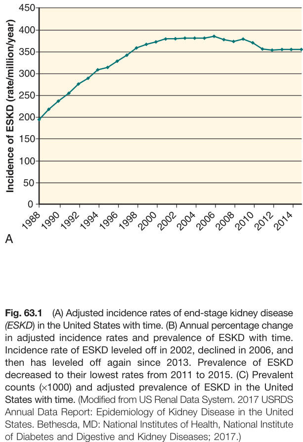

Fig. 63.1 (A) Adjusted incidence rates of end-stage kidney disease (ESKD) in the United States with time. (B) Annual percentage change in adjusted incidence rates and prevalence of ESKD with time. Incidence rate of ESKD leveled off in 2002, declined in 2006, and then has leveled off again since 2013. Prevalence of ESKD decreased to their lowest rates from 2011 to 2015. (C) Prevalent counts (x1000) and adjusted prevalence of ESKD in the United States with time. (Modified from US Renal Data System. 2017 USRDS Annual Data Report: Epidemiology of Kidney Disease in the United States. Bethesda, MD: National Institutes of Health, National Institute of Diabetes and Digestive and Kidney Diseases; 2017.)

---

### Fig_63_2

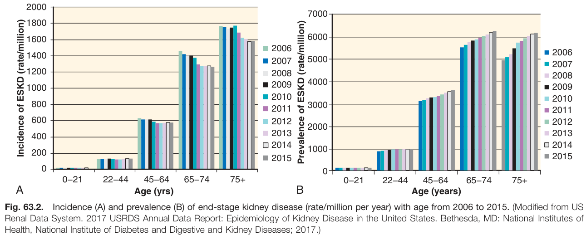

Fig. 63.2 Incidence (A) and prevalence (B) of end-stage kidney disease (rate/million per year) with age from 2006 to 2015. (Modified from US Renal Data System. 2017 USRDS Annual Data Report: Epidemiology of Kidney Disease in the United States. Bethesda, MD: National Institutes of Health, National Institute of Diabetes and Digestive and Kidney Diseases; 2017.)

---

### Fig_63_3

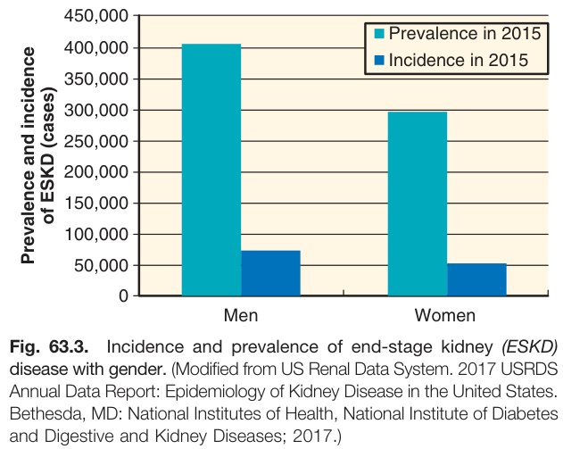

Fig. 63.3 Incidence and prevalence of end-stage kidney (ESKD) disease with gender. (Modified from US Renal Data System. 2017 USRDS Annual Data Report: Epidemiology of Kidney Disease in the United States. Bethesda, MD: National Institutes of Health, National Institute of Diabetes and Digestive and Kidney Diseases; 2017.)

---

### Fig_63_4

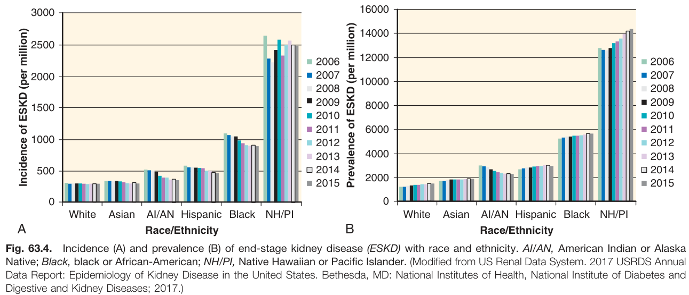

Fig. 63.4 Incidence (A) and prevalence (B) of end-stage kidney disease (ESKD) with race and ethnicity. Al/AN, American Indian or Alaska Native; Black, black or African-American; NH/PI, Native Hawaiian or Pacific Islander. (Modified from US Renal Data System. 2017 USRDS Annual Data Report: Epidemiology of Kidney Disease in the United States. Bethesda, MD: National Institutes of Health, National Institute of Diabetes and Digestive and Kidney Diseases; 2017.)

---

### Fig_63_5

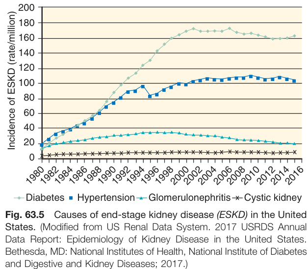

Fig. 63.5 Causes of end-stage kidney disease (ESKD) in the United States. (Modified from US Renal Data System. 2017 USRDS Annual Data Report: Epidemiology of Kidney Disease in the United States. Bethesda, MD: National Institutes of Health, National Institute of Diabetes and Digestive and Kidney Diseases; 2017.)

---

### Fig_63_6

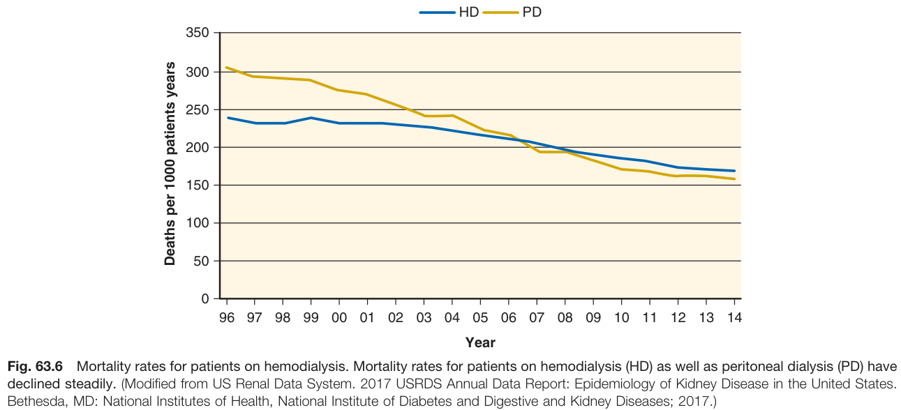

Fig. 63.6 Mortality rates for patients on hemodialysis. Mortality rates for patients on hemodialysis (HD) as well as peritoneal dialysis (PD) have declined steadily. (Modified from US Renal Data System. 2017 USRDS Annual Data Report: Epidemiology of Kidney Disease in the United States. Bethesda, MD: National Institutes of Health, National Institute of Diabetes and Digestive and Kidney Diseases; 2017.)

---

### Fig_63_7

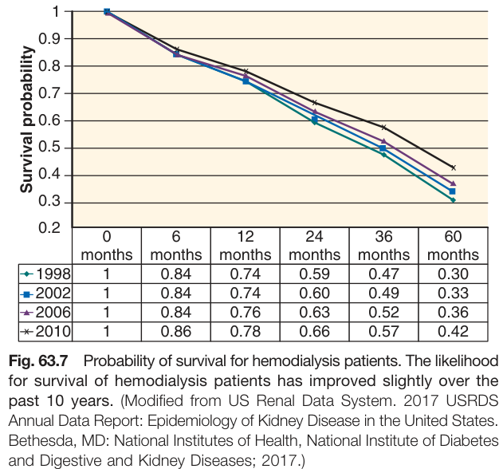

Fig. 63.7 Probability of survival for hemodialysis patients. The likelihood for survival of hemodialysis patients has improved slightly over the past 10 years. (Modified from US Renal Data System. 2017 USRDS Annual Data Report: Epidemiology of Kidney Disease in the United States. Bethesda, MD: National Institutes of Health, National Institute of Diabetes and Digestive and Kidney Diseases; 2017.)

---

### Fig_63_8

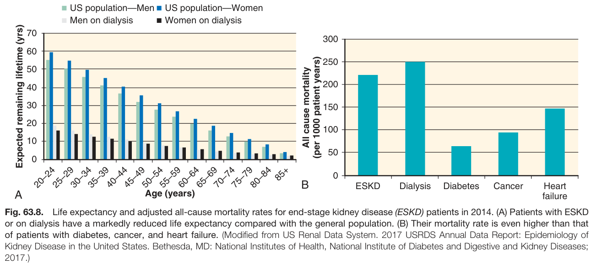

Fig. 63.8 Life expectancy and adjusted all-cause mortality rates for end-stage kidney disease (ESKD) patients in 2014. (A) Patients with ESKD or on dialysis have a markedly reduced life expectancy compared with the general population. (B) Their mortality rate is even higher than that of patients with diabetes, cancer, and heart failure. (Modified from US Renal Data System. 2017 USRDS Annual Data Report: Epidemiology of Kidney Disease in the United States. Bethesda, MD: National Institutes of Health, National Institute of Diabetes and Digestive and Kidney Diseases; 2017.)

---

### Fig_63_9

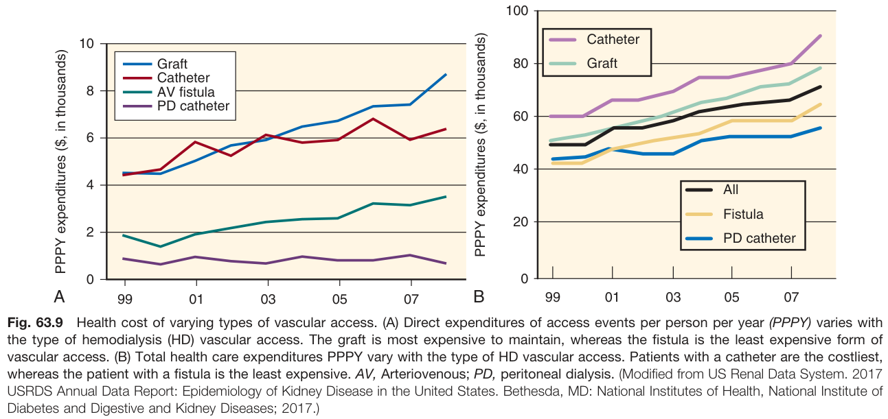

Fig. 63.9 Health cost of varying types of vascular access. (A) Direct expenditures of access events per person per year (PPPY) varies with the type of hemodialysis (HD) vascular access. The graft is most expensive to maintain, whereas the fistula is the least expensive form of vascular access. (B) Total health care expenditures PPPY vary with the type of HD vascular access. Patients with a catheter are the costliest, whereas the patient with a fistula is the least expensive. AV, Arteriovenous; PD, peritoneal dialysis. (Modified from US Renal Data System. 2017 USRDS Annual Data Report: Epidemiology of Kidney Disease in the United States. Bethesda, MD: National Institutes of Health, National Institute of Diabetes and Digestive and Kidney Diseases; 2017.)

---

### Fig_63_10

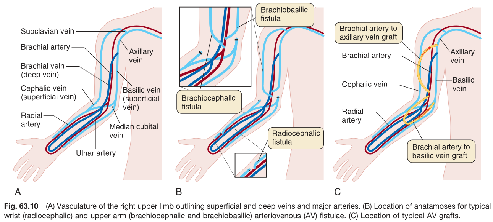

Fig. 63.10 (A) Vasculature of the right upper limb outlining superficial and deep veins and major arteries. (B) Location of anatamoses for typical wrist (radiocephalic) and upper arm (brachiocephalic and brachiobasilic) arteriovenous (AV) fistulae. (C) Location of typical AV grafts.

---

### Fig_63_11

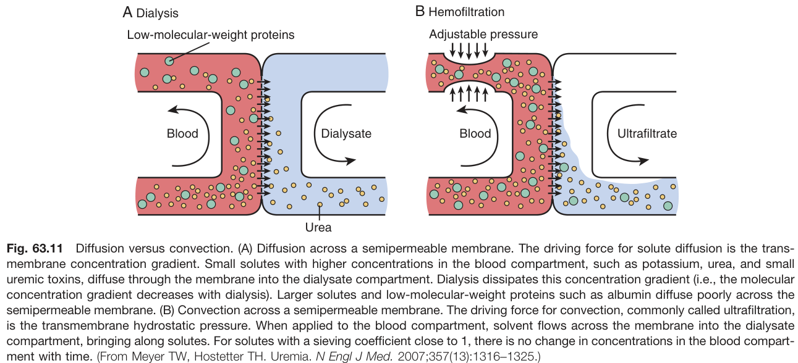

Fig. 63.11 Diffusion versus convection. (A) Diffusion across a semipermeable membrane. The driving force for solute diffusion is the trans- membrane concentration gradient. Small solutes with higher concentrations in the blood compartment, such as potassium, urea, and small uremic toxins, diffuse through the membrane into the dialysate compartment. Dialysis dissipates this concentration gradient (i.e., the molecular concentration gradient decreases with dialysis). Larger solutes and low-molecular-weight proteins such as albumin diffuse poorly across the semipermeable membrane. (B) Convection across a semipermeable membrane. The driving force for convection, commonly called ultrafiltration, is the transmembrane hydrostatic pressure. When applied to the blood compartment, solvent flows across the membrane into the dialysate compartment, bringing along solutes. For solutes with a sieving coefficient close to 1, there is no change in concentrations in the blood compart- ment with time. (From Meyer TW, Hostetter TH. Uremia. N Engl J Med. 2007;357(13):1316–1325.)

---

### Fig_63_12

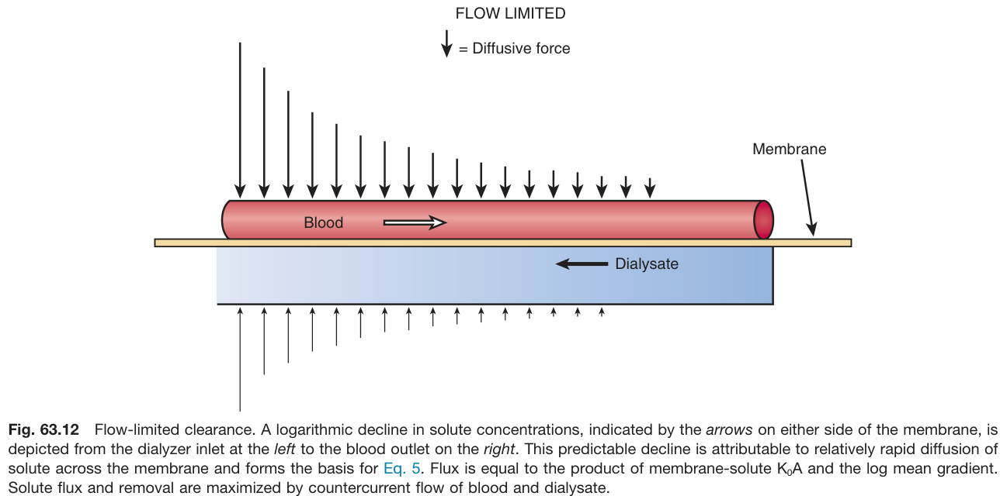

Fig. 63.12 Flow-limited clearance. A logarithmic decline in solute concentrations, indicated by the arrows on either side of the membrane, is depicted from the dialyzer inlet at the left to the blood outlet on the right. This predictable decline is attributable to relatively rapid diffusion of solute across the membrane and forms the basis for Eq. 5. Flux is equal to the product of membrane-solute KA and the log mean gradient. Solute flux and removal are maximized by countercurrent flow of blood and dialysate.

---

### Fig_63_13

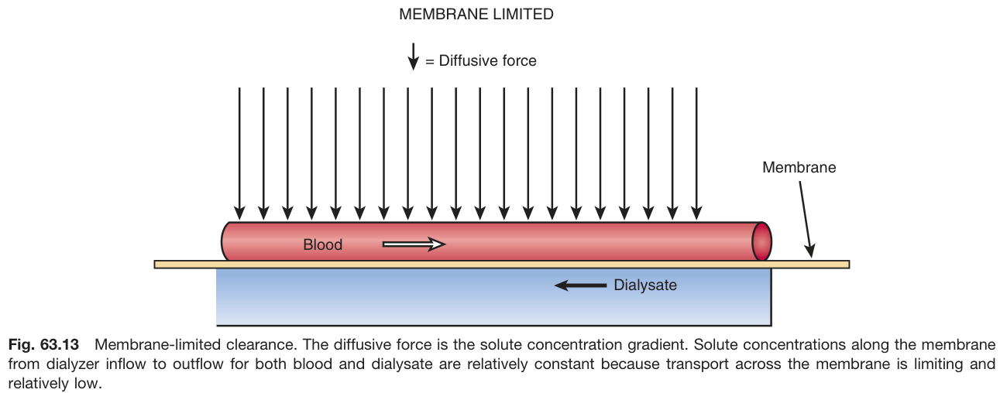

Fig. 63.13 Membrane-limited clearance. The diffusive force is the solute concentration gradient. Solute concentrations along the membrane from dialyzer inflow to outflow for both blood and dialysate are relatively constant because transport across the membrane is limiting and relatively low.

---

### Fig_63_14

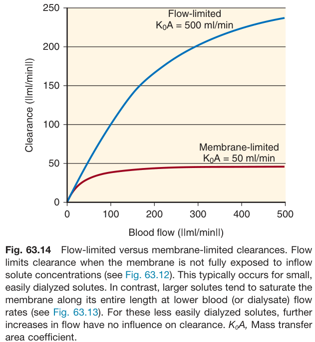

Fig. 63.14 Flow-limited versus membrane-limited clearances. Flow limits clearance when the membrane is not fully exposed to inflow solute concentrations (see Fig. 63.12). This typically occurs for small, easily dialyzed solutes. In contrast, larger solutes tend to saturate the membrane along its entire length at lower blood (or dialysate) flow rates (see Fig. 63.13). For these less easily dialyzed solutes, further increases in flow have no influence on clearance. KA, Mass transfer area coefficient.

---

### Fig_63_15

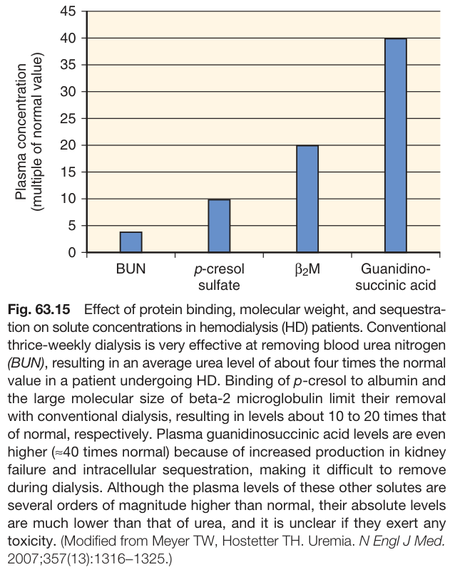

Fig. 63.15 Effect of protein binding, molecular weight, and sequestration on solute concentrations in hemodialysis (HD) patients. Conventional thrice-weekly dialysis is very effective at removing blood urea nitrogen (BUN), resulting in an average urea level of about four times the normal value in a patient undergoing HD. Binding of p-cresol to albumin and the large molecular size of beta-2 microglobulin limit their removal with conventional dialysis, resulting in levels about 10 to 20 times that of normal, respectively. Plasma guanidinosuccinic acid levels are even higher (≈40 times normal) because of increased production in kidney failure and intracellular sequestration, making it difficult to remove during dialysis. Although the plasma levels of these other solutes are several orders of magnitude higher than normal, their absolute levels are much lower than that of urea, and it is unclear if they exert any toxicity. (Modified from Meyer TW, Hostetter TH. Uremia. N Engl J Med. 2007;357(13):1316-1325.)

---

### Fig_63_16

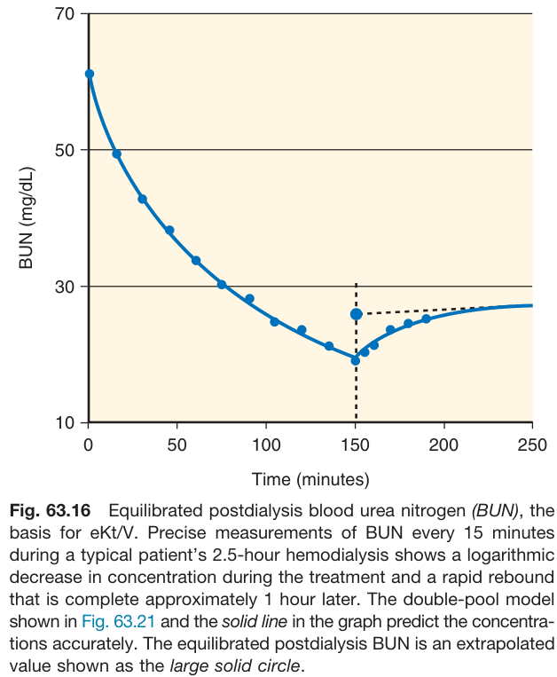

Fig. 63.16 Equilibrated postdialysis blood urea nitrogen (BUN), the basis for eKt/V. Precise measurements of BUN every 15 minutes during a typical patient's 2.5-hour hemodialysis shows a logarithmic decrease in concentration during the treatment and a rapid rebound that is complete approximately 1 hour later. The double-pool model shown in Fig. 63.21 and the solid line in the graph predict the concentra- tions accurately. The equilibrated postdialysis BUN is an extrapolated value shown as the large solid circle.

---

### Fig_63_17

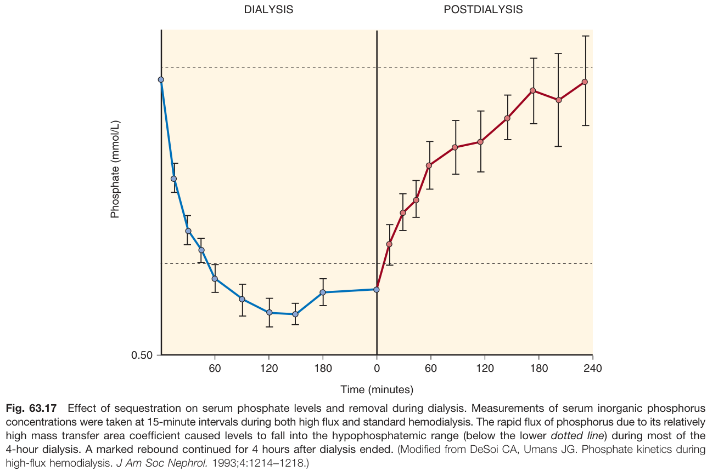

Fig. 63.17 Effect of sequestration on serum phosphate levels and removal during dialysis. Measurements of serum inorganic phosphorus concentrations were taken at 15-minute intervals during both high flux and standard hemodialysis. The rapid flux of phosphorus due to its relatively high mass transfer area coefficient caused levels to fall into the hypophosphatemic range (below the lower dotted line) during most of the 4-hour dialysis. A marked rebound continued for 4 hours after dialysis ended. (Modified from DeSoi CA, Umans JG. Phosphate kinetics during high-flux hemodialysis. J Am Soc Nephrol. 1993;4:1214-1218.)

---

### Fig_63_18

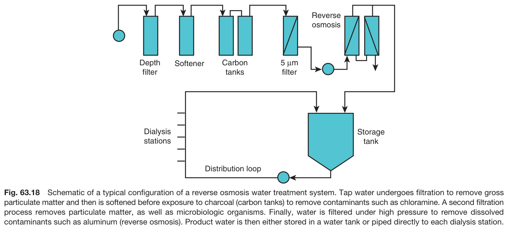

Fig. 63.18 Schematic of a typical configuration of a reverse osmosis water treatment system. Tap water undergoes filtration to remove gross particulate matter and then is softened before exposure to charcoal (carbon tanks) to remove contaminants such as chloramine. A second filtration process removes particulate matter, as well as microbiologic organisms. Finally, water is filtered under high pressure to remove dissolved contaminants such as aluminum (reverse osmosis). Product water is then either stored in a water tank or piped directly to each dialysis station.

---

### Fig_63_19

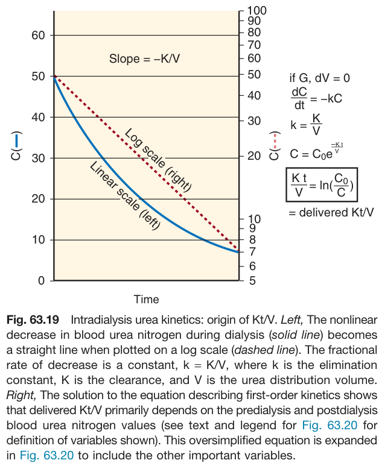

Fig. 63.19 Intradialysis urea kinetics: origin of Kt/V. Left, The nonlinear decrease in blood urea nitrogen during dialysis (solid line) becomes a straight line when plotted on a log scale (dashed line). The fractional rate of decrease is a constant, k = K/V, where k is the elimination constant, K is the clearance, and V is the urea distribution volume. Right, The solution to the equation describing first-order kinetics shows that delivered Kt/V primarily depends on the predialysis and postdialysis blood urea nitrogen values (see text and legend for Fig. 63.20 for definition of variables shown). This oversimplified equation is expanded in Fig. 63.20 to include the other important variables.

---

### Fig_63_20

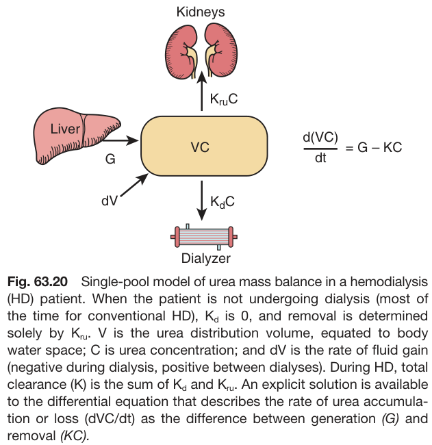

Fig. 63.20 Single-pool model of urea mass balance in a hemodialysis (HD) patient. When the patient is not undergoing dialysis (most of the time for conventional HD), Ka is 0, and removal is determined solely by Kru. V is the urea distribution volume, equated to body water space; C is urea concentration; and dV is the rate of fluid gain (negative during dialysis, positive between dialyses). During HD, total clearance (K) is the sum of Ka and Kru. An explicit solution is available to the differential equation that describes the rate of urea accumula- tion or loss (dVC/dt) as the difference between generation (G) and removal (KC).

---

### Fig_63_21

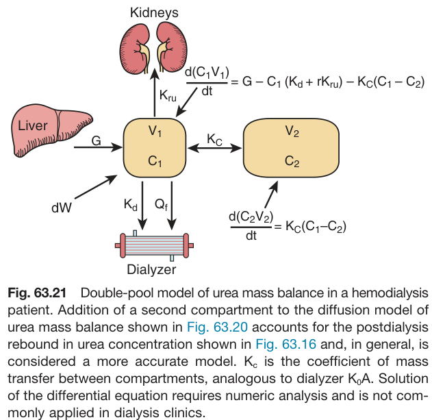

Fig. 63.21 Double-pool model of urea mass balance in a hemodialysis patient. Addition of a second compartment to the diffusion model of urea mass balance shown in Fig. 63.20 accounts for the postdialysis rebound in urea concentration shown in Fig. 63.16 and, in general, is considered a more accurate model. Ko is the coefficient of mass transfer between compartments, analogous to dialyzer KA. Solution of the differential equation requires numeric analysis and is not com- monly applied in dialysis clinics.

---

### Fig_63_22

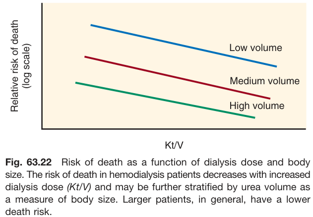

Fig. 63.22 Risk of death as a function of dialysis dose and body size. The risk of death in hemodialysis patients decreases with increased dialysis dose (Kt/V) and may be further stratified by urea volume as a measure of body size. Larger patients, in general, have a lower death risk.

---

### Fig_63_23

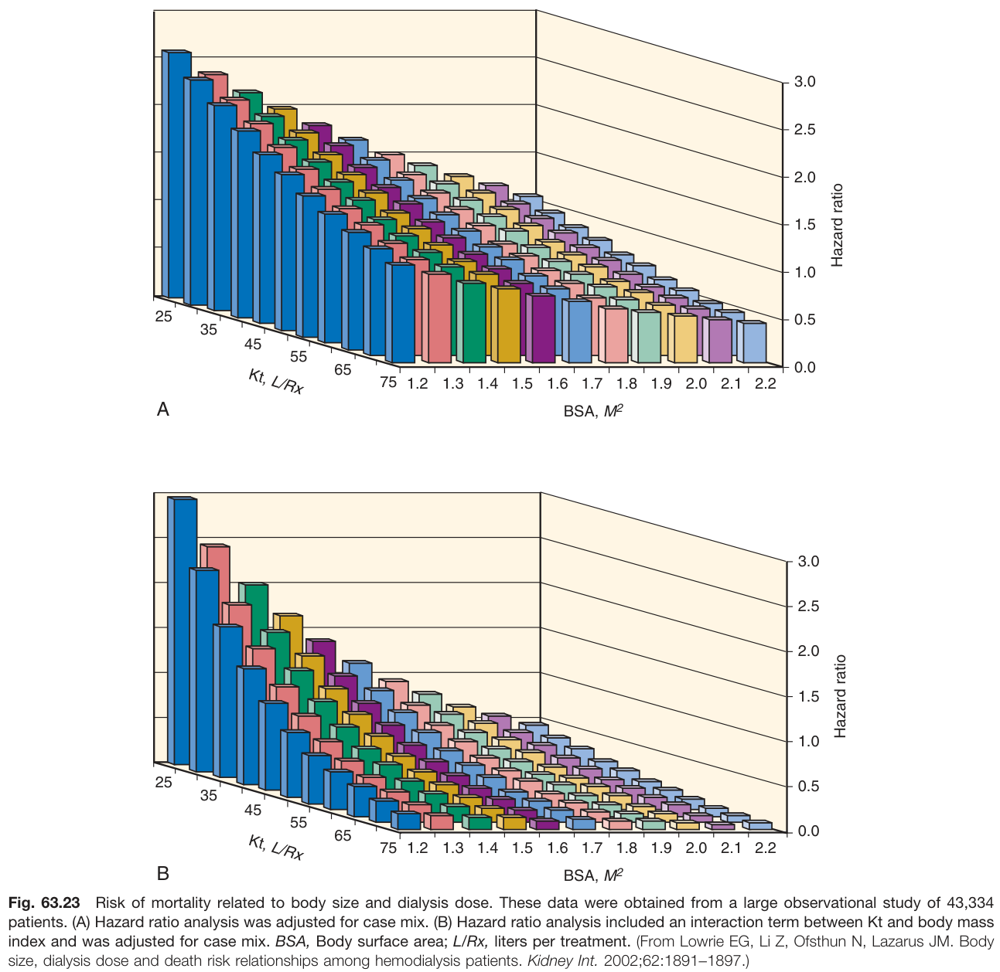

Fig. 63.23 Risk of mortality related to body size and dialysis dose. These data were obtained from a large observational study of 43,334 patients. (A) Hazard ratio analysis was adjusted for case mix. (B) Hazard ratio analysis included an interaction term between Kt and body mass index and was adjusted for case mix. BSA, Body surface area; L/Rx, liters per treatment. (From Lowrie EG, Li Z, Ofsthun N, Lazarus JM. Body size, dialysis dose and death risk relationships among hemodialysis patients. Kidney Int. 2002;62:1891-1897.)

---

### Fig_63_24

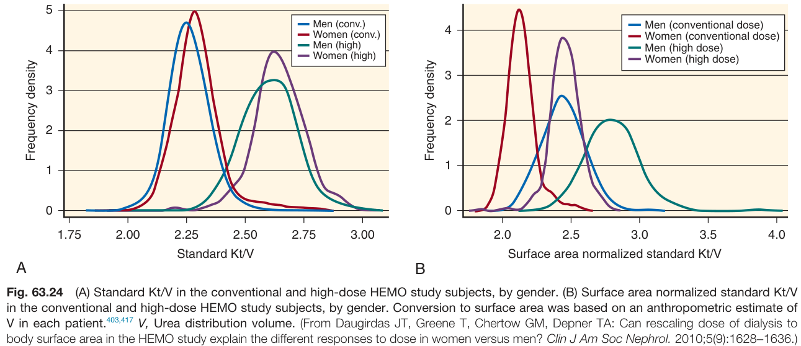

Fig. 63.24 (A) Standard Kt/V in the conventional and high-dose HEMO study subjects, by gender. (B) Surface area normalized standard Kt/V in the conventional and high-dose HEMO study subjects, by gender. Conversion to surface area was based on an anthropometric estimate of V in each patient. V, Urea distribution volume. (From Daugirdas JT, Greene T, Chertow GM, Depner TA: Can rescaling dose of dialysis to body surface area in the HEMO study explain the different responses to dose in women versus men? Clin J Am Soc Nephrol. 2010;5(9):1628-1636.)

---

### Fig_63_25

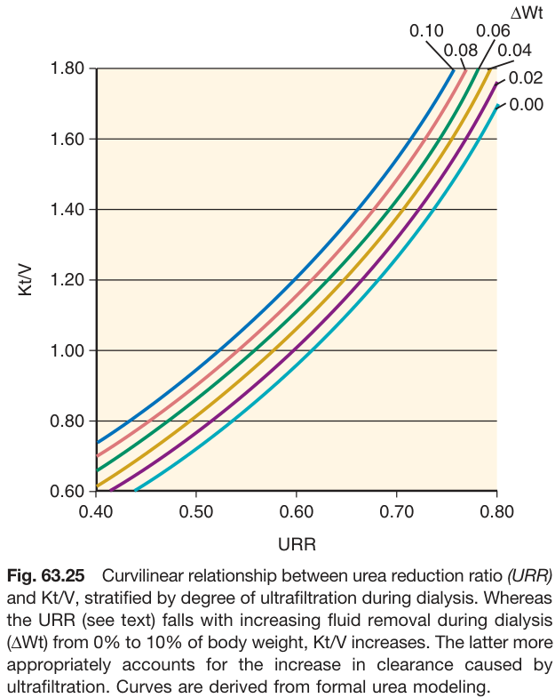

Fig. 63.25 Curvilinear relationship between urea reduction ratio (URR) and Kt/V, stratified by degree of ultrafiltration during dialysis. Whereas the URR (see text) falls with increasing fluid removal during dialysis (AWt) from 0% to 10% of body weight, Kt/V increases. The latter more appropriately accounts for the increase in clearance caused by ultrafiltration. Curves are derived from formal urea modeling.

---

### Fig_63_26

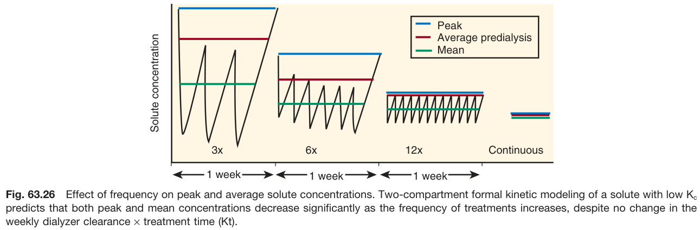

Fig. 63.26 Effect of frequency on peak and average solute concentrations. Two-compartment formal kinetic modeling of a solute with low K predicts that both peak and mean concentrations decrease significantly as the frequency of treatments increases, despite no change in the weekly dialyzer clearance × treatment time (Kt).

---

### Fig_63_27

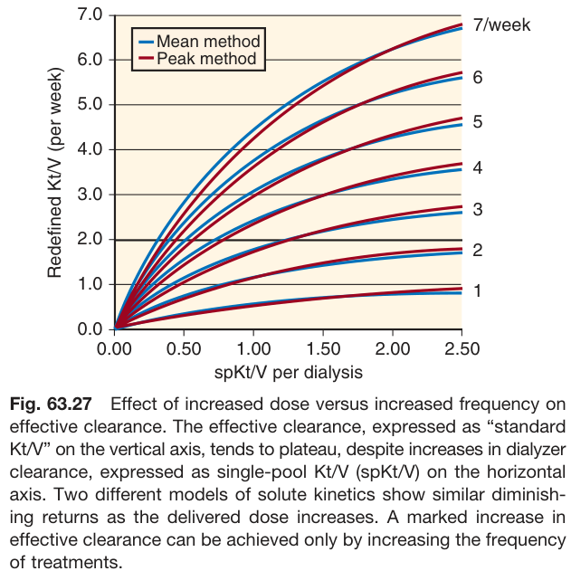

Fig. 63.27 Effect of increased dose versus increased frequency on effective clearance. The effective clearance, expressed as "standard Kt/V" on the vertical axis, tends to plateau, despite increases in dialyzer clearance, expressed as single-pool Kt/V (spKt/V) on the horizontal axis. Two different models of solute kinetics show similar diminish- ing returns as the delivered dose increases. A marked increase in effective clearance can be achieved only by increasing the frequency of treatments.

---

## Tables

### Table_63_1

#### Table Image

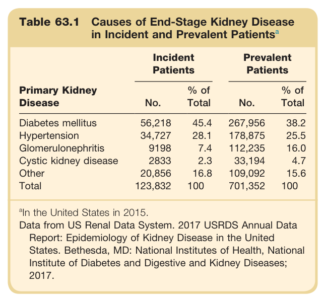

#### Table Data (CSV: [Table_63_1.csv](Table_63_1.csv))

```markdown
| Table Text (OCR) |
| :--- |
| Table 63.1 Causes of End-Stage Kidney Disease in Incident and Prevalent Patients<sup>a</sup> Primary Kidney Disease  Incident Patients  Prevalent Patients    No.  % of Total  No.  % of Total    Diabetes mellitus  56,218  45.4  267,956  38.2    Hypertension  34,727  28.1  178,875  25.5    Glomerulonephritis  9198  7.4  112,235  16.0    Cystic kidney disease  2833  2.3  33,194  4.7    Other  20,856  16.8  109,092  15.6    Total  123,832  100  701,352  100 <sup>a</sup>In the United States in 2015. Data from US Renal Data System. 2017 USRDS Annual Data Report: Epidemiology of Kidney Disease in the United States. Bethesda, MD: National Institutes of Health, National Institute of Diabetes and Digestive and Kidney Diseases; 2017. |
```

Table 63.1 Causes of End-Stage Kidney Disease in Incident and Prevalent Patientsa | Primary Kidney Disease | Incident Patients | Prevalent Patients | | :--------------------- | :---------------- | :----------------- | | | **No.** | **% of Total** | | Diabetes mellitus | 56,218 | 45.4 | | Hypertension | 34,727 | 28.1 | | Glomerulonephritis | 9198 | 7.4 | | Cystic kidney disease | 2833 | 2.3 | | Other | 20,856 | 16.8 | | Total | 123,832 | 100 | aIn the United States in 2015. Data from US Renal Data System. 2017 USRDS Annual Data Report: Epidemiology of Kidney Disease in the United States. Bethesda, MD: National Institutes of Health, National Institute of Diabetes and Digestive and Kidney Diseases; 2017.

---

### Table_63_2

#### Table Image

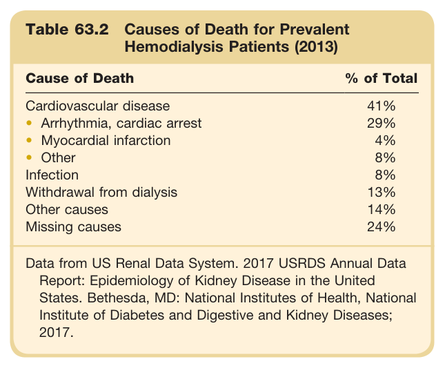

#### Table Data (CSV: [Table_63_2.csv](Table_63_2.csv))

```markdown
| Table Text (OCR) |
| :--- |
| Table 63.2 Causes of Death for Prevalent Hemodialysis Patients (2013) Cause of Death  % of Total    Cardiovascular disease  41%    • Arrhythmia, cardiac arrest  29%    • Myocardial infarction  4%    • Other  8%    Infection  8%    Withdrawal from dialysis  13%    Other causes  14%    Missing causes  24% Data from US Renal Data System. 2017 USRDS Annual Data Report: Epidemiology of Kidney Disease in the United States. Bethesda, MD: National Institutes of Health, National Institute of Diabetes and Digestive and Kidney Diseases; 2017. |
```

Table 63.2 Causes of Death for Prevalent Hemodialysis Patients (2013) | Cause of Death | % of Total | | :--------------------------- | :--------- | | Cardiovascular disease | 41% | | • Arrhythmia, cardiac arrest | 29% | | • Myocardial infarction | 4% | | • Other | 8% | | Infection | 8% | | Withdrawal from dialysis | 13% | | Other causes | 14% | | Missing causes | 24% | Data from US Renal Data System. 2017 USRDS Annual Data Report: Epidemiology of Kidney Disease in the United States. Bethesda, MD: National Institutes of Health, National Institute of Diabetes and Digestive and Kidney Diseases; 2017.

---

### Table_63_3

#### Table Image

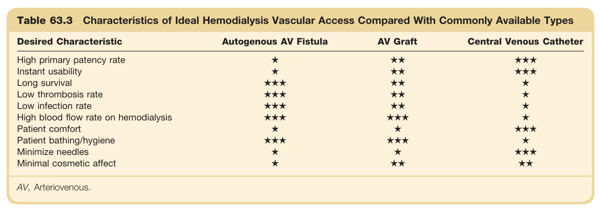

#### Table Data (CSV: [Table_63_3.csv](Table_63_3.csv))

```markdown
| Table Text (OCR) |
| :--- |
| Table 63.3 Characteristics of Ideal Hemodialysis Vascular Access Compared With Commonly Available Types Desired Characteristic  Autogenous AV Fistula  AV Graft  Central Venous Catheter    High primary patency rate  ★  ★★  ★★★    Instant usability  ★  ★★  ★★★    Long survival  ★★★  ★★  ★    Low thrombosis rate  ★★★  ★★  ★    Low infection rate  ★★★  ★★  ★    High blood flow rate on hemodialysis  ★★★  ★★★  ★    Patient comfort  ★  ★  ★★★    Patient bathing/hygiene  ★★★  ★★★  ★    Minimize needles  ★  ★  ★★★    Minimal cosmetic affect  ★  ★★  ★★ AV, Arteriovenous. |
```

Table 63.3 Characteristics of Ideal Hemodialysis Vascular Access Compared With Commonly Available Types | Desired Characteristic | Autogenous AV Fistula | AV Graft | Central Venous Catheter | | :----------------------------------- | :-------------------- | :------- | :---------------------- | | High primary patency rate | * | ** | *** | | Instant usability | *** | * | *** | | Long survival | *** | ** | * | | Low thrombosis rate | *** | ** | * | | Low infection rate | *** | ** | * | | High blood flow rate on hemodialysis | *** | ** | * | | Patient comfort | ** | ** | *** | | Patient bathing/hygiene | *** | ** | * | | Minimize needles | *** | ** | *** | | Minimal cosmetic affect | * | ** | *** | AV, Arteriovenous.

---

### Table_63_4

#### Table Image

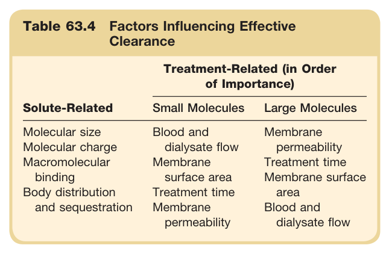

#### Table Data (CSV: [Table_63_4.csv](Table_63_4.csv))

```markdown
| Table Text (OCR) |
| :--- |
| Table 63.4 Factors Influencing Effective Clearance Solute-Related  Treatment-Related (in Order of Importance)    Small Molecules  Large Molecules    Molecular size  Blood and dialysate flow  Membrane permeability    Molecular charge    Macromolecular binding  Membrane surface area  Treatment timeMembrane surface area    Body distribution and sequestration  Treatment timeMembrane permeability  Blood and dialysate flow |
```

Table 63.4 Factors Influencing Effective Clearance | | Treatment-Related (in Order of Importance) | | | :---------------------------------- | :----------------------------------------- | :----------------------- | | **Solute-Related** | **Small Molecules** | **Large Molecules** | | Molecular size | Blood and dialysate flow | Membrane permeability | | Molecular charge | Membrane surface area | Treatment time | | Macromolecular binding | Treatment time | Membrane surface area | | Body distribution and sequestration | Membrane permeability | Blood and dialysate flow |

---

### Table_63_5

#### Table Image

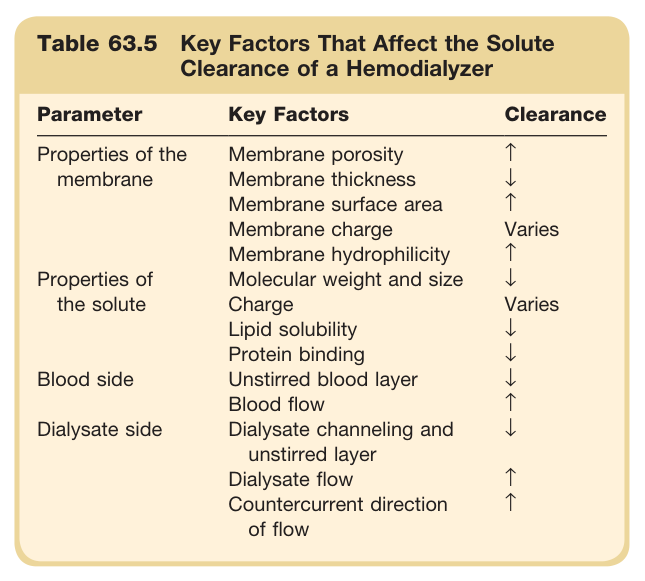

#### Table Data (CSV: [Table_63_5.csv](Table_63_5.csv))

```markdown
| Table Text (OCR) |
| :--- |
| Table 63.5 Key Factors That Affect the Solute Clearance of a Hemodialyzer Parameter  Key Factors  Clearance    Properties of the membrane  Membrane porosity  ↑    Membrane thickness  ↓    Membrane surface area  ↑    Membrane charge  Varies    Membrane hydrophilicity  ↑    Properties of the solute  Molecular weight and size  ↓    Charge  Varies    Lipid solubility  ↓    Protein binding  ↓    Blood side  Unstirred blood layer  ↓    Blood flow  ↑    Dialysate side  Dialysate channeling and unstirred layer  ↓    Dialysate flow  ↑    Countercurrent direction of flow  ↑ |
```

Table 63.5 Key Factors That Affect the Solute Clearance of a Hemodialyzer | Parameter | Key Factors | Clearance | | :-------------------------- | :--------------------------------------- | :-------- | | Properties of the membrane | Membrane porosity | ↑ | | | Membrane thickness | ↓ | | | Membrane surface area | ↑ | | | Membrane charge | Varies | | | Membrane hydrophilicity | ↑ | | Properties of the solute | Molecular weight and size | ↓ | | | Charge | Varies | | | Lipid solubility | ↓ | | | Protein binding | ↓ | | Blood side | Unstirred blood layer | ↓ | | | Blood flow | ↑ | | Dialysate side | Dialysate channeling and unstirred layer | ↓ | | | Dialysate flow | ↑ | | | Countercurrent direction of flow | ↑ |

---

### Table_63_6

#### Table Image

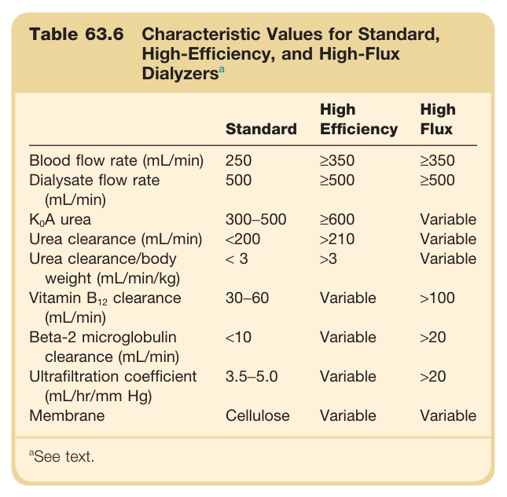

#### Table Data (CSV: [Table_63_6.csv](Table_63_6.csv))

```markdown
| Table Text (OCR) |
| :--- |
| Table 63.6 Characteristic Values for Standard, High-Efficiency, and High-Flux Dialyzers<sup>a</sup> Standard  High Efficiency  High Flux    Blood flow rate (mL/min)  250  ≥350  ≥350    Dialysate flow rate (mL/min)  500  ≥500  ≥500     K_0A  urea  300–500  ≥600  Variable    Urea clearance (mL/min)  <200  >210  Variable    Urea clearance/body weight (mL/min/kg)  <3  >3  Variable    Vitamin  B_{12}  clearance (mL/min)  30–60  Variable  >100    Beta-2 microglobulin clearance (mL/min)  <10  Variable  >20    Ultrafiltration coefficient (mL/hr/mm Hg)  3.5–5.0  Variable  >20    Membrane  Cellulose  Variable  Variable <sup>a</sup>See text. |
```

Table 63.6 Characteristic Values for Standard, High-Efficiency, and High-Flux Dialyzersa | | Standard | High Efficiency | High Flux | | :---------------------------------------- | :-------- | :-------------- | :-------- | | Blood flow rate (mL/min) | 250 | ≥350 | ≥350 | | Dialysate flow rate (mL/min) | 500 | ≥500 | ≥500 | | KoA urea | 300-500 | ≥600 | Variable | | Urea clearance (mL/min) | <200 | >210 | Variable | | Urea clearance/body weight (mL/min/kg) | <3 | >3 | Variable | | Vitamin B12 clearance (mL/min) | 30-60 | Variable | >100 | | Beta-2 microglobulin clearance (mL/min) | <10 | Variable | >20 | | Ultrafiltration coefficient (mL/hr/mm Hg) | 3.5-5.0 | Variable | >20 | | Membrane | Cellulose | Variable | Variable | aSee text.

---

### Table_63_7

#### Table Image

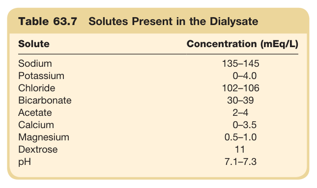

#### Table Data (CSV: [Table_63_7.csv](Table_63_7.csv))

```markdown
| Table Text (OCR) |
| :--- |
| Table 63.7 Solutes Present in the Dialysate Solute  Concentration (mEq/L)    Sodium  135–145    Potassium  0–4.0    Chloride  102–106    Bicarbonate  30–39    Acetate  2–4    Calcium  0–3.5    Magnesium  0.5–1.0    Dextrose  11    pH  7.1–7.3 |
```

Table 63.7 Solutes Present in the Dialysate | Solute | Concentration (mEq/L) | | :-------------------------- | :-------------------- | | Sodium | 135-145 | | Potassium | 0-4.0 | | Chloride | 102-106 | | Bicarbonate | 30-39 | | Acetate | 2-4 | | Calcium | 0-3.5 | | Magnesium | 0.5-1.0 | | Dextrose | 11 | | pH | 7.1-7.3 |

---

### Table_63_8

#### Table Image

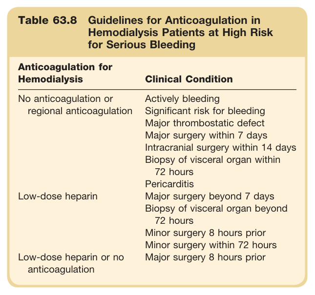

#### Table Data (CSV: [Table_63_8.csv](Table_63_8.csv))

```markdown
| Table Text (OCR) |
| :--- |
| Table 63.8 Guidelines for Anticoagulation in Hemodialysis Patients at High Risk for Serious Bleeding Anticoagulation for Hemodialysis  Clinical Condition    No anticoagulation or regional anticoagulation  Actively bleedingSignificant risk for bleedingMajor thrombostatic defectMajor surgery within 7 daysIntracranial surgery within 14 daysBiopsy of visceral organ within 72 hoursPericarditis    Low-dose heparin  Major surgery beyond 7 daysBiopsy of visceral organ beyond 72 hoursMinor surgery 8 hours priorMinor surgery within 72 hours    Low-dose heparin or no anticoagulation  Major surgery 8 hours prior |
```

Table 63.8 Guidelines for Anticoagulation in Hemodialysis Patients at High Risk for Serious Bleeding | Anticoagulation for Hemodialysis | Clinical Condition | | :--------------------------------------------- | :----------------------------------------------------------- | | No anticoagulation or regional anticoagulation | Actively bleeding<br>Significant risk for bleeding<br>Major thrombostatic defect<br>Major surgery within 7 days<br>Intracranial surgery within 14 days<br>Biopsy of visceral organ within 72 hours<br>Pericarditis | | Low-dose heparin | Major surgery beyond 7 days<br>Biopsy of visceral organ beyond 72 hours | | Low-dose heparin or no anticoagulation | Minor surgery 8 hours prior<br>Minor surgery within 72 hours<br>Major surgery 8 hours prior |

---

## Boxes

### Box_63_1

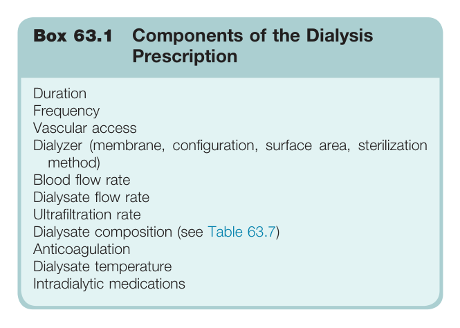

#### Box Text

```markdown
Box 63.1 Components of the Dialysis Prescription * Duration * Frequency * Vascular access * Dialyzer (membrane, configuration, surface area, sterilization method) * Blood flow rate * Dialysate flow rate * Ultrafiltration rate * Dialysate composition (see Table 63.7) * Anticoagulation * Dialysate temperature * Intradialytic medications
```

Box 63.1 Components of the Dialysis Prescription * Duration * Frequency * Vascular access * Dialyzer (membrane, configuration, surface area, sterilization method) * Blood flow rate * Dialysate flow rate * Ultrafiltration rate * Dialysate composition (see Table 63.7) * Anticoagulation * Dialysate temperature * Intradialytic medications

---

### Box_63_2

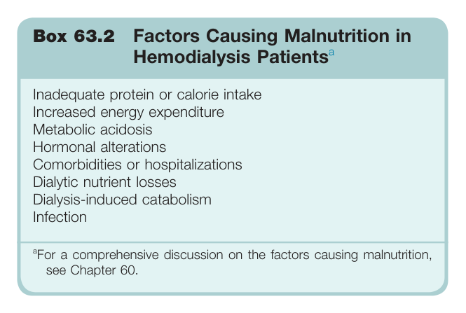

#### Box Text

```markdown
Box 63.2 Factors Causing Malnutrition in Hemodialysis Patients<sup>a</sup> Inadequate protein or calorie intake Increased energy expenditure Metabolic acidosis Hormonal alterations Comorbidities or hospitalizations Dialytic nutrient losses Dialysis-induced catabolism Infection <sup>a</sup>For a comprehensive discussion on the factors causing malnutrition, see Chapter 60.
```

Box 63.2 Factors Causing Malnutrition in Hemodialysis Patientsa * Inadequate protein or calorie intake * Increased energy expenditure * Metabolic acidosis * Hormonal alterations * Comorbidities or hospitalizations * Dialytic nutrient losses * Dialysis-induced catabolism * Infection aFor a comprehensive discussion on the factors causing malnutrition, see Chapter 60.

---

### Box_63_3

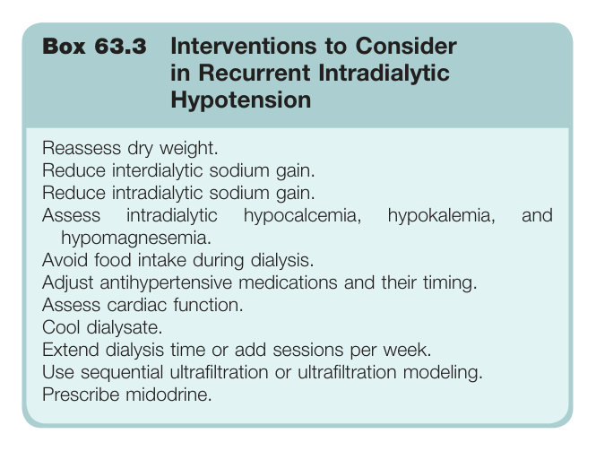

#### Box Text

```markdown
Box 63.3 Interventions to Consider in Recurrent Intradialytic Hypotension * Reassess dry weight. * Reduce interdialytic sodium gain. * Reduce intradialytic sodium gain. * Assess intradialytic hypocalcemia, hypokalemia, and hypomagnesemia. * Avoid food intake during dialysis. * Adjust antihypertensive medications and their timing. * Assess cardiac function. * Cool dialysate. * Extend dialysis time or add sessions per week. * Use sequential ultrafiltration or ultrafiltration modeling. * Prescribe midodrine.
```

Box 63.3 Interventions to Consider in Recurrent Intradialytic Hypotension * Reassess dry weight. * Reduce interdialytic sodium gain. * Reduce intradialytic sodium gain. * Assess intradialytic hypocalcemia, hypokalemia, and hypomagnesemia. * Avoid food intake during dialysis. * Adjust antihypertensive medications and their timing. * Assess cardiac function. * Cool dialysate. * Extend dialysis time or add sessions per week. * Use sequential ultrafiltration or ultrafiltration modeling. * Prescribe midodrine.

---
