# 64. Peritoneal Dialysis - Figures and Tables Index

This document lists all figures and tables extracted from `64. Peritoneal Dialysis.pdf`.

## Table of Contents
- [Figures](#figures)
- [Tables](#tables)

---

## Figures

### Fig_64_1

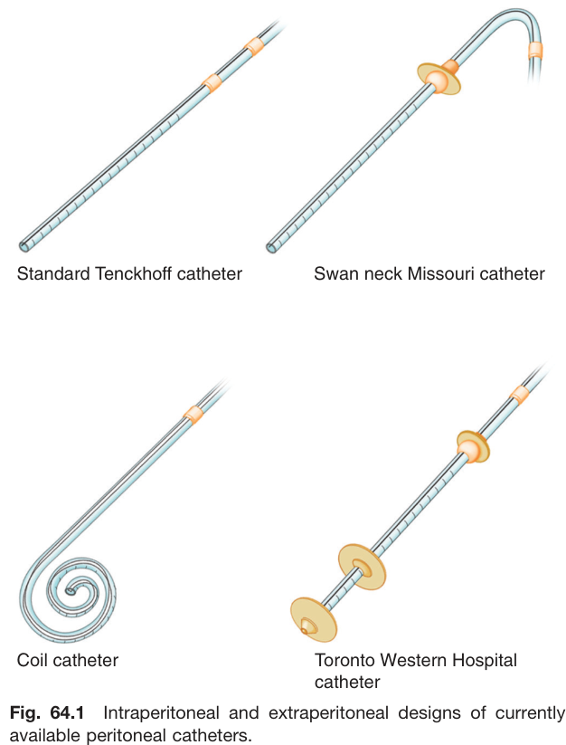

Fig. 64.1 Intraperitoneal and extraperitoneal designs of currently available peritoneal catheters. Standard Tenckhoff catheter, Swan neck Missouri catheter, Coil catheter, Toronto Western Hospital catheter

---

### Fig_64_2

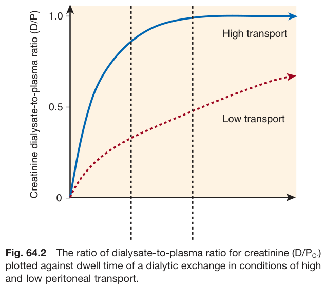

Fig. 64.2 The ratio of dialysate-to-plasma ratio for creatinine (D/Pcr) plotted against dwell time of a dialytic exchange in conditions of high and low peritoneal transport. This graph shows two curves on a plot of Creatinine dialysate-to-plasma ratio (D/P) versus time. The "High transport" curve rises quickly and plateaus near a D/P ratio of 1.0. The "Low transport" curve rises much more slowly and does not reach the plateau within the time frame shown.

---

### Fig_64_3

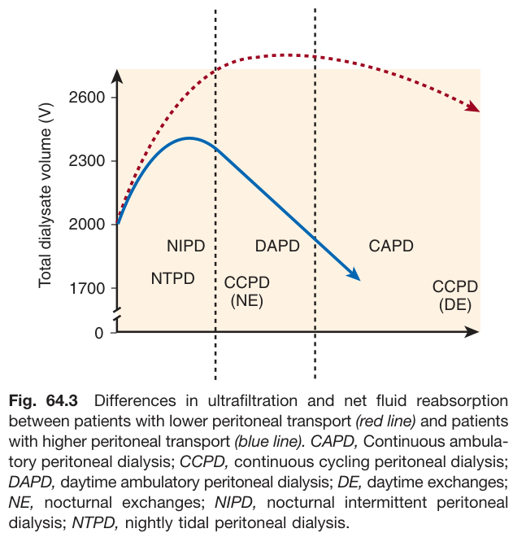

Fig. 64.3 Differences in ultrafiltration and net fluid reabsorption between patients with lower peritoneal transport (red line) and patients with higher peritoneal transport (blue line). This graph plots Total dialysate volume (V) over time for different PD modalities (NIPD, NTPD, DAPD, CCPD, CAPD). Two lines are shown: a red line for lower peritoneal transport and a blue line for higher peritoneal transport. The red line generally shows a higher dialysate volume (greater ultrafiltration) than the blue line, which often shows a decline in volume over time (net reabsorption). The labels are: CAPD, Continuous ambulatory peritoneal dialysis; CCPD, continuous cycling peritoneal dialysis; DAPD, daytime ambulatory peritoneal dialysis; DE, daytime exchanges; NE, nocturnal exchanges; NIPD, nocturnal intermittent peritoneal dialysis; NTPD, nightly tidal peritoneal dialysis.

---

## Tables

### Table_64_1

#### Table Image

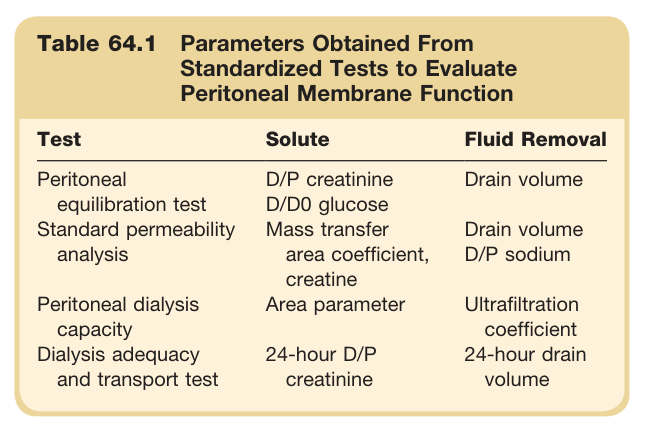

#### Table Data (CSV: [Table_64_1.csv](Table_64_1.csv))

```markdown
| Table Text (OCR) |
| :--- |
| Table 64.1 Parameters Obtained From Standardized Tests to Evaluate Peritoneal Membrane Function Test  Solute  Fluid Removal    Peritoneal equilibration test  D/P creatinine  Drain volume    D/D0 glucose    Standard permeability analysis  Mass transfer area coefficient, creatine  Drain volume D/P sodium    Peritoneal dialysis capacity  Area parameter  Ultrafiltration coefficient    Dialysis adequacy and transport test  24-hour D/P creatinine  24-hour drain volume |
```

Table 64.1 Parameters Obtained From Standardized Tests to Evaluate Peritoneal Membrane Function | Test | Solute | Fluid Removal | | :--- | :--- | :--- | | Peritoneal equilibration test | D/P creatinine, D/D0 glucose | Drain volume | | Standard permeability analysis | Mass transfer area coefficient, creatine | Drain volume, D/P sodium | | Peritoneal dialysis capacity | Area parameter | Ultrafiltration coefficient | | Dialysis adequacy and transport test | 24-hour D/P creatinine | 24-hour drain volume |

---

### Table_64_2

#### Table Image

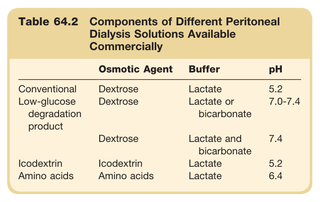

#### Table Data (CSV: [Table_64_2.csv](Table_64_2.csv))

```markdown
| Table Text (OCR) |
| :--- |
| Table 64.2 Components of Different Peritoneal Dialysis Solutions Available Commercially Osmotic Agent  Buffer  pH    Conventional  Dextrose  Lactate  5.2    Low-glucose degradation product  Dextrose  Lactate or bicarbonate  7.0-7.4    Dextrose  Lactate and bicarbonate  7.4    Icodextrin  Icodextrin  Lactate  5.2    Amino acids  Amino acids  Lactate  6.4 |
```

Table 64.2 Components of Different Peritoneal Dialysis Solutions Available Commercially | | Osmotic Agent | Buffer | pH | | :--- | :--- | :--- | :--- | | Conventional | Dextrose | Lactate | 5.2 | | Low-glucose degradation product | Dextrose | Lactate or bicarbonate | 7.0-7.4 | | | Dextrose | Lactate and bicarbonate | 7.4 | | Icodextrin | Icodextrin | Lactate | 5.2 | | Amino acids | Amino acids | Lactate | 6.4 |

---

### Table_64_3

#### Table Image

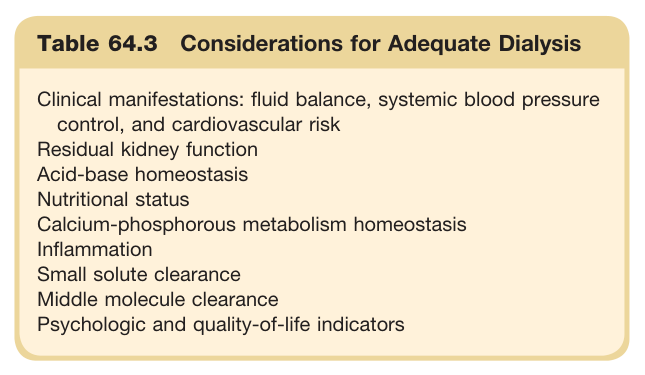

#### Table Data (CSV: [Table_64_3.csv](Table_64_3.csv))

```markdown
| Table Text (OCR) |
| :--- |
| Table 64.3 Considerations for Adequate Dialysis Clinical manifestations: fluid balance, systemic blood pressure control, and cardiovascular risk    Residual kidney function    Acid-base homeostasis    Nutritional status    Calcium-phosphorous metabolism homeostasis    Inflammation    Small solute clearance    Middle molecule clearance    Psychologic and quality-of-life indicators |
```

Table 64.3 Considerations for Adequate Dialysis Clinical manifestations: fluid balance, systemic blood pressure control, and cardiovascular risk Residual kidney function Acid-base homeostasis Nutritional status Calcium-phosphorous metabolism homeostasis Inflammation Small solute clearance Middle molecule clearance Psychologic and quality-of-life indicators

---

### Table_64_4

#### Table Image

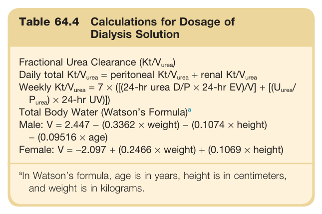

#### Table Data (CSV: [Table_64_4.csv](Table_64_4.csv))

```markdown
| Table Text (OCR) |
| :--- |
| Table 64.4 Calculations for Dosage of Dialysis Solution Fractional Urea Clearance (Kt/Vurea)    Daily total Kt/Vurea = peritoneal Kt/Vurea + renal Kt/Vurea    Weekly Kt/Vurea = 7 × ([(24-hr urea D/P × 24-hr EV)/V] + [(Uurea/Purea) × 24-hr UV)])    Total Body Water (Watson's Formula)a    Male: V = 2.447 - (0.3362 × weight) - (0.1074 × height) - (0.09516 × age)    Female: V = -2.097 + (0.2466 × weight) + (0.1069 × height) <sup>a</sup>In Watson’s formula, age is in years, height is in centimeters, and weight is in kilograms. |
```

Table 64.4 Calculations for Dosage of Dialysis Solution **Fractional Urea Clearance (Kt/Vurea)** Daily total Kt/Vurea = peritoneal Kt/Vurea + renal Kt/Vurea Weekly Kt/Vurea = 7 × ([(24-hr urea D/P × 24-hr EV)/V] + [(Uurea/ Purea) × 24-hr UV)]) **Total Body Water (Watson's Formula)ª** Male: V = 2.447 – (0.3362 × weight) - (0.1074 × height) (0.09516 x age) Female: V = -2.097 + (0.2466 × weight) + (0.1069 × height) ªIn Watson's formula, age is in years, height is in centimeters, and weight is in kilograms.

---

### Table_64_5

#### Table Image

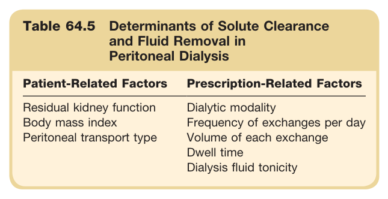

#### Table Data (CSV: [Table_64_5.csv](Table_64_5.csv))

```markdown
| Table Text (OCR) |
| :--- |
| Table 64.5 Determinants of Solute Clearance and Fluid Removal in Peritoneal Dialysis Patient-Related Factors  Prescription-Related Factors    Residual kidney function  Dialytic modality    Body mass index  Frequency of exchanges per day    Peritoneal transport type  Volume of each exchange      Dwell time      Dialysis fluid tonicity |
```

Table 64.5 Determinants of Solute Clearance and Fluid Removal in Peritoneal Dialysis **Patient-Related Factors** * Residual kidney function * Body mass index * Peritoneal transport type **Prescription-Related Factors** * Dialytic modality * Frequency of exchanges per day * Volume of each exchange * Dwell time * Dialysis fluid tonicity

---

### Table_64_6

#### Table Image

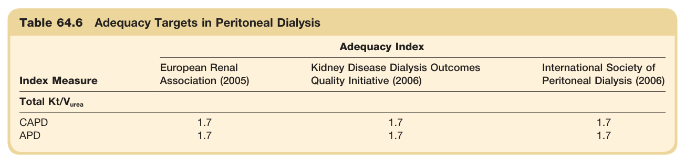

#### Table Data (CSV: [Table_64_6.csv](Table_64_6.csv))

```markdown
| Table Text (OCR) |
| :--- |
| Table 64.6 Adequacy Targets in Peritoneal Dialysis Index Measure  Adequacy Index    European Renal Association (2005)  Kidney Disease Dialysis Outcomes Quality Initiative (2006)  International Society of Peritoneal Dialysis (2006)    Total Kt/Vurea          CAPD  1.7  1.7  1.7    APD  1.7  1.7  1.7 |
```

Table 64.6 Adequacy Targets in Peritoneal Dialysis | Index Measure | European Renal Association (2005) | Kidney Disease Dialysis Outcomes Quality Initiative (2006) | International Society of Peritoneal Dialysis (2006) | | :--- | :--- | :--- | :--- | | **Total Kt/Vurea** | | | | | CAPD | 1.7 | 1.7 | 1.7 | | APD | 1.7 | 1.7 | 1.7 |

---

### Table_64_7

#### Table Image

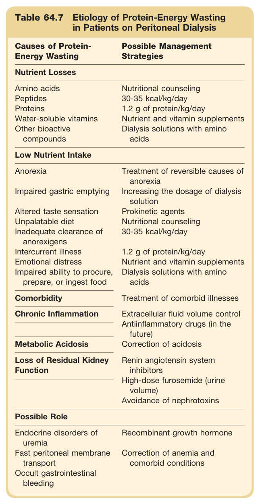

#### Table Data (CSV: [Table_64_7.csv](Table_64_7.csv))

```markdown
| Table Text (OCR) |
| :--- |
| Table 64.7 Etiology of Protein-Energy Wasting in Patients on Peritoneal Dialysis Causes of Protein-Energy Wasting  Possible Management Strategies    Nutrient Losses    Amino acids  Nutritional counseling    Peptides  30-35 kcal/kg/day    Proteins  1.2 g of protein/kg/day    Water-soluble vitamins  Nutrient and vitamin supplements    Other bioactive compounds  Dialysis solutions with amino acids    Low Nutrient Intake    Anorexia  Treatment of reversible causes of anorexia    Impaired gastric emptying  Increasing the dosage of dialysis solution    Altered taste sensation  Prokinetic agents    Unpalatable diet  Nutritional counseling    Inadequate clearance of anorexigens  30-35 kcal/kg/day    Intercurrent illness  1.2 g of protein/kg/day    Emotional distress  Nutrient and vitamin supplements    Impaired ability to procure, prepare, or ingest food  Dialysis solutions with amino acids    Comorbidity  Treatment of comorbid illnesses    Chronic Inflammation  Extracellular fluid volume control      Antiinflammatory drugs (in the future)    Metabolic Acidosis  Correction of acidosis    Loss of Residual Kidney Function  Renin angiotensin system inhibitors      High-dose furosemide (urine volume)      Avoidance of nephrotoxins    Possible Role    Endocrine disorders of uremia  Recombinant growth hormone    Fast peritoneal membrane transport  Correction of anemia and comorbid conditions    Occult gastrointestinal bleeding |
```

Table 64.7 Etiology of Protein-Energy Wasting in Patients on Peritoneal Dialysis | Causes of Protein-Energy Wasting | Possible Management Strategies | | :--- | :--- | | **Nutrient Losses** | | | Amino acids, Peptides, Proteins, Water-soluble vitamins, Other bioactive compounds | Nutritional counseling, 30-35 kcal/kg/day, 1.2 g of protein/kg/day, Nutrient and vitamin supplements, Dialysis solutions with amino acids | | **Low Nutrient Intake** | | | Anorexia, Impaired gastric emptying, Altered taste sensation, Unpalatable diet, Inadequate clearance of anorexigens, Intercurrent illness, Emotional distress, Impaired ability to procure, prepare, or ingest food | Treatment of reversible causes of anorexia, Increasing the dosage of dialysis solution, Prokinetic agents, Nutritional counseling (30-35 kcal/kg/day, 1.2 g of protein/kg/day), Nutrient and vitamin supplements, Dialysis solutions with amino acids | | **Comorbidity** | Treatment of comorbid illnesses | | **Chronic Inflammation** | Extracellular fluid volume control, Antiinflammatory drugs (in the future) | | **Metabolic Acidosis** | Correction of acidosis | | **Loss of Residual Kidney Function** | Renin angiotensin system inhibitors, High-dose furosemide (urine volume), Avoidance of nephrotoxins | | **Possible Role** | | | Endocrine disorders of uremia, Fast peritoneal membrane transport, Occult gastrointestinal bleeding | Recombinant growth hormone, Correction of anemia and comorbid conditions |

---

### Table_64_8

#### Table Image

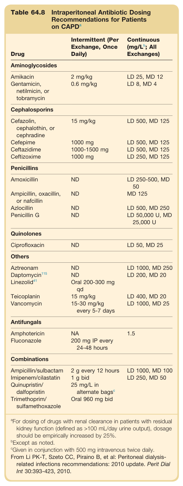

#### Table Data (CSV: [Table_64_8.csv](Table_64_8.csv))

```markdown
| Table Text (OCR) |
| :--- |
| Table 64.8 Intraperitoneal Antibiotic Dosing Recommendations for Patients on CAPD<sup>a</sup> Drug  Intermittent (Per Exchange, Once Daily)  Continuous (mg/Lb; All Exchanges)    Aminoglycosides    Amikacin  2 mg/kg  LD 25, MD 12    Gentamicin, netilmicin, or tobramycin  0.6 mg/kg  LD 8, MD 4    Cephalosporins    Cefazolin, cephalothin, or cephradine  15 mg/kg  LD 500, MD 125    Cefepime  1000 mg  LD 500, MD 125    Ceftazidime  1000-1500 mg  LD 500, MD 125    Ceftizoxime  1000 mg  LD 250, MD 125    Penicillins    Amoxicillin  ND  LD 250-500, MD 50    Ampicillin, oxacillin, or nafcillin  ND  MD 125    Azlocillin  ND  LD 500, MD 250    Penicillin G  ND  LD 50,000 U, MD 25,000 U    Quinolones    Ciprofloxacin  ND  LD 50, MD 25    Others    Aztreonam  ND  LD 1000, MD 250    Daptomycin115  ND  LD 200, MD 20    Linezolid41  Oral 200-300 mg qd      Teicoplanin  15 mg/kg  LD 400, MD 20    Vancomycin  15-30 mg/kg every 5-7 days  LD 1000, MD 25    Antifungals    Amphotericin  NA  1.5    Fluconazole  200 mg IP every 24-48 hours      Combinations    Ampicillin/sulbactam  2 g every 12 hours  LD 1000, MD 100    Imipenem/cilastatin  1 g bid  LD 250, MD 50    Quinupristin/ dalfopristin  25 mg/L in alternate bagsc      Trimethoprim/ sulfamethoxazole  Oral 960 mg bid      aFor dosing of drugs with renal clearance in patients with residual kidney function (defined as >100 mL/day urine output), dosage should be empirically increased by 25%.bExcept as noted.cGiven in conjunction with 500 mg intravenous twice daily.From Li PK-T, Szeto CC, Piraino B, et al: Peritoneal dialysis-related infections recommendations: 2010 update. Perit Dial Int 30:393-423, 2010. |
```

Table 64.8 Intraperitoneal Antibiotic Dosing Recommendations for Patients on CAPD | Drug | Intermittent (Per Exchange, Once Daily) | Continuous (mg/L; All Exchanges) | | :--- | :--- | :--- | | **Aminoglycosides** | | | | Amikacin | 2 mg/kg | LD 25, MD 12 | | Gentamicin, netilmicin, or tobramycin | 0.6 mg/kg | LD 8, MD 4 | | **Cephalosporins** | | | | Cefazolin, cephalothin, or cephradine | 15 mg/kg | LD 500, MD 125 | | Cefepime | 1000 mg | LD 500, MD 125 | | Ceftazidime | 1000-1500 mg | LD 500, MD 125 | | Ceftizoxime | 1000 mg | LD 250, MD 125 | | **Penicillins** | | | | Amoxicillin | ND | LD 250-500, MD 50 | | Ampicillin, oxacillin, or nafcillin | ND | MD 125 | | Azlocillin | ND | LD 500, MD 250 | | Penicillin G | ND | LD 50,000 U, MD 25,000 U | | **Quinolones** | | | | Ciprofloxacin | ND | LD 50, MD 25 | | **Others** | | | | Aztreonam | ND | LD 1000, MD 250 | | Daptomycin | ND | LD 200, MD 20 | | Linezolid | Oral 200-300 mg qd | | | Teicoplanin | 15 mg/kg | LD 400, MD 20 | | Vancomycin | 15-30 mg/kg every 5-7 days | LD 1000, MD 25 | | **Antifungals** | | | | Amphotericin | NA | 1.5 | | Fluconazole | 200 mg IP every 24-48 hours | | | **Combinations** | | | | Ampicillin/sulbactam | 2g every 12 hours | LD 1000, MD 100 | | Imipenem/cilastatin | 1 g bid | LD 250, MD 50 | | Quinupristin/dalfopristin | 25 mg/L in alternate bags | | | Trimethoprim/sulfamethoxazole | Oral 960 mg bid | | *For dosing of drugs with renal clearance in patients with residual kidney function (defined as >100 mL/day urine output), dosage should be empirically increased by 25%.*

---

### Table_64_9

#### Table Image

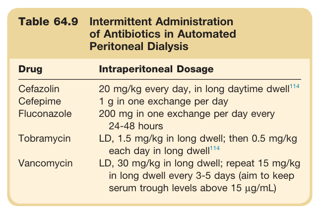

#### Table Data (CSV: [Table_64_9.csv](Table_64_9.csv))

```markdown
| Table Text (OCR) |
| :--- |
| Table 64.9 Intermittent Administration of Antibiotics in Automated Peritoneal Dialysis Drug  Intraperitoneal Dosage    Cefazolin  20 mg/kg every day, in long daytime dwell ^{114}     Cefepime  1 g in one exchange per day    Fluconazole  200 mg in one exchange per day every 24-48 hours    Tobramycin  LD, 1.5 mg/kg in long dwell; then 0.5 mg/kg each day in long dwell ^{114}     Vancomycin  LD, 30 mg/kg in long dwell; repeat 15 mg/kg in long dwell every 3-5 days (aim to keep serum trough levels above 15 μg/mL) |
```

Table 64.9 Intermittent Administration of Antibiotics in Automated Peritoneal Dialysis | Drug | Intraperitoneal Dosage | | :--- | :--- | | Cefazolin | 20 mg/kg every day, in long daytime dwell | | Cefepime | 1 g in one exchange per day | | Fluconazole | 200 mg in one exchange per day every 24-48 hours | | Tobramycin | LD, 1.5 mg/kg in long dwell; then 0.5 mg/kg each day in long dwell | | Vancomycin | LD, 30 mg/kg in long dwell; repeat 15 mg/kg in long dwell every 3-5 days (aim to keep serum trough levels above 15 µg/mL) |

---
