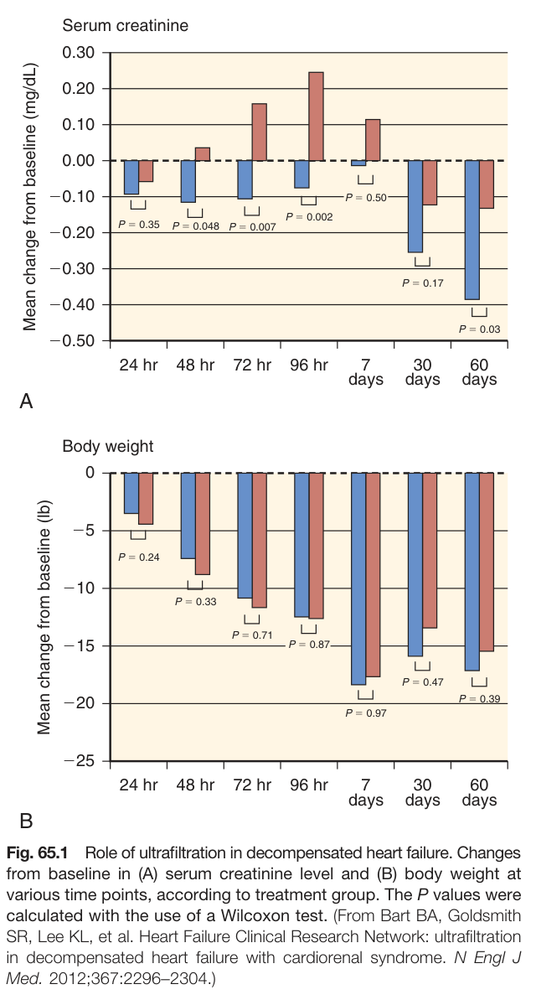
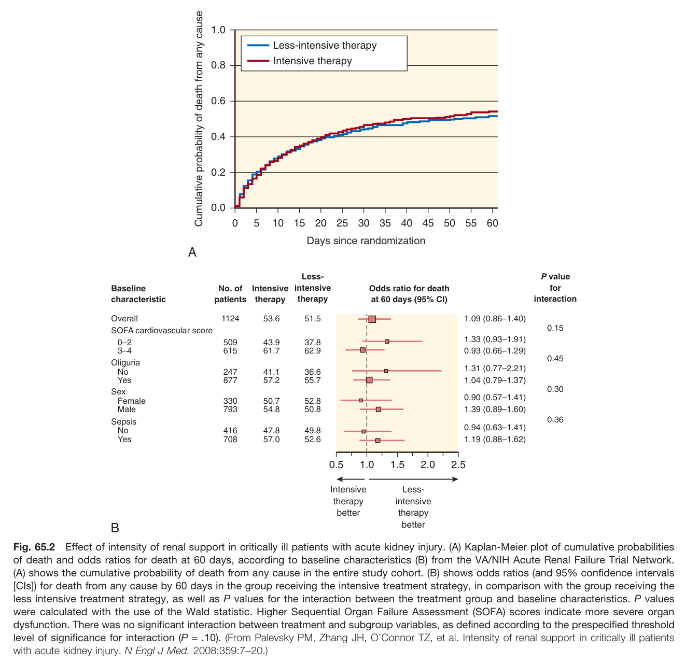
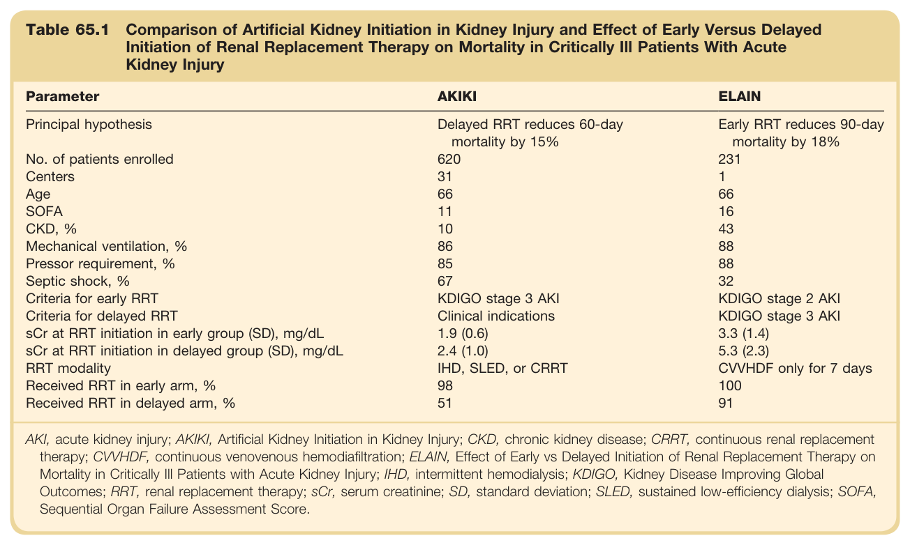
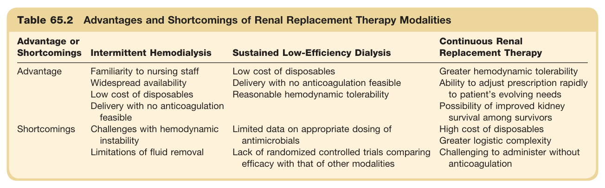

# 65. Critical Care Nephrology - Figures and Tables Index

This document lists all figures and tables extracted from `65. Critical Care Nephrology.pdf`.

## Table of Contents
- [Figures](#figures)
- [Tables](#tables)

---

## Figures

### Fig_65_1



Fig. 65.1 Role of ultrafiltration in decompensated heart failure. Changes from baseline in (A) serum creatinine level and (B) body weight at various time points, according to treatment group. The P values were calculated with the use of a Wilcoxon test. (From Bart BA, Goldsmith SR, Lee KL, et al. Heart Failure Clinical Research Network: ultrafiltration in decompensated heart failure with cardiorenal syndrome. N Engl J Med. 2012;367:2296-2304.)

---

### Fig_65_2



Fig. 65.2 Effect of intensity of renal support in critically ill patients with acute kidney injury. (A) Kaplan-Meier plot of cumulative probabilities of death and odds ratios for death at 60 days, according to baseline characteristics (B) from the VA/NIH Acute Renal Failure Trial Network. (A) shows the cumulative probability of death from any cause in the entire study cohort. (B) shows odds ratios (and 95% confidence intervals [CIs]) for death from any cause by 60 days in the group receiving the intensive treatment strategy, in comparison with the group receiving the less intensive treatment strategy, as well as P values for the interaction between the treatment group and baseline characteristics. P values were calculated with the use of the Wald statistic. Higher Sequential Organ Failure Assessment (SOFA) scores indicate more severe organ dysfunction. There was no significant interaction between treatment and subgroup variables, as defined according to the prespecified threshold level of significance for interaction (P = .10). (From Palevsky PM, Zhang JH, O'Connor TZ, et al. Intensity of renal support in critically ill patients with acute kidney injury. N Engl J Med. 2008;359:7-20.)

---

## Tables

### Table_65_1

#### Table Image



#### Table Data (CSV: [Table_65_1.csv](Table_65_1.csv))

```markdown
| Table Text (OCR) |
| :--- |
| Table 65.1 Comparison of Artificial Kidney Initiation in Kidney Injury and Effect of Early Versus Delayed Initiation of Renal Replacement Therapy on Mortality in Critically Ill Patients With Acute Kidney Injury Parameter  AKIKI  ELAIN    Principal hypothesis  Delayed RRT reduces 60-day mortality by 15%  Early RRT reduces 90-day mortality by 18%    No. of patients enrolled  620  231    Centers  31  1    Age  66  66    SOFA  11  16    CKD, %  10  43    Mechanical ventilation, %  86  88    Pressor requirement, %  85  88    Septic shock, %  67  32    Criteria for early RRT  KDIGO stage 3 AKI  KDIGO stage 2 AKI    Criteria for delayed RRT  Clinical indications  KDIGO stage 3 AKI    sCr at RRT initiation in early group (SD), mg/dL  1.9 (0.6)  3.3 (1.4)    sCr at RRT initiation in delayed group (SD), mg/dL  2.4 (1.0)  5.3 (2.3)    RRT modality  IHD, SLED, or CRRT  CVVHDF only for 7 days    Received RRT in early arm, %  98  100    Received RRT in delayed arm, %  51  91 AKI, acute kidney injury; AKIKI, Artificial Kidney Initiation in Kidney Injury; CKD, chronic kidney disease; CRRT, continuous renal replacement therapy; CVVHDF, continuous venovenous hemodiafiltration; ELAIN, Effect of Early vs Delayed Initiation of Renal Replacement Therapy on Mortality in Critically Ill Patients with Acute Kidney Injury; IHD, intermittent hemodialysis; KDIGO, Kidney Disease Improving Global Outcomes; RRT, renal replacement therapy; sCr, serum creatinine; SD, standard deviation; SLED, sustained low-efficiency dialysis; SOFA, Sequential Organ Failure Assessment Score. |
```

Table 65.1 Comparison of Artificial Kidney Initiation in Kidney Injury and Effect of Early Versus Delayed Initiation of Renal Replacement Therapy on Mortality in Critically Ill Patients With Acute Kidney Injury | Parameter | AKIKI | ELAIN | | :--- | :--- | :--- | | Principal hypothesis | Delayed RRT reduces 60-day mortality by 15% | Early RRT reduces 90-day mortality by 18% | | No. of patients enrolled | 620 | 231 | | Centers | 31 | 1 | | Age | 66 | 66 | | SOFA | 11 | 16 | | CKD, % | 10 | 43 | | Mechanical ventilation, % | 86 | 88 | | Pressor requirement, % | 85 | 88 | | Septic shock, % | 67 | 32 | | Criteria for early RRT | KDIGO stage 3 AKI | KDIGO stage 2 AKI | | Criteria for delayed RRT | Clinical indications | KDIGO stage 3 AKI | | sCr at RRT initiation in early group (SD), mg/dL | 1.9 (0.6) | 3.3 (1.4) | | sCr at RRT initiation in delayed group (SD), mg/dL | 2.4 (1.0) | 5.3 (2.3) | | RRT modality | IHD, SLED, or CRRT | CVVHDF only for 7 days | | Received RRT in early arm, % | 98 | 100 | | Received RRT in delayed arm, % | 51 | 91 | AKI, acute kidney injury; AKIKI, Artificial Kidney Initiation in Kidney Injury; CKD, chronic kidney disease; CRRT, continuous renal replacement therapy; CVVHDF, continuous venovenous hemodiafiltration; ELAIN, Effect of Early vs Delayed Initiation of Renal Replacement Therapy on Mortality in Critically III Patients with Acute Kidney Injury; IHD, intermittent hemodialysis; KDIGO, Kidney Disease Improving Global Outcomes; RRT, renal replacement therapy; sCr, serum creatinine; SD, standard deviation; SLED, sustained low-efficiency dialysis; SOFA, Sequential Organ Failure Assessment Score.

---

### Table_65_2

#### Table Image



#### Table Data (CSV: [Table_65_2.csv](Table_65_2.csv))

```markdown
| Table Text (OCR) |
| :--- |
| Table 65.2 Advantages and Shortcomings of Renal Replacement Therapy Modalities Advantage or Shortcomings  Intermittent Hemodialysis  Sustained Low-Efficiency Dialysis  Continuous Renal Replacement Therapy    Advantage  Familiarity to nursing staff  Low cost of disposables  Greater hemodynamic tolerability    Widespread availability  Delivery with no anticoagulation feasible  Ability to adjust prescription rapidly to patient’s evolving needs    Low cost of disposables  Reasonable hemodynamic tolerability    Delivery with no anticoagulation feasible    Possibility of improved kidney survival among survivors    Shortcomings  Challenges with hemodynamic instability  Limited data on appropriate dosing of antimicrobials  High cost of disposables    Limitations of fluid removal  Lack of randomized controlled trials comparing efficacy with that of other modalities  Greater logistic complexity        Challenging to administer without anticoagulation |
```

Table 65.2 Advantages and Shortcomings of Renal Replacement Therapy Modalities | Advantage or Shortcomings | Intermittent Hemodialysis | Sustained Low-Efficiency Dialysis | Continuous Renal Replacement Therapy | | :--- | :--- | :--- | :--- | | Advantage | Familiarity to nursing staff<br>Widespread availability<br>Low cost of disposables<br>Delivery with no anticoagulation feasible | Low cost of disposables<br>Delivery with no anticoagulation feasible<br>Reasonable hemodynamic tolerability | Greater hemodynamic tolerability<br>Ability to adjust prescription rapidly to patient's evolving needs<br>Possibility of improved kidney survival among survivors | | Shortcomings | Challenges with hemodynamic instability<br>Limitations of fluid removal | Limited data on appropriate dosing of antimicrobials<br>Lack of randomized controlled trials comparing efficacy with that of other modalities | High cost of disposables<br>Greater logistic complexity<br>Challenging to administer without anticoagulation |

---
