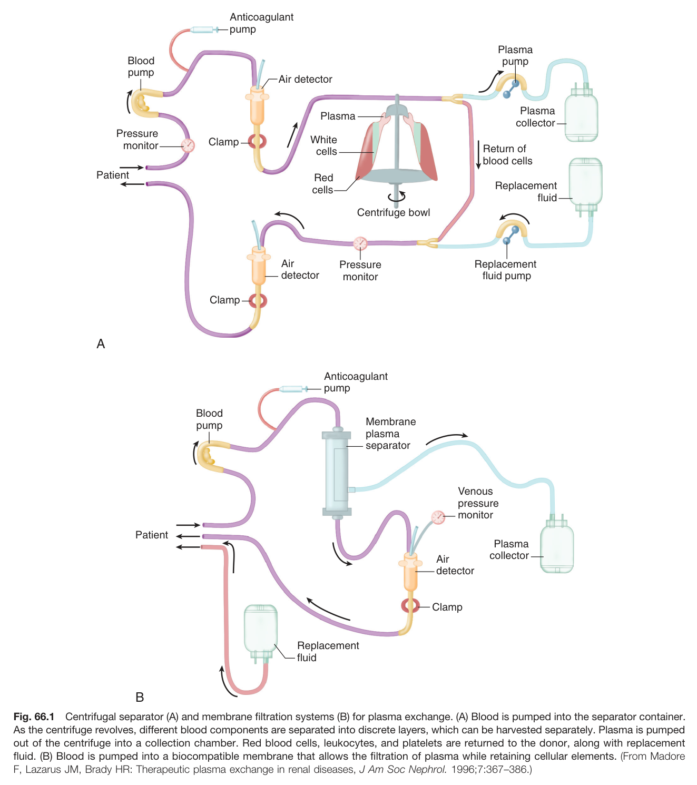
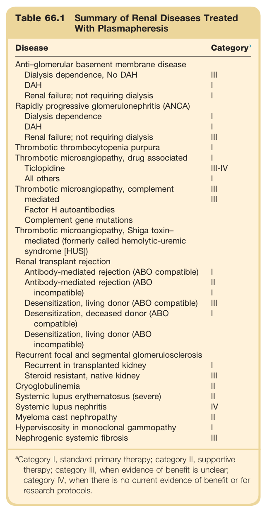
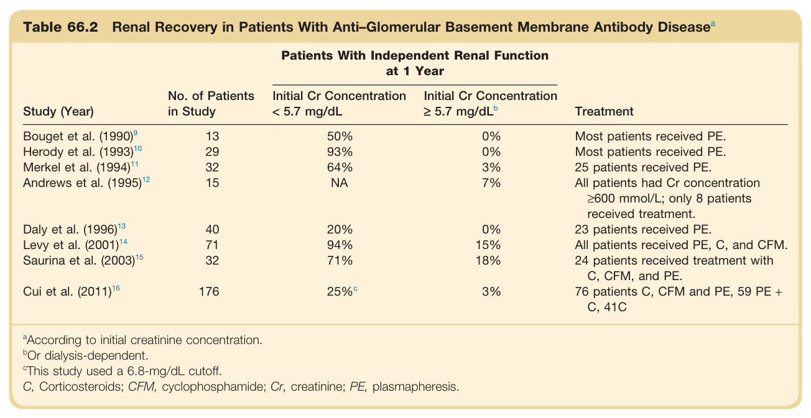
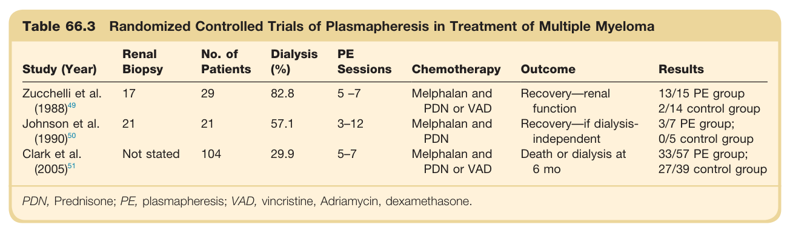
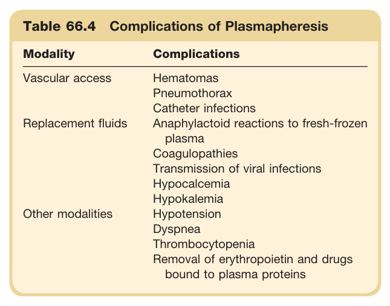
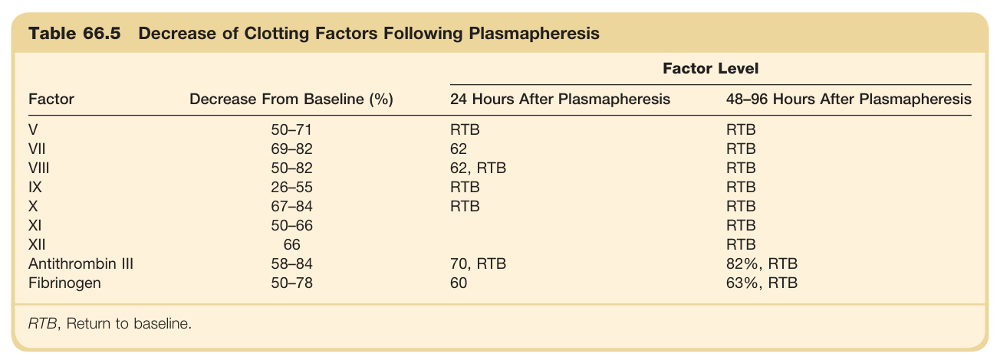
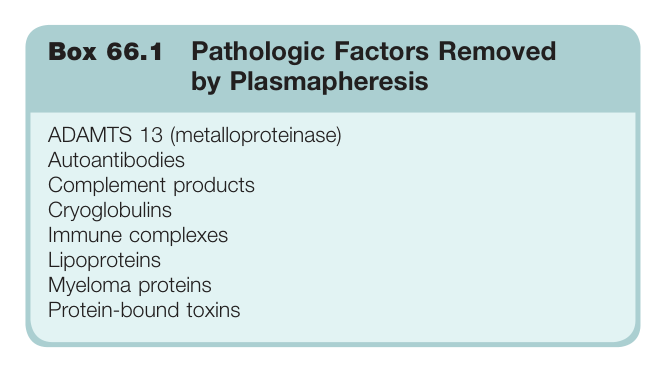

# 66. Plasmapheresis - Figures and Tables Index

This document lists all figures, tables and boxes extracted from `66. Plasmapheresis.pdf`.

## Table of Contents
- [Figures](#figures)
- [Tables](#tables)
- [Boxes](#boxes)

---

## Figures

### Fig_66_1



Fig. 66.1 Centrifugal separator (A) and membrane filtration systems (B) for plasma exchange. (A) Blood is pumped into the separator container. As the centrifuge revolves, different blood components are separated into discrete layers, which can be harvested separately. Plasma is pumped out of the centrifuge into a collection chamber. Red blood cells, leukocytes, and platelets are returned to the donor, along with replacement fluid. (B) Blood is pumped into a biocompatible membrane that allows the filtration of plasma while retaining cellular elements. (From Madore F, Lazarus JM, Brady HR: Therapeutic plasma exchange in renal diseases, J Am Soc Nephrol. 1996;7:367-386.)

---

## Tables

### Table_66_1

#### Table Image



#### Table Data (CSV: [Table_66_1.csv](Table_66_1.csv))

```markdown
| Table Text (OCR) |
| :--- |
| Table 66.1 Summary of Renal Diseases Treated With Plasmapheresis Disease  Category ^{a}     Anti-glomerular basement membrane disease      Dialysis dependence, No DAH  III    DAH  I    Renal failure; not requiring dialysis  I    Rapidly progressive glomerulonephritis (ANCA)      Dialysis dependence  I    DAH  I    Renal failure; not requiring dialysis  III    Thrombotic thrombocytopenia purpura  I    Thrombotic microangiopathy, drug associated  I    Ticlopidine  III-IV    All others  I    Thrombotic microangiopathy, complement  III    mediated  III    Factor H autoantibodies      Complement gene mutations      Thrombotic microangiopathy, Shiga toxin-mediated (formerly called hemolytic-uremic syndrome [HUS])      Renal transplant rejection      Antibody-mediated rejection (ABO compatible)  I    Antibody-mediated rejection (ABO incompatible)  II    Desensitization, living donor (ABO compatible)  III    Desensitization, deceased donor (ABO compatible)  I    Desensitization, living donor (ABO incompatible)      Recurrent focal and segmental glomerulosclerosis      Recurrent in transplanted kidney  I    Steroid resistant, native kidney  III    Cryoglobulinemia  II    Systemic lupus erythematosus (severe)  II    Systemic lupus nephritis  IV    Myeloma cast nephropathy  II    Hyperviscosity in monoclonal gammopathy  I    Nephrogenic systemic fibrosis  III <sup>a</sup>Category I, standard primary therapy; category II, supportive therapy; category III, when evidence of benefit is unclear; category IV, when there is no current evidence of benefit or for research protocols. |
```

Table 66.1 Summary of Renal Diseases Treated With Plasmapheresis | Disease | Categorya | | :--- | :--- | | **Anti-glomerular basement membrane disease** | | | Dialysis dependence, No DAH | III | | DAH | I | | Renal failure; not requiring dialysis | I | | **Rapidly progressive glomerulonephritis (ANCA)** | | | Dialysis dependence | I | | DAH | I | | Renal failure; not requiring dialysis | III | | **Thrombotic thrombocytopenia purpura** | I | | **Thrombotic microangiopathy, drug associated** | | | Ticlopidine | I | | All others | III-IV | | **Thrombotic microangiopathy, complement mediated** | | | Factor H autoantibodies | III | | Complement gene mutations | III | | **Thrombotic microangiopathy, Shiga toxin-mediated (formerly called hemolytic-uremic syndrome [HUS])** | | | **Renal transplant rejection** | | | Antibody-mediated rejection (ABO compatible) | I | | Antibody-mediated rejection (ABO incompatible) | II | | Desensitization, living donor (ABO compatible) | I | | Desensitization, deceased donor (ABO compatible) | III | | Desensitization, living donor (ABO incompatible) | I | | **Recurrent focal and segmental glomerulosclerosis** | | | Recurrent in transplanted kidney | I | | Steroid resistant, native kidney | III | | **Cryoglobulinemia** | II | | **Systemic lupus erythematosus (severe)** | II | | **Systemic lupus nephritis** | IV | | **Myeloma cast nephropathy** | II | | **Hyperviscosity in monoclonal gammopathy** | I | | **Nephrogenic systemic fibrosis** | III | aCategory I, standard primary therapy; category II, supportive therapy; category III, when evidence of benefit is unclear; category IV, when there is no current evidence of benefit or for research protocols.

---

### Table_66_2

#### Table Image



#### Table Data (CSV: [Table_66_2.csv](Table_66_2.csv))

```markdown
| Table Text (OCR) |
| :--- |
| Table 66.2 Renal Recovery in Patients With Anti–Glomerular Basement Membrane Antibody Disease<sup>a</sup> Study (Year)  No. of Patients in Study  Patients With Independent Renal Function at 1 Year  Treatment    Initial Cr Concentration < 5.7 mg/dL  Initial Cr Concentration ≥ 5.7 mg/dL ^b     Bouget et al. (1990) ^9   13  50%  0%  Most patients received PE.    Herody et al. (1993) ^{10}   29  93%  0%  Most patients received PE.    Merkel et al. (1994) ^{11}   32  64%  3%  25 patients received PE.    Andrews et al. (1995) ^{12}   15  NA  7%  All patients had Cr concentration ≥600 mmol/L; only 8 patients received treatment.    Daly et al. (1996) ^{13}   40  20%  0%  23 patients received PE.    Levy et al. (2001) ^{14}   71  94%  15%  All patients received PE, C, and CFM.    Saurina et al. (2003) ^{15}   32  71%  18%  24 patients received treatment with C, CFM, and PE.    Cui et al. (2011) ^{16}   176  25% ^c   3%  76 patients C, CFM and PE, 59 PE + C, 41C <sup>a</sup>According to initial creatinine concentration. <sup>b</sup>Or dialysis-dependent. <sup>c</sup>This study used a 6.8-mg/dL cutoff. C, Corticosteroids; CFM, cyclophosphamide; Cr, creatinine; PE, plasmapheresis. |
```

Table 66.2 Renal Recovery in Patients With Anti-Glomerular Basement Membrane Antibody Disease **Patients With Independent Renal Function at 1 Year** | Study (Year) | No. of Patients in Study | Initial Cr Concentration < 5.7 mg/dL | Initial Cr Concentration ≥ 5.7 mg/dLb | Treatment | | :--- | :--- | :--- | :--- | :--- | | Bouget et al. (1990) | 13 | 50% | 0% | Most patients received PE. | | Herody et al. (1993) | 29 | 93% | 0% | Most patients received PE. | | Merkel et al. (1994) | 32 | 64% | 3% | 25 patients received PE. | | Andrews et al. (1995) | 15 | NA | 7% | All patients had Cr concentration ≥600 mmol/L; only 8 patients received treatment. | | Daly et al. (1996) | 40 | 20% | 0% | 23 patients received PE. | | Levy et al. (2001) | 71 | 94% | 15% | All patients received PE, C, and CFM. | | Saurina et al. (2003) | 32 | 71% | 18% | 24 patients received treatment with C, CFM, and PE. | | Cui et al. (2011) | 176 | 25%c | 3% | 76 patients C, CFM and PE, 59 PE + C, 41C | aAccording to initial creatinine concentration. bOr dialysis-dependent. cThis study used a 6.8-mg/dL cutoff. C, Corticosteroids; CFM, cyclophosphamide; Cr, creatinine; PE, plasmapheresis.

---

### Table_66_3

#### Table Image



#### Table Data (CSV: [Table_66_3.csv](Table_66_3.csv))

```markdown
| Table Text (OCR) |
| :--- |
| Table 66.3 Randomized Controlled Trials of Plasmapheresis in Treatment of Multiple Myeloma Study (Year)  Renal Biopsy  No. of Patients  Dialysis (%)  PE Sessions  Chemotherapy  Outcome  Results    Zucchelli et al. (1988) ^{49}   17  29  82.8  5 –7  Melphalan and PDN or VAD  Recovery—renal function  13/15 PE group2/14 control group    Johnson et al. (1990) ^{50}   21  21  57.1  3–12  Melphalan and PDN  Recovery—if dialysis-independent  3/7 PE group;0/5 control group    Clark et al. (2005) ^{51}   Not stated  104  29.9  5–7  Melphalan and PDN or VAD  Death or dialysis at 6 mo  33/57 PE group;27/39 control group PDN, Prednisone; PE, plasmapheresis; VAD, vincristine, Adriamycin, dexamethasone. |
```

Table 66.3 Randomized Controlled Trials of Plasmapheresis in Treatment of Multiple Myeloma | Study (Year) | Renal Biopsy | No. of Patients | Dialysis (%) | PE Sessions | Chemotherapy | Outcome | Results | | :--- | :--- | :--- | :--- | :--- | :--- | :--- | :--- | | Zucchelli et al. (1988) | 17 | 29 | 82.8 | 5-7 | Melphalan and PDN or VAD | Recovery—renal function | 13/15 PE group; 2/14 control group | | Johnson et al. (1990) | 21 | 21 | 57.1 | 3-12 | Melphalan and PDN | Recovery—if dialysis-independent | 3/7 PE group; 0/5 control group | | Clark et al. (2005) | Not stated | 104 | 29.9 | 5-7 | Melphalan and PDN or VAD | Death or dialysis at 6 mo | 33/57 PE group; 27/39 control group | PDN, Prednisone; PE, plasmapheresis; VAD, vincristine, Adriamycin, dexamethasone.

---

### Table_66_4

#### Table Image



#### Table Data (CSV: [Table_66_4.csv](Table_66_4.csv))

```markdown
| Table Text (OCR) |
| :--- |
| Table 66.4 Complications of Plasmapheresis Modality  Complications    Vascular access  HematomasPneumothoraxCatheter infections    Replacement fluids  Anaphylactoid reactions to fresh-frozen plasmaCoagulopathiesTransmission of viral infectionsHypocalcemiaHypokalemia    Other modalities  HypotensionDyspneaThrombocytopeniaRemoval of erythropoietin and drugs bound to plasma proteins |
```

Table 66.4 Complications of Plasmapheresis | Modality | Complications | | :--- | :--- | | Vascular access | Hematomas, Pneumothorax, Catheter infections | | Replacement fluids | Anaphylactoid reactions to fresh-frozen plasma, Coagulopathies, Transmission of viral infections | | Other modalities | Hypocalcemia, Hypokalemia, Hypotension, Dyspnea, Thrombocytopenia, Removal of erythropoietin and drugs bound to plasma proteins |

---

### Table_66_5

#### Table Image



#### Table Data (CSV: [Table_66_5.csv](Table_66_5.csv))

```markdown
| Table Text (OCR) |
| :--- |
| Table 66.5 Decrease of Clotting Factors Following Plasmapheresis Factor  Decrease From Baseline (%)  Factor Level    24 Hours After Plasmapheresis  48–96 Hours After Plasmapheresis    V  50–71  RTB  RTB    VII  69–82  62  RTB    VIII  50–82  62, RTB  RTB    IX  26–55  RTB  RTB    X  67–84  RTB  RTB    XI  50–66    RTB    XII  66    RTB    Antithrombin III  58–84  70, RTB  82%, RTB    Fibrinogen  50–78  60  63%, RTB RTB, Return to baseline. |
```

Table 66.5 Decrease of Clotting Factors Following Plasmapheresis | Factor | Decrease From Baseline (%) | 24 Hours After Plasmapheresis | 48-96 Hours After Plasmapheresis | | :--- | :--- | :--- | :--- | | V | 50-71 | RTB | RTB | | VII | 69-82 | 62 | RTB | | VIII | 50-82 | 62, RTB | RTB | | IX | 26-55 | RTB | RTB | | X | 67-84 | RTB | RTB | | XI | 50-66 | | RTB | | XII | 66 | | RTB | | Antithrombin III | 58-84 | 70, RTB | 82%, RTB | | Fibrinogen | 50-78 | 60 | 63%, RTB | RTB, Return to baseline.

---

## Boxes

### Box_66_1



#### Box Text

```markdown
Box 66.1 Pathologic Factors Removed by Plasmapheresis ADAMTS 13 (metalloproteinase) Autoantibodies Complement products Cryoglobulins Immune complexes Lipoproteins Myeloma proteins Protein-bound toxins
```

Box 66.1 Pathologic Factors Removed by Plasmapheresis ADAMTS 13 (metalloproteinase) Autoantibodies Complement products Cryoglobulins Immune complexes Lipoproteins Myeloma proteins Protein-bound toxins

---
