# 67. Enhanced Elimination of Poisons - Figures and Tables Index

This document lists all figures, tables and boxes extracted from `67. Enhanced Elimination of Poisons.pdf`.

## Table of Contents
- [Figures](#figures)
- [Tables](#tables)
- [Boxes](#boxes)

---

## Figures

### Fig_67_1

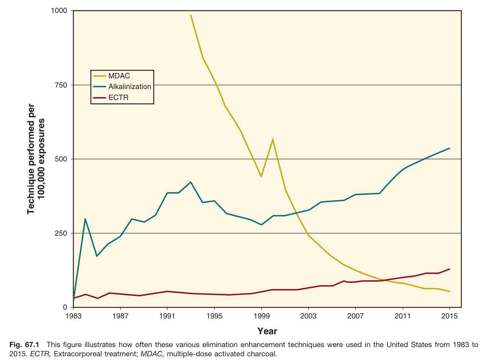

Fig. 67.1 This figure illustrates how often these various elimination enhancement techniques were used in the United States from 1983 to 2015. ECTR, Extracorporeal treatment; MDAC, multiple-dose activated charcoal.

---

### Fig_67_2

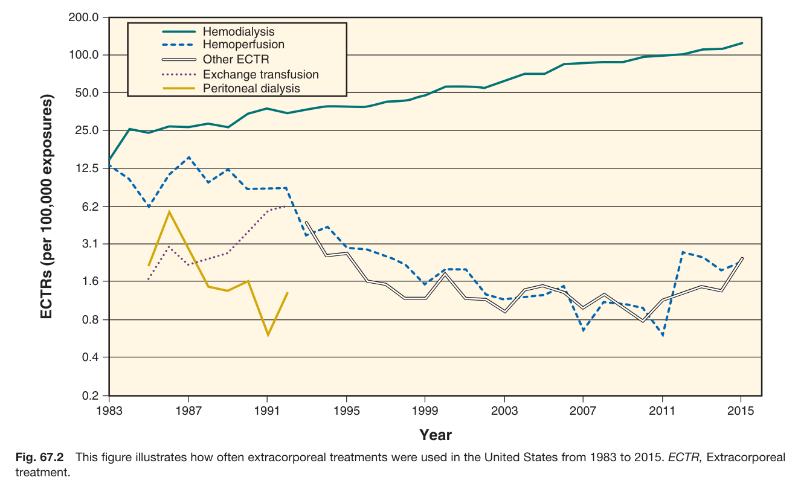

Fig. 67.2 This figure illustrates how often extracorporeal treatments were used in the United States from 1983 to 2015. ECTR, Extracorporeal treatment.

---

### Fig_67_3

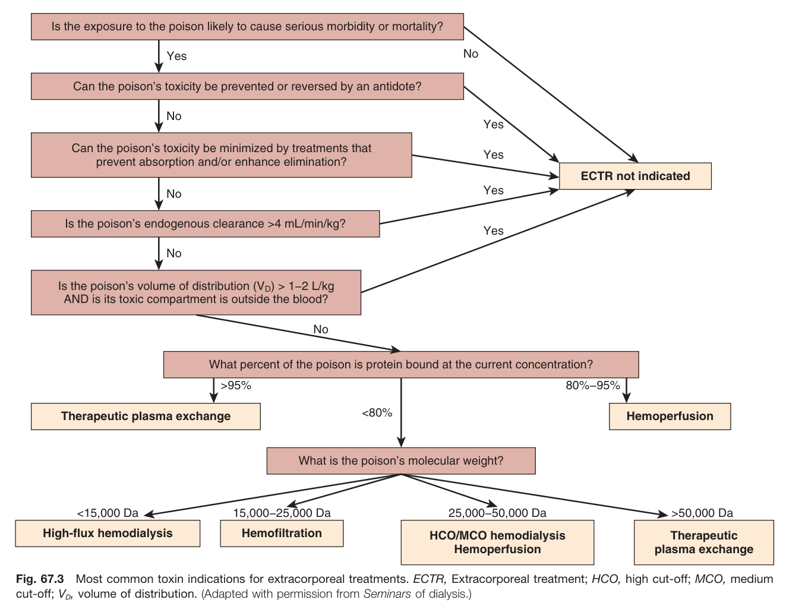

Fig. 67.3 Most common toxin indications for extracorporeal treatments. ECTR, Extracorporeal treatment; HCO, high cut-off; MCO, medium cut-off; VD, volume of distribution. (Adapted with permission from Seminars of dialysis.)

---

### Fig_67_4

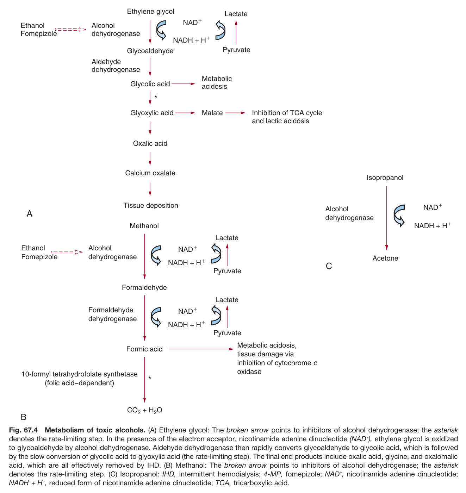

Fig. 67.4 Metabolism of toxic alcohols. (A) Ethylene glycol: The broken arrow points to inhibitors of alcohol dehydrogenase; the asterisk denotes the rate-limiting step. In the presence of the electron acceptor, nicotinamide adenine dinucleotide (NAD+), ethylene glycol is oxidized to glycoaldehyde by alcohol dehydrogenase. Aldehyde dehydrogenase then rapidly converts glycoaldehyde to glycolic acid, which is followed by the slow conversion of glycolic acid to glyoxylic acid (the rate-limiting step). The final end products include oxalic acid, glycine, and oxalomalic acid, which are all effectively removed by IHD. (B) Methanol: The broken arrow points to inhibitors of alcohol dehydrogenase; the asterisk denotes the rate-limiting step. (C) Isopropanol: IHD, Intermittent hemodialysis; 4-MP, fomepizole; NAD⁺, nicotinamide adenine dinucleotide; NADH + H+, reduced form of nicotinamide adenine dinucleotide; TCA, tricarboxylic acid.

---

## Tables

### Table_67_1

#### Table Image

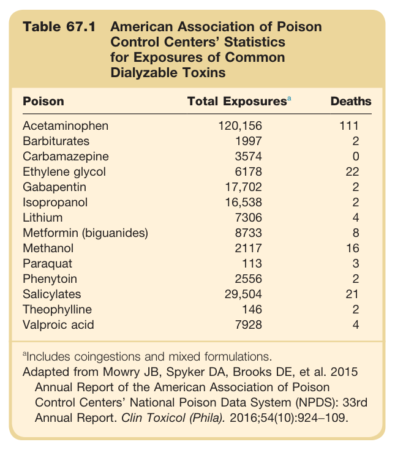

#### Table Data (CSV: [Table_67_1.csv](Table_67_1.csv))

```markdown
| Table Text (OCR) |
| :--- |
| Table 67.1 American Association of Poison Control Centers’ Statistics for Exposures of Common Dialyzable Toxins Poison  Total Exposuresa  Deaths    Acetaminophen  120,156  111    Barbiturates  1997  2    Carbamazepine  3574  0    Ethylene glycol  6178  22    Gabapentin  17,702  2    Isopropanol  16,538  2    Lithium  7306  4    Metformin (biguanides)  8733  8    Methanol  2117  16    Paraquat  113  3    Phenytoin  2556  2    Salicylates  29,504  21    Theophylline  146  2    Valproic acid  7928  4 <sup>a</sup>Includes coingestions and mixed formulations. Adapted from Mowry JB, Spyker DA, Brooks DE, et al. 2015 Annual Report of the American Association of Poison Control Centers’ National Poison Data System (NPDS): 33rd Annual Report. Clin Toxicol (Phila). 2016;54(10):924−109. |
```

Table 67.1 American Association of Poison Control Centers' Statistics for Exposures of Common Dialyzable Toxins | Poison | Total Exposuresa | Deaths | | :--------------------- | :--------------- | :----- | | Acetaminophen | 120,156 | 111 | | Barbiturates | 1997 | 2 | | Carbamazepine | 3574 | 0 | | Ethylene glycol | 6178 | 22 | | Gabapentin | 17,702 | 2 | | Isopropanol | 16,538 | 2 | | Lithium | 7306 | 4 | | Metformin (biguanides) | 8733 | 8 | | Methanol | 2117 | 16 | | Paraquat | 113 | 3 | | Phenytoin | 2556 | 2 | | Salicylates | 29,504 | 21 | | Theophylline | 146 | 2 | | Valproic acid | 7928 | 4 | aIncludes coingestions and mixed formulations. Adapted from Mowry JB, Spyker DA, Brooks DE, et al. 2015 Annual Report of the American Association of Poison Control Centers' National Poison Data System (NPDS): 33rd Annual Report. Clin Toxicol (Phila). 2016;54(10):924-109.

---

### Table_67_2

#### Table Image

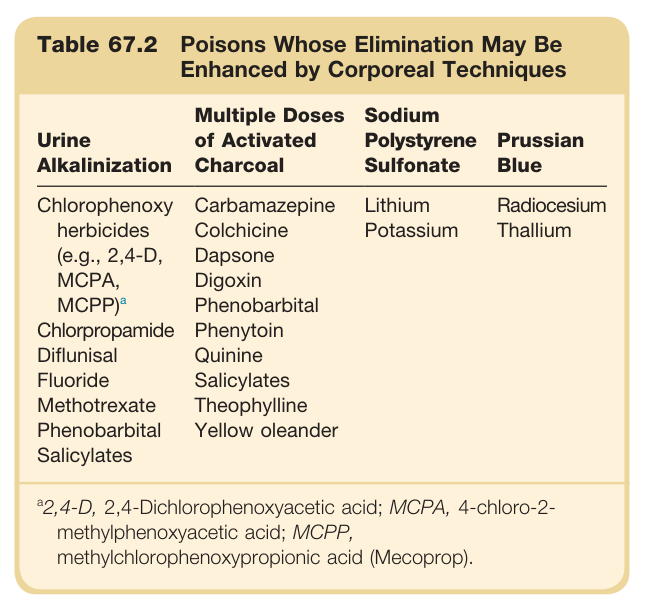

#### Table Data (CSV: [Table_67_2.csv](Table_67_2.csv))

```markdown
| Table Text (OCR) |
| :--- |
| Table 67.2 Poisons Whose Elimination May Be Enhanced by Corporeal Techniques Urine Alkalinization  Multiple Doses of Activated Charcoal  Sodium Polystyrene Sulfonate  Prussian Blue    Chlorophenoxy herbicides (e.g., 2,4-D, MCPA,  MCPP)^a   Carbamazepine Colchicine Dapsone Digoxin Phenobarbital  Lithium Potassium  Radiocesium Thallium    Chlorpropamide Diflunisal Fluoride Methotrexate Phenobarbital Salicylates  Phenytoin Quinine Salicylates Theophylline Yellow oleander <sup>a</sup>2,4-D, 2,4-Dichlorophenoxyacetic acid; MCPA, 4-chloro-2- methylphenoxyacetic acid; MCPP, methylchlorophenoxypropionic acid (Mecoprop). |
```

Table 67.2 Poisons Whose Elimination May Be Enhanced by Corporeal Techniques | Urine Alkalinization | Multiple Doses of Activated Charcoal | Sodium Polystyrene Sulfonate | Prussian Blue | | :------------------------------------------------- | :----------------------------------- | :--------------------------- | :------------ | | Chlorophenoxy herbicides (e.g., 2,4-D, MCPA, MCPP) | Carbamazepine | Lithium | Radiocesium | | | Colchicine | Potassium | Thallium | | | Dapsone | | | | Chlorpropamide | Digoxin | | | | Diflunisal | Phenobarbital | | | | Fluoride | Phenytoin | | | | Methotrexate | Quinine | | | | Phenobarbital | Salicylates | | | | Salicylates | Theophylline | | | | | Yellow oleander | | | 2,4-D, 2,4-Dichlorophenoxyacetic acid; MCPA, 4-chloro-2-methylphenoxyacetic acid; MCPP, methylchlorophenoxypropionic acid (Mecoprop).

---

### Table_67_3

#### Table Image

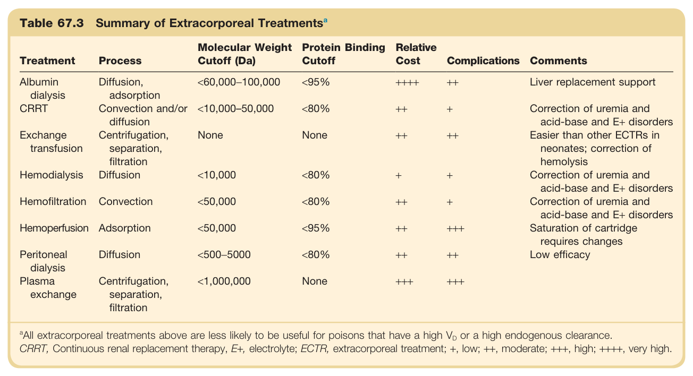

#### Table Data (CSV: [Table_67_3.csv](Table_67_3.csv))

```markdown
| Table Text (OCR) |
| :--- |
| Table 67.3 Summary of Extracorporeal Treatments<sup>a</sup> Treatment  Process  Molecular Weight Cutoff (Da)  Protein Binding Cutoff  Relative Cost  Complications  Comments    Albumin dialysis  Diffusion, adsorption  <60,000–100,000  <95%  ++++  ++  Liver replacement support    CRRT  Convection and/or diffusion  <10,000–50,000  <80%  ++  +  Correction of uremia and acid-base and E+ disorders    Exchange transfusion  Centrifugation, separation, filtration  None  None  ++  ++  Easier than other ECTRs in neonates; correction of hemolysis    Hemodialysis  Diffusion  <10,000  <80%  +  +  Correction of uremia and acid-base and E+ disorders    Hemofiltration  Convection  <50,000  <80%  ++  +  Correction of uremia and acid-base and E+ disorders    Hemoperfusion  Adsorption  <50,000  <95%  ++  +++  Saturation of cartridge requires changes    Peritoneal dialysis  Diffusion  <500–5000  <80%  ++  ++  Low efficacy    Plasma exchange  Centrifugation, separation, filtration  <1,000,000  None  +++  +++ <sup>a</sup>All extracorporeal treatments above are less likely to be useful for poisons that have a high V<sub>D</sub> or a high endogenous clearance. CRRT, Continuous renal replacement therapy, E+, electrolyte; ECTR, extracorporeal treatment; +, low; ++, moderate; +++, high; ++++, very high. |
```

Table 67.3 Summary of Extracorporeal Treatmentsa | Treatment | Process | Molecular Weight Cutoff (Da) | Protein Binding Cutoff | Relative Cost | Complications | Comments | | :------------------- | :------------------------------------- | :--------------------------- | :--------------------- | :------------ | :------------ | :----------------------------------------------------------- | | Albumin dialysis | Diffusion, adsorption | <60,000-100,000 | <95% | ++++ | ++ | Liver replacement support | | CRRT | Convection and/or diffusion | <10,000-50,000 | <80% | ++ | + | Correction of uremia and acid-base and E+ disorders | | Exchange transfusion | Centrifugation, separation, filtration | None | None | ++ | ++ | Easier than other ECTRs in neonates; correction of hemolysis | | Hemodialysis | Diffusion | <10,000 | <80% | + | + | Correction of uremia and acid-base and E+ disorders | | Hemofiltration | Convection | <50,000 | <80% | ++ | + | Correction of uremia and acid-base and E+ disorders | | Hemoperfusion | Adsorption | <50,000 | <95% | ++ | +++ | Saturation of cartridge requires changes | | Peritoneal dialysis | Diffusion | <500-5000 | <80% | + | ++ | Low efficacy | | Plasma exchange | Centrifugation, separation, filtration | <1,000,000 | None | +++ | +++ | | aAll extracorporeal treatments above are less likely to be useful for poisons that have a high VD or a high endogenous clearance. CRRT, Continuous renal replacement therapy, E+, electrolyte; ECTR, extracorporeal treatment; +, low; ++, moderate; +++, high; ++++, very high.

---

### Table_67_4

#### Table Image

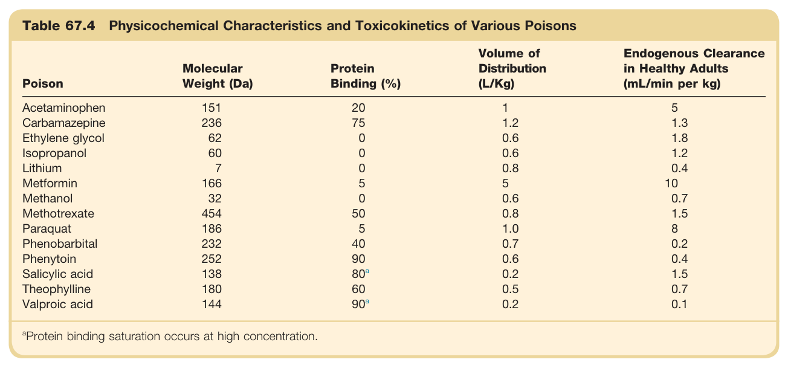

#### Table Data (CSV: [Table_67_4.csv](Table_67_4.csv))

```markdown
| Table Text (OCR) |
| :--- |
| Table 67.4 Physicochemical Characteristics and Toxicokinetics of Various Poisons Poison  Molecular Weight (Da)  Protein Binding (%)  Volume of Distribution (L/Kg)  Endogenous Clearance in Healthy Adults (mL/min per kg)    Acetaminophen  151  20  1  5    Carbamazepine  236  75  1.2  1.3    Ethylene glycol  62  0  0.6  1.8    Isopropanol  60  0  0.6  1.2    Lithium  7  0  0.8  0.4    Metformin  166  5  5  10    Methanol  32  0  0.6  0.7    Methotrexate  454  50  0.8  1.5    Paraquat  186  5  1.0  8    Phenobarbital  232  40  0.7  0.2    Phenytoin  252  90  0.6  0.4    Salicylic acid  138   80^a   0.2  1.5    Theophylline  180  60  0.5  0.7    Valproic acid  144   90^a   0.2  0.1 <sup>a</sup>Protein binding saturation occurs at high concentration. |
```

Table 67.4 Physicochemical Characteristics and Toxicokinetics of Various Poisons | Poison | Molecular Weight (Da) | Protein Binding (%) | Volume of Distribution (L/Kg) | Endogenous Clearance in Healthy Adults (mL/min per kg) | | :-------------- | :-------------------- | :------------------ | :---------------------------- | :----------------------------------------------------- | | Acetaminophen | 151 | 20 | 1 | 5 | | Carbamazepine | 236 | 75 | 1.2 | 1.3 | | Ethylene glycol | 62 | 0 | 0.6 | 1.8 | | Isopropanol | 60 | 0 | 0.6 | 1.2 | | Lithium | 7 | 0 | 0.8 | 0.4 | | Metformin | 166 | 5 | 5 | 10 | | Methanol | 32 | 0 | 0.6 | 0.7 | | Methotrexate | 454 | 50 | 0.8 | 1.5 | | Paraquat | 186 | 5 | 1.0 | 8 | | Phenobarbital | 232 | 40 | 0.7 | 0.2 | | Phenytoin | 252 | 90 | 0.6 | 0.4 | | Salicylic acid | 138 | 80a | 0.2 | 1.5 | | Theophylline | 180 | 60 | 0.5 | 0.7 | | Valproic acid | 144 | 90a | 0.2 | 0.1 | aProtein binding saturation occurs at high concentration.

---

### Table_67_5

#### Table Image

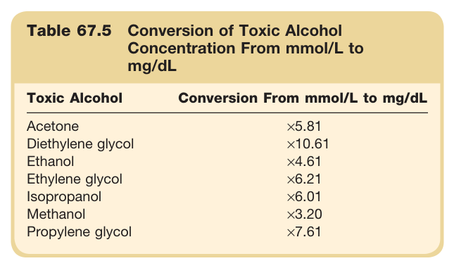

#### Table Data (CSV: [Table_67_5.csv](Table_67_5.csv))

```markdown
| Table Text (OCR) |
| :--- |
| Table 67.5 Conversion of Toxic Alcohol Concentration From mmol/L to mg/dL Toxic Alcohol  Conversion From mmol/L to mg/dL    Acetone  ×5.81    Diethylene glycol  ×10.61    Ethanol  ×4.61    Ethylene glycol  ×6.21    Isopropanol  ×6.01    Methanol  ×3.20    Propylene glycol  ×7.61 |
```

Table 67.5 Conversion of Toxic Alcohol Concentration From mmol/L to mg/dL | Toxic Alcohol | Conversion From mmol/L to mg/dL | | :-------------------------- | :------------------------------ | | Acetone | ×5.81 | | Diethylene glycol | ×10.61 | | Ethanol | ×4.61 | | Ethylene glycol | ×6.21 | | Isopropanol | ×6.01 | | Methanol | ×3.20 | | Propylene glycol | ×7.61 |

---

### Table_67_6

#### Table Image

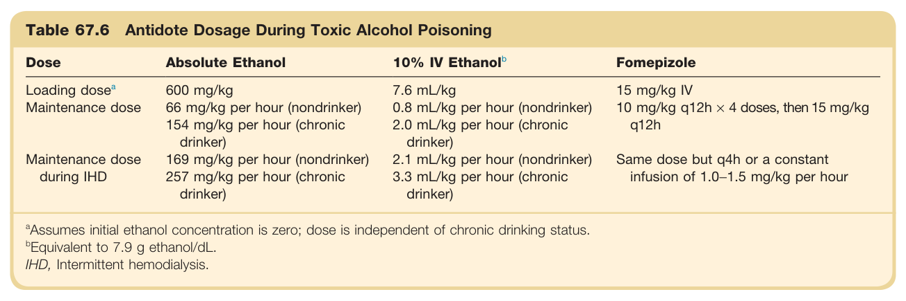

#### Table Data (CSV: [Table_67_6.csv](Table_67_6.csv))

```markdown
| Table Text (OCR) |
| :--- |
| Table 67.6 Antidote Dosage During Toxic Alcohol Poisoning Dose  Absolute Ethanol  10% IV  Ethanol^b   Fomepizole     Loading\ dose^a   600 mg/kg  7.6 mL/kg  15 mg/kg IV    Maintenance dose  66 mg/kg per hour (nondrinker)  0.8 mL/kg per hour (nondrinker)  10 mg/kg q12h × 4 doses, then 15 mg/kg q12h    154 mg/kg per hour (chronic drinker)  2.0 mL/kg per hour (chronic drinker)    Maintenance dose during IHD  169 mg/kg per hour (nondrinker)  2.1 mL/kg per hour (nondrinker)  Same dose but q4h or a constant infusion of 1.0–1.5 mg/kg per hour    257 mg/kg per hour (chronic drinker)  3.3 mL/kg per hour (chronic drinker) <sup>a</sup>Assumes initial ethanol concentration is zero; dose is independent of chronic drinking status. <sup>b</sup>Equivalent to 7.9 g ethanol/dL. IHD, Intermittent hemodialysis. |
```

Table 67.6 Antidote Dosage During Toxic Alcohol Poisoning | Dose | Absolute Ethanol | 10% IV Ethanolb | Fomepizole | | :-------------------------- | :----------------------------------------------------------- | :----------------------------------------------------------- | :----------------------------------------------------------- | | Loading dosea | 600 mg/kg | 7.6 mL/kg | 15 mg/kg IV | | Maintenance dose | 66 mg/kg per hour (nondrinker)<br>154 mg/kg per hour (chronic drinker) | 0.8 mL/kg per hour (nondrinker)<br>2.0 mL/kg per hour (chronic drinker) | 10 mg/kg q12h x 4 doses, then 15 mg/kg q12h | | Maintenance dose during IHD | 169 mg/kg per hour (nondrinker)<br>257 mg/kg per hour (chronic drinker) | 2.1 mL/kg per hour (nondrinker)<br>3.3 mL/kg per hour (chronic drinker) | Same dose but q4h or a constant infusion of 1.0-1.5 mg/kg per hour | aAssumes initial ethanol concentration is zero; dose is independent of chronic drinking status. bEquivalent to 7.9 g ethanol/dL. IHD, Intermittent hemodialysis.

---

## Boxes

### Box_67_1

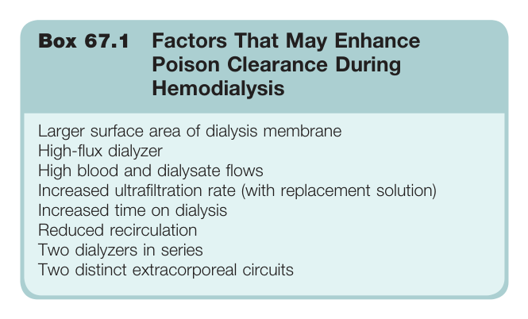

#### Box Text

```markdown
Box 67.1 Factors That May Enhance Poison Clearance During Hemodialysis * Larger surface area of dialysis membrane * High-flux dialyzer * High blood and dialysate flows * Increased ultrafiltration rate (with replacement solution) * Increased time on dialysis * Reduced recirculation * Two dialyzers in series * Two distinct extracorporeal circuits
```

Box 67.1 Factors That May Enhance Poison Clearance During Hemodialysis * Larger surface area of dialysis membrane * High-flux dialyzer * High blood and dialysate flows * Increased ultrafiltration rate (with replacement solution) * Increased time on dialysis * Reduced recirculation * Two dialyzers in series * Two distinct extracorporeal circuits

---
