# 68. Interventional Nephrology - Figures and Tables Index

This document lists all figures and tables extracted from `68. Interventional Nephrology.pdf`.

## Table of Contents
- [Figures](#figures)
- [Tables](#tables)

---

## Figures

### Fig_68_1

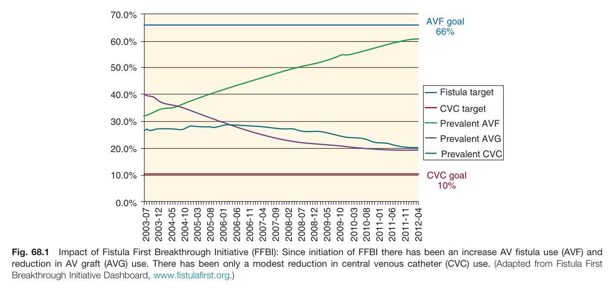

Fig. 68.1 Impact of Fistula First Breakthrough Initiative (FFBI): Since initiation of FFBI there has been an increase AV fistula use (AVF) and reduction in AV graft (AVG) use. There has been only a modest reduction in central venous catheter (CVC) use. (Adapted from Fistula First Breakthrough Initiative Dashboard, www.fistulafirst.org.)

---

### Fig_68_2

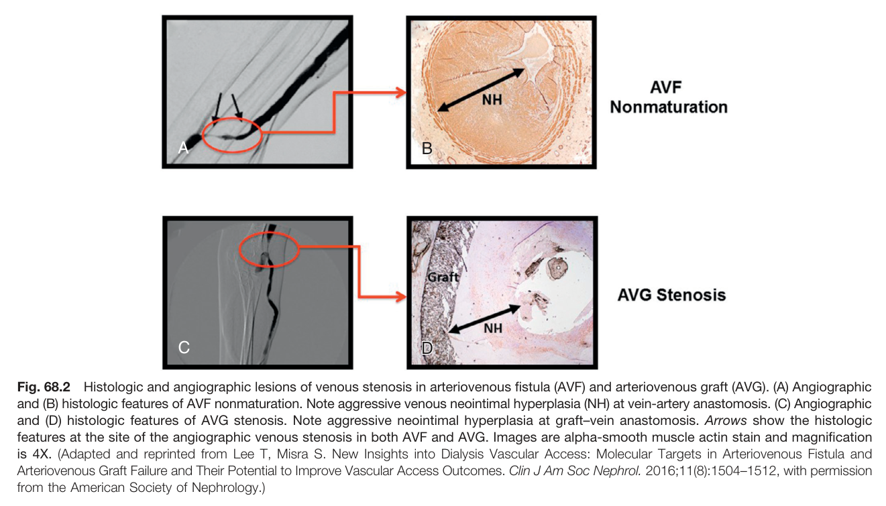

Fig. 68.2 Histologic and angiographic lesions of venous stenosis in arteriovenous fistula (AVF) and arteriovenous graft (AVG). (A) Angiographic and (B) histologic features of AVF nonmaturation. Note aggressive venous neointimal hyperplasia (NH) at vein-artery anastomosis. (C) Angiographic and (D) histologic features of AVG stenosis. Note aggressive neointimal hyperplasia at graft-vein anastomosis. Arrows show the histologic features at the site of the angiographic venous stenosis in both AVF and AVG. Images are alpha-smooth muscle actin stain and magnification is 4X. (Adapted and reprinted from Lee T, Misra S. New Insights into Dialysis Vascular Access: Molecular Targets in Arteriovenous Fistula and Arteriovenous Graft Failure and Their Potential to Improve Vascular Access Outcomes. Clin J Am Soc Nephrol. 2016;11(8):1504-1512, with permission from the American Society of Nephrology.)

---

### Fig_68_3

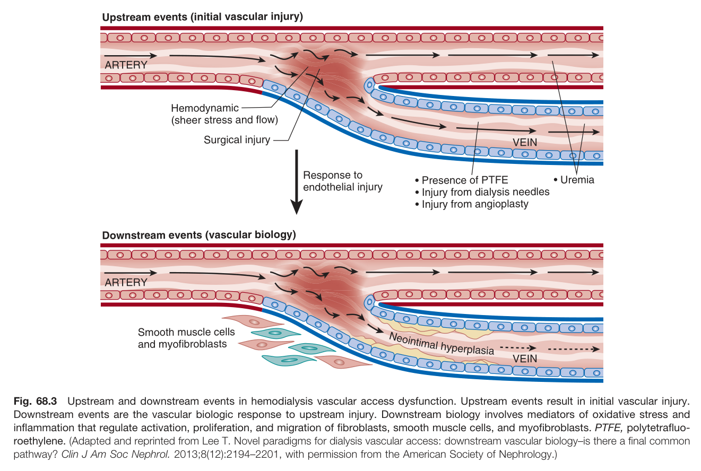

Fig. 68.3 Upstream and downstream events in hemodialysis vascular access dysfunction. Upstream events result in initial vascular injury. Downstream events are the vascular biologic response to upstream injury. Downstream biology involves mediators of oxidative stress and inflammation that regulate activation, proliferation, and migration of fibroblasts, smooth muscle cells, and myofibroblasts. PTFE, polytetrafluoroethylene. (Adapted and reprinted from Lee T. Novel paradigms for dialysis vascular access: downstream vascular biology-is there a final common pathway? Clin J Am Soc Nephrol. 2013;8(12):2194-2201, with permission from the American Society of Nephrology.)

---

### Fig_68_4

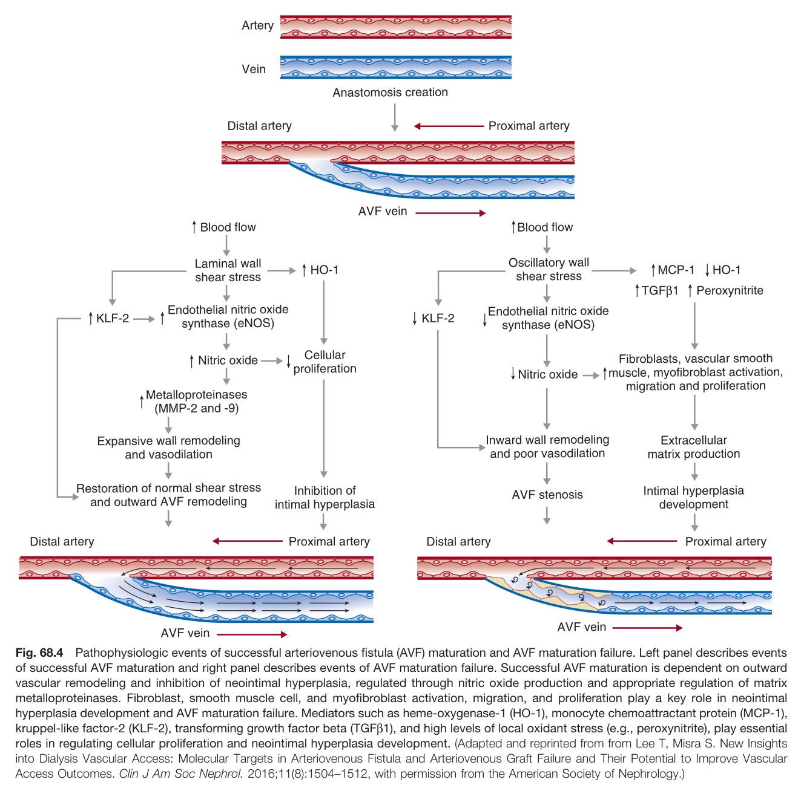

Fig. 68.4 Pathophysiologic events of successful arteriovenous fistula (AVF) maturation and AVF maturation failure. Left panel describes events of successful AVF maturation and right panel describes events of AVF maturation failure. Successful AVF maturation is dependent on outward vascular remodeling and inhibition of neointimal hyperplasia, regulated through nitric oxide production and appropriate regulation of matrix metalloproteinases. Fibroblast, smooth muscle cell, and myofibroblast activation, migration, and proliferation play a key role in neointimal hyperplasia development and AVF maturation failure. Mediators such as heme-oxygenase-1 (HO-1), monocyte chemoattractant protein (MCP-1), kruppel-like factor-2 (KLF-2), transforming growth factor beta (TGFβ1), and high levels of local oxidant stress (e.g., peroxynitrite), play essential roles in regulating cellular proliferation and neointimal hyperplasia development. (Adapted and reprinted from from Lee T, Misra S. New Insights into Dialysis Vascular Access: Molecular Targets in Arteriovenous Fistula and Arteriovenous Graft Failure and Their Potential to Improve Vascular Access Outcomes. Clin J Am Soc Nephrol. 2016;11(8):1504-1512, with permission from the American Society of Nephrology.)

---

### Fig_68_5

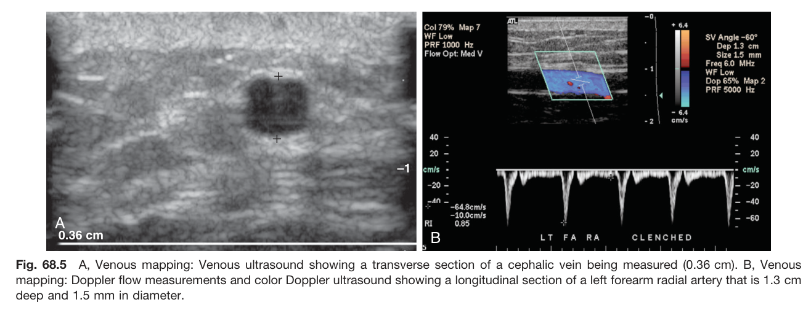

Fig. 68.5 A, Venous mapping: Venous ultrasound showing a transverse section of a cephalic vein being measured (0.36 cm). B, Venous mapping: Doppler flow measurements and color Doppler ultrasound showing a longitudinal section of a left forearm radial artery that is 1.3 cm deep and 1.5 mm in diameter.

---

### Fig_68_6

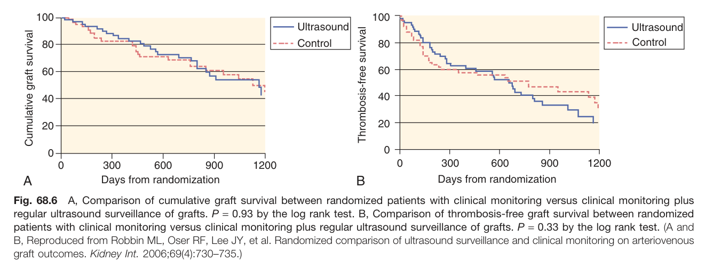

Fig. 68.6 A, Comparison of cumulative graft survival between randomized patients with clinical monitoring versus clinical monitoring plus regular ultrasound surveillance of grafts. P = 0.93 by the log rank test. B, Comparison of thrombosis-free graft survival between randomized patients with clinical monitoring versus clinical monitoring plus regular ultrasound surveillance of grafts. P = 0.33 by the log rank test. (A and B, Reproduced from Robbin ML, Oser RF, Lee JY, et al. Randomized comparison of ultrasound surveillance and clinical monitoring on arteriovenous graft outcomes. Kidney Int. 2006;69(4):730-735.)

---

### Fig_68_7

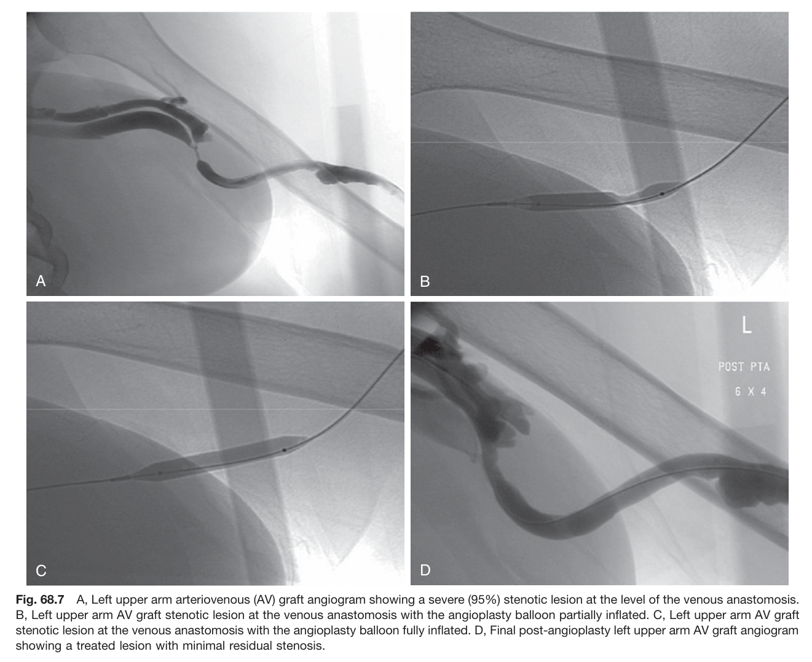

Fig. 68.7 A, Left upper arm arteriovenous (AV) graft angiogram showing a severe (95%) stenotic lesion at the level of the venous anastomosis. B, Left upper arm AV graft stenotic lesion at the venous anastomosis with the angioplasty balloon partially inflated. C, Left upper arm AV graft stenotic lesion at the venous anastomosis with the angioplasty balloon fully inflated. D, Final post-angioplasty left upper arm AV graft angiogram showing a treated lesion with minimal residual stenosis.

---

### Fig_68_8

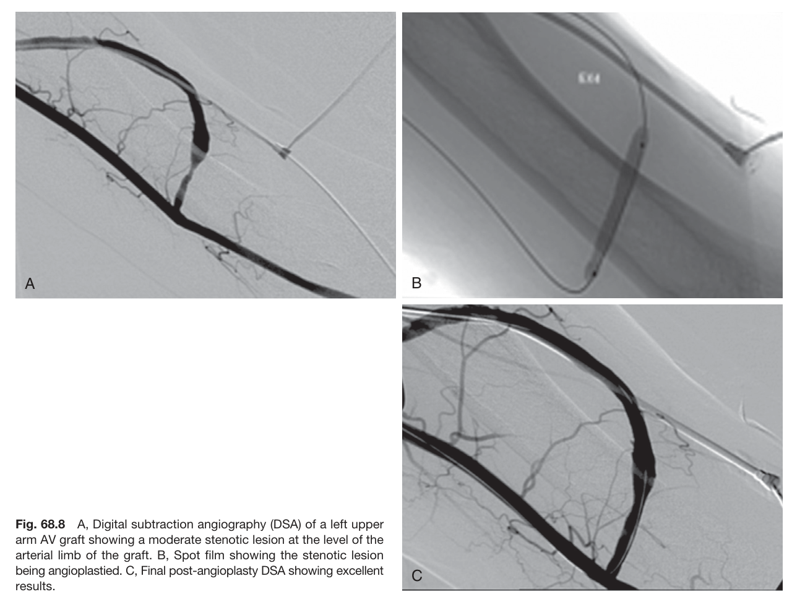

Fig. 68.8 A, Digital subtraction angiography (DSA) of a left upper arm AV graft showing a moderate stenotic lesion at the level of the arterial limb of the graft. B, Spot film showing the stenotic lesion being angioplastied. C, Final post-angioplasty DSA showing excellent results.

---

### Fig_68_9

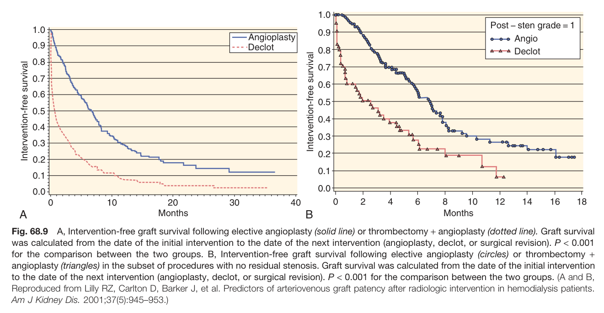

Fig. 68.9 A, Intervention-free graft survival following elective angioplasty (solid line) or thrombectomy + angioplasty (dotted line). Graft survival was calculated from the date of the initial intervention to the date of the next intervention (angioplasty, declot, or surgical revision). P < 0.001 for the comparison between the two groups. B, Intervention-free graft survival following elective angioplasty (circles) or thrombectomy + angioplasty (triangles) in the subset of procedures with no residual stenosis. Graft survival was calculated from the date of the initial intervention to the date of the next intervention (angioplasty, declot, or surgical revision). P < 0.001 for the comparison between the two groups. (A and B, Reproduced from Lilly RZ, Carlton D, Barker J, et al. Predictors of arteriovenous graft patency after radiologic intervention in hemodialysis patients. Am J Kidney Dis. 2001;37(5):945-953.)

---

### Fig_68_10

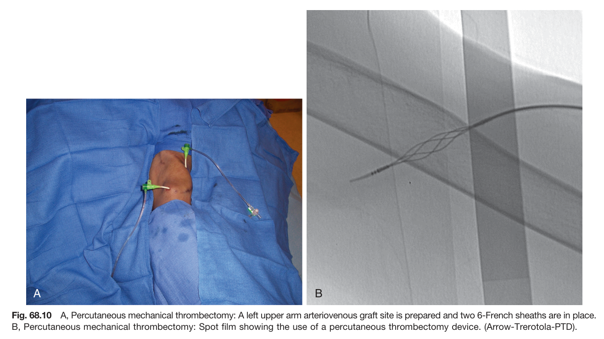

Fig. 68.10 A, Percutaneous mechanical thrombectomy: A left upper arm arteriovenous graft site is prepared and two 6-French sheaths are in place. B, Percutaneous mechanical thrombectomy: Spot film showing the use of a percutaneous thrombectomy device. (Arrow-Trerotola-PTD).

---

### Fig_68_11

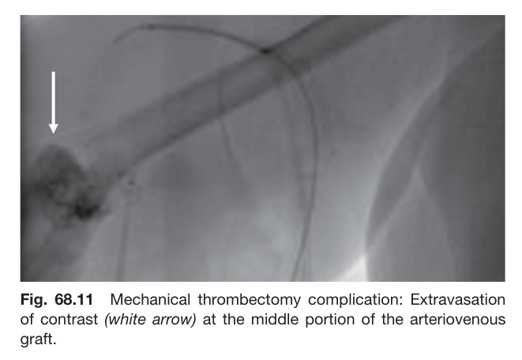

Fig. 68.11 Mechanical thrombectomy complication: Extravasation of contrast (white arrow) at the middle portion of the arteriovenous graft.

---

### Fig_68_12

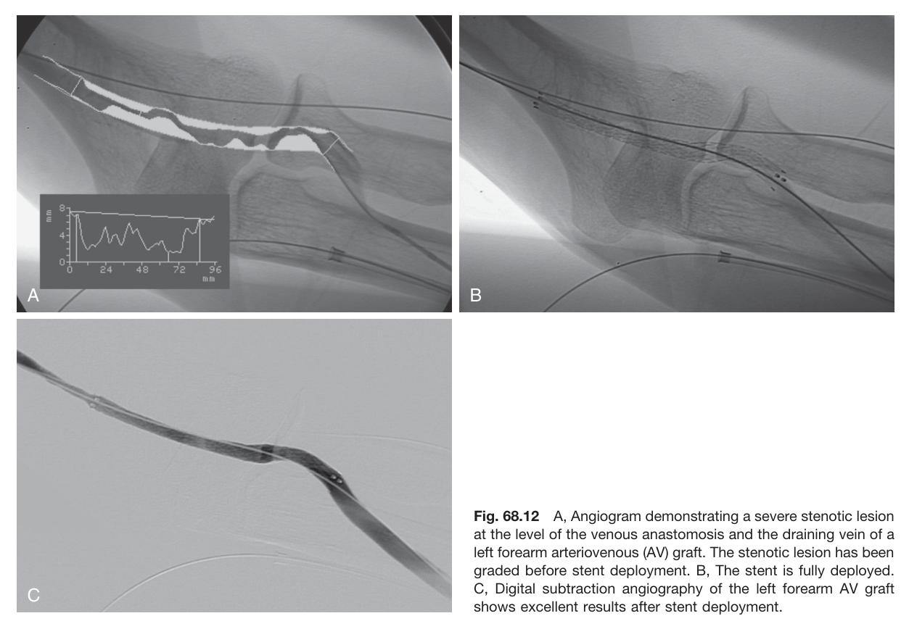

Fig. 68.12 A, Angiogram demonstrating a severe stenotic lesion at the level of the venous anastomosis and the draining vein of a left forearm arteriovenous (AV) graft. The stenotic lesion has been graded before stent deployment. B, The stent is fully deployed. C, Digital subtraction angiography of the left forearm AV graft shows excellent results after stent deployment.

---

### Fig_68_13

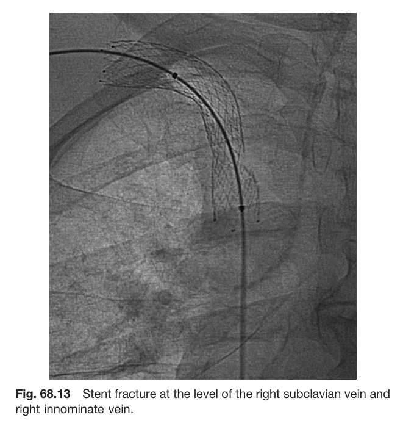

Fig. 68.13 Stent fracture at the level of the right subclavian vein and right innominate vein.

---

### Fig_68_14

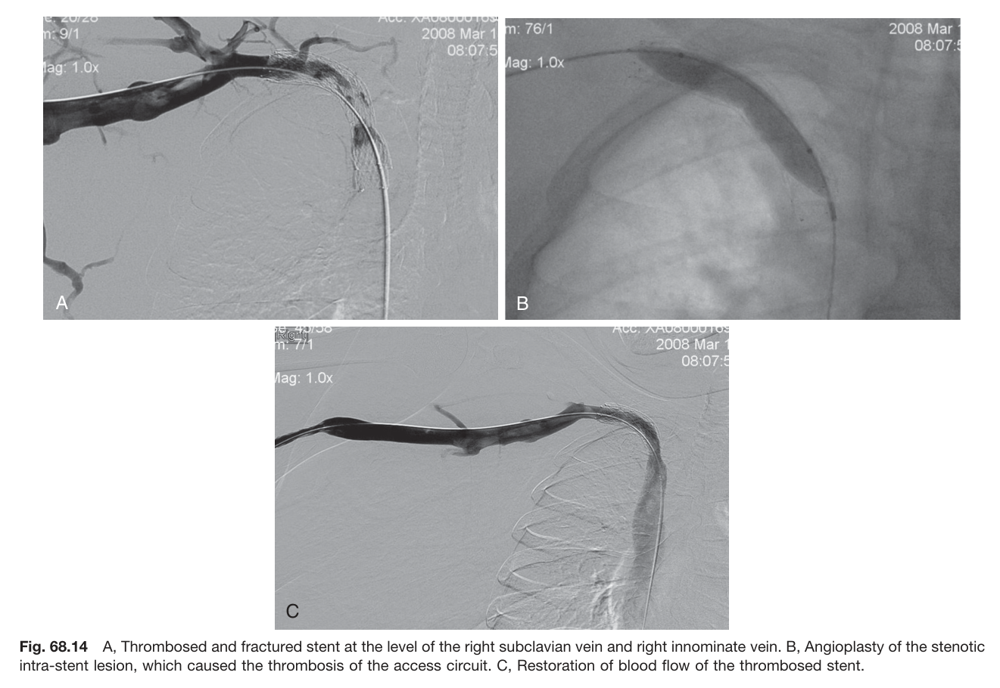

Fig. 68.14 A, Thrombosed and fractured stent at the level of the right subclavian vein and right innominate vein. B, Angioplasty of the stenotic intra-stent lesion, which caused the thrombosis of the access circuit. C, Restoration of blood flow of the thrombosed stent.

---

### Fig_68_15

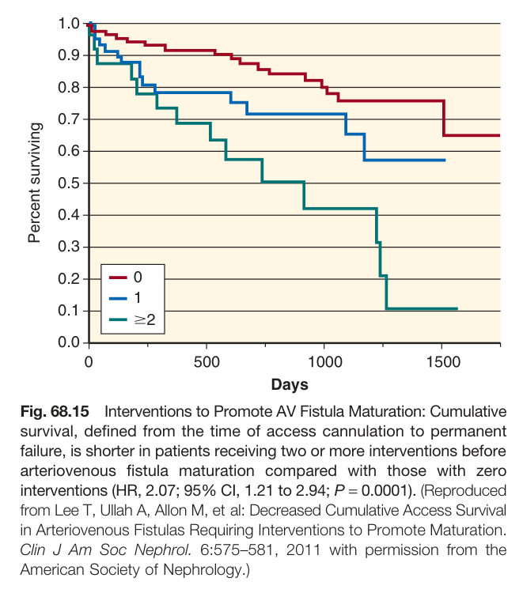

Fig. 68.15 Interventions to Promote AV Fistula Maturation: Cumulative survival, defined from the time of access cannulation to permanent failure, is shorter in patients receiving two or more interventions before arteriovenous fistula maturation compared with those with zero interventions (HR, 2.07; 95% CI, 1.21 to 2.94; P = 0.0001). (Reproduced from Lee T, Ullah A, Allon M, et al: Decreased Cumulative Access Survival in Arteriovenous Fistulas Requiring Interventions to Promote Maturation. Clin J Am Soc Nephrol. 6:575-581, 2011 with permission from the American Society of Nephrology.)

---

### Fig_68_16

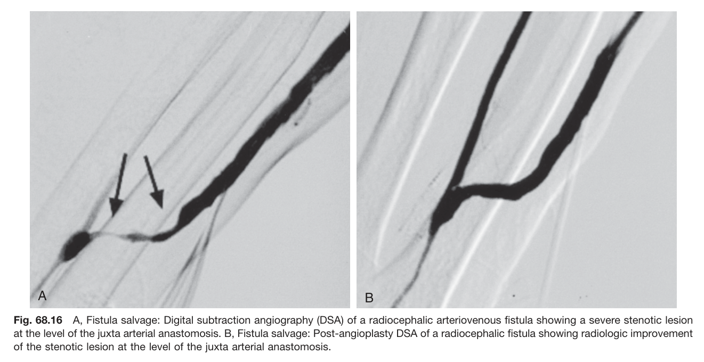

Fig. 68.16 A, Fistula salvage: Digital subtraction angiography (DSA) of a radiocephalic arteriovenous fistula showing a severe stenotic lesion at the level of the juxta arterial anastomosis. B, Fistula salvage: Post-angioplasty DSA of a radiocephalic fistula showing radiologic improvement of the stenotic lesion at the level of the juxta arterial anastomosis.

---

### Fig_68_17

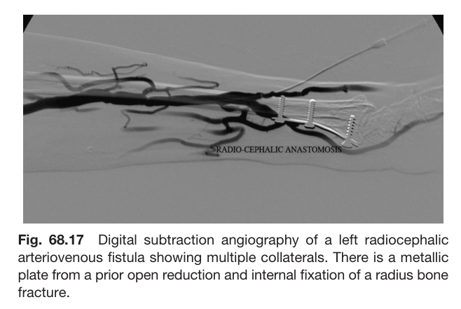

Fig. 68.17 Digital subtraction angiography of a left radiocephalic arteriovenous fistula showing multiple collaterals. There is a metallic plate from a prior open reduction and internal fixation of a radius bone fracture.

---

### Fig_68_18

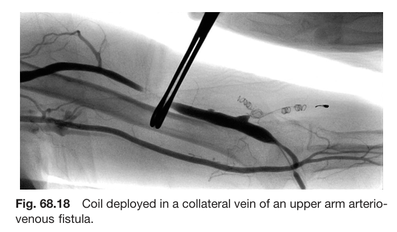

Fig. 68.18 Coil deployed in a collateral vein of an upper arm arteriovenous fistula.

---

### Fig_68_19

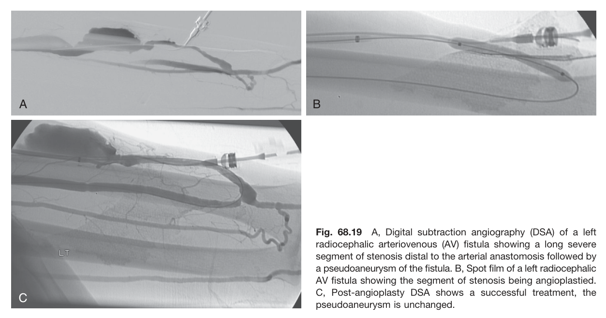

Fig. 68.19 A, Digital subtraction angiography (DSA) of a left radiocephalic arteriovenous (AV) fistula showing a long severe segment of stenosis distal to the arterial anastomosis followed by a pseudoaneurysm of the fistula. B, Spot film of a left radiocephalic AV fistula showing the segment of stenosis being angioplastied. C, Post-angioplasty DSA shows a successful treatment, the pseudoaneurysm is unchanged.

---

### Fig_68_20

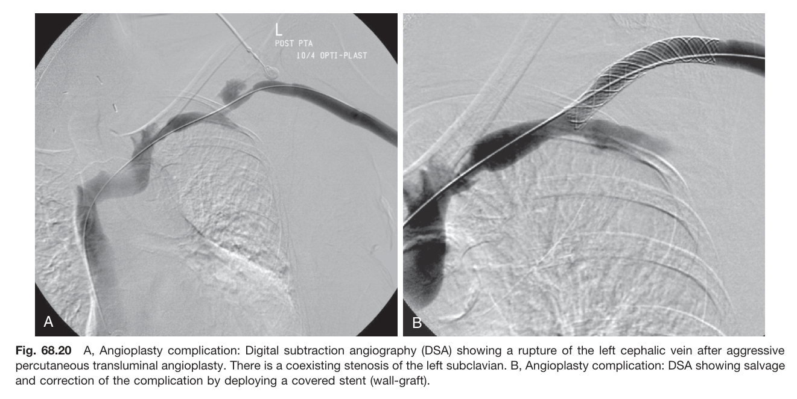

Fig. 68.20 A, Angioplasty complication: Digital subtraction angiography (DSA) showing a rupture of the left cephalic vein after aggressive percutaneous transluminal angioplasty. There is a coexisting stenosis of the left subclavian. B, Angioplasty complication: DSA showing salvage and correction of the complication by deploying a covered stent (wall-graft).

---

### Fig_68_21

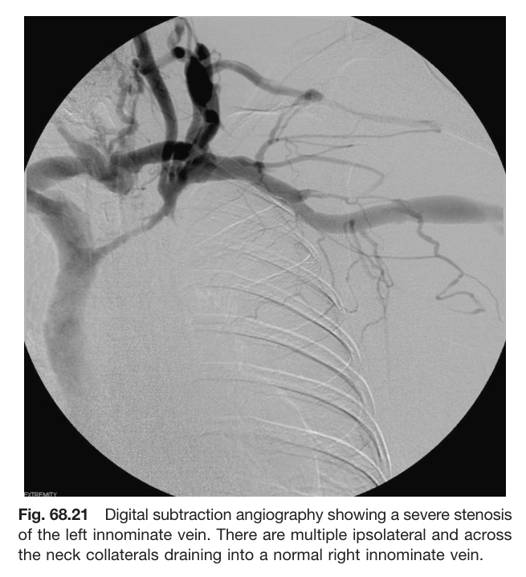

Fig. 68.21 Digital subtraction angiography showing a severe stenosis of the left innominate vein. There are multiple ipsolateral and across the neck collaterals draining into a normal right innominate vein.

---

### Fig_68_22

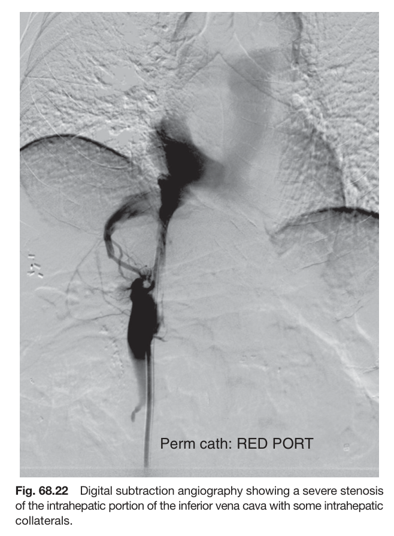

Fig. 68.22 Digital subtraction angiography showing a severe stenosis of the intrahepatic portion of the inferior vena cava with some intrahepatic collaterals.

---

### Fig_68_23

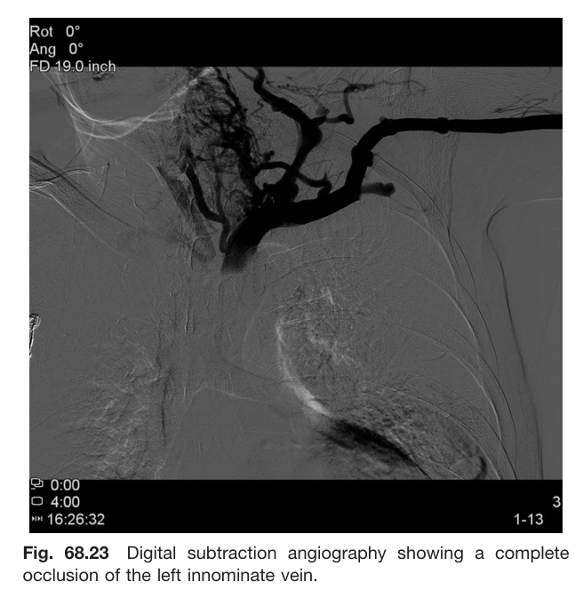

Fig. 68.23 Digital subtraction angiography showing a complete occlusion of the left innominate vein.

---

### Fig_68_24

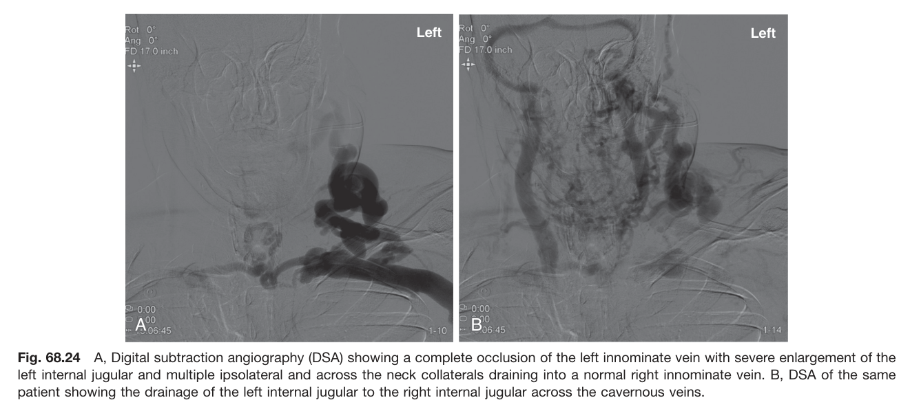

Fig. 68.24 A, Digital subtraction angiography (DSA) showing a complete occlusion of the left innominate vein with severe enlargement of the left internal jugular and multiple ipsolateral and across the neck collaterals draining into a normal right innominate vein. B, DSA of the same patient showing the drainage of the left internal jugular to the right internal jugular across the cavernous veins.

---

### Fig_68_25

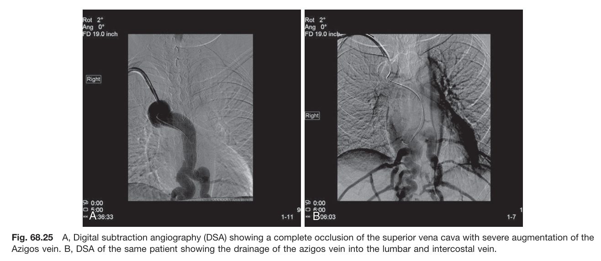

Fig. 68.25 A, Digital subtraction angiography (DSA) showing a complete occlusion of the superior vena cava with severe augmentation of the Azigos vein. B, DSA of the same patient showing the drainage of the azigos vein into the lumbar and intercostal vein.

---

### Fig_68_26

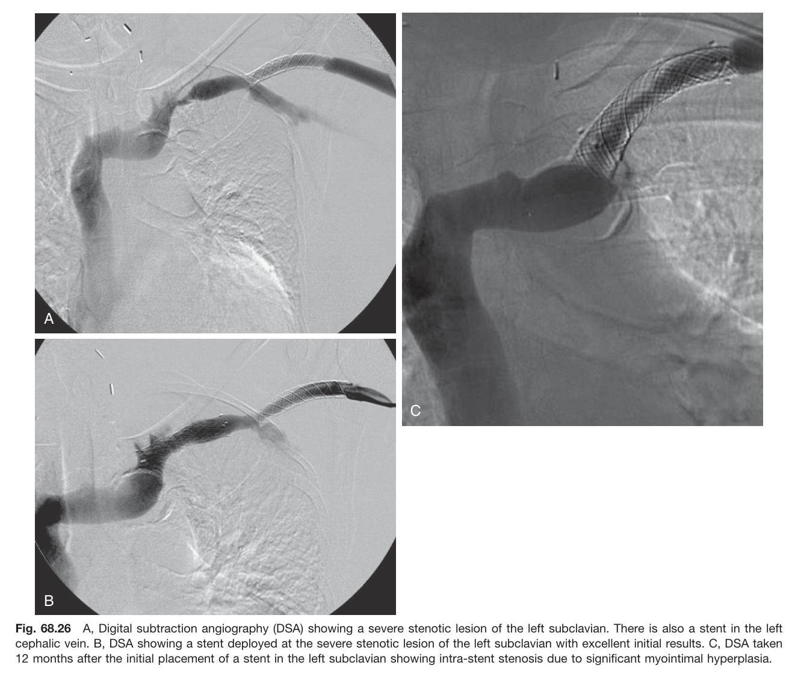

Fig. 68.26 A, Digital subtraction angiography (DSA) showing a severe stenotic lesion of the left subclavian. There is also a stent in the left cephalic vein. B, DSA showing a stent deployed at the severe stenotic lesion of the left subclavian with excellent initial results. C, DSA taken 12 months after the initial placement of a stent in the left subclavian showing intra-stent stenosis due to significant myointimal hyperplasia.

---

### Fig_68_27

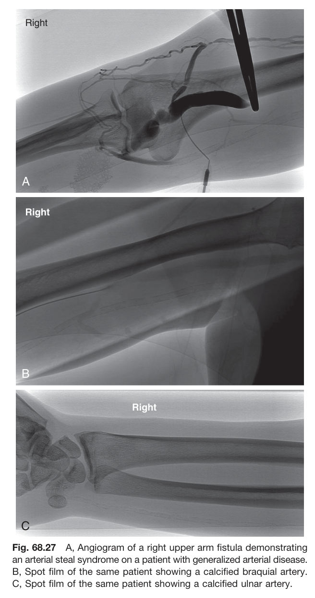

Fig. 68.27 A, Angiogram of a right upper arm fistula demonstrating an arterial steal syndrome on a patient with generalized arterial disease. B, Spot film of the same patient showing a calcified braquial artery. C, Spot film of the same patient showing a calcified ulnar artery.

---

### Fig_68_28

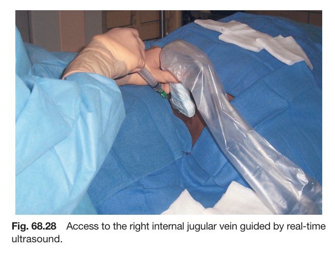

Fig. 68.28 Access to the right internal jugular vein guided by real-time ultrasound.

---

### Fig_68_29

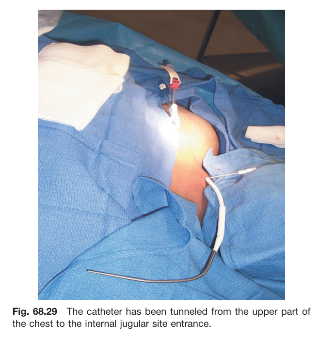

Fig. 68.29 The catheter has been tunneled from the upper part of the chest to the internal jugular site entrance.

---

### Fig_68_30

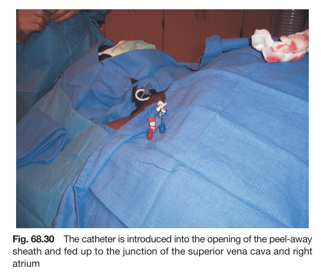

Fig. 68.30 The catheter is introduced into the opening of the peel-away sheath and fed up to the junction of the superior vena cava and right atrium

---

### Fig_68_31

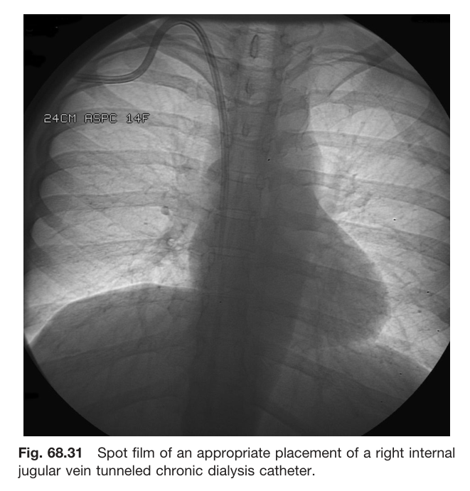

Fig. 68.31 Spot film of an appropriate placement of a right internal jugular vein tunneled chronic dialysis catheter.

---

### Fig_68_32

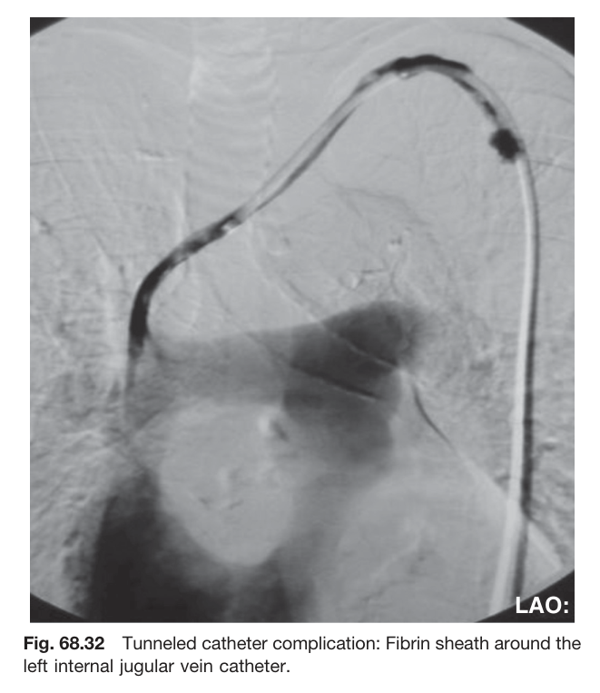

Fig. 68.32 Tunneled catheter complication: Fibrin sheath around the left internal jugular vein catheter.

---

### Fig_68_33

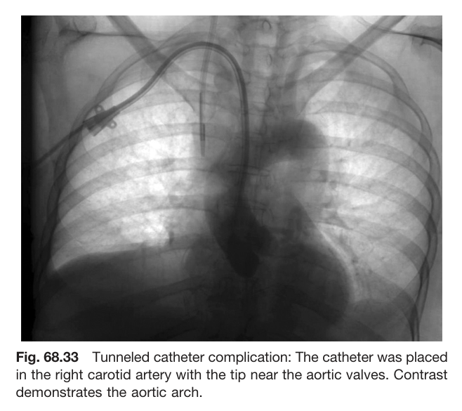

Fig. 68.33 Tunneled catheter complication: The catheter was placed in the right carotid artery with the tip near the aortic valves. Contrast demonstrates the aortic arch.

---

### Fig_68_34

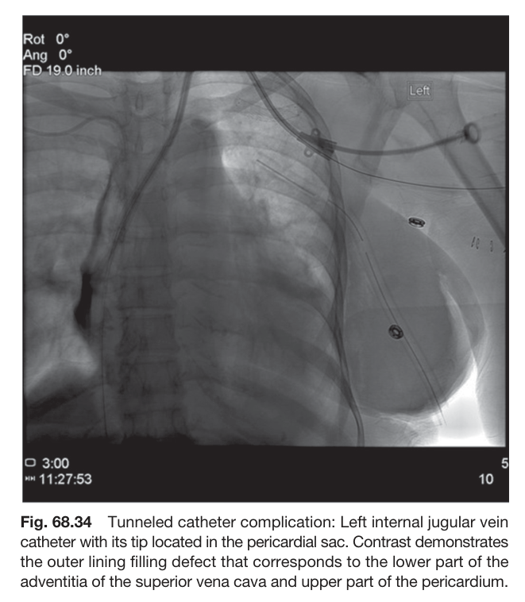

Fig. 68.34 Tunneled catheter complication: Left internal jugular vein catheter with its tip located in the pericardial sac. Contrast demonstrates the outer lining filling defect that corresponds to the lower part of the adventitia of the superior vena cava and upper part of the pericardium.

---

### Fig_68_35

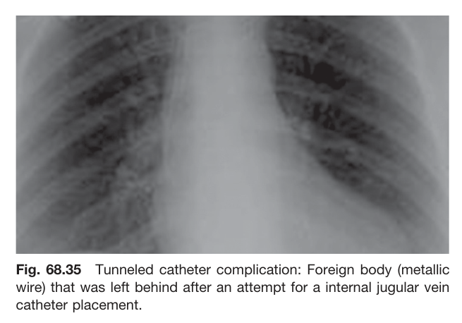

Fig. 68.35 Tunneled catheter complication: Foreign body (metallic wire) that was left behind after an attempt for a internal jugular vein catheter placement.

---

### Fig_68_36

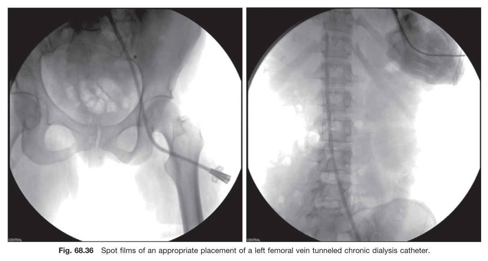

Fig. 68.36 Spot films of an appropriate placement of a left femoral vein tunneled chronic dialysis catheter.

---

### Fig_68_37

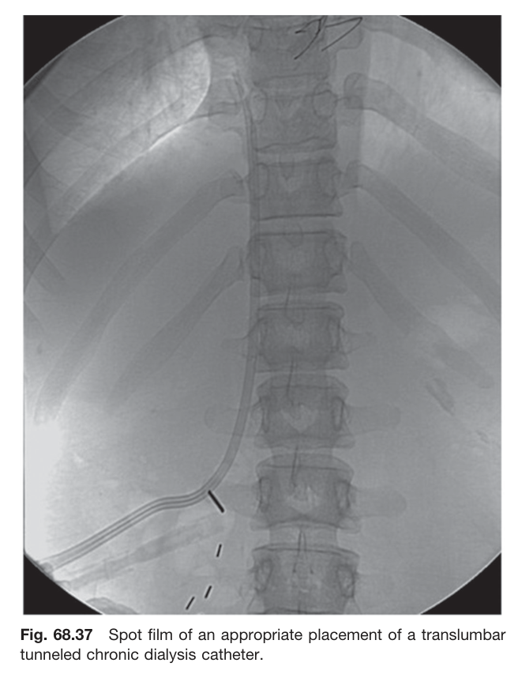

Fig. 68.37 Spot film of an appropriate placement of a translumbar tunneled chronic dialysis catheter.

---

### Fig_68_38

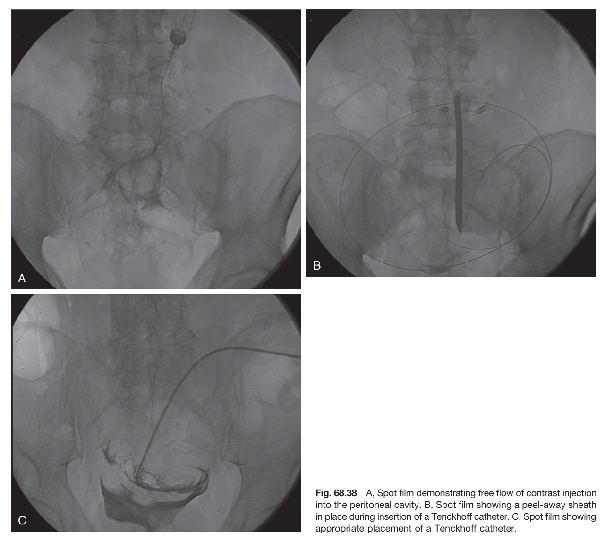

Fig. 68.38 A, Spot film demonstrating free flow of contrast injection into the peritoneal cavity. B, Spot film showing a peel-away sheath in place during insertion of a Tenckhoff catheter. C, Spot film showing appropriate placement of a Tenckhoff catheter.

---

### Fig_68_39

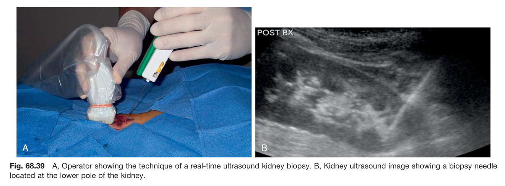

Fig. 68.39 A, Operator showing the technique of a real-time ultrasound kidney biopsy. B, Kidney ultrasound image showing a biopsy needle located at the lower pole of the kidney.

---

### Fig_68_40

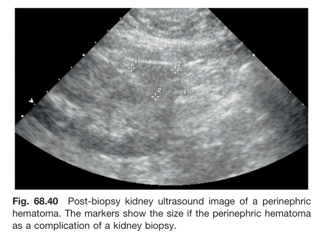

Fig. 68.40 Post-biopsy kidney ultrasound image of a perinephric hematoma. The markers show the size if the perinephric hematoma as a complication of a kidney biopsy.

---

### Fig_68_41

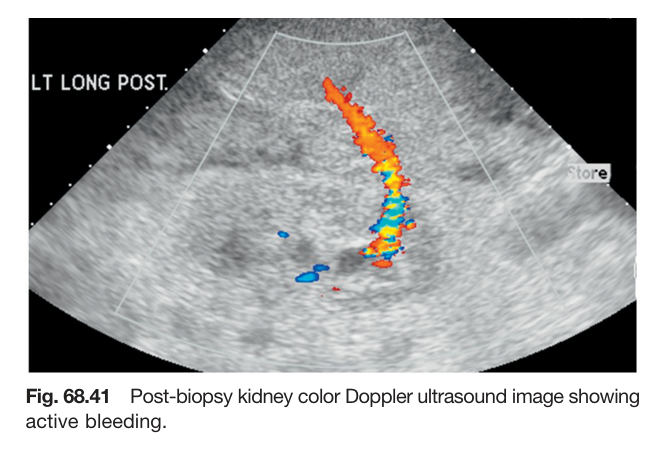

Fig. 68.41 Post-biopsy kidney color Doppler ultrasound image showing active bleeding.

---

## Tables

### Table_68_1

#### Table Image

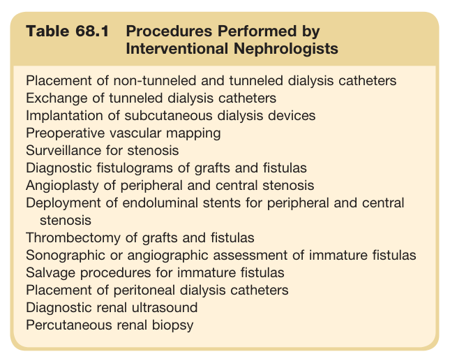

#### Table Data (CSV: [Table_68_1.csv](Table_68_1.csv))

```markdown
| Table Text (OCR) |
| :--- |
| Table 68.1 Procedures Performed by Interventional Nephrologists Placement of non-tunneled and tunneled dialysis catheters    Exchange of tunneled dialysis catheters    Implantation of subcutaneous dialysis devices    Preoperative vascular mapping    Surveillance for stenosis    Diagnostic fistulograms of grafts and fistulas    Angioplasty of peripheral and central stenosis    Deployment of endoluminal stents for peripheral and central stenosis    Thrombectomy of grafts and fistulas    Sonographic or angiographic assessment of immature fistulas    Salvage procedures for immature fistulas    Placement of peritoneal dialysis catheters    Diagnostic renal ultrasound    Percutaneous renal biopsy |
```

Table 68.1 Procedures Performed by Interventional Nephrologists Placement of non-tunneled and tunneled dialysis catheters Exchange of tunneled dialysis catheters Implantation of subcutaneous dialysis devices Preoperative vascular mapping Surveillance for stenosis Diagnostic fistulograms of grafts and fistulas Angioplasty of peripheral and central stenosis Deployment of endoluminal stents for peripheral and central stenosis Thrombectomy of grafts and fistulas Sonographic or angiographic assessment of immature fistulas Salvage procedures for immature fistulas Placement of peritoneal dialysis catheters Diagnostic renal ultrasound Percutaneous renal biopsy

---

### Table_68_2

#### Table Image

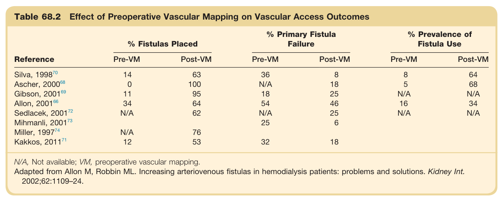

#### Table Data (CSV: [Table_68_2.csv](Table_68_2.csv))

```markdown
| Table Text (OCR) |
| :--- |
| Table 68.2 Effect of Preoperative Vascular Mapping on Vascular Access Outcomes Reference  % Fistulas Placed  % Primary Fistula Failure  % Prevalence of Fistula Use    Pre-VM  Post-VM  Pre-VM  Post-VM  Pre-VM  Post-VM    Silva, 199870  14  63  36  8  8  64    Ascher, 200068  0  100  N/A  18  5  68    Gibson, 200169  11  95  18  25  N/A  N/A    Allon, 200166  34  64  54  46  16  34    Sedlacek, 200172  N/A  62  N/A  25  N/A  N/A    Mihmanli, 200173      25  6        Miller, 199774  N/A  76            Kakkos, 201171  12  53  32  18 N/A, Not available; VM, preoperative vascular mapping. Adapted from Allon M, Robbin ML. Increasing arteriovenous fistulas in hemodialysis patients: problems and solutions. Kidney Int. 2002;62:1109–24. |
```

Table 68.2 Effect of Preoperative Vascular Mapping on Vascular Access Outcomes | Reference | % Fistulas Placed | % Primary Fistula Failure | % Prevalence of Fistula Use | | :----------------------------------------------------------- | :---------------- | :------------------------ | :-------------------------- | | | **Pre-VM** | **Post-VM** | **Pre-VM** | | Silva, 1998 | 14 | 63 | 36 | | Ascher, 2000 | 0 | 100 | N/A | | Gibson, 2001 | 11 | 95 | 18 | | Allon, 2001 | 34 | 64 | 54 | | Sedlacek, 2001 | N/A | 62 | N/A | | Mihmanli, 2001 | | | 25 | | Miller, 1997 | N/A | 76 | | | Kakkos, 2011 | 12 | 53 | 32 | | *N/A, Not available; VM, preoperative vascular mapping.* | | | | | *Adapted from Allon M, Robbin ML. Increasing arteriovenous fistulas in hemodialysis patients: problems and solutions. Kidney Int. 2002;62:1109-24.* | | | |

---

### Table_68_3

#### Table Image

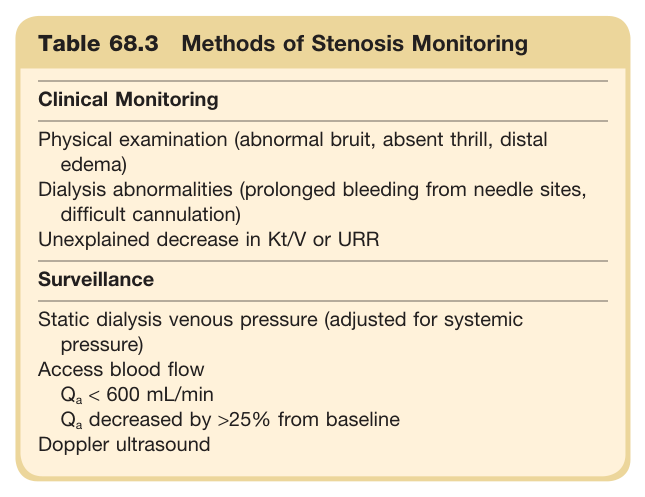

#### Table Data (CSV: [Table_68_3.csv](Table_68_3.csv))

```markdown
| Table Text (OCR) |
| :--- |
| Table 68.3 Methods of Stenosis Monitoring Clinical Monitoring    Physical examination (abnormal bruit, absent thrill, distal edema)    Dialysis abnormalities (prolonged bleeding from needle sites, difficult cannulation)    Unexplained decrease in Kt/V or URR    Surveillance    Static dialysis venous pressure (adjusted for systemic pressure)    Access blood flow     Q_a < 600 \text{ mL/min}      Q_a  decreased by >25% from baseline    Doppler ultrasound |
```

Table 68.3 Methods of Stenosis Monitoring **Clinical Monitoring** Physical examination (abnormal bruit, absent thrill, distal edema) Dialysis abnormalities (prolonged bleeding from needle sites, difficult cannulation) Unexplained decrease in Kt/V or URR **Surveillance** Static dialysis venous pressure (adjusted for systemic pressure) Access blood flow Qa < 600 mL/min Qa decreased by >25% from baseline Doppler ultrasound

---

### Table_68_4

#### Table Image

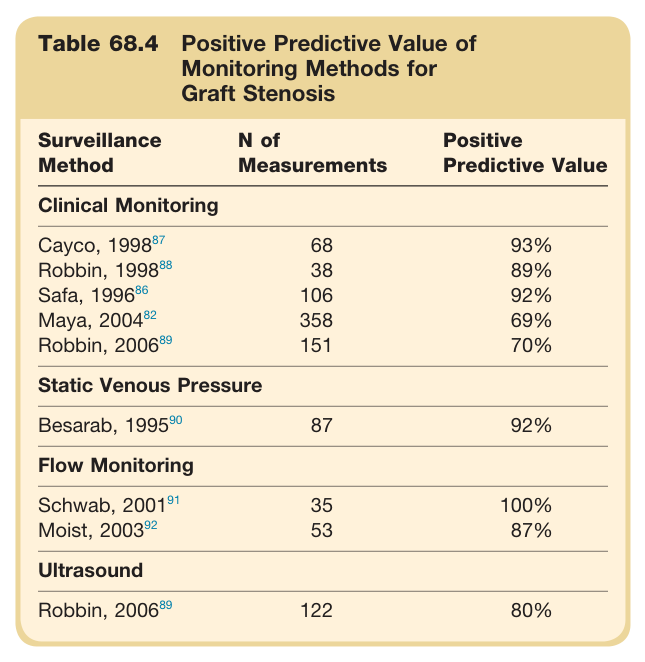

#### Table Data (CSV: [Table_68_4.csv](Table_68_4.csv))

```markdown
| Table Text (OCR) |
| :--- |
| Table 68.4 Positive Predictive Value of Monitoring Methods for Graft Stenosis Surveillance Method  N of Measurements  Positive Predictive Value    Clinical Monitoring    Cayco, 199887  68  93%    Robbin, 199888  38  89%    Safa, 199686  106  92%    Maya, 200482  358  69%    Robbin, 200689  151  70%    Static Venous Pressure    Besarab, 199590  87  92%    Flow Monitoring    Schwab, 200191  35  100%    Moist, 200392  53  87%    Ultrasound    Robbin, 200689  122  80% |
```

Table 68.4 Positive Predictive Value of Monitoring Methods for Graft Stenosis | Surveillance Method | N of Measurements | Positive Predictive Value | | :---------------------------- | :---------------- | :------------------------ | | **Clinical Monitoring** | | | | Cayco, 1998 | 68 | 93% | | Robbin, 1998 | 38 | 89% | | Safa, 1996 | 106 | 92% | | Maya, 2004 | 358 | 69% | | Robbin, 2006 | 151 | 70% | | **Static Venous Pressure** | | | | Besarab, 1995 | 87 | 92% | | **Flow Monitoring** | | | | Schwab, 2001 | 35 | 100% | | Moist, 2003 | 53 | 87% | | **Ultrasound** | | | | Robbin, 2006 | 122 | 80% |

---

### Table_68_5

#### Table Image

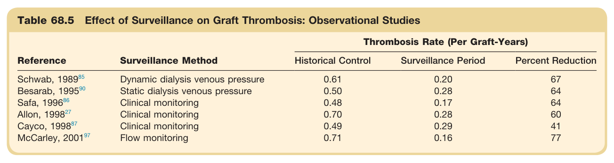

#### Table Data (CSV: [Table_68_5.csv](Table_68_5.csv))

```markdown
| Table Text (OCR) |
| :--- |
| Table 68.5 Effect of Surveillance on Graft Thrombosis: Observational Studies Reference  Surveillance Method  Thrombosis Rate (Per Graft-Years)    Historical Control  Surveillance Period  Percent Reduction    Schwab, 198985  Dynamic dialysis venous pressure  0.61  0.20  67    Besarab, 199590  Static dialysis venous pressure  0.50  0.28  64    Safa, 199686  Clinical monitoring  0.48  0.17  64    Allon, 199827  Clinical monitoring  0.70  0.28  60    Cayco, 199887  Clinical monitoring  0.49  0.29  41    McCarley, 200197  Flow monitoring  0.71  0.16  77 |
```

Table 68.5 Effect of Surveillance on Graft Thrombosis: Observational Studies | | **Thrombosis Rate (Per Graft-Years)** | | | :--- | :--- | :--- | :--- | | **Reference** | **Surveillance Method** | **Historical Control** | **Surveillance Period** | **Percent Reduction** | | Schwab, 1989 | Dynamic dialysis venous pressure | 0.61 | 0.20 | 67 | | Besarab, 1995 | Static dialysis venous pressure | 0.50 | 0.28 | 64 | | Safa, 1996 | Clinical monitoring | 0.48 | 0.17 | 64 | | Allon, 1998 | Clinical monitoring | 0.70 | 0.28 | 60 | | Cayco, 1998 | Clinical monitoring | 0.49 | 0.29 | 41 | | McCarley, 2001 | Flow monitoring | 0.71 | 0.16 | 77 |

---

### Table_68_6

#### Table Image

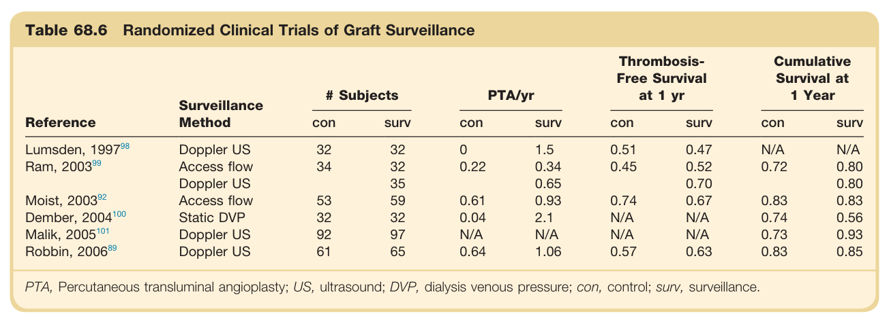

#### Table Data (CSV: [Table_68_6.csv](Table_68_6.csv))

```markdown
| Table Text (OCR) |
| :--- |
| Table 68.6 Randomized Clinical Trials of Graft Surveillance Reference  Surveillance Method  # Subjects  PTA/yr  Thrombosis-Free Survival at 1 yr  Cumulative Survival at 1 Year    con  surv  con  surv  con  surv  con  surv    Lumsden, 1997 ^{98}   Doppler US  32  32  0  1.5  0.51  0.47  N/A  N/A    Ram, 2003 ^{99}   Access flow  34  32  0.22  0.34  0.45  0.52  0.72  0.80    Doppler US    35    0.65    0.70    0.80    Moist, 2003 ^{92}   Access flow  53  59  0.61  0.93  0.74  0.67  0.83  0.83    Dember, 2004 ^{100}   Static DVP  32  32  0.04  2.1  N/A  N/A  0.74  0.56    Malik, 2005 ^{101}   Doppler US  92  97  N/A  N/A  N/A  N/A  0.73  0.93    Robbin, 2006 ^{89}   Doppler US  61  65  0.64  1.06  0.57  0.63  0.83  0.85 PTA, Percutaneous transluminal angioplasty; US, ultrasound; DVP, dialysis venous pressure; con, control; surv, surveillance. |
```

Table 68.6 Randomized Clinical Trials of Graft Surveillance | Reference | Surveillance Method | # Subjects | PTA/yr | Thrombosis-Free Survival at 1 yr | Cumulative Survival at 1 Year | | :--- | :--- | :--- | :--- | :--- | :--- | :--- | :--- | :--- | :--- | | | | **con** | **surv** | **con** | **surv** | **con** | **surv** | **con** | **surv** | | Lumsden, 1997 | Doppler US | 32 | 32 | 0 | 1.5 | 0.51 | 0.47 | N/A | N/A | | Ram, 2003 | Access flow | 34 | 32 | 0.22 | 0.34 | 0.45 | 0.52 | 0.72 | 0.80 | | | Doppler US | | 35 | | 0.65 | | 0.70 | | 0.80 | | Moist, 2003 | Access flow | 53 | 59 | 0.61 | 0.93 | 0.74 | 0.67 | 0.83 | 0.83 | | Dember, 2004 | Static DVP | 32 | 32 | 0.04 | 2.1 | N/A | N/A | 0.74 | 0.56 | | Malik, 2005 | Doppler US | 92 | 97 | N/A | N/A | N/A | N/A | 0.73 | 0.93 | | Robbin, 2006 | Doppler US | 61 | 65 | 0.64 | 1.06 | 0.57 | 0.63 | 0.83 | 0.85 | *PTA, Percutaneous transluminal angioplasty; US, ultrasound; DVP, dialysis venous pressure; con, control; surv, surveillance.*

---

### Table_68_7

#### Table Image

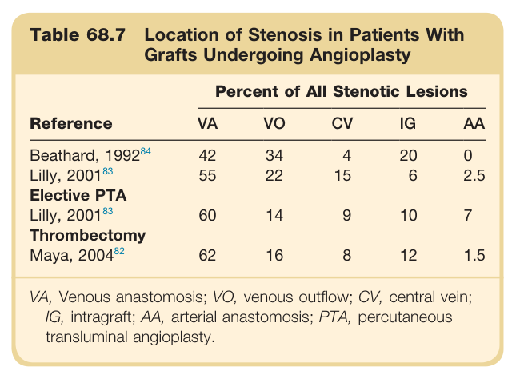

#### Table Data (CSV: [Table_68_7.csv](Table_68_7.csv))

```markdown
| Table Text (OCR) |
| :--- |
| Table 68.7 Location of Stenosis in Patients With Grafts Undergoing Angioplasty Reference  Percent of All Stenotic Lesions    VA  VO  CV  IG  AA    Beathard,  1992^{84}   42  34  4  20  0    Lilly,  2001^{83}   55  22  15  6  2.5    Elective PTA    Lilly,  2001^{83}   60  14  9  10  7    Thrombectomy    Maya,  2004^{82}   62  16  8  12  1.5 VA, Venous anastomosis; VO, venous outflow; CV, central vein; IG, intragraft; AA, arterial anastomosis; PTA, percutaneous transluminal angioplasty. |
```

Table 68.7 Location of Stenosis in Patients With Grafts Undergoing Angioplasty | | **Percent of All Stenotic Lesions** | | | | | | :----------------------------------------------------------- | :---------------------------------- | :----- | :----- | :----- | :----- | | **Reference** | **VA** | **VO** | **CV** | **IG** | **AA** | | Beathard, 1992 | 42 | 34 | 4 | 20 | 0 | | Lilly, 2001 | 55 | 22 | 15 | 6 | 2.5 | | **Elective PTA** | | | | | | | Lilly, 2001 | 60 | 14 | 9 | 10 | 7 | | **Thrombectomy** | | | | | | | Maya, 2004 | 62 | 16 | 8 | 12 | 1.5 | | *VA, Venous anastomosis; VO, venous outflow; CV, central vein; IG, intragraft; AA, arterial anastomosis; PTA, percutaneous transluminal angioplasty.* | | | | | |

---

### Table_68_8

#### Table Image

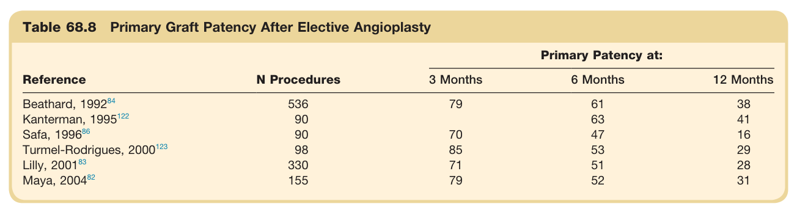

#### Table Data (CSV: [Table_68_8.csv](Table_68_8.csv))

```markdown
| Table Text (OCR) |
| :--- |
| Table 68.8 Primary Graft Patency After Elective Angioplasty Reference  N Procedures  Primary Patency at:    3 Months  6 Months  12 Months    Beathard, 199284  536  79  61  38    Kanterman, 1995122  90    63  41    Safa, 199686  90  70  47  16    Turmel-Rodrigues, 2000123  98  85  53  29    Lilly, 200183  330  71  51  28    Maya, 200482  155  79  52  31 |
```

Table 68.8 Primary Graft Patency After Elective Angioplasty | | | **Primary Patency at:** | | | | :-------------------------- | :--------------- | :---------------------- | :----------- | :------------ | | **Reference** | **N Procedures** | **3 Months** | **6 Months** | **12 Months** | | Beathard, 1992 | 536 | 79 | 61 | 38 | | Kanterman, 1995 | 90 | | 63 | 41 | | Safa, 1996 | 90 | 70 | 47 | 16 | | Turmel-Rodrigues, 2000 | 98 | 85 | 53 | 29 | | Lilly, 2001 | 330 | 71 | 51 | 28 | | Maya, 2004 | 155 | 79 | 52 | 31 |

---

### Table_68_9

#### Table Image

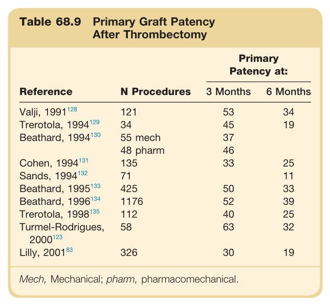

#### Table Data (CSV: [Table_68_9.csv](Table_68_9.csv))

```markdown
| Table Text (OCR) |
| :--- |
| Table 68.9 Primary Graft Patency After Thrombectomy Reference  N Procedures  Primary Patency at:    3 Months  6 Months     Valji, 1991^{128}   121  53  34    Trerotola,  1994^{129}   34  45  19     Beathard, 1994^{130}   55 mech  37      48 pharm  46      Cohen,  1994^{131}   135  33  25    Sands,  1994^{132}   71    11     Beathard, 1995^{133}   425  50  33     Beathard, 1996^{134}   1176  52  39    Trerotola,  1998^{135}   112  40  25    Turmel-Rodrigues,  2000^{123}   58  63  32    Lilly,  2001^{83}   326  30  19 Mech, Mechanical; pharm, pharmacomechanical. |
```

Table 68.9 Primary Graft Patency After Thrombectomy | | | **Primary Patency at:** | | | :--------------------------------------------- | :--------------- | :---------------------- | :----------- | | **Reference** | **N Procedures** | **3 Months** | **6 Months** | | Valji, 1991 | 121 | 53 | 34 | | Trerotola, 1994 | 34 | 45 | 19 | | Beathard, 1994 | 55 mech | 37 | | | | 48 pharm | 46 | | | Cohen, 1994 | 135 | 33 | 25 | | Sands, 1994 | 71 | | 11 | | Beathard, 1995 | 425 | 50 | 33 | | Beathard, 1996 | 1176 | 52 | 39 | | Trerotola, 1998 | 112 | 40 | 25 | | Turmel-Rodrigues, 2000 | 58 | 63 | 32 | | Lilly, 2001 | 326 | 30 | 19 | | *Mech, Mechanical; pharm, pharmacomechanical.* | | | |

---

### Table_68_10

#### Table Image

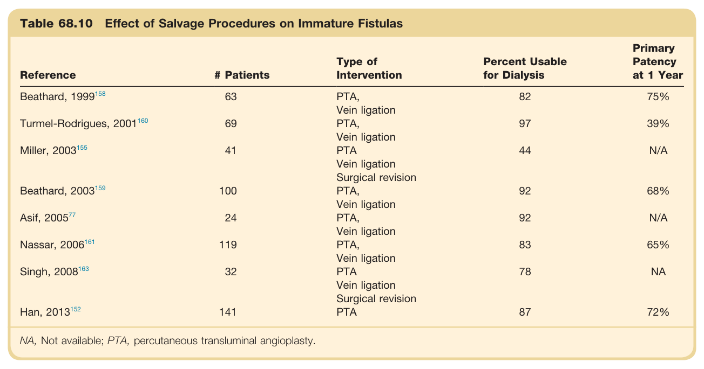

#### Table Data (CSV: [Table_68_10.csv](Table_68_10.csv))

```markdown
| Table Text (OCR) |
| :--- |
| Table 68.10 Effect of Salvage Procedures on Immature Fistulas Reference  # Patients  Type of Intervention  Percent Usable for Dialysis  Primary Patency at 1 Year    Beathard, 1999158  63  PTA, Vein ligation  82  75%    Turmel-Rodrigues, 2001160  69  PTA, Vein ligation  97  39%    Miller, 2003155  41  PTA Vein ligation  44  N/A    Surgical revision        Beathard, 2003159  100  PTA, Vein ligation  92  68%    Asif, 200577  24  PTA, Vein ligation  92  N/A    Nassar, 2006161  119  PTA, Vein ligation  83  65%    Singh, 2008163  32  PTA Vein ligation  78  NA    Surgical revision        Han, 2013152  141  PTA  87  72% NA, Not available; PTA, percutaneous transluminal angioplasty. |
```

Table 68.10 Effect of Salvage Procedures on Immature Fistulas | Reference | # Patients | Type of Intervention | Percent Usable for Dialysis | Primary Patency at 1 Year | | :----------------------------------------------------------- | :--------- | :------------------------------------ | :-------------------------- | :------------------------ | | Beathard, 1999 | 63 | PTA, Vein ligation | 82 | 75% | | Turmel-Rodrigues, 2001 | 69 | PTA, Vein ligation | 97 | 39% | | Miller, 2003 | 41 | PTA, Vein ligation, Surgical revision | 44 | N/A | | Beathard, 2003 | 100 | PTA, Vein ligation | 92 | 68% | | Asif, 2005 | 24 | PTA, Vein ligation | 92 | N/A | | Nassar, 2006 | 119 | PTA, Vein ligation | 83 | 65% | | Singh, 2008 | 32 | PTA, Vein ligation, Surgical revision | 78 | NA | | Han, 2013 | 141 | PTA | 87 | 72% | | *NA, Not available; PTA, percutaneous transluminal angioplasty.* | | | | |

---

### Table_68_11

#### Table Image

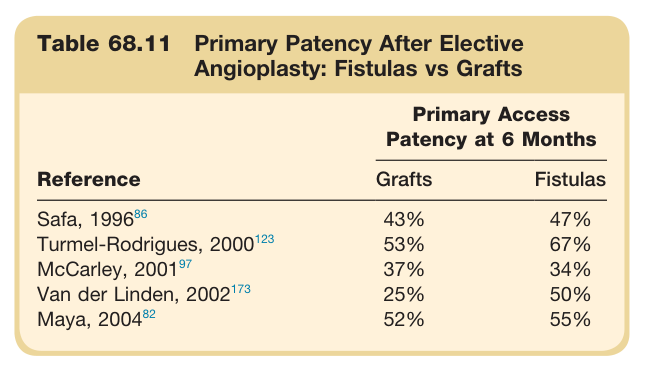

#### Table Data (CSV: [Table_68_11.csv](Table_68_11.csv))

```markdown
| Table Text (OCR) |
| :--- |
| Table 68.11 Primary Patency After Elective Angioplasty: Fistulas vs Grafts Reference  Primary Access Patency at 6 Months    Grafts  Fistulas    Safa, 199686  43%  47%    Turmel-Rodrigues, 2000123  53%  67%    McCarley, 200197  37%  34%    Van der Linden, 2002173  25%  50%    Maya, 200482  52%  55% |
```

Table 68.11 Primary Patency After Elective Angioplasty: Fistulas vs Grafts | | **Primary Access Patency at 6 Months** | | | :-------------------------- | :------------------------------------- | :----------- | | **Reference** | **Grafts** | **Fistulas** | | Safa, 1996 | 43% | 47% | | Turmel-Rodrigues, 2000 | 53% | 67% | | McCarley, 2001 | 37% | 34% | | Van der Linden, 2002 | 25% | 50% | | Maya, 2004 | 52% | 55% |

---

### Table_68_12

#### Table Image

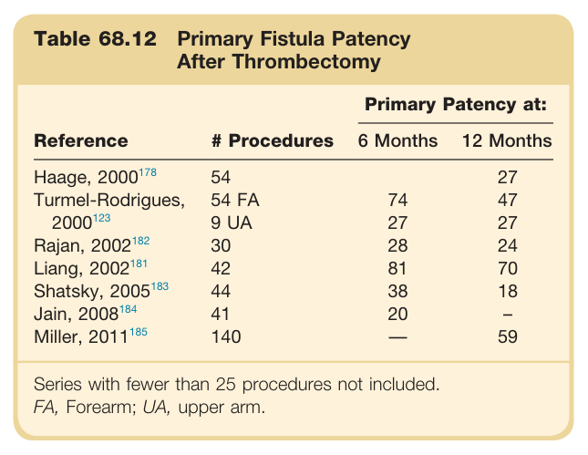

#### Table Data (CSV: [Table_68_12.csv](Table_68_12.csv))

```markdown
| Table Text (OCR) |
| :--- |
| Table 68.12 Primary Fistula Patency After Thrombectomy Reference  # Procedures  Primary Patency at:    6 Months  12 Months    Haage, 2000178  54    27    Turmel-Rodrigues, 2000123  54 FA  74  47    9 UA  27  27    Rajan, 2002182  30  28  24    Liang, 2002181  42  81  70    Shatsky, 2005183  44  38  18    Jain, 2008184  41  20  -    Miller, 2011185  140  -  59 Series with fewer than 25 procedures not included. FA, Forearm; UA, upper arm. |
```

Table 68.12 Primary Fistula Patency After Thrombectomy | | | **Primary Patency at:** | | | :--------------------------------------------------- | :--------------- | :---------------------- | :------------ | | **Reference** | **# Procedures** | **6 Months** | **12 Months** | | Haage, 2000 | 54 | | 27 | | Turmel-Rodrigues, 2000 | 54 FA | 74 | 47 | | | 9 UA | 27 | 27 | | Rajan, 2002 | 30 | 28 | 24 | | Liang, 2002 | 42 | 81 | 70 | | Shatsky, 2005 | 44 | 38 | 18 | | Jain, 2008 | 41 | 20 | | | Miller, 2011 | 140 | | 59 | | *Series with fewer than 25 procedures not included.* | | | | | *FA, Forearm; UA, upper arm.* | | | |

---

### Table_68_13

#### Table Image

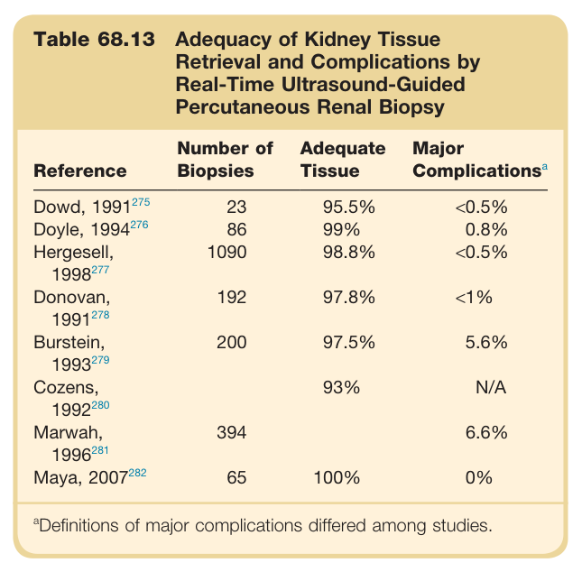

#### Table Data (CSV: [Table_68_13.csv](Table_68_13.csv))

```markdown
| Table Text (OCR) |
| :--- |
| Table 68.13 Adequacy of Kidney Tissue Retrieval and Complications by Real-Time Ultrasound-Guided Percutaneous Renal Biopsy Reference  Number of Biopsies  Adequate Tissue  Major Complicationsa    Dowd, 1991275  23  95.5%  <0.5%    Doyle, 1994276  86  99%  0.8%    Hergesell, 1998277  1090  98.8%  <0.5%    Donovan, 1991278  192  97.8%  <1%    Burstein, 1993279  200  97.5%  5.6%    Cozens, 1992280    93%  N/A    Marwah, 1996281  394    6.6%    Maya, 2007282  65  100%  0% <sup>a</sup>Definitions of major complications differed among studies. |
```

Table 68.13 Adequacy of Kidney Tissue Retrieval and Complications by Real-Time Ultrasound-Guided Percutaneous Renal Biopsy | Reference | Number of Biopsies | Adequate Tissue | Major Complicationsa | | :----------------------------------------------------------- | :----------------- | :-------------- | :------------------- | | Dowd, 1991 | 23 | 95.5% | <0.5% | | Doyle, 1994 | 86 | 99% | 0.8% | | Hergesell, 1998 | 1090 | 98.8% | <0.5% | | Donovan, 1991 | 192 | 97.8% | <1% | | Burstein, 1993 | 200 | 97.5% | 5.6% | | Cozens, 1992 | | 93% | N/A | | Marwah, 1996 | 394 | | 6.6% | | Maya, 2007 | 65 | 100% | 0% | | *aDefinitions of major complications differed among studies.* | | | |

---
