# 70. Clinical Management of the Adult Kidney Transplant Recipient - Figures and Tables Index

This document lists all figures and tables extracted from `70. Clinical Management of the Adult Kidney Transplant Recipient.pdf`.

## Table of Contents
- [Figures](#figures)
- [Tables](#tables)

---

## Figures

### Fig_70_1

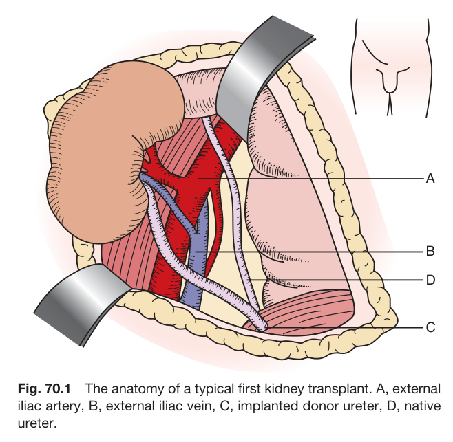

Fig. 70.1 The anatomy of a typical first kidney transplant. A, external iliac artery, B, external iliac vein, C, implanted donor ureter, D, native ureter.

---

### Fig_70_2

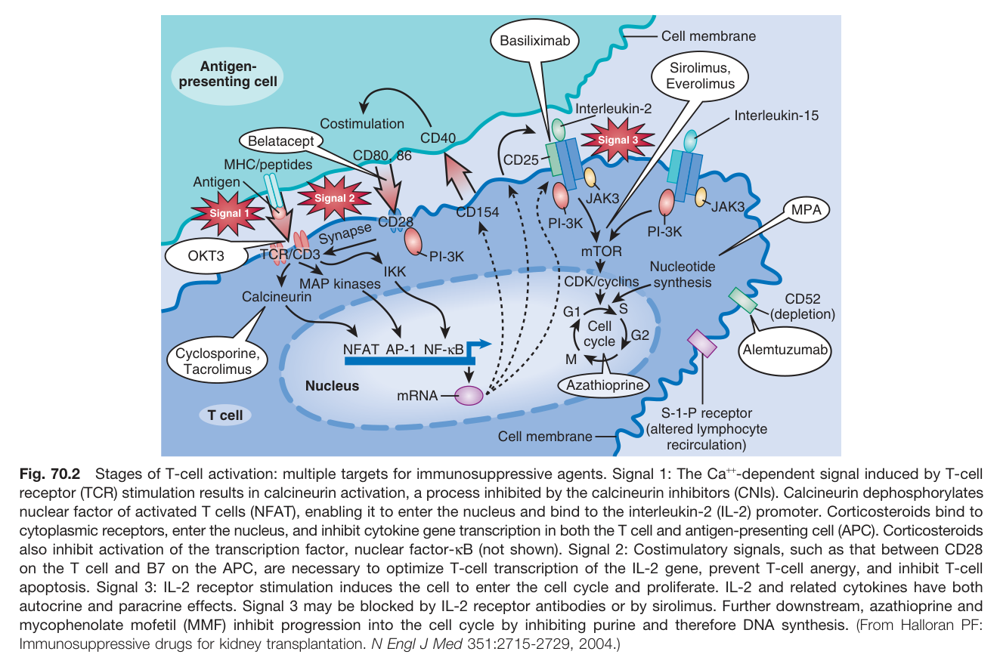

Fig. 70.2 Stages of T-cell activation: multiple targets for immunosuppressive agents. Signal 1: The Ca²⁺-dependent signal induced by T-cell receptor (TCR) stimulation results in calcineurin activation, a process inhibited by the calcineurin inhibitors (CNIs). Calcineurin dephosphorylates nuclear factor of activated T cells (NFAT), enabling it to enter the nucleus and bind to the interleukin-2 (IL-2) promoter. Corticosteroids bind to cytoplasmic receptors and the nuclear receptor-steroid complex binds to glucocorticoid response elements present in the promoter of many genes. Corticosteroids also inhibit activation of the transcription factor, nuclear factor-κB (not shown). Signal 2: Costimulatory signals, such as that between CD28 on the T cell and B7 on the APC, are necessary to optimize T-cell transcription of the IL-2 gene, prevent T-cell anergy, and inhibit T-cell apoptosis. Signal 3: IL-2 receptor stimulation induces the T cell to enter the cell cycle and proliferate. IL-2 and related cytokines have both autocrine and paracrine effects. Signal 3 may be blocked by IL-2 receptor antibodies or by sirolimus. Further downstream, Azathioprine and mycophenolate mofetil (MMF) inhibit progression into the cell cycle by inhibiting purine and therefore DNA synthesis. (From Halloran PF: Immunosuppressive drugs for kidney transplantation. N Engl J Med 351:2715-2729, 2004.)

---

### Fig_70_3

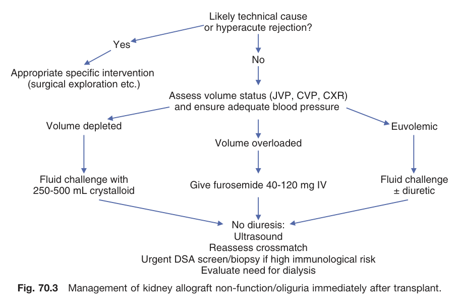

Fig. 70.3 Management of kidney allograft non-function/oliguria immediately after transplant. A flowchart showing the decision process for a non-functioning or oliguric kidney allograft. It starts with assessing for likely technical causes or hyperacute rejection. If yes, appropriate specific intervention is needed. If no, assess volume status. If volume depleted, give a fluid challenge. If volume overloaded, give furosemide. If euvolemic, give a fluid challenge with a diuretic. If there is still no diuresis, perform an ultrasound, reassess crossmatch, and consider an urgent DSA screen/biopsy if high immunological risk, and evaluate the need for dialysis.

---

### Fig_70_4

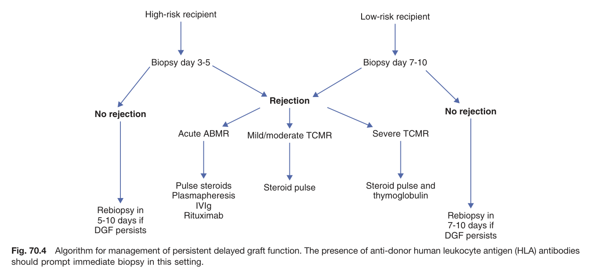

Fig. 70.4 Algorithm for management of persistent delayed graft function. A flowchart showing management of persistent DGF. It splits based on high-risk vs low-risk recipients. High-risk recipients get a biopsy at day 3-5. Low-risk recipients get a biopsy at day 7-10. If there is no rejection, a re-biopsy is done in 7-10 days if DGF persists. If there is rejection, the path splits into Acute ABMR, Mild/moderate TCMR, and Severe TCMR. ABMR is treated with Pulse steroids, Plasmapheresis, IVIg, Rituximab. Mild/moderate TCMR is treated with a steroid pulse. Severe TCMR is treated with a steroid pulse and thymoglobulin. The presence of anti-donor human leukocyte antigen (HLA) antibodies should prompt immediate biopsy in this setting.

---

### Fig_70_5

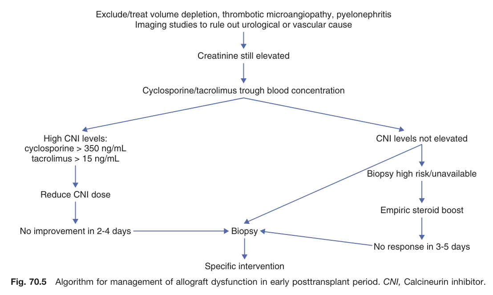

Fig. 70.5 Algorithm for management of allograft dysfunction in early posttransplant period. A flowchart for managing elevated creatinine. First, exclude/treat volume depletion, TMA, and pyelonephritis, and use imaging to rule out urological/vascular causes. Then, check cyclosporine/tacrolimus trough blood concentration. If CNI levels are high, reduce the dose and re-evaluate in 2-4 days. If no improvement, proceed to biopsy. If CNI levels are not elevated, proceed to biopsy. If biopsy is high risk/unavailable, an empiric steroid boost can be given. If there's no response in 3-5 days, a biopsy is recommended. The biopsy leads to specific intervention. CNI, Calcineurin inhibitor.

---

### Fig_70_6

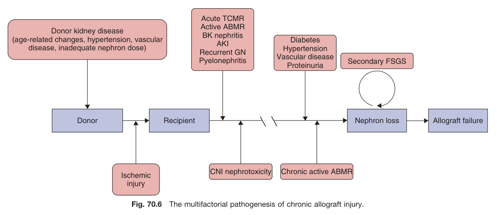

Fig. 70.6 The multifactorial pathogenesis of chronic allograft injury. A diagram illustrates factors leading to allograft failure. Donor kidney disease and ischemic injury affect the donor kidney. The recipient contributes factors like diabetes, hypertension, and vascular disease. After transplant, CNI nephrotoxicity and chronic active ABMR contribute to nephron loss, along with events like acute TCMR, active ABMR, BK nephritis, and recurrent GN. All these factors converge on nephron loss, ultimately causing allograft failure.

---

### Fig_70_7

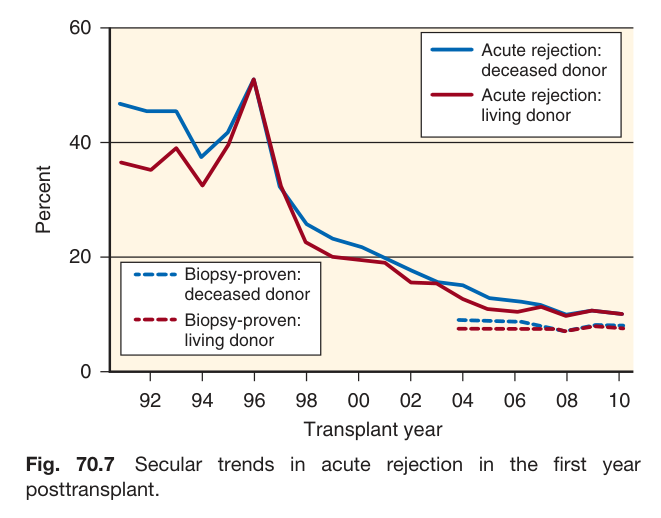

Fig. 70.7 Secular trends in acute rejection in the first year posttransplant. A line graph showing a steep decline in acute rejection rates from 1992 to around 2002, followed by a plateau at a low rate until 2010 for both deceased and living donor transplants.

---

### Fig_70_8

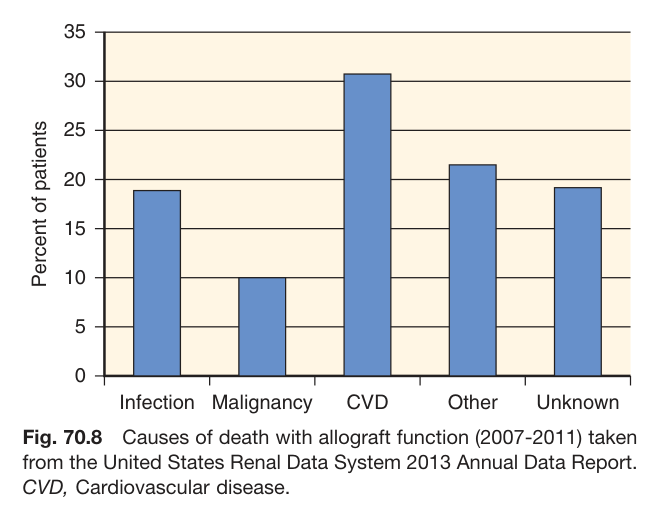

Fig. 70.8 Causes of death with allograft function (2007-2011) taken from the United States Renal Data System 2013 Annual Data Report. A bar chart showing that infection, malignancy, and cardiovascular disease (CVD) are major causes of death, with other and unknown causes also contributing.

---

## Tables

### Table_70_1

#### Table Image

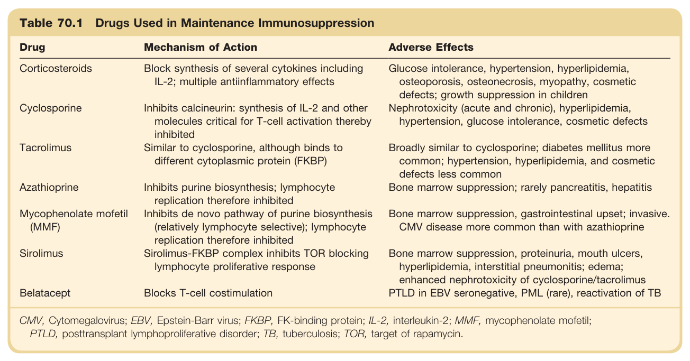

#### Table Data (CSV: [Table_70_1.csv](Table_70_1.csv))

```markdown
| Table Text (OCR) |
| :--- |
| Table 70.1 Drugs Used in Maintenance Immunosuppression Drug  Mechanism of Action  Adverse Effects    Corticosteroids  Block synthesis of several cytokines including IL-2; multiple antiinflammatory effects  Glucose intolerance, hypertension, hyperlipidemia, osteoporosis, osteonecrosis, myopathy, cosmetic defects; growth suppression in children    Cyclosporine  Inhibits calcineurin: synthesis of IL-2 and other molecules critical for T-cell activation thereby inhibited  Nephrotoxicity (acute and chronic), hyperlipidemia, hypertension, glucose intolerance, cosmetic defects    Tacrolimus  Similar to cyclosporine, although binds to different cytoplasmic protein (FKBP)  Broadly similar to cyclosporine; diabetes mellitus more common; hypertension, hyperlipidemia, and cosmetic defects less common    Azathioprine  Inhibits purine biosynthesis; lymphocyte replication therefore inhibited  Bone marrow suppression; rarely pancreatitis, hepatitis    Mycophenolate mofetil (MMF)  Inhibits de novo pathway of purine biosynthesis (relatively lymphocyte selective); lymphocyte replication therefore inhibited  Bone marrow suppression, gastrointestinal upset; invasive. CMV disease more common than with azathioprine    Sirolimus  Sirolimus-FKBP complex inhibits TOR blocking lymphocyte proliferative response  Bone marrow suppression, proteinuria, mouth ulcers, hyperlipidemia, interstitial pneumonitis; edema; enhanced nephrotoxicity of cyclosporine/tacrolimus    Belatacept  Blocks T-cell costimulation  PTLD in EBV seronegative, PML (rare), reactivation of TB CMV, Cytomegalovirus; EBV, Epstein-Barr virus; FKBP, FK-binding protein; IL-2, interleukin-2; MMF, mycophenolate mofetil; PTLD, posttransplant lymphoproliferative disorder; TB, tuberculosis; TOR, target of rapamycin. |
```

Table 70.1 Drugs Used in Maintenance Immunosuppression | Drug | Mechanism of Action | Adverse Effects | | :----------------------------------------------------------- | :----------------------------------------------------------- | :----------------------------------------------------------- | | **Corticosteroids** | Block synthesis of several cytokines including IL-2; multiple antiinflammatory effects | Glucose intolerance, hypertension, hyperlipidemia, osteoporosis, osteonecrosis, myopathy, cosmetic defects; growth suppression in children | | **Cyclosporine** | Inhibits calcineurin: synthesis of IL-2 and other molecules critical for T-cell activation thereby inhibited | Nephrotoxicity (acute and chronic), hyperlipidemia, hypertension, glucose intolerance, cosmetic defects | | **Tacrolimus** | Similar to cyclosporine, although binds to different cytoplasmic protein (FKBP) | Broadly similar to cyclosporine; diabetes mellitus more common; hypertension, hyperlipidemia, and cosmetic defects less common | | **Azathioprine** | Inhibits purine biosynthesis; lymphocyte replication therefore inhibited | Bone marrow suppression; rarely pancreatitis, hepatitis | | **Mycophenolate mofetil (MMF)** | Inhibits de novo pathway of purine biosynthesis (relatively lymphocyte selective); lymphocyte replication therefore inhibited | Bone marrow suppression, gastrointestinal upset; invasive. CMV disease more common than with azathioprine | | **Sirolimus** | Sirolimus-FKBP complex inhibits TOR blocking lymphocyte proliferative response | Bone marrow suppression, proteinuria, mouth ulcers, hyperlipidemia, interstitial pneumonitis; edema; enhanced nephrotoxicity of cyclosporine/tacrolimus | | **Belatacept** | Blocks T-cell costimulation | PTLD in EBV seronegative, PML (rare), reactivation of TB | | *CMV, Cytomegalovirus; EBV, Epstein-Barr virus; FKBP, FK-binding protein; IL-2, interleukin-2; MMF, mycophenolate mofetil; PTLD, posttransplant lymphoproliferative disorder; TB, tuberculosis; TOR, target of rapamycin.* | | |

---

### Table_70_2

#### Table Image

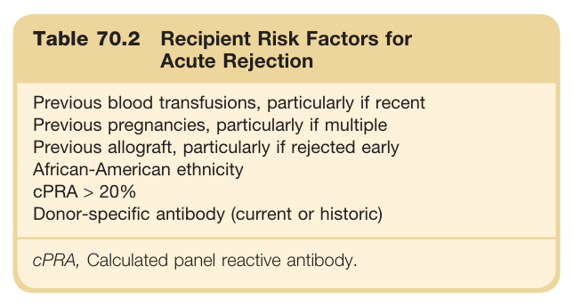

#### Table Data (CSV: [Table_70_2.csv](Table_70_2.csv))

```markdown
| Table Text (OCR) |
| :--- |
| Table 70.2 Recipient Risk Factors for Acute Rejection Previous blood transfusions, particularly if recent Previous pregnancies, particularly if multiple Previous allograft, particularly if rejected early African-American ethnicity cPRA > 20% Donor-specific antibody (current or historic) cPRA, Calculated panel reactive antibody. |
```

Table 70.2 Recipient Risk Factors for Acute Rejection * Previous blood transfusions, particularly if recent * Previous pregnancies, particularly if multiple * Previous allograft, particularly if rejected early * African-American ethnicity * CPRA > 20% * Donor-specific antibody (current or historic) *CPRA, Calculated panel reactive antibody.*

---

### Table_70_3

#### Table Image

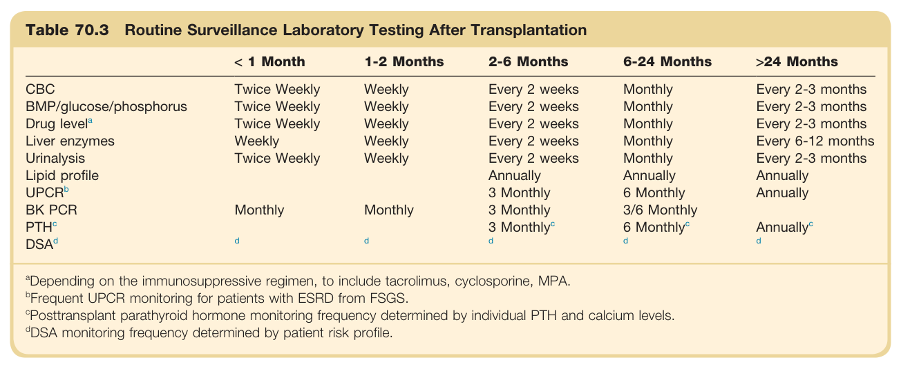

#### Table Data (CSV: [Table_70_3.csv](Table_70_3.csv))

```markdown
| Table Text (OCR) |
| :--- |
| Table 70.3 Routine Surveillance Laboratory Testing After Transplantation < 1 Month  1-2 Months  2-6 Months  6-24 Months  >24 Months    CBC  Twice Weekly  Weekly  Every 2 weeks  Monthly  Every 2-3 months    BMP/glucose/phosphorus  Twice Weekly  Weekly  Every 2 weeks  Monthly  Every 2-3 months    Drug level ^{a}   Twice Weekly  Weekly  Every 2 weeks  Monthly  Every 2-3 months    Liver enzymes  Weekly  Weekly  Every 2 weeks  Monthly  Every 6-12 months    Urinalysis  Twice Weekly  Weekly  Every 2 weeks  Monthly  Every 2-3 months    Lipid profile      Annually  Annually  Annually    UPCR ^{b}       3 Monthly  6 Monthly  Annually    BK PCR  Monthly  Monthly  3 Monthly  3/6 Monthly      PTH ^{c}       3 Monthly ^{c}   6 Monthly ^{c}   Annually ^{c}     DSA ^{d}   d  d  d  d  d <sup>a</sup>Depending on the immunosuppressive regimen, to include tacrolimus, cyclosporine, MPA. <sup>b</sup>Frequent UPCR monitoring for patients with ESRD from FSGS. <sup>c</sup>Posttransplant parathyroid hormone monitoring frequency determined by individual PTH and calcium levels. <sup>d</sup>DSA monitoring frequency determined by patient risk profile. |
```

Table 70.3 Routine Surveillance Laboratory Testing After Transplantation | | < 1 Month | 1-2 Months | 2-6 Months | 6-24 Months | >24 Months | | :----------------------------------------------------------- | :----------- | :--------- | :------------ | :---------- | :---------------- | | **CBC** | Twice Weekly | Weekly | Every 2 weeks | Monthly | Every 2-3 months | | **BMP/glucose/phosphorus** | Twice Weekly | Weekly | Every 2 weeks | Monthly | Every 2-3 months | | **Drug levelª** | Twice Weekly | Weekly | Every 2 weeks | Monthly | Every 2-3 months | | **Liver enzymes** | Weekly | Weekly | Every 2 weeks | Monthly | Every 6-12 months | | **Urinalysis** | Twice Weekly | Weekly | Every 2 weeks | Monthly | Every 2-3 months | | **Lipid profile** | | | Annually | Annually | Annually | | **UPCRᵇ** | | Monthly | 3 Monthly | 6 Monthly | Annually | | **BK PCR** | | Monthly | 3 Monthly | 3/6 Monthly | Annually | | **PTHᶜ** | | d | 3 Monthly | 6 Monthly | d | | **DSAᵈ** | d | d | d | d | d | | *ªDepending on the immunosuppressive regimen, to include tacrolimus, cyclosporine, MPA.* | | | | | | | *ᵇFrequent UPCR monitoring for patients with ESRD from FSGS.* | | | | | | | *ᶜPosttransplant parathyroid hormone monitoring frequency determined by individual PTH and calcium levels.* | | | | | | | *ᵈDSA monitoring frequency determined by patient risk profile.* | | | | | |

---

### Table_70_4

#### Table Image

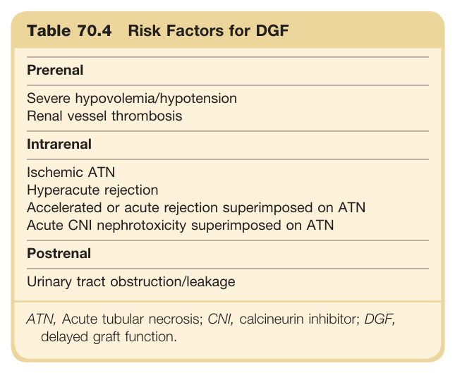

#### Table Data (CSV: [Table_70_4.csv](Table_70_4.csv))

```markdown
| Table Text (OCR) |
| :--- |
| Table 70.4 Risk Factors for DGF Prerenal    Severe hypovolemia/hypotensionRenal vessel thrombosis    Intrarenal    Ischemic ATNHyperacute rejectionAccelerated or acute rejection superimposed on ATNAcute CNI nephrotoxicity superimposed on ATN    Postrenal    Urinary tract obstruction/leakage    ATN, Acute tubular necrosis; CNI, calcineurin inhibitor; DGF, delayed graft function. |
```

Table 70.4 Risk Factors for DGF **Prerenal** * Severe hypovolemia/hypotension * Renal vessel thrombosis **Intrarenal** * Ischemic ATN * Hyperacute rejection * Accelerated or acute rejection superimposed on ATN * Acute CNI nephrotoxicity superimposed on ATN **Postrenal** * Urinary tract obstruction/leakage *ATN, Acute tubular necrosis; CNI, calcineurin inhibitor; DGF, delayed graft function.*

---

### Table_70_5

#### Table Image

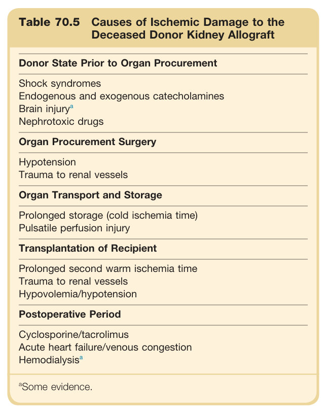

#### Table Data (CSV: [Table_70_5.csv](Table_70_5.csv))

```markdown
| Table Text (OCR) |
| :--- |
| Table 70.5 Causes of Ischemic Damage to the Deceased Donor Kidney Allograft Donor State Prior to Organ Procurement Shock syndromes    Endogenous and exogenous catecholamines    Brain injurya    Nephrotoxic drugs |
```

Table 70.5 Causes of Ischemic Damage to the Deceased Donor Kidney Allograft **Donor State Prior to Organ Procurement** * Shock syndromes * Endogenous and exogenous catecholamines * Brain injuryª * Nephrotoxic drugs **Organ Procurement Surgery** * Hypotension * Trauma to renal vessels **Organ Transport and Storage** * Prolonged storage (cold ischemia time) * Pulsatile perfusion injury **Transplantation of Recipient** * Prolonged second warm ischemia time * Trauma to renal vessels * Hypovolemia/hypotension **Postoperative Period** * Cyclosporine/tacrolimus * Acute heart failure/venous congestion * Hemodialysisª *ªSome evidence.*

---

### Table_70_6

#### Table Image

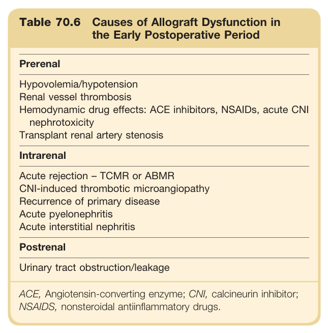

#### Table Data (CSV: [Table_70_6.csv](Table_70_6.csv))

```markdown
| Table Text (OCR) |
| :--- |
| Table 70.6 Causes of Allograft Dysfunction in the Early Postoperative Period Prerenal    Hypovolemia/hypotension    Renal vessel thrombosis    Hemodynamic drug effects: ACE inhibitors, NSAIDs, acute CNI nephrotoxicity    Transplant renal artery stenosis    Intrarenal    Acute rejection – TCMR or ABMR    CNI-induced thrombotic microangiopathy    Recurrence of primary disease    Acute pyelonephritis    Acute interstitial nephritis |
```

Table 70.6 Causes of Allograft Dysfunction in the Early Postoperative Period **Prerenal** * Hypovolemia/hypotension * Renal vessel thrombosis * Hemodynamic drug effects: ACE inhibitors, NSAIDs, acute CNI nephrotoxicity * Transplant renal artery stenosis **Intrarenal** * Acute rejection - TCMR or ABMR * CNI-induced thrombotic microangiopathy * Recurrence of primary disease * Acute pyelonephritis * Acute interstitial nephritis **Postrenal** * Urinary tract obstruction/leakage *ACE, Angiotensin-converting enzyme; CNI, calcineurin inhibitor; NSAIDS, nonsteroidal antiinflammatory drugs.*

---

### Table_70_7

#### Table Image

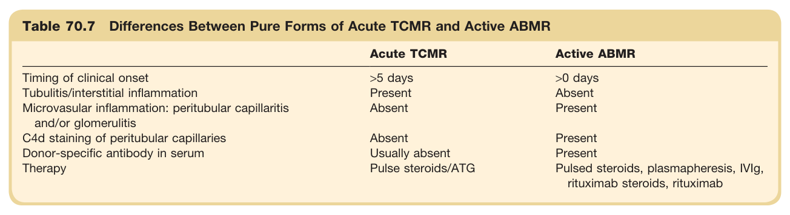

#### Table Data (CSV: [Table_70_7.csv](Table_70_7.csv))

```markdown
| Table Text (OCR) |
| :--- |
| Table 70.7 Differences Between Pure Forms of Acute TCMR and Active ABMR Acute TCMR  Active ABMR    Timing of clinical onset  >5 days  >0 days    Tubulitis/interstitial inflammation  Present  Absent    Microvasular inflammation: peritubular capillaritis and/or glomerulitis  Absent  Present    C4d staining of peritubular capillaries  Absent  Present    Donor-specific antibody in serum  Usually absent  Present    Therapy  Pulse steroids/ATG  Pulsed steroids, plasmapheresis, IVIg, rituximab steroids, rituximab |
```

Table 70.7 Differences Between Pure Forms of Acute TCMR and Active ABMR | | Acute TCMR | Active ABMR | | :----------------------------------------------------------- | :----------------- | :----------------------------------------------------------- | | **Timing of clinical onset** | >5 days | >0 days | | **Tubulitis/interstitial inflammation** | Present | Absent | | **Microvascular inflammation: peritubular capillaritis and/or glomerulitis** | Absent | Present | | **C4d staining of peritubular capillaries** | Absent | Present | | **Donor-specific antibody in serum** | Usually absent | Present | | **Therapy** | Pulse steroids/ATG | Pulse steroids, plasmapheresis, IVIg, rituximab steroids, rituximab |

---

### Table_70_8

#### Table Images (2 Parts)

- **Part 1 (Page 19)**:
  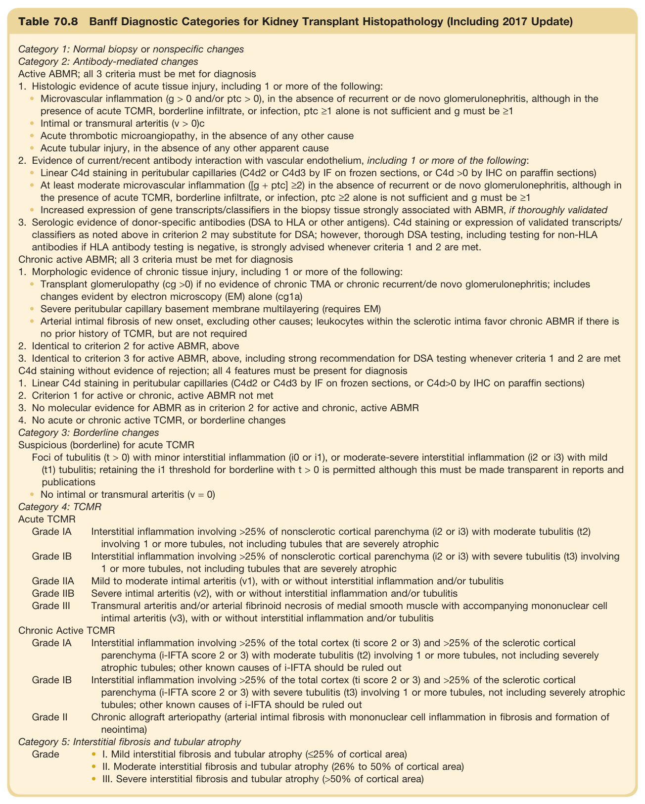

- **Part 2 (Page 20)**:
  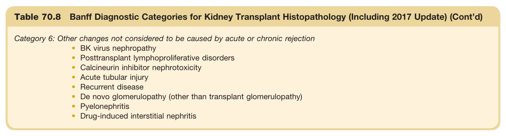

#### Table Data (CSV: [Table_70_8.csv](Table_70_8.csv))

```markdown
| Table Text (OCR) |
| :--- |
| Table 70.8 Banff Diagnostic Categories for Kidney Transplant Histopathology (Including 2017 Update) Category 1: Normal biopsy or nonspecific changes Category 2: Antibody-mediated changes Active ABMR; all 3 criteria must be met for diagnosis 1. Histologic evidence of acute tissue injury, including 1 or more of the following: • Microvascular inflammation (g > 0 and/or ptc > 0), in the absence of recurrent or de novo glomerulonephritis, although in the presence of acute TCMR, borderline infiltrate, or infection, ptc ≥1 alone is not sufficient and g must be ≥1 • Intimal or transmural arteritis (v > 0)c • Acute thrombotic microangiopathy, in the absence of any other cause • Acute tubular injury, in the absence of any other apparent cause 2. Evidence of current/recent antibody interaction with vascular endothelium, including 1 or more of the following: • Linear C4d staining in peritubular capillaries (C4d2 or C4d3 by IF on frozen sections, or C4d >0 by IHC on paraffin sections) • At least moderate microvascular inflammation ([g + ptc] ≥2) in the absence of recurrent or de novo glomerulonephritis, although in the presence of acute TCMR, borderline infiltrate, or infection, ptc ≥2 alone is not sufficient and g must be ≥1 • Increased expression of gene transcripts/classifiers in the biopsy tissue strongly associated with ABMR, if thoroughly validated 3. Serologic evidence of donor-specific antibodies (DSA to HLA or other antigens). C4d staining or expression of validated transcripts/ classifiers as noted above in criterion 2 may substitute for DSA; however, thorough DSA testing, including testing for non-HLA antibodies if HLA antibody testing is negative, is strongly advised whenever criteria 1 and 2 are met. Chronic active ABMR; all 3 criteria must be met for diagnosis 1. Morphologic evidence of chronic tissue injury, including 1 or more of the following: • Transplant glomerulopathy (cg >0) if no evidence of chronic TMA or chronic recurrent/de novo glomerulonephritis; includes changes evident by electron microscopy (EM) alone (cg1a) • Severe peritubular capillary basement membrane multilayering (requires EM) Arterial intimal fibrosis of new onset, excluding other causes; leukocytes within the sclerotic intima favor chronic ABMR if there is no prior history of TCMR, but are not required 2. Identical to criterion 2 for active ABMR, above 3. Identical to criterion 3 for active ABMR, above, including strong recommendation for DSA testing whenever criteria 1 and 2 are met C4d staining without evidence of rejection; all 4 features must be present for diagnosis 1. Linear C4d staining in peritubular capillaries (C4d2 or C4d3 by IF on frozen sections, or C4d>0 by IHC on paraffin sections) 2. Criterion 1 for active or chronic, active ABMR not met 3. No molecular evidence for ABMR as in criterion 2 for active and chronic, active ABMR 4. No acute or chronic active TCMR, or borderline changes Category 3: Borderline changes Suspicious (borderline) for acute TCMR Foci of tubulitis (t > 0) with minor interstitial inflammation (i0 or i1), or moderate-severe interstitial inflammation (i2 or i3) with mild (t1) tubulitis; retaining the i1 threshold for borderline with t > 0 is permitted although this must be made transparent in reports and publications • No intimal or transmural arteritis (v = 0) Category 4: TCMR Acute TCMR Grade IA Interstitial inflammation involving >25% of nonsclerotic cortical parenchyma (i2 or i3) with moderate tubulitis (t2) involving 1 or more tubules, not including tubules that are severely atrophic Grade IB Interstitial inflammation involving >25% of nonsclerotic cortical parenchyma (i2 or i3) with severe tubulitis (t3) involving 1 or more tubules, not including tubules that are severely atrophic Grade IIA Mild to moderate intimal arteritis (v1), with or without interstitial inflammation and/or tubulitis Grade IIB Severe intimal arteritis (v2), with or without interstitial inflammation and/or tubulitis Grade III Transmural arteritis and/or arterial fibrinoid necrosis of medial smooth muscle with accompanying mononuclear cel intimal arteritis (v3), with or without interstitial inflammation and/or tubulitis Chronic Active TCMR Grade IA Interstitial inflammation involving >25% of the total cortex (ti score 2 or 3) and >25% of the sclerotic cortical parenchyma (i-IFTA score 2 or 3) with moderate tubulitis (t2) involving 1 or more tubules, not including severely atrophic tubules; other known causes of i-IFTA should be ruled out Grade IB Interstitial inflammation involving >25% of the total cortex (ti score 2 or 3) and >25% of the sclerotic cortical parenchyma (i-IFTA score 2 or 3) with severe tubulitis (t3) involving 1 or more tubules, not including severely atrophic tubules; other known causes of i-IFTA should be ruled out Grade II Chronic allograft arteriopathy (arterial intimal fibrosis with mononuclear cell inflammation in fibrosis and formation of neointima) Category 5: Interstitial fibrosis and tubular atrophy Grade • I. Mild interstitial fibrosis and tubular atrophy (≤25% of cortical area) • II. Moderate interstitial fibrosis and tubular atrophy (26% to 50% of cortical area) • III. Severe interstitial fibrosis and tubular atrophy (>50% of cortical area) |
```

Table 70.8 Banff Diagnostic Categories for Kidney Transplant Histopathology (Including 2017 Update) **Category 1: Normal biopsy or nonspecific changes** **Category 2: Antibody-mediated changes (active or chronic)** * Active ABMR: all 3 criteria must be met for diagnosis 1. Histologic evidence of acute tissue injury, including 1 or more of the following: * Microvascular inflammation (g > 0 and/or ptc > 0), in the absence of recurrent or de novo glomerulonephritis, although in the presence of acute TCMR, borderline infiltrate, or infection, ptc ≥1 alone is not sufficient and g must be ≥1 * Intimal or transmural arteritis (v > 0) * Acute thrombotic microangiopathy, in the absence of any other cause * Acute tubular injury, in the absence of any other apparent cause 2. Evidence of current/recent antibody interaction with vascular endothelium, including 1 or more of the following: * Linear C4d staining in peritubular capillaries (C4d2 or C4d3 by IF on frozen sections, or C4d > 0 by IHC on paraffin sections) * At least moderate microvascular inflammation ([g + ptc] ≥2) in the absence of recurrent or de novo glomerulonephritis, although in the presence of acute TCMR, borderline infiltrate, or infection, ptc ≥2 alone is not sufficient and g must be ≥1 3. Serologic evidence of donor-specific antibodies (DSA to HLA or other antigens) * Chronic active ABMR: all 3 criteria must be met for diagnosis 1. Morphologic evidence of chronic tissue injury, including 1 or more of the following: * Transplant glomerulopathy (cg > 0) if no evidence of chronic TMA or chronic recurrent/de novo glomerulonephritis; includes changes evident by electron microscopy (EM) alone (cg1a) * Severe peritubular capillary basement membrane multilayering (requires EM) * Arterial intimal fibrosis of new onset, excluding other causes; leukocytes within the sclerotic intima favor chronic ABMR if there is no prior history of TCMR, but are not required 2. Evidence of current/recent antibody interaction 3. Identical to criterion 2 for active ABMR * C4d staining without evidence of rejection: all 4 features must be present for diagnosis 1. Linear C4d staining in peritubular capillaries 2. Criterion 1 for active or chronic, active ABMR not met 3. No molecular evidence for rejection 4. No acute or chronic TCMR, borderline changes **Category 3: Suspicious (borderline) for acute TCMR** * Foci of tubulitis (t > 0) with minor interstitial inflammation (i0 or i1), or moderate-severe interstitial inflammation (i2 or i3) with mild (t1) tubulitis; retaining the t1 threshold for borderline with t > 0 is permitted although this must be made transparent in reports and publications. * No intimal or transmural arteritis (v = 0) **Category 4: TCMR** * Acute TCMR * Grade IA: Interstitial inflammation involving >25% of nonscelerotic cortical parenchyma (i2 or i3) with moderate tubulitis (t2) * Grade IB: Interstitial inflammation involving >25% of nonscelerotic cortical parenchyma (i2 or i3) with severe tubulitis (t3) involving 1 or more tubules, not including tubules that are severely atrophic * Chronic Active TCMR * Grade IA: Interstitial inflammation involving >25% of the total cortex (ti score 2 or 3) and >25% of the sclerotic cortical parenchyma (i-IFTA score 2 or 3) with moderate tubulitis (t2) involving 1 or more tubules, not including severely atrophic tubules; other known causes of i-IFTA and t should be ruled out. * Grade IB: Interstitial inflammation involving >25% of the total cortex (ti score 2 or 3) and >25% of the sclerotic cortical parenchyma (i-IFTA score 2 or 3) with severe tubulitis (t3) involving 1 or more tubules, not including severely atrophic tubules; other known causes of i-IFTA and t should be ruled out. * Grade II: Chronic allograft arteriopathy (arterial intimal fibrosis with mononuclear cell inflammation in fibrosis and formation of a neointima). **Category 5: Interstitial fibrosis and tubular atrophy** * Grade I: Mild interstitial fibrosis and tubular atrophy (<25% of cortical area) * Grade II: Moderate interstitial fibrosis and tubular atrophy (26% to 50% of cortical area) * Grade III: Severe interstitial fibrosis and tubular atrophy (>50% of cortical area) **Category 6: Other changes not considered to be caused by acute or chronic rejection** * BK virus nephropathy * Posttransplant lymphoproliferative disorders * Calcineurin inhibitor nephrotoxicity * Acute tubular injury * Recurrent disease * De novo glomerulopathy (other than transplant glomerulopathy) * Pyelonephritis * Drug-induced interstitial nephritis

---

### Table_70_9

#### Table Image

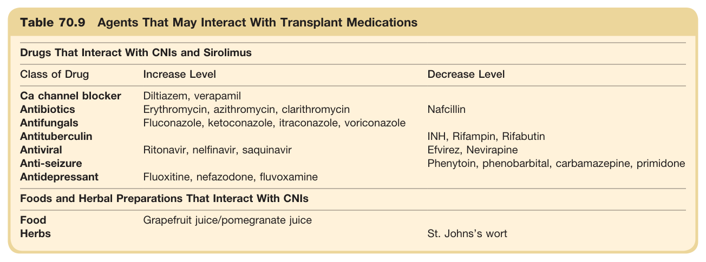

#### Table Data (CSV: [Table_70_9.csv](Table_70_9.csv))

```markdown
| Table Text (OCR) |
| :--- |
| Table 70.9 Agents That May Interact With Transplant Medications Drugs That Interact With CNIs and Sirolimus    Class of Drug  Increase Level  Decrease Level    Ca channel blocker  Diltiazem, verapamil      Antibiotics  Erythromycin, azithromycin, clarithromycin  Nafcillin    Antifungals  Fluconazole, ketoconazole, itraconazole, voriconazole      Antituberculin    INH, Rifampin, Rifabutin    Antiviral  Ritonavir, nelfinavir, saquinavir  Efvirez, Nevirapine    Anti-seizure    Phenytoin, phenobarbital, carbamazepine, primidone    Antidepressant  Fluoxetine, nefazodone, fluvoxamine      Foods and Herbal Preparations That Interact With CNIs    Food  Grapefruit juice/pomegranate juice      Herbs    St. Johns's wort |
```

Table 70.9 Agents That May Interact With Transplant Medications | Class of Drug | Increase Level | Decrease Level | | :-------------------------------------------------------- | :----------------------------------------- | :------------------------------------------------- | | **Drugs That Interact with CNIs and Sirolimus** | | | | Ca channel blocker | Diltiazem, verapamil | | | Antibiotics | Erythromycin, azithromycin, clarithromycin | Nafcillin | | Antifungals | Fluconazole, itraconazole, voriconazole | | | Anti-TB | | INH, Rifampin, Rifabutin | | Antiseizure | | Elvirez, Neurapine | | Antiviral | Ritonavir, nelfinavir, saquinavir | Phenytoin, phenobarbital, carbamazepine, primidone | | Antidepressant | Fluoxetine, nefazodone, fluvoxamine | | | **Foods and Herbal Preparations That Interact With CNIs** | | | | Food | Grapefruit juice/pomegranate juice | | | Herbals | | St. John's wort |

---

### Table_70_10

#### Table Image

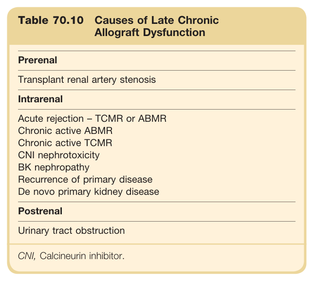

#### Table Data (CSV: [Table_70_10.csv](Table_70_10.csv))

```markdown
| Table Text (OCR) |
| :--- |
| Table 70.10 Causes of Late Chronic Allograft Dysfunction **Prerenal** * Transplant renal artery stenosis **Intrarenal** * Acute rejection - TCMR or ABMR * Chronic active ABMR * Chronic active TCMR * CNI nephrotoxicity * BK nephropathy * Recurrence of primary disease * De novo primary kidney disease **Postrenal** * Urinary tract obstruction *CNI, Calcineurin inhibitor.* |
```

Table 70.10 Causes of Late Chronic Allograft Dysfunction **Prerenal** * Transplant renal artery stenosis **Intrarenal** * Acute rejection - TCMR or ABMR * Chronic active ABMR * Chronic active TCMR * CNI nephrotoxicity * BK nephropathy * Recurrence of primary disease * De novo primary kidney disease **Postrenal** * Urinary tract obstruction *CNI, Calcineurin inhibitor.*

---

### Table_70_11

#### Table Image

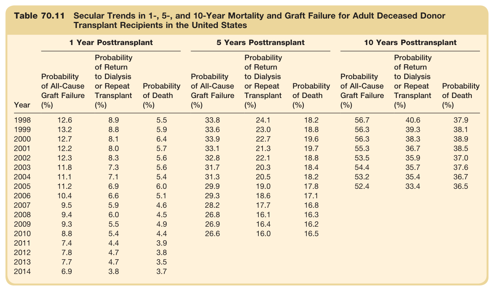

#### Table Data (CSV: [Table_70_11.csv](Table_70_11.csv))

```markdown
| Table Text (OCR) |
| :--- |
| Table 70.11 Secular Trends in 1-, 5-, and 10-Year Mortality and Graft Failure for Adult Deceased Donor Transplant Recipients in the United States Year  1 Year Posttransplant  5 Years Posttransplant  10 Years Posttransplant    Probability of All-Cause Graft Failure (%)  Probability of Return to Dialysis or Repeat Transplant (%)  Probability of Death (%)  Probability of All-Cause Graft Failure (%)  Probability of Return to Dialysis or Repeat Transplant (%)  Probability of Death (%)  Probability of All-Cause Graft Failure (%)  Probability of Return to Dialysis or Repeat Transplant (%)  Probability of Death (%)    1998  12.6  8.9  5.5  33.8  24.1  18.2  56.7  40.6  37.9    1999  13.2  8.8  5.9  33.6  23.0  18.8  56.3  39.3  38.1    2000  12.7  8.1  6.4  33.9  22.7  19.6  56.3  38.3  38.9    2001  12.2  8.0  5.7  33.1  21.3  19.7  55.3  36.7  38.5    2002  12.3  8.3  5.6  32.8  22.1  18.8  53.5  35.9  37.0    2003  11.8  7.3  5.6  31.7  20.3  18.4  54.4  35.7  37.6    2004  11.1  7.1  5.4  31.3  20.5  18.2  53.2  35.4  36.7    2005  11.2  6.9  6.0  29.9  19.0  17.8  52.4  33.4  36.5    2006  10.4  6.6  5.1  29.3  18.6  17.1          2007  9.5  5.9  4.6  28.2  17.7  16.8          2008  9.4  6.0  4.5  26.8  16.1  16.3          2009  9.3  5.5  4.9  26.9  16.4  16.2          2010  8.8  5.4  4.4  26.6  16.0  16.5          2011  7.4  4.4  3.9                2012  7.8  4.7  3.8                2013  7.7  4.7  3.5                2014  6.9  3.8  3.7 |
```

Table 70.11 Secular Trends in 1-, 5-, and 10-Year Mortality and Graft Failure for Adult Deceased Donor Transplant Recipients in the United States | Year | 1 Year Posttransplant | 5 Years Posttransplant | 10 Years Posttransplant | | :-------------------------- | :--------------------------------------- | :------------------------------------------------------- | :---------------------- | | | **Prob. of All-Cause Graft Failure (%)** | **Prob. of Return to Dialysis or Repeat Transplant (%)** | **Prob. of Death (%)** | | 1998 | 12.6 | 8.9 | 5.5 | | 1999 | 13.2 | 8.8 | 5.9 | | 2000 | 12.7 | 8.1 | 6.4 | | 2001 | 12.2 | 8.0 | 5.7 | | 2002 | 12.3 | 8.3 | 5.6 | | 2003 | 11.8 | 7.3 | 5.6 | | 2004 | 11.1 | 7.1 | 5.4 | | 2005 | 11.2 | 6.9 | 6.0 | | 2006 | 10.4 | 6.6 | 5.1 | | 2007 | 9.5 | 5.9 | 4.6 | | 2008 | 9.4 | 6.0 | 4.5 | | 2009 | 9.3 | 5.5 | 4.9 | | 2010 | 8.8 | 5.4 | 4.4 | | 2011 | 7.4 | 4.4 | 3.9 | | 2012 | 7.8 | 4.7 | 3.8 | | 2013 | 7.7 | 4.7 | 3.5 | | 2014 | 6.9 | 3.8 | 3.7 |

---

### Table_70_12

#### Table Image

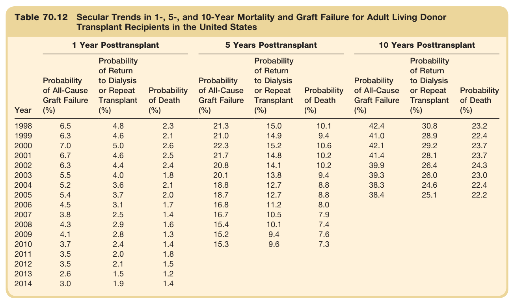

#### Table Data (CSV: [Table_70_12.csv](Table_70_12.csv))

```markdown
| Table Text (OCR) |
| :--- |
| Table 70.12 Secular Trends in 1-, 5-, and 10-Year Mortality and Graft Failure for Adult Living Donor Transplant Recipients in the United States Year  1 Year Posttransplant  5 Years Posttransplant  10 Years Posttransplant    Probability of All-Cause Graft Failure (%)  Probability of Return to Dialysis or Repeat Transplant (%)  Probability of Death (%)  Probability of All-Cause Graft Failure (%)  Probability of Return to Dialysis or Repeat Transplant (%)  Probability of Death (%)  Probability of All-Cause Graft Failure (%)  Probability of Return to Dialysis or Repeat Transplant (%)  Probability of Death (%)    1998  6.5  4.8  2.3  21.3  15.0  10.1  42.4  30.8  23.2    1999  6.3  4.6  2.1  21.0  14.9  9.4  41.0  28.9  22.4    2000  7.0  5.0  2.6  22.3  15.2  10.6  42.1  29.2  23.7    2001  6.7  4.6  2.5  21.7  14.8  10.2  41.4  28.1  23.7    2002  6.3  4.4  2.4  20.8  14.1  10.2  39.9  26.4  24.3    2003  5.5  4.0  1.8  20.1  13.8  9.4  39.3  26.0  23.0    2004  5.2  3.6  2.1  18.8  12.7  8.8  38.3  24.6  22.4    2005  5.4  3.7  2.0  18.7  12.7  8.8  38.4  25.1  22.2    2006  4.5  3.1  1.7  16.8  11.2  8.0          2007  3.8  2.5  1.4  16.7  10.5  7.9          2008  4.3  2.9  1.6  15.4  10.1  7.4          2009  4.1  2.8  1.3  15.2  9.4  7.6          2010  3.7  2.4  1.4  15.3  9.6  7.3          2011  3.5  2.0  1.8                2012  3.5  2.1  1.5                2013  2.6  1.5  1.2                2014  3.0  1.9  1.4 |
```

Table 70.12 Secular Trends in 1-, 5-, and 10-Year Mortality and Graft Failure for Adult Living Donor Transplant Recipients in the United States | Year | 1 Year Posttransplant | 5 Years Posttransplant | 10 Years Posttransplant | | :-------------------------- | :--------------------------------------- | :------------------------------------------------------- | :---------------------- | | | **Prob. of All-Cause Graft Failure (%)** | **Prob. of Return to Dialysis or Repeat Transplant (%)** | **Prob. of Death (%)** | | 1998 | 6.5 | 4.8 | 2.3 | | 1999 | 6.3 | 4.6 | 2.1 | | 2000 | 6.6 | 4.8 | 2.4 | | 2001 | 6.7 | 4.6 | 2.5 | | 2002 | 6.3 | 4.4 | 2.3 | | 2003 | 5.5 | 4.0 | 1.8 | | 2004 | 5.2 | 3.6 | 2.1 | | 2005 | 5.6 | 4.0 | 2.0 | | 2006 | 4.5 | 3.1 | 1.7 | | 2007 | 3.3 | 2.5 | 1.4 | | 2008 | 4.1 | 3.0 | 1.4 | | 2009 | 4.1 | 2.8 | 1.3 | | 2010 | 3.7 | 2.3 | 1.5 | | 2011 | 3.5 | 2.0 | 1.8 | | 2012 | 3.2 | 2.0 | 1.5 | | 2013 | 2.6 | 1.5 | 1.3 | | 2014 | 3.0 | 1.9 | 1.4 |

---

### Table_70_13

#### Table Image

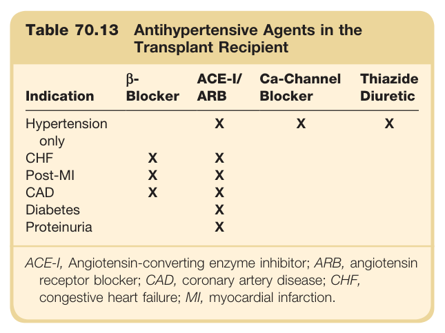

#### Table Data (CSV: [Table_70_13.csv](Table_70_13.csv))

```markdown
| Table Text (OCR) |
| :--- |
| Table 70.13 Antihypertensive Agents in the Transplant Recipient Indication  β-Blocker  ACE-I/ARB  Ca-Channel Blocker  Thiazide Diuretic    Hypertension only    X  X  X    CHF  X  X        Post-MI  X  X        CAD  X  X        Diabetes    X        Proteinuria    X ACE-I, Angiotensin-converting enzyme inhibitor; ARB, angiotensin receptor blocker; CAD, coronary artery disease; CHF, congestive heart failure; MI, myocardial infarction. |
```

Table 70.13 Antihypertensive Agents in the Transplant Recipient | Indication | β-Blocker | ACE-I/ARB | Ca-Channel Blocker | Thiazide Diuretic | | :----------------------------------------------------------- | :-------- | :-------- | :----------------- | :---------------- | | Hypertension only | | X | X | X | | CHF | X | X | | | | Post-MI | X | X | | | | CAD | X | X | | | | Diabetes | | X | | | | Proteinuria | | X | | | | *ACE-I, Angiotensin-converting enzyme inhibitor; ARB, angiotensin receptor blocker; CAD, coronary artery disease; CHF, congestive heart failure; MI, myocardial infarction.* | | | | |

---

### Table_70_14

#### Table Image

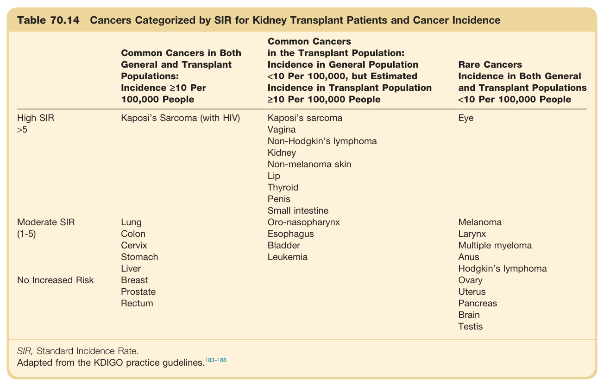

#### Table Data (CSV: [Table_70_14.csv](Table_70_14.csv))

```markdown
| Table Text (OCR) |
| :--- |
| Table 70.14 Cancers Categorized by SIR for Kidney Transplant Patients and Cancer Incidence Common Cancers in Both General and Transplant Populations: Incidence ≥10 Per 100,000 People  Common Cancers in the Transplant Population: Incidence in General Population <10 Per 100,000, but Estimated Incidence in Transplant Population ≥10 Per 100,000 People  Rare Cancers Incidence in Both General and Transplant Populations <10 Per 100,000 People    High SIR >5  Kaposi's Sarcoma (with HIV)  Kaposi's sarcomaVaginaNon-Hodgkin's lymphomaKidneyNon-melanoma skinLipThyroidPenisSmall intestine  Eye    Moderate SIR (1-5)  LungColonCervixStomachLiver  Oro-nasopharynxEsophagusBladderLeukemia  MelanomaLarynxMultiple myelomaAnusHodgkin's lymphoma    No Increased Risk  BreastProstateRectum    OvaryUterusPancreasBrainTestis SIR, Standard Incidence Rate. Adapted from the KDIGO practice gudelines.<sup>183–188</sup> |
```

Table 70.14 Cancers Categorized by SIR for Kidney Transplant Patients and Cancer Incidence | | Common Cancers in Both General and Transplant Populations | Common Cancers in the Transplant Population | Rare Cancers Incidence in Both General and Transplant Populations | | :------------------------------ | :----------------------------------------------------------- | :----------------------------------------------------------- | :----------------------------------------------------------- | | | **Incidence ≥10 Per 100,000 People** | **Incidence in General Population <10 Per 100,000, but Estimated Incidence in Transplant Population ≥10 Per 100,000 People** | **<10 Per 100,000 People** | | **High SIR >5** | Kaposi's Sarcoma (with HIV) | Kaposi's sarcoma, Vagina, Non-Hodgkin's lymphoma, Kidney, Non-melanoma skin, Lip, Thyroid, Penis, Small intestine, Oro-nasopharynx, Esophagus, Bladder, Leukemia | Eye | | **Moderate SIR (1-5)** | Lung, Colon, Cervix, Stomach, Liver, Breast, Prostate, Rectum | | Melanoma, Larynx, Multiple myeloma, Anus, Hodgkin's lymphoma, Ovary, Uterus, Pancreas, Brain, Testis | | **No Increased Risk** | | | | | *SIR, Standard Incidence Rate.* | | | |

---

### Table_70_15

#### Table Image

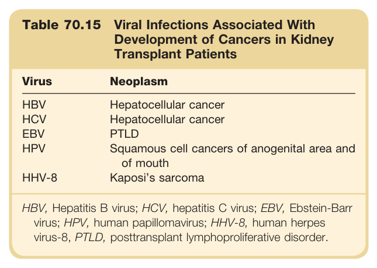

#### Table Data (CSV: [Table_70_15.csv](Table_70_15.csv))

```markdown
| Table Text (OCR) |
| :--- |
| Table 70.15 Viral Infections Associated With Development of Cancers in Kidney Transplant Patients Virus  Neoplasm    HBV  Hepatocellular cancer    HCV  Hepatocellular cancer    EBV  PTLD    HPV  Squamous cell cancers of anogenital area and of mouth    HHV-8  Kaposi's sarcoma HBV, Hepatitis B virus; HCV, hepatitis C virus; EBV, Ebstein-Barr virus; HPV, human papillomavirus; HHV-8, human herpes virus-8, PTLD, posttransplant lymphoproliferative disorder. |
```

Table 70.15 Viral Infections Associated With Development of Cancers in Kidney Transplant Patients | Virus | Neoplasm | | :----------------------------------------------------------- | :---------------------------------------------------- | | HBV | Hepatocellular cancer | | HCV | Hepatocellular cancer | | EBV | PTLD | | HPV | Squamous cell cancers of anogenital area and of mouth | | HHV-8 | Kaposi's sarcoma | | *HBV, Hepatitis B virus; HCV, hepatitis C virus; EBV, Ebstein-Barr virus; HPV, human papillomavirus; HHV-8, human herpes virus-8, PTLD, posttransplant lymphoproliferative disorder.* | |

---

### Table_70_16

#### Table Image

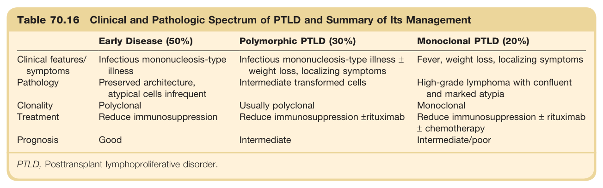

#### Table Data (CSV: [Table_70_16.csv](Table_70_16.csv))

```markdown
| Table Text (OCR) |
| :--- |
| Table 70.16 Clinical and Pathologic Spectrum of PTLD and Summary of Its Management Early Disease (50%)  Polymorphic PTLD (30%)  Monoclonal PTLD (20%)    Clinical features/symptoms  Infectious mononucleosis-type illness  Infectious mononucleosis-type illness ± weight loss, localizing symptoms  Fever, weight loss, localizing symptoms    Pathology  Preserved architecture, atypical cells infrequent  Intermediate transformed cells  High-grade lymphoma with confluent and marked atypia    Clonality  Polyclonal  Usually polyclonal  Monoclonal    Treatment  Reduce immunosuppression  Reduce immunosuppression ± rituximab  Reduce immunosuppression ± rituximab ± chemotherapy    Prognosis  Good  Intermediate  Intermediate/poor PTLD, Posttransplant lymphoproliferative disorder. |
```

Table 70.16 Clinical and Pathologic Spectrum of PTLD and Summary of its Management | | Early Disease (50%) | Polymorphic PTLD (30%) | Monoclonal PTLD (20%) | | :--------------------------------------------------- | :------------------------------------------------ | :----------------------------------------------------------- | :--------------------------------------------------- | | **Clinical features/** **Symptoms** | Infectious mononucleosis-type illness | Infectious mononucleosis-type illness ± weight loss, localizing symptoms | Fever, weight loss, localizing symptoms | | **Pathology** | Preserved architecture, atypical cells infrequent | Intermediate transformed cells | High-grade lymphoma with confluent and marked atypia | | **Clonality** | Polyclonal | Usually polyclonal | Monoclonal | | **Treatment** | Reduce immunosuppression | Reduce immunosuppression ±rituximab | Reduce immunosuppression ± rituximab chemotherapy | | **Prognosis** | Good | Intermediate | Intermediate/poor | | *PTLD, Posttransplant lymphoproliferative disorder.* | | | |

---

### Table_70_17

#### Table Image

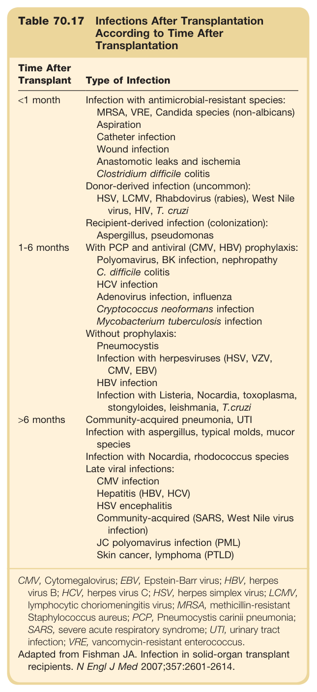

#### Table Data (CSV: [Table_70_17.csv](Table_70_17.csv))

```markdown
| Table Text (OCR) |
| :--- |
| Table 70.17 Infections After Transplantation According to Time After Transplantation Time After Transplant  Type of Infection    <1 month  Infection with antimicrobial-resistant species:MRSA, VRE, Candida species (non-albicans)AspirationCatheter infectionWound infectionAnastomotic leaks and ischemiaClostridium difficilecolitisDonor-derived infection (uncommon):HSV, LCMV, Rhabdovirus (rabies), West Nile virus, HIV, T. cruziRecipient-derived infection (colonization):Aspergillus, pseudomonas    1-6 months  With PCP and antiviral (CMV, HBV) prophylaxis:Polyomavirus, BK infection, nephropathyC. difficilecolitisHCV infectionAdenovirus infection, influenzaCryptococcus neoformansinfectionMycobacterium tuberculosisinfectionWithout prophylaxis:PneumocystisInfection with herpesviruses (HSV, VZV, CMV, EBV)HBV infectionInfection with Listeria, Nocardia, toxoplasma, stongyloides, leishmania, T.cruzi    >6 months  Community-acquired pneumonia, UTIInfection with aspergillus, typical molds, mucor speciesInfection with Nocardia, rhodococcus speciesLate viral infections:CMV infectionHepatitis (HBV, HCV)HSV encephalitisCommunity-acquired (SARS, West Nile virus infection)JC polyomavirus infection (PML)Skin cancer, lymphoma (PTLD) CMV, Cytomegalovirus; EBV, Epstein-Barr virus; HBV, herpes virus B; HCV, herpes virus C; HSV, herpes simplex virus; LCMV, lymphocytic choriomeningitis virus; MRSA, methicillin-resistant Staphylococcus aureus; PCP, Pneumocystis carinii pneumonia; SARS, severe acute respiratory syndrome; UTI, urinary tract infection; VRE, vancomycin-resistant enterococcus. Adapted from Fishman JA. Infection in solid-organ transplant recipients. N Engl J Med 2007;357:2601-2614. |
```

Table 70.17 Infections After Transplantation According to Time After Transplantation | Time After Transplant | Type of Infection | | :----------------------------------------------------------- | :----------------------------------------------------------- | | **<1 month** | Infection with antimicrobial-resistant species: MRSA, VRE, Candida species (non-albicans), Aspiration, Catheter infection, Wound infection, Anastomotic leaks and ischemia, Clostridium difficile colitis, Donor-derived infection (uncommon): HSV, LCMV, Rhabdovirus (rabies), West Nile virus, HIV, T. cruzi, Recipient-derived infection (colonization): Aspergillus, pseudomonas | | **1-6 months** | With PCP and antiviral (CMV, HBV) prophylaxis: Polyomavirus, BK infection, nephropathy, C. difficile colitis, HCV infection, Adenovirus infection, influenza, Cryptococcus neoformans infection, Mycobacterium tuberculosis infection. Without prophylaxis: Pneumocystis, Infection with herpesviruses (HSV, VZV, CMV, EBV), HBV infection, Infection with Listeria, Nocardia, toxoplasma, stongyloides, leishmania, T.cruzi | | **>6 months** | Community-acquired pneumonia, UTI, Infection with aspergillus, typical molds, mucor species, Infection with Nocardia, rhodococcus species, Late viral infections: CMV infection, Hepatitis (HBV, HCV), HSV encephalitis, Community-acquired (SARS, West Nile virus infection), JC polyomavirus infection (PML), Skin cancer, lymphoma (PTLD) | | *CMV, Cytomegalovirus; EBV, Epstein-Barr virus; HBV, herpes virus B; HCV, herpes virus C; HSV, herpes simplex virus; LCMV, lymphocytic choriomeningitis virus; MRSA, methicillin-resistant Staphylococcus aureus; PCP, Pneumocystis carinii pneumonia; SARS, severe acute respiratory syndrome; UTI, urinary tract infection; VRE, vancomycin-resistant enterococcus.* | |

---

### Table_70_18

#### Table Image

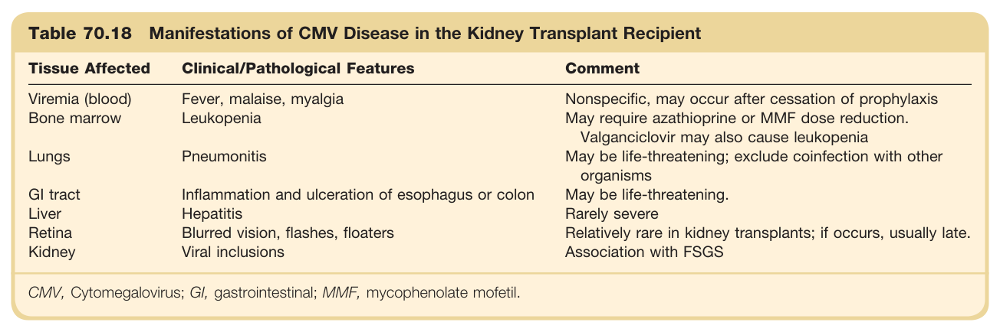

#### Table Data (CSV: [Table_70_18.csv](Table_70_18.csv))

```markdown
| Table Text (OCR) |
| :--- |
| Table 70.18 Manifestations of CMV Disease in the Kidney Transplant Recipient Tissue Affected  Clinical/Pathological Features  Comment    Viremia (blood)  Fever, malaise, myalgia  Nonspecific, may occur after cessation of prophylaxis    Bone marrow  Leukopenia  May require azathioprine or MMF dose reduction. Valganciclovir may also cause leukopenia    Lungs  Pneumonitis  May be life-threatening; exclude coinfection with other organisms    GI tract  Inflammation and ulceration of esophagus or colon  May be life-threatening.    Liver  Hepatitis  Rarely severe    Retina  Blurred vision, flashes, floaters  Relatively rare in kidney transplants; if occurs, usually late.    Kidney  Viral inclusions  Association with FSGS CMV, Cytomegalovirus; GI, gastrointestinal; MMF, mycophenolate mofetil. |
```

Table 70.18 Manifestations of CMV Disease in the Kidney Transplant Recipient | Tissue Affected | Clinical/Pathological Features | Comment | | :----------------------------------------------------------- | :------------------------------------------------ | :----------------------------------------------------------- | | **Viremia (blood)** | Fever, malaise, myalgia | Nonspecific, may occur after cessation of prophylaxis | | **Bone marrow** | Leukopenia | May require azathioprine or MMF dose reduction. Valganciclovir may also cause leukopenia | | **Lungs** | Pneumonitis | May be life-threatening; exclude coinfection with other organisms | | **GI tract** | Inflammation and ulceration of esophagus or colon | May be life-threatening. | | **Liver** | Hepatitis | Rarely severe | | **Retina** | Blurred vision, flashes, floaters | Relatively rare in kidney transplants; if occurs, usually late. | | **Kidney** | Viral inclusions | Association with FSGS | | *CMV, Cytomegalovirus; GI, gastrointestinal; MMF, mycophenolate mofetil.* | | |

---

### Table_70_19

#### Table Image

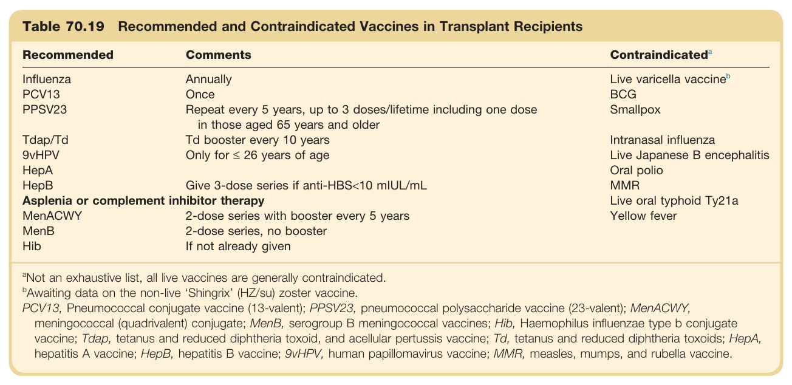

#### Table Data (CSV: [Table_70_19.csv](Table_70_19.csv))

```markdown
| Table Text (OCR) |
| :--- |
| Table 70.19 Recommended and Contraindicated Vaccines in Transplant Recipients Recommended  Comments  Contraindicated ^{a}     Influenza  Annually  Live varicella vaccine ^{b}     PCV13  Once  BCG    PPSV23  Repeat every 5 years, up to 3 doses/lifetime including one dose in those aged 65 years and older  Smallpox    Tdap/Td  Td booster every 10 years  Intranasal influenza    9vHPV  Only for  \leq 26  years of age  Live Japanese B encephalitis    HepA    Oral polio    HepB  Give 3-dose series if anti-HBS<10 mIUL/mL  MMR    Asplenia or complement inhibitor therapy  Live oral typhoid Ty21a    MenACWY  2-dose series with booster every 5 years  Yellow fever    MenB  2-dose series, no booster      Hib  If not already given <sup>a</sup>Not an exhaustive list, all live vaccines are generally contraindicated. <sup>b</sup>Awaiting data on the non-live ‘Shingrix’ (HZ/su) zoster vaccine. PCV13, Pneumococcal conjugate vaccine (13-valent); PPSV23, pneumococcal polysaccharide vaccine (23-valent); MenACWY, meningococcal (quadrivalent) conjugate; MenB, serogroup B meningococcal vaccines; Hib, Haemophilus influenzae type b conjugate vaccine; Tdap, tetanus and reduced diphtheria toxoid, and acellular pertussis vaccine; Td, tetanus and reduced diphtheria toxoids; HepA hepatitis A vaccine; HepB, hepatitis B vaccine; 9vHPV, human papillomavirus vaccine; MMR, measles, mumps, and rubella vaccine. |
```

Table 70.19 Recommended and Contraindicated Vaccines in Transplant Recipients | Recommended | Comments | Contraindicatedª | | :----------------------------------------------------------- | :----------------------------------------------------------- | :--------------------------- | | Influenza | Annually | Live varicella vaccineᵇ | | PCV13 | Once | BCG | | PPSV23 | Repeat every 5 years, up to 3 doses/lifetime including one dose in those aged 65 years and older | Smallpox | | Tdap/Td | Td booster every 10 years | Intranasal influenza | | 9vHPV | Only for ≤ 26 years of age | Live Japanese B encephalitis | | HepA | | Oral polio | | HepB | Give 3-dose series if anti-HBS<10 mIUL/mL | MMR | | **Asplenia or complement inhibitor therapy** | | Live oral typhoid Ty21a | | MenACWY | 2-dose series with booster every 5 years | Yellow fever | | MenB | 2-dose series, no booster | | | Hib | If not already given | | | *ªNot an exhaustive list, all live vaccines are generally contraindicated.* | | | | *ᵇAwaiting data on the non-live 'Shingrix' (HZ/su) zoster vaccine.* | | | | *PCV13, Pneumococcal conjugate vaccine (13-valent); PPSV23, pneumococcal polysaccharide vaccine (23-valent); MenACWY, meningococcal (quadrivalent) conjugate; MenB, serogroup B meningococcal vaccines; Hib, Haemophilus influenzae type b conjugate vaccine; Tdap, tetanus and reduced diphtheria toxoid, and acellular pertussis vaccine; Td, tetanus and reduced diphtheria toxoids; HepA, hepatitis A vaccine; HepB, hepatitis B vaccine; 9vHPV, human papillomavirus vaccine; MMR, measles, mumps, and rubella vaccine.* | | |

---

### Table_70_20

#### Table Image

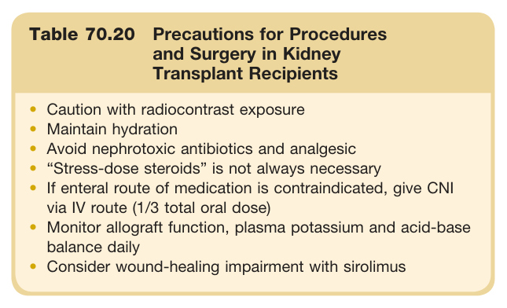

#### Table Data (CSV: [Table_70_20.csv](Table_70_20.csv))

```markdown
| Table Text (OCR) |
| :--- |
| Table 70.20 Precautions for Procedures and Surgery in Kidney Transplant Recipients • Caution with radiocontrast exposure • Maintain hydration • Avoid nephrotoxic antibiotics and analgesic • “Stress-dose steroids” is not always necessary If enteral route of medication is contraindicated, give CN via IV route (1/3 total oral dose) Monitor allograft function, plasma potassium and acid-base balance daily • Consider wound-healing impairment with sirolimus |
```

Table 70.20 Precautions for Procedures and Surgery in Kidney Transplant Recipients * Caution with radiocontrast exposure * Maintain hydration * Avoid nephrotoxic antibiotics and analgesic * “Stress-dose” steroids is not always necessary * If enteral route of medication is contraindicated, give CNI IV or sublingual * Monitor allograft function, plasma potassium and acid-base balance daily * Consider wound-healing impairment with sirolimus

---
