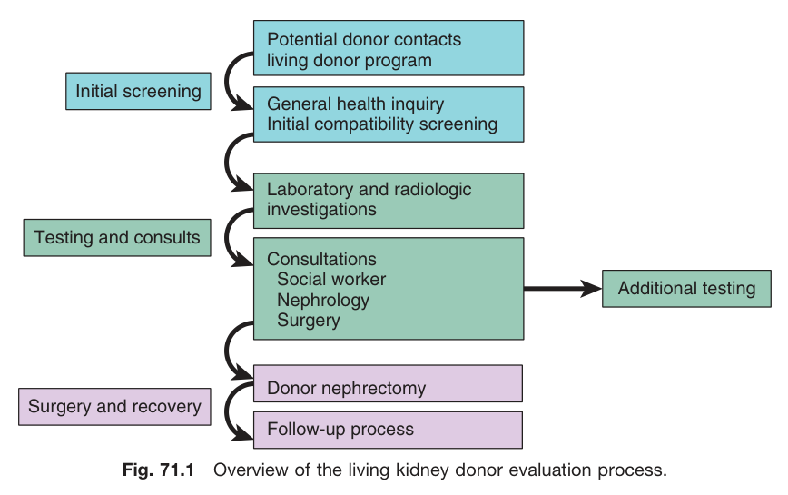
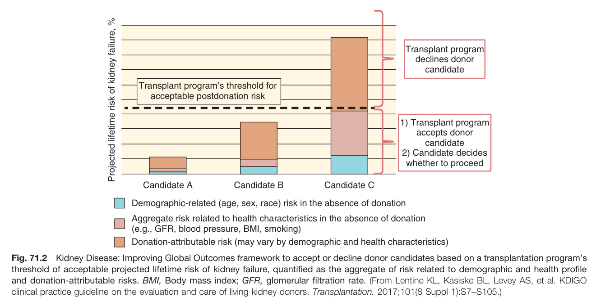
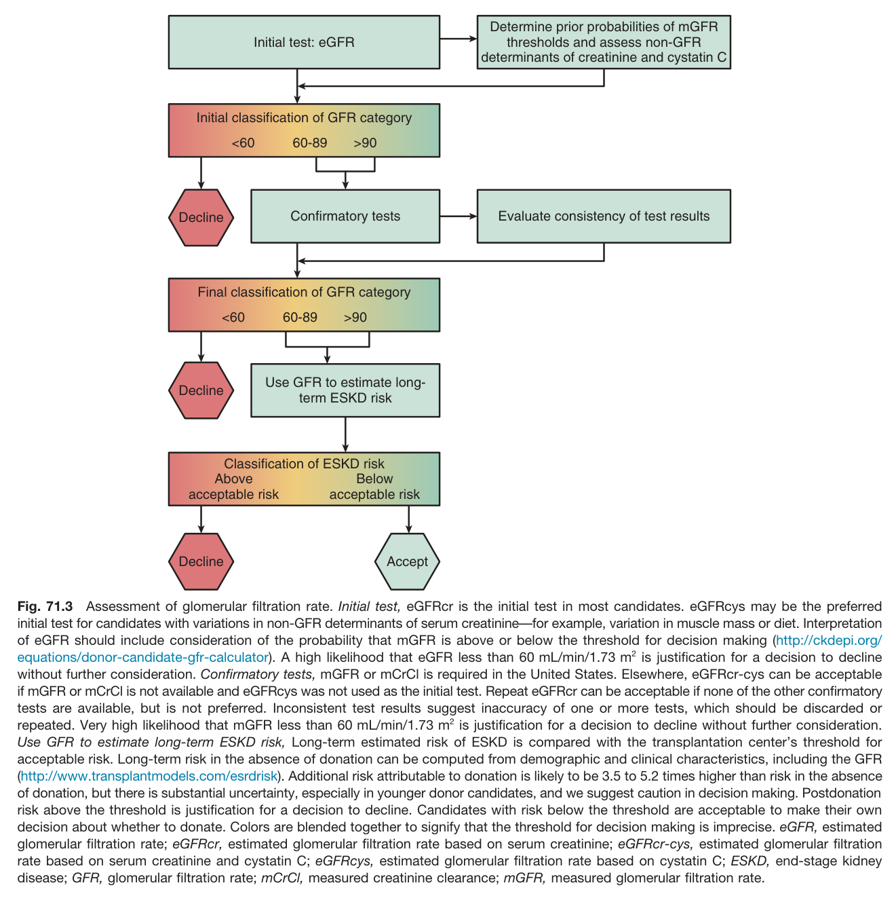
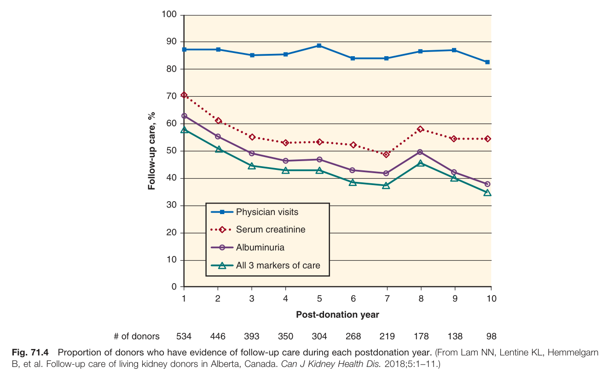
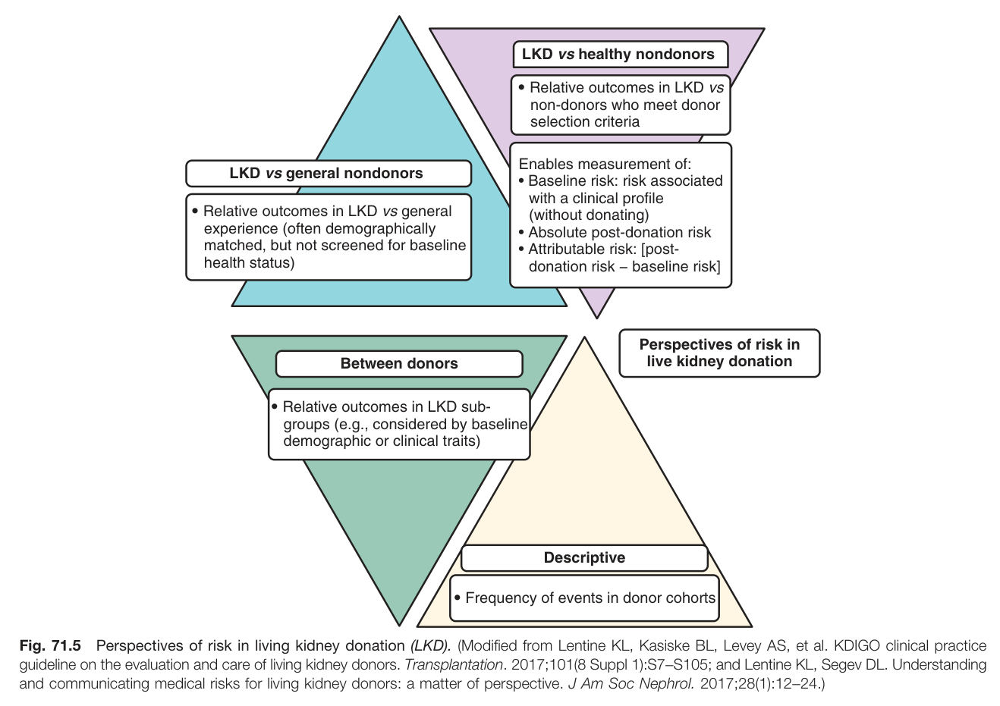
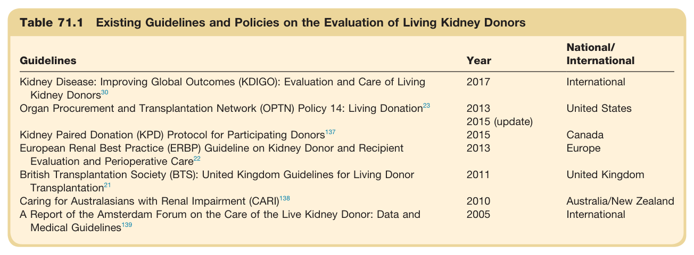
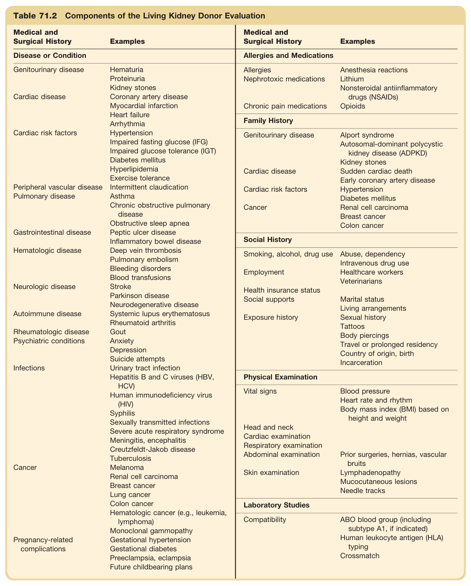
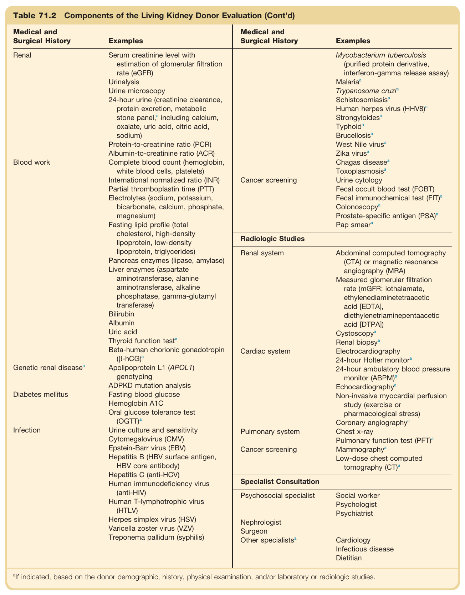
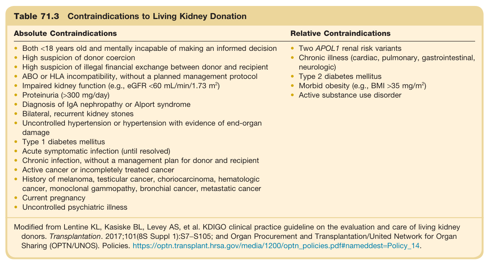
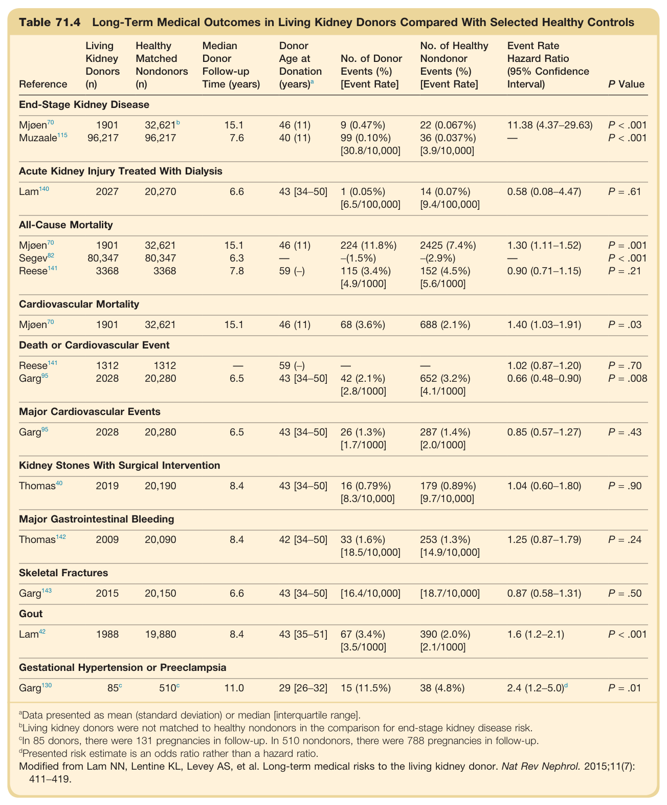

# 71. Considerations in Living Kidney Donation - Figures and Tables Index

This document lists all figures and tables extracted from `71. Considerations in Living Kidney Donation.pdf`.

## Table of Contents
- [Figures](#figures)
- [Tables](#tables)

---

## Figures

### Fig_71_1



Fig. 71.1 Overview of the living kidney donor evaluation process. A flowchart shows the process of living kidney donor evaluation. It starts with "Potential donor contacts living donor program" leading to "Initial screening" (which includes "General health inquiry" and "Initial compatibility screening"). This flows to "Testing and consults" which branches into "Laboratory and radiologic investigations" and "Consultations" (Social worker, Nephrology, Surgery). From here, an arrow points to "Additional testing" if needed. The main path leads to "Surgery and recovery" which includes "Donor nephrectomy" and "Follow-up process".

---

### Fig_71_2



Fig. 71.2 Kidney Disease: Improving Global Outcomes framework to accept or decline donor candidates based on a transplantation program's threshold of acceptable projected lifetime risk of kidney failure, quantified as the aggregate of risk related to demographic and health profile and donation-attributable risks. This bar chart illustrates a framework for deciding on donor candidates based on projected lifetime risk of kidney failure. The y-axis is "Projected lifetime risk of kidney failure, %". Three candidates (A, B, C) are shown on the x-axis. A horizontal line represents the "Transplant program's threshold for acceptable postdonation risk". The bar for Candidate A is well below this threshold. The bar for Candidate B is just below the threshold. The bar for Candidate C is above the threshold. Each bar is composed of three stacked segments: "Demographic-related risk", "Aggregate risk related to health characteristics", and "Donation-attributable risk". For Candidates A and B, the decision is "1) Transplant program accepts donor candidate" and "2) Candidate decides whether to proceed". For Candidate C, the decision is "Transplant program declines donor candidate".

---

### Fig_71_3



Fig. 71.3 Assessment of glomerular filtration rate. This is a flowchart detailing the assessment of GFR in potential kidney donors. 1. **Initial test: eGFR**: Leads to "Initial classification of GFR category" (<60, 60-89, >90). 2. **If <60**: "Decline". 3. **If 60-89 or >90**: "Confirmatory tests". This step also considers "prior probabilities of mGFR thresholds". 4. **Confirmatory tests**: Leads to "Final classification of GFR category" (<60, 60-89, >90). 5. **If <60**: "Decline". 6. **If 60-89 or >90**: "Use GFR to estimate long-term ESKD risk". 7. **Classification of ESKD risk**: "Above acceptable risk" leads to "Decline". "Below acceptable risk" leads to "Accept". The flowchart notes that colors are blended to signify that thresholds for decision making are imprecise.

---

### Fig_71_4



Fig. 71.4 Proportion of donors who have evidence of follow-up care during each postdonation year. This line graph shows the percentage of follow-up care for living kidney donors over 10 years post-donation. The y-axis is "Follow-up care, %" from 0 to 100. The x-axis is "Post-donation year" from 1 to 10. There are four lines: "Physician visits" (starting around 70% and declining to ~55%), "Serum creatinine" (starting around 60% and declining to ~45%), "Albuminuria" (starting around 50% and declining to ~35%), and "All 3 markers of care" (starting around 40% and declining to ~25%). All lines show a general downward trend over time.

---

### Fig_71_5



Fig. 71.5 Perspectives of risk in living kidney donation (LKD). This diagram illustrates different ways to assess risk in living kidney donation (LKD). It shows four overlapping perspectives: 1. **LKD vs general nondonors**: Relative outcomes compared to a general, often demographically matched, population. 2. **LKD vs healthy nondonors**: Relative outcomes compared to non-donors who meet donor selection criteria. This enables measurement of baseline risk, absolute post-donation risk, and attributable risk. 3. **Between donors**: Relative outcomes in LKD subgroups (e.g., based on demographic or clinical traits). 4. **Descriptive**: Frequency of events within donor cohorts.

---

## Tables

### Table_71_1

#### Table Image



#### Table Data (CSV: [Table_71_1.csv](Table_71_1.csv))

```markdown
| Table Text (OCR) |
| :--- |
| Table 71.1 Existing Guidelines and Policies on the Evaluation of Living Kidney Donors Guidelines  Year  National/International    Kidney Disease: Improving Global Outcomes (KDIGO): Evaluation and Care of Living Kidney Donors ^{30}   2017  International    Organ Procurement and Transplantation Network (OPTN) Policy 14: Living Donation ^{23}   2013  United States    2015 (update)      Kidney Paired Donation (KPD) Protocol for Participating Donors ^{137}   2015  Canada    European Renal Best Practice (ERBP) Guideline on Kidney Donor and Recipient Evaluation and Perioperative Care ^{22}   2013  Europe    British Transplantation Society (BTS): United Kingdom Guidelines for Living Donor Transplantation ^{21}   2011  United Kingdom    Caring for Australasians with Renal Impairment (CARI) ^{138}   2010  Australia/New Zealand    A Report of the Amsterdam Forum on the Care of the Live Kidney Donor: Data and Medical Guidelines ^{139}   2005  International |
```

Table 71.1 Existing Guidelines and Policies on the Evaluation of Living Kidney Donors | Guidelines | Year | National/International | | :--- | :--- | :--- | | Kidney Disease: Improving Global Outcomes (KDIGO): Evaluation and Care of Living Kidney Donors | 2017 | International | | Organ Procurement and Transplantation Network (OPTN) Policy 14: Living Donation | 2013, 2015 (update) | United States | | Kidney Paired Donation (KPD) Protocol for Participating Donors | 2015 | Canada | | European Renal Best Practice (ERBP) Guideline on Kidney Donor and Recipient Evaluation and Perioperative Care | 2013 | Europe | | British Transplantation Society (BTS): United Kingdom Guidelines for Living Donor Transplantation | 2011 | United Kingdom | | Caring for Australasians with Renal Impairment (CARI) | 2010 | Australia/New Zealand | | A Report of the Amsterdam Forum on the Care of the Live Kidney Donor: Data and Medical Guidelines | 2005 | International |

---

### Table_71_2

#### Table Images (2 Parts)

- **Part 1 (Page 5)**:
  

- **Part 2 (Page 6)**:
  

#### Table Data (CSV: [Table_71_2.csv](Table_71_2.csv))

```markdown
| Table Text (OCR) |
| :--- |
| Table 71.2 Components of the Living Kidney Donor Evaluation Medical and Surgical History  Examples  Medical and Surgical History  Examples    Disease or Condition  Allergies and Medications    Genitourinary disease  Hematuria  Allergies  Anesthesia reactions    Proteinuria  Nephrotoxic medications  Lithium    Kidney stones    Nonsteroidal antiinflammatory drugs (NSAIDs)    Cardiac disease  Coronary artery disease        Myocardial infarction  Chronic pain medications  Opioids    Heart failure        Arrhythmia  Family History    Cardiac risk factors  Hypertension  Genitourinary disease  Alport syndrome    Impaired fasting glucose (IFG)    Autosomal-dominant polycystic kidney disease (ADPKD)    Impaired glucose tolerance (IGT)        Diabetes mellitus    Kidney stones    Hyperlipidemia  Cardiac disease  Sudden cardiac death    Exercise tolerance    Early coronary artery disease    Peripheral vascular disease  Intermittent claudication  Cardiac risk factors  Hypertension    Pulmonary disease  Asthma    Diabetes mellitus    Chronic obstructive pulmonary disease  Cancer  Renal cell carcinoma    Obstructive sleep apnea    Breast cancer    Gastrointestinal disease  Peptic ulcer disease  Social History    Inflammatory bowel disease        Hematologic disease  Deep vein thrombosis  Smoking, alcohol, drug use  Abuse, dependency    Pulmonary embolism    Intravenous drug use    Bleeding disorders  Employment  Healthcare workers    Blood transfusions    Veterinarians    Neurologic disease  Stroke  Health insurance status      Parkinson disease  Social supports  Marital status    Neurodegenerative disease    Living arrangements    Autoimmune disease  Systemic lupus erythematosus  Exposure history  Sexual history    Rheumatoid arthritis    Tattoos    Rheumatologic disease  Gout    Body piercings    Psychiatric conditions  Anxiety    Travel or prolonged residency    Depression    Country of origin, birth    Suicide attempts    Incarceration    Infections  Urinary tract infection  Physical Examination    Hepatitis B and C viruses (HBV, HCV)  Vital signs  Blood pressure    Human immunodeficiency virus (HIV)    Heart rate and rhythm    Syphilis    Body mass index (BMI) based on height and weight    Sexually transmitted infections  Head and neck      Severe acute respiratory syndrome  Cardiac examination      Meningitis, encephalitis  Respiratory examination      Creutzfeldt-Jakob disease  Abdominal examination  Prior surgeries, hernias, vascular bruits    Tuberculosis        Cancer  Melanoma  Skin examination  Lymphadenopathy    Renal cell carcinoma    Mucocutaneous lesions    Breast cancer    Needle tracks    Lung cancer        Colon cancer  Laboratory Studies    Hematologic cancer (e.g., leukemia, lymphoma)  Compatibility  ABO blood group (including subtype A1, if indicated)    Pregnancy-related complications  Monoclonal gammopathy    Human leukocyte antigen (HLA) typing    Gestational hypertension    Crossmatch    Gestational diabetes        Preeclampsia, eclampsia        Future childbearing plans        Renal  Serum creatinine level with estimation of glomerular filtration rate (eGFR)UrinalysisUrine microscopy24-hour urine (creatinine clearance, protein excretion, metabolic stone panel, ^a  including calcium, oxalate, uric acid, citric acid, sodium)Protein-to-creatinine ratio (PCR)Albumin-to-creatinine ratio (ACR)  Cancer screening  Mycobacterium tuberculosis(purified protein derivative, interferon-gamma release assay)Malaria ^a Trypanosoma cruzi ^a SchistosomiasisaHuman herpes virus (HHV8) ^a Strongyloides ^a TyphoidaBrucellosisaWest Nile virus ^a Zika virus ^a Chagas disease ^a ToxoplasmosisaUrine cytologyFecal occult blood test (FOBT)Fecal immunochemical test (FIT) ^a ColonoscopyaProstate-specific antigen (PSA) ^a Pap smeara    Blood work  Complete blood count (hemoglobin, white blood cells, platelets)International normalized ratio (INR)Partial thromboplastin time (PTT)Electrolytes (sodium, potassium, bicarbonate, calcium, phosphate, magnesium)Fasting lipid profile (total cholesterol, high-density lipoprotein, low-density lipoprotein, triglycerides)Pancreas enzymes (lipase, amylase)Liver enzymes (aspartate aminotransferase, alanine aminotransferase, alkaline phosphatase, gamma-glutamyl transferase)BilirubinAlbuminUric acidThyroid function test ^a Beta-human chorionic gonadotropin ( \beta -hCG) ^a   Cardiac system  Abdominal computed tomography (CTA) or magnetic resonance angiography (MRA)Measured glomerular filtration rate (mGFR: iothalamate, ethylenediaminetetraacetic acid [EDTA], diethylenetriaminepentaacetic acid [DTPA])CystoscopyaRenal biopsyaElectrocardiography24-hour Holter monitora    Genetic renal disease ^a   Apolipoprotein L1 (APOL1) genotypingADPKD mutation analysisFasting blood glucoseHemoglobin A1COral glucose tolerance test (OGTT) ^a   Pulmonary systemCancer screening  Non-invasive myocardial perfusion study (exercise or pharmacological stress)Coronary angiographyaChest x-rayPulmonary function test (PFT) ^a MammographyaLow-dose chest computed tomography (CT) ^a     Diabetes mellitus  Urine culture and sensitivityCytomegalovirus (CMV)Epstein-Barr virus (EBV)Hepatitis B (HBV surface antigen, HBV core antibody)Hepatitis C (anti-HCV)Human immunodeficiency virus (anti-HIV)Human T-lymphotrophic virus (HTLV)Herpes simplex virus (HSV)Varicella zoster virus (VZV)Treponema pallidum (syphilis)  Specialist Consultation    Psychosocial specialist  Social workerPsychologistPsychiatrist    NephrologistSurgeonOther specialists ^a   CardiologyInfectious diseaseDietitian <sup>a</sup>If indicated, based on the donor demographic, history, physical examination, and/or laboratory or radiologic studies. |
```

Table 71.2 Components of the Living Kidney Donor Evaluation This is a two-part table listing the components of a living kidney donor evaluation. Part 1: Medical and Surgical History * **Disease or Condition:** Genitourinary, Cardiac, Cardiac risk factors, Peripheral vascular, Pulmonary, Gastrointestinal, Hematologic, Neurologic, Autoimmune, Rheumatologic, Psychiatric, Infections, Cancer, Pregnancy-related complications. * **Allergies and Medications:** Allergies, Nephrotoxic medications, Chronic pain medications. * **Family History:** Genitourinary, Cardiac, Cardiac risk factors, Cancer. * **Social History:** Smoking, alcohol, drug use, Employment, Health insurance, Social supports, Exposure history. Part 2: Physical Examination, Laboratory Studies, and Consultations * **Physical Examination:** Vital signs, Head and neck, Cardiac, Respiratory, Abdominal, Skin examination. * **Laboratory Studies:** Compatibility (ABO, HLA, Crossmatch), Renal tests, Blood work, Genetic renal disease, Diabetes mellitus, Infection. * **Radiologic Studies:** Renal system, Cardiac system, Pulmonary system, Cancer screening. * **Specialist Consultation:** Psychosocial specialist, Nephrologist, Surgeon, Other specialists. Each category has multiple specific examples listed.

---

### Table_71_3

#### Table Image



#### Table Data (CSV: [Table_71_3.csv](Table_71_3.csv))

```markdown
| Table Text (OCR) |
| :--- |
| Table 71.3 Contraindications to Living Kidney Donation Absolute Contraindications  Relative Contraindications    Both <18 years old and mentally incapable of making an informed decisionHigh suspicion of donor coercionHigh suspicion of illegal financial exchange between donor and recipientABO or HLA incompatibility, without a planned management protocolImpaired kidney function (e.g., eGFR <60 mL/min/1.73  m^{2} )Proteinuria (>300 mg/day)Diagnosis of IgA nephropathy or Alport syndromeBilateral, recurrent kidney stonesUncontrolled hypertension or hypertension with evidence of end-organ damageType 1 diabetes mellitusAcute symptomatic infection (until resolved)Chronic infection, without a management plan for donor and recipientActive cancer or incompletely treated cancerHistory of melanoma, testicular cancer, choriocarcinoma, hematologic cancer, monoclonal gammopathy, bronchial cancer, metastatic cancerCurrent pregnancyUncontrolled psychiatric illness  Two APOL1 renal risk variantsChronic illness (cardiac, pulmonary, gastrointestinal, neurologic)Type 2 diabetes mellitusMorbid obesity (e.g., BMI >35  mg/m^{2} )Active substance use disorder Modified from Lentine KL, Kasiske BL, Levey AS, et al. KDIGO clinical practice guideline on the evaluation and care of living kidney donors. Transplantation. 2017;101(8S Suppl 1):S7−S105; and Organ Procurement and Transplantation/United Network for Organ Sharing (OPTN/UNOS). Policies. https://optn.transplant.hrsa.gov/media/1200/optn_policies.pdf#nameddest=Policy_14. |
```

Table 71.3 Contraindications to Living Kidney Donation | Absolute Contraindications | Relative Contraindications | | :--- | :--- | | Both <18 years old and mentally incapable | Two APOL1 renal risk variants | | High suspicion of donor coercion | Chronic illness (cardiac, pulmonary, etc.) | | High suspicion of illegal financial exchange | Type 2 diabetes mellitus | | ABO or HLA incompatibility without protocol | Morbid obesity (e.g., BMI >35 mg/m²) | | Impaired kidney function (e.g., eGFR <60) | Active substance use disorder | | Proteinuria (>300 mg/day) | | | Diagnosis of IgA nephropathy or Alport syndrome | | | Bilateral, recurrent kidney stones | | | Uncontrolled hypertension with end-organ damage | | | Type 1 diabetes mellitus | | | Acute symptomatic infection (until resolved) | | | Chronic infection, without a management plan | | | Active or incompletely treated cancer | | | History of specific cancers (melanoma, etc.) | | | Current pregnancy | | | Uncontrolled psychiatric illness | |

---

### Table_71_4

#### Table Image



#### Table Data (CSV: [Table_71_4.csv](Table_71_4.csv))

```markdown
| Table Text (OCR) |
| :--- |
| Table 71.4 Long-Term Medical Outcomes in Living Kidney Donors Compared With Selected Healthy Controls Reference  Living Kidney Donors (n)  Healthy Matched Nondonors (n)  Median Donor Follow-up Time (years)  Donor Age at Donation (years) ^a   No. of Donor Events (%) [Event Rate]  No. of Healthy Nondonor Events (%) [Event Rate]  Event Rate Hazard Ratio (95% Confidence Interval)  P Value    End-Stage Kidney Disease    Mjøen ^{70}   1901   32,621^b   15.1  46 (11)  9 (0.47%)  22 (0.067%)  11.38 (4.37-29.63)  P<.001    Muzaale ^{115}   96,217  96,217  7.6  40 (11)  99 (0.10%) [30.8/10,000]  36 (0.037%) [3.9/10,000]  —  P<.001    Acute Kidney Injury Treated With Dialysis    Lam ^{140}   2027  20,270  6.6  43 [34-50]  1 (0.05%) [6.5/100,000]  14 (0.07%) [9.4/100,000]  0.58 (0.08-4.47)  P= .61    All-Cause Mortality    Mjøen ^{70}   1901  32,621  15.1  46 (11)  224 (11.8%)  2425 (7.4%)  1.30 (1.11-1.52)  P= .001    Segev ^{82}   80,347  80,347  6.3  —  -(1.5%)  -(2.9%)  —  P<.001    Reese ^{141}   3368  3368  7.8  59 (-)  115 (3.4%) [4.9/1000]  152 (4.5%) [5.6/1000]  0.90 (0.71-1.15)  P= .21    Cardiovascular Mortality    Mjøen ^{70}   1901  32,621  15.1  46 (11)  68 (3.6%)  688 (2.1%)  1.40 (1.03-1.91)  P= .03    Death or Cardiovascular Event    Reese ^{141}   1312  1312  —  59 (-)  —  —  1.02 (0.87-1.20)  P= .70    Garg ^{95}   2028  20,280  6.5  43 [34-50]  42 (2.1%) [2.8/1000]  652 (3.2%) [4.1/1000]  0.66 (0.48-0.90)  P= .008    Major Cardiovascular Events    Garg ^{95}   2028  20,280  6.5  43 [34-50]  26 (1.3%) [1.7/1000]  287 (1.4%) [2.0/1000]  0.85 (0.57-1.27)  P= .43    Kidney Stones With Surgical Intervention    Thomas ^{40}   2019  20,190  8.4  43 [34-50]  16 (0.79%) [8.3/10,000]  179 (0.89%) [9.7/10,000]  1.04 (0.60-1.80)  P= .90    Major Gastrointestinal Bleeding    Thomas ^{142}   2009  20,090  8.4  42 [34-50]  33 (1.6%) [18.5/10,000]  253 (1.3%) [14.9/10,000]  1.25 (0.87-1.79)  P= .24    Skeletal Fractures    Garg ^{143}   2015  20,150  6.6  43 [34-50]  [16.4/10,000]  [18.7/10,000]  0.87 (0.58-1.31)  P= .50    Gout    Lam ^{42}   1988  19,880  8.4  43 [35-51]  67 (3.4%) [3.5/1000]  390 (2.0%) [2.1/1000]  1.6 (1.2-2.1)  P<.001    Gestational Hypertension or Preeclampsia    Garg ^{130}    85^c    510^c   11.0  29 [26-32]  15 (11.5%)  38 (4.8%)   2.4 (1.2-5.0)^d   P= .01 <sup>a</sup>Data presented as mean (standard deviation) or median [interquartile range]. <sup>b</sup>Living kidney donors were not matched to healthy nondonors in the comparison for end-stage kidney disease risk. <sup>c</sup>In 85 donors, there were 131 pregnancies in follow-up. In 510 nondonors, there were 788 pregnancies in follow-up. <sup>d</sup>Presented risk estimate is an odds ratio rather than a hazard ratio. Modified from Lam NN, Lentine KL, Levey AS, et al. Long-term medical risks to the living kidney donor. Nat Rev Nephrol. 2015;11(7): 411−419. |
```

Table 71.4 Long-Term Medical Outcomes in Living Kidney Donors Compared With Selected Healthy Controls This table compares long-term health outcomes for living kidney donors versus healthy matched nondonors across several categories. * **End-Stage Kidney Disease**: Higher risk for donors (HR 11.38). * **Acute Kidney Injury Treated With Dialysis**: No significant difference. * **All-Cause Mortality**: Mixed results; one study shows higher risk for donors (HR 1.30), another shows no significant difference. * **Cardiovascular Mortality**: Higher risk for donors (HR 1.40). * **Death or Cardiovascular Event**: One study shows lower risk for donors (HR 0.66). * **Major Cardiovascular Events**: No significant difference. * **Kidney Stones With Surgical Intervention**: No significant difference. * **Major Gastrointestinal Bleeding**: No significant difference. * **Skeletal Fractures**: No significant difference. * **Gout**: Higher risk for donors (HR 1.6). * **Gestational Hypertension or Preeclampsia**: Higher risk for donors (Odds Ratio 2.4).

---
