# 72. Diseases of the Kidney and Upper Urinary Tract in Children - Figures and Tables Index

This document lists all figures and tables extracted from `72. Diseases of the Kidney and Upper Urinary Tract in Children.pdf`.

## Table of Contents
- [Figures](#figures)
- [Tables](#tables)

---

## Figures

### Fig_72_1

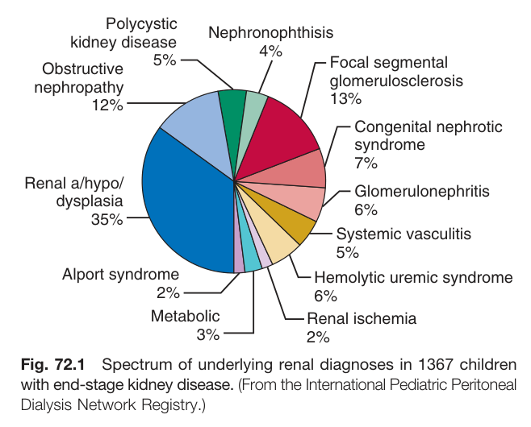

Fig. 72.1 Spectrum of underlying renal diagnoses in 1367 children with end-stage kidney disease. (From the International Pediatric Peritoneal Dialysis Network Registry.) This is a pie chart showing the distribution of renal diagnoses in children with ESRD. * Renal a/hypo/dysplasia: 35% * Obstructive nephropathy: 12% * Polycystic kidney disease: 5% * Nephronophthisis: 4% * Alport syndrome: 2% * Metabolic: 3% * Renal ischemia: 2% * Hemolytic uremic syndrome: 6% * Systemic vasculitis: 5% * Glomerulonephritis: 6% * Congenital nephrotic syndrome: 7% * Focal segmental glomerulosclerosis: 13%

---

### Fig_72_2

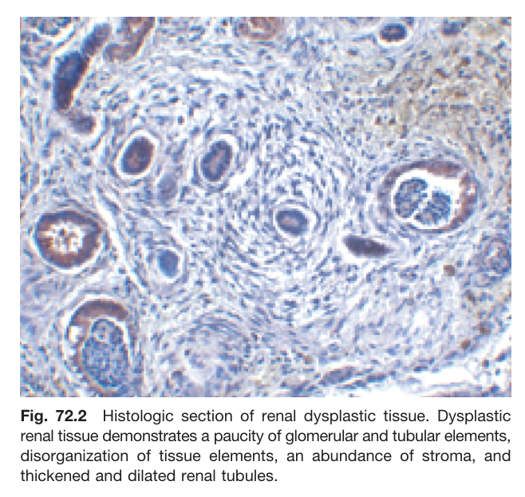

Fig. 72.2 Histologic section of renal dysplastic tissue. Dysplastic renal tissue demonstrates a paucity of glomerular and tubular elements, disorganization of tissue elements, an abundance of stroma, and thickened and dilated renal tubules. (Image of a histologic slide showing disorganized kidney tissue.)

---

### Fig_72_3

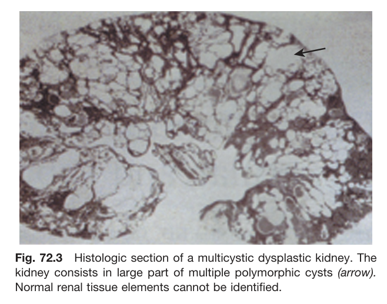

Fig. 72.3 Histologic section of a multicystic dysplastic kidney. The kidney consists in large part of multiple polymorphic cysts (arrow). Normal renal tissue elements cannot be identified. (Image of a histologic slide showing multiple large cysts with minimal normal kidney tissue.)

---

### Fig_72_4

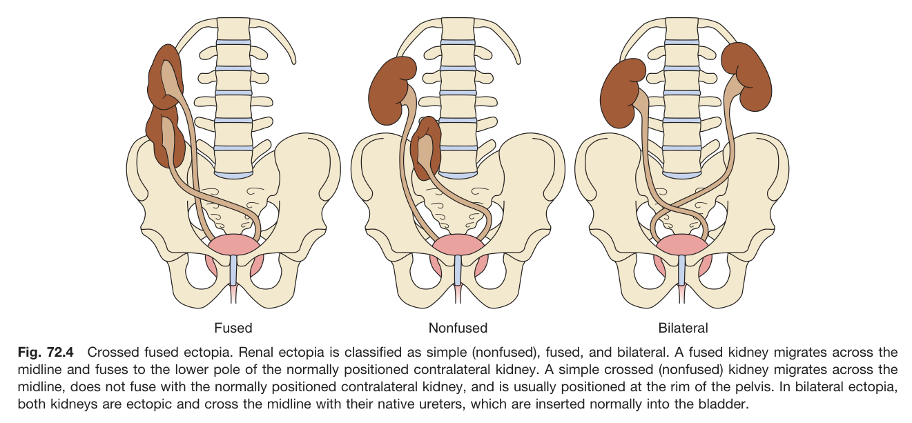

Fig. 72.4 Crossed fused ectopia. Renal ectopia is classified as simple (nonfused), fused, and bilateral. A fused kidney migrates across the midline and fuses to the lower pole of the normally positioned contralateral kidney. A simple crossed (nonfused) kidney migrates across the midline, does not fuse with the normally positioned contralateral kidney, and is usually positioned at the rim of the pelvis. In bilateral ectopia, both kidneys are ectopic and cross the midline with their native ureters, which are inserted normally into the bladder. (Diagram showing three types of renal ectopia: Fused, Nonfused, and Bilateral, illustrating different positions and fusions of ectopic kidneys relative to the normal position.)

---

### Fig_72_5

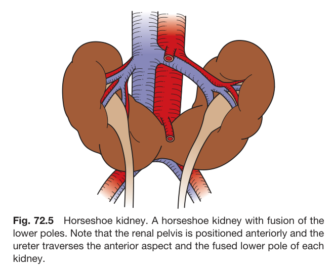

Fig. 72.5 Horseshoe kidney. A horseshoe kidney with fusion of the lower poles. Note that the renal pelvis is positioned anteriorly and the ureter traverses the anterior aspect and the fused lower pole of each kidney. (Diagram of a horseshoe kidney, showing the fusion of the lower poles and the anterior positioning of the renal pelvis and ureters.)

---

### Fig_72_6

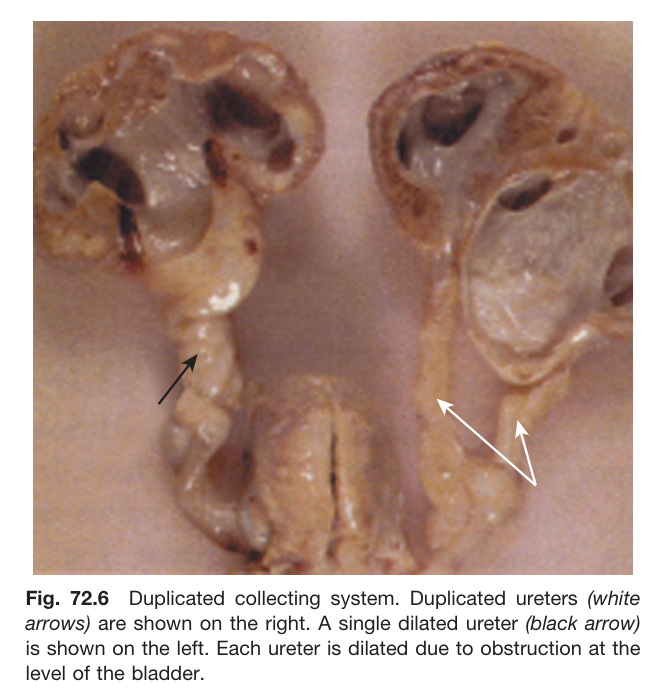

Fig. 72.6 Duplicated collecting system. Duplicated ureters (white arrows) are shown on the right. A single dilated ureter (black arrow) is shown on the left. Each ureter is dilated due to obstruction at the level of the bladder. (Image showing duplicated and dilated ureters indicating an obstruction.)

---

### Fig_72_7

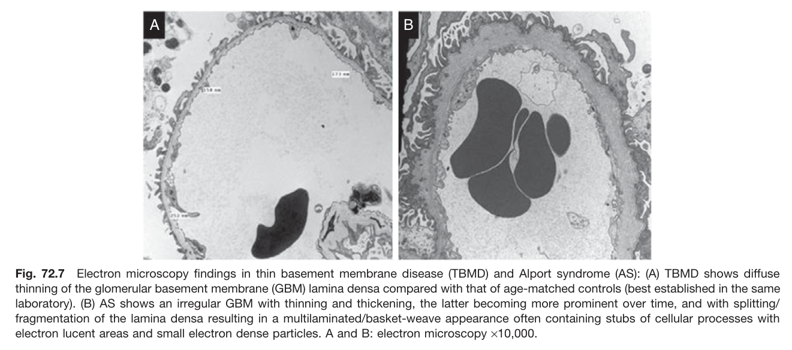

Fig. 72.7 Electron microscopy findings in thin basement membrane disease (TBMD) and Alport syndrome (AS): (A) TBMD shows diffuse thinning of the glomerular basement membrane (GBM) lamina densa compared with that of age-matched controls (best established in the same laboratory). (B) AS shows an irregular GBM with thinning and thickening, the latter becoming more prominent over time, and with splitting/ fragmentation of the lamina densa resulting in a multilaminated/basket-weave appearance often containing stubs of cellular processes with electron lucent areas and small electron dense particles. A and B: electron microscopy ×10,000. (Two electron microscopy images comparing the glomerular basement membrane in TBMD (A) and Alport syndrome (B). Image A shows a uniformly thin membrane. Image B shows an irregularly thick and thin membrane with a basket-weave pattern.)

---

### Fig_72_8

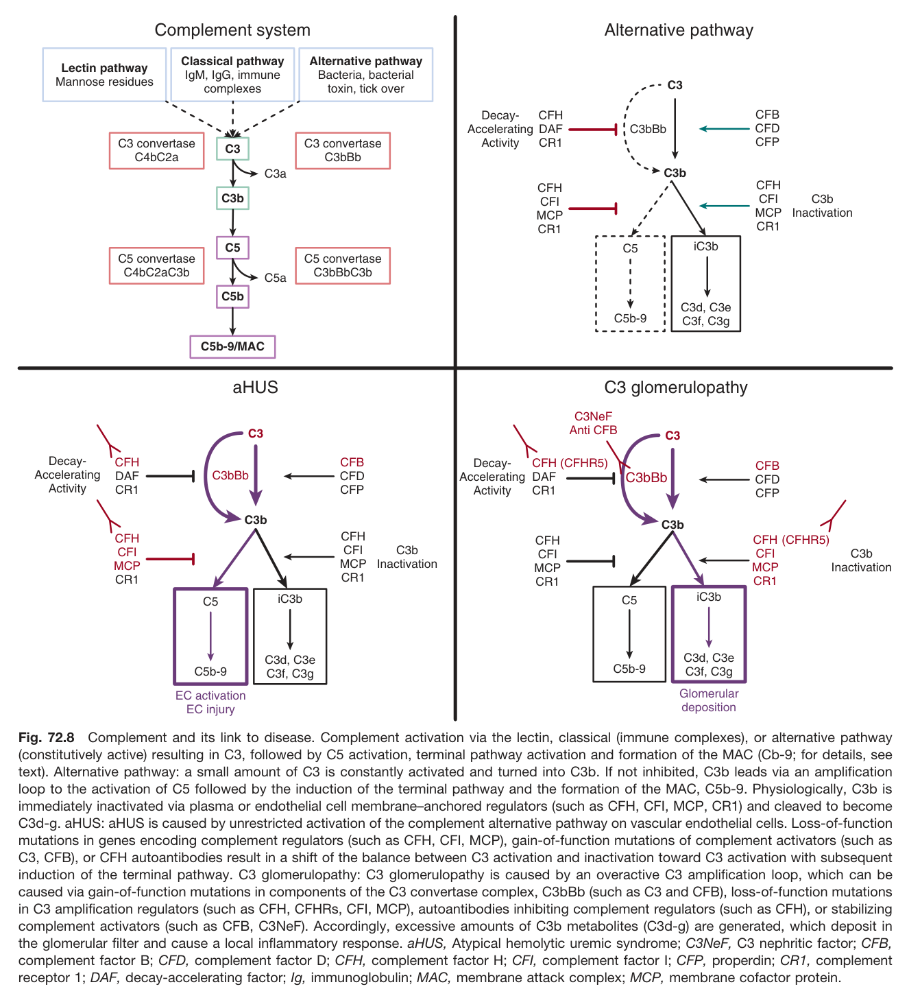

Fig. 72.8 Complement and its link to disease. Complement activation via the lectin, classical (immune complexes), or alternative pathway (constitutively active) resulting in C3, followed by C5 activation, terminal pathway activation and formation of the MAC (Cb-9; for details, see text). Alternative pathway: a small amount of C3 is constantly activated and turned into C3b. If not inhibited, C3b leads via an amplification loop to the activation of C5 followed by the induction of the terminal pathway and the formation of the MAC, C5b-9. Physiologically, C3b is immediately inactivated via plasma or endothelial cell membrane-anchored regulators (such as CFH, CFI, MCP, CR1) and cleaved to become C3d-g. aHUS: aHUS is caused by unrestricted activation of the complement alternative pathway on vascular endothelial cells. Loss-of-function mutations in genes encoding complement regulators (such as CFH, CFI, MCP), gain-of-function mutations of complement activators (such as C3, CFB), or CFH autoantibodies result in a shift of the balance between C3 activation and inactivation toward C3 activation with subsequent induction of the terminal pathway. C3 glomerulopathy: C3 glomerulopathy is caused by an overactive C3 amplification loop, which can be caused via gain-of-function mutations in components of the C3 convertase complex, C3bBb (such as C3 and CFB), loss-of-function mutations in C3 amplification regulators (such as CFH, CFHRs, CFI, MCP), autoantibodies inhibiting complement regulators (such as CFH), or stabilizing complement activators (such as CFB, C3NeF). Accordingly, excessive amounts of C3b metabolites (C3d-g) are generated, which deposit in the glomerular filter and cause a local inflammatory response. aHUS, Atypical hemolytic uremic syndrome; C3NeF, C3 nephritic factor; CFB, complement factor B; CFD, complement factor D; CFH, complement factor H; CFI, complement factor I; CFP, properdin; CR1, complement receptor 1; DAF, decay-accelerating factor; Ig, immunoglobulin; MAC, membrane attack complex; MCP, membrane cofactor protein. (A series of diagrams illustrating the complement system pathways (lectin, classical, alternative) and how dysregulation leads to aHUS and C3 glomerulopathy through different mechanisms of overactivation.)

---

### Fig_72_9

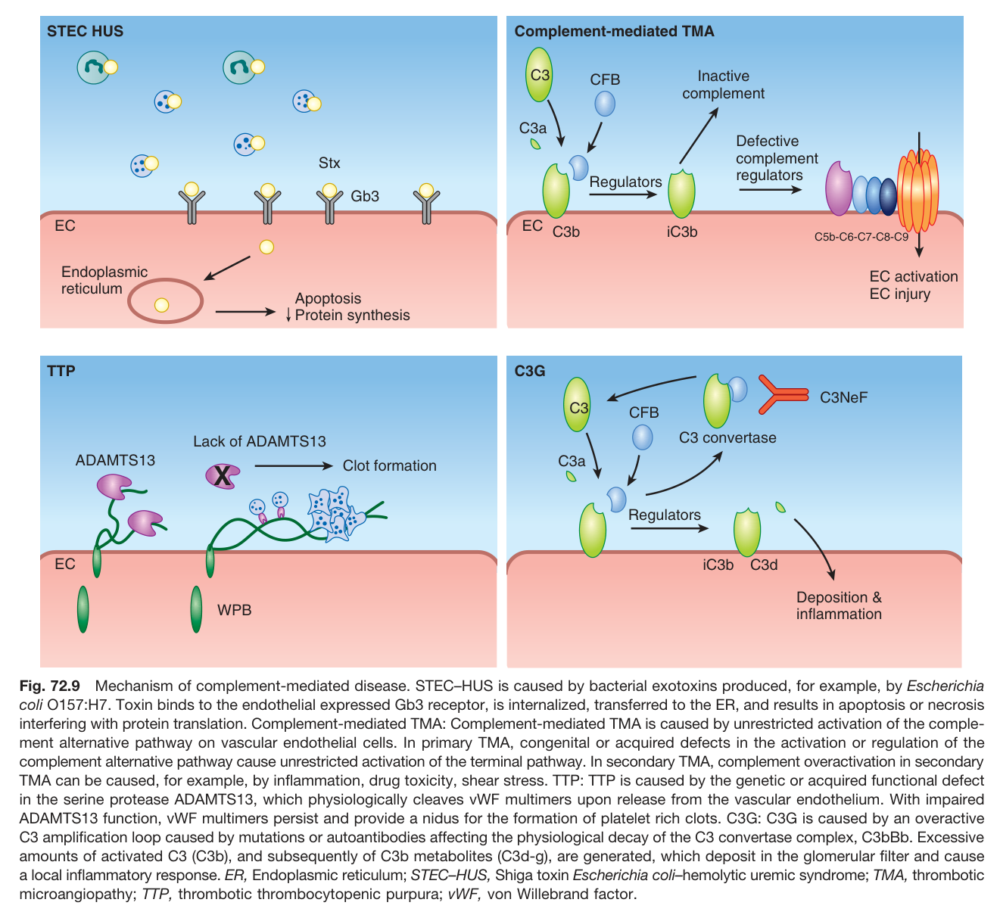

Fig. 72.9 Mechanism of complement-mediated disease. STEC-HUS is caused by bacterial exotoxins produced, for example, by Escherichia coli O157:H7. Toxin binds to the endothelial expressed Gb3 receptor, is internalized, transferred to the ER, and results in apoptosis or necrosis interfering with protein translation. Complement-mediated TMA: Complement-mediated TMA is caused by unrestricted activation of the complement alternative pathway on vascular endothelial cells. In primary TMA, congenital or acquired defects in the activation or regulation of the complement alternative pathway cause unrestricted activation of the terminal pathway. In secondary TMA, complement overactivation in secondary TMA can be caused, for example, by inflammation, drug toxicity, shear stress. TTP: TTP is caused by the genetic or acquired functional defect in the serine protease ADAMTS13, which physiologically cleaves vWF multimers upon release from the vascular endothelium. With impaired ADAMTS13 function, vWF multimers persist and provide a nidus for the formation of platelet rich clots. C3G: C3G is caused by an overactive C3 amplification loop caused by mutations or autoantibodies affecting the physiological decay of the C3 convertase complex, C3bBb. Excessive amounts of activated C3 (C3b), and subsequently of C3b metabolites (C3d-g), are generated, which deposit in the glomerular filter and cause a local inflammatory response. ER, Endoplasmic reticulum; STEC-HUS, Shiga toxin Escherichia coli-hemolytic uremic syndrome; TMA, thrombotic microangiopathy; TTP, thrombotic thrombocytopenic purpura; vWF, von Willebrand factor. (A set of diagrams explaining the mechanisms of STEC-HUS, complement-mediated TMA, TTP, and C3G, highlighting the different molecular pathways and cellular targets.)

---

### Fig_72_10

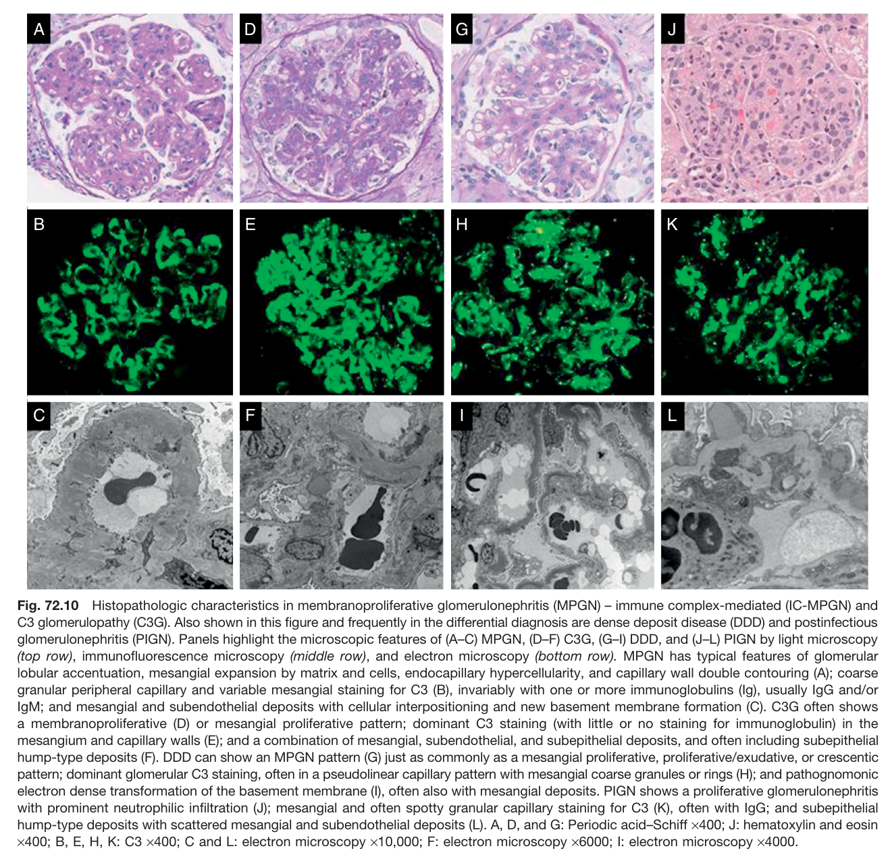

Fig. 72.10 Histopathologic characteristics in membranoproliferative glomerulonephritis (MPGN) – immune complex-mediated (IC-MPGN) and C3 glomerulopathy (C3G). Also shown in this figure and frequently in the differential diagnosis are dense deposit disease (DDD) and postinfectious glomerulonephritis (PIGN). Panels highlight the microscopic features of (A-C) MPGN, (D-F) C3G, (G-I) DDD, and (J-L) PIGN by light microscopy (top row), immunofluorescence microscopy (middle row), and electron microscopy (bottom row). MPGN has typical features of glomerular lobular accentuation, mesangial expansion by matrix and cells, endocapillary hypercellularity, and capillary wall double contouring (A); coarse granular peripheral capillary and variable mesangial staining for C3 (B), invariably with one or more immunoglobulins (Ig), usually IgG and/or IgM; and mesangial and subendothelial deposits with cellular interpositioning and new basement membrane formation (C). C3G often shows a membranoproliferative (D) or mesangial proliferative pattern; dominant C3 staining (with little or no staining for immunoglobulin) in the mesangium and capillary walls (E); and a combination of mesangial, subendothelial, and subepithelial deposits, and often including subepithelial hump-type deposits (F). DDD can show an MPGN pattern (G) just as commonly as a mesangial proliferative, proliferative/exudative, or crescentic pattern; dominant glomerular C3 staining, often in a pseudolinear capillary pattern with mesangial coarse granules or rings (H); and pathognomonic electron dense transformation of the basement membrane (I), often also with mesangial deposits. PIGN shows a proliferative glomerulonephritis with prominent neutrophilic infiltration (J); mesangial and often spotty granular capillary staining for C3 (K), often with IgG; and subepithelial hump-type deposits with scattered mesangial and subendothelial deposits (L). A, D, and G: Periodic acid-Schiff ×400; J: hematoxylin and eosin ×400; B, E, H, K: C3 ×400; C and L: electron microscopy ×10,000; F: electron microscopy ×6000; I: electron microscopy ×4000. (A composite image of 12 panels (A-L) showing light microscopy, immunofluorescence, and electron microscopy findings for MPGN, C3G, DDD, and PIGN, illustrating their distinct histopathologic characteristics.)

---

### Fig_72_11

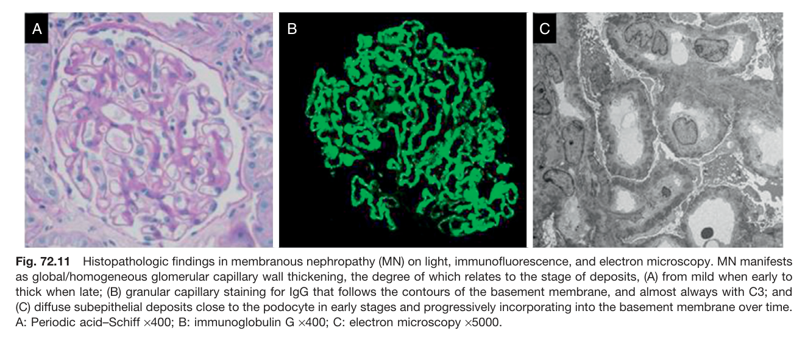

Fig. 72.11 Histopathologic findings in membranous nephropathy (MN) on light, immunofluorescence, and electron microscopy. MN manifests as global/homogeneous glomerular capillary wall thickening, the degree of which relates to the stage of deposits, (A) from mild when early to thick when late; (B) granular capillary staining for IgG that follows the contours of the basement membrane, and almost always with C3; and (C) diffuse subepithelial deposits close to the podocyte in early stages and progressively incorporating into the basement membrane over time. A: Periodic acid-Schiff ×400; B: immunoglobulin G ×400; C: electron microscopy ×5000. (A composite of three images (A, B, C) showing light microscopy, immunofluorescence, and electron microscopy findings typical of membranous nephropathy.)

---

### Fig_72_12

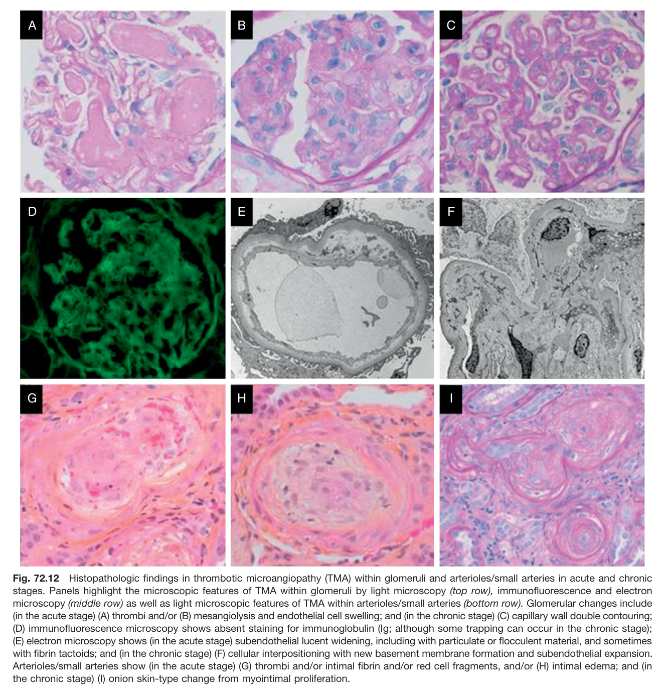

Fig. 72.12 Histopathologic findings in thrombotic microangiopathy (TMA) within glomeruli and arterioles/small arteries in acute and chronic stages. Panels highlight the microscopic features of TMA within glomeruli by light microscopy (top row), immunofluorescence and electron microscopy (middle row) as well as light microscopic features of TMA within arterioles/small arteries (bottom row). Glomerular changes include (in the acute stage) (A) thrombi and/or (B) mesangiolysis and endothelial cell swelling; and (in the chronic stage) (C) capillary wall double contouring; (D) immunofluorescence microscopy shows absent staining for immunoglobulin (Ig; although some trapping can occur in the chronic stage); (E) electron microscopy shows (in the acute stage) subendothelial lucent widening, including with particulate or flocculent material, and sometimes with fibrin tactoids; and (in the chronic stage) (F) cellular interpositioning with new basement membrane formation and subendothelial expansion. Arterioles/small arteries show (in the acute stage) (G) thrombi and/or intimal fibrin and/or red cell fragments, and/or (H) intimal edema; and (in the chronic stage) (1) onion skin-type change from myointimal proliferation. (A composite image of 9 panels (A-I) showing various histopathologic features of TMA in glomeruli and arterioles at different stages, as seen through light microscopy, immunofluorescence, and electron microscopy.)

---

### Fig_72_13

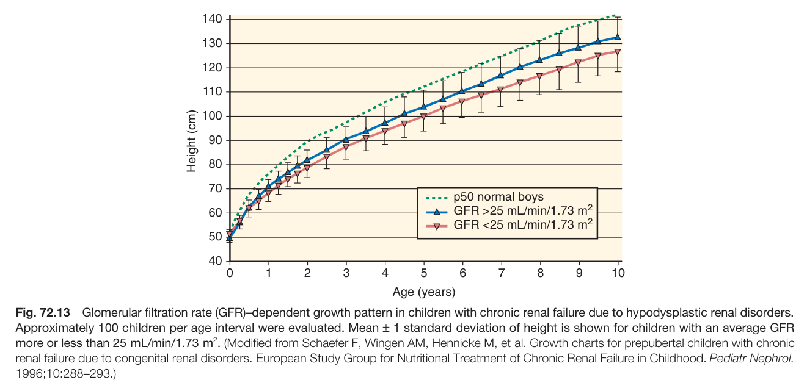

Fig. 72.13 Glomerular filtration rate (GFR)-dependent growth pattern in children with chronic renal failure due to hypodysplastic renal disorders. Approximately 100 children per age interval were evaluated. Mean ± 1 standard deviation of height is shown for children with an average GFR more or less than 25 mL/min/1.73 m². (Modified from Schaefer F, Wingen AM, Hennicke M, et al. Growth charts for prepubertal children with chronic renal failure due to congenital renal disorders. European Study Group for Nutritional Treatment of Chronic Renal Failure in Childhood. Pediatr Nephrol. 1996;10:288-293.) (A line graph comparing the growth curves of normal boys (p50) with boys who have a GFR >25 mL/min/1.73 m² and those with a GFR <25 mL/min/1.73 m² from age 0 to 10. The lines show that children with lower GFR have significantly impaired growth.)

---

### Fig_72_14

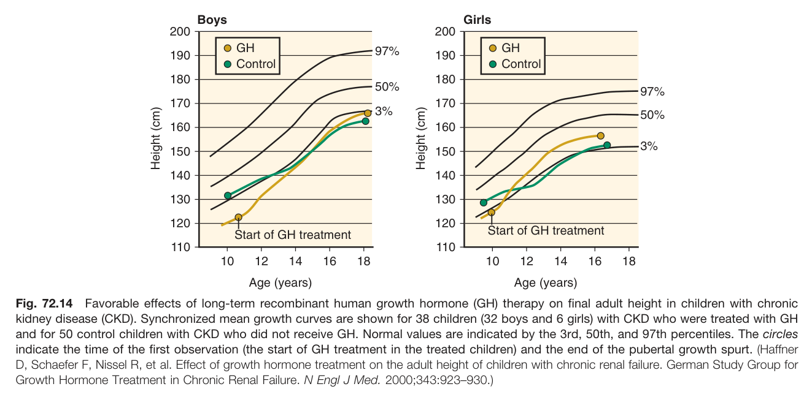

Fig. 72.14 Favorable effects of long-term recombinant human growth hormone (GH) therapy on final adult height in children with chronic kidney disease (CKD). Synchronized mean growth curves are shown for 38 children (32 boys and 6 girls) with CKD who were treated with GH and for 50 control children with CKD who did not receive GH. Normal values are indicated by the 3rd, 50th, and 97th percentiles. The circles indicate the time of the first observation (the start of GH treatment in the treated children) and the end of the pubertal growth spurt. (Haffner D, Schaefer F, Nissel R, et al. Effect of growth hormone treatment on the adult height of children with chronic renal failure. German Study Group for Growth Hormone Treatment in Chronic Renal Failure. N Engl J Med. 2000;343:923-930.) (Two line graphs, one for boys and one for girls, showing the effect of GH therapy on height in children with CKD from age 10 to 18. Both graphs demonstrate that GH-treated children achieve a significantly greater final height compared to the control group, approaching the normal 50th percentile.)

---

### Fig_72_15

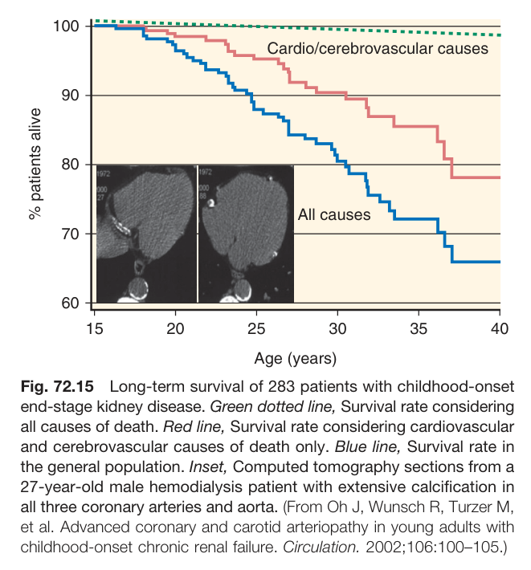

Fig. 72.15 Long-term survival of 283 patients with childhood-onset end-stage kidney disease. Green dotted line, Survival rate considering all causes of death. Red line, Survival rate considering cardiovascular and cerebrovascular causes of death only. Blue line, Survival rate in the general population. Inset, Computed tomography sections from a 27-year-old male hemodialysis patient with extensive calcification in all three coronary arteries and aorta. (From Oh J, Wunsch R, Turzer M, et al. Advanced coronary and carotid arteriopathy in young adults with childhood-onset chronic renal failure. Circulation. 2002;106:100-105.) (A survival curve graph showing decreased survival rates over time for patients with childhood-onset ESRD. Survival is lower when considering all causes of death compared to only cardio/cerebrovascular causes, and both are significantly lower than the general population's survival rate.)

---

### Fig_72_16

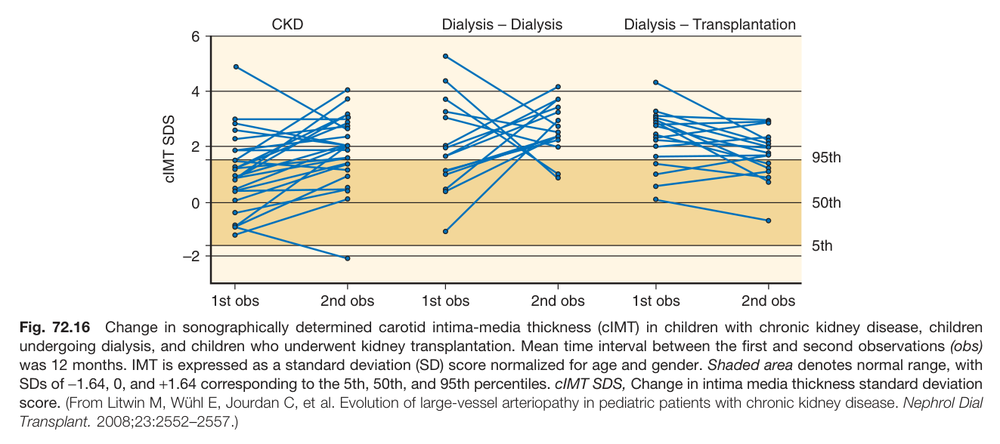

Fig. 72.16 Change in sonographically determined carotid intima-media thickness (cIMT) in children with chronic kidney disease, children undergoing dialysis, and children who underwent kidney transplantation. Mean time interval between the first and second observations (obs) was 12 months. IMT is expressed as a standard deviation (SD) score normalized for age and gender. Shaded area denotes normal range, with SDs of -1.64, 0, and +1.64 corresponding to the 5th, 50th, and 95th percentiles. CIMT SDS, Change in intima media thickness standard deviation score. (From Litwin M, Wühl E, Jourdan C, et al. Evolution of large-vessel arteriopathy in pediatric patients with chronic kidney disease. Nephrol Dial Transplant. 2008;23:2552-2557.) (A series of three scatter plots showing the change in cIMT SDS over 12 months for children with CKD, on dialysis, and post-transplantation. The plots indicate that cIMT tends to worsen in CKD and dialysis patients, but may improve after transplantation.)

---

### Fig_72_17

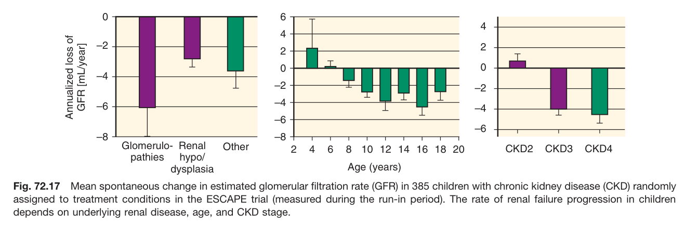

Fig. 72.17 Mean spontaneous change in estimated glomerular filtration rate (GFR) in 385 children with chronic kidney disease (CKD) randomly assigned to treatment conditions in the ESCAPE trial (measured during the run-in period). The rate of renal failure progression in children depends on underlying renal disease, age, and CKD stage. (Three bar charts showing the annualized loss of GFR. The first chart shows that glomerulopathies lead to a greater GFR loss than renal hypo/dysplasia. The second chart shows GFR loss increases with age, peaking in late adolescence. The third chart shows GFR loss accelerates as CKD stage progresses from 2 to 4.)

---

### Fig_72_18

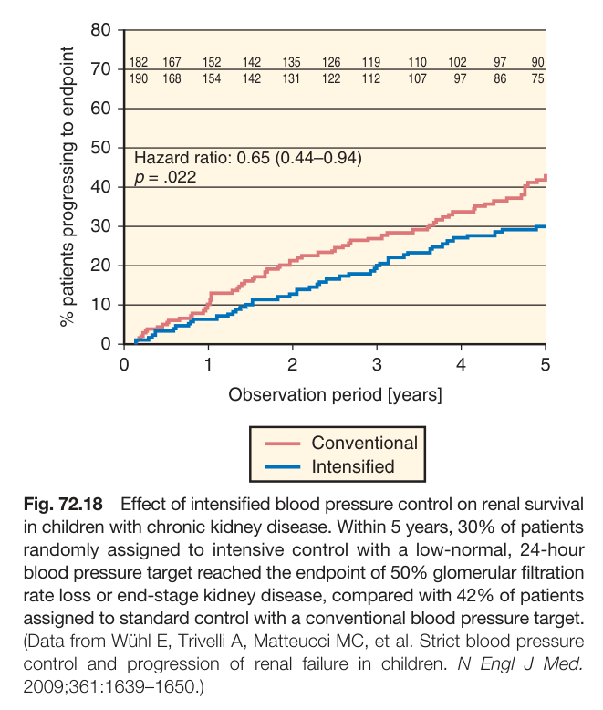

Fig. 72.18 Effect of intensified blood pressure control on renal survival in children with chronic kidney disease. Within 5 years, 30% of patients randomly assigned to intensive control with a low-normal, 24-hour blood pressure target reached the endpoint of 50% glomerular filtration rate loss or end-stage kidney disease, compared with 42% of patients assigned to standard control with a conventional blood pressure target. (Data from Wühl E, Trivelli A, Matteucci MC, et al. Strict blood pressure control and progression of renal failure in children. N Engl J Med. 2009;361:1639-1650.) (A Kaplan-Meier curve comparing intensified vs. conventional blood pressure control. The intensified control group shows a lower percentage of patients progressing to the study endpoint over 5 years, with a hazard ratio of 0.65, indicating better renal survival.)

---

## Tables

### Table_72_1

#### Table Image

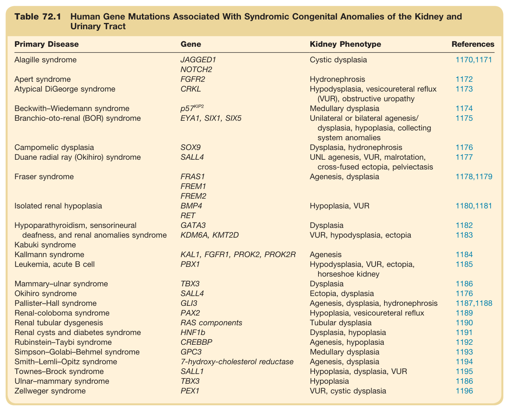

#### Table Data (CSV: [Table_72_1.csv](Table_72_1.csv))

```markdown
| Table Text (OCR) |
| :--- |
| Table 72.1 Human Gene Mutations Associated With Syndromic Congenital Anomalies of the Kidney and Urinary Tract Primary Disease  Gene  Kidney Phenotype  References    Alagille syndrome  JAGGED1NOTCH2  Cystic dysplasia  1170,1171    Apert syndrome  FGFR2  Hydronephrosis  1172    Atypical DiGeorge syndrome  CRKL  Hypodysplasia, vesicoureteral reflux (VUR), obstructive uropathy  1173    Beckwith-Wiedemann syndrome   p57^{KIP2}   Medullary dysplasia  1174    Branchio-oto-renal (BOR) syndrome  EYA1, SIX1, SIX5  Unilateral or bilateral agenesis/dysplasia, hypoplasia, collecting system anomalies  1175    Campomelic dysplasia  SOX9  Dysplasia, hydronephrosis  1176    Duane radial ray (Okihiro) syndrome  SALL4  UNL agenesis, VUR, malrotation,cross-fused ectopia, pelviectasis  1177    Fraser syndrome  FRAS1FREM1FREM2  Agenesis, dysplasia  1178,1179    Isolated renal hypoplasia  BMP4RET  Hypoplasia, VUR  1180,1181    Hypoparathyroidism, sensorineural deafness, and renal anomalies syndrome  GATA3KDM6A, KMT2D  DysplasiaVUR, hypodysplasia, ectopia  11821183    Kabuki syndrome          Kallmann syndrome  KAL1, FGFR1, PROK2, PROK2R  Agenesis  1184    Leukemia, acute B cell  PBX1  Hypodysplasia, VUR, ectopia,horseshoe kidney  1185    Mammary-ulnar syndrome  TBX3  Dysplasia  1186    Okihiro syndrome  SALL4  Ectopia, dysplasia  1176    Pallister-Hall syndrome  GLI3  Agenesis, dysplasia, hydronephrosis  1187,1188    Renal-coloboma syndrome  PAX2  Hypoplasia, vesicoureteral reflux  1189    Renal tubular dysgenesis  RAS components  Tubular dysplasia  1190    Renal cysts and diabetes syndrome  HNF1b  Dysplasia, hypoplasia  1191    Rubinstein-Taybi syndrome  CREBBP  Agenesis, hypoplasia  1192    Simpson-Golabi-Behmel syndrome  GPC3  Medullary dysplasia  1193    Smith-Lemli-Opitz syndrome  7-hydroxy-cholesterol reductase  Agenesis, dysplasia  1194    Townes-Brock syndrome  SALL1  Hypoplasia, dysplasia, VUR  1195    Ulnar-mammary syndrome  TBX3  Hypoplasia  1186    Zellweger syndrome  PEX1  VUR, cystic dysplasia  1196 |
```

Table 72.1 Human Gene Mutations Associated With Syndromic Congenital Anomalies of the Kidney and Urinary Tract | Primary Disease | Gene | Kidney Phenotype | References | | :----------------------------------------------------------- | :------------------------------ | :----------------------------------------------------------- | :--------- | | Alagille syndrome | JAGGED1, NOTCH2 | Cystic dysplasia | 1170,1171 | | Apert syndrome | FGFR2 | Hydronephrosis | 1172 | | Atypical DiGeorge syndrome | CRKL | Hypodysplasia, vesicoureteral reflux (VUR), obstructive uropathy | 1173 | | Beckwith-Wiedemann syndrome | p57KIP2 | Medullary dysplasia | 1174 | | Branchio-oto-renal (BOR) syndrome | EYA1, SIX1, SIX5 | Unilateral or bilateral agenesis/dysplasia, hypoplasia, collecting system anomalies | 1175 | | Campomelic dysplasia | SOX9 | Dysplasia, hydronephrosis | 1176 | | Duane radial ray (Okihiro) syndrome | SALL4 | UNL agenesis, VUR, malrotation, cross-fused ectopia, pelviectasis | 1177 | | Fraser syndrome | FRAS1, FREM1, FREM2 | Agenesis, dysplasia | 1178,1179 | | Isolated renal hypoplasia | BMP4, RET | Hypoplasia, VUR | 1180,1181 | | Hypoparathyroidism, sensorineural deafness, and renal anomalies syndrome | GATA3 | Dysplasia | 1182 | | Kabuki syndrome | KDM6A, KMT2D | VUR, hypodysplasia, ectopia | 1183 | | Kallmann syndrome | KAL1, FGFR1, PROK2, PROK2R | Agenesis | 1184 | | Leukemia, acute B cell | PBX1 | Hypodysplasia, VUR, ectopia, horseshoe kidney | 1185 | | Mammary-ulnar syndrome | TBX3 | Dysplasia | 1186 | | Okihiro syndrome | SALL4 | Ectopia, dysplasia | 1176 | | Pallister-Hall syndrome | GL13 | Agenesis, dysplasia, hydronephrosis | 1187,1188 | | Renal-coloboma syndrome | PAX2 | Hypoplasia, vesicoureteral reflux | 1189 | | Renal tubular dysgenesis | RAS components | Tubular dysplasia | 1190 | | Renal cysts and diabetes syndrome | HNF1b | Dysplasia, hypoplasia | 1191 | | Rubinstein-Taybi syndrome | CREBBP | Agenesis, hypoplasia | 1192 | | Simpson-Golabi-Behmel syndrome | GPC3 | Medullary dysplasia | 1193 | | Smith-Lemli-Opitz syndrome | 7-hydroxy-cholesterol reductase | Agenesis, dysplasia | 1194 | | Townes-Brock syndrome | SALL1 | Hypoplasia, dysplasia, VUR | 1195 | | Ulnar-mammary syndrome | TBX3 | Hypoplasia | 1186 | | Zellweger syndrome | PEX1 | VUR, cystic dysplasia | 1196 |

---

### Table_72_2

#### Table Image

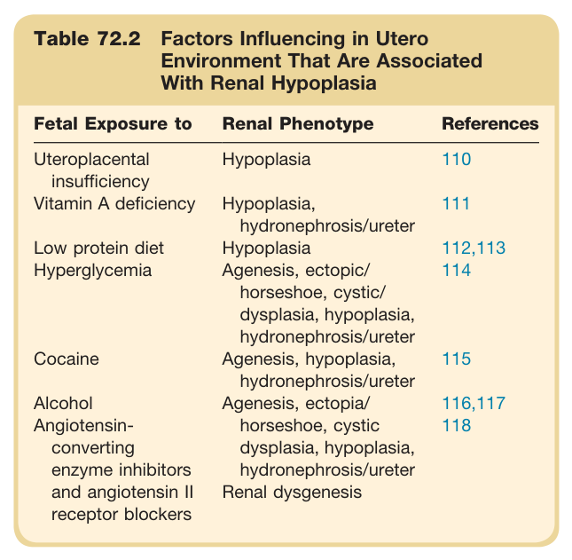

#### Table Data (CSV: [Table_72_2.csv](Table_72_2.csv))

```markdown
| Table Text (OCR) |
| :--- |
| Table 72.2 Factors Influencing in Utero Environment That Are Associated With Renal Hypoplasia Fetal Exposure to  Renal Phenotype  References    Uteroplacental insufficiency  Hypoplasia  110    Vitamin A deficiency  Hypoplasia, hydronephrosis/ureter  111    Low protein diet  Hypoplasia  112,113    Hyperglycemia  Agenesis, ectopic/horseshoe, cystic/dysplasia, hypoplasia, hydronephrosis/ureter  114    Cocaine  Agenesis, hypoplasia, hydronephrosis/ureter  115    Alcohol  Agenesis, ectopia/horseshoe, cystic  116,117    Angiotensin-converting enzyme inhibitors and angiotensin II receptor blockers  dysplasia, hypoplasia, hydronephrosis/ureter Renal dysgenesis  118 |
```

Table 72.2 Factors Influencing in Utero Environment That Are Associated With Renal Hypoplasia | Fetal Exposure to | Renal Phenotype | References | | :----------------------------------------------------------- | :----------------------------------------------------------- | :--------- | | Uteroplacental insufficiency | Hypoplasia | 110 | | Vitamin A deficiency | Hypoplasia, hydronephrosis/ureter | 111 | | Low protein diet | Hypoplasia | 112,113 | | Hyperglycemia | Agenesis, ectopic/horseshoe, cystic/dysplasia, hypoplasia, hydronephrosis/ureter | 114 | | Cocaine | Agenesis, hypoplasia, hydronephrosis/ureter | 115 | | Alcohol | Agenesis, ectopia/horseshoe, cystic dysplasia, hypoplasia, hydronephrosis/ureter | 116,117 | | Angiotensin-converting enzyme inhibitors and angiotensin II receptor blockers | Renal dysgenesis | 118 |

---

### Table_72_3

#### Table Image

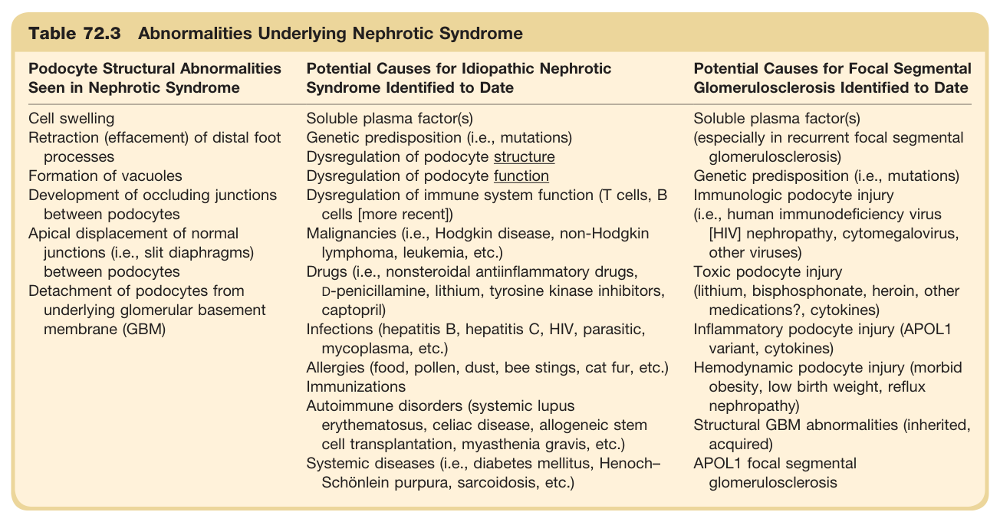

#### Table Data (CSV: [Table_72_3.csv](Table_72_3.csv))

```markdown
| Table Text (OCR) |
| :--- |
| Table 72.3 Abnormalities Underlying Nephrotic Syndrome Podocyte Structural Abnormalities Seen in Nephrotic Syndrome  Potential Causes for Idiopathic Nephrotic Syndrome Identified to Date  Potential Causes for Focal Segmental Glomerulosclerosis Identified to Date    Cell swellingRetraction (effacement) of distal foot processesFormation of vacuolesDevelopment of occluding junctions between podocytesApical displacement of normal junctions (i.e., slit diaphragms) between podocytesDetachment of podocytes from underlying glomerular basement membrane (GBM)  Soluble plasma factor(s)Genetic predisposition (i.e., mutations)Dysregulation of podocyte structureDysregulation of podocyte functionDysregulation of immune system function (T cells, B cells [more recent])Malignancies (i.e., Hodgkin disease, non-Hodgkin lymphoma, leukemia, etc.)Drugs (i.e., nonsteroidal antiinflammatory drugs, D-penicillamine, lithium, tyrosine kinase inhibitors, captopril)Infections (hepatitis B, hepatitis C, HIV, parasitic, mycoplasma, etc.)Allergies (food, pollen, dust, bee stings, cat fur, etc.)ImmunizationsAutoimmune disorders (systemic lupus erythematosus, celiac disease, allogeneic stem cell transplantation, myasthenia gravis, etc.)Systemic diseases (i.e., diabetes mellitus, Henoch-Schönlein purpura, sarcoidosis, etc.)  Soluble plasma factor(s)(especially in recurrent focal segmental glomerulosclerosis)Genetic predisposition (i.e., mutations)Immunologic podocyte injury (i.e., human immunodeficiency virus [HIV] nephropathy, cytomegalovirus, other viruses)Toxic podocyte injury (lithium, bisphosphonate, heroin, other medications?, cytokines)Inflammatory podocyte injury (APOL1 variant, cytokines)Hemodynamic podocyte injury (morbid obesity, low birth weight, reflux nephropathy)Structural GBM abnormalities (inherited, acquired)APOL1 focal segmental glomerulosclerosis |
```

Table 72.3 Abnormalities Underlying Nephrotic Syndrome | Podocyte Structural Abnormalities Seen in Nephrotic Syndrome | Potential Causes for Idiopathic Nephrotic Syndrome Identified to Date | Potential Causes for Focal Segmental Glomerulosclerosis Identified to Date | | :----------------------------------------------------------- | :----------------------------------------------------------- | :----------------------------------------------------------- | | Cell swelling | Soluble plasma factor(s) | Soluble plasma factor(s) (especially in recurrent focal segmental glomerulosclerosis) | | Retraction (effacement) of distal foot processes | Genetic predisposition (i.e., mutations) | Genetic predisposition (i.e., mutations) | | Formation of vacuoles | Dysregulation of podocyte structure | Immunologic podocyte injury (i.e., human immunodeficiency virus [HIV] nephropathy, cytomegalovirus, other viruses) | | Development of occluding junctions between podocytes | Dysregulation of podocyte function | Toxic podocyte injury (lithium, bisphosphonate, heroin, other medications?, cytokines) | | Apical displacement of normal junctions (i.e., slit diaphragms) between podocytes | Dysregulation of immune system function (T cells, B cells [more recent]) | Inflammatory podocyte injury (APOL1 variant, cytokines) | | Detachment of podocytes from underlying glomerular basement membrane (GBM) | Malignancies (i.e., Hodgkin disease, non-Hodgkin lymphoma, leukemia, etc.) | Hemodynamic podocyte injury (morbid obesity, low birth weight, reflux nephropathy) | | | Drugs (i.e., nonsteroidal antiinflammatory drugs, D-penicillamine, lithium, tyrosine kinase inhibitors, captopril) | Structural GBM abnormalities (inherited, acquired) | | | Infections (hepatitis B, hepatitis C, HIV, parasitic, mycoplasma, etc.) | APOL1 focal segmental glomerulosclerosis | | | Allergies (food, pollen, dust, bee stings, cat fur, etc.) | | | | Immunizations | | | | Autoimmune disorders (systemic lupus erythematosus, celiac disease, allogeneic stem cell transplantation, myasthenia gravis, etc.) | | | | Systemic diseases (i.e., diabetes mellitus, Henoch-Schönlein purpura, sarcoidosis, etc.) | |

---

### Table_72_4

#### Table Image

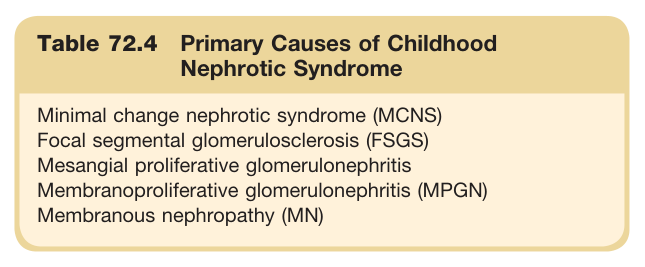

#### Table Data (CSV: [Table_72_4.csv](Table_72_4.csv))

```markdown
| Table Text (OCR) |
| :--- |
| Table 72.4 Primary Causes of Childhood Nephrotic Syndrome Minimal change nephrotic syndrome (MCNS) Focal segmental glomerulosclerosis (FSGS) Mesangial proliferative glomerulonephritis Membranoproliferative glomerulonephritis (MPGN) Membranous nephropathy (MN) |
```

Table 72.4 Primary Causes of Childhood Nephrotic Syndrome * Minimal change nephrotic syndrome (MCNS) * Focal segmental glomerulosclerosis (FSGS) * Mesangial proliferative glomerulonephritis * Membranoproliferative glomerulonephritis (MPGN) * Membranous nephropathy (MN)

---

### Table_72_5

#### Table Image

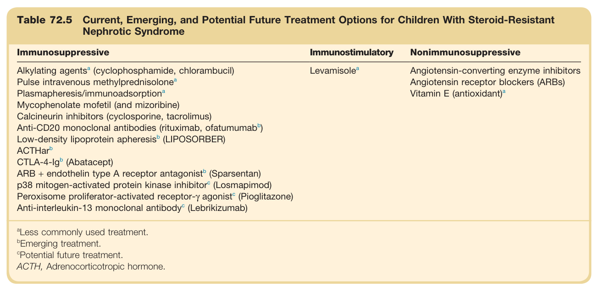

#### Table Data (CSV: [Table_72_5.csv](Table_72_5.csv))

```markdown
| Table Text (OCR) |
| :--- |
| Table 72.5 Current, Emerging, and Potential Future Treatment Options for Children With Steroid-Resistant Nephrotic Syndrome Immunosuppressive  Immunostimulatory  Nonimmunosuppressive    Alkylating agentsa(cyclophosphamide, chlorambucil)  Levamisolea  Angiotensin-converting enzyme inhibitors    Pulse intravenous methylprednisolonea    Angiotensin receptor blockers (ARBs)    Plasmapheresis/immunoadsorptiona    Vitamin E (antioxidant)a    Mycophenolate mofetil (and mizoribine)        Calcineurin inhibitors (cyclosporine, tacrolimus)        Anti-CD20 monoclonal antibodies (rituximab, ofatumumabb)        Low-density lipoprotein apheresisb(LIPOSORBER)        ACTHarb        CTLA-4-Igb(Abatacept)        ARB + endothelin type A receptor antagonistb(Sparsentan)        p38 mitogen-activated protein kinase inhibitorc(Losmapimod)        Peroxisome proliferator-activated receptor-γ agonistc(Pioglitazone)        Anti-interleukin-13 monoclonal antibodyc(Lebrikizumab)        aLess commonly used treatment.    bEmerging treatment.    cPotential future treatment.    ACTH, Adrenocorticotropic hormone. |
```

Table 72.5 Current, Emerging, and Potential Future Treatment Options for Children With Steroid-Resistant Nephrotic Syndrome | Immunosuppressive | Immunostimulatory | Nonimmunosuppressive | | :----------------------------------------------------------- | :---------------- | :--------------------------------------- | | Alkylating agents (cyclophosphamide, chlorambucil) | Levamisole | Angiotensin-converting enzyme inhibitors | | Pulse intravenous methylprednisolone | | Angiotensin receptor blockers (ARBs) | | Plasmapheresis/immunoadsorption | | Vitamin E (antioxidant) | | Mycophenolate mofetil (and mizoribine) | | | | Calcineurin inhibitors (cyclosporine, tacrolimus) | | | | Anti-CD20 monoclonal antibodies (rituximab, ofatumumab) | | | | Low-density lipoprotein apheresis (LIPOSORBER) | | | | ACTHar | | | | CTLA-4-Ig (Abatacept) | | | | ARB + endothelin type A receptor antagonist (Sparsentan) | | | | p38 mitogen-activated protein kinase inhibitor (Losmapimod) | | | | Peroxisome proliferator-activated receptor-y agonist (Pioglitazone) | | | | Anti-interleukin-13 monoclonal antibody (Lebrikizumab) | | | | *Less commonly used treatment.* | | | | *Emerging treatment.* | | | | *Potential future treatment.* | | | | *ACTH, Adrenocorticotropic hormone.* | | |

---

### Table_72_6

#### Table Image

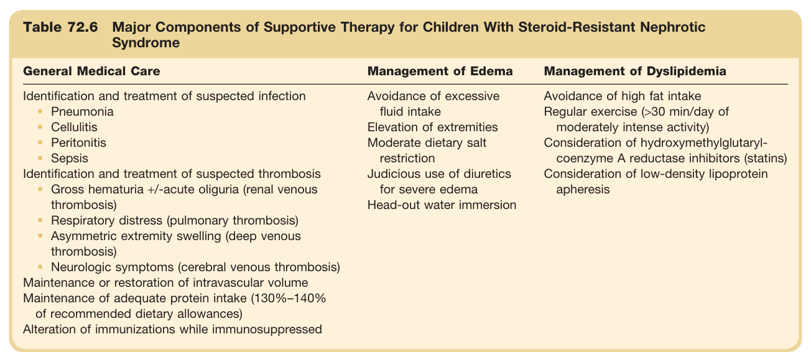

#### Table Data (CSV: [Table_72_6.csv](Table_72_6.csv))

```markdown
| Table Text (OCR) |
| :--- |
| Table 72.6 Major Components of Supportive Therapy for Children With Steroid-Resistant Nephrotic Syndrome General Medical Care  Management of Edema  Management of Dyslipidemia    Identification and treatment of suspected infectionPneumoniaCellulitisPeritonitisSepsisIdentification and treatment of suspected thrombosisGross hematuria +/-acute oliguria (renal venous thrombosis)Respiratory distress (pulmonary thrombosis)Asymmetric extremity swelling (deep venous thrombosis)Neurologic symptoms (cerebral venous thrombosis)Maintenance or restoration of intravascular volumeMaintenance of adequate protein intake (130%-140% of recommended dietary allowances)Alteration of immunizations while immunosuppressed  Avoidance of excessive fluid intakeElevation of extremitiesModerate dietary salt restrictionJudicious use of diuretics for severe edemaHead-out water immersion  Avoidance of high fat intakeRegular exercise (>30 min/day of moderately intense activity)Consideration of hydroxymethylglutaryl-coenzyme A reductase inhibitors (statins)Consideration of low-density lipoprotein apheresis |
```

Table 72.6 Major Components of Supportive Therapy for Children With Steroid-Resistant Nephrotic Syndrome | General Medical Care | Management of Edema | Management of Dyslipidemia | | :----------------------------------------------------------- | :------------------------------------------ | :----------------------------------------------------------- | | Identification and treatment of suspected infection (Pneumonia, Cellulitis, Peritonitis, Sepsis) | Avoidance of excessive fluid intake | Avoidance of high fat intake | | Identification and treatment of suspected thrombosis (Gross hematuria +/-acute oliguria (renal venous thrombosis), Respiratory distress (pulmonary thrombosis), Asymmetric extremity swelling (deep venous thrombosis), Neurologic symptoms (cerebral venous thrombosis)) | Elevation of extremities | Regular exercise (>30 min/day of moderately intense activity) | | Maintenance or restoration of intravascular volume | Moderate dietary salt restriction | Consideration of hydroxymethylglutaryl-coenzyme A reductase inhibitors (statins) | | Maintenance of adequate protein intake (130%-140% of recommended dietary allowances) | Judicious use of diuretics for severe edema | Consideration of low-density lipoprotein apheresis | | Alteration of immunizations while immunosuppressed | Head-out water immersion | |

---

### Table_72_7

#### Table Image

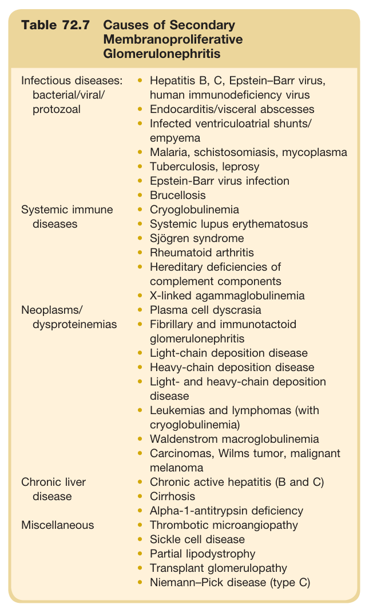

#### Table Data (CSV: [Table_72_7.csv](Table_72_7.csv))

```markdown
| Table Text (OCR) |
| :--- |
| Table 72.7 Causes of Secondary Membranoproliferative Glomerulonephritis Infectious diseases:bacterial/viral/protozoal  Hepatitis B, C, Epstein-Barr virus,human immunodeficiency virusEndocarditis/visceral abscessesInfected ventriculoatrial shunts/empyemaMalaria, schistosomiasis, mycoplasmaTuberculosis, leprosyEpstein-Barr virus infectionBrucellosis    Systemic immunediseases  CryoglobulinemiaSystemic lupus erythematosusSjögren syndromeRheumatoid arthritisHereditary deficiencies ofcomplement componentsX-linked agammaglobulinemia    Neoplasms/dysproteinemias  Plasma cell dyscrasiaFibrillary and immunotactoidglomerulonephritisLight-chain deposition diseaseHeavy-chain deposition diseaseLight- and heavy-chain depositiondiseaseLeukemias and lymphomas (withcryoglobulinemia)Waldenstrom macroglobulinemiaCarcinomas, Wilms tumor, malignantmelanoma    Chronic liverdisease  Chronic active hepatitis (B and C)CirrhosisAlpha-1-antitrypsin deficiency    Miscellaneous  Thrombotic microangiopathySickle cell diseasePartial lipodystrophyTransplant glomerulopathyNiemann-Pick disease (type C) |
```

Table 72.7 Causes of Secondary Membranoproliferative Glomerulonephritis | Category | Causes | | :------------------------------------------------- | :----------------------------------------------------------- | | **Infectious diseases: bacterial/viral/protozoal** | Hepatitis B, C, Epstein-Barr virus, human immunodeficiency virus; Endocarditis/visceral abscesses; Infected ventriculoatrial shunts/empyema; Malaria, schistosomiasis, mycoplasma; Tuberculosis, leprosy; Epstein-Barr virus infection; Brucellosis | | **Systemic immune diseases** | Cryoglobulinemia; Systemic lupus erythematosus; Sjögren syndrome; Rheumatoid arthritis; Hereditary deficiencies of complement components | | **Neoplasms/dysproteinemias** | X-linked agammaglobulinemia; Plasma cell dyscrasia; Fibrillary and immunotactoid glomerulonephritis; Light-chain deposition disease; Heavy-chain deposition disease; Light- and heavy-chain deposition disease; Leukemias and lymphomas (with cryoglobulinemia); Waldenstrom macroglobulinemia; Carcinomas, Wilms tumor, malignant melanoma | | **Chronic liver disease** | Chronic active hepatitis (B and C); Cirrhosis; Alpha-1-antitrypsin deficiency | | **Miscellaneous** | Thrombotic microangiopathy; Sickle cell disease; Partial lipodystrophy; Transplant glomerulopathy; Niemann-Pick disease (type C) |

---

### Table_72_8

#### Table Image

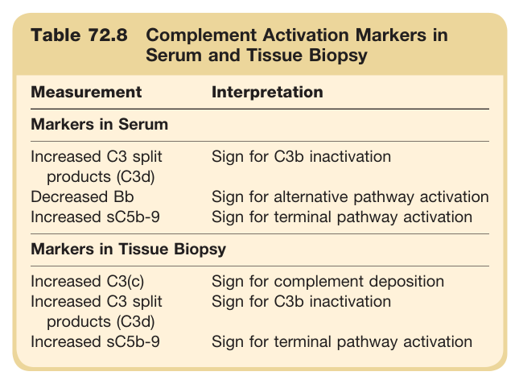

#### Table Data (CSV: [Table_72_8.csv](Table_72_8.csv))

```markdown
| Table Text (OCR) |
| :--- |
| Table 72.8 Complement Activation Markers in Serum and Tissue Biopsy Measurement  Interpretation    Markers in Serum    Increased C3 split products (C3d)  Sign for C3b inactivation    Decreased Bb  Sign for alternative pathway activation    Increased sC5b-9  Sign for terminal pathway activation    Markers in Tissue Biopsy    Increased C3(c)  Sign for complement deposition    Increased C3 split products (C3d)  Sign for C3b inactivation    Increased sC5b-9  Sign for terminal pathway activation |
```

Table 72.8 Complement Activation Markers in Serum and Tissue Biopsy | Measurement | Interpretation | | :-------------------------------- | :-------------------------------------- | | **Markers in Serum** | | | Increased C3 split products (C3d) | Sign for C3b inactivation | | Decreased Bb | Sign for alternative pathway activation | | Increased sC5b-9 | Sign for terminal pathway activation | | **Markers in Tissue Biopsy** | | | Increased C3(c) | Sign for complement deposition | | Increased C3 split products (C3d) | Sign for C3b inactivation | | Increased sC5b-9 | Sign for terminal pathway activation |

---

### Table_72_9

#### Table Image

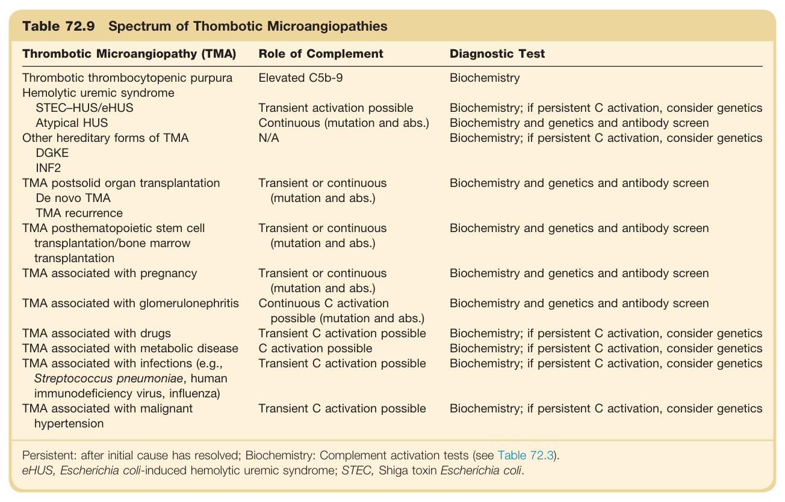

#### Table Data (CSV: [Table_72_9.csv](Table_72_9.csv))

```markdown
| Table Text (OCR) |
| :--- |
| Table 72.9 Spectrum of Thombotic Microangiopathies Thrombotic Microangiopathy (TMA)  Role of Complement  Diagnostic Test    Thrombotic thrombocytopenic purpura  Elevated C5b-9  Biochemistry    Hemolytic uremic syndrome        STEC-HUS/eHUS  Transient activation possible  Biochemistry; if persistent C activation, consider genetics    Atypical HUS  Continuous (mutation and abs.)  Biochemistry and genetics and antibody screen    Other hereditary forms of TMA  N/A  Biochemistry; if persistent C activation, consider genetics    DGKE        INF2        TMA postsolid organ transplantation  Transient or continuous  Biochemistry and genetics and antibody screen    De novo TMA  (mutation and abs.)      TMA recurrence        TMA posthematopoietic stem cell transplantation/bone marrow transplantation  Transient or continuous  Biochemistry and genetics and antibody screen    (mutation and abs.)      TMA associated with pregnancy  Transient or continuous  Biochemistry and genetics and antibody screen    (mutation and abs.)      TMA associated with glomerulonephritis  Continuous C activation possible (mutation and abs.)  Biochemistry and genetics and antibody screen    TMA associated with drugs  Transient C activation possible  Biochemistry; if persistent C activation, consider genetics    TMA associated with metabolic disease  C activation possible  Biochemistry; if persistent C activation, consider genetics    TMA associated with infections (e.g., Streptococcus pneumoniae, human immunodeficiency virus, influenza)  Transient C activation possible  Biochemistry; if persistent C activation, consider genetics    TMA associated with malignant hypertension  Transient C activation possible  Biochemistry; if persistent C activation, consider genetics Persistent: after initial cause has resolved; Biochemistry: Complement activation tests (see Table 72.3). eHUS, Escherichia coli-induced hemolytic uremic syndrome; STEC, Shiga toxin Escherichia coli. |
```

Table 72.9 Spectrum of Thombotic Microangiopathies | Thrombotic Microangiopathy (TMA) | Role of Complement | Diagnostic Test | | :----------------------------------------------------------- | :--------------------------------------------------- | :---------------------------------------------------------- | | Thrombotic thrombocytopenic purpura | Elevated C5b-9 | Biochemistry | | **Hemolytic uremic syndrome** | | | | STEC-HUS/eHUS | Transient activation possible | Biochemistry; if persistent C activation, consider genetics | | Atypical HUS | Continuous (mutation and abs.) | Biochemistry and genetics and antibody screen | | **Other hereditary forms of TMA** | | | | DGKE | N/A | Biochemistry; if persistent C activation, consider genetics | | INF2 | | | | **TMA postsolid organ transplantation** | | | | De novo TMA | Transient or continuous (mutation and abs.) | Biochemistry and genetics and antibody screen | | TMA recurrence | | | | TMA posthematopoietic stem cell transplantation/bone marrow transplantation | Transient or continuous (mutation and abs.) | Biochemistry and genetics and antibody screen | | TMA associated with pregnancy | Transient or continuous (mutation and abs.) | Biochemistry and genetics and antibody screen | | TMA associated with glomerulonephritis | Continuous C activation possible (mutation and abs.) | Biochemistry and genetics and antibody screen | | TMA associated with drugs | Transient C activation possible | Biochemistry; if persistent C activation, consider genetics | | TMA associated with metabolic disease | C activation possible | Biochemistry; if persistent C activation, consider genetics | | TMA associated with infections (e.g., Streptococcus pneumoniae, human immunodeficiency virus, influenza) | Transient C activation possible | Biochemistry; if persistent C activation, consider genetics | | TMA associated with malignant hypertension | Transient C activation possible | Biochemistry; if persistent C activation, consider genetics | | Persistent: after initial cause has resolved; Biochemistry: Complement activation tests (see Table 72.3). eHUS, Escherichia coli-induced hemolytic uremic syndrome; STEC, Shiga toxin Escherichia coli. | | |

---

### Table_72_10

#### Table Image

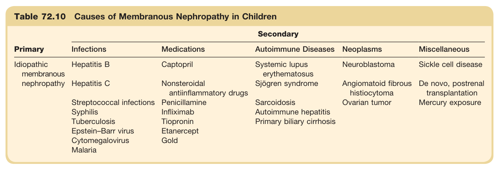

#### Table Data (CSV: [Table_72_10.csv](Table_72_10.csv))

```markdown
| Table Text (OCR) |
| :--- |
| Table 72.10 Causes of Membranous Nephropathy in Children Primary  Secondary    Infections  Medications  Autoimmune Diseases  Neoplasms  Miscellaneous    Idiopathic membranous nephropathy  Hepatitis B  Captopril  Systemic lupus erythematosus  Neuroblastoma  Sickle cell disease    Hepatitis C  Nonsteroidal antiinflammatory drugs  Sjögren syndrome  Angiomatoid fibrous histiocytoma  De novo, postrenal transplantation    Streptococcal infections  Penicillamine  Sarcoidosis  Ovarian tumor  Mercury exposure    Syphilis  Infliximab  Autoimmune hepatitis        Tuberculosis  Tiopronin  Primary biliary cirrhosis        Epstein-Barr virus  Etanercept          Cytomegalovirus  Gold          Malaria |
```

Table 72.10 Causes of Membranous Nephropathy in Children | Primary | Infections | Medications | Secondary | | :------------------------------------ | :----------------------------------------------------------- | :----------------------------------------------------------- | :----------------------------------------------------------- | | **Idiopathic membranous nephropathy** | Hepatitis B, Hepatitis C, Streptococcal infections, Syphilis, Tuberculosis, Epstein-Barr virus, Cytomegalovirus, Malaria | Captopril, Nonsteroidal antiinflammatory drugs, Penicillamine, Infliximab, Tiopronin, Etanercept, Gold | **Autoimmune Diseases**: Systemic lupus erythematosus, Sjögren syndrome, Sarcoidosis, Autoimmune hepatitis, Primary biliary cirrhosis<br>**Neoplasms**: Neuroblastoma, Angiomatoid fibrous histiocytoma, Ovarian tumor<br>**Miscellaneous**: Sickle cell disease, De novo, postrenal transplantation, Mercury exposure |

---

### Table_72_11

#### Table Image

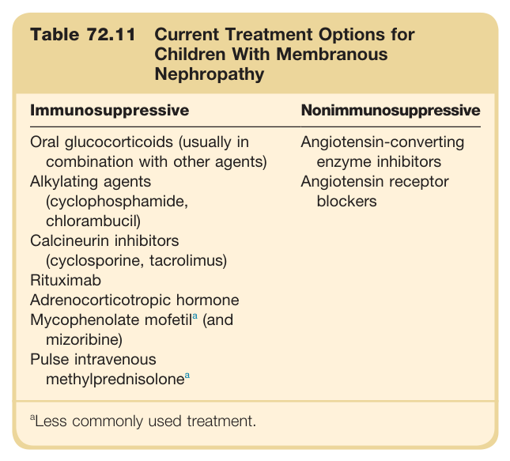

#### Table Data (CSV: [Table_72_11.csv](Table_72_11.csv))

```markdown
| Table Text (OCR) |
| :--- |
| Table 72.11 Current Treatment Options for Children With Membranous Nephropathy Immunosuppressive  Nonimmunosuppressive    Oral glucocorticoids (usually in combination with other agents)  Angiotensin-converting enzyme inhibitors    Alkylating agents (cyclophosphamide, chlorambucil)  Angiotensin receptor blockers    Calcineurin inhibitors (cyclosporine, tacrolimus)      Rituximab      Adrenocorticotropic hormone      Mycophenolate mofetila(and mizoribine)      Pulse intravenous methylprednisolonea      aLess commonly used treatment. |
```

Table 72.11 Current Treatment Options for Children With Membranous Nephropathy | Immunosuppressive | Nonimmunosuppressive | | :----------------------------------------------------------- | :--------------------------------------- | | Oral glucocorticoids (usually in combination with other agents) | Angiotensin-converting enzyme inhibitors | | Alkylating agents (cyclophosphamide, chlorambucil) | Angiotensin receptor blockers | | Calcineurin inhibitors (cyclosporine, tacrolimus) | | | Rituximab | | | Adrenocorticotropic hormone | | | Mycophenolate mofetila (and mizoribine) | | | Pulse intravenous methylprednisolonea | | | *ªLess commonly used treatment.* | |

---

### Table_72_12

#### Table Image

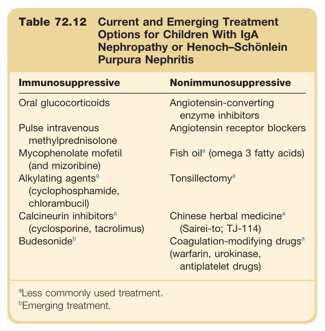

#### Table Data (CSV: [Table_72_12.csv](Table_72_12.csv))

```markdown
| Table Text (OCR) |
| :--- |
| Table 72.12 Current and Emerging Treatment Options for Children With IgA Nephropathy or Henoch–Schönlein Purpura Nephritis Immunosuppressive  Nonimmunosuppressive    Oral glucocorticoids  Angiotensin-converting enzyme inhibitors    Pulse intravenous methylprednisolone  Angiotensin receptor blockers    Mycophenolate mofetil (and mizoribine)  Fish oil ^{a}  (omega 3 fatty acids)    Alkylating agents ^{a}  (cyclophosphamide, chlorambucil)  Tonsillectomy ^{a}     Calcineurin inhibitors ^{a}  (cyclosporine, tacrolimus)  Chinese herbal medicine ^{a}  (Sairei-to; TJ-114)    Budesonide ^{b}   Coagulation-modifying drugs ^{a}  (warfarin, urokinase, antiplatelet drugs) <sup>a</sup>Less commonly used treatment. <sup>b</sup>Emerging treatment. |
```

Table 72.12 Current and Emerging Treatment Options for Children With IgA Nephropathy or Henoch-Schönlein Purpura Nephritis | Immunosuppressive | Nonimmunosuppressive | | :------------------------------------------------- | :----------------------------------------------------------- | | Oral glucocorticoids | Angiotensin-converting enzyme inhibitors | | Pulse intravenous methylprednisolone | Angiotensin receptor blockers | | Mycophenolate mofetil (and mizoribine) | Fish oil (omega 3 fatty acids) | | Alkylating agents (cyclophosphamide, chlorambucil) | Tonsillectomy | | Calcineurin inhibitors (cyclosporine, tacrolimus) | Chinese herbal medicine (Sairei-to; TJ-114) | | Budesonide | Coagulation-modifying drugs (warfarin, urokinase, antiplatelet drugs) | | *ªLess commonly used treatment.* | | | *Emerging treatment.* | |

---

### Table_72_13

#### Table Image

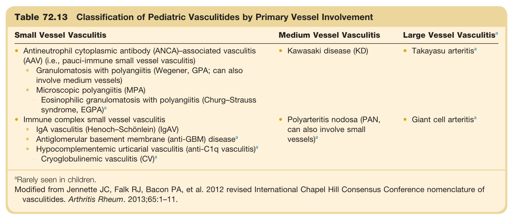

#### Table Data (CSV: [Table_72_13.csv](Table_72_13.csv))

```markdown
| Table Text (OCR) |
| :--- |
| Table 72.13 Classification of Pediatric Vasculitides by Primary Vessel Involvement Small Vessel Vasculitis  Medium Vessel Vasculitis  Large Vessel Vasculitisa    Antineutrophil cytoplasmic antibody (ANCA)-associated vasculitis (AAV) (i.e., pauci-immune small vessel vasculitis)Granulomatosis with polyangiitis (Wegener, GPA; can also involve medium vessels)Microscopic polyangiitis (MPA)Eosinophilic granulomatosis with polyangiitis (Churg-Strauss syndrome, EGPA)aImmune complex small vessel vasculitisIgA vasculitis (Henoch-Schönlein) (IgAV)Antiglomerular basement membrane (anti-GBM) diseaseaHypocomplementemic urticarial vasculitis (anti-C1q vasculitis)aCryoglobulinemic vasculitis (CV)a  Kawasaki disease (KD)Polyarteritis nodosa (PAN, can also involve small vessels)a  Takayasu arteritisaGiant cell arteritisa <sup>a</sup>Rarely seen in children. Modified from Jennette JC, Falk RJ, Bacon PA, et al. 2012 revised International Chapel Hill Consensus Conference nomenclature of vasculitides. Arthritis Rheum. 2013;65:1–11. |
```

Table 72.13 Classification of Pediatric Vasculitides by Primary Vessel Involvement | Small Vessel Vasculitis | Medium Vessel Vasculitis | Large Vessel Vasculitis | | :----------------------------------------------------------- | :--------------------------------------------------------- | :---------------------- | | Antineutrophil cytoplasmic antibody (ANCA)-associated vasculitis (AAV) (i.e., pauci-immune small vessel vasculitis) | Kawasaki disease (KD) | Takayasu arteritis | | Granulomatosis with polyangiitis (Wegener, GPA; can also involve medium vessels) | Polyarteritis nodosa (PAN, can also involve small vessels) | Giant cell arteritis | | Microscopic polyangiitis (MPA) | | | | Eosinophilic granulomatosis with polyangiitis (Churg-Strauss syndrome, EGPA) | | | | Immune complex small vessel vasculitis | | | | IgA vasculitis (Henoch-Schönlein) (IgAV) | | | | Antiglomerular basement membrane (anti-GBM) disease | | | | Hypocomplementemic urticarial vasculitis (anti-C1q vasculitis) | | | | Cryoglobulinemic vasculitis (CV) | | | | *Rarely seen in children.* | | | | *Modified from Jennette JC, Falk RJ, Bacon PA, et al. 2012 revised International Chapel Hill Consensus Conference nomenclature of vasculitides. Arthritis Rheum. 2013;65:1-11.* | | |

---

### Table_72_14

#### Table Image

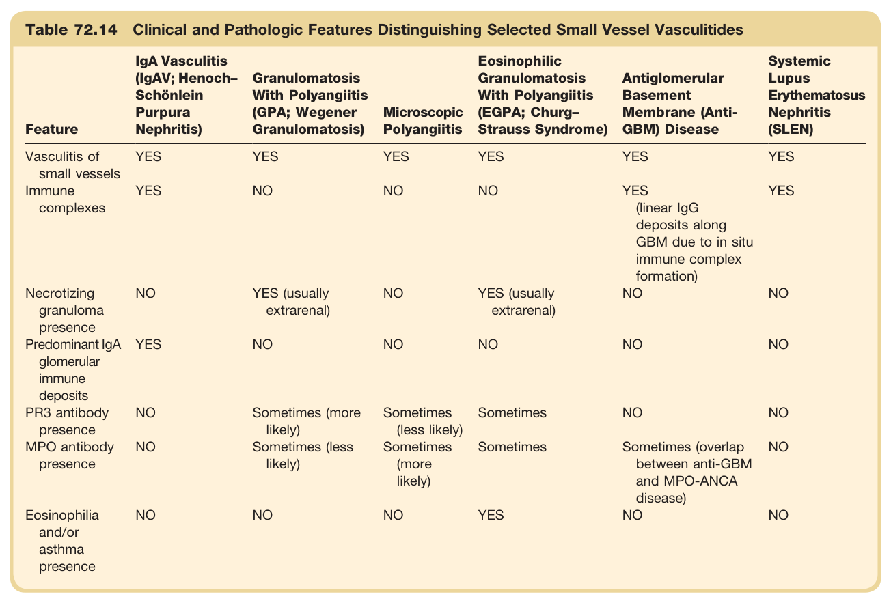

#### Table Data (CSV: [Table_72_14.csv](Table_72_14.csv))

```markdown
| Table Text (OCR) |
| :--- |
| Table 72.14 Clinical and Pathologic Features Distinguishing Selected Small Vessel Vasculitides Feature  IgA Vasculitis (IgAV; Henoch-Schönlein Purpura Nephritis)  Granulomatosis With Polyangiitis (GPA; Wegener Granulomatosis)  Microscopic Polyangiitis  Eosinophilic Granulomatosis With Polyangiitis (EGPA; Churg-Strauss Syndrome)  Antiglomerular Basement Membrane (Anti-GBM) Disease  Systemic Lupus Erythematosus Nephritis (SLEN)    Vasculitis of small vessels  YES  YES  YES  YES  YES  YES    Immune complexes  YES  NO  NO  NO  YES(linear IgG deposits along GBM due to in situ immune complex formation)  YES    Necrotizing granuloma presence  NO  YES (usually extrarenal)  NO  YES (usually extrarenal)  NO  NO    Predominant IgA glomerular immune deposits  YES  NO  NO  NO  NO  NO    PR3 antibody presence  NO  Sometimes (more likely)  Sometimes (less likely)  Sometimes  NO  NO    MPO antibody presence  NO  Sometimes (less likely)  Sometimes (more likely)  Sometimes  Sometimes (overlap between anti-GBM and MPO-ANCA disease)  NO    Eosinophilia and/or asthma presence  NO  NO  NO  YES  NO  NO |
```

Table 72.14 Clinical and Pathologic Features Distinguishing Selected Small Vessel Vasculitides | Feature | IgA Vasculitis (IgAV; Henoch-Schönlein Purpura Nephritis) | Granulomatosis With Polyangiitis (GPA; Wegener Granulomatosis) | Microscopic Polyangiitis | Eosinophilic Granulomatosis With Polyangiitis (EGPA; Churg-Strauss Syndrome) | Antiglomerular Basement Membrane (Anti-GBM) Disease | Systemic Lupus Erythematosus Nephritis (SLEN) | | :----------------------------------------- | :-------------------------------------------------------- | :----------------------------------------------------------- | :----------------------- | :----------------------------------------------------------- | :----------------------------------------------------------- | :-------------------------------------------- | | Vasculitis of small vessels | YES | YES | YES | YES | YES | YES | | Immune complexes | YES | NO | NO | NO | YES (linear IgG deposits along GBM due to in situ immune complex formation) | YES | | Necrotizing granuloma presence | NO | YES (usually extrarenal) | NO | YES (usually extrarenal) | NO | NO | | Predominant IgA glomerular immune deposits | YES | NO | NO | NO | NO | NO | | PR3 antibody presence | NO | Sometimes (more likely) | Sometimes (less likely) | Sometimes | NO | NO | | MPO antibody presence | NO | Sometimes (less likely) | Sometimes (more likely) | Sometimes | Sometimes (overlap between anti-GBM and MPO-ANCA disease) | NO | | Eosinophilia and/or asthma presence | NO | NO | NO | YES | NO | NO |

---

### Table_72_15

#### Table Image

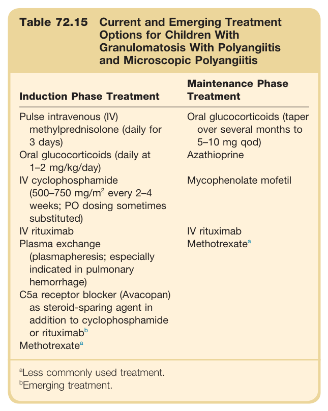

#### Table Data (CSV: [Table_72_15.csv](Table_72_15.csv))

```markdown
| Table Text (OCR) |
| :--- |
| Table 72.15 Current and Emerging Treatment Options for Children With Granulomatosis With Polyangiitis and Microscopic Polyangiitis Induction Phase Treatment  Maintenance Phase Treatment    Pulse intravenous (IV)methylprednisolone (daily for 3 days)  Oral glucocorticoids (taper over several months to 5–10 mg qod)    Oral glucocorticoids (daily at 1–2 mg/kg/day)  Azathioprine    IV cyclophosphamide (500–750 mg/m ^{2}  every 2–4 weeks; PO dosing sometimes substituted)  Mycophenolate mofetil    IV rituximab  IV rituximab    Plasma exchange (plasmapheresis; especially indicated in pulmonary hemorrhage)  Methotrexate ^{a}     C5a receptor blocker (Avacopan) as steroid-sparing agent in addition to cyclophosphamide or rituximab ^{b}       Methotrexate ^{a} <sup>a</sup>Less commonly used treatment. <sup>b</sup>Emerging treatment. |
```

Table 72.15 Current and Emerging Treatment Options for Children With Granulomatosis With Polyangiitis and Microscopic Polyangiitis | Induction Phase Treatment | Maintenance Phase Treatment | | :----------------------------------------------------------- | :----------------------------------------------------------- | | Pulse intravenous (IV) methylprednisolone (daily for 3 days) | Oral glucocorticoids (taper over several months to 5-10 mg qod) | | Oral glucocorticoids (daily at 1-2 mg/kg/day) | Azathioprine | | IV cyclophosphamide (500-750 mg/m² every 2-4 weeks; PO dosing sometimes substituted) | Mycophenolate mofetil | | IV rituximab | IV rituximab | | Plasma exchange (plasmapheresis; especially indicated in pulmonary hemorrhage) | Methotrexate | | C5a receptor blocker (Avacopan) as steroid-sparing agent in addition to cyclophosphamide or rituximab | | | Methotrexate | | | *ªLess commonly used treatment.* | | | *Emerging treatment.* | |

---

### Table_72_16

#### Table Image

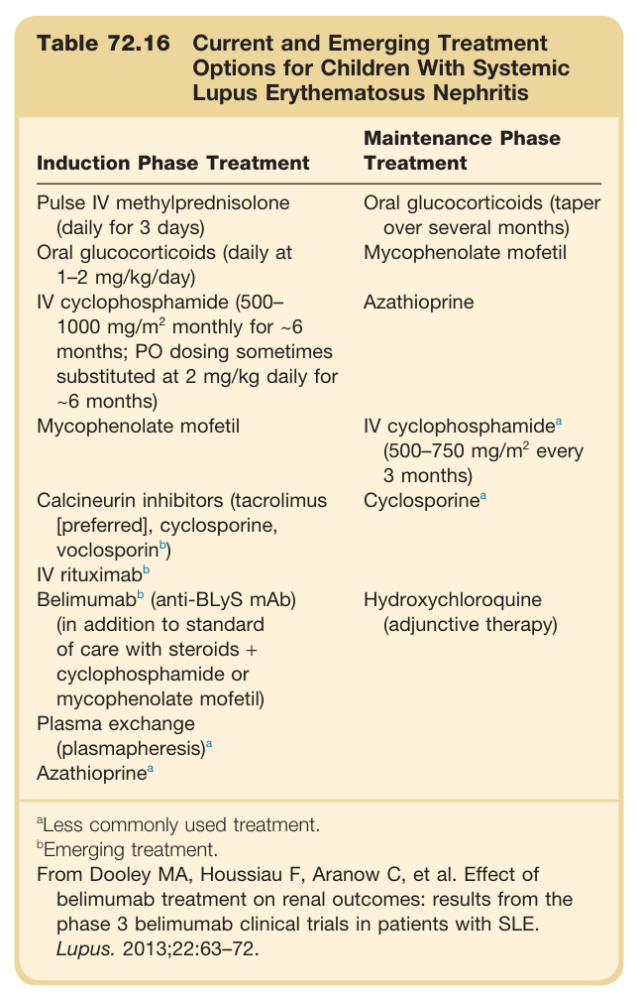

#### Table Data (CSV: [Table_72_16.csv](Table_72_16.csv))

```markdown
| Table Text (OCR) |
| :--- |
| Table 72.16 Current and Emerging Treatment Options for Children With Systemic Lupus Erythematosus Nephritis Induction Phase Treatment  Maintenance Phase Treatment    Pulse IV methylprednisolone (daily for 3 days)  Oral glucocorticoids (taper over several months)    Oral glucocorticoids (daily at 1–2 mg/kg/day)  Mycophenolate mofetil    IV cyclophosphamide (500–1000 mg/m ^{2}  monthly for ~6 months; PO dosing sometimes substituted at 2 mg/kg daily for ~6 months)  Azathioprine    Mycophenolate mofetil  IV cyclophosphamide ^{a} (500–750 mg/m ^{2}  every 3 months)    Calcineurin inhibitors (tacrolimus [preferred], cyclosporine, voclosporin ^{b} )  Cyclosporine ^{a}     IV rituximab ^{b}       Belimumab ^{b}  (anti-BLyS mAb) (in addition to standard of care with steroids + cyclophosphamide or mycophenolate mofetil)  Hydroxychloroquine (adjunctive therapy)    Plasma exchange (plasmapheresis) ^{a}       Azathioprine ^{a} <sup>a</sup>Less commonly used treatment. <sup>b</sup>Emerging treatment. From Dooley MA, Houssiau F, Aranow C, et al. Effect of belimumab treatment on renal outcomes: results from the phase 3 belimumab clinical trials in patients with SLE. Lupus. 2013;22:63–72. |
```

Table 72.16 Current and Emerging Treatment Options for Children With Systemic Lupus Erythematosus Nephritis | Induction Phase Treatment | Maintenance Phase Treatment | | :----------------------------------------------------------- | :----------------------------------------------- | | Pulse IV methylprednisolone (daily for 3 days) | Oral glucocorticoids (taper over several months) | | Oral glucocorticoids (daily at 1-2 mg/kg/day) | Mycophenolate mofetil | | IV cyclophosphamide (500-1000 mg/m² monthly for ~6 months; PO dosing sometimes substituted at 2 mg/kg daily for ~6 months) | Azathioprine | | Mycophenolate mofetil | IV cyclophosphamide | | Calcineurin inhibitors (tacrolimus [preferred], cyclosporine, voclosporin) | Cyclosporine | | IV rituximab | Hydroxychloroquine (adjunctive therapy) | | Belimumab (anti-BLyS mAb) (in addition to standard of care with steroids + cyclophosphamide or mycophenolate mofetil) | | | Plasma exchange (plasmapheresis) | | | Azathioprine | | | *ªLess commonly used treatment.* | | | *Emerging treatment.* | | | *From Dooley MA, Houssiau F, Aranow C, et al. Effect of belimumab treatment on renal outcomes: results from the phase 3 belimumab clinical trials in patients with SLE. Lupus. 2013;22:63-72.* | |

---

### Table_72_17

#### Table Image

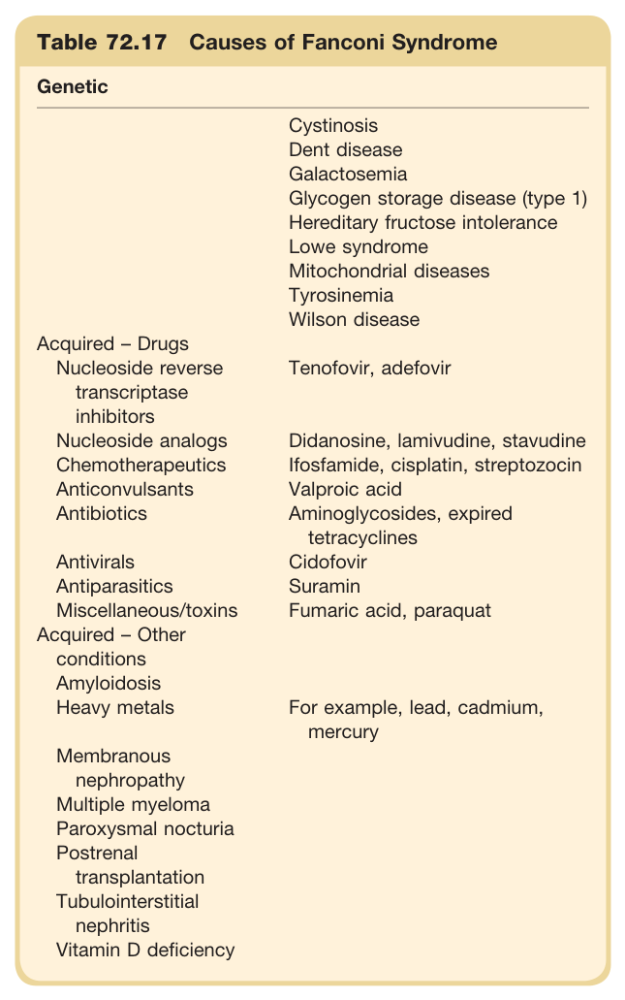

#### Table Data (CSV: [Table_72_17.csv](Table_72_17.csv))

```markdown
| Table Text (OCR) |
| :--- |
| Table 72.17 Causes of Fanconi Syndrome Genetic      Cystinosis      Dent disease      Galactosemia      Glycogen storage disease (type 1)      Hereditary fructose intolerance      Lowe syndrome      Mitochondrial diseases      Tyrosinemia      Wilson disease    Acquired – Drugs    Nucleoside reverse transcriptase inhibitors  Tenofovir, adefovir    Nucleoside analogs  Didanosine, lamivudine, stavudine    Chemotherapeutics  Ifosfamide, cisplatin, streptozocin    Anticonvulsants  Valproic acid    Antibiotics  Aminoglycosides, expired tetracyclines    Antivirals  Cidofovir    Antiparasitics  Suramin    Miscellaneous/toxins  Fumaric acid, paraquat    Acquired – Other conditions      Amyloidosis      Heavy metals  For example, lead, cadmium, mercury    Membranous nephropathy      Multiple myeloma      Paroxysmal nocturia      Postrenal transplantation      Tubulointerstitial nephritis      Vitamin D deficiency |
```

Table 72.17 Causes of Fanconi Syndrome | Category | Causes | | :------------------------------------------ | :----------------------------------------------------------- | | **Genetic** | Cystinosis, Dent disease, Galactosemia, Glycogen storage disease (type 1), Hereditary fructose intolerance, Lowe syndrome, Mitochondrial diseases, Tyrosinemia, Wilson disease | | **Acquired - Drugs** | | | Nucleoside reverse transcriptase inhibitors | Tenofovir, adefovir | | Nucleoside analogs | Didanosine, lamivudine, stavudine | | Chemotherapeutics | Ifosfamide, cisplatin, streptozocin | | Anticonvulsants | Valproic acid | | Antibiotics | Aminoglycosides, expired tetracyclines | | Antivirals | Cidofovir | | Antiparasitics | Suramin | | Miscellaneous/toxins | Fumaric acid, paraquat | | **Acquired - Other conditions** | | | Amyloidosis | | | Heavy metals | For example, lead, cadmium, mercury | | Membranous nephropathy | | | Multiple myeloma | | | Paroxysmal nocturia | | | Postrenal transplantation | | | Tubulointerstitial nephritis | | | Vitamin D deficiency | |

---

### Table_72_18

#### Table Image

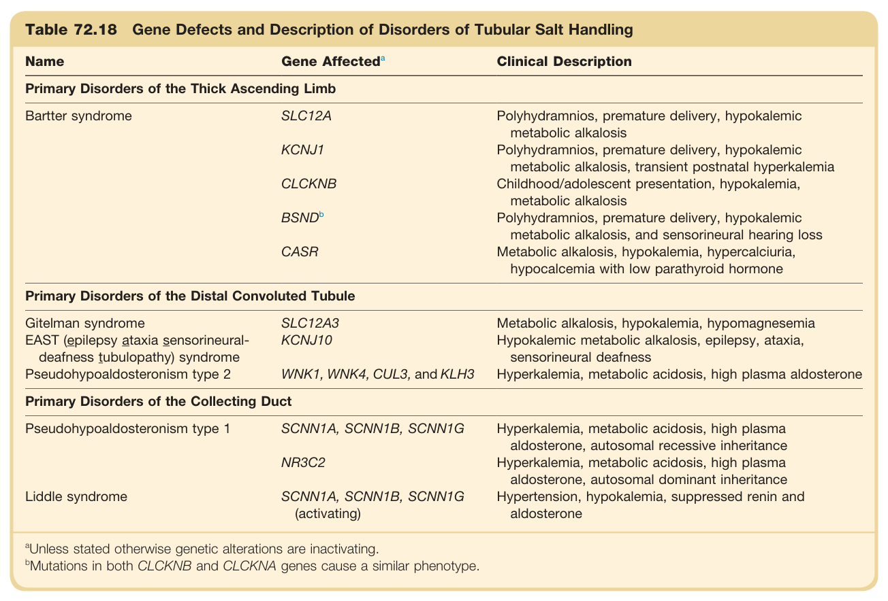

#### Table Data (CSV: [Table_72_18.csv](Table_72_18.csv))

```markdown
| Table Text (OCR) |
| :--- |
| Table 72.18 Gene Defects and Description of Disorders of Tubular Salt Handling Name  Gene Affected ^{a}   Clinical Description    Primary Disorders of the Thick Ascending Limb    Bartter syndrome  SLC12A  Polyhydramnios, premature delivery, hypokalemic metabolic alkalosis    KCNJ1  Polyhydramnios, premature delivery, hypokalemic metabolic alkalosis, transient postnatal hyperkalemia    CLCKNB  Childhood/adolescent presentation, hypokalemia, metabolic alkalosis     BSND^b   Polyhydramnios, premature delivery, hypokalemic metabolic alkalosis, and sensorineural hearing loss    CASR  Metabolic alkalosis, hypokalemia, hypercalciuria, hypocalcemia with low parathyroid hormone    Primary Disorders of the Distal Convoluted Tubule    Gitelman syndrome  SLC12A3  Metabolic alkalosis, hypokalemia, hypomagnesemia    EAST (epilepsy ataxia sensorineural-deafness tubulopathy) syndrome  KCNJ10  Hypokalemic metabolic alkalosis, epilepsy, ataxia, sensorineural deafness    Pseudohypoaldosteronism type 2  WNK1, WNK4, CUL3, and KLH3  Hyperkalemia, metabolic acidosis, high plasma aldosterone    Primary Disorders of the Collecting Duct    Pseudohypoaldosteronism type 1  SCNN1A, SCNN1B, SCNN1G  Hyperkalemia, metabolic acidosis, high plasma aldosterone, autosomal recessive inheritance    NR3C2  Hyperkalemia, metabolic acidosis, high plasma aldosterone, autosomal dominant inheritance    Liddle syndrome  SCNN1A, SCNN1B, SCNN1G (activating)  Hypertension, hypokalemia, suppressed renin and aldosterone <sup>a</sup>Unless stated otherwise genetic alterations are inactivating. <sup>b</sup>Mutations in both CLCKNB and CLCKNA genes cause a similar phenotype. |
```

Table 72.18 Gene Defects and Description of Disorders of Tubular Salt Handling | Name | Gene Affected | Clinical Description | | :----------------------------------------------------------- | :---------------------------------- | :----------------------------------------------------------- | | **Primary Disorders of the Thick Ascending Limb** | | | | Bartter syndrome | SLC12A | Polyhydramnios, premature delivery, hypokalemic metabolic alkalosis | | | KCNJ1 | Polyhydramnios, premature delivery, hypokalemic metabolic alkalosis, transient postnatal hyperkalemia | | | CLCKNB | Childhood/adolescent presentation, hypokalemia, metabolic alkalosis | | | BSND | Polyhydramnios, premature delivery, hypokalemic metabolic alkalosis, and sensorineural hearing loss | | | CASR | Metabolic alkalosis, hypokalemia, hypercalciuria, hypocalcemia with low parathyroid hormone | | **Primary Disorders of the Distal Convoluted Tubule** | | | | Gitelman syndrome | SLC12A3 | Metabolic alkalosis, hypokalemia, hypomagnesemia | | EAST (epilepsy ataxia sensorineural-deafness tubulopathy) syndrome | KCNJ10 | Hypokalemic metabolic alkalosis, epilepsy, ataxia, sensorineural deafness | | Pseudohypoaldosteronism type 2 | WNK1, WNK4, CUL3, and KLH3 | Hyperkalemia, metabolic acidosis, high plasma aldosterone | | **Primary Disorders of the Collecting Duct** | | | | Pseudohypoaldosteronism type 1 | SCNN1A, SCNN1B, SCNN1G | Hyperkalemia, metabolic acidosis, high plasma aldosterone, autosomal recessive inheritance | | | NR3C2 | Hyperkalemia, metabolic acidosis, high plasma aldosterone, autosomal dominant inheritance | | Liddle syndrome | SCNN1A, SCNN1B, SCNN1G (activating) | Hypertension, hypokalemia, suppressed renin and aldosterone | | *ªUnless stated otherwise genetic alterations are inactivating.* | | | | *Mutations in both CLCKNB and CLCKNA genes cause a similar phenotype.* | | |

---

### Table_72_19

#### Table Image

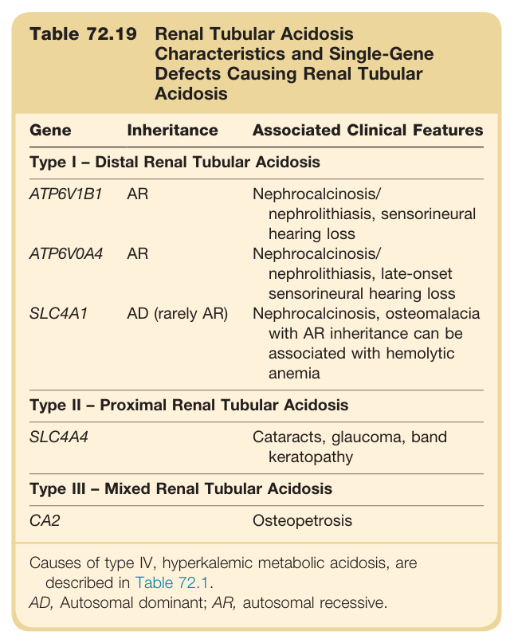

#### Table Data (CSV: [Table_72_19.csv](Table_72_19.csv))

```markdown
| Table Text (OCR) |
| :--- |
| Table 72.19 Renal Tubular Acidosis Characteristics and Single-Gene Defects Causing Renal Tubular Acidosis Gene  Inheritance  Associated Clinical Features    Type I – Distal Renal Tubular Acidosis    ATP6V1B1  AR  Nephrocalcinosis/nephrolithiasis, sensorineural hearing loss    ATP6V0A4  AR  Nephrocalcinosis/nephrolithiasis, late-onset sensorineural hearing loss    SLC4A1  AD (rarely AR)  Nephrocalcinosis, osteomalacia with AR inheritance can be associated with hemolytic anemia    Type II – Proximal Renal Tubular Acidosis    SLC4A4    Cataracts, glaucoma, band keratopathy    Type III – Mixed Renal Tubular Acidosis    CA2    Osteopetrosis    Causes of type IV, hyperkalemic metabolic acidosis, are described in Table 72.1.AD, Autosomal dominant; AR, autosomal recessive. |
```

Table 72.19 Renal Tubular Acidosis Characteristics and Single-Gene Defects Causing Renal Tubular Acidosis | Gene | Inheritance | Associated Clinical Features | | :----------------------------------------------------------- | :------------- | :----------------------------------------------------------- | | **Type I - Distal Renal Tubular Acidosis** | | | | ATP6V1B1 | AR | Nephrocalcinosis/nephrolithiasis, sensorineural hearing loss | | ATP6V0A4 | AR | Nephrocalcinosis/nephrolithiasis, late-onset sensorineural hearing loss | | SLC4A1 | AD (rarely AR) | Nephrocalcinosis, osteomalacia with AR inheritance can be associated with hemolytic anemia | | **Type II - Proximal Renal Tubular Acidosis** | | | | SLC4A4 | | Cataracts, glaucoma, band keratopathy | | **Type III - Mixed Renal Tubular Acidosis** | | | | CA2 | | Osteopetrosis | | *Causes of type IV, hyperkalemic metabolic acidosis, are described in Table 72.1.* | | | | *AD, Autosomal dominant; AR, autosomal recessive.* | | |

---

### Table_72_20

#### Table Image

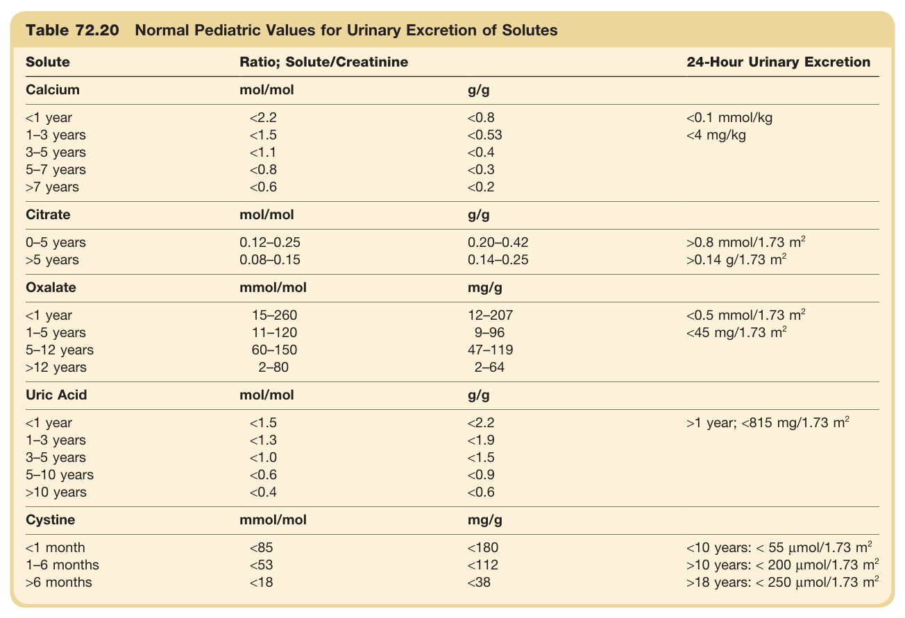

#### Table Data (CSV: [Table_72_20.csv](Table_72_20.csv))

```markdown
| Table Text (OCR) |
| :--- |
| Table 72.20 Normal Pediatric Values for Urinary Excretion of Solutes Solute  Ratio; Solute/Creatinine  24-Hour Urinary Excretion    Calcium  mol/mol  g/g      <1 year  <2.2  <0.8  <0.1 mmol/kg    1-3 years  <1.5  <0.53  <4 mg/kg    3-5 years  <1.1  <0.4      5-7 years  <0.8  <0.3      >7 years  <0.6  <0.2      Citrate  mol/mol  g/g      0-5 years  0.12-0.25  0.20-0.42  >0.8 mmol/1.73 m2    >5 years  0.08-0.15  0.14-0.25  >0.14 g/1.73 m2    Oxalate  mmol/mol  mg/g      <1 year  15-260  12-207  <0.5 mmol/1.73 m2    1-5 years  11-120  9-96  <45 mg/1.73 m2    5-12 years  60-150  47-119      >12 years  2-80  2-64      Uric Acid  mol/mol  g/g      <1 year  <1.5  <2.2  >1 year; <815 mg/1.73 m2    1-3 years  <1.3  <1.9      3-5 years  <1.0  <1.5      5-10 years  <0.6  <0.9      >10 years  <0.4  <0.6      Cystine  mmol/mol  mg/g      <1 month  <85  <180  <10 years: < 55 μmol/1.73 m2    1-6 months  <53  <112  >10 years: < 200 μmol/1.73 m2    >6 months  <18  <38  >18 years: < 250 μmol/1.73 m2 |
```

Table 72.20 Normal Pediatric Values for Urinary Excretion of Solutes | Solute | Ratio; Solute/Creatinine | 24-Hour Urinary Excretion | | :-------------------------- | :----------------------- | :------------------------ | | **Calcium** | **mol/mol** | **g/g** | | <1 year | <2.2 | <0.8 | | 1-3 years | <1.5 | <0.53 | | 3-5 years | <1.1 | <0.4 | | 5-7 years | <0.8 | <0.3 | | >7 years | <0.6 | <0.2 | | **Citrate** | **mol/mol** | **g/g** | | 0-5 years | 0.12-0.25 | 0.20-0.42 | | >5 years | 0.08-0.15 | 0.14-0.25 | | **Oxalate** | **mmol/mol** | **mg/g** | | <1 year | 15-260 | 12-207 | | 1-5 years | 11-120 | 9-96 | | 5-12 years | 60-150 | 47-119 | | >12 years | 2-80 | 2-64 | | **Uric Acid** | **mol/mol** | **g/g** | | <1 year | <1.5 | <2.2 | | 1-3 years | <1.3 | <1.9 | | 3-5 years | <1.0 | <1.5 | | 5-10 years | <0.6 | <0.9 | | >10 years | <0.4 | <0.6 | | **Cystine** | **mmol/mol** | **mg/g** | | <1 month | <85 | <180 | | 1-6 months | <53 | <112 | | >6 months | <18 | <38 |

---

### Table_72_21

#### Table Image

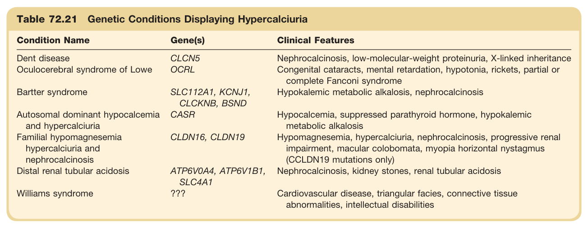

#### Table Data (CSV: [Table_72_21.csv](Table_72_21.csv))

```markdown
| Table Text (OCR) |
| :--- |
| Table 72.21 Genetic Conditions Displaying Hypercalciuria Condition Name  Gene(s)  Clinical Features    Dent disease  CLCN5  Nephrocalcinosis, low-molecular-weight proteinuria, X-linked inheritance    Oculocerebral syndrome of Lowe  OCRL  Congenital cataracts, mental retardation, hypotonia, rickets, partial or complete Fanconi syndrome    Bartter syndrome  SLC112A1, KCNJ1, CLCKNB, BSND  Hypokalemic metabolic alkalosis, nephrocalcinosis    Autosomal dominant hypocalcemia and hypercalciuria  CASR  Hypocalcemia, suppressed parathyroid hormone, hypokalemic metabolic alkalosis    Familial hypomagnesemia hypercalciuria and nephrocalcinosis  CLDN16, CLDN19  Hypomagnesemia, hypercalciuria, nephrocalcinosis, progressive renal impairment, macular colobomata, myopia horizontal nystagmus (CCLDN19 mutations only)    Distal renal tubular acidosis  ATP6V0A4, ATP6V1B1, SLC4A1  Nephrocalcinosis, kidney stones, renal tubular acidosis    Williams syndrome  ???  Cardiovascular disease, triangular facies, connective tissue abnormalities, intellectual disabilities |
```

Table 72.21 Genetic Conditions Displaying Hypercalciuria | Condition Name | Gene(s) | Clinical Features | | :---------------------------------------------------------- | :---------------------------- | :----------------------------------------------------------- | | Dent disease | CLCN5 | Nephrocalcinosis, low-molecular-weight proteinuria, X-linked inheritance | | Oculocerebral syndrome of Lowe | OCRL | Congenital cataracts, mental retardation, hypotonia, rickets, partial or complete Fanconi syndrome | | Bartter syndrome | SLC112A1, KCNJ1, CLCKNB, BSND | Hypokalemic metabolic alkalosis, nephrocalcinosis | | Autosomal dominant hypocalcemia and hypercalciuria | CASR | Hypocalcemia, suppressed parathyroid hormone, hypokalemic metabolic alkalosis | | Familial hypomagnesemia hypercalciuria and nephrocalcinosis | CLDN16, CLDN19 | Hypomagnesemia, hypercalciuria, nephrocalcinosis, progressive renal impairment, macular colobomata, myopia horizontal nystagmus (CCLDN19 mutations only) | | Distal renal tubular acidosis | ATP6V0A4, ATP6V1B1, SLC4A1 | Nephrocalcinosis, kidney stones, renal tubular acidosis | | Williams syndrome | ??? | Cardiovascular disease, triangular facies, connective tissue abnormalities, intellectual disabilities |

---
