# 73. Fluid, Electrolyte, and Acid-Base Disorders in Children - Figures and Tables Index

This document lists all figures and tables extracted from `73. Fluid, Electrolyte, and Acid-Base Disorders in Children.pdf`.

## Table of Contents
- [Figures](#figures)
- [Tables](#tables)

---

## Figures

### Fig_73_1

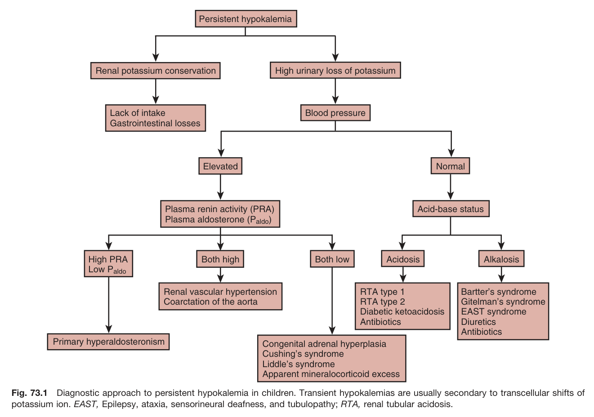

Fig. 73.1 Diagnostic approach to persistent hypokalemia in children. Transient hypokalemias are usually secondary to transcellular shifts of potassium ion. The diagnostic approach can be visualized as a flowchart: 1. **Persistent hypokalemia** branches into two paths: * Renal potassium conservation: This leads to "Lack of intake" or "Gastrointestinal losses". * High urinary loss of potassium: This leads to evaluating Blood pressure. 2. **Blood pressure** evaluation branches into two paths: * Elevated: Evaluate Plasma renin activity (PRA) and Plasma aldosterone (Paldo). * High PRA, Low Paldo -> Renal vascular hypertension, Coarctation of the aorta. * Both high -> Primary hyperaldosteronism. * Normal: Evaluate Acid-base status. * Acidosis -> RTA type 1, RTA type 2, Diabetic ketoacidosis, Antibiotics. * Alkalosis -> Bartter's syndrome, Gitelman's syndrome, EAST syndrome, Diuretics, Antibiotics. * Both low -> Congenital adrenal hyperplasia, Cushing's syndrome, Liddle's syndrome, Apparent mineralocorticoid excess. *EAST, Epilepsy, ataxia, sensorineural deafness, and tubulopathy; RTA, renal tubular acidosis.*

---

### Fig_73_2

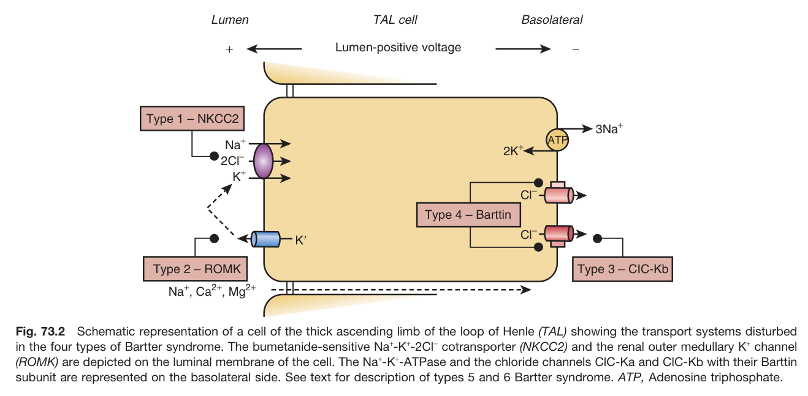

Fig. 73.2 Schematic representation of a cell of the thick ascending limb of the loop of Henle (TAL) showing the transport systems disturbed in the four types of Bartter syndrome. The bumetanide-sensitive Na+-K+-2Cl- cotransporter (NKCC2) and the renal outer medullary K+ channel (ROMK) are depicted on the luminal membrane of the cell. The Na+-K+-ATPase and the chloride channels CIC-Ka and CIC-Kb with their Barttin subunit are represented on the basolateral side. See text for description of types 5 and 6 Bartter syndrome. ATP, Adenosine triphosphate.

---

### Fig_73_3

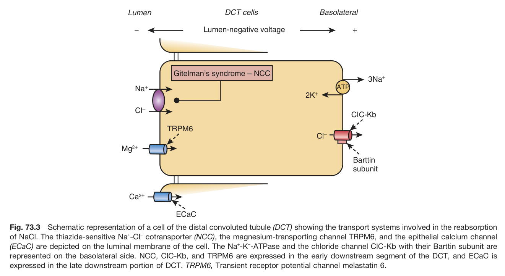

Fig. 73.3 Schematic representation of a cell of the distal convoluted tubule (DCT) showing the transport systems involved in the reabsorption of NaCl. The thiazide-sensitive Na+-Cl cotransporter (NCC), the magnesium-transporting channel TRPM6, and the epithelial calcium channel (ECaC) are depicted on the luminal membrane of the cell. The Na+-K+-ATPase and the chloride channel CIC-Kb with their Barttin subunit are represented on the basolateral side. NCC, CIC-Kb, and TRPM6 are expressed in the early downstream segment of the DCT, and ECaC is expressed in the late downstream portion of DCT. TRPM6, Transient receptor potential channel melastatin 6.

---

### Fig_73_4

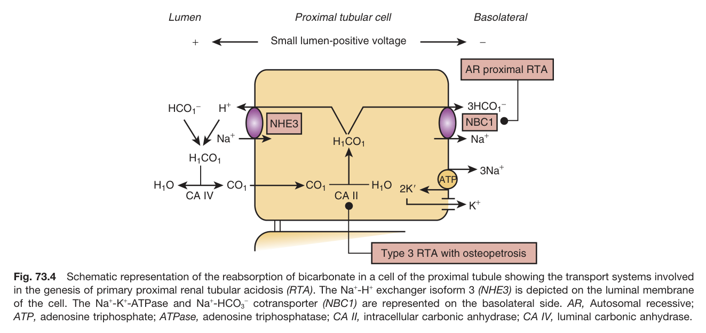

Fig. 73.4 Schematic representation of the reabsorption of bicarbonate in a cell of the proximal tubule showing the transport systems involved in the genesis of primary proximal renal tubular acidosis (RTA). The Nat-H+ exchanger isoform 3 (NHE3) is depicted on the luminal membrane of the cell. The Na+-K+-ATPase and Na+-HCO3 cotransporter (NBC1) are represented on the basolateral side. AR, Autosomal recessive; ATP, adenosine triphosphate; ATPase, adenosine triphosphatase; CA II, intracellular carbonic anhydrase; CA IV, luminal carbonic anhydrase.

---

### Fig_73_5

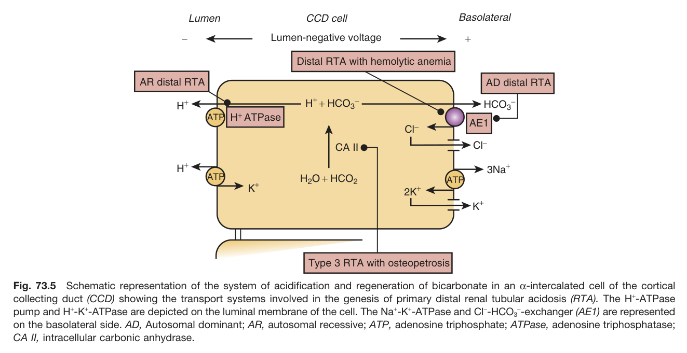

Fig. 73.5 Schematic representation of the system of acidification and regeneration of bicarbonate in an a-intercalated cell of the cortical collecting duct (CCD) showing the transport systems involved in the genesis of primary distal renal tubular acidosis (RTA). The H+-ATPase pump and H+-K+-ATPase are depicted on the luminal membrane of the cell. The Na+-K+-ATPase and CI--HCO3-exchanger (AE1) are represented on the basolateral side. AD, Autosomal dominant; AR, autosomal recessive; ATP, adenosine triphosphate; ATPase, adenosine triphosphatase; CA II, intracellular carbonic anhydrase.

---

### Fig_73_6

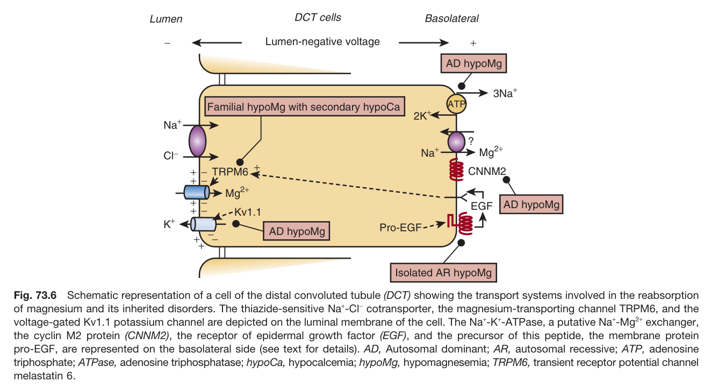

Fig. 73.6 Schematic representation of a cell of the distal convoluted tubule (DCT) showing the transport systems involved in the reabsorption of magnesium and its inherited disorders. The thiazide-sensitive Na+-Cl cotransporter, the magnesium-transporting channel TRPM6, and the voltage-gated Kv1.1 potassium channel are depicted on the luminal membrane of the cell. The Na+-K+-ATPase, a putative Na+-Mg2+ exchanger, the cyclin M2 protein (CNNM2), the receptor of epidermal growth factor (EGF), and the precursor of this peptide, the membrane protein pro-EGF, are represented on the basolateral side (see text for details). AD, Autosomal dominant; AR, autosomal recessive; ATP, adenosine triphosphate; ATPase, adenosine triphosphatase; hypoCa, hypocalcemia; hypoMg, hypomagnesemia; TRPM6, transient receptor potential channel melastatin 6.

---

### Fig_73_7

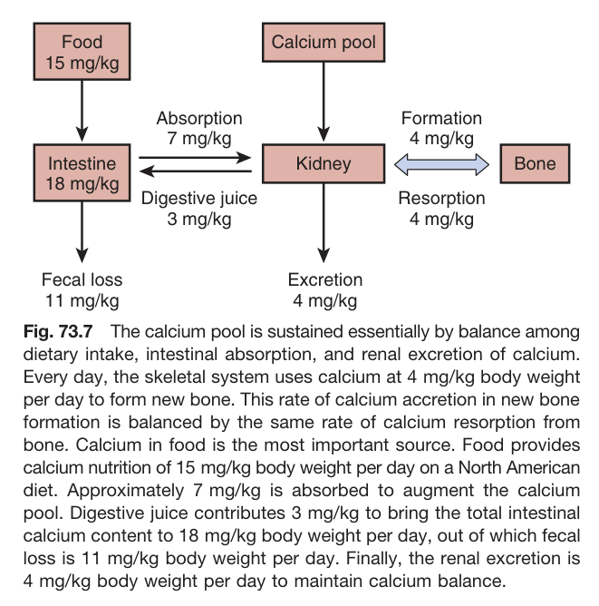

Fig. 73.7 The calcium pool is sustained essentially by balance among dietary intake, intestinal absorption, and renal excretion of calcium. Every day, the skeletal system uses calcium at 4 mg/kg body weight per day to form new bone. This rate of calcium accretion in new bone formation is balanced by the same rate of calcium resorption from bone. Calcium in food is the most important source. Food provides calcium nutrition of 15 mg/kg body weight per day on a North American diet. Approximately 7 mg/kg is absorbed to augment the calcium pool. Digestive juice contributes 3 mg/kg to bring the total intestinal calcium content to 18 mg/kg body weight per day, out of which fecal loss is 11 mg/kg body weight per day. Finally, the renal excretion is 4 mg/kg body weight per day to maintain calcium balance.

---

### Fig_73_8

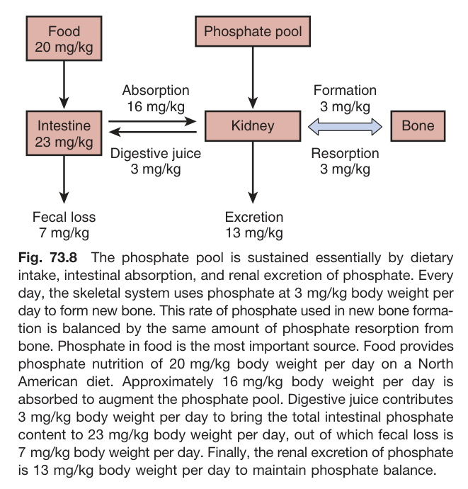

Fig. 73.8 The phosphate pool is sustained essentially by dietary intake, intestinal absorption, and renal excretion of phosphate. Every day, the skeletal system uses phosphate at 3 mg/kg body weight per day to form new bone. This rate of phosphate used in new bone formation is balanced by the same amount of phosphate resorption from bone. Phosphate in food is the most important source. Food provides phosphate nutrition of 20 mg/kg body weight per day on a North American diet. Approximately 16 mg/kg body weight per day is absorbed to augment the phosphate pool. Digestive juice contributes 3 mg/kg body weight per day to bring the total intestinal phosphate content to 23 mg/kg body weight per day, out of which fecal loss is 7 mg/kg body weight per day. Finally, the renal excretion of phosphate is 13 mg/kg body weight per day to maintain phosphate balance.

---

### Fig_73_9

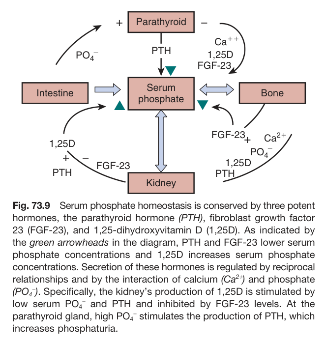

Fig. 73.9 Serum phosphate homeostasis is conserved by three potent hormones, the parathyroid hormone (PTH), fibroblast growth factor 23 (FGF-23), and 1,25-dihydroxyvitamin D (1,25D). As indicated by the green arrowheads in the diagram, PTH and FGF-23 lower serum phosphate concentrations and 1,25D increases serum phosphate concentrations. Secretion of these hormones is regulated by reciprocal relationships and by the interaction of calcium (Ca2+) and phosphate (PO4). Specifically, the kidney's production of 1,25D is stimulated by low serum PO4 and PTH and inhibited by FGF-23 levels. At the parathyroid gland, high PO4 stimulates the production of PTH, which increases phosphaturia.

---

### Fig_73_10

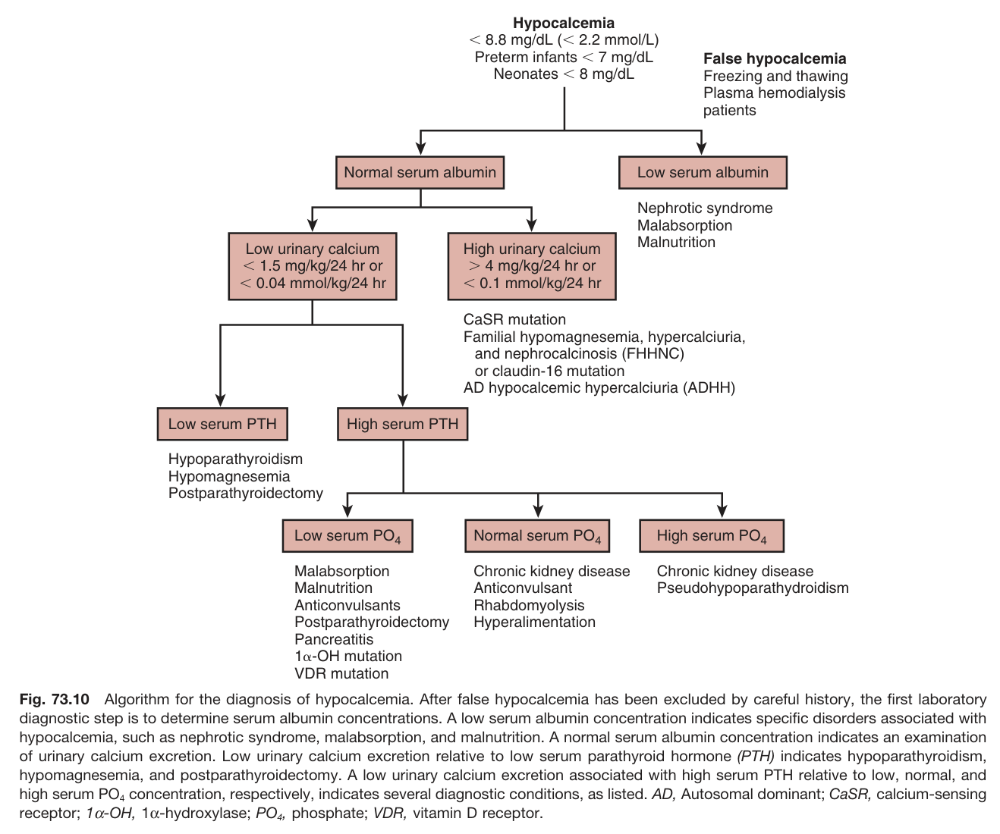

Fig. 73.10 Algorithm for the diagnosis of hypocalcemia. After false hypocalcemia has been excluded by careful history, the first laboratory diagnostic step is to determine serum albumin concentrations. A low serum albumin concentration indicates specific disorders associated with hypocalcemia, such as nephrotic syndrome, malabsorption, and malnutrition. A normal serum albumin concentration indicates an examination of urinary calcium excretion. Low urinary calcium excretion relative to low serum parathyroid hormone (PTH) indicates hypoparathyroidism, hypomagnesemia, and postparathyroidectomy. A low urinary calcium excretion associated with high serum PTH relative to low, normal, and high serum PO4 concentration, respectively, indicates several diagnostic conditions, as listed. AD, Autosomal dominant; CaSR, calcium-sensing receptor; 1α-ΟΗ, 1α-hydroxylase; PO4, phosphate; VDR, vitamin D receptor.

---

### Fig_73_11

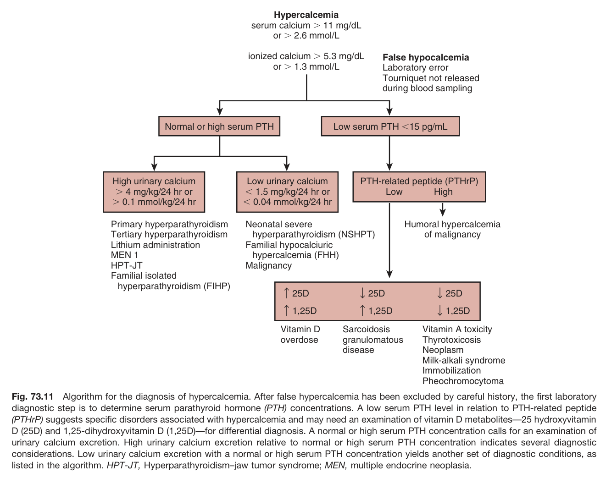

Fig. 73.11 Algorithm for the diagnosis of hypercalcemia. After false hypercalcemia has been excluded by careful history, the first laboratory diagnostic step is to determine serum parathyroid hormone (PTH) concentrations. A low serum PTH level in relation to PTH-related peptide (PTHrP) suggests specific disorders associated with hypercalcemia and may need an examination of vitamin D metabolites-25 hydroxyvitamin D (25D) and 1,25-dihydroxyvitamin D (1,25D)-for differential diagnosis. A normal or high serum PTH concentration calls for an examination of urinary calcium excretion. High urinary calcium excretion relative to normal or high serum PTH concentration indicates several diagnostic considerations. Low urinary calcium excretion with a normal or high serum PTH concentration yields another set of diagnostic conditions, as listed in the algorithm. HPT-JT, Hyperparathyroidism-jaw tumor syndrome; MEN, multiple endocrine neoplasia.

---

### Fig_73_12

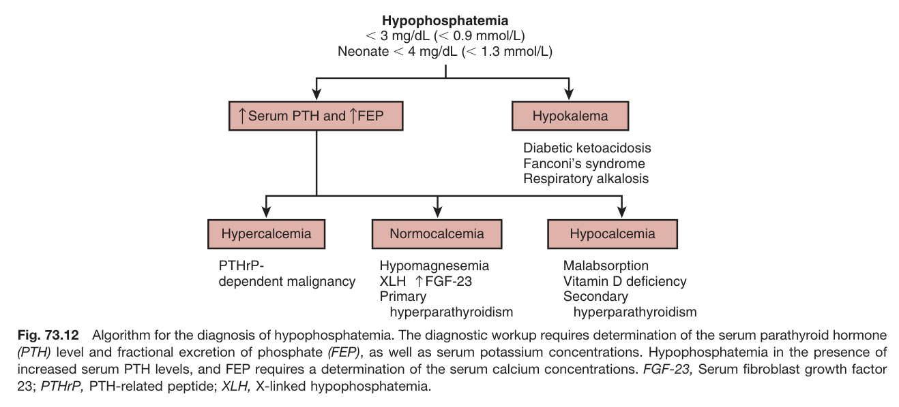

Fig. 73.12 Algorithm for the diagnosis of hypophosphatemia. The diagnostic workup requires determination of the serum parathyroid hormone (PTH) level and fractional excretion of phosphate (FEP), as well as serum potassium concentrations. Hypophosphatemia in the presence of increased serum PTH levels, and FEP requires a determination of the serum calcium concentrations. FGF-23, Serum fibroblast growth factor 23; PTHrP, PTH-related peptide; XLH, X-linked hypophosphatemia.

---

### Fig_73_13

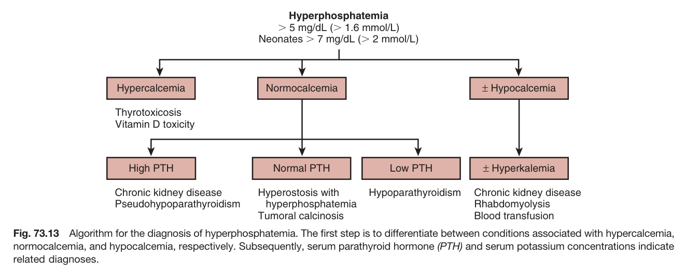

Fig. 73.13 Algorithm for the diagnosis of hyperphosphatemia. The first step is to differentiate between conditions associated with hypercalcemia, normocalcemia, and hypocalcemia, respectively. Subsequently, serum parathyroid hormone (PTH) and serum potassium concentrations indicate related diagnoses.

---

## Tables

### Table_73_1

#### Table Image

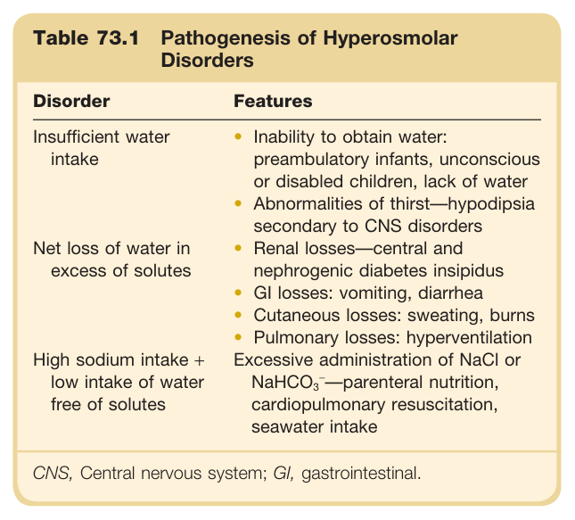

#### Table Data (CSV: [Table_73_1.csv](Table_73_1.csv))

```markdown
| Table Text (OCR) |
| :--- |
| Table 73.1 Pathogenesis of Hyperosmolar Disorders Disorder  Features    Insufficient water intake  Inability to obtain water: preambulatory infants, unconscious or disabled children, lack of waterAbnormalities of thirst—hypodipsia secondary to CNS disorders    Net loss of water in excess of solutes  Renal losses—central and nephrogenic diabetes insipidusGI losses: vomiting, diarrheaCutaneous losses: sweating, burnsPulmonary losses: hyperventilation    High sodium intake + low intake of water free of solutes  Excessive administration of NaCl or  NaHCO_{3}^{-} —parenteral nutrition, cardiopulmonary resuscitation, seawater intake    CNS, Central nervous system; GI, gastrointestinal. |
```

Table 73.1 Pathogenesis of Hyperosmolar Disorders | Disorder | Features | | :--- | :--- | | Insufficient water intake | • Inability to obtain water: preambulatory infants, unconscious or disabled children, lack of water<br>• Abnormalities of thirst-hypodipsia secondary to CNS disorders | | Net loss of water in excess of solutes | • Renal losses-central and nephrogenic diabetes insipidus<br>• GI losses: vomiting, diarrhea<br>• Cutaneous losses: sweating, burns<br>• Pulmonary losses: hyperventilation | | High sodium intake + low intake of water free of solutes | Excessive administration of NaCl or NaHCO₃-parenteral nutrition, cardiopulmonary resuscitation, seawater intake | *CNS, Central nervous system; GI, gastrointestinal.*

---

### Table_73_2

#### Table Image

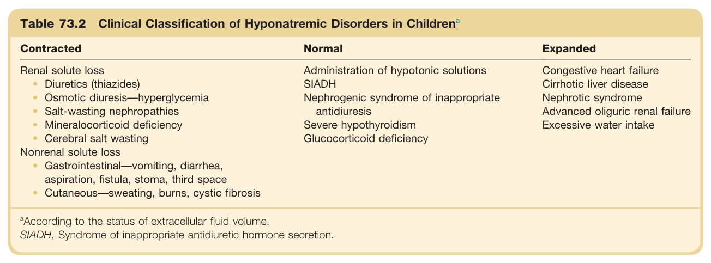

#### Table Data (CSV: [Table_73_2.csv](Table_73_2.csv))

```markdown
| Table Text (OCR) |
| :--- |
| Table 73.2 Clinical Classification of Hyponatremic Disorders in Children<sup>a</sup> Contracted  Normal  Expanded    Renal solute lossDiuretics (thiazides)Osmotic diuresis—hyperglycemiaSalt-wasting nephropathiesMineralocorticoid deficiencyCerebral salt wastingNonrenal solute lossGastrointestinal—vomiting, diarrhea, aspiration, fistula, stoma, third spaceCutaneous—sweating, burns, cystic fibrosis  Administration of hypotonic solutionsSIADHNephrogenic syndrome of inappropriate antidiuresisSevere hypothyroidismGlucocorticoid deficiency  Congestive heart failureCirrhotic liver diseaseNephrotic syndromeAdvanced oliguric renal failureExcessive water intake <sup>a</sup>According to the status of extracellular fluid volume. SIADH, Syndrome of inappropriate antidiuretic hormone secretion. |
```

Table 73.2 Clinical Classification of Hyponatremic Disorders in Childrena | Contracted | Normal | Expanded | | :--- | :--- | :--- | | **Renal solute loss**<br>• Diuretics (thiazides)<br>• Osmotic diuresis-hyperglycemia<br>• Salt-wasting nephropathies<br>• Mineralocorticoid deficiency<br>• Cerebral salt wasting<br>**Nonrenal solute loss**<br>• Gastrointestinal-vomiting, diarrhea, aspiration, fistula, stoma, third space<br>• Cutaneous-sweating, burns, cystic fibrosis | Administration of hypotonic solutions<br>SIADH<br>Nephrogenic syndrome of inappropriate antidiuresis<br>Severe hypothyroidism<br>Glucocorticoid deficiency | Congestive heart failure<br>Cirrhotic liver disease<br>Nephrotic syndrome<br>Advanced oliguric renal failure<br>Excessive water intake | *aAccording to the status of extracellular fluid volume.* *SIADH, Syndrome of inappropriate antidiuretic hormone secretion.*

---

### Table_73_3

#### Table Image

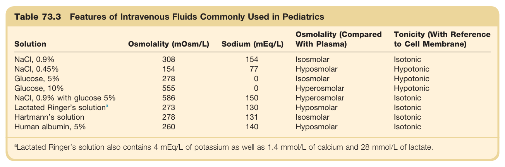

#### Table Data (CSV: [Table_73_3.csv](Table_73_3.csv))

```markdown
| Table Text (OCR) |
| :--- |
| Table 73.3 Features of Intravenous Fluids Commonly Used in Pediatrics Solution  Osmolality (mOsm/L)  Sodium (mEq/L)  Osmolality (Compared With Plasma)  Tonicity (With Reference to Cell Membrane)    NaCl, 0.9%  308  154  Isosmolar  Isotonic    NaCl, 0.45%  154  77  Hyposmolar  Hypotonic    Glucose, 5%  278  0  Isosmolar  Hypotonic    Glucose, 10%  555  0  Hyperosmolar  Hypotonic    NaCl, 0.9% with glucose 5%  586  150  Hyperosmolar  Isotonic    Lactated Ringer's  solution^a   273  130  Hyposmolar  Isotonic    Hartmann's solution  278  131  Isosmolar  Isotonic    Human albumin, 5%  260  140  Hyposmolar  Isotonic <sup>a</sup>Lactated Ringer’s solution also contains 4 mEq/L of potassium as well as 1.4 mmol/L of calcium and 28 mmol/L of lactate. |
```

Table 73.3 Features of Intravenous Fluids Commonly Used in Pediatrics | Solution | Osmolality (mOsm/L) | Sodium (mEq/L) | Osmolality (Compared With Plasma) | Tonicity (With Reference to Cell Membrane) | | :--- | :--- | :--- | :--- | :--- | | NaCl, 0.9% | 308 | 154 | Isosmolar | Isotonic | | NaCl, 0.45% | 154 | 77 | Hyposmolar | Hypotonic | | Glucose, 5% | 278 | 0 | Isosmolar | Hypotonic | | Glucose, 10% | 555 | 0 | Hyperosmolar | Hypotonic | | NaCl, 0.9% with glucose 5% | 586 | 150 | Hyperosmolar | Isotonic | | Lactated Ringer's solutionª | 273 | 130 | Hyposmolar | Isotonic | | Hartmann's solution | 278 | 131 | Isosmolar | Isotonic | | Human albumin, 5% | 260 | 140 | Hyposmolar | Isotonic | *ªLactated Ringer's solution also contains 4 mEq/L of potassium as well as 1.4 mmol/L of calcium and 28 mmol/L of lactate.*

---

### Table_73_4

#### Table Image

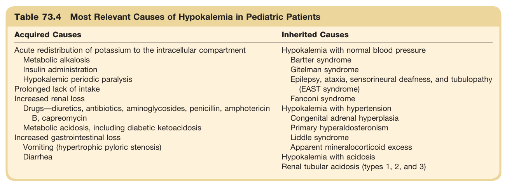

#### Table Data (CSV: [Table_73_4.csv](Table_73_4.csv))

```markdown
| Table Text (OCR) |
| :--- |
| Table 73.4 Most Relevant Causes of Hypokalemia in Pediatric Patients Acquired Causes  Inherited Causes    Acute redistribution of potassium to the intracellular compartment  Hypokalemia with normal blood pressure    Metabolic alkalosis  Bartter syndrome    Insulin administration  Gitelman syndrome    Hypokalemic periodic paralysis  Epilepsy, ataxia, sensorineural deafness, and tubulopathy (EAST syndrome)    Prolonged lack of intake    Increased renal loss  Fanconi syndrome    Drugs—diuretics, antibiotics, aminoglycosides, penicillin, amphotericin  Hypokalemia with hypertension    B, capreomycin  Congenital adrenal hyperplasia    Metabolic acidosis, including diabetic ketoacidosis  Primary hyperaldosteronism    Increased gastrointestinal loss  Liddle syndrome    Vomiting (hypertrophic pyloric stenosis)  Apparent mineralocorticoid excess    Diarrhea  Hypokalemia with acidosis      Renal tubular acidosis (types 1, 2, and 3) |
```

Table 73.4 Most Relevant Causes of Hypokalemia in Pediatric Patients | Acquired Causes | Inherited Causes | | :--- | :--- | | **Acute redistribution of potassium to the intracellular compartment**<br>Metabolic alkalosis<br>Insulin administration<br>Hypokalemic periodic paralysis<br>Prolonged lack of intake<br>**Increased renal loss**<br>Drugs-diuretics, antibiotics, aminoglycosides, penicillin, amphotericin B, capreomycin<br>Metabolic acidosis, including diabetic ketoacidosis<br>**Increased gastrointestinal loss**<br>Vomiting (hypertrophic pyloric stenosis)<br>Diarrhea | **Hypokalemia with normal blood pressure**<br>Bartter syndrome<br>Gitelman syndrome<br>Epilepsy, ataxia, sensorineural deafness, and tubulopathy (EAST syndrome)<br>Fanconi syndrome<br>**Hypokalemia with hypertension**<br>Congenital adrenal hyperplasia<br>Primary hyperaldosteronism<br>Liddle syndrome<br>Apparent mineralocorticoid excess<br>**Hypokalemia with acidosis**<br>Renal tubular acidosis (types 1, 2, and 3) |

---

### Table_73_5

#### Table Image

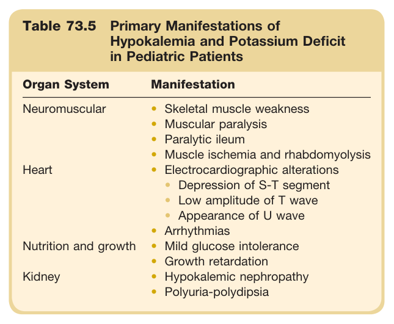

#### Table Data (CSV: [Table_73_5.csv](Table_73_5.csv))

```markdown
| Table Text (OCR) |
| :--- |
| Table 73.5 Primary Manifestations of Hypokalemia and Potassium Deficit in Pediatric Patients Organ System  Manifestation    Neuromuscular  Skeletal muscle weaknessMuscular paralysisParalytic ileumMuscle ischemia and rhabdomyolysis    Heart  Electrocardiographic alterationsDepression of S-T segmentLow amplitude of T waveAppearance of U waveArrhythmias    Nutrition and growth  Mild glucose intoleranceGrowth retardation    Kidney  Hypokalemic nephropathyPolyuria-polydipsia |
```

Table 73.5 Primary Manifestations of Hypokalemia and Potassium Deficit in Pediatric Patients | Organ System | Manifestation | | :--- | :--- | | **Neuromuscular** | • Skeletal muscle weakness<br>• Muscular paralysis<br>• Paralytic ileum<br>• Muscle ischemia and rhabdomyolysis | | **Heart** | • Electrocardiographic alterations<br>• Depression of S-T segment<br>• Low amplitude of T wave<br>• Appearance of U wave<br>• Arrhythmias | | **Nutrition and growth** | • Mild glucose intolerance<br>• Growth retardation | | **Kidney** | • Hypokalemic nephropathy<br>• Polyuria-polydipsia |

---

### Table_73_6

#### Table Image

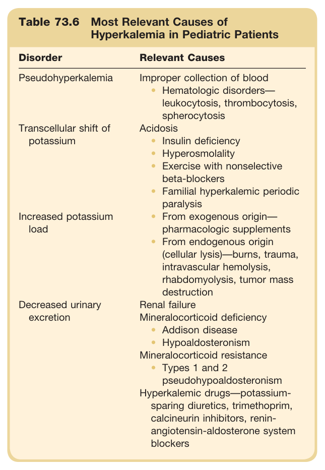

#### Table Data (CSV: [Table_73_6.csv](Table_73_6.csv))

```markdown
| Table Text (OCR) |
| :--- |
| Table 73.6 Most Relevant Causes of Hyperkalemia in Pediatric Patients Disorder  Relevant Causes    Pseudohyperkalemia  Improper collection of bloodHematologic disorders—leukocytosis, thrombocytosis, spherocytosis    Transcellular shift of potassium  AcidosisInsulin deficiencyHyperosmolalityExercise with nonselective beta-blockersFamilial hyperkalemic periodic paralysis    Increased potassium load  From exogenous origin—pharmacologic supplementsFrom endogenous origin (cellular lysis)—burns, trauma, intravascular hemolysis, rhabdomyolysis, tumor mass destruction    Decreased urinary excretion  Renal failureMineralocorticoid deficiencyAddison diseaseHypoaldosteronismMineralocorticoid resistanceTypes 1 and 2 pseudohypoaldosteronismHyperkalemic drugs—potassium-sparing diuretics, trimethoprim, calcineurin inhibitors, renin-angiotensin-aldosterone system blockers |
```

Table 73.6 Most Relevant Causes of Hyperkalemia in Pediatric Patients | Disorder | Relevant Causes | | :--- | :--- | | **Pseudohyperkalemia** | Improper collection of blood<br>• Hematologic disorders-leukocytosis, thrombocytosis, spherocytosis | | **Transcellular shift of potassium** | Acidosis<br>• Insulin deficiency<br>• Hyperosmolality<br>• Exercise with nonselective beta-blockers<br>• Familial hyperkalemic periodic paralysis | | **Increased potassium load** | • From exogenous origin-pharmacologic supplements<br>• From endogenous origin (cellular lysis)-burns, trauma, intravascular hemolysis, rhabdomyolysis, tumor mass destruction | | **Decreased urinary excretion** | Renal failure<br>Mineralocorticoid deficiency<br>• Addison disease<br>• Hypoaldosteronism<br>Mineralocorticoid resistance<br>• Types 1 and 2 pseudohypoaldosteronism<br>Hyperkalemic drugs-potassium-sparing diuretics, trimethoprim, calcineurin inhibitors, renin-angiotensin-aldosterone system blockers |

---

### Table_73_7

#### Table Image

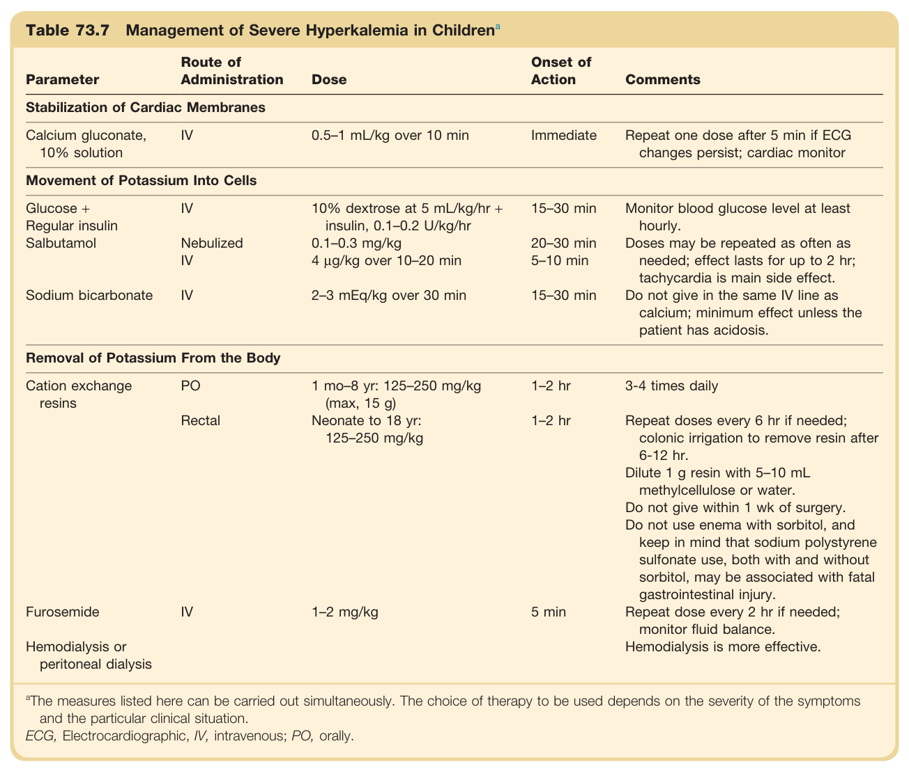

#### Table Data (CSV: [Table_73_7.csv](Table_73_7.csv))

```markdown
| Table Text (OCR) |
| :--- |
| Table 73.7 Management of Severe Hyperkalemia in Children<sup>a</sup> Parameter  Route of Administration  Dose  Onset of Action  Comments    Stabilization of Cardiac Membranes    Calcium gluconate, 10% solution  IV  0.5–1 mL/kg over 10 min  Immediate  Repeat one dose after 5 min if ECG changes persist; cardiac monitor    Movement of Potassium Into Cells    Glucose + Regular insulin  IV  10% dextrose at 5 mL/kg/hr + insulin, 0.1–0.2 U/kg/hr  15–30 min  Monitor blood glucose level at least hourly.    Salbutamol  Nebulized  0.1–0.3 mg/kg  20–30 min  Doses may be repeated as often as needed; effect lasts for up to 2 hr; tachycardia is main side effect.    IV  4 μg/kg over 10–20 min  5–10 min    Sodium bicarbonate  IV  2–3 mEq/kg over 30 min  15–30 min  Do not give in the same IV line as calcium; minimum effect unless the patient has acidosis.    Removal of Potassium From the Body    Cation exchange resins  PO  1 mo–8 yr: 125–250 mg/kg (max, 15 g)  1–2 hr  3-4 times daily    Rectal  Neonate to 18 yr: 125–250 mg/kg  1–2 hr  Repeat doses every 6 hr if needed; colonic irrigation to remove resin after 6-12 hr.Dilute 1 g resin with 5–10 mL methylcellulose or water.Do not give within 1 wk of surgery.Do not use enema with sorbitol, and keep in mind that sodium polystyrene sulfonate use, both with and without sorbitol, may be associated with fatal gastrointestinal injury.    Furosemide  IV  1–2 mg/kg  5 min  Repeat dose every 2 hr if needed; monitor fluid balance.Hemodialysis is more effective.    Hemodialysis or peritoneal dialysis <sup>a</sup>The measures listed here can be carried out simultaneously. The choice of therapy to be used depends on the severity of the symptoms and the particular clinical situation. ECG, Electrocardiographic, IV, intravenous; PO, orally. |
```

Table 73.7 Management of Severe Hyperkalemia in Childrenª | Parameter | Route of Administration | Dose | Onset of Action | Comments | | :--- | :--- | :--- | :--- | :--- | | **Stabilization of Cardiac Membranes** | | | | | | Calcium gluconate, 10% solution | IV | 0.5-1 mL/kg over 10 min | Immediate | Repeat one dose after 5 min if ECG changes persist; cardiac monitor | | **Movement of Potassium Into Cells** | | | | | | Glucose + Regular insulin | IV | 10% dextrose at 5 mL/kg/hr + insulin, 0.1-0.2 U/kg/hr | 15-30 min | Monitor blood glucose level at least hourly. | | Salbutamol | Nebulized | 0.1-0.3 mg/kg | 20-30 min | Doses may be repeated as often as needed; effect lasts for up to 2 hr; tachycardia is main side effect. | | | IV | 4 µg/kg over 10-20 min | 5-10 min | | | Sodium bicarbonate | IV | 2-3 mEq/kg over 30 min | 15-30 min | Do not give in the same IV line as calcium; minimum effect unless the patient has acidosis. | | **Removal of Potassium From the Body** | | | | | | Cation exchange resins | PO | 1 mo-8 yr: 125-250 mg/kg (max, 15 g) | 1-2 hr | 3-4 times daily | | | Rectal | Neonate to 18 yr: 125-250 mg/kg | 1-2 hr | Repeat doses every 6 hr if needed; colonic irrigation to remove resin after 6-12 hr. Dilute 1 g resin with 5-10 mL methylcellulose or water. Do not give within 1 wk of surgery. Do not use enema with sorbitol, and keep in mind that sodium polystyrene sulfonate use, both with and without sorbitol, may be associated with fatal gastrointestinal injury. | | Furosemide | IV | 1-2 mg/kg | 5 min | Repeat dose every 2 hr if needed; monitor fluid balance. | | Hemodialysis or peritoneal dialysis | | | | Hemodialysis is more effective. | *ªThe measures listed here can be carried out simultaneously. The choice of therapy to be used depends on the severity of the symptoms and the particular clinical situation.* *ECG, Electrocardiographic, IV, intravenous; PO, orally.*

---

### Table_73_8

#### Table Image

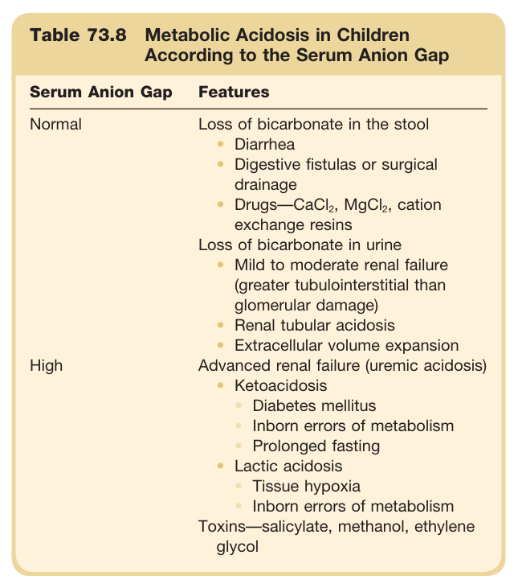

#### Table Data (CSV: [Table_73_8.csv](Table_73_8.csv))

```markdown
| Table Text (OCR) |
| :--- |
| Table 73.8 Metabolic Acidosis in Children According to the Serum Anion Gap Serum Anion Gap  Features    Normal  Loss of bicarbonate in the stoolDiarrheaDigestive fistulas or surgical drainageDrugs— CaCl_{2} ,  MgCl_{2} , cation exchange resinsLoss of bicarbonate in urineMild to moderate renal failure (greater tubulointerstitial than glomerular damage)Renal tubular acidosisExtracellular volume expansion    High  Advanced renal failure (uremic acidosis)KetoacidosisDiabetes mellitusInborn errors of metabolismProlonged fastingLactic acidosisTissue hypoxiaInborn errors of metabolismToxins—salicylate, methanol, ethylene glycol |
```

Table 73.8 Metabolic Acidosis in Children According to the Serum Anion Gap | Serum Anion Gap | Features | | :--- | :--- | | **Normal** | **Loss of bicarbonate in the stool**<br>• Diarrhea<br>• Digestive fistulas or surgical drainage<br>• Drugs-CaCl₂, MgCl₂, cation exchange resins<br>**Loss of bicarbonate in urine**<br>• Mild to moderate renal failure (greater tubulointerstitial than glomerular damage)<br>• Renal tubular acidosis<br>• Extracellular volume expansion | | **High** | Advanced renal failure (uremic acidosis)<br>• Ketoacidosis<br>• Diabetes mellitus<br>• Inborn errors of metabolism<br>• Prolonged fasting<br>• Lactic acidosis<br>• Tissue hypoxia<br>• Inborn errors of metabolism<br>Toxins-salicylate, methanol, ethylene glycol |

---

### Table_73_9

#### Table Image

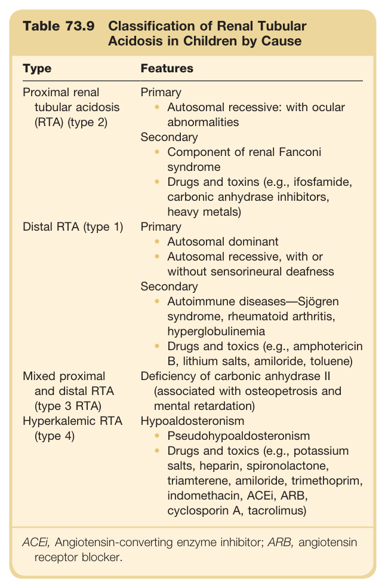

#### Table Data (CSV: [Table_73_9.csv](Table_73_9.csv))

```markdown
| Table Text (OCR) |
| :--- |
| Table 73.9 Classification of Renal Tubular Acidosis in Children by Cause Type  Features    Proximal renal tubular acidosis (RTA) (type 2)  PrimaryAutosomal recessive: with ocular abnormalitiesSecondaryComponent of renal Fanconi syndromeDrugs and toxins (e.g., ifosfamide, carbonic anhydrase inhibitors, heavy metals)    Distal RTA (type 1)  PrimaryAutosomal dominantAutosomal recessive, with or without sensorineural deafnessSecondaryAutoimmune diseases—Sjögren syndrome, rheumatoid arthritis, hyperglobulinemiaDrugs and toxics (e.g., amphotericin B, lithium salts, amiloride, toluene)    Mixed proximal and distal RTA (type 3 RTA)  Deficiency of carbonic anhydrase II (associated with osteopetrosis and mental retardation)    Hyperkalemic RTA (type 4)  HypoaldosteronismPseudohypoaldosteronismDrugs and toxics (e.g., potassium salts, heparin, spironolactone, triamterene, amiloride, trimethoprim, indomethacin, ACEi, ARB, cyclosporin A, tacrolimus)    ACEi, Angiotensin-converting enzyme inhibitor; ARB, angiotensin receptor blocker. |
```

Table 73.9 Classification of Renal Tubular Acidosis in Children by Cause | Type | Features | | :--- | :--- | | **Proximal renal tubular acidosis (RTA) (type 2)** | **Primary**<br>• Autosomal recessive: with ocular abnormalities<br>**Secondary**<br>• Component of renal Fanconi syndrome<br>• Drugs and toxins (e.g., ifosfamide, carbonic anhydrase inhibitors, heavy metals) | | **Distal RTA (type 1)** | **Primary**<br>• Autosomal dominant<br>• Autosomal recessive, with or without sensorineural deafness<br>**Secondary**<br>• Autoimmune diseases-Sjögren syndrome, rheumatoid arthritis, hyperglobulinemia<br>• Drugs and toxics (e.g., amphotericin B, lithium salts, amiloride, toluene) | | **Mixed proximal and distal RTA (type 3 RTA)** | Deficiency of carbonic anhydrase II (associated with osteopetrosis and mental retardation) | | **Hyperkalemic RTA (type 4)** | **Hypoaldosteronism**<br>• Pseudohypoaldosteronism<br>• Drugs and toxics (e.g., potassium salts, heparin, spironolactone, triamterene, amiloride, trimethoprim, indomethacin, ACEi, ARB, cyclosporin A, tacrolimus) | *ACEi, Angiotensin-converting enzyme inhibitor; ARB, angiotensin receptor blocker.*

---

### Table_73_10

#### Table Image

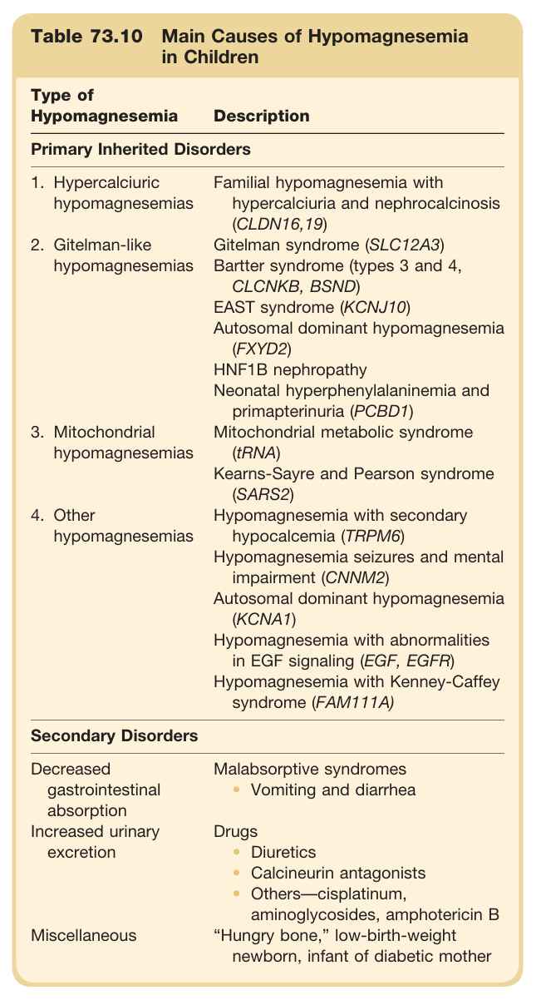

#### Table Data (CSV: [Table_73_10.csv](Table_73_10.csv))

```markdown
| Table Text (OCR) |
| :--- |
| Table 73.10 Main Causes of Hypomagnesemia in Children Type of Hypomagnesemia  Description    Primary Inherited Disorders    1. Hypercalciurichypomagnesemias  Familial hypomagnesemia with hypercalciuria and nephrocalcinosis (CLDN16,19)    2. Gitelman-like hypomagnesemias  Gitelman syndrome (SLC12A3)Bartter syndrome (types 3 and 4, CLCNKB, BSND)EAST syndrome (KCNJ10)Autosomal dominant hypomagnesemia (FXYD2)HNF1B nephropathyNeonatal hyperphenylalaninemia and primapterinuria (PCBD1)    3. Mitochondrial hypomagnesemias  Mitochondrial metabolic syndrome (tRNA)Kearns-Sayre and Pearson syndrome (SARS2)    4. Other hypomagnesemias  Hypomagnesemia with secondary hypocalcemia (TRPM6)Hypomagnesemia seizures and mental impairment (CNNM2)Autosomal dominant hypomagnesemia (KCNA1)Hypomagnesemia with abnormalities in EGF signaling (EGF, EGFR)Hypomagnesemia with Kenney-Caffey syndrome (FAM111A)    Secondary Disorders    Decreasedgastrointestinalabsorption  Malabsorptive syndromesVomiting and diarrhea    Increased urinary excretion  DrugsDiureticsCalcineurin antagonistsOthers—cisplatinum,aminoglycosides, amphotericin B    Miscellaneous  “Hungry bone,” low-birth-weight newborn, infant of diabetic mother |
```

Table 73.10 Main Causes of Hypomagnesemia in Children | Type of Hypomagnesemia | Description | | :--- | :--- | | **Primary Inherited Disorders** | | | 1. Hypercalciuric hypomagnesemias | Familial hypomagnesemia with hypercalciuria and nephrocalcinosis (CLDN16,19) | | 2. Gitelman-like hypomagnesemias | Gitelman syndrome (SLC12A3)<br>Bartter syndrome (types 3 and 4, CLCNKB, BSND)<br>EAST syndrome (KCNJ10)<br>Autosomal dominant hypomagnesemia (FXYD2)<br>HNF1B nephropathy<br>Neonatal hyperphenylalaninemia and primapterinuria (PCBD1) | | 3. Mitochondrial hypomagnesemias | Mitochondrial metabolic syndrome (tRNA)<br>Kearns-Sayre and Pearson syndrome (SARS2) | | 4. Other hypomagnesemias | Hypomagnesemia with secondary hypocalcemia (TRPM6)<br>Hypomagnesemia seizures and mental impairment (CNNM2)<br>Autosomal dominant hypomagnesemia (KCNA1)<br>Hypomagnesemia with abnormalities in EGF signaling (EGF, EGFR)<br>Hypomagnesemia with Kenney-Caffey syndrome (FAM111A) | | **Secondary Disorders** | | | Decreased gastrointestinal absorption | Malabsorptive syndromes<br>• Vomiting and diarrhea | | Increased urinary excretion | Drugs<br>• Diuretics<br>• Calcineurin antagonists<br>• Others-cisplatinum, aminoglycosides, amphotericin B | | Miscellaneous | "Hungry bone," low-birth-weight newborn, infant of diabetic mother |

---

### Table_73_11

#### Table Image

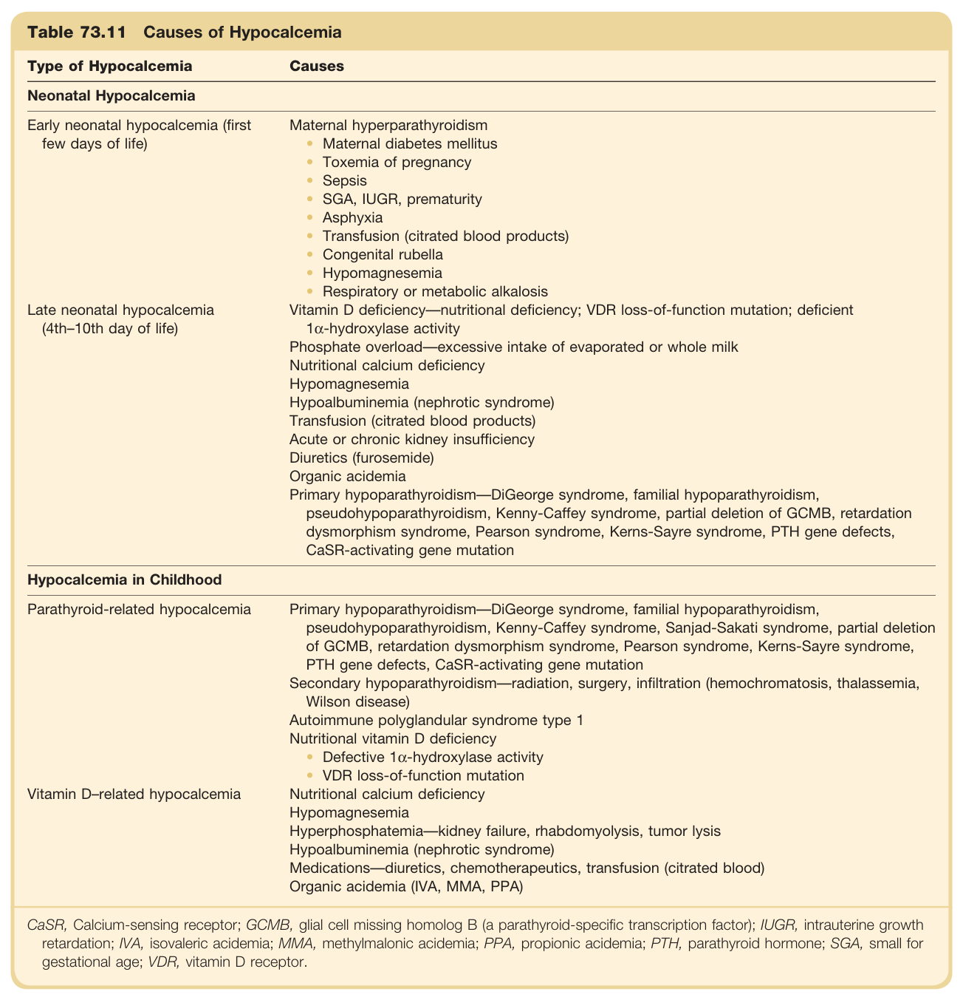

#### Table Data (CSV: [Table_73_11.csv](Table_73_11.csv))

```markdown
| Table Text (OCR) |
| :--- |
| Table 73.11 Causes of Hypocalcemia Type of Hypocalcemia  Causes    Neonatal Hypocalcemia    Early neonatal hypocalcemia (first few days of life)  Maternal hyperparathyroidismMaternal diabetes mellitusToxemia of pregnancySepsisSGA, IUGR, prematurityAsphyxiaTransfusion (citrated blood products)Congenital rubellaHypomagnesemiaRespiratory or metabolic alkalosis    Late neonatal hypocalcemia (4th–10th day of life)  Vitamin D deficiency—nutritional deficiency; VDR loss-of-function mutation; deficient  1\alpha -hydroxylase activityPhosphate overload—excessive intake of evaporated or whole milkNutritional calcium deficiencyHypomagnesemiaHypoalbuminemia (nephrotic syndrome)Transfusion (citrated blood products)Acute or chronic kidney insufficiencyDiuretics (furosemide)Organic acidemiaPrimary hypoparathyroidism—DiGeorge syndrome, familial hypoparathyroidism, pseudohypoparathyroidism, Kenny-Caffey syndrome, partial deletion of GCMB, retardation dysmorphism syndrome, Pearson syndrome, Kerns-Sayre syndrome, PTH gene defects, CaSR-activating gene mutation    Hypocalcemia in Childhood    Parathyroid-related hypocalcemia  Primary hypoparathyroidism—DiGeorge syndrome, familial hypoparathyroidism, pseudohypoparathyroidism, Kenny-Caffey syndrome, Sanjad-Sakati syndrome, partial deletion of GCMB, retardation dysmorphism syndrome, Pearson syndrome, Kerns-Sayre syndrome, PTH gene defects, CaSR-activating gene mutationSecondary hypoparathyroidism—radiation, surgery, infiltration (hemochromatosis, thalassemia, Wilson disease)Autoimmune polyglandular syndrome type 1Nutritional vitamin D deficiencyDefective  1\alpha -hydroxylase activityVDR loss-of-function mutation    Vitamin D-related hypocalcemia  Nutritional calcium deficiencyHypomagnesemiaHyperphosphatemia—kidney failure, rhabdomyolysis, tumor lysisHypoalbuminemia (nephrotic syndrome)Medications—diuretics, chemotherapeutics, transfusion (citrated blood)Organic acidemia (IVA, MMA, PPA)    CaSR, Calcium-sensing receptor; GCMB, glial cell missing homolog B (a parathyroid-specific transcription factor);IUGR, intrauterine growth retardation; IVA, isovaleric acidemia;MMA, methylmalonic acidemia;PPA, propionic acidemia;PTH, parathyroid hormone; SGA, small for gestational age;VDR, vitamin D receptor. |
```

Table 73.11 Causes of Hypocalcemia | Type of Hypocalcemia | Causes | | :--- | :--- | | **Neonatal Hypocalcemia** | | | Early neonatal hypocalcemia (first few days of life) | Maternal hyperparathyroidism<br>• Maternal diabetes mellitus<br>• Toxemia of pregnancy<br>• Sepsis<br>• SGA, IUGR, prematurity<br>• Asphyxia<br>• Transfusion (citrated blood products)<br>• Congenital rubella<br>• Hypomagnesemia<br>• Respiratory or metabolic alkalosis | | Late neonatal hypocalcemia (4th-10th day of life) | Vitamin D deficiency-nutritional deficiency; VDR loss-of-function mutation; deficient 1a-hydroxylase activity<br>Phosphate overload-excessive intake of evaporated or whole milk<br>Nutritional calcium deficiency<br>Hypomagnesemia<br>Hypoalbuminemia (nephrotic syndrome)<br>Transfusion (citrated blood products)<br>Acute or chronic kidney insufficiency<br>Diuretics (furosemide)<br>Organic acidemia<br>Primary hypoparathyroidism-DiGeorge syndrome, familial hypoparathyroidism, pseudohypoparathyroidism, Kenny-Caffey syndrome, partial deletion of GCMB, retardation dysmorphism syndrome, Pearson syndrome, Kerns-Sayre syndrome, PTH gene defects, CaSR-activating gene mutation | | **Hypocalcemia in Childhood** | | | Parathyroid-related hypocalcemia | Primary hypoparathyroidism-DiGeorge syndrome, familial hypoparathyroidism, pseudohypoparathyroidism, Kenny-Caffey syndrome, Sanjad-Sakati syndrome, partial deletion of GCMB, retardation dysmorphism syndrome, Pearson syndrome, Kerns-Sayre syndrome, PTH gene defects, CaSR-activating gene mutation<br>Secondary hypoparathyroidism-radiation, surgery, infiltration (hemochromatosis, thalassemia, Wilson disease)<br>Autoimmune polyglandular syndrome type 1 | | Vitamin D-related hypocalcemia | Nutritional vitamin D deficiency<br>• Defective 1a-hydroxylase activity<br>• VDR loss-of-function mutation<br>Nutritional calcium deficiency<br>Hypomagnesemia<br>Hyperphosphatemia-kidney failure, rhabdomyolysis, tumor lysis<br>Hypoalbuminemia (nephrotic syndrome)<br>Medications-diuretics, chemotherapeutics, transfusion (citrated blood)<br>Organic acidemia (IVA, MMA, PPA) | *CaSR, Calcium-sensing receptor; GCMB, glial cell missing homolog B (a parathyroid-specific transcription factor); IUGR, intrauterine growth retardation; IVA, isovaleric acidemia; MMA, methylmalonic acidemia; PPA, propionic acidemia; PTH, parathyroid hormone; SGA, small for gestational age; VDR, vitamin D receptor.*

---

### Table_73_12

#### Table Image

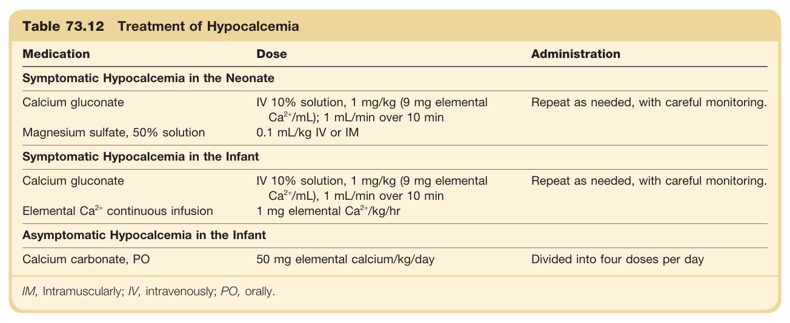

#### Table Data (CSV: [Table_73_12.csv](Table_73_12.csv))

```markdown
| Table Text (OCR) |
| :--- |
| Table 73.12 Treatment of Hypocalcemia Medication  Dose  Administration    Symptomatic Hypocalcemia in the Neonate    Calcium gluconate  IV 10% solution, 1 mg/kg (9 mg elemental  Ca^{2+}/mL ); 1 mL/min over 10 min  Repeat as needed, with careful monitoring.    Magnesium sulfate, 50% solution  0.1 mL/kg IV or IM      Symptomatic Hypocalcemia in the Infant    Calcium gluconate  IV 10% solution, 1 mg/kg (9 mg elemental  Ca^{2+}/mL ), 1 mL/min over 10 min  Repeat as needed, with careful monitoring.    Elemental  Ca^{2+}  continuous infusion  1 mg elemental  Ca^{2+}/kg/hr       Asymptomatic Hypocalcemia in the Infant    Calcium carbonate, PO  50 mg elemental calcium/kg/day  Divided into four doses per day    IM, Intramuscularly; IV, intravenously; PO, orally. |
```

Table 73.12 Treatment of Hypocalcemia | Medication | Dose | Administration | | :--- | :--- | :--- | | **Symptomatic Hypocalcemia in the Neonate** | | | | Calcium gluconate | IV 10% solution, 1 mg/kg (9 mg elemental Ca²⁺/mL); 1 mL/min over 10 min | Repeat as needed, with careful monitoring. | | Magnesium sulfate, 50% solution | 0.1 mL/kg IV or IM | | | **Symptomatic Hypocalcemia in the Infant** | | | | Calcium gluconate | IV 10% solution, 1 mg/kg (9 mg elemental Ca²⁺/mL), 1 mL/min over 10 min | Repeat as needed, with careful monitoring. | | Elemental Ca²⁺ continuous infusion | 1 mg elemental Ca²⁺/kg/hr | | | **Asymptomatic Hypocalcemia in the Infant** | | | | Calcium carbonate, PO | 50 mg elemental calcium/kg/day | Divided into four doses per day | *IM, Intramuscularly; IV, intravenously; PO, orally.*

---

### Table_73_13

#### Table Image

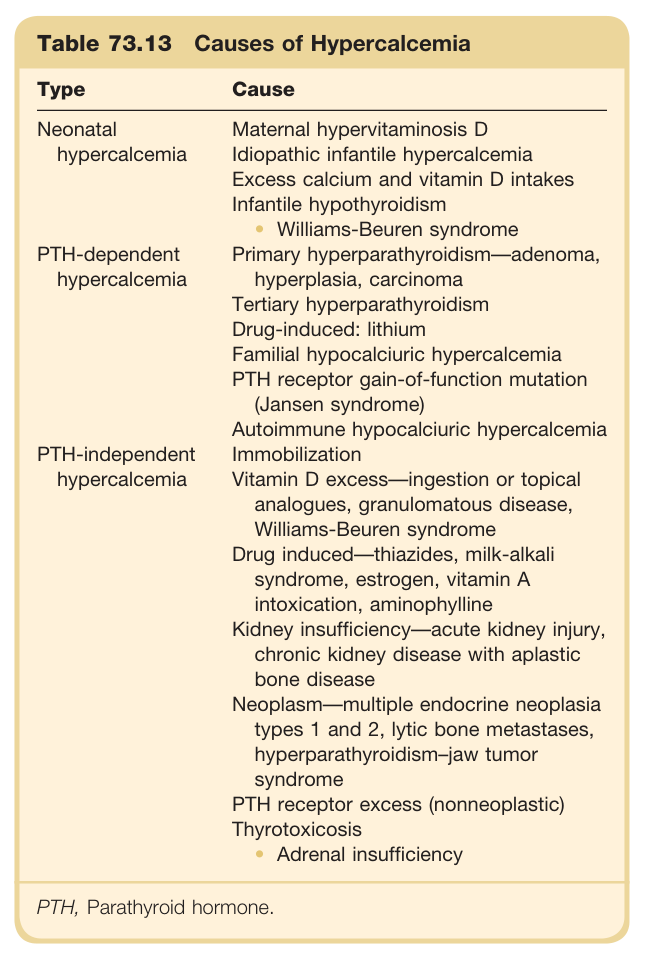

#### Table Data (CSV: [Table_73_13.csv](Table_73_13.csv))

```markdown
| Table Text (OCR) |
| :--- |
| Table 73.13 Causes of Hypercalcemia Type  Cause    Neonatal hypercalcemia  Maternal hypervitaminosis DIdiopathic infantile hypercalcemiaExcess calcium and vitamin D intakesInfantile hypothyroidismWilliams-Beuren syndrome    PTH-dependent hypercalcemia  Primary hyperparathyroidism—adenoma, hyperplasia, carcinomaTertiary hyperparathyroidismDrug-induced: lithiumFamilial hypocalciuric hypercalcemiaPTH receptor gain-of-function mutation (Jansen syndrome)Autoimmune hypocalciuric hypercalcemia    PTH-independent hypercalcemia  ImmobilizationVitamin D excess—ingestion or topical analogues, granulomatous disease, Williams-Beuren syndromeDrug induced—thiazides, milk-alkali syndrome, estrogen, vitamin A intoxication, aminophyllineKidney insufficiency—acute kidney injury, chronic kidney disease with aplastic bone diseaseNeoplasm—multiple endocrine neoplasia types 1 and 2, lytic bone metastases, hyperparathyroidism-jaw tumor syndromePTH receptor excess (nonneoplastic)ThyrotoxicosisAdrenal insufficiency PTH, Parathyroid hormone. |
```

Table 73.13 Causes of Hypercalcemia | Type | Cause | | :--- | :--- | | **Neonatal hypercalcemia** | Maternal hypervitaminosis D<br>Idiopathic infantile hypercalcemia<br>Excess calcium and vitamin D intakes<br>Infantile hypothyroidism<br>• Williams-Beuren syndrome | | **PTH-dependent hypercalcemia** | Primary hyperparathyroidism-adenoma, hyperplasia, carcinoma<br>Tertiary hyperparathyroidism<br>Drug-induced: lithium<br>Familial hypocalciuric hypercalcemia<br>PTH receptor gain-of-function mutation (Jansen syndrome) | | **PTH-independent hypercalcemia** | Autoimmune hypocalciuric hypercalcemia<br>Immobilization<br>Vitamin D excess-ingestion or topical analogues, granulomatous disease, Williams-Beuren syndrome<br>Drug induced-thiazides, milk-alkali syndrome, estrogen, vitamin A intoxication, aminophylline<br>Kidney insufficiency-acute kidney injury, chronic kidney disease with aplastic bone disease<br>Neoplasm-multiple endocrine neoplasia types 1 and 2, lytic bone metastases, hyperparathyroidism-jaw tumor syndrome<br>PTH receptor excess (nonneoplastic)<br>Thyrotoxicosis<br>• Adrenal insufficiency | *PTH, Parathyroid hormone.*

---

### Table_73_14

#### Table Image

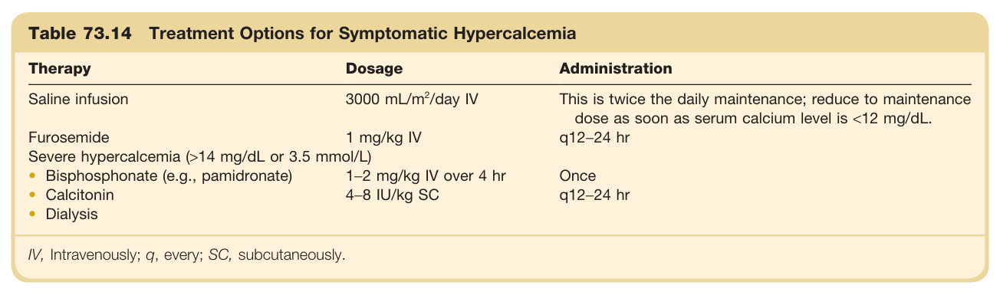

#### Table Data (CSV: [Table_73_14.csv](Table_73_14.csv))

```markdown
| Table Text (OCR) |
| :--- |
| Table 73.14 Treatment Options for Symptomatic Hypercalcemia Therapy  Dosage  Administration    Saline infusion  3000 mL/m2/day IV  This is twice the daily maintenance; reduce to maintenance dose as soon as serum calcium level is <12 mg/dL.    Furosemide  1 mg/kg IV  q12–24 hr    Severe hypercalcemia (>14 mg/dL or 3.5 mmol/L)    Bisphosphonate (e.g., pamidronate)  1–2 mg/kg IV over 4 hr  Once    Calcitonin  4–8 IU/kg SC  q12–24 hr    Dialysis IV, Intravenously; q, every; SC, subcutaneously. |
```

Table 73.14 Treatment Options for Symptomatic Hypercalcemia | Therapy | Dosage | Administration | | :--- | :--- | :--- | | Saline infusion | 3000 mL/m²/day IV | This is twice the daily maintenance; reduce to maintenance dose as soon as serum calcium level is <12 mg/dL. | | Furosemide | 1 mg/kg IV | q12-24 hr | | Severe hypercalcemia (>14 mg/dL or 3.5 mmol/L) | | | | • Bisphosphonate (e.g., pamidronate) | 1-2 mg/kg IV over 4 hr | Once | | • Calcitonin | 4-8 IU/kg SC | q12-24 hr | | • Dialysis | | | *IV, Intravenously; q, every; SC, subcutaneously.*

---

### Table_73_15

#### Table Image

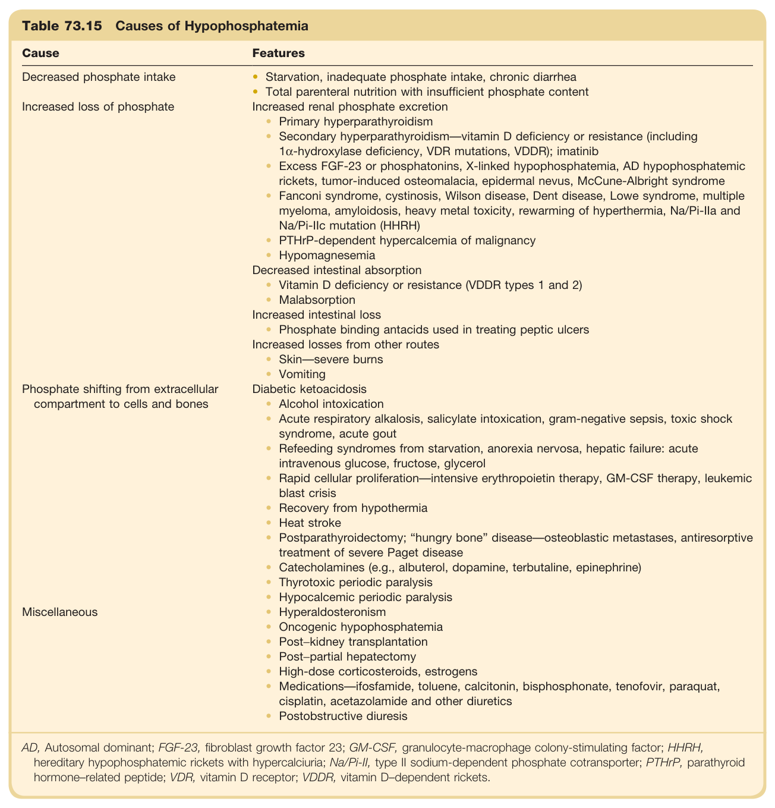

#### Table Data (CSV: [Table_73_15.csv](Table_73_15.csv))

```markdown
| Table Text (OCR) |
| :--- |
| Table 73.15 Causes of Hypophosphatemia Cause  Features    Decreased phosphate intake  Starvation, inadequate phosphate intake, chronic diarrheaTotal parenteral nutrition with insufficient phosphate content    Increased loss of phosphate  Increased renal phosphate excretionPrimary hyperparathyroidismSecondary hyperparathyroidism—vitamin D deficiency or resistance (including 1α-hydroxylase deficiency, VDR mutations, VDDR); imatinibExcess FGF-23 or phosphatonins, X-linked hypophosphatemia, AD hypophosphatemic rickets, tumor-induced osteomalacia, epidermal nevus, McCune-Albright syndromeFanconi syndrome, cystinosis, Wilson disease, Dent disease, Lowe syndrome, multiple myeloma, amyloidosis, heavy metal toxicity, rewarming of hyperthermia, Na/Pi-IIa and Na/Pi-IIc mutation (HHRH)PTHrP-dependent hypercalcemia of malignancyHypomagnesemiaDecreased intestinal absorptionVitamin D deficiency or resistance (VDDR types 1 and 2)MalabsorptionIncreased intestinal lossPhosphate binding antacids used in treating peptic ulcersIncreased losses from other routesSkin—severe burnsVomiting    Phosphate shifting from extracellular compartment to cells and bones  Diabetic ketoacidosisAlcohol intoxicationAcute respiratory alkalosis, salicylate intoxication, gram-negative sepsis, toxic shock syndrome, acute goutRefeeding syndromes from starvation, anorexia nervosa, hepatic failure: acute intravenous glucose, fructose, glycerolRapid cellular proliferation—intensive erythropoietin therapy, GM-CSF therapy, leukemic blast crisisRecovery from hypothermiaHeat strokePostparathyroidectomy; “hungry bone” disease—osteoblastic metastases, antiresorptive treatment of severe Paget diseaseCatecholamines (e.g., albuterol, dopamine, terbutaline, epinephrine)Thyrotoxic periodic paralysisHypocalcemic periodic paralysisHyperaldosteronismOncogenic hypophosphatemiaPost–kidney transplantationPost–partial hepatectomyHigh-dose corticosteroids, estrogensMedications—ifosfamide, toluene, calcitonin, bisphosphonate, tenofovir, paraquat, cisplatin, acetazolamide and other diureticsPostobstructive diuresis    Miscellaneous AD, Autosomal dominant; FGF-23, fibroblast growth factor 23; GM-CSF, granulocyte-macrophage colony-stimulating factor; HHRH, hereditary hypophosphatemic rickets with hypercalciuria; Na/Pi-II, type II sodium-dependent phosphate cotransporter; PTHrP, parathyroid hormone–related peptide; VDR, vitamin D receptor; VDDR, vitamin D–dependent rickets. |
```

Table 73.15 Causes of Hypophosphatemia | Cause | Features | | :--- | :--- | | **Decreased phosphate intake** | • Starvation, inadequate phosphate intake, chronic diarrhea<br>• Total parenteral nutrition with insufficient phosphate content | | **Increased loss of phosphate** | **Increased renal phosphate excretion**<br>• Primary hyperparathyroidism<br>• Secondary hyperparathyroidism-vitamin D deficiency or resistance (including 1a-hydroxylase deficiency, VDR mutations, VDDR); imatinib<br>• Excess FGF-23 or phosphatonins, X-linked hypophosphatemia, AD hypophosphatemic rickets, tumor-induced osteomalacia, epidermal nevus, McCune-Albright syndrome<br>• Fanconi syndrome, cystinosis, Wilson disease, Dent disease, Lowe syndrome, multiple myeloma, amyloidosis, heavy metal toxicity, rewarming of hyperthermia, Na/Pi-lla and Na/Pi-llc mutation (HHRH)<br>• PTHrP-dependent hypercalcemia of malignancy<br>• Hypomagnesemia<br>**Decreased intestinal absorption**<br>• Vitamin D deficiency or resistance (VDDR types 1 and 2)<br>• Malabsorption<br>**Increased intestinal loss**<br>• Phosphate binding antacids used in treating peptic ulcers<br>**Increased losses from other routes**<br>• Skin-severe burns<br>• Vomiting | | **Phosphate shifting from extracellular compartment to cells and bones** | Diabetic ketoacidosis<br>• Alcohol intoxication<br>• Acute respiratory alkalosis, salicylate intoxication, gram-negative sepsis, toxic shock syndrome, acute gout<br>• Refeeding syndromes from starvation, anorexia nervosa, hepatic failure: acute intravenous glucose, fructose, glycerol<br>• Rapid cellular proliferation-intensive erythropoietin therapy, GM-CSF therapy, leukemic blast crisis<br>• Recovery from hypothermia<br>• Heat stroke<br>• Postparathyroidectomy; "hungry bone" disease-osteoblastic metastases, antiresorptive treatment of severe Paget disease<br>• Catecholamines (e.g., albuterol, dopamine, terbutaline, epinephrine)<br>• Thyrotoxic periodic paralysis<br>• Hypocalcemic periodic paralysis | | **Miscellaneous** | • Hyperaldosteronism<br>• Oncogenic hypophosphatemia<br>• Post-kidney transplantation<br>• Post-partial hepatectomy<br>• High-dose corticosteroids, estrogens<br>• Medications-ifosfamide, toluene, calcitonin, bisphosphonate, tenofovir, paraquat, cisplatin, acetazolamide and other diuretics<br>• Postobstructive diuresis | *AD, Autosomal dominant; FGF-23, fibroblast growth factor 23; GM-CSF, granulocyte-macrophage colony-stimulating factor; HHRH, hereditary hypophosphatemic rickets with hypercalciuria; Na/Pi-ll, type II sodium-dependent phosphate cotransporter; PTHrP, parathyroid hormone-related peptide; VDR, vitamin D receptor; VDDR, vitamin D-dependent rickets.*

---

### Table_73_16

#### Table Image

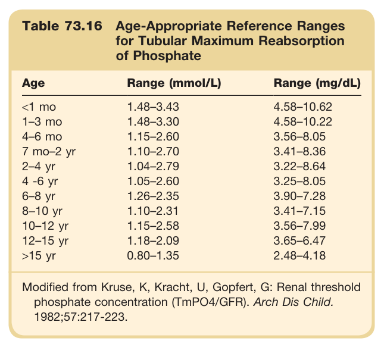

#### Table Data (CSV: [Table_73_16.csv](Table_73_16.csv))

```markdown
| Table Text (OCR) |
| :--- |
| Table 73.16 Age-Appropriate Reference Ranges for Tubular Maximum Reabsorption of Phosphate Age  Range (mmol/L)  Range (mg/dL)    <1 mo  1.48–3.43  4.58–10.62    1–3 mo  1.48–3.30  4.58–10.22    4–6 mo  1.15–2.60  3.56–8.05    7 mo–2 yr  1.10–2.70  3.41–8.36    2–4 yr  1.04–2.79  3.22–8.64    4 -6 yr  1.05–2.60  3.25–8.05    6–8 yr  1.26–2.35  3.90–7.28    8–10 yr  1.10–2.31  3.41–7.15    10–12 yr  1.15–2.58  3.56–7.99    12–15 yr  1.18–2.09  3.65–6.47    >15 yr  0.80–1.35  2.48–4.18 Modified from Kruse, K, Kracht, U, Gopfert, G: Renal threshold phosphate concentration (TmPO4/GFR). Arch Dis Child. 1982;57:217-223. |
```

Table 73.16 Age-Appropriate Reference Ranges for Tubular Maximum Reabsorption of Phosphate | Age | Range (mmol/L) | Range (mg/dL) | | :--- | :--- | :--- | | <1 mo | 1.48-3.43 | 4.58-10.62 | | 1-3 mo | 1.48-3.30 | 4.58-10.22 | | 4-6 mo | 1.15-2.60 | 3.56-8.05 | | 7 mo-2 yr | 1.10-2.70 | 3.41-8.36 | | 2-4 yr | 1.04-2.79 | 3.22-8.64 | | 4 -6 yr | 1.05-2.60 | 3.25-8.05 | | 6-8 yr | 1.26-2.35 | 3.90-7.28 | | 8-10 yr | 1.10-2.31 | 3.41-7.15 | | 10-12 yr | 1.15-2.58 | 3.56-7.99 | | 12-15 yr | 1.18-2.09 | 3.65-6.47 | | >15 yr | 0.80-1.35 | 2.48-4.18 | *Modified from Kruse, K, Kracht, U, Gopfert, G: Renal threshold phosphate concentration (TmPO4/GFR). Arch Dis Child. 1982;57:217-223.*

---

### Table_73_17

#### Table Image

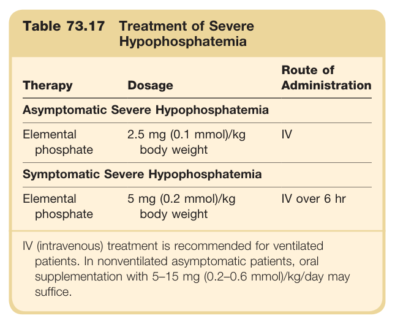

#### Table Data (CSV: [Table_73_17.csv](Table_73_17.csv))

```markdown
| Table Text (OCR) |
| :--- |
| Table 73.17 Treatment of Severe Hypophosphatemia Therapy  Dosage  Route of Administration    Asymptomatic Severe Hypophosphatemia    Elemental phosphate  2.5 mg (0.1 mmol)/kg body weight  IV    Symptomatic Severe Hypophosphatemia    Elemental phosphate  5 mg (0.2 mmol)/kg body weight  IV over 6 hr IV (intravenous) treatment is recommended for ventilated patients. In nonventilated asymptomatic patients, oral supplementation with 5–15 mg (0.2–0.6 mmol)/kg/day may suffice. |
```

Table 73.17 Treatment of Severe Hypophosphatemia | Therapy | Dosage | Route of Administration | | :--- | :--- | :--- | | **Asymptomatic Severe Hypophosphatemia** | | | | Elemental phosphate | 2.5 mg (0.1 mmol)/kg body weight | IV | | **Symptomatic Severe Hypophosphatemia** | | | | Elemental phosphate | 5 mg (0.2 mmol)/kg body weight | IV over 6 hr | *IV (intravenous) treatment is recommended for ventilated patients. In nonventilated asymptomatic patients, oral supplementation with 5-15 mg (0.2-0.6 mmol)/kg/day may suffice.*

---

### Table_73_18

#### Table Image

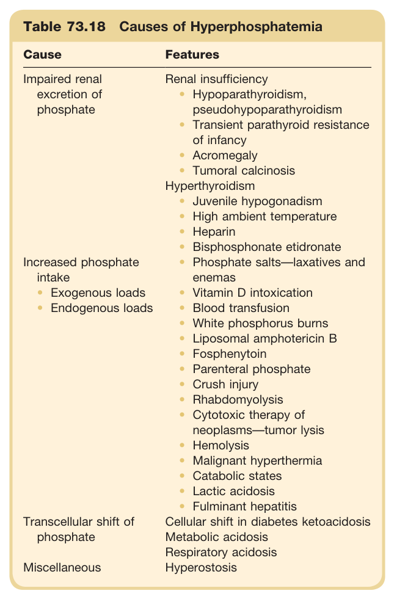

#### Table Data (CSV: [Table_73_18.csv](Table_73_18.csv))

```markdown
| Table Text (OCR) |
| :--- |
| Table 73.18 Causes of Hyperphosphatemia Cause  Features    Impaired renal excretion of phosphate  Renal insufficiencyHypoparathyroidism, pseudohypoparathyroidismTransient parathyroid resistance of infancyAcromegalyTumoral calcinosisHyperthyroidismJuvenile hypogonadismHigh ambient temperatureHeparinBisphosphonate etidronate    Increased phosphate intakeExogenous loadsEndogenous loads  Phosphate salts—laxatives and enemasVitamin D intoxicationBlood transfusionWhite phosphorus burnsLiposomal amphotericin BFosphenytoinParenteral phosphateCrush injuryRhabdomyolysisCytotoxic therapy of neoplasms—tumor lysisHemolysisMalignant hyperthermiaCatabolic statesLactic acidosisFulminant hepatitis    Transcellular shift of phosphate  Cellular shift in diabetes ketoacidosisMetabolic acidosisRespiratory acidosis    Miscellaneous  Hyperostosis |
```

Table 73.18 Causes of Hyperphosphatemia | Cause | Features | | :--- | :--- | | **Impaired renal excretion of phosphate** | Renal insufficiency<br>Hypoparathyroidism, pseudohypoparathyroidism<br>• Transient parathyroid resistance of infancy<br>• Acromegaly<br>• Tumoral calcinosis<br>Hyperthyroidism<br>• Juvenile hypogonadism<br>• High ambient temperature<br>• Heparin<br>• Bisphosphonate etidronate | | **Increased phosphate intake**<br>• Exogenous loads<br>• Endogenous loads | • Phosphate salts-laxatives and enemas<br>• Vitamin D intoxication<br>• Blood transfusion<br>• White phosphorus burns<br>• Liposomal amphotericin B<br>• Fosphenytoin<br>• Parenteral phosphate<br>• Crush injury<br>• Rhabdomyolysis<br>• Cytotoxic therapy of neoplasms-tumor lysis<br>• Hemolysis<br>• Malignant hyperthermia<br>• Catabolic states<br>• Lactic acidosis<br>• Fulminant hepatitis | | **Transcellular shift of phosphate** | Cellular shift in diabetes ketoacidosis | | **Miscellaneous** | Metabolic acidosis<br>Respiratory acidosis<br>Hyperostosis |

---
