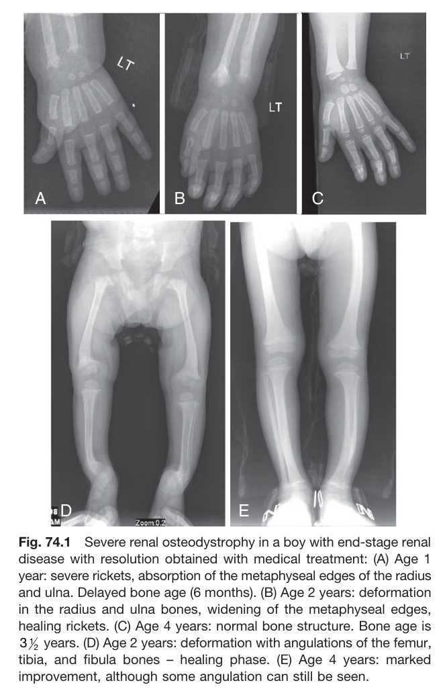
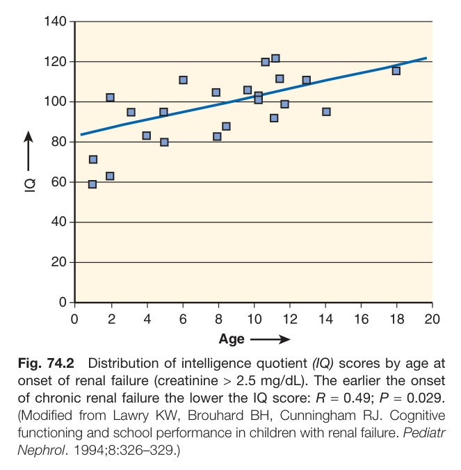
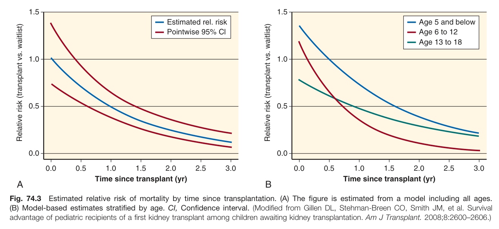
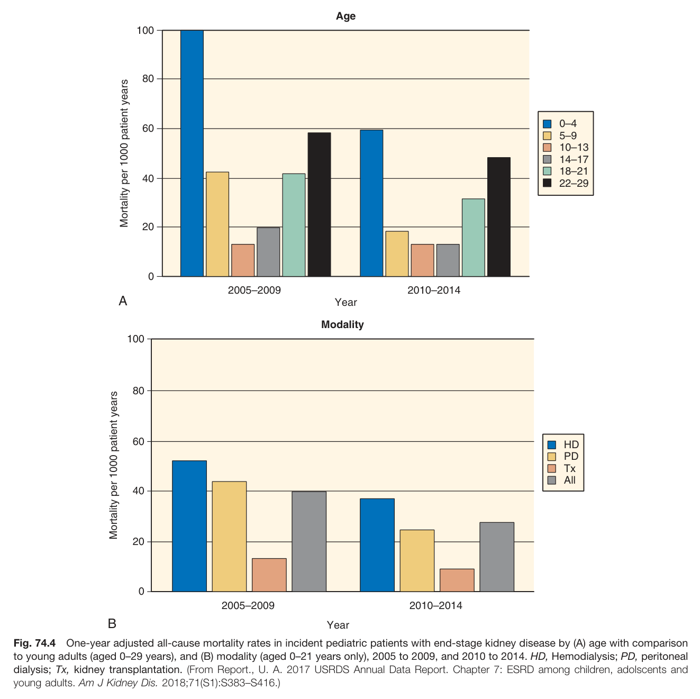
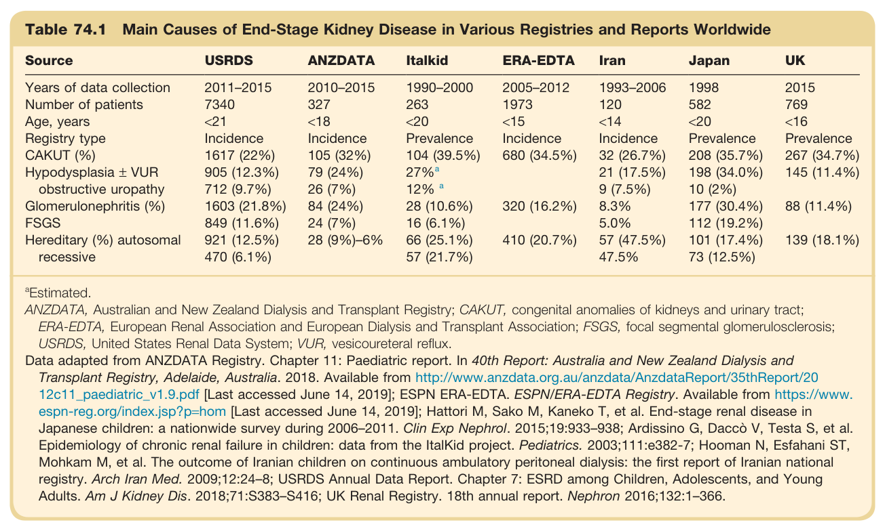
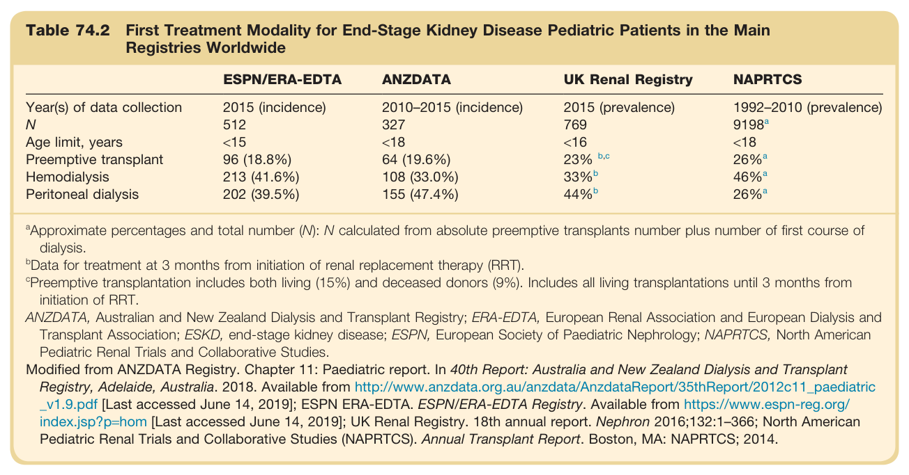
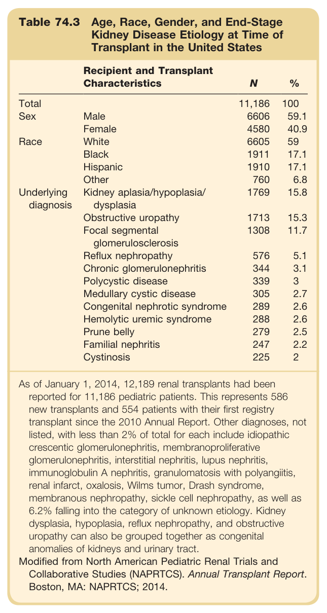
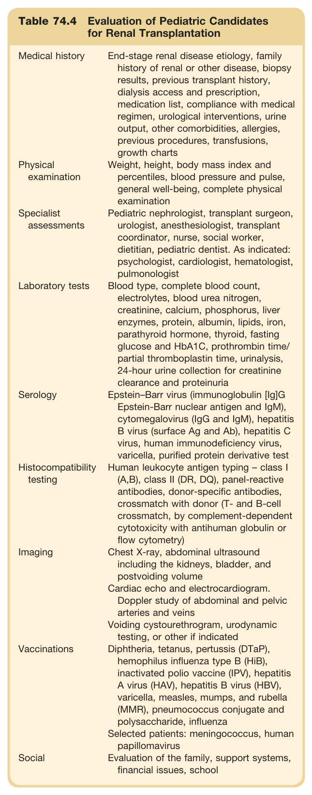

# 74. Renal Replacement Therapy (Dialysis and Transplantation) in Pediatric End-Stage Kidney Disease - Figures and Tables Index

This document lists all figures and tables extracted from `74. Renal Replacement Therapy (Dialysis and Transplantation) in Pediatric End-Stage Kidney Disease.pdf`.

## Table of Contents
- [Figures](#figures)
- [Tables](#tables)

---

## Figures

### Fig_74_1



Fig. 74.1 Severe renal osteodystrophy in a boy with end-stage renal disease with resolution obtained with medical treatment (A) Age 1 year: severe rickets, absorption of the metaphyseal edges of the radius and ulna. Delayed bone age (6 months). (B) Age 2 years: deformation in the radius and ulna bones, widening of the metaphyseal edges, healing rickets. (C) Age 4 years: normal bone structure. Bone age is 3½ years. (D) Age 2 years: deformation with angulations of the femur, tibia, and fibula bones - healing phase. (E) Age 4 years: marked improvement, although some angulation can still be seen.

---

### Fig_74_2



Fig. 74.2 Distribution of intelligence quotient (IQ) scores by age at onset of renal failure (creatinine > 2.5 mg/dL). The earlier the onset of chronic renal failure the lower the IQ score: R = 0.49; P = 0.029. (Modified from Lawry KW, Brouhard BH, Cunningham RJ. Cognitive functioning and school performance in children with renal failure. Pediatr Nephrol. 1994;8:326-329.)

---

### Fig_74_3



Fig. 74.3 Estimated relative risk of mortality by time since transplantation. (A) The figure is estimated from a model including all ages. (B) Model-based estimates stratified by age. Cl, Confidence interval. (Modified from Gillen DL, Stehman-Breen CO, Smith JM, et al. Survival advantage of pediatric recipients of a first kidney transplant among children awaiting kidney transplantation. Am J Transplant. 2008;8:2600-2606.)

---

### Fig_74_4



Fig. 74.4 One-year adjusted all-cause mortality rates in incident pediatric patients with end-stage kidney disease by (A) age with comparison to young adults (aged 0-29 years), and (B) modality (aged 0-21 years only), 2005 to 2009, and 2010 to 2014. HD, Hemodialysis; PD, peritoneal dialysis; Tx, kidney transplantation. (From Report., U. A. 2017 USRDS Annual Data Report. Chapter 7: ESRD among children, adolscents and young adults. Am J Kidney Dis. 2018;71(S1):S383-S416.)

---

## Tables

### Table_74_1

#### Table Image



#### Table Data (CSV: [Table_74_1.csv](Table_74_1.csv))

```markdown
| Table Text (OCR) |
| :--- |
| Table 74.1 Main Causes of End-Stage Kidney Disease in Various Registries and Reports Worldwide Source  USRDS  ANZDATA  Italkid  ERA-EDTA  Iran  Japan  UK    Years of data collection  2011–2015  2010–2015  1990–2000  2005–2012  1993–2006  1998  2015    Number of patients  7340  327  263  1973  120  582  769    Age, years  <21  <18  <20  <15  <14  <20  <16    Registry type  Incidence  Incidence  Prevalence  Incidence  Incidence  Prevalence  Prevalence    CAKUT (%)  1617 (22%)  105 (32%)  104 (39.5%)  680 (34.5%)  32 (26.7%)  208 (35.7%)  267 (34.7%)    Hypodysplasia ± VUR obstructive uropathy  905 (12.3%)  79 (24%)   27\%^a     21 (17.5%)  198 (34.0%)  145 (11.4%)    712 (9.7%)  26 (7%)   12\%^a     9 (7.5%)  10 (2%)      Glomerulonephritis (%)  1603 (21.8%)  84 (24%)  28 (10.6%)  320 (16.2%)  8.3%  177 (30.4%)  88 (11.4%)    FSGS  849 (11.6%)  24 (7%)  16 (6.1%)    5.0%  112 (19.2%)      Hereditary (%) autosomal recessive  921 (12.5%)  28 (9%)-6%  66 (25.1%)  410 (20.7%)  57 (47.5%)  101 (17.4%)  139 (18.1%)    470 (6.1%)    57 (21.7%)    47.5%  73 (12.5%) <sup>a</sup>Estimated. ANZDATA, Australian and New Zealand Dialysis and Transplant Registry; CAKUT, congenital anomalies of kidneys and urinary tract; ERA-EDTA, European Renal Association and European Dialysis and Transplant Association; FSGS, focal segmental glomerulosclerosis; USRDS, United States Renal Data System; VUR, vesicoureteral reflux. Data adapted from ANZDATA Registry. Chapter 11: Paediatric report. In 40th Report: Australia and New Zealand Dialysis and Transplant Registry, Adelaide, Australia. 2018. Available from http://www.anzdata.org.au/anzdata/AnzdataReport/35thReport/20 12c11_paediatric_v1.9.pdf [Last accessed June 14, 2019]; ESPN ERA-EDTA. ESPN/ERA-EDTA Registry. Available from https://www. espn-reg.org/index.jsp?p=hom [Last accessed June 14, 2019]; Hattori M, Sako M, Kaneko T, et al. End-stage renal disease in Japanese children: a nationwide survey during 2006–2011. Clin Exp Nephrol. 2015;19:933–938; Ardissino G, Daccò V, Testa S, et al. Epidemiology of chronic renal failure in children: data from the ItalKid project. Pediatrics. 2003;111:e382-7; Hooman N, Esfahani ST, Mohkam M, et al. The outcome of Iranian children on continuous ambulatory peritoneal dialysis: the first report of Iranian national registry. Arch Iran Med. 2009;12:24–8; USRDS Annual Data Report. Chapter 7: ESRD among Children, Adolescents, and Young Adults. Am J Kidney Dis. 2018;71:S383–S416; UK Renal Registry. 18th annual report. Nephron 2016;132:1–366. |
```

Table 74.1 Main Causes of End-Stage Kidney Disease in Various Registries and Reports Worldwide | Source | USRDS | ANZDATA | Italkid | ERA-EDTA | Iran | Japan | UK | | :--------------------------- | :----------- | :--------- | :---------- | :---------- | :--------- | :---------- | :---------- | | **Years of data collection** | 2011-2015 | 2010-2015 | 1990-2000 | 2005-2012 | 1993-2006 | 1998 | 2015 | | **Number of patients** | 7340 | 327 | 263 | 1973 | 120 | 582 | 769 | | **Age, years** | <21 | <18 | <20 | <15 | <14 | <20 | <16 | | **Registry type** | Incidence | Incidence | Incidence | Prevalence | Incidence | Prevalence | Prevalence | | **CAKUT (%)** | 1617 (22%) | 105 (32%) | 104 (39.5%) | 680 (34.5%) | 32 (26.7%) | 208 (35.7%) | 267 (34.7%) | | Hypodysplasia ± VUR | 905 (12.3%) | 79 (24%) | 27%a | | 21 (17.5%) | 198 (34.0%) | 145 (11.4%) | | obstructive uropathy | 712 (9.7%) | 26 (7%) | 12% a | | 9 (7.5%) | 10 (2%) | | | **Glomerulonephritis (%)** | 1603 (21.8%) | 84 (24%) | 28 (10.6%) | 320 (16.2%) | 8.3% | 177 (30.4%) | 88 (11.4%) | | FSGS | 849 (11.6%) | 24 (7%) | 16 (6.1%) | | 5.0% | 112 (19.2%) | | | **Hereditary (%) autosomal** | 921 (12.5%) | 28 (9%)-6% | 66 (25.1%) | 410 (20.7%) | 57 (47.5%) | 101 (17.4%) | 139 (18.1%) | | **recessive** | 470 (6.1%) | | 57 (21.7%) | | 47.5% | 73 (12.5%) | | @Estimated. ANZDATA, Australian and New Zealand Dialysis and Transplant Registry; CAKUT, congenital anomalies of kidneys and urinary tract; ERA-EDTA, European Renal Association and European Dialysis and Transplant Association; FSGS, focal segmental glomerulosclerosis; USRDS, United States Renal Data System; VUR, vesicoureteral reflux. Data adapted from ANZDATA Registry. Chapter 11: Paediatric report. In 40th Report: Australia and New Zealand Dialysis and Transplant Registry, Adelaide, Australia. 2018; ESPN ERA-EDTA. ESPN/ERA-EDTA Registry; Hattori M, Sako M, Kaneko T, et al. End-stage renal disease in Japanese children: a nationwide survey during 2006-2011. Clin Exp Nephrol. 2015;19:933-938; Ardissino G, Daccò V, Testa S, et al. Epidemiology of chronic renal failure in children: data from the ItalKid project. Pediatrics. 2003;111:e382-7; Hooman N, Esfahani ST, Mohkam M, et al. The outcome of Iranian children on continuous ambulatory peritoneal dialysis: the first report of Iranian national registry. Arch Iran Med. 2009;12:24–8; USRDS Annual Data Report. Chapter 7: ESRD among Children, Adolescents, and Young Adults. Am J Kidney Dis. 2018;71:S383-S416; UK Renal Registry. 18th annual report. Nephron 2016;132:1-366.

---

### Table_74_2

#### Table Image



#### Table Data (CSV: [Table_74_2.csv](Table_74_2.csv))

```markdown
| Table Text (OCR) |
| :--- |
| Table 74.2 First Treatment Modality for End-Stage Kidney Disease Pediatric Patients in the Main Registries Worldwide ESPN/ERA-EDTA  ANZDATA  UK Renal Registry  NAPRTCS    Year(s) of data collection  2015 (incidence)  2010–2015 (incidence)  2015 (prevalence)  1992–2010 (prevalence)    N  512  327  769   9198^a     Age limit, years  <15  <18  <16  <18    Preemptive transplant  96 (18.8%)  64 (19.6%)   23\%^{b,c}    26\%^a     Hemodialysis  213 (41.6%)  108 (33.0%)   33\%^b    46\%^a     Peritoneal dialysis  202 (39.5%)  155 (47.4%)   44\%^b    26\%^a <sup>a</sup>Approximate percentages and total number (N): N calculated from absolute preemptive transplants number plus number of first course of dialysis. <sup>b</sup>Data for treatment at 3 months from initiation of renal replacement therapy (RRT). <sup>c</sup>Preemptive transplantation includes both living (15%) and deceased donors (9%). Includes all living transplantations until 3 months from initiation of RRT. ANZDATA, Australian and New Zealand Dialysis and Transplant Registry; ERA-EDTA, European Renal Association and European Dialysis and Transplant Association; ESKD, end-stage kidney disease; ESPN, European Society of Paediatric Nephrology; NAPRTCS, North American Pediatric Renal Trials and Collaborative Studies. Modified from ANZDATA Registry. Chapter 11: Paediatric report. In 40th Report: Australia and New Zealand Dialysis and Transplant Registry, Adelaide, Australia. 2018. Available from http://www.anzdata.org.au/anzdata/AnzdataReport/35thReport/2012c11_paediatric _v1.9.pdf [Last accessed June 14, 2019]; ESPN ERA-EDTA. ESPN/ERA-EDTA Registry. Available from https://www.espn-reg.org index.jsp?p=hom [Last accessed June 14, 2019]; UK Renal Registry. 18th annual report. Nephron 2016;132:1–366; North American Pediatric Renal Trials and Collaborative Studies (NAPRTCS). Annual Transplant Report. Boston, MA: NAPRTCS; 2014. |
```

Table 74.2 First Treatment Modality for End-Stage Kidney Disease Pediatric Patients in the Main Registries Worldwide | | ESPN/ERA-EDTA | ANZDATA | UK Renal Registry | NAPRTCS | | :----------------------------- | :--------------- | :-------------------- | :---------------- | :--------------------- | | **Year(s) of data collection** | 2015 (incidence) | 2010-2015 (incidence) | 2015 (prevalence) | 1992-2010 (prevalence) | | **N** | 512 | 327 | 769 | 9198a | | **Age limit, years** | <15 | <18 | <16 | <18 | | **Preemptive transplant** | 96 (18.8%) | 64 (19.6%) | 23% b,c | 26%a | | **Hemodialysis** | 213 (41.6%) | 108 (33.0%) | 33%b | 46%a | | **Peritoneal dialysis** | 202 (39.5%) | 155 (47.4%) | 44%b | 26%a | Approximate percentages and total number (N): N calculated from absolute preemptive transplants number plus number of first course of dialysis. Data for treatment at 3 months from initiation of renal replacement therapy (RRT). Preemptive transplantation includes both living (15%) and deceased donors (9%). Includes all living transplantations until 3 months from initiation of RRT. ANZDATA, Australian and New Zealand Dialysis and Transplant Registry; ERA-EDTA, European Renal Association and European Dialysis and Transplant Association; ESKD, end-stage kidney disease; ESPN, European Society of Paediatric Nephrology; NAPRTCS, North American Pediatric Renal Trials and Collaborative Studies.

---

### Table_74_3

#### Table Image



#### Table Data (CSV: [Table_74_3.csv](Table_74_3.csv))

```markdown
| Table Text (OCR) |
| :--- |
| Table 74.3 Age, Race, Gender, and End-Stage Kidney Disease Etiology at Time of Transplant in the United States Recipient and Transplant Characteristics  N  %    Total    11,186  100    Sex  Male  6606  59.1    Female  4580  40.9    Race  White  6605  59    Black  1911  17.1    Hispanic  1910  17.1    Other  760  6.8    Underlying diagnosis  Kidney aplasia/hypoplasia/dysplasia  1769  15.8    Obstructive uropathy  1713  15.3    Focal segmental glomerulosclerosis  1308  11.7    Reflux nephropathy  576  5.1    Chronic glomerulonephritis  344  3.1    Polycystic disease  339  3    Medullary cystic disease  305  2.7    Congenital nephrotic syndrome  289  2.6    Hemolytic uremic syndrome  288  2.6    Prune belly  279  2.5    Familial nephritis  247  2.2    Cystinosis  225  2 As of January 1, 2014, 12,189 renal transplants had been reported for 11,186 pediatric patients. This represents 586 new transplants and 554 patients with their first registry transplant since the 2010 Annual Report. Other diagnoses, not listed, with less than 2% of total for each include idiopathic crescentic glomerulonephritis, membranoproliferative glomerulonephritis, interstitial nephritis, lupus nephritis, immunoglobulin A nephritis, granulomatosis with polyangiitis, renal infarct, oxalosis, Wilms tumor, Drash syndrome, membranous nephropathy, sickle cell nephropathy, as well as 6.2% falling into the category of unknown etiology. Kidney dysplasia, hypoplasia, reflux nephropathy, and obstructive uropathy can also be grouped together as congenital anomalies of kidneys and urinary tract. Modified from North American Pediatric Renal Trials and Collaborative Studies (NAPRTCS). Annual Transplant Report. Boston, MA: NAPRTCS; 2014. |
```

Table 74.3 Age, Race, Gender, and End-Stage Kidney Disease Etiology at Time of Transplant in the United States | Recipient and Transplant Characteristics | N | % | | :--------------------------------------- | :----- | :--- | | **Total** | 11,186 | 100 | | **Sex** | | | | Male | 6606 | 59.1 | | Female | 4580 | 40.9 | | **Race** | | | | White | 6605 | 59 | | Black | 1911 | 17.1 | | Hispanic | 1910 | 17.1 | | Other | 760 | 6.8 | | **Underlying diagnosis** | | | | Kidney aplasia/hypoplasia/dysplasia | 1769 | 15.8 | | Obstructive uropathy | 1713 | 15.3 | | Focal segmental glomerulosclerosis | 1308 | 11.7 | | Reflux nephropathy | 576 | 5.1 | | Chronic glomerulonephritis | 344 | 3.1 | | Polycystic disease | 339 | 3 | | Medullary cystic disease | 305 | 2.7 | | Congenital nephrotic syndrome | 289 | 2.6 | | Hemolytic uremic syndrome | 288 | 2.6 | | Prune belly | 279 | 2.5 | | Familial nephritis | 247 | 2.2 | | Cystinosis | 225 | 2 | As of January 1, 2014, 12,189 renal transplants had been reported for 11,186 pediatric patients. This represents 586 new transplants and 554 patients with their first registry transplant since the 2010 Annual Report. Other diagnoses, not listed, with less than 2% of total for each include idiopathic crescentic glomerulonephritis, membranoproliferative glomerulonephritis, interstitial nephritis, lupus nephritis, immunoglobulin A nephritis, granulomatosis with polyangiitis, renal infarct, oxalosis, Wilms tumor, Drash syndrome, membranous nephropathy, sickle cell nephropathy, as well as 6.2% falling into the category of unknown etiology. Kidney dysplasia, hypoplasia, reflux nephropathy, and obstructive uropathy can also be grouped together as congenital anomalies of kidneys and urinary tract. Modified from North American Pediatric Renal Trials and Collaborative Studies (NAPRTCS). Annual Transplant Report. Boston, MA: NAPRTCS; 2014.

---

### Table_74_4

#### Table Image



#### Table Data (CSV: [Table_74_4.csv](Table_74_4.csv))

```markdown
| Table Text (OCR) |
| :--- |
| Table 74.4 Evaluation of Pediatric Candidates for Renal Transplantation Medical history  End-stage renal disease etiology, family history of renal or other disease, biopsy results, previous transplant history, dialysis access and prescription, medication list, compliance with medical regimen, urological interventions, urine output, other comorbidities, allergies, previous procedures, transfusions, growth charts    Physical examination  Weight, height, body mass index and percentiles, blood pressure and pulse, general well-being, complete physical examination    Specialist assessments  Pediatric nephrologist, transplant surgeon, urologist, anesthesiologist, transplant coordinator, nurse, social worker, dietitian, pediatric dentist. As indicated: psychologist, cardiologist, hematologist, pulmonologist    Laboratory tests  Blood type, complete blood count, electrolytes, blood urea nitrogen, creatinine, calcium, phosphorus, liver enzymes, protein, albumin, lipids, iron, parathyroid hormone, thyroid, fasting glucose and HbA1C, prothrombin time/ partial thromboplastin time, urinalysis, 24-hour urine collection for creatinine clearance and proteinuria    Serology  Epstein-Barr virus (immunoglobulin [Ig]G Epstein-Barr nuclear antigen and IgM), cytomegalovirus (IgG and IgM), hepatitis B virus (surface Ag and Ab), hepatitis C virus, human immunodeficiency virus, varicella, purified protein derivative test    Histocompatibility testing  Human leukocyte antigen typing – class I (A,B), class II (DR, DQ), panel-reactive antibodies, donor-specific antibodies, crossmatch with donor (T- and B-cell crossmatch, by complement-dependent cytotoxicity with antihuman globulin or flow cytometry)    Imaging  Chest X-ray, abdominal ultrasound including the kidneys, bladder, and postvoiding volumeCardiac echo and electrocardiogram. Doppler study of abdominal and pelvic arteries and veinsVoiding cystourethrogram, urodynamic testing, or other if indicated    Vaccinations  Diphtheria, tetanus, pertussis (DTaP), hemophilus influenza type B (HiB), inactivated polio vaccine (IPV), hepatitis A virus (HAV), hepatitis B virus (HBV), varicella, measles, mumps, and rubella (MMR), pneumococcus conjugate and polysaccharide, influenzaSelected patients: meningococcus, human papillomavirus    Social  Evaluation of the family, support systems, financial issues, school |
```

Table 74.4 Evaluation of Pediatric Candidates for Renal Transplantation | | | | :----------------------------- | :----------------------------------------------------------- | | **Medical history** | End-stage renal disease etiology, family history of renal or other disease, biopsy results, previous transplant history, dialysis access and prescription, medication list, compliance with medical regimen, urological interventions, urine output, other comorbidities, allergies, previous procedures, transfusions, growth charts | | **Physical examination** | Weight, height, body mass index and percentiles, blood pressure and pulse, general well-being, complete physical examination | | **Specialist assessments** | Pediatric nephrologist, transplant surgeon, urologist, anesthesiologist, transplant coordinator, nurse, social worker, dietitian, pediatric dentist. As indicated: psychologist, cardiologist, hematologist, pulmonologist | | **Laboratory tests** | Blood type, complete blood count, electrolytes, blood urea nitrogen, creatinine, calcium, phosphorus, liver enzymes, protein, albumin, lipids, iron, parathyroid hormone, thyroid, fasting glucose and HbA1C, prothrombin time/ partial thromboplastin time, urinalysis, 24-hour urine collection for creatinine clearance and proteinuria | | **Serology** | Epstein-Barr virus (immunoglobulin [Ig]G Epstein-Barr nuclear antigen and IgM), cytomegalovirus (IgG and IgM), hepatitis B virus (surface Ag and Ab), hepatitis C virus, human immunodeficiency virus, varicella, purified protein derivative test | | **Histocompatibility testing** | Human leukocyte antigen typing - class I (A,B), class II (DR, DQ), panel-reactive antibodies, donor-specific antibodies, crossmatch with donor (T- and B-cell crossmatch, by complement-dependent cytotoxicity with antihuman globulin or flow cytometry) | | **Imaging** | Chest X-ray, abdominal ultrasound including the kidneys, bladder, and postvoiding volume. Cardiac echo and electrocardiogram. Doppler study of abdominal and pelvic arteries and veins. Voiding cystourethrogram, urodynamic testing, or other if indicated | | **Vaccinations** | Diphtheria, tetanus, pertussis (DTaP), hemophilus influenza type B (HiB), inactivated polio vaccine (IPV), hepatitis A virus (HAV), hepatitis B virus (HBV), varicella, measles, mumps, and rubella (MMR), pneumococcus conjugate and polysaccharide, influenza. Selected patients: meningococcus, human papillomavirus | | **Social** | Evaluation of the family, support systems, financial issues, school |

---
