# 75. Global Challenges and Initiatives in Kidney Health - Figures and Tables Index

This document lists all figures and tables extracted from `75. Global Challenges and Initiatives in Kidney Health.pdf`.

## Table of Contents
- [Figures](#figures)
- [Tables](#tables)

---

## Figures

### Fig_75_1

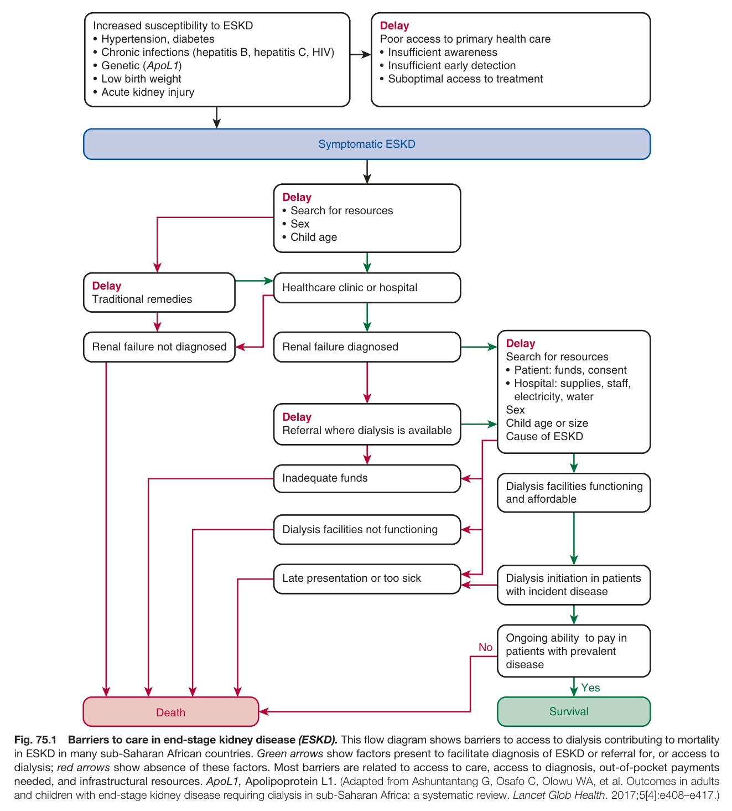

Fig. 75.1 Barriers to care in end-stage kidney disease (ESKD). This flow diagram shows barriers to access to dialysis contributing to mortality in ESKD in many sub-Saharan African countries. Green arrows show factors present to facilitate diagnosis of ESKD or referral for, or access to dialysis; red arrows show absence of these factors. Most barriers are related to access to care, access to diagnosis, out-of-pocket payments needed, and infrastructural resources. ApoL1, Apolipoprotein L1. (Adapted from Ashuntantang G, Osafo C, Olowu WA, et al. Outcomes in adults and children with end-stage kidney disease requiring dialysis in sub-Saharan Africa: a systematic review. Lancet Glob Health. 2017;5[4]:e408-e417.)

---

### Fig_75_2

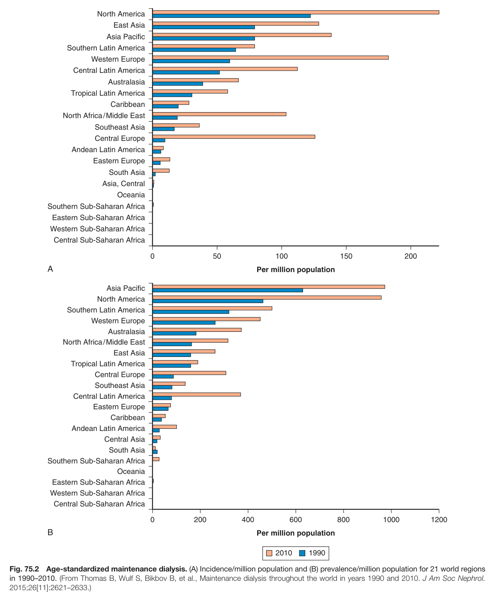

Fig. 75.2 Age-standardized maintenance dialysis. (A) Incidence/million population and (B) prevalence/million population for 21 world regions in 1990-2010. (From Thomas B, Wulf S, Bikbov B, et al., Maintenance dialysis throughout the world in years 1990 and 2010. J Am Soc Nephrol. 2015;26[11]:2621-2633.)

---

### Fig_75_3

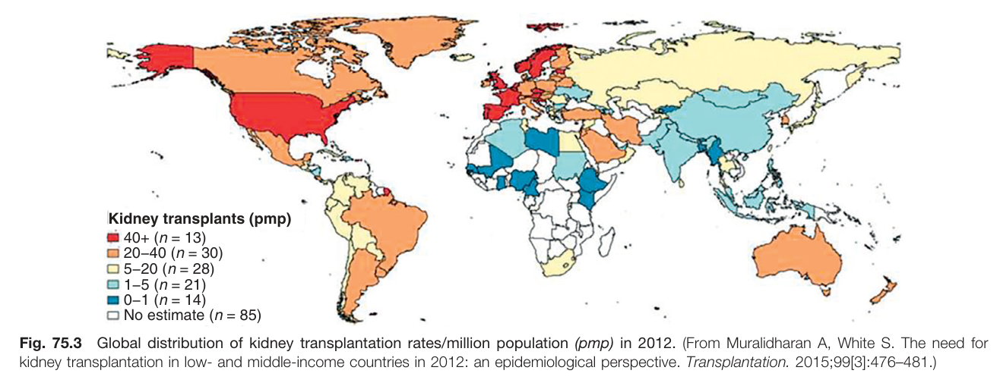

Fig. 75.3 Global distribution of kidney transplantation rates/million population (pmp) in 2012. (From Muralidharan A, White S. The need for kidney transplantation in low- and middle-income countries in 2012: an epidemiological perspective. Transplantation. 2015;99[3]:476-481.)

---

### Fig_75_4

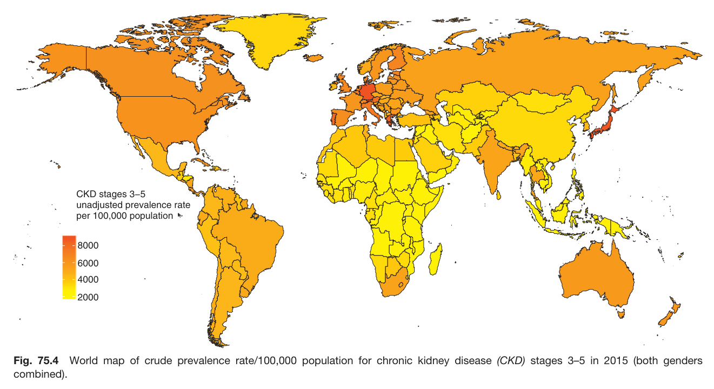

Fig. 75.4 World map of crude prevalence rate/100,000 population for chronic kidney disease (CKD) stages 3-5 in 2015 (both genders combined).

---

### Fig_75_5

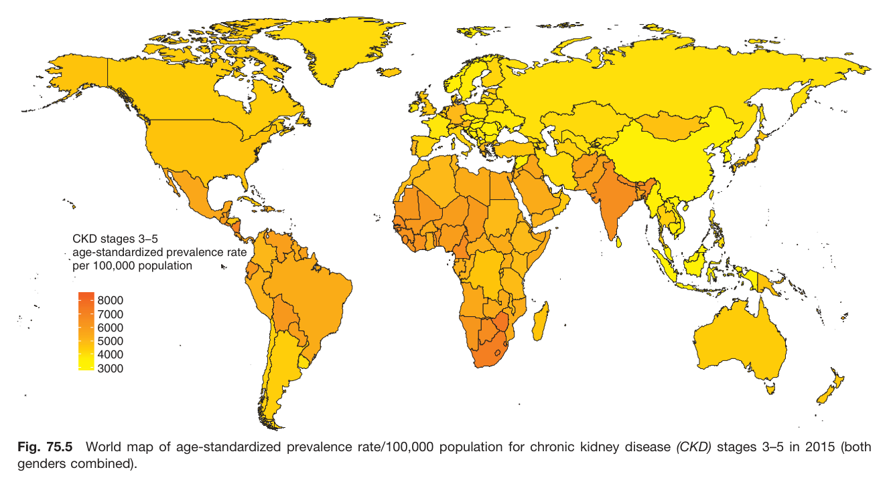

Fig. 75.5 World map of age-standardized prevalence rate/100,000 population for chronic kidney disease (CKD) stages 3-5 in 2015 (both genders combined).

---

### Fig_75_6

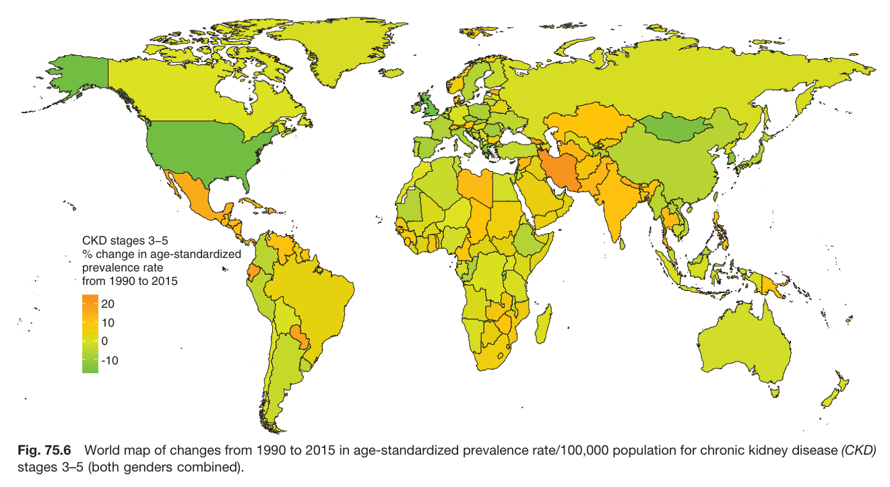

Fig. 75.6 World map of changes from 1990 to 2015 in age-standardized prevalence rate/100,000 population for chronic kidney disease (CKD) stages 3-5 (both genders combined).

---

### Fig_75_7

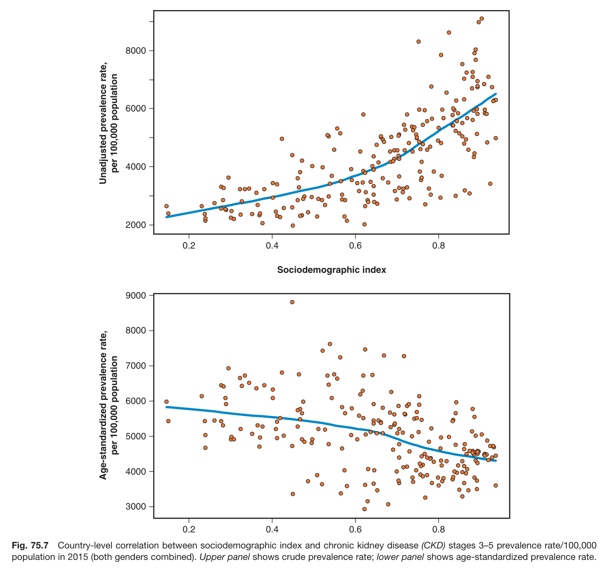

Fig. 75.7 Country-level correlation between sociodemographic index and chronic kidney disease (CKD) stages 3-5 prevalence rate/100,000 population in 2015 (both genders combined). Upper panel shows crude prevalence rate; lower panel shows age-standardized prevalence rate.

---

### Fig_75_8

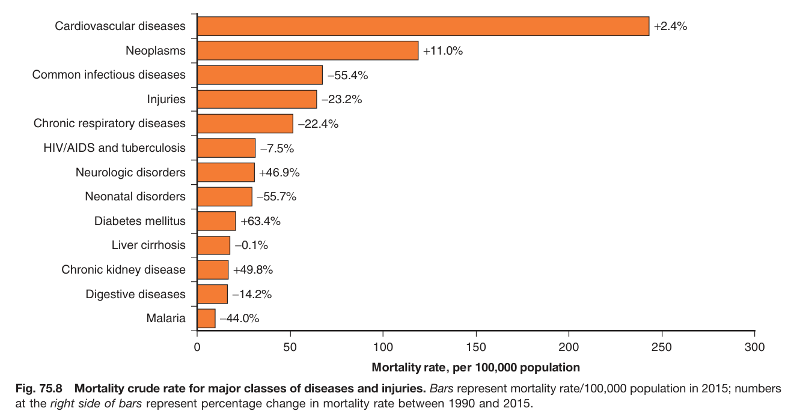

Fig. 75.8 Mortality crude rate for major classes of diseases and injuries. Bars represent mortality rate/100,000 population in 2015; numbers at the right side of bars represent percentage change in mortality rate between 1990 and 2015.

---

### Fig_75_9

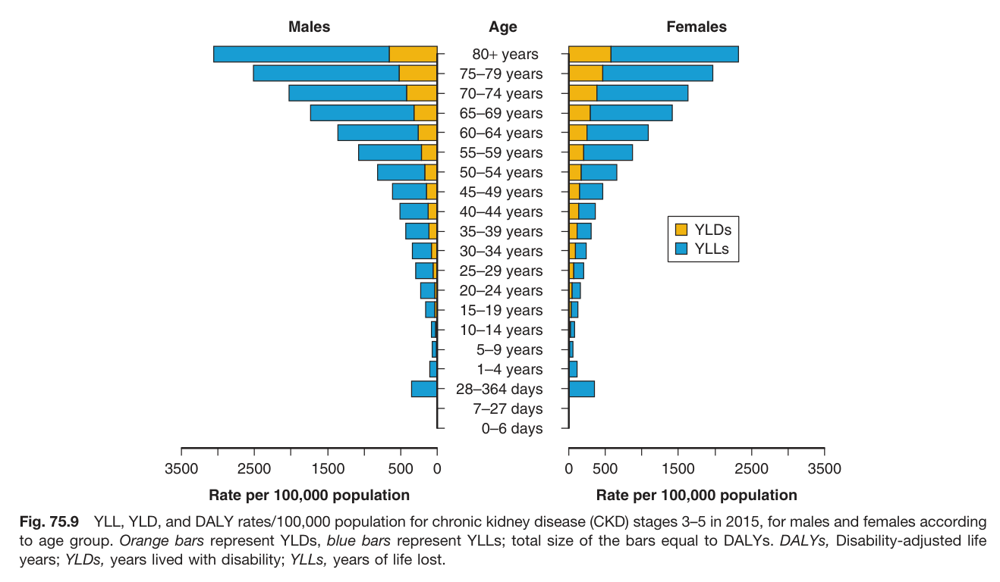

Fig. 75.9 YLL, YLD, and DALY rates/100,000 population for chronic kidney disease (CKD) stages 3-5 in 2015, for males and females according to age group. Orange bars represent YLDs, blue bars represent YLLs; total size of the bars equal to DALYS. DALYS, Disability-adjusted life years; YLDs, years lived with disability; YLLs, years of life lost.

---

### Fig_75_10

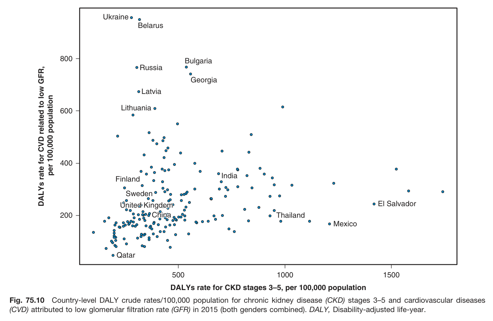

Fig. 75.10 Country-level DALY crude rates/100,000 population for chronic kidney disease (CKD) stages 3-5 and cardiovascular diseases (CVD) attributed to low glomerular filtration rate (GFR) in 2015 (both genders combined). DALY, Disability-adjusted life-year.

---

### Fig_75_11

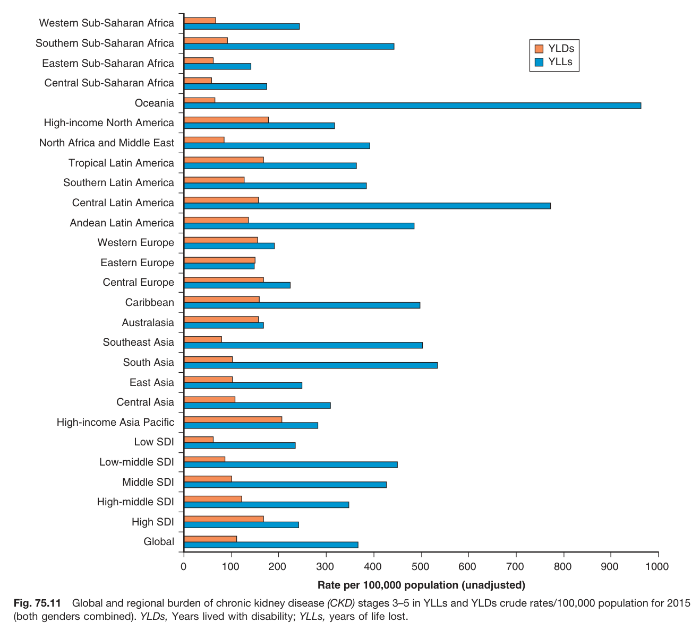

Fig. 75.11 Global and regional burden of chronic kidney disease (CKD) stages 3-5 in YLLs and YLDs crude rates/100,000 population for 2015 (both genders combined). YLDs, Years lived with disability; YLLs, years of life lost.

---

### Fig_75_12

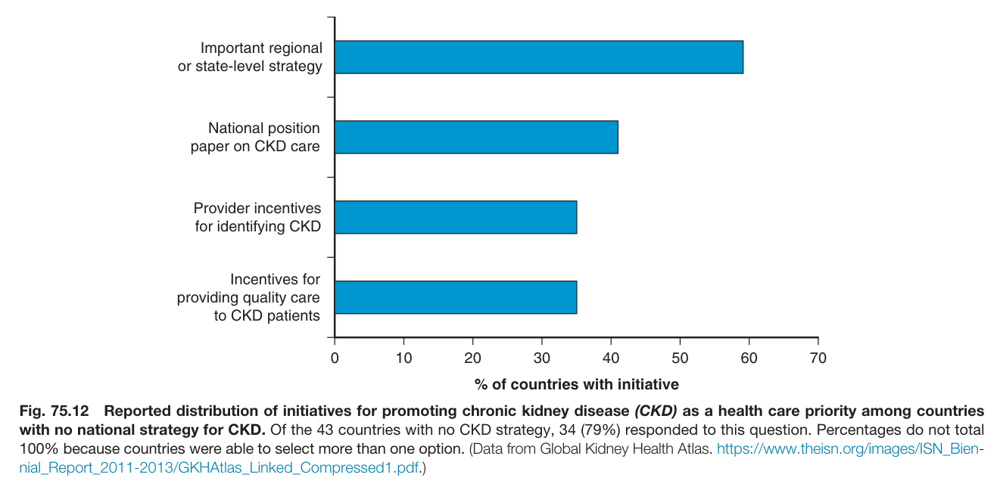

Fig. 75.12 Reported distribution of initiatives for promoting chronic kidney disease (CKD) as a health care priority among countries with no national strategy for CKD. Of the 43 countries with no CKD strategy, 34 (79%) responded to this question. Percentages do not total 100% because countries were able to select more than one option. (Data from Global Kidney Health Atlas. https://www.theisn.org/images/ISN_Bien-nial_Report_2011-2013/GKHAtlas_Linked_Compressed1.pdf.)

---

### Fig_75_13

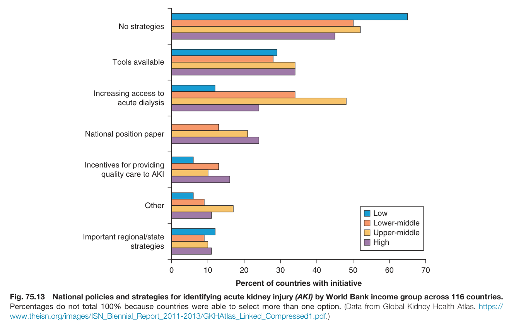

Fig. 75.13 National policies and strategies for identifying acute kidney injury (AKI) by World Bank income group across 116 countries. Percentages do not total 100% because countries were able to select more than one option. (Data from Global Kidney Health Atlas. https:// www.theisn.org/images/ISN_Biennial_Report_2011-2013/GKHAtlas_Linked_Compressed1.pdf.)

---

### Fig_75_14

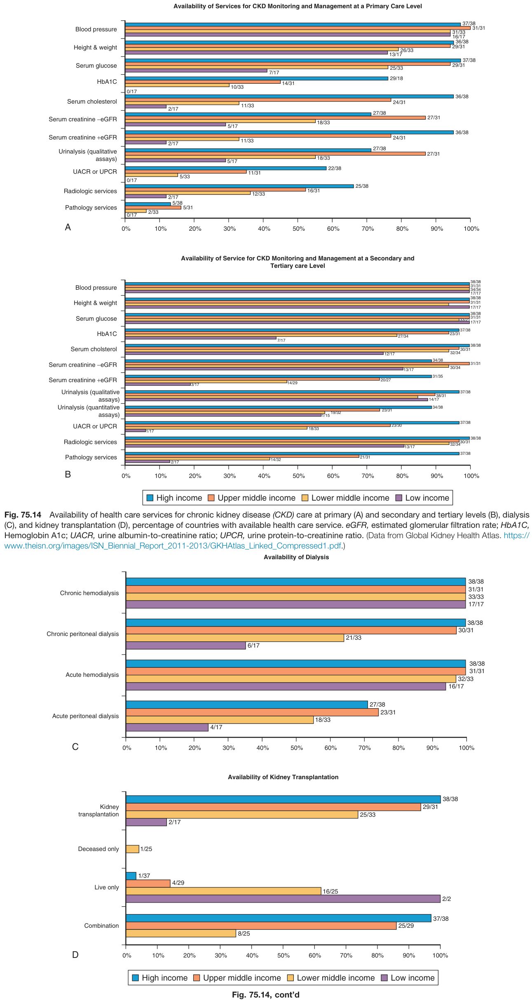

Fig. 75.14 Availability of health care services for chronic kidney disease (CKD) care at primary (A) and secondary and tertiary levels (B), dialysis (C), and kidney transplantation (D), percentage of countries with available health care service. eGFR, estimated glomerular filtration rate; HbA1C, Hemoglobin A1c; UACR, urine albumin-to-creatinine ratio; UPCR, urine protein-to-creatinine ratio. (Data from Global Kidney Health Atlas. https:// www.theisn.org/images/ISN_Biennial_Report_2011-2013/GKHAtlas_Linked_Compressed1.pdf.)

---

### Fig_75_15

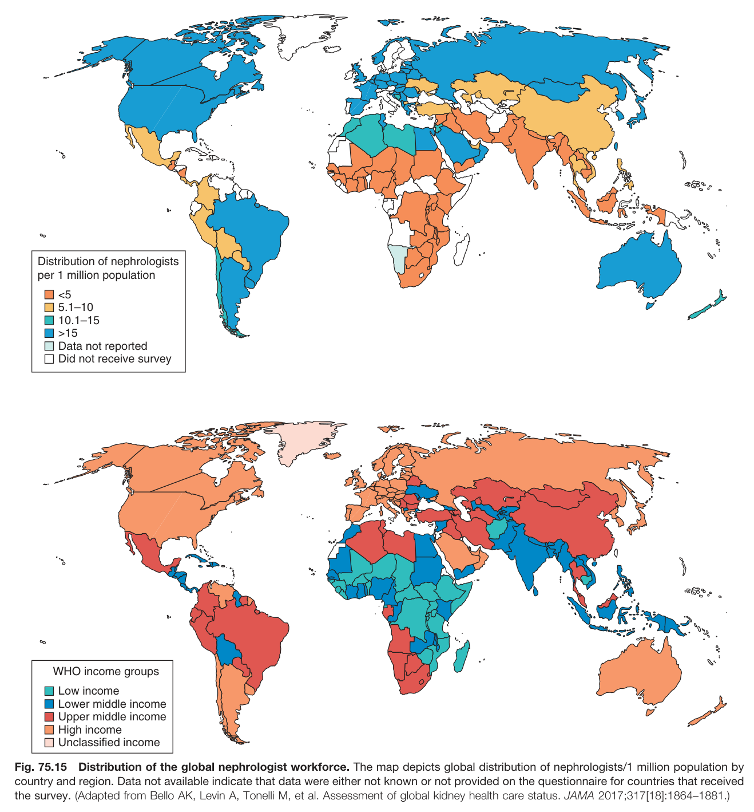

Fig. 75.15 Distribution of the global nephrologist workforce. The map depicts global distribution of nephrologists/1 million population by country and region. Data not available indicate that data were either not known or not provided on the questionnaire for countries that received the survey. (Adapted from Bello AK, Levin A, Tonelli M, et al. Assessment of global kidney health care status. JAMA 2017;317 [18]:1864-1881.)

---

### Fig_75_16

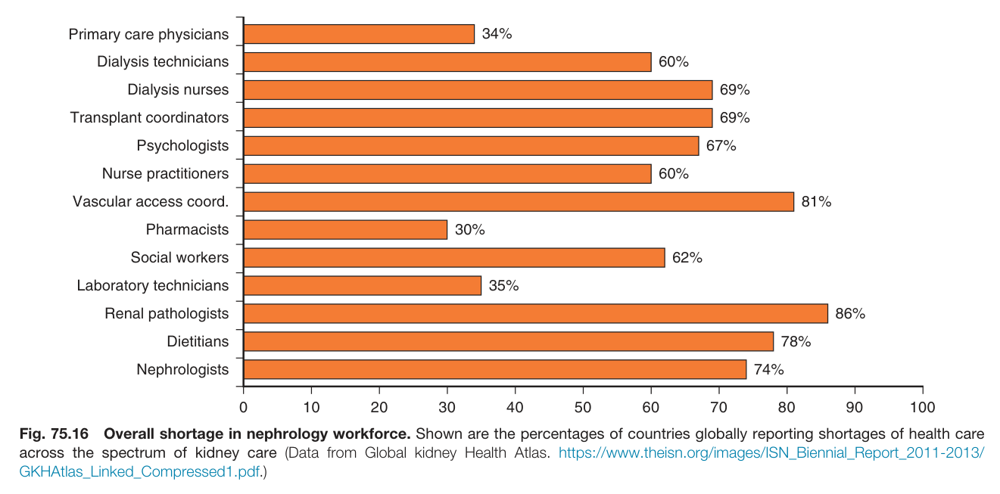

Fig. 75.16 Overall shortage in nephrology workforce. Shown are the percentages of countries globally reporting shortages of health care across the spectrum of kidney care (Data from Global kidney Health Atlas. https://www.theisn.org/images/ISN_Biennial_Report_2011-2013/ GKHAtlas_Linked_Compressed1.pdf.)

---

### Fig_75_17

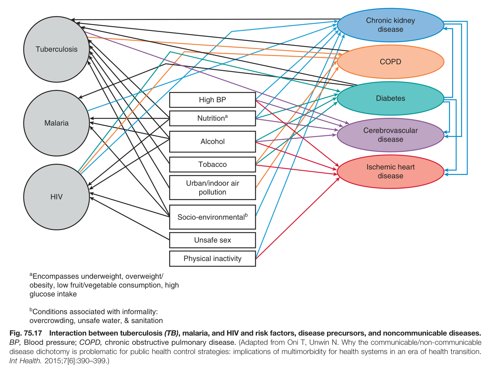

Fig. 75.17 Interaction between tuberculosis (TB), malaria, and HIV and risk factors, disease precursors, and noncommunicable diseases. BP, Blood pressure; COPD, chronic obstructive pulmonary disease. (Adapted from Oni T, Unwin N. Why the communicable/non-communicable disease dichotomy is problematic for public health control strategies: implications of multimorbidity for health systems in an era of health transition. Int Health. 2015;7[6]:390-399.)

---

## Tables

### Table_75_1

#### Table Images (6 Parts)

- **Part 1 (Page 2)**:
  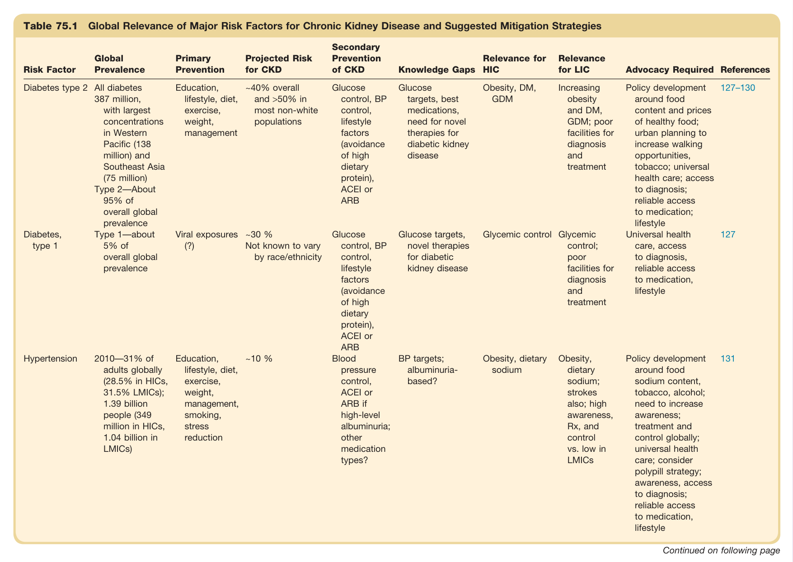

- **Part 2 (Page 3)**:
  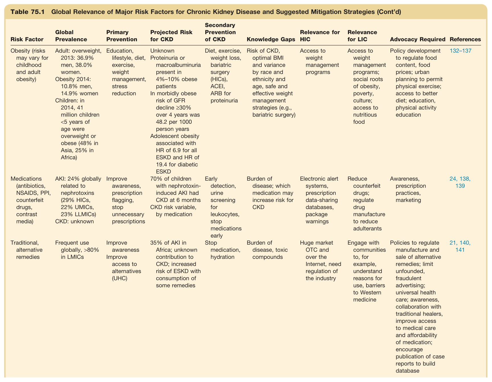

- **Part 3 (Page 4)**:
  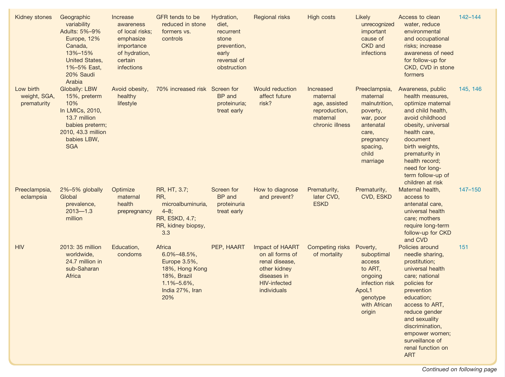

- **Part 4 (Page 5)**:
  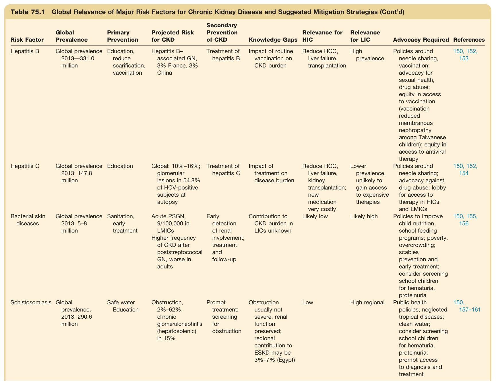

- **Part 5 (Page 6)**:
  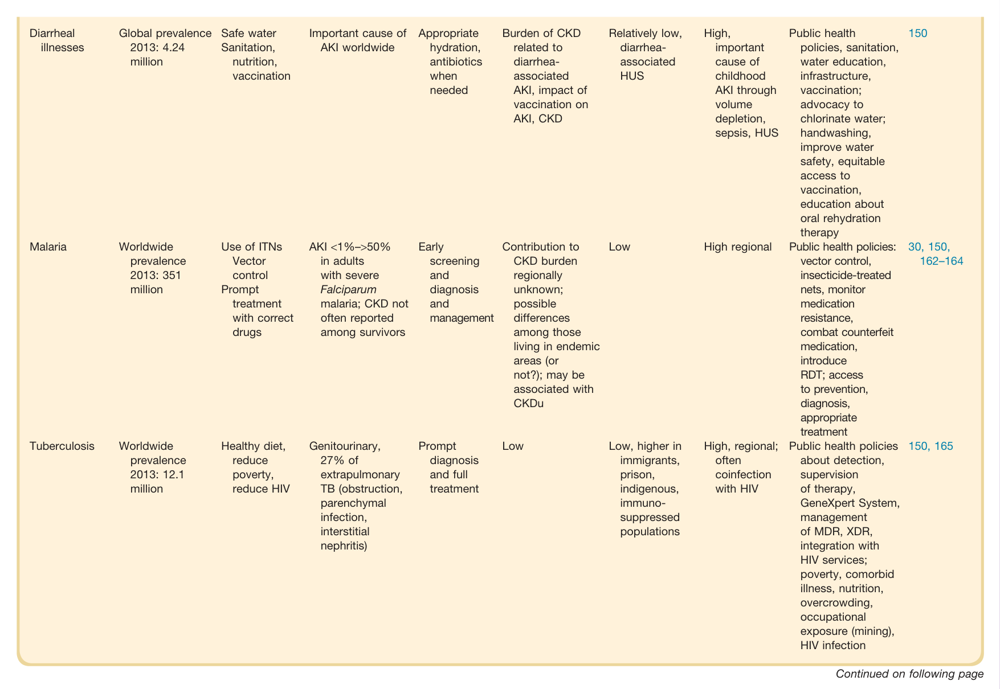

- **Part 6 (Page 7)**:
  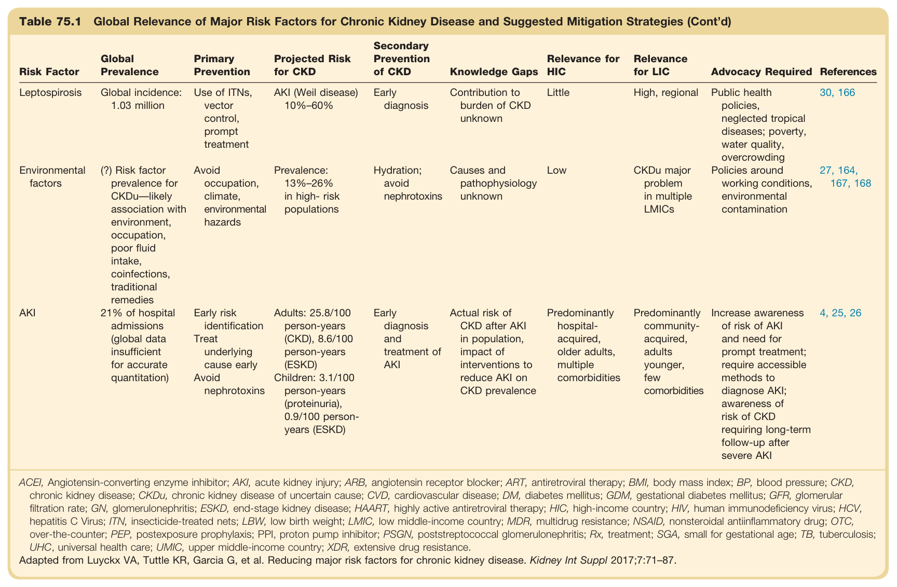

#### Table Data (CSV: [Table_75_1.csv](Table_75_1.csv))

```markdown
| Table Text (OCR) |
| :--- |
| Table 75.1 Global Relevance of Major Risk Factors for Chronic Kidney Disease and Suggested Mitigation Strategies Risk Factor  Global Prevalence  Primary Prevention  Projected Risk for CKD  Secondary Prevention of CKD  Knowledge Gaps  Relevance for HIC  Relevance for LIC  Advocacy Required  References    Diabetes type 2  All diabetes 387 million, with largest concentrations in Western Pacific (138 million) and Southeast Asia (75 million)Type 2—About 95% of overall global prevalence  Education, lifestyle, diet, exercise, weight, management  ~40% overall and >50% in most non-white populations  Glucose control, BP control, lifestyle factors (avoidance of high dietary protein), ACEI or ARB  Glucose targets, best medications, need for novel therapies for diabetic kidney disease  Obesity, DM, GDM  Increasing obesity and DM, GDM; poor facilities for diagnosis and treatment  Policy development around food content and prices of healthy food; urban planning to increase walking opportunities, tobacco; universal health care; access to diagnosis; reliable access to medication; lifestyle  127-130    Diabetes, type 1  Type 1—about 5% of overall global prevalence  Viral exposures (?)  ~30% Not known to vary by race/ethnicity  Glucose control, BP control, lifestyle factors (avoidance of high dietary protein), ACEI or ARB  Glucose targets, novel therapies for diabetic kidney disease  Glycemic control  Glycemic control; poor facilities for diagnosis and treatment  Universal health care, access to diagnosis, reliable access to medication, lifestyle  127    Hypertension  2010—31% of adults globally (28.5% in HICs, 31.5% LMICs); 1.39 billion people (349 million in HICs, 1.04 billion in LMICs)  Education, lifestyle, diet, exercise, weight, management, smoking, stress reduction  ~10%  Blood pressure control, ACEI or ARB if high-level albuminuria; other medication types?  BP targets; albuminuria-based?  Obesity, dietary sodium  Obesity, dietary sodium; strokes also; high awareness, Rx, and control vs. low in LMICs  Policy development around food sodium content, tobacco, alcohol; need to increase awareness; treatment and control globally; universal health care; consider polypill strategy; awareness, access to diagnosis; reliable access to medication, lifestyle  131 Continued on following page |
```

Table 75.1 Global Relevance of Major Risk Factors for Chronic Kidney Disease and Suggested Mitigation Strategies | Risk Factor | Global Prevalence | Primary Prevention | Projected Risk for CKD | Secondary Prevention of CKD | Knowledge Gaps HIC | Relevance for HIC | Relevance for LIC | Advocacy Required | | :--- | :--- | :--- | :--- | :--- | :--- | :--- | :--- | :--- | | **Diabetes type 2** | All diabetes 387 million, with largest concentrations in Western Pacific (138 million) and Southeast Asia (75 million) Type 2-About 95% of overall global prevalence | Education, lifestyle, diet, exercise, weight, management | ~40% overall and >50% in most non-white populations | Glucose control, BP control, lifestyle factors (avoidance of high dietary protein), ACEI or ARB | Glucose targets, best medications, need for novel therapies for diabetic kidney disease | Obesity, DM, GDM | Increasing obesity and DM, GDM; poor facilities for diagnosis and treatment | Policy development around food content and prices of healthy food; urban planning to increase walking opportunities, tobacco; universal health care; access to diagnosis; reliable access to medication; lifestyle | | **Diabetes, type 1** | Type 1-about 5% of overall global prevalence | Viral exposures (?) | ~30% Not known to vary by race/ethnicity | Glucose control, BP control, lifestyle factors (avoidance of high dietary protein), ACEI or ARB | Glucose targets, novel therapies for diabetic kidney disease | Glycemic control | Glycemic control; poor facilities for diagnosis and treatment | Universal health care, access to diagnosis, reliable access to medication, lifestyle | | **Hypertension** | 2010-31% of adults globally (28.5% in HICS, 31.5% LMICs); 1.39 billion people (349 million in HICS, 1.04 billion in LMICS) | Education, lifestyle, diet, exercise, weight, management, smoking, stress reduction | ~10% | Blood pressure control, ACEI or ARB if high-level albuminuria; other medication types? | BP targets; albuminuria-based? | Obesity, dietary sodium | Obesity, dietary sodium; strokes also; high awareness, Rx, and control vs. low in LMICS | Policy development around food sodium content, tobacco, alcohol; need to increase awareness; treatment and control globally; universal health care; consider polypill strategy; awareness, access to diagnosis; reliable access to medication, lifestyle | | **Obesity (risks may vary for childhood and adult obesity)** | Adult: overweight, 2013: 36.9% men, 38.0% women. Obesity 2014: 10.8% men, 14.9% women Children: in 2014, 41 million children <5 years of age were overweight or obese (48% in Asia, 25% in Africa) | Education, lifestyle, diet, exercise, weight management, stress reduction | Unknown Proteinuria or macroalbuminuria present in 4%-10% obese patients In morbidly obese risk of GFR decline ≥30% over 4 years was 48.2 per 1000 person years Adolescent obesity associated with HR of 6.9 for all ESKD and HR of 19.4 for diabetic ESKD | Diet, exercise, weight loss, bariatric surgery (HICs), ACEI, ARB for proteinuria | Risk of CKD, optimal BMI and variance by race and ethnicity and age, safe and effective weight management strategies (e.g., bariatric surgery) | Access to weight management programs | Access to weight management programs; social roots of obesity, poverty, culture; access to nutritious food | Policy development to regulate food content, food prices; urban planning to permit physical exercise; access to better diet; education, physical activity education | | **Medications (antibiotics, NSAIDS, PPI, counterfeit drugs, contrast media)** | AKI: 24% globally related to nephrotoxins (29% HICS, 22% UMICS, 23% LLMICS) CKD: unknown | Improve awareness, prescription flagging, stop unnecessary prescriptions | 70% of children with nephrotoxin-induced AKI had CKD at 6 months CKD risk variable, by medication | Early detection, urine screening for leukocytes, stop medications early | Burden of disease; which medication may increase risk for CKD | Electronic alert systems, prescription data-sharing databases, package warnings | Reduce counterfeit drugs; regulate drug manufacture to reduce adulterants | Awareness, prescription practices, marketing | | **Traditional, alternative remedies** | Frequent use globally, >80% in LMICS | Improve awareness Improve access to alternatives (UHC) | 35% of AKI in Africa; unknown contribution to CKD; increased risk of ESKD with consumption of some remedies | Stop medication, hydration | Burden of disease, toxic compounds | Huge market OTC and over the Internet, need regulation of the industry | Engage with communities to, for example, understand reasons for use, barriers to Western medicine | Policies to regulate manufacture and sale of alternative remedies; limit unfounded, fraudulent advertising; universal health care; awareness, collaboration with traditional healers, improve access to medical care and affordability of medication; encourage publication of case reports to build database | | **Kidney stones** | Geographic variability Adults: 5%-9% Europe, 12% Canada, 13%-15% United States, 1%-5% East, 20% Saudi Arabia | Increase awareness of local risks; emphasize importance of hydration, certain infections | GFR tends to be reduced in stone formers vs. controls | Hydration, diet, recurrent stone prevention, early reversal of obstruction | Regional risks | High costs | Likely unrecognized important cause of CKD and infections | Access to clean water, reduce environmental and occupational risks; increase awareness of need for follow-up for CKD, CVD in stone formers | | **Low birth weight, SGA, prematurity** | Globally: LBW 15%, preterm 10% In LMICs, 2010, 13.7 million babies preterm; 2010, 43.3 million babies LBW, SGA | Avoid obesity, healthy lifestyle | 70% increased risk | Screen for BP and proteinuria; treat early | Would reduction affect future risk? | Increased maternal age, assisted reproduction, maternal chronic illness | Preeclampsia, maternal malnutrition, poverty, war, poor antenatal care, pregnancy spacing, child marriage | Awareness, public health measures, optimize maternal and child health, avoid childhood obesity, universal health care, document birth weights, prematurity in health record; need for long-term follow-up of children at risk | | **Preeclampsia, eclampsia** | 2%-5% globally Global prevalence, 2013-1.3 million | Optimize maternal health prepregnancy | RR, HT, 3.7; RR, microalbuminuria, 4-8; RR, ESKD, 4.7; RR, kidney biopsy, 3.3 | Screen for BP and proteinuria treat early | How to diagnose and prevent? | Prematurity, later CVD, ESKD | Prematurity, CVD, ESKD | Maternal health, access to antenatal care, universal health care; mothers require long-term follow-up for CKD and CVD | | **HIV** | 2013: 35 million worldwide, 24.7 million in sub-Saharan Africa | Education, condoms | Africa 6.0%-48.5%, Europe 3.5%, 18%, Hong Kong 18%, Brazil 1.1%-5.6%, India 27%, Iran 20% | PEP, HAART | Impact of HAART on all forms of renal disease, other kidney diseases in HIV-infected individuals | Competing risks of mortality | Poverty, suboptimal access to ART, ongoing infection risk ApoL1 genotype with African origin | Policies around needle sharing, prostitution; universal health care; national policies for prevention education; access to ART, reduce gender and sexuality discrimination, empower women; surveillance of renal function on ART | | **Hepatitis B** | Global prevalence 2013-331.0 million | Education, reduce scarification, vaccination | Hepatitis B-associated GN, 3% France, 3% China | Treatment of hepatitis B | Impact of routine vaccination on CKD burden | Reduce HCC, liver failure, transplantation | High prevalence | Policies around needle sharing, vaccination; advocacy for sexual health, drug abuse; equity in access to vaccination (vaccination reduced membranous nephropathy among Taiwanese children); equity in access to antiviral therapy | | **Hepatitis C** | Global prevalence 2013: 147.8 million | Education | Global: 10%-16%; glomerular lesions in 54.8% of HCV-positive subjects at autopsy | Treatment of hepatitis C | Impact of treatment on disease burden | Reduce HCC, liver failure, kidney transplantation; new medication very costly | Lower prevalence, unlikely to gain access to expensive therapies | Policies around needle sharing; advocacy against drug abuse; lobby for access to therapy in HICS and LMICs | | **Bacterial skin diseases** | Global prevalence 2013: 5-8 million | Sanitation, early treatment | Acute PSGN, 9/100,000 in LMICs Higher frequency of CKD after poststreptococcal GN, worse in adults | Early detection of renal involvement; treatment and follow-up | Contribution to CKD burden in LICs unknown | Likely low | Likely high | Policies to improve child nutrition, school feeding programs; poverty, overcrowding; scabies prevention and early treatment; consider screening school children for hematuria, proteinuria | | **Schistosomiasis** | Global prevalence, 2013: 290.6 million | Safe water Education | Obstruction, 2%-62%, chronic glomerulonephritis (hepatosplenic) in 15% | Prompt treatment; screening for obstruction | Obstruction usually not severe, renal function preserved; regional contribution to ESKD may be 3%-7% (Egypt) | Low | High regional | Public health policies, neglected tropical diseases; clean water; consider screening school children for hematuria, proteinuria; prompt access to diagnosis and treatment | | **Diarrheal illnesses** | Global prevalence 2013: 4.24 million | Safe water Sanitation, vaccination | Important cause of AKI worldwide | Appropriate nutrition, hydration, antibiotics when needed | Burden of CKD related to diarrhea-associated AKI, impact of vaccination on AKI, CKD | Relatively low, diarrhea-associated HUS | High, important cause of childhood AKI through volume depletion, sepsis, HUS | Public health policies, sanitation, water education, infrastructure, vaccination; advocacy to chlorinate water; handwashing, improve water safety, equitable access to vaccination, education about oral rehydration therapy | | **Malaria** | Worldwide prevalence 2013: 351 million | Use of ITNS Vector control Prompt treatment with correct drugs | ΑΚΙ <1%->50% in adults with severe Falciparum malaria; CKD not often reported among survivors | Early screening and diagnosis and management | Contribution to CKD burden regionally unknown; possible differences among those living in endemic areas (or not?); may be associated with CKDu | Low | High regional | Public health policies: vector control, insecticide-treated nets, monitor medication resistance, combat counterfeit medication, introduce RDT; access to prevention, diagnosis, appropriate treatment | | **Tuberculosis** | Worldwide prevalence 2013: 12.1 million | Healthy diet, reduce poverty, reduce HIV | Genitourinary, 27% of extrapulmonary TB (obstruction, parenchymal infection, interstitial nephritis) | Prompt diagnosis and full treatment | Low | Low, higher in immigrants, prison, indigenous, immuno-suppressed populations | High, regional; often coinfection with HIV | Public health policies about detection, supervision of therapy, GeneXpert System, management of MDR, XDR, integration with HIV services; poverty, comorbid illness, nutrition, overcrowding, occupational exposure (mining), HIV infection | | **Leptospirosis** | Global incidence: 1.03 million | Use of ITNs, vector control, prompt treatment | AKI (Weil disease) 10%-60% | Early diagnosis | Contribution to burden of CKD unknown | Little | High, regional | Public health policies, neglected tropical diseases; poverty, water quality, overcrowding | | **Environmental factors** | (?) Risk factor prevalence for CKDu-likely association with environment, occupation, poor fluid intake, coinfections, traditional remedies | Avoid occupation, climate, environmental hazards | Prevalence: 13%-26% in high- risk populations | Hydration; avoid nephrotoxins | Causes and pathophysiology unknown | Low | CKDu major problem in multiple LMICS | Policies around working conditions, environmental contamination | | **AKI** | 21% of hospital admissions (global data insufficient for accurate quantitation) | Early risk identification Treat underlying cause early Avoid nephrotoxins | Adults: 25.8/100 person-years (CKD), 8.6/100 person-years (ESKD) Children: 3.1/100 person-years (proteinuria), 0.9/100 person-years (ESKD) | Early diagnosis and treatment of AKI | Actual risk of CKD after AKI in population, impact of interventions to reduce AKI on CKD prevalence | Predominantly hospital-acquired, older adults, multiple comorbidities | Predominantly community-acquired, younger, adults few comorbidities | Increase awareness of risk of AKI and need for prompt treatment; require accessible methods to diagnose AKI; awareness of risk of CKD requiring long-term follow-up after severe AKI |

---

### Table_75_2

#### Table Image

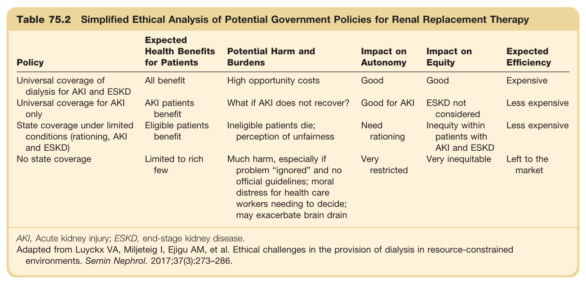

#### Table Data (CSV: [Table_75_2.csv](Table_75_2.csv))

```markdown
| Table Text (OCR) |
| :--- |
| Table 75.2 Simplified Ethical Analysis of Potential Government Policies for Renal Replacement Therapy Policy  Expected Health Benefits for Patients  Potential Harm and Burdens  Impact on Autonomy  Impact on Equity  Expected Efficiency    Universal coverage of dialysis for AKI and ESKD  All benefit  High opportunity costs  Good  Good  Expensive    Universal coverage for AKI only  AKI patients benefit  What if AKI does not recover?  Good for AKI  ESKD not considered  Less expensive    State coverage under limited conditions (rationing, AKI and ESKD)  Eligible patients benefit  Ineligible patients die; perception of unfairness  Need rationing  Inequity within patients with AKI and ESKD  Less expensive    No state coverage  Limited to rich few  Much harm, especially if problem “ignored” and no official guidelines; moral distress for health care workers needing to decide; may exacerbate brain drain  Very restricted  Very inequitable  Left to the market AKI, Acute kidney injury; ESKD, end-stage kidney disease. Adapted from Luyckx VA, Miljeteig I, Ejigu AM, et al. Ethical challenges in the provision of dialysis in resource-constrained environments. Semin Nephrol. 2017;37(3):273–286. |
```

Table 75.2 Simplified Ethical Analysis of Potential Government Policies for Renal Replacement Therapy | Policy | Expected Health Benefits for Patients | Potential Harm and Burdens | Impact on Autonomy | Impact on Equity | Expected Efficiency | | :--- | :--- | :--- | :--- | :--- | :--- | | Universal coverage of dialysis for AKI and ESKD | All benefit | High opportunity costs | Good | Good | Expensive | | Universal coverage for AKI only | AKI patients benefit | What if AKI does not recover? | Good for AKI | ESKD not considered | Less expensive | | State coverage under limited conditions (rationing, AKI and ESKD) | Eligible patients benefit | Ineligible patients die; perception of unfairness | Need rationing | Inequity within patients with AKI and ESKD | Less expensive | | No state coverage | Limited to rich few | Much harm, especially if problem "ignored" and no official guidelines; moral distress for health care workers needing to decide; may exacerbate brain drain | Very restricted | Very inequitable | Left to the market |

---

### Table_75_3

#### Table Image

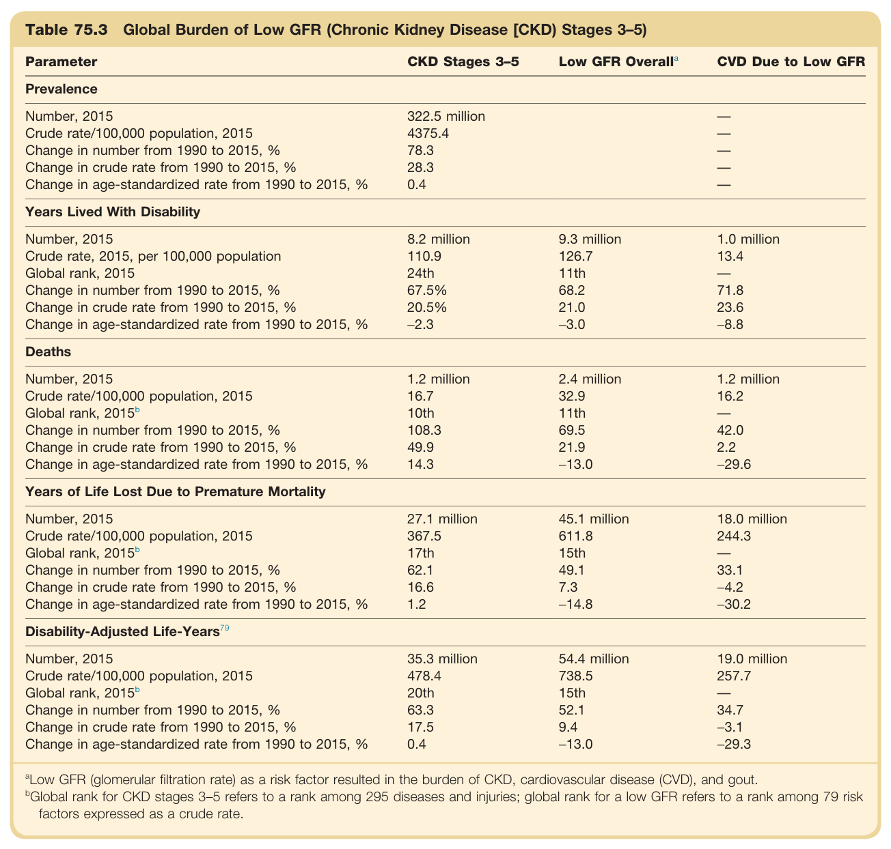

#### Table Data (CSV: [Table_75_3.csv](Table_75_3.csv))

```markdown
| Table Text (OCR) |
| :--- |
| Table 75.3 Global Burden of Low GFR (Chronic Kidney Disease [CKD) Stages 3–5) Parameter  CKD Stages 3-5  Low GFR  Overall^a   CVD Due to Low GFR    Prevalence    Number, 2015  322.5 million    —    Crude rate/100,000 population, 2015  4375.4    —    Change in number from 1990 to 2015, %  78.3    —    Change in crude rate from 1990 to 2015, %  28.3    —    Change in age-standardized rate from 1990 to 2015, %  0.4    —    Years Lived With Disability    Number, 2015  8.2 million  9.3 million  1.0 million    Crude rate, 2015, per 100,000 population  110.9  126.7  13.4    Global rank, 2015  24th  11th  —    Change in number from 1990 to 2015, %  67.5%  68.2  71.8    Change in crude rate from 1990 to 2015, %  20.5%  21.0  23.6    Change in age-standardized rate from 1990 to 2015, %  -2.3  -3.0  -8.8    Deaths    Number, 2015  1.2 million  2.4 million  1.2 million    Crude rate/100,000 population, 2015  16.7  32.9  16.2    Global rank,  2015^b   10th  11th  —    Change in number from 1990 to 2015, %  108.3  69.5  42.0    Change in crude rate from 1990 to 2015, %  49.9  21.9  2.2    Change in age-standardized rate from 1990 to 2015, %  14.3  -13.0  -29.6    Years of Life Lost Due to Premature Mortality    Number, 2015  27.1 million  45.1 million  18.0 million    Crude rate/100,000 population, 2015  367.5  611.8  244.3    Global rank,  2015^b   17th  15th  —    Change in number from 1990 to 2015, %  62.1  49.1  33.1    Change in crude rate from 1990 to 2015, %  16.6  7.3  -4.2    Change in age-standardized rate from 1990 to 2015, %  1.2  -14.8  -30.2     Disability-Adjusted Life-Years^{79}     Number, 2015  35.3 million  54.4 million  19.0 million    Crude rate/100,000 population, 2015  478.4  738.5  257.7    Global rank,  2015^b   20th  15th  —    Change in number from 1990 to 2015, %  63.3  52.1  34.7    Change in crude rate from 1990 to 2015, %  17.5  9.4  -3.1    Change in age-standardized rate from 1990 to 2015, %  0.4  -13.0  -29.3 <sup>a</sup>Low GFR (glomerular filtration rate) as a risk factor resulted in the burden of CKD, cardiovascular disease (CVD), and gout. <sup>b</sup>Global rank for CKD stages 3–5 refers to a rank among 295 diseases and injuries; global rank for a low GFR refers to a rank among 79 risk factors expressed as a crude rate. |
```

Table 75.3 Global Burden of Low GFR (Chronic Kidney Disease [CKD) Stages 3-5) | Parameter | CKD Stages 3-5 | Low GFR Overall | CVD Due to Low GFR | | :--- | :--- | :--- | :--- | | **Prevalence** | | | | | Number, 2015 | 322.5 million | | | | Crude rate/100,000 population, 2015 | 4375.4 | | | | Change in number from 1990 to 2015, % | 78.3 | | | | Change in crude rate from 1990 to 2015, % | 28.3 | | | | Change in age-standardized rate from 1990 to 2015, % | 0.4 | | | | **Years Lived With Disability** | | | | | Number, 2015 | 8.2 million | 9.3 million | 1.0 million | | Crude rate, 2015, per 100,000 population | 110.9 | 126.7 | 13.4 | | Global rank, 2015 | 24th | 11th | | | Change in number from 1990 to 2015, % | 67.5% | 68.2 | 71.8 | | Change in crude rate from 1990 to 2015, % | 20.5% | 21.0 | 23.6 | | Change in age-standardized rate from 1990 to 2015, % | -2.3 | -3.0 | -8.8 | | **Deaths** | | | | | Number, 2015 | 1.2 million | 2.4 million | 1.2 million | | Crude rate/100,000 population, 2015 | 16.7 | 32.9 | 16.2 | | Global rank, 2015 | 10th | 11th | | | Change in number from 1990 to 2015, % | 108.3 | 69.5 | 42.0 | | Change in crude rate from 1990 to 2015, % | 49.9 | 21.9 | 2.2 | | Change in age-standardized rate from 1990 to 2015, % | 14.3 | -13.0 | -29.6 | | **Years of Life Lost Due to Premature Mortality** | | | | | Number, 2015 | 27.1 million | 45.1 million | 18.0 million | | Crude rate/100,000 population, 2015 | 367.5 | 611.8 | 244.3 | | Global rank, 2015 | 17th | 15th | | | Change in number from 1990 to 2015, % | 62.1 | 49.1 | 33.1 | | Change in crude rate from 1990 to 2015, % | 16.6 | 7.3 | -4.2 | | Change in age-standardized rate from 1990 to 2015, % | 1.2 | -14.8 | -30.2 | | **Disability-Adjusted Life-Years** | | | | | Number, 2015 | 35.3 million | 54.4 million | 19.0 million | | Crude rate/100,000 population, 2015 | 478.4 | 738.5 | 257.7 | | Global rank, 2015 | 20th | 15th | | | Change in number from 1990 to 2015, % | 63.3 | 52.1 | 34.7 | | Change in crude rate from 1990 to 2015, % | 17.5 | 9.4 | -3.1 | | Change in age-standardized rate from 1990 to 2015, % | 0.4 | -13.0 | -29.3 | Low GFR (glomerular filtration rate) as a risk factor resulted in the burden of CKD, cardiovascular disease (CVD), and gout. Global rank for CKD stages 3-5 refers to a rank among 295 diseases and injuries; global rank for a low GFR refers to a rank among 79 risk factors expressed as a crude rate.

---

### Table_75_4

#### Table Image

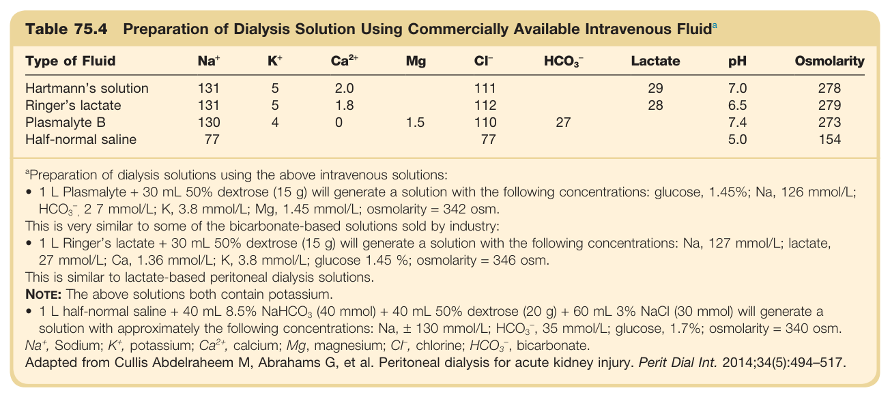

#### Table Data (CSV: [Table_75_4.csv](Table_75_4.csv))

```markdown
| Table Text (OCR) |
| :--- |
| Table 75.4 Preparation of Dialysis Solution Using Commercially Available Intravenous Fluid<sup>a</sup> Type of Fluid   Na^{+}    K^{+}    Ca^{2+}   Mg   Cl^{-}    HCO_{3}^{-}   Lactate  pH  Osmolarity    Hartmann's solution  131  5  2.0    111    29  7.0  278    Ringer's lactate  131  5  1.8    112    28  6.5  279    Plasmalyte B  130  4  0  1.5  110  27    7.4  273    Half-normal saline  77        77      5.0  154 <sup>a</sup>Preparation of dialysis solutions using the above intravenous solutions: •	 1 L Plasmalyte + 30 mL 50% dextrose (15 g) will generate a solution with the following concentrations: glucose, 1.45%; Na, 126 mmol/L; HCO <sup>−</sup> 2 7 mmol/L; K, 3.8 mmol/L; Mg, 1.45 mmol/L; osmolarity = 342 osm. This is very similar to some of the bicarbonate-based solutions sold by industry: •	 1 L Ringer’s lactate + 30 mL 50% dextrose (15 g) will generate a solution with the following concentrations: Na, 127 mmol/L; lactate, 27 mmol/L; Ca, 1.36 mmol/L; K, 3.8 mmol/L; glucose 1.45 %; osmolarity = 346 osm. This is similar to lactate-based peritoneal dialysis solutions. NOTE: The above solutions both contain potassium. •	 1 L half-normal saline + 40 mL 8.5% NaHCO (40 mmol) + 40 mL 50% dextrose (20 g) + 60 mL 3% NaCl (30 mmol) will generate a solution with approximately the following concentrations: Na, ± 130 mmol/L; HCO <sup>−</sup>, 35 mmol/L; glucose, 1.7%; osmolarity = 340 osm. Na<sup>+</sup>, Sodium; K<sup>+</sup>, potassium; Ca<sup>2+</sup>, calcium; Mg, magnesium; Cl<sup>−</sup>, chlorine; HCO <sup>−</sup>, bicarbonate. Adapted from Cullis Abdelraheem M, Abrahams G, et al. Peritoneal dialysis for acute kidney injury. Perit Dial Int. 2014;34(5):494–517. |
```

Table 75.4 Preparation of Dialysis Solution Using Commercially Available Intravenous Fluid | Type of Fluid | Na+ | K+ | Ca2+ | Mg | CI- | HCO3 | Lactate | pH | Osmolarity | | :--- | :--- | :--- | :--- | :--- | :--- | :--- | :--- | :--- | :--- | | Hartmann's solution | 131 | 5 | 2.0 | | 111 | | 29 | 7.0 | 278 | | Ringer's lactate | 131 | 5 | 1.8 | | 112 | | 28 | 6.5 | 279 | | Plasmalyte B | 130 | 4 | 0 | 1.5 | 110 | 27 | | 7.4 | 273 | | Half-normal saline | 77 | | | | 77 | | | 5.0 | 154 | Preparation of dialysis solutions using the above intravenous solutions: * 1 L Plasmalyte + 30 mL 50% dextrose (15 g) will generate a solution with the following concentrations: glucose, 1.45%; Na, 126 mmol/L; HCO3, 27 mmol/L; K, 3.8 mmol/L; Mg, 1.45 mmol/L; osmolarity = 342 osm. This is very similar to some of the bicarbonate-based solutions sold by industry. * 1 L Ringer's lactate + 30 mL 50% dextrose (15 g) will generate a solution with the following concentrations: Na, 127 mmol/L; lactate, 27 mmol/L; Ca, 1.36 mmol/L; K, 3.8 mmol/L; glucose 1.45%; osmolarity = 346 osm. This is similar to lactate-based peritoneal dialysis solutions. NOTE: The above solutions both contain potassium. * 1 L half-normal saline + 40 mL 8.5% NaHCO3 (40 mmol) + 40 mL 50% dextrose (20 g) + 60 mL 3% NaCl (30 mmol) will generate a solution with approximately the following concentrations: Na, ± 130 mmol/L; HCO3, 35 mmol/L; glucose, 1.7%; osmolarity = 340 osm. Na+, Sodium; K+, potassium; Ca2+, calcium; Mg, magnesium; Cr, chlorine; HCO3, bicarbonate. Adapted from Cullis Abdelraheem M, Abrahams G, et al. Peritoneal dialysis for acute kidney injury. Perit Dial Int. 2014;34(5):494-517.

---

### Table_75_5

#### Table Image

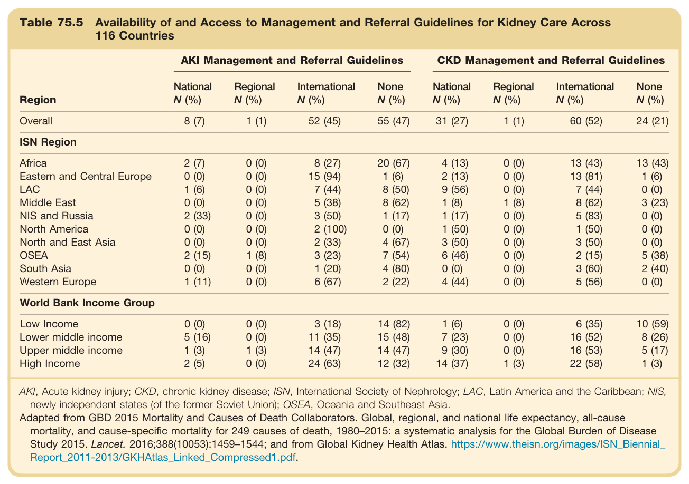

#### Table Data (CSV: [Table_75_5.csv](Table_75_5.csv))

```markdown
| Table Text (OCR) |
| :--- |
| Table 75.5 Availability of and Access to Management and Referral Guidelines for Kidney Care Across 116 Countries Region  AKI Management and Referral Guidelines  CKD Management and Referral Guidelines    NationalN (%)  RegionalN (%)  InternationalN (%)  NoneN (%)  NationalN (%)  RegionalN (%)  InternationalN (%)  NoneN (%)    Overall  8 (7)  1 (1)  52 (45)  55 (47)  31 (27)  1 (1)  60 (52)  24 (21)    ISN Region    Africa  2 (7)  0 (0)  8 (27)  20 (67)  4 (13)  0 (0)  13 (43)  13 (43)    Eastern and Central Europe  0 (0)  0 (0)  15 (94)  1 (6)  2 (13)  0 (0)  13 (81)  1 (6)    LAC  1 (6)  0 (0)  7 (44)  8 (50)  9 (56)  0 (0)  7 (44)  0 (0)    Middle East  0 (0)  0 (0)  5 (38)  8 (62)  1 (8)  1 (8)  8 (62)  3 (23)    NIS and Russia  2 (33)  0 (0)  3 (50)  1 (17)  1 (17)  0 (0)  5 (83)  0 (0)    North America  0 (0)  0 (0)  2 (100)  0 (0)  1 (50)  0 (0)  1 (50)  0 (0)    North and East Asia  0 (0)  0 (0)  2 (33)  4 (67)  3 (50)  0 (0)  3 (50)  0 (0)    OSEA  2 (15)  1 (8)  3 (23)  7 (54)  6 (46)  0 (0)  2 (15)  5 (38)    South Asia  0 (0)  0 (0)  1 (20)  4 (80)  0 (0)  0 (0)  3 (60)  2 (40)    Western Europe  1 (11)  0 (0)  6 (67)  2 (22)  4 (44)  0 (0)  5 (56)  0 (0)    World Bank Income Group    Low Income  0 (0)  0 (0)  3 (18)  14 (82)  1 (6)  0 (0)  6 (35)  10 (59)    Lower middle income  5 (16)  0 (0)  11 (35)  15 (48)  7 (23)  0 (0)  16 (52)  8 (26)    Upper middle income  1 (3)  1 (3)  14 (47)  14 (47)  9 (30)  0 (0)  16 (53)  5 (17)    High Income  2 (5)  0 (0)  24 (63)  12 (32)  14 (37)  1 (3)  22 (58)  1 (3) AKI, Acute kidney injury; CKD, chronic kidney disease; ISN, International Society of Nephrology; LAC, Latin America and the Caribbean; NIS, newly independent states (of the former Soviet Union); OSEA, Oceania and Southeast Asia. Adapted from GBD 2015 Mortality and Causes of Death Collaborators. Global, regional, and national life expectancy, all-cause mortality, and cause-specific mortality for 249 causes of death, 1980–2015: a systematic analysis for the Global Burden of Disease Study 2015. Lancet. 2016;388(10053):1459–1544; and from Global Kidney Health Atlas. https://www.theisn.org/images/ISN_Biennial Report_2011-2013/GKHAtlas_Linked_Compressed1.pdf. |
```

Table 75.5 Availability of and Access to Management and Referral Guidelines for Kidney Care Across 116 Countries | Region | AKI Management and Referral Guidelines | | | | CKD Management and Referral Guidelines | | | | | :--- | :--- | :--- | :--- | :--- | :--- | :--- | :--- | :--- | | | **National N (%)** | **Regional N (%)** | **International N (%)** | **None N (%)** | **National N (%)** | **Regional N (%)** | **International N (%)** | **None N (%)** | | **Overall** | 8 (7) | 1 (1) | 52 (45) | 55 (47) | 31 (27) | 1 (1) | 60 (52) | 24 (21) | | **ISN Region** | | | | | | | | | | Africa | 2 (7) | 0 (0) | 8 (27) | 20 (67) | 4 (13) | 0 (0) | 13 (43) | 13 (43) | | Eastern and Central Europe | 0 (0) | 0 (0) | 15 (94) | 1 (6) | 2 (13) | 0 (0) | 13 (81) | 1 (6) | | LAC | 1 (6) | 0 (0) | 7 (44) | 8 (50) | 9 (56) | 0 (0) | 7 (44) | 0 (0) | | Middle East | 0 (0) | 0 (0) | 5 (38) | 8 (62) | 1 (8) | 1 (8) | 8 (62) | 3 (23) | | NIS and Russia | 2 (33) | 0 (0) | 3 (50) | 1 (17) | 1 (17) | 0 (0) | 5 (83) | 0 (0) | | North America | 0 (0) | 0 (0) | 2 (100) | 0 (0) | 1 (50) | 0 (0) | 1 (50) | 0 (0) | | North and East Asia | 0 (0) | 0 (0) | 2 (33) | 4 (67) | 3 (50) | 0 (0) | 3 (50) | 0 (0) | | OSEA | 2 (15) | 1 (8) | 3 (23) | 7 (54) | 6 (46) | 0 (0) | 2 (15) | 5 (38) | | South Asia | 0 (0) | 0 (0) | 1 (20) | 4 (80) | 0 (0) | 0 (0) | 3 (60) | 2 (40) | | Western Europe | 1 (11) | 0 (0) | 6 (67) | 2 (22) | 4 (44) | 0 (0) | 5 (56) | 0 (0) | | **World Bank Income Group** | | | | | | | | | | Low Income | 0 (0) | 0 (0) | 3 (18) | 14 (82) | 1 (6) | 0 (0) | 6 (35) | 10 (59) | | Lower middle income | 5 (16) | 0 (0) | 11 (35) | 15 (48) | 7 (23) | 0 (0) | 16 (52) | 8 (26) | | Upper middle income | 1 (3) | 1 (3) | 14 (47) | 14 (47) | 9 (30) | 0 (0) | 16 (53) | 5 (17) | | High Income | 2 (5) | 0 (0) | 24 (63) | 12 (32) | 14 (37) | 1 (3) | 22 (58) | 1 (3) |

---

### Table_75_6

#### Table Image

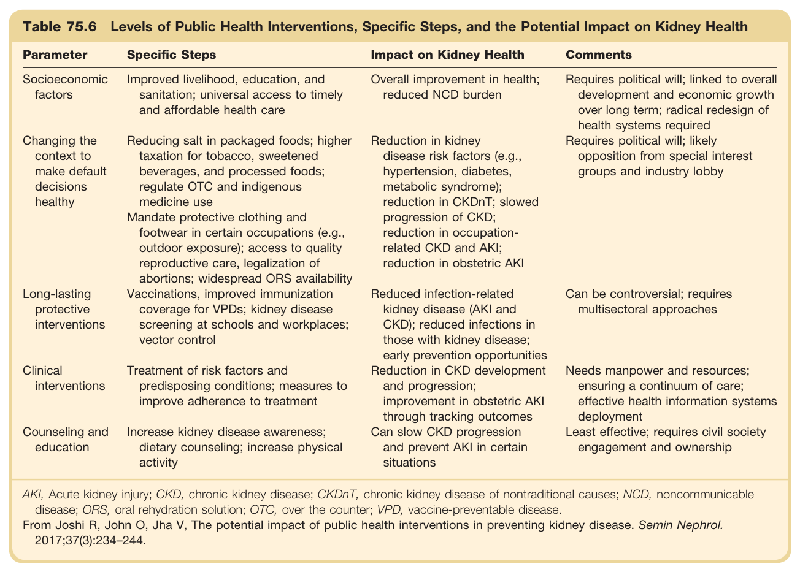

#### Table Data (CSV: [Table_75_6.csv](Table_75_6.csv))

```markdown
| Table Text (OCR) |
| :--- |
| Table 75.6 Levels of Public Health Interventions, Specific Steps, and the Potential Impact on Kidney Health Parameter  Specific Steps  Impact on Kidney Health  Comments    Socioeconomic factors  Improved livelihood, education, and sanitation; universal access to timely and affordable health care  Overall improvement in health; reduced NCD burden  Requires political will; linked to overall development and economic growth over long term; radical redesign of health systems required    Changing the context to make default decisions healthy  Reducing salt in packaged foods; higher taxation for tobacco, sweetened beverages, and processed foods; regulate OTC and indigenous medicine useMandate protective clothing and footwear in certain occupations (e.g., outdoor exposure); access to quality reproductive care, legalization of abortions; widespread ORS availability  Reduction in kidney disease risk factors (e.g., hypertension, diabetes, metabolic syndrome); reduction in CKDnT; slowed progression of CKD; reduction in occupation-related CKD and AKI; reduction in obstetric AKI  Requires political will; likely opposition from special interest groups and industry lobby    Long-lasting protective interventions  Vaccinations, improved immunization coverage for VPDs; kidney disease screening at schools and workplaces; vector control  Reduced infection-related kidney disease (AKI and CKD); reduced infections in those with kidney disease; early prevention opportunities  Can be controversial; requires multisectoral approaches    Clinical interventions  Treatment of risk factors and predisposing conditions; measures to improve adherence to treatment  Reduction in CKD development and progression; improvement in obstetric AKI through tracking outcomes  Needs manpower and resources; ensuring a continuum of care; effective health information systems deployment    Counseling and education  Increase kidney disease awareness; dietary counseling; increase physical activity  Can slow CKD progression and prevent AKI in certain situations  Least effective; requires civil society engagement and ownership AKI, Acute kidney injury; CKD, chronic kidney disease; CKDnT, chronic kidney disease of nontraditional causes; NCD, noncommunicable disease; ORS, oral rehydration solution; OTC, over the counter; VPD, vaccine-preventable disease. From Joshi R, John O, Jha V, The potential impact of public health interventions in preventing kidney disease. Semin Nephrol. 2017;37(3):234–244. |
```

Table 75.6 Levels of Public Health Interventions, Specific Steps, and the Potential Impact on Kidney Health | Parameter | Specific Steps | Impact on Kidney Health | Comments | | :--- | :--- | :--- | :--- | | Socioeconomic factors | Improved livelihood, education, and sanitation; universal access to timely and affordable health care | Overall improvement in health; reduced NCD burden | Requires political will; linked to overall development and economic growth over long term; radical redesign of health systems required | | Changing the context to make default decisions healthy | Reducing salt in packaged foods; higher taxation for tobacco, sweetened beverages, and processed foods; regulate OTC and indigenous medicine use | Reduction in kidney disease risk factors (e.g., hypertension, diabetes, metabolic syndrome); reduction in CKDnT; slowed progression of CKD; reduction in occupation-related CKD and AKI; reduction in obstetric AKI | Requires political will; likely opposition from special interest groups and industry lobby | | Long-lasting protective interventions | Mandate protective clothing and footwear in certain occupations (e.g., outdoor exposure); access to quality reproductive care, legalization of abortions; widespread ORS availability. Vaccinations, improved immunization coverage for VPDs; kidney disease screening at schools and workplaces; vector control | Reduced infection-related kidney disease (AKI and CKD); reduced infections in those with kidney disease; early prevention opportunities | Can be controversial; requires multisectoral approaches | | Clinical interventions | Treatment of risk factors and predisposing conditions; measures to improve adherence to treatment | Reduction in CKD development and progression; improvement in obstetric AKI through tracking outcomes | Needs manpower and resources; ensuring a continuum of care; effective health information systems deployment | | Counseling and education | Increase kidney disease awareness; dietary counseling; increase physical activity | Can slow CKD progression and prevent AKI in certain situations | Least effective; requires civil society engagement and ownership |

---
