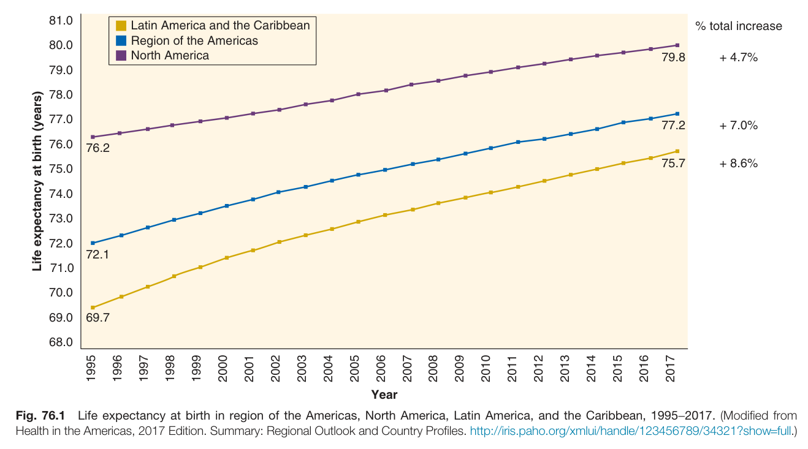
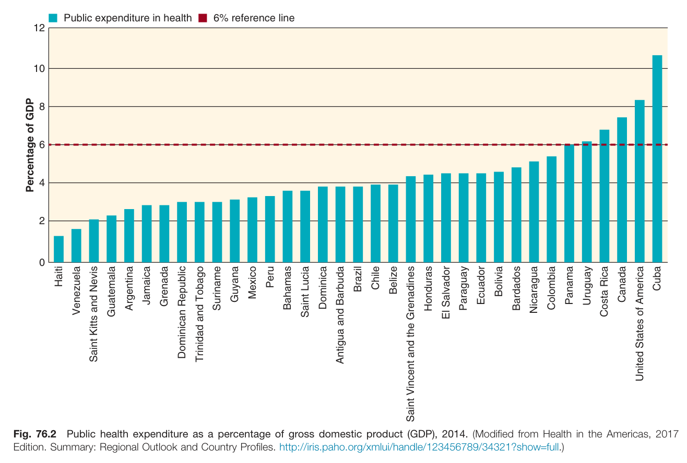
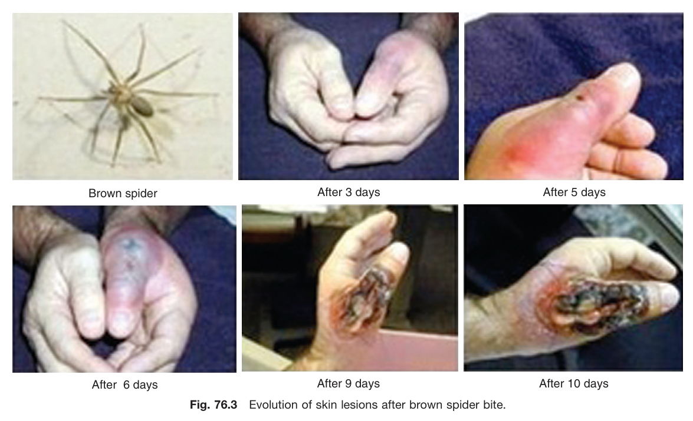
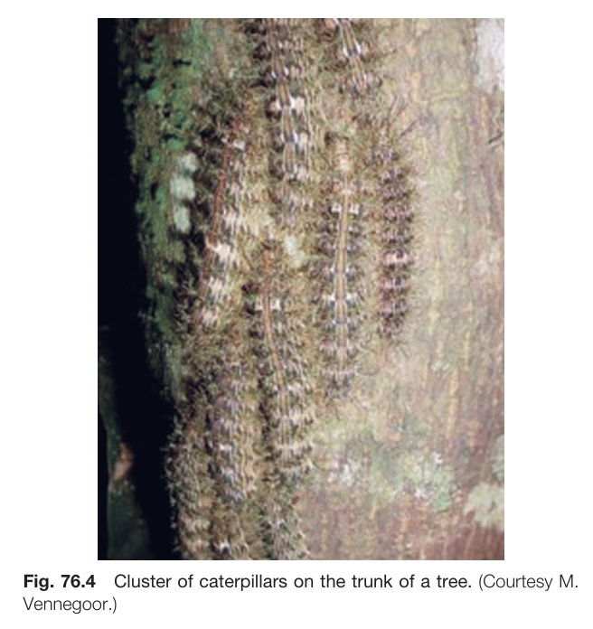
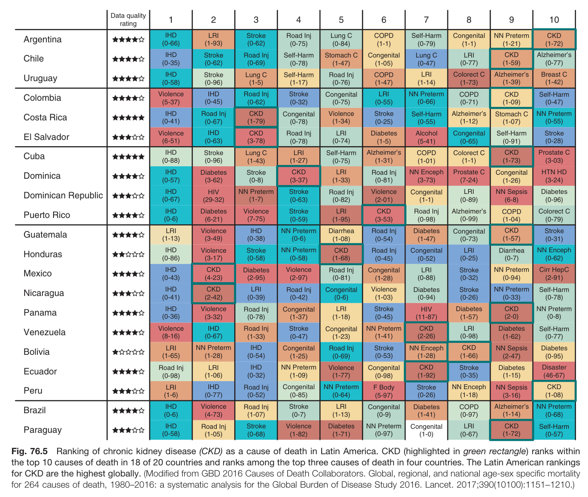
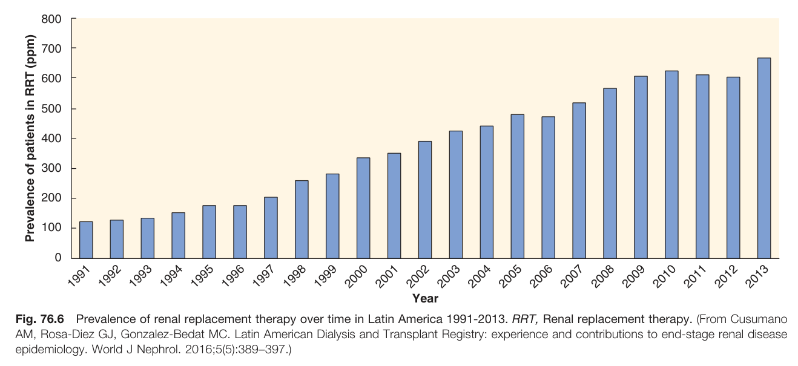
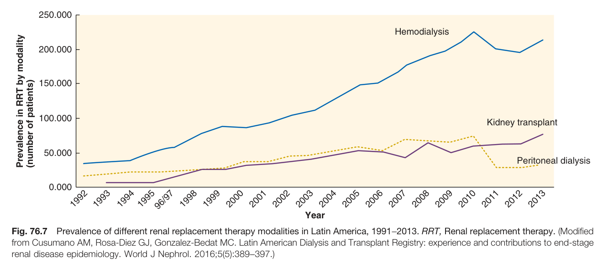
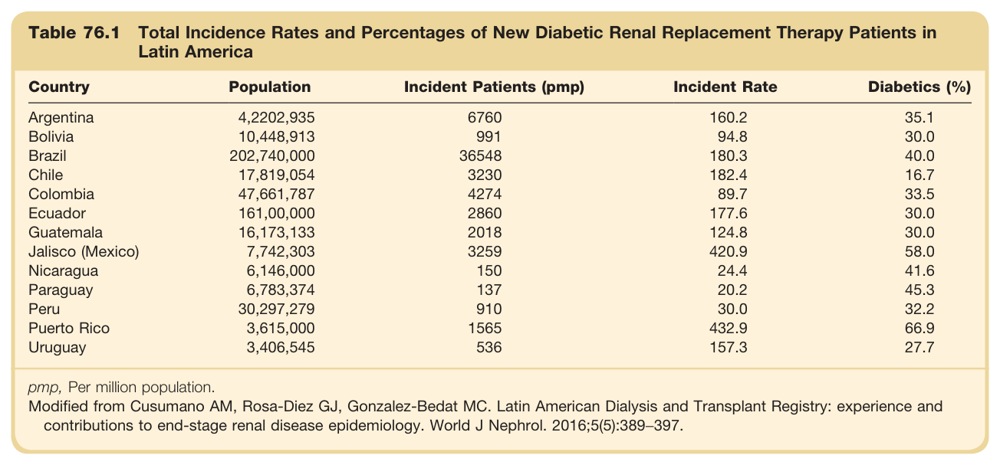
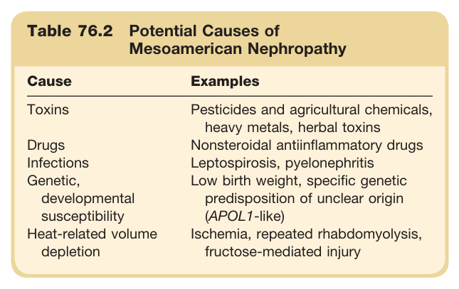
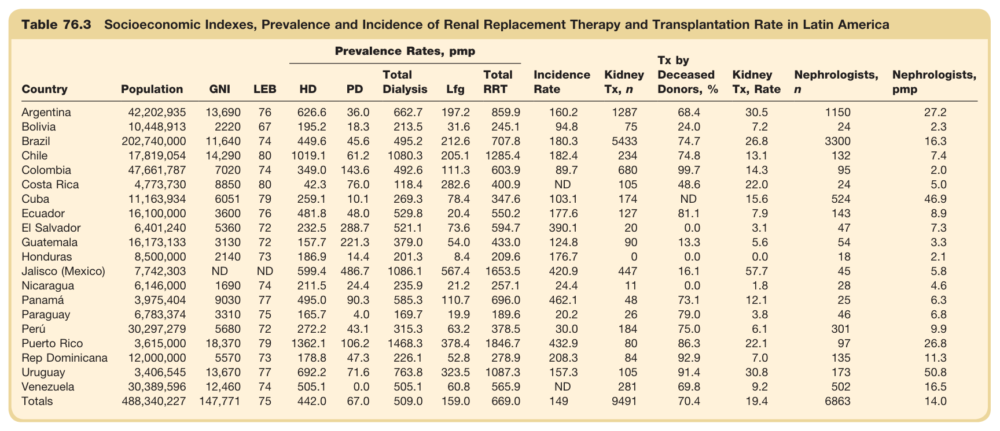

# 76. Latin America - Figures and Tables Index

This document lists all figures and tables extracted from `76. Latin America.pdf`.

## Table of Contents
- [Figures](#figures)
- [Tables](#tables)

---

## Figures

### Fig_76_1



Fig. 76.1 Life expectancy at birth in region of the Americas, North America, Latin America, and the Caribbean, 1995-2017. (Modified from Health in the Americas, 2017 Edition. Summary: Regional Outlook and Country Profiles. http://iris.paho.org/xmlui/handle/123456789/34321?show=full.)

---

### Fig_76_2



Fig. 76.2 Public health expenditure as a percentage of gross domestic product (GDP), 2014. (Modified from Health in the Americas, 2017 Edition. Summary: Regional Outlook and Country Profiles. http://iris.paho.org/xmlui/handle/123456789/34321?show=full.)

---

### Fig_76_3



Fig. 76.3 Evolution of skin lesions after brown spider bite.

---

### Fig_76_4



Fig. 76.4 Cluster of caterpillars on the trunk of a tree. (Courtesy M. Vennegoor.)

---

### Fig_76_5



Fig. 76.5 Ranking of chronic kidney disease (CKD) as a cause of death in Latin America. CKD (highlighted in green rectangle) ranks within the top 10 causes of death in 18 of 20 countries and ranks among the top three causes of death in four countries. The Latin American rankings for CKD are the highest globally. (Modified from GBD 2016 Causes of Death Collaborators. Global, regional, and national age-sex specific mortality for 264 causes of death, 1980-2016: a systematic analysis for the Global Burden of Disease Study 2016. Lancet. 2017;390(10100):1151-1210.)

---

### Fig_76_6



Fig. 76.6 Prevalence of renal replacement therapy over time in Latin America 1991-2013. RRT, Renal replacement therapy. (From Cusumano AM, Rosa-Diez GJ, Gonzalez-Bedat MC. Latin American Dialysis and Transplant Registry: experience and contributions to end-stage renal disease epidemiology. World J Nephrol. 2016;5(5):389-397.)

---

### Fig_76_7



Fig. 76.7 Prevalence of different renal replacement therapy modalities in Latin America, 1991-2013. RRT, Renal replacement therapy. (Modified from Cusumano AM, Rosa-Diez GJ, Gonzalez-Bedat MC. Latin American Dialysis and Transplant Registry: experience and contributions to end-stage renal disease epidemiology. World J Nephrol. 2016;5(5):389-397.)

---

## Tables

### Table_76_1

#### Table Image



#### Table Data (CSV: [Table_76_1.csv](Table_76_1.csv))

```markdown
| Table Text (OCR) |
| :--- |
| Table 76.1 Total Incidence Rates and Percentages of New Diabetic Renal Replacement Therapy Patients in Latin America Country  Population  Incident Patients (pmp)  Incident Rate  Diabetics (%)    Argentina  4,2202,935  6760  160.2  35.1    Bolivia  10,448,913  991  94.8  30.0    Brazil  202,740,000  36548  180.3  40.0    Chile  17,819,054  3230  182.4  16.7    Colombia  47,661,787  4274  89.7  33.5    Ecuador  161,00,000  2860  177.6  30.0    Guatemala  16,173,133  2018  124.8  30.0    Jalisco (Mexico)  7,742,303  3259  420.9  58.0    Nicaragua  6,146,000  150  24.4  41.6    Paraguay  6,783,374  137  20.2  45.3    Peru  30,297,279  910  30.0  32.2    Puerto Rico  3,615,000  1565  432.9  66.9    Uruguay  3,406,545  536  157.3  27.7 pmp, Per million population. Modified from Cusumano AM, Rosa-Diez GJ, Gonzalez-Bedat MC. Latin American Dialysis and Transplant Registry: experience and contributions to end-stage renal disease epidemiology. World J Nephrol. 2016;5(5):389−397. |
```

Table 76.1 Total Incidence Rates and Percentages of New Diabetic Renal Replacement Therapy Patients in Latin America pmp, Per million population. Modified from Cusumano AM, Rosa-Diez GJ, Gonzalez-Bedat MC. Latin American Dialysis and Transplant Registry: experience and contributions to end-stage renal disease epidemiology. World J Nephrol. 2016;5(5):389-397.

---

### Table_76_2

#### Table Image



#### Table Data (CSV: [Table_76_2.csv](Table_76_2.csv))

```markdown
| Table Text (OCR) |
| :--- |
| Table 76.2 Potential Causes of Mesoamerican Nephropathy Cause  Examples    Toxins  Pesticides and agricultural chemicals, heavy metals, herbal toxins    Drugs  Nonsteroidal antiinflammatory drugs    Infections  Leptospirosis, pyelonephritis    Genetic, developmental susceptibility  Low birth weight, specific genetic predisposition of unclear origin (APOL1-like)    Heat-related volume depletion  Ischemia, repeated rhabdomyolysis, fructose-mediated injury |
```

Table 76.2 Potential Causes of Mesoamerican Nephropathy | Cause | Examples | | :--- | :--- | | Toxins | Pesticides and agricultural chemicals, heavy metals, herbal toxins | | Drugs | Nonsteroidal antiinflammatory drugs | | Infections | Leptospirosis, pyelonephritis | | Genetic, developmental susceptibility | Low birth weight, specific genetic predisposition of unclear origin (APOL1-like) | | Heat-related volume depletion | Ischemia, repeated rhabdomyolysis, fructose-mediated injury |

---

### Table_76_3

#### Table Image



#### Table Data (CSV: [Table_76_3.csv](Table_76_3.csv))

```markdown
| Table Text (OCR) |
| :--- |
| Table 76.3 Socioeconomic Indexes, Prevalence and Incidence of Renal Replacement Therapy and Transplantation Rate in Latin America |
```

Table 76.3 Socioeconomic Indexes, Prevalence and Incidence of Renal Replacement Therapy and Transplantation Rate in Latin America

---
