# 77. Global Considerations in Kidney Disease Africa - Figures and Tables Index

This document lists all figures and tables extracted from `77. Global Considerations in Kidney Disease Africa.pdf`.

## Table of Contents
- [Figures](#figures)
- [Tables](#tables)

---

## Figures

### Fig_77_1

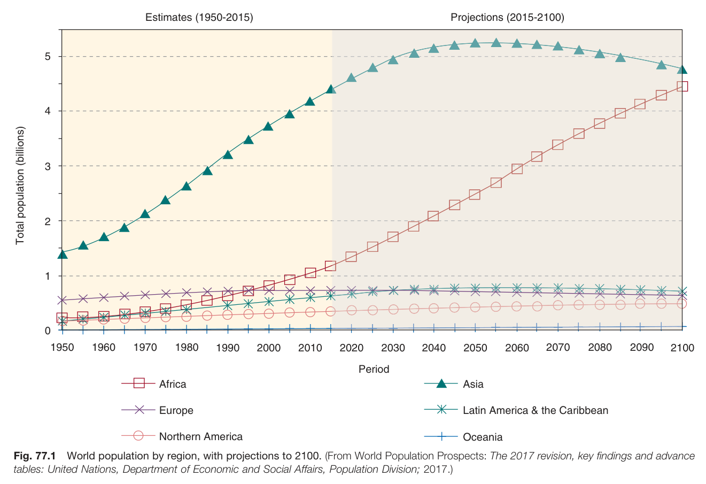

Fig. 77.1 World population by region, with projections to 2100. (From World Population Prospects: The 2017 revision, key findings and advance tables: United Nations, Department of Economic and Social Affairs, Population Division; 2017.)

---

### Fig_77_2

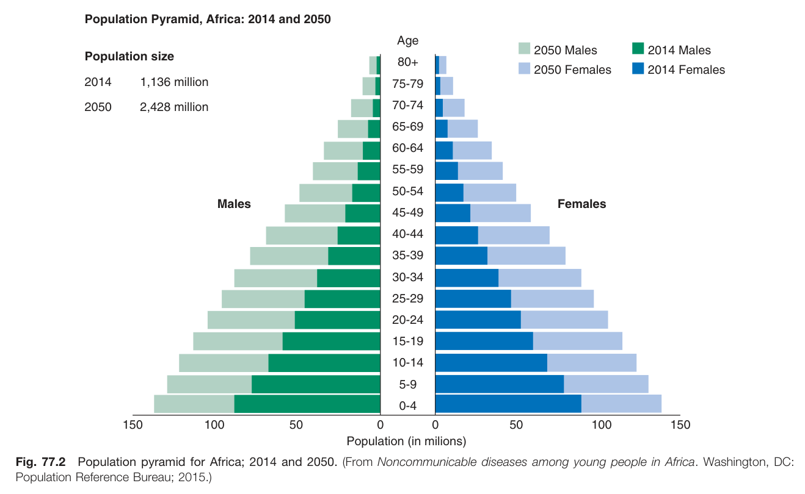

Fig. 77.2 Population pyramid for Africa; 2014 and 2050. (From Noncommunicable diseases among young people in Africa. Washington, DC: Population Reference Bureau; 2015.)

---

### Fig_77_3

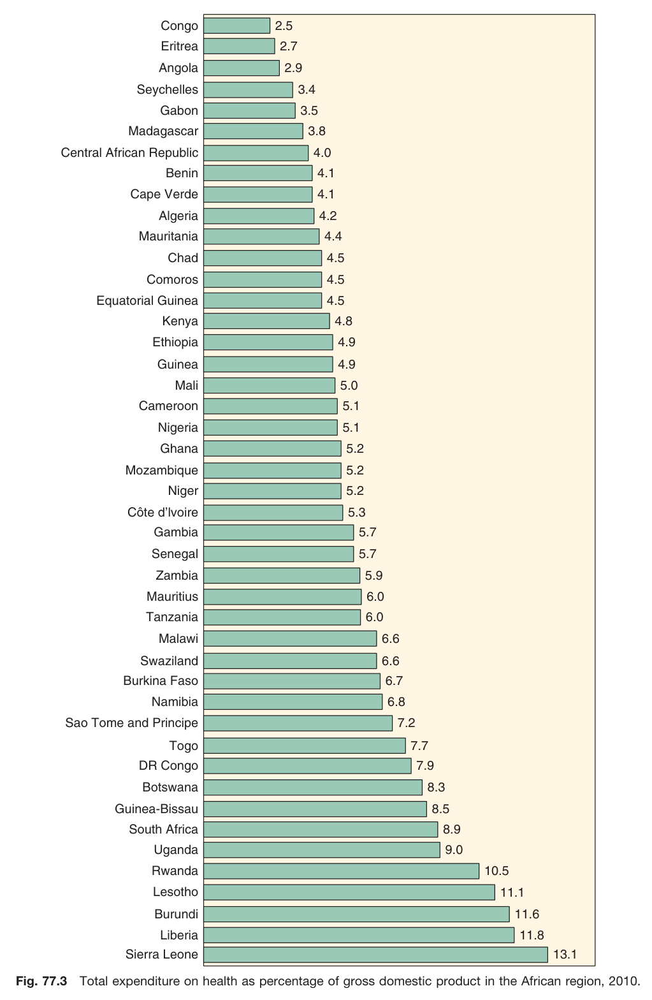

Fig. 77.3 Total expenditure on health as percentage of gross domestic product in the African region, 2010.

---

### Fig_77_4

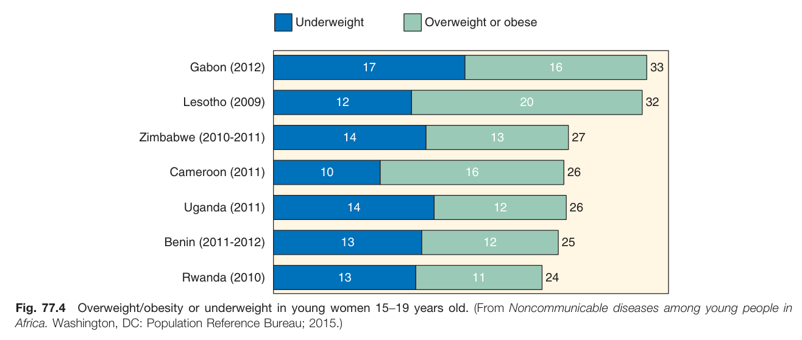

Fig. 77.4 Overweight/obesity or underweight in young women 15-19 years old. (From Noncommunicable diseases among young people in Africa. Washington, DC: Population Reference Bureau; 2015.)

---

### Fig_77_5

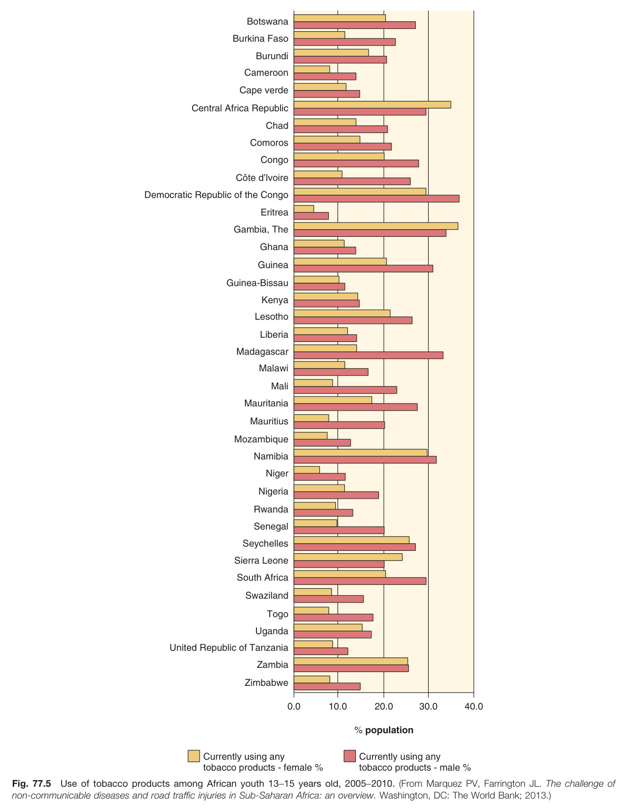

Fig. 77.5 Use of tobacco products among African youth 13-15 years old, 2005-2010. (From Marquez PV, Farrington JL. The challenge of non-communicable diseases and road traffic injuries in Sub-Saharan Africa: an overview. Washington, DC: The World Bank; 2013.)

---

### Fig_77_6

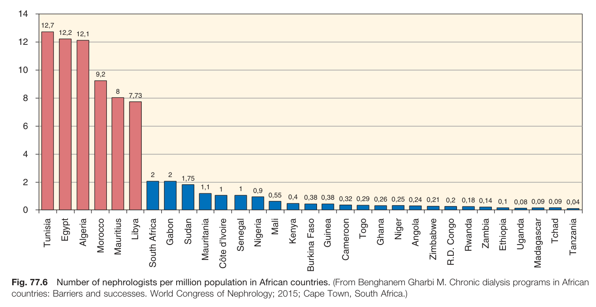

Fig. 77.6 Number of nephrologists per million population in African countries. (From Benghanem Gharbi M. Chronic dialysis programs in African countries: Barriers and successes. World Congress of Nephrology; 2015; Cape Town, South Africa.)

---

### Fig_77_7

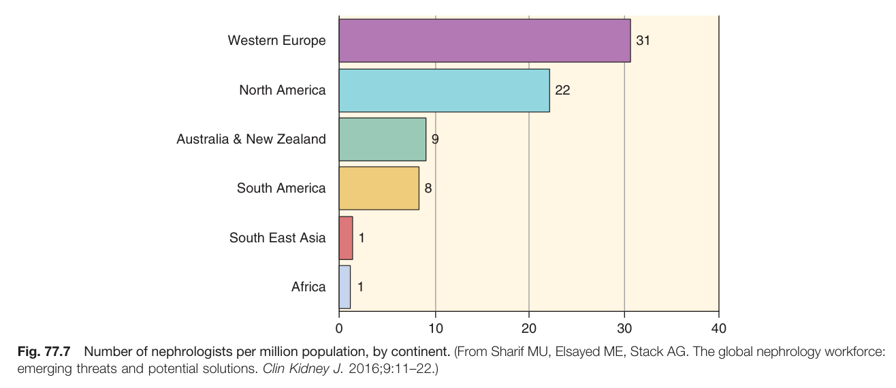

Fig. 77.7 Number of nephrologists per million population, by continent. (From Sharif MU, Elsayed ME, Stack AG. The global nephrology workforce: emerging threats and potential solutions. Clin Kidney J. 2016;9:11-22.)

---

### Fig_77_8

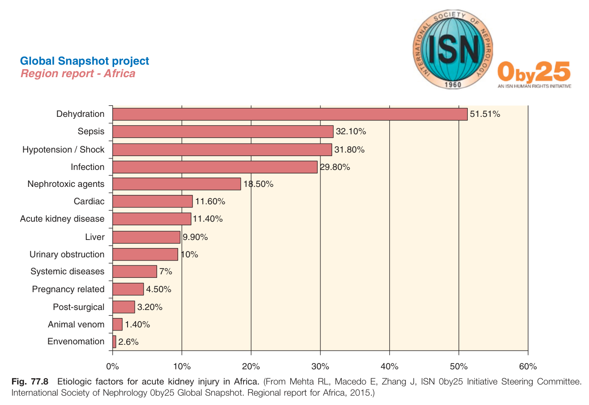

Fig. 77.8 Etiologic factors for acute kidney injury in Africa. (From Mehta RL, Macedo E, Zhang J, ISN 0by25 Initiative Steering Committee. International Society of Nephrology Oby25 Global Snapshot. Regional report for Africa, 2015.)

---

### Fig_77_9

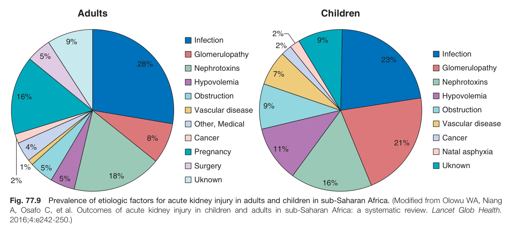

Fig. 77.9 Prevalence of etiologic factors for acute kidney injury in adults and children in sub-Saharan Africa. (Modified from Olowu WA, Niang A, Osafo C, et al. Outcomes of acute kidney injury in children and adults in sub-Saharan Africa: a systematic review. Lancet Glob Health. 2016;4:e242-250.)

---

### Fig_77_10

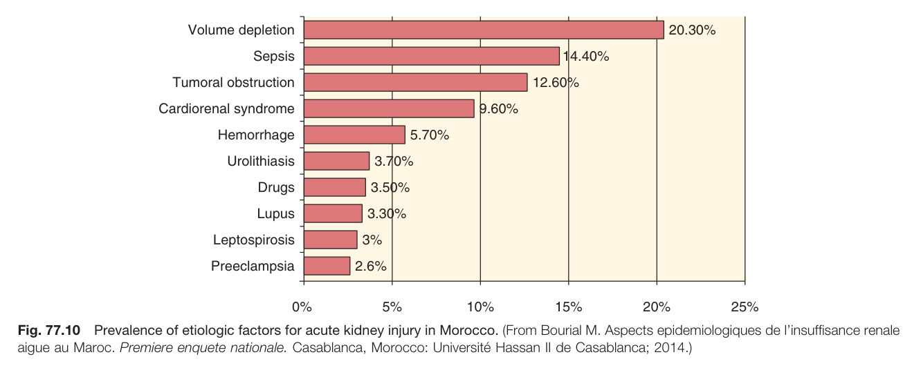

Fig. 77.10 Prevalence of etiologic factors for acute kidney injury in Morocco. (From Bourial M. Aspects epidemiologiques de l'insuffisance renale aigue au Maroc. Premiere enquete nationale. Casablanca, Morocco: Université Hassan II de Casablanca; 2014.)

---

### Fig_77_11

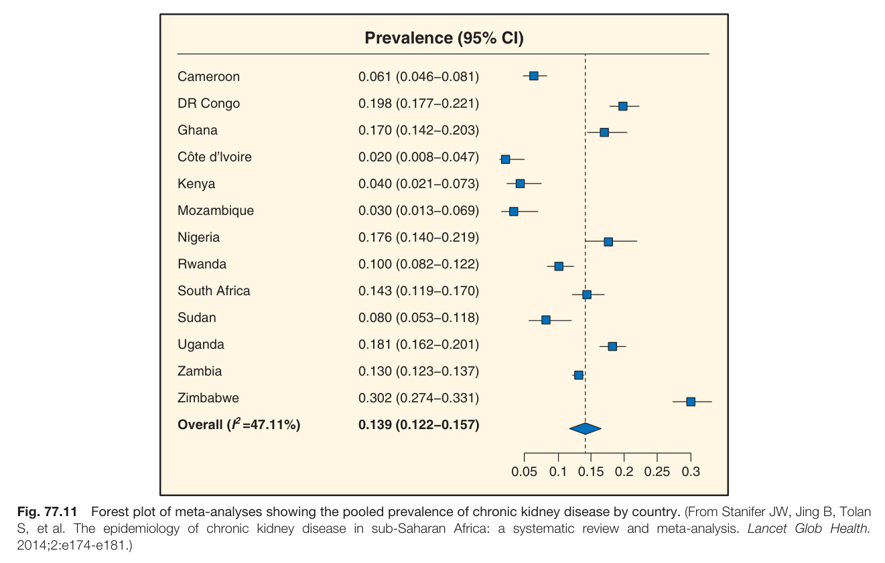

Fig. 77.11 Forest plot of meta-analyses showing the pooled prevalence of chronic kidney disease by country. (From Stanifer JW, Jing B, Tolan S, et al. The epidemiology of chronic kidney disease in sub-Saharan Africa: a systematic review and meta-analysis. Lancet Glob Health. 2014;2:e174-e181.)

---

### Fig_77_12

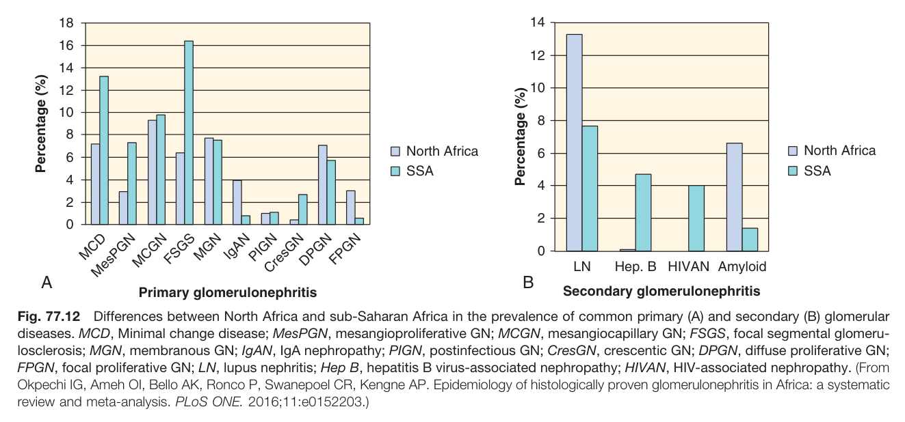

Fig. 77.12 Differences between North Africa and sub-Saharan Africa in the prevalence of common primary (A) and secondary (B) glomerular diseases. MCD, Minimal change disease; MesPGN, mesangioproliferative GN; MCGN, mesangiocapillary GN; FSGS, focal segmental glomerulosclerosis; MGN, membranous GN; IgAN, IgA nephropathy; PIGN, postinfectious GN; CresGN, crescentic GN; DPGN, diffuse proliferative GN; FPGN, focal proliferative GN; LN, lupus nephritis; Hep B, hepatitis B virus-associated nephropathy; HIVAN, HIV-associated nephropathy. (From Okpechi IG, Ameh Ol, Bello AK, Ronco P, Swanepoel CR, Kengne AP. Epidemiology of histologically proven glomerulonephritis in Africa: a systematic review and meta-analysis. PLoS ONE. 2016;11:e0152203.)

---

## Tables

### Table_77_1

#### Table Images (2 Parts)

- **Part 1 (Page 3)**:
  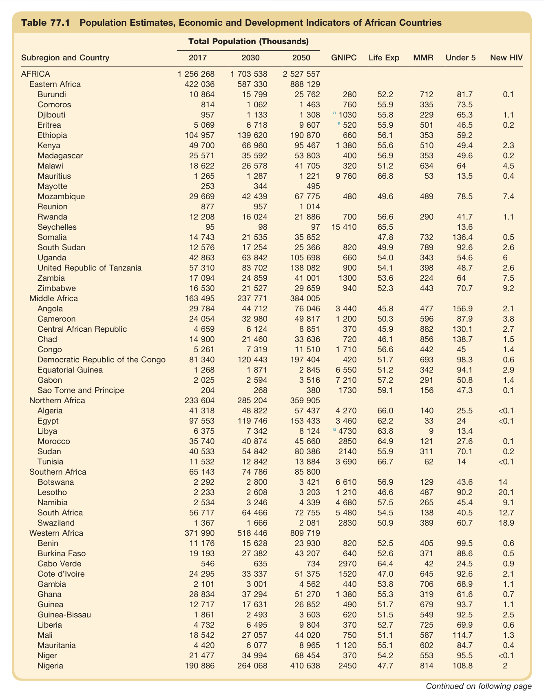

- **Part 2 (Page 4)**:
  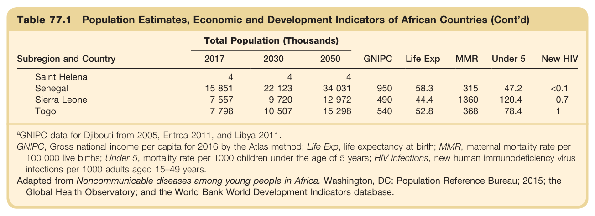

#### Table Data (CSV: [Table_77_1.csv](Table_77_1.csv))

```markdown
| Table Text (OCR) |
| :--- |
| Table 77.1 Population Estimates, Economic and Development Indicators of African Countries Subregion and Country  Total Population (Thousands)  GNIPC  Life Exp  MMR  Under 5  New HIV    2017  2030  2050    AFRICA  1 256 268  1 703 538  2 527 557              Eastern Africa  422 036  587 330  888 129              Burundi  10 864  15 799  25 762  280  52.2  712  81.7  0.1    Comoros  814  1 062  1 463  760  55.9  335  73.5      Djibouti  957  1 133  1 308   ^a  1030  55.8  229  65.3  1.1    Eritrea  5 069  6 718  9 607   ^a  520  55.9  501  46.5  0.2    Ethiopia  104 957  139 620  190 870  660  56.1  353  59.2      Kenya  49 700  66 960  95 467  1 380  55.6  510  49.4  2.3    Madagascar  25 571  35 592  53 803  400  56.9  353  49.6  0.2    Malawi  18 622  26 578  41 705  320  51.2  634  64  4.5    Mauritius  1 265  1 287  1 221  9 760  66.8  53  13.5  0.4    Mayotte  253  344  495              Mozambique  29 669  42 439  67 775  480  49.6  489  78.5  7.4    Reunion  877  957  1 014              Rwanda  12 208  16 024  21 886  700  56.6  290  41.7  1.1    Seychelles  95  98  97  15 410  65.5    13.6      Somalia  14 743  21 535  35 852    47.8  732  136.4  0.5    South Sudan  12 576  17 254  25 366  820  49.9  789  92.6  2.6    Uganda  42 863  63 842  105 698  660  54.0  343  54.6  6    United Republic of Tanzania  57 310  83 702  138 082  900  54.1  398  48.7  2.6    Zambia  17 094  24 859  41 001  1300  53.6  224  64  7.5    Zimbabwe  16 530  21 527  29 659  940  52.3  443  70.7  9.2    Middle Africa  163 495  237 771  384 005              Angola  29 784  44 712  76 046  3 440  45.8  477  156.9  2.1    Cameroon  24 054  32 980  49 817  1 200  50.3  596  87.9  3.8    Central African Republic  4 659  6 124  8 851  370  45.9  882  130.1  2.7    Chad  14 900  21 460  33 636  720  46.1  856  138.7  1.5    Congo  5 261  7 319  11 510  1 710  56.6  442  45  1.4    Democratic Republic of the Congo  81 340  120 443  197 404  420  51.7  693  98.3  0.6    Equatorial Guinea  1 268  1 871  2 845  6 550  51.2  342  94.1  2.9    Gabon  2 025  2 594  3 516  7 210  57.2  291  50.8  1.4    Sao Tome and Principe  204  268  380  1730  59.1  156  47.3  0.1    Northern Africa  233 604  285 204  359 905              Algeria  41 318  48 822  57 437  4 270  66.0  140  25.5  <0.1    Egypt  97 553  119 746  153 433  3 460  62.2  33  24  <0.1    Libya  6 375  7 342  8 124   ^a  4730  63.8  9  13.4      Morocco  35 740  40 874  45 660  2850  64.9  121  27.6  0.1    Sudan  40 533  54 842  80 386  2140  55.9  311  70.1  0.2    Tunisia  11 532  12 842  13 884  3 690  66.7  62  14  <0.1    Southern Africa  65 143  74 786  85 800              Botswana  2 292  2 800  3 421  6 610  56.9  129  43.6  14    Lesotho  2 233  2 608  3 203  1 210  46.6  487  90.2  20.1    Namibia  2 534  3 246  4 339  4 680  57.5  265  45.4  9.1    South Africa  56 717  64 466  72 755  5 480  54.5  138  40.5  12.7    Swaziland  1 367  1 666  2 081  2830  50.9  389  60.7  18.9    Western Africa  371 990  518 446  809 719              Benin  11 176  15 628  23 930  820  52.5  405  99.5  0.6    Burkina Faso  19 193  27 382  43 207  640  52.6  371  88.6  0.5    Cabo Verde  546  635  734  2970  64.4  42  24.5  0.9    Cote d'lvoire  24 295  33 337  51 375  1520  47.0  645  92.6  2.1    Gambia  2 101  3 001  4 562  440  53.8  706  68.9  1.1    Ghana  28 834  37 294  51 270  1 380  55.3  319  61.6  0.7    Guinea  12 717  17 631  26 852  490  51.7  679  93.7  1.1    Guinea-Bissau  1 861  2 493  3 603  620  51.5  549  92.5  2.5    Liberia  4 732  6 495  9 804  370  52.7  725  69.9  0.6    Mali  18 542  27 057  44 020  750  51.1  587  114.7  1.3    Mauritania  4 420  6 077  8 965  1 120  55.1  602  84.7  0.4    Niger  21 477  34 994  68 454  370  54.2  553  95.5  <0.1    Nigeria  190 886  264 068  410 638  2450  47.7  814  108.8  2    Saint Helena  4  4  4              Senegal  15 851  22 123  34 031  950  58.3  315  47.2  <0.1    Sierra Leone  7 557  9 720  12 972  490  44.4  1360  120.4  0.7    Togo  7 798  10 507  15 298  540  52.8  368  78.4  1 <sup>a</sup>GNIPC data for Djibouti from 2005, Eritrea 2011, and Libya 2011. GNIPC, Gross national income per capita for 2016 by the Atlas method; Life Exp, life expectancy at birth; MMR, maternal mortality rate per 100 000 live births; Under 5, mortality rate per 1000 children under the age of 5 years; HIV infections, new human immunodeficiency virus infections per 1000 adults aged 15–49 years. Adapted from Noncommunicable diseases among young people in Africa. Washington, DC: Population Reference Bureau; 2015; the Global Health Observatory; and the World Bank World Development Indicators database. |
```

Table 77.1 Population Estimates, Economic and Development Indicators of African Countries | Subregion and Country | 2017 | 2030 | 2050 | GNIPC | Life Exp | MMR | Under 5 | New HIV | | :--- | :--- | :--- | :--- | :--- | :--- | :--- | :--- | :--- | | **AFRICA** | **1 256 268** | **1 703 538** | **2 527 557** | | | | | | | **Eastern Africa** | **422 036** | **587 330** | **888 129** | | | | | | | Burundi | 10 864 | 15 799 | 25 762 | 280 | 52.2 | 712 | 81.7 | 0.1 | | Comoros | 814 | 1 062 | 1 463 | 760 | 55.9 | 335 | 73.5 | | | Djibouti | 957 | 1 133 | 1 308 | a 1030 | 55.8 | 229 | 65.3 | 1.1 | | Eritrea | 5 069 | 6 718 | 9 607 | a 520 | 55.9 | 501 | 46.5 | 0.2 | | Ethiopia | 104 957 | 139 620 | 190 870 | 660 | 56.1 | 353 | 59.2 | | | Kenya | 49 700 | 66 960 | 95 467 | 1 380 | 55.6 | 510 | 49.4 | 2.3 | | Madagascar | 25 571 | 35 592 | 53 803 | 400 | 56.9 | 353 | 49.6 | 0.2 | | Malawi | 18 622 | 26 578 | 41 705 | 320 | 51.2 | 634 | 64 | 4.5 | | Mauritius | 1 265 | 1 287 | 1 221 | 9 760 | 66.8 | 53 | 13.5 | 0.4 | | Mayotte | 253 | 344 | 495 | | | | | | | Mozambique | 29 669 | 42 439 | 67 775 | 480 | 49.6 | 489 | 78.5 | 7.4 | | Reunion | 877 | 957 | 1 014 | | | | | | | Rwanda | 12 208 | 16 024 | 21 886 | 700 | 56.6 | 290 | 41.7 | 1.1 | | Seychelles | 95 | 98 | 97 | 15 410 | 65.5 | | 13.6 | | | Somalia | 14 743 | 21 535 | 35 852 | | 47.8 | 732 | 136.4 | 0.5 | | South Sudan | 12 576 | 17 254 | 25 366 | 820 | 49.9 | 789 | 92.6 | 2.6 | | Uganda | 42 863 | 63 842 | 105 698 | 660 | 54.0 | 343 | 54.6 | 6 | | United Republic of Tanzania | 57 310 | 83 702 | 138 082 | 900 | 54.1 | 398 | 48.7 | 2.6 | | Zambia | 17 094 | 24 859 | 41 001 | 1300 | 53.6 | 224 | 64 | 7.5 | | Zimbabwe | 16 530 | 21 527 | 29 659 | 940 | 52.3 | 443 | 70.7 | 9.2 | | **Middle Africa** | **163 495** | **237 771** | **384 005** | | | | | | | Angola | 29 784 | 44 712 | 76 046 | 3 440 | 45.8 | 477 | 156.9 | 2.1 | | Cameroon | 24 054 | 32 980 | 49 817 | 1 200 | 50.3 | 596 | 87.9 | 3.8 | | Central African Republic | 4 659 | 6 124 | 8 851 | 370 | 45.9 | 882 | 130.1 | 2.7 | | Chad | 14 900 | 21 460 | 33 636 | 720 | 46.1 | 856 | 138.7 | 1.5 | | Congo | 5 261 | 7 319 | 11 510 | 1 710 | 56.6 | 442 | 45 | 1.4 | | Democratic Republic of the Congo | 81 340 | 120 443 | 197 404 | 420 | 51.7 | 693 | 98.3 | 0.6 | | Equatorial Guinea | 1 268 | 1 871 | 2 845 | 6 550 | 51.2 | 342 | 94.1 | 2.9 | | Gabon | 2 025 | 2 594 | 3 516 | 7 210 | 57.2 | 291 | 50.8 | 1.4 | | Sao Tome and Principe | 204 | 268 | 380 | 1730 | 59.1 | 156 | 47.3 | 0.1 | | **Northern Africa** | **233 604** | **285 204** | **359 905** | | | | | | | Algeria | 41 318 | 48 822 | 57 437 | 4 270 | 66.0 | 140 | 25.5 | <0.1 | | Egypt | 97 553 | 119 746 | 153 433 | 3 460 | 62.2 | 33 | 24 | <0.1 | | Libya | 6 375 | 7 342 | 8 124 | a 4730 | 63.8 | 9 | 13.4 | | | Morocco | 35 740 | 40 874 | 45 660 | 2850 | 64.9 | 121 | 27.6 | 0.1 | | Sudan | 40 533 | 54 842 | 80 386 | 2140 | 55.9 | 311 | 70.1 | 0.2 | | Tunisia | 11 532 | 12 842 | 13 884 | 3 690 | 66.7 | 62 | 14 | <0.1 | | **Southern Africa** | **65 143** | **74 786** | **85 800** | | | | | | | Botswana | 2 292 | 2 800 | 3 421 | 6 610 | 56.9 | 129 | 43.6 | 14 | | Lesotho | 2 233 | 2 608 | 3 203 | 1 210 | 46.6 | 487 | 90.2 | 20.1 | | Namibia | 2 534 | 3 246 | 4 339 | 4 680 | 57.5 | 265 | 45.4 | 9.1 | | South Africa | 56 717 | 64 466 | 72 755 | 5 480 | 54.5 | 138 | 40.5 | 12.7 | | Swaziland | 1 367 | 1 666 | 2 081 | 2830 | 50.9 | 389 | 60.7 | 18.9 | | **Western Africa** | **371 990** | **518 446** | **809 719** | | | | | | | Benin | 11 176 | 15 628 | 23 930 | 820 | 52.5 | 405 | 99.5 | 0.6 | | Burkina Faso | 19 193 | 27 382 | 43 207 | 640 | 52.6 | 371 | 88.6 | 0.5 | | Cabo Verde | 546 | 635 | 734 | 2970 | 64.4 | 42 | 24.5 | 0.9 | | Cote d'Ivoire | 24 295 | 33 337 | 51 375 | 1520 | 47.0 | 645 | 92.6 | 2.1 | | Gambia | 2 101 | 3 001 | 4 562 | 440 | 53.8 | 706 | 68.9 | 1.1 | | Ghana | 28 834 | 37 294 | 51 270 | 1 380 | 55.3 | 319 | 61.6 | 0.7 | | Guinea | 12 717 | 17 631 | 26 852 | 490 | 51.7 | 679 | 93.7 | 1.1 | | Guinea-Bissau | 1 861 | 2 493 | 3 603 | 620 | 51.5 | 549 | 92.5 | 2.5 | | Liberia | 4 732 | 6 495 | 9 804 | 370 | 52.7 | 725 | 69.9 | 0.6 | | Mali | 18 542 | 27 057 | 44 020 | 750 | 51.1 | 587 | 114.7 | 1.3 | | Mauritania | 4 420 | 6 077 | 8 965 | 1 120 | 55.1 | 602 | 84.7 | 0.4 | | Niger | 21 477 | 34 994 | 68 454 | 370 | 54.2 | 553 | 95.5 | <0.1 | | Nigeria | 190 886 | 264 068 | 410 638 | 2450 | 47.7 | 814 | 108.8 | 2 | | Saint Helena | 4 | 4 | 4 | 950 | 58.3 | 315 | 47.2 | <0.1 | | Senegal | 15 851 | 22 123 | 34 031 | 490 | 44.4 | 1360 | 120.4 | 0.7 | | Sierra Leone | 7 557 | 9 720 | 12 972 | 540 | 52.8 | 368 | 78.4 | 1 | | Togo | 7 798 | 10 507 | 15 298 | | | | | | *Total Population in Thousands.* *@GNIPC data for Djibouti from 2005, Eritrea 2011, and Libya 2011.* *GNIPC, Gross national income per capita for 2016 by the Atlas method; Life Exp, life expectancy at birth; MMR, maternal mortality rate per 100 000 live births; Under 5, mortality rate per 1000 children under the age of 5 years; HIV infections, new human immunodeficiency virus infections per 1000 adults aged 15-49 years.* *Adapted from Noncommunicable diseases among young people in Africa. Washington, DC: Population Reference Bureau; 2015; the Global Health Observatory; and the World Bank World Development Indicators database.*

---

### Table_77_2

#### Table Image

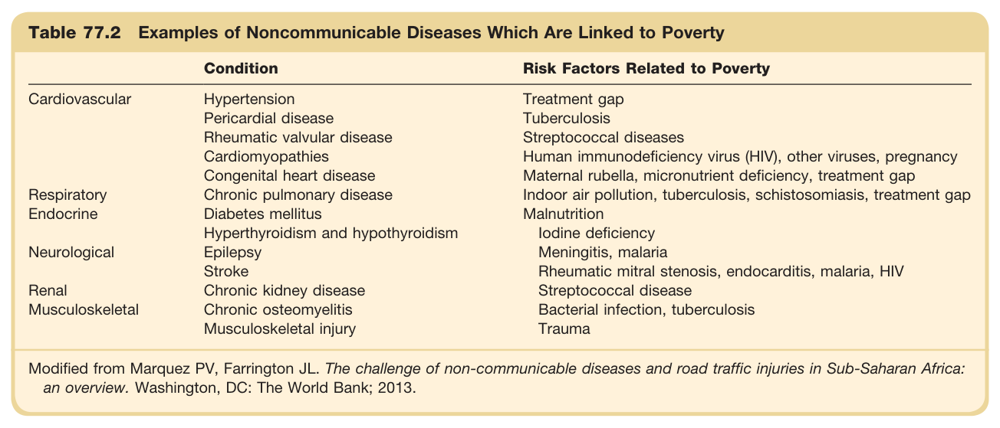

#### Table Data (CSV: [Table_77_2.csv](Table_77_2.csv))

```markdown
| Table Text (OCR) |
| :--- |
| Table 77.2 Examples of Noncommunicable Diseases Which Are Linked to Poverty Condition  Risk Factors Related to Poverty    Cardiovascular  Hypertension  Treatment gap    Pericardial disease  Tuberculosis    Rheumatic valvular disease  Streptococcal diseases    Cardiomyopathies  Human immunodeficiency virus (HIV), other viruses, pregnancy    Congenital heart disease  Maternal rubella, micronutrient deficiency, treatment gap    Respiratory  Chronic pulmonary disease  Indoor air pollution, tuberculosis, schistosomiasis, treatment gap    Endocrine  Diabetes mellitus  Malnutrition    Hyperthyroidism and hypothyroidism  Iodine deficiency    Neurological  Epilepsy  Meningitis, malaria    Stroke  Rheumatic mitral stenosis, endocarditis, malaria, HIV    Renal  Chronic kidney disease  Streptococcal disease    Musculoskeletal  Chronic osteomyelitis  Bacterial infection, tuberculosis    Musculoskeletal injury  Trauma Modified from Marquez PV, Farrington JL. The challenge of non-communicable diseases and road traffic injuries in Sub-Saharan Africa: an overview. Washington, DC: The World Bank; 2013. |
```

Table 77.2 Examples of Noncommunicable Diseases Which Are Linked to Poverty | | Condition | Risk Factors Related to Poverty | | :--- | :--- | :--- | | **Cardiovascular** | Hypertension, Pericardial disease, Rheumatic valvular disease, Cardiomyopathies, Congenital heart disease | Treatment gap, Tuberculosis, Streptococcal diseases, Human immunodeficiency virus (HIV), other viruses, pregnancy, Maternal rubella, micronutrient deficiency, treatment gap | | **Respiratory** | Chronic pulmonary disease | Indoor air pollution, tuberculosis, schistosomiasis, treatment gap | | **Endocrine** | Diabetes mellitus, Hyperthyroidism and hypothyroidism | Malnutrition, Iodine deficiency | | **Neurological** | Epilepsy, Stroke | Meningitis, malaria, Rheumatic mitral stenosis, endocarditis, malaria, HIV | | **Renal** | Chronic kidney disease | Streptococcal disease | | **Musculoskeletal** | Chronic osteomyelitis, Musculoskeletal injury | Bacterial infection, tuberculosis, Trauma | *Modified from Marquez PV, Farrington JL. The challenge of non-communicable diseases and road traffic injuries in Sub-Saharan Africa: an overview. Washington, DC: The World Bank; 2013.*

---

### Table_77_3

#### Table Image

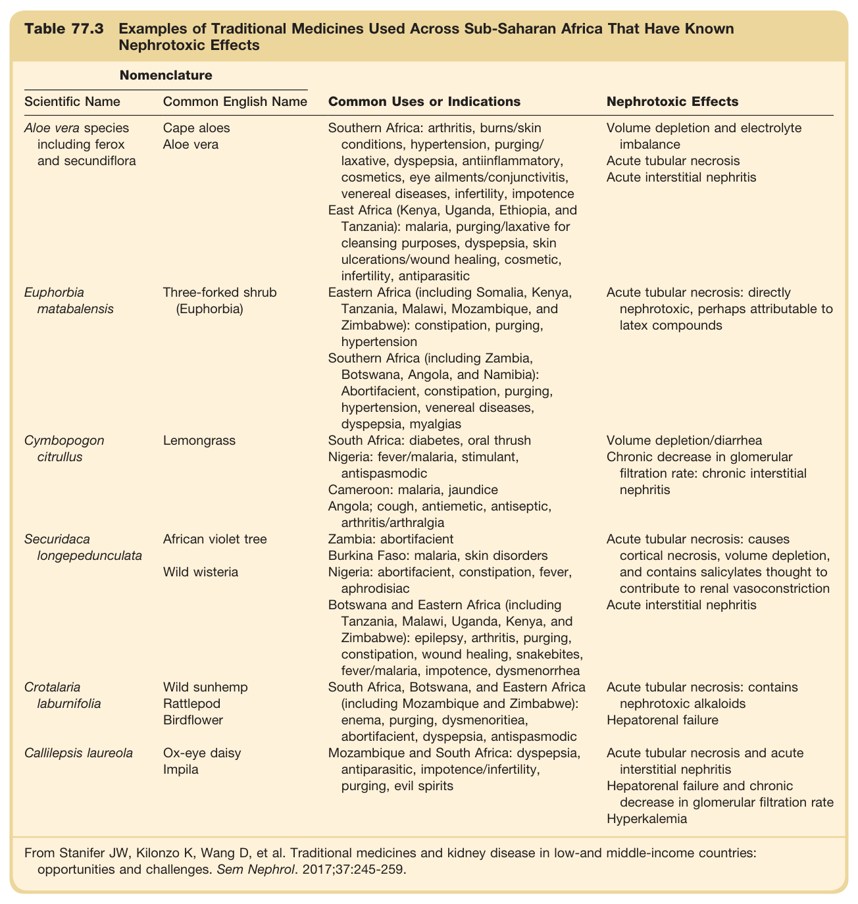

#### Table Data (CSV: [Table_77_3.csv](Table_77_3.csv))

```markdown
| Table Text (OCR) |
| :--- |
| Table 77.3 Examples of Traditional Medicines Used Across Sub-Saharan Africa That Have Known Nephrotoxic Effects Nomenclature  Common Uses or Indications  Nephrotoxic Effects    Scientific Name  Common English Name    Aloe vera species including ferox and secundiflora  Cape aloesAloe vera  Southern Africa: arthritis, burns/skin conditions, hypertension, purging/laxative, dyspepsia, antiinflammatory, cosmetics, eye ailments/conjunctivitis, venereal diseases, infertility, impotenceEast Africa (Kenya, Uganda, Ethiopia, and Tanzania): malaria, purging/laxative for cleansing purposes, dyspepsia, skin ulcerations/wound healing, cosmetic, infertility, antiparasitic  Volume depletion and electrolyte imbalanceAcute tubular necrosisAcute interstitial nephritis    Euphorbia matabalensis  Three-forked shrub (Euphorbia)  Eastern Africa (including Somalia, Kenya, Tanzania, Malawi, Mozambique, and Zimbabwe): constipation, purging, hypertensionSouthern Africa (including Zambia, Botswana, Angola, and Namibia): Abortifacient, constipation, purging, hypertension, venereal diseases, dyspepsia, myalgias  Acute tubular necrosis: directly nephrotoxic, perhaps attributable to latex compounds    Cymbopogon citrullus  Lemongrass  South Africa: diabetes, oral thrushNigeria: fever/malaria, stimulant, antispasmodiCameroon: malaria, jaundiceAngola; cough, antiemetic, antiseptic, arthritis/arthralgia  Volume depletion/diarrheaChronic decrease in glomerular filtration rate: chronic interstitial nephritis    Securidaca longepedunculata  African violet treeWild wisteria  Zambia: abortifacientBurkina Faso: malaria, skin disordersNigeria: abortifacient, constipation, fever, aphrodisiacBotswana and Eastern Africa (including Tanzania, Malawi, Uganda, Kenya, and Zimbabwe): epilepsy, arthritis, purging, constipation, wound healing, snakebites, fever/malaria, impotence, dysmenorrhea  Acute tubular necrosis: causes cortical necrosis, volume depletion, and contains salicylates thought to contribute to renal vasoconstrictionAcute interstitial nephritis    Crotalaria laburnifolia  Wild sunhempRattlepodBirdflower  South Africa, Botswana, and Eastern Africa (including Mozambique and Zimbabwe): enema, purging, dysmenoritiea, abortifacient, dyspepsia, antispasmodic  Acute tubular necrosis: contains nephrotoxic alkaloidsHepatorenal failure    Callilepsis laureola  Ox-eye daisyImpila  Mozambique and South Africa: dyspepsia, antiparasitic, impotence/infertility, purging, evil spirits  Acute tubular necrosis and acute interstitial nephritisHepatorenal failure and chronic decrease in glomerular filtration rateHyperkalemia From Stanifer JW, Kilonzo K, Wang D, et al. Traditional medicines and kidney disease in low-and middle-income countries: opportunities and challenges. Sem Nephrol. 2017;37:245-259. |
```

Table 77.3 Examples of Traditional Medicines Used Across Sub-Saharan Africa That Have Known Nephrotoxic Effects | Scientific Name | Common English Name | Common Uses or Indications | Nephrotoxic Effects | | :--- | :--- | :--- | :--- | | Aloe vera species including ferox and secundiflora | Cape aloes, Aloe vera | Southern Africa: arthritis, burns/skin conditions, hypertension, purging/laxative, dyspepsia, antiinflammatory, cosmetics, eye ailments/conjunctivitis, venereal diseases, infertility, impotence. East Africa (Kenya, Uganda, Ethiopia, and Tanzania): malaria, purging/laxative for cleansing purposes, dyspepsia, skin ulcerations/wound healing, cosmetic, infertility, antiparasitic. | Volume depletion and electrolyte imbalance, Acute tubular necrosis, Acute interstitial nephritis | | Euphorbia matabalensis | Three-forked shrub (Euphorbia) | Eastern Africa (including Somalia, Kenya, Tanzania, Malawi, Mozambique, and Zimbabwe): constipation, purging, hypertension. Southern Africa (including Zambia, Botswana, Angola, and Namibia): Abortifacient, constipation, purging, hypertension, venereal diseases, dyspepsia, myalgias. | Acute tubular necrosis: directly nephrotoxic, perhaps attributable to latex compounds | | Cymbopogon citrullus | Lemongrass | South Africa: diabetes, oral thrush. Nigeria: fever/malaria, stimulant, antispasmodic. Cameroon: malaria, jaundice. Angola; cough, antiemetic, antiseptic, arthritis/arthralgia. | Volume depletion/diarrhea, Chronic decrease in glomerular filtration rate: chronic interstitial nephritis | | Securidaca longepedunculata | African violet tree, Wild wisteria | Zambia: abortifacient. Burkina Faso: malaria, skin disorders. Nigeria: abortifacient, constipation, fever, aphrodisiac. Botswana and Eastern Africa (including Tanzania, Malawi, Uganda, Kenya, and Zimbabwe): epilepsy, arthritis, purging, constipation, wound healing, snakebites, fever/malaria, impotence, dysmenorrhea. | Acute tubular necrosis: causes cortical necrosis, volume depletion, and contains salicylates thought to contribute to renal vasoconstriction, Acute interstitial nephritis | | Crotalaria laburnifolia | Wild sunhemp, Rattlepod, Birdflower | South Africa, Botswana, and Eastern Africa (including Mozambique and Zimbabwe): enema, purging, dysmenoritiea, abortifacient, dyspepsia, antispasmodic. | Acute tubular necrosis: contains nephrotoxic alkaloids, Hepatorenal failure | | Callilepsis laureola | Ox-eye daisy, Impila | Mozambique and South Africa: dyspepsia, antiparasitic, impotence/infertility, purging, evil spirits. | Acute tubular necrosis and acute interstitial nephritis, Hepatorenal failure and chronic decrease in glomerular filtration rate, Hyperkalemia | *From Stanifer JW, Kilonzo K, Wang D, et al. Traditional medicines and kidney disease in low-and middle-income countries: opportunities and challenges. Sem Nephrol. 2017;37:245-259.*

---

### Table_77_4

#### Table Image

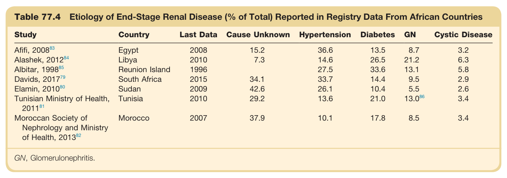

#### Table Data (CSV: [Table_77_4.csv](Table_77_4.csv))

```markdown
| Table Text (OCR) |
| :--- |
| Table 77.4 Etiology of End-Stage Renal Disease (% of Total) Reported in Registry Data From African Countries Study  Country  Last Data  Cause Unknown  Hypertension  Diabetes  GN  Cystic Disease    Afifi, 200883  Egypt  2008  15.2  36.6  13.5  8.7  3.2    Alashek, 201284  Libya  2010  7.3  14.6  26.5  21.2  6.3    Albitar, 199885  Reunion Island  1996    27.5  33.6  13.1  5.8    Davids, 201779  South Africa  2015  34.1  33.7  14.4  9.5  2.9    Elamin, 201080  Sudan  2009  42.6  26.1  10.4  5.5  2.6    Tunisian Ministry of Health, 201181  Tunisia  2010  29.2  13.6  21.0   13.0^{86}   3.4    Moroccan Society of Nephrology and Ministry of Health, 201382  Morocco  2007  37.9  10.1  17.8  8.5  3.4 GN, Glomerulonephritis. |
```

Table 77.4 Etiology of End-Stage Renal Disease (% of Total) Reported in Registry Data From African Countries | Study | Country | Last Data | Cause Unknown | Hypertension | Diabetes | GN | Cystic Disease | | :--- | :--- | :--- | :--- | :--- | :--- | :--- | :--- | | Afifi, 2008 | Egypt | 2008 | 15.2 | 36.6 | 13.5 | 8.7 | 3.2 | | Alashek, 2012 | Libya | 2010 | 7.3 | 14.6 | 26.5 | 21.2 | 6.3 | | Albitar, 1998 | Reunion Island | 1996 | | 27.5 | 33.6 | 13.1 | 5.8 | | Davids, 2017 | South Africa | 2015 | 34.1 | 33.7 | 14.4 | 9.5 | 2.9 | | Elamin, 2010 | Sudan | 2009 | 42.6 | 26.1 | 10.4 | 5.5 | 2.6 | | Tunisian Ministry of Health, 2011 | Tunisia | 2010 | 29.2 | 13.6 | 21.0 | 13.0 | 3.4 | | Moroccan Society of Nephrology and Ministry of Health, 2013 | Morocco | 2007 | 37.9 | 10.1 | 17.8 | 8.5 | 3.4 | *GN, Glomerulonephritis.*

---

### Table_77_5

#### Table Image

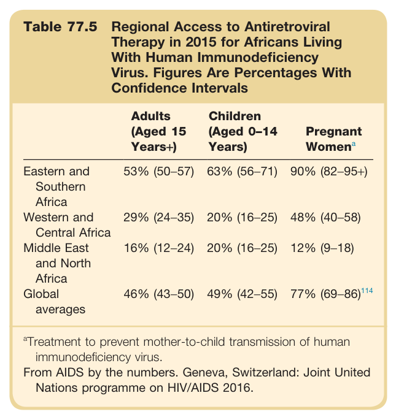

#### Table Data (CSV: [Table_77_5.csv](Table_77_5.csv))

```markdown
| Table Text (OCR) |
| :--- |
| Table 77.5 Regional Access to Antiretroviral Therapy in 2015 for Africans Living With Human Immunodeficiency Virus. Figures Are Percentages With Confidence Intervals Adults (Aged 15 Years+)  Children (Aged 0–14 Years)  Pregnant  Women^a     Eastern and Southern Africa  53% (50–57)  63% (56–71)  90% (82–95+)    Western and Central Africa  29% (24–35)  20% (16–25)  48% (40–58)    Middle East and North Africa  16% (12–24)  20% (16–25)  12% (9–18)    Global averages  46% (43–50)  49% (42–55)   77\% (69–86)^{114} <sup>a</sup>Treatment to prevent mother-to-child transmission of human immunodeficiency virus. From AIDS by the numbers. Geneva, Switzerland: Joint United Nations programme on HIV/AIDS 2016. |
```

Table 77.5 Regional Access to Antiretroviral Therapy in 2015 for Africans Living With Human Immunodeficiency Virus. Figures Are Percentages With Confidence Intervals | | Adults (Aged 15 Years+) | Children (Aged 0-14 Years) | Pregnant Womena | | :--- | :--- | :--- | :--- | | Eastern and Southern Africa | 53% (50-57) | 63% (56-71) | 90% (82-95+) | | Western and Central Africa | 29% (24-35) | 20% (16-25) | 48% (40–58) | | Middle East and North Africa | 16% (12-24) | 20% (16-25) | 12% (9-18) | | Global averages | 46% (43-50) | 49% (42-55) | 77% (69-86) | *aTreatment to prevent mother-to-child transmission of human immunodeficiency virus.* *From AIDS by the numbers. Geneva, Switzerland: Joint United Nations programme on HIV/AIDS 2016.*

---

### Table_77_6

#### Table Image

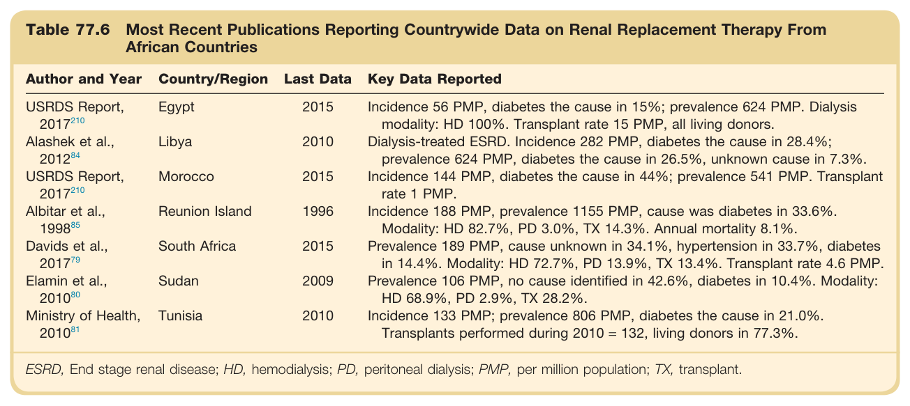

#### Table Data (CSV: [Table_77_6.csv](Table_77_6.csv))

```markdown
| Table Text (OCR) |
| :--- |
| Table 77.6 Most Recent Publications Reporting Countrywide Data on Renal Replacement Therapy From African Countries Author and Year  Country/Region  Last Data  Key Data Reported    USRDS Report, 2017210  Egypt  2015  Incidence 56 PMP, diabetes the cause in 15%; prevalence 624 PMP. Dialysis modality: HD 100%. Transplant rate 15 PMP, all living donors.    Alashek et al., 201284  Libya  2010  Dialysis-treated ESRD. Incidence 282 PMP, diabetes the cause in 28.4%; prevalence 624 PMP, diabetes the cause in 26.5%, unknown cause in 7.3%.    USRDS Report, 2017210  Morocco  2015  Incidence 144 PMP, diabetes the cause in 44%; prevalence 541 PMP. Transplant rate 1 PMP.    Albitar et al., 199885  Reunion Island  1996  Incidence 188 PMP, prevalence 1155 PMP, cause was diabetes in 33.6%. Modality: HD 82.7%, PD 3.0%, TX 14.3%. Annual mortality 8.1%.    Davids et al., 201779  South Africa  2015  Prevalence 189 PMP, cause unknown in 34.1%, hypertension in 33.7%, diabetes in 14.4%. Modality: HD 72.7%, PD 13.9%, TX 13.4%. Transplant rate 4.6 PMP.    Elamin et al., 201080  Sudan  2009  Prevalence 106 PMP, no cause identified in 42.6%, diabetes in 10.4%. Modality: HD 68.9%, PD 2.9%, TX 28.2%.    Ministry of Health, 201081  Tunisia  2010  Incidence 133 PMP; prevalence 806 PMP, diabetes the cause in 21.0%. Transplants performed during 2010 = 132, living donors in 77.3%. ESRD, End stage renal disease; HD, hemodialysis; PD, peritoneal dialysis; PMP, per million population; TX, transplant. |
```

Table 77.6 Most Recent Publications Reporting Countrywide Data on Renal Replacement Therapy From African Countries | Author and Year | Country/Region | Last Data | Key Data Reported | | :--- | :--- | :--- | :--- | | USRDS Report, 2017 | Egypt | 2015 | Incidence 56 PMP, diabetes the cause in 15%; prevalence 624 PMP. Dialysis modality: HD 100%. Transplant rate 15 PMP, all living donors. | | Alashek et al., 2012 | Libya | 2010 | Dialysis-treated ESRD. Incidence 282 PMP, diabetes the cause in 28.4%; prevalence 624 PMP, diabetes the cause in 26.5%, unknown cause in 7.3%. | | USRDS Report, 2017 | Morocco | 2015 | Incidence 144 PMP, diabetes the cause in 44%; prevalence 541 PMP. Transplant rate 1 PMP. | | Albitar et al., 1998 | Reunion Island | 1996 | Incidence 188 PMP, prevalence 1155 PMP, cause was diabetes in 33.6%. Modality: HD 82.7%, PD 3.0%, TX 14.3%. Annual mortality 8.1%. | | Davids et al., 2017 | South Africa | 2015 | Prevalence 189 PMP, cause unknown in 34.1%, hypertension in 33.7%, diabetes in 14.4%. Modality: HD 72.7%, PD 13.9%, TX 13.4%. Transplant rate 4.6 PMP. | | Elamin et al., 2010 | Sudan | 2009 | Prevalence 106 PMP, no cause identified in 42.6%, diabetes in 10.4%. Modality: HD 68.9%, PD 2.9%, TX 28.2%. | | Ministry of Health, 2010 | Tunisia | 2010 | Incidence 133 PMP; prevalence 806 PMP, diabetes the cause in 21.0%. Transplants performed during 2010 = 132, living donors in 77.3%. | *ESRD, End stage renal disease; HD, hemodialysis; PD, peritoneal dialysis; PMP, per million population; TX, transplant.*

---
