# 78. Near and Middle East - Figures and Tables Index

This document lists all figures and tables extracted from `78. Near and Middle East.pdf`.

## Table of Contents
- [Figures](#figures)
- [Tables](#tables)

---

## Figures

### Fig_78_1

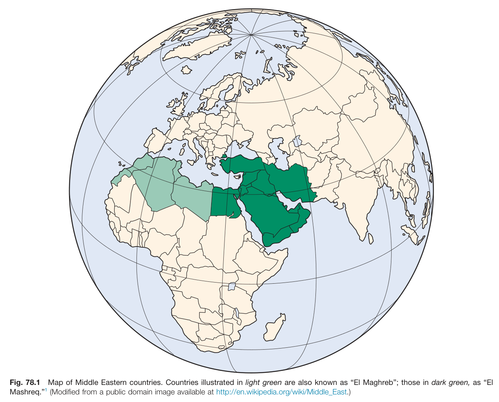

Fig. 78.1 Map of Middle Eastern countries. Countries illustrated in light green are also known as "El Maghreb"; those in dark green, as "El Mashreq." (Modified from a public domain image available at http://en.wikipedia.org/wiki/Middle_East.)

---

### Fig_78_2

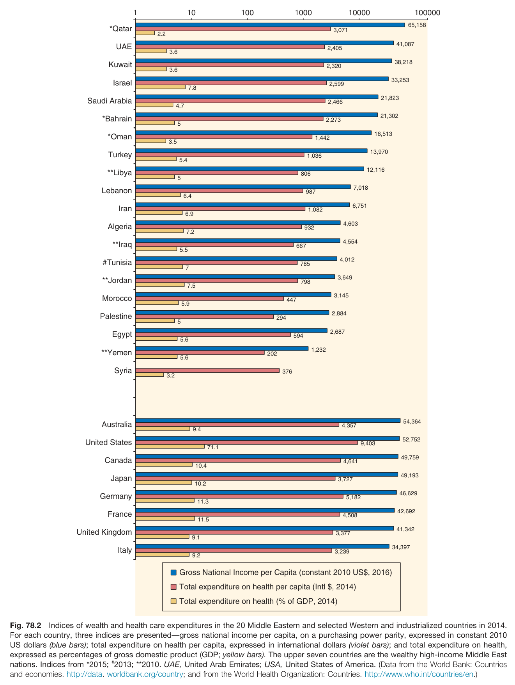

Fig. 78.2 Indices of wealth and health care expenditures in the 20 Middle Eastern and selected Western and industrialized countries in 2014. For each country, three indices are presented-gross national income per capita, on a purchasing power parity, expressed in constant 2010 US dollars (blue bars); total expenditure on health per capita, expressed in international dollars (violet bars); and total expenditure on health, expressed as percentages of gross domestic product (GDP; yellow bars). The upper seven countries are the wealthy high-income Middle East nations. Indices from *2015; #2013; **2010. UAE, United Arab Emirates; USA, United States of America. (Data from the World Bank: Countries and economies. http://data. worldbank.org/country; and from the World Health Organization: Countries. http://www.who.int/countries/en.)

---

### Fig_78_3

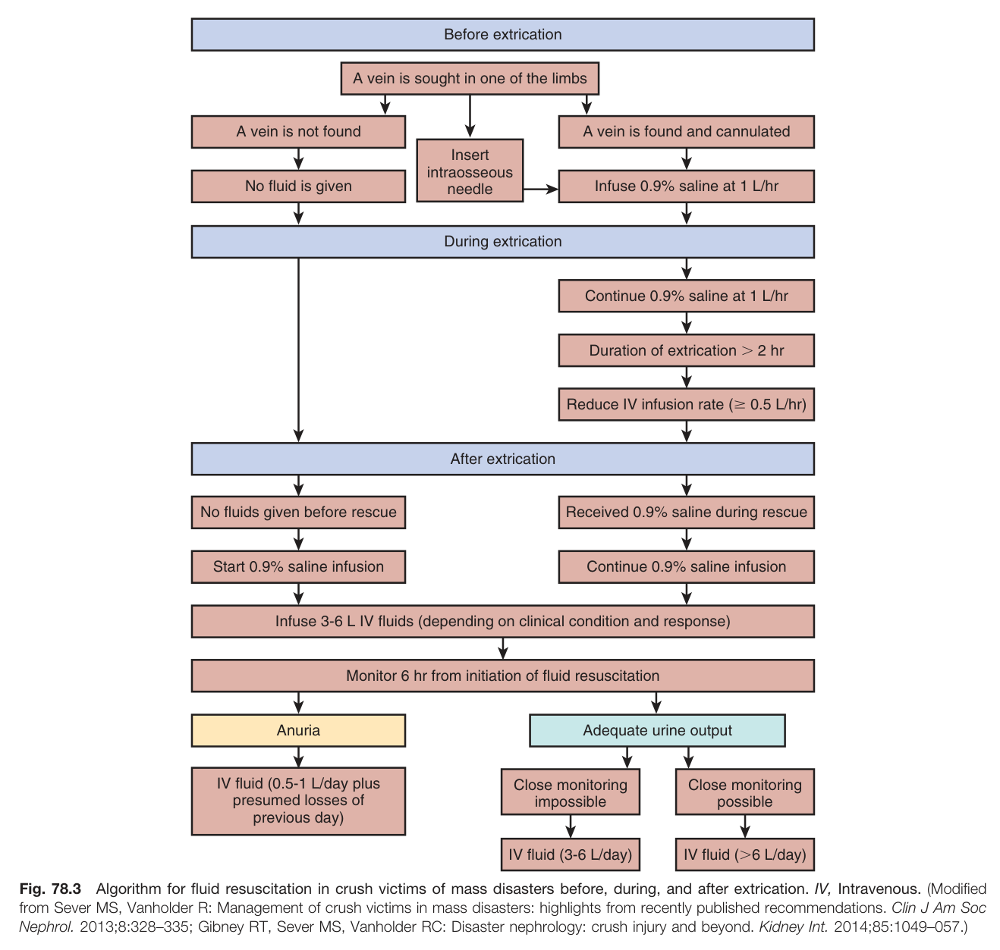

Fig. 78.3 Algorithm for fluid resuscitation in crush victims of mass disasters before, during, and after extrication. IV, Intravenous. (Modified from Sever MS, Vanholder R: Management of crush victims in mass disasters: highlights from recently published recommendations. Clin J Am Soc Nephrol. 2013;8:328-335; Gibney RT, Sever MS, Vanholder RC: Disaster nephrology: crush injury and beyond. Kidney Int. 2014;85:1049-057.)

---

### Fig_78_4

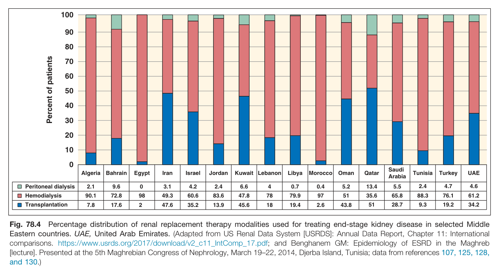

Fig. 78.4 Percentage distribution of renal replacement therapy modalities used for treating end-stage kidney disease in selected Middle Eastern countries. UAE, United Arab Emirates. (Adapted from US Renal Data System [USRDS]: Annual Data Report, Chapter 11: International comparisons. https://www.usrds.org/2017/download/v2_c11_IntComp_17.pdf; and Benghanem GM: Epidemiology of ESRD in the Maghreb [lecture]. Presented at the 5th Maghrebian Congress of Nephrology, March 19-22, 2014, Djerba Island, Tunisia; data from references 107, 125, 128, and 130.)

---

## Tables

### Table_78_1

#### Table Image

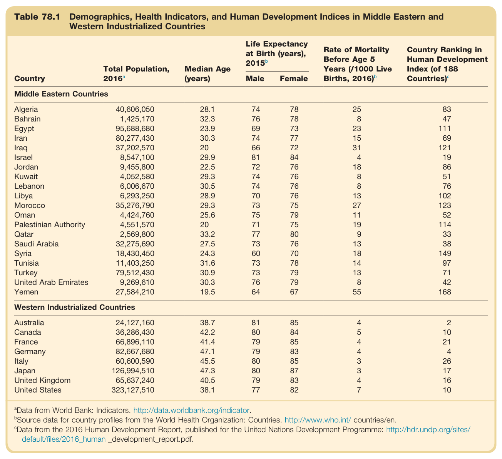

#### Table Data (CSV: [Table_78_1.csv](Table_78_1.csv))

```markdown
| Table Text (OCR) |
| :--- |
| Table 78.1 Demographics, Health Indicators, and Human Development Indices in Middle Eastern and Western Industrialized Countries Country  Total Population, 2016a  Median Age (years)  Life Expectancy at Birth (years), 2015b  Rate of Mortality Before Age 5 Years (/1000 Live Births, 2016)b  Country Ranking in Human Development Index (of 188 Countries)c    Male  Female    Middle Eastern Countries    Algeria  40,606,050  28.1  74  78  25  83    Bahrain  1,425,170  32.3  76  78  8  47    Egypt  95,688,680  23.9  69  73  23  111    Iran  80,277,430  30.3  74  77  15  69    Iraq  37,202,570  20  66  72  31  121    Israel  8,547,100  29.9  81  84  4  19    Jordan  9,455,800  22.5  72  76  18  86    Kuwait  4,052,580  29.3  74  76  8  51    Lebanon  6,006,670  30.5  74  76  8  76    Libya  6,293,250  28.9  70  76  13  102    Morocco  35,276,790  29.3  73  75  27  123    Oman  4,424,760  25.6  75  79  11  52    Palestinian Authority  4,551,570  20  71  75  19  114    Qatar  2,569,800  33.2  77  80  9  33    Saudi Arabia  32,275,690  27.5  73  76  13  38    Syria  18,430,450  24.3  60  70  18  149    Tunisia  11,403,250  31.6  73  78  14  97    Turkey  79,512,430  30.9  73  79  13  71    United Arab Emirates  9,269,610  30.3  76  79  8  42    Yemen  27,584,210  19.5  64  67  55  168    Western Industrialized Countries    Australia  24,127,160  38.7  81  85  4  2    Canada  36,286,430  42.2  80  84  5  10    France  66,896,110  41.4  79  85  4  21    Germany  82,667,680  47.1  79  83  4  4    Italy  60,600,590  45.5  80  85  3  26    Japan  126,994,510  47.3  80  87  3  17    United Kingdom  65,637,240  40.5  79  83  4  16    United States  323,127,510  38.1  77  82  7  10 <sup>a</sup>Data from World Bank: Indicators. http://data.worldbank.org/indicator. <sup>b</sup>Source data for country profiles from the World Health Organization: Countries. http://www.who.int/ countries/en. <sup>c</sup>Data from the 2016 Human Development Report, published for the United Nations Development Programme: http://hdr.undp.org/sites/ default/files/2016_human _development_report.pdf. |
```

Table 78.1 Demographics, Health Indicators, and Human Development Indices in Middle Eastern and Western Industrialized Countries | Country | Total Population, 2016a | Median Age (years) | Life Expectancy at Birth (years), 2015b | Rate of Mortality Before Age 5 Years (/1000 Live Births, 2016) | Country Ranking in Human Development Index (of 188 Countries)c | | :--- | :--- | :--- | :--- | :--- | :--- | | **Middle Eastern Countries** | | | **Male** | **Female** | | | | Algeria | 40,606,050 | 28.1 | 74 | 78 | 25 | 83 | | Bahrain | 1,425,170 | 32.3 | 76 | 78 | 8 | 47 | | Egypt | 95,688,680 | 23.9 | 69 | 73 | 23 | 111 | | Iran | 80,277,430 | 30.3 | 74 | 77 | 15 | 69 | | Iraq | 37,202,570 | 20 | 66 | 72 | 31 | 121 | | Israel | 8,547,100 | 29.9 | 81 | 84 | 4 | 19 | | Jordan | 9,455,800 | 22.5 | 72 | 76 | 18 | 86 | | Kuwait | 4,052,580 | 29.3 | 74 | 76 | 8 | 51 | | Lebanon | 6,006,670 | 30.5 | 74 | 76 | 8 | 76 | | Libya | 6,293,250 | 28.9 | 70 | 76 | 13 | 102 | | Morocco | 35,276,790 | 29.3 | 73 | 75 | 27 | 123 | | Oman | 4,424,760 | 25.6 | 75 | 79 | 11 | 52 | | Palestinian Authority | 4,551,570 | 20 | 71 | 75 | 19 | 114 | | Qatar | 2,569,800 | 33.2 | 77 | 80 | 9 | 33 | | Saudi Arabia | 32,275,690 | 27.5 | 73 | 76 | 13 | 38 | | Syria | 18,430,450 | 24.3 | 60 | 70 | 18 | 149 | | Tunisia | 11,403,250 | 31.6 | 73 | 78 | 14 | 97 | | Turkey | 79,512,430 | 30.9 | 73 | 79 | 13 | 71 | | United Arab Emirates | 9,269,610 | 30.3 | 76 | 79 | 8 | 42 | | Yemen | 27,584,210 | 19.5 | 64 | 67 | 55 | 168 | | **Western Industrialized Countries** | | | | | | | | Australia | 24,127,160 | 38.7 | 81 | 85 | 4 | 2 | | Canada | 36,286,430 | 42.2 | 80 | 84 | 5 | 10 | | France | 66,896,110 | 41.4 | 79 | 85 | 4 | 21 | | Germany | 82,667,680 | 47.1 | 79 | 83 | 4 | 4 | | Italy | 60,600,590 | 45.5 | 80 | 85 | 3 | 26 | | Japan | 126,994,510 | 47.3 | 80 | 87 | 3 | 17 | | United Kingdom | 65,637,240 | 40.5 | 79 | 83 | 4 | 16 | | United States | 323,127,510 | 38.1 | 77 | 82 | 7 | 10 | aData from World Bank: Indicators. http://data.worldbank.org/indicator. bSource data for country profiles from the World Health Organization: Countries. http://www.who.int/ countries/en. cData from the 2016 Human Development Report, published for the United Nations Development Programme: http://hdr.undp.org/sites/default/files/2016_human_development_report.pdf.

---

### Table_78_2

#### Table Image

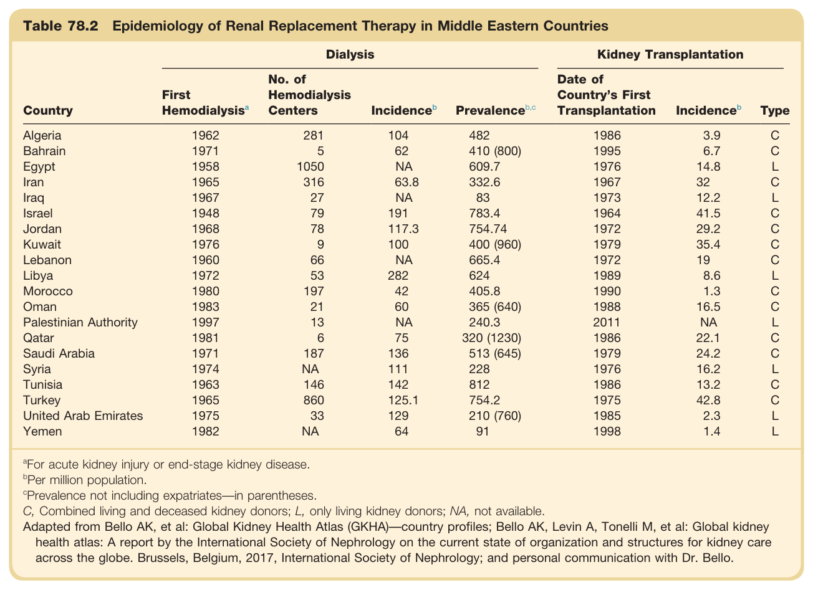

#### Table Data (CSV: [Table_78_2.csv](Table_78_2.csv))

```markdown
| Table Text (OCR) |
| :--- |
| Table 78.2 Epidemiology of Renal Replacement Therapy in Middle Eastern Countries Country  Dialysis  Kidney Transplantation    First Hemodialysisa  No. of Hemodialysis Centers  Incidenceb  Prevalenceb,c  Date of Country's First Transplantation  Incidenceb  Type    Algeria  1962  281  104  482  1986  3.9  C    Bahrain  1971  5  62  410 (800)  1995  6.7  C    Egypt  1958  1050  NA  609.7  1976  14.8  L    Iran  1965  316  63.8  332.6  1967  32  C    Iraq  1967  27  NA  83  1973  12.2  L    Israel  1948  79  191  783.4  1964  41.5  C    Jordan  1968  78  117.3  754.74  1972  29.2  C    Kuwait  1976  9  100  400 (960)  1979  35.4  C    Lebanon  1960  66  NA  665.4  1972  19  C    Libya  1972  53  282  624  1989  8.6  L    Morocco  1980  197  42  405.8  1990  1.3  C    Oman  1983  21  60  365 (640)  1988  16.5  C    Palestinian Authority  1997  13  NA  240.3  2011  NA  L    Qatar  1981  6  75  320 (1230)  1986  22.1  C    Saudi Arabia  1971  187  136  513 (645)  1979  24.2  C    Syria  1974  NA  111  228  1976  16.2  L    Tunisia  1963  146  142  812  1986  13.2  C    Turkey  1965  860  125.1  754.2  1975  42.8  C    United Arab Emirates  1975  33  129  210 (760)  1985  2.3  L    Yemen  1982  NA  64  91  1998  1.4  L <sup>a</sup>For acute kidney injury or end-stage kidney disease. <sup>b</sup>Per million population. <sup>c</sup>Prevalence not including expatriates—in parentheses. C, Combined living and deceased kidney donors; L, only living kidney donors; NA, not available. Adapted from Bello AK, et al: Global Kidney Health Atlas (GKHA)—country profiles; Bello AK, Levin A, Tonelli M, et al: Global kidney health atlas: A report by the International Society of Nephrology on the current state of organization and structures for kidney care across the globe. Brussels, Belgium, 2017, International Society of Nephrology; and personal communication with Dr. Bello. |
```

Table 78.2 Epidemiology of Renal Replacement Therapy in Middle Eastern Countries | Country | First Hemodialysisª | No. of Hemodialysis Centers | Dialysis Incidenceb | Dialysis Prevalenceb,c | Date of Country's First Transplantation | Kidney Transplantation Incidenceb | Kidney Transplantation Type | | :--- | :--- | :--- | :--- | :--- | :--- | :--- | :--- | | Algeria | 1962 | 281 | 104 | 482 | 1986 | 3.9 | C | | Bahrain | 1971 | 5 | 62 | 410 (800) | 1995 | 6.7 | C | | Egypt | 1958 | 1050 | NA | 609.7 | 1976 | 14.8 | L | | Iran | 1965 | 316 | 63.8 | 332.6 | 1967 | 32 | C | | Iraq | 1967 | 27 | NA | 83 | 1973 | 12.2 | L | | Israel | 1948 | 79 | 191 | 783.4 | 1964 | 41.5 | C | | Jordan | 1968 | 78 | 117.3 | 754.74 | 1972 | 29.2 | C | | Kuwait | 1976 | 9 | 100 | 400 (960) | 1979 | 35.4 | C | | Lebanon | 1960 | 66 | NA | 665.4 | 1972 | 19 | C | | Libya | 1972 | 53 | 282 | 624 | 1989 | 8.6 | L | | Morocco | 1980 | 197 | 42 | 405.8 | 1990 | 1.3 | C | | Oman | 1983 | 21 | 60 | 365 (640) | 1988 | 16.5 | C | | Palestinian Authority | 1997 | 13 | NA | 240.3 | 2011 | NA | L | | Qatar | 1981 | 6 | 75 | 320 (1230) | 1986 | 22.1 | C | | Saudi Arabia | 1971 | 187 | 136 | 513 (645) | 1979 | 24.2 | C | | Syria | 1974 | NA | 111 | 228 | 1976 | 16.2 | L | | Tunisia | 1963 | 146 | 142 | 812 | 1986 | 13.2 | C | | Turkey | 1965 | 860 | 125.1 | 754.2 | 1975 | 42.8 | C | | United Arab Emirates | 1975 | 33 | 129 | 210 (760) | 1985 | 2.3 | L | | Yemen | 1982 | NA | 64 | 91 | 1998 | 1.4 | L | For acute kidney injury or end-stage kidney disease. bPer million population. cPrevalence not including expatriates-in parentheses. C, Combined living and deceased kidney donors; L, only living kidney donors; NA, not available. Adapted from Bello AK, et al: Global Kidney Health Atlas (GKHA)-country profiles; Bello AK, Levin A, Tonelli M, et al: Global kidney health atlas: A report by the International Society of Nephrology on the current state of organization and structures for kidney care across the globe. Brussels, Belgium, 2017, International Society of Nephrology; and personal communication with Dr. Bello.

---

### Table_78_3

#### Table Image

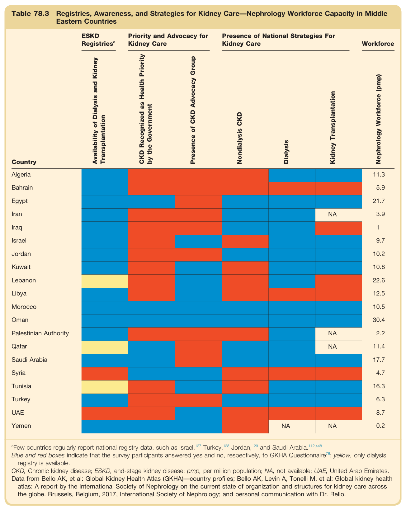

#### Table Data (CSV: [Table_78_3.csv](Table_78_3.csv))

```markdown
| Table Text (OCR) |
| :--- |
| Table 78.3 Registries, Awareness, and Strategies for Kidney Care—Nephrology Workforce Capacity in Middle Eastern Countries Country  ESKD Registriesa  Priority and Advocacy for Kidney Care  Presence of National Strategies For Kidney Care  Workforce    Availability of Dialysis and Kidney Transplantation  CKD Recognized as Health Priority by the Government  Presence of CKD Advocacy Group  Nondialysis CKD  Dialysis  Kidney Transplantation  Nephrology Workforce (pmp)    Algeria              11.3    Bahrain              5.9    Egypt              21.7    Iran            NA  3.9    Iraq              1    Israel              9.7    Jordan              10.2    Kuwait              10.8    Lebanon              22.6    Libya              12.5    Morocco              10.5    Oman              30.4    Palestinian Authority            NA  2.2    Qatar            NA  11.4    Saudi Arabia              17.7    Syria              4.7    Tunisia              16.3    Turkey              6.3    UAE              8.7    Yemen          NA  NA  0.2 <sup>a</sup>Few countries regularly report national registry data, such as Israel,<sup>127</sup> Turkey,<sup>128</sup> Jordan,<sup>129</sup> and Saudi Arabia.<sup>112,448</sup> Blue and red boxes indicate that the survey participants answered yes and no, respectively, to GKHA Questionnaire<sup>76</sup>; yellow, only dialysis registry is available. CKD, Chronic kidney disease; ESKD, end-stage kidney disease; pmp, per million population; NA, not available; UAE, United Arab Emirates. Data from Bello AK, et al: Global Kidney Health Atlas (GKHA)—country profiles; Bello AK, Levin A, Tonelli M, et al: Global kidney health atlas: A report by the International Society of Nephrology on the current state of organization and structures for kidney care across the globe. Brussels, Belgium, 2017, International Society of Nephrology; and personal communication with Dr. Bello. |
```

Table 78.3 Registries, Awareness, and Strategies for Kidney Care—Nephrology Workforce Capacity in Middle Eastern Countries This table shows a grid of Middle Eastern countries against various metrics for kidney care, including ESKD registries, priority and advocacy for kidney care, presence of national strategies, and nephrology workforce capacity. The data is represented by colored boxes (blue for yes, red for no, yellow for partial) indicating the status of each metric in each country.

---

### Table_78_4

#### Table Image

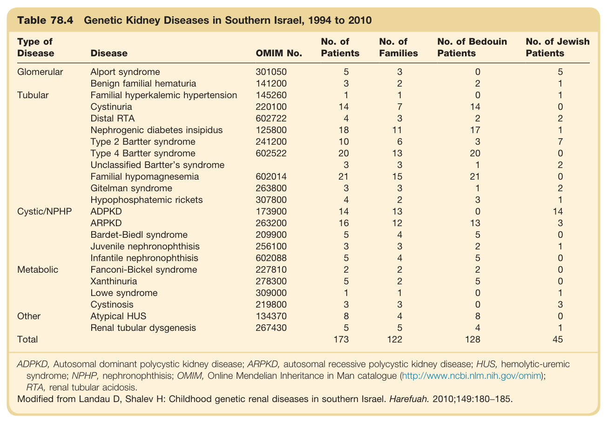

#### Table Data (CSV: [Table_78_4.csv](Table_78_4.csv))

```markdown
| Table Text (OCR) |
| :--- |
| Table 78.4 Genetic Kidney Diseases in Southern Israel, 1994 to 2010 Type of Disease  Disease  OMIM No.  No. of Patients  No. of Families  No. of Bedouin Patients  No. of Jewish Patients    Glomerular  Alport syndrome  301050  5  3  0  5    Benign familial hematuria  141200  3  2  2  1    Tubular  Familial hyperkalemic hypertension  145260  1  1  0  1    Cystinuria  220100  14  7  14  0    Distal RTA  602722  4  3  2  2    Nephrogenic diabetes insipidus  125800  18  11  17  1    Type 2 Bartter syndrome  241200  10  6  3  7    Type 4 Bartter syndrome  602522  20  13  20  0    Unclassified Bartter's syndrome    3  3  1  2    Familial hypomagnesemia  602014  21  15  21  0    Gitelman syndrome  263800  3  3  1  2    Hypophosphatemic rickets  307800  4  2  3  1    Cystic/NPHP  ADPKD  173900  14  13  0  14    ARPKD  263200  16  12  13  3    Bardet-Biedl syndrome  209900  5  4  5  0    Juvenile nephronophthisis  256100  3  3  2  1    Infantile nephronophthisis  602088  5  4  5  0    Metabolic  Fanconi-Bickel syndrome  227810  2  2  2  0    Xanthinuria  278300  5  2  5  0    Lowe syndrome  309000  1  1  0  1    Cystinosis  219800  3  3  0  3    Other  Atypical HUS  134370  8  4  8  0    Renal tubular dysgenesis  267430  5  5  4  1    Total      173  122  128  45 ADPKD, Autosomal dominant polycystic kidney disease; ARPKD, autosomal recessive polycystic kidney disease; HUS, hemolytic-uremic syndrome; NPHP, nephronophthisis; OMIM, Online Mendelian Inheritance in Man catalogue (http://www.ncbi.nlm.nih.gov/omim); RTA, renal tubular acidosis. Modified from Landau D, Shalev H: Childhood genetic renal diseases in southern Israel. Harefuah. 2010;149:180−185. |
```

Table 78.4 Genetic Kidney Diseases in Southern Israel, 1994 to 2010 | Type of Disease | Disease | OMIM No. | No. of Patients | No. of Families | No. of Bedouin Patients | No. of Jewish Patients | | :--- | :--- | :--- | :--- | :--- | :--- | :--- | | Glomerular | Alport syndrome | 301050 | 5 | 3 | 0 | 5 | | | Benign familial hematuria | 141200 | 3 | 2 | 2 | 1 | | Tubular | Familial hyperkalemic hypertension | 145260 | 1 | 1 | 0 | 1 | | | Cystinuria | 220100 | 14 | 7 | 14 | 0 | | | Distal RTA | 602722 | 4 | 3 | 2 | 2 | | | Nephrogenic diabetes insipidus | 125800 | 18 | 11 | 17 | 1 | | | Type 2 Bartter syndrome | 241200 | 10 | 6 | 3 | 7 | | | Type 4 Bartter syndrome | 602522 | 20 | 13 | 20 | 0 | | | Unclassified Bartter's syndrome | | 3 | 3 | 1 | 2 | | | Familial hypomagnesemia | 602014 | 21 | 15 | 21 | 0 | | | Gitelman syndrome | 263800 | 3 | 3 | 1 | 2 | | | Hypophosphatemic rickets | 307800 | 4 | 2 | 3 | 1 | | Cystic/NPHP | ADPKD | 173900 | 14 | 13 | 0 | 14 | | | ARPKD | 263200 | 16 | 12 | 13 | 3 | | | Bardet-Biedl syndrome | 209900 | 5 | 4 | 5 | 0 | | | Juvenile nephronophthisis | 256100 | 3 | 3 | 2 | 1 | | | Infantile nephronophthisis | 602088 | 5 | 4 | 5 | 0 | | Metabolic | Fanconi-Bickel syndrome | 227810 | 2 | 2 | 2 | 0 | | | Xanthinuria | 278300 | 5 | 2 | 5 | 0 | | | Lowe syndrome | 309000 | 1 | 1 | 0 | 1 | | | Cystinosis | 219800 | 3 | 3 | 0 | 3 | | Other | Atypical HUS | 134370 | 8 | 4 | 8 | 0 | | | Renal tubular dysgenesis | 267430 | 5 | 5 | 4 | 1 | | Total | | | 173 | 122 | 128 | 45 | ADPKD, Autosomal dominant polycystic kidney disease; ARPKD, autosomal recessive polycystic kidney disease; HUS, hemolytic-uremic syndrome; NPHP, nephronophthisis; OMIM, Online Mendelian Inheritance in Man catalogue (http://www.ncbi.nlm.nih.gov/omim); RTA, renal tubular acidosis. Modified from Landau D, Shalev H: Childhood genetic renal diseases in southern Israel. Harefuah. 2010;149:180-185.

---

### Table_78_5

#### Table Image

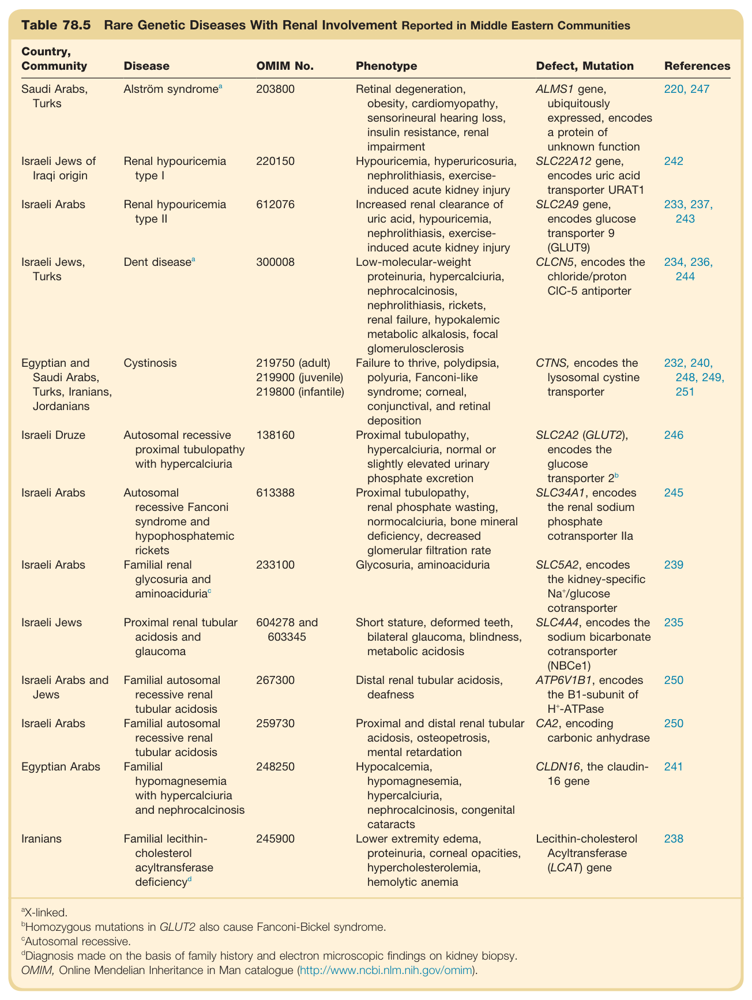

#### Table Data (CSV: [Table_78_5.csv](Table_78_5.csv))

```markdown
| Table Text (OCR) |
| :--- |
| Table 78.5 Rare Genetic Diseases With Renal Involvement Reported in Middle Eastern Communities Country, Community  Disease  OMIM No.  Phenotype  Defect, Mutation  References    Saudi Arabs, Turks   Alström\ syndrome^a   203800  Retinal degeneration, obesity, cardiomyopathy, sensorineural hearing loss, insulin resistance, renal impairment  ALMS1 gene, ubiquitously expressed, encodes a protein of unknown function  220, 247    Israeli Jews of Iraqi origin  Renal hypouricemia type I  220150  Hypouricemia, hyperuricosuria, nephrolithiasis, exercise-induced acute kidney injury  SLC22A12 gene, encodes uric acid transporter URAT1  242    Israeli Arabs  Renal hypouricemia type II  612076  Increased renal clearance of uric acid, hypouricemia, nephrolithiasis, exercise-induced acute kidney injury  SLC2A9 gene, encodes glucose transporter 9 (GLUT9)  233, 237, 243    Israeli Jews, Turks   Dent\ disease^a   300008  Low-molecular-weight proteinuria, hypercalciuria, nephrocalcinosis, nephrolithiasis, rickets, renal failure, hypokalemic metabolic alkalosis, focal glomerulosclerosis  CLCN5, encodes the chloride/proton CIC-5 antiporter  234, 236, 244    Egyptian and Saudi Arabs, Turks, Iranians, Jordanians  Cystinosis  219750 (adult)219900 (juvenile)219800 (infantile)  Failure to thrive, polydipsia, polyuria, Fanconi-like syndrome; corneal, conjunctival, and retinal deposition  CTNS, encodes the lysosomal cystine transporter  232, 240, 248, 249, 251    Israeli Druze  Autosomal recessive proximal tubulopathy with hypercalciuria  138160  Proximal tubulopathy, hypercalciuria, normal or slightly elevated urinary phosphate excretion  SLC2A2 (GLUT2), encodes the glucose transporter  2^b   246    Israeli Arabs  Autosomal recessive Fanconi syndrome and hypophosphatemic rickets  613388  Proximal tubulopathy, renal phosphate wasting, normocalciuria, bone mineral deficiency, decreased glomerular filtration rate  SLC34A1, encodes the renal sodium phosphate cotransporter IIa  245    Israeli Arabs  Familial renal glycosuria and aminoaciduriac  233100  Glycosuria, aminoaciduria  SLC5A2, encodes the kidney-specific  Na^+ /glucose cotransporter  239    Israeli Jews  Proximal renal tubular acidosis and glaucoma  604278 and 603345  Short stature, deformed teeth, bilateral glaucoma, blindness, metabolic acidosis  SLC4A4, encodes the sodium bicarbonate cotransporter (NBCe1)  235    Israeli Arabs and Jews  Familial autosomal recessive renal tubular acidosis  267300  Distal renal tubular acidosis, deafness  ATP6V1B1, encodes the B1-subunit of  H^+ -ATPase  250    Israeli Arabs  Familial autosomal recessive renal tubular acidosis  259730  Proximal and distal renal tubular acidosis, osteopetrosis, mental retardation  CA2, encoding carbonic anhydrase  250    Egyptian Arabs  Familial hypomagnesemia with hypercalciuria and nephrocalcinosis  248250  Hypocalcemia, hypomagnesemia, hypercalciuria, nephrocalcinosis, congenital cataracts  CLDN16, the claudin-16 gene  241    Iranians  Familial lecithin-cholesterol acyltransferase  deficiency^d   245900  Lower extremity edema, proteinuria, corneal opacities, hypercholesterolemia, hemolytic anemia  Lecithin-cholesterol Acyltransferase (LCAT) gene  238 <sup>a</sup>X-linked. <sup>b</sup>Homozygous mutations in GLUT2 also cause Fanconi-Bickel syndrome. <sup>c</sup>Autosomal recessive. <sup>d</sup>Diagnosis made on the basis of family history and electron microscopic findings on kidney biopsy. OMIM, Online Mendelian Inheritance in Man catalogue (http://www.ncbi.nlm.nih.gov/omim). |
```

Table 78.5 Rare Genetic Diseases With Renal Involvement Reported in Middle Eastern Communities | Country, Community | Disease | OMIM No. | Phenotype | Defect, Mutation | References | | :--- | :--- | :--- | :--- | :--- | :--- | | Saudi Arabs, Turks | Alström syndromea | 203800 | Retinal degeneration, obesity, cardiomyopathy, sensorineural hearing loss, insulin resistance, renal impairment | ALMS1 gene, ubiquitously expressed, encodes a protein of unknown function | 220, 247 | | Israeli Jews of Iraqi origin | Renal hypouricemia type I | 220150 | Hypouricemia, hyperuricosuria, nephrolithiasis, exercise-induced acute kidney injury | SLC22A12 gene, encodes uric acid transporter URAT1 | 242 | | Israeli Arabs | Renal hypouricemia type II | 612076 | Increased renal clearance of uric acid, hypouricemia, nephrolithiasis, exercise-induced acute kidney injury | SLC2A9 gene, encodes glucose transporter 9 (GLUT9) | 233, 237, 243 | | Israeli Jews, Turks | Dent diseasea | 300008 | Low-molecular-weight proteinuria, hypercalciuria, nephrocalcinosis, nephrolithiasis, rickets, renal failure, hypokalemic metabolic alkalosis, focal glomerulosclerosis | CLCN5, encodes the chloride/proton CIC-5 antiporter | 234, 236, 244 | | Egyptian and Saudi Arabs, Turks, Iranians, Jordanians | Cystinosis | 219750 (adult), 219900 (juvenile), 219800 (infantile) | Failure to thrive, polydipsia, polyuria, Fanconi-like syndrome; corneal, conjunctival, and retinal deposition | CTNS, encodes the lysosomal cystine transporter | 232, 240, 248, 249, 251 | | Israeli Druze | Autosomal recessive proximal tubulopathy with hypercalciuria | 138160 | Proximal tubulopathy, hypercalciuria, normal or slightly elevated urinary phosphate excretion | SLC2A2 (GLUT2), encodes the glucose transporter 2b | 246 | | Israeli Arabs | Autosomal recessive Fanconi syndrome and hypophosphatemic rickets | 613388 | Proximal tubulopathy, renal phosphate wasting, normocalciuria, bone mineral deficiency, decreased glomerular filtration rate | SLC34A1, encodes the renal sodium phosphate cotransporter lla | 245 | | Israeli Arabs | Familial renal glycosuria and aminoaciduria | 233100 | Glycosuria, aminoaciduria | SLC5A2, encodes the kidney-specific Na+/glucose cotransporter | 239 | | Israeli Jews | Proximal renal tubular acidosis and glaucoma | 604278 and 603345 | Short stature, deformed teeth, bilateral glaucoma, blindness, metabolic acidosis | SLC4A4, encodes the sodium bicarbonate cotransporter (NBCe1) | 235 | | Israeli Arabs and Jews | Familial autosomal recessive renal tubular acidosis | 267300 | Distal renal tubular acidosis, deafness | ATP6V1B1, encodes the B1-subunit of H+-ATPase | 250 | | Israeli Arabs | Familial autosomal recessive renal tubular acidosis | 259730 | Proximal and distal renal tubular acidosis, osteopetrosis, mental retardation | CA2, encoding carbonic anhydrase | 250 | | Egyptian Arabs | Familial hypomagnesemia with hypercalciuria and nephrocalcinosis | 248250 | Hypocalcemia, hypomagnesemia, hypercalciuria, nephrocalcinosis, congenital cataracts | CLDN16, the claudin-16 gene | 241 | | Iranians | Familial lecithin-cholesterol acyltransferase deficiencyd | 245900 | Lower extremity edema, proteinuria, corneal opacities, hypercholesterolemia, hemolytic anemia | Lecithin-cholesterol Acyltransferase (LCAT) gene | 238 | @X-linked. Homozygous mutations in GLUT2 also cause Fanconi-Bickel syndrome. Autosomal recessive. Diagnosis made on the basis of family history and electron microscopic findings on kidney biopsy. OMIM, Online Mendelian Inheritance in Man catalogue (http://www.ncbi.nlm.nih.gov/omim).

---

### Table_78_6

#### Table Images (2 Parts)

- **Part 1 (Page 18)**:
  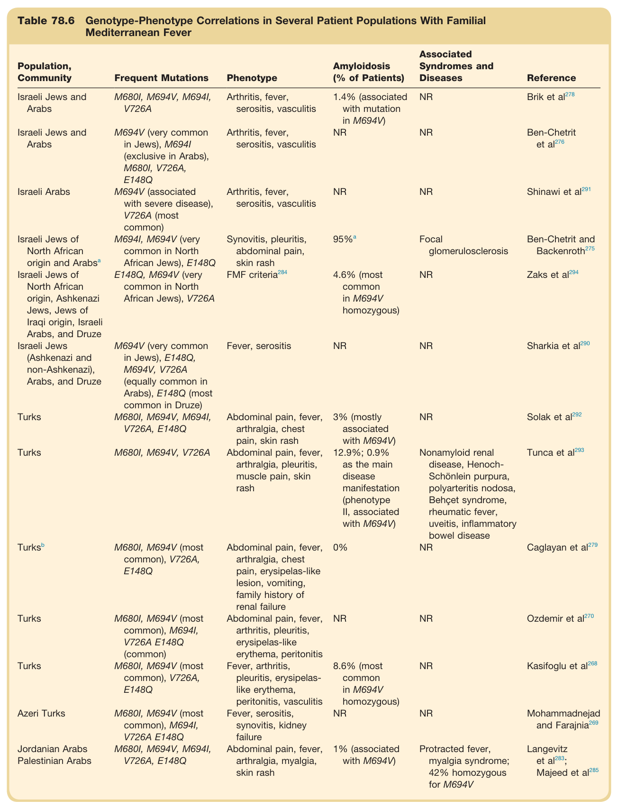

- **Part 2 (Page 19)**:
  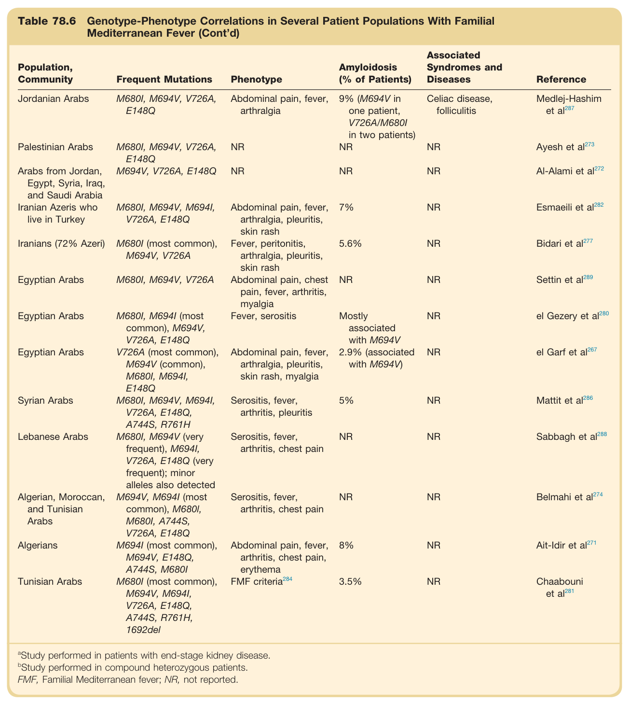

#### Table Data (CSV: [Table_78_6.csv](Table_78_6.csv))

```markdown
| Table Text (OCR) |
| :--- |
| Table 78.6 Genotype-Phenotype Correlations in Several Patient Populations With Familial Mediterranean Fever Population, Community  Frequent Mutations  Phenotype  Amyloidosis (% of Patients)  Associated Syndromes and Diseases  Reference    Israeli Jews and Arabs  M680I, M694V, M694I, V726A  Arthritis, fever, serositis, vasculitis  1.4% (associated with mutation in M694V)  NR  Brik et al278    Israeli Jews and Arabs  M694V (very common in Jews), M694I (exclusive in Arabs), M680I, V726A, E148Q  Arthritis, fever, serositis, vasculitis  NR  NR  Ben-Chetrit et al276    Israeli Arabs  M694V (associated with severe disease), V726A (most common)  Arthritis, fever, serositis, vasculitis  NR  NR  Shinawi et al291    Israeli Jews of North African origin and Arabsa  M694I, M694V (very common in North African Jews), E148Q  Synovitis, pleuritis, abdominal pain, skin rash   95\%^a   Focal glomerulosclerosis  Ben-Chetrit and Backenroth275    Israeli Jews of North African origin, Ashkenazi Jews, Jews of Iraqi origin, Israeli Arabs, and Druze  E148Q, M694V (very common in North African Jews), V726A  FMF  criteria^{284}   4.6% (most common in M694V homozygous)  NR  Zaks et al294    Israeli Jews (Ashkenazi and non-Ashkenazi), Arabs, and Druze  M694V (very common in Jews), E148Q, M694V, V726A (equally common in Arabs), E148Q (most common in Druze)  Fever, serositis  NR  NR  Sharkia et al290    Turks  M680I, M694V, M694I, V726A, E148Q  Abdominal pain, fever, arthralgia, chest pain, skin rash  3% (mostly associated with M694V)  NR  Solak et al292    Turks  M680I, M694V, V726A  Abdominal pain, fever, arthralgia, pleuritis, muscle pain, skin rash  12.9%; 0.9% as the main disease manifestation (phenotype II, associated with M694V)  Nonamyloid renal disease, Henoch-Schönlein purpura, polyarteritis nodosa, Behçet syndrome, rheumatic fever, uveitis, inflammatory bowel disease  Tunca et al293     Turks^b   M680I, M694V (most common), V726A, E148Q  Abdominal pain, fever, arthralgia, chest pain, erysipelas-like lesion, vomiting, family history of renal failure  0%  NR  Caglayan et al279    Turks  M680I, M694V (most common), M694I, V726A E148Q (common)  Abdominal pain, fever, arthritis, pleuritis, erysipelas-like erythema, peritonitis  NR  NR  Ozdemir et al270    Turks  M680I, M694V (most common), V726A, E148Q  Fever, arthritis, pleuritis, erysipelas-like erythema, peritonitis, vasculitis  8.6% (most common in M694V homozygous)  NR  Kasifoglu et al268    Azeri Turks  M680I, M694V (most common), M694I, V726A E148Q  Fever, serositis, synovitis, kidney failure  NR  NR  Mohammadnejad and Farajnia269    Jordanian Arabs  M680I, M694V, M694I, V726A, E148Q  Abdominal pain, fever, arthralgia, myalgia, skin rash  1% (associated with M694V)  Protracted fever, myalgia syndrome; 42% homozygous for M694V  Langevitz et al283; Majeed et al285    Jordanian Arabs  M680I, M694V, V726A, E148Q  Abdominal pain, fever, arthralgia  9% (M694V in one patient, V726A/M680I in two patients)  Celiac disease, folliculitis  Medlej-Hashim et al287    Palestinian Arabs  M680I, M694V, V726A, E148Q  NR  NR  NR  Ayesh et al273    Arabs from Jordan, Egypt, Syria, Iraq, and Saudi Arabia  M694V, V726A, E148Q  NR  NR  NR  Al-Alami et al272    Iranian Azeris who live in Turkey  M680I, M694V, M694I, V726A, E148Q  Abdominal pain, fever, arthralgia, pleuritis, skin rash  7%  NR  Esmaeili et al282    Iranians (72% Azeri)  M680I (most common), M694V, V726A  Fever, peritonitis, arthralgia, pleuritis, skin rash  5.6%  NR  Bidari et al277    Egyptian Arabs  M680I, M694V, V726A  Abdominal pain, chest pain, fever, arthritis, myalgia  NR  NR  Settin et al289    Egyptian Arabs  M680I, M694I (most common), M694V, V726A, E148Q  Fever, serositis  Mostly associated with M694V  NR  el Gezery et al280    Egyptian Arabs  V726A (most common), M694V (common), M680I, M694I, E148Q  Abdominal pain, fever, arthralgia, pleuritis, skin rash, myalgia  2.9% (associated with M694V)  NR  el Garf et al267    Syrian Arabs  M680I, M694V, M694I, V726A, E148Q, A744S, R761H  Serositis, fever, arthritis, pleuritis  5%  NR  Mattit et al286    Lebanese Arabs  M680I, M694V (very frequent), M694I, V726A, E148Q (very frequent); minor alleles also detected  Serositis, fever, arthritis, chest pain  NR  NR  Sabbagh et al288    Algerian, Moroccan, and Tunisian Arabs  M694V, M694I (most common), M680I, M680I, A744S, V726A, E148Q  Serositis, fever, arthritis, chest pain  NR  NR  Belmahi et al274    Algerians  M694I (most common), M694V, E148Q, A744S, M680I  Abdominal pain, fever, arthritis, chest pain, erythema  8%  NR  Ait-Idir et al271    Tunisian Arabs  M680I (most common), M694V, M694I, V726A, E148Q, A744S, R761H, 1692del  FMF criteria284  3.5%  NR  Chaabouni et al281 <sup>a</sup>Study performed in patients with end-stage kidney disease. <sup>b</sup>Study performed in compound heterozygous patients. FMF, Familial Mediterranean fever; NR, not reported. |
```

Table 78.6 Genotype-Phenotype Correlations in Several Patient Populations With Familial Mediterranean Fever This extensive table lists various populations in the Middle East, the frequent genetic mutations for Familial Mediterranean Fever found within them, the common phenotype, the percentage of patients who develop amyloidosis, and associated syndromes or diseases. It correlates specific mutations like M694V with disease severity and outcomes across Israeli Jews, Arabs, Turks, and other groups.

---
