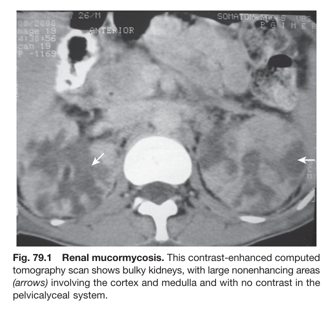
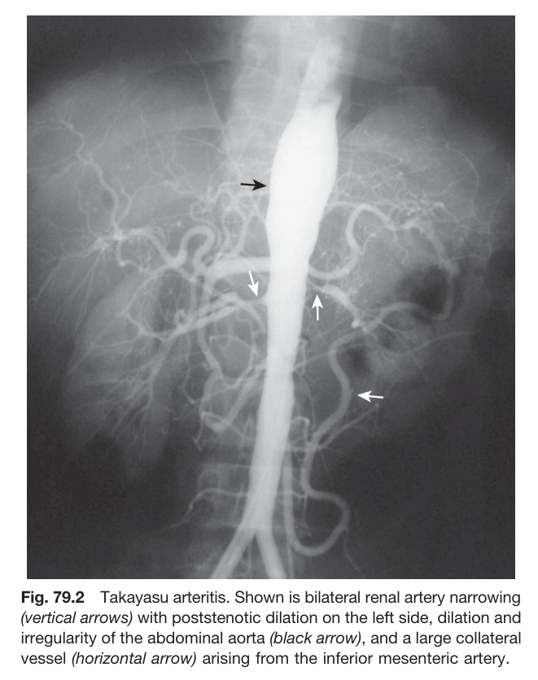
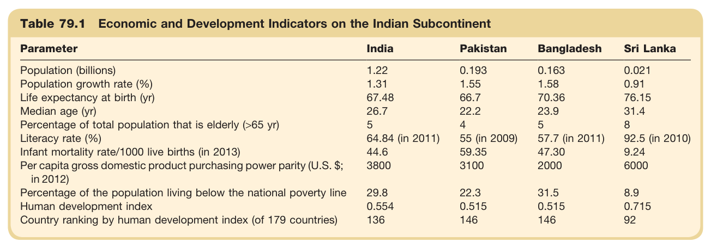
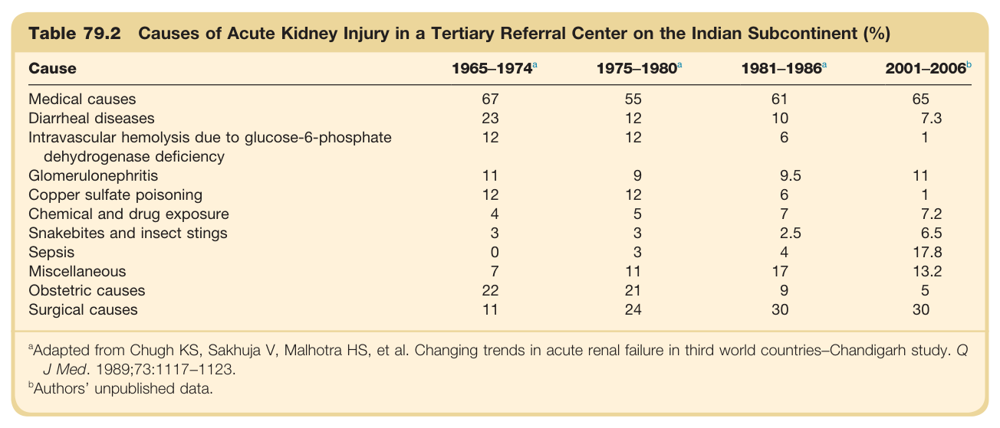
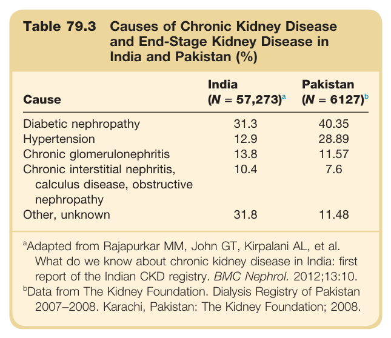
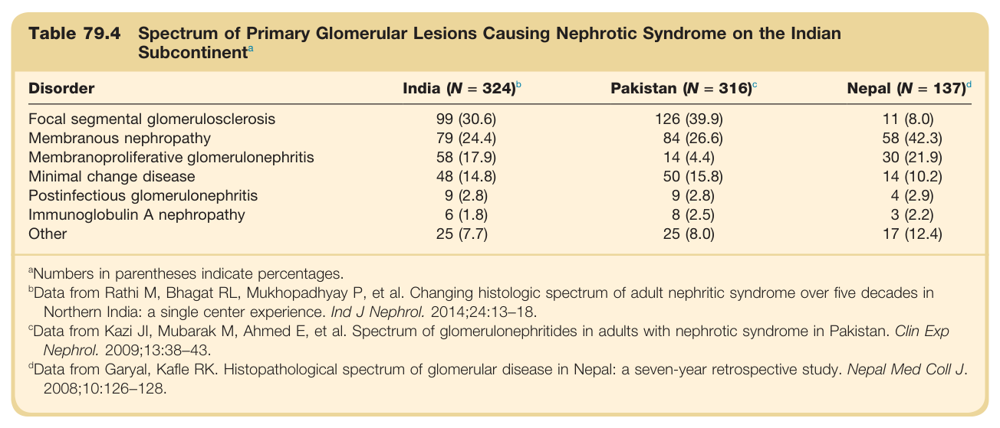

# 79. Indian Subcontinent - Figures and Tables Index

This document lists all figures and tables extracted from `79. Indian Subcontinent.pdf`.

## Table of Contents
- [Figures](#figures)
- [Tables](#tables)

---

## Figures

### Fig_79_1



Fig. 79.1 Renal mucormycosis. This contrast-enhanced computed tomography scan shows bulky kidneys, with large nonenhancing areas (arrows) involving the cortex and medulla and with no contrast in the pelvicalyceal system.

---

### Fig_79_2



Fig. 79.2 Takayasu arteritis. Shown is bilateral renal artery narrowing (vertical arrows) with poststenotic dilation on the left side, dilation and irregularity of the abdominal aorta (black arrow), and a large collateral vessel (horizontal arrow) arising from the inferior mesenteric artery.

---

## Tables

### Table_79_1

#### Table Image



#### Table Data (CSV: [Table_79_1.csv](Table_79_1.csv))

```markdown
| Table Text (OCR) |
| :--- |
| Table 79.1 Economic and Development Indicators on the Indian Subcontinent Parameter  India  Pakistan  Bangladesh  Sri Lanka    Population (billions)  1.22  0.193  0.163  0.021    Population growth rate (%)  1.31  1.55  1.58  0.91    Life expectancy at birth (yr)  67.48  66.7  70.36  76.15    Median age (yr)  26.7  22.2  23.9  31.4    Percentage of total population that is elderly (>65 yr)  5  4  5  8    Literacy rate (%)  64.84 (in 2011)  55 (in 2009)  57.7 (in 2011)  92.5 (in 2010)    Infant mortality rate/1000 live births (in 2013)  44.6  59.35  47.30  9.24    Per capita gross domestic product purchasing power parity (U.S. $; in 2012)  3800  3100  2000  6000    Percentage of the population living below the national poverty line  29.8  22.3  31.5  8.9    Human development index  0.554  0.515  0.515  0.715    Country ranking by human development index (of 179 countries)  136  146  146  92 |
```

Table 79.1 Economic and Development Indicators on the Indian Subcontinent | Parameter | India | Pakistan | Bangladesh | Sri Lanka | | :--- | :--- | :--- | :--- | :--- | | Population (billions) | 1.22 | 0.193 | 0.163 | 0.021 | | Population growth rate (%) | 1.31 | 1.55 | 1.58 | 0.91 | | Life expectancy at birth (yr) | 67.48 | 66.7 | 70.36 | 76.15 | | Median age (yr) | 26.7 | 22.2 | 23.9 | 31.4 | | Percentage of total population that is elderly (>65 yr) | 5 | 4 | 5 | 8 | | Literacy rate (%) | 64.84 (in 2011) | 55 (in 2009) | 57.7 (in 2011) | 92.5 (in 2010) | | Infant mortality rate/1000 live births (in 2013) | 44.6 | 59.35 | 47.30 | 9.24 | | Per capita gross domestic product purchasing power parity (U.S. $; in 2012) | 3800 | 3100 | 2000 | 6000 | | Percentage of the population living below the national poverty line | 29.8 | 22.3 | 31.5 | 8.9 | | Human development index | 0.554 | 0.515 | 0.515 | 0.715 | | Country ranking by human development index (of 179 countries) | 136 | 146 | 146 | 92 |

---

### Table_79_2

#### Table Image



#### Table Data (CSV: [Table_79_2.csv](Table_79_2.csv))

```markdown
| Table Text (OCR) |
| :--- |
| Table 79.2 Causes of Acute Kidney Injury in a Tertiary Referral Center on the Indian Subcontinent (%) Cause   1965-1974^a    1975-1980^a    1981-1986^a    2001-2006^b     Medical causes  67  55  61  65    Diarrheal diseases  23  12  10  7.3    Intravascular hemolysis due to glucose-6-phosphate dehydrogenase deficiency  12  12  6  1    Glomerulonephritis  11  9  9.5  11    Copper sulfate poisoning  12  12  6  1    Chemical and drug exposure  4  5  7  7.2    Snakebites and insect stings  3  3  2.5  6.5    Sepsis  0  3  4  17.8    Miscellaneous  7  11  17  13.2    Obstetric causes  22  21  9  5    Surgical causes  11  24  30  30 <sup>a</sup>Adapted from Chugh KS, Sakhuja V, Malhotra HS, et al. Changing trends in acute renal failure in third world countries−Chandigarh study. Q J Med. 1989;73:1117−1123. <sup>b</sup>Authors’ unpublished data. |
```

Table 79.2 Causes of Acute Kidney Injury in a Tertiary Referral Center on the Indian Subcontinent (%) | Cause | 1965-1974a | 1975-1980a | 1981-1986a | 2001-2006b | | :--- | :--- | :--- | :--- | :--- | | Medical causes | 67 | 55 | 61 | 65 | | Diarrheal diseases | 23 | 12 | 10 | 7.3 | | Intravascular hemolysis due to glucose-6-phosphate dehydrogenase deficiency | 12 | 12 | 6 | 1 | | Glomerulonephritis | 11 | 9 | 9.5 | 11 | | Copper sulfate poisoning | 12 | 12 | 6 | 1 | | Chemical and drug exposure | 4 | 5 | 7 | 7.2 | | Snakebites and insect stings | 3 | 3 | 2.5 | 6.5 | | Sepsis | 0 | 3 | 4 | 17.8 | | Miscellaneous | 7 | 11 | 17 | 13.2 | | Obstetric causes | 22 | 21 | 9 | 5 | | Surgical causes | 11 | 24 | 30 | 30 | Adapted from Chugh KS, Sakhuja V, Malhotra HS, et al. Changing trends in acute renal failure in third world countries-Chandigarh study. Q J Med. 1989;73:1117-1123. Authors' unpublished data.

---

### Table_79_3

#### Table Image



#### Table Data (CSV: [Table_79_3.csv](Table_79_3.csv))

```markdown
| Table Text (OCR) |
| :--- |
| Table 79.3 Causes of Chronic Kidney Disease and End-Stage Kidney Disease in India and Pakistan (%) Cause  India (N = 57,273)^a   Pakistan (N = 6127)^b     Diabetic nephropathy  31.3  40.35    Hypertension  12.9  28.89    Chronic glomerulonephritis  13.8  11.57    Chronic interstitial nephritis, calculus disease, obstructive nephropathy  10.4  7.6    Other, unknown  31.8  11.48 <sup>a</sup>Adapted from Rajapurkar MM, John GT, Kirpalani AL, et al. What do we know about chronic kidney disease in India: first report of the Indian CKD registry. BMC Nephrol. 2012;13:10. <sup>b</sup>Data from The Kidney Foundation. Dialysis Registry of Pakistan 2007−2008. Karachi, Pakistan: The Kidney Foundation; 2008. |
```

Table 79.3 Causes of Chronic Kidney Disease and End-Stage Kidney Disease in India and Pakistan (%) | Cause | India (N = 57,273)ª | Pakistan (N = 6127) | | :--- | :--- | :--- | | Diabetic nephropathy | 31.3 | 40.35 | | Hypertension | 12.9 | 28.89 | | Chronic glomerulonephritis | 13.8 | 11.57 | | Chronic interstitial nephritis, calculus disease, obstructive nephropathy | 10.4 | 7.6 | | Other, unknown | 31.8 | 11.48 | Adapted from Rajapurkar MM, John GT, Kirpalani AL, et al. What do we know about chronic kidney disease in India: first report of the Indian CKD registry. BMC Nephrol. 2012;13:10. Data from The Kidney Foundation. Dialysis Registry of Pakistan 2007-2008. Karachi, Pakistan: The Kidney Foundation; 2008.

---

### Table_79_4

#### Table Image



#### Table Data (CSV: [Table_79_4.csv](Table_79_4.csv))

```markdown
| Table Text (OCR) |
| :--- |
| Table 79.4 Spectrum of Primary Glomerular Lesions Causing Nephrotic Syndrome on the Indian Subcontinent<sup>a</sup> Disorder  India (N = 324)b  Pakistan (N = 316)c  Nepal (N = 137)d    Focal segmental glomerulosclerosis  99 (30.6)  126 (39.9)  11 (8.0)    Membranous nephropathy  79 (24.4)  84 (26.6)  58 (42.3)    Membranoproliferative glomerulonephritis  58 (17.9)  14 (4.4)  30 (21.9)    Minimal change disease  48 (14.8)  50 (15.8)  14 (10.2)    Postinfectious glomerulonephritis  9 (2.8)  9 (2.8)  4 (2.9)    Immunoglobulin A nephropathy  6 (1.8)  8 (2.5)  3 (2.2)    Other  25 (7.7)  25 (8.0)  17 (12.4) <sup>a</sup>Numbers in parentheses indicate percentages. <sup>b</sup>Data from Rathi M, Bhagat RL, Mukhopadhyay P, et al. Changing histologic spectrum of adult nephritic syndrome over five decades in Northern India: a single center experience. Ind J Nephrol. 2014;24:13−18 <sup>c</sup>Data from Kazi JI, Mubarak M, Ahmed E, et al. Spectrum of glomerulonephritides in adults with nephrotic syndrome in Pakistan. Clin Exp Nephrol. 2009;13:38−43. <sup>d</sup>Data from Garyal, Kafle RK. Histopathological spectrum of glomerular disease in Nepal: a seven-year retrospective study. Nepal Med Coll J. 2008;10:126−128. |
```

Table 79.4 Spectrum of Primary Glomerular Lesions Causing Nephrotic Syndrome on the Indian Subcontinent | Disorder | India (N = 324) | Pakistan (N = 316) | Nepal (N = 137)d | | :--- | :--- | :--- | :--- | | Focal segmental glomerulosclerosis | 99 (30.6) | 126 (39.9) | 11 (8.0) | | Membranous nephropathy | 79 (24.4) | 84 (26.6) | 58 (42.3) | | Membranoproliferative glomerulonephritis | 58 (17.9) | 14 (4.4) | 30 (21.9) | | Minimal change disease | 48 (14.8) | 50 (15.8) | 14 (10.2) | | Postinfectious glomerulonephritis | 9 (2.8) | 9 (2.8) | 4 (2.9) | | Immunoglobulin A nephropathy | 6 (1.8) | 8 (2.5) | 3 (2.2) | | Other | 25 (7.7) | 25 (8.0) | 17 (12.4) | *Numbers in parentheses indicate percentages. Data from Rathi M, Bhagat RL, Mukhopadhyay P, et al. Changing histologic spectrum of adult nephritic syndrome over five decades in Northern India: a single center experience. Ind J Nephrol. 2014;24:13-18. Data from Kazi JI, Mubarak M, Ahmed E, et al. Spectrum of glomerulonephritides in adults with nephrotic syndrome in Pakistan. Clin Exp Nephrol. 2009;13:38-43. Data from Garyal, Kafle RK. Histopathological spectrum of glomerular disease in Nepal: a seven-year retrospective study. Nepal Med Coll J. 2008;10:126-128.

---
