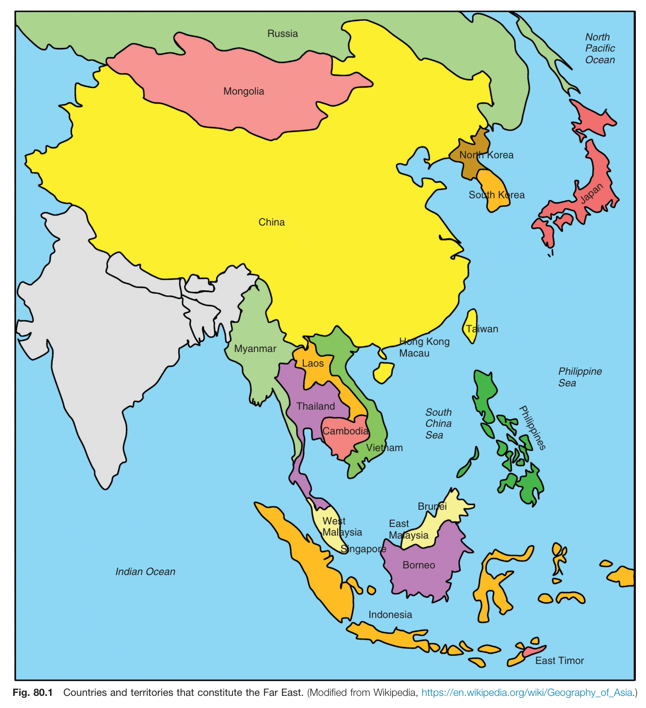
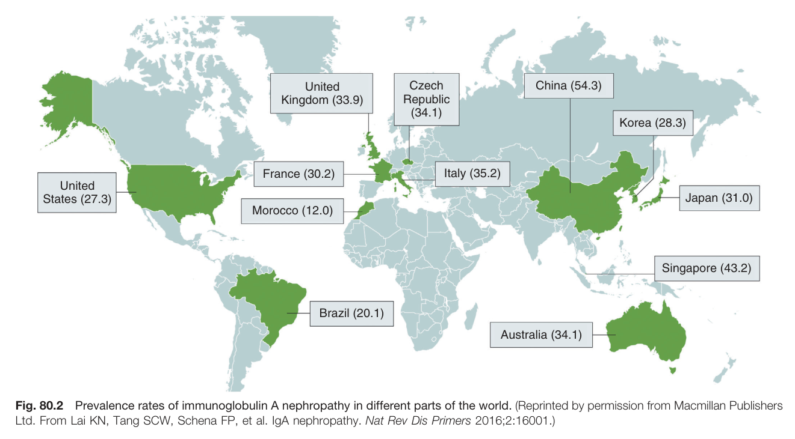
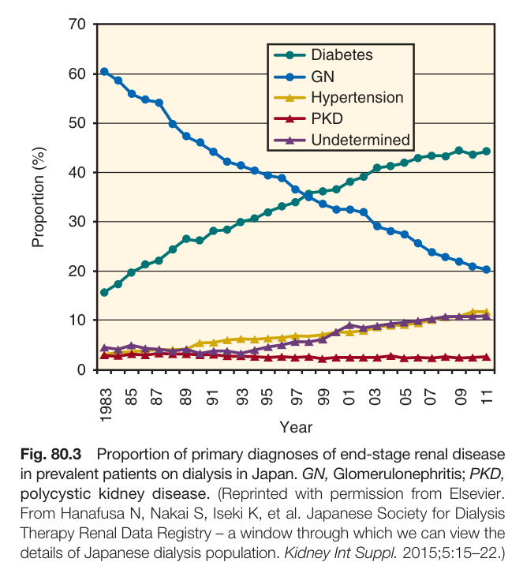
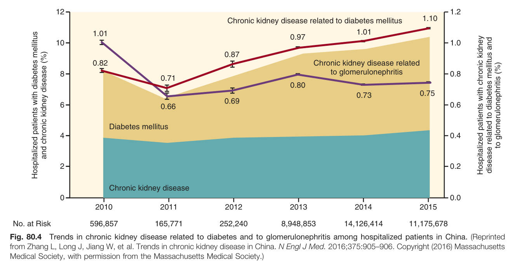
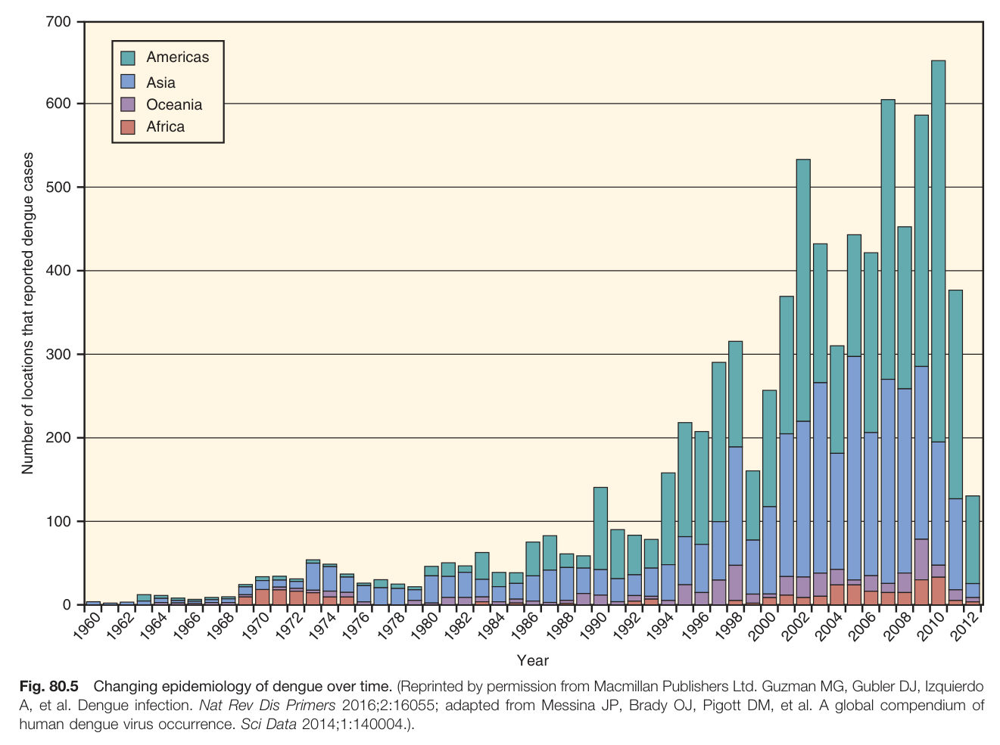
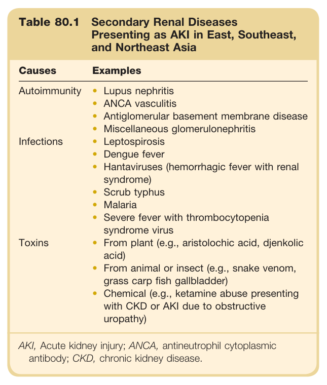
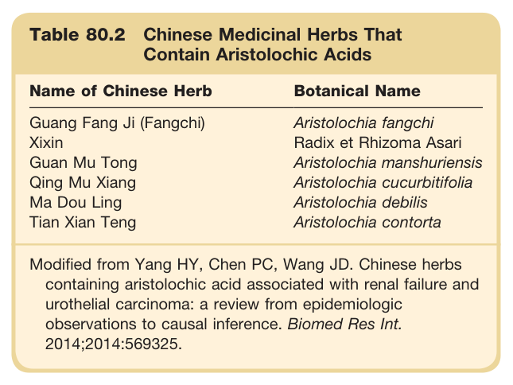
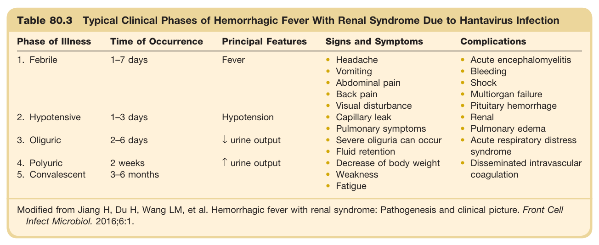
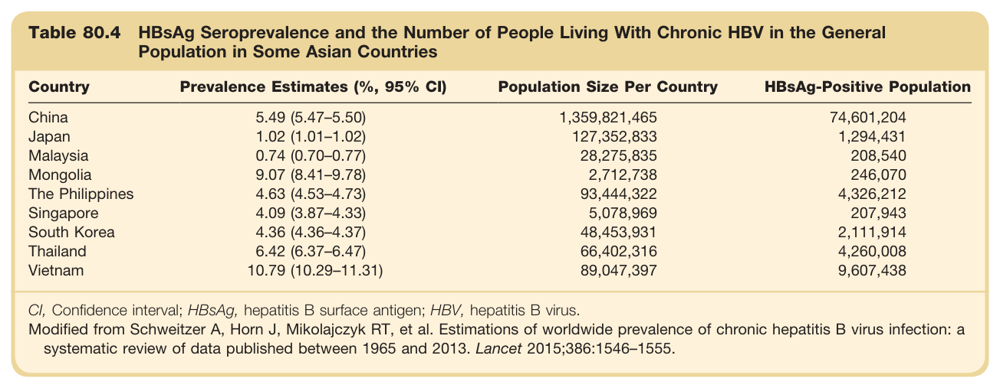

# 80. The Far East - Figures and Tables Index

This document lists all figures and tables extracted from `80. The Far East.pdf`.

## Table of Contents
- [Figures](#figures)
- [Tables](#tables)

---

## Figures

### Fig_80_1



Fig. 80.1 Countries and territories that constitute the Far East. (Modified from Wikipedia, https://en.wikipedia.org/wiki/Geography_of_Asia.)

---

### Fig_80_2



Fig. 80.2 Prevalence rates of immunoglobulin A nephropathy in different parts of the world. (Reprinted by permission from Macmillan Publishers Ltd. From Lai KN, Tang SCW, Schena FP, et al. IgA nephropathy. Nat Rev Dis Primers 2016;2:16001.)

---

### Fig_80_3



Fig. 80.3 Proportion of primary diagnoses of end-stage renal disease in prevalent patients on dialysis in Japan. GN, Glomerulonephritis; PKD, polycystic kidney disease. (Reprinted with permission from Elsevier. From Hanafusa N, Nakai S, Iseki K, et al. Japanese Society for Dialysis Therapy Renal Data Registry – a window through which we can view the details of Japanese dialysis population. Kidney Int Suppl. 2015;5:15-22.)

---

### Fig_80_4



Fig. 80.4 Trends in chronic kidney disease related to diabetes and to glomerulonephritis among hospitalized patients in China. (Reprinted from Zhang L, Long J, Jiang W, et al. Trends in chronic kidney disease in China. N Engl J Med. 2016;375:905-906. Copyright (2016) Massachusetts Medical Society, with permission from the Massachusetts Medical Society.)

---

### Fig_80_5



Fig. 80.5 Changing epidemiology of dengue over time. (Reprinted by permission from Macmillan Publishers Ltd. Guzman MG, Gubler DJ, Izquierdo A, et al. Dengue infection. Nat Rev Dis Primers 2016;2:16055; adapted from Messina JP, Brady OJ, Pigott DM, et al. A global compendium of human dengue virus occurrence. Sci Data 2014;1:140004.).

---

## Tables

### Table_80_1

#### Table Image



#### Table Data (CSV: [Table_80_1.csv](Table_80_1.csv))

```markdown
| Table Text (OCR) |
| :--- |
| Table 80.1 Secondary Renal Diseases Presenting as AKI in East, Southeast, and Northeast Asia Causes  Examples    Autoimmunity  Lupus nephritisANCA vasculitisAntiglomerular basement membrane diseaseMiscellaneous glomerulonephritis    Infections  LeptospirosisDengue feverHantaviruses (hemorrhagic fever with renal syndrome)Scrub typhusMalariaSevere fever with thrombocytopenia syndrome virus    Toxins  From plant (e.g., aristolochic acid, djenkolic acid)From animal or insect (e.g., snake venom, grass carp fish gallbladder)Chemical (e.g., ketamine abuse presenting with CKD or AKI due to obstructive uropathy) AKI, Acute kidney injury; ANCA, antineutrophil cytoplasmic antibody; CKD, chronic kidney disease. |
```

Table 80.1 Secondary Renal Diseases Presenting as AKI in East, Southeast, and Northeast Asia | Causes | Examples | | :--- | :--- | | Autoimmunity | • Lupus nephritis<br>• ANCA vasculitis<br>• Antiglomerular basement membrane disease<br>• Miscellaneous glomerulonephritis | | Infections | • Leptospirosis<br>• Dengue fever<br>• Hantaviruses (hemorrhagic fever with renal syndrome)<br>• Scrub typhus<br>• Malaria<br>• Severe fever with thrombocytopenia syndrome virus | | Toxins | • From plant (e.g., aristolochic acid, djenkolic acid)<br>• From animal or insect (e.g., snake venom, grass carp fish gallbladder)<br>• Chemical (e.g., ketamine abuse presenting with CKD or AKI due to obstructive uropathy) | AKI, Acute kidney injury; ANCA, antineutrophil cytoplasmic antibody; CKD, chronic kidney disease.

---

### Table_80_2

#### Table Image



#### Table Data (CSV: [Table_80_2.csv](Table_80_2.csv))

```markdown
| Table Text (OCR) |
| :--- |
| Table 80.2 Chinese Medicinal Herbs That Contain Aristolochic Acids Name of Chinese Herb  Botanical Name    Guang Fang Ji (Fangchi)  Aristolochia fangchi    Xixin  Radix et Rhizoma Asari    Guan Mu Tong  Aristolochia manshuriensis    Qing Mu Xiang  Aristolochia cucurbitifolia    Ma Dou Ling  Aristolochia debilis    Tian Xian Teng  Aristolochia contorta Modified from Yang HY, Chen PC, Wang JD. Chinese herbs containing aristolochic acid associated with renal failure and urothelial carcinoma: a review from epidemiologic observations to causal inference. Biomed Res Int. 2014;2014:569325. |
```

Table 80.2 Chinese Medicinal Herbs That Contain Aristolochic Acids | Name of Chinese Herb | Botanical Name | | :--- | :--- | | Guang Fang Ji (Fangchi) | Aristolochia fangchi | | Xixin | Radix et Rhizoma Asari | | Guan Mu Tong | Aristolochia manshuriensis | | Qing Mu Xiang | Aristolochia cucurbitifolia | | Ma Dou Ling | Aristolochia debilis | | Tian Xian Teng | Aristolochia contorta | Modified from Yang HY, Chen PC, Wang JD. Chinese herbs containing aristolochic acid associated with renal failure and urothelial carcinoma: a review from epidemiologic observations to causal inference. Biomed Res Int. 2014;2014:569325.

---

### Table_80_3

#### Table Image



#### Table Data (CSV: [Table_80_3.csv](Table_80_3.csv))

```markdown
| Table Text (OCR) |
| :--- |
| Table 80.3 Typical Clinical Phases of Hemorrhagic Fever With Renal Syndrome Due to Hantavirus Infection Phase of Illness  Time of Occurrence  Principal Features  Signs and Symptoms  Complications    1. Febrile  1-7 days  Fever  HeadacheVomitingAbdominal painBack painVisual disturbance  Acute encephalomyelitisBleedingShockMultiorgan failurePituitary hemorrhage    2. Hypotensive  1-3 days  Hypotension  Capillary leakPulmonary symptoms  RenalPulmonary edema    3. Oliguric  2-6 days  ↓ urine output  Severe oliguria can occurFluid retention  Acute respiratory distress syndrome    4. Polyuric  2 weeks  ↑ urine output  Decrease of body weightWeaknessFatigue  Disseminated intravascular coagulation    5. Convalescent  3-6 months Modified from Jiang H, Du H, Wang LM, et al. Hemorrhagic fever with renal syndrome: Pathogenesis and clinical picture. Front Cell Infect Microbiol. 2016;6:1. |
```

Table 80.3 Typical Clinical Phases of Hemorrhagic Fever With Renal Syndrome Due to Hantavirus Infection | Phase of Illness | Time of Occurrence | Principal Features | Signs and Symptoms | Complications | | :--- | :--- | :--- | :--- | :--- | | 1. Febrile | 1-7 days | Fever | • Headache<br>• Vomiting<br>• Abdominal pain<br>• Back pain<br>• Visual disturbance | • Acute encephalomyelitis<br>• Bleeding<br>• Shock<br>• Multiorgan failure<br>• Pituitary hemorrhage | | 2. Hypotensive | 1-3 days | Hypotension | • Capillary leak<br>• Pulmonary symptoms | • Renal<br>• Pulmonary edema | | 3. Oliguric | 2-6 days | ↓ urine output | • Severe oliguria can occur<br>• Fluid retention | • Acute respiratory distress syndrome<br>• Disseminated intravascular coagulation | | 4. Polyuric | 2 weeks | ↑ urine output | • Decrease of body weight<br>• Weakness | | | 5. Convalescent | 3-6 months | | • Fatigue | | Modified from Jiang H, Du H, Wang LM, et al. Hemorrhagic fever with renal syndrome: Pathogenesis and clinical picture. Front Cell Infect Microbiol. 2016;6:1.

---

### Table_80_4

#### Table Image



#### Table Data (CSV: [Table_80_4.csv](Table_80_4.csv))

```markdown
| Table Text (OCR) |
| :--- |
| Table 80.4 HBsAg Seroprevalence and the Number of People Living With Chronic HBV in the Genera Population in Some Asian Countries Country  Prevalence Estimates (%, 95% CI)  Population Size Per Country  HBsAg-Positive Population    China  5.49 (5.47–5.50)  1,359,821,465  74,601,204    Japan  1.02 (1.01–1.02)  127,352,833  1,294,431    Malaysia  0.74 (0.70–0.77)  28,275,835  208,540    Mongolia  9.07 (8.41–9.78)  2,712,738  246,070    The Philippines  4.63 (4.53–4.73)  93,444,322  4,326,212    Singapore  4.09 (3.87–4.33)  5,078,969  207,943    South Korea  4.36 (4.36–4.37)  48,453,931  2,111,914    Thailand  6.42 (6.37–6.47)  66,402,316  4,260,008    Vietnam  10.79 (10.29–11.31)  89,047,397  9,607,438 CI, Confidence interval; HBsAg, hepatitis B surface antigen; HBV, hepatitis B virus. Modified from Schweitzer A, Horn J, Mikolajczyk RT, et al. Estimations of worldwide prevalence of chronic hepatitis B virus infection: a systematic review of data published between 1965 and 2013. Lancet 2015;386:1546–1555. |
```

Table 80.4 HBsAg Seroprevalence and the Number of People Living With Chronic HBV in the General Population in Some Asian Countries | Country | Prevalence Estimates (%, 95% CI) | Population Size Per Country | HBsAg-Positive Population | | :--- | :--- | :--- | :--- | | China | 5.49 (5.47-5.50) | 1,359,821,465 | 74,601,204 | | Japan | 1.02 (1.01-1.02) | 127,352,833 | 1,294,431 | | Malaysia | 0.74 (0.70-0.77) | 28,275,835 | 208,540 | | Mongolia | 9.07 (8.41-9.78) | 2,712,738 | 246,070 | | The Philippines | 4.63 (4.53-4.73) | 93,444,322 | 4,326,212 | | Singapore | 4.09 (3.87-4.33) | 5,078,969 | 207,943 | | South Korea | 4.36 (4.36-4.37) | 48,453,931 | 2,111,914 | | Thailand | 6.42 (6.37-6.47) | 66,402,316 | 4,260,008 | | Vietnam | 10.79 (10.29-11.31) | 89,047,397 | 9,607,438 | CI, Confidence interval; HBsAg, hepatitis B surface antigen; HBV, hepatitis B virus. Modified from Schweitzer A, Horn J, Mikolajczyk RT, et al. Estimations of worldwide prevalence of chronic hepatitis B virus infection: a systematic review of data published between 1965 and 2013. Lancet 2015;386:1546-1555.

---
