# 81. Oceania Region - Figures and Tables Index

This document lists all figures and tables extracted from `81. Oceania Region.pdf`.

## Table of Contents
- [Figures](#figures)
- [Tables](#tables)

---

## Figures

### Fig_81_1

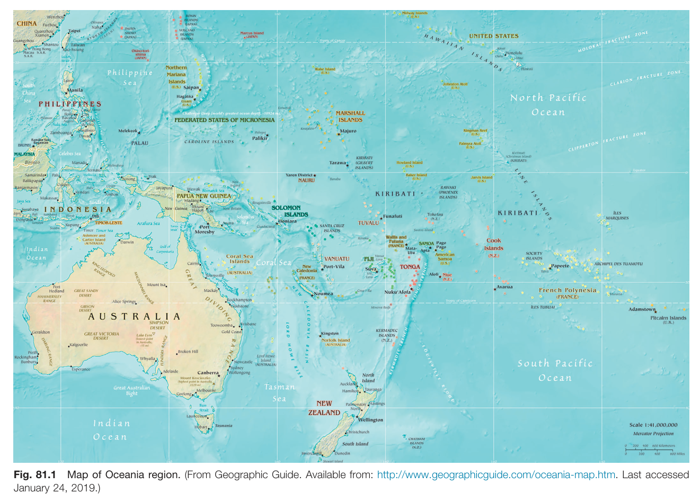

Fig. 81.1 Map of Oceania region. (From Geographic Guide. Available from: http://www.geographicguide.com/oceania-map.htm. Last accessed January 24, 2019.)

---

### Fig_81_2

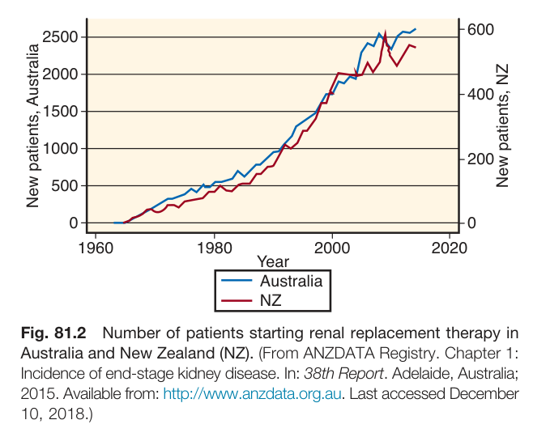

Fig. 81.2 Number of patients starting renal replacement therapy in Australia and New Zealand NZ. (From ANZDATA Registry. Chapter 1: Incidence of end-stage kidney disease. In: 38th Report. Adelaide, Australia; 2015. Available from: http://www.anzdata.org.au. Last accessed December 10, 2018.)

---

### Fig_81_3

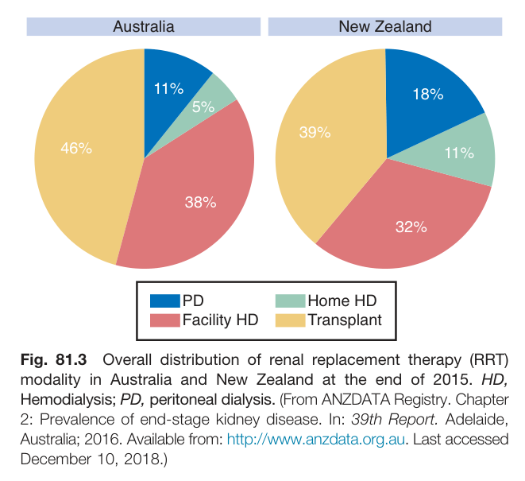

Fig. 81.3 Overall distribution of renal replacement therapy RRT modality in Australia and New Zealand at the end of 2015. HD, Hemodialysis; PD, peritoneal dialysis. (From ANZDATA Registry. Chapter 2: Prevalence of end-stage kidney disease. In: 39th Report. Adelaide, Australia; 2016. Available from: http://www.anzdata.org.au. Last accessed December 10, 2018.)

---

### Fig_81_4

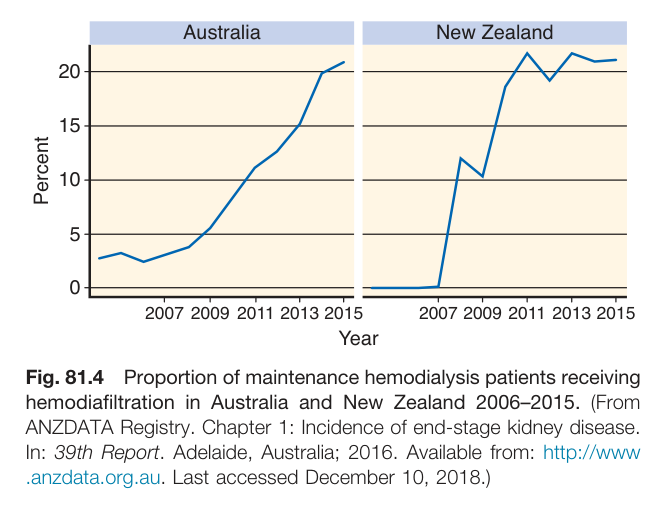

Fig. 81.4 Proportion of maintenance hemodialysis patients receiving hemodiafiltration in Australia and New Zealand 2006-2015. (From ANZDATA Registry. Chapter 1: Incidence of end-stage kidney disease. In: 39th Report. Adelaide, Australia; 2016. Available from: http://www.anzdata.org.au. Last accessed December 10, 2018.)

---

### Fig_81_5

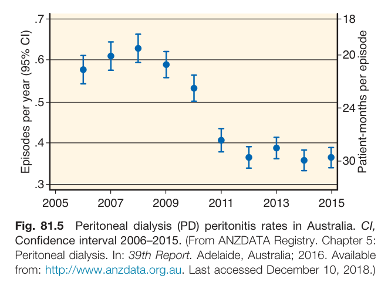

Fig. 81.5 Peritoneal dialysis PD peritonitis rates in Australia. Cl, Confidence interval 2006-2015. (From ANZDATA Registry. Chapter 5: Peritoneal dialysis. In: 39th Report. Adelaide, Australia; 2016. Available from: http://www.anzdata.org.au. Last accessed December 10, 2018.)

---

### Fig_81_6

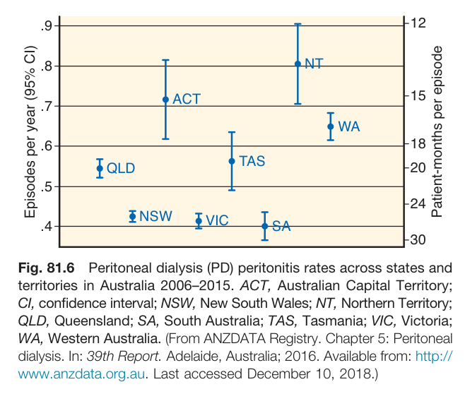

Fig. 81.6 Peritoneal dialysis PD peritonitis rates across states and territories in Australia 2006-2015. ACT, Australian Capital Territory; Cl, confidence interval; NSW, New South Wales; NT, Northern Territory; QLD, Queensland; SA, South Australia; TAS, Tasmania; VIC, Victoria; WA, Western Australia. (From ANZDATA Registry. Chapter 5: Peritoneal dialysis. In: 39th Report. Adelaide, Australia; 2016. Available from: http://www.anzdata.org.au. Last accessed December 10, 2018.)

---

### Fig_81_7

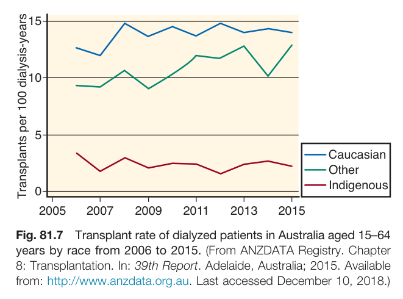

Fig. 81.7 Transplant rate of dialyzed patients in Australia aged 15-64 years by race from 2006 to 2015. (From ANZDATA Registry. Chapter 8: Transplantation. In: 39th Report. Adelaide, Australia; 2015. Available from: http://www.anzdata.org.au. Last accessed December 10, 2018.)

---

### Fig_81_8

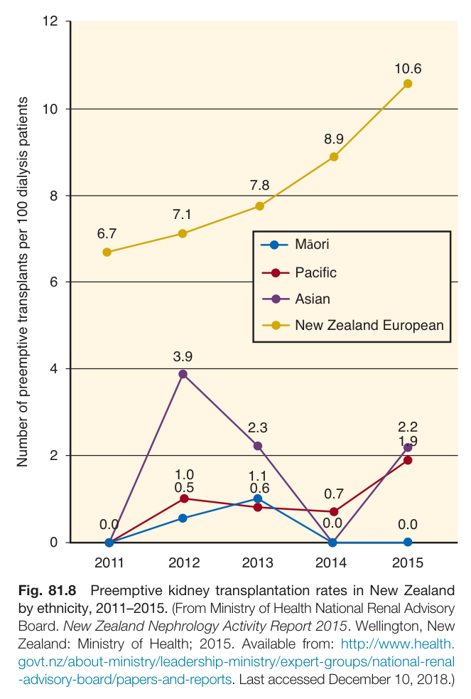

Fig. 81.8 Preemptive kidney transplantation rates in New Zealand by ethnicity, 2011-2015. (From Ministry of Health National Renal Advisory Board. New Zealand Nephrology Activity Report 2015. Wellington, New Zealand: Ministry of Health; 2015. Available from: http://www.health.govt.nz/about-ministry/leadership-ministry/expert-groups/national-renal-advisory-board/papers-and-reports. Last accessed December 10, 2018.)

---

### Fig_81_9

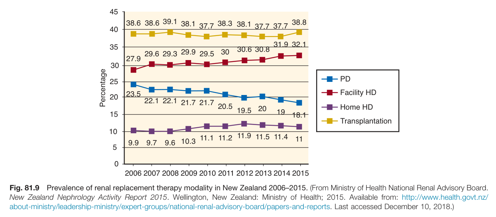

Fig. 81.9 Prevalence of renal replacement therapy modality in New Zealand 2006-2015. (From Ministry of Health National Renal Advisory Board. New Zealand Nephrology Activity Report 2015. Wellington, New Zealand: Ministry of Health; 2015. Available from: http://www.health.govt.nz/about-ministry/leadership-ministry/expert-groups/national-renal-advisory-board/papers-and-reports. Last accessed December 10, 2018.)

---

### Fig_81_10

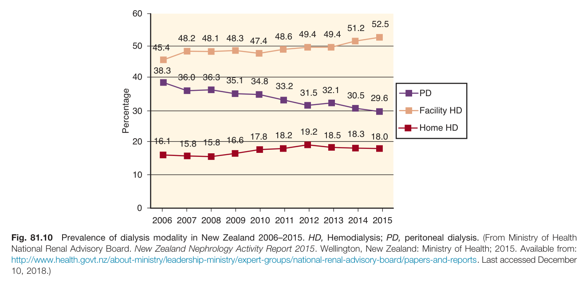

Fig. 81.10 Prevalence of dialysis modality in New Zealand 2006-2015. HD, Hemodialysis; PD, peritoneal dialysis. (From Ministry of Health National Renal Advisory Board. New Zealand Nephrology Activity Report 2015. Wellington, New Zealand: Ministry of Health; 2015. Available from: http://www.health.govt.nz/about-ministry/leadership-ministry/expert-groups/national-renal-advisory-board/papers-and-reports. Last accessed December 10, 2018.)

---

### Fig_81_11

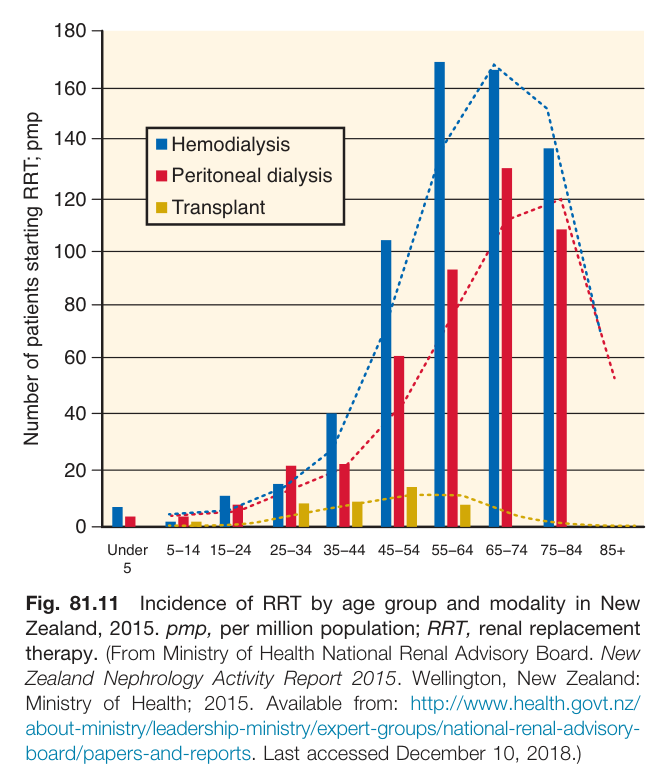

Fig. 81.11 Incidence of RRT by age group and modality in New Zealand, 2015. pmp, per million population; RRT, renal replacement therapy. (From Ministry of Health National Renal Advisory Board. New Zealand Nephrology Activity Report 2015. Wellington, New Zealand: Ministry of Health; 2015. Available from: http://www.health.govt.nz/about-ministry/leadership-ministry/expert-groups/national-renal-advisory-board/papers-and-reports. Last accessed December 10, 2018.)

---

### Fig_81_12

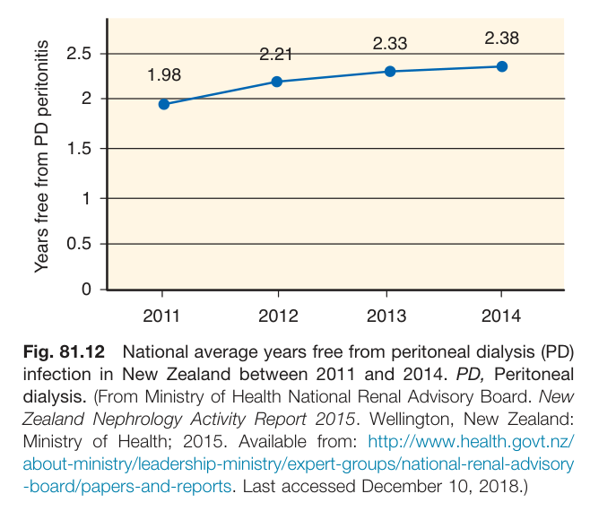

Fig. 81.12 National average years free from peritoneal dialysis PD infection in New Zealand between 2011 and 2014. PD, Peritoneal dialysis. (From Ministry of Health National Renal Advisory Board. New Zealand Nephrology Activity Report 2015. Wellington, New Zealand: Ministry of Health; 2015. Available from: http://www.health.govt.nz/about-ministry/leadership-ministry/expert-groups/national-renal-advisory-board/papers-and-reports. Last accessed December 10, 2018.)

---

### Fig_81_13

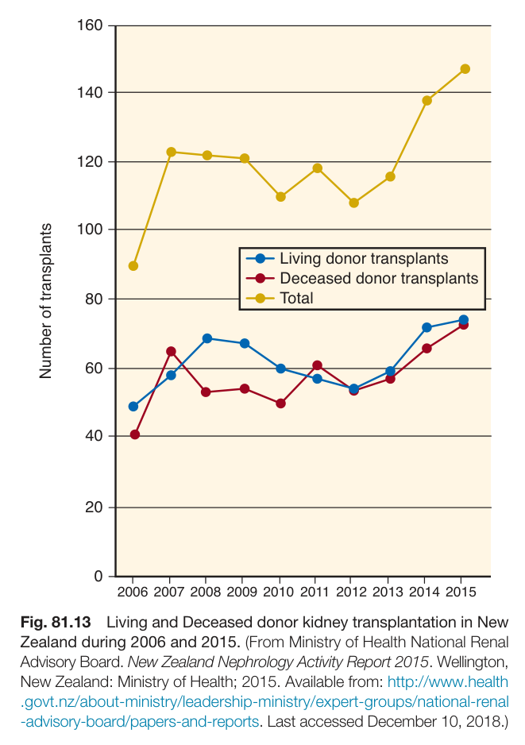

Fig. 81.13 Living and Deceased donor kidney transplantation in New Zealand during 2006 and 2015. (From Ministry of Health National Renal Advisory Board. New Zealand Nephrology Activity Report 2015. Wellington, New Zealand: Ministry of Health; 2015. Available from: http://www.health.govt.nz/about-ministry/leadership-ministry/expert-groups/national-renal-advisory-board/papers-and-reports. Last accessed December 10, 2018.)

---

## Tables

### Table_81_1

#### Table Image

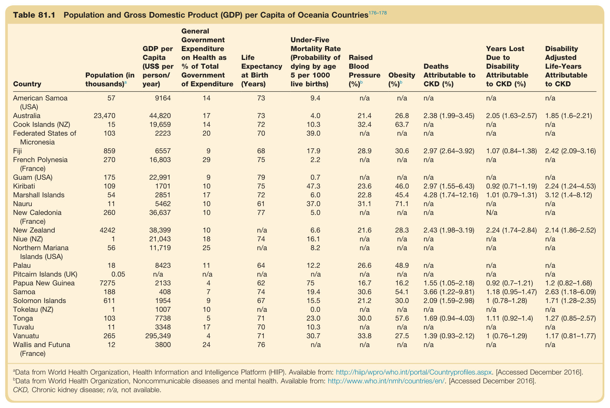

#### Table Data (CSV: [Table_81_1.csv](Table_81_1.csv))

```markdown
| Table Text (OCR) |
| :--- |
| Table 81.1 Population and Gross Domestic Product GDP per Capita of Oceania Countries \| Country \| Population (in thousands) \| GDP per Capita (US$ per person/ year) \| General Government Expenditure on Health as % of Total Government of Expenditure \| Life Expectancy at Birth (Years) \| Under-Five Mortality Rate (Probability of dying by age 5 per 1000 live births) \| Raised Blood Pressure (%) \| Obesity (%) \| Deaths Attributable to CKD (%) \| Years Lost Due to Disability Attributable to CKD (%) \| Disability Adjusted Life-Years Attributable to CKD \| \| :--- \| :--- \| :--- \| :--- \| :--- \| :--- \| :--- \| :--- \| :--- \| :--- \| :--- \| \| American Samoa (USA) \| 57 \| 9164 \| 14 \| 73 \| 9.4 \| n/a \| n/a \| n/a \| n/a \| n/a \| \| Australia \| 23,470 \| 44,820 \| 17 \| 73 \| 4.0 \| 21.4 \| 26.8 \| 2.38 (1.99-3.45) \| 2.05 (1.63-2.57) \| 1.85 (1.6-2.21) \| \| Cook Islands (NZ) \| 15 \| 19,659 \| 14 \| 72 \| 10.3 \| 32.4 \| 63.7 \| n/a \| n/a \| n/a \| \| Federated States of Micronesia \| 103 \| 2223 \| 20 \| 70 \| 39.0 \| n/a \| n/a \| n/a \| n/a \| n/a \| \| Fiji \| 859 \| 6557 \| 9 \| 68 \| 17.9 \| 28.9 \| 30.6 \| 2.97 (2.64-3.92) \| 1.07 (0.84-1.38) \| 2.42 (2.09-3.16) \| \| French Polynesia (France) \| 270 \| 16,803 \| 29 \| 75 \| 2.2 \| n/a \| n/a \| n/a \| n/a \| n/a \| \| Guam (USA) \| 175 \| 22,991 \| 9 \| 79 \| 0.7 \| n/a \| n/a \| n/a \| n/a \| n/a \| \| Kiribati \| 109 \| 1701 \| 10 \| 75 \| 47.3 \| 23.6 \| 46.0 \| 2.97 (1.55-6.43) \| 0.92 (0.71-1.19) \| 2.24 (1.24-4.53) \| \| Marshall Islands \| 54 \| 2851 \| 17 \| 72 \| 6.0 \| 22.8 \| 45.4 \| 4.28 (1.74-12.16) \| 1.01 (0.79-1.31) \| 3.12 (1.4-8.12) \| \| Nauru \| 11 \| 5462 \| 10 \| 61 \| 37.0 \| 31.1 \| 71.1 \| n/a \| n/a \| n/a \| \| New Caledonia (France) \| 260 \| 36,637 \| 10 \| 77 \| 5.0 \| n/a \| n/a \| n/a \| N/a \| n/a \| \| New Zealand \| 4242 \| 38,399 \| 10 \| n/a \| 6.6 \| 21.6 \| 28.3 \| 2.43 (1.98-3.19) \| 2.24 (1.74-2.84) \| 2.14 (1.86-2.52) \| \| Niue (NZ) \| 1 \| 21,043 \| 18 \| 74 \| 16.1 \| n/a \| n/a \| n/a \| n/a \| n/a \| \| Northern Mariana Islands (USA) \| 56 \| 11,719 \| 25 \| n/a \| 8.2 \| n/a \| n/a \| n/a \| n/a \| n/a \| \| Palau \| 18 \| 8423 \| 11 \| 64 \| 12.2 \| 26.6 \| 48.9 \| n/a \| n/a \| n/a \| \| Pitcairn Islands (UK) \| 0.05 \| n/a \| n/a \| n/a \| n/a \| n/a \| n/a \| n/a \| n/a \| n/a \| \| Papua New Guinea \| 7275 \| 2133 \| 4 \| 62 \| 75 \| 16.7 \| 16.2 \| 1.55 (1.05-2.18) \| 0.92 (0.7-1.21) \| 1.2 (0.82-1.68) \| \| Samoa \| 188 \| 408 \| 7 \| 74 \| 19.4 \| 30.6 \| 54.1 \| 3.66 (1.22-9.81) \| 1.18 (0.95-1.47) \| 2.63 (1.18-6.09) \| \| Solomon Islands \| 611 \| 1954 \| 9 \| 67 \| 15.5 \| 21.2 \| 30.0 \| 2.09 (1.59-2.98) \| 1 (0.78-1.28) \| 1.71 (1.28-2.35) \| \| Tokelau (NZ) \| 1 \| 1007 \| 10 \| n/a \| 0.0 \| n/a \| n/a \| n/a \| n/a \| n/a \| \| Tonga \| 103 \| 7738 \| 5 \| 71 \| 23.0 \| 30.0 \| 57.6 \| 1.69 (0.94-4.03) \| 1.11 (0.92-1.4) \| 1.27 (0.85-2.57) \| \| Tuvalu \| 11 \| 3348 \| 17 \| 70 \| 10.3 \| n/a \| n/a \| n/a \| n/a \| n/a \| \| Vanuatu \| 265 \| 295,349 \| 4 \| 71 \| 30.7 \| 33.8 \| 27.5 \| 1.39 (0.93-2.12) \| 1 (0.76-1.29) \| 1.17 (0.81-1.77) \| \| Wallis and Futuna (France) \| 12 \| 3800 \| 24 \| 76 \| n/a \| n/a \| n/a \| n/a \| n/a \| n/a \| |
```

Table 81.1 Population and Gross Domestic Product GDP per Capita of Oceania Countries | Country | Population (in thousands) | GDP per Capita (US$ per person/ year) | General Government Expenditure on Health as % of Total Government of Expenditure | Life Expectancy at Birth (Years) | Under-Five Mortality Rate (Probability of dying by age 5 per 1000 live births) | Raised Blood Pressure (%) | Obesity (%) | Deaths Attributable to CKD (%) | Years Lost Due to Disability Attributable to CKD (%) | Disability Adjusted Life-Years Attributable to CKD | | :--- | :--- | :--- | :--- | :--- | :--- | :--- | :--- | :--- | :--- | :--- | | American Samoa (USA) | 57 | 9164 | 14 | 73 | 9.4 | n/a | n/a | n/a | n/a | n/a | | Australia | 23,470 | 44,820 | 17 | 73 | 4.0 | 21.4 | 26.8 | 2.38 (1.99-3.45) | 2.05 (1.63-2.57) | 1.85 (1.6-2.21) | | Cook Islands (NZ) | 15 | 19,659 | 14 | 72 | 10.3 | 32.4 | 63.7 | n/a | n/a | n/a | | Federated States of Micronesia | 103 | 2223 | 20 | 70 | 39.0 | n/a | n/a | n/a | n/a | n/a | | Fiji | 859 | 6557 | 9 | 68 | 17.9 | 28.9 | 30.6 | 2.97 (2.64-3.92) | 1.07 (0.84-1.38) | 2.42 (2.09-3.16) | | French Polynesia (France) | 270 | 16,803 | 29 | 75 | 2.2 | n/a | n/a | n/a | n/a | n/a | | Guam (USA) | 175 | 22,991 | 9 | 79 | 0.7 | n/a | n/a | n/a | n/a | n/a | | Kiribati | 109 | 1701 | 10 | 75 | 47.3 | 23.6 | 46.0 | 2.97 (1.55-6.43) | 0.92 (0.71-1.19) | 2.24 (1.24-4.53) | | Marshall Islands | 54 | 2851 | 17 | 72 | 6.0 | 22.8 | 45.4 | 4.28 (1.74-12.16) | 1.01 (0.79-1.31) | 3.12 (1.4-8.12) | | Nauru | 11 | 5462 | 10 | 61 | 37.0 | 31.1 | 71.1 | n/a | n/a | n/a | | New Caledonia (France) | 260 | 36,637 | 10 | 77 | 5.0 | n/a | n/a | n/a | N/a | n/a | | New Zealand | 4242 | 38,399 | 10 | n/a | 6.6 | 21.6 | 28.3 | 2.43 (1.98-3.19) | 2.24 (1.74-2.84) | 2.14 (1.86-2.52) | | Niue (NZ) | 1 | 21,043 | 18 | 74 | 16.1 | n/a | n/a | n/a | n/a | n/a | | Northern Mariana Islands (USA) | 56 | 11,719 | 25 | n/a | 8.2 | n/a | n/a | n/a | n/a | n/a | | Palau | 18 | 8423 | 11 | 64 | 12.2 | 26.6 | 48.9 | n/a | n/a | n/a | | Pitcairn Islands (UK) | 0.05 | n/a | n/a | n/a | n/a | n/a | n/a | n/a | n/a | n/a | | Papua New Guinea | 7275 | 2133 | 4 | 62 | 75 | 16.7 | 16.2 | 1.55 (1.05-2.18) | 0.92 (0.7-1.21) | 1.2 (0.82-1.68) | | Samoa | 188 | 408 | 7 | 74 | 19.4 | 30.6 | 54.1 | 3.66 (1.22-9.81) | 1.18 (0.95-1.47) | 2.63 (1.18-6.09) | | Solomon Islands | 611 | 1954 | 9 | 67 | 15.5 | 21.2 | 30.0 | 2.09 (1.59-2.98) | 1 (0.78-1.28) | 1.71 (1.28-2.35) | | Tokelau (NZ) | 1 | 1007 | 10 | n/a | 0.0 | n/a | n/a | n/a | n/a | n/a | | Tonga | 103 | 7738 | 5 | 71 | 23.0 | 30.0 | 57.6 | 1.69 (0.94-4.03) | 1.11 (0.92-1.4) | 1.27 (0.85-2.57) | | Tuvalu | 11 | 3348 | 17 | 70 | 10.3 | n/a | n/a | n/a | n/a | n/a | | Vanuatu | 265 | 295,349 | 4 | 71 | 30.7 | 33.8 | 27.5 | 1.39 (0.93-2.12) | 1 (0.76-1.29) | 1.17 (0.81-1.77) | | Wallis and Futuna (France) | 12 | 3800 | 24 | 76 | n/a | n/a | n/a | n/a | n/a | n/a |

---

### Table_81_2

#### Table Image

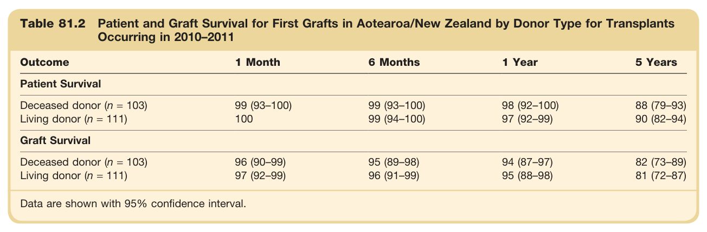

#### Table Data (CSV: [Table_81_2.csv](Table_81_2.csv))

```markdown
| Table Text (OCR) |
| :--- |
| Table 81.2 Patient and Graft Survival for First Grafts in Aotearoa/New Zealand by Donor Type for Transplants Occurring in 2010–2011 Outcome  1 Month  6 Months  1 Year  5 Years    Patient Survival    Deceased donor (n = 103)  99 (93–100)  99 (93–100)  98 (92–100)  88 (79–93)    Living donor (n = 111)  100  99 (94–100)  97 (92–99)  90 (82–94)    Graft Survival    Deceased donor (n = 103)  96 (90–99)  95 (89–98)  94 (87–97)  82 (73–89)    Living donor (n = 111)  97 (92–99)  96 (91–99)  95 (88–98)  81 (72–87)    Data are shown with 95% confidence interval. |
```

Table 81.2 Patient and Graft Survival for First Grafts in Aotearoa/New Zealand by Donor Type for Transplants Occurring in 2010-2011 | Outcome | 1 Month | 6 Months | 1 Year | 5 Years | | :--- | :--- | :--- | :--- | :--- | | **Patient Survival** | | | | | | Deceased donor (n = 103) | 99 (93-100) | 99 (93-100) | 98 (92-100) | 88 (79-93) | | Living donor (n = 111) | 100 | 99 (94-100) | 97 (92-99) | 90 (82-94) | | **Graft Survival** | | | | | | Deceased donor (n = 103) | 96 (90-99) | 95 (89-98) | 94 (87-97) | 82 (73-89) | | Living donor (n = 111) | 97 (92-99) | 96 (91-99) | 95 (88-98) | 81 (72-87) | *Data are shown with 95% confidence interval.*

---
