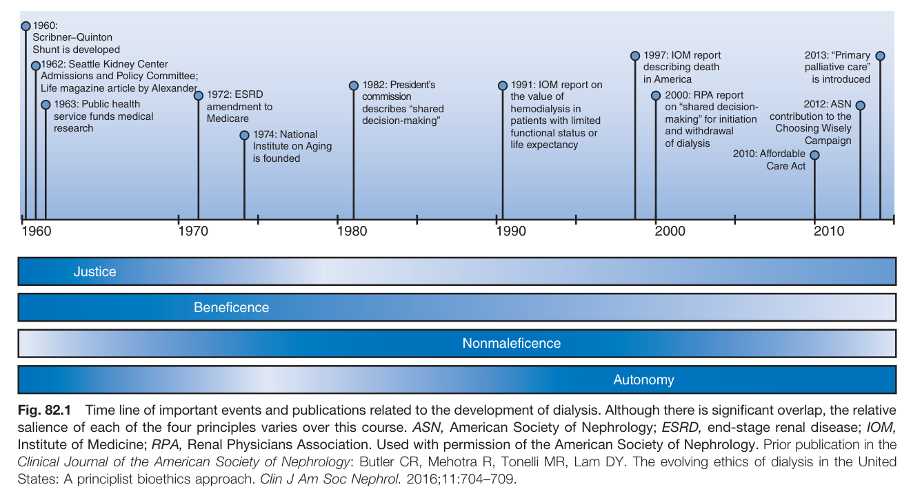
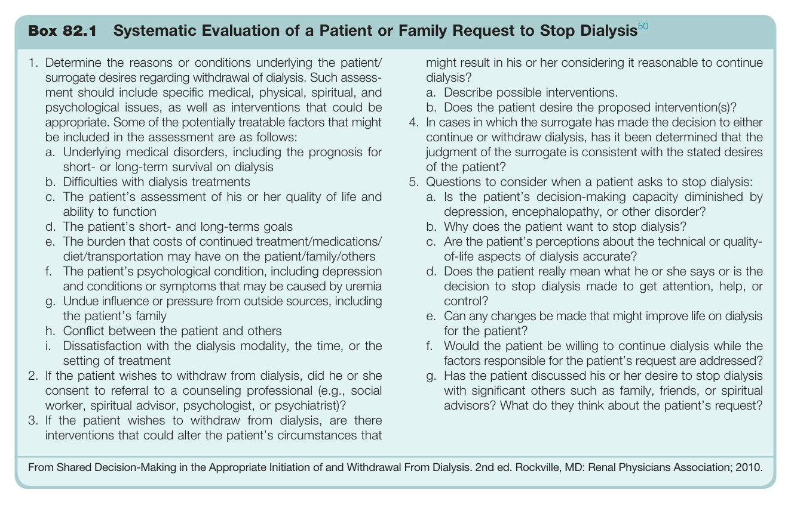
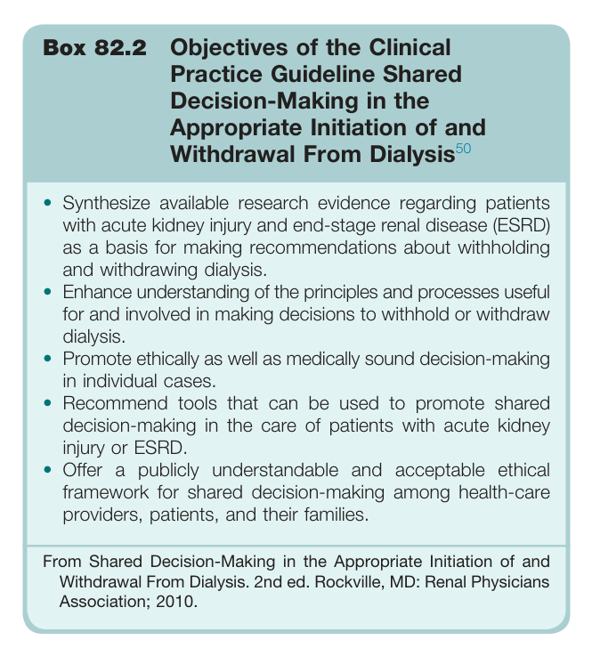
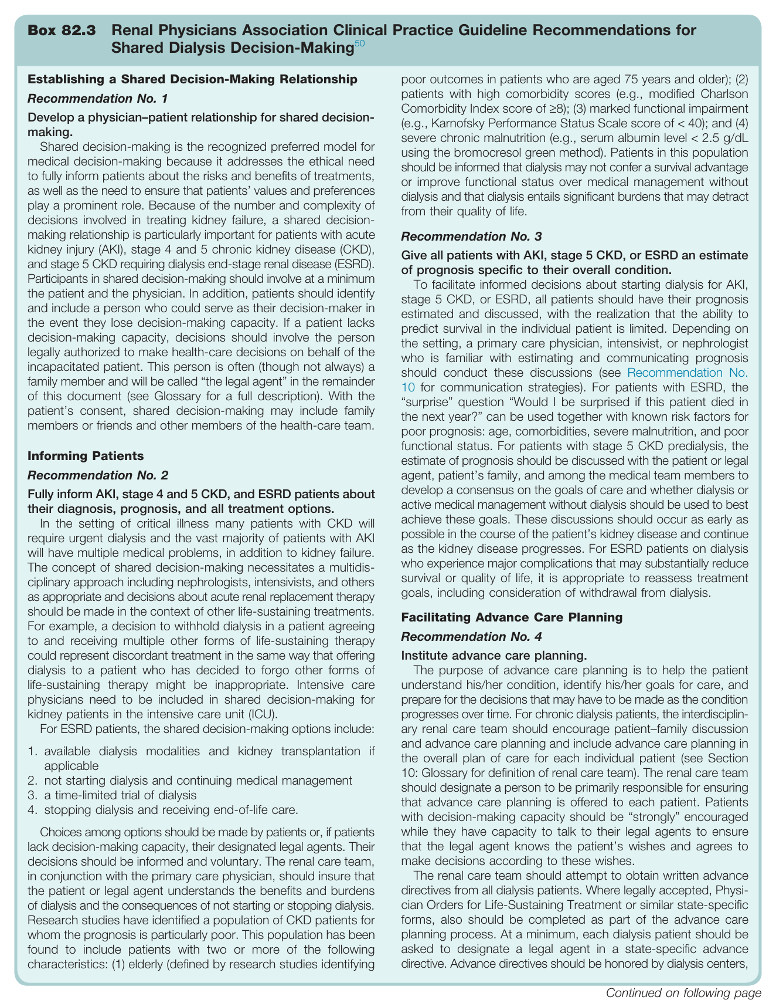
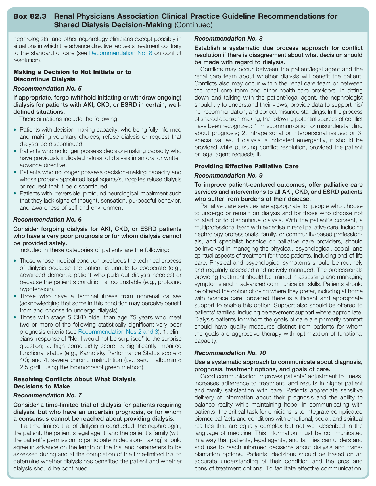
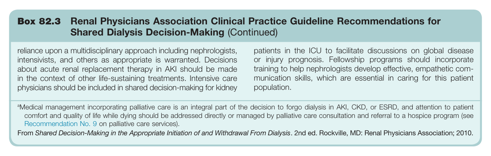
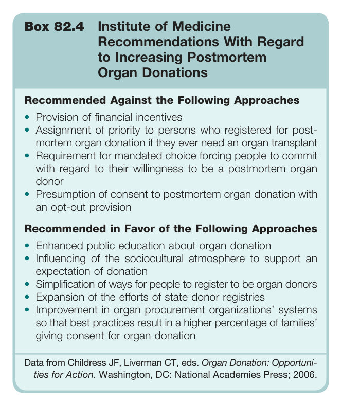
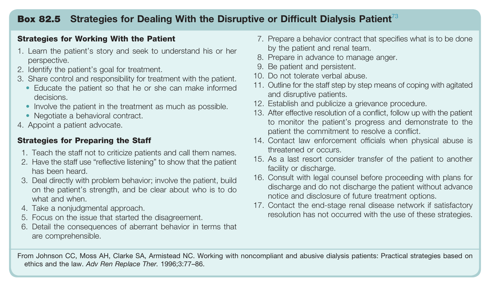

# 82. Ethical Dilemmas Facing Nephrology Past, Present, and Future - Figures and Tables Index

This document lists all figures, tables and boxes extracted from `82. Ethical Dilemmas Facing Nephrology Past, Present, and Future.pdf`.

## Table of Contents
- [Figures](#figures)
- [Tables](#tables)
- [Boxes](#boxes)

---

## Figures

### Fig_82_1



Fig. 82.1 Time line of important events and publications related to the development of dialysis. Although there is significant overlap, the relative salience of each of the four principles varies over this course. ASN, American Society of Nephrology; ESRD, end-stage renal disease; IOM, Institute of Medicine; RPA, Renal Physicians Association. Used with permission of the American Society of Nephrology. Prior publication in the Clinical Journal of the American Society of Nephrology: Butler CR, Mehotra R, Tonelli MR, Lam DY. The evolving ethics of dialysis in the United States: A principlist bioethics approach. Clin J Am Soc Nephrol. 2016;11:704-709.

---

## Tables

*No tables resolved for this chapter.*

## Boxes

### Box_82_1



#### Box Text

```markdown
Box 82.1 Systematic Evaluation of a Patient or Family Request to Stop Dialysis<sup>50</sup> 1. Determine the reasons or conditions underlying the patient/ surrogate desires regarding withdrawal of dialysis. Such assess- ment should include specific medical, physical, spiritual, and psychological issues, as well as interventions that could be appropriate. Some of the potentially treatable factors that might be included in the assessment are as follows: might result in his or her considering it reasonable to continue dialysis? a. Describe possible interventions. b. Does the patient desire the proposed intervention(s)? 4. In cases in which the surrogate has made the decision to either continue or withdraw dialysis, has it been determined that the judgment of the surrogate is consistent with the stated desires of the patient? a. Underlying medical disorders, including the prognosis for short- or long-term survival on dialysis b. Difficulties with dialysis treatments 5. Questions to consider when a patient asks to stop dialysis: c. The patient’s assessment of his or her quality of life and ability to function a. Is the patient’s decision-making capacity diminished by depression, encephalopathy, or other disorder? b. Why does the patient want to stop dialysis? d. The patient’s short- and long-terms goals e. The burden that costs of continued treatment/medications/ diet/transportation may have on the patient/family/others c. Are the patient’s perceptions about the technical or quality- of-life aspects of dialysis accurate? f. The patient’s psychological condition, including depression and conditions or symptoms that may be caused by uremia d. Does the patient really mean what he or she says or is the decision to stop dialysis made to get attention, help, or control? g. Undue influence or pressure from outside sources, including the patient’s family e. Can any changes be made that might improve life on dialysis for the patient? h. Conflict between the patient and others i. Dissatisfaction with the dialysis modality, the time, or the setting of treatment f. Would the patient be willing to continue dialysis while the factors responsible for the patient’s request are addressed? 2. If the patient wishes to withdraw from dialysis, did he or she consent to referral to a counseling professional (e.g., socia worker, spiritual advisor, psychologist, or psychiatrist)? g. Has the patient discussed his or her desire to stop dialysis with significant others such as family, friends, or spiritual advisors? What do they think about the patient’s request? 3. If the patient wishes to withdraw from dialysis, are there interventions that could alter the patient’s circumstances that From Shared Decision-Making in the Appropriate Initiation of and Withdrawal From Dialysis. 2nd ed. Rockville, MD: Renal Physicians Association; 2010.
```

Box 82.1 Systematic Evaluation of a Patient or Family Request to Stop Dialysis 1. Determine the reasons or conditions underlying the patient/surrogate desires regarding withdrawal of dialysis. Such assessment should include specific medical, physical, spiritual, and psychological issues, as well as interventions that could be appropriate. Some of the potentially treatable factors that might be included in the assessment are as follows: a. Underlying medical disorders, including the prognosis for short- or long-term survival on dialysis b. Difficulties with dialysis treatments c. The patient's assessment of his or her quality of life and ability to function d. The patient's short- and long-terms goals e. The burden that costs of continued treatment/medications/diet/transportation may have on the patient/family/others f. The patient's psychological condition, including depression and conditions or symptoms that may be caused by uremia g. Undue influence or pressure from outside sources, including the patient's family h. Conflict between the patient and others i. Dissatisfaction with the dialysis modality, the time, or the setting of treatment 2. If the patient wishes to withdraw from dialysis, did he or she consent to referral to a counseling professional (e.g., social worker, spiritual advisor, psychologist, or psychiatrist)? 3. If the patient wishes to withdraw from dialysis, are there interventions that could alter the patient's circumstances that might result in his or her considering it reasonable to continue dialysis? a. Describe possible interventions. b. Does the patient desire the proposed intervention(s)? 4. In cases in which the surrogate has made the decision to either continue or withdraw dialysis, has it been determined that the judgment of the surrogate is consistent with the stated desires of the patient? 5. Questions to consider when a patient asks to stop dialysis: a. Is the patient's decision-making capacity diminished by depression, encephalopathy, or other disorder? b. Why does the patient want to stop dialysis? c. Are the patient's perceptions about the technical or quality-of-life aspects of dialysis accurate? d. Does the patient really mean what he or she says or is the decision to stop dialysis made to get attention, help, or control? e. Can any changes be made that might improve life on dialysis for the patient? f. Would the patient be willing to continue dialysis while the factors responsible for the patient's request are addressed? g. Has the patient discussed his or her desire to stop dialysis with significant others such as family, friends, or spiritual advisors? What do they think about the patient's request? From Shared Decision-Making in the Appropriate Initiation of and Withdrawal From Dialysis. 2nd ed. Rockville, MD: Renal Physicians Association; 2010.

---

### Box_82_2



#### Box Text

```markdown
Box 82.2 Objectives of the Clinical Practice Guideline Shared Decision-Making in the Appropriate Initiation of and Withdrawal From Dialysis<sup>50</sup> • Synthesize available research evidence regarding patients with acute kidney injury and end-stage renal disease (ESRD) as a basis for making recommendations about withholding and withdrawing dialysis. Enhance understanding of the principles and processes useful for and involved in making decisions to withhold or withdraw dialysis. • Promote ethically as well as medically sound decision-making in individual cases. Recommend tools that can be used to promote shared decision-making in the care of patients with acute kidney injury or ESRD. • Offer a publicly understandable and acceptable ethical framework for shared decision-making among health-care providers, patients, and their families. From Shared Decision-Making in the Appropriate Initiation of and Withdrawal From Dialysis. 2nd ed. Rockville, MD: Renal Physicians Association; 2010.
```

Box 82.2 Objectives of the Clinical Practice Guideline Shared Decision-Making in the Appropriate Initiation of and Withdrawal From Dialysis * Synthesize available research evidence regarding patients with acute kidney injury and end-stage renal disease (ESRD) as a basis for making recommendations about withholding and withdrawing dialysis. * Enhance understanding of the principles and processes useful for and involved in making decisions to withhold or withdraw dialysis. * Promote ethically as well as medically sound decision-making in individual cases. * Recommend tools that can be used to promote shared decision-making in the care of patients with acute kidney injury or ESRD. * Offer a publicly understandable and acceptable ethical framework for shared decision-making among health-care providers, patients, and their families. From Shared Decision-Making in the Appropriate Initiation of and Withdrawal From Dialysis. 2nd ed. Rockville, MD: Renal Physicians Association; 2010.

---

### Box_82_3

#### Box Images (3 Parts)

- **Part 1 (Page 8)**:
  

- **Part 2 (Page 9)**:
  

- **Part 3 (Page 10)**:
  

#### Box Text

```markdown
Box 82.3 Renal Physicians Association Clinical Practice Guideline Recommendations for Shared Dialysis Decision-Making<sup>5</sup> Establishing a Shared Decision-Making Relationship Recommendation No. 1 Develop a physician–patient relationship for shared decision- making. Shared decision-making is the recognized preferred model for medical decision-making because it addresses the ethical need to fully inform patients about the risks and benefits of treatments, as well as the need to ensure that patients’ values and preferences play a prominent role. Because of the number and complexity of decisions involved in treating kidney failure, a shared decision- making relationship is particularly important for patients with acute kidney injury (AKI), stage 4 and 5 chronic kidney disease (CKD), and stage 5 CKD requiring dialysis end-stage renal disease (ESRD). Participants in shared decision-making should involve at a minimum the patient and the physician. In addition, patients should identify and include a person who could serve as their decision-maker in the event they lose decision-making capacity. If a patient lacks decision-making capacity, decisions should involve the person legally authorized to make health-care decisions on behalf of the incapacitated patient. This person is often (though not always) a family member and will be called “the legal agent” in the remainder of this document (see Glossary for a full description). With the patient’s consent, shared decision-making may include family members or friends and other members of the health-care team. Recommendation No. 3 Give all patients with AKI, stage 5 CKD, or ESRD an estimate of prognosis specific to their overall condition. To facilitate informed decisions about starting dialysis for AKI, stage 5 CKD, or ESRD, all patients should have their prognosis estimated and discussed, with the realization that the ability to predict survival in the individual patient is limited. Depending on the setting, a primary care physician, intensivist, or nephrologist who is familiar with estimating and communicating prognosis should conduct these discussions (see Recommendation No. 10 for communication strategies). For patients with ESRD, the “surprise” question “Would I be surprised if this patient died in the next year?” can be used together with known risk factors for poor prognosis: age, comorbidities, severe malnutrition, and poor functional status. For patients with stage 5 CKD predialysis, the estimate of prognosis should be discussed with the patient or legal agent, patient’s family, and among the medical team members to develop a consensus on the goals of care and whether dialysis or active medical management without dialysis should be used to best achieve these goals. These discussions should occur as early as possible in the course of the patient’s kidney disease and continue as the kidney disease progresses. For ESRD patients on dialysis who experience major complications that may substantially reduce survival or quality of life, it is appropriate to reassess treatment goals, including consideration of withdrawal from dialysis. Informing Patients Recommendation No. 2 Fully inform AKI, stage 4 and 5 CKD, and ESRD patients about their diagnosis, prognosis, and all treatment options. In the setting of critical illness many patients with CKD wil require urgent dialysis and the vast majority of patients with AK will have multiple medical problems, in addition to kidney failure. The concept of shared decision-making necessitates a multidis- ciplinary approach including nephrologists, intensivists, and others as appropriate and decisions about acute renal replacement therapy should be made in the context of other life-sustaining treatments. For example, a decision to withhold dialysis in a patient agreeing to and receiving multiple other forms of life-sustaining therapy could represent discordant treatment in the same way that offering dialysis to a patient who has decided to forgo other forms of life-sustaining therapy might be inappropriate. Intensive care physicians need to be included in shared decision-making for kidney patients in the intensive care unit (ICU). Facilitating Advance Care Planning Recommendation No. 4 Institute advance care planning. The purpose of advance care planning is to help the patient understand his/her condition, identify his/her goals for care, and prepare for the decisions that may have to be made as the condition progresses over time. For chronic dialysis patients, the interdisciplin- ary renal care team should encourage patient–family discussion and advance care planning and include advance care planning in the overall plan of care for each individual patient (see Section 10: Glossary for definition of renal care team). The renal care team should designate a person to be primarily responsible for ensuring that advance care planning is offered to each patient. Patients with decision-making capacity should be “strongly” encouraged while they have capacity to talk to their legal agents to ensure that the legal agent knows the patient’s wishes and agrees to make decisions according to these wishes. For ESRD patients, the shared decision-making options include: 1. available dialysis modalities and kidney transplantation if applicable 2. not starting dialysis and continuing medical management 3. a time-limited trial of dialysis 4. stopping dialysis and receiving end-of-life care. Choices among options should be made by patients or, if patients lack decision-making capacity, their designated legal agents. Their decisions should be informed and voluntary. The renal care team, in conjunction with the primary care physician, should insure that the patient or legal agent understands the benefits and burdens of dialysis and the consequences of not starting or stopping dialysis. Research studies have identified a population of CKD patients for whom the prognosis is particularly poor. This population has been found to include patients with two or more of the following characteristics: (1) elderly (defined by research studies identifying poor outcomes in patients who are aged 75 years and older); (2) patients with high comorbidity scores (e.g., modified Charlson Comorbidity Index score of ≥8); (3) marked functional impairment (e.g., Karnofsky Performance Status Scale score of < 40); and (4) severe chronic malnutrition (e.g., serum albumin level < 2.5 g/dL using the bromocresol green method). Patients in this population should be informed that dialysis may not confer a survival advantage or improve functional status over medical management without dialysis and that dialysis entails significant burdens that may detract from their quality of life. The renal care team should attempt to obtain written advance directives from all dialysis patients. Where legally accepted, Physi- cian Orders for Life-Sustaining Treatment or similar state-specific forms, also should be completed as part of the advance care planning process. At a minimum, each dialysis patient should be asked to designate a legal agent in a state-specific advance directive. Advance directives should be honored by dialysis centers,
```

Box 82.3 Renal Physicians Association Clinical Practice Guideline Recommendations for Shared Dialysis Decision-Making

---

### Box_82_4



#### Box Text

```markdown
Box 82.4 Institute of Medicine Recommendations With Regard to Increasing Postmortem Organ Donations **Recommended Against the Following Approaches** * Provision of financial incentives * Assignment of priority to persons who registered for post-mortem organ donation if they ever need an organ transplant * Requirement for mandated choice forcing people to commit with regard to their willingness to be a postmortem organ donor * Presumption of consent to postmortem organ donation with an opt-out provision **Recommended in Favor of the Following Approaches** * Enhanced public education about organ donation * Influencing of the sociocultural atmosphere to support an expectation of donation * Simplification of ways for people to register to be organ donors * Expansion of the efforts of state donor registries * Improvement in organ procurement organizations' systems so that best practices result in a higher percentage of families' giving consent for organ donation Data from Childress JF, Liverman CT, eds. Organ Donation: Opportunities for Action. Washington, DC: National Academies Press; 2006.
```

Box 82.4 Institute of Medicine Recommendations With Regard to Increasing Postmortem Organ Donations **Recommended Against the Following Approaches** * Provision of financial incentives * Assignment of priority to persons who registered for post-mortem organ donation if they ever need an organ transplant * Requirement for mandated choice forcing people to commit with regard to their willingness to be a postmortem organ donor * Presumption of consent to postmortem organ donation with an opt-out provision **Recommended in Favor of the Following Approaches** * Enhanced public education about organ donation * Influencing of the sociocultural atmosphere to support an expectation of donation * Simplification of ways for people to register to be organ donors * Expansion of the efforts of state donor registries * Improvement in organ procurement organizations' systems so that best practices result in a higher percentage of families' giving consent for organ donation Data from Childress JF, Liverman CT, eds. Organ Donation: Opportunities for Action. Washington, DC: National Academies Press; 2006.

---

### Box_82_5



#### Box Text

```markdown
Box 82.5 Strategies for Dealing With the Disruptive or Difficult Dialysis Patient<sup>73</sup> Strategies for Working With the Patient 7. Prepare a behavior contract that specifies what is to be done by the patient and renal team. 1. Learn the patient’s story and seek to understand his or her perspective. 8. Prepare in advance to manage anger. 9. Be patient and persistent. 2. Identify the patient’s goal for treatment. 10. Do not tolerate verbal abuse. 3. Share control and responsibility for treatment with the patient. 11. Outline for the staff step by step means of coping with agitated and disruptive patients. • Educate the patient so that he or she can make informed decisions. 12. Establish and publicize a grievance procedure. • Involve the patient in the treatment as much as possible. 13. After effective resolution of a conflict, follow up with the patient to monitor the patient’s progress and demonstrate to the patient the commitment to resolve a conflict. • Negotiate a behavioral contract. 4. Appoint a patient advocate. Strategies for Preparing the Staff 14. Contact law enforcement officials when physical abuse is threatened or occurs. 1. Teach the staff not to criticize patients and call them names. 15. As a last resort consider transfer of the patient to another facility or discharge. 2. Have the staff use “reflective listening” to show that the patient has been heard. 16. Consult with legal counsel before proceeding with plans for discharge and do not discharge the patient without advance notice and disclosure of future treatment options. 3. Deal directly with problem behavior; involve the patient, build on the patient’s strength, and be clear about who is to do what and when. 17. Contact the end-stage renal disease network if satisfactory resolution has not occurred with the use of these strategies. 4. Take a nonjudgmental approach. 5. Focus on the issue that started the disagreement. 6. Detail the consequences of aberrant behavior in terms that are comprehensible. From Johnson CC, Moss AH, Clarke SA, Armistead NC. Working with noncompliant and abusive dialysis patients: Practical strategies based on ethics and the law. Adv Ren Replace Ther. 1996;3:77–86
```

Box 82.5 Strategies for Dealing With the Disruptive or Difficult Dialysis Patient **Strategies for Working With the Patient** 1. Learn the patient's story and seek to understand his or her perspective. 2. Identify the patient's goal for treatment. 3. Share control and responsibility for treatment with the patient. * Educate the patient so that he or she can make informed decisions. * Involve the patient in the treatment as much as possible. * Negotiate a behavioral contract. 4. Appoint a patient advocate. **Strategies for Preparing the Staff** 1. Teach the staff not to criticize patients and call them names. 2. Have the staff use "reflective listening" to show that the patient has been heard. 3. Deal directly with problem behavior; involve the patient, build on the patient's strength, and be clear about who is to do what and when. 4. Take a nonjudgmental approach. 5. Focus on the issue that started the disagreement. 6. Detail the consequences of aberrant behavior in terms that are comprehensible. 7. Prepare a behavior contract that specifies what is to be done by the patient and renal team. 8. Prepare in advance to manage anger. 9. Be patient and persistent. 10. Do not tolerate verbal abuse. 11. Outline for the staff step by step means of coping with agitated and disruptive patients. 12. Establish and publicize a grievance procedure. 13. After effective resolution of a conflict, follow up with the patient to monitor the patient's progress and demonstrate to the patient the commitment to resolve a conflict. 14. Contact law enforcement officials when physical abuse is threatened or occurs. 15. As a last resort consider transfer of the patient to another facility or discharge. 16. Consult with legal counsel before proceeding with plans for discharge and do not discharge the patient without advance notice and disclosure of future treatment options. 17. Contact the end-stage renal disease network if satisfactory resolution has not occurred with the use of these strategies. From Johnson CC, Moss AH, Clarke SA, Armistead NC. Working with noncompliant and abusive dialysis patients: Practical strategies based on ethics and the law. Adv Ren Replace Ther. 1996;3:77-86.

---
