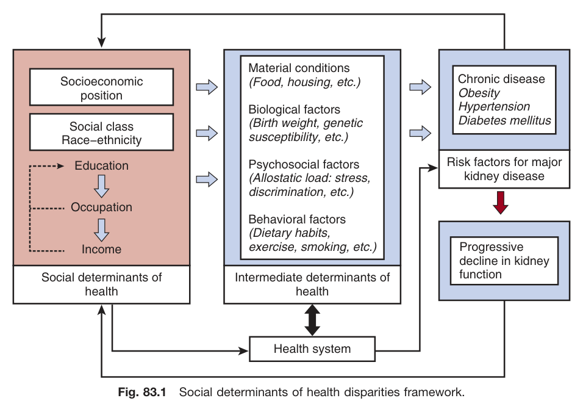
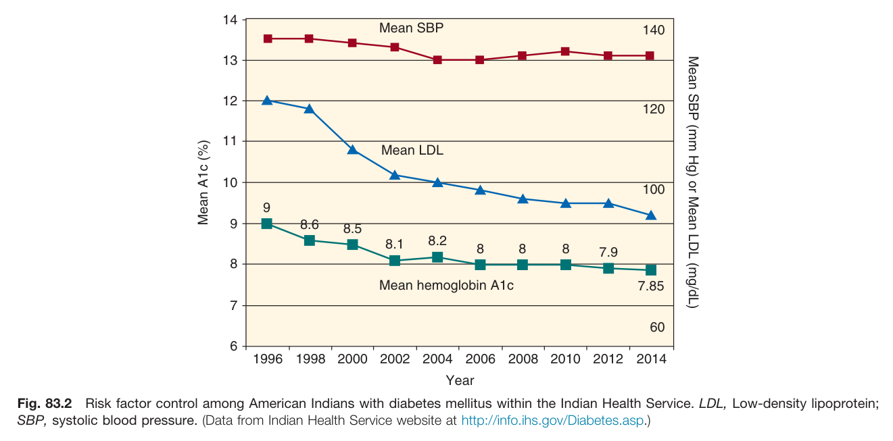
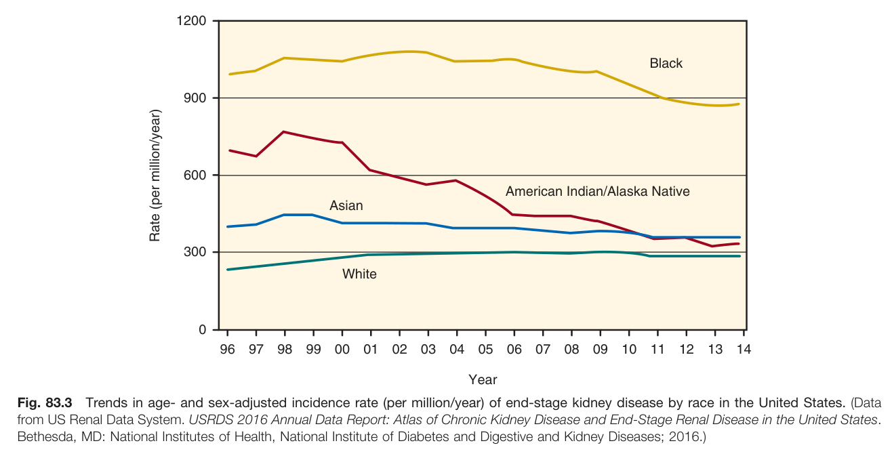
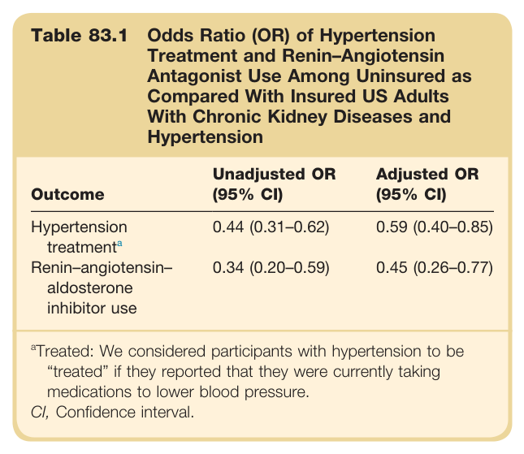

# 83. Health Disparities in Nephrology - Figures and Tables Index

This document lists all figures and tables extracted from `83. Health Disparities in Nephrology.pdf`.

## Table of Contents
- [Figures](#figures)
- [Tables](#tables)

---

## Figures

### Fig_83_1



Fig. 83.1 Social determinants of health disparities framework. This figure shows a flowchart. "Socioeconomic position" (including Social class, Race-ethnicity, Education, Occupation, and Income) leads to "Social determinants of health." This box points to "Intermediate determinants of health," which includes Material conditions (Food, housing, etc.), Biological factors (Birth weight, genetic susceptibility, etc.), Psychosocial factors (Allostatic load: stress, discrimination, etc.), and Behavioral factors (Dietary habits, exercise, smoking, etc.). The "Intermediate determinants of health" box points to "Risk factors for major kidney disease," which in turn leads to "Progressive decline in kidney function." The "Intermediate determinants of health" also points to "Chronic disease" (Obesity, Hypertension, Diabetes mellitus), which also points to "Risk factors for major kidney disease." A "Health system" box has arrows pointing to and from the "Intermediate determinants of health."

---

### Fig_83_2



Fig. 83.2 Risk factor control among American Indians with diabetes mellitus within the Indian Health Service. This is a line graph showing trends from 1996 to 2014. The primary Y-axis (left) shows Mean A1c (%) from 6 to 14. The secondary Y-axis (right) shows Mean SBP (mm Hg) or Mean LDL (mg/dL) from 60 to 140. - Mean SBP (systolic blood pressure) stays relatively flat around 135 mm Hg. - Mean LDL (Low-density lipoprotein) decreases from about 125 mg/dL in 1996 to around 100 mg/dL in 2014. - Mean hemoglobin A1c decreases from 9% in 1996 to just under 8% in 2014. LDL, Low-density lipoprotein; SBP, systolic blood pressure. (Data from Indian Health Service website at http://info.ihs.gov/Diabetes.asp.)

---

### Fig_83_3



Fig. 83.3 Trends in age- and sex-adjusted incidence rate (per million/year) of end-stage kidney disease by race in the United States. This line graph shows the incidence rate of ESKD per million/year from 1996 to 2014 for four racial groups. - The rate for Black patients is the highest, starting around 900, peaking around 1100 in the early 2000s, and then declining to about 900. - The rate for American Indian/Alaska Native patients starts around 600, peaks around 700, and then declines steadily to below 300. - The rate for Asian patients remains relatively low and stable, fluctuating between 300 and 400. - The rate for White patients is the lowest, remaining stable at around 300 throughout the period. (Data from US Renal Data System. USRDS 2016 Annual Data Report: Atlas of Chronic Kidney Disease and End-Stage Renal Disease in the United States. Bethesda, MD: National Institutes of Health, National Institute of Diabetes and Digestive and Kidney Diseases; 2016.)

---

## Tables

### Table_83_1

#### Table Image



#### Table Data (CSV: [Table_83_1.csv](Table_83_1.csv))

```markdown
| Table Text (OCR) |
| :--- |
| Table 83.1 Odds Ratio (OR) of Hypertension Treatment and Renin–Angiotensin Antagonist Use Among Uninsured as Compared With Insured US Adults With Chronic Kidney Diseases and Hypertension Outcome  Unadjusted OR (95% CI)  Adjusted OR (95% CI)    Hypertension treatmenta  0.44 (0.31–0.62)  0.59 (0.40–0.85)    Renin–angiotensin–aldosterone inhibitor use  0.34 (0.20–0.59)  0.45 (0.26–0.77) <sup>a</sup>Treated: We considered participants with hypertension to be “treated” if they reported that they were currently taking medications to lower blood pressure. CI, Confidence interval. |
```

Table 83.1 Odds Ratio (OR) of Hypertension Treatment and Renin-Angiotensin Antagonist Use Among Uninsured as Compared With Insured US Adults With Chronic Kidney Diseases and Hypertension | Outcome | Unadjusted OR (95% CI) | Adjusted OR (95% CI) | | :--- | :--- | :--- | | Hypertension treatment | 0.44 (0.31-0.62) | 0.59 (0.40-0.85) | | Renin-angiotensin-aldosterone inhibitor use | 0.34 (0.20-0.59) | 0.45 (0.26-0.77) | *Treated: We considered participants with hypertension to be "treated" if they reported that they were currently taking medications to lower blood pressure. CI, Confidence interval.*

---
