# 84. Care of the Older Adult With Chronic Kidney Disease - Figures and Tables Index

This document lists all figures and tables extracted from `84. Care of the Older Adult With Chronic Kidney Disease.pdf`.

## Table of Contents
- [Figures](#figures)
- [Tables](#tables)

---

## Figures

### Fig_84_1

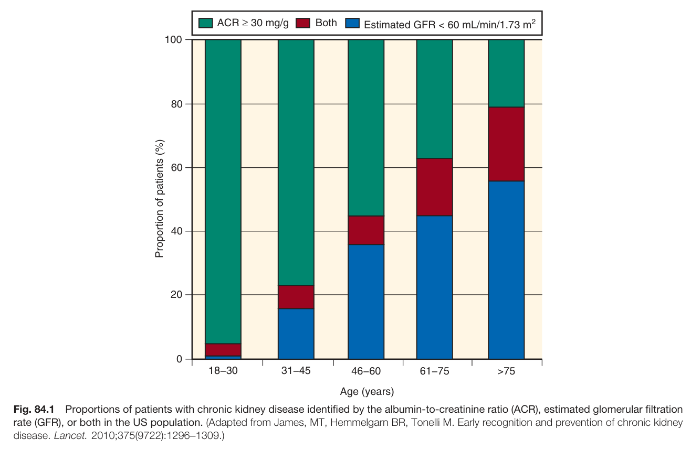

Fig. 84.1 Proportions of patients with chronic kidney disease identified by the albumin-to-creatinine ratio (ACR), estimated glomerular filtration rate (GFR), or both in the US population. (Adapted from James, MT, Hemmelgarn BR, Tonelli M. Early recognition and prevention of chronic kidney disease. Lancet. 2010;375(9722):1296-1309.)

---

### Fig_84_2

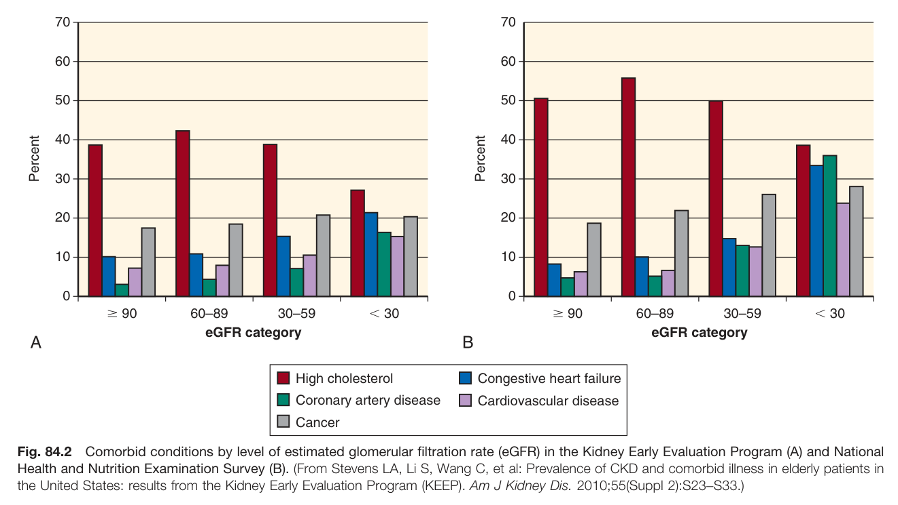

Fig. 84.2 Comorbid conditions by level of estimated glomerular filtration rate (eGFR) in the Kidney Early Evaluation Program (A) and National Health and Nutrition Examination Survey (B). (From Stevens LA, Li S, Wang C, et al: Prevalence of CKD and comorbid illness in elderly patients in the United States: results from the Kidney Early Evaluation Program (KEEP). Am J Kidney Dis. 2010;55(Suppl 2):S23-S33.)

---

### Fig_84_3

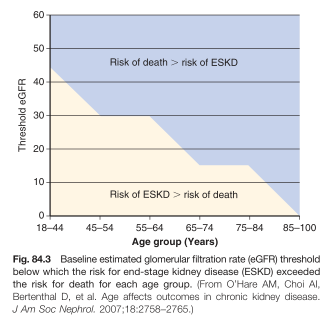

Fig. 84.3 Baseline estimated glomerular filtration rate (eGFR) threshold below which the risk for end-stage kidney disease (ESKD) exceeded the risk for death for each age group. (From O'Hare AM, Choi Al, Bertenthal D, et al. Age affects outcomes in chronic kidney disease. J Am Soc Nephrol. 2007;18:2758-2765.)

---

### Fig_84_4

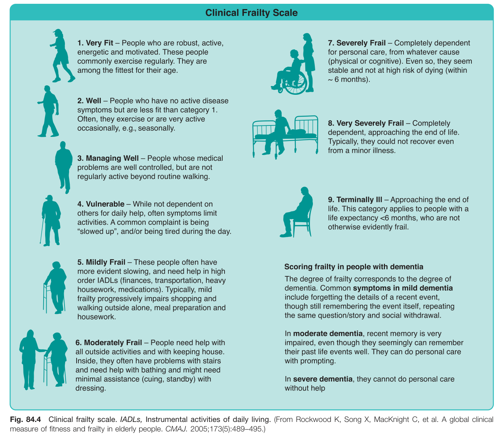

Fig. 84.4 Clinical frailty scale. IADLs, Instrumental activities of daily living. (From Rockwood K, Song X, MacKnight C, et al. A global clinical measure of fitness and frailty in elderly people. CMAJ. 2005;173(5):489-495.)

---

### Fig_84_5

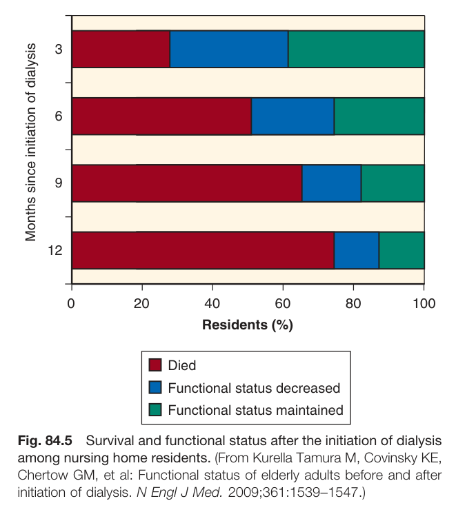

Fig. 84.5 Survival and functional status after the initiation of dialysis among nursing home residents. (From Kurella Tamura M, Covinsky KE, Chertow GM, et al: Functional status of elderly adults before and after initiation of dialysis. N Engl J Med. 2009;361:1539-1547.)

---

### Fig_84_6

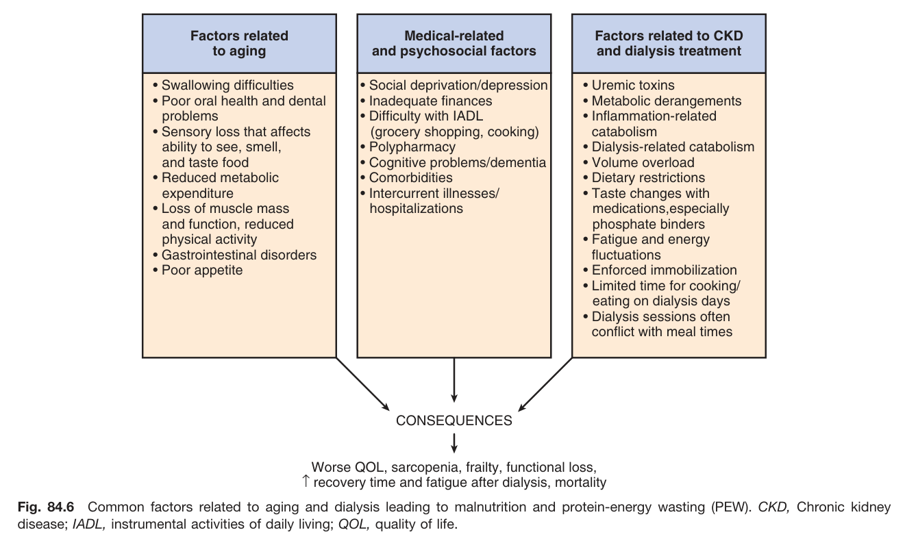

Fig. 84.6 Common factors related to aging and dialysis leading to malnutrition and protein-energy wasting (PEW). CKD, Chronic kidney disease; IADL, instrumental activities of daily living; QOL, quality of life.

---

### Fig_84_7

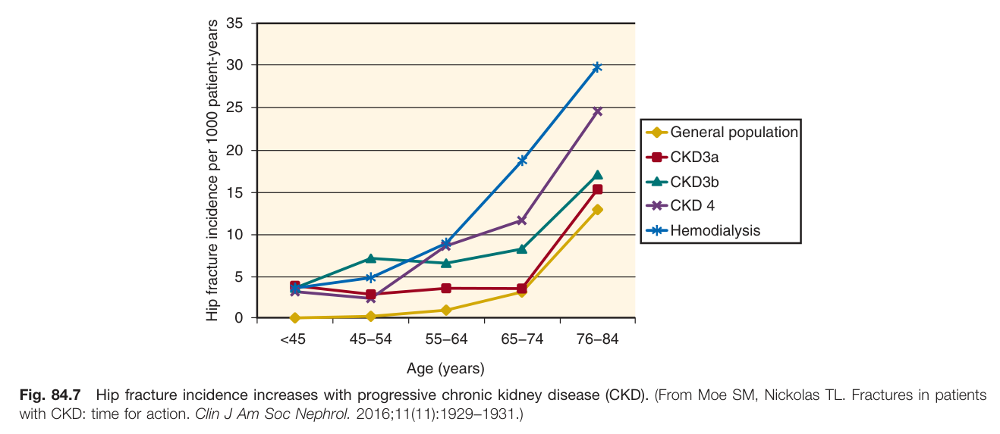

Fig. 84.7 Hip fracture incidence increases with progressive chronic kidney disease (CKD). (From Moe SM, Nickolas TL. Fractures in patients with CKD: time for action. Clin J Am Soc Nephrol. 2016;11(11):1929-1931.)

---

### Fig_84_8

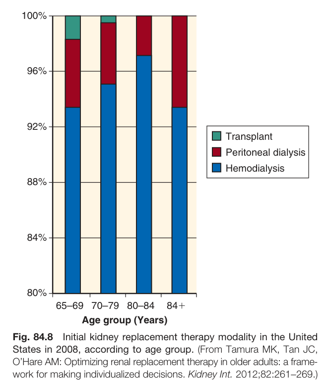

Fig. 84.8 Initial kidney replacement therapy modality in the United States in 2008, according to age group. (From Tamura MK, Tan JC, O'Hare AM: Optimizing renal replacement therapy in older adults: a framework for making individualized decisions. Kidney Int. 2012;82:261-269.)

---

### Fig_84_9

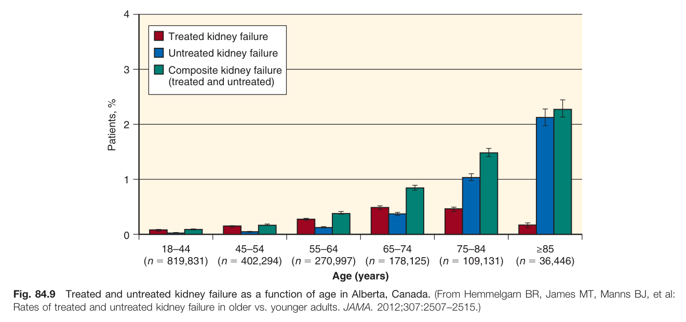

Fig. 84.9 Treated and untreated kidney failure as a function of age in Alberta, Canada. (From Hemmelgarn BR, James MT, Manns BJ, et al: Rates of treated and untreated kidney failure in older vs. younger adults. JAMA. 2012;307:2507-2515.)

---

### Fig_84_10

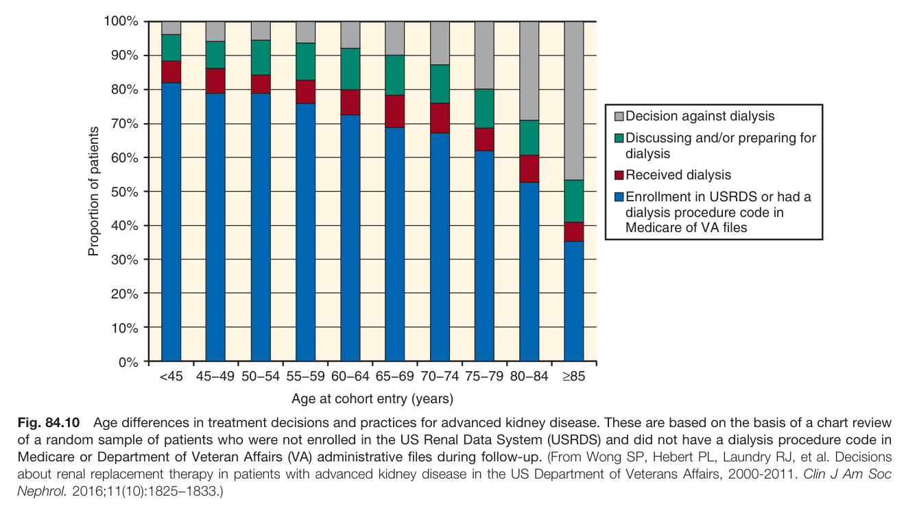

Fig. 84.10 Age differences in treatment decisions and practices for advanced kidney disease. These are based on the basis of a chart review of a random sample of patients who were not enrolled in the US Renal Data System (USRDS) and did not have a dialysis procedure code in Medicare or Department of Veteran Affairs (VA) administrative files during follow-up. (From Wong SP, Hebert PL, Laundry RJ, et al. Decisions about renal replacement therapy in patients with advanced kidney disease in the US Department of Veterans Affairs, 2000-2011. Clin J Am Soc Nephrol. 2016;11(10):1825-1833.)

---

### Fig_84_11

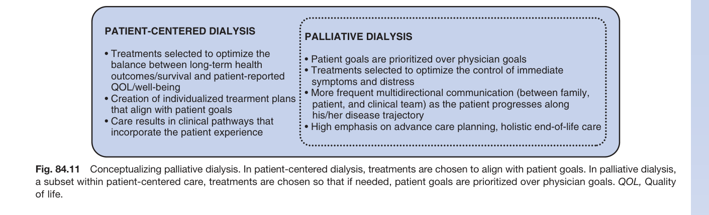

Fig. 84.11 Conceptualizing palliative dialysis. In patient-centered dialysis, treatments are chosen to align with patient goals. In palliative dialysis, a subset within patient-centered care, treatments are chosen so that if needed, patient goals are prioritized over physician goals. QOL, Quality of life.

---

## Tables

### Table_84_1

#### Table Image

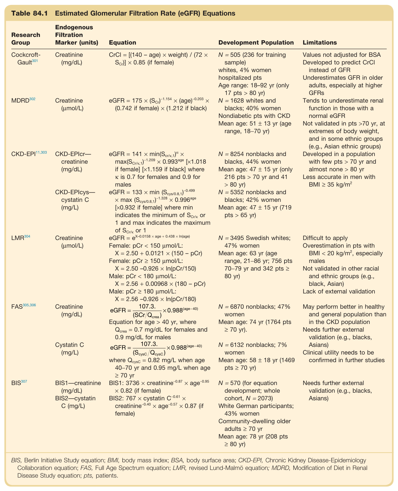

#### Table Data (CSV: [Table_84_1.csv](Table_84_1.csv))

```markdown
| Table Text (OCR) |
| :--- |
| Table 84.1 Estimated Glomerular Filtration Rate (eGFR) Equations Research Group  Endogenous Filtration Marker (units)  Equation  Development Population  Limitations    Cockcroft-Gault ^{301}   Creatinine (mg/dL)   \text{CrCl} = [(140 - \text{age}) \times \text{weight}) / (72 \times \text{S}_{\text{Cr}})] \times 0.85  (if female)  N = 505 (236 for training sample)whites, 4% women hospitalized ptsAge range: 18-92 yr (only 17 pts > 80 yr)  Values not adjusted for BSADeveloped to predict CrCl instead of GFRUnderestimates GFR in older adults, especially at higher GFRs    MDRD ^{302}   Creatinine (μmol/L)   \text{eGFR} = 175 \times (\text{S}_{\text{Cr}})^{-1.154} \times (\text{age})^{-0.203} \times (0.742 \text{ if female}) \times (1.212 \text{ if black})   N = 1628 whites and blacks; 40% womenNondiabetic pts with CKDMean age: 51 ± 13 yr (age range, 18-70 yr)  Tends to underestimate renal function in those with a normal eGFRNot validated in pts >70 yr, at extremes of body weight, and in some ethnic groups (e.g., Asian ethnic groups)    CKD-EPI ^{11,303}   CKD-EPIcr-creatinine (mg/dL)   \text{eGFR} = 141 \times \min(\text{S}_{\text{cr/k,1}})^{\alpha} \times \max(\text{S}_{\text{cr/k,1}})^{-1.209} \times 0.993^{\text{age}} \times [1.018 \text{ if female}] \times [1.159 \text{ if black}] \text{ where } \kappa \text{ is 0.7 for females and 0.9 for males}   N = 8254 nonblacks and blacks, 44% womenMean age: 47 ± 15 yr (only 216 pts > 70 yr and 41 > 80 yr)  Developed in a population with few pts > 70 yr and almost none > 80 yrLess accurate in men with BMI ≥ 35 kg/m ^{2}     CKD-EPIcys-cystatin C (mg/L)   \text{eGFR} = 133 \times \min(\text{S}_{\text{cys/0.8,1}})^{-0.499} \times \max(\text{S}_{\text{cys/0.8,1}})^{-1.328} \times 0.996^{\text{age}} \times [0.932 \text{ if female}] \text{ where min indicates the minimum of S}_{\text{Cr/k}} \text{ or 1 and max indicates the maximum of S}_{\text{Cr/k}} \text{ or 1}   N = 5352 nonblacks and blacks; 42% womenMean age: 47 ± 15 yr (719 pts > 65 yr)      LMR ^{304}   Creatinine (μmol/L)   \text{eGFR} = \text{e}^{X-0.0158 \times \text{age} + 0.438 \times \ln(\text{age})} Female: pCr < 150 μmol/L:X = 2.50 + 0.0121 × (150 - pCr)Female: pCr ≥ 150 μmol/L:X = 2.50 -0.926 × ln(pCr/150)Male: pCr < 180 μmol/L:X = 2.56 + 0.00968 × (180 - pCr)Male: pCr ≥ 180 μmol/L:X = 2.56 -0.926 × ln(pCr/180)  N = 3495 Swedish whites; 47% womenMean age: 63 yr (age range, 21-86 yr; 756 pts 70-79 yr and 342 pts ≥ 80 yr)  Difficult to applyOverestimation in pts with BMI < 20 kg/m ^{2} , especially malesNot validated in other racial and ethnic groups (e.g., black, Asian)Lack of external validation    FAS ^{305,306}   Creatinine (mg/dL)   \text{eGFR} = \frac{107.3.}{(\text{SCr/Q}_{\text{crea}})} \times 0.988^{\text{(age-40)}} Equation for age > 40 yr, where  \text{Q}_{\text{crea}} = 0.7 \text{ mg/dL for females and 0.9 mg/dL for males}   N = 6870 nonblacks; 47% womenMean age: 74 yr (1764 pts ≥ 70 yr).  May perform better in healthy and general population than in the CKD populationNeeds further external validation (e.g., blacks, Asians)Clinical utility needs to be confirmed in further studies    Cystatin C (mg/L)   \text{eGFR} = \frac{107.3.}{(\text{S}_{\text{cysC}} / \text{Q}_{\text{cysC}})} \times 0.988^{\text{(age-40)}} where  \text{Q}_{\text{cysC}} = 0.82 \text{ mg/L when age 40-70 yr and 0.95 mg/L when age ≥ 70 yr}   N = 6132 nonblacks; 7% womenMean age: 58 ± 18 yr (1469 pts ≥ 70 yr)    BIS ^{307}   BIS1-creatinine (mg/dL)   \text{BIS1: 3736 \times creatinine^{-0.87} \times age^{-0.95} \times 0.82 (if female)}   N = 570 (for equation development; whole cohort, N = 2073)  Needs further external validation (e.g., blacks, Asians)    BIS2-cystatin C (mg/L)   \text{BIS2: 767 \times cystatin C^{-0.61} \times creatinine^{-0.40} \times age^{-0.57} \times 0.87 (if female)}   White German participants; 43% womenCommunity-dwelling older adults ≥ 70 yrMean age: 78 yr (208 pts ≥ 80 yr) BIS, Berlin Initiative Study equation; BMI, body mass index; BSA, body surface area; CKD-EPI, Chronic Kidney Disease-Epidemiology Collaboration equation; FAS, Full Age Spectrum equation; LMR, revised Lund-Malmö equation; MDRD, Modification of Diet in Renal Disease Study equation; pts, patients. |
```

Table 84.1 Estimated Glomerular Filtration Rate (eGFR) Equations | Research Group | Endogenous Filtration Marker (units) | Equation | Development Population | Limitations | | :--- | :--- | :--- | :--- | :--- | | Cockcroft-Gault | Creatinine (mg/dL) | CrCl = [(140 - age) × weight) / (72 x Scr)] x 0.85 (if female) | N = 505 (236 for training sample) whites, 4% women hospitalized pts Age range: 18-92 yr (only 17 pts > 80 yr) | Values not adjusted for BSA Developed to predict CrCl instead of GFR Underestimates GFR in older adults, especially at higher GFRs | | MDRD | Creatinine (μmol/L) | eGFR = 175 x (Scr)-1.154 × (age)-0.203 × (0.742 if female) × (1.212 if black) | N = 1628 whites and blacks; 40% women Nondiabetic pts with CKD Mean age: 51 ± 13 yr (age range, 18-70 yr) | Tends to underestimate renal function in those with a normal eGFR | | CKD-EPI | CKD-EPIcr-creatinine (mg/dL) | eGFR = 141 x min (Scr/K,1) × max(SCr/k,1)-1.209 × 0.993age [×1.018 if female] [x1.159 if black] where к is 0.7 for females and 0.9 for males | N = 8254 nonblacks and blacks, 44% women Mean age: 47 ± 15 yr (only 216 pts > 70 yr and 41 > 80 yr) | Not validated in pts >70 yr, at extremes of body weight, and in some ethnic groups (e.g., Asian ethnic groups) | | | CKD-EPIcys-cystatin C (mg/L) | eGFR = 133 x min (Scys/0.8,1)-0.499 × max (Scys/0.8,1)-1.328 × 0.996age [x0.932 if female] where min indicates the minimum of Scr/k or 1 and max indicates the maximum of Scr/k or 1 | N = 5352 nonblacks and blacks; 42% women Mean age: 47 ± 15 yr (719 pts > 65 yr) | Developed in a population with few pts > 70 yr and almost none > 80 yr Less accurate in men with BMI ≥ 35 kg/m² | | LMR | Creatinine (μmol/L) | eGFR = eX-0.0158 × age + 0.438 × In(age) Female: pCr < 150 µmol/L: X = 2.50 +0.0121 × (150 - pCr) Female: pCr ≥ 150 µmol/L: X = 2.50 -0.926 × In(pCr/150) Male: pCr < 180 μmol/L: X = 2.56 + 0.00968 × (180 - pCr) Male: pCr ≥ 180 µmol/L: X = 2.56 -0.926 × In(pCr/180) | N = 3495 Swedish whites; 47% women Mean age: 63 yr (age range, 21-86 yr; 756 pts 70-79 yr and 342 pts ≥ 80 yr) | Difficult to apply Overestimation in pts with BMI < 20 kg/m², especially males | | FAS | Creatinine (mg/dL) | eGFR = 107.3 / (SCr/Qcrea) × 0.988(age-40) Equation for age > 40 yr, where Qcrea = 0.7 mg/dL for females and 0.9 mg/dL for males | N = 6870 nonblacks; 47% women Mean age: 74 yr (1764 pts ≥ 70 yr). | Not validated in other racial and ethnic groups (e.g., black, Asian) Lack of external validation | | | Cystatin C (mg/L) | eGFR = 107.3 / (ScysC/Qcysc) × 0.988(age-40) where Qcysc = 0.82 mg/L when age 40-70 yr and 0.95 mg/L when age ≥ 70 yr | N = 6132 nonblacks; 7% women Mean age: 58 ± 18 yr (1469 pts ≥ 70 yr) | May perform better in healthy and general population than in the CKD population Needs further external validation (e.g., blacks, Asians) Clinical utility needs to be confirmed in further studies | | BIS | BIS1-creatinine (mg/dL) BIS2-cystatin C (mg/L) | BIS1: 3736 × creatinine-0.87 × age-0.95 × 0.82 (if female) BIS2: 767 × cystatin C-0.61 × creatinine-0.40 × age-0.57 x 0.87 (if female) | N = 570 (for equation development; whole cohort, N = 2073) White German participants; 43% women Community-dwelling older adults ≥ 70 yr Mean age: 78 yr (208 pts ≥ 80 yr) | Needs further external validation (e.g., blacks, Asians) | BIS, Berlin Initiative Study equation; BMI, body mass index; BSA, body surface area; CKD-EPI, Chronic Kidney Disease-Epidemiology Collaboration equation; FAS, Full Age Spectrum equation; LMR, revised Lund-Malmö equation; MDRD, Modification of Diet in Renal Disease Study equation; pts, patients.

---

### Table_84_2

#### Table Image

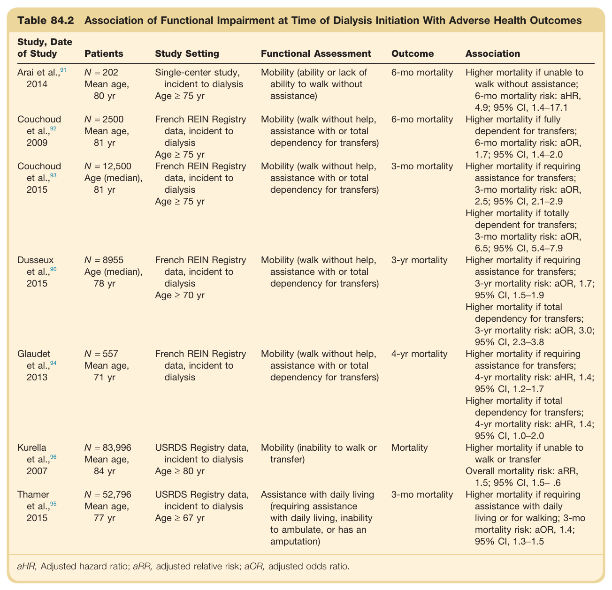

#### Table Data (CSV: [Table_84_2.csv](Table_84_2.csv))

```markdown
| Table Text (OCR) |
| :--- |
| Table 84.2 Association of Functional Impairment at Time of Dialysis Initiation With Adverse Health Outcomes Study, Date of Study  Patients  Study Setting  Functional Assessment  Outcome  Association    Arai et al., ^{91} 2014  N = 202Mean age,80 yr  Single-center study, incident to dialysisAge ≥ 75 yr  Mobility (ability or lack of ability to walk without assistance)  6-mo mortality  Higher mortality if unable to walk without assistance;6-mo mortality risk: aHR, 4.9; 95% CI, 1.4–17.1    Couchoud et al., ^{92} 2009  N = 2500Mean age,81 yr  French REIN Registry data, incident to dialysisAge ≥ 75 yr  Mobility (walk without help, assistance with or total dependency for transfers)  6-mo mortality  Higher mortality if fully dependent for transfers;6-mo mortality risk: aOR, 1.7; 95% CI, 1.4–2.0    Couchoud et al., ^{93} 2015  N = 12,500Age (median),81 yr  French REIN Registry data, incident to dialysisAge ≥ 75 yr  Mobility (walk without help, assistance with or total dependency for transfers)  3-mo mortality  Higher mortality if requiring assistance for transfers;3-mo mortality risk: aOR, 2.5; 95% CI, 2.1–2.9Higher mortality if totally dependent for transfers;3-mo mortality risk: aOR, 6.5; 95% CI, 5.4–7.9    Dusseux et al., ^{90} 2015  N = 8955Age (median),78 yr  French REIN Registry data, incident to dialysisAge ≥ 70 yr  Mobility (walk without help, assistance with or total dependency for transfers)  3-yr mortality  Higher mortality if requiring assistance for transfers;3-yr mortality risk: aOR, 1.7; 95% CI, 1.5–1.9Higher mortality if total dependency for transfers;3-yr mortality risk: aOR, 3.0; 95% CI, 2.3–3.8    Glaudet et al., ^{94} 2013  N = 557Mean age,71 yr  French REIN Registry data, incident to dialysis  Mobility (walk without help, assistance with or total dependency for transfers)  4-yr mortality  Higher mortality if requiring assistance for transfers;4-yr mortality risk: aHR, 1.4; 95% CI, 1.2–1.7Higher mortality if total dependency for transfers;4-yr mortality risk: aHR, 1.4; 95% CI, 1.0–2.0    Kurella et al., ^{96} 2007  N = 83,996Mean age,84 yr  USRDS Registry data, incident to dialysisAge ≥ 80 yr  Mobility (inability to walk or transfer)  Mortality  Higher mortality if unable to walk or transferOverall mortality risk: aRR, 1.5; 95% CI, 1.5– .6    Thamer et al., ^{95} 2015  N = 52,796Mean age,77 yr  USRDS Registry data, incident to dialysisAge ≥ 67 yr  Assistance with daily living (requiring assistance with daily living, inability to ambulate, or has an amputation)  3-mo mortality  Higher mortality if requiring assistance with daily living or for walking; 3-mo mortality risk: aOR, 1.4; 95% CI, 1.3–1.5 aHR, Adjusted hazard ratio; aRR, adjusted relative risk; aOR, adjusted odds ratio. |
```

Table 84.2 Association of Functional Impairment at Time of Dialysis Initiation With Adverse Health Outcomes | Study, Date of Study | Patients | Study Setting | Functional Assessment | Outcome | Association | | :--- | :--- | :--- | :--- | :--- | :--- | | Arai et al., 2014 | N = 202 Mean age, 80 yr | Single-center study, incident to dialysis Age ≥ 75 yr | Mobility (ability or lack of ability to walk without assistance) | 6-mo mortality | Higher mortality if unable to walk without assistance; 6-mo mortality risk: aHR, 4.9; 95% CI, 1.4-17.1 | | Couchoud et al., 2009 | N = 2500 Mean age, 81 yr | French REIN Registry data, incident to dialysis Age ≥ 75 yr | Mobility (walk without help, assistance with or total dependency for transfers) | 6-mo mortality | Higher mortality if fully dependent for transfers; 6-mo mortality risk: aOR, 1.7; 95% CI, 1.4-2.0 | | Couchoud et al., 2015 | N = 12,500 Age (median), 81 yr | French REIN Registry data, incident to dialysis Age ≥ 75 yr | Mobility (walk without help, assistance with or total dependency for transfers) | 3-mo mortality | Higher mortality if requiring assistance for transfers; 3-mo mortality risk: aOR, 2.5; 95% CI, 2.1-2.9 Higher mortality if totally dependent for transfers; 3-mo mortality risk: aOR, 6.5; 95% CI, 5.4-7.9 | | Dusseux et al., 2015 | N = 8955 Age (median), 78 yr | French REIN Registry data, incident to dialysis Age ≥ 70 yr | Mobility (walk without help, assistance with or total dependency for transfers) | 3-yr mortality | Higher mortality if requiring assistance for transfers; 3-yr mortality risk: aOR, 1.7; 95% CI, 1.5-1.9 Higher mortality if total dependency for transfers; 3-yr mortality risk: aOR, 3.0; 95% CI, 2.3-3.8 | | Glaudet et al., 2013 | N = 557 Mean age, 71 yr | French REIN Registry data, incident to dialysis | Mobility (walk without help, assistance with or total dependency for transfers) | 4-yr mortality | Higher mortality if requiring assistance for transfers; 4-yr mortality risk: aHR, 1.4; 95% CI, 1.2-1.7 Higher mortality if total dependency for transfers; 4-yr mortality risk: aHR, 1.4; 95% CI, 1.0-2.0 | | Kurella et al., 2007 | N = 83,996 Mean age, 84 yr | USRDS Registry data, incident to dialysis Age ≥ 80 yr | Mobility (inability to walk or transfer) | Mortality | Higher mortality if unable to walk or transfer Overall mortality risk: aRR, 1.5; 95% CI, 1.5-.6 | | Thamer et al., 2015 | N = 52,796 Mean age, 77 yr | USRDS Registry data, incident to dialysis Age ≥ 67 yr | Assistance with daily living (requiring assistance with daily living, inability to ambulate, or has an amputation) | 3-mo mortality | Higher mortality if requiring assistance with daily living or for walking; 3-mo mortality risk: aOR, 1.4; 95% CI, 1.3-1.5 | aHR, Adjusted hazard ratio; aRR, adjusted relative risk; aOR, adjusted odds ratio.

---

### Table_84_3

#### Table Image

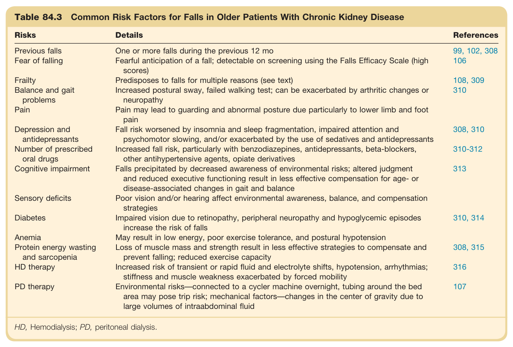

#### Table Data (CSV: [Table_84_3.csv](Table_84_3.csv))

```markdown
| Table Text (OCR) |
| :--- |
| Table 84.3 Common Risk Factors for Falls in Older Patients With Chronic Kidney Disease Risks  Details  References    Previous falls  One or more falls during the previous 12 mo  99, 102, 308    Fear of falling  Fearful anticipation of a fall; detectable on screening using the Falls Efficacy Scale (high scores)  106    Frailty  Predisposes to falls for multiple reasons (see text)  108, 309    Balance and gait problems  Increased postural sway, failed walking test; can be exacerbated by arthritic changes or neuropathy  310    Pain  Pain may lead to guarding and abnormal posture due particularly to lower limb and foot pain      Depression and antidepressants  Fall risk worsened by insomnia and sleep fragmentation, impaired attention and psychomotor slowing, and/or exacerbated by the use of sedatives and antidepressants  308, 310    Number of prescribed oral drugs  Increased fall risk, particularly with benzodiazepines, antidepressants, beta-blockers, other antihypertensive agents, opiate derivatives  310-312    Cognitive impairment  Falls precipitated by decreased awareness of environmental risks; altered judgment and reduced executive functioning result in less effective compensation for age- or disease-associated changes in gait and balance  313    Sensory deficits  Poor vision and/or hearing affect environmental awareness, balance, and compensation strategies      Diabetes  Impaired vision due to retinopathy, peripheral neuropathy and hypoglycemic episodes increase the risk of falls  310, 314    Anemia  May result in low energy, poor exercise tolerance, and postural hypotension      Protein energy wasting and sarcopenia  Loss of muscle mass and strength result in less effective strategies to compensate and prevent falling; reduced exercise capacity  308, 315    HD therapy  Increased risk of transient or rapid fluid and electrolyte shifts, hypotension, arrhythmias; stiffness and muscle weakness exacerbated by forced mobility  316    PD therapy  Environmental risks—connected to a cycler machine overnight, tubing around the bed area may pose trip risk; mechanical factors—changes in the center of gravity due to large volumes of intraabdominal fluid  107 HD, Hemodialysis; PD, peritoneal dialysis. |
```

Table 84.3 Common Risk Factors for Falls in Older Patients With Chronic Kidney Disease | Risks | Details | | :--- | :--- | | Previous falls | One or more falls during the previous 12 mo | | Fear of falling | Fearful anticipation of a fall; detectable on screening using the Falls Efficacy Scale (high scores) | | Frailty | Predisposes to falls for multiple reasons (see text) | | Balance and gait problems | Increased postural sway, failed walking test; can be exacerbated by arthritic changes or neuropathy | | Pain | Pain may lead to guarding and abnormal posture due particularly to lower limb and foot pain | | Depression and antidepressants | Fall risk worsened by insomnia and sleep fragmentation, impaired attention and psychomotor slowing, and/or exacerbated by the use of sedatives and antidepressants | | Number of prescribed oral drugs | Increased fall risk, particularly with benzodiazepines, antidepressants, beta-blockers, other antihypertensive agents, opiate derivatives | | Cognitive impairment | Falls precipitated by decreased awareness of environmental risks; altered judgment and reduced executive functioning result in less effective compensation for age- or disease-associated changes in gait and balance | | Sensory deficits | Poor vision and/or hearing affect environmental awareness, balance, and compensation strategies | | Diabetes | Impaired vision due to retinopathy, peripheral neuropathy and hypoglycemic episodes increase the risk of falls | | Anemia | May result in low energy, poor exercise tolerance, and postural hypotension | | Protein energy wasting and sarcopenia | Loss of muscle mass and strength result in less effective strategies to compensate and prevent falling; reduced exercise capacity | | HD therapy | Increased risk of transient or rapid fluid and electrolyte shifts, hypotension, arrhythmias; stiffness and muscle weakness exacerbated by forced mobility | | PD therapy | Environmental risks-connected to a cycler machine overnight, tubing around the bed area may pose trip risk; mechanical factors-changes in the center of gravity due to large volumes of intraabdominal fluid | HD, Hemodialysis; PD, peritoneal dialysis.

---

### Table_84_4

#### Table Images (2 Parts)

- **Part 1 (Page 11)**:
  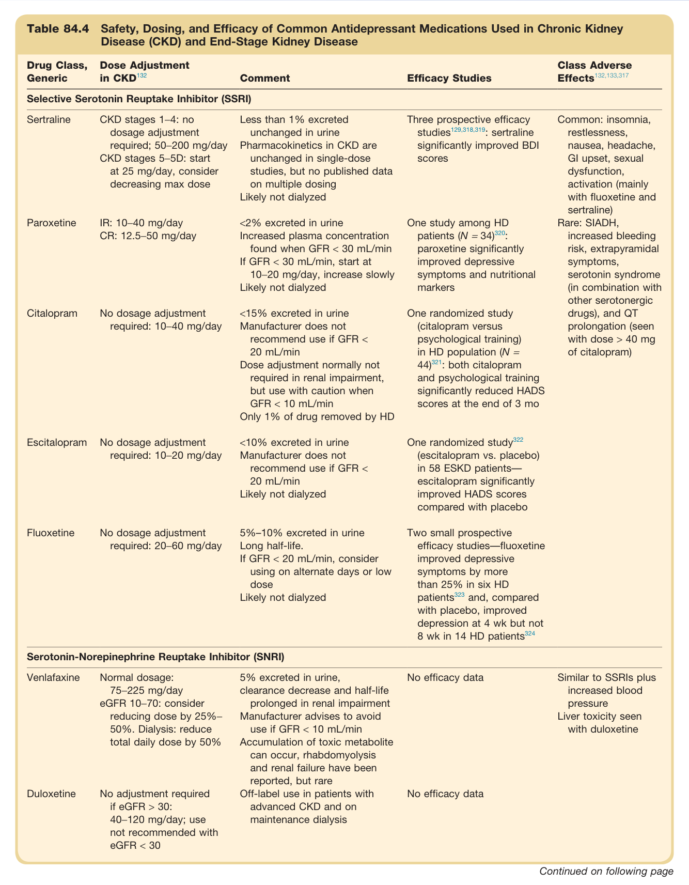

- **Part 2 (Page 12)**:
  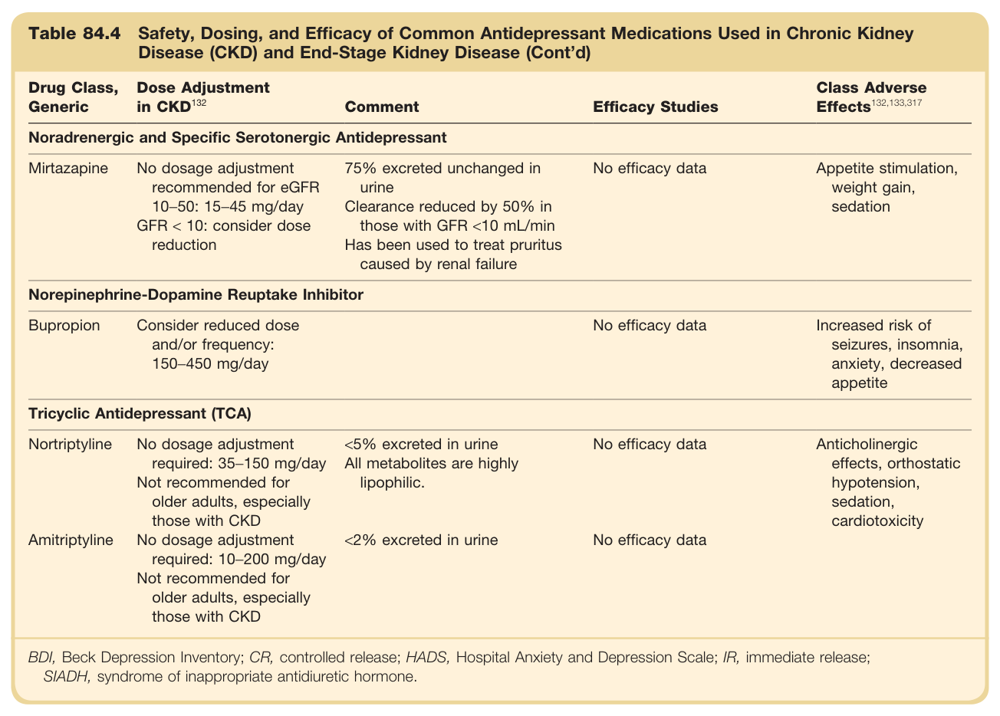

#### Table Data (CSV: [Table_84_4.csv](Table_84_4.csv))

```markdown
| Table Text (OCR) |
| :--- |
| Table 84.4 Safety, Dosing, and Efficacy of Common Antidepressant Medications Used in Chronic Kidney Disease (CKD) and End-Stage Kidney Disease Drug Class, Generic  Dose Adjustment in CKD ^{132}   Comment  Efficacy Studies  Class Adverse Effects ^{132,133,317}     Selective Serotonin Reuptake Inhibitor (SSRI)    Sertraline  CKD stages 1–4: no dosage adjustment required; 50–200 mg/dayCKD stages 5–5D: start at 25 mg/day, consider decreasing max dose  Less than 1% excreted unchanged in urinePharmacokinetics in CKD are unchanged in single-dose studies, but no published data on multiple dosingLikely not dialyzed  Three prospective efficacy studies ^{129,318,319} : sertraline significantly improved BDI scores  Common: insomnia, restlessness, nausea, headache, GI upset, sexual dysfunction, activation (mainly with fluoxetine and sertraline)    Paroxetine  IR: 10–40 mg/dayCR: 12.5–50 mg/day  <2% excreted in urineIncreased plasma concentration found when GFR < 30 mL/minIf GFR < 30 mL/min, start at 10–20 mg/day, increase slowlyLikely not dialyzed  One study among HD patients ( N = 34 ) ^{320} : paroxetine significantly improved depressive symptoms and nutritional markers  Rare: SIADH, increased bleeding risk, extrapyramidal symptoms, serotonin syndrome (in combination with other serotonergic drugs), and QT prolongation (seen with dose > 40 mg of citalopram)    Citalopram  No dosage adjustment required: 10–40 mg/day  <15% excreted in urineManufacturer does not recommend use if GFR < 20 mL/minDose adjustment normally not required in renal impairment, but use with caution when GFR < 10 mL/minOnly 1% of drug removed by HD  One randomized study (citalopram versus psychological training) in HD population ( N = 44 ) ^{321} : both citalopram and psychological training significantly reduced HADS scores at the end of 3 mo      Escitalopram  No dosage adjustment required: 10–20 mg/day  <10% excreted in urineManufacturer does not recommend use if GFR < 20 mL/minLikely not dialyzed  One randomized study ^{322} (escitalopram vs. placebo) in 58 ESKD patients—escitalopram significantly improved HADS scores compared with placebo      Fluoxetine  No dosage adjustment required: 20–60 mg/day  5%–10% excreted in urineLong half-life.If GFR < 20 mL/min, consider using on alternate days or low doseLikely not dialyzed  Two small prospective efficacy studies—fluoxetine improved depressive symptoms by more than 25% in six HD patients ^{323}  and, compared with placebo, improved depression at 4 wk but not 8 wk in 14 HD patients ^{324}       Serotonin-Norepinephrine Reuptake Inhibitor (SNRI)    Venlafaxine  Normal dosage: 75–225 mg/dayeGFR 10–70: consider reducing dose by 25%–50%. Dialysis: reduce total daily dose by 50%  5% excreted in urine, clearance decrease and half-life prolonged in renal impairmentManufacturer advises to avoid use if GFR < 10 mL/minAccumulation of toxic metabolite can occur, rhabdomyolysis and renal failure have been reported, but rare  No efficacy data  Similar to SSRIs plus increased blood pressureLiver toxicity seen with duloxetine    Duloxetine  No adjustment required if eGFR > 30: 40–120 mg/day; use not recommended with eGFR < 30  Off-label use in patients with advanced CKD and on maintenance dialysis  No efficacy data      Noradrenergic and Specific Serotonergic Antidepressant    Mirtazapine  No dosage adjustment recommended for eGFR 10-50: 15-45 mg/dayGFR < 10: consider dose reduction  75% excreted unchanged in urineClearance reduced by 50% in those with GFR <10 mL/minHas been used to treat pruritus caused by renal failure  No efficacy data  Appetite stimulation, weight gain, sedation    Norepinephrine-Dopamine Reuptake Inhibitor    Bupropion  Consider reduced dose and/or frequency: 150-450 mg/day    No efficacy data  Increased risk of seizures, insomnia, anxiety, decreased appetite    Tricyclic Antidepressant (TCA)    Nortriptyline  No dosage adjustment required: 35-150 mg/dayNot recommended for older adults, especially those with CKD  <5% excreted in urineAll metabolites are highly lipophilic.  No efficacy data  Anticholinergic effects, orthostatic hypotension, sedation, cardiotoxicity    Amitriptyline  No dosage adjustment required: 10-200 mg/dayNot recommended for older adults, especially those with CKD  <2% excreted in urine  No efficacy data      BDI, Beck Depression Inventory; CR, controlled release; HADS, Hospital Anxiety and Depression Scale; IR, immediate release; SIADH, syndrome of inappropriate antidiuretic hormone. |
```

Table 84.4 Safety, Dosing, and Efficacy of Common Antidepressant Medications Used in Chronic Kidney Disease (CKD) and End-Stage Kidney Disease | Drug Class, Generic | Dose Adjustment in CKD | Comment | Efficacy Studies | Class Adverse Effects | | :--- | :--- | :--- | :--- | :--- | | **Selective Serotonin Reuptake Inhibitor (SSRI)** | | | | | | Sertraline | CKD stages 1-4: no dosage adjustment required; 50-200 mg/day CKD stages 5-5D: start at 25 mg/day, consider decreasing max dose | Less than 1% excreted unchanged in urine Pharmacokinetics in CKD are unchanged in single-dose studies, but no published data on multiple dosing Likely not dialyzed | Three prospective efficacy studies: sertraline significantly improved BDI scores | Common: insomnia, restlessness, nausea, headache, Gl upset, sexual dysfunction, activation (mainly with fluoxetine and sertraline) Rare: SIADH, increased bleeding risk, extrapyramidal symptoms, serotonin syndrome (in combination with other serotonergic drugs), and QT prolongation (seen with dose > 40 mg of citalopram) | | Paroxetine | IR: 10-40 mg/day CR: 12.5-50 mg/day | <2% excreted in urine Increased plasma concentration found when GFR < 30 mL/min If GFR < 30 mL/min, start at 10-20 mg/day, increase slowly Likely not dialyzed | One study among HD patients (N = 34): paroxetine significantly improved depressive symptoms and nutritional markers | | | Citalopram | No dosage adjustment required: 10-40 mg/day | <15% excreted in urine Manufacturer does not recommend use if GFR < 20 mL/min Dose adjustment normally not required in renal impairment, but use with caution when GFR < 10 mL/min Only 1% of drug removed by HD | One randomized study (citalopram versus psychological training) in HD population (N = 44): both citalopram and psychological training significantly reduced HADS scores at the end of 3 mo | | | Escitalopram | No dosage adjustment required: 10-20 mg/day | <10% excreted in urine Manufacturer does not recommend use if GFR < 20 mL/min Likely not dialyzed | One randomized study (escitalopram vs. placebo) in 58 ESKD patients-escitalopram significantly improved HADS scores compared with placebo | | | Fluoxetine | No dosage adjustment required: 20-60 mg/day | 5%-10% excreted in urine Long half-life. If GFR < 20 mL/min, consider using on alternate days or low dose Likely not dialyzed | Two small prospective efficacy studies-fluoxetine improved depressive symptoms by more than 25% in six HD patients and, compared with placebo, improved depression at 4 wk but not 8 wk in 14 HD patients | | | **Serotonin-Norepinephrine Reuptake Inhibitor (SNRI)** | | | | | | Venlafaxine | Normal dosage: 75-225 mg/day eGFR 10-70: consider reducing dose by 25%-50%. Dialysis: reduce total daily dose by 50% | 5% excreted in urine, clearance decrease and half-life prolonged in renal impairment Manufacturer advises to avoid use if GFR < 10 mL/min Accumulation of toxic metabolite can occur, rhabdomyolysis and renal failure have been reported, but rare | No efficacy data | Similar to SSRIs plus increased blood pressure | | Duloxetine | No adjustment required if eGFR > 30: 40-120 mg/day; use not recommended with eGFR < 30 | Off-label use in patients with advanced CKD and on maintenance dialysis | No efficacy data | Liver toxicity seen with duloxetine | | **Noradrenergic and Specific Serotonergic Antidepressant** | | | | | | Mirtazapine | No dosage adjustment recommended for eGFR 10-50: 15-45 mg/day GFR < 10: consider dose reduction | 75% excreted unchanged in urine Clearance reduced by 50% in those with GFR <10 mL/min Has been used to treat pruritus caused by renal failure | No efficacy data | Appetite stimulation, weight gain, sedation | | **Norepinephrine-Dopamine Reuptake Inhibitor** | | | | | | Bupropion | Consider reduced dose and/or frequency: 150-450 mg/day | | No efficacy data | Increased risk of seizures, insomnia, anxiety, decreased appetite | | **Tricyclic Antidepressant (TCA)** | | | | | | Nortriptyline | No dosage adjustment required: 35-150 mg/day Not recommended for older adults, especially those with CKD | <5% excreted in urine All metabolites are highly lipophilic. | No efficacy data | Anticholinergic effects, orthostatic hypotension, sedation, cardiotoxicity | | Amitriptyline | No dosage adjustment required: 10-200 mg/day Not recommended for older adults, especially those with CKD | <2% excreted in urine | No efficacy data | | BDI, Beck Depression Inventory; CR, controlled release; HADS, Hospital Anxiety and Depression Scale; IR, immediate release; SIADH, syndrome of inappropriate antidiuretic hormone.

---

### Table_84_5

#### Table Image

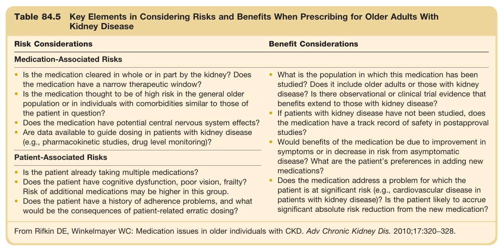

#### Table Data (CSV: [Table_84_5.csv](Table_84_5.csv))

```markdown
| Table Text (OCR) |
| :--- |
| Table 84.5 Key Elements in Considering Risks and Benefits When Prescribing for Older Adults With Kidney Disease Risk Considerations  Benefit Considerations    Medication-Associated Risks    Is the medication cleared in whole or in part by the kidney? Does the medication have a narrow therapeutic window?Is the medication thought to be of high risk in the general older population or in individuals with comorbidities similar to those of the patient in question?Does the medication have potential central nervous system effects?Are data available to guide dosing in patients with kidney disease (e.g., pharmacokinetic studies, drug level monitoring)?  What is the population in which this medication has been studied? Does it include older adults or those with kidney disease? Is there observational or clinical trial evidence that benefits extend to those with kidney disease?If patients with kidney disease have not been studied, does the medication have a track record of safety in postapproval studies?Would benefits of the medication be due to improvement in symptoms or in decrease in risk from asymptomatic disease? What are the patient’s preferences in adding new medications?Does the medication address a problem for which the patient is at significant risk (e.g., cardiovascular disease in patients with kidney disease)? Is the patient likely to accrue significant absolute risk reduction from the new medication?    Patient-Associated Risks    Is the patient already taking multiple medications?Does the patient have cognitive dysfunction, poor vision, frailty? Risk of additional medications may be higher in this group.Does the patient have a history of adherence problems, and what would be the consequences of patient-related erratic dosing? From Rifkin DE, Winkelmayer WC: Medication issues in older individuals with CKD. Adv Chronic Kidney Dis. 2010;17:320−328. |
```

Table 84.5 Key Elements in Considering Risks and Benefits When Prescribing for Older Adults With Kidney Disease | Risk Considerations | Benefit Considerations | | :--- | :--- | | **Medication-Associated Risks** | | | • Is the medication cleared in whole or in part by the kidney? Does the medication have a narrow therapeutic window? | • What is the population in which this medication has been studied? Does it include older adults or those with kidney disease? Is there observational or clinical trial evidence that benefits extend to those with kidney disease? | | • Is the medication thought to be of high risk in the general older population or in individuals with comorbidities similar to those of the patient in question? | • If patients with kidney disease have not been studied, does the medication have a track record of safety in postapproval studies? | | • Does the medication have potential central nervous system effects? | • Would benefits of the medication be due to improvement in symptoms or in decrease in risk from asymptomatic disease? What are the patient's preferences in adding new medications? | | • Are data available to guide dosing in patients with kidney disease (e.g., pharmacokinetic studies, drug level monitoring)? | • Does the medication address a problem for which the patient is at significant risk (e.g., cardiovascular disease in patients with kidney disease)? Is the patient likely to accrue significant absolute risk reduction from the new medication? | | **Patient-Associated Risks** | | | • Is the patient already taking multiple medications? | | | • Does the patient have cognitive dysfunction, poor vision, frailty? Risk of additional medications may be higher in this group. | | | • Does the patient have a history of adherence problems, and what would be the consequences of patient-related erratic dosing? | | From Rifkin DE, Winkelmayer WC: Medication issues in older individuals with CKD. Adv Chronic Kidney Dis. 2010;17:320-328.

---
