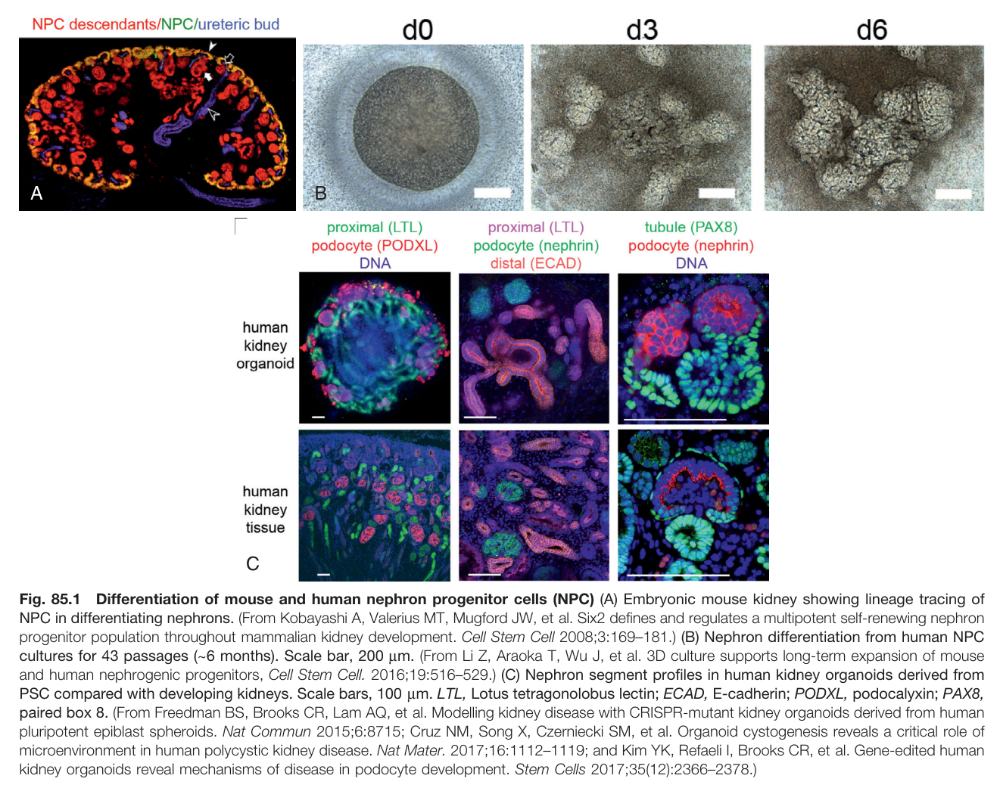
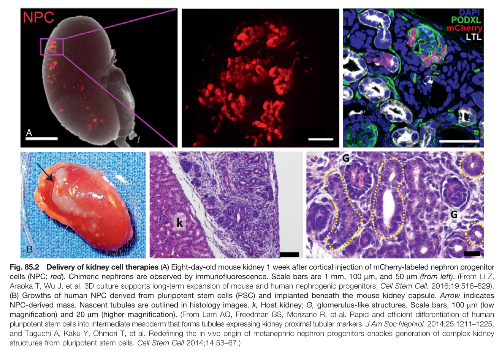
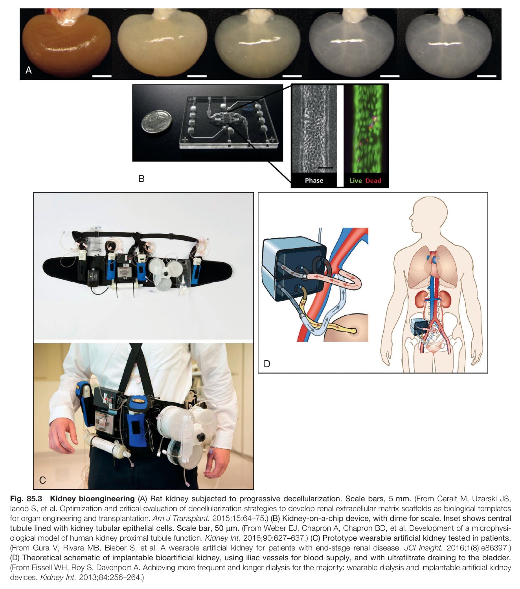
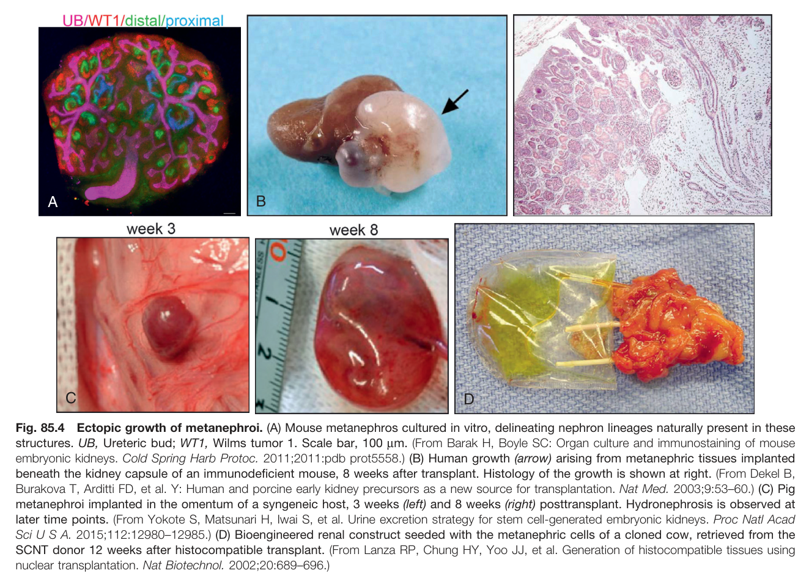
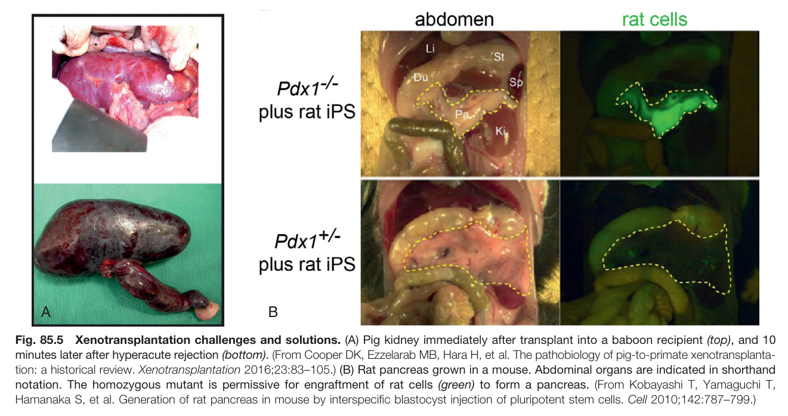
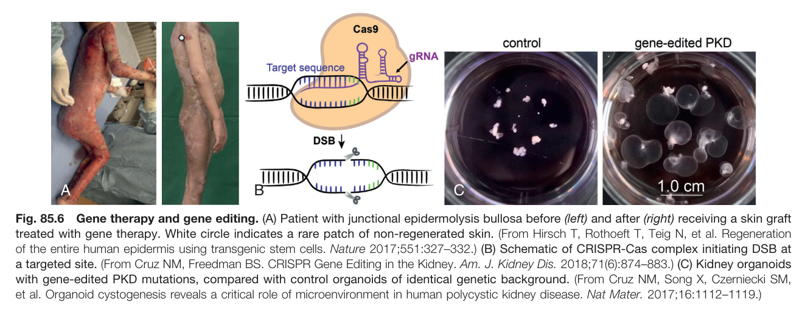

# 85. Stem Cells, Kidney Regeneration, and Gene and Cell Therapy in Nephrology - Figures and Tables Index

This document lists all figures and tables extracted from `85. Stem Cells, Kidney Regeneration, and Gene and Cell Therapy in Nephrology.pdf`.

## Table of Contents
- [Figures](#figures)
- [Tables](#tables)

---

## Figures

### Fig_85_1

Fig. 85.1 Differentiation of mouse and human nephron progenitor cells (NPC) (A) Embryonic mouse kidney showing lineage tracing of NPC in differentiating nephrons. (From Kobayashi A, Valerius MT, Mugford JW, et al. Six2 defines and regulates a multipotent self-renewing nephron progenitor population throughout mammalian kidney development. Cell Stem Cell 2008;3:169-181.) (B) Nephron differentiation from human NPC cultures for 43 passages (~6 months). Scale bar, 200 µm. (From Li Z, Araoka T, Wu J, et al. 3D culture supports long-term expansion of mouse and human nephrogenic progenitors, Cell Stem Cell. 2016;19:516-529.) (C) Nephron segment profiles in human kidney organoids derived from PSC compared with developing kidneys. Scale bars, 100 µm. LTL, Lotus tetragonolobus lectin; ECAD, E-cadherin; PODXL, podocalyxin; PAX8, paired box 8. (From Freedman BS, Brooks CR, Lam AQ, et al. Modelling kidney disease with CRISPR-mutant kidney organoids derived from human pluripotent epiblast spheroids. Nat Commun 2015;6:8715; Cruz NM, Song X, Czerniecki SM, et al. Organoid cystogenesis reveals a critical role of microenvironment in human polycystic kidney disease. Nat Mater. 2017;16:1112-1119; and Kim YK, Refaeli I, Brooks CR, et al. Gene-edited human kidney organoids reveal mechanisms of disease in podocyte development. Stem Cells 2017;35(12):2366-2378.)

---

### Fig_85_2

Fig. 85.2 Delivery of kidney cell therapies (A) Eight-day-old mouse kidney 1 week after cortical injection of mCherry-labeled nephron progenitor cells (NPC; red). Chimeric nephrons are observed by immunofluorescence. Scale bars are 1 mm, 100 µm, and 50 µm (from left). (From Li Z, Araoka T, Wu J, et al. 3D culture supports long-term expansion of mouse and human nephrogenic progenitors, Cell Stem Cell. 2016;19:516-529). (B) Growths of human NPC derived from pluripotent stem cells (PSC) and implanted beneath the mouse kidney capsule. Arrow indicates NPC-derived mass. Nascent tubules are outlined in histology images. k, Host kidney; G, glomerulus-like structures. Scale bars, 100 µm (low magnification) and 20 µm (higher magnification). (From Lam AQ, Freedman BS, Morizane R, et al. Rapid and efficient differentiation of human pluripotent stem cells into intermediate mesoderm that forms tubules expressing kidney proximal tubular markers. J Am Soc Nephrol. 2014;25:1211-1225, and Taguchi A, Kaku Y, Ohmori T, et al. Redefining the in vivo origin of metanephric nephron progenitors enables generation of complex kidney structures from pluripotent stem cells. Cell Stem Cell 2014;14:53-67.)

---

### Fig_85_3

Fig. 85.3 Kidney bioengineering (A) Rat kidney subjected to progressive decellularization. Scale bars, 5 mm. (From Caralt M, Uzarski JS, lacob S, et al. Optimization and critical evaluation of decellularization strategies to develop renal extracellular matrix scaffolds as biological templates for organ engineering and transplantation. Am J Transplant. 2015;15:64-75.) (B) Kidney-on-a-chip device, with dime for scale. Inset shows central tubule lined with kidney tubular epithelial cells. Scale bar, 50 µm. (From Weber EJ, Chapron A, Chapron BD, et al. Development of a microphysiological model of human kidney proximal tubule function. Kidney Int. 2016;90:627-637.) (C) Prototype wearable artificial kidney tested in patients. (From Gura V, Rivara MB, Bieber S, et al. A wearable artificial kidney for patients with end-stage renal disease. JCI Insight. 2016;1(8):e86397.) (D) Theoretical schematic of implantable bioartificial kidney, using iliac vessels for blood supply, and with ultrafiltrate draining to the bladder. (From Fissell WH, Roy S, Davenport A. Achieving more frequent and longer dialysis for the majority: wearable dialysis and implantable artificial kidney devices. Kidney Int. 2013;84:256-264.)

---

### Fig_85_4

Fig. 85.4 Ectopic growth of metanephroi. (A) Mouse metanephros cultured in vitro, delineating nephron lineages naturally present in these structures. UB, Ureteric bud; WT1, Wilms tumor 1. Scale bar, 100 µm. (From Barak H, Boyle SC: Organ culture and immunostaining of mouse embryonic kidneys. Cold Spring Harb Protoc. 2011;2011:pdb prot5558.) (B) Human growth (arrow) arising from metanephric tissues implanted beneath the kidney capsule of an immunodeficient mouse, 8 weeks after transplant. Histology of the growth is shown at right. (From Dekel B, Burakova T, Arditti FD, et al. Y: Human and porcine early kidney precursors as a new source for transplantation. Nat Med. 2003;9:53-60.) (C) Pig metanephroi implanted in the omentum of a syngeneic host, 3 weeks (left) and 8 weeks (right) posttransplant. Hydronephrosis is observed at later time points. (From Yokote S, Matsunari H, Iwai S, et al. Urine excretion strategy for stem cell-generated embryonic kidneys. Proc Natl Acad Sci US A. 2015;112:12980-12985.) (D) Bioengineered renal construct seeded with the metanephric cells of a cloned cow, retrieved from the SCNT donor 12 weeks after histocompatible transplant. (From Lanza RP, Chung HY, Yoo JJ, et al. Generation of histocompatible tissues using nuclear transplantation. Nat Biotechnol. 2002;20:689-696.)

---

### Fig_85_5

Fig. 85.5 Xenotransplantation challenges and solutions. (A) Pig kidney immediately after transplant into a baboon recipient (top), and 10 minutes later after hyperacute rejection (bottom). (From Cooper DK, Ezzelarab MB, Hara H, et al. The pathobiology of pig-to-primate xenotransplantation: a historical review. Xenotransplantation 2016;23:83-105.) (B) Rat pancreas grown in a mouse. Abdominal organs are indicated in shorthand notation. The homozygous mutant is permissive for engraftment of rat cells (green) to form a pancreas. (From Kobayashi T, Yamaguchi T, Hamanaka S, et al. Generation of rat pancreas in mouse by interspecific blastocyst injection of pluripotent stem cells. Cell 2010;142:787-799.)

---

### Fig_85_6

Fig. 85.6 Gene therapy and gene editing. (A) Patient with junctional epidermolysis bullosa before (left) and after (right) receiving a skin graft treated with gene therapy. White circle indicates a rare patch of non-regenerated skin. (From Hirsch T, Rothoeft T, Teig N, et al. Regeneration of the entire human epidermis using transgenic stem cells. Nature 2017;551:327-332.) (B) Schematic of CRISPR-Cas complex initiating DSB at a targeted site. (From Cruz NM, Freedman BS. CRISPR Gene Editing in the Kidney. Am. J. Kidney Dis. 2018;71(6):874-883.) (C) Kidney organoids with gene-edited PKD mutations, compared with control organoids of identical genetic background. (From Cruz NM, Song X, Czerniecki SM, et al. Organoid cystogenesis reveals a critical role of microenvironment in human polycystic kidney disease. Nat Mater. 2017;16:1112-1119.)

---

## Tables

*No tables resolved for this chapter.*
