# 01. Embryology of the Kidney - Figures and Tables Index

This document lists all figures and tables extracted from `01. Embryology of the Kidney.pdf`.

## Table of Contents
- [Figures](#figures)
- [Tables](#tables)

---

## Figures

### Fig_1_1

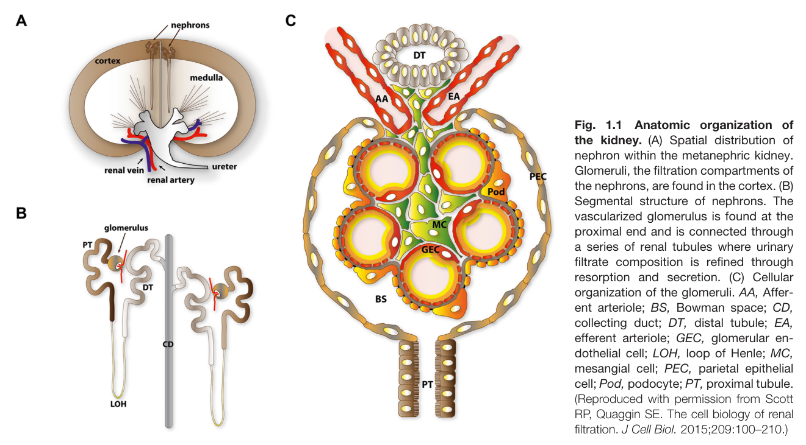

Fig. 1.1 Anatomic organization of the kidney. (A) Spatial distribution of nephron within the metanephric kidney. Glomeruli, the filtration compartments of the nephrons, are found in the cortex. (B) Segmental structure of nephrons. The vascularized glomerulus is found at the proximal end and is connected through a series of renal tubules where urinary filtrate composition is refined through resorption and secretion. (C) Cellular organization of the glomeruli. AA, Affer- ent arteriole; BS, Bowman space; CD, collecting duct; DT, distal tubule; EA, efferent arteriole; GEC, glomerular en- dothelial cell; LOH, loop of Henle; MC, mesangial cell; PEC, parietal epithelial cell; Pod, podocyte; PT, proximal tubule. (Reproduced with permission from Scott RP, Quaggin SE. The cell biology of renal filtration. J Cell Biol. 2015;209:100–210.)

---

### Fig_1_2

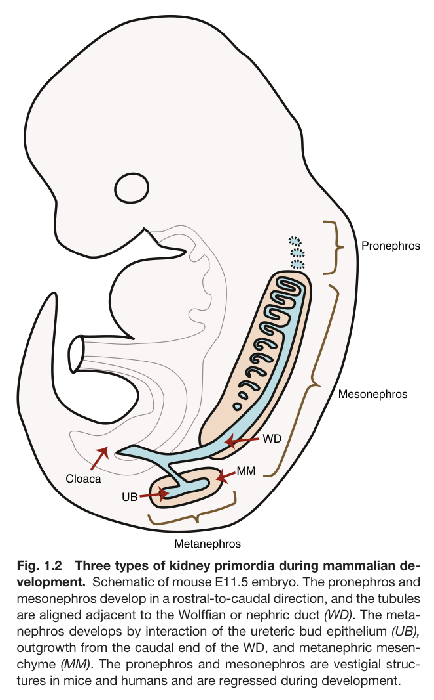

Fig. 1.2 Three types of kidney primordia during mammalian de- velopment. Schematic of mouse E11.5 embryo. The pronephros and mesonephros develop in a rostral-to-caudal direction, and the tubules are aligned adjacent to the Wolffian or nephric duct (WD). The meta- nephros develops by interaction of the ureteric bud epithelium (UB), outgrowth from the caudal end of the WD, and metanephric mesen- chyme (MM). The pronephros and mesonephros are vestigial struc- tures in mice and humans and are regressed during development.

---

### Fig_1_3

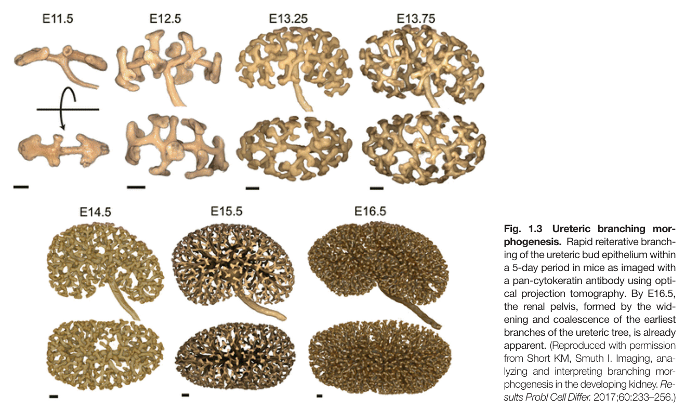

Fig. 1.3 Ureteric branching mor- phogenesis. Rapid reiterative branch- ing of the ureteric bud epithelium within a 5-day period in mice as imaged with a pan-cytokeratin antibody using opti- cal projection tomography. By E16.5, the renal pelvis, formed by the wid- ening and coalescence of the earliest branches of the ureteric tree, is already apparent. (Reproduced with permission from Short KM, Smuth I. Imaging, ana- lyzing and interpreting branching mor- phogenesis in the developing kidney. Re- sults Probl Cell Differ. 2017;60:233–256.)

---

### Fig_1_4

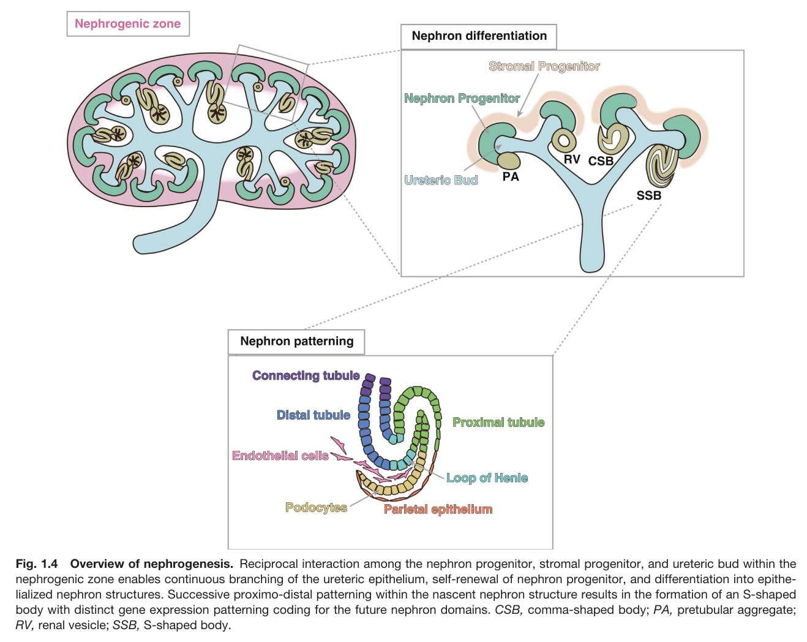

Fig. 1.4 Overview of nephrogenesis. Reciprocal interaction among the nephron progenitor, stromal progenitor, and ureteric bud within the nephrogenic zone enables continuous branching of the ureteric epithelium, self-renewal of nephron progenitor, and differentiation into epithe- lialized nephron structures. Successive proximo-distal patterning within the nascent nephron structure results in the formation of an S-shaped body with distinct gene expression patterning coding for the future nephron domains. CSB, comma-shaped body; PA, pretubular aggregate; RV, renal vesicle; SSB, S-shaped body.

---

### Fig_1_5

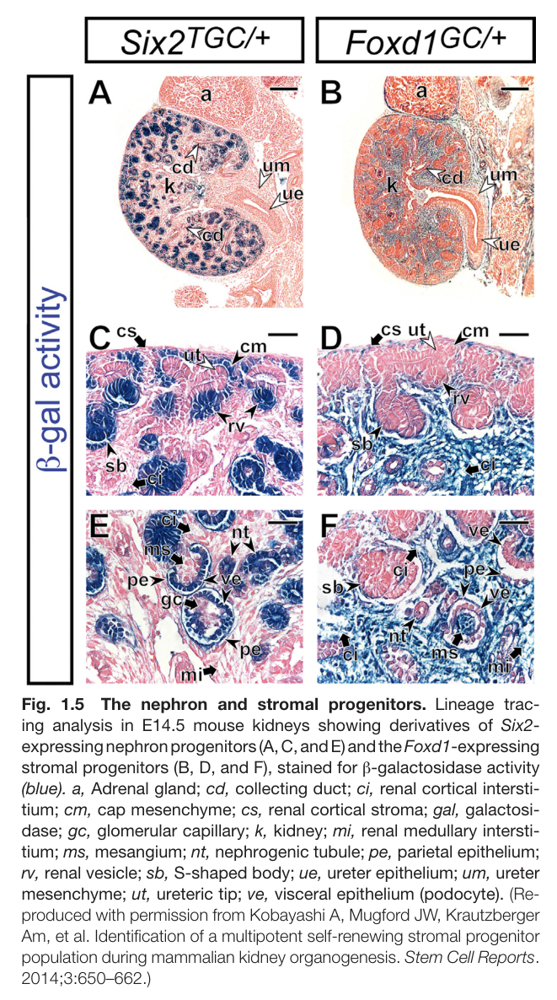

Fig. 1.5 The nephron and stromal progenitors. Lineage trac- ing analysis in E14.5 mouse kidneys showing derivatives of Six2- expressing nephron progenitors (A, C, and E) and the Foxd1-expressing stromal progenitors (B, D, and F), stained for β-galactosidase activity (blue). a, Adrenal gland; cd, collecting duct; ci, renal cortical intersti- tium; cm, cap mesenchyme; cs, renal cortical stroma; gal, galactosi- dase; gc, glomerular capillary; k, kidney; mi, renal medullary intersti- tium; ms, mesangium; nt, nephrogenic tubule; pe, parietal epithelium; rv, renal vesicle; sb, S-shaped body; ue, ureter epithelium; um, ureter mesenchyme; ut, ureteric tip; ve, visceral epithelium (podocyte). (Re- produced with permission from Kobayashi A, Mugford JW, Krautzberger Am, et al. Identification of a multipotent self-renewing stromal progenitor population during mammalian kidney organogenesis. Stem Cell Reports. 2014;3:650–662.)

---

### Fig_1_6

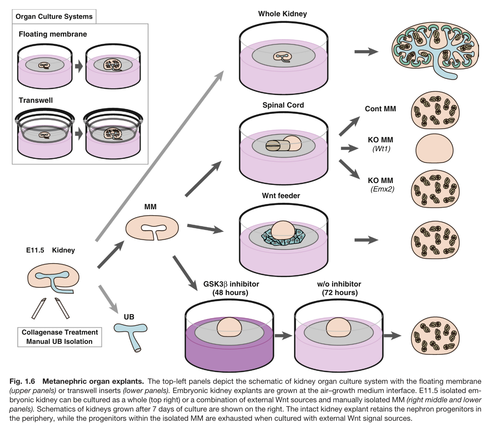

Fig. 1.6 Metanephric organ explants. The top-left panels depict the schematic of kidney organ culture system with the floating membrane (upper panels) or transwell inserts (lower panels). Embryonic kidney explants are grown at the air–growth medium interface. E11.5 isolated em- bryonic kidney can be cultured as a whole (top right) or a combination of external Wnt sources and manually isolated MM (right middle and lower panels). Schematics of kidneys grown after 7 days of culture are shown on the right. The intact kidney explant retains the nephron progenitors in the periphery, while the progenitors within the isolated MM are exhausted when cultured with external Wnt signal sources.

---

### Fig_1_7

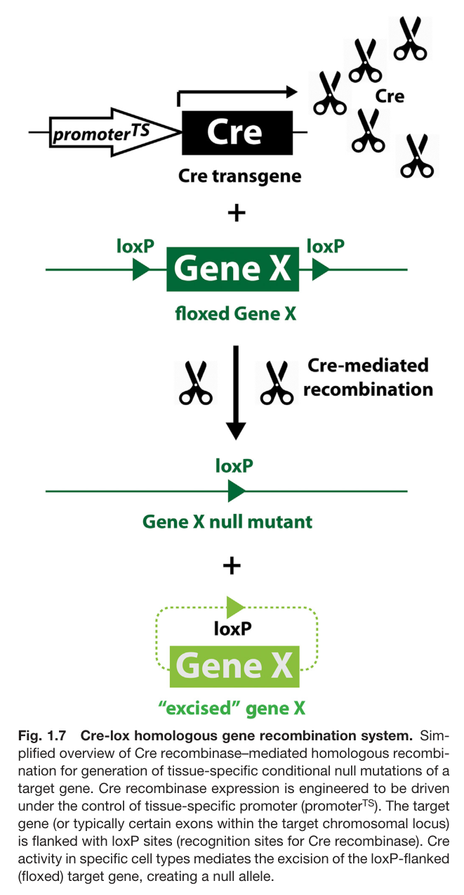

Fig. 1.7 Cre-lox homologous gene recombination system. Sim- plified overview of Cre recombinase–mediated homologous recombi- nation for generation of tissue-specific conditional null mutations of a target gene. Cre recombinase expression is engineered to be driven under the control of tissue-specific promoter (promoter<sup>TS</sup>). The target gene (or typically certain exons within the target chromosomal locus) is flanked with loxP sites (recognition sites for Cre recombinase). Cre activity in specific cell types mediates the excision of the loxP-flanked (floxed) target gene, creating a null allele.

---

### Fig_1_8

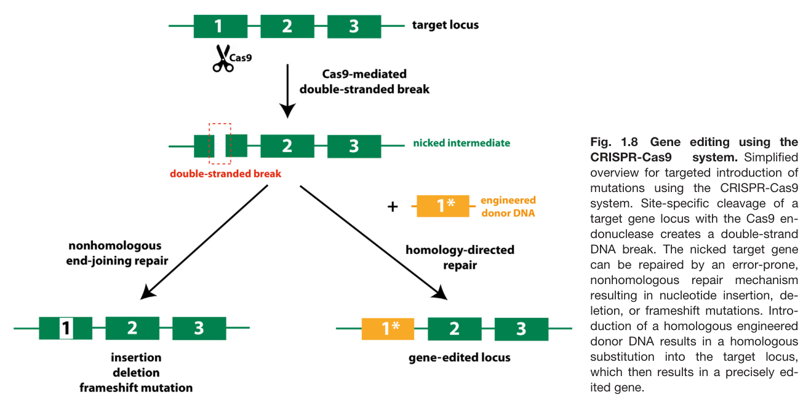

Fig. 1.8 Gene editing using the CRISPR-Cas9 system. Simplified overview for targeted introduction of mutations using the CRISPR-Cas9 system. Site-specific cleavage of a target gene locus with the Cas9 en- donuclease creates a double-strand DNA break. The nicked target gene can be repaired by an error-prone, nonhomologous repair mechanism resulting in nucleotide insertion, de- letion, or frameshift mutations. Intro- duction of a homologous engineered donor DNA results in a homologous substitution into the target locus, which then results in a precisely ed- ited gene.

---

### Fig_1_9

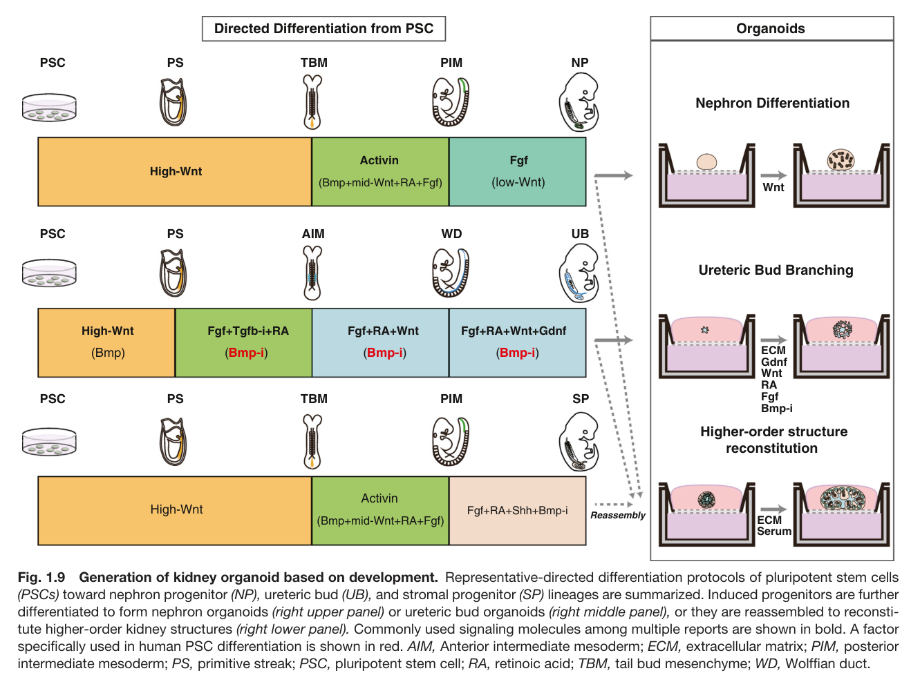

Fig. 1.9 Generation of kidney organoid based on development. Representative-directed differentiation protocols of pluripotent stem cells (PSCs) toward nephron progenitor (NP), ureteric bud (UB), and stromal progenitor (SP) lineages are summarized. Induced progenitors are further differentiated to form nephron organoids (right upper panel) or ureteric bud organoids (right middle panel), or they are reassembled to reconsti- tute higher-order kidney structures (right lower panel). Commonly used signaling molecules among multiple reports are shown in bold. A factor specifically used in human PSC differentiation is shown in red. AIM, Anterior intermediate mesoderm; ECM, extracellular matrix; PIM, posterior intermediate mesoderm; PS, primitive streak; PSC, pluripotent stem cell; RA, retinoic acid; TBM, tail bud mesenchyme; WD, Wolffian duct.

---

### Fig_1_10

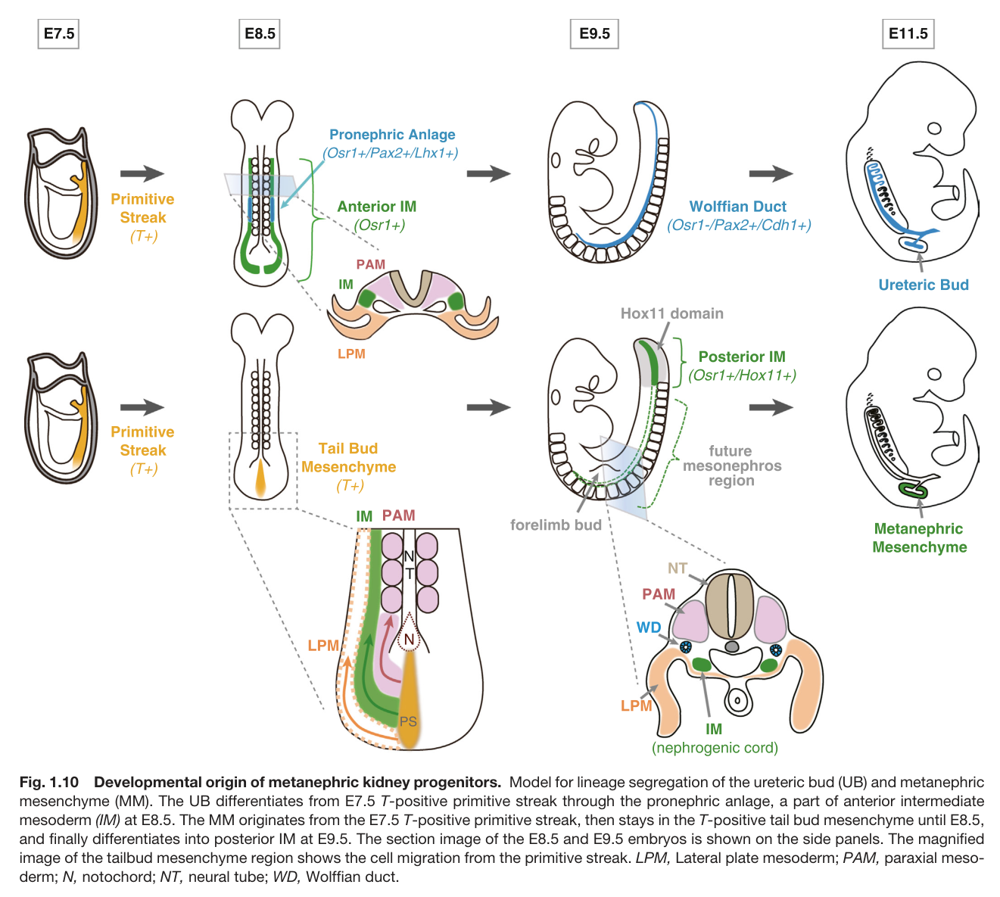

Fig. 1.10 Developmental origin of metanephric kidney progenitors. Model for lineage segregation of the ureteric bud (UB) and metanephric mesenchyme (MM). The UB differentiates from E7.5 T-positive primitive streak through the pronephric anlage, a part of anterior intermediate mesoderm (IM) at E8.5. The MM originates from the E7.5 T-positive primitive streak, then stays in the T-positive tail bud mesenchyme until E8.5, and finally differentiates into posterior IM at E9.5. The section image of the E8.5 and E9.5 embryos is shown on the side panels. The magnified image of the tailbud mesenchyme region shows the cell migration from the primitive streak. LPM, Lateral plate mesoderm; PAM, paraxial meso- derm; N, notochord; NT, neural tube; WD, Wolffian duct.

---

### Fig_1_11

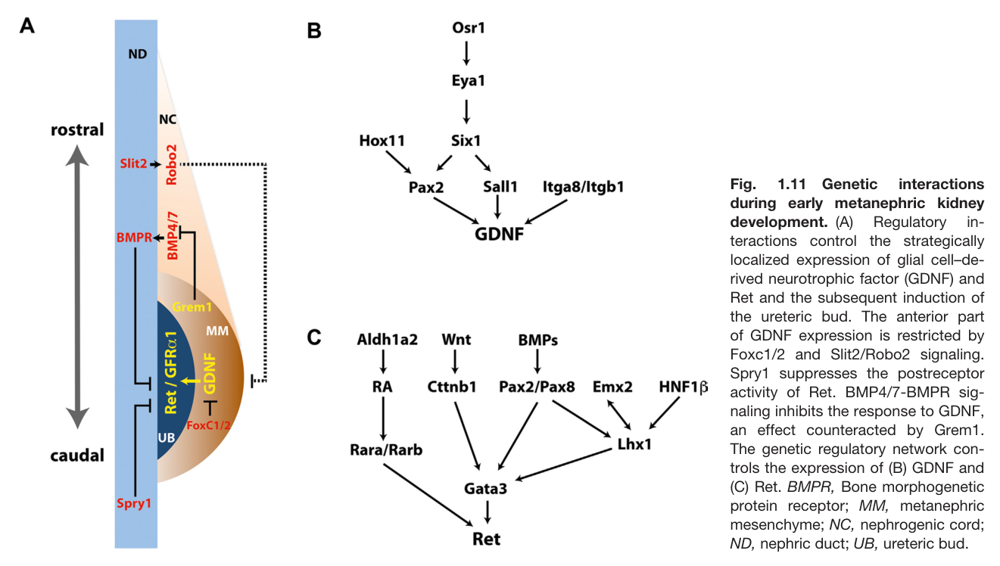

Fig. 1.11 Genetic interactions during early metanephric kidney development. (A) Regulatory in- teractions control the strategically localized expression of glial cell–de- rived neurotrophic factor (GDNF) and Ret and the subsequent induction of the ureteric bud. The anterior part of GDNF expression is restricted by Foxc1/2 and Slit2/Robo2 signaling. Spry1 suppresses the postreceptor activity of Ret. BMP4/7-BMPR sig- naling inhibits the response to GDNF, an effect counteracted by Grem1. The genetic regulatory network con- trols the expression of (B) GDNF and (C) Ret. BMPR, Bone morphogenetic protein receptor; MM, metanephric mesenchyme; NC, nephrogenic cord; ND, nephric duct; UB, ureteric bud.

---

### Fig_1_12

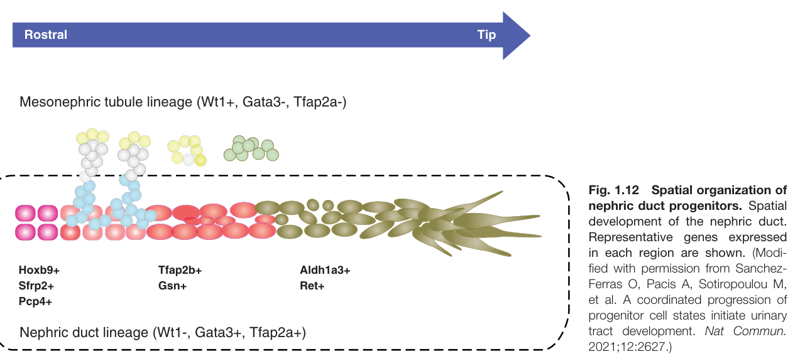

Fig. 1.12 Spatial organization of nephric duct progenitors. Spatial development of the nephric duct. Representative genes expressed in each region are shown. (Modified with permission from Sanchez-Ferras O, Pacis A, Sotiropoulou M, et al. A coordinated progression of progenitor cell states initiate urinary tract development. Nat Commun. 2021;12:2627.)

---

### Fig_1_13

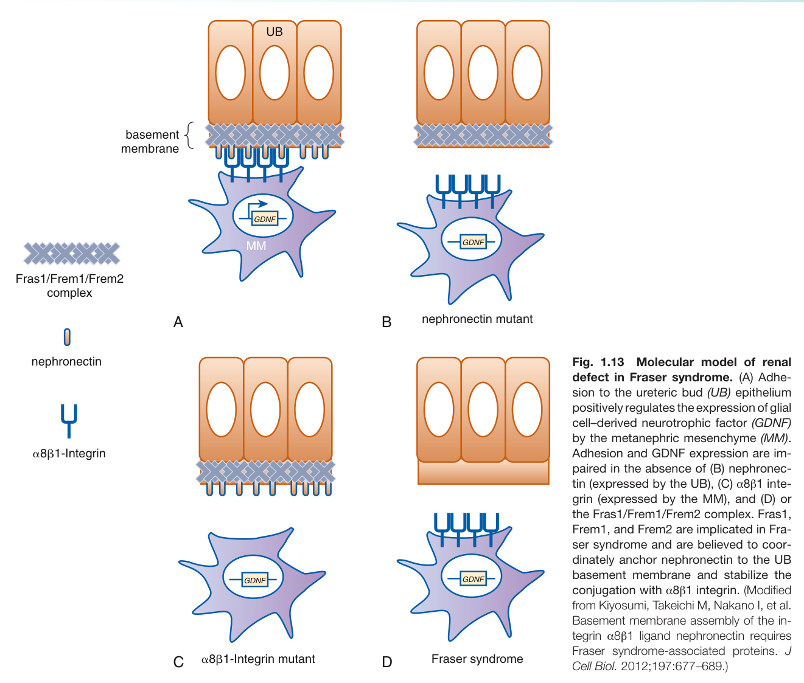

Fig. 1.13 Molecular model of renal defect in Fraser syndrome. (A) Adhe- sion to the ureteric bud (UB) epithelium positively regulates the expression of glial cell–derived neurotrophic factor (GDNF) by the metanephric mesenchyme (MM). Adhesion and GDNF expression are im- paired in the absence of (B) nephronec- tin (expressed by the UB), (C) α8β1 inte- grin (expressed by the MM), and (D) or the Fras1/Frem1/Frem2 complex. Fras1, Frem1, and Frem2 are implicated in Fra- ser syndrome and are believed to coor- dinately anchor nephronectin to the UB basement membrane and stabilize the conjugation with α8β1 integrin. (Modified from Kiyosumi, Takeichi M, Nakano I, et al. Basement membrane assembly of the in- tegrin α8β1 ligand nephronectin requires Fraser syndrome-associated proteins. J Cell Biol. 2012;197:677–689.)

---

### Fig_1_14

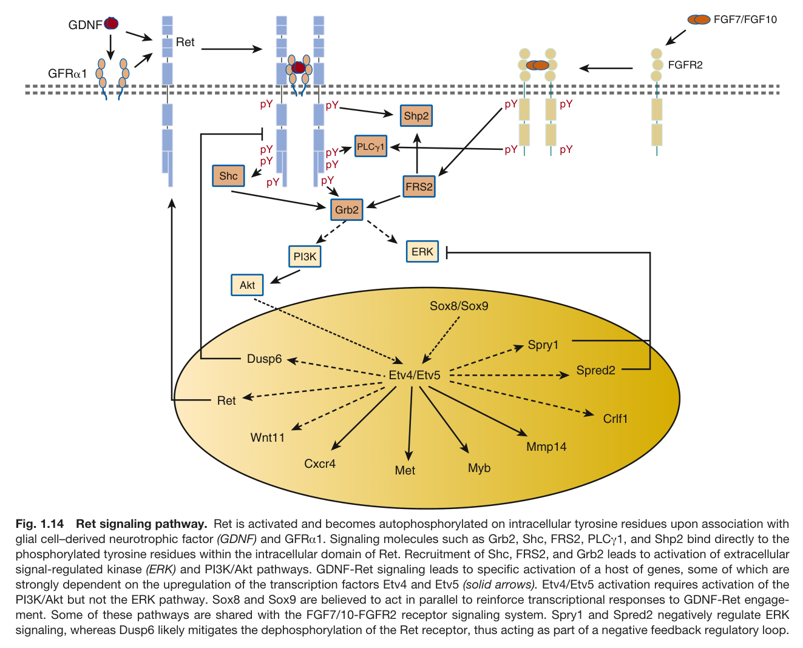

Fig. 1.14 Ret signaling pathway. Ret is activated and becomes autophosphorylated on intracellular tyrosine residues upon association with glial cell–derived neurotrophic factor (GDNF) and GFRα1. Signaling molecules such as Grb2, Shc, FRS2, PLCγ1, and Shp2 bind directly to the phosphorylated tyrosine residues within the intracellular domain of Ret. Recruitment of Shc, FRS2, and Grb2 leads to activation of extracellular signal-regulated kinase (ERK) and PI3K/Akt pathways. GDNF-Ret signaling leads to specific activation of a host of genes, some of which are strongly dependent on the upregulation of the transcription factors Etv4 and Etv5 (solid arrows). Etv4/Etv5 activation requires activation of the PI3K/Akt but not the ERK pathway. Sox8 and Sox9 are believed to act in parallel to reinforce transcriptional responses to GDNF-Ret engage- ment. Some of these pathways are shared with the FGF7/10-FGFR2 receptor signaling system. Spry1 and Spred2 negatively regulate ERK signaling, whereas Dusp6 likely mitigates the dephosphorylation of the Ret receptor, thus acting as part of a negative feedback regulatory loop.

---

### Fig_1_15

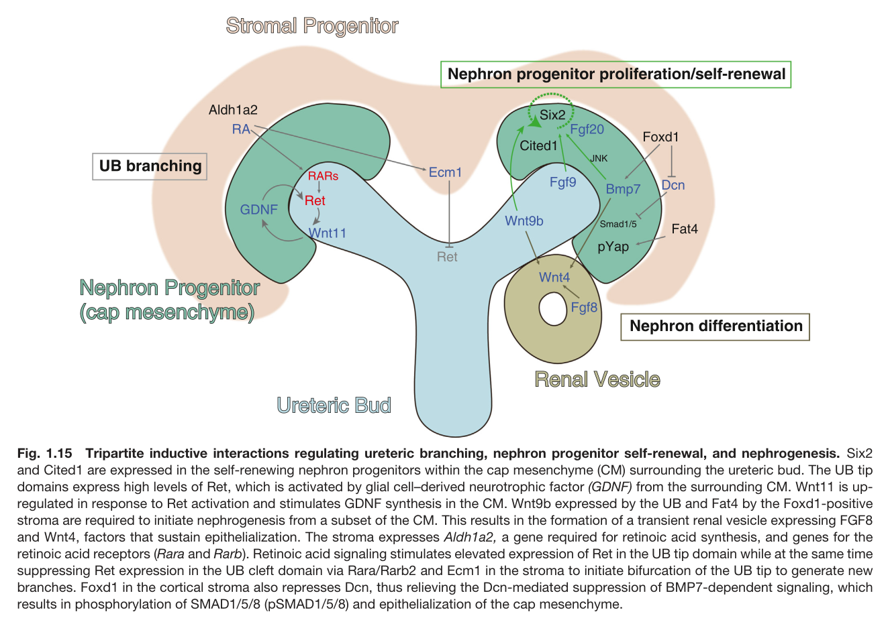

Fig. 1.15 Tripartite inductive interactions regulating ureteric branching, nephron progenitor self-renewal, and nephrogenesis. Six2 and Cited1 are expressed in the self-renewing nephron progenitors within the cap mesenchyme (CM) surrounding the ureteric bud. The UB tip domains express high levels of Ret, which is activated by glial cell–derived neurotrophic factor (GDNF) from the surrounding CM. Wnt11 is up- regulated in response to Ret activation and stimulates GDNF synthesis in the CM. Wnt9b expressed by the UB and Fat4 by the Foxd1-positive stroma are required to initiate nephrogenesis from a subset of the CM. This results in the formation of a transient renal vesicle expressing FGF8 and Wnt4, factors that sustain epithelialization. The stroma expresses Aldh1a2, a gene required for retinoic acid synthesis, and genes for the retinoic acid receptors (Rara and Rarb). Retinoic acid signaling stimulates elevated expression of Ret in the UB tip domain while at the same time suppressing Ret expression in the UB cleft domain via Rara/Rarb2 and Ecm1 in the stroma to initiate bifurcation of the UB tip to generate new branches. Foxd1 in the cortical stroma also represses Dcn, thus relieving the Dcn-mediated suppression of BMP7-dependent signaling, which results in phosphorylation of SMAD1/5/8 (pSMAD1/5/8) and epithelialization of the cap mesenchyme.

---

### Fig_1_16

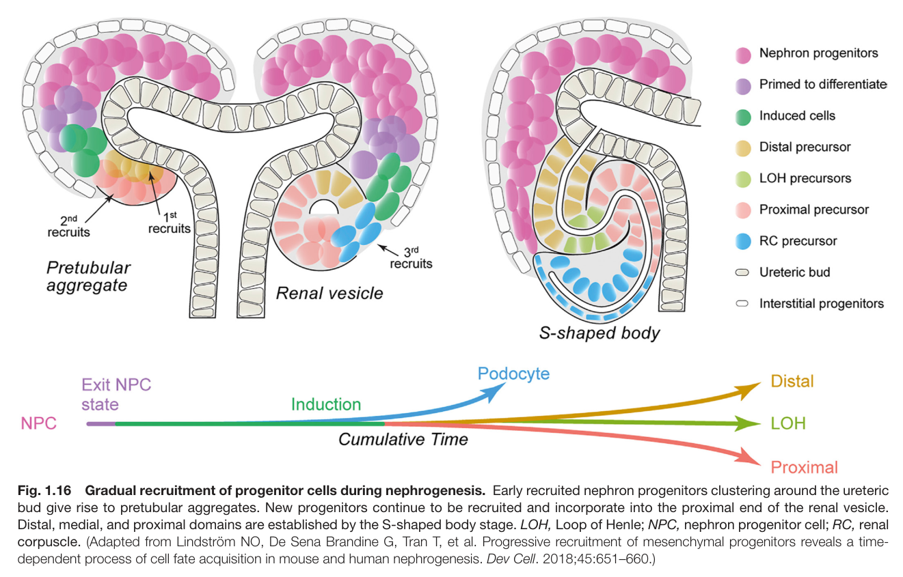

Fig. 1.16 Gradual recruitment of progenitor cells during nephrogenesis. Early recruited nephron progenitors clustering around the ureteric bud give rise to pretubular aggregates. New progenitors continue to be recruited and incorporate into the proximal end of the renal vesicle. Distal, medial, and proximal domains are established by the S-shaped body stage. LOH, Loop of Henle; NPC, nephron progenitor cell; RC, rena corpuscle. (Adapted from Lindström NO, De Sena Brandine G, Tran T, et al. Progressive recruitment of mesenchymal progenitors reveals a timedependent process of cell fate acquisition in mouse and human nephrogenesis. Dev Cell. 2018;45:651–660.)

---

### Fig_1_17

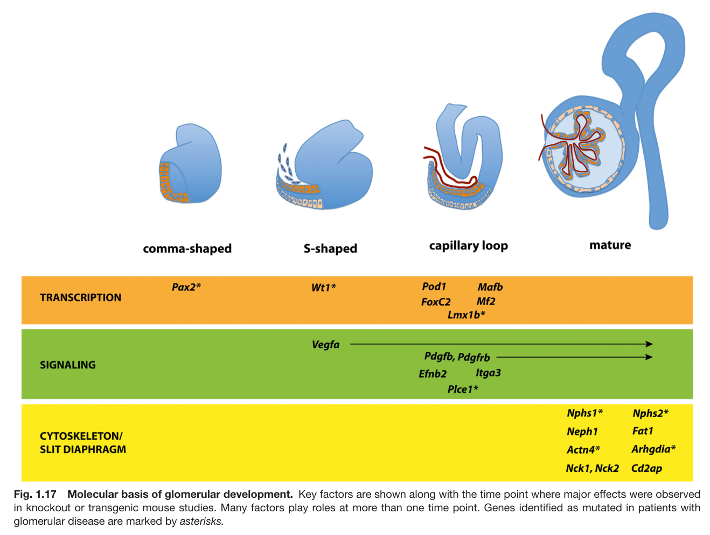

Fig. 1.17 Molecular basis of glomerular development. Key factors are shown along with the time point where major effects were observed in knockout or transgenic mouse studies. Many factors play roles at more than one time point. Genes identified as mutated in patients with glomerular disease are marked by asterisks.

---

### Fig_1_18

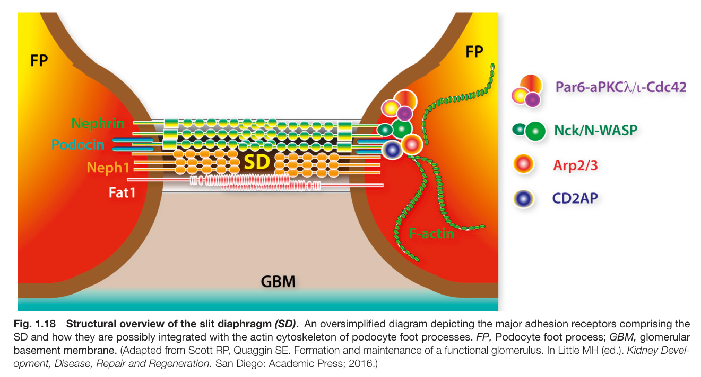

Fig. 1.18 Structural overview of the slit diaphragm (SD). An oversimplified diagram depicting the major adhesion receptors comprising the SD and how they are possibly integrated with the actin cytoskeleton of podocyte foot processes. FP, Podocyte foot process; GBM, glomerular basement membrane. (Adapted from Scott RP, Quaggin SE. Formation and maintenance of a functional glomerulus. In Little MH (ed.). Kidney Devel- opment, Disease, Repair and Regeneration. San Diego: Academic Press; 2016.)

---

### Fig_1_19

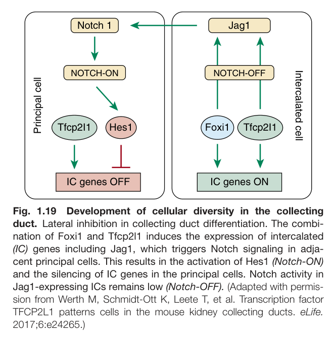

Fig. 1.19 Development of cellular diversity in the collecting duct. Lateral inhibition in collecting duct differentiation. The combi- nation of Foxi1 and Tfcp2l1 induces the expression of intercalated (IC) genes including Jag1, which triggers Notch signaling in adja- cent principal cells. This results in the activation of Hes1 (Notch-ON) and the silencing of IC genes in the principal cells. Notch activity in Jag1-expressing ICs remains low (Notch-OFF). (Adapted with permis- sion from Werth M, Schmidt-Ott K, Leete T, et al. Transcription factor TFCP2L1 patterns cells in the mouse kidney collecting ducts. eLife. 2017;6:e24265.)

---

### Fig_1_20

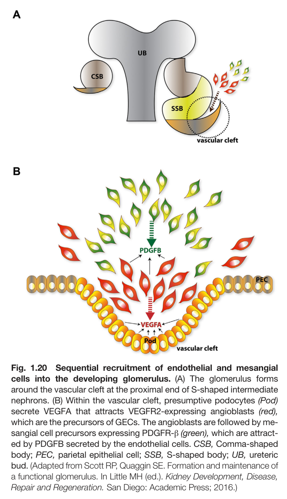

Fig. 1.20 Sequential recruitment of endothelial and mesangial cells into the developing glomerulus. (A) The glomerulus forms around the vascular cleft at the proximal end of S-shaped intermediate nephrons. (B) Within the vascular cleft, presumptive podocytes (Pod) secrete VEGFA that attracts VEGFR2-expressing angioblasts (red), which are the precursors of GECs. The angioblasts are followed by me- sangial cell precursors expressing PDGFR-β (green), which are attract- ed by PDGFB secreted by the endothelial cells. CSB, Comma-shaped body; PEC, parietal epithelial cell; SSB, S-shaped body; UB, ureteric bud. (Adapted from Scott RP, Quaggin SE. Formation and maintenance of a functional glomerulus. In Little MH (ed.). Kidney Development, Disease, Repair and Regeneration. San Diego: Academic Press; 2016.)

---

### Fig_1_21

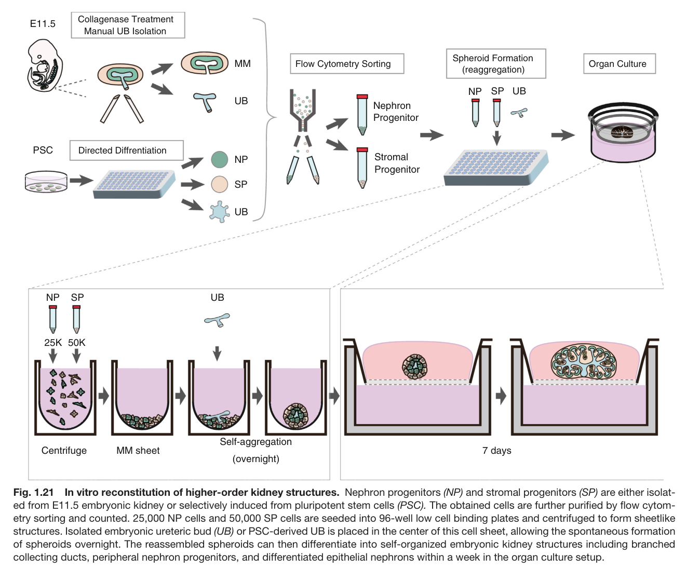

Fig. 1.21 In vitro reconstitution of higher-order kidney structures. Nephron progenitors (NP) and stromal progenitors (SP) are either isolat- ed from E11.5 embryonic kidney or selectively induced from pluripotent stem cells (PSC). The obtained cells are further purified by flow cytom- etry sorting and counted. 25,000 NP cells and 50,000 SP cells are seeded into 96-well low cell binding plates and centrifuged to form sheetlike structures. Isolated embryonic ureteric bud (UB) or PSC-derived UB is placed in the center of this cell sheet, allowing the spontaneous formation of spheroids overnight. The reassembled spheroids can then differentiate into self-organized embryonic kidney structures including branched collecting ducts, peripheral nephron progenitors, and differentiated epithelial nephrons within a week in the organ culture setup.

---

### Fig_1_22

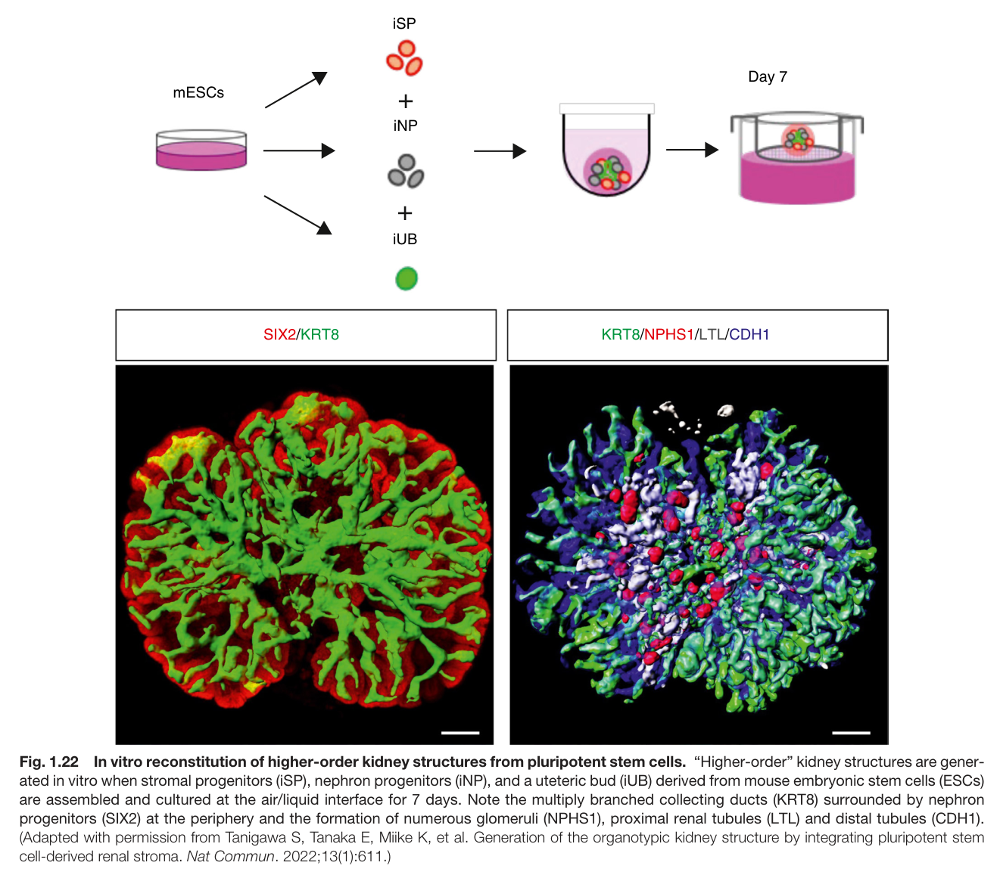

Fig. 1.22 In vitro reconstitution of higher-order kidney structures from pluripotent stem cells. “Higher-order” kidney structures are gener- ated in vitro when stromal progenitors (iSP), nephron progenitors (iNP), and a uteteric bud (iUB) derived from mouse embryonic stem cells (ESCs) are assembled and cultured at the air/liquid interface for 7 days. Note the multiply branched collecting ducts (KRT8) surrounded by nephron progenitors (SIX2) at the periphery and the formation of numerous glomeruli (NPHS1), proximal renal tubules (LTL) and distal tubules (CDH1). (Adapted with permission from Tanigawa S, Tanaka E, Miike K, et al. Generation of the organotypic kidney structure by integrating pluripotent stem cell-derived renal stroma. Nat Commun. 2022;13(1):611.)

---

### Fig_1_23

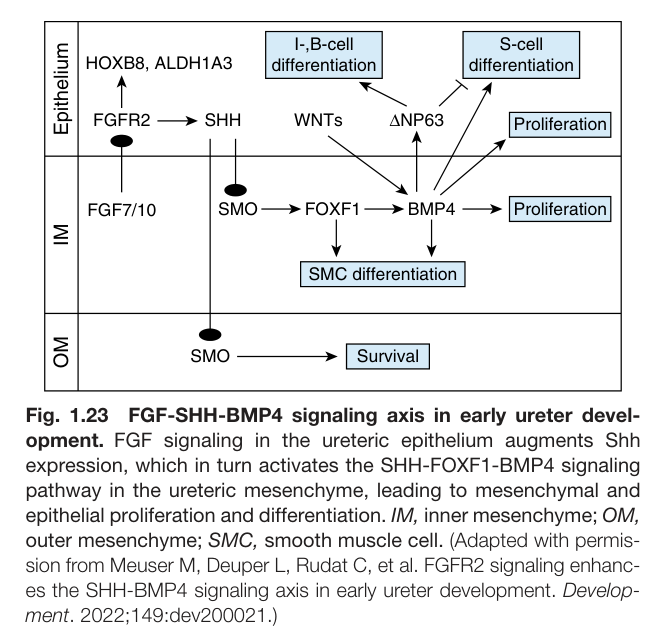

Fig. 1.23 FGF-SHH-BMP4 signaling axis in early ureter devel- opment. FGF signaling in the ureteric epithelium augments Shh expression, which in turn activates the SHH-FOXF1-BMP4 signaling pathway in the ureteric mesenchyme, leading to mesenchymal and epithelial proliferation and differentiation. IM, inner mesenchyme; OM, outer mesenchyme; SMC, smooth muscle cell. (Adapted with permis- sion from Meuser M, Deuper L, Rudat C, et al. FGFR2 signaling enhanc- es the SHH-BMP4 signaling axis in early ureter development. Develop- ment. 2022;149:dev200021.)

---

### Fig_1_24

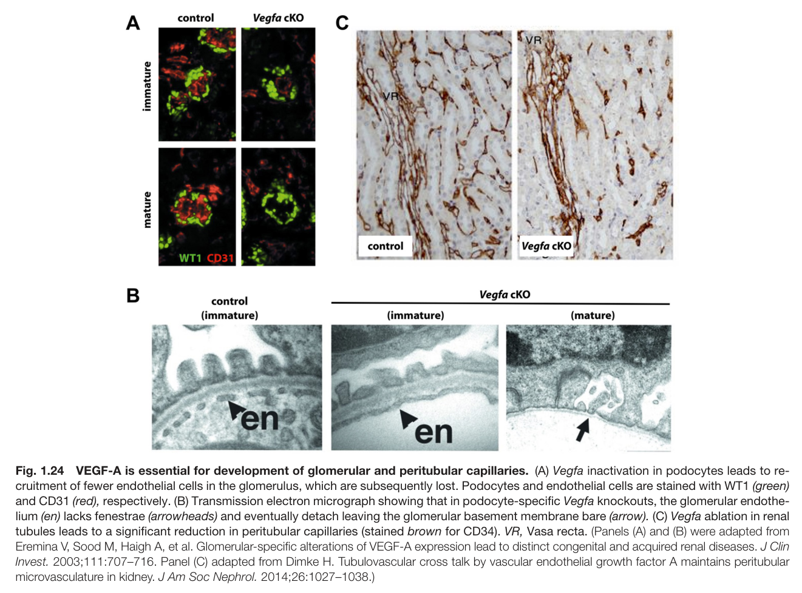

Fig. 1.24 VEGF-A is essential for development of glomerular and peritubular capillaries. (A) Vegfa inactivation in podocytes leads to re- cruitment of fewer endothelial cells in the glomerulus, which are subsequently lost. Podocytes and endothelial cells are stained with WT1 (green) and CD31 (red), respectively. (B) Transmission electron micrograph showing that in podocyte-specific Vegfa knockouts, the glomerular endothe- lium (en) lacks fenestrae (arrowheads) and eventually detach leaving the glomerular basement membrane bare (arrow). (C) Vegfa ablation in renal tubules leads to a significant reduction in peritubular capillaries (stained brown for CD34). VR, Vasa recta. (Panels (A) and (B) were adapted from Eremina V, Sood M, Haigh A, et al. Glomerular-specific alterations of VEGF-A expression lead to distinct congenital and acquired renal diseases. J Clin Invest. 2003;111:707–716. Panel (C) adapted from Dimke H. Tubulovascular cross talk by vascular endothelial growth factor A maintains peritubular microvasculature in kidney. J Am Soc Nephrol. 2014;26:1027–1038.)

---

## Tables

### Table_1_1

#### Table Image

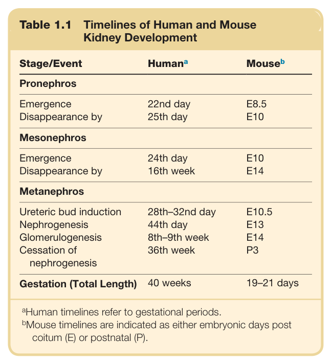

#### Table Data (CSV: [Table_1_1.csv](Table_1_1.csv))

```markdown
| Table Text (OCR) |
| :--- |
| Table 1.1  Timelines of Human and Mouse Kidney Development Stage/Event   Humana^a    Mouse^b     Pronephros    Emergence  22nd day  E8.5    Disappearance by  25th day  E10    Mesonephros    Emergence  24th day  E10    Disappearance by  16th week  E14    Metanephros    Ureteric bud induction  28th-32nd day  E10.5    Nephrogenesis  44th day  E13    Glomerulogenesis  8th-9th week  E14    Cessation of nephrogenesis  36th week  P3    Gestation (Total Length)  40 weeks  19-21 days <sup>a</sup>Human timelines refer to gestational periods. <sup>b</sup>Mouse timelines are indicated as either embryonic days post coitum (E) or postnatal (P). |
```

Table 1.1 Timelines of Human and Mouse Kidney Development

---

### Table_1_2

#### Table Images (2 Parts)

- **Part 1 (Page 20)**:
  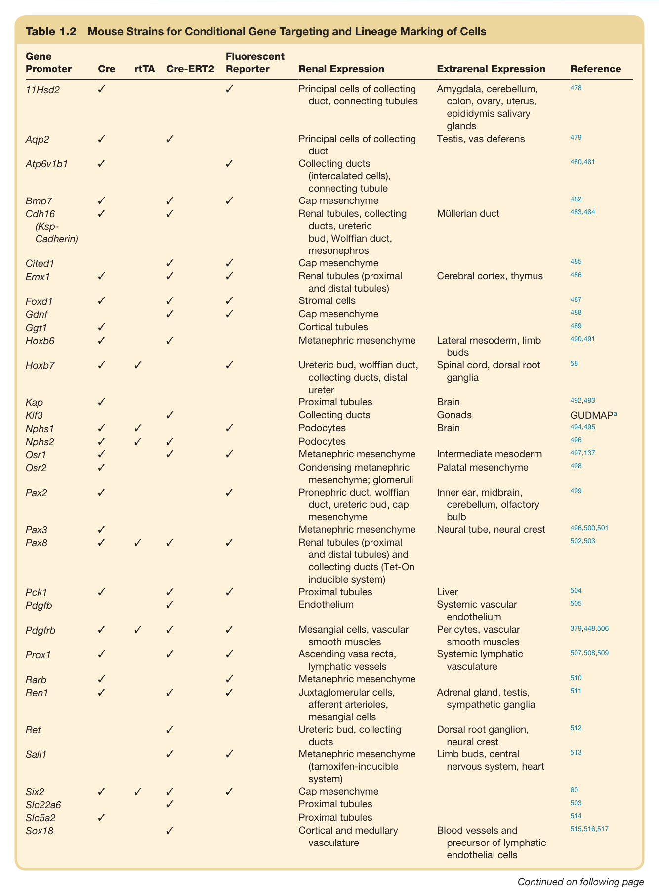

- **Part 2 (Page 21)**:
  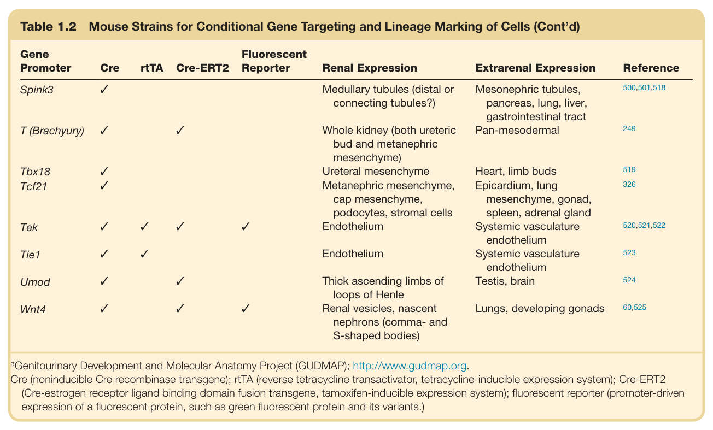

#### Table Data (CSV: [Table_1_2.csv](Table_1_2.csv))

```markdown
| Table Text (OCR) |
| :--- |
| Table 1.2  Mouse Strains for Conditional Gene Targeting and Lineage Marking of Cells Gene Promoter  Cre  rtTA  Cre-ERT2  Fluorescent Reporter  Renal Expression  Extrarenal Expression  Reference    11Hsd2  ✓      ✓  Principal cells of collecting duct, connecting tubules  Amygdala, cerebellum, colon, ovary, uterus, epididymis salivary glands  478    Aqp2  ✓    ✓    Principal cells of collecting duct  Testis, vas deferens  479    Atp6v1b1  ✓      ✓  Collecting ducts (intercalated cells), connecting tubule    480,481    Bmp7  ✓    ✓  ✓  Cap mesenchyme    482    Cdh16 (Ksp-Cadherin)  ✓    ✓    Renal tubules, collecting ducts, ureteric bud, Wolffian duct, mesonephros  Müllerian duct  483,484    Cited1      ✓  ✓  Cap mesenchyme    485    Emx1  ✓    ✓  ✓  Renal tubules (proximal and distal tubules)  Cerebral cortex, thymus  486    Foxd1  ✓    ✓  ✓  Stromal cells    487    Gdnf      ✓  ✓  Cap mesenchyme    488    Ggt1  ✓        Cortical tubules    489    Hoxb6  ✓    ✓    Metanephric mesenchyme  Lateral mesoderm, limb buds  490,491    Hoxb7  ✓  ✓    ✓  Ureteric bud, wolffian duct, collecting ducts, distal ureter  Spinal cord, dorsal root ganglia  58    Kap  ✓        Proximal tubules  Brain  492,493    Klf3      ✓    Collecting ducts  Gonads  GUDMAPa    Nphs1  ✓  ✓    ✓  Podocytes  Brain  494,495    Nphs2  ✓  ✓  ✓    Podocytes    496    Osr1  ✓    ✓  ✓  Metanephric mesenchyme  Intermediate mesoderm  497,137    Osr2  ✓        Condensing metanephric mesenchyme; glomeruli  Palatal mesenchyme  498    Pax2  ✓      ✓  Pronephric duct, wolffian duct, ureteric bud, cap mesenchyme  Inner ear, midbrain, cerebellum, olfactory bulb  499    Pax3  ✓        Metanephric mesenchyme  Neural tube, neural crest  496,500,501    Pax8  ✓  ✓  ✓  ✓  Renal tubules (proximal and distal tubules) and collecting ducts (Tet-On inducible system)    502,503    Pck1  ✓    ✓  ✓  Proximal tubules  Liver  504    Pdgfb      ✓    Endothelium  Systemic vascular endothelium  505    Pdgfrb  ✓  ✓  ✓  ✓  Mesangial cells, vascular smooth muscles  Pericytes, vascular smooth muscles  379,448,506    Prox1  ✓    ✓  ✓  Ascending vasa recta, lymphatic vessels  Systemic lymphatic vasculature  507,508,509    Rarb  ✓      ✓  Metanephric mesenchyme    510    Ren1  ✓    ✓  ✓  Juxtaglomerular cells, afferent arterioles, mesangial cells  Adrenal gland, testis, sympathetic ganglia  511    Ret      ✓    Ureteric bud, collecting ducts  Dorsal root ganglion, neural crest  512    Sall1      ✓  ✓  Metanephric mesenchyme (tamoxifen-inducible system)  Limb buds, central nervous system, heart  513    Six2  ✓  ✓  ✓  ✓  Cap mesenchyme    60    Slc22a6      ✓    Proximal tubules    503    Slc5a2  ✓        Proximal tubules    514    Sox18      ✓    Cortical and medullary vasculature  Blood vessels and precursor of lymphatic endothelial cells  515,516,517    Spink3  ✓        Medullary tubules (distal or connecting tubules?)  Mesonephric tubules, pancreas, lung, liver, gastrointestinal tract  500,501,518    T (Brachyury)  ✓    ✓    Whole kidney (both ureteric bud and metanephric mesenchyme)  Pan-mesodermal  249    Tbx18  ✓        Ureteral mesenchyme  Heart, limb buds  519    Tcf21  ✓        Metanephric mesenchyme, cap mesenchyme, podocytes, stromal cells  Epicardium, lung mesenchyme, gonad, spleen, adrenal gland  326    Tek  ✓  ✓  ✓  ✓  Endothelium  Systemic vasculature endothelium  520,521,522    Tie1  ✓  ✓      Endothelium  Systemic vasculature endothelium  523    Umod  ✓    ✓    Thick ascending limbs of loops of Henle  Testis, brain  524    Wnt4  ✓    ✓  ✓  Renal vesicles, nascent nephrons (comma- and S-shaped bodies)  Lungs, developing gonads  60,525 <sup>a</sup>Genitourinary Development and Molecular Anatomy Project (GUDMAP); http://www.gudmap.org. Cre (noninducible Cre recombinase transgene); rtTA (reverse tetracycline transactivator, tetracycline-inducible expression system); Cre-ERT2 (Cre-estrogen receptor ligand binding domain fusion transgene, tamoxifen-inducible expression system); fluorescent reporter (promoter-driven expression of a fluorescent protein, such as green fluorescent protein and its variants.) |
```

Table 1.2 Mouse Strains for Conditional Gene Targeting and Lineage Marking of Cells

---

### Table_e1_1

#### Table Images (10 Parts)

- **Part 1 (Page 10)**:
  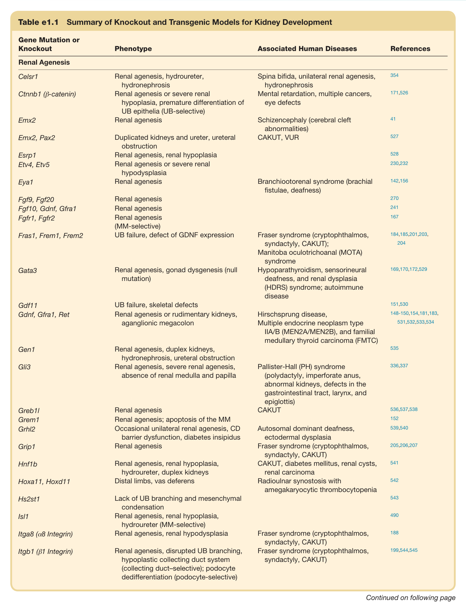

- **Part 2 (Page 11)**:
  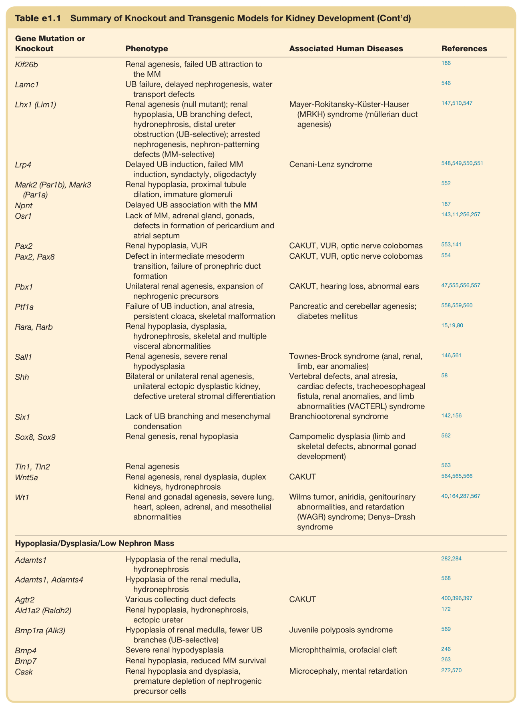

- **Part 3 (Page 12)**:
  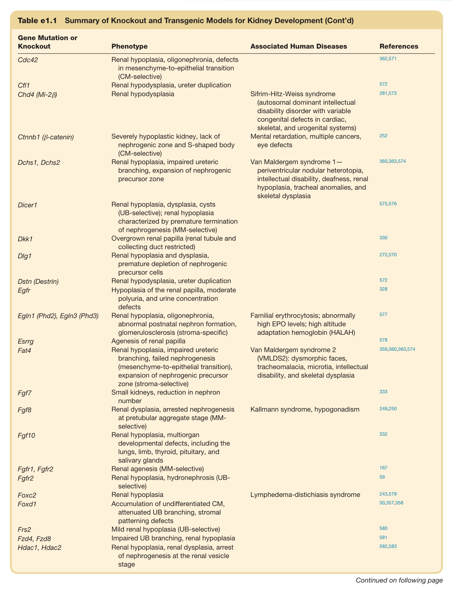

- **Part 4 (Page 13)**:
  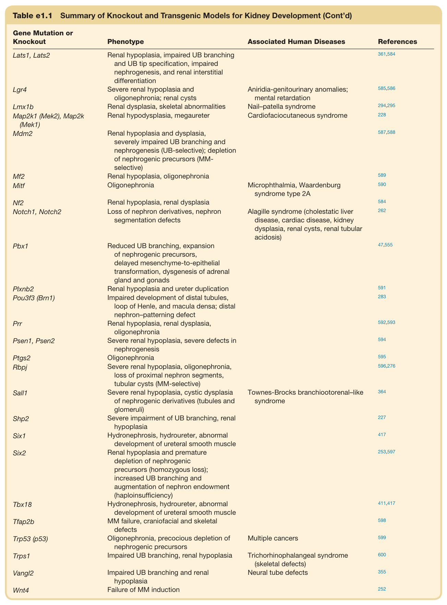

- **Part 5 (Page 14)**:
  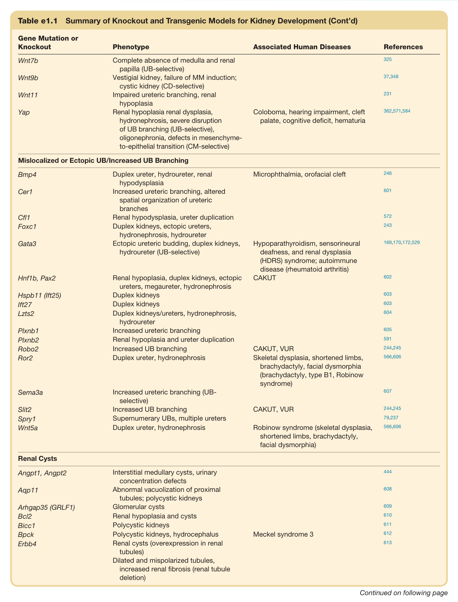

- **Part 6 (Page 15)**:
  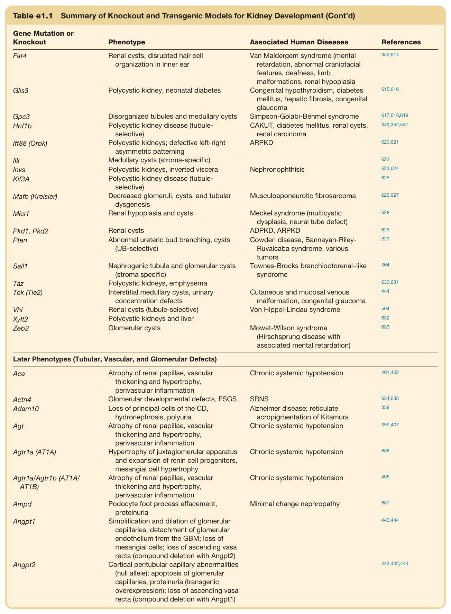

- **Part 7 (Page 16)**:
  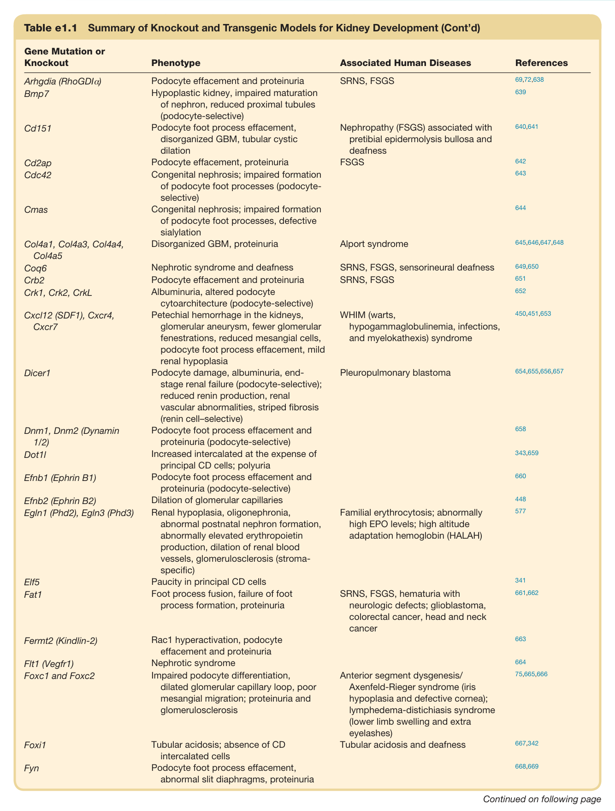

- **Part 8 (Page 17)**:
  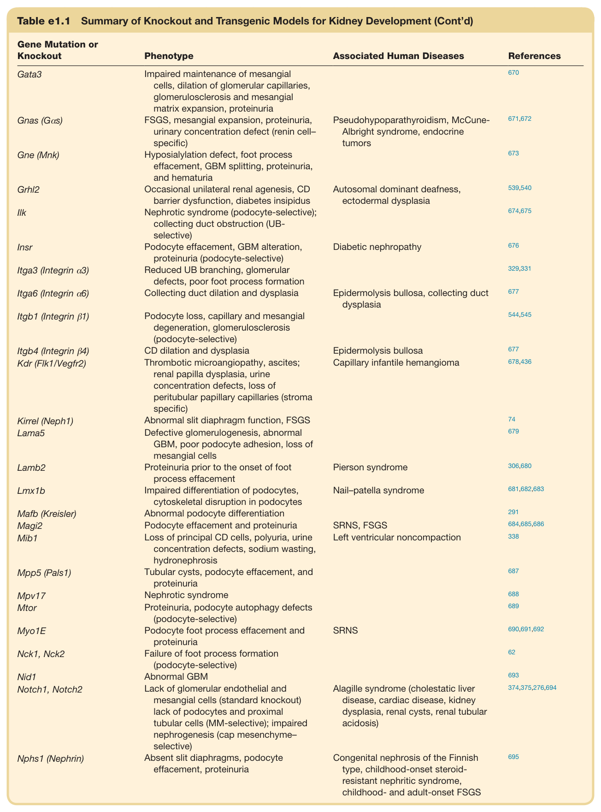

- **Part 9 (Page 18)**:
  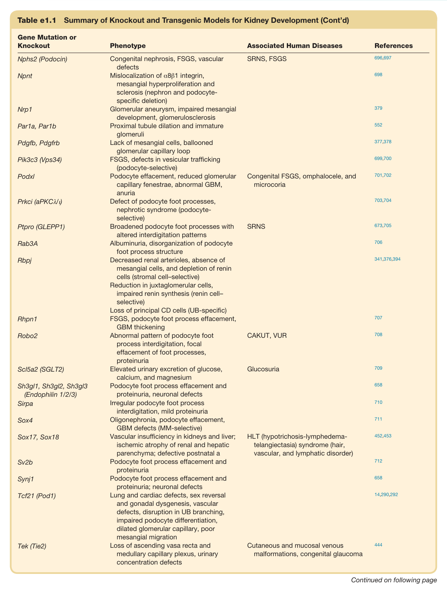

- **Part 10 (Page 19)**:
  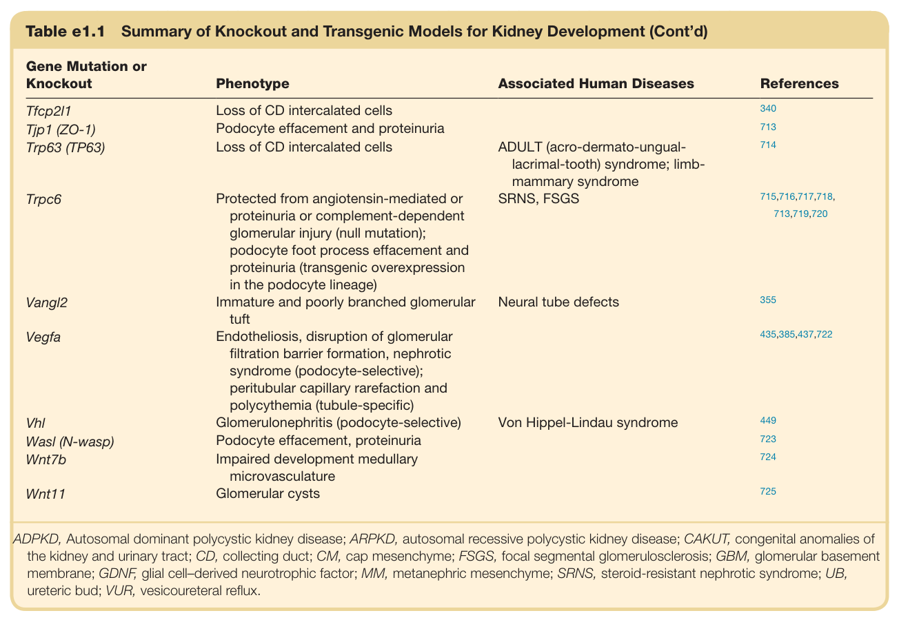

#### Table Data (CSV: [Table_e1_1.csv](Table_e1_1.csv))

```markdown
| Table Text (OCR) |
| :--- |
| Table e1.1  Summary of Knockout and Transgenic Models for Kidney Development Gene Mutation or Knockout  Phenotype  Associated Human Diseases  References    Renal Agenesis    Celsr1  Renal agenesis, hydroureter, hydronephrosis  Spina bifida, unilateral renal agenesis, hydronephrosis  354    Ctnnb1 (β-catenin)  Renal agenesis or severe renal hypoplasia, premature differentiation of UB epithelia (UB-selective)  Mental retardation, multiple cancers, eye defects  171,526    Emx2  Renal agenesis  Schizencephaly (cerebral cleft abnormalities)  41    Emx2, Pax2  Duplicated kidneys and ureter, ureteral obstruction  CAKUT, VUR  527    Esrp1  Renal agenesis, renal hypoplasia    528    Etv4, Etv5  Renal agenesis or severe renal hypodysplasia    230,232    Eya1  Renal agenesis  Branchiootorenal syndrome (brachial fistulae, deafness)  142,156    Fgf9, Fgf20  Renal agenesis    270    Fgf10, Gdnf, Gfra1  Renal agenesis    241    Fgfr1, Fgfr2  Renal agenesis (MM-selective)    167    Fras1, Frem1, Frem2  UB failure, defect of GDNF expression  Fraser syndrome (cryptophthalmos, syndactyly, CAKUT); Manitoba oculotrichoanal (MOTA) syndrome  184,185,201,203, 204    Gata3  Renal agenesis, gonad dysgenesis (null mutation)  Hypoparathyroidism, sensorineural deafness, and renal dysplasia (HDRS) syndrome; autoimmune disease  169,170,172,529    Gdf11  UB failure, skeletal defects    151,530    Gdnf, Gfra1, Ret  Renal agenesis or rudimentary kidneys, aganglionic megacolon  Hirschsprung disease, Multiple endocrine neoplasm type IIA/B (MEN2A/MEN2B), and familial medullary thyroid carcinoma (FMTC)  148-150,154,181,183, 531,532,533,534    Gen1  Renal agenesis, duplex kidneys, hydronephrosis, ureteral obstruction    535    Gli3  Renal agenesis, severe renal agenesis, absence of renal medulla and papilla  Pallister-Hall (PH) syndrome (polydactyly, imperforate anus, abnormal kidneys, defects in the gastrointestinal tract, larynx, and epiglottis)  336,337    Greb1l  Renal agenesis  CAKUT  536,537,538    Grem1  Renal agenesis; apoptosis of the MM    152    Grhl2  Occasional unilateral renal agenesis, CD barrier dysfunction, diabetes insipidus  Autosomal dominant deafness, ectodermal dysplasia  539,540    Grip1  Renal agenesis  Fraser syndrome (cryptophthalmos, syndactyly, CAKUT)  205,206,207    Hnf1b  Renal agenesis, renal hypoplasia, hydroureter, duplex kidneys  CAKUT, diabetes mellitus, renal cysts, renal carcinoma  541    Hoxa11, Hoxd11  Distal limbs, vas deferens  Radioulnar synostosis with amegakaryocytic thrombocytopenia  542    Hs2st1  Lack of UB branching and mesenchymal condensation    543    Isl1  Renal agenesis, renal hypoplasia, hydroureter (MM-selective)    490    Itga8 (α8 Integrin)  Renal agenesis, renal hypodysplasia  Fraser syndrome (cryptophthalmos, syndactyly, CAKUT)  188    Itgb1 (β1 Integrin)  Renal agenesis, disrupted UB branching, hypoplastic collecting duct system (collecting duct-selective); podocyte dedifferentiation (podocyte-selective)  Fraser syndrome (cryptophthalmos, syndactyly, CAKUT)  199,544,545    Kif26b  Renal agenesis, failed UB attraction to the MM    186    Lamc1  UB failure, delayed nephrogenesis, water transport defects    546    Lhx1 (Lim1)  Renal agenesis (null mutant); renal hypoplasia, UB branching defect, hydronephrosis, distal ureter obstruction (UB-selective); arrested nephrogenesis, nephron-patterning defects (MM-selective)  Mayer-Rokitansky-Küster-Hauser (MRKH) syndrome (müllerian duct agenesis)  147,510,547    Lrp4  Delayed UB induction, failed MM induction, syndactyly, oligodactyly  Cenani-Lenz syndrome  548,549,550,551    Mark2 (Par1b), Mark3 (Par1a)  Renal hypoplasia, proximal tubule dilation, immature glomeruli    552    Npnt  Delayed UB association with the MM    187    Osr1  Lack of MM, adrenal gland, gonads, defects in formation of pericardium and atrial septum    143,11,256,257    Pax2  Renal hypoplasia, VUR  CAKUT, VUR, optic nerve colobomas  553,141    Pax2, Pax8  Defect in intermediate mesoderm transition, failure of pronephric duct formation  CAKUT, VUR, optic nerve colobomas  554    Pbx1  Unilateral renal agenesis, expansion of nephrogenic precursors  CAKUT, hearing loss, abnormal ears  47,555,556,557    Ptf1a  Failure of UB induction, anal atresia, persistent cloaca, skeletal malformation  Pancreatic and cerebellar agenesis; diabetes mellitus  558,559,560    Rara, Rarb  Renal hypoplasia, dysplasia, hydronephrosis, skeletal and multiple visceral abnormalities    15,19,80    Sall1  Renal agenesis, severe renal hypodysplasia  Townes-Brock syndrome (anal, renal, limb, ear anomalies)  146,561    Shh  Bilateral or unilateral renal agenesis, unilateral ectopic dysplastic kidney, defective ureteral stromal differentiation  Vertebral defects, anal atresia, cardiac defects, tracheoesophageal fistula, renal anomalies, and limb abnormalities (VACTERL) syndrome  58    Six1  Lack of UB branching and mesenchymal condensation  Branchiootorenal syndrome  142,156    Sox8, Sox9  Renal genesis, renal hypoplasia  Campomelic dysplasia (limb and skeletal defects, abnormal gonad development)  562    Tln1, Tln2  Renal agenesis    563    Wnt5a  Renal agenesis, renal dysplasia, duplex kidneys, hydronephrosis  CAKUT  564,565,566    Wt1  Renal and gonadal agenesis, severe lung, heart, spleen, adrenal, and mesothelial abnormalities  Wilms tumor, aniridia, genitourinary abnormalities, and retardation (WAGR) syndrome; Denys-Drash syndrome  40,164,287,567 |
```

Table e1.1 Summary of Knockout and Transgenic Models for Kidney Development (Cont’d)

---
