# 02. Anatomy of the Kidney - Figures and Tables Index

This document lists all figures and tables extracted from `02. Anatomy of the Kidney.pdf`.

## Table of Contents
- [Figures](#figures)
- [Tables](#tables)

---

## Figures

### Fig_2_1

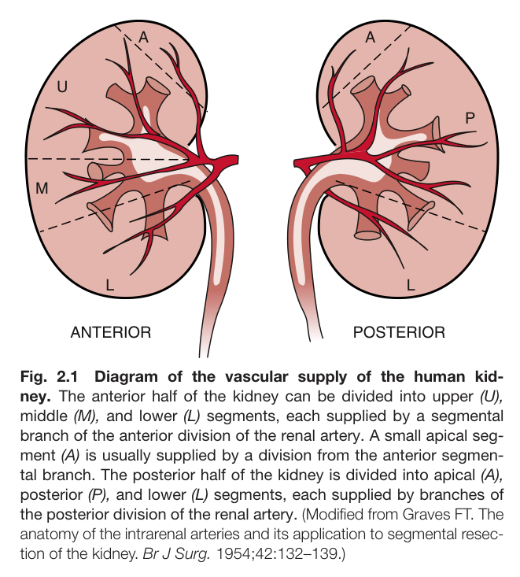

Fig. 2.1 Diagram of the vascular supply of the human kid- ney. The anterior half of the kidney can be divided into upper (U), middle (M), and lower (L) segments, each supplied by a segmenta branch of the anterior division of the renal artery. A small apical seg- ment (A) is usually supplied by a division from the anterior segmen- tal branch. The posterior half of the kidney is divided into apical (A), posterior (P), and lower (L) segments, each supplied by branches of the posterior division of the renal artery. (Modified from Graves FT. The anatomy of the intrarenal arteries and its application to segmental resec- tion of the kidney. Br J Surg. 1954;42:132–139.)

---

### Fig_2_2

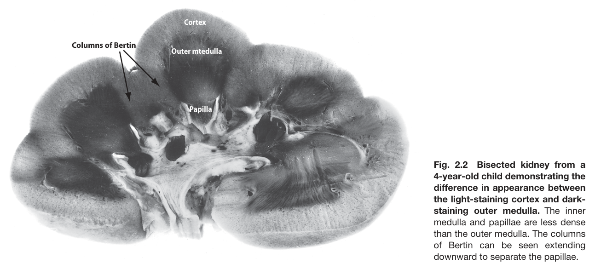

Fig. 2.2 Bisected kidney from a 4-year-old child demonstrating the difference in appearance between the light-staining cortex and dark- staining outer medulla. The inner medulla and papillae are less dense than the outer medulla. The columns of Bertin can be seen extending downward to separate the papillae.

---

### Fig_2_3

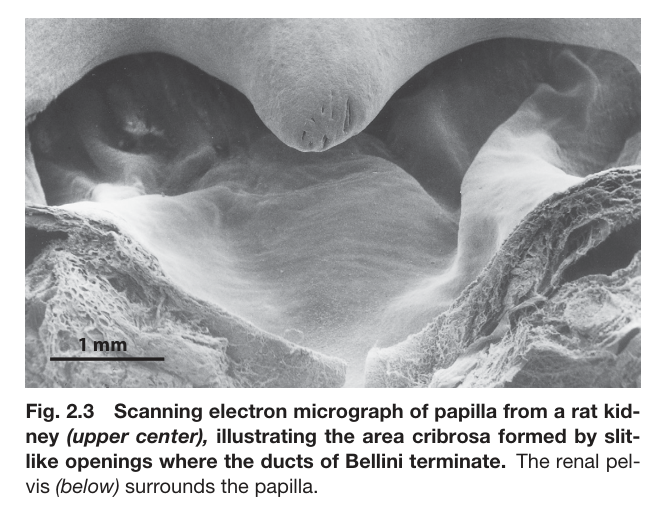

Fig. 2.3 Scanning electron micrograph of papilla from a rat kid- ney (upper center), illustrating the area cribrosa formed by slit- like openings where the ducts of Bellini terminate. The renal pel- vis (below) surrounds the papilla.

---

### Fig_2_4

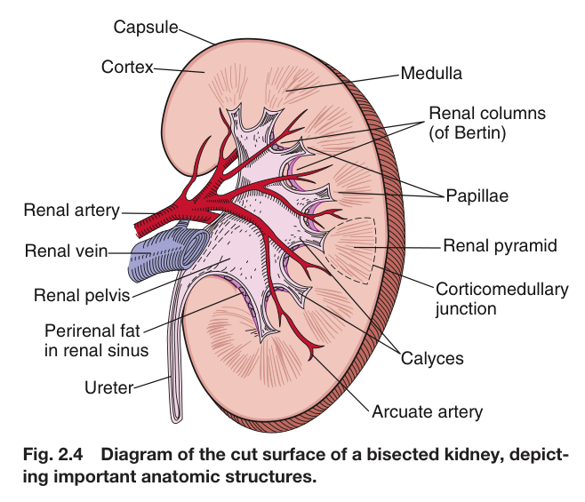

Fig. 2.4 Diagram of the cut surface of a bisected kidney, depict- ing important anatomic structures.

---

### Fig_2_5

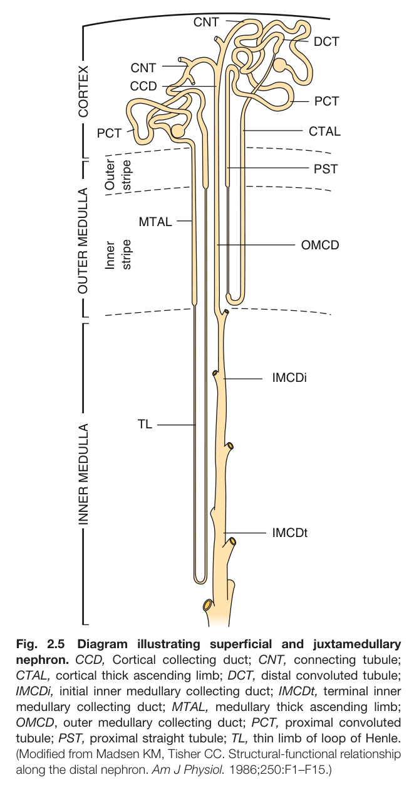

Fig. 2.5 Diagram illustrating superficial and juxtamedullary nephron. CCD, Cortical collecting duct; CNT, connecting tubule; CTAL, cortical thick ascending limb; DCT, distal convoluted tubule; IMCDi, initial inner medullary collecting duct; IMCDt, terminal inner medullary collecting duct; MTAL, medullary thick ascending limb; OMCD, outer medullary collecting duct; PCT, proximal convoluted tubule; PST, proximal straight tubule; TL, thin limb of loop of Henle. (Modified from Madsen KM, Tisher CC. Structural-functional relationship along the distal nephron. Am J Physiol. 1986;250:F1–F15.)

---

### Fig_2_6

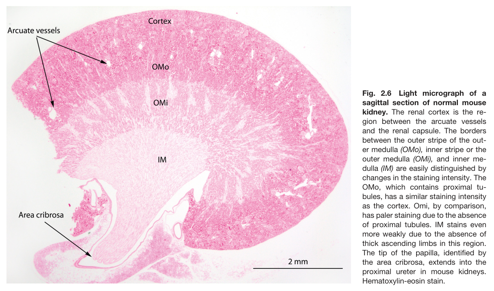

Fig. 2.6 Light micrograph of a sagittal section of normal mouse kidney. The renal cortex is the re- gion between the arcuate vessels and the renal capsule. The borders between the outer stripe of the out- er medulla (OMo), inner stripe or the outer medulla (OMi), and inner me- dulla (IM) are easily distinguished by changes in the staining intensity. The OMo, which contains proximal tu- bules, has a similar staining intensity as the cortex. Omi, by comparison, has paler staining due to the absence of proximal tubules. IM stains even more weakly due to the absence of thick ascending limbs in this region. The tip of the papilla, identified by the area cribrosa, extends into the proximal ureter in mouse kidneys. Hematoxylin-eosin stain.

---

### Fig_2_7

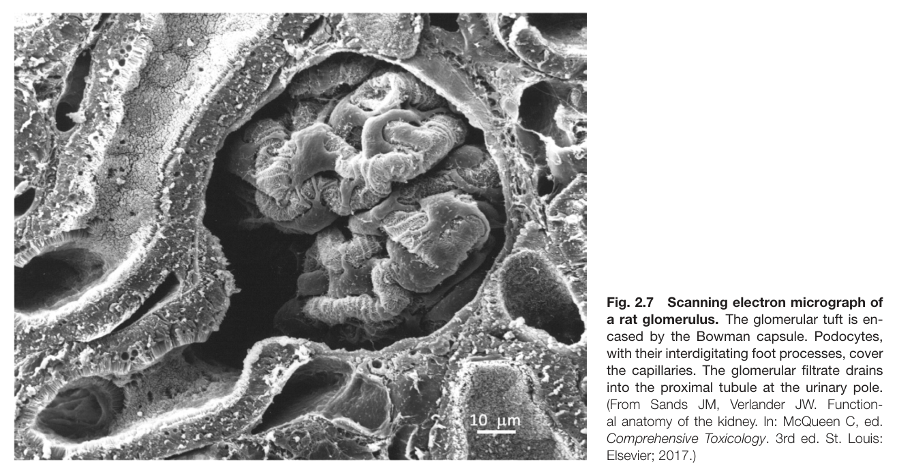

Fig. 2.7 Scanning electron micrograph of a rat glomerulus. The glomerular tuft is en- cased by the Bowman capsule. Podocytes, with their interdigitating foot processes, cover the capillaries. The glomerular filtrate drains into the proximal tubule at the urinary pole. (From Sands JM, Verlander JW. Function- al anatomy of the kidney. In: McQueen C, ed. Comprehensive Toxicology. 3rd ed. St. Louis: Elsevier; 2017.)

---

### Fig_2_8

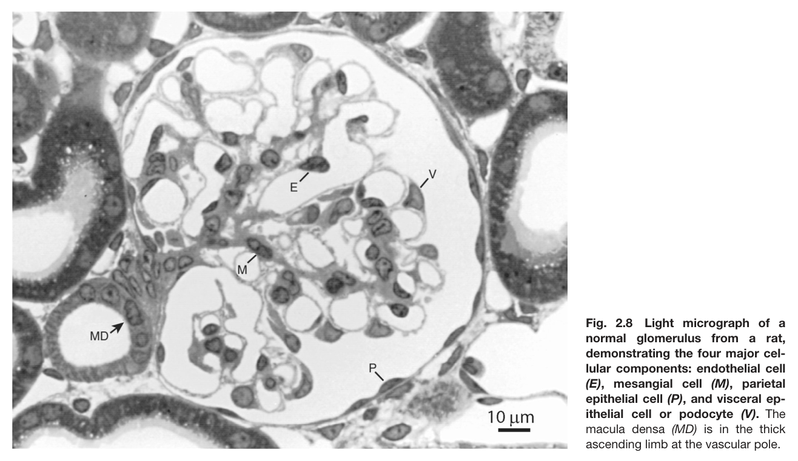

Fig. 2.8 Light micrograph of a normal glomerulus from a rat, demonstrating the four major cel- lular components: endothelial cell (E), mesangial cell (M), parietal epithelial cell (P), and visceral ep- ithelial cell or podocyte (V). The macula densa (MD) is in the thick ascending limb at the vascular pole.

---

### Fig_2_9

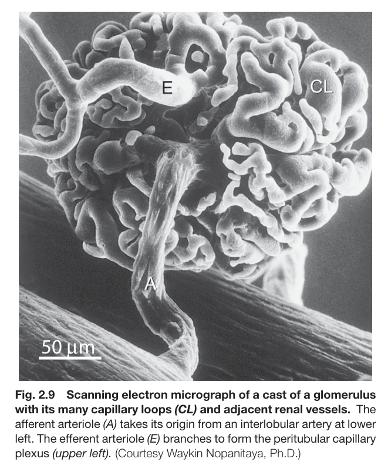

Fig. 2.9 Scanning electron micrograph of a cast of a glomerulus with its many capillary loops (CL) and adjacent renal vessels. The afferent arteriole (A) takes its origin from an interlobular artery at lower left. The efferent arteriole (E) branches to form the peritubular capillary plexus (upper left). (Courtesy Waykin Nopanitaya, Ph.D.)

---

### Fig_2_10

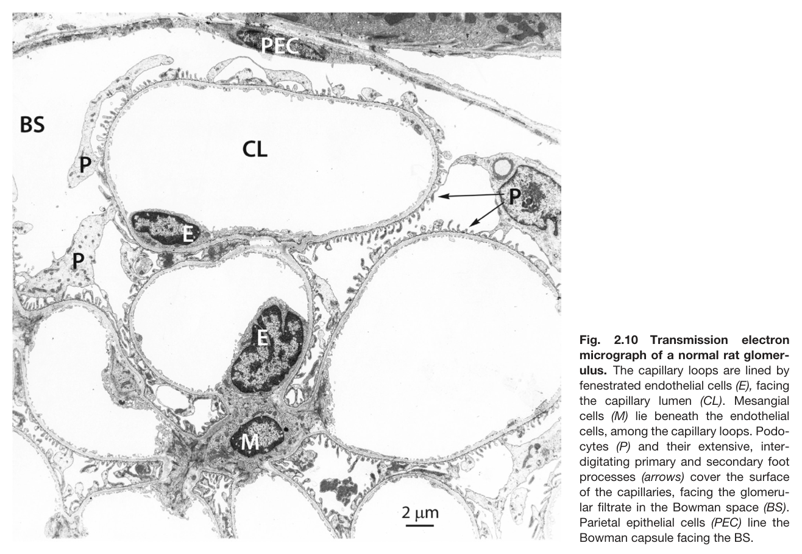

Fig. 2.10 Transmission electron micrograph of a normal rat glomer- ulus. The capillary loops are lined by fenestrated endothelial cells (E), facing the capillary lumen (CL). Mesangial cells (M) lie beneath the endothelial cells, among the capillary loops. Podo- cytes (P) and their extensive, inter- digitating primary and secondary foot processes (arrows) cover the surface of the capillaries, facing the glomeru- lar filtrate in the Bowman space (BS). Parietal epithelial cells (PEC) line the Bowman capsule facing the BS.

---

### Fig_2_11

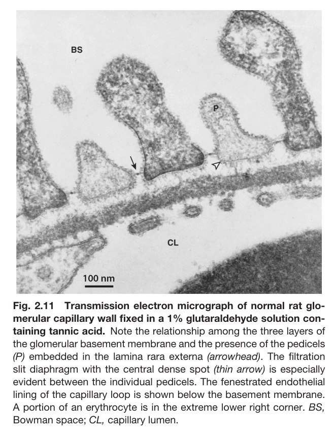

Fig. 2.11 Transmission electron micrograph of normal rat glo- merular capillary wall fixed in a 1% glutaraldehyde solution con- taining tannic acid. Note the relationship among the three layers of the glomerular basement membrane and the presence of the pedicels (P) embedded in the lamina rara externa (arrowhead). The filtration slit diaphragm with the central dense spot (thin arrow) is especially evident between the individual pedicels. The fenestrated endothelial lining of the capillary loop is shown below the basement membrane. A portion of an erythrocyte is in the extreme lower right corner. BS, Bowman space; CL, capillary lumen.

---

### Fig_2_12

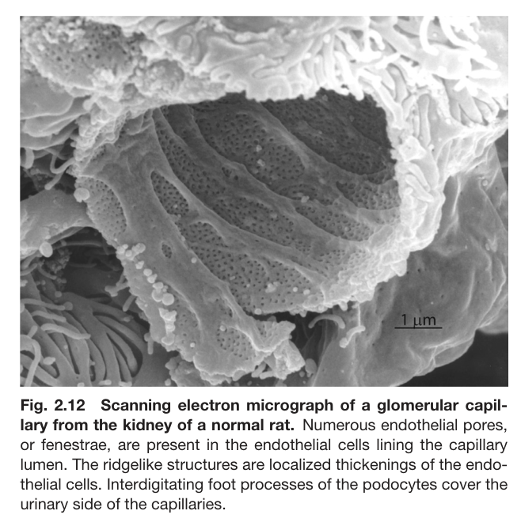

Fig. 2.12 Scanning electron micrograph of a glomerular capil- lary from the kidney of a normal rat. Numerous endothelial pores, or fenestrae, are present in the endothelial cells lining the capillary lumen. The ridgelike structures are localized thickenings of the endo- thelial cells. Interdigitating foot processes of the podocytes cover the urinary side of the capillaries.

---

### Fig_2_13

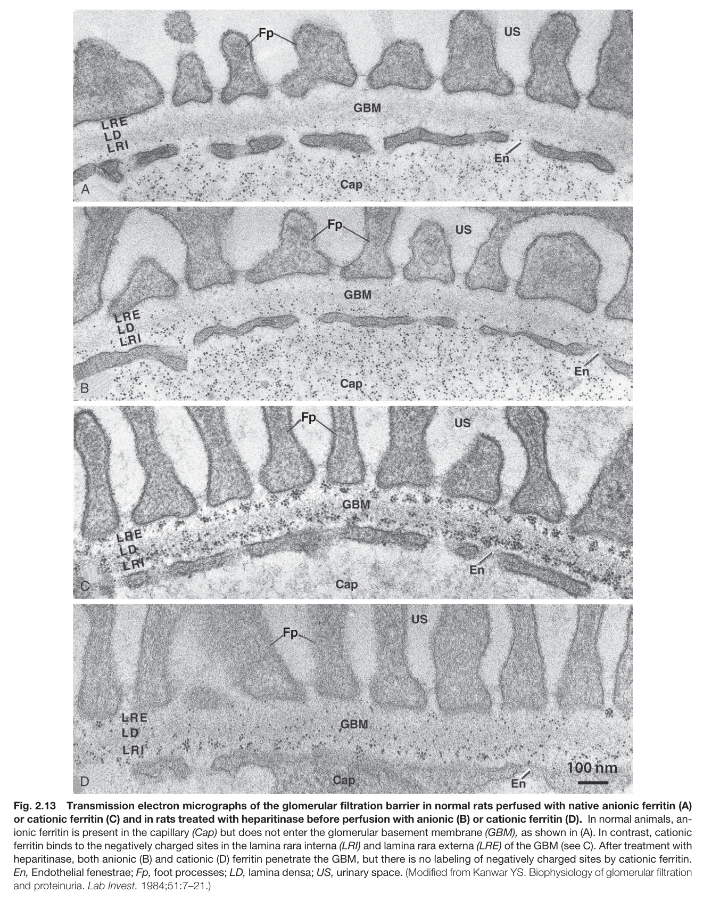

Fig. 2.13 Transmission electron micrographs of the glomerular filtration barrier in normal rats perfused with native anionic ferritin (A) or cationic ferritin (C) and in rats treated with heparitinase before perfusion with anionic (B) or cationic ferritin (D). In normal animals, an- ionic ferritin is present in the capillary (Cap) but does not enter the glomerular basement membrane (GBM), as shown in (A). In contrast, cationic ferritin binds to the negatively charged sites in the lamina rara interna (LRI) and lamina rara externa (LRE) of the GBM (see C). After treatment with heparitinase, both anionic (B) and cationic (D) ferritin penetrate the GBM, but there is no labeling of negatively charged sites by cationic ferritin. En, Endothelial fenestrae; Fp, foot processes; LD, lamina densa; US, urinary space. (Modified from Kanwar YS. Biophysiology of glomerular filtration and proteinuria. Lab Invest. 1984;51:7–21.)

---

### Fig_2_14

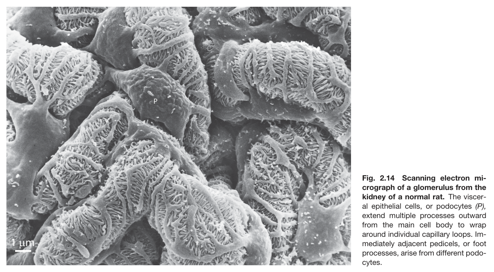

Fig. 2.14 Scanning electron mi- crograph of a glomerulus from the kidney of a normal rat. The viscer- al epithelial cells, or podocytes (P), extend multiple processes outward from the main cell body to wrap around individual capillary loops. Im- mediately adjacent pedicels, or foot processes, arise from different podo- cytes.

---

### Fig_2_15

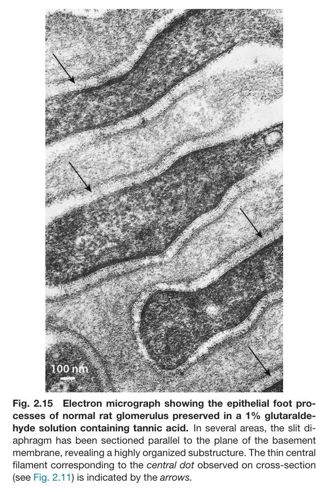

Fig. 2.15 Electron micrograph showing the epithelial foot pro- cesses of normal rat glomerulus preserved in a 1% glutaralde- hyde solution containing tannic acid. In several areas, the slit di- aphragm has been sectioned parallel to the plane of the basement membrane, revealing a highly organized substructure. The thin central filament corresponding to the central dot observed on cross-section (see Fig. 2.11) is indicated by the arrows.

---

### Fig_2_16

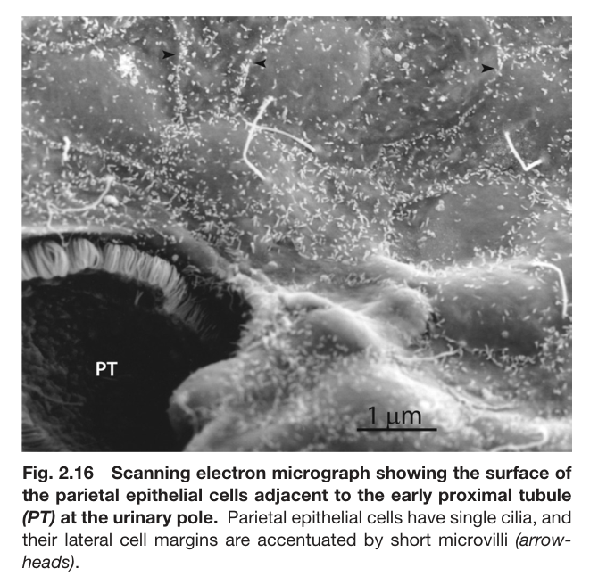

Fig. 2.16 Scanning electron micrograph showing the surface of the parietal epithelial cells adjacent to the early proximal tubule (PT) at the urinary pole. Parietal epithelial cells have single cilia, and their lateral cell margins are accentuated by short microvilli (arrow- heads).

---

### Fig_2_17

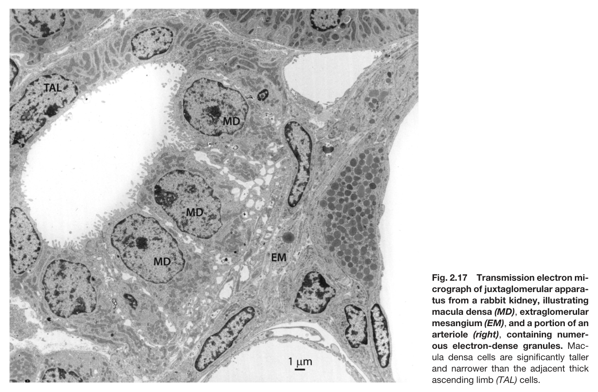

Fig. 2.17 Transmission electron mi- crograph of juxtaglomerular appara- tus from a rabbit kidney, illustrating macula densa (MD), extraglomerular mesangium (EM), and a portion of an arteriole (right), containing numer- ous electron-dense granules. Mac- ula densa cells are significantly taller and narrower than the adjacent thick ascending limb (TAL) cells.

---

### Fig_2_18

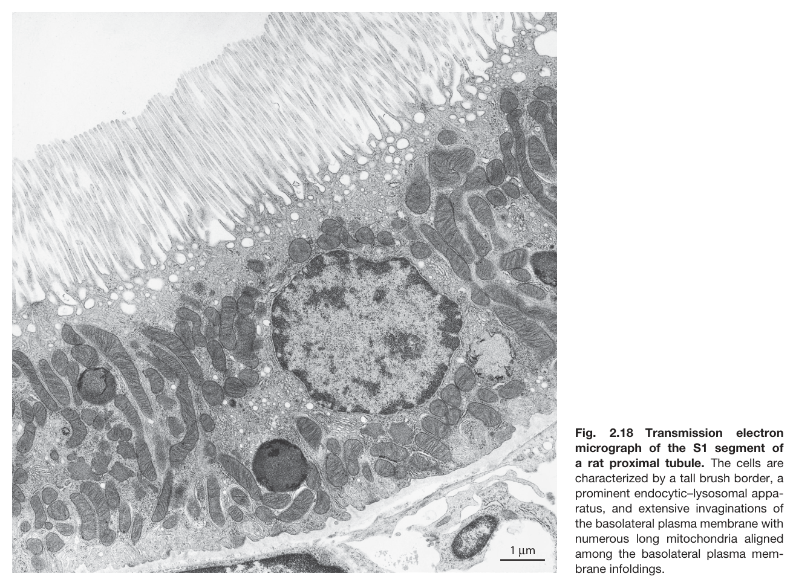

Fig. 2.18 Transmission electron micrograph of the S1 segment of a rat proximal tubule. The cells are characterized by a tall brush border, a prominent endocytic–lysosomal appa- ratus, and extensive invaginations of the basolateral plasma membrane with numerous long mitochondria aligned among the basolateral plasma mem- brane infoldings.

---

### Fig_2_19

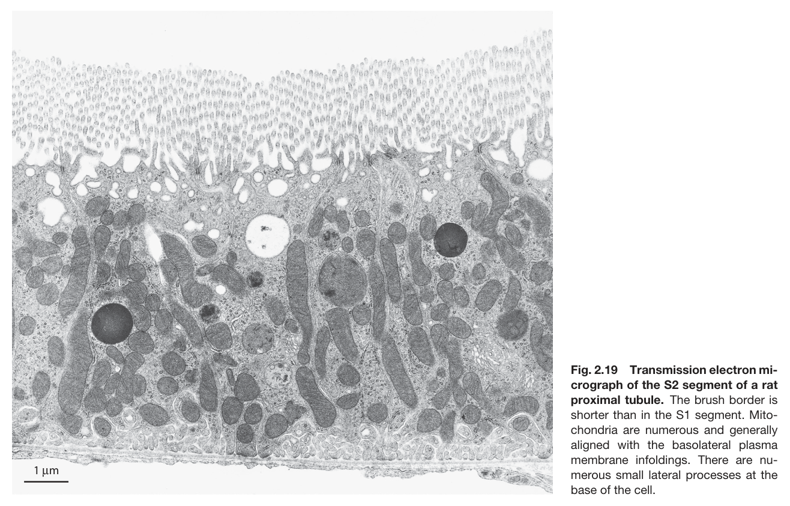

Fig. 2.19 Transmission electron mi- crograph of the S2 segment of a rat proximal tubule. The brush border is shorter than in the S1 segment. Mito- chondria are numerous and generally aligned with the basolateral plasma membrane infoldings. There are nu- merous small lateral processes at the base of the cell.

---

### Fig_2_20

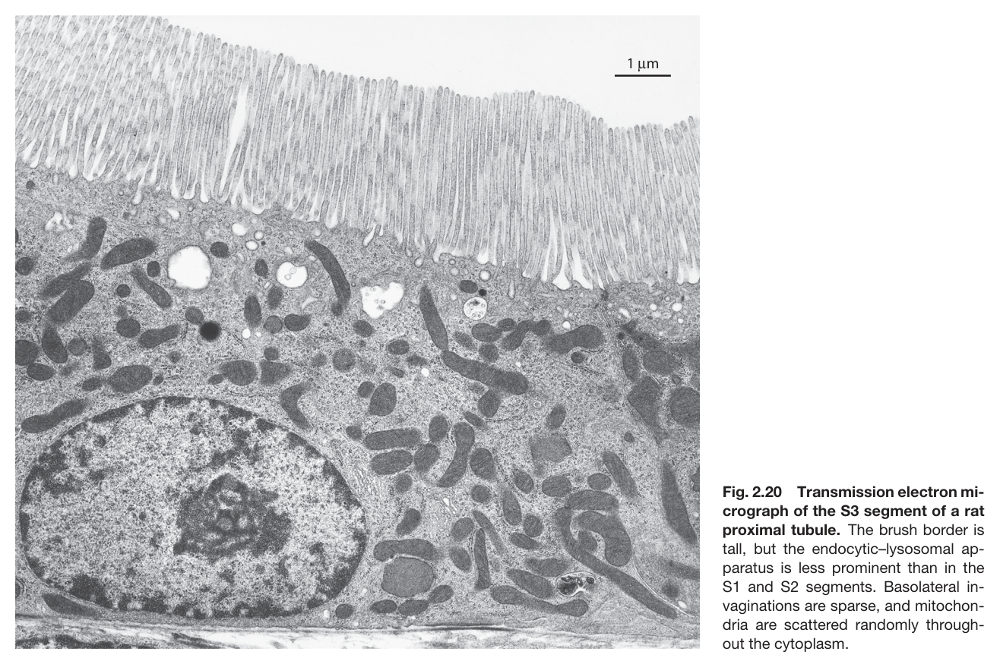

Fig. 2.20 Transmission electron mi- crograph of the S3 segment of a rat proximal tubule. The brush border is tall, but the endocytic–lysosomal ap- paratus is less prominent than in the S1 and S2 segments. Basolateral in- vaginations are sparse, and mitochon- dria are scattered randomly through- out the cytoplasm.

---

### Fig_2_21

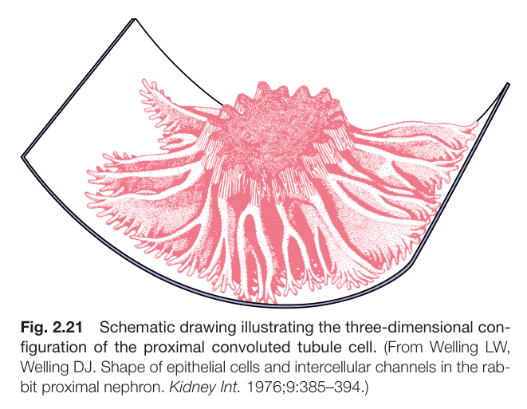

Fig. 2.21 Schematic drawing illustrating the three-dimensional con- figuration of the proximal convoluted tubule cell. (From Welling LW, Welling DJ. Shape of epithelial cells and intercellular channels in the rab- bit proximal nephron. Kidney Int. 1976;9:385–394.)

---

### Fig_2_22

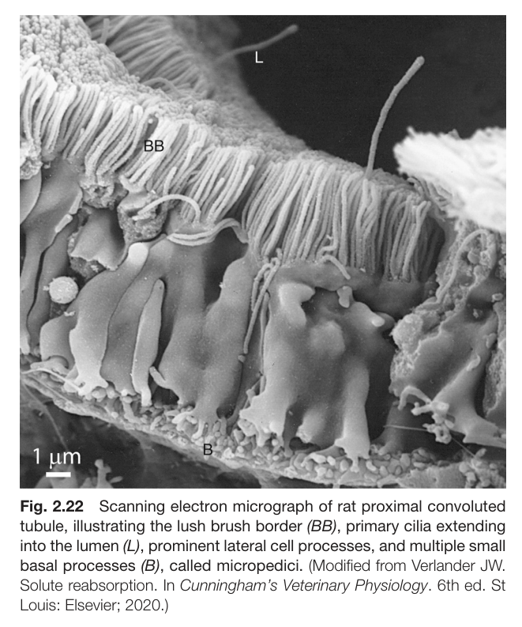

Fig. 2.22 Scanning electron micrograph of rat proximal convoluted tubule, illustrating the lush brush border (BB), primary cilia extending into the lumen (L), prominent lateral cell processes, and multiple small basal processes (B), called micropedici. (Modified from Verlander JW. Solute reabsorption. In Cunningham’s Veterinary Physiology. 6th ed. St Louis: Elsevier; 2020.)

---

### Fig_2_23

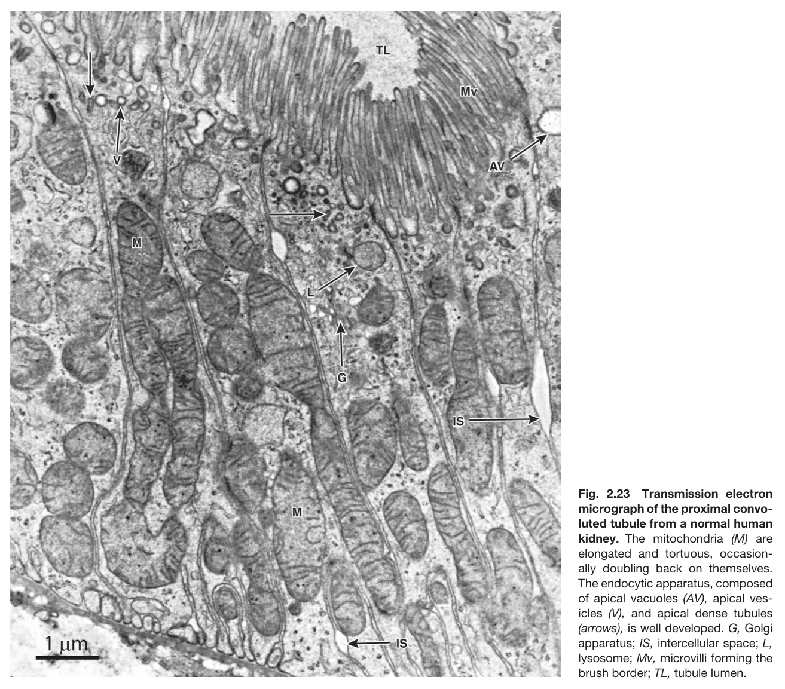

Fig. 2.23 Transmission electron micrograph of the proximal convo- luted tubule from a normal human kidney. The mitochondria (M) are elongated and tortuous, occasion- ally doubling back on themselves. The endocytic apparatus, composed of apical vacuoles (AV), apical ves- icles (V), and apical dense tubules (arrows), is well developed. G, Golgi apparatus; IS, intercellular space; L, lysosome; Mv, microvilli forming the brush border; TL, tubule lumen.

---

### Fig_2_24

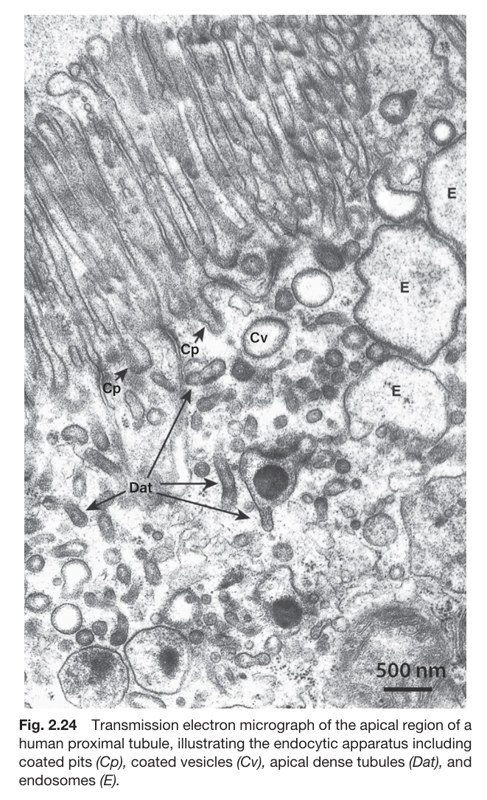

Fig. 2.24 Transmission electron micrograph of the apical region of a human proximal tubule, illustrating the endocytic apparatus including coated pits (Cp), coated vesicles (Cv), apical dense tubules (Dat), and endosomes (E).

---

### Fig_2_25

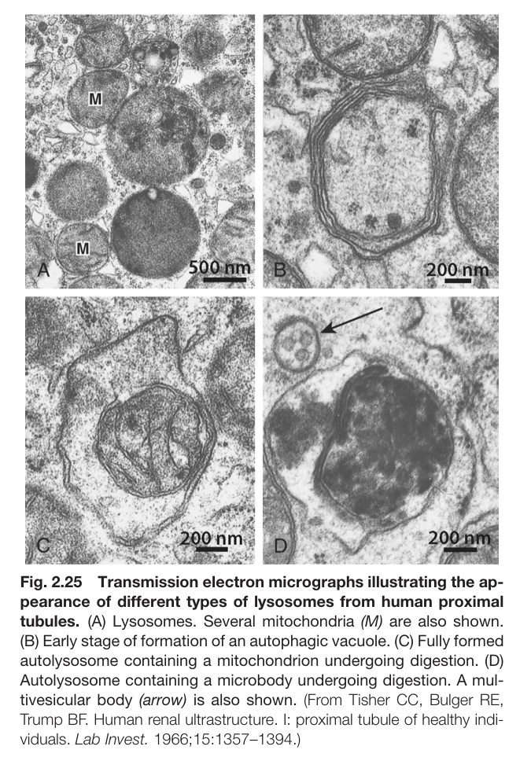

Fig. 2.25 Transmission electron micrographs illustrating the ap- pearance of different types of lysosomes from human proximal tubules. (A) Lysosomes. Several mitochondria (M) are also shown. (B) Early stage of formation of an autophagic vacuole. (C) Fully formed autolysosome containing a mitochondrion undergoing digestion. (D) Autolysosome containing a microbody undergoing digestion. A mul- tivesicular body (arrow) is also shown. (From Tisher CC, Bulger RE, Trump BF. Human renal ultrastructure. I: proximal tubule of healthy indi- viduals. Lab Invest. 1966;15:1357–1394.)

---

### Fig_2_26

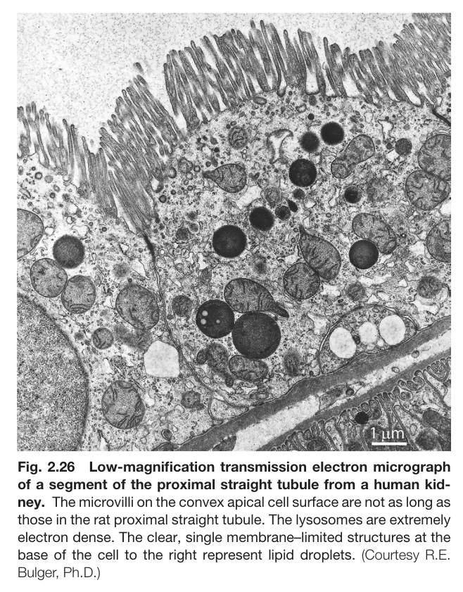

Fig. 2.26 Low-magnification transmission electron micrograph of a segment of the proximal straight tubule from a human kid- ney. The microvilli on the convex apical cell surface are not as long as those in the rat proximal straight tubule. The lysosomes are extremely electron dense. The clear, single membrane–limited structures at the base of the cell to the right represent lipid droplets. (Courtesy R.E. Bulger, Ph.D.)

---

### Fig_2_27

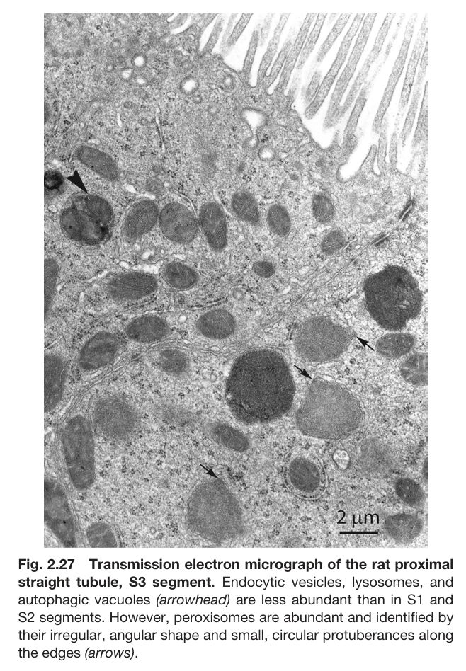

Fig. 2.27 Transmission electron micrograph of the rat proximal straight tubule, S3 segment. Endocytic vesicles, lysosomes, and autophagic vacuoles (arrowhead) are less abundant than in S1 and S2 segments. However, peroxisomes are abundant and identified by their irregular, angular shape and small, circular protuberances along the edges (arrows).

---

### Fig_2_28

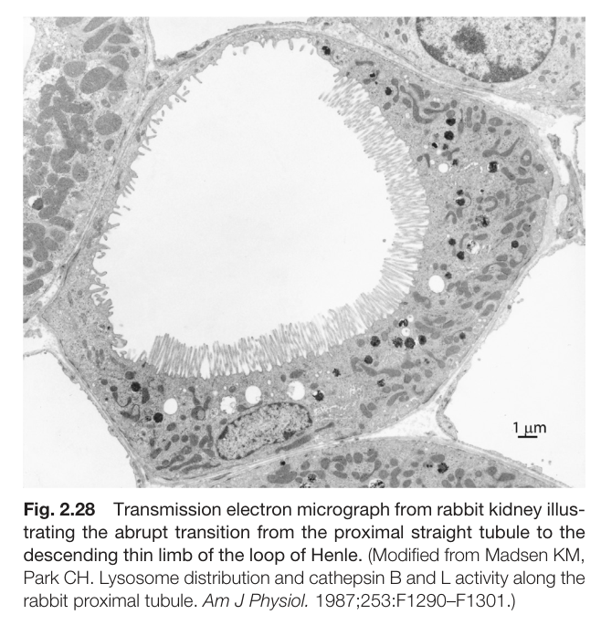

Fig. 2.28 Transmission electron micrograph from rabbit kidney illus- trating the abrupt transition from the proximal straight tubule to the descending thin limb of the loop of Henle. (Modified from Madsen KM, Park CH. Lysosome distribution and cathepsin B and L activity along the rabbit proximal tubule. Am J Physiol. 1987;253:F1290–F1301.)

---

### Fig_2_29

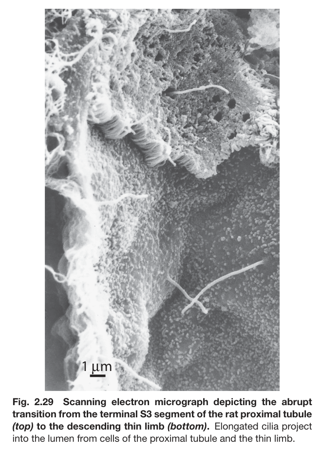

Fig. 2.29 Scanning electron micrograph depicting the abrupt transition from the terminal S3 segment of the rat proximal tubule (top) to the descending thin limb (bottom). Elongated cilia project into the lumen from cells of the proximal tubule and the thin limb.

---

### Fig_2_30

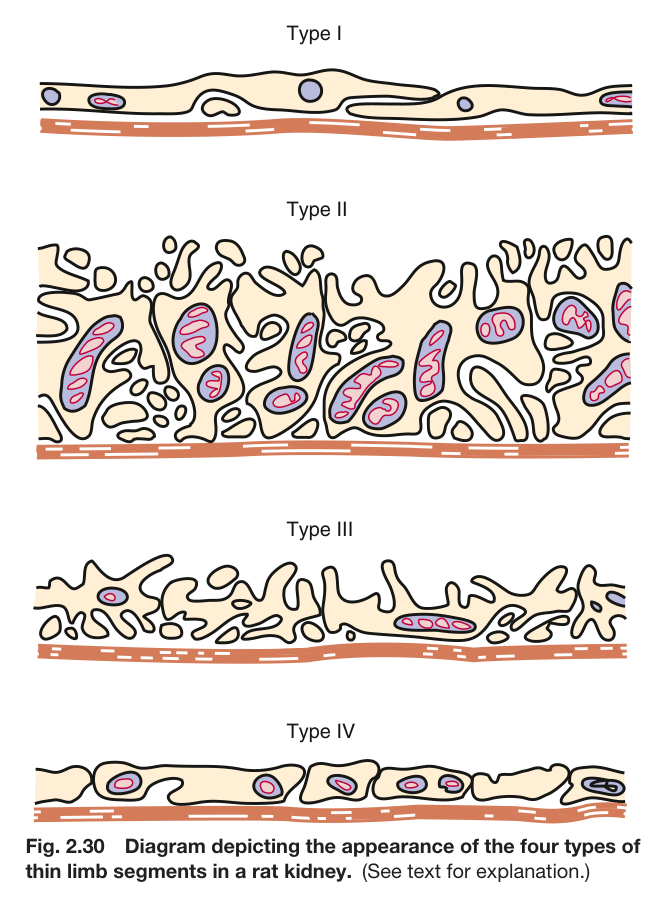

Fig. 2.30 Diagram depicting the appearance of the four types of thin limb segments in a rat kidney. (See text for explanation.)

---

### Fig_2_31

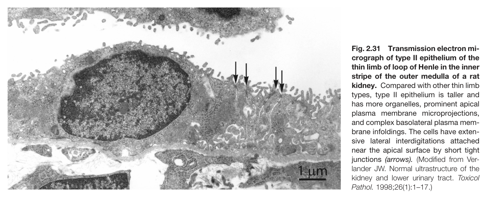

Fig. 2.31 Transmission electron mi- crograph of type II epithelium of the thin limb of loop of Henle in the inner stripe of the outer medulla of a rat kidney. Compared with other thin limb types, type II epithelium is taller and has more organelles, prominent apical plasma membrane microprojections, and complex basolateral plasma mem- brane infoldings. The cells have exten- sive lateral interdigitations attached near the apical surface by short tight junctions (arrows). (Modified from Ver- lander JW. Normal ultrastructure of the kidney and lower urinary tract. Toxicol Pathol. 1998;26(1):1–17.)

---

### Fig_2_32

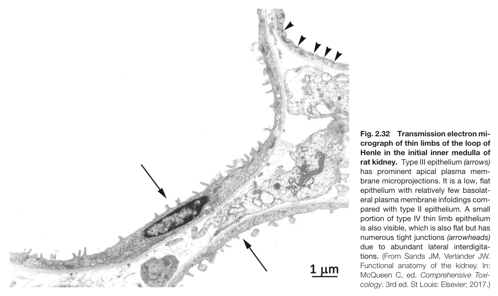

Fig. 2.32 Transmission electron mi- crograph of thin limbs of the loop of Henle in the initial inner medulla of rat kidney. Type III epithelium (arrows) has prominent apical plasma mem- brane microprojections. It is a low, flat epithelium with relatively few basolat- eral plasma membrane infoldings com- pared with type II epithelium. A small portion of type IV thin limb epithelium is also visible, which is also flat but has numerous tight junctions (arrowheads) due to abundant lateral interdigita- tions. (From Sands JM, Verlander JW. Functional anatomy of the kidney. In: McQueen C, ed. Comprehensive Toxi- cology. 3rd ed. St Louis: Elsevier; 2017.)

---

### Fig_2_33

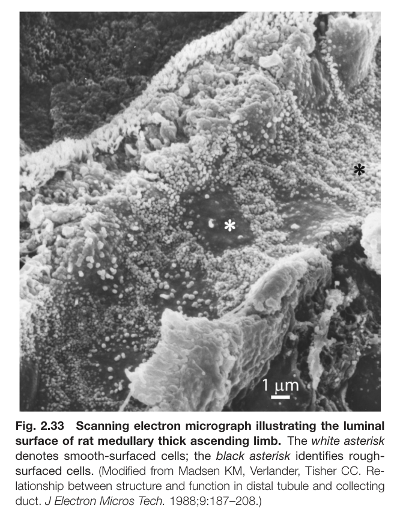

Fig. 2.33 Scanning electron micrograph illustrating the luminal surface of rat medullary thick ascending limb. The white asterisk denotes smooth-surfaced cells; the black asterisk identifies rough- surfaced cells. (Modified from Madsen KM, Verlander, Tisher CC. Re- lationship between structure and function in distal tubule and collecting duct. J Electron Micros Tech. 1988;9:187–208.)

---

### Fig_2_34

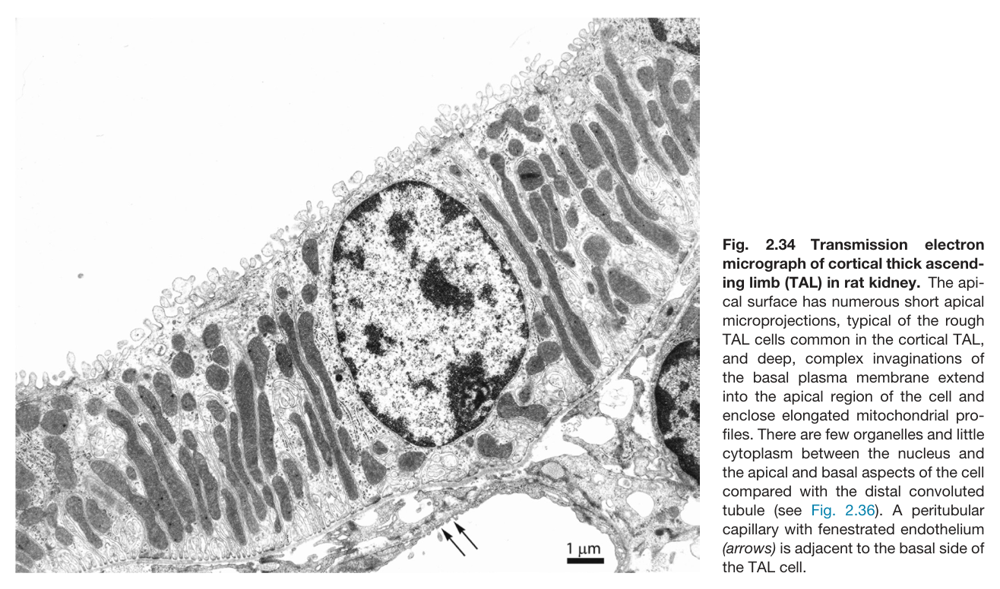

Fig. 2.34 Transmission electron micrograph of cortical thick ascend- ing limb (TAL) in rat kidney. The api- cal surface has numerous short apical microprojections, typical of the rough TAL cells common in the cortical TAL, and deep, complex invaginations of the basal plasma membrane extend into the apical region of the cell and enclose elongated mitochondrial pro- files. There are few organelles and little cytoplasm between the nucleus and the apical and basal aspects of the cell compared with the distal convoluted tubule (see Fig. 2.36). A peritubular capillary with fenestrated endothelium (arrows) is adjacent to the basal side of the TAL cell.

---

### Fig_2_35

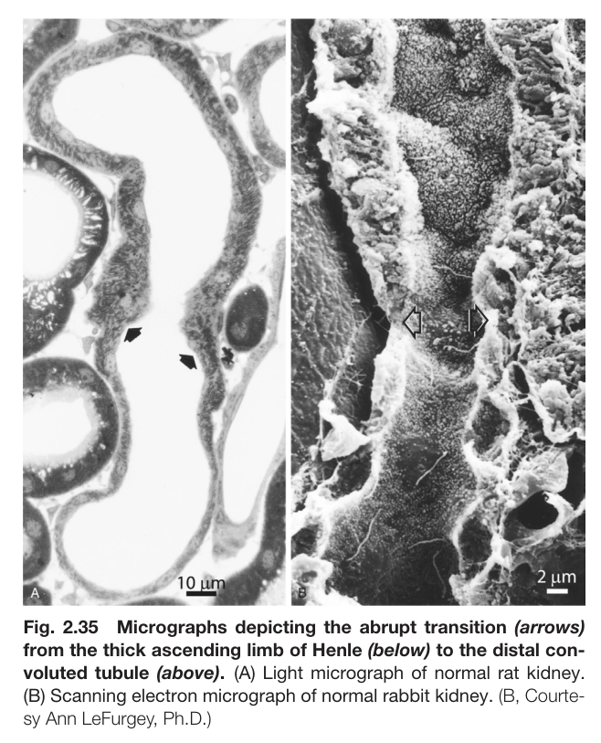

Fig. 2.35 Micrographs depicting the abrupt transition (arrows) from the thick ascending limb of Henle (below) to the distal con- voluted tubule (above). (A) Light micrograph of normal rat kidney. (B) Scanning electron micrograph of normal rabbit kidney. (B, Courte- sy Ann LeFurgey, Ph.D.)

---

### Fig_2_36

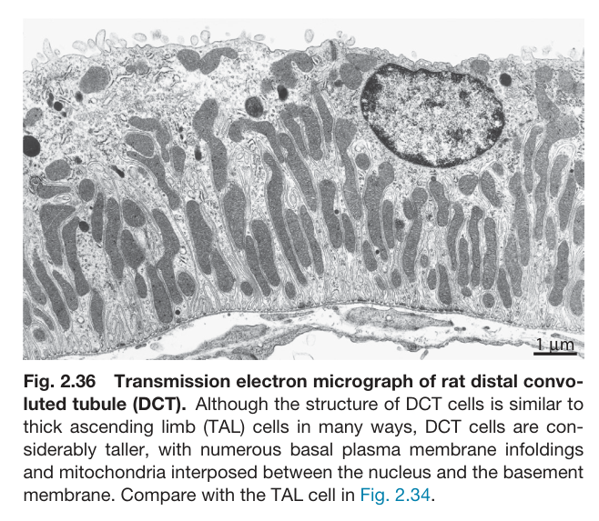

Fig. 2.36 Transmission electron micrograph of rat distal convo- luted tubule (DCT). Although the structure of DCT cells is similar to thick ascending limb (TAL) cells in many ways, DCT cells are con- siderably taller, with numerous basal plasma membrane infoldings and mitochondria interposed between the nucleus and the basement membrane. Compare with the TAL cell in Fig. 2.34.

---

### Fig_2_37

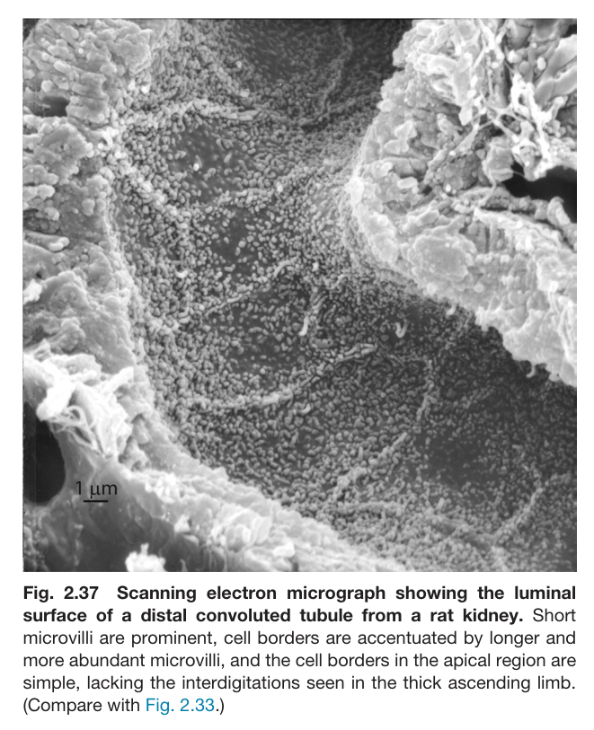

Fig. 2.37 Scanning electron micrograph showing the luminal surface of a distal convoluted tubule from a rat kidney. Short microvilli are prominent, cell borders are accentuated by longer and more abundant microvilli, and the cell borders in the apical region are simple, lacking the interdigitations seen in the thick ascending limb. (Compare with Fig. 2.33.)

---

### Fig_2_38

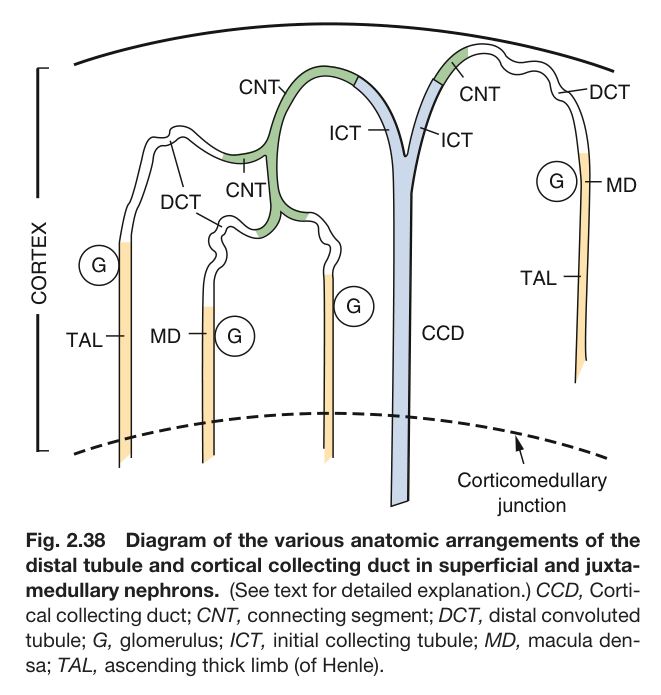

Fig. 2.38 Diagram of the various anatomic arrangements of the distal tubule and cortical collecting duct in superficial and juxta- medullary nephrons. (See text for detailed explanation.) CCD, Corti- cal collecting duct; CNT, connecting segment; DCT, distal convoluted tubule; G, glomerulus; ICT, initial collecting tubule; MD, macula den- sa; TAL, ascending thick limb (of Henle).

---

### Fig_2_39

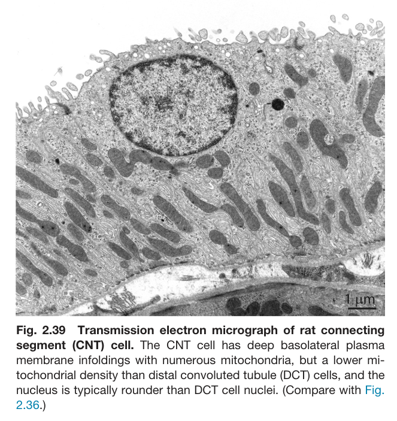

Fig. 2.39 Transmission electron micrograph of rat connecting segment (CNT) cell. The CNT cell has deep basolateral plasma membrane infoldings with numerous mitochondria, but a lower mi- tochondrial density than distal convoluted tubule (DCT) cells, and the nucleus is typically rounder than DCT cell nuclei. (Compare with Fig. 2.36.)

---

### Fig_2_40

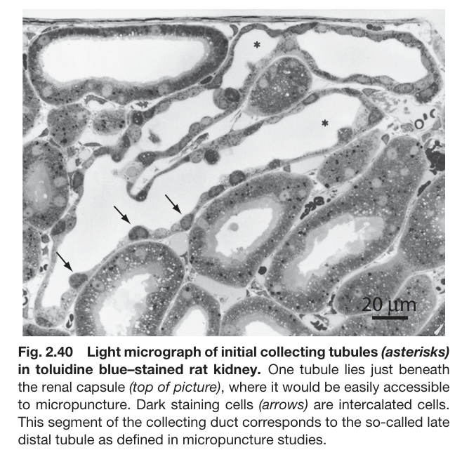

Fig. 2.40 Light micrograph of initial collecting tubules (asterisks) in toluidine blue–stained rat kidney. One tubule lies just beneath the renal capsule (top of picture), where it would be easily accessible to micropuncture. Dark staining cells (arrows) are intercalated cells. This segment of the collecting duct corresponds to the so-called late distal tubule as defined in micropuncture studies.

---

### Fig_2_41

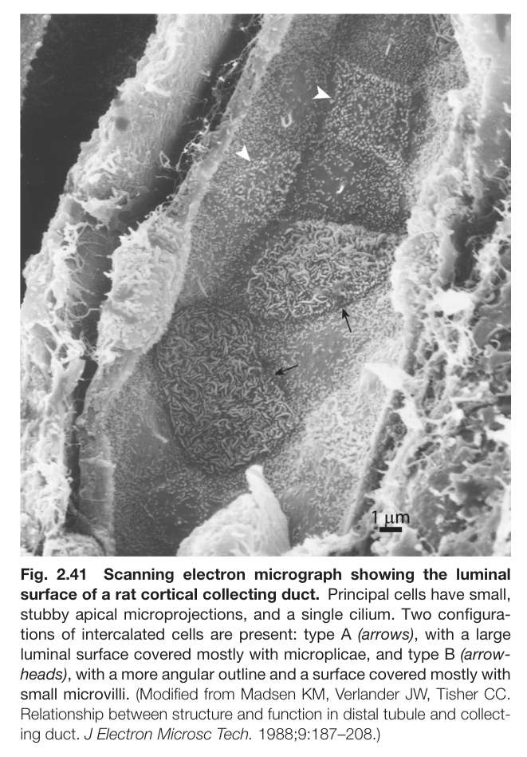

Fig. 2.41 Scanning electron micrograph showing the luminal surface of a rat cortical collecting duct. Principal cells have small, stubby apical microprojections, and a single cilium. Two configura- tions of intercalated cells are present: type A (arrows), with a large luminal surface covered mostly with microplicae, and type B (arrow- heads), with a more angular outline and a surface covered mostly with small microvilli. (Modified from Madsen KM, Verlander JW, Tisher CC. Relationship between structure and function in distal tubule and collect- ing duct. J Electron Microsc Tech. 1988;9:187–208.)

---

### Fig_2_42

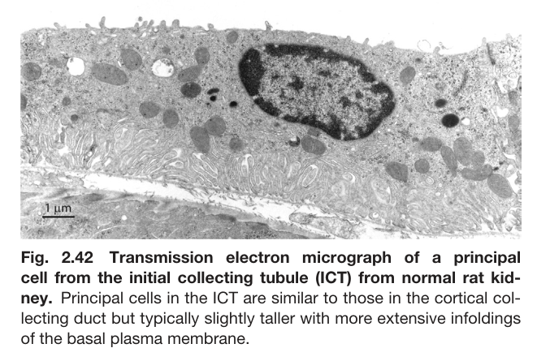

Fig. 2.42 Transmission electron micrograph of a principal cell from the initial collecting tubule (ICT) from normal rat kid- ney. Principal cells in the ICT are similar to those in the cortical col- lecting duct but typically slightly taller with more extensive infoldings of the basal plasma membrane.

---

### Fig_2_43

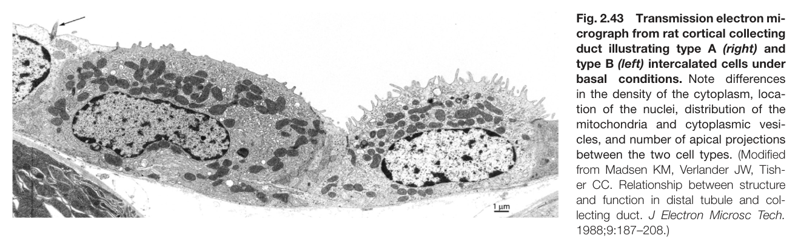

Fig. 2.43 Transmission electron mi- crograph from rat cortical collecting duct illustrating type A (right) and type B (left) intercalated cells under basal conditions. Note differences in the density of the cytoplasm, loca- tion of the nuclei, distribution of the mitochondria and cytoplasmic vesi- cles, and number of apical projections between the two cell types. (Modified from Madsen KM, Verlander JW, Tish- er CC. Relationship between structure and function in distal tubule and col- lecting duct. J Electron Microsc Tech. 1988;9:187–208.)

---

### Fig_2_44

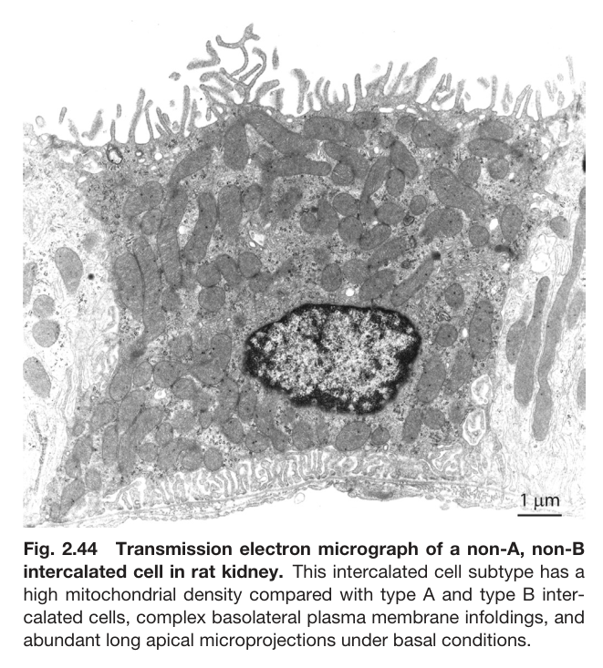

Fig. 2.44 Transmission electron micrograph of a non-A, non-B intercalated cell in rat kidney. This intercalated cell subtype has a high mitochondrial density compared with type A and type B inter- calated cells, complex basolateral plasma membrane infoldings, and abundant long apical microprojections under basal conditions.

---

### Fig_2_45

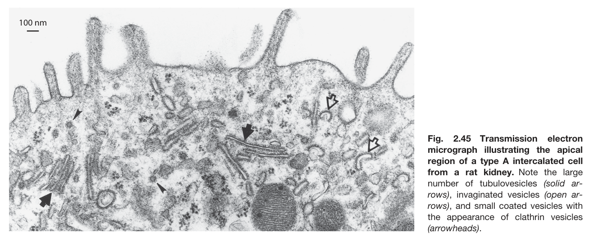

Fig. 2.45 Transmission electron micrograph illustrating the apical region of a type A intercalated cell from a rat kidney. Note the large number of tubulovesicles (solid ar- rows), invaginated vesicles (open ar- rows), and small coated vesicles with the appearance of clathrin vesicles (arrowheads).

---

### Fig_2_46

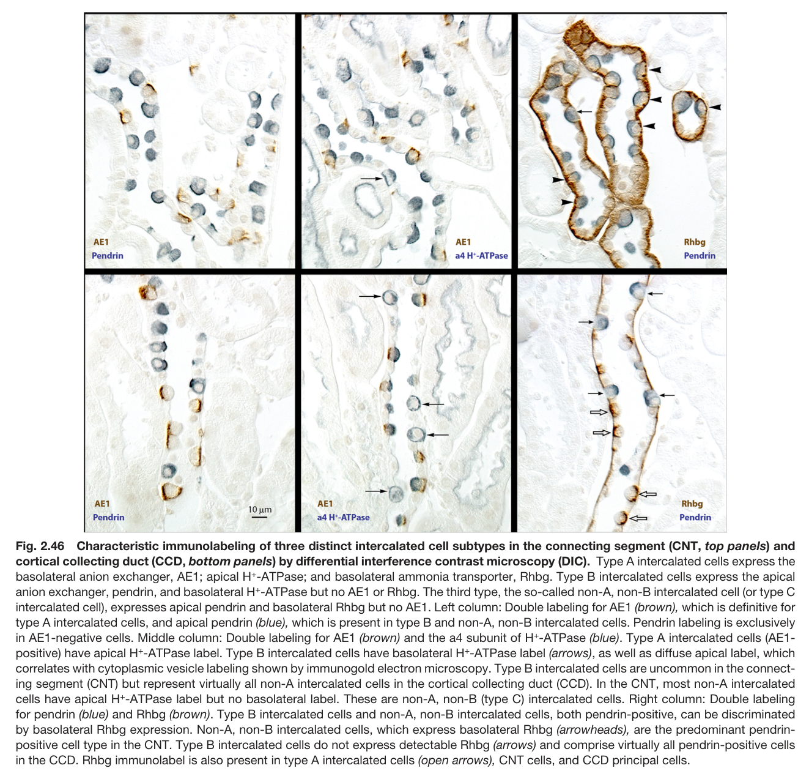

Fig. 2.46 Characteristic immunolabeling of three distinct intercalated cell subtypes in the connecting segment (CNT, top panels) and cortical collecting duct (CCD, bottom panels) by differential interference contrast microscopy (DIC). Type A intercalated cells express the basolateral anion exchanger, AE1; apical H+-ATPase; and basolateral ammonia transporter, Rhbg. Type B intercalated cells express the apica anion exchanger, pendrin, and basolateral H+-ATPase but no AE1 or Rhbg. The third type, the so-called non-A, non-B intercalated cell (or type C intercalated cell), expresses apical pendrin and basolateral Rhbg but no AE1. Left column: Double labeling for AE1 (brown), which is definitive for type A intercalated cells, and apical pendrin (blue), which is present in type B and non-A, non-B intercalated cells. Pendrin labeling is exclusively in AE1-negative cells. Middle column: Double labeling for AE1 (brown) and the a4 subunit of H+-ATPase (blue). Type A intercalated cells (AE1- positive) have apical H+-ATPase label. Type B intercalated cells have basolateral H+-ATPase label (arrows), as well as diffuse apical label, which correlates with cytoplasmic vesicle labeling shown by immunogold electron microscopy. Type B intercalated cells are uncommon in the connect- ing segment (CNT) but represent virtually all non-A intercalated cells in the cortical collecting duct (CCD). In the CNT, most non-A intercalated cells have apical H+-ATPase label but no basolateral label. These are non-A, non-B (type C) intercalated cells. Right column: Double labeling for pendrin (blue) and Rhbg (brown). Type B intercalated cells and non-A, non-B intercalated cells, both pendrin-positive, can be discriminated by basolateral Rhbg expression. Non-A, non-B intercalated cells, which express basolateral Rhbg (arrowheads), are the predominant pendrin- positive cell type in the CNT. Type B intercalated cells do not express detectable Rhbg (arrows) and comprise virtually all pendrin-positive cell in the CCD. Rhbg immunolabel is also present in type A intercalated cells (open arrows), CNT cells, and CCD principal cells

---

### Fig_2_47

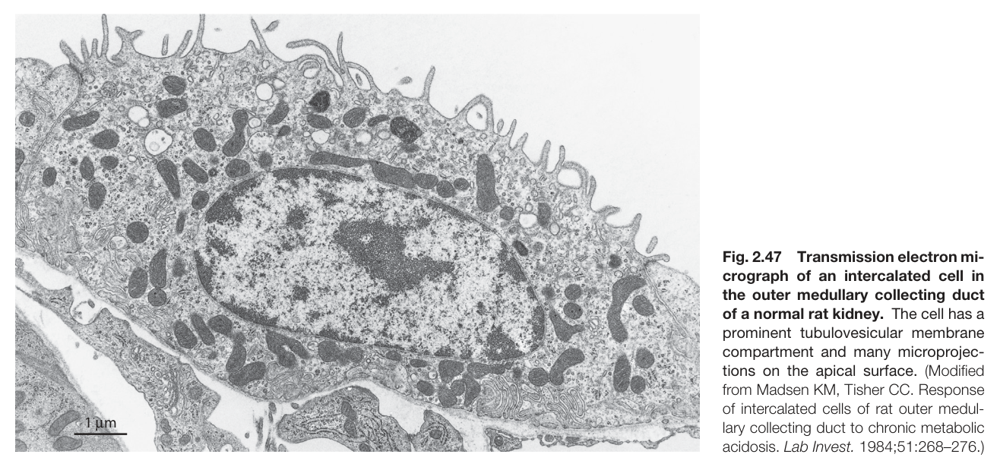

Fig. 2.47 Transmission electron mi- crograph of an intercalated cell in the outer medullary collecting duct of a normal rat kidney. The cell has a prominent tubulovesicular membrane compartment and many microprojec- tions on the apical surface. (Modified from Madsen KM, Tisher CC. Response of intercalated cells of rat outer medul- lary collecting duct to chronic metabolic acidosis. Lab Invest. 1984;51:268–276.)

---

### Fig_2_48

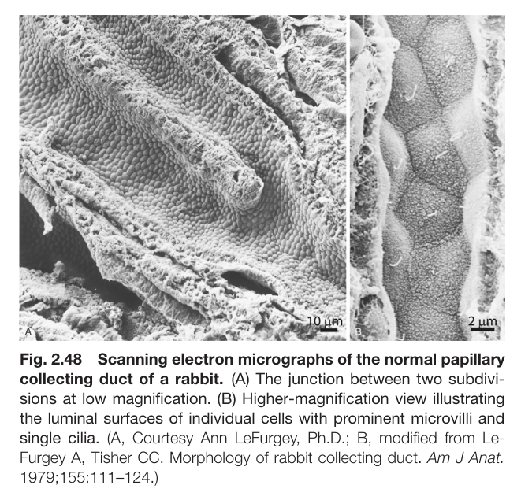

Fig. 2.48 Scanning electron micrographs of the normal papillary collecting duct of a rabbit. (A) The junction between two subdivi- sions at low magnification. (B) Higher-magnification view illustrating the luminal surfaces of individual cells with prominent microvilli and single cilia. (A, Courtesy Ann LeFurgey, Ph.D.; B, modified from Le- Furgey A, Tisher CC. Morphology of rabbit collecting duct. Am J Anat. 1979;155:111–124.)

---

### Fig_2_49

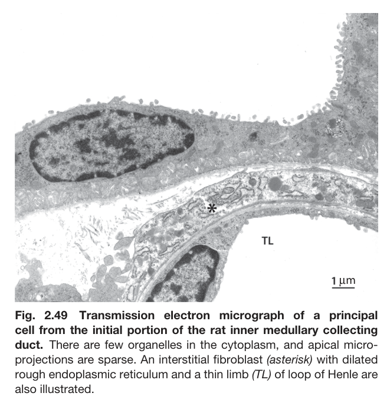

Fig. 2.49 Transmission electron micrograph of a principal cell from the initial portion of the rat inner medullary collecting duct. There are few organelles in the cytoplasm, and apical micro- projections are sparse. An interstitial fibroblast (asterisk) with dilated rough endoplasmic reticulum and a thin limb (TL) of loop of Henle are also illustrated.

---

### Fig_2_50

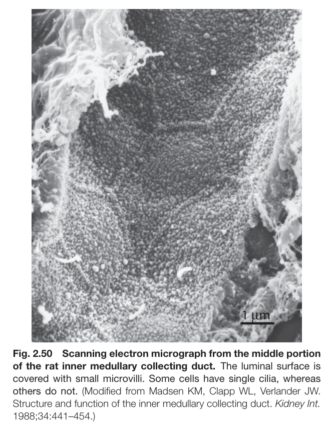

Fig. 2.50 Scanning electron micrograph from the middle portion of the rat inner medullary collecting duct. The luminal surface is covered with small microvilli. Some cells have single cilia, whereas others do not. (Modified from Madsen KM, Clapp WL, Verlander JW. Structure and function of the inner medullary collecting duct. Kidney Int. 1988;34:441–454.)

---

### Fig_2_51

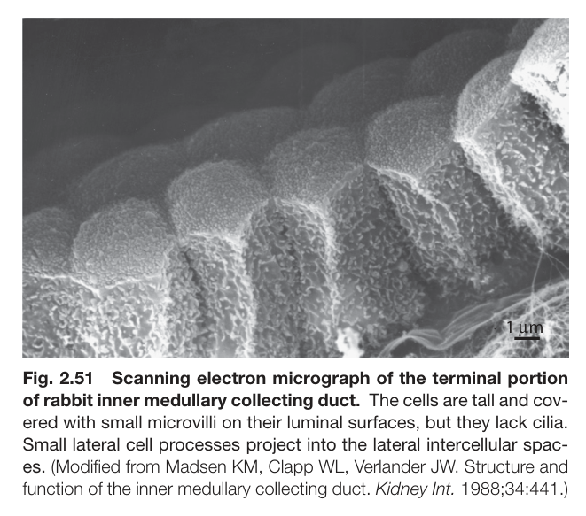

Fig. 2.51 Scanning electron micrograph of the terminal portion of rabbit inner medullary collecting duct. The cells are tall and cov- ered with small microvilli on their luminal surfaces, but they lack cilia. Small lateral cell processes project into the lateral intercellular spac- es. (Modified from Madsen KM, Clapp WL, Verlander JW. Structure and function of the inner medullary collecting duct. Kidney Int. 1988;34:441.)

---

### Fig_2_52

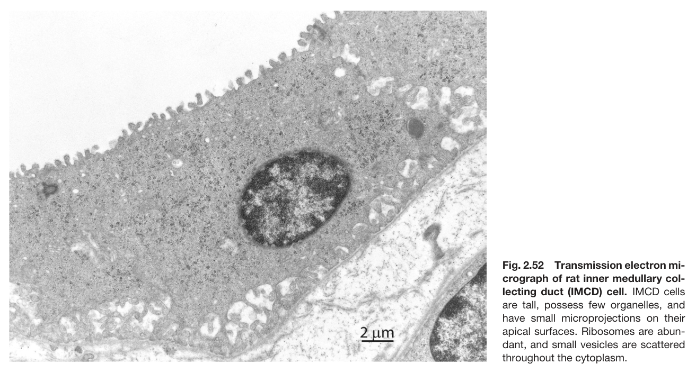

Fig. 2.52 Transmission electron mi- crograph of rat inner medullary col- lecting duct (IMCD) cell. IMCD cells are tall, possess few organelles, and have small microprojections on their apical surfaces. Ribosomes are abun- dant, and small vesicles are scattered throughout the cytoplasm.

---

### Fig_2_53

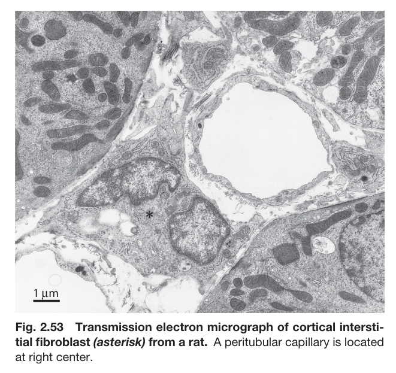

Fig. 2.53 Transmission electron micrograph of cortical intersti- tial fibroblast (asterisk) from a rat. A peritubular capillary is located at right center.

---

### Fig_2_54

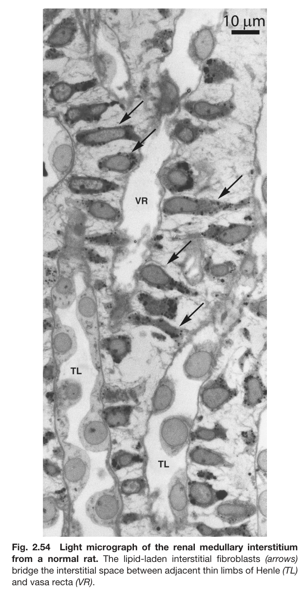

Fig. 2.54 Light micrograph of the renal medullary interstitium from a normal rat. The lipid-laden interstitial fibroblasts (arrows) bridge the interstitial space between adjacent thin limbs of Henle (TL) and vasa recta (VR).

---

### Fig_2_55

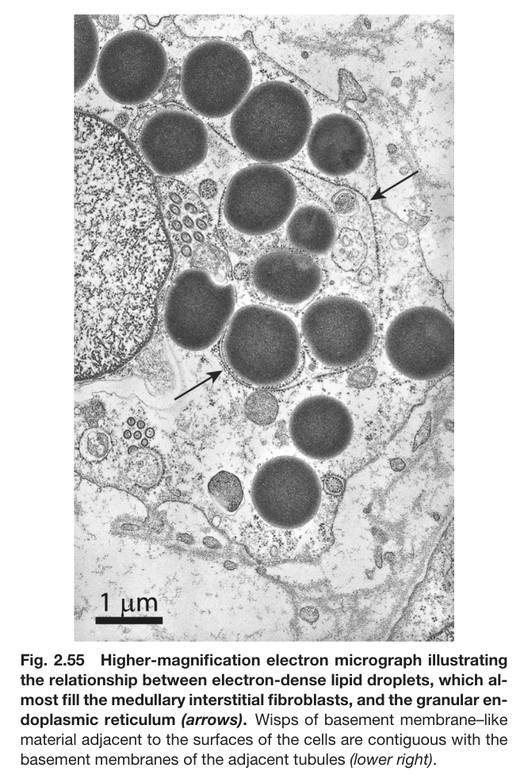

Fig. 2.55 Higher-magnification electron micrograph illustrating the relationship between electron-dense lipid droplets, which al- most fill the medullary interstitial fibroblasts, and the granular en- doplasmic reticulum (arrows). Wisps of basement membrane–like material adjacent to the surfaces of the cells are contiguous with the basement membranes of the adjacent tubules (lower right).

---

### Fig_2_56

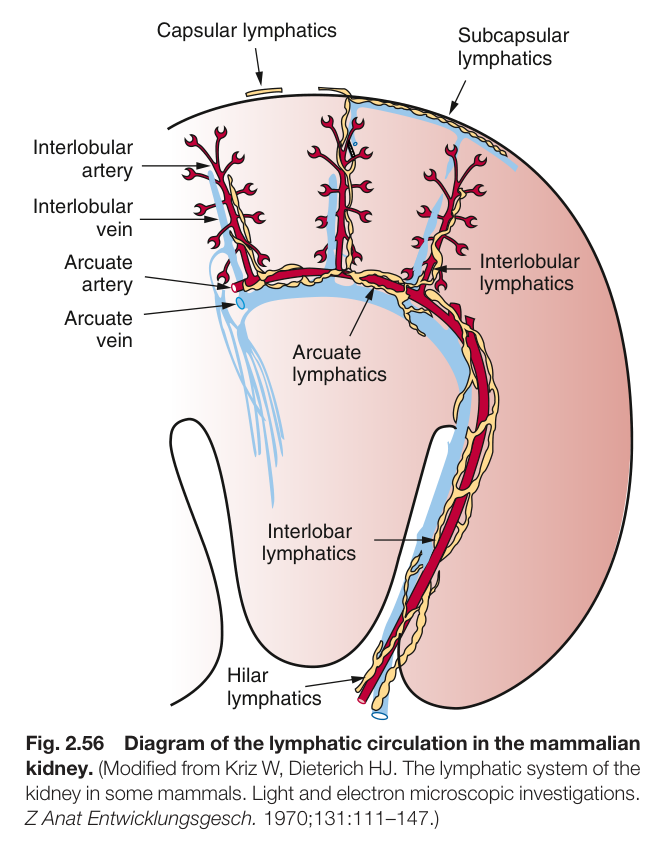

Fig. 2.56 Diagram of the lymphatic circulation in the mammalian kidney. (Modified from Kriz W, Dieterich HJ. The lymphatic system of the kidney in some mammals. Light and electron microscopic investigations. Z Anat Entwicklungsgesch. 1970;131:111–147.)

---

### Fig_2_57

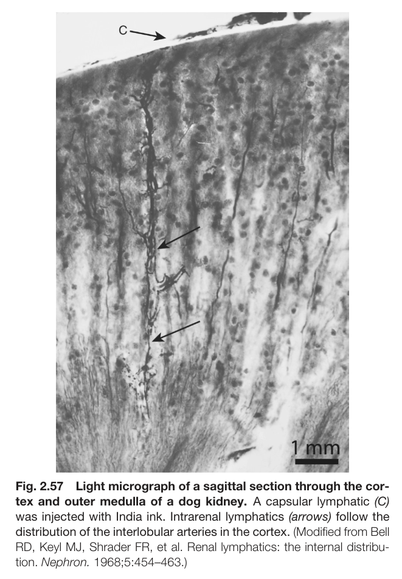

Fig. 2.57 Light micrograph of a sagittal section through the cor- tex and outer medulla of a dog kidney. A capsular lymphatic (C) was injected with India ink. Intrarenal lymphatics (arrows) follow the distribution of the interlobular arteries in the cortex. (Modified from Bell RD, Keyl MJ, Shrader FR, et al. Renal lymphatics: the internal distribu- tion. Nephron. 1968;5:454–463.)

---

### Fig_2_58

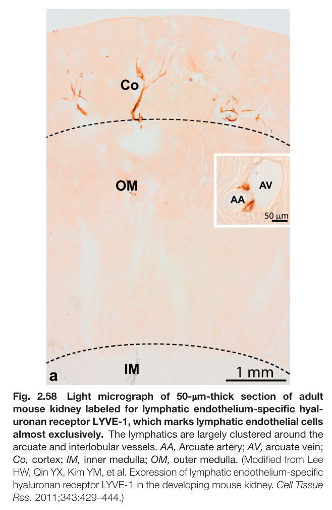

Fig. 2.58 Light micrograph of 50-μm-thick section of adult mouse kidney labeled for lymphatic endothelium-specific hyal- uronan receptor LYVE-1, which marks lymphatic endothelial cells almost exclusively. The lymphatics are largely clustered around the arcuate and interlobular vessels. AA, Arcuate artery; AV, arcuate vein; Co, cortex; IM, inner medulla; OM, outer medulla. (Modified from Lee HW, Qin YX, Kim YM, et al. Expression of lymphatic endothelium-specific hyaluronan receptor LYVE-1 in the developing mouse kidney. Cell Tissue Res. 2011;343:429–444.)

---

## Tables

*No tables resolved for this chapter.*
