# 03. Renal Circulation and Glomerular Filtration - Figures and Tables Index

This document lists all figures and tables extracted from `03. Renal Circulation and Glomerular Filtration.pdf`.

## Table of Contents
- [Figures](#figures)
- [Tables](#tables)

---

## Figures

### Fig_3_1

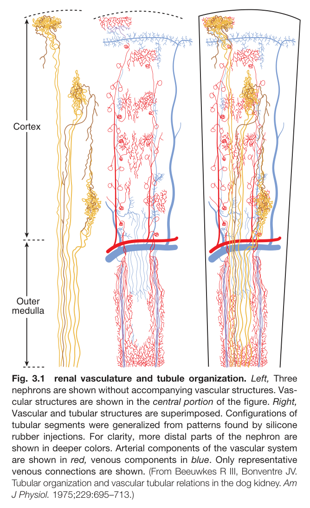

Fig. 3.1 renal vasculature and tubule organization. Left, Three nephrons are shown without accompanying vascular structures. Vas- cular structures are shown in the central portion of the figure. Right, Vascular and tubular structures are superimposed. Configurations of tubular segments were generalized from patterns found by silicone rubber injections. For clarity, more distal parts of the nephron are shown in deeper colors. Arterial components of the vascular system are shown in red, venous components in blue. Only representative venous connections are shown. (From Beeuwkes R III, Bonventre JV. Tubular organization and vascular tubular relations in the dog kidney. Am J Physiol. 1975;229:695–713.)

---

### Fig_3_2

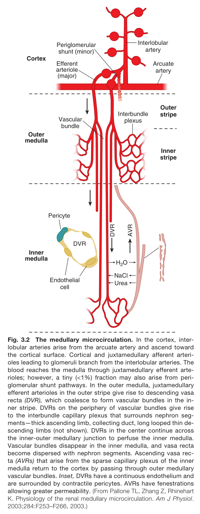

Fig. 3.2 The medullary microcirculation. In the cortex, inter- lobular arteries arise from the arcuate artery and ascend toward the cortical surface. Cortical and juxtamedullary afferent arteri- oles leading to glomeruli branch from the interlobular arteries. The blood reaches the medulla through juxtamedullary efferent arte- rioles; however, a tiny (<1%) fraction may also arise from peri- glomerular shunt pathways. In the outer medulla, juxtamedullary efferent arterioles in the outer stripe give rise to descending vasa recta (DVR), which coalesce to form vascular bundles in the in- ner stripe. DVRs on the periphery of vascular bundles give rise to the interbundle capillary plexus that surrounds nephron seg- ments—thick ascending limb, collecting duct, long looped thin de- scending limbs (not shown). DVRs in the center continue across the inner-outer medullary junction to perfuse the inner medulla. Vascular bundles disappear in the inner medulla, and vasa recta become dispersed with nephron segments. Ascending vasa rec- ta (AVRs) that arise from the sparse capillary plexus of the inner medulla return to the cortex by passing through outer medullary vascular bundles. Inset, DVRs have a continuous endothelium and are surrounded by contractile pericytes. AVRs have fenestrations allowing greater permeability. (From Pallone TL, Zhang Z, Rhinehart K. Physiology of the renal medullary microcirculation. Am J Physiol. 2003;284:F253–F266, 2003.)

---

### Fig_3_3

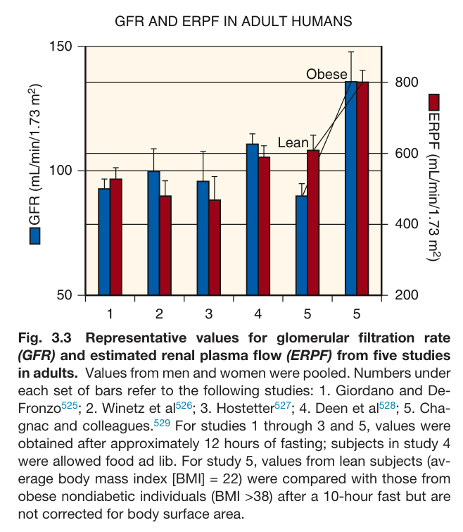

Fig. 3.3 Representative values for glomerular filtration rate (GFR) and estimated renal plasma flow (ERPF) from five studies in adults. Values from men and women were pooled. Numbers under each set of bars refer to the following studies: 1. Giordano and De- Fronzo<sup>525</sup>; 2. Winetz et al<sup>526</sup>; 3. Hostetter<sup>527</sup>; 4. Deen et al<sup>528</sup>; 5. Cha- gnac and colleagues.<sup>529</sup> For studies 1 through 3 and 5, values were obtained after approximately 12 hours of fasting; subjects in study 4 were allowed food ad lib. For study 5, values from lean subjects (av- erage body mass index [BMI] = 22) were compared with those from obese nondiabetic individuals (BMI >38) after a 10-hour fast but are not corrected for body surface area.

---

### Fig_3_4

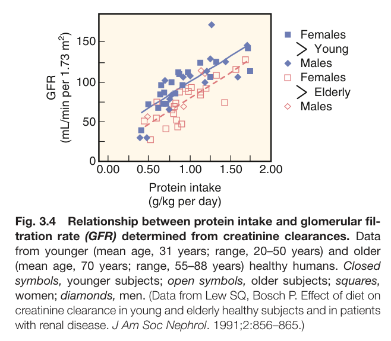

Fig. 3.4 Relationship between protein intake and glomerular fil- tration rate (GFR) determined from creatinine clearances. Data from younger (mean age, 31 years; range, 20–50 years) and older (mean age, 70 years; range, 55–88 years) healthy humans. Closed symbols, younger subjects; open symbols, older subjects; squares, women; diamonds, men. (Data from Lew SQ, Bosch P. Effect of diet on creatinine clearance in young and elderly healthy subjects and in patients with renal disease. J Am Soc Nephrol. 1991;2:856–865.)

---

### Fig_3_5

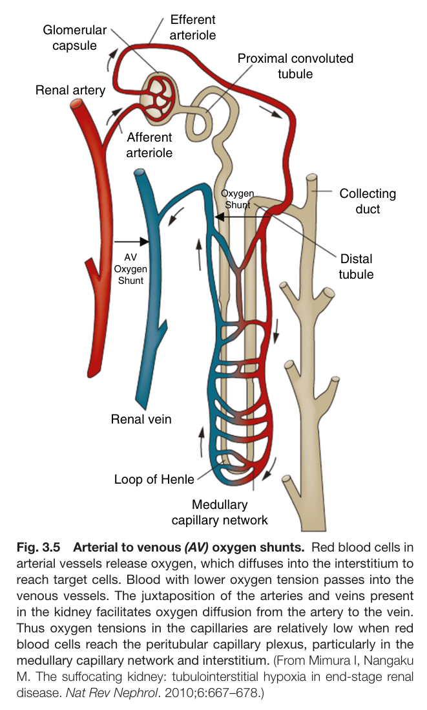

Fig. 3.5 Arterial to venous (AV) oxygen shunts. Red blood cells in arterial vessels release oxygen, which diffuses into the interstitium to reach target cells. Blood with lower oxygen tension passes into the venous vessels. The juxtaposition of the arteries and veins present in the kidney facilitates oxygen diffusion from the artery to the vein. Thus oxygen tensions in the capillaries are relatively low when red blood cells reach the peritubular capillary plexus, particularly in the medullary capillary network and interstitium. (From Mimura I, Nangaku M. The suffocating kidney: tubulointerstitial hypoxia in end-stage renal disease. Nat Rev Nephrol. 2010;6:667–678.)

---

### Fig_3_6

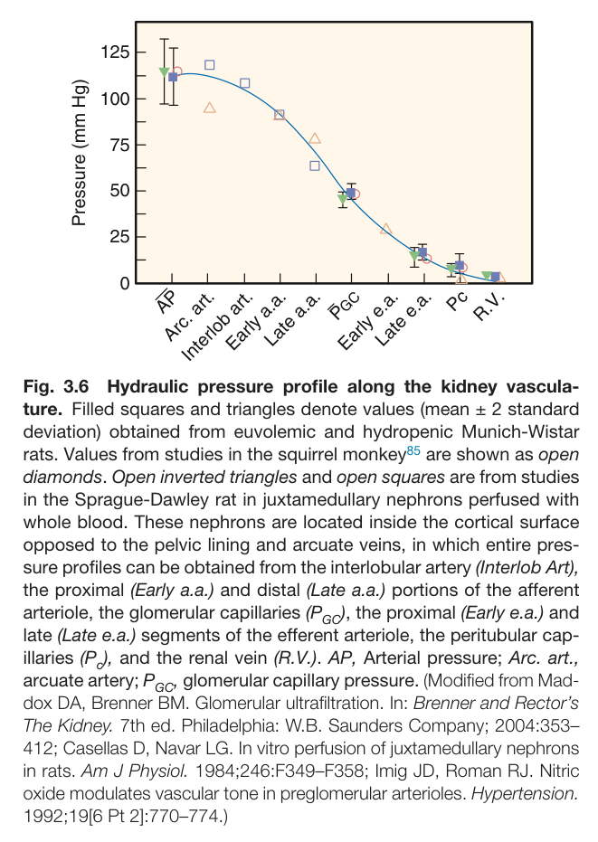

Fig. 3.6 Hydraulic pressure profile along the kidney vascula- ture. Filled squares and triangles denote values (mean ± 2 standard deviation) obtained from euvolemic and hydropenic Munich-Wistar rats. Values from studies in the squirrel monkey<sup>85</sup> are shown as open diamonds. Open inverted triangles and open squares are from studies in the Sprague-Dawley rat in juxtamedullary nephrons perfused with whole blood. These nephrons are located inside the cortical surface opposed to the pelvic lining and arcuate veins, in which entire pres- sure profiles can be obtained from the interlobular artery (Interlob Art), the proximal (Early a.a.) and distal (Late a.a.) portions of the afferent arteriole, the glomerular capillaries (P ), the proximal (Early e.a.) and late (Late e.a.) segments of the efferent arteriole, the peritubular cap- illaries (P ), and the renal vein (R.V.). AP, Arterial pressure; Arc. art., arcuate artery; P , glomerular capillary pressure. (Modified from Mad- dox DA, Brenner BM. Glomerular ultrafiltration. In: Brenner and Rector’s The Kidney. 7th ed. Philadelphia: W.B. Saunders Company; 2004:353– 412; Casellas D, Navar LG. In vitro perfusion of juxtamedullary nephrons in rats. Am J Physiol. 1984;246:F349–F358; Imig JD, Roman RJ. Nitric oxide modulates vascular tone in preglomerular arterioles. Hypertension. 1992;19[6 Pt 2]:770–774.)

---

### Fig_3_7

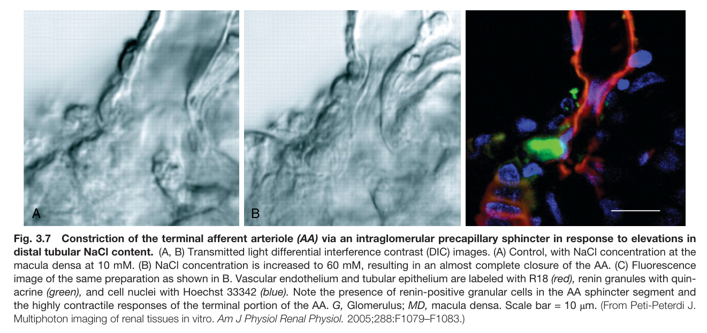

Fig. 3.7 Constriction of the terminal afferent arteriole (AA) via an intraglomerular precapillary sphincter in response to elevations in distal tubular NaCl content. (A, B) Transmitted light differential interference contrast (DIC) images. (A) Control, with NaCl concentration at the macula densa at 10 mM. (B) NaCl concentration is increased to 60 mM, resulting in an almost complete closure of the AA. (C) Fluorescence image of the same preparation as shown in B. Vascular endothelium and tubular epithelium are labeled with R18 (red), renin granules with quin- acrine (green), and cell nuclei with Hoechst 33342 (blue). Note the presence of renin-positive granular cells in the AA sphincter segment and the highly contractile responses of the terminal portion of the AA. G, Glomerulus; MD, macula densa. Scale bar = 10 μm. (From Peti-Peterdi J. Multiphoton imaging of renal tissues in vitro. Am J Physiol Renal Physiol. 2005;288:F1079–F1083.)

---

### Fig_3_8

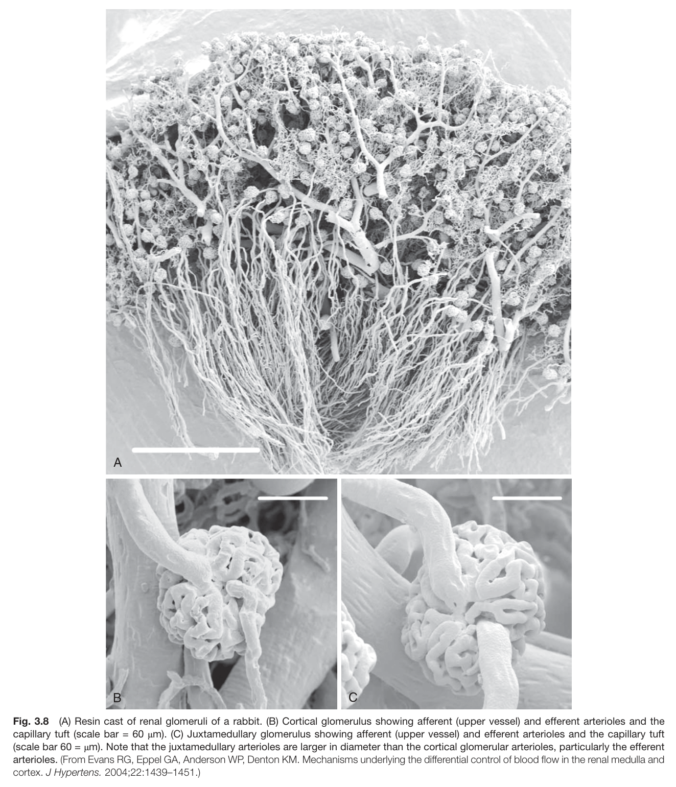

Fig. 3.8 (A) Resin cast of renal glomeruli of a rabbit. (B) Cortical glomerulus showing afferent (upper vessel) and efferent arterioles and the capillary tuft (scale bar = 60 μm). (C) Juxtamedullary glomerulus showing afferent (upper vessel) and efferent arterioles and the capillary tuft (scale bar 60 = μm). Note that the juxtamedullary arterioles are larger in diameter than the cortical glomerular arterioles, particularly the efferent arterioles. (From Evans RG, Eppel GA, Anderson WP, Denton KM. Mechanisms underlying the differential control of blood flow in the renal medulla and cortex. J Hypertens. 2004;22:1439–1451.)

---

### Fig_3_9

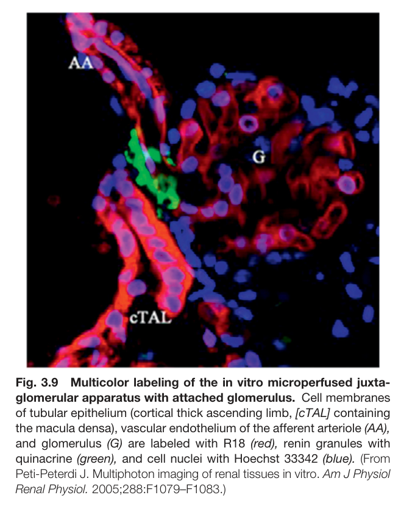

Fig. 3.9 Multicolor labeling of the in vitro microperfused juxta- glomerular apparatus with attached glomerulus. Cell membranes of tubular epithelium (cortical thick ascending limb, [cTAL] containing the macula densa), vascular endothelium of the afferent arteriole (AA), and glomerulus (G) are labeled with R18 (red), renin granules with quinacrine (green), and cell nuclei with Hoechst 33342 (blue). (From Peti-Peterdi J. Multiphoton imaging of renal tissues in vitro. Am J Physiol Renal Physiol. 2005;288:F1079–F1083.)

---

### Fig_3_10

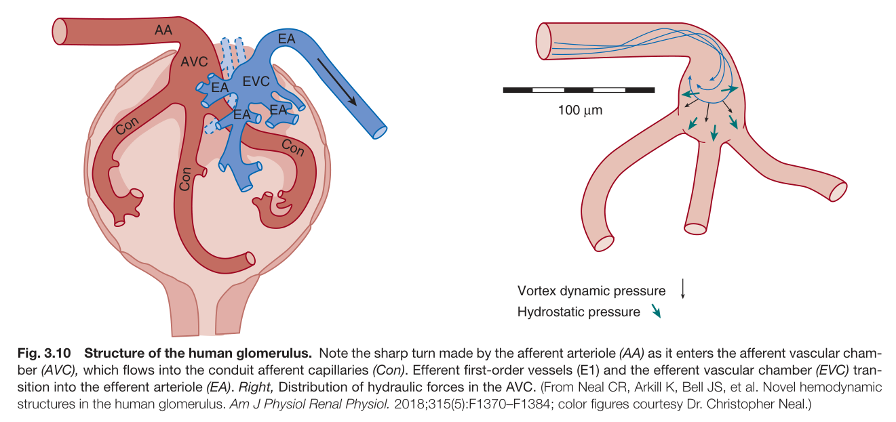

Fig. 3.10 Structure of the human glomerulus. Note the sharp turn made by the afferent arteriole (AA) as it enters the afferent vascular cham- ber (AVC), which flows into the conduit afferent capillaries (Con). Efferent first-order vessels (E1) and the efferent vascular chamber (EVC) tran- sition into the efferent arteriole (EA). Right, Distribution of hydraulic forces in the AVC. (From Neal CR, Arkill K, Bell JS, et al. Novel hemodynamic structures in the human glomerulus. Am J Physiol Renal Physiol. 2018;315(5):F1370–F1384; color figures courtesy Dr. Christopher Neal.)

---

### Fig_3_11

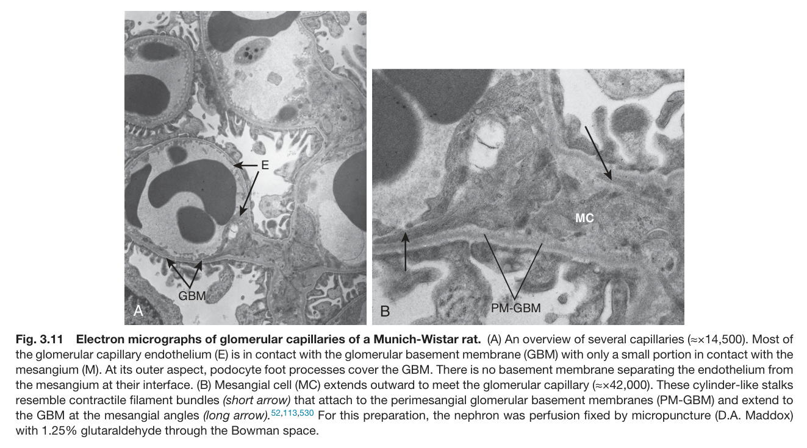

Fig. 3.11 Electron micrographs of glomerular capillaries of a Munich-Wistar rat. (A) An overview of several capillaries (≈×14,500). Most of the glomerular capillary endothelium (E) is in contact with the glomerular basement membrane (GBM) with only a small portion in contact with the mesangium (M). At its outer aspect, podocyte foot processes cover the GBM. There is no basement membrane separating the endothelium from the mesangium at their interface. (B) Mesangial cell (MC) extends outward to meet the glomerular capillary (≈×42,000). These cylinder-like stalks resemble contractile filament bundles (short arrow) that attach to the perimesangial glomerular basement membranes (PM-GBM) and extend to the GBM at the mesangial angles (long arrow).<sup>52,113,530</sup> For this preparation, the nephron was perfusion fixed by micropuncture (D.A. Maddox) with 1.25% glutaraldehyde through the Bowman space.

---

### Fig_3_12

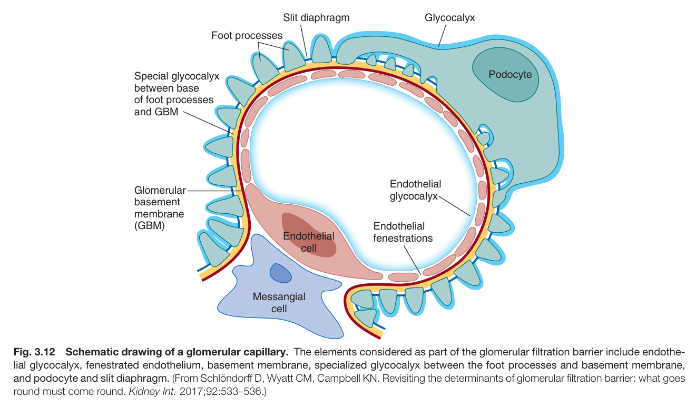

Fig. 3.12 Schematic drawing of a glomerular capillary. The elements considered as part of the glomerular filtration barrier include endothe- lial glycocalyx, fenestrated endothelium, basement membrane, specialized glycocalyx between the foot processes and basement membrane, and podocyte and slit diaphragm. (From Schlöndorff D, Wyatt CM, Campbell KN. Revisiting the determinants of glomerular filtration barrier: what goes round must come round. Kidney Int. 2017;92:533–536.)

---

### Fig_3_13

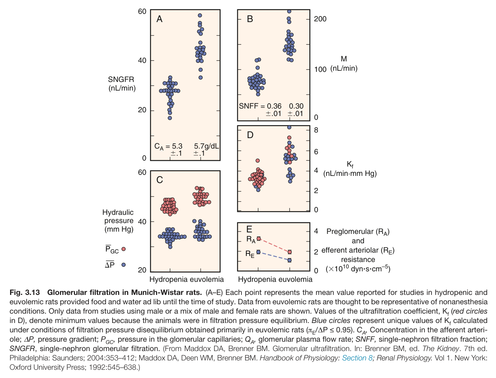

Fig. 3.13 Glomerular filtration in Munich-Wistar rats. (A–E) Each point represents the mean value reported for studies in hydropenic and euvolemic rats provided food and water ad lib until the time of study. Data from euvolemic rats are thought to be representative of nonanesthesia conditions. Only data from studies using male or a mix of male and female rats are shown. Values of the ultrafiltration coefficient, K (red circles in D), denote minimum values because the animals were in filtration pressure equilibrium. Blue circles represent unique values of K calculated under conditions of filtration pressure disequilibrium obtained primarily in euvolemic rats (π /ΔP ≤ 0.95). C , Concentration in the afferent arteri- ole; ΔP, pressure gradient; P , pressure in the glomerular capillaries; Q , glomerular plasma flow rate; SNFF, single-nephron filtration fraction; SNGFR, single-nephron glomerular filtration. (From Maddox DA, Brenner BM. Glomerular ultrafiltration. In: Brenner BM, ed. The Kidney. 7th ed. Philadelphia: Saunders; 2004:353–412; Maddox DA, Deen WM, Brenner BM. Handbook of Physiology: Section 8; Renal Physiology. Vol 1. New York: Oxford University Press; 1992:545–638.)

---

### Fig_3_14

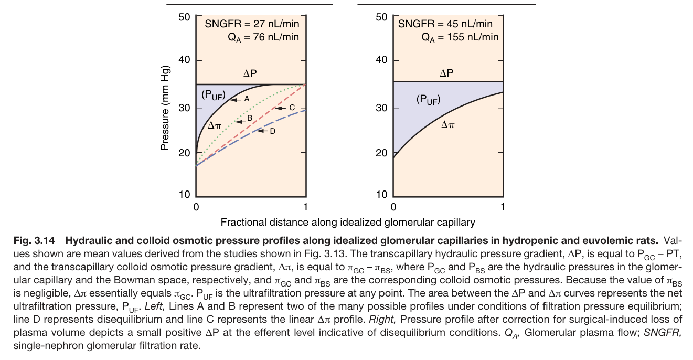

Fig. 3.14 Hydraulic and colloid osmotic pressure profiles along idealized glomerular capillaries in hydropenic and euvolemic rats. Val- ues shown are mean values derived from the studies shown in Fig. 3.13. The transcapillary hydraulic pressure gradient, ΔP, is equal to P − PT, and the transcapillary colloid osmotic pressure gradient, Δπ, is equal to π<sub>GC</sub> – π<sub>BS</sub>, where P<sub>GC</sub> and P<sub>BS</sub> are the hydraulic pressures in the glomer- ular capillary and the Bowman space, respectively, and π<sub>GC</sub> and π<sub>BS</sub> are the corresponding colloid osmotic pressures. Because the value of π<sub>BS</sub> is negligible, Δπ essentially equals π . P is the ultrafiltration pressure at any point. The area between the ΔP and Δπ curves represents the net ultrafiltration pressure, P . Left, Lines A and B represent two of the many possible profiles under conditions of filtration pressure equilibrium; line D represents disequilibrium and line C represents the linear Δπ profile. Right, Pressure profile after correction for surgical-induced loss of plasma volume depicts a small positive ΔP at the efferent level indicative of disequilibrium conditions. Q , Glomerular plasma flow; SNGFR, single-nephron glomerular filtration rate.

---

### Fig_3_15

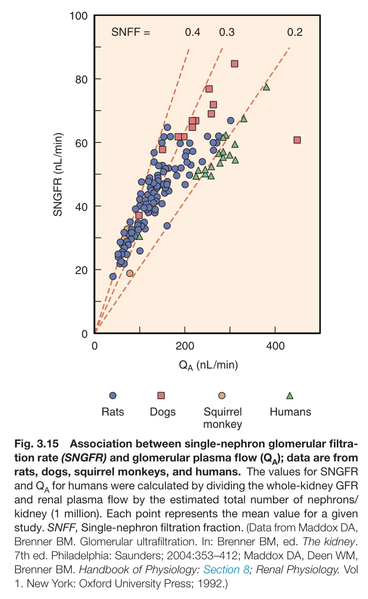

Fig. 3.15 Association between single-nephron glomerular filtra- tion rate (SNGFR) and glomerular plasma flow (Q ); data are from rats, dogs, squirrel monkeys, and humans. The values for SNGFR and Q for humans were calculated by dividing the whole-kidney GFR and renal plasma flow by the estimated total number of nephrons/ kidney (1 million). Each point represents the mean value for a given study. SNFF, Single-nephron filtration fraction. (Data from Maddox DA, Brenner BM. Glomerular ultrafiltration. In: Brenner BM, ed. The kidney. 7th ed. Philadelphia: Saunders; 2004:353–412; Maddox DA, Deen WM, Brenner BM. Handbook of Physiology: Section 8; Renal Physiology. Vol 1. New York: Oxford University Press; 1992.)

---

### Fig_3_16

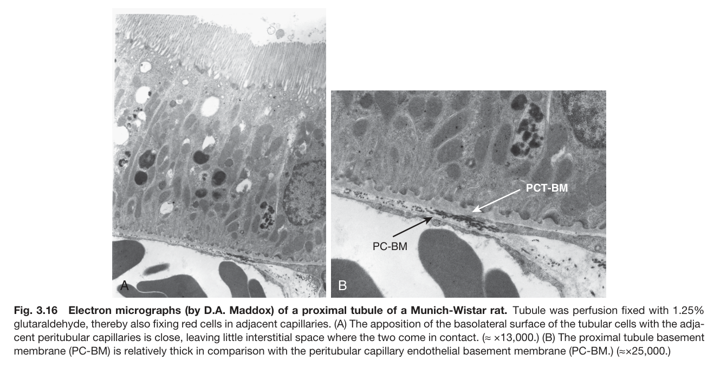

Fig. 3.16 Electron micrographs (by D.A. Maddox) of a proximal tubule of a Munich-Wistar rat. Tubule was perfusion fixed with 1.25% glutaraldehyde, thereby also fixing red cells in adjacent capillaries. (A) The apposition of the basolateral surface of the tubular cells with the adja- cent peritubular capillaries is close, leaving little interstitial space where the two come in contact. (≈ ×13,000.) (B) The proximal tubule basement membrane (PC-BM) is relatively thick in comparison with the peritubular capillary endothelial basement membrane (PC-BM.) (≈×25,000.)

---

### Fig_3_17

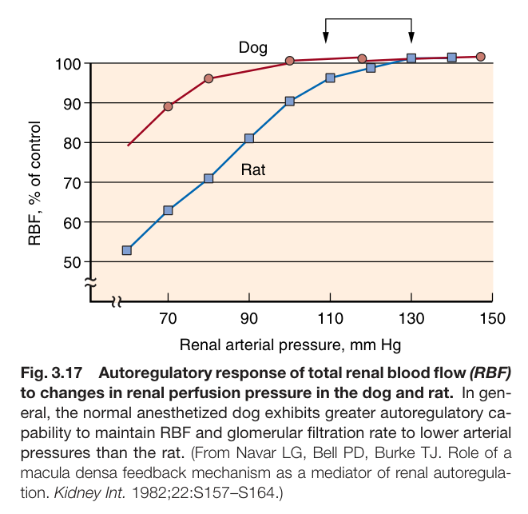

Fig. 3.17 Autoregulatory response of total renal blood flow (RBF) to changes in renal perfusion pressure in the dog and rat. In gen- eral, the normal anesthetized dog exhibits greater autoregulatory ca- pability to maintain RBF and glomerular filtration rate to lower arterial pressures than the rat. (From Navar LG, Bell PD, Burke TJ. Role of a macula densa feedback mechanism as a mediator of renal autoregula- tion. Kidney Int. 1982;22:S157–S164.)

---

### Fig_3_18

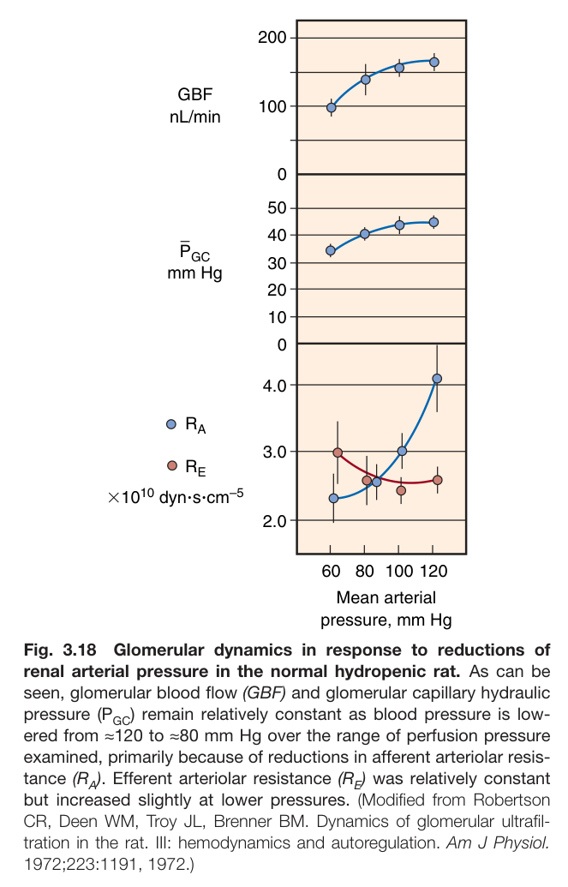

Fig. 3.18 Glomerular dynamics in response to reductions of renal arterial pressure in the normal hydropenic rat. As can be seen, glomerular blood flow (GBF) and glomerular capillary hydraulic pressure (P ) remain relatively constant as blood pressure is low- ered from ≈120 to ≈80 mm Hg over the range of perfusion pressure examined, primarily because of reductions in afferent arteriolar resis- tance (R ). Efferent arteriolar resistance (R ) was relatively constant but increased slightly at lower pressures. (Modified from Robertson CR, Deen WM, Troy JL, Brenner BM. Dynamics of glomerular ultrafil- tration in the rat. III: hemodynamics and autoregulation. Am J Physiol. 1972;223:1191, 1972.)

---

### Fig_3_19

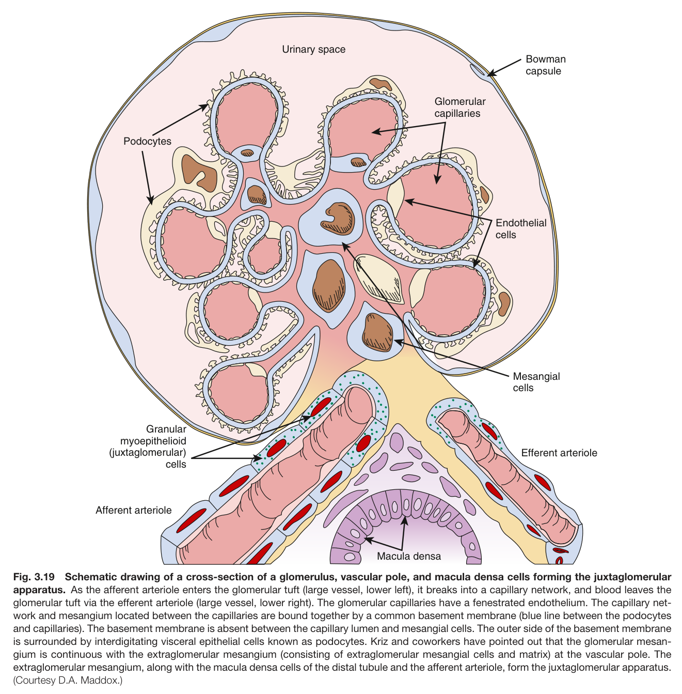

Fig. 3.19 Schematic drawing of a cross-section of a glomerulus, vascular pole, and macula densa cells forming the juxtaglomerula apparatus. As the afferent arteriole enters the glomerular tuft (large vessel, lower left), it breaks into a capillary network, and blood leaves the glomerular tuft via the efferent arteriole (large vessel, lower right). The glomerular capillaries have a fenestrated endothelium. The capillary net- work and mesangium located between the capillaries are bound together by a common basement membrane (blue line between the podocytes and capillaries). The basement membrane is absent between the capillary lumen and mesangial cells. The outer side of the basement membrane is surrounded by interdigitating visceral epithelial cells known as podocytes. Kriz and coworkers have pointed out that the glomerular mesan- gium is continuous with the extraglomerular mesangium (consisting of extraglomerular mesangial cells and matrix) at the vascular pole. The extraglomerular mesangium, along with the macula densa cells of the distal tubule and the afferent arteriole, form the juxtaglomerular apparatus. (Courtesy D.A. Maddox.)

---

### Fig_3_20

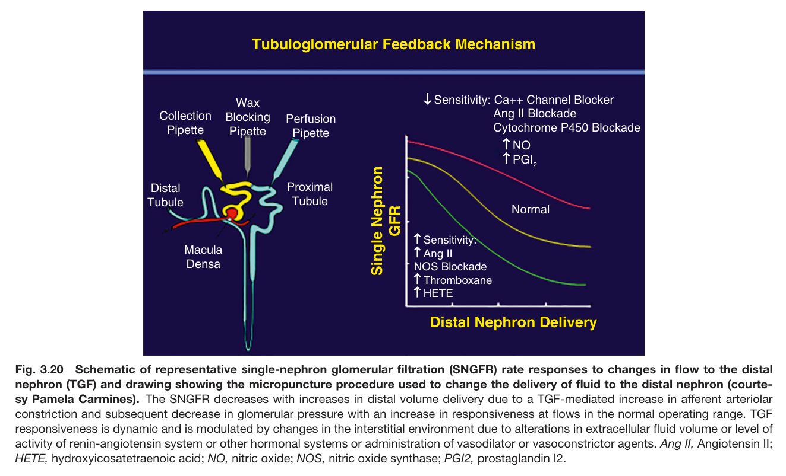

Fig. 3.20 Schematic of representative single-nephron glomerular filtration (SNGFR) rate responses to changes in flow to the dista nephron (TGF) and drawing showing the micropuncture procedure used to change the delivery of fluid to the distal nephron (courte- sy Pamela Carmines). The SNGFR decreases with increases in distal volume delivery due to a TGF-mediated increase in afferent arteriolar constriction and subsequent decrease in glomerular pressure with an increase in responsiveness at flows in the normal operating range. TGF responsiveness is dynamic and is modulated by changes in the interstitial environment due to alterations in extracellular fluid volume or level of activity of renin-angiotensin system or other hormonal systems or administration of vasodilator or vasoconstrictor agents. Ang II, Angiotensin II; HETE, hydroxyicosatetraenoic acid; NO, nitric oxide; NOS, nitric oxide synthase; PGI2, prostaglandin I2.

---

### Fig_3_21

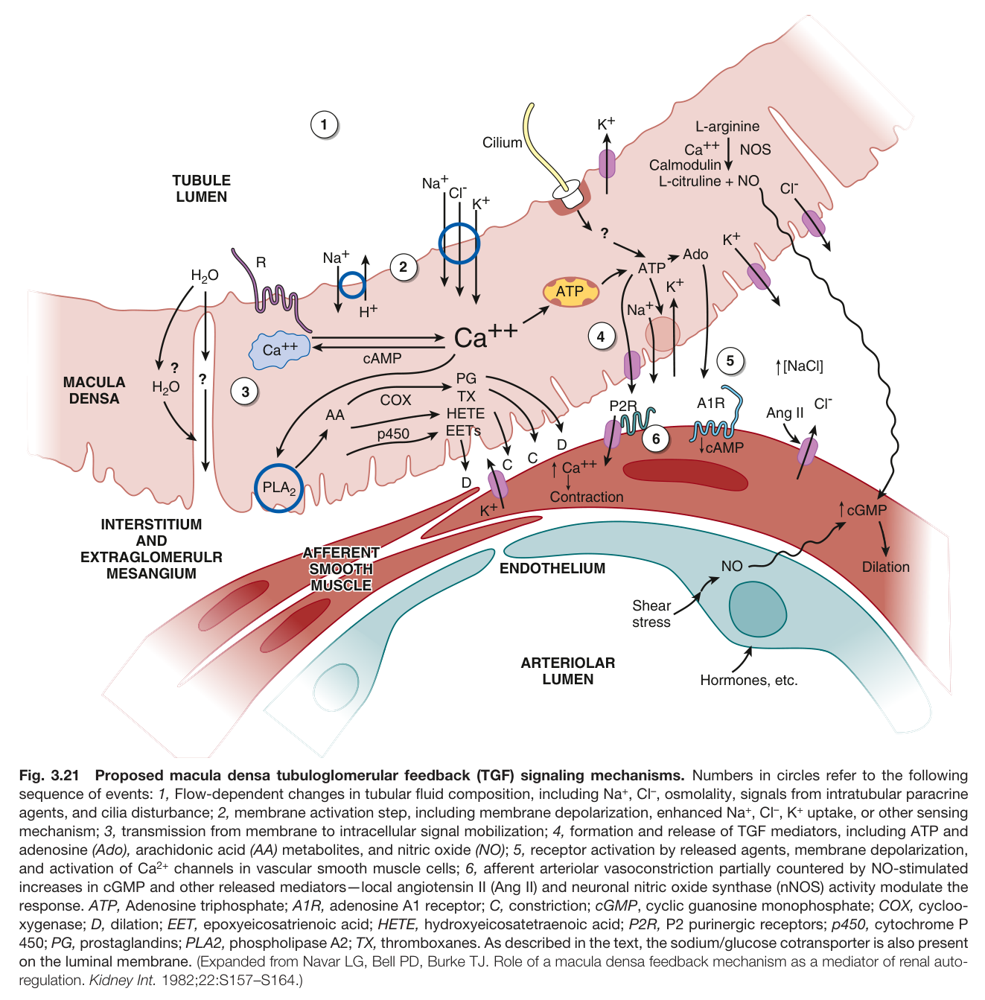

Fig. 3.21 Proposed macula densa tubuloglomerular feedback (TGF) signaling mechanisms. Numbers in circles refer to the following sequence of events: 1, Flow-dependent changes in tubular fluid composition, including Na<sup>+</sup>, Cl<sup>–</sup>, osmolality, signals from intratubular paracrine agents, and cilia disturbance; 2, membrane activation step, including membrane depolarization, enhanced Na<sup>+</sup>, Cl<sup>–</sup>, K<sup>+</sup> uptake, or other sensing mechanism; 3, transmission from membrane to intracellular signal mobilization; 4, formation and release of TGF mediators, including ATP and adenosine (Ado), arachidonic acid (AA) metabolites, and nitric oxide (NO); 5, receptor activation by released agents, membrane depolarization, and activation of Ca<sup>2+</sup> channels in vascular smooth muscle cells; 6, afferent arteriolar vasoconstriction partially countered by NO-stimulated increases in cGMP and other released mediators—local angiotensin II (Ang II) and neuronal nitric oxide synthase (nNOS) activity modulate the response. ATP, Adenosine triphosphate; A1R, adenosine A1 receptor; C, constriction; cGMP, cyclic guanosine monophosphate; COX, cycloo- xygenase; D, dilation; EET, epoxyeicosatrienoic acid; HETE, hydroxyeicosatetraenoic acid; P2R, P2 purinergic receptors; p450, cytochrome P 450; PG, prostaglandins; PLA2, phospholipase A2; TX, thromboxanes. As described in the text, the sodium/glucose cotransporter is also present on the luminal membrane. (Expanded from Navar LG, Bell PD, Burke TJ. Role of a macula densa feedback mechanism as a mediator of renal auto regulation. Kidney Int. 1982;22:S157–S164.)

---

### Fig_3_22

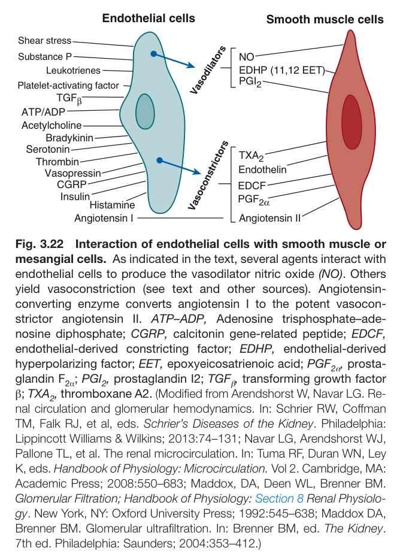

Fig. 3.22 Interaction of endothelial cells with smooth muscle or mesangial cells. As indicated in the text, several agents interact with endothelial cells to produce the vasodilator nitric oxide (NO). Others yield vasoconstriction (see text and other sources). Angiotensin- converting enzyme converts angiotensin I to the potent vasocon- strictor angiotensin II. ATP–ADP, Adenosine trisphosphate–ade- nosine diphosphate; CGRP, calcitonin gene-related peptide; EDCF, endothelial-derived constricting factor; EDHP, endothelial-derived hyperpolarizing factor; EET, epoxyeicosatrienoic acid; PGF , prosta- glandin F ; PGI , prostaglandin I2; TGF , transforming growth factor β; TXA , thromboxane A2. (Modified from Arendshorst W, Navar LG. Re- nal circulation and glomerular hemodynamics. In: Schrier RW, Coffman TM, Falk RJ, et al, eds. Schrier’s Diseases of the Kidney. Philadelphia: Lippincott Williams & Wilkins; 2013:74–131; Navar LG, Arendshorst WJ, Pallone TL, et al. The renal microcirculation. In: Tuma RF, Duran WN, Ley K, eds. Handbook of Physiology: Microcirculation. Vol 2. Cambridge, MA: Academic Press; 2008:550–683; Maddox, DA, Deen WL, Brenner BM. Glomerular Filtration; Handbook of Physiology: Section 8 Renal Physiolo- gy. New York, NY: Oxford University Press; 1992:545–638; Maddox DA, Brenner BM. Glomerular ultrafiltration. In: Brenner BM, ed. The Kidney. 7th ed. Philadelphia: Saunders; 2004:353–412.)

---

### Fig_3_23

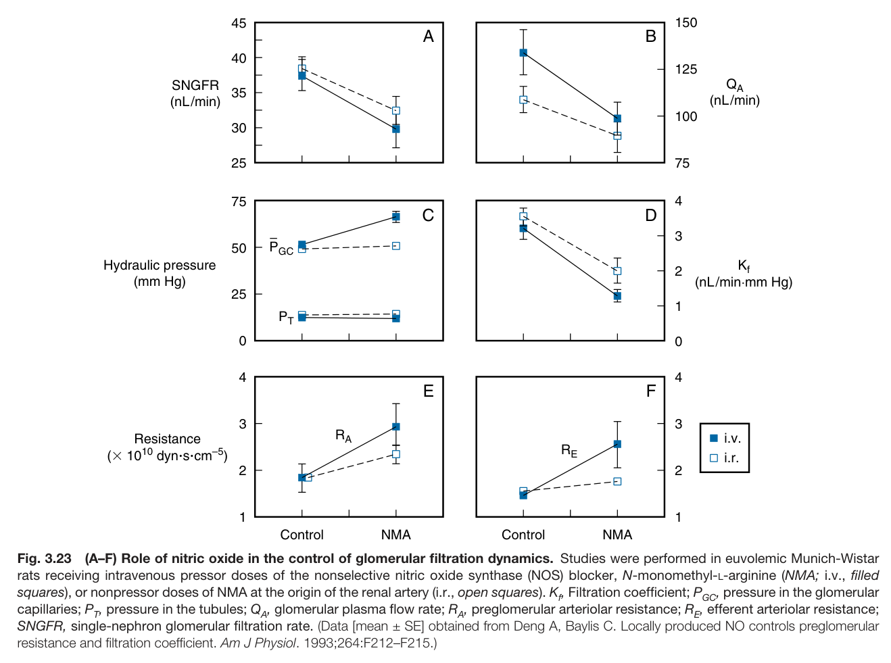

Fig. 3.23 (A–F) Role of nitric oxide in the control of glomerular filtration dynamics. Studies were performed in euvolemic Munich-Wistar rats receiving intravenous pressor doses of the nonselective nitric oxide synthase (NOS) blocker, N-monomethyl-l-arginine (NMA; i.v., filled squares), or nonpressor doses of NMA at the origin of the renal artery (i.r., open squares). K , Filtration coefficient; P , pressure in the glomerular capillaries; P , pressure in the tubules; Q , glomerular plasma flow rate; R , preglomerular arteriolar resistance; R , efferent arteriolar resistance; SNGFR, single-nephron glomerular filtration rate. (Data [mean ± SE] obtained from Deng A, Baylis C. Locally produced NO controls preglomerular resistance and filtration coefficient. Am J Physiol. 1993;264:F212–F215.)

---

### Fig_3_24

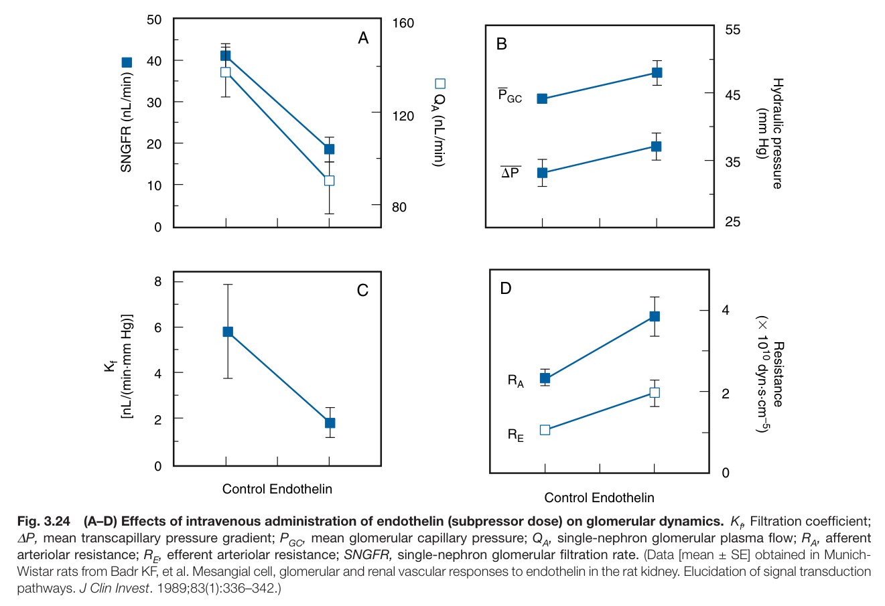

Fig. 3.24 (A–D) Effects of intravenous administration of endothelin (subpressor dose) on glomerular dynamics. K , Filtration coefficient; ΔP, mean transcapillary pressure gradient; P<sub>GC</sub>, mean glomerular capillary pressure; Q<sub>A</sub>, single-nephron glomerular plasma flow; R<sub>A</sub>, afferent arteriolar resistance; R , efferent arteriolar resistance; SNGFR, single-nephron glomerular filtration rate. (Data [mean ± SE] obtained in Munich- Wistar rats from Badr KF, et al. Mesangial cell, glomerular and renal vascular responses to endothelin in the rat kidney. Elucidation of signal transduction pathways. J Clin Invest. 1989;83(1):336–342.)

---

### Fig_3_25

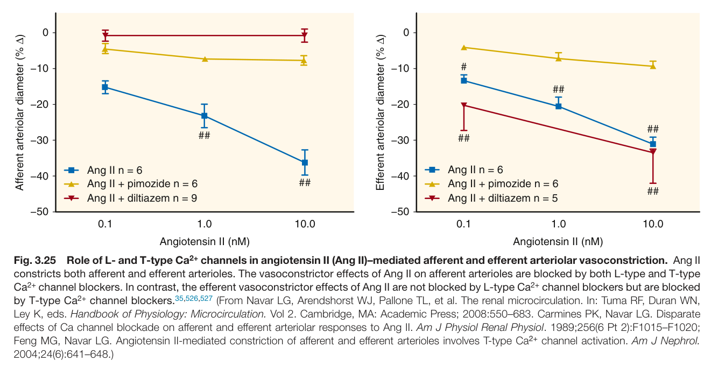

Fig. 3.25 Role of L- and T-type Ca<sup>2+</sup> channels in angiotensin II (Ang II)–mediated afferent and efferent arteriolar vasoconstriction. Ang II constricts both afferent and efferent arterioles. The vasoconstrictor effects of Ang II on afferent arterioles are blocked by both L-type and T-type Ca<sup>2+</sup> channel blockers. In contrast, the efferent vasoconstrictor effects of Ang II are not blocked by L-type Ca<sup>2+</sup> channel blockers but are blocked by T-type Ca<sup>2+</sup> channel blockers.<sup>35,526,527</sup> (From Navar LG, Arendshorst WJ, Pallone TL, et al. The renal microcirculation. In: Tuma RF, Duran WN, Ley K, eds. Handbook of Physiology: Microcirculation. Vol 2. Cambridge, MA: Academic Press; 2008:550–683. Carmines PK, Navar LG. Disparate effects of Ca channel blockade on afferent and efferent arteriolar responses to Ang II. Am J Physiol Renal Physiol. 1989;256(6 Pt 2):F1015–F1020; Feng MG, Navar LG. Angiotensin II-mediated constriction of afferent and efferent arterioles involves T-type Ca<sup>2+</sup> channel activation. Am J Nephrol. 2004;24(6):641–648.)

---

### Fig_3_26

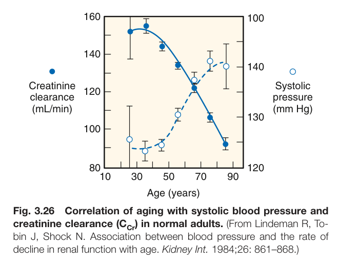

Fig. 3.26 Correlation of aging with systolic blood pressure and creatinine clearance (C<sub>Cr</sub>) in normal adults. (From Lindeman R, To- bin J, Shock N. Association between blood pressure and the rate of decline in renal function with age. Kidney Int. 1984;26: 861–868.)

---

## Tables

### Table_3_1

#### Table Image

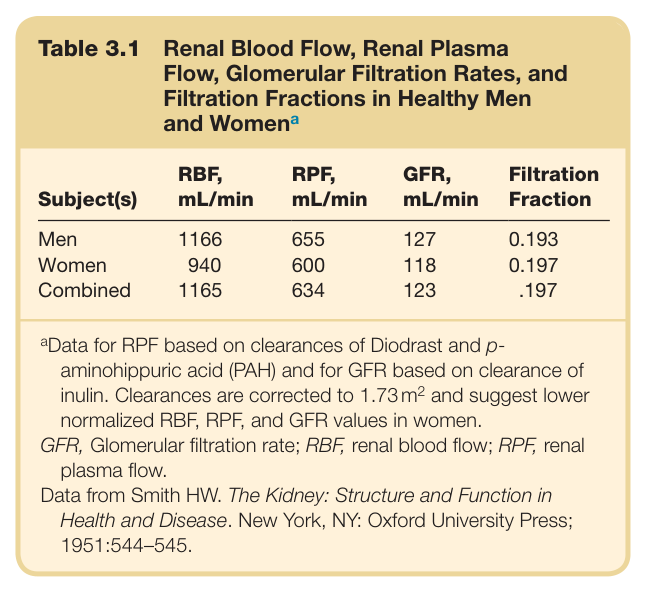

#### Table Data (CSV: [Table_3_1.csv](Table_3_1.csv))

```markdown
| Table Text (OCR) |
| :--- |
| Table 3.1  Renal Blood Flow, Renal Plasma Flow, Glomerular Filtration Rates, and Filtration Fractions in Healthy Men and Women<sup>a</sup> Subject(s)  RBF, mL/min  RPF, mL/min  GFR, mL/min  Filtration Fraction    Men  1166  655  127  0.193    Women  940  600  118  0.197    Combined  1165  634  123  .197 |
```

Table 3.1 Renal Blood Flow, Renal Plasma Flow, Glomerular Filtration Rates, and Filtration Fractions in Healthy Men and Women<sup>a</sup>

---
