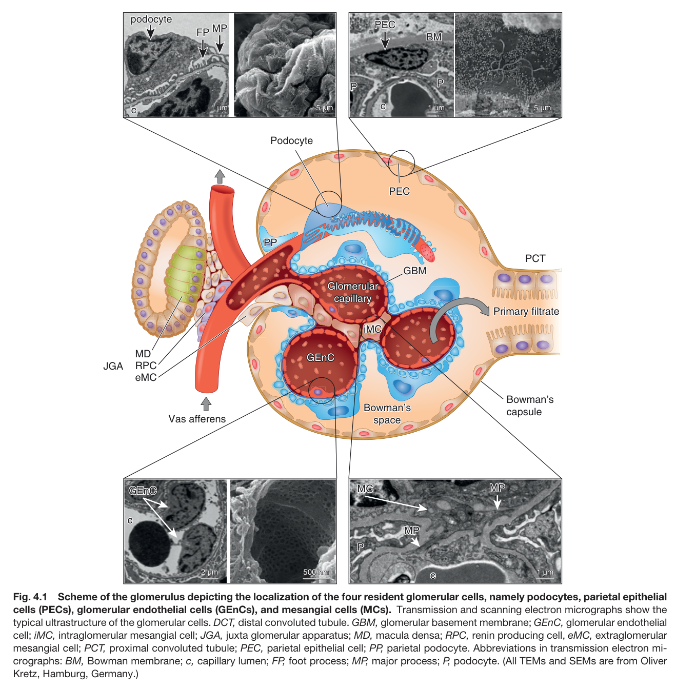
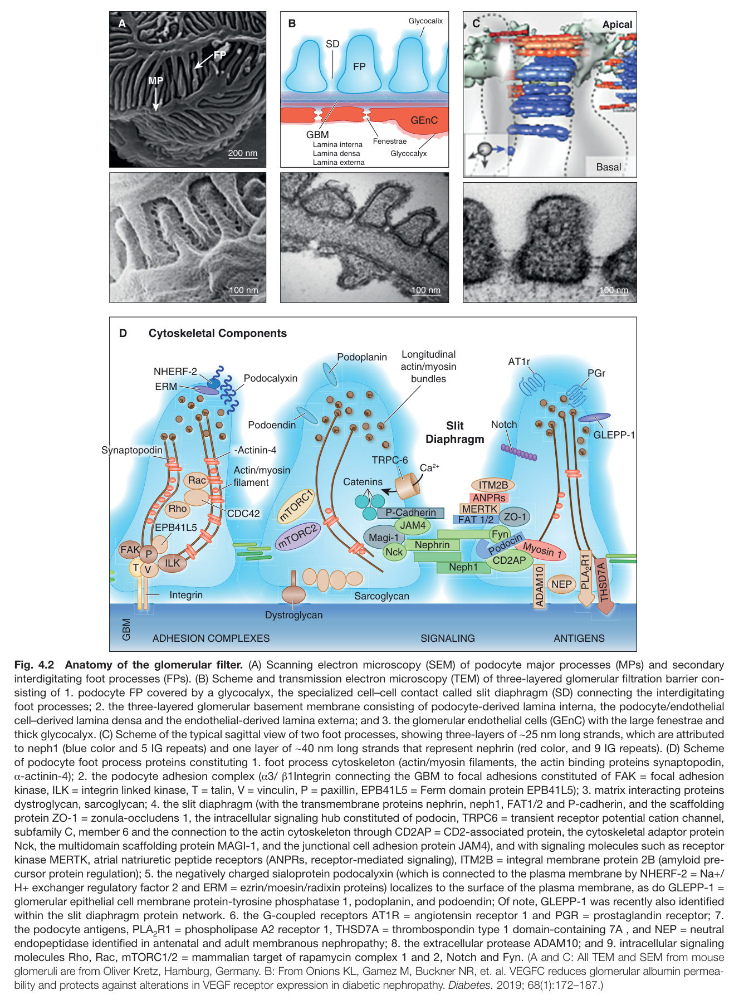
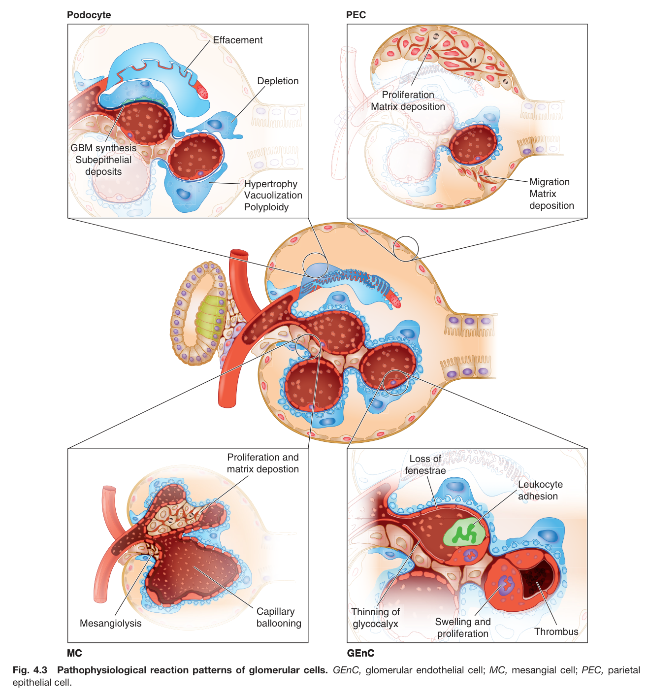
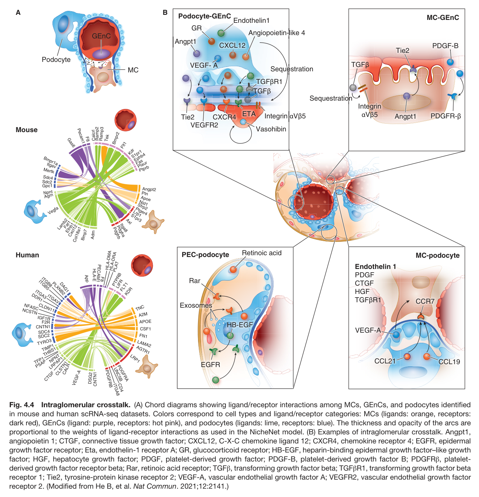
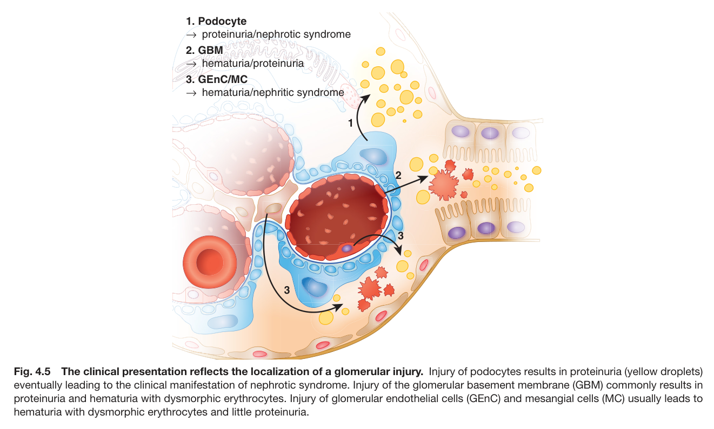

# 04. Glomerular Cell Biology and Podocytopathies - Figures and Tables Index

This document lists all figures and tables extracted from `04. Glomerular Cell Biology and Podocytopathies.pdf`.

## Table of Contents
- [Figures](#figures)
- [Tables](#tables)

---

## Figures

### Fig_4_1

Fig. 4.1 Scheme of the glomerulus depicting the localization of the four resident glomerular cells, namely podocytes, parietal epithelial cells (PECs), glomerular endothelial cells (GEnCs), and mesangial cells (MCs). Transmission and scanning electron micrographs show the typical ultrastructure of the glomerular cells. DCT, distal convoluted tubule. GBM, glomerular basement membrane; GEnC, glomerular endothelia cell; iMC, intraglomerular mesangial cell; JGA, juxta glomerular apparatus; MD, macula densa; RPC, renin producing cell, eMC, extraglomerular mesangial cell; PCT, proximal convoluted tubule; PEC, parietal epithelial cell; PP, parietal podocyte. Abbreviations in transmission electron mi- crographs: BM, Bowman membrane; c, capillary lumen; FP, foot process; MP, major process; P, podocyte. (All TEMs and SEMs are from Oliver Kretz, Hamburg, Germany.)

---

### Fig_4_2

Fig. 4.2 Anatomy of the glomerular filter. (A) Scanning electron microscopy (SEM) of podocyte major processes (MPs) and secondary interdigitating foot processes (FPs). (B) Scheme and transmission electron microscopy (TEM) of three-layered glomerular filtration barrier con- sisting of 1. podocyte FP covered by a glycocalyx, the specialized cell–cell contact called slit diaphragm (SD) connecting the interdigitating foot processes; 2. the three-layered glomerular basement membrane consisting of podocyte-derived lamina interna, the podocyte/endothelia cell–derived lamina densa and the endothelial-derived lamina externa; and 3. the glomerular endothelial cells (GEnC) with the large fenestrae and thick glycocalyx. (C) Scheme of the typical sagittal view of two foot processes, showing three-layers of ∼25 nm long strands, which are attributed to neph1 (blue color and 5 IG repeats) and one layer of ∼40 nm long strands that represent nephrin (red color, and 9 IG repeats). (D) Scheme of podocyte foot process proteins constituting 1. foot process cytoskeleton (actin/myosin filaments, the actin binding proteins synaptopodin, α-actinin-4); 2. the podocyte adhesion complex (α3/ β1Integrin connecting the GBM to focal adhesions constituted of FAK = focal adhesion kinase, ILK = integrin linked kinase, T = talin, V = vinculin, P = paxillin, EPB41L5 = Ferm domain protein EPB41L5); 3. matrix interacting proteins dystroglycan, sarcoglycan; 4. the slit diaphragm (with the transmembrane proteins nephrin, neph1, FAT1/2 and P-cadherin, and the scaffolding protein ZO-1 = zonula-occludens 1, the intracellular signaling hub constituted of podocin, TRPC6 = transient receptor potential cation channel, subfamily C, member 6 and the connection to the actin cytoskeleton through CD2AP = CD2-associated protein, the cytoskeletal adaptor protein Nck, the multidomain scaffolding protein MAGI-1, and the junctional cell adhesion protein JAM4), and with signaling molecules such as receptor kinase MERTK, atrial natriuretic peptide receptors (ANPRs, receptor-mediated signaling), ITM2B = integral membrane protein 2B (amyloid pre cursor protein regulation); 5. the negatively charged sialoprotein podocalyxin (which is connected to the plasma membrane by NHERF-2 = Na+/ H+ exchanger regulatory factor 2 and ERM = ezrin/moesin/radixin proteins) localizes to the surface of the plasma membrane, as do GLEPP-1 = glomerular epithelial cell membrane protein-tyrosine phosphatase 1, podoplanin, and podoendin; Of note, GLEPP-1 was recently also identified within the slit diaphragm protein network. 6. the G-coupled receptors AT1R = angiotensin receptor 1 and PGR = prostaglandin receptor; 7. the podocyte antigens, PLA R1 = phospholipase A2 receptor 1, THSD7A = thrombospondin type 1 domain-containing 7A , and NEP = neutra endopeptidase identified in antenatal and adult membranous nephropathy; 8. the extracellular protease ADAM10; and 9. intracellular signaling molecules Rho, Rac, mTORC1/2 = mammalian target of rapamycin complex 1 and 2, Notch and Fyn. (A and C: All TEM and SEM from mouse glomeruli are from Oliver Kretz, Hamburg, Germany. B: From Onions KL, Gamez M, Buckner NR, et. al. VEGFC reduces glomerular albumin permea bility and protects against alterations in VEGF receptor expression in diabetic nephropathy. Diabetes. 2019; 68(1):172–187.)

---

### Fig_4_3

Fig. 4.3 Pathophysiological reaction patterns of glomerular cells. GEnC, glomerular endothelial cell; MC, mesangial cell; PEC, parieta epithelial cell.

---

### Fig_4_4

Fig. 4.4 Intraglomerular crosstalk. (A) Chord diagrams showing ligand/receptor interactions among MCs, GEnCs, and podocytes identified in mouse and human scRNA-seq datasets. Colors correspond to cell types and ligand/receptor categories: MCs (ligands: orange, receptors: dark red), GEnCs (ligand: purple, receptors: hot pink), and podocytes (ligands: lime, receptors: blue). The thickness and opacity of the arcs are proportional to the weights of ligand-receptor interactions as used in the NicheNet model. (B) Examples of intraglomerular crosstalk. Angpt1, angiopoietin 1; CTGF, connective tissue growth factor; CXCL12, C-X-C chemokine ligand 12; CXCR4, chemokine receptor 4; EGFR, epiderma growth factor receptor; Eta, endothelin-1 receptor A; GR, glucocorticoid receptor; HB-EGF, heparin-binding epidermal growth factor–like growth factor; HGF, hepatocyte growth factor; PDGF, platelet-derived growth factor; PDGF-B, platelet-derived growth factor B; PDGFRβ, platelet derived growth factor receptor beta; Rar, retinoic acid receptor; TGFβ, transforming growth factor beta; TGFβR1, transforming growth factor beta receptor 1; Tie2, tyrosine-protein kinase receptor 2; VEGF-A, vascular endothelial growth factor A; VEGFR2, vascular endothelial growth factor receptor 2. (Modified from He B, et al. Nat Commun. 2021;12:2141.)

---

### Fig_4_5

Fig. 4.5 The clinical presentation reflects the localization of a glomerular injury. Injury of podocytes results in proteinuria (yellow droplets) eventually leading to the clinical manifestation of nephrotic syndrome. Injury of the glomerular basement membrane (GBM) commonly results in proteinuria and hematuria with dysmorphic erythrocytes. Injury of glomerular endothelial cells (GEnC) and mesangial cells (MC) usually leads to hematuria with dysmorphic erythrocytes and little proteinuria.

---

## Tables

*No tables resolved for this chapter.*
