# 05. Kidney Metabolism - Figures and Tables Index

This document lists all figures and tables extracted from `05. Kidney Metabolism.pdf`.

## Table of Contents
- [Figures](#figures)
- [Tables](#tables)

---

## Figures

### Fig_5_1

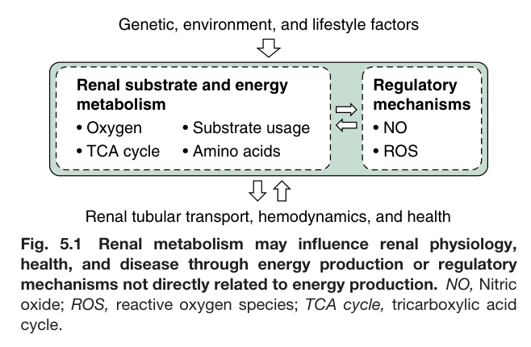

Fig. 5.1 Renal metabolism may influence renal physiology, health, and disease through energy production or regulatory mechanisms not directly related to energy production. NO, Nitric oxide; ROS, reactive oxygen species; TCA cycle, tricarboxylic acid cycle.

---

### Fig_5_2

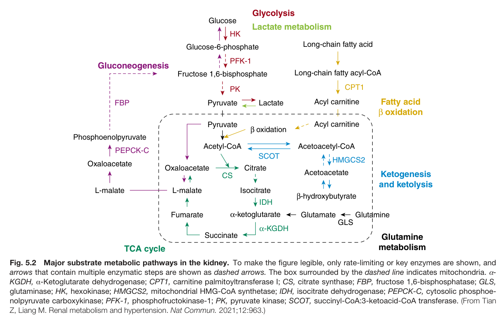

Fig. 5.2 Major substrate metabolic pathways in the kidney. To make the figure legible, only rate-limiting or key enzymes are shown, and arrows that contain multiple enzymatic steps are shown as dashed arrows. The box surrounded by the dashed line indicates mitochondria. α- KGDH, α-Ketoglutarate dehydrogenase; CPT1, carnitine palmitoyltransferase I; CS, citrate synthase; FBP, fructose 1,6-bisphosphatase; GLS, glutaminase; HK, hexokinase; HMGCS2, mitochondrial HMG-CoA synthetase; IDH, isocitrate dehydrogenase; PEPCK-C, cytosolic phosphoe- nolpyruvate carboxykinase; PFK-1, phosphofructokinase-1; PK, pyruvate kinase; SCOT, succinyl-CoA:3-ketoacid-CoA transferase. (From Tian Z, Liang M. Renal metabolism and hypertension. Nat Commun. 2021;12:963.)

---

### Fig_5_3

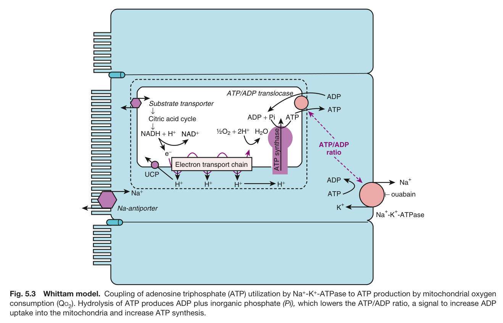

Fig. 5.3 Whittam model. Coupling of adenosine triphosphate (ATP) utilization by Na<sup>+</sup>-K<sup>+</sup>-ATPase to ATP production by mitochondrial oxygen consumption (Qo ). Hydrolysis of ATP produces ADP plus inorganic phosphate (Pi), which lowers the ATP/ADP ratio, a signal to increase ADP uptake into the mitochondria and increase ATP synthesis.

---

### Fig_5_4

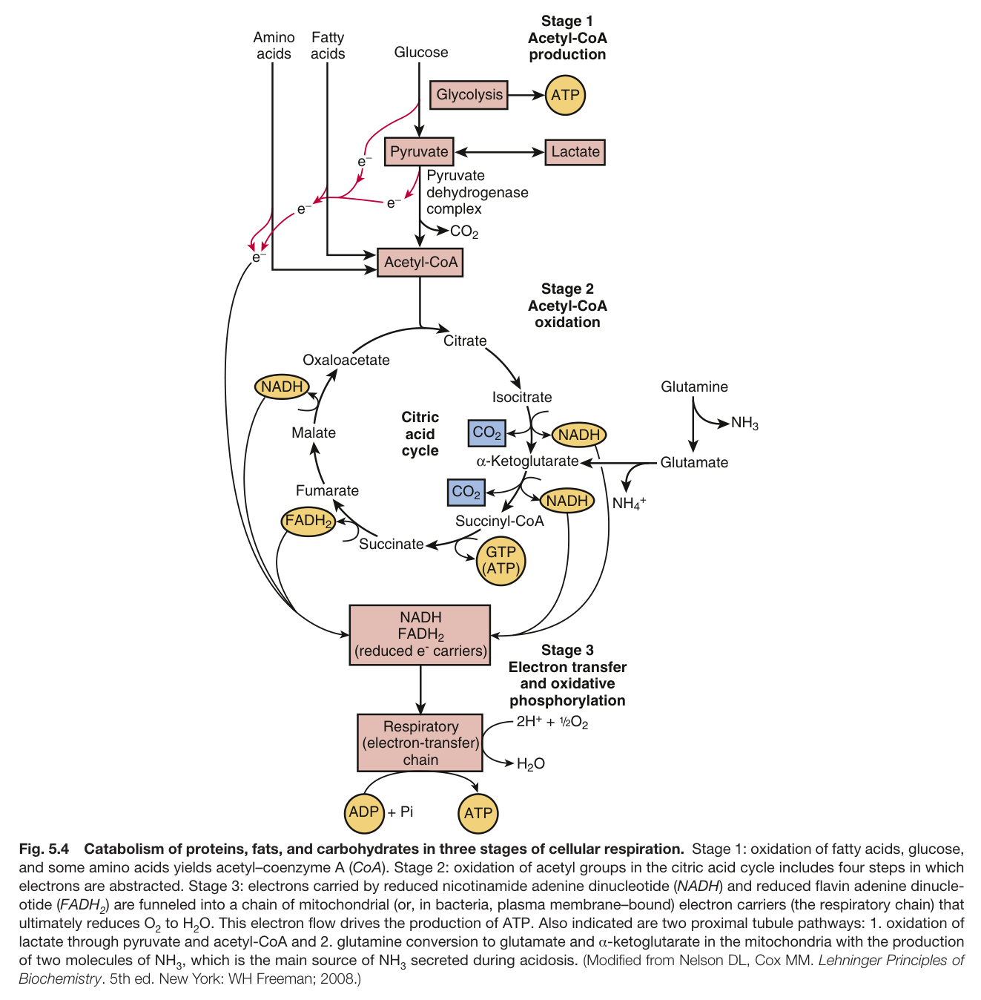

Fig. 5.4 Catabolism of proteins, fats, and carbohydrates in three stages of cellular respiration. Stage 1: oxidation of fatty acids, glucose, and some amino acids yields acetyl–coenzyme A (CoA). Stage 2: oxidation of acetyl groups in the citric acid cycle includes four steps in which electrons are abstracted. Stage 3: electrons carried by reduced nicotinamide adenine dinucleotide (NADH) and reduced flavin adenine dinucle- otide (FADH ) are funneled into a chain of mitochondrial (or, in bacteria, plasma membrane–bound) electron carriers (the respiratory chain) that ultimately reduces O to H O. This electron flow drives the production of ATP. Also indicated are two proximal tubule pathways: 1. oxidation of lactate through pyruvate and acetyl-CoA and 2. glutamine conversion to glutamate and α-ketoglutarate in the mitochondria with the production of two molecules of NH , which is the main source of NH secreted during acidosis. (Modified from Nelson DL, Cox MM. Lehninger Principles o Biochemistry. 5th ed. New York: WH Freeman; 2008.)

---

### Fig_5_5

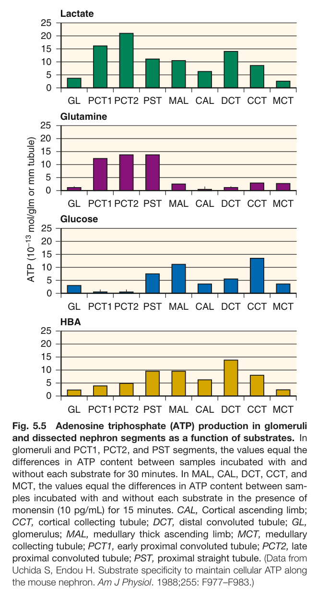

Fig. 5.5 Adenosine triphosphate (ATP) production in glomeruli and dissected nephron segments as a function of substrates. In glomeruli and PCT1, PCT2, and PST segments, the values equal the differences in ATP content between samples incubated with and without each substrate for 30 minutes. In MAL, CAL, DCT, CCT, and MCT, the values equal the differences in ATP content between sam- ples incubated with and without each substrate in the presence of monensin (10 pg/mL) for 15 minutes. CAL, Cortical ascending limb; CCT, cortical collecting tubule; DCT, distal convoluted tubule; GL, glomerulus; MAL, medullary thick ascending limb; MCT, medullary collecting tubule; PCT1, early proximal convoluted tubule; PCT2, late proximal convoluted tubule; PST, proximal straight tubule. (Data from Uchida S, Endou H. Substrate specificity to maintain cellular ATP along the mouse nephron. Am J Physiol. 1988;255: F977–F983.)

---

### Fig_5_6

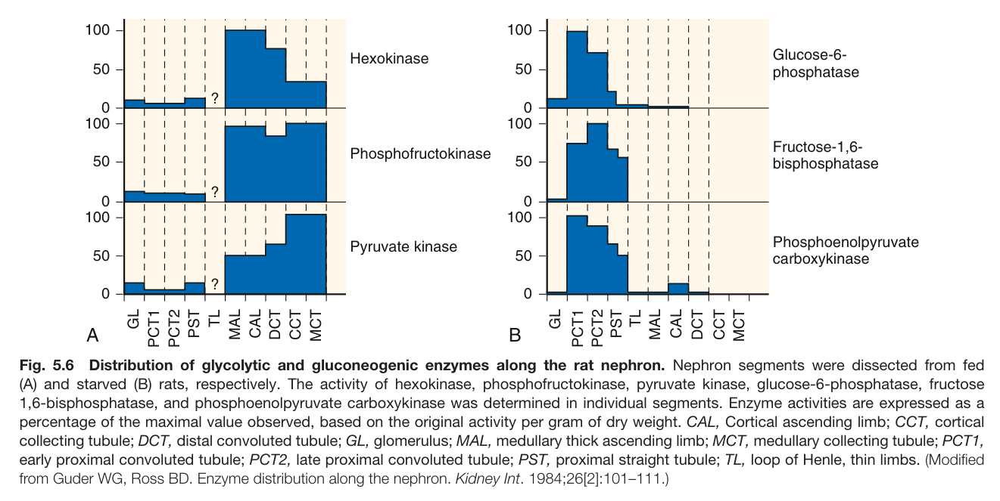

Fig. 5.6 Distribution of glycolytic and gluconeogenic enzymes along the rat nephron. Nephron segments were dissected from fed (A) and starved (B) rats, respectively. The activity of hexokinase, phosphofructokinase, pyruvate kinase, glucose-6-phosphatase, fructose 1,6-bisphosphatase, and phosphoenolpyruvate carboxykinase was determined in individual segments. Enzyme activities are expressed as a percentage of the maximal value observed, based on the original activity per gram of dry weight. CAL, Cortical ascending limb; CCT, cortica collecting tubule; DCT, distal convoluted tubule; GL, glomerulus; MAL, medullary thick ascending limb; MCT, medullary collecting tubule; PCT1, early proximal convoluted tubule; PCT2, late proximal convoluted tubule; PST, proximal straight tubule; TL, loop of Henle, thin limbs. (Modified from Guder WG, Ross BD. Enzyme distribution along the nephron. Kidney Int. 1984;26[2]:101–111.)

---

### Fig_5_7

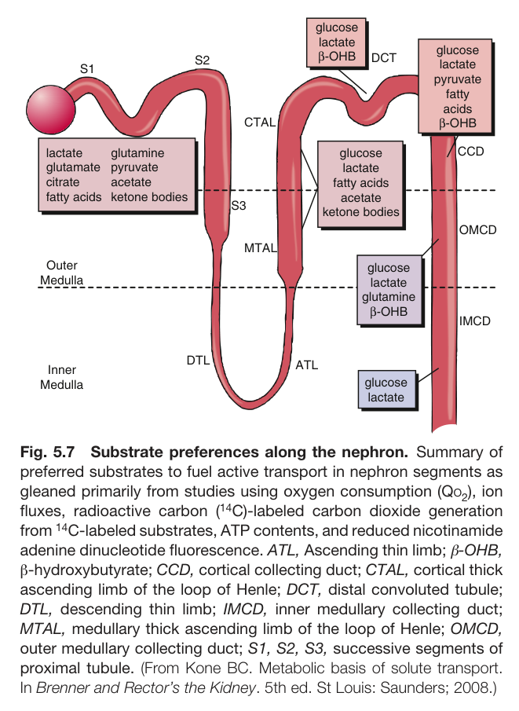

Fig. 5.7 Substrate preferences along the nephron. Summary of preferred substrates to fuel active transport in nephron segments as gleaned primarily from studies using oxygen consumption (Qo ), ion fluxes, radioactive carbon (<sup>14</sup>C)-labeled carbon dioxide generation from <sup>14</sup>C-labeled substrates, ATP contents, and reduced nicotinamide adenine dinucleotide fluorescence. ATL, Ascending thin limb; β-OHB, β-hydroxybutyrate; CCD, cortical collecting duct; CTAL, cortical thick ascending limb of the loop of Henle; DCT, distal convoluted tubule; DTL, descending thin limb; IMCD, inner medullary collecting duct; MTAL, medullary thick ascending limb of the loop of Henle; OMCD, outer medullary collecting duct; S1, S2, S3, successive segments of proximal tubule. (From Kone BC. Metabolic basis of solute transport. In Brenner and Rector’s the Kidney. 5th ed. St Louis: Saunders; 2008.)

---

### Fig_5_8

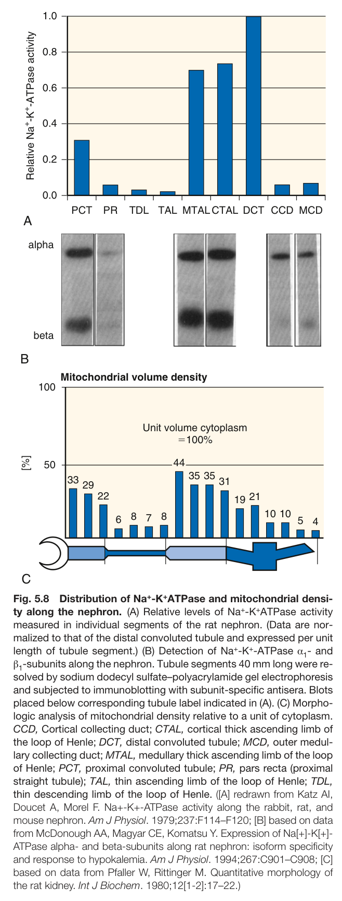

Fig. 5.8 Distribution of Na<sup>+</sup>-K<sup>+</sup>ATPase and mitochondrial densi- ty along the nephron. (A) Relative levels of Na<sup>+</sup>-K<sup>+</sup>ATPase activity measured in individual segments of the rat nephron. (Data are nor- malized to that of the distal convoluted tubule and expressed per unit length of tubule segment.) (B) Detection of Na<sup>+</sup>-K<sup>+</sup>-ATPase α - and β -subunits along the nephron. Tubule segments 40 mm long were re- solved by sodium dodecyl sulfate–polyacrylamide gel electrophoresis and subjected to immunoblotting with subunit-specific antisera. Blots placed below corresponding tubule label indicated in (A). (C) Morpho- logic analysis of mitochondrial density relative to a unit of cytoplasm. CCD, Cortical collecting duct; CTAL, cortical thick ascending limb of the loop of Henle; DCT, distal convoluted tubule; MCD, outer medul- lary collecting duct; MTAL, medullary thick ascending limb of the loop of Henle; PCT, proximal convoluted tubule; PR, pars recta (proximal straight tubule); TAL, thin ascending limb of the loop of Henle; TDL, thin descending limb of the loop of Henle. ([A] redrawn from Katz AI, Doucet A, Morel F. Na+-K+-ATPase activity along the rabbit, rat, and mouse nephron. Am J Physiol. 1979;237:F114–F120; [B] based on data from McDonough AA, Magyar CE, Komatsu Y. Expression of Na[+]-K[+]- ATPase alpha- and beta-subunits along rat nephron: isoform specificity and response to hypokalemia. Am J Physiol. 1994;267:C901–C908; [C] based on data from Pfaller W, Rittinger M. Quantitative morphology of the rat kidney. Int J Biochem. 1980;12[1-2]:17–22.)

---

### Fig_5_9

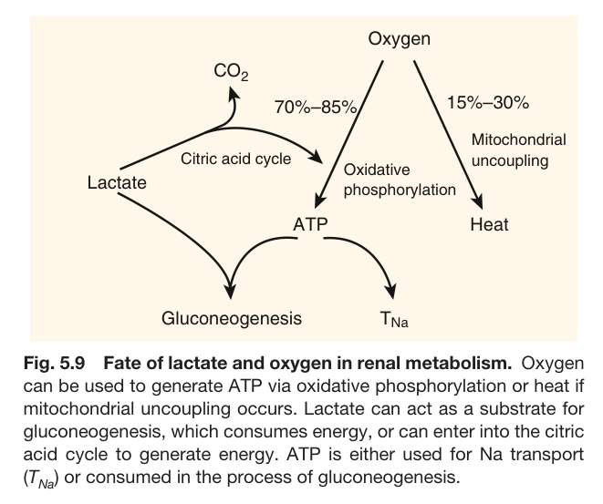

Fig. 5.9 Fate of lactate and oxygen in renal metabolism. Oxygen can be used to generate ATP via oxidative phosphorylation or heat if mitochondrial uncoupling occurs. Lactate can act as a substrate for gluconeogenesis, which consumes energy, or can enter into the citric acid cycle to generate energy. ATP is either used for Na transport (T ) or consumed in the process of gluconeogenesis.

---

### Fig_5_10

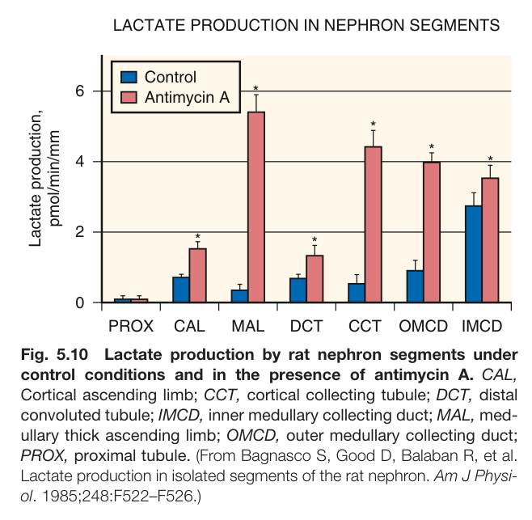

Fig. 5.10 Lactate production by rat nephron segments under control conditions and in the presence of antimycin A. CAL, Cortical ascending limb; CCT, cortical collecting tubule; DCT, distal convoluted tubule; IMCD, inner medullary collecting duct; MAL, med- ullary thick ascending limb; OMCD, outer medullary collecting duct; PROX, proximal tubule. (From Bagnasco S, Good D, Balaban R, et al. Lactate production in isolated segments of the rat nephron. Am J Physi- ol. 1985;248:F522–F526.)

---

### Fig_5_11

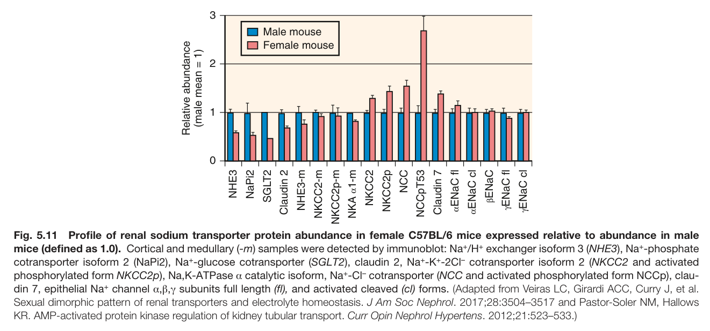

Fig. 5.11 Profile of renal sodium transporter protein abundance in female C57BL/6 mice expressed relative to abundance in male mice (defined as 1.0). Cortical and medullary (-m) samples were detected by immunoblot: Na<sup>+</sup>/H<sup>+</sup> exchanger isoform 3 (NHE3), Na<sup>+</sup>-phosphate cotransporter isoform 2 (NaPi2), Na<sup>+</sup>-glucose cotransporter (SGLT2), claudin 2, Na<sup>+</sup>-K<sup>+</sup>-2Cl<sup>–</sup> cotransporter isoform 2 (NKCC2 and activated phosphorylated form NKCC2p), Na,K-ATPase α catalytic isoform, Na<sup>+</sup>-Cl<sup>–</sup> cotransporter (NCC and activated phosphorylated form NCCp), clau- din 7, epithelial Na<sup>+</sup> channel α,β,γ subunits full length (fl), and activated cleaved (cl) forms. (Adapted from Veiras LC, Girardi ACC, Curry J, et al. Sexual dimorphic pattern of renal transporters and electrolyte homeostasis. J Am Soc Nephrol. 2017;28:3504–3517 and Pastor-Soler NM, Hallows KR. AMP-activated protein kinase regulation of kidney tubular transport. Curr Opin Nephrol Hypertens. 2012;21:523–533.)

---

### Fig_5_12

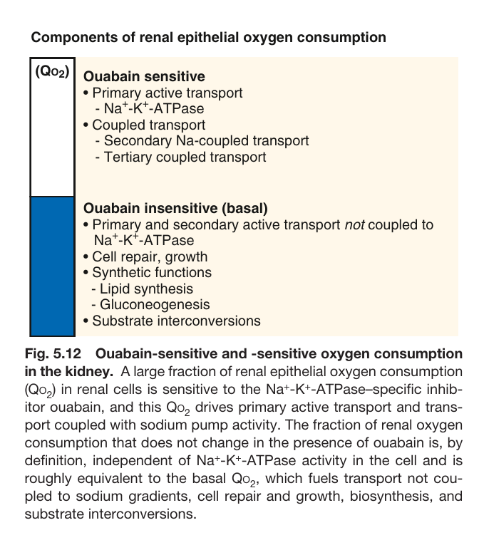

Fig. 5.12 Ouabain-sensitive and -sensitive oxygen consumption in the kidney. A large fraction of renal epithelial oxygen consumption (Qo ) in renal cells is sensitive to the Na<sup>+</sup>-K<sup>+</sup>-ATPase–specific inhib- itor ouabain, and this Qo drives primary active transport and trans- port coupled with sodium pump activity. The fraction of renal oxygen consumption that does not change in the presence of ouabain is, by definition, independent of Na<sup>+</sup>-K<sup>+</sup>-ATPase activity in the cell and is roughly equivalent to the basal Qo , which fuels transport not cou- pled to sodium gradients, cell repair and growth, biosynthesis, and substrate interconversions.

---

### Fig_5_13

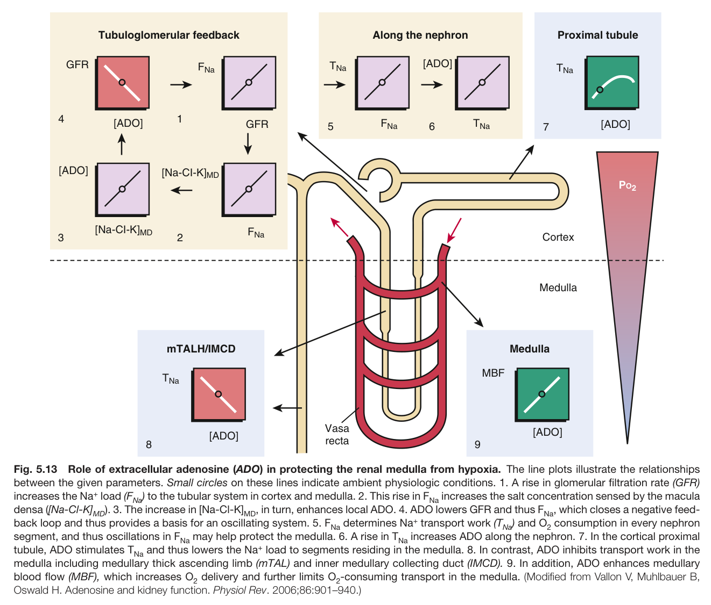

Fig. 5.13 Role of extracellular adenosine (ADO) in protecting the renal medulla from hypoxia. The line plots illustrate the relationships between the given parameters. Small circles on these lines indicate ambient physiologic conditions. 1. A rise in glomerular filtration rate (GFR) increases the Na<sup>+</sup> load (F ) to the tubular system in cortex and medulla. 2. This rise in F increases the salt concentration sensed by the macula densa ([Na-Cl-K]<sub>MD</sub>). 3. The increase in [Na-Cl-K]<sub>MD</sub>, in turn, enhances local ADO. 4. ADO lowers GFR and thus F<sub>Na</sub>, which closes a negative feed- back loop and thus provides a basis for an oscillating system. 5. F determines Na<sup>+</sup> transport work (T ) and O consumption in every nephron segment, and thus oscillations in F may help protect the medulla. 6. A rise in T increases ADO along the nephron. 7. In the cortical proximal tubule, ADO stimulates T<sub>Na</sub> and thus lowers the Na<sup>+</sup> load to segments residing in the medulla. 8. In contrast, ADO inhibits transport work in the medulla including medullary thick ascending limb (mTAL) and inner medullary collecting duct (IMCD). 9. In addition, ADO enhances medullary blood flow (MBF), which increases O delivery and further limits O -consuming transport in the medulla. (Modified from Vallon V, Muhlbauer B, Oswald H. Adenosine and kidney function. Physiol Rev. 2006;86:901–940.)

---

### Fig_5_14

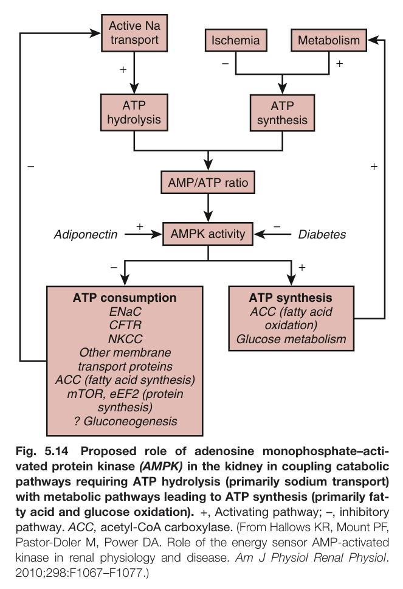

Fig. 5.14 Proposed role of adenosine monophosphate–acti- vated protein kinase (AMPK) in the kidney in coupling catabolic pathways requiring ATP hydrolysis (primarily sodium transport) with metabolic pathways leading to ATP synthesis (primarily fat- ty acid and glucose oxidation). +, Activating pathway; –, inhibitory pathway. ACC, acetyl-CoA carboxylase. (From Hallows KR, Mount PF, Pastor-Doler M, Power DA. Role of the energy sensor AMP-activated kinase in renal physiology and disease. Am J Physiol Renal Physiol. 2010;298:F1067–F1077.)

---

## Tables

### Table_5_1

#### Table Image

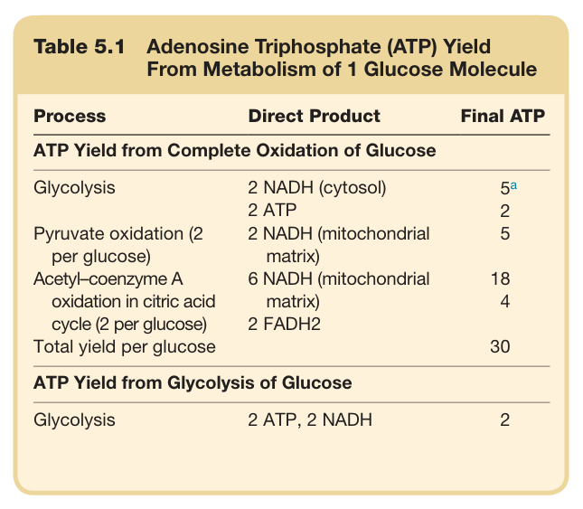

#### Table Data (CSV: [Table_5_1.csv](Table_5_1.csv))

```markdown
| Table Text (OCR) |
| :--- |
| Table 5.1  Adenosine Triphosphate (ATP) Yield From Metabolism of 1 Glucose Molecule Process  Direct Product  Final ATP    ATP Yield from Complete Oxidation of Glucose    Glycolysis  2 NADH (cytosol)   5^a     2 ATP  2    Pyruvate oxidation (2 per glucose)  2 NADH (mitochondrial matrix)  5    Acetyl-coenzyme A oxidation in citric acid cycle (2 per glucose)  6 NADH (mitochondrial matrix)  18    2 FADH2  4    Total yield per glucose    30    ATP Yield from Glycolysis of Glucose    Glycolysis  2 ATP, 2 NADH  2 |
```

Table 5.1 Adenosine Triphosphate (ATP) Yield From Metabolism of 1 Glucose Molecule

---
