# 06. Transport of Sodium, Chloride, and Potassium - Figures and Tables Index

This document lists all figures and tables extracted from `06. Transport of Sodium, Chloride, and Potassium.pdf`.

## Table of Contents
- [Figures](#figures)
- [Tables](#tables)

---

## Figures

### Fig_6_1

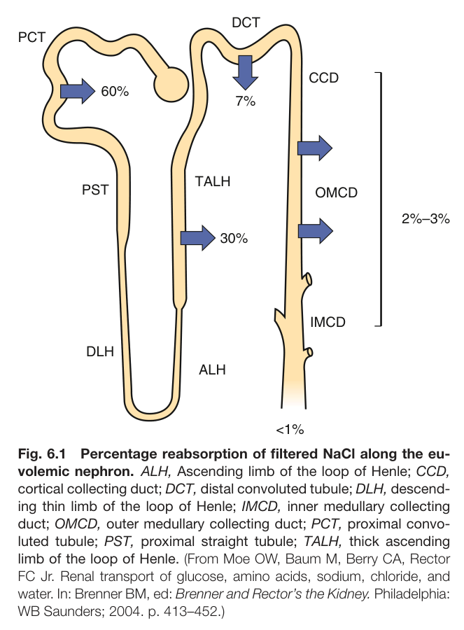

Fig. 6.1 Percentage reabsorption of filtered NaCl along the eu- volemic nephron. ALH, Ascending limb of the loop of Henle; CCD, cortical collecting duct; DCT, distal convoluted tubule; DLH, descend- ing thin limb of the loop of Henle; IMCD, inner medullary collecting duct; OMCD, outer medullary collecting duct; PCT, proximal convo- luted tubule; PST, proximal straight tubule; TALH, thick ascending limb of the loop of Henle. (From Moe OW, Baum M, Berry CA, Rector FC Jr. Renal transport of glucose, amino acids, sodium, chloride, and water. In: Brenner BM, ed: Brenner and Rector’s the Kidney. Philadelphia: WB Saunders; 2004. p. 413–452.)

---

### Fig_6_2

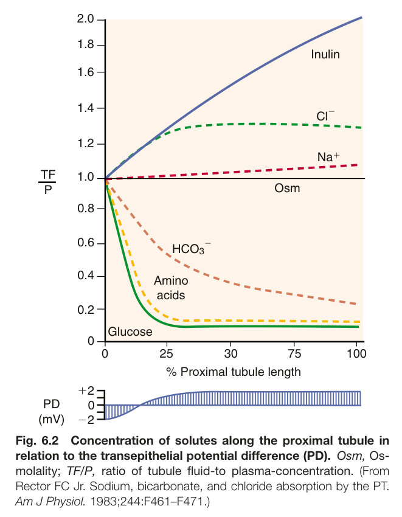

Fig. 6.2 Concentration of solutes along the proximal tubule in relation to the transepithelial potential difference (PD). Osm, Os- molality; TF/P, ratio of tubule fluid-to plasma-concentration. (From Rector FC Jr. Sodium, bicarbonate, and chloride absorption by the PT. Am J Physiol. 1983;244:F461–F471.)

---

### Fig_6_3

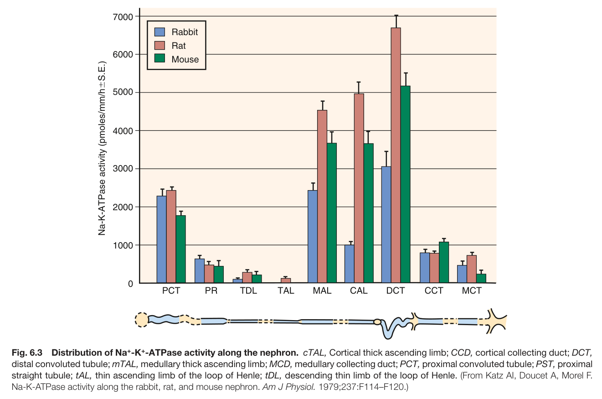

Fig. 6.3 Distribution of Na<sup>+</sup>-K<sup>+</sup>-ATPase activity along the nephron. cTAL, Cortical thick ascending limb; CCD, cortical collecting duct; DCT, distal convoluted tubule; mTAL, medullary thick ascending limb; MCD, medullary collecting duct; PCT, proximal convoluted tubule; PST, proxima straight tubule; tAL, thin ascending limb of the loop of Henle; tDL, descending thin limb of the loop of Henle. (From Katz AI, Doucet A, Morel F. Na-K-ATPase activity along the rabbit, rat, and mouse nephron. Am J Physiol. 1979;237:F114–F120.)

---

### Fig_6_4

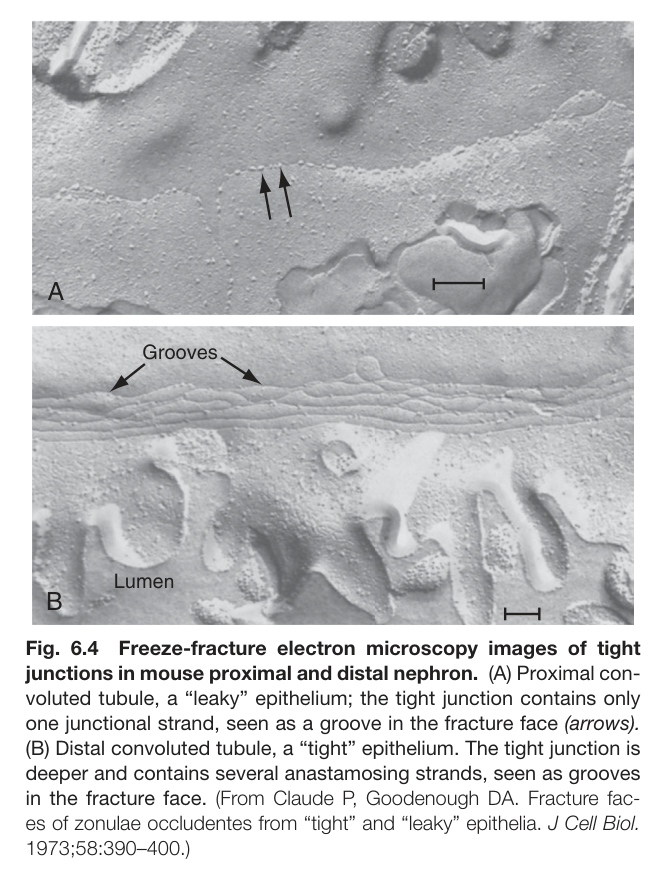

Fig. 6.4 Freeze-fracture electron microscopy images of tight junctions in mouse proximal and distal nephron. (A) Proximal con- voluted tubule, a “leaky” epithelium; the tight junction contains only one junctional strand, seen as a groove in the fracture face (arrows). (B) Distal convoluted tubule, a “tight” epithelium. The tight junction is deeper and contains several anastamosing strands, seen as grooves in the fracture face. (From Claude P, Goodenough DA. Fracture fac- es of zonulae occludentes from “tight” and “leaky” epithelia. J Cell Biol. 1973;58:390–400.)

---

### Fig_6_5

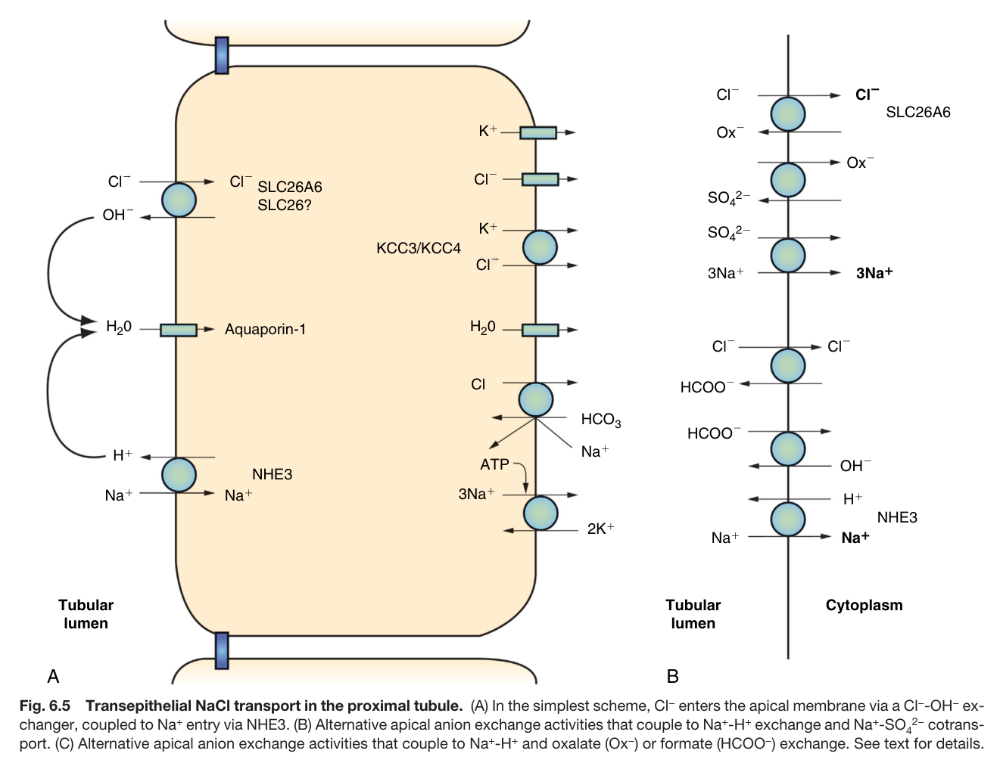

Fig. 6.5 Transepithelial NaCl transport in the proximal tubule. (A) In the simplest scheme, Cl<sup>−</sup> enters the apical membrane via a Cl<sup>−</sup>-OH<sup>−</sup> ex- changer, coupled to Na<sup>+</sup> entry via NHE3. (B) Alternative apical anion exchange activities that couple to Na<sup>+</sup>-H<sup>+</sup> exchange and Na<sup>+</sup>-SO <sup>2−</sup> cotrans- port. (C) Alternative apical anion exchange activities that couple to Na<sup>+</sup>-H<sup>+</sup> and oxalate (Ox<sup>−</sup>) or formate (HCOO<sup>−</sup>) exchange. See text for details.

---

### Fig_6_6

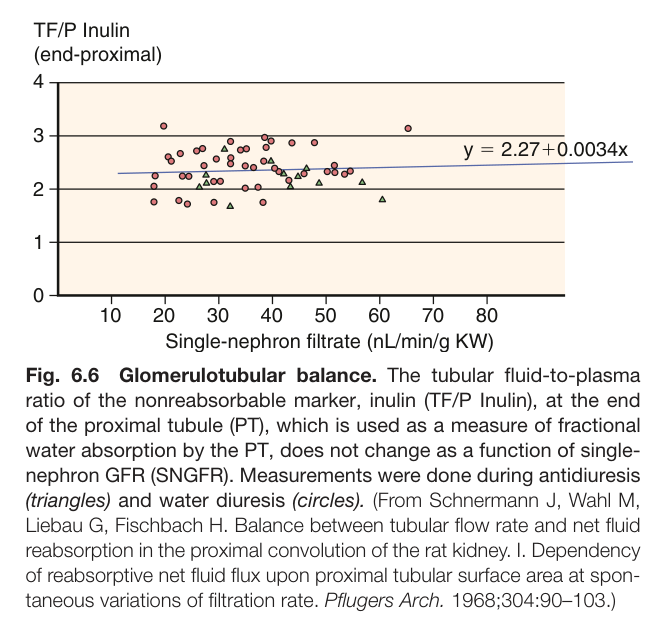

Fig. 6.6 Glomerulotubular balance. The tubular fluid-to-plasma ratio of the nonreabsorbable marker, inulin (TF/P Inulin), at the end of the proximal tubule (PT), which is used as a measure of fractional water absorption by the PT, does not change as a function of single- nephron GFR (SNGFR). Measurements were done during antidiuresis (triangles) and water diuresis (circles). (From Schnermann J, Wahl M, Liebau G, Fischbach H. Balance between tubular flow rate and net fluid reabsorption in the proximal convolution of the rat kidney. I. Dependency of reabsorptive net fluid flux upon proximal tubular surface area at spon- taneous variations of filtration rate. Pflugers Arch. 1968;304:90–103.)

---

### Fig_6_7

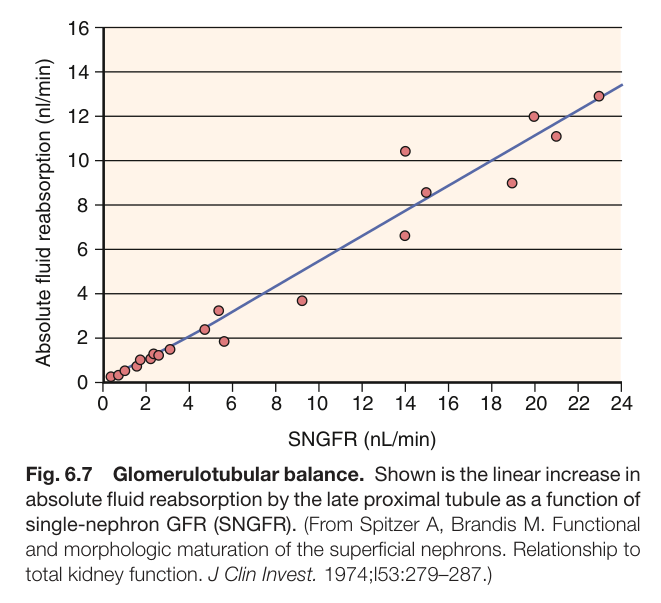

Fig. 6.7 Glomerulotubular balance. Shown is the linear increase in absolute fluid reabsorption by the late proximal tubule as a function of single-nephron GFR (SNGFR). (From Spitzer A, Brandis M. Functional and morphologic maturation of the superficial nephrons. Relationship to total kidney function. J Clin Invest. 1974;l53:279–287.)

---

### Fig_6_8

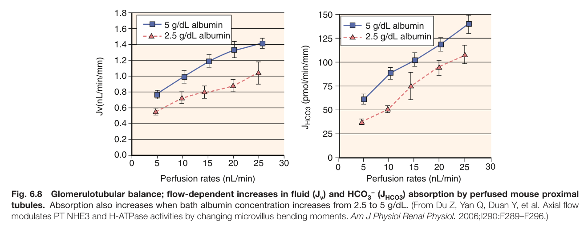

Fig. 6.8 Glomerulotubular balance; flow-dependent increases in fluid (J ) and HCO <sup>−</sup> (J ) absorption by perfused mouse proximal tubules. Absorption also increases when bath albumin concentration increases from 2.5 to 5 g/dL. (From Du Z, Yan Q, Duan Y, et al. Axial flow modulates PT NHE3 and H-ATPase activities by changing microvillus bending moments. Am J Physiol Renal Physiol. 2006;l290:F289–F296.)

---

### Fig_6_9

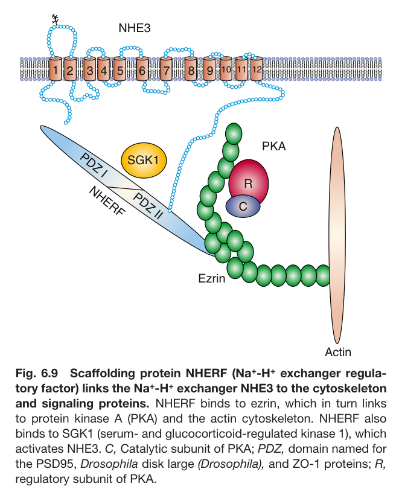

Fig. 6.9 Scaffolding protein NHERF (Na<sup>+</sup>-H<sup>+</sup> exchanger regula- tory factor) links the Na<sup>+</sup>-H<sup>+</sup> exchanger NHE3 to the cytoskeleton and signaling proteins. NHERF binds to ezrin, which in turn links to protein kinase A (PKA) and the actin cytoskeleton. NHERF also binds to SGK1 (serum- and glucocorticoid-regulated kinase 1), which activates NHE3. C, Catalytic subunit of PKA; PDZ, domain named for the PSD95, Drosophila disk large (Drosophila), and ZO-1 proteins; R, regulatory subunit of PKA.

---

### Fig_6_10

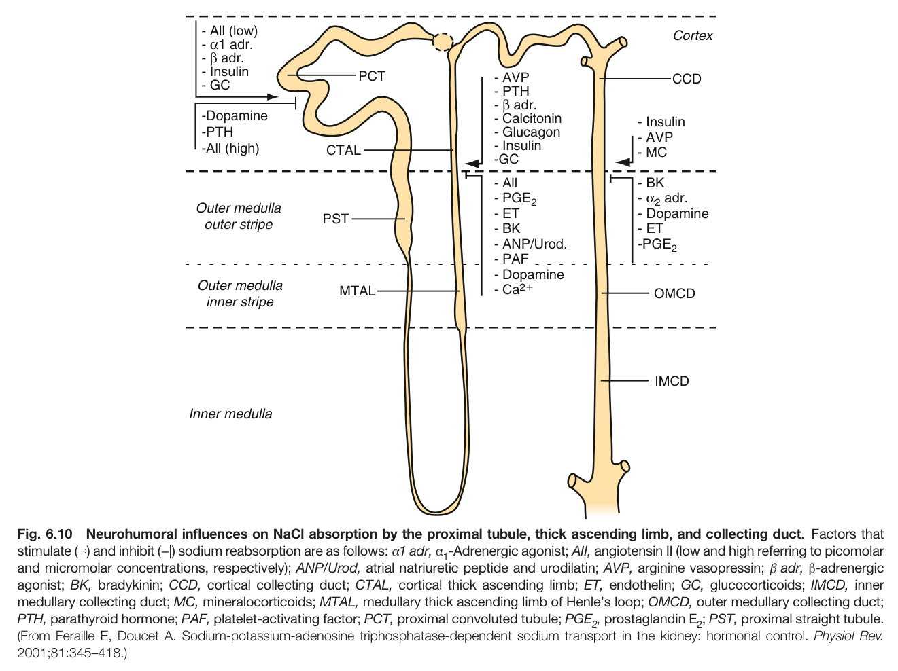

Fig. 6.10 Neurohumoral influences on NaCl absorption by the proximal tubule, thick ascending limb, and collecting duct. Factors that stimulate (→) and inhibit (−|) sodium reabsorption are as follows: α1 adr, α -Adrenergic agonist; AII, angiotensin II (low and high referring to picomolar and micromolar concentrations, respectively); ANP/Urod, atrial natriuretic peptide and urodilatin; AVP, arginine vasopressin; β adr, β-adrenergic agonist; BK, bradykinin; CCD, cortical collecting duct; CTAL, cortical thick ascending limb; ET, endothelin; GC, glucocorticoids; IMCD, inner medullary collecting duct; MC, mineralocorticoids; MTAL, medullary thick ascending limb of Henle’s loop; OMCD, outer medullary collecting duct; PTH, parathyroid hormone; PAF, platelet-activating factor; PCT, proximal convoluted tubule; PGE , prostaglandin E ; PST, proximal straight tubule. (From Feraille E, Doucet A. Sodium-potassium-adenosine triphosphatase-dependent sodium transport in the kidney: hormonal control. Physiol Rev. 2001;81:345–418.)

---

### Fig_6_11

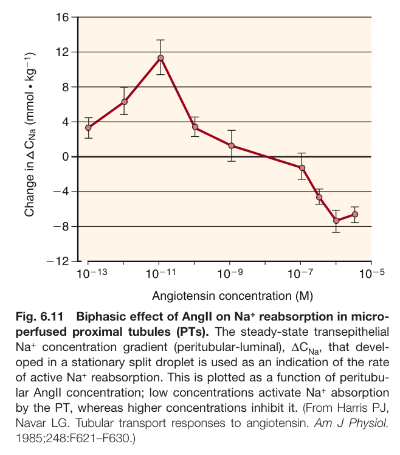

Fig. 6.11 Biphasic effect of AngII on Na<sup>+</sup> reabsorption in micro- perfused proximal tubules (PTs). The steady-state transepithelial Na<sup>+</sup> concentration gradient (peritubular-luminal), ΔC<sub>Na</sub>, that devel- oped in a stationary split droplet is used as an indication of the rate of active Na<sup>+</sup> reabsorption. This is plotted as a function of peritubu- lar AngII concentration; low concentrations activate Na<sup>+</sup> absorption by the PT, whereas higher concentrations inhibit it. (From Harris PJ, Navar LG. Tubular transport responses to angiotensin. Am J Physiol. 1985;248:F621–F630.)

---

### Fig_6_12

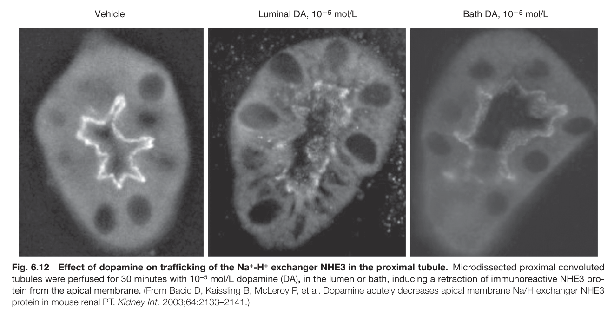

Fig. 6.12 Effect of dopamine on trafficking of the Na<sup>+</sup>-H<sup>+</sup> exchanger NHE3 in the proximal tubule. Microdissected proximal convoluted tubules were perfused for 30 minutes with 10<sup>−5</sup> mol/L dopamine (DA), in the lumen or bath, inducing a retraction of immunoreactive NHE3 pro- tein from the apical membrane. (From Bacic D, Kaissling B, McLeroy P, et al. Dopamine acutely decreases apical membrane Na/H exchanger NHE3 protein in mouse renal PT. Kidney Int. 2003;64:2133–2141.)

---

### Fig_6_13

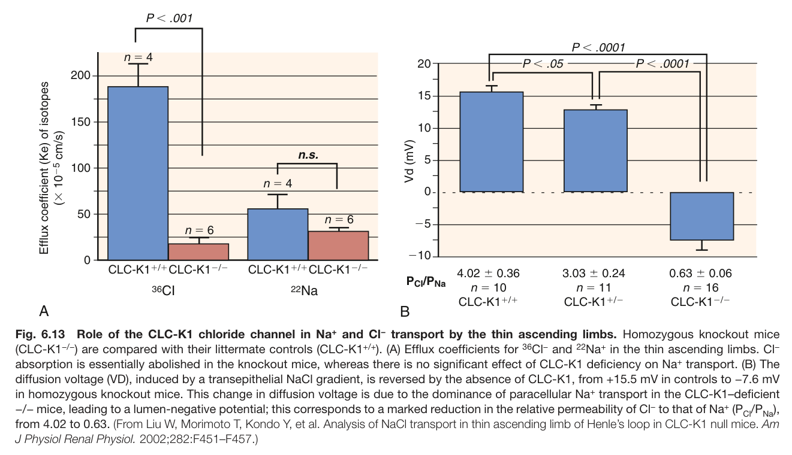

Fig. 6.13 Role of the CLC-K1 chloride channel in Na<sup>+</sup> and Cl<sup>−</sup> transport by the thin ascending limbs. Homozygous knockout mice (CLC-K1<sup>−/−</sup>) are compared with their littermate controls (CLC-K1<sup>+/+</sup>). (A) Efflux coefficients for <sup>36</sup>Cl<sup>−</sup> and <sup>22</sup>Na<sup>+</sup> in the thin ascending limbs. Cl<sup>−</sup> absorption is essentially abolished in the knockout mice, whereas there is no significant effect of CLC-K1 deficiency on Na<sup>+</sup> transport. (B) The diffusion voltage (VD), induced by a transepithelial NaCl gradient, is reversed by the absence of CLC-K1, from +15.5 mV in controls to −7.6 mV in homozygous knockout mice. This change in diffusion voltage is due to the dominance of paracellular Na<sup>+</sup> transport in the CLC-K1–deficient −/− mice, leading to a lumen-negative potential; this corresponds to a marked reduction in the relative permeability of Cl<sup>−</sup> to that of Na<sup>+</sup> (P /P ), from 4.02 to 0.63. (From Liu W, Morimoto T, Kondo Y, et al. Analysis of NaCl transport in thin ascending limb of Henle’s loop in CLC-K1 null mice. Am J Physiol Renal Physiol. 2002;282:F451–F457.)

---

### Fig_6_14

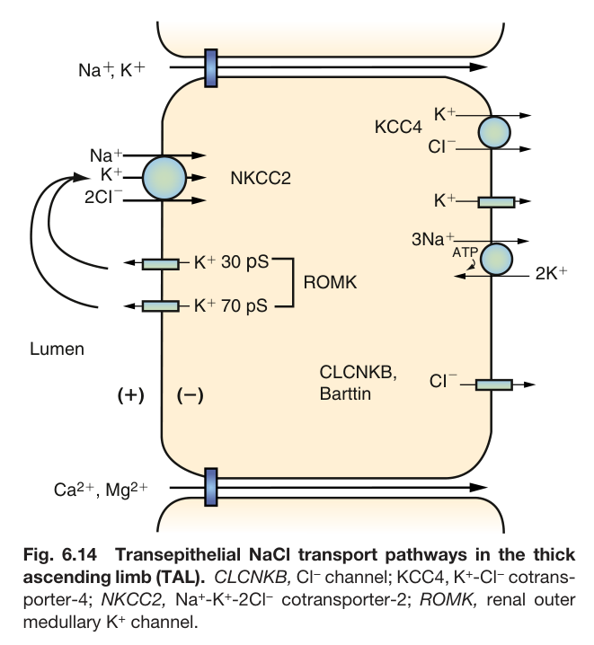

Fig. 6.14 Transepithelial NaCl transport pathways in the thick ascending limb (TAL). CLCNKB, Cl<sup>−</sup> channel; KCC4, K<sup>+</sup>-Cl<sup>−</sup> cotrans- porter-4; NKCC2, Na<sup>+</sup>-K<sup>+</sup>-2Cl<sup>−</sup> cotransporter-2; ROMK, renal outer medullary K<sup>+</sup> channel.

---

### Fig_6_15

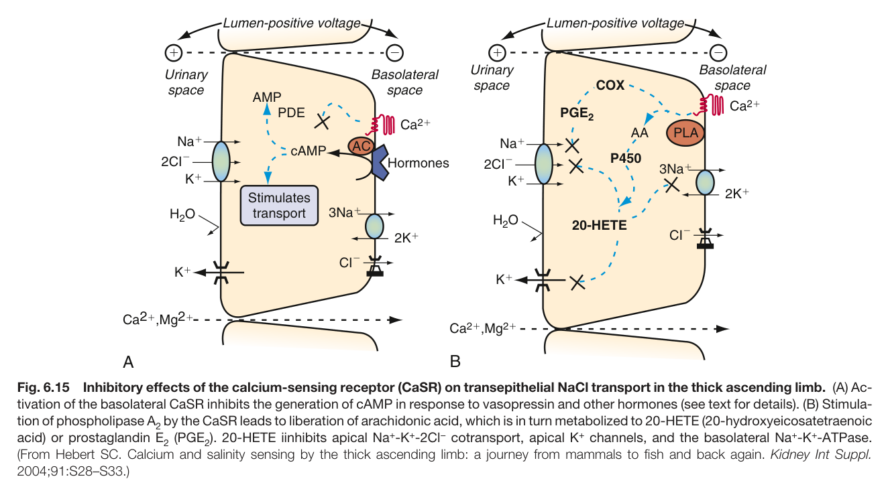

Fig. 6.15 Inhibitory effects of the calcium-sensing receptor (CaSR) on transepithelial NaCl transport in the thick ascending limb. (A) Ac tivation of the basolateral CaSR inhibits the generation of cAMP in response to vasopressin and other hormones (see text for details). (B) Stimula- tion of phospholipase A by the CaSR leads to liberation of arachidonic acid, which is in turn metabolized to 20-HETE (20-hydroxyeicosatetraenoic acid) or prostaglandin E (PGE ). 20-HETE iinhibits apical Na<sup>+</sup>-K<sup>+</sup>-2Cl<sup>−</sup> cotransport, apical K<sup>+</sup> channels, and the basolateral Na<sup>+</sup>-K<sup>+</sup>-ATPase. (From Hebert SC. Calcium and salinity sensing by the thick ascending limb: a journey from mammals to fish and back again. Kidney Int Suppl. 2004;91:S28–S33.)

---

### Fig_6_16

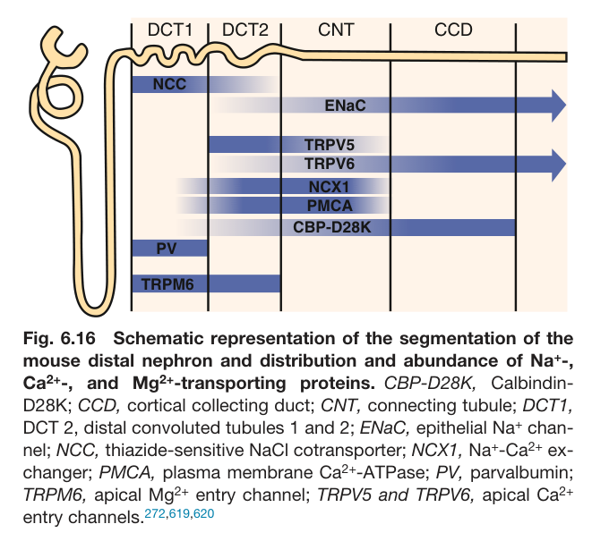

Fig. 6.16 Schematic representation of the segmentation of the mouse distal nephron and distribution and abundance of Na<sup>+</sup>-, Ca<sup>2+</sup>-, and Mg<sup>2+</sup>-transporting proteins. CBP-D28K, Calbindin- D28K; CCD, cortical collecting duct; CNT, connecting tubule; DCT1, DCT 2, distal convoluted tubules 1 and 2; ENaC, epithelial Na<sup>+</sup> chan- nel; NCC, thiazide-sensitive NaCl cotransporter; NCX1, Na<sup>+</sup>-Ca<sup>2+</sup> ex- changer; PMCA, plasma membrane Ca<sup>2+</sup>-ATPase; PV, parvalbumin; TRPM6, apical Mg<sup>2+</sup> entry channel; TRPV5 and TRPV6, apical Ca<sup>2+</sup> entry channels.<sup>272,619,620</sup>

---

### Fig_6_17

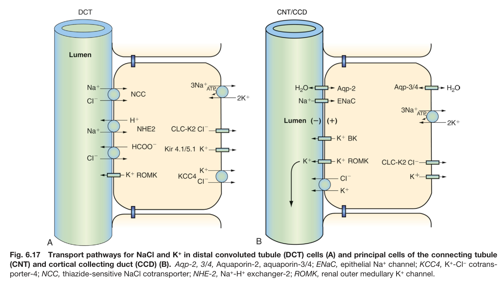

Fig. 6.17 Transport pathways for NaCl and K<sup>+</sup> in distal convoluted tubule (DCT) cells (A) and principal cells of the connecting tubule (CNT) and cortical collecting duct (CCD) (B). Aqp-2, 3/4, Aquaporin-2, aquaporin-3/4; ENaC, epithelial Na<sup>+</sup> channel; KCC4, K<sup>+</sup>-Cl<sup>−</sup> cotrans- porter-4; NCC, thiazide-sensitive NaCl cotransporter; NHE-2, Na<sup>+</sup>-H<sup>+</sup> exchanger-2; ROMK, renal outer medullary K<sup>+</sup> channel.

---

### Fig_6_18

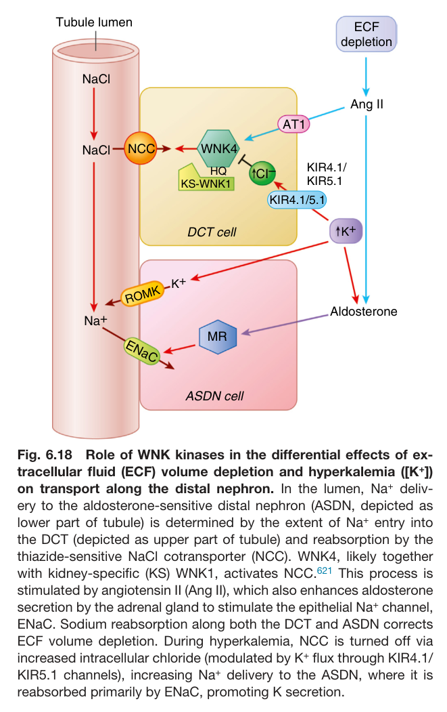

Fig. 6.18 Role of WNK kinases in the differential effects of ex- tracellular fluid (ECF) volume depletion and hyperkalemia ([K<sup>+</sup>]) on transport along the distal nephron. In the lumen, Na<sup>+</sup> deliv- ery to the aldosterone-sensitive distal nephron (ASDN, depicted as lower part of tubule) is determined by the extent of Na<sup>+</sup> entry into the DCT (depicted as upper part of tubule) and reabsorption by the thiazide-sensitive NaCl cotransporter (NCC). WNK4, likely together with kidney-specific (KS) WNK1, activates NCC.<sup>621</sup> This process is stimulated by angiotensin II (Ang II), which also enhances aldosterone secretion by the adrenal gland to stimulate the epithelial Na<sup>+</sup> channel, ENaC. Sodium reabsorption along both the DCT and ASDN corrects ECF volume depletion. During hyperkalemia, NCC is turned off via increased intracellular chloride (modulated by K<sup>+</sup> flux through KIR4.1/ KIR5.1 channels), increasing Na<sup>+</sup> delivery to the ASDN, where it is reabsorbed primarily by ENaC, promoting K secretion.

---

### Fig_6_19

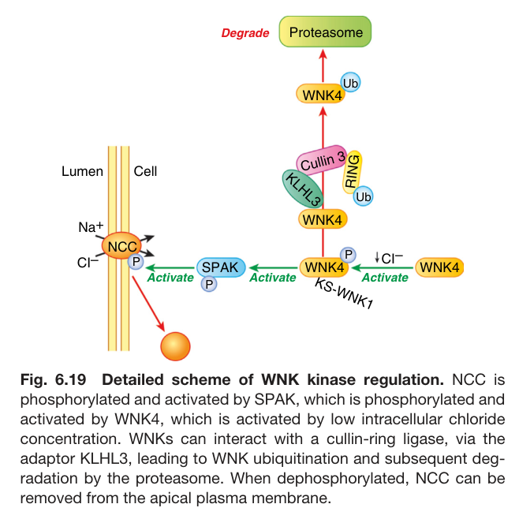

Fig. 6.19 Detailed scheme of WNK kinase regulation. NCC is phosphorylated and activated by SPAK, which is phosphorylated and activated by WNK4, which is activated by low intracellular chloride concentration. WNKs can interact with a cullin-ring ligase, via the adaptor KLHL3, leading to WNK ubiquitination and subsequent deg- radation by the proteasome. When dephosphorylated, NCC can be removed from the apical plasma membrane.

---

### Fig_6_20

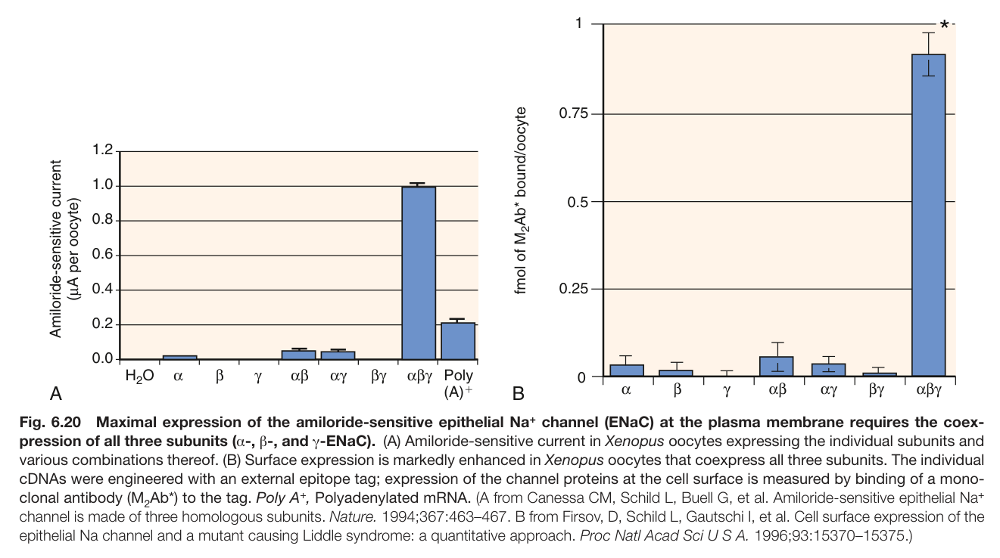

Fig. 6.20 Maximal expression of the amiloride-sensitive epithelial Na<sup>+</sup> channel (ENaC) at the plasma membrane requires the coex pression of all three subunits (α-, β-, and γ-ENaC). (A) Amiloride-sensitive current in Xenopus oocytes expressing the individual subunits and various combinations thereof. (B) Surface expression is markedly enhanced in Xenopus oocytes that coexpress all three subunits. The individual cDNAs were engineered with an external epitope tag; expression of the channel proteins at the cell surface is measured by binding of a mono- clonal antibody (M Ab*) to the tag. Poly A<sup>+</sup>, Polyadenylated mRNA. (A from Canessa CM, Schild L, Buell G, et al. Amiloride-sensitive epithelial Na<sup>+</sup> channel is made of three homologous subunits. Nature. 1994;367:463–467. B from Firsov, D, Schild L, Gautschi I, et al. Cell surface expression of the epithelial Na channel and a mutant causing Liddle syndrome: a quantitative approach. Proc Natl Acad Sci U S A. 1996;93:15370–15375.)

---

### Fig_6_21

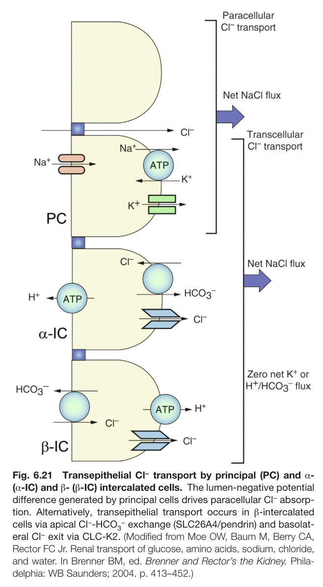

Fig. 6.21 Transepithelial Cl<sup>−</sup> transport by principal (PC) and α- (α-IC) and β- (β-IC) intercalated cells. The lumen-negative potentia difference generated by principal cells drives paracellular Cl<sup>−</sup> absorp- tion. Alternatively, transepithelial transport occurs in β-intercalated cells via apical Cl<sup>−</sup>-HCO <sup>−</sup> exchange (SLC26A4/pendrin) and basolat- eral Cl<sup>−</sup> exit via CLC-K2. (Modified from Moe OW, Baum M, Berry CA, Rector FC Jr. Renal transport of glucose, amino acids, sodium, chloride, and water. In Brenner BM, ed. Brenner and Rector’s the Kidney. Phila- delphia: WB Saunders; 2004. p. 413–452.)

---

### Fig_6_22

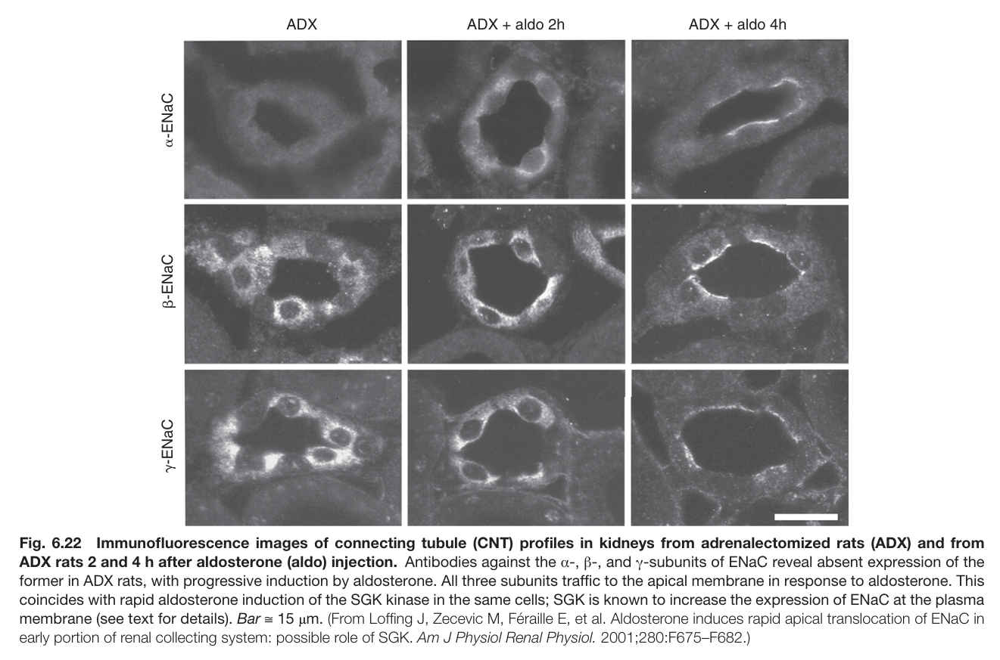

Fig. 6.22 Immunofluorescence images of connecting tubule (CNT) profiles in kidneys from adrenalectomized rats (ADX) and from ADX rats 2 and 4 h after aldosterone (aldo) injection. Antibodies against the α-, β-, and γ-subunits of ENaC reveal absent expression of the former in ADX rats, with progressive induction by aldosterone. All three subunits traffic to the apical membrane in response to aldosterone. This coincides with rapid aldosterone induction of the SGK kinase in the same cells; SGK is known to increase the expression of ENaC at the plasma membrane (see text for details). Bar ≅ 15 μm. (From Loffing J, Zecevic M, Féraille E, et al. Aldosterone induces rapid apical translocation of ENaC in early portion of renal collecting system: possible role of SGK. Am J Physiol Renal Physiol. 2001;280:F675–F682.)

---

### Fig_6_23

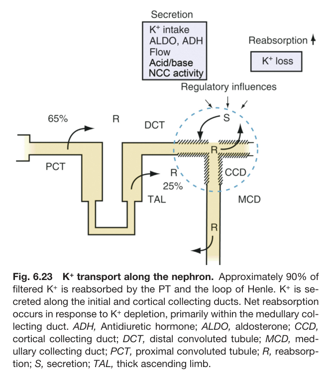

Fig. 6.23 K<sup>+</sup> transport along the nephron. Approximately 90% of filtered K<sup>+</sup> is reabsorbed by the PT and the loop of Henle. K<sup>+</sup> is se- creted along the initial and cortical collecting ducts. Net reabsorption occurs in response to K<sup>+</sup> depletion, primarily within the medullary col- lecting duct. ADH, Antidiuretic hormone; ALDO, aldosterone; CCD, cortical collecting duct; DCT, distal convoluted tubule; MCD, med- ullary collecting duct; PCT, proximal convoluted tubule; R, reabsorp- tion; S, secretion; TAL, thick ascending limb.

---

### Fig_6_24

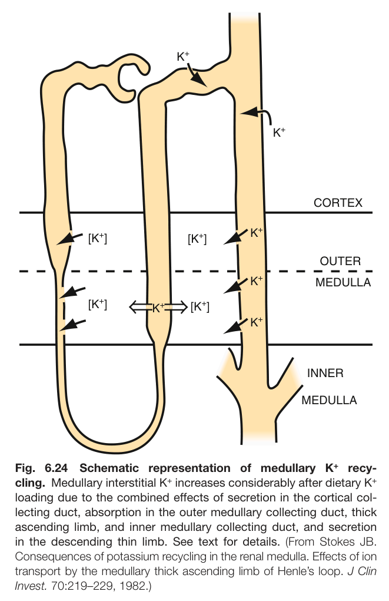

Fig. 6.24 Schematic representation of medullary K<sup>+</sup> recy- cling. Medullary interstitial K<sup>+</sup> increases considerably after dietary K<sup>+</sup> loading due to the combined effects of secretion in the cortical col- lecting duct, absorption in the outer medullary collecting duct, thick ascending limb, and inner medullary collecting duct, and secretion in the descending thin limb. See text for details. (From Stokes JB. Consequences of potassium recycling in the renal medulla. Effects of ion transport by the medullary thick ascending limb of Henle’s loop. J Clin Invest. 70:219–229, 1982.)

---

## Tables

### Table_6_1

#### Table Image

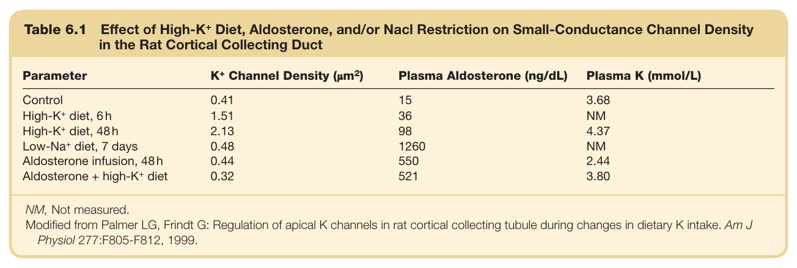

#### Table Data (CSV: [Table_6_1.csv](Table_6_1.csv))

```markdown
| Table Text (OCR) |
| :--- |
| Table 6.1  Effect of High-K<sup>+</sup> Diet, Aldosterone, and/or Nacl Restriction on Small-Conductance Channel Density in the Rat Cortical Collecting Duct Parameter  K+ Channel Density ( \mu m^{2} )  Plasma Aldosterone (ng/dL)  Plasma K (mmol/L)    Control  0.41  15  3.68    High-K+ diet, 6h  1.51  36  NM    High-K+ diet, 48h  2.13  98  4.37    Low-Na+ diet, 7 days  0.48  1260  NM    Aldosterone infusion, 48h  0.44  550  2.44    Aldosterone + high-K+ diet  0.32  521  3.80 NM, Not measured. Modified from Palmer LG, Frindt G: Regulation of apical K channels in rat cortical collecting tubule during changes in dietary K intake. Am J Physiol 277:F805-F812, 1999. |
```

Table 6.1 Effect of High-K<sup>+</sup> Diet, Aldosterone, and/or Nacl Restriction on Small-Conductance Channel Density in the Rat Cortical Collecting Duct

---
