# 07. Transport of Calcium, Magnesium, and Phosphate - Figures and Tables Index

This document lists all figures and tables extracted from `07. Transport of Calcium, Magnesium, and Phosphate.pdf`.

## Table of Contents
- [Figures](#figures)
- [Tables](#tables)

---

## Figures

### Fig_7_1

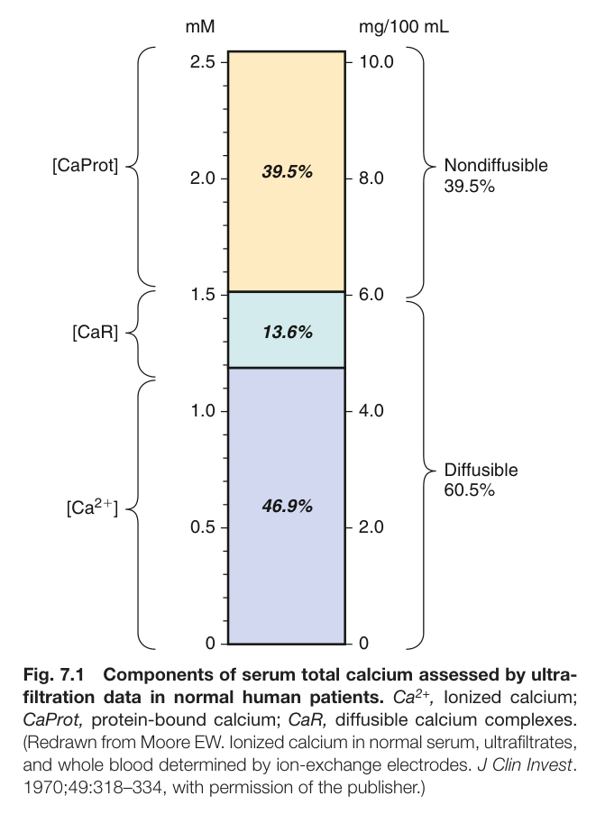

Fig. 7.1 Components of serum total calcium assessed by ultra- filtration data in normal human patients. Ca<sup>2+</sup>, Ionized calcium; CaProt, protein-bound calcium; CaR, diffusible calcium complexes. (Redrawn from Moore EW. Ionized calcium in normal serum, ultrafiltrates, and whole blood determined by ion-exchange electrodes. J Clin Invest. 1970;49:318–334, with permission of the publisher.)

---

### Fig_7_2

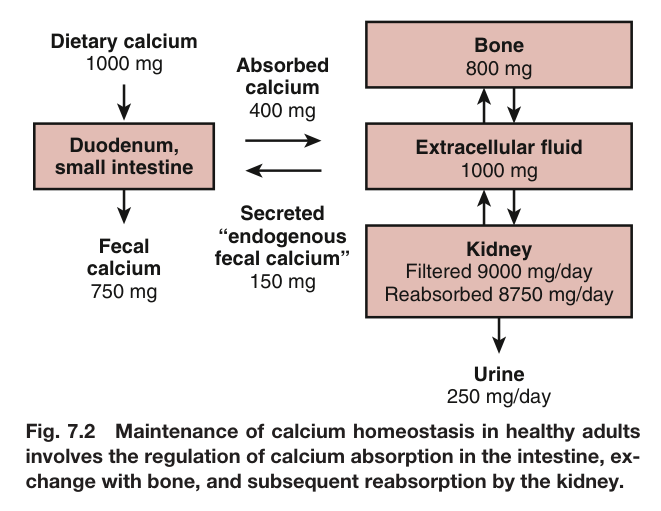

Fig. 7.2 Maintenance of calcium homeostasis in healthy adults involves the regulation of calcium absorption in the intestine, ex- change with bone, and subsequent reabsorption by the kidney.

---

### Fig_7_3

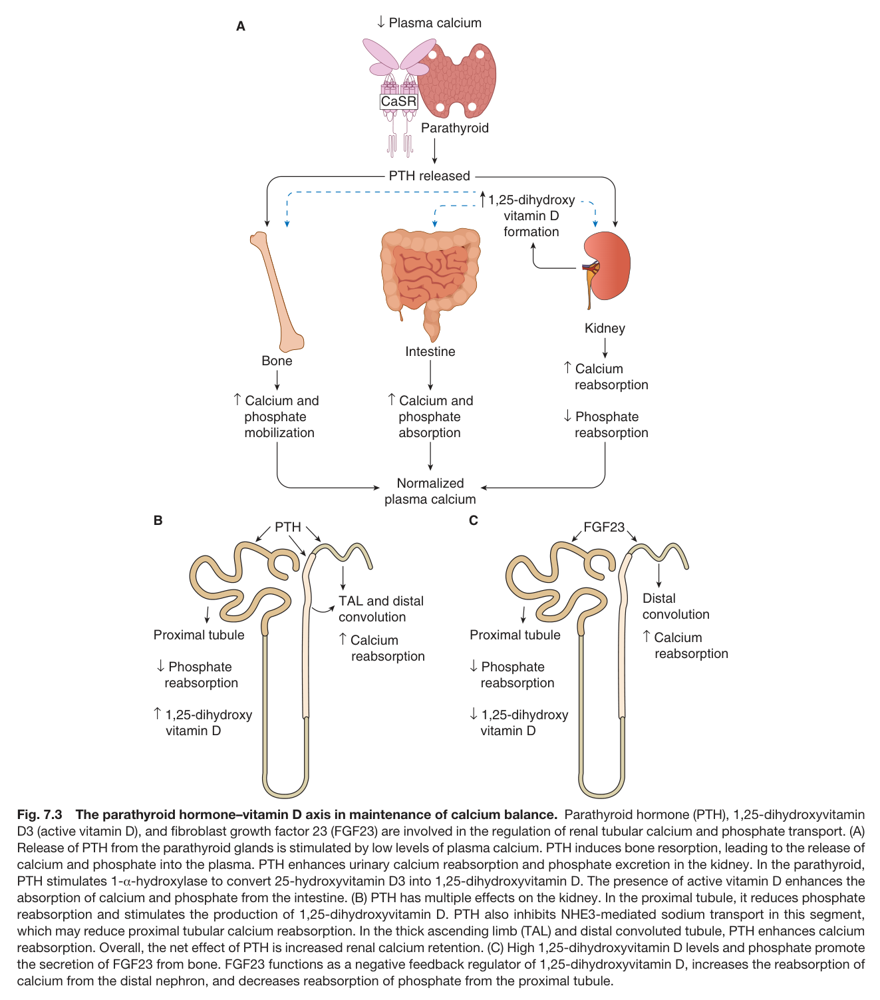

Fig. 7.3 The parathyroid hormone–vitamin D axis in maintenance of calcium balance. Parathyroid hormone (PTH), 1,25-dihydroxyvitamin D3 (active vitamin D), and fibroblast growth factor 23 (FGF23) are involved in the regulation of renal tubular calcium and phosphate transport. (A) Release of PTH from the parathyroid glands is stimulated by low levels of plasma calcium. PTH induces bone resorption, leading to the release of calcium and phosphate into the plasma. PTH enhances urinary calcium reabsorption and phosphate excretion in the kidney. In the parathyroid, PTH stimulates 1-α-hydroxylase to convert 25-hydroxyvitamin D3 into 1,25-dihydroxyvitamin D. The presence of active vitamin D enhances the absorption of calcium and phosphate from the intestine. (B) PTH has multiple effects on the kidney. In the proximal tubule, it reduces phosphate reabsorption and stimulates the production of 1,25-dihydroxyvitamin D. PTH also inhibits NHE3-mediated sodium transport in this segment, which may reduce proximal tubular calcium reabsorption. In the thick ascending limb (TAL) and distal convoluted tubule, PTH enhances calcium reabsorption. Overall, the net effect of PTH is increased renal calcium retention. (C) High 1,25-dihydroxyvitamin D levels and phosphate promote the secretion of FGF23 from bone. FGF23 functions as a negative feedback regulator of 1,25-dihydroxyvitamin D, increases the reabsorption of calcium from the distal nephron, and decreases reabsorption of phosphate from the proximal tubule.

---

### Fig_7_4

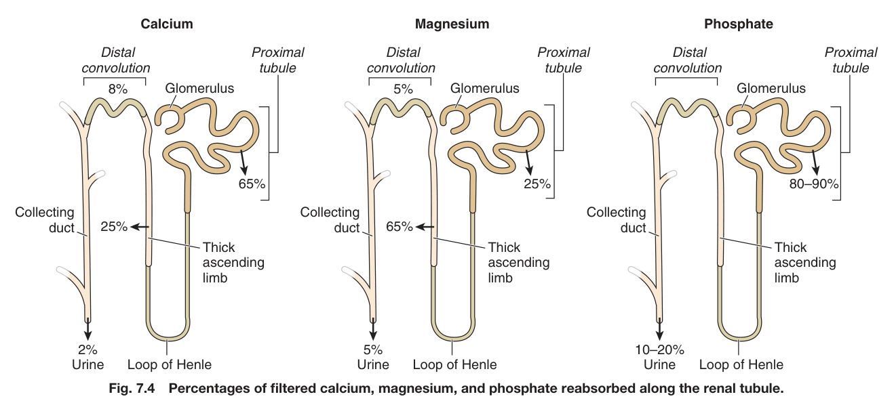

Fig. 7.4 Percentages of filtered calcium, magnesium, and phosphate reabsorbed along the renal tubule.

---

### Fig_7_5

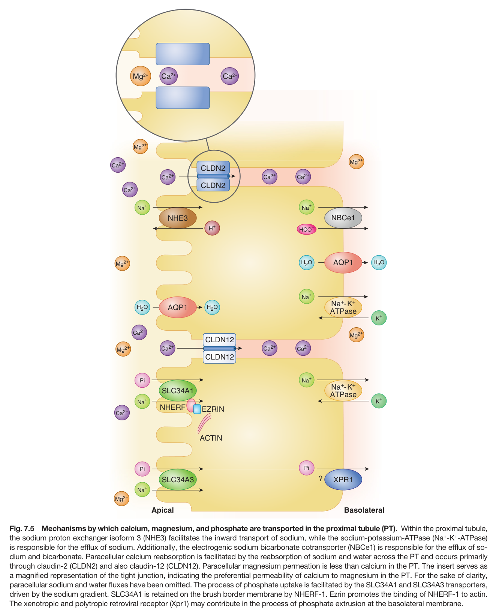

Fig. 7.5 Mechanisms by which calcium, magnesium, and phosphate are transported in the proximal tubule (PT). Within the proximal tubule, the sodium proton exchanger isoform 3 (NHE3) facilitates the inward transport of sodium, while the sodium-potassium-ATPase (Na<sup>+</sup>-K<sup>+</sup>-ATPase) is responsible for the efflux of sodium. Additionally, the electrogenic sodium bicarbonate cotransporter (NBCe1) is responsible for the efflux of so- dium and bicarbonate. Paracellular calcium reabsorption is facilitated by the reabsorption of sodium and water across the PT and occurs primarily through claudin-2 (CLDN2) and also claudin-12 (CLDN12). Paracellular magnesium permeation is less than calcium in the PT. The insert serves as a magnified representation of the tight junction, indicating the preferential permeability of calcium to magnesium in the PT. For the sake of clarity, paracellular sodium and water fluxes have been omitted. The process of phosphate uptake is facilitated by the SLC34A1 and SLC34A3 transporters, driven by the sodium gradient. SLC34A1 is retained on the brush border membrane by NHERF-1. Ezrin promotes the binding of NHERF-1 to actin. The xenotropic and polytropic retroviral receptor (Xpr1) may contribute in the process of phosphate extrusion at the basolateral membrane.

---

### Fig_7_6

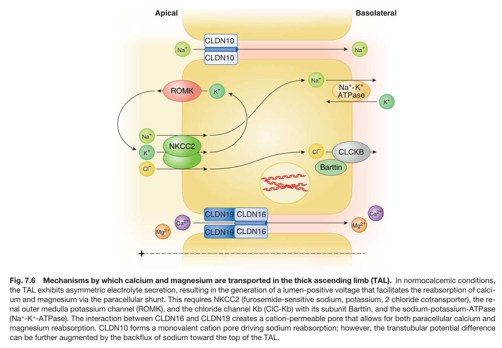

Fig. 7.6 Mechanisms by which calcium and magnesium are transported in the thick ascending limb (TAL). In normocalcemic conditions, the TAL exhibits asymmetric electrolyte secretion, resulting in the generation of a lumen-positive voltage that facilitates the reabsorption of calci- um and magnesium via the paracellular shunt. This requires NKCC2 (furosemide-sensitive sodium, potassium, 2 chloride cotransporter), the re- nal outer medulla potassium channel (ROMK), and the chloride channel Kb (ClC-Kb) with its subunit Barttin, and the sodium-potassium-ATPase (Na<sup>+</sup>-K<sup>+</sup>-ATPase). The interaction between CLDN16 and CLDN19 creates a cation-permeable pore that allows for both paracellular calcium and magnesium reabsorption. CLDN10 forms a monovalent cation pore driving sodium reabsorption; however, the transtubular potential difference can be further augmented by the backflux of sodium toward the top of the TAL.

---

### Fig_7_7

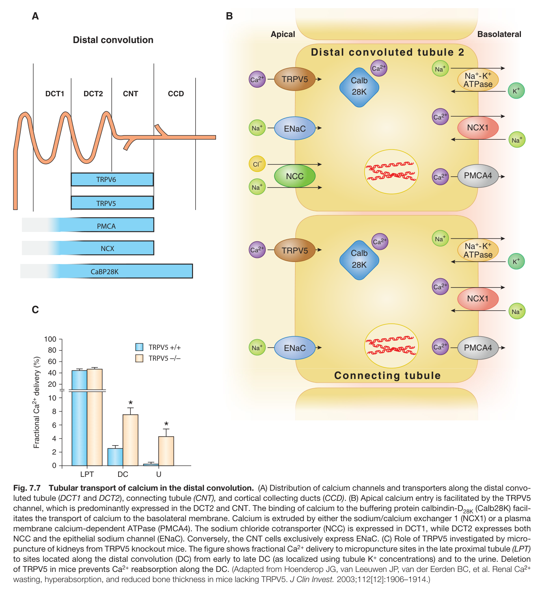

Fig. 7.7 Tubular transport of calcium in the distal convolution. (A) Distribution of calcium channels and transporters along the distal convo- luted tubule (DCT1 and DCT2), connecting tubule (CNT), and cortical collecting ducts (CCD). (B) Apical calcium entry is facilitated by the TRPV5 channel, which is predominantly expressed in the DCT2 and CNT. The binding of calcium to the buffering protein calbindin-D (Calb28K) facil- itates the transport of calcium to the basolateral membrane. Calcium is extruded by either the sodium/calcium exchanger 1 (NCX1) or a plasma membrane calcium-dependent ATPase (PMCA4). The sodium chloride cotransporter (NCC) is expressed in DCT1, while DCT2 expresses both NCC and the epithelial sodium channel (ENaC). Conversely, the CNT cells exclusively express ENaC. (C) Role of TRPV5 investigated by micro- puncture of kidneys from TRPV5 knockout mice. The figure shows fractional Ca<sup>2+</sup> delivery to micropuncture sites in the late proximal tubule (LPT) to sites located along the distal convolution (DC) from early to late DC (as localized using tubule K<sup>+</sup> concentrations) and to the urine. Deletion of TRPV5 in mice prevents Ca<sup>2+</sup> reabsorption along the DC. (Adapted from Hoenderop JG, van Leeuwen JP, van der Eerden BC, et al. Renal Ca<sup>2+</sup> wasting, hyperabsorption, and reduced bone thickness in mice lacking TRPV5. J Clin Invest. 2003;112[12]:1906–1914.)

---

### Fig_7_8

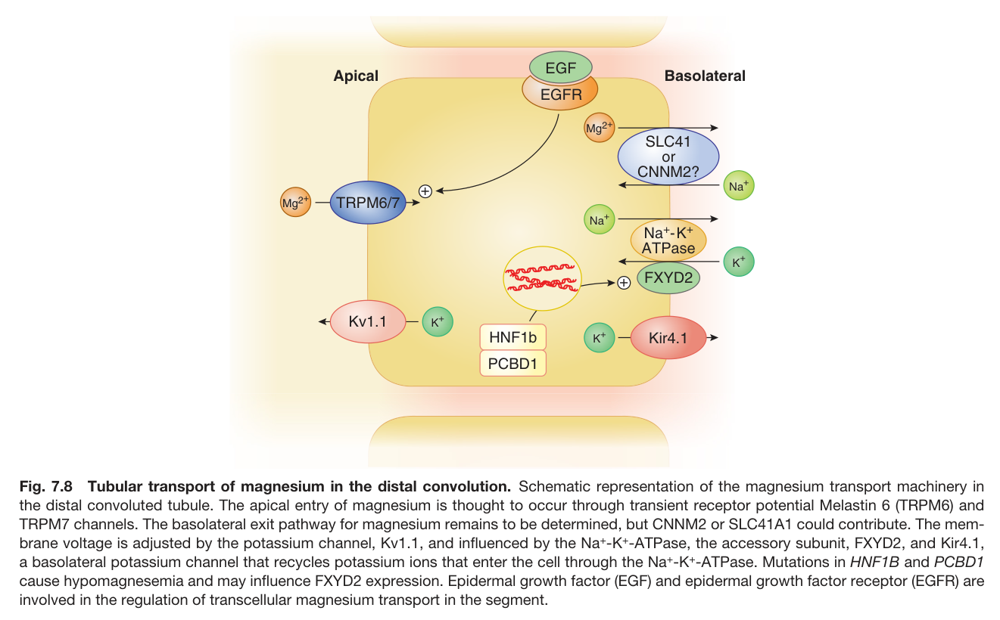

Fig. 7.8 Tubular transport of magnesium in the distal convolution. Schematic representation of the magnesium transport machinery in the distal convoluted tubule. The apical entry of magnesium is thought to occur through transient receptor potential Melastin 6 (TRPM6) and TRPM7 channels. The basolateral exit pathway for magnesium remains to be determined, but CNNM2 or SLC41A1 could contribute. The mem- brane voltage is adjusted by the potassium channel, Kv1.1, and influenced by the Na<sup>+</sup>-K<sup>+</sup>-ATPase, the accessory subunit, FXYD2, and Kir4.1, a basolateral potassium channel that recycles potassium ions that enter the cell through the Na<sup>+</sup>-K<sup>+</sup>-ATPase. Mutations in HNF1B and PCBD1 cause hypomagnesemia and may influence FXYD2 expression. Epidermal growth factor (EGF) and epidermal growth factor receptor (EGFR) are involved in the regulation of transcellular magnesium transport in the segment.

---

### Fig_7_9

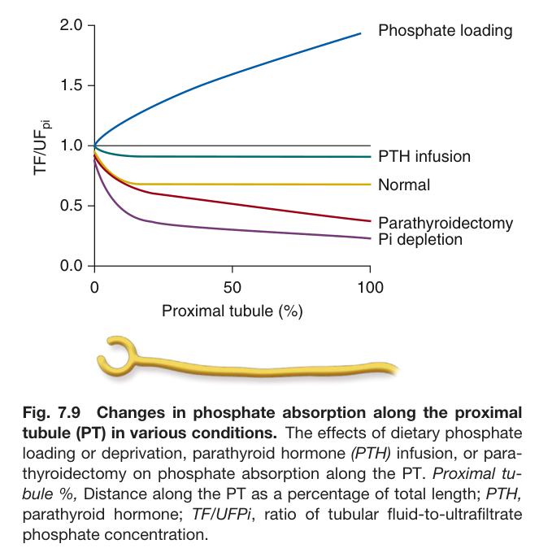

Fig. 7.9 Changes in phosphate absorption along the proximal tubule (PT) in various conditions. The effects of dietary phosphate loading or deprivation, parathyroid hormone (PTH) infusion, or para- thyroidectomy on phosphate absorption along the PT. Proximal tu- bule %, Distance along the PT as a percentage of total length; PTH, parathyroid hormone; TF/UFPi, ratio of tubular fluid-to-ultrafiltrate phosphate concentration.

---

### Fig_7_10

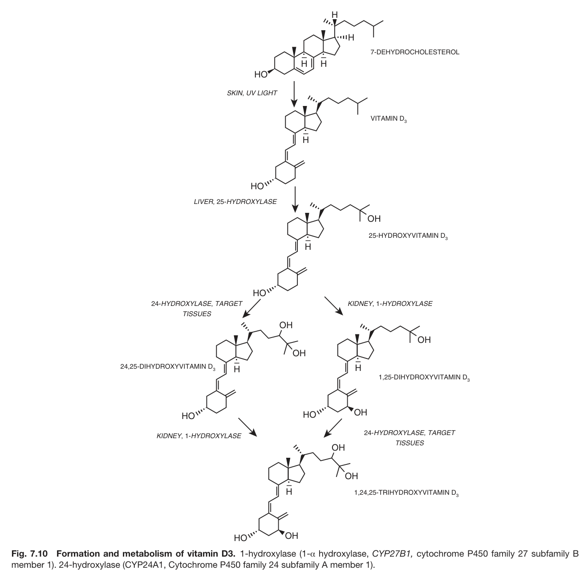

Fig. 7.10 Formation and metabolism of vitamin D3. 1-hydroxylase (1-α hydroxylase, CYP27B1, cytochrome P450 family 27 subfamily B member 1). 24-hydroxylase (CYP24A1, Cytochrome P450 family 24 subfamily A member 1).

---

### Fig_7_11

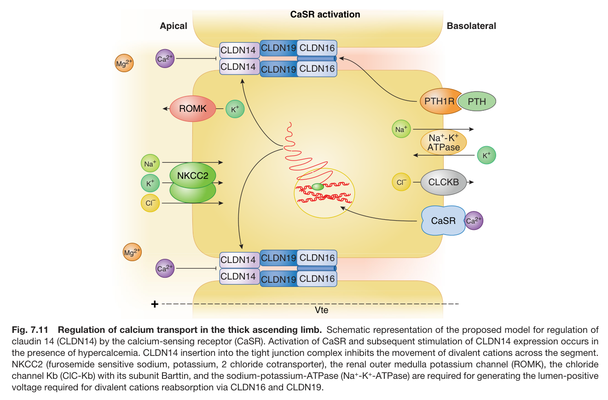

Fig. 7.11 Regulation of calcium transport in the thick ascending limb. Schematic representation of the proposed model for regulation of claudin 14 (CLDN14) by the calcium-sensing receptor (CaSR). Activation of CaSR and subsequent stimulation of CLDN14 expression occurs in the presence of hypercalcemia. CLDN14 insertion into the tight junction complex inhibits the movement of divalent cations across the segment. NKCC2 (furosemide sensitive sodium, potassium, 2 chloride cotransporter), the renal outer medulla potassium channel (ROMK), the chloride channel Kb (ClC-Kb) with its subunit Barttin, and the sodium-potassium-ATPase (Na<sup>+</sup>-K<sup>+</sup>-ATPase) are required for generating the lumen-positive voltage required for divalent cations reabsorption via CLDN16 and CLDN19.

---

## Tables

### Table_7_1

#### Table Image

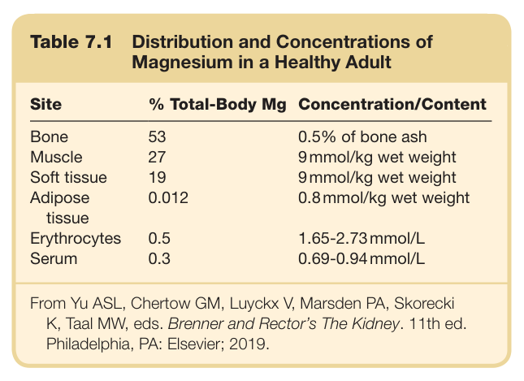

#### Table Data (CSV: [Table_7_1.csv](Table_7_1.csv))

```markdown
| Table Text (OCR) |
| :--- |
| Table 7.1  Distribution and Concentrations of Magnesium in a Healthy Adult Site  % Total-Body Mg  Concentration/Content    Bone  53  0.5% of bone ash    Muscle  27  9 mmol/kg wet weight    Soft tissue  19  9 mmol/kg wet weight    Adipose tissue  0.012  0.8 mmol/kg wet weight    Erythrocytes  0.5  1.65-2.73 mmol/L    Serum  0.3  0.69-0.94 mmol/L From Yu ASL, Chertow GM, Luyckx V, Marsden PA, Skorecki K, Taal MW, eds. Brenner and Rector’s The Kidney. 11th ed. Philadelphia, PA: Elsevier; 2019. |
```

Table 7.1 Distribution and Concentrations of Magnesium in a Healthy Adult

---

### Table_7_2

#### Table Image

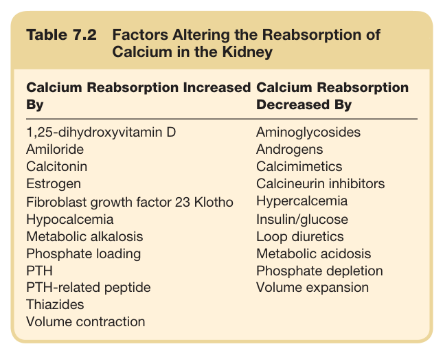

#### Table Data (CSV: [Table_7_2.csv](Table_7_2.csv))

```markdown
| Table Text (OCR) |
| :--- |
| Table 7.2 Factors Altering the Reabsorption of Calcium in the Kidney Calcium Reabsorption Increased By  Calcium Reabsorption Decreased By    1,25-dihydroxyvitamin D  Aminoglycosides    Amiloride  Androgens    Calcitonin  Calcimimetics    Estrogen  Calcineurin inhibitors    Fibroblast growth factor 23 Klotho  Hypercalcemia    Hypocalcemia  Insulin/glucose    Metabolic alkalosis  Loop diuretics    Phosphate loading  Metabolic acidosis    PTH  Phosphate depletion    PTH-related peptide  Volume expansion    Thiazides      Volume contraction |
```

Table 7.2 Factors Altering the Reabsorption of Calcium in the Kidney

---

### Table_7_3

#### Table Image

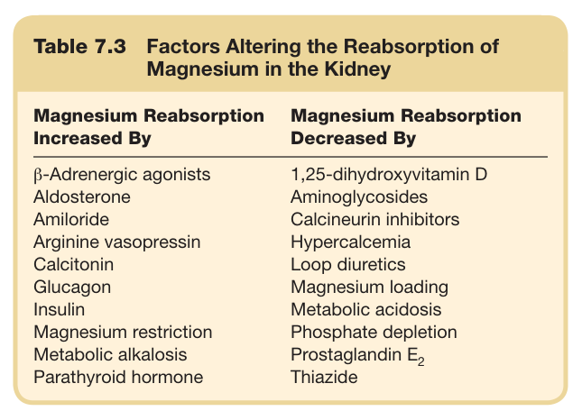

#### Table Data (CSV: [Table_7_3.csv](Table_7_3.csv))

```markdown
| Table Text (OCR) |
| :--- |
| Table 7.3  Factors Altering the Reabsorption of Magnesium in the Kidney Magnesium Reabsorption Increased By  Magnesium Reabsorption Decreased By    β-Adrenergic agonists  1,25-dihydroxyvitamin D    Aldosterone  Aminoglycosides    Amiloride  Calcineurin inhibitors    Arginine vasopressin  Hypercalcemia    Calcitonin  Loop diuretics    Glucagon  Magnesium loading    Insulin  Metabolic acidosis    Magnesium restriction  Phosphate depletion    Metabolic alkalosis  Prostaglandin  E_{2}     Parathyroid hormone  Thiazide |
```

Table 7.3 Factors Altering the Reabsorption of Magnesium in the Kidney

---

### Table_7_4

#### Table Image

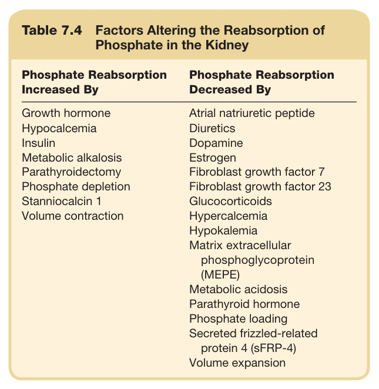

#### Table Data (CSV: [Table_7_4.csv](Table_7_4.csv))

```markdown
| Table Text (OCR) |
| :--- |
| Table 7.4 Factors Altering the Reabsorption of Phosphate in the Kidney Phosphate Reabsorption Increased By  Phosphate Reabsorption Decreased By    Growth hormone  Atrial natriuretic peptide    Hypocalcemia  Diuretics    Insulin  Dopamine    Metabolic alkalosis  Estrogen    Parathyroidectomy  Fibroblast growth factor 7    Phosphate depletion  Fibroblast growth factor 23    Stanniocalcin 1  Glucocorticoids    Volume contraction  Hypercalcemia      Hypokalemia      Matrix extracellular phosphoglycoprotein (MEPE)      Metabolic acidosis      Parathyroid hormone      Phosphate loading      Secreted frizzled-related protein 4 (sFRP-4)      Volume expansion |
```

Table 7.4 Factors Altering the Reabsorption of Phosphate in the Kidney

---
