# 08. Renal Handling of Organic Solutes - Figures and Tables Index

This document lists all figures and tables extracted from `08. Renal Handling of Organic Solutes.pdf`.

## Table of Contents
- [Figures](#figures)
- [Tables](#tables)

---

## Figures

### Fig_8_1

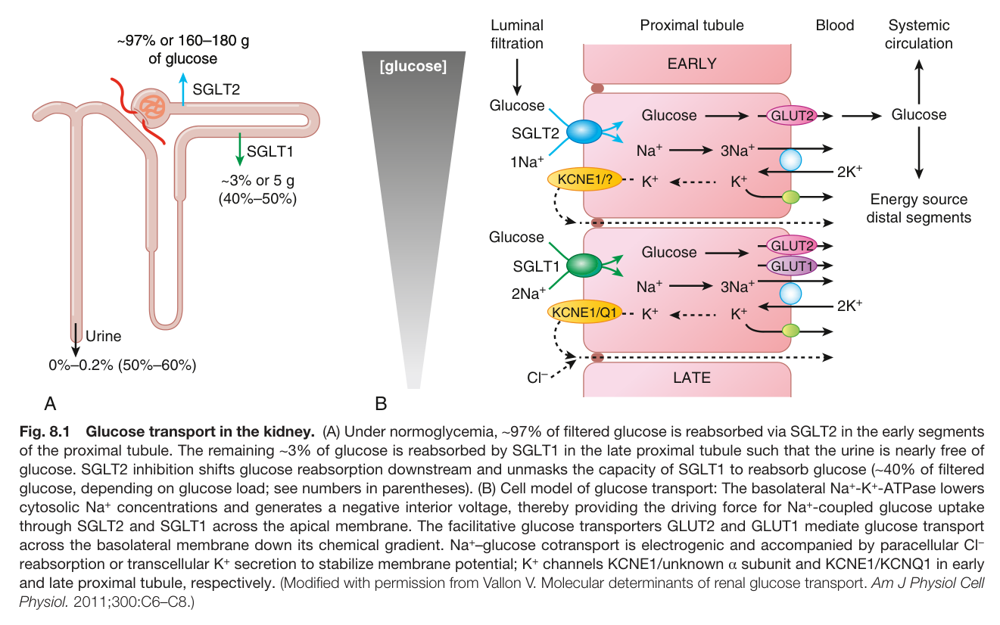

Fig. 8.1 Glucose transport in the kidney. (A) Under normoglycemia, ∼97% of filtered glucose is reabsorbed via SGLT2 in the early segments of the proximal tubule. The remaining ∼3% of glucose is reabsorbed by SGLT1 in the late proximal tubule such that the urine is nearly free of glucose. SGLT2 inhibition shifts glucose reabsorption downstream and unmasks the capacity of SGLT1 to reabsorb glucose (∼40% of filtered glucose, depending on glucose load; see numbers in parentheses). (B) Cell model of glucose transport: The basolateral Na<sup>+</sup>-K<sup>+</sup>-ATPase lowers cytosolic Na<sup>+</sup> concentrations and generates a negative interior voltage, thereby providing the driving force for Na<sup>+</sup>-coupled glucose uptake through SGLT2 and SGLT1 across the apical membrane. The facilitative glucose transporters GLUT2 and GLUT1 mediate glucose transport across the basolateral membrane down its chemical gradient. Na<sup>+</sup>–glucose cotransport is electrogenic and accompanied by paracellular Cl reabsorption or transcellular K<sup>+</sup> secretion to stabilize membrane potential; K<sup>+</sup> channels KCNE1/unknown α subunit and KCNE1/KCNQ1 in earl and late proximal tubule, respectively. (Modified with permission from Vallon V. Molecular determinants of renal glucose transport. Am J Physiol Cel Physiol. 2011;300:C6–C8.)

---

### Fig_8_2

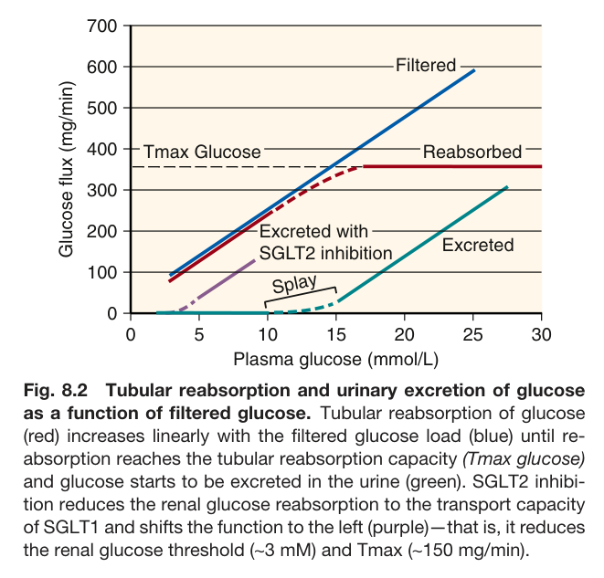

Fig. 8.2 Tubular reabsorption and urinary excretion of glucose as a function of filtered glucose. Tubular reabsorption of glucose (red) increases linearly with the filtered glucose load (blue) until re- absorption reaches the tubular reabsorption capacity (Tmax glucose) and glucose starts to be excreted in the urine (green). SGLT2 inhibi- tion reduces the renal glucose reabsorption to the transport capacity of SGLT1 and shifts the function to the left (purple)—that is, it reduces the renal glucose threshold (∼3 mM) and Tmax (∼150 mg/min).

---

### Fig_8_3

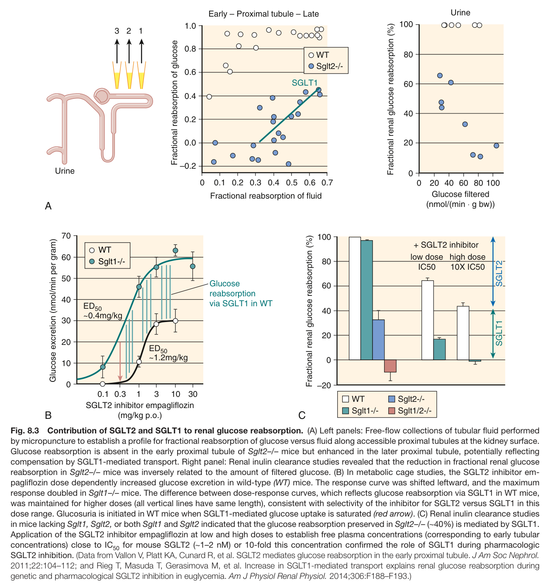

Fig. 8.3 Contribution of SGLT2 and SGLT1 to renal glucose reabsorption. (A) Left panels: Free-flow collections of tubular fluid performed by micropuncture to establish a profile for fractional reabsorption of glucose versus fluid along accessible proximal tubules at the kidney surface. Glucose reabsorption is absent in the early proximal tubule of Sglt2–/– mice but enhanced in the later proximal tubule, potentially reflecting compensation by SGLT1-mediated transport. Right panel: Renal inulin clearance studies revealed that the reduction in fractional renal glucose reabsorption in Sglt2–/– mice was inversely related to the amount of filtered glucose. (B) In metabolic cage studies, the SGLT2 inhibitor em- pagliflozin dose dependently increased glucose excretion in wild-type (WT) mice. The response curve was shifted leftward, and the maximum response doubled in Sglt1–/– mice. The difference between dose-response curves, which reflects glucose reabsorption via SGLT1 in WT mice, was maintained for higher doses (all vertical lines have same length), consistent with selectivity of the inhibitor for SGLT2 versus SGLT1 in this dose range. Glucosuria is initiated in WT mice when SGLT1-mediated glucose uptake is saturated (red arrow). (C) Renal inulin clearance studies in mice lacking Sglt1, Sglt2, or both Sglt1 and Sglt2 indicated that the glucose reabsorption preserved in Sglt2–/– (∼40%) is mediated by SGLT1. Application of the SGLT2 inhibitor empagliflozin at low and high doses to establish free plasma concentrations (corresponding to early tubular concentrations) close to IC for mouse SGLT2 (∼1–2 nM) or 10-fold this concentration confirmed the role of SGLT1 during pharmacologic SGLT2 inhibition. (Data from Vallon V, Platt KA, Cunard R, et al. SGLT2 mediates glucose reabsorption in the early proximal tubule. J Am Soc Nephrol. 2011;22:104–112; and Rieg T, Masuda T, Gerasimova M, et al. Increase in SGLT1-mediated transport explains renal glucose reabsorption during genetic and pharmacological SGLT2 inhibition in euglycemia. Am J Physiol Renal Physiol. 2014;306:F188–F193.)

---

### Fig_8_4

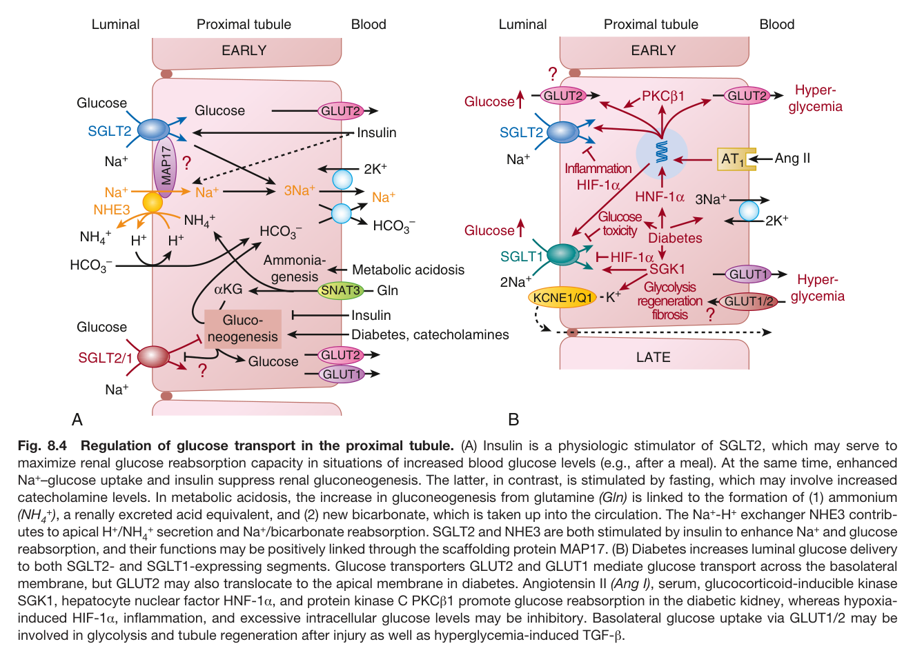

Fig. 8.4 Regulation of glucose transport in the proximal tubule. (A) Insulin is a physiologic stimulator of SGLT2, which may serve to maximize renal glucose reabsorption capacity in situations of increased blood glucose levels (e.g., after a meal). At the same time, enhanced Na<sup>+</sup>–glucose uptake and insulin suppress renal gluconeogenesis. The latter, in contrast, is stimulated by fasting, which may involve increased catecholamine levels. In metabolic acidosis, the increase in gluconeogenesis from glutamine (Gln) is linked to the formation of (1) ammonium (NH <sup>+</sup>), a renally excreted acid equivalent, and (2) new bicarbonate, which is taken up into the circulation. The Na<sup>+</sup>-H<sup>+</sup> exchanger NHE3 contrib- utes to apical H<sup>+</sup>/NH <sup>+</sup> secretion and Na<sup>+</sup>/bicarbonate reabsorption. SGLT2 and NHE3 are both stimulated by insulin to enhance Na<sup>+</sup> and glucose reabsorption, and their functions may be positively linked through the scaffolding protein MAP17. (B) Diabetes increases luminal glucose delivery to both SGLT2- and SGLT1-expressing segments. Glucose transporters GLUT2 and GLUT1 mediate glucose transport across the basolatera membrane, but GLUT2 may also translocate to the apical membrane in diabetes. Angiotensin II (Ang I), serum, glucocorticoid-inducible kinase SGK1, hepatocyte nuclear factor HNF-1α, and protein kinase C PKCβ1 promote glucose reabsorption in the diabetic kidney, whereas hypoxia- induced HIF-1α, inflammation, and excessive intracellular glucose levels may be inhibitory. Basolateral glucose uptake via GLUT1/2 may be involved in glycolysis and tubule regeneration after injury as well as hyperglycemia-induced TGF-β.

---

### Fig_8_5

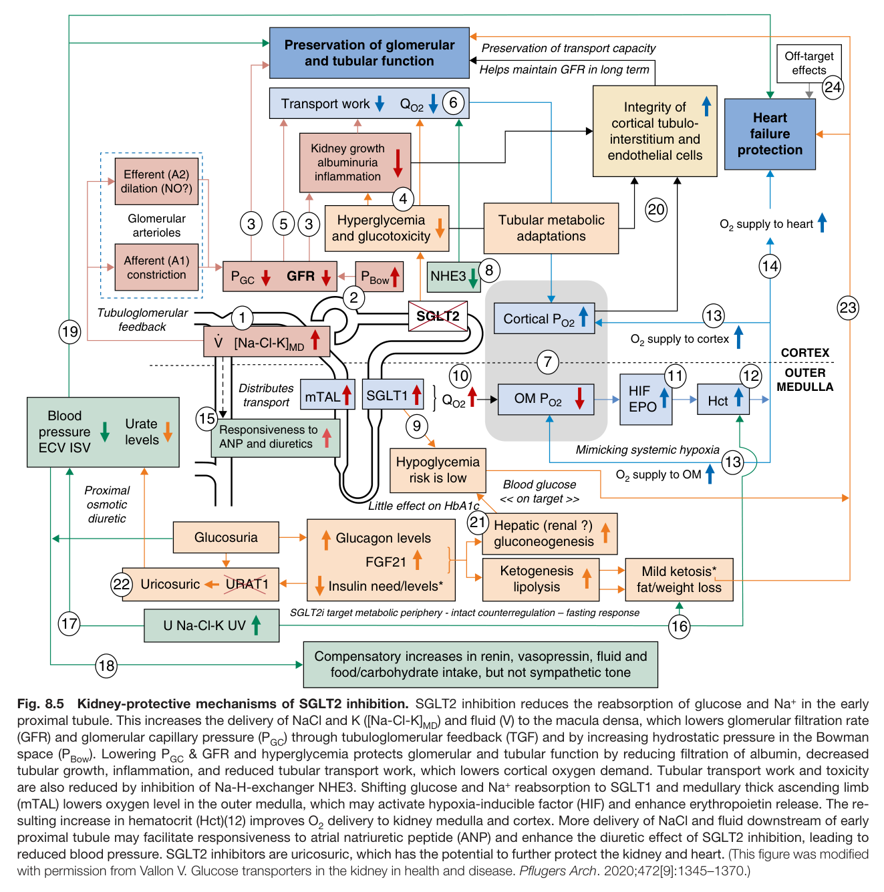

Fig. 8.5 Kidney-protective mechanisms of SGLT2 inhibition. SGLT2 inhibition reduces the reabsorption of glucose and Na<sup>+</sup> in the early proximal tubule. This increases the delivery of NaCl and K ([Na-Cl-K]<sub>MD</sub>) and fluid (V) to the macula densa, which lowers glomerular filtration rate (GFR) and glomerular capillary pressure (P ) through tubuloglomerular feedback (TGF) and by increasing hydrostatic pressure in the Bowman space (P ). Lowering P & GFR and hyperglycemia protects glomerular and tubular function by reducing filtration of albumin, decreased tubular growth, inflammation, and reduced tubular transport work, which lowers cortical oxygen demand. Tubular transport work and toxicity are also reduced by inhibition of Na-H-exchanger NHE3. Shifting glucose and Na<sup>+</sup> reabsorption to SGLT1 and medullary thick ascending limb (mTAL) lowers oxygen level in the outer medulla, which may activate hypoxia-inducible factor (HIF) and enhance erythropoietin release. The re- sulting increase in hematocrit (Hct)(12) improves O delivery to kidney medulla and cortex. More delivery of NaCl and fluid downstream of early proximal tubule may facilitate responsiveness to atrial natriuretic peptide (ANP) and enhance the diuretic effect of SGLT2 inhibition, leading to reduced blood pressure. SGLT2 inhibitors are uricosuric, which has the potential to further protect the kidney and heart. (This figure was modified with permission from Vallon V. Glucose transporters in the kidney in health and disease. Pflugers Arch. 2020;472[9]:1345–1370.)

---

### Fig_8_6

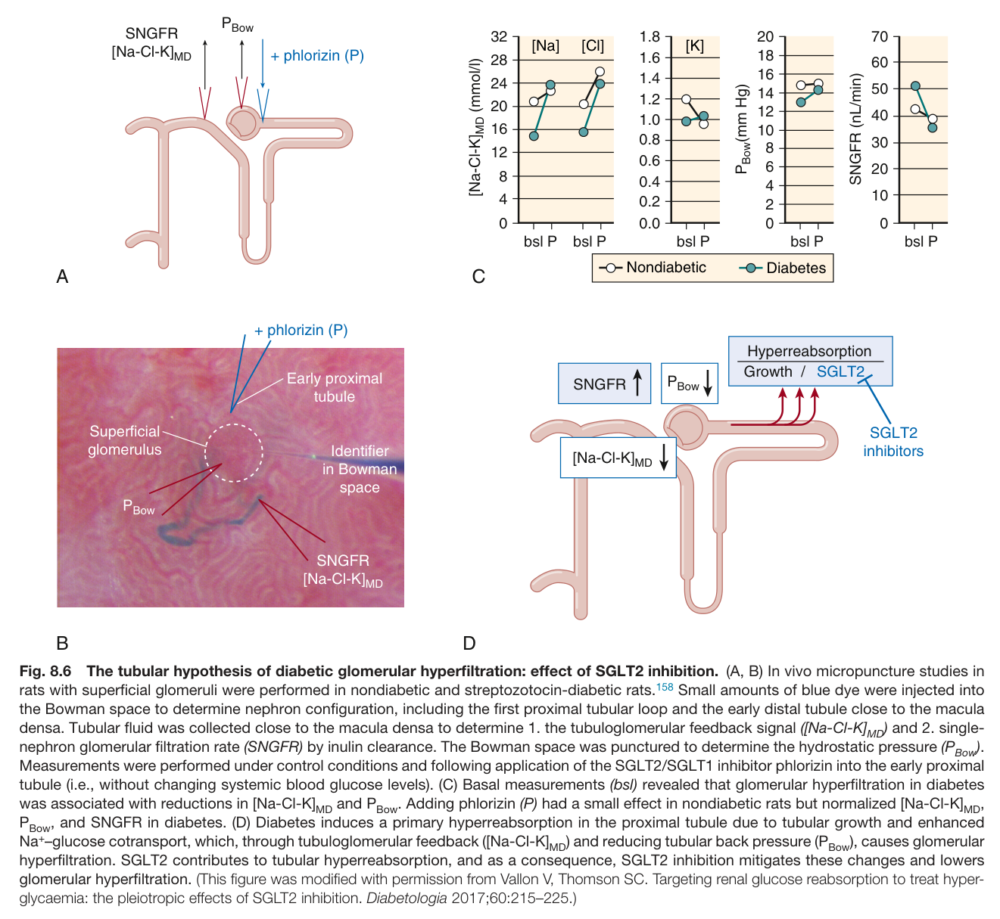

Fig. 8.6 The tubular hypothesis of diabetic glomerular hyperfiltration: effect of SGLT2 inhibition. (A, B) In vivo micropuncture studies in rats with superficial glomeruli were performed in nondiabetic and streptozotocin-diabetic rats.<sup>158</sup> Small amounts of blue dye were injected into the Bowman space to determine nephron configuration, including the first proximal tubular loop and the early distal tubule close to the macula densa. Tubular fluid was collected close to the macula densa to determine 1. the tubuloglomerular feedback signal ([Na-Cl-K] ) and 2. single- nephron glomerular filtration rate (SNGFR) by inulin clearance. The Bowman space was punctured to determine the hydrostatic pressure (P<sub>Bow</sub>). Measurements were performed under control conditions and following application of the SGLT2/SGLT1 inhibitor phlorizin into the early proxima tubule (i.e., without changing systemic blood glucose levels). (C) Basal measurements (bsl) revealed that glomerular hyperfiltration in diabetes was associated with reductions in [Na-Cl-K]<sub>MD</sub> and P<sub>Bow</sub>. Adding phlorizin (P) had a small effect in nondiabetic rats but normalized [Na-Cl-K]<sub>MD</sub>, P<sub>Bow</sub>, and SNGFR in diabetes. (D) Diabetes induces a primary hyperreabsorption in the proximal tubule due to tubular growth and enhanced Na<sup>+</sup>–glucose cotransport, which, through tubuloglomerular feedback ([Na-Cl-K] ) and reducing tubular back pressure (P ), causes glomerular hyperfiltration. SGLT2 contributes to tubular hyperreabsorption, and as a consequence, SGLT2 inhibition mitigates these changes and lowers glomerular hyperfiltration. (This figure was modified with permission from Vallon V, Thomson SC. Targeting renal glucose reabsorption to treat hyper- glycaemia: the pleiotropic effects of SGLT2 inhibition. Diabetologia 2017;60:215–225.)

---

### Fig_8_7

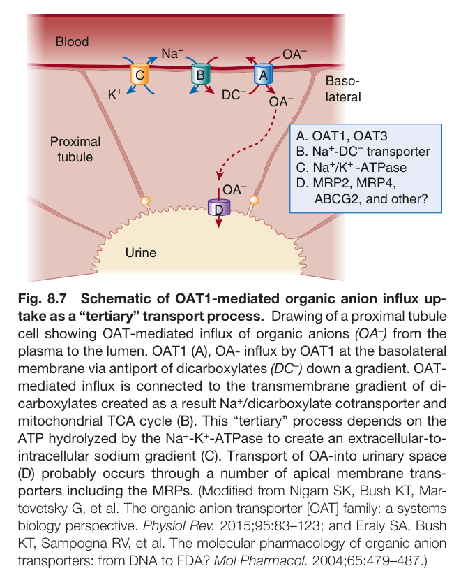

Fig. 8.7 Schematic of OAT1-mediated organic anion influx up- take as a “tertiary” transport process. Drawing of a proximal tubule cell showing OAT-mediated influx of organic anions (OA<sup>–</sup>) from the plasma to the lumen. OAT1 (A), OA- influx by OAT1 at the basolateral membrane via antiport of dicarboxylates (DC<sup>–</sup>) down a gradient. OAT- mediated influx is connected to the transmembrane gradient of di- carboxylates created as a result Na<sup>+</sup>/dicarboxylate cotransporter and mitochondrial TCA cycle (B). This “tertiary” process depends on the ATP hydrolyzed by the Na<sup>+</sup>-K<sup>+</sup>-ATPase to create an extracellular-to- intracellular sodium gradient (C). Transport of OA-into urinary space (D) probably occurs through a number of apical membrane trans- porters including the MRPs. (Modified from Nigam SK, Bush KT, Mar- tovetsky G, et al. The organic anion transporter [OAT] family: a systems biology perspective. Physiol Rev. 2015;95:83–123; and Eraly SA, Bush KT, Sampogna RV, et al. The molecular pharmacology of organic anion transporters: from DNA to FDA? Mol Pharmacol. 2004;65:479–487.)

---

### Fig_8_8

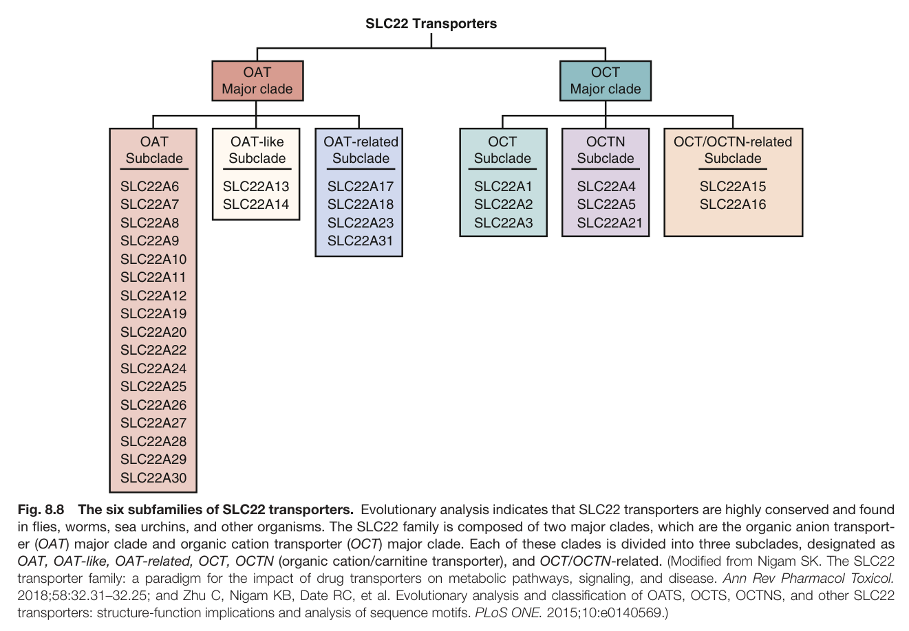

Fig. 8.8 The six subfamilies of SLC22 transporters. Evolutionary analysis indicates that SLC22 transporters are highly conserved and found in flies, worms, sea urchins, and other organisms. The SLC22 family is composed of two major clades, which are the organic anion transport- er (OAT) major clade and organic cation transporter (OCT) major clade. Each of these clades is divided into three subclades, designated as OAT, OAT-like, OAT-related, OCT, OCTN (organic cation/carnitine transporter), and OCT/OCTN-related. (Modified from Nigam SK. The SLC22 transporter family: a paradigm for the impact of drug transporters on metabolic pathways, signaling, and disease. Ann Rev Pharmacol Toxicol. 2018;58:32.31–32.25; and Zhu C, Nigam KB, Date RC, et al. Evolutionary analysis and classification of OATS, OCTS, OCTNS, and other SLC22 transporters: structure-function implications and analysis of sequence motifs. PLoS ONE. 2015;10:e0140569.)

---

### Fig_8_9

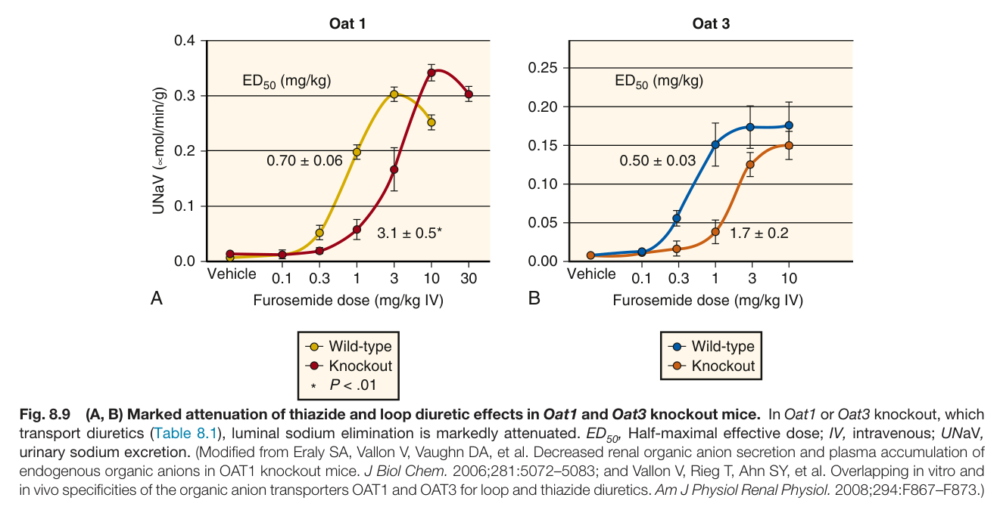

Fig. 8.9 (A, B) Marked attenuation of thiazide and loop diuretic effects in Oat1 and Oat3 knockout mice. In Oat1 or Oat3 knockout, which transport diuretics (Table 8.1), luminal sodium elimination is markedly attenuated. ED , Half-maximal effective dose; IV, intravenous; UNaV, urinary sodium excretion. (Modified from Eraly SA, Vallon V, Vaughn DA, et al. Decreased renal organic anion secretion and plasma accumulation of endogenous organic anions in OAT1 knockout mice. J Biol Chem. 2006;281:5072–5083; and Vallon V, Rieg T, Ahn SY, et al. Overlapping in vitro and in vivo specificities of the organic anion transporters OAT1 and OAT3 for loop and thiazide diuretics. Am J Physiol Renal Physiol. 2008;294:F867–F873.)

---

### Fig_8_10

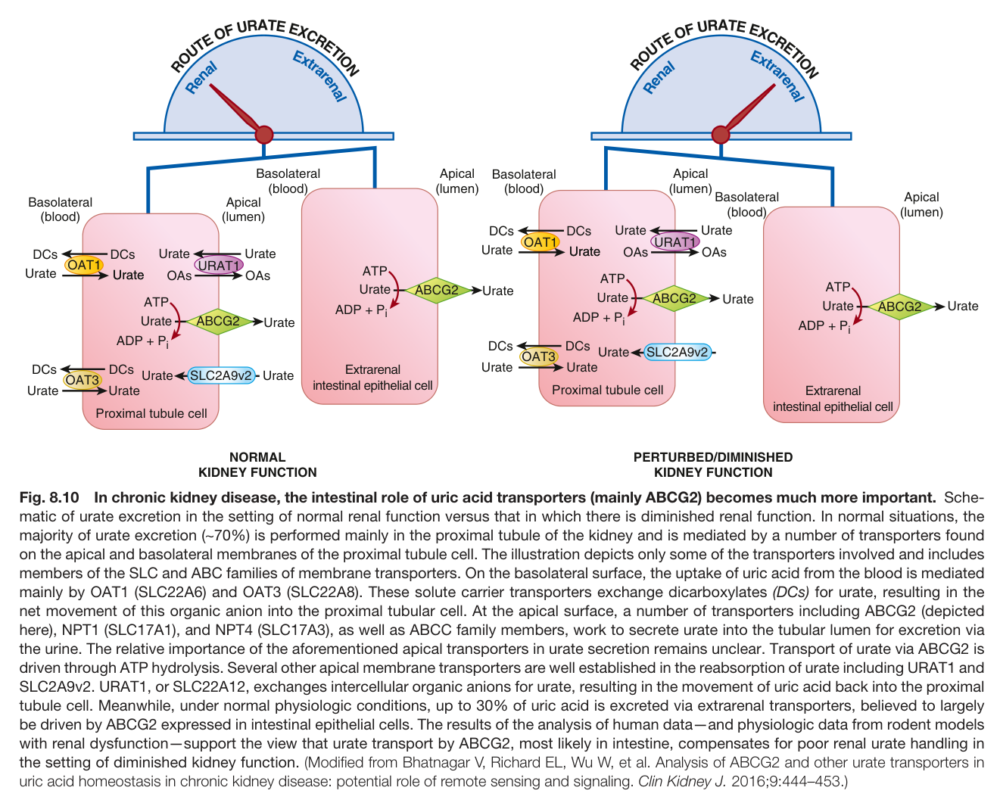

Fig. 8.10 In chronic kidney disease, the intestinal role of uric acid transporters (mainly ABCG2) becomes much more important. Sche- matic of urate excretion in the setting of normal renal function versus that in which there is diminished renal function. In normal situations, the majority of urate excretion (∼70%) is performed mainly in the proximal tubule of the kidney and is mediated by a number of transporters found on the apical and basolateral membranes of the proximal tubule cell. The illustration depicts only some of the transporters involved and includes members of the SLC and ABC families of membrane transporters. On the basolateral surface, the uptake of uric acid from the blood is mediated mainly by OAT1 (SLC22A6) and OAT3 (SLC22A8). These solute carrier transporters exchange dicarboxylates (DCs) for urate, resulting in the net movement of this organic anion into the proximal tubular cell. At the apical surface, a number of transporters including ABCG2 (depicted here), NPT1 (SLC17A1), and NPT4 (SLC17A3), as well as ABCC family members, work to secrete urate into the tubular lumen for excretion via the urine. The relative importance of the aforementioned apical transporters in urate secretion remains unclear. Transport of urate via ABCG2 is driven through ATP hydrolysis. Several other apical membrane transporters are well established in the reabsorption of urate including URAT1 and SLC2A9v2. URAT1, or SLC22A12, exchanges intercellular organic anions for urate, resulting in the movement of uric acid back into the proxima tubule cell. Meanwhile, under normal physiologic conditions, up to 30% of uric acid is excreted via extrarenal transporters, believed to largely be driven by ABCG2 expressed in intestinal epithelial cells. The results of the analysis of human data—and physiologic data from rodent models with renal dysfunction—support the view that urate transport by ABCG2, most likely in intestine, compensates for poor renal urate handling in the setting of diminished kidney function. (Modified from Bhatnagar V, Richard EL, Wu W, et al. Analysis of ABCG2 and other urate transporters in uric acid homeostasis in chronic kidney disease: potential role of remote sensing and signaling. Clin Kidney J. 2016;9:444–453.)

---

### Fig_8_11

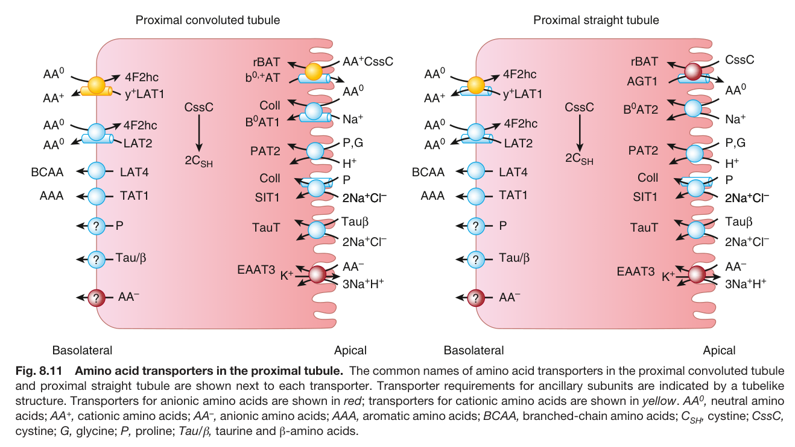

Fig. 8.11 Amino acid transporters in the proximal tubule. The common names of amino acid transporters in the proximal convoluted tubule and proximal straight tubule are shown next to each transporter. Transporter requirements for ancillary subunits are indicated by a tubelike structure. Transporters for anionic amino acids are shown in red; transporters for cationic amino acids are shown in yellow. AA<sup>0</sup>, neutral amino acids; AA<sup>+</sup>, cationic amino acids; AA<sup>–</sup>, anionic amino acids; AAA, aromatic amino acids; BCAA, branched-chain amino acids; C , cystine; CssC, cystine; G, glycine; P, proline; Tau/β, taurine and β-amino acids.

---

## Tables

### Table_8_1

#### Table Image

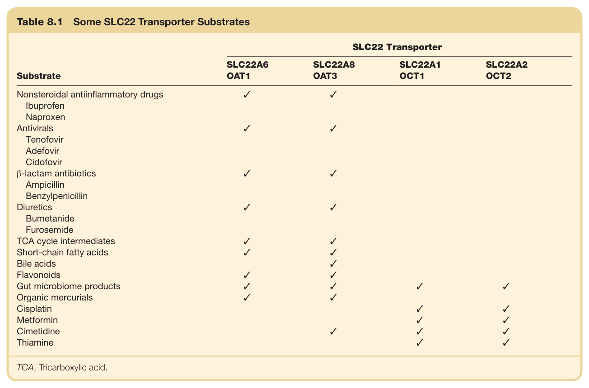

#### Table Data (CSV: [Table_8_1.csv](Table_8_1.csv))

```markdown
| Table Text (OCR) |
| :--- |
| Table 8.1  Some SLC22 Transporter Substrates Substrate  SLC22 Transporter    SLC22A6OAT1  SLC22A8OAT3  SLC22A1OCT1  SLC22A2OCT2    Nonsteroidal antiinflammatory drugs  ✓  ✓        Ibuprofen            Naproxen            Antivirals  ✓  ✓        Tenofovir            Adefovir            Cidofovir            β-lactam antibiotics  ✓  ✓        Ampicillin            Benzylpenicillin            Diuretics  ✓  ✓        Bumetanide            Furosemide            TCA cycle intermediates  ✓  ✓        Short-chain fatty acids  ✓  ✓        Bile acids    ✓        Flavonoids  ✓  ✓        Gut microbiome products  ✓  ✓  ✓  ✓    Organic mercurials  ✓  ✓        Cisplatin      ✓  ✓    Metformin      ✓  ✓    Cimetidine    ✓  ✓  ✓    Thiamine      ✓  ✓ TCA, Tricarboxylic acid. |
```

Table 8.1 Some SLC22 Transporter Substrates

---

### Table_8_2

#### Table Image

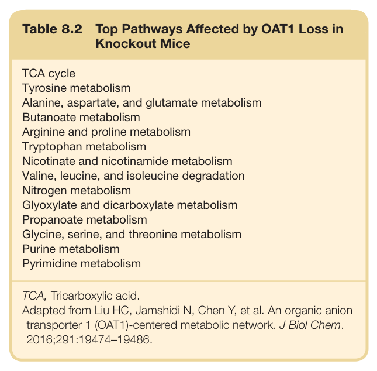

#### Table Data (CSV: [Table_8_2.csv](Table_8_2.csv))

```markdown
| Table Text (OCR) |
| :--- |
| Table 8.2  Top Pathways Affected by OAT1 Loss in Knockout Mice TCA cycle    Tyrosine metabolism    Alanine, aspartate, and glutamate metabolism    Butanoate metabolism    Arginine and proline metabolism    Tryptophan metabolism    Nicotinate and nicotinamide metabolism    Valine, leucine, and isoleucine degradation    Nitrogen metabolism    Glyoxylate and dicarboxylate metabolism    Propanoate metabolism    Glycine, serine, and threonine metabolism    Purine metabolism    Pyrimidine metabolism |
```

Table 8.2 Top Pathways Affected by OAT1 Loss in Knockout Mice

---

### Table_8_3

#### Table Image

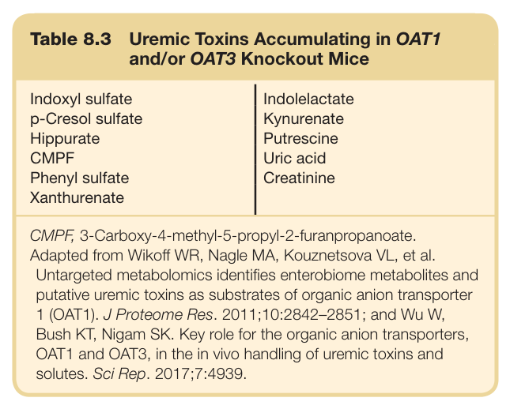

#### Table Data (CSV: [Table_8_3.csv](Table_8_3.csv))

```markdown
| Table Text (OCR) |
| :--- |
| Table 8.3  Uremic Toxins Accumulating in OAT1 and/or OAT3 Knockout Mice Indoxyl sulfate  Indolelactate    p-Cresol sulfate  Kynurenate    Hippurate  Putrescine    CMPF  Uric acid    Phenyl sulfate  Creatinine    Xanthurenate |
```

Table 8.3 Uremic Toxins Accumulating in OAT1 and/or OAT3 Knockout Mice

---

### Table_8_4

#### Table Image

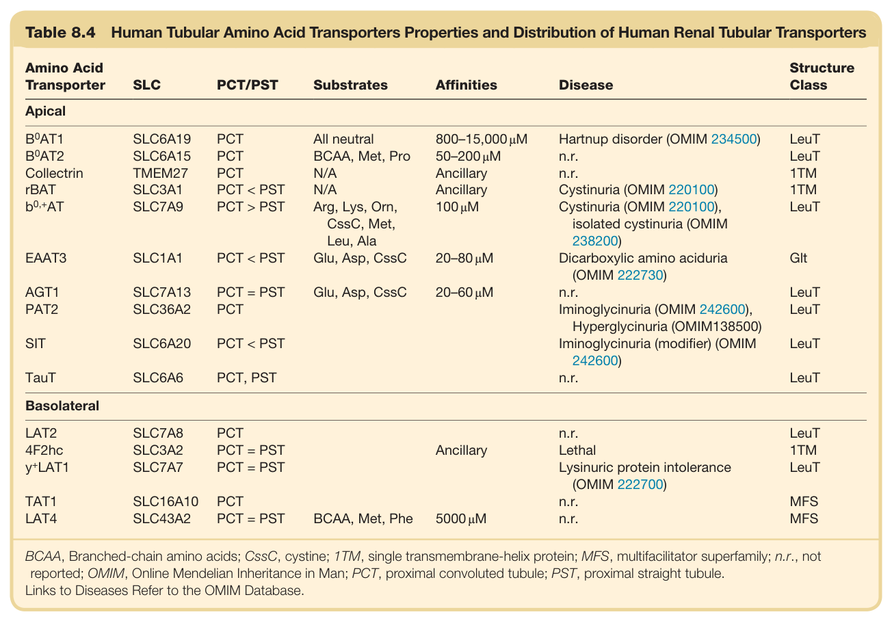

#### Table Data (CSV: [Table_8_4.csv](Table_8_4.csv))

```markdown
| Table Text (OCR) |
| :--- |
| Table 8.4 Human Tubular Amino Acid Transporters Properties and Distribution of Human Renal Tubular Transporters Amino Acid Transporter  SLC  PCT/PST  Substrates  Affinities  Disease  Structure Class    Apical     B^0AT1   SLC6A19  PCT  All neutral  800-15,000 μM  Hartnup disorder (OMIM 234500)  LeuT     B^0AT2   SLC6A15  PCT  BCAA, Met, Pro  50-200 μM  n.r.  LeuT    Collectrin  TMEM27  PCT  N/A  Ancillary  n.r.  1TM    rBAT  SLC3A1  PCT < PST  N/A  Ancillary  Cystinuria (OMIM 220100)  1TM     b^{0,+}AT   SLC7A9  PCT > PST  Arg, Lys, Orn, CssC, Met, Leu, Ala  100 μM  Cystinuria (OMIM 220100), isolated cystinuria (OMIM 238200)  LeuT    EAAT3  SLC1A1  PCT < PST  Glu, Asp, CssC  20-80 μM  Dicarboxylic amino aciduria (OMIM 222730)  Glt    AGT1  SLC7A13  PCT = PST  Glu, Asp, CssC  20-60 μM  n.r.  LeuT    PAT2  SLC36A2  PCT      Iminoglycinuria (OMIM 242600), Hyperglycinuria (OMIM138500)  LeuT    SIT  SLC6A20  PCT < PST      Iminoglycinuria (modifier) (OMIM 242600)  LeuT    TauT  SLC6A6  PCT, PST      n.r.  LeuT    Basolateral    LAT2  SLC7A8  PCT      n.r.  LeuT    4F2hc  SLC3A2  PCT = PST    Ancillary  Lethal  1TM     y^+LAT1   SLC7A7  PCT = PST      Lysinuric protein intolerance (OMIM 222700)  LeuT    TAT1  SLC16A10  PCT      n.r.  MFS    LAT4  SLC43A2  PCT = PST  BCAA, Met, Phe  5000 μM  n.r.  MFS BCAA, Branched-chain amino acids; CssC, cystine; 1TM, single transmembrane-helix protein; MFS, multifacilitator superfamily; n.r., not reported; OMIM, Online Mendelian Inheritance in Man; PCT, proximal convoluted tubule; PST, proximal straight tubule. Links to Diseases Refer to the OMIM Database. |
```

Table 8.4 Human Tubular Amino Acid Transporters Properties and Distribution of Human Renal Tubular Transporters

---

### Table_8_5

#### Table Image

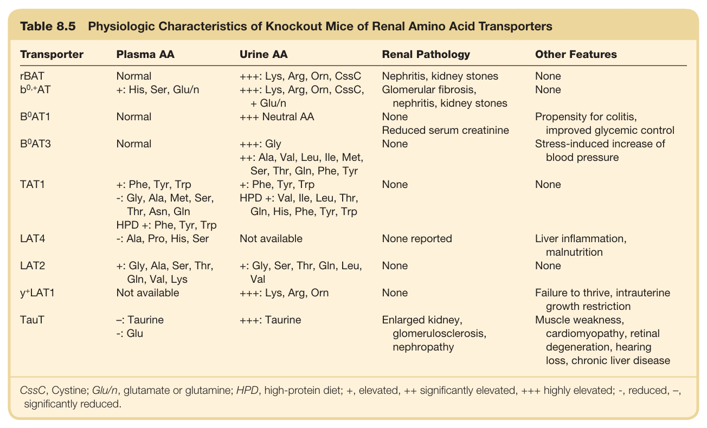

#### Table Data (CSV: [Table_8_5.csv](Table_8_5.csv))

```markdown
| Table Text (OCR) |
| :--- |
| Table 8.5 Physiologic Characteristics of Knockout Mice of Renal Amino Acid Transporters Transporter  Plasma AA  Urine AA  Renal Pathology  Other Features    rBAT  Normal  +++: Lys, Arg, Orn, CssC  Nephritis, kidney stones  None     b^{0,+}AT   +: His, Ser, Glu/n  +++: Lys, Arg, Orn, CssC, + Glu/n  Glomerular fibrosis, nephritis, kidney stones  None     B^{0}AT1   Normal  +++ Neutral AA  None  Propensity for colitis, improved glycemic control     B^{0}AT3   Normal  +++: Gly  Reduced serum creatinine  Stress-induced increase of blood pressure    ++: Ala, Val, Leu, Ile, Met, Ser, Thr, Gln, Phe, Tyr  None    TAT1  +: Phe, Tyr, Trp  +: Phe, Tyr, Trp  None  None    -: Gly, Ala, Met, Ser, Thr, Asn, Gln  HPD +: Val, Ile, Leu, Thr, Gln, His, Phe, Tyr, Trp        HPD +: Phe, Tyr, Trp          LAT4  -: Ala, Pro, His, Ser  Not available  None reported  Liver inflammation, malnutrition    LAT2  +: Gly, Ala, Ser, Thr, Gln, Val, Lys  +: Gly, Ser, Thr, Gln, Leu, Val  None  None     y^{+}LAT1   Not available  +++: Lys, Arg, Orn  None  Failure to thrive, intrauterine growth restriction    TauT  -: Taurine  +++: Taurine  Enlarged kidney, glomerulosclerosis, nephropathy  Muscle weakness, cardiomyopathy, retinal degeneration, hearing loss, chronic liver disease    -: Glu CssC, Cystine; Glu/n, glutamate or glutamine; HPD, high-protein diet; +, elevated, ++ significantly elevated, +++ highly elevated; -, reduced, –, significantly reduced. |
```

Table 8.5 Physiologic Characteristics of Knockout Mice of Renal Amino Acid Transporters

---
