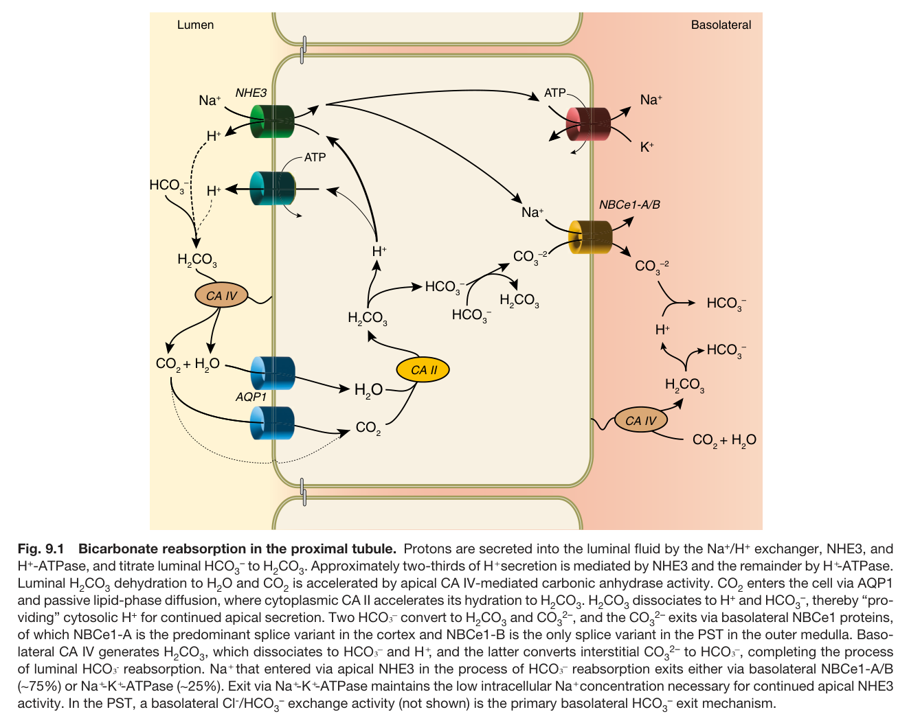
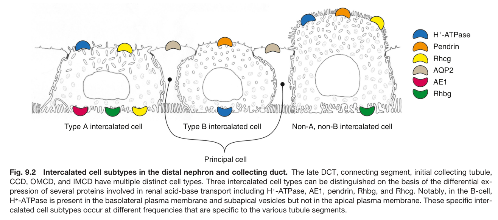
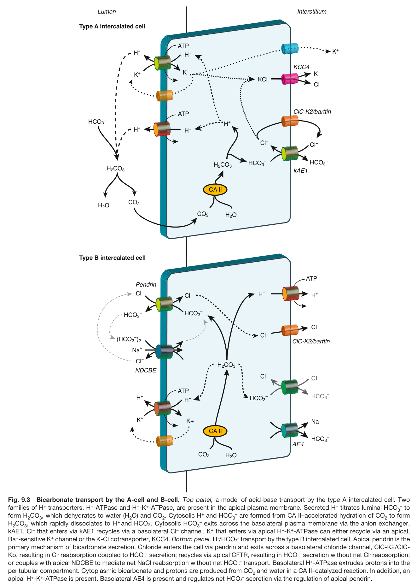
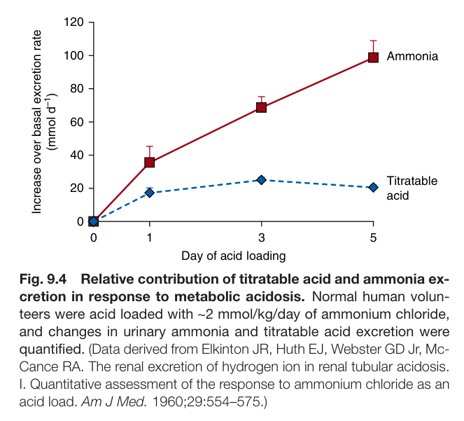
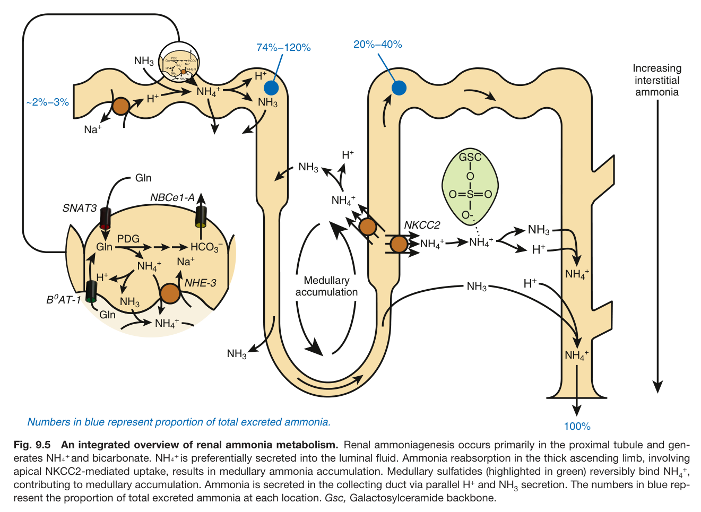
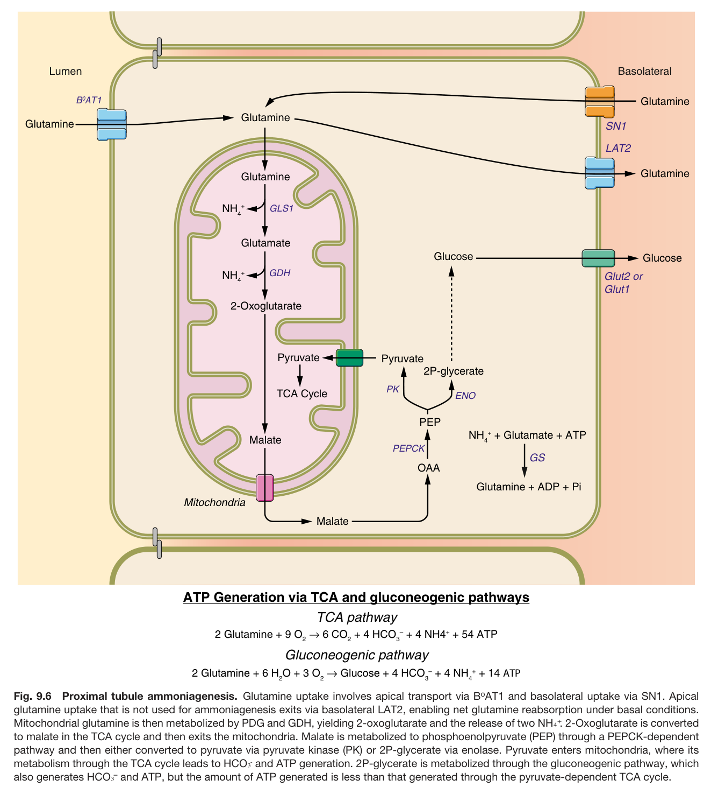
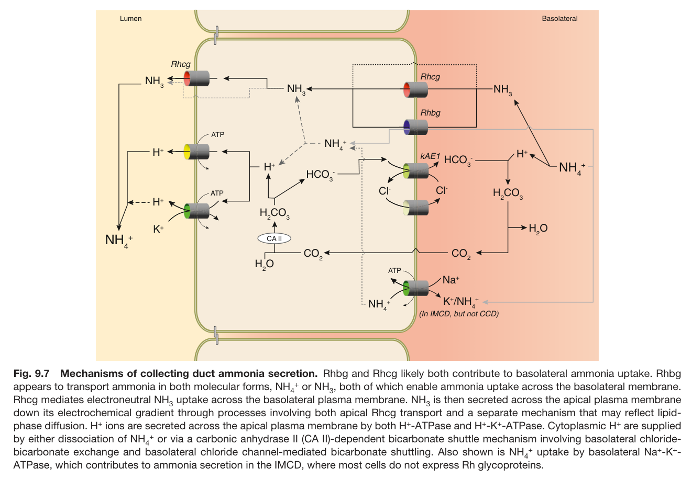

# 09. Renal Acidification Mechanisms - Figures and Tables Index

This document lists all figures and tables extracted from `09. Renal Acidification Mechanisms.pdf`.

## Table of Contents
- [Figures](#figures)
- [Tables](#tables)

---

## Figures

### Fig_9_1

Fig. 9.1 Bicarbonate reabsorption in the proximal tubule. Protons are secreted into the luminal fluid by the Na+/H+ exchanger, NHE3, and H+-ATPase, and titrate luminal HCO – to H CO . Approximately two-thirds of H⁺ secretion is mediated by NHE3 and the remainder by H⁺-ATPase. Luminal H CO dehydration to H O and CO is accelerated by apical CA IV-mediated carbonic anhydrase activity. CO enters the cell via AQP1 and passive lipid-phase diffusion, where cytoplasmic CA II accelerates its hydration to H CO . H CO dissociates to H+ and HCO –, thereby “pro- viding” cytosolic H+ for continued apical secretion. Two HCO₃– convert to H CO and CO 2–, and the CO 2– exits via basolateral NBCe1 proteins, of which NBCe1-A is the predominant splice variant in the cortex and NBCe1-B is the only splice variant in the PST in the outer medulla. Baso- lateral CA IV generates H CO , which dissociates to HCO₃– and H⁺, and the latter converts interstitial CO 2– to HCO₃–, completing the process of luminal HCO₃⁻ reabsorption. Na⁺ that entered via apical NHE3 in the process of HCO₃– reabsorption exits either via basolateral NBCe1-A/B (∼75%) or Na⁺-K⁺-ATPase (∼25%). Exit via Na⁺-K⁺-ATPase maintains the low intracellular Na⁺ concentration necessary for continued apical NHE3 activity. In the PST, a basolateral Cl-/HCO – exchange activity (not shown) is the primary basolateral HCO – exit mechanism.

---

### Fig_9_2

Fig. 9.2 Intercalated cell subtypes in the distal nephron and collecting duct. The late DCT, connecting segment, initial collecting tubule, CCD, OMCD, and IMCD have multiple distinct cell types. Three intercalated cell types can be distinguished on the basis of the differential ex- pression of several proteins involved in renal acid-base transport including H+-ATPase, AE1, pendrin, Rhbg, and Rhcg. Notably, in the B-cell, H+-ATPase is present in the basolateral plasma membrane and subapical vesicles but not in the apical plasma membrane. These specific inter- calated cell subtypes occur at different frequencies that are specific to the various tubule segments.

---

### Fig_9_3

Fig. 9.3 Bicarbonate transport by the A-cell and B-cell. Top panel, a model of acid-base transport by the type A intercalated cell. Two families of H+ transporters, H+-ATPase and H+-K+-ATPase, are present in the apical plasma membrane. Secreted H+ titrates luminal HCO – to form H CO , which dehydrates to water (H O) and CO . Cytosolic H+ and HCO – are formed from CA II–accelerated hydration of CO to form H CO , which rapidly dissociates to H⁺ and HCO₃⁻. Cytosolic HCO – exits across the basolateral plasma membrane via the anion exchanger, kAE1. Cl– that enters via kAE1 recycles via a basolateral Cl– channel. K+ that enters via apical H+-K+-ATPase can either recycle via an apical, Ba+-sensitive K+ channel or the K-Cl cotransporter, KCC4. Bottom panel, H⁺/HCO₃– transport by the type B intercalated cell. Apical pendrin is the primary mechanism of bicarbonate secretion. Chloride enters the cell via pendrin and exits across a basolateral chloride channel, ClC-K2/ClC- Kb, resulting in Cl⁻ reabsorption coupled to HCO₃– secretion; recycles via apical CFTR, resulting in HCO₃– secretion without net Cl⁻ reabsorption; or couples with apical NDCBE to mediate net NaCl reabsorption without net HCO₃– transport. Basolateral H+-ATPase extrudes protons into the peritubular compartment. Cytoplasmic bicarbonate and protons are produced from CO and water in a CA II–catalyzed reaction. In addition, an apical H+-K+-ATPase is present. Basolateral AE4 is present and regulates net HCO₃– secretion via the regulation of apical pendrin.

---

### Fig_9_4

Fig. 9.4 Relative contribution of titratable acid and ammonia ex- cretion in response to metabolic acidosis. Normal human volun- teers were acid loaded with ∼2 mmol/kg/day of ammonium chloride, and changes in urinary ammonia and titratable acid excretion were quantified. (Data derived from Elkinton JR, Huth EJ, Webster GD Jr, Mc- Cance RA. The renal excretion of hydrogen ion in renal tubular acidosis. I. Quantitative assessment of the response to ammonium chloride as an acid load. Am J Med. 1960;29:554–575.)

---

### Fig_9_5

Fig. 9.5 An integrated overview of renal ammonia metabolism. Renal ammoniagenesis occurs primarily in the proximal tubule and gen- erates NH₄⁺ and bicarbonate. NH₄⁺ is preferentially secreted into the luminal fluid. Ammonia reabsorption in the thick ascending limb, involving apical NKCC2-mediated uptake, results in medullary ammonia accumulation. Medullary sulfatides (highlighted in green) reversibly bind NH +, contributing to medullary accumulation. Ammonia is secreted in the collecting duct via parallel H+ and NH secretion. The numbers in blue rep- resent the proportion of total excreted ammonia at each location. Gsc, Galactosylceramide backbone.

---

### Fig_9_6

Fig. 9.6 Proximal tubule ammoniagenesis. Glutamine uptake involves apical transport via BoAT1 and basolateral uptake via SN1. Apica glutamine uptake that is not used for ammoniagenesis exits via basolateral LAT2, enabling net glutamine reabsorption under basal conditions. Mitochondrial glutamine is then metabolized by PDG and GDH, yielding 2-oxoglutarate and the release of two NH₄⁺. 2-Oxoglutarate is converted to malate in the TCA cycle and then exits the mitochondria. Malate is metabolized to phosphoenolpyruvate (PEP) through a PEPCK-dependent pathway and then either converted to pyruvate via pyruvate kinase (PK) or 2P-glycerate via enolase. Pyruvate enters mitochondria, where its metabolism through the TCA cycle leads to HCO₃⁻ and ATP generation. 2P-glycerate is metabolized through the gluconeogenic pathway, which also generates HCO₃– and ATP, but the amount of ATP generated is less than that generated through the pyruvate-dependent TCA cycle.

---

### Fig_9_7

Fig. 9.7 Mechanisms of collecting duct ammonia secretion. Rhbg and Rhcg likely both contribute to basolateral ammonia uptake. Rhbg appears to transport ammonia in both molecular forms, NH + or NH , both of which enable ammonia uptake across the basolateral membrane. Rhcg mediates electroneutral NH uptake across the basolateral plasma membrane. NH is then secreted across the apical plasma membrane down its electrochemical gradient through processes involving both apical Rhcg transport and a separate mechanism that may reflect lipid phase diffusion. H+ ions are secreted across the apical plasma membrane by both H+-ATPase and H+-K+-ATPase. Cytoplasmic H+ are supplied by either dissociation of NH + or via a carbonic anhydrase II (CA II)-dependent bicarbonate shuttle mechanism involving basolateral chloride- bicarbonate exchange and basolateral chloride channel-mediated bicarbonate shuttling. Also shown is NH + uptake by basolateral Na+-K+- ATPase, which contributes to ammonia secretion in the IMCD, where most cells do not express Rh glycoproteins.

---

## Tables

*No tables resolved for this chapter.*
