# 10. Urine Concentration and Dilution - Figures and Tables Index

This document lists all figures and tables extracted from `10. Urine Concentration and Dilution.pdf`.

## Table of Contents
- [Figures](#figures)
- [Tables](#tables)

---

## Figures

### Fig_10_1

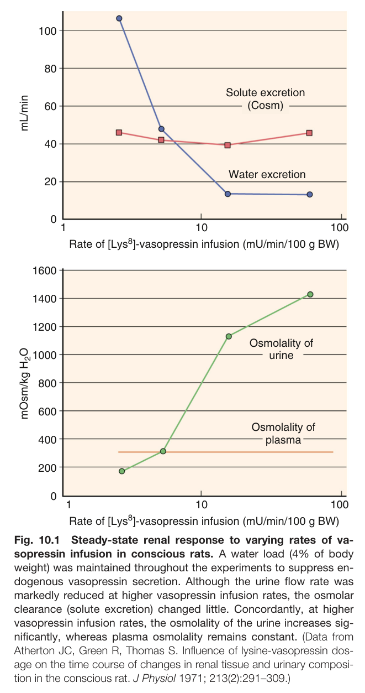

Fig. 10.1 Steady-state renal response to varying rates of va- sopressin infusion in conscious rats. A water load (4% of body weight) was maintained throughout the experiments to suppress en- dogenous vasopressin secretion. Although the urine flow rate was markedly reduced at higher vasopressin infusion rates, the osmolar clearance (solute excretion) changed little. Concordantly, at higher vasopressin infusion rates, the osmolality of the urine increases sig- nificantly, whereas plasma osmolality remains constant. (Data from Atherton JC, Green R, Thomas S. Influence of lysine-vasopressin dos- age on the time course of changes in renal tissue and urinary composi- tion in the conscious rat. J Physiol 1971; 213(2):291–309.)

---

### Fig_10_2

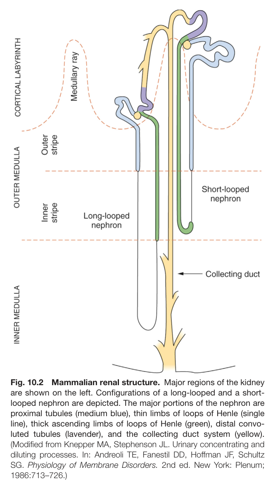

Fig. 10.2 Mammalian renal structure. Major regions of the kidney are shown on the left. Configurations of a long-looped and a short- looped nephron are depicted. The major portions of the nephron are proximal tubules (medium blue), thin limbs of loops of Henle (single line), thick ascending limbs of loops of Henle (green), distal convo- luted tubules (lavender), and the collecting duct system (yellow). (Modified from Knepper MA, Stephenson JL. Urinary concentrating and diluting processes. In: Andreoli TE, Fanestil DD, Hoffman JF, Schultz SG. Physiology of Membrane Disorders. 2nd ed. New York: Plenum; 1986:713–726.)

---

### Fig_10_3

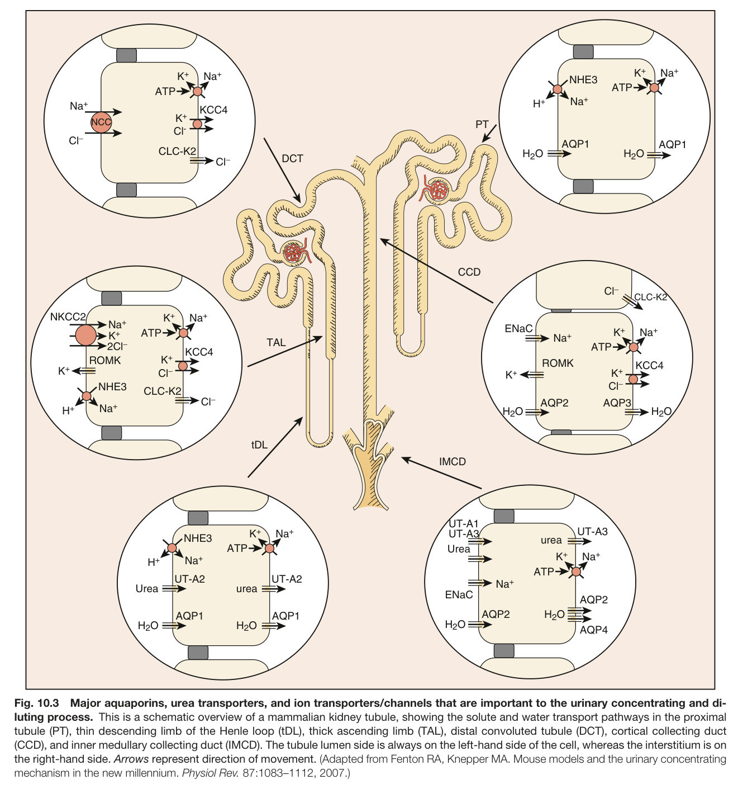

Fig. 10.3 Major aquaporins, urea transporters, and ion transporters/channels that are important to the urinary concentrating and di- luting process. This is a schematic overview of a mammalian kidney tubule, showing the solute and water transport pathways in the proxima tubule (PT), thin descending limb of the Henle loop (tDL), thick ascending limb (TAL), distal convoluted tubule (DCT), cortical collecting duct (CCD), and inner medullary collecting duct (IMCD). The tubule lumen side is always on the left-hand side of the cell, whereas the interstitium is on the right-hand side. Arrows represent direction of movement. (Adapted from Fenton RA, Knepper MA. Mouse models and the urinary concentrating mechanism in the new millennium. Physiol Rev. 87:1083–1112, 2007.)

---

### Fig_10_4

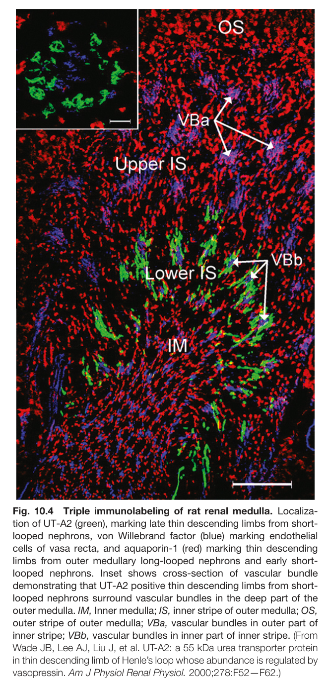

Fig. 10.4 Triple immunolabeling of rat renal medulla. Localiza- tion of UT-A2 (green), marking late thin descending limbs from short- looped nephrons, von Willebrand factor (blue) marking endothelial cells of vasa recta, and aquaporin-1 (red) marking thin descending limbs from outer medullary long-looped nephrons and early short- looped nephrons. Inset shows cross-section of vascular bundle demonstrating that UT-A2 positive thin descending limbs from short- looped nephrons surround vascular bundles in the deep part of the outer medulla. IM, Inner medulla; IS, inner stripe of outer medulla; OS, outer stripe of outer medulla; VBa, vascular bundles in outer part of inner stripe; VBb, vascular bundles in inner part of inner stripe. (From Wade JB, Lee AJ, Liu J, et al. UT-A2: a 55 kDa urea transporter protein in thin descending limb of Henle’s loop whose abundance is regulated by vasopressin. Am J Physiol Renal Physiol. 2000;278:F52—F62.)

---

### Fig_10_5

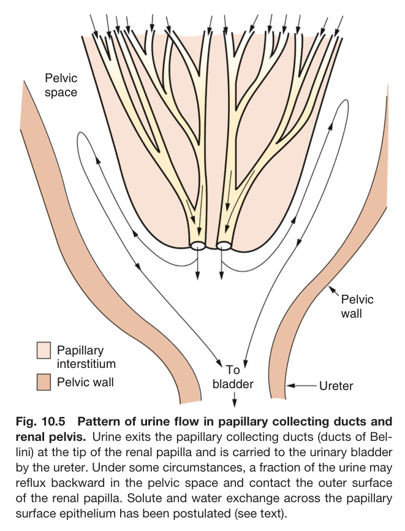

Fig. 10.5 Pattern of urine flow in papillary collecting ducts and renal pelvis. Urine exits the papillary collecting ducts (ducts of Bel- lini) at the tip of the renal papilla and is carried to the urinary bladder by the ureter. Under some circumstances, a fraction of the urine may reflux backward in the pelvic space and contact the outer surface of the renal papilla. Solute and water exchange across the papillary surface epithelium has been postulated (see text).

---

### Fig_10_6

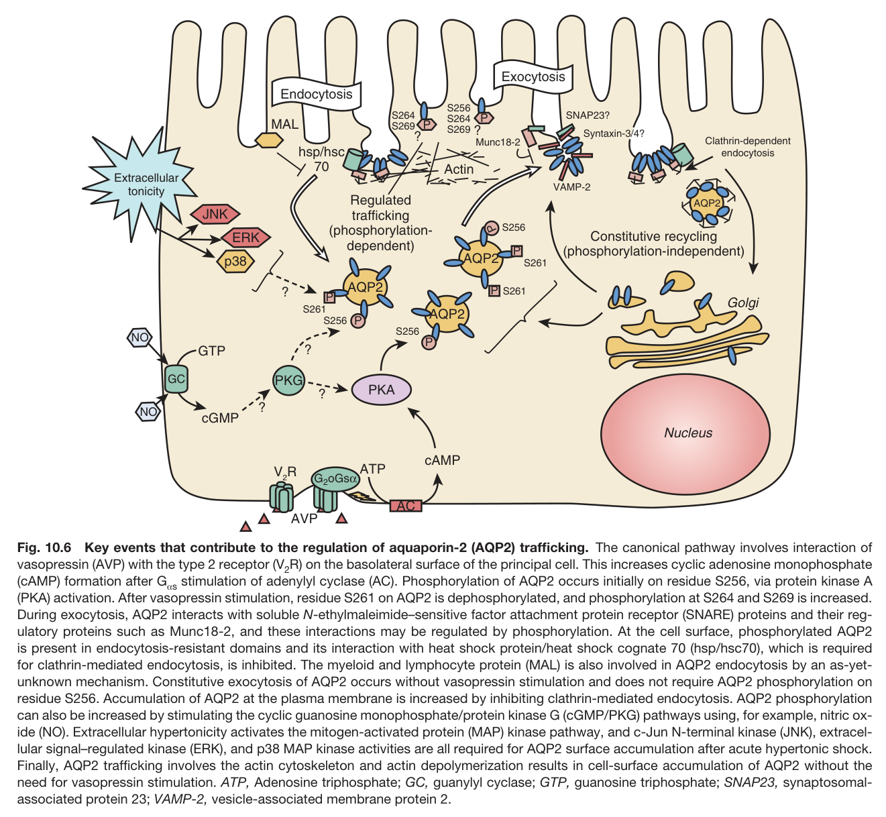

Fig. 10.6 Key events that contribute to the regulation of aquaporin-2 (AQP2) trafficking. The canonical pathway involves interaction of vasopressin (AVP) with the type 2 receptor (V R) on the basolateral surface of the principal cell. This increases cyclic adenosine monophosphate (cAMP) formation after G stimulation of adenylyl cyclase (AC). Phosphorylation of AQP2 occurs initially on residue S256, via protein kinase A (PKA) activation. After vasopressin stimulation, residue S261 on AQP2 is dephosphorylated, and phosphorylation at S264 and S269 is increased. During exocytosis, AQP2 interacts with soluble N-ethylmaleimide–sensitive factor attachment protein receptor (SNARE) proteins and their reg ulatory proteins such as Munc18-2, and these interactions may be regulated by phosphorylation. At the cell surface, phosphorylated AQP2 is present in endocytosis-resistant domains and its interaction with heat shock protein/heat shock cognate 70 (hsp/hsc70), which is required for clathrin-mediated endocytosis, is inhibited. The myeloid and lymphocyte protein (MAL) is also involved in AQP2 endocytosis by an as-yet- unknown mechanism. Constitutive exocytosis of AQP2 occurs without vasopressin stimulation and does not require AQP2 phosphorylation on residue S256. Accumulation of AQP2 at the plasma membrane is increased by inhibiting clathrin-mediated endocytosis. AQP2 phosphorylation can also be increased by stimulating the cyclic guanosine monophosphate/protein kinase G (cGMP/PKG) pathways using, for example, nitric ox- ide (NO). Extracellular hypertonicity activates the mitogen-activated protein (MAP) kinase pathway, and c-Jun N-terminal kinase (JNK), extracel- lular signal–regulated kinase (ERK), and p38 MAP kinase activities are all required for AQP2 surface accumulation after acute hypertonic shock. Finally, AQP2 trafficking involves the actin cytoskeleton and actin depolymerization results in cell-surface accumulation of AQP2 without the need for vasopressin stimulation. ATP, Adenosine triphosphate; GC, guanylyl cyclase; GTP, guanosine triphosphate; SNAP23, synaptosomal- associated protein 23; VAMP-2, vesicle-associated membrane protein 2.

---

### Fig_10_7

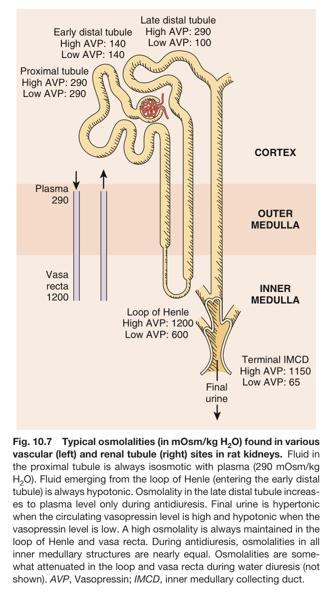

Fig. 10.7 Typical osmolalities (in mOsm/kg H O) found in various vascular (left) and renal tubule (right) sites in rat kidneys. Fluid in the proximal tubule is always isosmotic with plasma (290 mOsm/kg H O). Fluid emerging from the loop of Henle (entering the early distal tubule) is always hypotonic. Osmolality in the late distal tubule increas- es to plasma level only during antidiuresis. Final urine is hypertonic when the circulating vasopressin level is high and hypotonic when the vasopressin level is low. A high osmolality is always maintained in the loop of Henle and vasa recta. During antidiuresis, osmolalities in all inner medullary structures are nearly equal. Osmolalities are some- what attenuated in the loop and vasa recta during water diuresis (not shown). AVP, Vasopressin; IMCD, inner medullary collecting duct.

---

### Fig_10_8

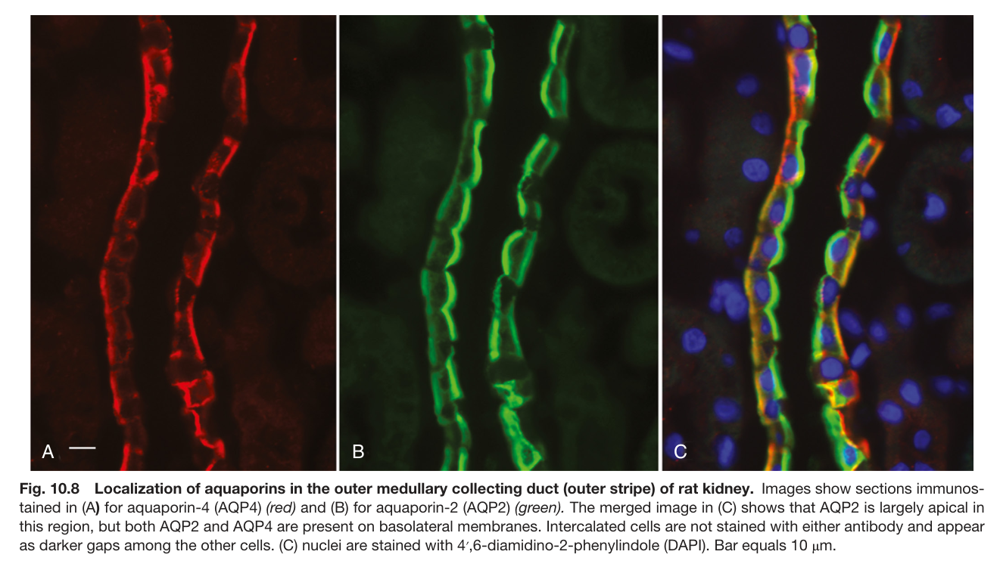

Fig. 10.8 Localization of aquaporins in the outer medullary collecting duct (outer stripe) of rat kidney. Images show sections immunos- tained in (A) for aquaporin-4 (AQP4) (red) and (B) for aquaporin-2 (AQP2) (green). The merged image in (C) shows that AQP2 is largely apical in this region, but both AQP2 and AQP4 are present on basolateral membranes. Intercalated cells are not stained with either antibody and appear as darker gaps among the other cells. (C) nuclei are stained with 4′,6-diamidino-2-phenylindole (DAPI). Bar equals 10 μm.

---

### Fig_10_9

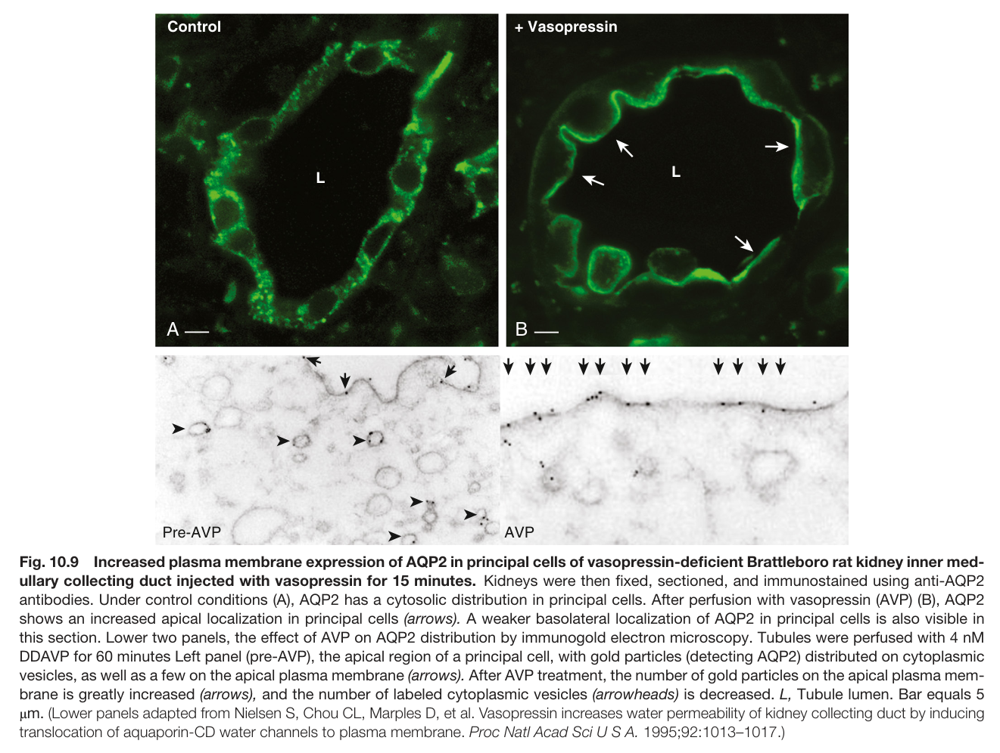

Fig. 10.9 Increased plasma membrane expression of AQP2 in principal cells of vasopressin-deficient Brattleboro rat kidney inner med- ullary collecting duct injected with vasopressin for 15 minutes. Kidneys were then fixed, sectioned, and immunostained using anti-AQP2 antibodies. Under control conditions (A), AQP2 has a cytosolic distribution in principal cells. After perfusion with vasopressin (AVP) (B), AQP2 shows an increased apical localization in principal cells (arrows). A weaker basolateral localization of AQP2 in principal cells is also visible in this section. Lower two panels, the effect of AVP on AQP2 distribution by immunogold electron microscopy. Tubules were perfused with 4 nM DDAVP for 60 minutes Left panel (pre-AVP), the apical region of a principal cell, with gold particles (detecting AQP2) distributed on cytoplasmic vesicles, as well as a few on the apical plasma membrane (arrows). After AVP treatment, the number of gold particles on the apical plasma mem- brane is greatly increased (arrows), and the number of labeled cytoplasmic vesicles (arrowheads) is decreased. L, Tubule lumen. Bar equals 5 μm. (Lower panels adapted from Nielsen S, Chou CL, Marples D, et al. Vasopressin increases water permeability of kidney collecting duct by inducing translocation of aquaporin-CD water channels to plasma membrane. Proc Natl Acad Sci U S A. 1995;92:1013–1017.)

---

### Fig_10_10

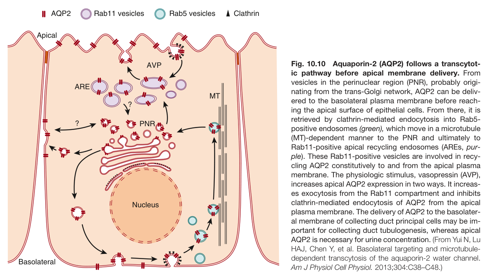

Fig. 10.10 Aquaporin-2 (AQP2) follows a transcytot- ic pathway before apical membrane delivery. From vesicles in the perinuclear region (PNR), probably origi- nating from the trans-Golgi network, AQP2 can be deliv- ered to the basolateral plasma membrane before reach- ing the apical surface of epithelial cells. From there, it is retrieved by clathrin-mediated endocytosis into Rab5- positive endosomes (green), which move in a microtubule (MT)-dependent manner to the PNR and ultimately to Rab11-positive apical recycling endosomes (AREs, pur- ple). These Rab11-positive vesicles are involved in recy- cling AQP2 constitutively to and from the apical plasma membrane. The physiologic stimulus, vasopressin (AVP), increases apical AQP2 expression in two ways. It increas- es exocytosis from the Rab11 compartment and inhibits clathrin-mediated endocytosis of AQP2 from the apical plasma membrane. The delivery of AQP2 to the basolater- al membrane of collecting duct principal cells may be im- portant for collecting duct tubulogenesis, whereas apical AQP2 is necessary for urine concentration. (From Yui N, Lu HAJ, Chen Y, et al. Basolateral targeting and microtubule- dependent transcytosis of the aquaporin-2 water channel. Am J Physiol Cell Physiol. 2013;304:C38–C48.)

---

### Fig_10_11

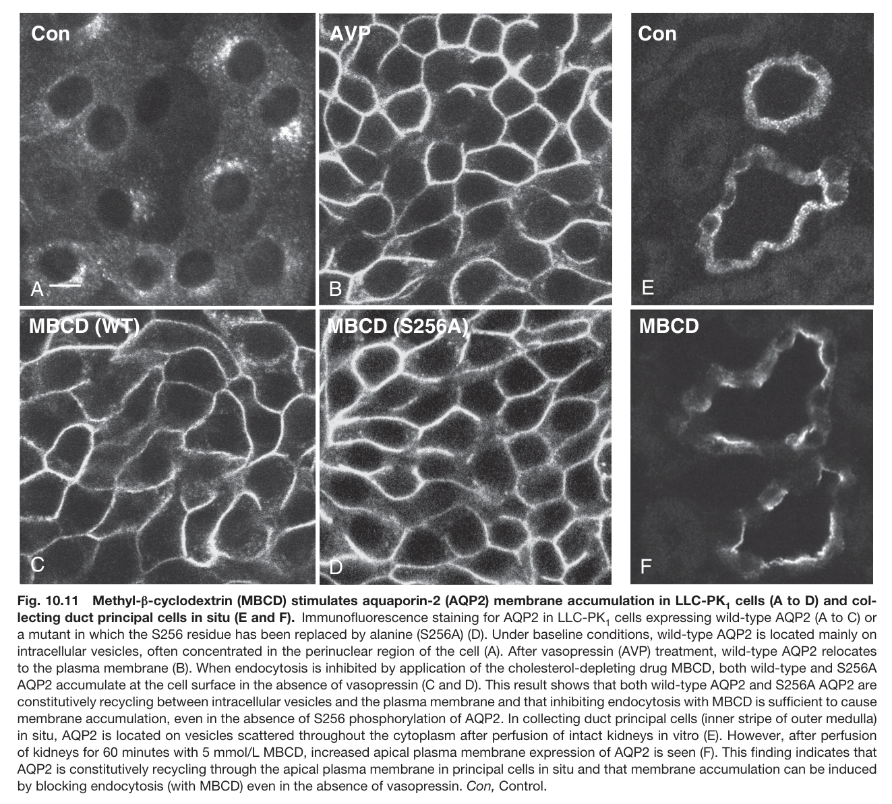

Fig. 10.11 Methyl-β-cyclodextrin (MBCD) stimulates aquaporin-2 (AQP2) membrane accumulation in LLC-PK cells (A to D) and col- lecting duct principal cells in situ (E and F). Immunofluorescence staining for AQP2 in LLC-PK cells expressing wild-type AQP2 (A to C) or a mutant in which the S256 residue has been replaced by alanine (S256A) (D). Under baseline conditions, wild-type AQP2 is located mainly on intracellular vesicles, often concentrated in the perinuclear region of the cell (A). After vasopressin (AVP) treatment, wild-type AQP2 relocates to the plasma membrane (B). When endocytosis is inhibited by application of the cholesterol-depleting drug MBCD, both wild-type and S256A AQP2 accumulate at the cell surface in the absence of vasopressin (C and D). This result shows that both wild-type AQP2 and S256A AQP2 are constitutively recycling between intracellular vesicles and the plasma membrane and that inhibiting endocytosis with MBCD is sufficient to cause membrane accumulation, even in the absence of S256 phosphorylation of AQP2. In collecting duct principal cells (inner stripe of outer medulla) in situ, AQP2 is located on vesicles scattered throughout the cytoplasm after perfusion of intact kidneys in vitro (E). However, after perfusion of kidneys for 60 minutes with 5 mmol/L MBCD, increased apical plasma membrane expression of AQP2 is seen (F). This finding indicates that AQP2 is constitutively recycling through the apical plasma membrane in principal cells in situ and that membrane accumulation can be induced by blocking endocytosis (with MBCD) even in the absence of vasopressin. Con, Control.

---

### Fig_10_12

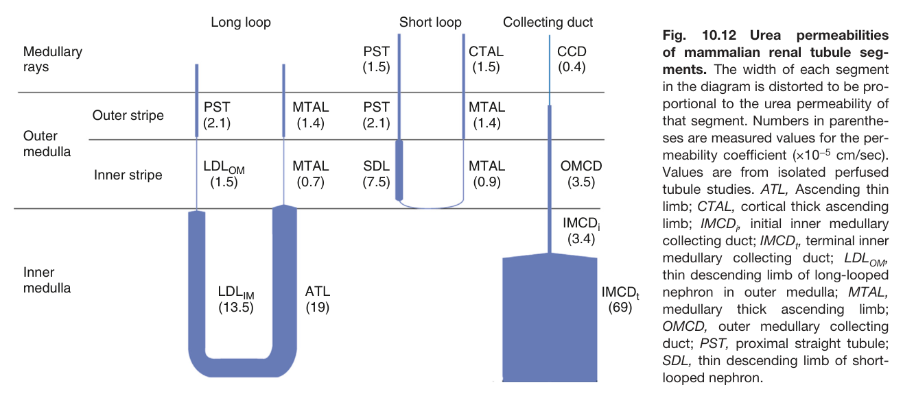

Fig. 10.12 Urea permeabilities of mammalian renal tubule seg- ments. The width of each segment in the diagram is distorted to be pro- portional to the urea permeability of that segment. Numbers in parenthe- ses are measured values for the per- meability coefficient (×10−5 cm/sec). Values are from isolated perfused tubule studies. ATL, Ascending thin limb; CTAL, cortical thick ascending limb; IMCD , initial inner medullary collecting duct; IMCD , terminal inner medullary collecting duct; LDL , thin descending limb of long-looped nephron in outer medulla; MTAL, medullary thick ascending limb; OMCD, outer medullary collecting duct; PST, proximal straight tubule; SDL, thin descending limb of short- looped nephron.

---

### Fig_10_13

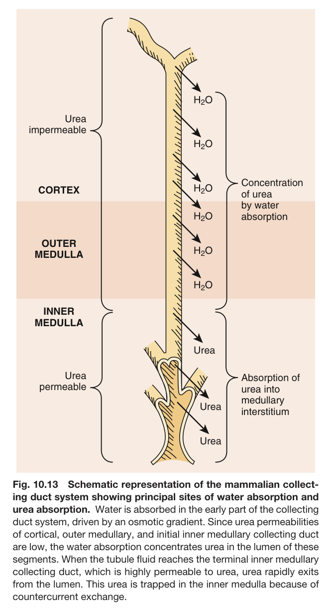

Fig. 10.13 Schematic representation of the mammalian collect- ing duct system showing principal sites of water absorption and urea absorption. Water is absorbed in the early part of the collecting duct system, driven by an osmotic gradient. Since urea permeabilities of cortical, outer medullary, and initial inner medullary collecting duct are low, the water absorption concentrates urea in the lumen of these segments. When the tubule fluid reaches the terminal inner medullary collecting duct, which is highly permeable to urea, urea rapidly exits from the lumen. This urea is trapped in the inner medulla because of countercurrent exchange.

---

### Fig_10_14

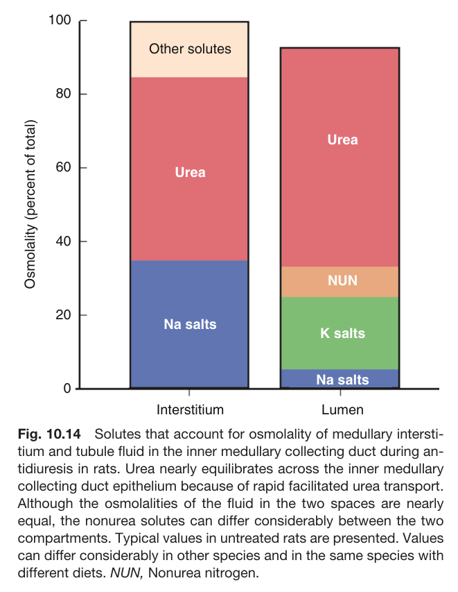

Fig. 10.14 Solutes that account for osmolality of medullary intersti- tium and tubule fluid in the inner medullary collecting duct during an- tidiuresis in rats. Urea nearly equilibrates across the inner medullary collecting duct epithelium because of rapid facilitated urea transport. Although the osmolalities of the fluid in the two spaces are nearly equal, the nonurea solutes can differ considerably between the two compartments. Typical values in untreated rats are presented. Values can differ considerably in other species and in the same species with different diets. NUN, Nonurea nitrogen.

---

### Fig_10_15

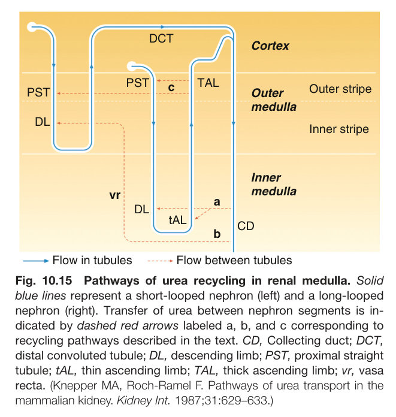

Fig. 10.15 Pathways of urea recycling in renal medulla. Solid blue lines represent a short-looped nephron (left) and a long-looped nephron (right). Transfer of urea between nephron segments is in- dicated by dashed red arrows labeled a, b, and c corresponding to recycling pathways described in the text. CD, Collecting duct; DCT, distal convoluted tubule; DL, descending limb; PST, proximal straight tubule; tAL, thin ascending limb; TAL, thick ascending limb; vr, vasa recta. (Knepper MA, Roch-Ramel F. Pathways of urea transport in the mammalian kidney. Kidney Int. 1987;31:629–633.)

---

### Fig_10_16

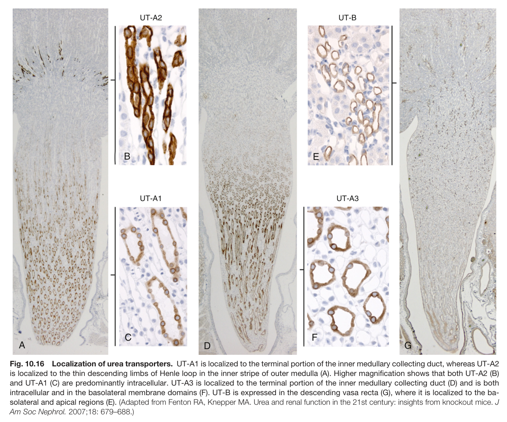

Fig. 10.16 Localization of urea transporters. UT-A1 is localized to the terminal portion of the inner medullary collecting duct, whereas UT-A2 is localized to the thin descending limbs of Henle loop in the inner stripe of outer medulla (A). Higher magnification shows that both UT-A2 (B) and UT-A1 (C) are predominantly intracellular. UT-A3 is localized to the terminal portion of the inner medullary collecting duct (D) and is both intracellular and in the basolateral membrane domains (F). UT-B is expressed in the descending vasa recta (G), where it is localized to the ba- solateral and apical regions (E). (Adapted from Fenton RA, Knepper MA. Urea and renal function in the 21st century: insights from knockout mice. J Am Soc Nephrol. 2007;18: 679–688.)

---

### Fig_10_17

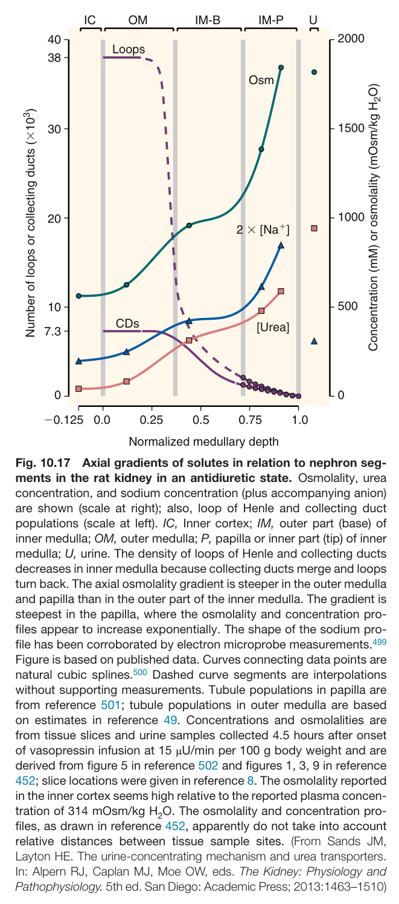

Fig. 10.17 Axial gradients of solutes in relation to nephron seg- ments in the rat kidney in an antidiuretic state. Osmolality, urea concentration, and sodium concentration (plus accompanying anion) are shown (scale at right); also, loop of Henle and collecting duct populations (scale at left). IC, Inner cortex; IM, outer part (base) of inner medulla; OM, outer medulla; P, papilla or inner part (tip) of inner medulla; U, urine. The density of loops of Henle and collecting ducts decreases in inner medulla because collecting ducts merge and loops turn back. The axial osmolality gradient is steeper in the outer medulla and papilla than in the outer part of the inner medulla. The gradient is steepest in the papilla, where the osmolality and concentration pro- files appear to increase exponentially. The shape of the sodium pro- file has been corroborated by electron microprobe measurements.499 Figure is based on published data. Curves connecting data points are natural cubic splines.500 Dashed curve segments are interpolations without supporting measurements. Tubule populations in papilla are from reference 501; tubule populations in outer medulla are based on estimates in reference 49. Concentrations and osmolalities are from tissue slices and urine samples collected 4.5 hours after onset of vasopressin infusion at 15 μU/min per 100 g body weight and are derived from figure 5 in reference 502 and figures 1, 3, 9 in reference 452; slice locations were given in reference 8. The osmolality reported in the inner cortex seems high relative to the reported plasma concen- tration of 314 mOsm/kg H O. The osmolality and concentration pro- files, as drawn in reference 452, apparently do not take into account relative distances between tissue sample sites. (From Sands JM, Layton HE. The urine-concentrating mechanism and urea transporters. In: Alpern RJ, Caplan MJ, Moe OW, eds. The Kidney: Physiology and Pathophysiology. 5th ed. San Diego: Academic Press; 2013:1463–1510)

---

### Fig_10_18

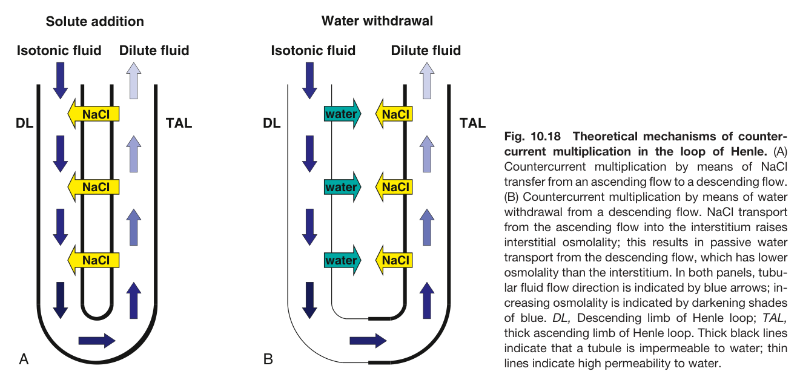

Fig. 10.18 Theoretical mechanisms of counter- current multiplication in the loop of Henle. (A) Countercurrent multiplication by means of NaCl transfer from an ascending flow to a descending flow. (B) Countercurrent multiplication by means of water withdrawal from a descending flow. NaCl transport from the ascending flow into the interstitium raises interstitial osmolality; this results in passive water transport from the descending flow, which has lower osmolality than the interstitium. In both panels, tubu- lar fluid flow direction is indicated by blue arrows; in- creasing osmolality is indicated by darkening shades of blue. DL, Descending limb of Henle loop; TAL, thick ascending limb of Henle loop. Thick black lines indicate that a tubule is impermeable to water; thin lines indicate high permeability to water.

---

### Fig_10_19

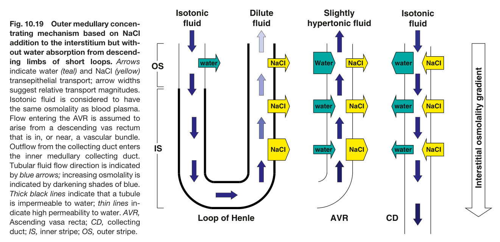

Fig. 10.19 Outer medullary concen- trating mechanism based on NaCl addition to the interstitium but with- out water absorption from descend- ing limbs of short loops. Arrows indicate water (teal) and NaCl (yellow) transepithelial transport; arrow widths suggest relative transport magnitudes. Isotonic fluid is considered to have the same osmolality as blood plasma. Flow entering the AVR is assumed to arise from a descending vas rectum that is in, or near, a vascular bundle. Outflow from the collecting duct enters the inner medullary collecting duct. Tubular fluid flow direction is indicated by blue arrows; increasing osmolality is indicated by darkening shades of blue. Thick black lines indicate that a tubule is impermeable to water; thin lines in- dicate high permeability to water. AVR, Ascending vasa recta; CD, collecting duct; IS, inner stripe; OS, outer stripe.

---

## Tables

*No tables resolved for this chapter.*
