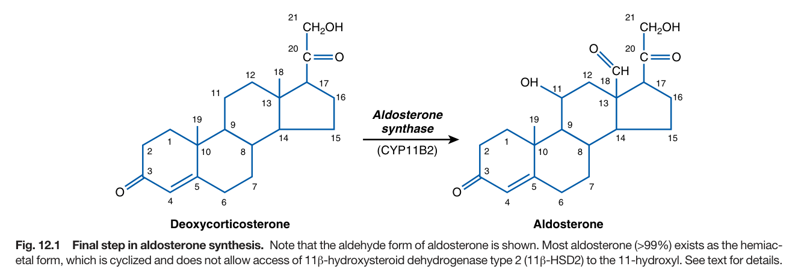
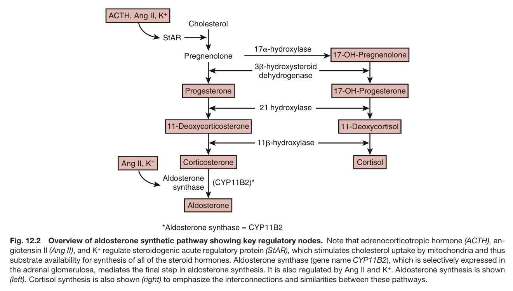
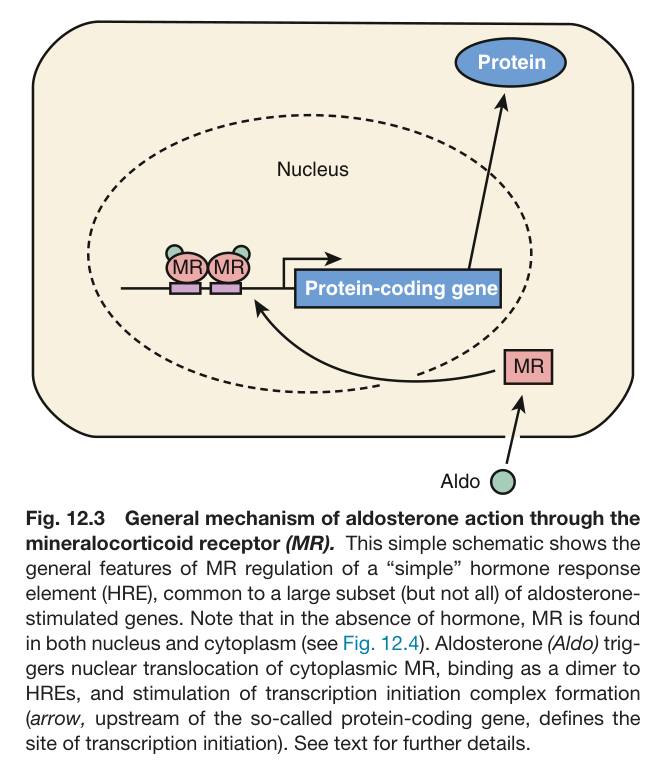
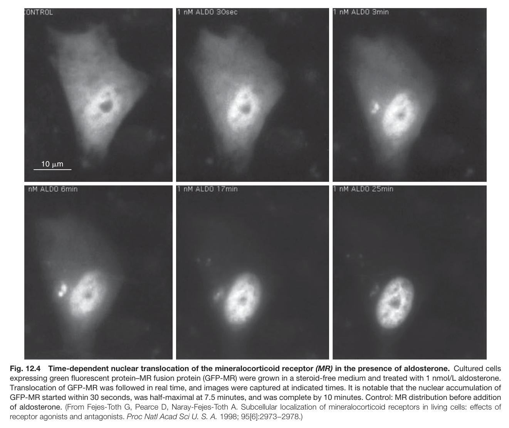
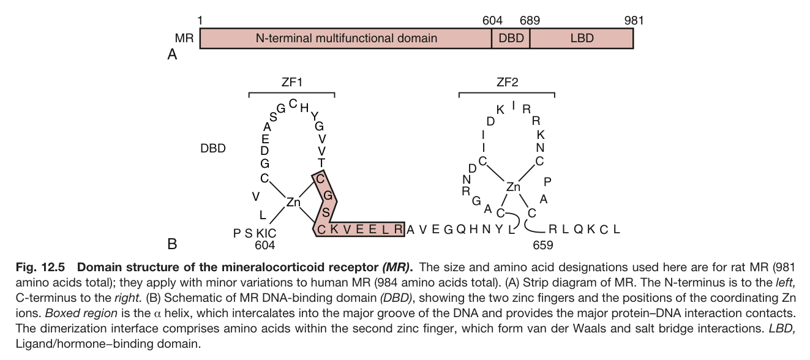
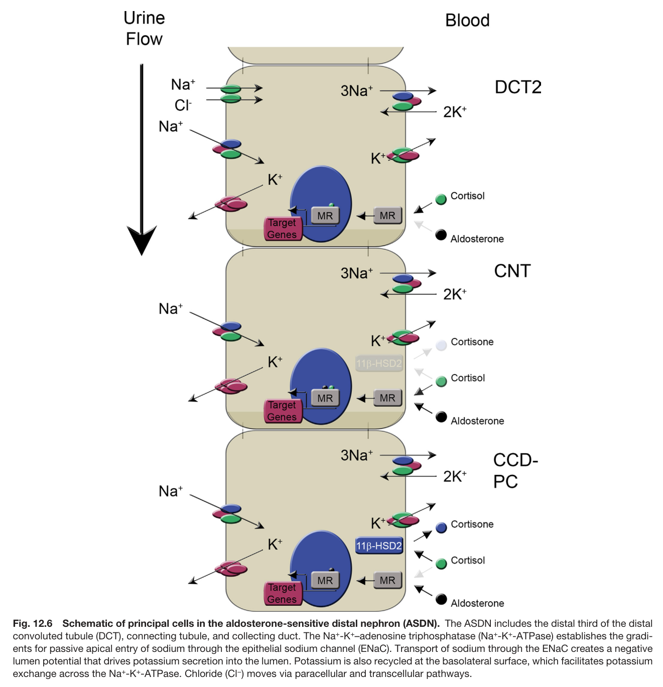
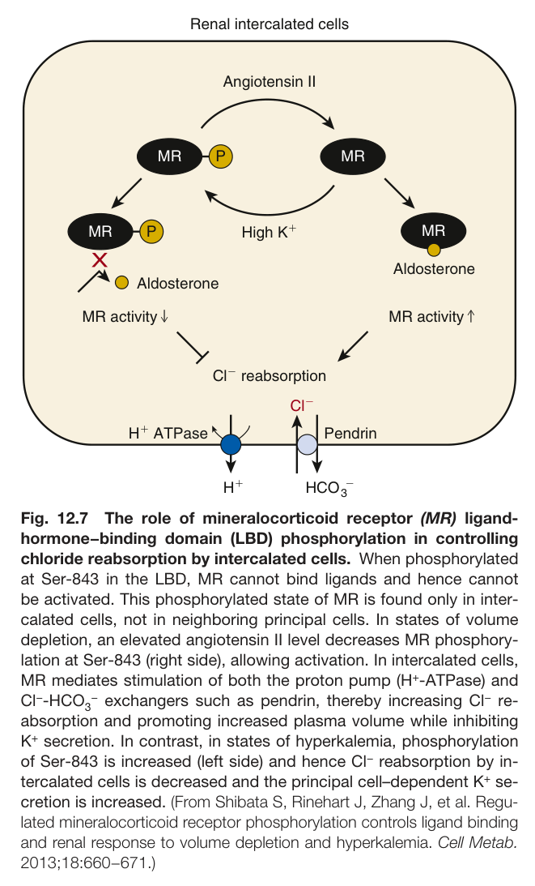
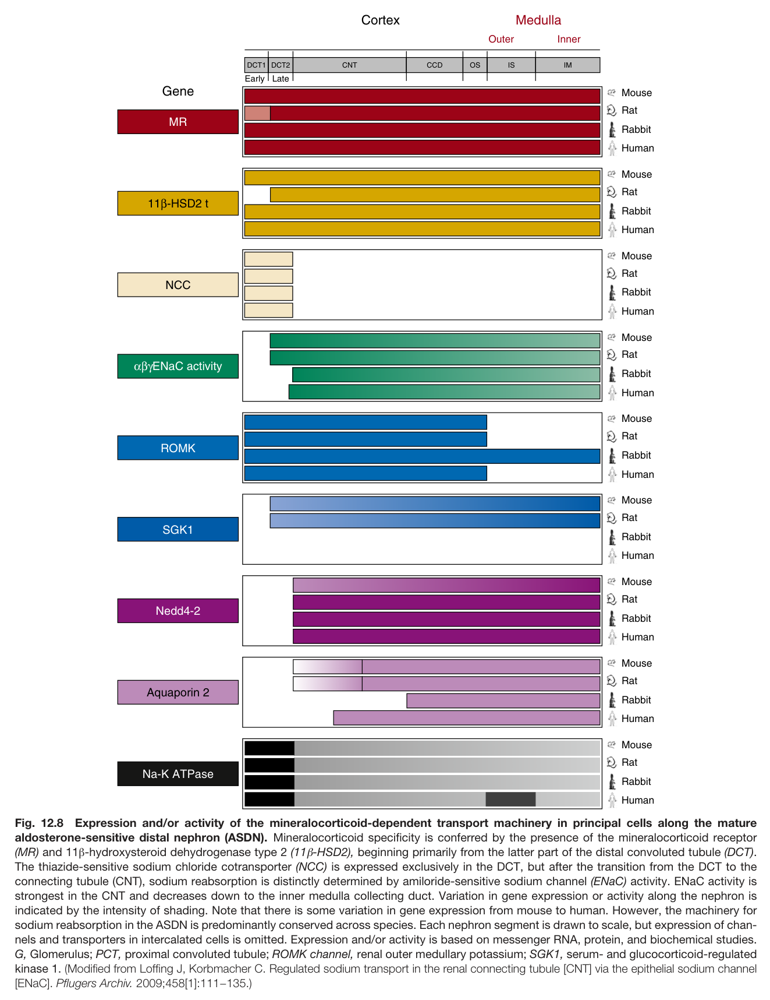
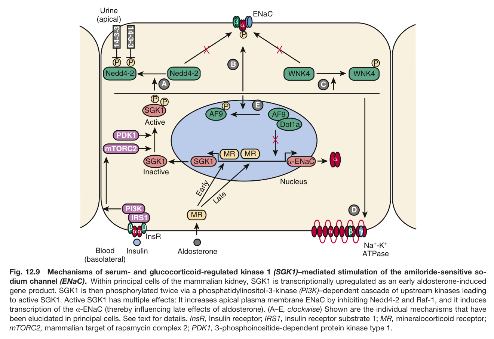

# 12. Aldosterone and Mineralocorticoid Receptors_ Renal and Extrarenal Roles - Figures and Tables Index

This document lists all figures and tables extracted from `12. Aldosterone and Mineralocorticoid Receptors_ Renal and Extrarenal Roles.pdf`.

## Table of Contents
- [Figures](#figures)
- [Tables](#tables)

---

## Figures

### Fig_12_1

Fig. 12.1 Final step in aldosterone synthesis. Note that the aldehyde form of aldosterone is shown. Most aldosterone (>99%) exists as the hemiac- etal form, which is cyclized and does not allow access of 11β-hydroxysteroid dehydrogenase type 2 (11β-HSD2) to the 11-hydroxyl. See text for details.

---

### Fig_12_2

Fig. 12.2 Overview of aldosterone synthetic pathway showing key regulatory nodes. Note that adrenocorticotropic hormone (ACTH), an- giotensin II (Ang II), and K+ regulate steroidogenic acute regulatory protein (StAR), which stimulates cholesterol uptake by mitochondria and thus substrate availability for synthesis of all of the steroid hormones. Aldosterone synthase (gene name CYP11B2), which is selectively expressed in the adrenal glomerulosa, mediates the final step in aldosterone synthesis. It is also regulated by Ang II and K+. Aldosterone synthesis is shown (left). Cortisol synthesis is also shown (right) to emphasize the interconnections and similarities between these pathways.

---

### Fig_12_3

Fig. 12.3 General mechanism of aldosterone action through the mineralocorticoid receptor (MR). This simple schematic shows the general features of MR regulation of a “simple” hormone response element (HRE), common to a large subset (but not all) of aldosterone- stimulated genes. Note that in the absence of hormone, MR is found in both nucleus and cytoplasm (see Fig. 12.4). Aldosterone (Aldo) trig- gers nuclear translocation of cytoplasmic MR, binding as a dimer to HREs, and stimulation of transcription initiation complex formation (arrow, upstream of the so-called protein-coding gene, defines the site of transcription initiation). See text for further details.

---

### Fig_12_4

Fig. 12.4 Time-dependent nuclear translocation of the mineralocorticoid receptor (MR) in the presence of aldosterone. Cultured cells expressing green fluorescent protein–MR fusion protein (GFP-MR) were grown in a steroid-free medium and treated with 1 nmol/L aldosterone. Translocation of GFP-MR was followed in real time, and images were captured at indicated times. It is notable that the nuclear accumulation of GFP-MR started within 30 seconds, was half-maximal at 7.5 minutes, and was complete by 10 minutes. Control: MR distribution before addition of aldosterone. (From Fejes-Toth G, Pearce D, Naray-Fejes-Toth A. Subcellular localization of mineralocorticoid receptors in living cells: effects of receptor agonists and antagonists. Proc Natl Acad Sci U. S. A. 1998; 95[6]:2973−2978.)

---

### Fig_12_5

Fig. 12.5 Domain structure of the mineralocorticoid receptor (MR). The size and amino acid designations used here are for rat MR (981 amino acids total); they apply with minor variations to human MR (984 amino acids total). (A) Strip diagram of MR. The N-terminus is to the left, C-terminus to the right. (B) Schematic of MR DNA-binding domain (DBD), showing the two zinc fingers and the positions of the coordinating Zn ions. Boxed region is the α helix, which intercalates into the major groove of the DNA and provides the major protein–DNA interaction contacts. The dimerization interface comprises amino acids within the second zinc finger, which form van der Waals and salt bridge interactions. LBD, Ligand/hormone−binding domain.

---

### Fig_12_6

Fig. 12.6 Schematic of principal cells in the aldosterone-sensitive distal nephron (ASDN). The ASDN includes the distal third of the dista convoluted tubule (DCT), connecting tubule, and collecting duct. The Na+-K+–adenosine triphosphatase (Na+-K+-ATPase) establishes the gradi- ents for passive apical entry of sodium through the epithelial sodium channel (ENaC). Transport of sodium through the ENaC creates a negative lumen potential that drives potassium secretion into the lumen. Potassium is also recycled at the basolateral surface, which facilitates potassium exchange across the Na+-K+-ATPase. Chloride (Cl−) moves via paracellular and transcellular pathways.

---

### Fig_12_7

Fig. 12.7 The role of mineralocorticoid receptor (MR) ligand- hormone−binding domain (LBD) phosphorylation in controlling chloride reabsorption by intercalated cells. When phosphorylated at Ser-843 in the LBD, MR cannot bind ligands and hence cannot be activated. This phosphorylated state of MR is found only in inter- calated cells, not in neighboring principal cells. In states of volume depletion, an elevated angiotensin II level decreases MR phosphory- lation at Ser-843 (right side), allowing activation. In intercalated cells, MR mediates stimulation of both the proton pump (H+-ATPase) and Cl−-HCO − exchangers such as pendrin, thereby increasing Cl− re- absorption and promoting increased plasma volume while inhibiting K+ secretion. In contrast, in states of hyperkalemia, phosphorylation of Ser-843 is increased (left side) and hence Cl− reabsorption by in- tercalated cells is decreased and the principal cell–dependent K+ se- cretion is increased. (From Shibata S, Rinehart J, Zhang J, et al. Regu- lated mineralocorticoid receptor phosphorylation controls ligand binding and renal response to volume depletion and hyperkalemia. Cell Metab. 2013;18:660−671.)

---

### Fig_12_8

Fig. 12.8 Expression and/or activity of the mineralocorticoid-dependent transport machinery in principal cells along the mature aldosterone-sensitive distal nephron (ASDN). Mineralocorticoid specificity is conferred by the presence of the mineralocorticoid receptor (MR) and 11β-hydroxysteroid dehydrogenase type 2 (11β-HSD2), beginning primarily from the latter part of the distal convoluted tubule (DCT). The thiazide-sensitive sodium chloride cotransporter (NCC) is expressed exclusively in the DCT, but after the transition from the DCT to the connecting tubule (CNT), sodium reabsorption is distinctly determined by amiloride-sensitive sodium channel (ENaC) activity. ENaC activity is strongest in the CNT and decreases down to the inner medulla collecting duct. Variation in gene expression or activity along the nephron is indicated by the intensity of shading. Note that there is some variation in gene expression from mouse to human. However, the machinery for sodium reabsorption in the ASDN is predominantly conserved across species. Each nephron segment is drawn to scale, but expression of chan nels and transporters in intercalated cells is omitted. Expression and/or activity is based on messenger RNA, protein, and biochemical studies. G, Glomerulus; PCT, proximal convoluted tubule; ROMK channel, renal outer medullary potassium; SGK1, serum- and glucocorticoid-regulated kinase 1. (Modified from Loffing J, Korbmacher C. Regulated sodium transport in the renal connecting tubule [CNT] via the epithelial sodium channe [ENaC]. Pflugers Archiv. 2009;458[1]:111−135.)

---

### Fig_12_9

Fig. 12.9 Mechanisms of serum- and glucocorticoid-regulated kinase 1 (SGK1)–mediated stimulation of the amiloride-sensitive so- dium channel (ENaC). Within principal cells of the mammalian kidney, SGK1 is transcriptionally upregulated as an early aldosterone-induced gene product. SGK1 is then phosphorylated twice via a phosphatidylinositol-3-kinase (PI3K)–dependent cascade of upstream kinases leading to active SGK1. Active SGK1 has multiple effects: It increases apical plasma membrane ENaC by inhibiting Nedd4-2 and Raf-1, and it induces transcription of the α-ENaC (thereby influencing late effects of aldosterone). (A–E, clockwise) Shown are the individual mechanisms that have been elucidated in principal cells. See text for details. InsR, Insulin receptor; IRS1, insulin receptor substrate 1; MR, mineralocorticoid receptor; mTORC2, mammalian target of rapamycin complex 2; PDK1, 3-phosphoinositide-dependent protein kinase type 1.

---

## Tables

*No tables resolved for this chapter.*
