# 13. Disorders of Sodium Balance - Figures and Tables Index

This document lists all figures and tables extracted from `13. Disorders of Sodium Balance.pdf`.

## Table of Contents
- [Figures](#figures)
- [Tables](#tables)

---

## Figures

### Fig_13_1

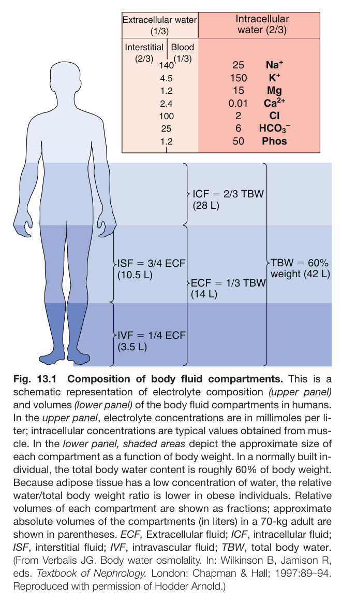

Fig. 13.1 Composition of body fluid compartments. This is a schematic representation of electrolyte composition (upper panel) and volumes (lower panel) of the body fluid compartments in humans. In the upper panel, electrolyte concentrations are in millimoles per li- ter; intracellular concentrations are typical values obtained from mus- cle. In the lower panel, shaded areas depict the approximate size of each compartment as a function of body weight. In a normally built in- dividual, the total body water content is roughly 60% of body weight. Because adipose tissue has a low concentration of water, the relative water/total body weight ratio is lower in obese individuals. Relative volumes of each compartment are shown as fractions; approximate absolute volumes of the compartments (in liters) in a 70-kg adult are shown in parentheses. ECF, Extracellular fluid; ICF, intracellular fluid; ISF, interstitial fluid; IVF, intravascular fluid; TBW, total body water. (From Verbalis JG. Body water osmolality. In: Wilkinson B, Jamison R, eds. Textbook of Nephrology. London: Chapman & Hall; 1997:89–94. Reproduced with permission of Hodder Arnold.)

---

### Fig_13_2

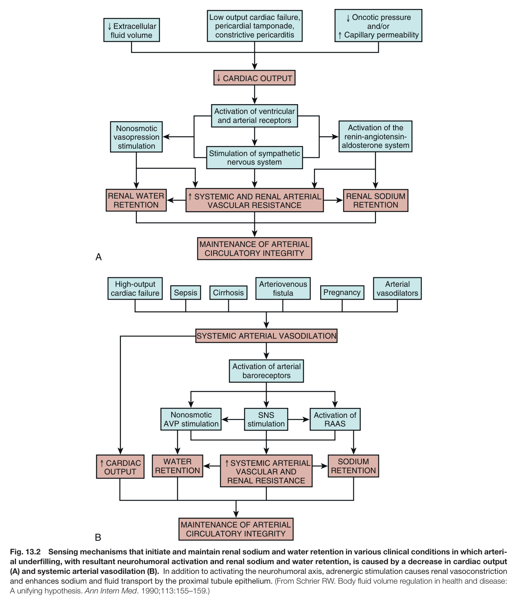

Fig. 13.2 Sensing mechanisms that initiate and maintain renal sodium and water retention in various clinical conditions in which arteri- al underfilling, with resultant neurohumoral activation and renal sodium and water retention, is caused by a decrease in cardiac output (A) and systemic arterial vasodilation (B). In addition to activating the neurohumoral axis, adrenergic stimulation causes renal vasoconstriction and enhances sodium and fluid transport by the proximal tubule epithelium. (From Schrier RW. Body fluid volume regulation in health and disease: A unifying hypothesis. Ann Intern Med. 1990;113:155–159.)

---

### Fig_13_3

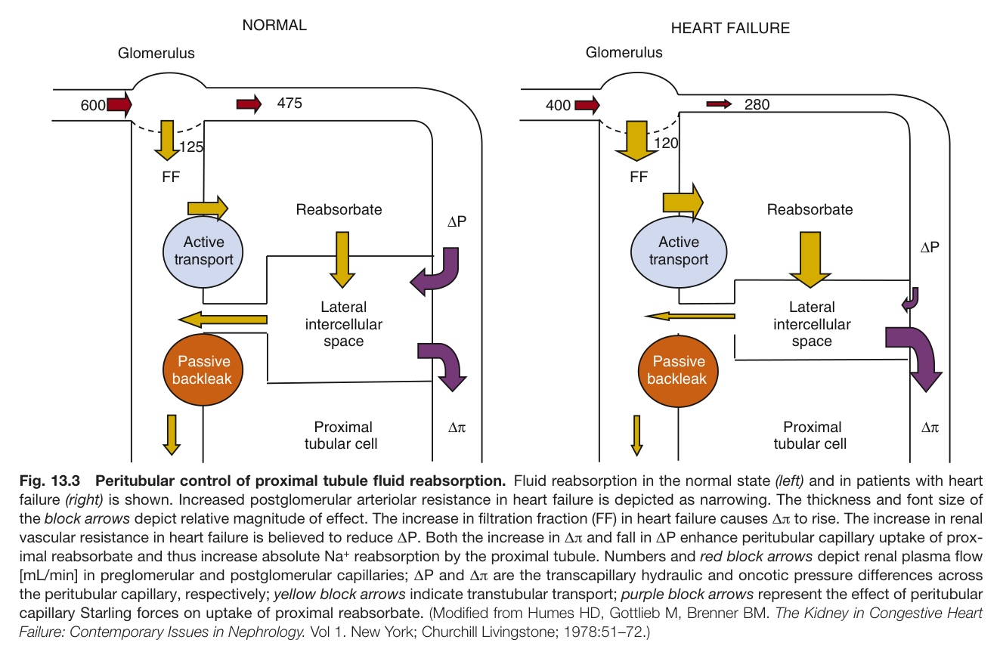

Fig. 13.3 Peritubular control of proximal tubule fluid reabsorption. Fluid reabsorption in the normal state (left) and in patients with heart failure (right) is shown. Increased postglomerular arteriolar resistance in heart failure is depicted as narrowing. The thickness and font size of the block arrows depict relative magnitude of effect. The increase in filtration fraction (FF) in heart failure causes Δπ to rise. The increase in rena vascular resistance in heart failure is believed to reduce ΔP. Both the increase in Δπ and fall in ΔP enhance peritubular capillary uptake of prox- imal reabsorbate and thus increase absolute Na<sup>+</sup> reabsorption by the proximal tubule. Numbers and red block arrows depict renal plasma flow [mL/min] in preglomerular and postglomerular capillaries; ΔP and Δπ are the transcapillary hydraulic and oncotic pressure differences across the peritubular capillary, respectively; yellow block arrows indicate transtubular transport; purple block arrows represent the effect of peritubular capillary Starling forces on uptake of proximal reabsorbate. (Modified from Humes HD, Gottlieb M, Brenner BM. The Kidney in Congestive Heart Failure: Contemporary Issues in Nephrology. Vol 1. New York; Churchill Livingstone; 1978:51–72.)

---

### Fig_13_4

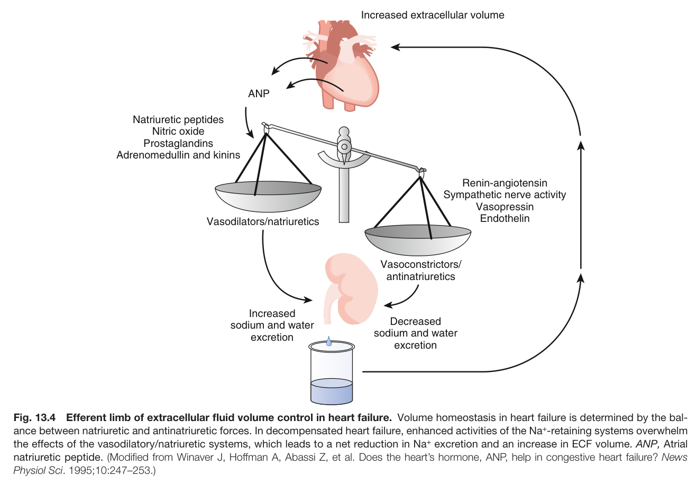

Fig. 13.4 Efferent limb of extracellular fluid volume control in heart failure. Volume homeostasis in heart failure is determined by the bal- ance between natriuretic and antinatriuretic forces. In decompensated heart failure, enhanced activities of the Na<sup>+</sup>-retaining systems overwhelm the effects of the vasodilatory/natriuretic systems, which leads to a net reduction in Na<sup>+</sup> excretion and an increase in ECF volume. ANP, Atria natriuretic peptide. (Modified from Winaver J, Hoffman A, Abassi Z, et al. Does the heart’s hormone, ANP, help in congestive heart failure? New Physiol Sci. 1995;10:247–253.)

---

### Fig_13_5

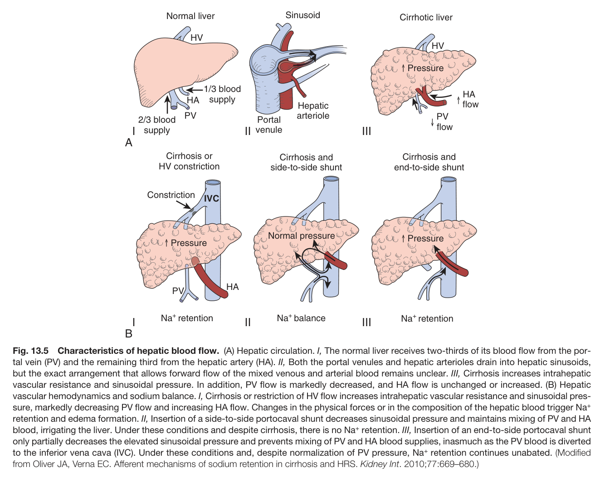

Fig. 13.5 Characteristics of hepatic blood flow. (A) Hepatic circulation. I, The normal liver receives two-thirds of its blood flow from the por- tal vein (PV) and the remaining third from the hepatic artery (HA). II, Both the portal venules and hepatic arterioles drain into hepatic sinusoids, but the exact arrangement that allows forward flow of the mixed venous and arterial blood remains unclear. III, Cirrhosis increases intrahepatic vascular resistance and sinusoidal pressure. In addition, PV flow is markedly decreased, and HA flow is unchanged or increased. (B) Hepatic vascular hemodynamics and sodium balance. I, Cirrhosis or restriction of HV flow increases intrahepatic vascular resistance and sinusoidal pres sure, markedly decreasing PV flow and increasing HA flow. Changes in the physical forces or in the composition of the hepatic blood trigger Na<sup>+</sup> retention and edema formation. II, Insertion of a side-to-side portocaval shunt decreases sinusoidal pressure and maintains mixing of PV and HA blood, irrigating the liver. Under these conditions and despite cirrhosis, there is no Na<sup>+</sup> retention. III, Insertion of an end-to-side portocaval shunt only partially decreases the elevated sinusoidal pressure and prevents mixing of PV and HA blood supplies, inasmuch as the PV blood is diverted to the inferior vena cava (IVC). Under these conditions and, despite normalization of PV pressure, Na<sup>+</sup> retention continues unabated. (Modified from Oliver JA, Verna EC. Afferent mechanisms of sodium retention in cirrhosis and HRS. Kidney Int. 2010;77:669–680.)

---

## Tables

### Table_13_1

#### Table Image

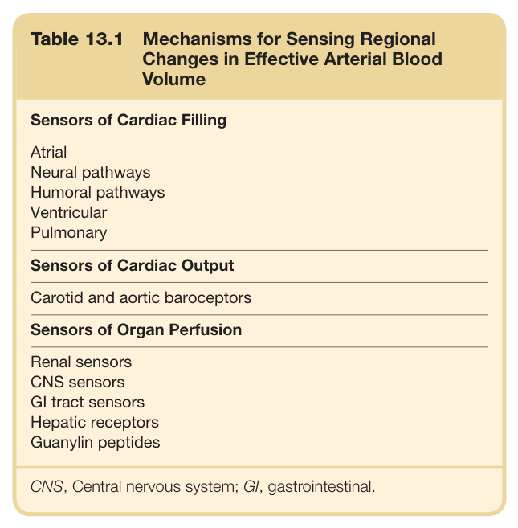

#### Table Data (CSV: [Table_13_1.csv](Table_13_1.csv))

```markdown
| Table Text (OCR) |
| :--- |
| Table 13.1 Mechanisms for Sensing Regional Changes in Effective Arterial Blood Volume Sensors of Cardiac Filling    Atrial    Neural pathways    Humoral pathways    Ventricular    Pulmonary    Sensors of Cardiac Output    Carotid and aortic baroceptors    Sensors of Organ Perfusion    Renal sensors    CNS sensors    GI tract sensors    Hepatic receptors    Guanylin peptides CNS, Central nervous system; GI, gastrointestinal. |
```

Table 13.1 Mechanisms for Sensing Regional Changes in Effective Arterial Blood Volume

---

### Table_13_2

#### Table Image

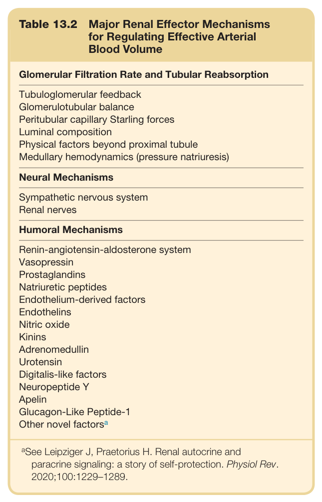

#### Table Data (CSV: [Table_13_2.csv](Table_13_2.csv))

```markdown
| Table Text (OCR) |
| :--- |
| Table 13.2 Major Renal Effector Mechanisms for Regulating Effective Arterial Blood Volume Glomerular Filtration Rate and Tubular Reabsorption    Tubuloglomerular feedback    Glomerulotubular balance    Peritubular capillary Starling forces    Luminal composition    Physical factors beyond proximal tubule    Medullary hemodynamics (pressure natriuresis)    Neural Mechanisms    Sympathetic nervous system    Renal nerves    Humoral Mechanisms    Renin-angiotensin-aldosterone system    Vasopressin    Prostaglandins    Natriuretic peptides    Endothelium-derived factors    Endothelins    Nitric oxide    Kinins    Adrenomedullin    Urotensin    Digitalis-like factors    Neuropeptide Y    Apelin    Glucagon-Like Peptide-1    Other novel factors ^{a} <sup>a</sup>See Leipziger J, Praetorius H. Renal autocrine and paracrine signaling: a story of self-protection. Physiol Rev. 2020;100:1229–1289. |
```

Table 13.2 Major Renal Effector Mechanisms for Regulating Effective Arterial Blood Volume

---

### Table_13_3

#### Table Image

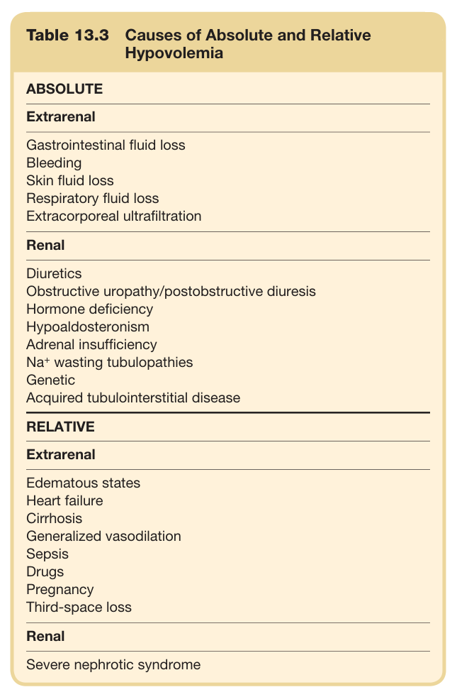

#### Table Data (CSV: [Table_13_3.csv](Table_13_3.csv))

```markdown
| Table Text (OCR) |
| :--- |
| Table 13.3 Causes of Absolute and Relative Hypovolemia ABSOLUTE Extrarenal    Gastrointestinal fluid loss    Bleeding    Skin fluid loss    Respiratory fluid loss    Extracorporeal ultrafiltration |
```

Table 13.3 Causes of Absolute and Relative Hypovolemia

---

### Table_13_4

#### Table Image

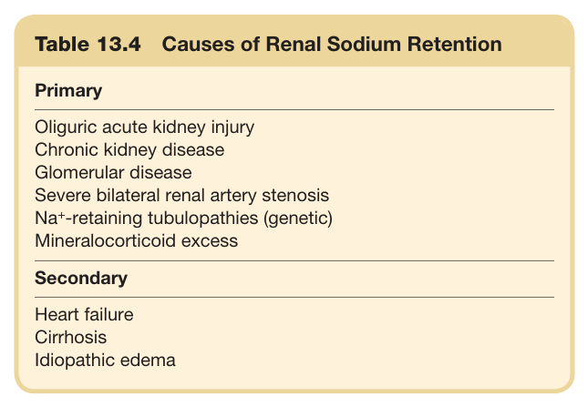

#### Table Data (CSV: [Table_13_4.csv](Table_13_4.csv))

```markdown
| Table Text (OCR) |
| :--- |
| Table 13.4  Causes of Renal Sodium Retention Primary    Oliguric acute kidney injury    Chronic kidney disease    Glomerular disease    Severe bilateral renal artery stenosis    Na+-retaining tubulopathies (genetic)    Mineralocorticoid excess    Secondary    Heart failure    Cirrhosis    Idiopathic edema |
```

Table 13.4 Causes of Renal Sodium Retention

---

### Table_13_5

#### Table Image

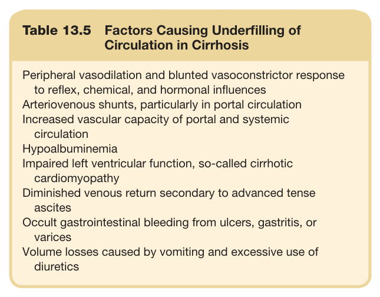

#### Table Data (CSV: [Table_13_5.csv](Table_13_5.csv))

```markdown
| Table Text (OCR) |
| :--- |
| Table 13.5  Factors Causing Underfilling of Circulation in Cirrhosis Peripheral vasodilation and blunted vasoconstrictor response to reflex, chemical, and hormonal influences Arteriovenous shunts, particularly in portal circulation Increased vascular capacity of portal and systemic circulation Hypoalbuminemia Impaired left ventricular function, so-called cirrhotic cardiomyopathy Diminished venous return secondary to advanced tense ascites Occult gastrointestinal bleeding from ulcers, gastritis, or varices Volume losses caused by vomiting and excessive use of diuretics |
```

Table 13.5 Factors Causing Underfilling of Circulation in Cirrhosis

---

### Table_13_6

#### Table Image

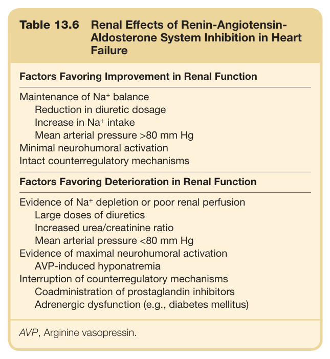

#### Table Data (CSV: [Table_13_6.csv](Table_13_6.csv))

```markdown
| Table Text (OCR) |
| :--- |
| Table 13.6 Renal Effects of Renin-Angiotensin- Aldosterone System Inhibition in Heart Failure Factors Favoring Improvement in Renal Function Maintenance of Na+ balance    Reduction in diuretic dosage    Increase in Na+ intake    Mean arterial pressure >80 mm Hg    Minimal neurohumoral activation    Intact counterregulatory mechanisms |
```

Table 13.6 Renal Effects of Renin-Angiotensin- Aldosterone System Inhibition in Heart Failure

---
