# 14. Disorders of Water Balance - Figures and Tables Index

This document lists all figures, tables and boxes extracted from `14. Disorders of Water Balance.pdf`.

## Table of Contents
- [Figures](#figures)
- [Tables](#tables)
- [Boxes](#boxes)

---

## Figures

### Fig_14_1

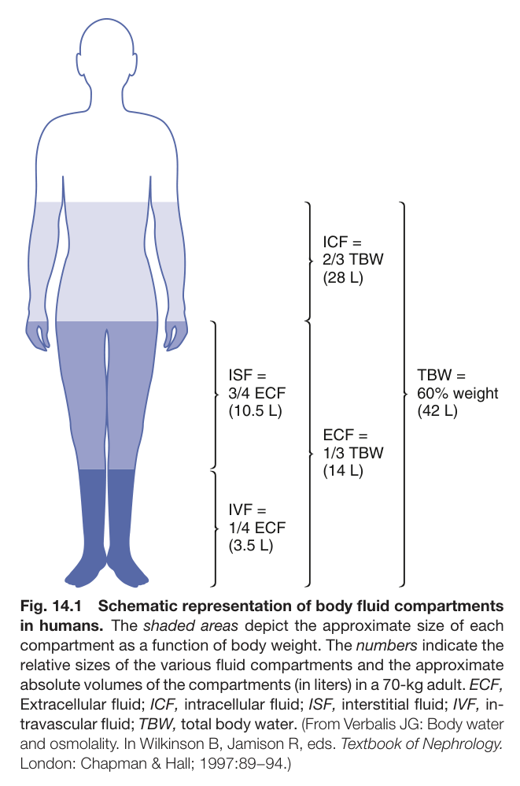

Fig. 14.1 Schematic representation of body fluid compartments in humans. The shaded areas depict the approximate size of each compartment as a function of body weight. The numbers indicate the relative sizes of the various fluid compartments and the approximate absolute volumes of the compartments (in liters) in a 70-kg adult. ECF, Extracellular fluid; ICF, intracellular fluid; ISF, interstitial fluid; IVF, in- travascular fluid; TBW, total body water. (From Verbalis JG: Body water and osmolality. In Wilkinson B, Jamison R, eds. Textbook of Nephrology. London: Chapman & Hall; 1997:89−94.)

---

### Fig_14_2

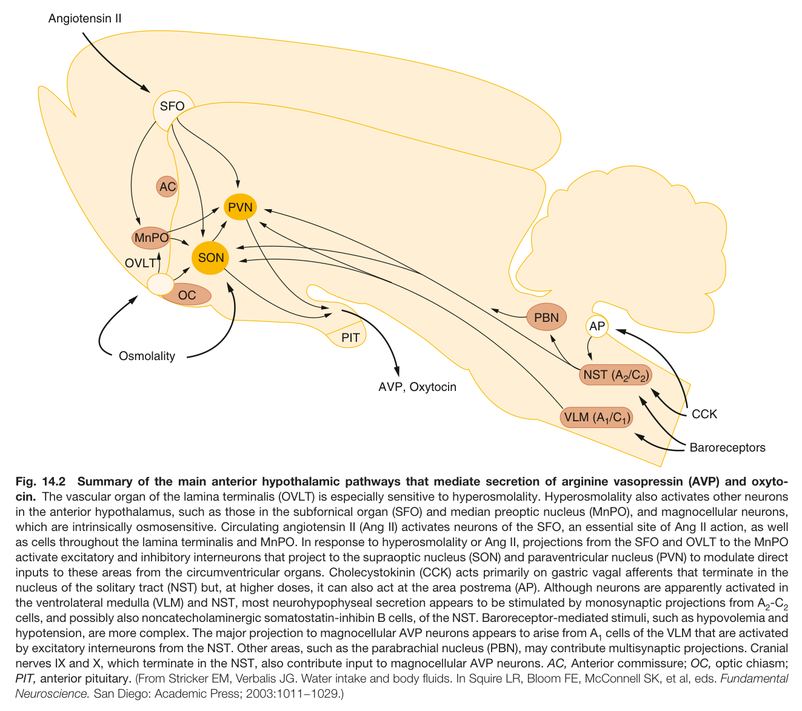

Fig. 14.2 Summary of the main anterior hypothalamic pathways that mediate secretion of arginine vasopressin (AVP) and oxyto cin. The vascular organ of the lamina terminalis (OVLT) is especially sensitive to hyperosmolality. Hyperosmolality also activates other neurons in the anterior hypothalamus, such as those in the subfornical organ (SFO) and median preoptic nucleus (MnPO), and magnocellular neurons, which are intrinsically osmosensitive. Circulating angiotensin II (Ang II) activates neurons of the SFO, an essential site of Ang II action, as wel as cells throughout the lamina terminalis and MnPO. In response to hyperosmolality or Ang II, projections from the SFO and OVLT to the MnPO activate excitatory and inhibitory interneurons that project to the supraoptic nucleus (SON) and paraventricular nucleus (PVN) to modulate direct inputs to these areas from the circumventricular organs. Cholecystokinin (CCK) acts primarily on gastric vagal afferents that terminate in the nucleus of the solitary tract (NST) but, at higher doses, it can also act at the area postrema (AP). Although neurons are apparently activated in the ventrolateral medulla (VLM) and NST, most neurohypophyseal secretion appears to be stimulated by monosynaptic projections from A -C cells, and possibly also noncatecholaminergic somatostatin-inhibin B cells, of the NST. Baroreceptor-mediated stimuli, such as hypovolemia and hypotension, are more complex. The major projection to magnocellular AVP neurons appears to arise from A cells of the VLM that are activated by excitatory interneurons from the NST. Other areas, such as the parabrachial nucleus (PBN), may contribute multisynaptic projections. Crania nerves IX and X, which terminate in the NST, also contribute input to magnocellular AVP neurons. AC, Anterior commissure; OC, optic chiasm; PIT, anterior pituitary. (From Stricker EM, Verbalis JG. Water intake and body fluids. In Squire LR, Bloom FE, McConnell SK, et al, eds. Fundamenta Neuroscience. San Diego: Academic Press; 2003:1011−1029.)

---

### Fig_14_3

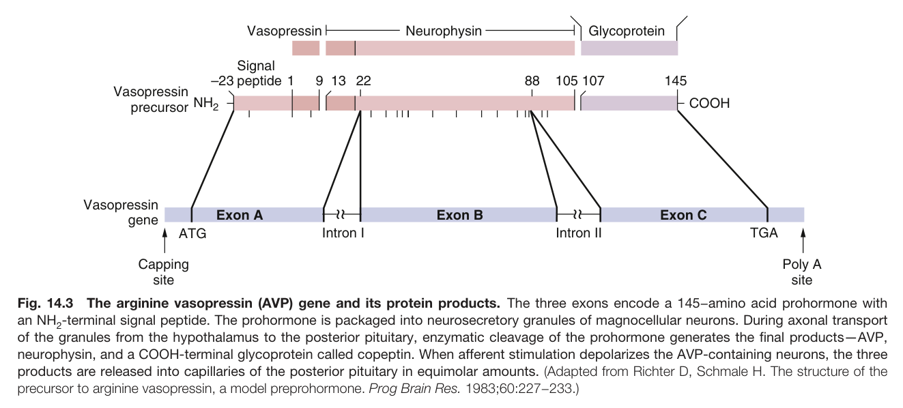

Fig. 14.3 The arginine vasopressin (AVP) gene and its protein products. The three exons encode a 145−amino acid prohormone with an NH -terminal signal peptide. The prohormone is packaged into neurosecretory granules of magnocellular neurons. During axonal transport of the granules from the hypothalamus to the posterior pituitary, enzymatic cleavage of the prohormone generates the final products—AVP, neurophysin, and a COOH-terminal glycoprotein called copeptin. When afferent stimulation depolarizes the AVP-containing neurons, the three products are released into capillaries of the posterior pituitary in equimolar amounts. (Adapted from Richter D, Schmale H. The structure of the precursor to arginine vasopressin, a model preprohormone. Prog Brain Res. 1983;60:227−233.)

---

### Fig_14_4

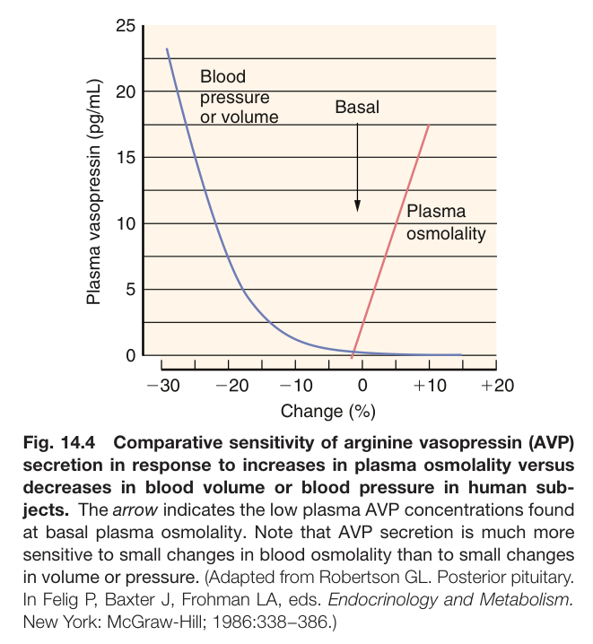

Fig. 14.4 Comparative sensitivity of arginine vasopressin (AVP) secretion in response to increases in plasma osmolality versus decreases in blood volume or blood pressure in human sub- jects. The arrow indicates the low plasma AVP concentrations found at basal plasma osmolality. Note that AVP secretion is much more sensitive to small changes in blood osmolality than to small changes in volume or pressure. (Adapted from Robertson GL. Posterior pituitary. In Felig P, Baxter J, Frohman LA, eds. Endocrinology and Metabolism. New York: McGraw-Hill; 1986:338−386.)

---

### Fig_14_5

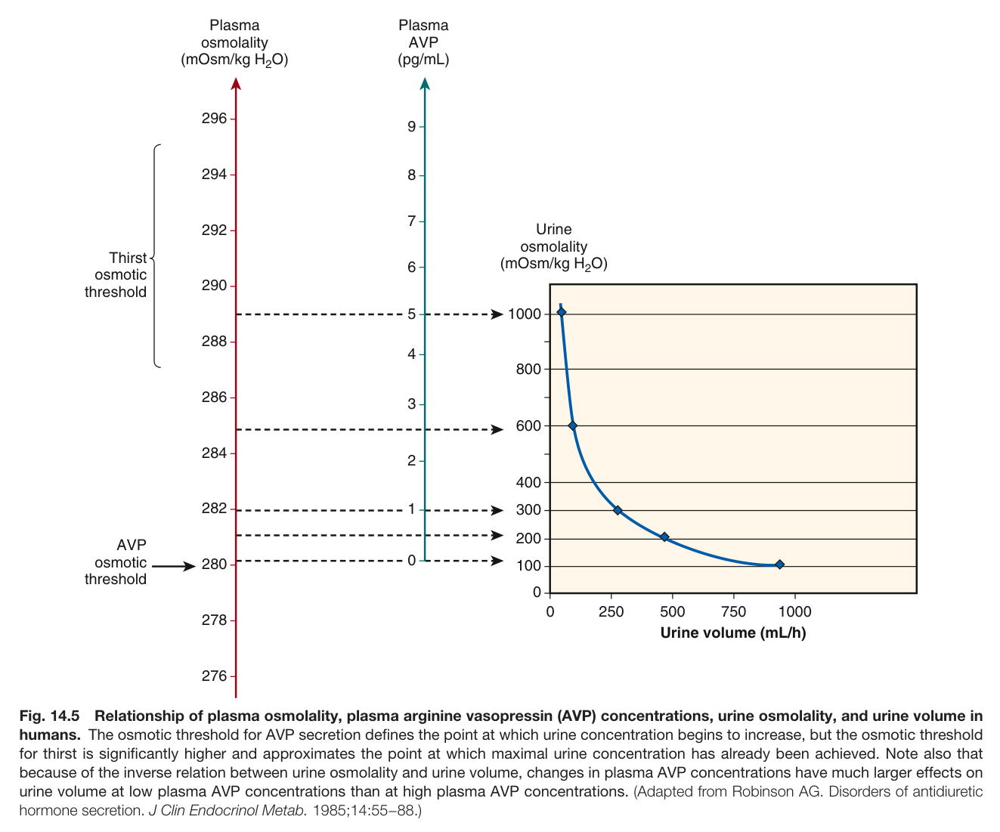

Fig. 14.5 Relationship of plasma osmolality, plasma arginine vasopressin (AVP) concentrations, urine osmolality, and urine volume in humans. The osmotic threshold for AVP secretion defines the point at which urine concentration begins to increase, but the osmotic threshold for thirst is significantly higher and approximates the point at which maximal urine concentration has already been achieved. Note also that because of the inverse relation between urine osmolality and urine volume, changes in plasma AVP concentrations have much larger effects on urine volume at low plasma AVP concentrations than at high plasma AVP concentrations. (Adapted from Robinson AG. Disorders of antidiuretic hormone secretion. J Clin Endocrinol Metab. 1985;14:55−88.)

---

### Fig_14_6

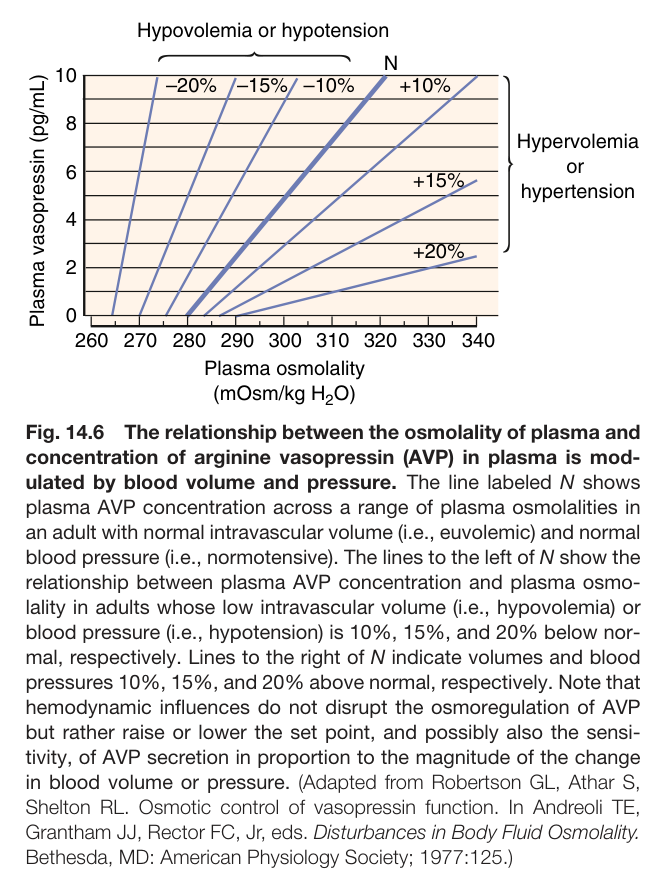

Fig. 14.6 The relationship between the osmolality of plasma and concentration of arginine vasopressin (AVP) in plasma is mod- ulated by blood volume and pressure. The line labeled N shows plasma AVP concentration across a range of plasma osmolalities in an adult with normal intravascular volume (i.e., euvolemic) and norma blood pressure (i.e., normotensive). The lines to the left of N show the relationship between plasma AVP concentration and plasma osmo- lality in adults whose low intravascular volume (i.e., hypovolemia) or blood pressure (i.e., hypotension) is 10%, 15%, and 20% below nor- mal, respectively. Lines to the right of N indicate volumes and blood pressures 10%, 15%, and 20% above normal, respectively. Note that hemodynamic influences do not disrupt the osmoregulation of AVP but rather raise or lower the set point, and possibly also the sensi- tivity, of AVP secretion in proportion to the magnitude of the change in blood volume or pressure. (Adapted from Robertson GL, Athar S, Shelton RL. Osmotic control of vasopressin function. In Andreoli TE, Grantham JJ, Rector FC, Jr, eds. Disturbances in Body Fluid Osmolality. Bethesda, MD: American Physiology Society; 1977:125.)

---

### Fig_14_7

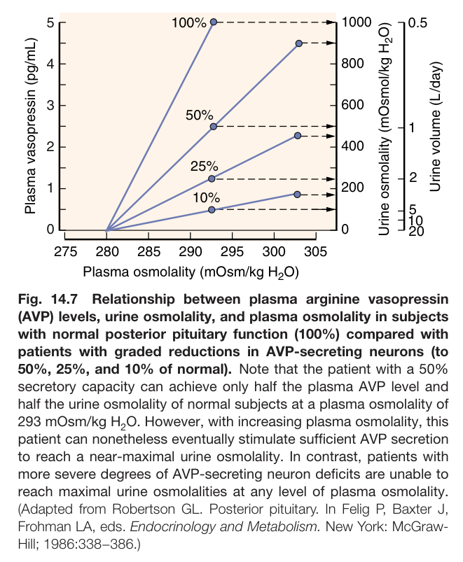

Fig. 14.7 Relationship between plasma arginine vasopressin (AVP) levels, urine osmolality, and plasma osmolality in subjects with normal posterior pituitary function (100%) compared with patients with graded reductions in AVP-secreting neurons (to 50%, 25%, and 10% of normal). Note that the patient with a 50% secretory capacity can achieve only half the plasma AVP level and half the urine osmolality of normal subjects at a plasma osmolality of 293 mOsm/kg H O. However, with increasing plasma osmolality, this patient can nonetheless eventually stimulate sufficient AVP secretion to reach a near-maximal urine osmolality. In contrast, patients with more severe degrees of AVP-secreting neuron deficits are unable to reach maximal urine osmolalities at any level of plasma osmolality. (Adapted from Robertson GL. Posterior pituitary. In Felig P, Baxter J, Frohman LA, eds. Endocrinology and Metabolism. New York: McGraw- Hill; 1986:338−386.)

---

### Fig_14_8

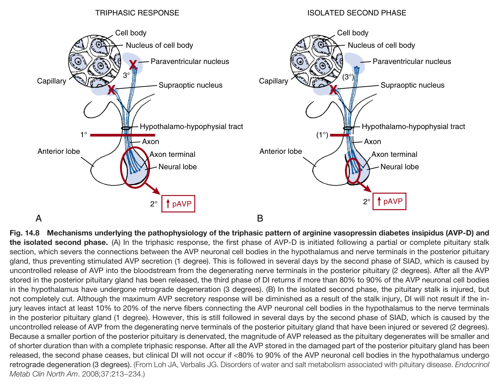

Fig. 14.8 Mechanisms underlying the pathophysiology of the triphasic pattern of arginine vasopressin diabetes insipidus (AVP-D) and the isolated second phase. (A) In the triphasic response, the first phase of AVP-D is initiated following a partial or complete pituitary stalk section, which severs the connections between the AVP neuronal cell bodies in the hypothalamus and nerve terminals in the posterior pituitary gland, thus preventing stimulated AVP secretion (1 degree). This is followed in several days by the second phase of SIAD, which is caused by uncontrolled release of AVP into the bloodstream from the degenerating nerve terminals in the posterior pituitary (2 degrees). After all the AVP stored in the posterior pituitary gland has been released, the third phase of DI returns if more than 80% to 90% of the AVP neuronal cell bodies in the hypothalamus have undergone retrograde degeneration (3 degrees). (B) In the isolated second phase, the pituitary stalk is injured, but not completely cut. Although the maximum AVP secretory response will be diminished as a result of the stalk injury, DI will not result if the in- jury leaves intact at least 10% to 20% of the nerve fibers connecting the AVP neuronal cell bodies in the hypothalamus to the nerve terminals in the posterior pituitary gland (1 degree). However, this is still followed in several days by the second phase of SIAD, which is caused by the uncontrolled release of AVP from the degenerating nerve terminals of the posterior pituitary gland that have been injured or severed (2 degrees). Because a smaller portion of the posterior pituitary is denervated, the magnitude of AVP released as the pituitary degenerates will be smaller and of shorter duration than with a complete triphasic response. After all the AVP stored in the damaged part of the posterior pituitary gland has been released, the second phase ceases, but clinical DI will not occur if <80% to 90% of the AVP neuronal cell bodies in the hypothalamus undergo retrograde degeneration (3 degrees). (From Loh JA, Verbalis JG. Disorders of water and salt metabolism associated with pituitary disease. Endocrino Metab Clin North Am. 2008;37:213−234.)

---

### Fig_14_9

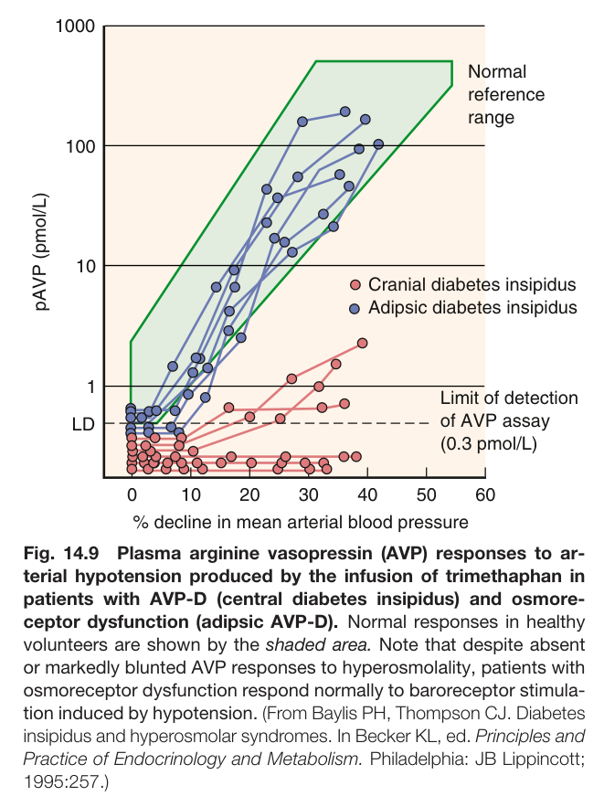

Fig. 14.9 Plasma arginine vasopressin (AVP) responses to ar- terial hypotension produced by the infusion of trimethaphan in patients with AVP-D (central diabetes insipidus) and osmore- ceptor dysfunction (adipsic AVP-D). Normal responses in healthy volunteers are shown by the shaded area. Note that despite absent or markedly blunted AVP responses to hyperosmolality, patients with osmoreceptor dysfunction respond normally to baroreceptor stimula- tion induced by hypotension. (From Baylis PH, Thompson CJ. Diabetes insipidus and hyperosmolar syndromes. In Becker KL, ed. Principles and Practice of Endocrinology and Metabolism. Philadelphia: JB Lippincott; 1995:257.)

---

### Fig_14_10

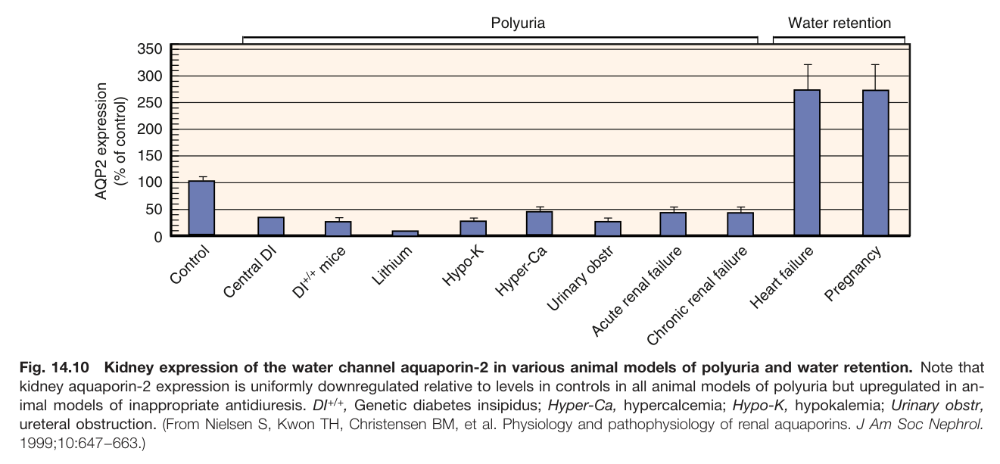

Fig. 14.10 Kidney expression of the water channel aquaporin-2 in various animal models of polyuria and water retention. Note that kidney aquaporin-2 expression is uniformly downregulated relative to levels in controls in all animal models of polyuria but upregulated in an imal models of inappropriate antidiuresis. DI<sup>+/+</sup>, Genetic diabetes insipidus; Hyper-Ca, hypercalcemia; Hypo-K, hypokalemia; Urinary obstr, ureteral obstruction. (From Nielsen S, Kwon TH, Christensen BM, et al. Physiology and pathophysiology of renal aquaporins. J Am Soc Nephrol. 1999;10:647−663.)

---

### Fig_14_11

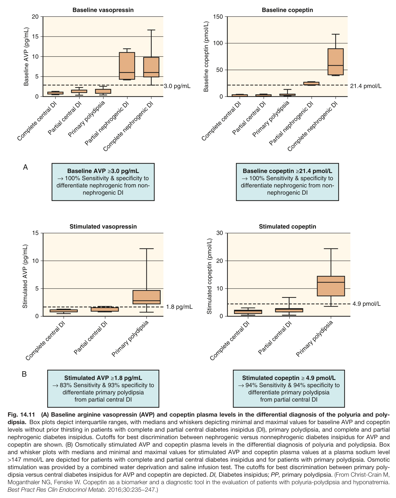

Fig. 14.11 (A) Baseline arginine vasopressin (AVP) and copeptin plasma levels in the differential diagnosis of the polyuria and poly dipsia. Box plots depict interquartile ranges, with medians and whiskers depicting minimal and maximal values for baseline AVP and copeptin levels without prior thirsting in patients with complete and partial central diabetes insipidus (DI), primary polydipsia, and complete and partia nephrogenic diabetes insipidus. Cutoffs for best discrimination between nephrogenic versus nonnephrogenic diabetes insipidus for AVP and copeptin are shown. (B) Osmotically stimulated AVP and copeptin plasma levels in the differential diagnosis of polyuria and polydipsia. Box and whisker plots with medians and minimal and maximal values for stimulated AVP and copeptin plasma values at a plasma sodium leve >147 mmol/L are depicted for patients with complete and partial central diabetes insipidus and for patients with primary polydipsia. Osmotic stimulation was provided by a combined water deprivation and saline infusion test. The cutoffs for best discrimination between primary polydipsia versus central diabetes insipidus for AVP and copeptin are depicted. DI, Diabetes insipidus; PP, primary polydipsia. (From Christ-Crain M, Moganthaler NG, Fenske W. Copeptin as a biomarker and a diagnostic tool in the evaluation of patients with polyuria-polydipsia and hyponatremia. Best Pract Res Clin Endocrinol Metab. 2016;30:235−247.)

---

### Fig_14_12

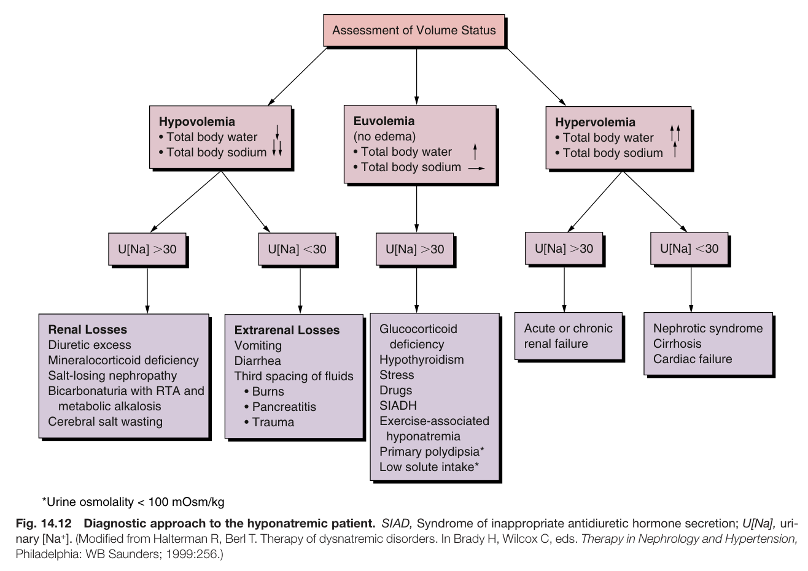

Fig. 14.12 Diagnostic approach to the hyponatremic patient. SIAD, Syndrome of inappropriate antidiuretic hormone secretion; U[Na], uri nary [Na<sup>+</sup>]. (Modified from Halterman R, Berl T. Therapy of dysnatremic disorders. In Brady H, Wilcox C, eds. Therapy in Nephrology and Hypertension, Philadelphia: WB Saunders; 1999:256.)

---

### Fig_14_13

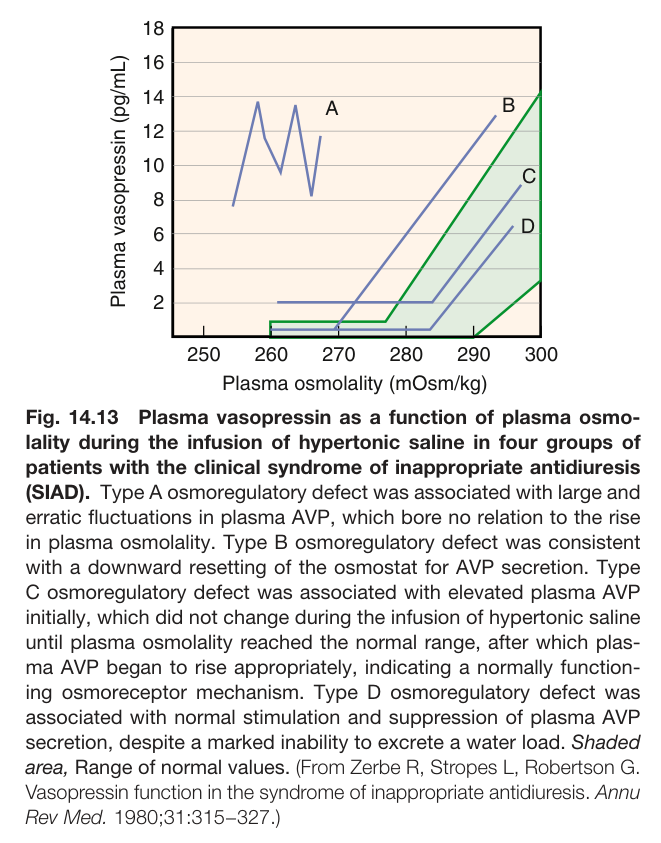

Fig. 14.13 Plasma vasopressin as a function of plasma osmo- lality during the infusion of hypertonic saline in four groups of patients with the clinical syndrome of inappropriate antidiuresis (SIAD). Type A osmoregulatory defect was associated with large and erratic fluctuations in plasma AVP, which bore no relation to the rise in plasma osmolality. Type B osmoregulatory defect was consistent with a downward resetting of the osmostat for AVP secretion. Type C osmoregulatory defect was associated with elevated plasma AVP initially, which did not change during the infusion of hypertonic saline until plasma osmolality reached the normal range, after which plas- ma AVP began to rise appropriately, indicating a normally function- ing osmoreceptor mechanism. Type D osmoregulatory defect was associated with normal stimulation and suppression of plasma AVP secretion, despite a marked inability to excrete a water load. Shaded area, Range of normal values. (From Zerbe R, Stropes L, Robertson G. Vasopressin function in the syndrome of inappropriate antidiuresis. Annu Rev Med. 1980;31:315−327.)

---

### Fig_14_14

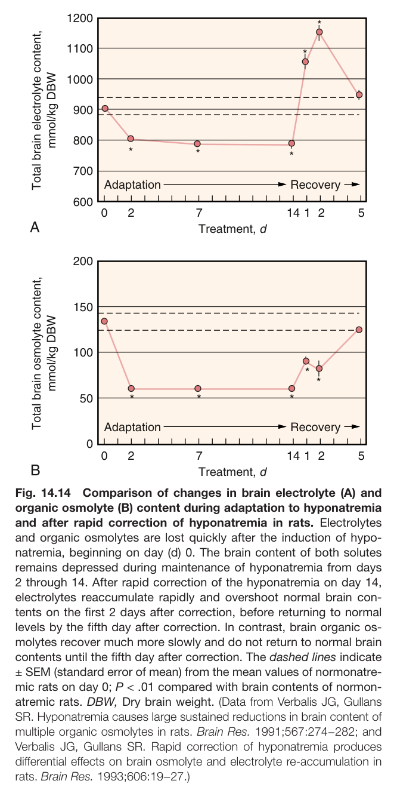

Fig. 14.14 Comparison of changes in brain electrolyte (A) and organic osmolyte (B) content during adaptation to hyponatremia and after rapid correction of hyponatremia in rats. Electrolytes and organic osmolytes are lost quickly after the induction of hypo- natremia, beginning on day (d) 0. The brain content of both solutes remains depressed during maintenance of hyponatremia from days 2 through 14. After rapid correction of the hyponatremia on day 14, electrolytes reaccumulate rapidly and overshoot normal brain con- tents on the first 2 days after correction, before returning to normal levels by the fifth day after correction. In contrast, brain organic os- molytes recover much more slowly and do not return to normal brain contents until the fifth day after correction. The dashed lines indicate ± SEM (standard error of mean) from the mean values of normonatre- mic rats on day 0; P < .01 compared with brain contents of normon- atremic rats. DBW, Dry brain weight. (Data from Verbalis JG, Gullans SR. Hyponatremia causes large sustained reductions in brain content of multiple organic osmolytes in rats. Brain Res. 1991;567:274−282; and Verbalis JG, Gullans SR. Rapid correction of hyponatremia produces differential effects on brain osmolyte and electrolyte re-accumulation in rats. Brain Res. 1993;606:19−27.)

---

### Fig_14_15

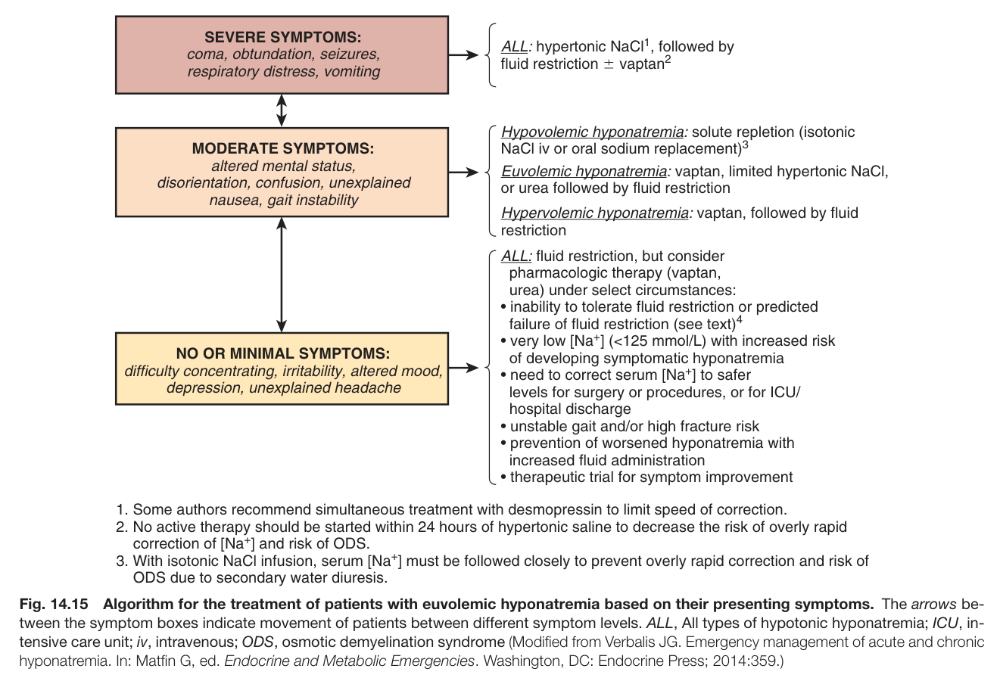

Fig. 14.15 Algorithm for the treatment of patients with euvolemic hyponatremia based on their presenting symptoms. The arrows between the symptom boxes indicate movement of patients between different symptom levels. ALL, All types of hypotonic hyponatremia; ICU, intensive care unit; iv, intravenous; ODS, osmotic demyelination syndrome (Modified from Verbalis JG. Emergency management of acute and chronic hyponatremia. In: Matfin G, ed. Endocrine and Metabolic Emergencies. Washington, DC: Endocrine Press; 2014:359.)

---

### Fig_14_16

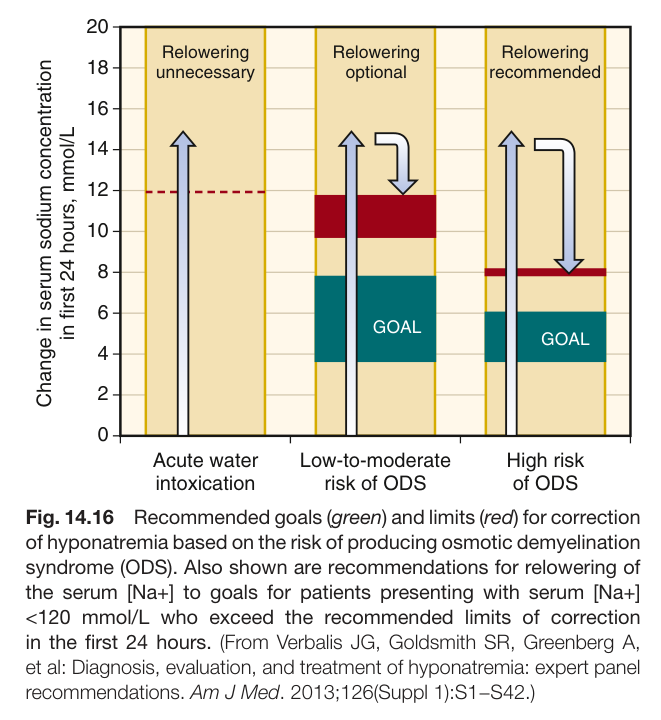

Fig. 14.16 Recommended goals (green) and limits (red) for correction of hyponatremia based on the risk of producing osmotic demyelination syndrome (ODS). Also shown are recommendations for relowering of the serum [Na+] to goals for patients presenting with serum [Na+] <120 mmol/L who exceed the recommended limits of correction in the first 24 hours. (From Verbalis JG, Goldsmith SR, Greenberg A, et al: Diagnosis, evaluation, and treatment of hyponatremia: expert pane recommendations. Am J Med. 2013;126(Suppl 1):S1−S42.)

---

## Tables

### Table_14_1

#### Table Image

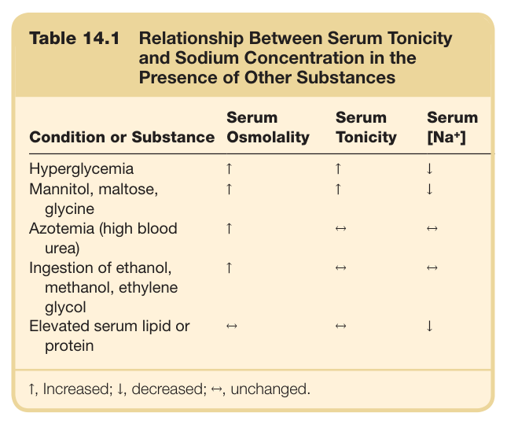

#### Table Data (CSV: [Table_14_1.csv](Table_14_1.csv))

```markdown
| Table Text (OCR) |
| :--- |
| Table 14.1  Relationship Between Serum Tonicity and Sodium Concentration in the Presence of Other Substances Condition or Substance  Serum Osmolality  Serum Tonicity  Serum [Na+]    Hyperglycemia  ↑  ↑  ↓    Mannitol, maltose, glycine  ↑  ↑  ↓    Azotemia (high blood urea)  ↑  ↔  ↔    Ingestion of ethanol, methanol, ethylene glycol  ↑  ↔  ↔    Elevated serum lipid or protein  ↔  ↔  ↓ ↑, Increased; ↓, decreased; ↔, unchanged. |
```

Table 14.1 Relationship Between Serum Tonicity and Sodium Concentration in the Presence of Other Substances

---

### Table_14_2

#### Table Image

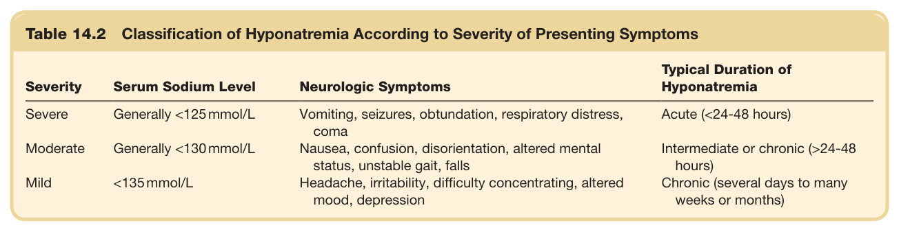

#### Table Data (CSV: [Table_14_2.csv](Table_14_2.csv))

```markdown
| Table Text (OCR) |
| :--- |
| Table 14.2  Classification of Hyponatremia According to Severity of Presenting Symptoms Severity  Serum Sodium Level  Neurologic Symptoms  Typical Duration of Hyponatremia    Severe  Generally <125 mmol/L  Vomiting, seizures, obtundation, respiratory distress, coma  Acute (<24-48 hours)    Moderate  Generally <130 mmol/L  Nausea, confusion, disorientation, altered mental status, unstable gait, falls  Intermediate or chronic (>24-48 hours)    Mild  <135 mmol/L  Headache, irritability, difficulty concentrating, altered mood, depression  Chronic (several days to many weeks or months) |
```

Table 14.2 Classification of Hyponatremia According to Severity of Presenting Symptoms

---

### Table_14_3

#### Table Image

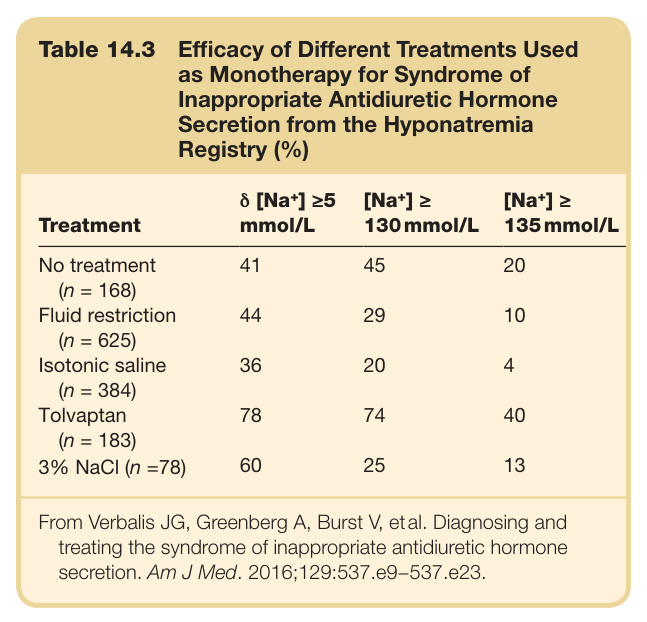

#### Table Data (CSV: [Table_14_3.csv](Table_14_3.csv))

```markdown
| Table Text (OCR) |
| :--- |
| Table 14.3 Efficacy of Different Treatments Used as Monotherapy for Syndrome of Inappropriate Antidiuretic Hormone Secretion from the Hyponatremia Registry (%) Treatment   \delta  [Na+] ≥5 mmol/L  [Na+] ≥ 130 mmol/L  [Na+] ≥ 135 mmol/L    No treatment (n = 168)  41  45  20    Fluid restriction (n = 625)  44  29  10    Isotonic saline (n = 384)  36  20  4    Tolvaptan (n = 183)  78  74  40    3% NaCl (n =78)  60  25  13 From Verbalis JG, Greenberg A, Burst V, etal. Diagnosing and treating the syndrome of inappropriate antidiuretic hormone secretion. Am J Med. 2016;129:537.e9−537.e23. |
```

Table 14.3 Efficacy of Different Treatments Used as Monotherapy for Syndrome of Inappropriate Antidiuretic Hormone Secretion from the Hyponatremia Registry (%)

---

## Boxes

### Box_14_1

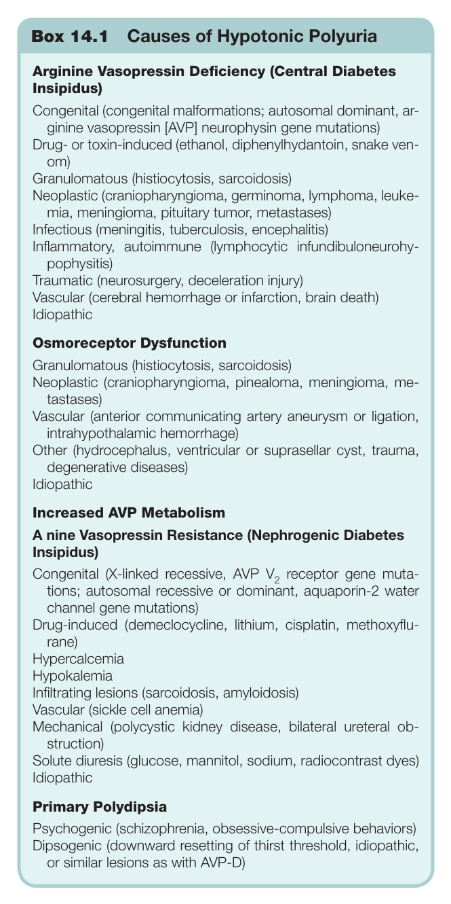

#### Box Text

```markdown
Box 14.1 Causes of Hypotonic Polyuria Arginine Vasopressin Deficiency (Central Diabetes Insipidus) Congenital (congenital malformations; autosomal dominant, ar- ginine vasopressin [AVP] neurophysin gene mutations) Drug- or toxin-induced (ethanol, diphenylhydantoin, snake ven- om) Granulomatous (histiocytosis, sarcoidosis) Neoplastic (craniopharyngioma, germinoma, lymphoma, leuke- mia, meningioma, pituitary tumor, metastases) Infectious (meningitis, tuberculosis, encephalitis) Inflammatory, autoimmune (lymphocytic infundibuloneurohy pophysitis) Traumatic (neurosurgery, deceleration injury) Vascular (cerebral hemorrhage or infarction, brain death) Idiopathic Osmoreceptor Dysfunction Granulomatous (histiocytosis, sarcoidosis) Neoplastic (craniopharyngioma, pinealoma, meningioma, me- tastases) Vascular (anterior communicating artery aneurysm or ligation, intrahypothalamic hemorrhage) Other (hydrocephalus, ventricular or suprasellar cyst, trauma, degenerative diseases) Idiopathic Increased AVP Metabolism A nine Vasopressin Resistance (Nephrogenic Diabetes Insipidus) Congenital (X-linked recessive, AVP V receptor gene muta- tions; autosomal recessive or dominant, aquaporin-2 water channel gene mutations) Drug-induced (demeclocycline, lithium, cisplatin, methoxyflu- rane) Hypercalcemia Hypokalemia Infiltrating lesions (sarcoidosis, amyloidosis) Vascular (sickle cell anemia) Mechanical (polycystic kidney disease, bilateral ureteral ob- struction) Solute diuresis (glucose, mannitol, sodium, radiocontrast dyes) Idiopathic Primary Polydipsia Psychogenic (schizophrenia, obsessive-compulsive behaviors) Dipsogenic (downward resetting of thirst threshold, idiopathic, or similar lesions as with AVP-D)
```

Box 14.1 Causes of Hypotonic Polyuria

---

### Box_14_2

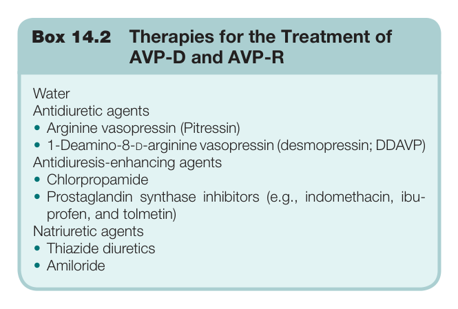

#### Box Text

```markdown
Box 14.2 Therapies for the Treatment of AVP-D and AVP-R Water Antidiuretic agents • Arginine vasopressin (Pitressin) • 1-Deamino-8-d-arginine vasopressin (desmopressin; DDAVP) Antidiuresis-enhancing agents • Chlorpropamide • Prostaglandin synthase inhibitors (e.g., indomethacin, ibu- profen, and tolmetin) Natriuretic agents • Thiazide diuretics • Amiloride
```

Box 14.2 Therapies for the Treatment of AVP-D and AVP-R

---

### Box_14_3

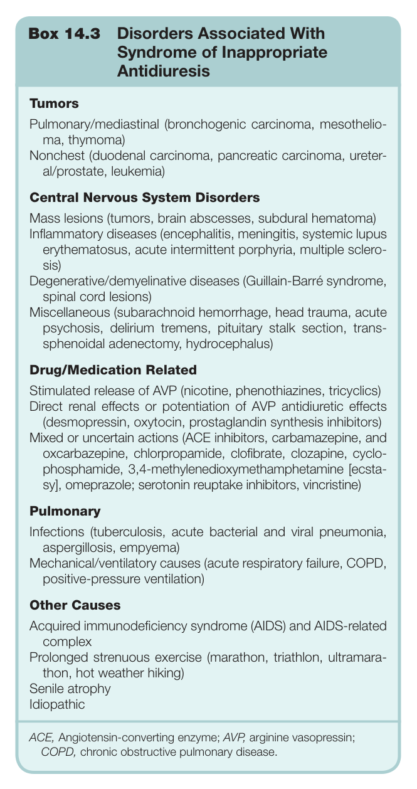

#### Box Text

```markdown
Box 14.3 Disorders Associated With Syndrome of Inappropriate Antidiuresis Tumors Pulmonary/mediastinal (bronchogenic carcinoma, mesothelio- ma, thymoma) Nonchest (duodenal carcinoma, pancreatic carcinoma, ureter- al/prostate, leukemia) Central Nervous System Disorders Mass lesions (tumors, brain abscesses, subdural hematoma) Inflammatory diseases (encephalitis, meningitis, systemic lupus erythematosus, acute intermittent porphyria, multiple sclero- sis) Degenerative/demyelinative diseases (Guillain-Barré syndrome, spinal cord lesions) Miscellaneous (subarachnoid hemorrhage, head trauma, acute psychosis, delirium tremens, pituitary stalk section, trans- sphenoidal adenectomy, hydrocephalus) Drug/Medication Related Stimulated release of AVP (nicotine, phenothiazines, tricyclics) Direct renal effects or potentiation of AVP antidiuretic effects (desmopressin, oxytocin, prostaglandin synthesis inhibitors) Mixed or uncertain actions (ACE inhibitors, carbamazepine, and oxcarbazepine, chlorpropamide, clofibrate, clozapine, cyclo- phosphamide, 3,4-methylenedioxymethamphetamine [ecsta- sy], omeprazole; serotonin reuptake inhibitors, vincristine) Pulmonary Infections (tuberculosis, acute bacterial and viral pneumonia, aspergillosis, empyema) Mechanical/ventilatory causes (acute respiratory failure, COPD, positive-pressure ventilation) Other Causes Acquired immunodeficiency syndrome (AIDS) and AIDS-related complex Prolonged strenuous exercise (marathon, triathlon, ultramara- thon, hot weather hiking) Senile atrophy Idiopathic ACE, Angiotensin-converting enzyme; AVP, arginine vasopressin; COPD, chronic obstructive pulmonary disease.
```

Box 14.3 Disorders Associated With Syndrome of Inappropriate Antidiuresis

---

### Box_14_4

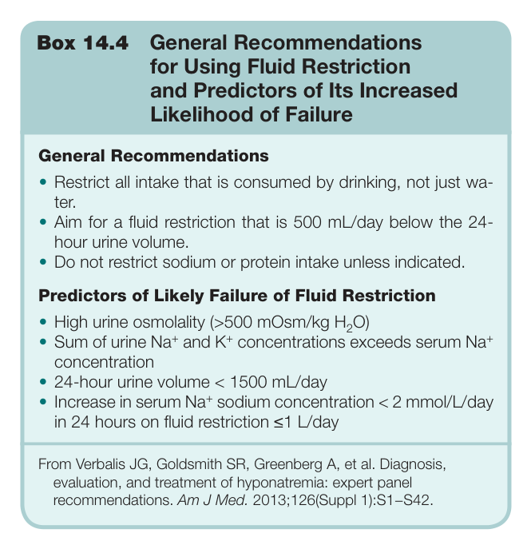

#### Box Text

```markdown
Box 14.4 General Recommendations for Using Fluid Restriction and Predictors of Its Increased Likelihood of Failure General Recommendations • Restrict all intake that is consumed by drinking, not just wa- ter. • Aim for a fluid restriction that is 500 mL/day below the 24- hour urine volume. • Do not restrict sodium or protein intake unless indicated. Predictors of Likely Failure of Fluid Restriction • High urine osmolality (>500 mOsm/kg H O) • Sum of urine Na<sup>+</sup> and K<sup>+</sup> concentrations exceeds serum Na<sup>+</sup> concentration • 24-hour urine volume < 1500 mL/day • Increase in serum Na<sup>+</sup> sodium concentration < 2 mmol/L/day in 24 hours on fluid restriction ≤1 L/day From Verbalis JG, Goldsmith SR, Greenberg A, et al. Diagnosis, evaluation, and treatment of hyponatremia: expert panel recommendations. Am J Med. 2013;126(Suppl 1):S1−S42.
```

Box 14.4 General Recommendations for Using Fluid Restriction and Predictors of Its Increased Likelihood of Failure

---

### Box_14_5

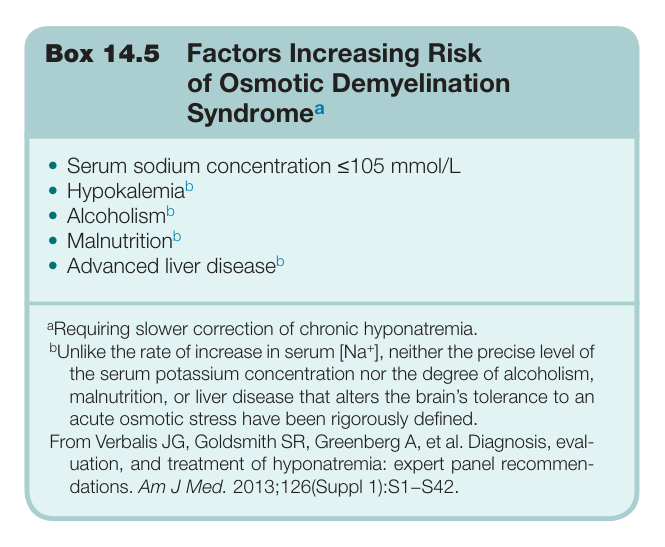

#### Box Text

```markdown
Box 14.5 Factors Increasing Risk of Osmotic Demyelination Syndrome<sup>a</sup> • Serum sodium concentration ≤105 mmol/L • Hypokalemia<sup>b</sup> • Alcoholism<sup>b</sup> • Malnutrition<sup>b</sup> • Advanced liver disease<sup>b</sup> <sup>a</sup>Requiring slower correction of chronic hyponatremia. <sup>b</sup>Unlike the rate of increase in serum [Na<sup>+</sup>], neither the precise level of the serum potassium concentration nor the degree of alcoholism, malnutrition, or liver disease that alters the brain’s tolerance to an acute osmotic stress have been rigorously defined. From Verbalis JG, Goldsmith SR, Greenberg A, et al. Diagnosis, eval- uation, and treatment of hyponatremia: expert panel recommen- dations. Am J Med. 2013;126(Suppl 1):S1−S42.
```

Box 14.5 Factors Increasing Risk of Osmotic Demyelination Syndrome<sup>a</sup>

---
