# 15. Disorders of Acid-Base Balance - Figures and Tables Index

This document lists all figures and tables extracted from `15. Disorders of Acid-Base Balance.pdf`.

## Table of Contents
- [Figures](#figures)
- [Tables](#tables)

---

## Figures

### Fig_15_1

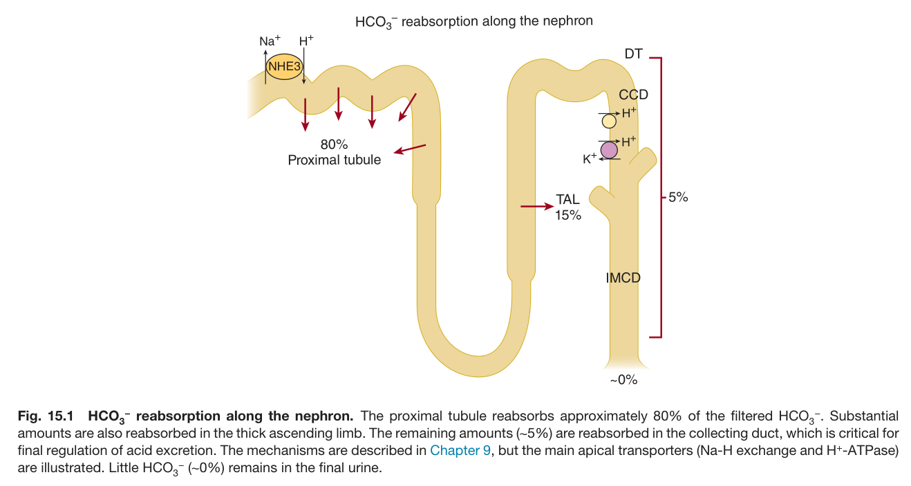

Fig. 15.1 HCO <sup>−</sup> reabsorption along the nephron. The proximal tubule reabsorbs approximately 80% of the filtered HCO <sup>−</sup>. Substantia amounts are also reabsorbed in the thick ascending limb. The remaining amounts (∼5%) are reabsorbed in the collecting duct, which is critical for final regulation of acid excretion. The mechanisms are described in Chapter 9, but the main apical transporters (Na-H exchange and H<sup>+</sup>-ATPase) are illustrated. Little HCO <sup>−</sup> (∼0%) remains in the final urine.

---

### Fig_15_2

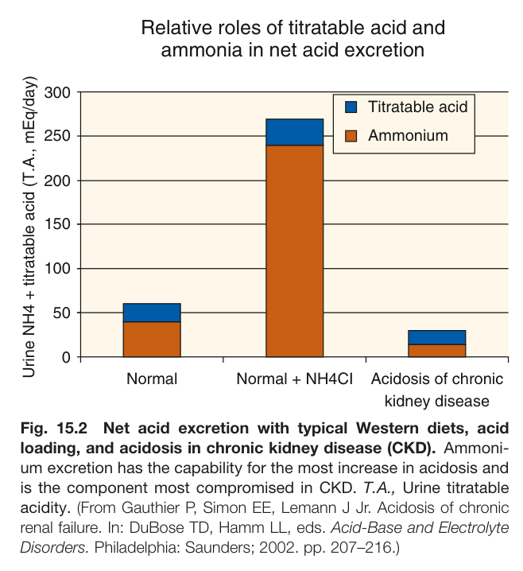

Fig. 15.2 Net acid excretion with typical Western diets, acid loading, and acidosis in chronic kidney disease (CKD). Ammoni- um excretion has the capability for the most increase in acidosis and is the component most compromised in CKD. T.A., Urine titratable acidity. (From Gauthier P, Simon EE, Lemann J Jr. Acidosis of chronic renal failure. In: DuBose TD, Hamm LL, eds. Acid-Base and Electrolyte Disorders. Philadelphia: Saunders; 2002. pp. 207–216.)

---

### Fig_15_3

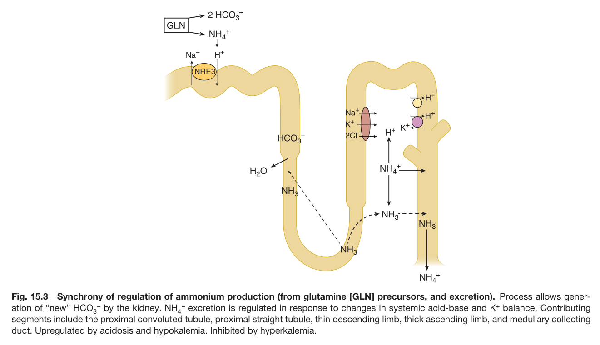

Fig. 15.3 Synchrony of regulation of ammonium production (from glutamine [GLN] precursors, and excretion). Process allows gener- ation of “new” HCO <sup>−</sup> by the kidney. NH <sup>+</sup> excretion is regulated in response to changes in systemic acid-base and K<sup>+</sup> balance. Contributing segments include the proximal convoluted tubule, proximal straight tubule, thin descending limb, thick ascending limb, and medullary collecting duct. Upregulated by acidosis and hypokalemia. Inhibited by hyperkalemia.

---

### Fig_15_4

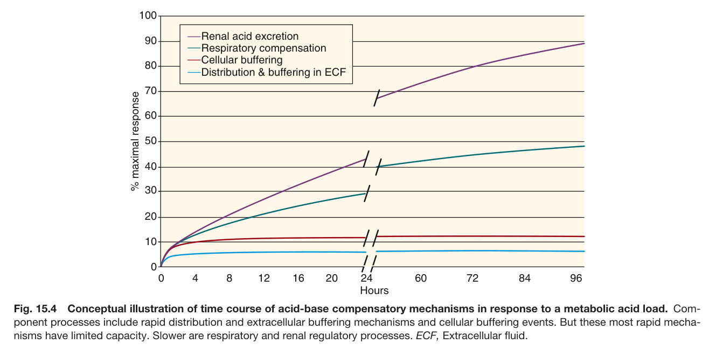

Fig. 15.4 Conceptual illustration of time course of acid-base compensatory mechanisms in response to a metabolic acid load. Com- ponent processes include rapid distribution and extracellular buffering mechanisms and cellular buffering events. But these most rapid mecha nisms have limited capacity. Slower are respiratory and renal regulatory processes. ECF, Extracellular fluid.

---

### Fig_15_5

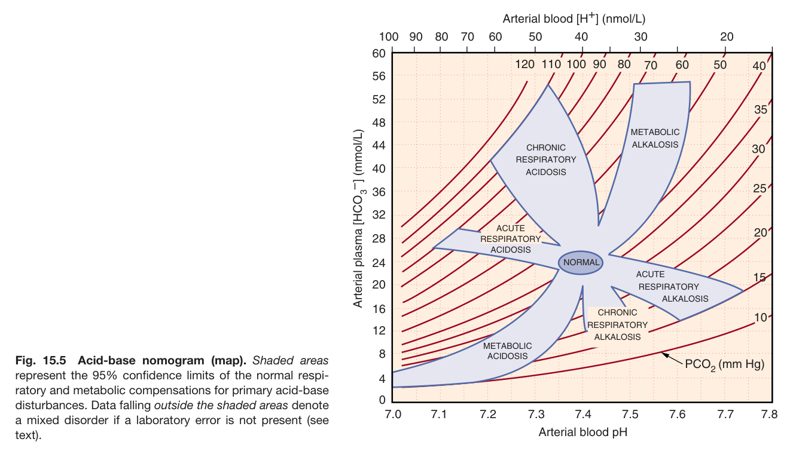

Fig. 15.5 Acid-base nomogram (map). Shaded areas represent the 95% confidence limits of the normal respi- ratory and metabolic compensations for primary acid-base disturbances. Data falling outside the shaded areas denote a mixed disorder if a laboratory error is not present (see text).

---

### Fig_15_6

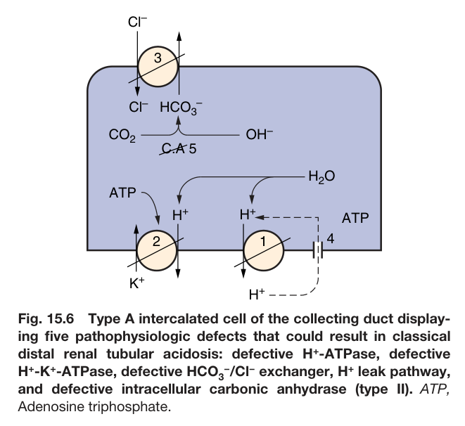

Fig. 15.6 Type A intercalated cell of the collecting duct display- ing five pathophysiologic defects that could result in classical distal renal tubular acidosis: defective H<sup>+</sup>-ATPase, defective H<sup>+</sup>-K<sup>+</sup>-ATPase, defective HCO <sup>−</sup>/Cl<sup>−</sup> exchanger, H<sup>+</sup> leak pathway, and defective intracellular carbonic anhydrase (type II). ATP, Adenosine triphosphate.

---

### Fig_15_7

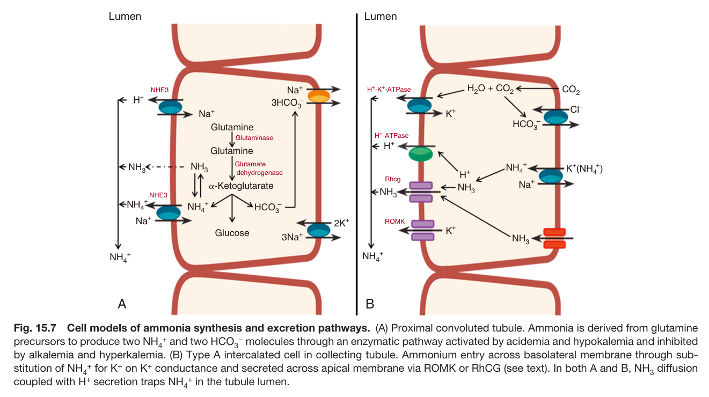

Fig. 15.7 Cell models of ammonia synthesis and excretion pathways. (A) Proximal convoluted tubule. Ammonia is derived from glutamine precursors to produce two NH <sup>+</sup> and two HCO <sup>−</sup> molecules through an enzymatic pathway activated by acidemia and hypokalemia and inhibited by alkalemia and hyperkalemia. (B) Type A intercalated cell in collecting tubule. Ammonium entry across basolateral membrane through sub- stitution of NH <sup>+</sup> for K<sup>+</sup> on K<sup>+</sup> conductance and secreted across apical membrane via ROMK or RhCG (see text). In both A and B, NH diffusion coupled with H<sup>+</sup> secretion traps NH <sup>+</sup> in the tubule lumen.

---

### Fig_15_8

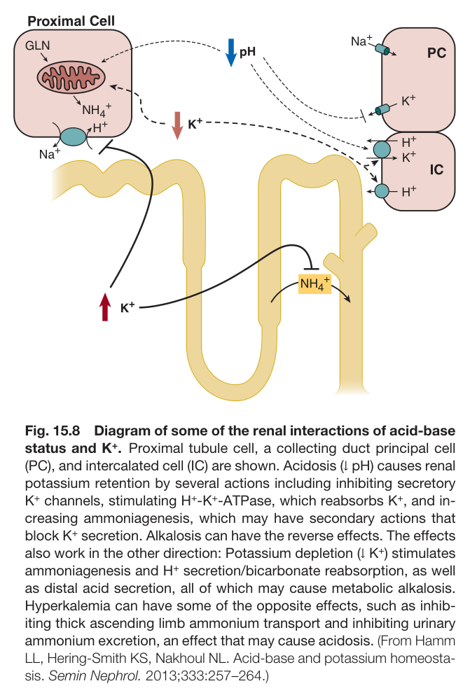

Fig. 15.8 Diagram of some of the renal interactions of acid-base status and K<sup>+</sup>. Proximal tubule cell, a collecting duct principal cell (PC), and intercalated cell (IC) are shown. Acidosis (↓ pH) causes renal potassium retention by several actions including inhibiting secretory K<sup>+</sup> channels, stimulating H<sup>+</sup>-K<sup>+</sup>-ATPase, which reabsorbs K<sup>+</sup>, and in- creasing ammoniagenesis, which may have secondary actions that block K<sup>+</sup> secretion. Alkalosis can have the reverse effects. The effects also work in the other direction: Potassium depletion (↓ K<sup>+</sup>) stimulates ammoniagenesis and H<sup>+</sup> secretion/bicarbonate reabsorption, as well as distal acid secretion, all of which may cause metabolic alkalosis. Hyperkalemia can have some of the opposite effects, such as inhib- iting thick ascending limb ammonium transport and inhibiting urinary ammonium excretion, an effect that may cause acidosis. (From Hamm LL, Hering-Smith KS, Nakhoul NL. Acid-base and potassium homeosta- sis. Semin Nephrol. 2013;333:257–264.)

---

### Fig_15_9

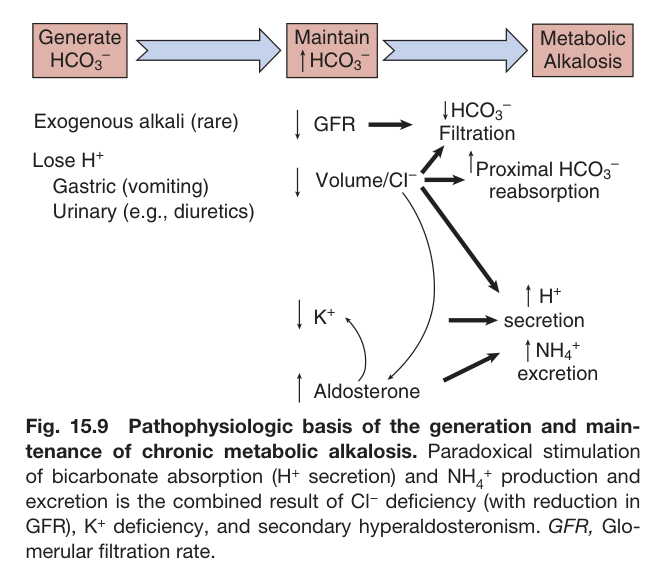

Fig. 15.9 Pathophysiologic basis of the generation and main- tenance of chronic metabolic alkalosis. Paradoxical stimulation of bicarbonate absorption (H<sup>+</sup> secretion) and NH <sup>+</sup> production and excretion is the combined result of Cl<sup>−</sup> deficiency (with reduction in GFR), K<sup>+</sup> deficiency, and secondary hyperaldosteronism. GFR, Glo- merular filtration rate.

---

### Fig_15_10

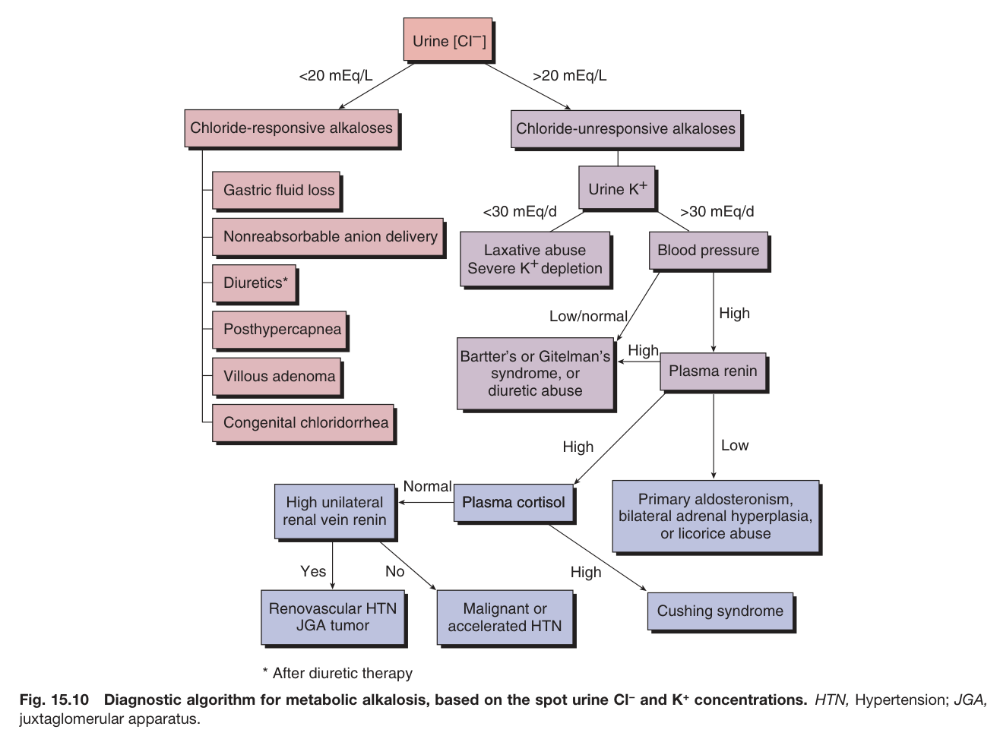

Fig. 15.10 Diagnostic algorithm for metabolic alkalosis, based on the spot urine Cl<sup>−</sup> and K<sup>+</sup> concentrations. HTN, Hypertension; JGA, juxtaglomerular apparatus.

---

## Tables

### Table_15_1

#### Table Image

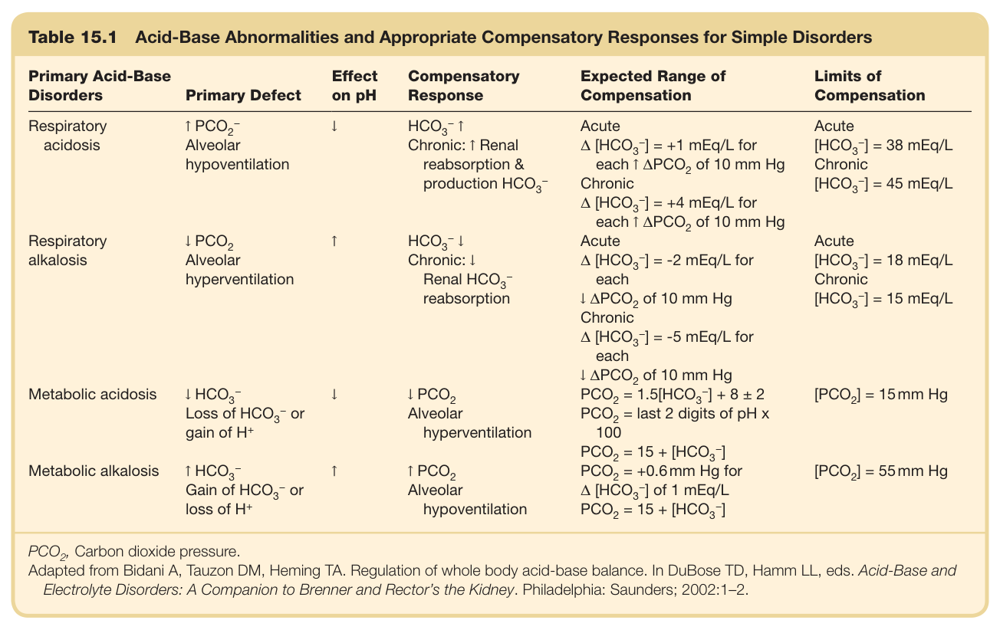

#### Table Data (CSV: [Table_15_1.csv](Table_15_1.csv))

```markdown
| Table Text (OCR) |
| :--- |
| Table 15.1 Acid-Base Abnormalities and Appropriate Compensatory Responses for Simple Disorders Primary Acid-Base Disorders  Primary Defect  Effect on pH  Compensatory Response  Expected Range of Compensation  Limits of Compensation    Respiratory acidosis  ↑  PCO_{2}^{-} Alveolar hypoventilation  ↓   HCO_{3}^{-}  ↑Chronic: ↑ Renal reabsorption & production  HCO_{3}^{-}   Acute \Delta [HCO_{3}^{-}] = +1  mEq/L for each ↑  \Delta PCO_{2}  of 10 mm HgChronic \Delta [HCO_{3}^{-}] = +4  mEq/L for each ↑  \Delta PCO_{2}  of 10 mm Hg  Acute [HCO_{3}^{-}] = 38  mEq/LChronic [HCO_{3}^{-}] = 45  mEq/L    Respiratory alkalosis  ↓  PCO_{2} Alveolar hyperventilation  ↑   HCO_{3}^{-}  ↓Chronic: ↓Renal  HCO_{3}^{-}  reabsorption  Acute \Delta [HCO_{3}^{-}] = -2  mEq/L for each↓  \Delta PCO_{2}  of 10 mm HgChronic \Delta [HCO_{3}^{-}] = -5  mEq/L for each↓  \Delta PCO_{2}  of 10 mm Hg  Acute [HCO_{3}^{-}] = 18  mEq/LChronic [HCO_{3}^{-}] = 15  mEq/L    Metabolic acidosis  ↓  HCO_{3}^{-} Loss of  HCO_{3}^{-}  or gain of  H^{+}   ↓  ↓  PCO_{2} Alveolar hyperventilation   PCO_{2} = 1.5[HCO_{3}^{-}] + 8 \pm 2  PCO_{2} =  last 2 digits of pH x 100 PCO_{2} = 15 + [HCO_{3}^{-}]    [PCO_{2}] = 15  mm Hg    Metabolic alkalosis  ↑  HCO_{3}^{-} Gain of  HCO_{3}^{-}  or loss of  H^{+}   ↑  ↑  PCO_{2} Alveolar hypoventilation   PCO_{2} = +0.6  mm Hg for  \Delta [HCO_{3}^{-}]  of 1 mEq/L PCO_{2} = 15 + [HCO_{3}^{-}]    [PCO_{2}] = 55  mm Hg PCO , Carbon dioxide pressure. Adapted from Bidani A, Tauzon DM, Heming TA. Regulation of whole body acid-base balance. In DuBose TD, Hamm LL, eds. Acid-Base and Electrolyte Disorders: A Companion to Brenner and Rector’s the Kidney. Philadelphia: Saunders; 2002:1–2. |
```

Table 15.1 Acid-Base Abnormalities and Appropriate Compensatory Responses for Simple Disorders

---

### Table_15_2

#### Table Image

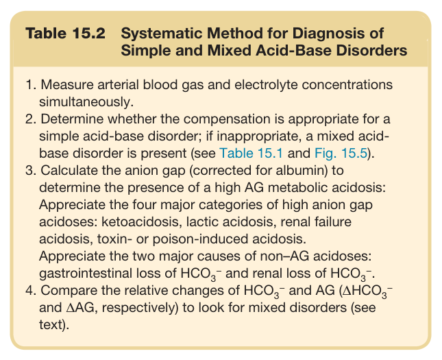

#### Table Data (CSV: [Table_15_2.csv](Table_15_2.csv))

```markdown
| Table Text (OCR) |
| :--- |
| Table 15.2  Systematic Method for Diagnosis of Simple and Mixed Acid-Base Disorders 1. Measure arterial blood gas and electrolyte concentrations simultaneously. 2. Determine whether the compensation is appropriate for a simple acid-base disorder; if inappropriate, a mixed acid- base disorder is present (see Table 15.1 and Fig. 15.5). 3. Calculate the anion gap (corrected for albumin) to determine the presence of a high AG metabolic acidosis: Appreciate the four major categories of high anion gap acidoses: ketoacidosis, lactic acidosis, renal failure acidosis, toxin- or poison-induced acidosis. Appreciate the two major causes of non–AG acidoses: gastrointestinal loss of HCO <sup>−</sup> and renal loss of HCO <sup>−</sup>. 4. Compare the relative changes of HCO <sup>−</sup> and AG (ΔHCO and ΔAG, respectively) to look for mixed disorders (see text). |
```

Table 15.2 Systematic Method for Diagnosis of Simple and Mixed Acid-Base Disorders

---

### Table_15_3

#### Table Image

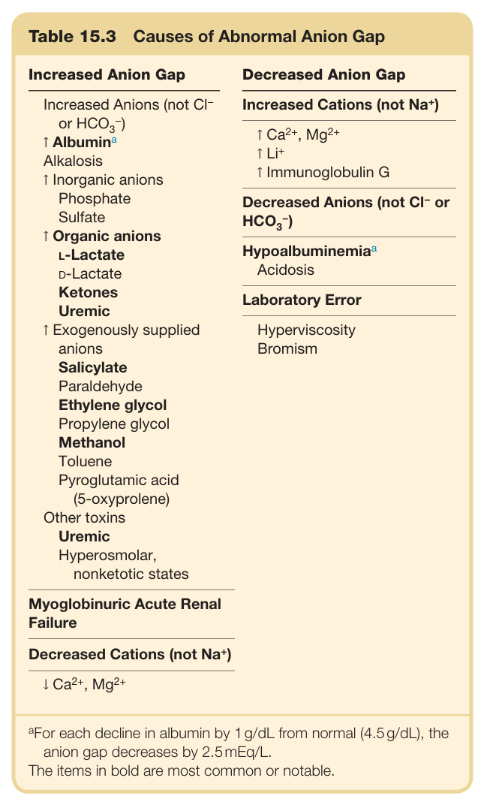

#### Table Data (CSV: [Table_15_3.csv](Table_15_3.csv))

```markdown
| Table Text (OCR) |
| :--- |
| Table 15.3 Causes of Abnormal Anion Gap Increased Anion Gap  Decreased Anion Gap    Increased Anions (not Cl- or HCO3-)  Increased Cations (not Na+)    ↑ Albumina  ↑ Ca2+, Mg2+    Alkalosis  ↑ Li+    ↑ Inorganic anions  ↑ Immunoglobulin G    Phosphate      Sulfate  Decreased Anions (not Cl- or HCO3-)    ↑ Organic anions      L-Lactate  Hypoalbuminemiaa    D-Lactate  Acidosis    Ketones  Laboratory Error    Uremic      ↑ Exogenously supplied anions  Hyperviscosity    Salicylate  Bromism    Paraldehyde      Ethylene glycol      Propylene glycol      Methanol      Toluene      Pyroglutamic acid (5-oxyprolene)      Other toxins      Uremic      Hyperosmolar, nonketotic states      Myoglobinuric Acute Renal Failure      Decreased Cations (not Na+)      ↓ Ca2+, Mg2+ |
```

Table 15.3 Causes of Abnormal Anion Gap

---

### Table_15_4

#### Table Image

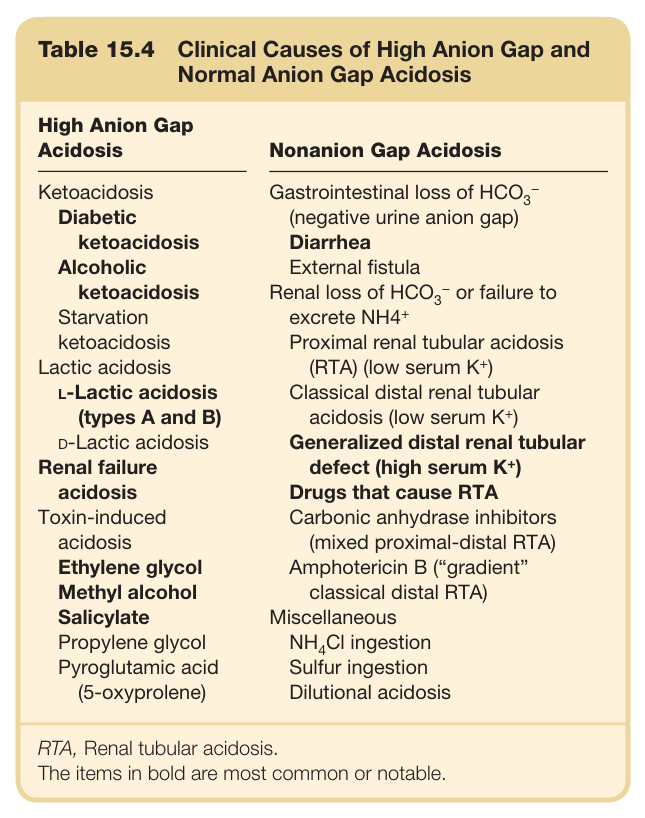

#### Table Data (CSV: [Table_15_4.csv](Table_15_4.csv))

```markdown
| Table Text (OCR) |
| :--- |
| Table 15.4  Clinical Causes of High Anion Gap and Normal Anion Gap Acidosis High Anion GapAcidosis  Nonanion Gap Acidosis    Ketoacidosis  Gastrointestinal loss of  HCO_{3}^{-} (negative urine anion gap)    Diabetic ketoacidosis  Diarrhea    Alcoholic ketoacidosis  External fistula    Starvation  Renal loss of  HCO_{3}^{-}  or failure to excrete  NH4^{+}     ketoacidosis  Proximal renal tubular acidosis (RTA) (low serum  K^{+} )    Lactic acidosis  Classical distal renal tubular acidosis (low serum  K^{+} )    L-Lactic acidosis (types A and B)  Generalized distal renal tubular defect (high serum  K^{+} )    D-Lactic acidosis  Drugs that cause RTA    Renal failure acidosis  Carbonic anhydrase inhibitors (mixed proximal-distal RTA)    Toxin-induced acidosis  Amphotericin B (“gradient” classical distal RTA)    Ethylene glycol  Miscellaneous    Methyl alcohol   NH_{4}Cl  ingestion    Salicylate  Sulfur ingestion    Propylene glycol  Dilutional acidosis    Pyroglutamic acid (5-oxyprolene) RTA, Renal tubular acidosis. The items in bold are most common or notable. |
```

Table 15.4 Clinical Causes of High Anion Gap and Normal Anion Gap Acidosis

---

### Table_15_5

#### Table Image

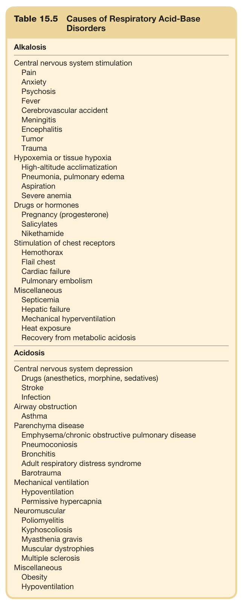

#### Table Data (CSV: [Table_15_5.csv](Table_15_5.csv))

```markdown
| Table Text (OCR) |
| :--- |
| Table 15.5  Causes of Respiratory Acid-Base Disorders Alkalosis Central nervous system stimulation    Pain    Anxiety    Psychosis    Fever    Cerebrovascular accident    Meningitis    Encephalitis    Tumor    Trauma    Hypoxemia or tissue hypoxia    High-altitude acclimatization    Pneumonia, pulmonary edema    Aspiration    Severe anemia    Drugs or hormones    Pregnancy (progesterone)    Salicylates    Nikethamide    Stimulation of chest receptors    Hemothorax    Flail chest    Cardiac failure    Pulmonary embolism    Miscellaneous    Septicemia    Hepatic failure    Mechanical hyperventilation    Heat exposure    Recovery from metabolic acidosis |
```

Table 15.5 Causes of Respiratory Acid-Base Disorders

---

### Table_15_6

#### Table Image

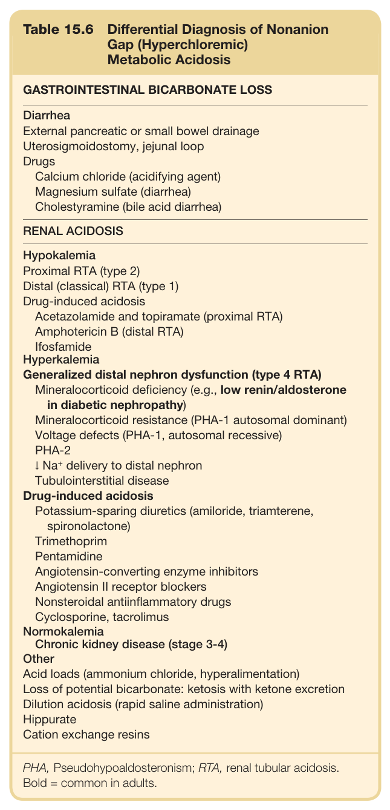

#### Table Data (CSV: [Table_15_6.csv](Table_15_6.csv))

```markdown
| Table Text (OCR) |
| :--- |
| Table 15.6  Differential Diagnosis of Nonanion Gap (Hyperchloremic) Metabolic Acidosis GASTROINTESTINAL BICARBONATE LOSS Diarrhea    External pancreatic or small bowel drainage    Uterosigmoidostomy, jejunal loop    Drugs    Calcium chloride (acidifying agent)    Magnesium sulfate (diarrhea)    Cholestyramine (bile acid diarrhea) |
```

Table 15.6 Differential Diagnosis of Nonanion Gap (Hyperchloremic) Metabolic Acidosis

---

### Table_15_7

#### Table Image

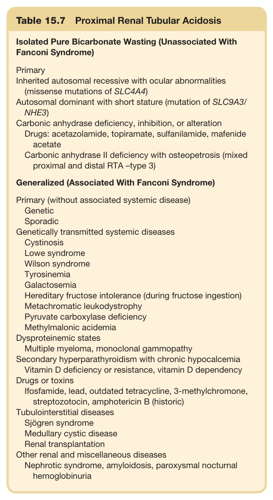

#### Table Data (CSV: [Table_15_7.csv](Table_15_7.csv))

```markdown
| Table Text (OCR) |
| :--- |
| Table 15.7 Proximal Renal Tubular Acidosis Isolated Pure Bicarbonate Wasting (Unassociated With Fanconi Syndrome) Primary    Inherited autosomal recessive with ocular abnormalities (missense mutations of SLC4A4)    Autosomal dominant with short stature (mutation of SLC9A3/NHE3)    Carbonic anhydrase deficiency, inhibition, or alteration    Drugs: acetazolamide, topiramate, sulfanilamide, mafenide acetate    Carbonic anhydrase II deficiency with osteopetrosis (mixed proximal and distal RTA -type 3) |
```

Table 15.7 Proximal Renal Tubular Acidosis

---

### Table_15_8

#### Table Image

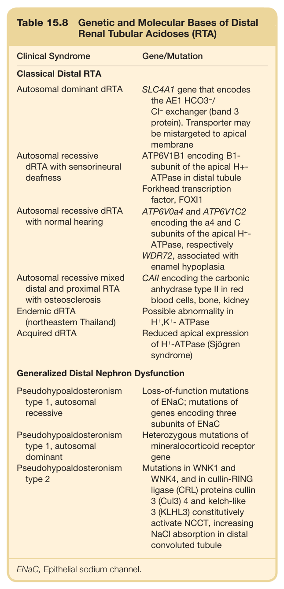

#### Table Data (CSV: [Table_15_8.csv](Table_15_8.csv))

```markdown
| Table Text (OCR) |
| :--- |
| Table 15.8  Genetic and Molecular Bases of Distal Renal Tubular Acidoses (RTA) Clinical Syndrome  Gene/Mutation    Classical Distal RTA    Autosomal dominant dRTA  SLC4A1 gene that encodes the AE1  HCO3^{-}/Cl^{-}  exchanger (band 3 protein). Transporter may be mistargeted to apical membrane    Autosomal recessive dRTA with sensorineural deafness  ATP6V1B1 encoding B1-subunit of the apical H+-ATPase in distal tubuleForkhead transcription factor, FOXI1    Autosomal recessive dRTA with normal hearing  ATP6V0a4 and ATP6V1C2 encoding the a4 and C subunits of the apical  H^{+} -ATPase, respectivelyWDR72, associated with enamel hypoplasia    Autosomal recessive mixed distal and proximal RTA with osteosclerosis  CAII encoding the carbonic anhydrase type II in red blood cells, bone, kidney    Endemic dRTA (northeastern Thailand)Acquired dRTA  Possible abnormality in  H^{+},K^{+} -ATPaseReduced apical expression of  H^{+} -ATPase (Sjögren syndrome)    Generalized Distal Nephron Dysfunction    Pseudohypoaldosteronism type 1, autosomal recessive  Loss-of-function mutations of ENaC; mutations of genes encoding three subunits of ENaC    Pseudohypoaldosteronism type 1, autosomal dominant  Heterozygous mutations of mineralocorticoid receptor gene    Pseudohypoaldosteronism type 2  Mutations in WNK1 and WNK4, and in cullin-RING ligase (CRL) proteins cullin 3 (Cul3) 4 and kelch-like 3 (KLHL3) constitutively activate NCCT, increasing NaCl absorption in distal convoluted tubule ENaC, Epithelial sodium channel. |
```

Table 15.8 Genetic and Molecular Bases of Distal Renal Tubular Acidoses (RTA)

---

### Table_15_9

#### Table Image

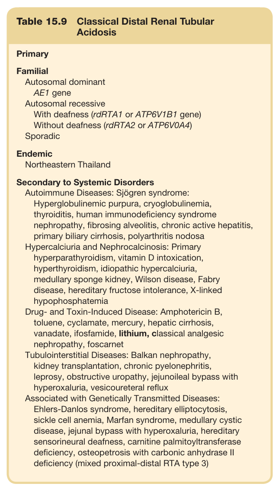

#### Table Data (CSV: [Table_15_9.csv](Table_15_9.csv))

```markdown
| Table Text (OCR) |
| :--- |
| Table 15.9 Classical Distal Renal Tubular Acidosis |
```

Table 15.9 Classical Distal Renal Tubular Acidosis

---

### Table_15_10

#### Table Image

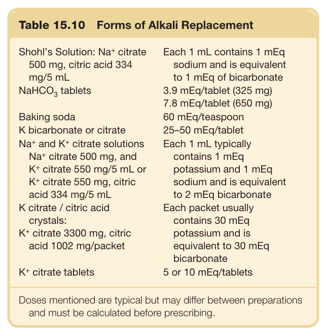

#### Table Data (CSV: [Table_15_10.csv](Table_15_10.csv))

```markdown
| Table Text (OCR) |
| :--- |
| Table 15.10  Forms of Alkali Replacement Shohl’s Solution:  Na^{+}  citrate500 mg, citric acid 334mg/5 mL  Each 1 mL contains 1 mEqsodium and is equivalentto 1 mEq of bicarbonate     NaHCO_{3}  tablets  3.9 mEq/tablet (325 mg)7.8 mEq/tablet (650 mg)    Baking soda  60 mEq/teaspoon    K bicarbonate or citrate  25–50 mEq/tablet     Na^{+}  and  K^{+}  citrate solutions Na^{+}  citrate 500 mg, and K^{+}  citrate 550 mg/5 mL or K^{+}  citrate 550 mg, citricacid 334 mg/5 mL  Each 1 mL typicallycontains 1 mEqpotassium and 1 mEqsodium and is equivalentto 2 mEq bicarbonate    K citrate / citric acidcrystals:  Each packet usuallycontains 30 mEq     K^{+}  citrate 3300 mg, citricacid 1002 mg/packet  potassium and isequivalent to 30 mEqbicarbonate     K^{+}  citrate tablets  5 or 10 mEq/tablets Doses mentioned are typical but may differ between preparations and must be calculated before prescribing. |
```

Table 15.10 Forms of Alkali Replacement

---

### Table_15_11

#### Table Image

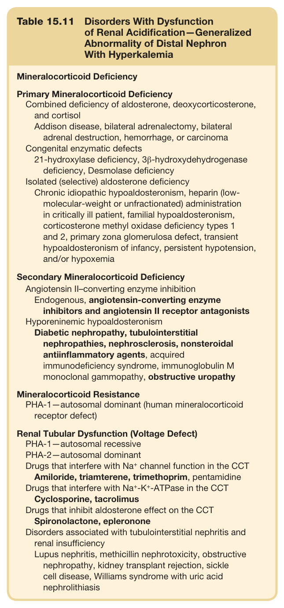

#### Table Data (CSV: [Table_15_11.csv](Table_15_11.csv))

```markdown
| Table Text (OCR) |
| :--- |
| Table 15.11 Disorders With Dysfunction of Renal Acidification—Generalized Abnormality of Distal Nephron With Hyperkalemia |
```

Table 15.11 Disorders With Dysfunction of Renal Acidification—Generalized Abnormality of Distal Nephron With Hyperkalemia

---

### Table_15_12

#### Table Image

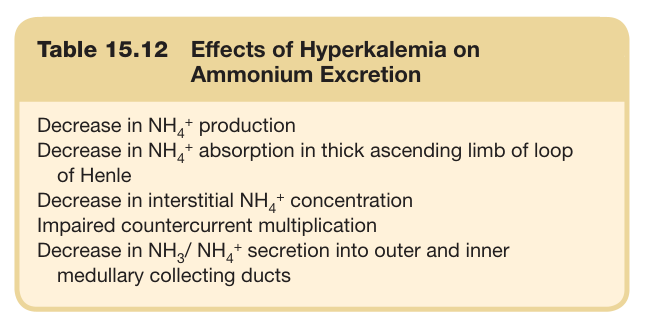

#### Table Data (CSV: [Table_15_12.csv](Table_15_12.csv))

```markdown
| Table Text (OCR) |
| :--- |
| Table 15.12  Effects of Hyperkalemia on Ammonium Excretion Decrease in  NH_{4}^{+}  production    Decrease in  NH_{4}^{+}  absorption in thick ascending limb of loop of Henle    Decrease in interstitial  NH_{4}^{+}  concentration    Impaired countercurrent multiplication    Decrease in  NH_{3}/ NH_{4}^{+}  secretion into outer and inner medullary collecting ducts |
```

Table 15.12 Effects of Hyperkalemia on Ammonium Excretion

---

### Table_15_13

#### Table Image

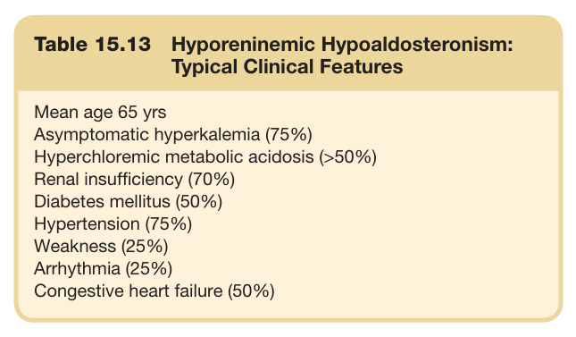

#### Table Data (CSV: [Table_15_13.csv](Table_15_13.csv))

```markdown
| Table Text (OCR) |
| :--- |
| Table 15.13  Hyporeninemic Hypoaldosteronism: Typical Clinical Features Mean age 65 yrs    Asymptomatic hyperkalemia (75%)    Hyperchloremic metabolic acidosis (>50%)    Renal insufficiency (70%)    Diabetes mellitus (50%)    Hypertension (75%)    Weakness (25%)    Arrhythmia (25%)    Congestive heart failure (50%) |
```

Table 15.13 Hyporeninemic Hypoaldosteronism: Typical Clinical Features

---

### Table_15_14

#### Table Image

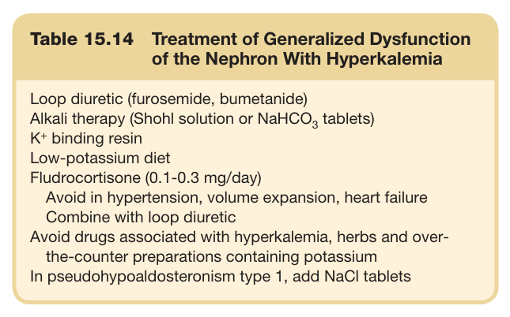

#### Table Data (CSV: [Table_15_14.csv](Table_15_14.csv))

```markdown
| Table Text (OCR) |
| :--- |
| Table 15.14 Treatment of Generalized Dysfunction of the Nephron With Hyperkalemia Loop diuretic (furosemide, bumetanide)    Alkali therapy (Shohl solution or NaHCO3tablets)    K+binding resin    Low-potassium diet    Fludrocortisone (0.1-0.3 mg/day)    Avoid in hypertension, volume expansion, heart failure    Combine with loop diuretic    Avoid drugs associated with hyperkalemia, herbs and over-the-counter preparations containing potassium    In pseudohypoaldosteronism type 1, add NaCl tablets |
```

Table 15.14 Treatment of Generalized Dysfunction of the Nephron With Hyperkalemia

---

### Table_15_15

#### Table Image

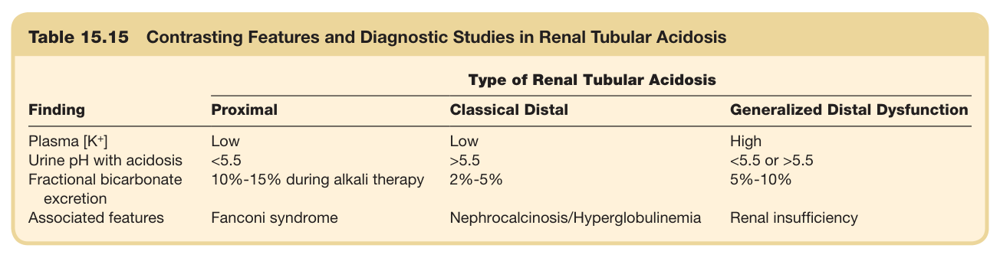

#### Table Data (CSV: [Table_15_15.csv](Table_15_15.csv))

```markdown
| Table Text (OCR) |
| :--- |
| Table 15.15  Contrasting Features and Diagnostic Studies in Renal Tubular Acidosis Finding  Type of Renal Tubular Acidosis    Proximal  Classical Distal  Generalized Distal Dysfunction    Plasma [K+]  Low  Low  High    Urine pH with acidosis  <5.5  >5.5  <5.5 or >5.5    Fractional bicarbonate excretion  10%-15% during alkali therapy  2%-5%  5%-10%    Associated features  Fanconi syndrome  Nephrocalcinosis/Hyperglobulinemia  Renal insufficiency |
```

Table 15.15 Contrasting Features and Diagnostic Studies in Renal Tubular Acidosis

---

### Table_15_16

#### Table Image

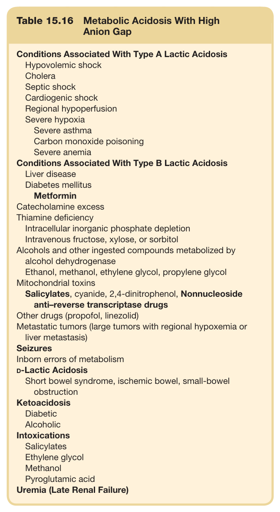

#### Table Data (CSV: [Table_15_16.csv](Table_15_16.csv))

```markdown
| Table Text (OCR) |
| :--- |
| Table 15.16 Metabolic Acidosis With High Anion Gap Conditions Associated With Type A Lactic Acidosis    Hypovolemic shock    Cholera    Septic shock    Cardiogenic shock    Regional hypoperfusion    Severe hypoxia    Severe asthma    Carbon monoxide poisoning    Severe anemia    Conditions Associated With Type B Lactic Acidosis    Liver disease    Diabetes mellitus    Metformin    Catecholamine excess    Thiamine deficiency    Intracellular inorganic phosphate depletion    Intravenous fructose, xylose, or sorbitol    Alcohols and other ingested compounds metabolized by alcohol dehydrogenase    Ethanol, methanol, ethylene glycol, propylene glycol    Mitochondrial toxins    Salicylates, cyanide, 2,4-dinitrophenol, Nonnucleoside anti-reverse transcriptase drugs    Other drugs (propofol, linezolid)    Metastatic tumors (large tumors with regional hypoxemia or liver metastasis)    Seizures    Inborn errors of metabolism    D-Lactic Acidosis    Short bowel syndrome, ischemic bowel, small-bowel obstruction    Ketoacidosis    Diabetic    Alcoholic    Intoxications    Salicylates    Ethylene glycol    Methanol    Pyroglutamic acid    Uremia (Late Renal Failure) |
```

Table 15.16 Metabolic Acidosis With High Anion Gap

---

### Table_15_17

#### Table Image

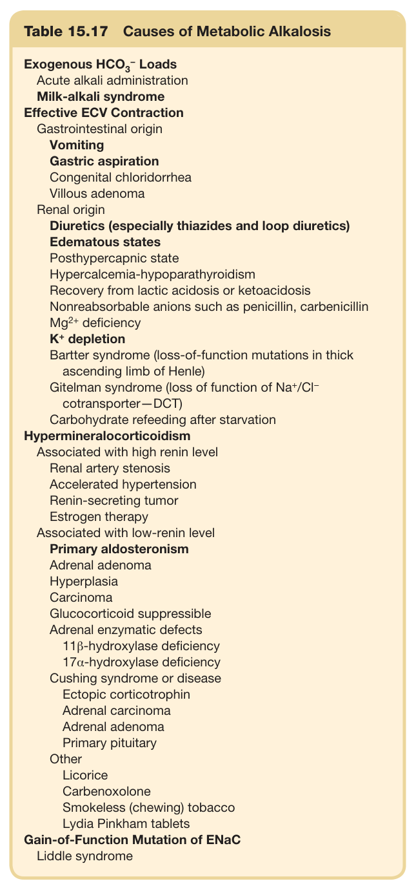

#### Table Data (CSV: [Table_15_17.csv](Table_15_17.csv))

```markdown
| Table Text (OCR) |
| :--- |
| Table 15.17 Causes of Metabolic Alkalosis Exogenous  HCO_{3}^{-}  Loads    Acute alkali administration    Milk-alkali syndrome    Effective ECV Contraction    Gastrointestinal origin    Vomiting    Gastric aspiration    Congenital chloridorrhea    Villous adenoma    Renal origin    Diuretics (especially thiazides and loop diuretics)    Edematous states    Posthypercapnic state    Hypercalcemia-hypoparathyroidism    Recovery from lactic acidosis or ketoacidosis    Nonreabsorbable anions such as penicillin, carbenicillin     Mg^{2+}  deficiency     K^{+}  depletion    Bartter syndrome (loss-of-function mutations in thick ascending limb of Henle)    Gitelman syndrome (loss of function of  Na^{+}/Cl^{-}  cotransporter—DCT)    Carbohydrate refeeding after starvation    Hypermineralocorticoidism    Associated with high renin level    Renal artery stenosis    Accelerated hypertension    Renin-secreting tumor    Estrogen therapy    Associated with low-renin level    Primary aldosteronism    Adrenal adenoma    Hyperplasia    Carcinoma    Glucocorticoid suppressible    Adrenal enzymatic defects    11β-hydroxylase deficiency    17α-hydroxylase deficiency    Cushing syndrome or disease    Ectopic corticotrophin    Adrenal carcinoma    Adrenal adenoma    Primary pituitary    Other    Licorice    Carbenoxolone    Smokeless (chewing) tobacco    Lydia Pinkham tablets    Gain-of-Function Mutation of ENaC    Liddle syndrome |
```

Table 15.17 Causes of Metabolic Alkalosis

---

### Table_15_18

#### Table Image

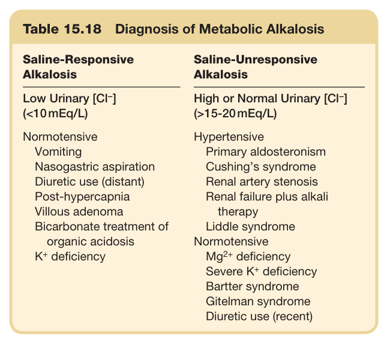

#### Table Data (CSV: [Table_15_18.csv](Table_15_18.csv))

```markdown
| Table Text (OCR) |
| :--- |
| Table 15.18  Diagnosis of Metabolic Alkalosis Saline-Responsive Alkalosis  Saline-Unresponsive Alkalosis    Low Urinary [CI-](<10 mEq/L)  High or Normal Urinary [CI-](>15-20 mEq/L)    NormotensiveVomitingNasogastric aspirationDiuretic use (distant)Post-hypercapniaVillous adenomaBicarbonate treatment of organic acidosisK+deficiency  HypertensivePrimary aldosteronismCushing’s syndromeRenal artery stenosisRenal failure plus alkali therapyLiddle syndromeNormotensiveMg2+deficiencySevere K+deficiencyBartter syndromeGitelman syndromeDiuretic use (recent) |
```

Table 15.18 Diagnosis of Metabolic Alkalosis

---
