# 16. Disorders of Potassium Balance - Figures and Tables Index

This document lists all figures and tables extracted from `16. Disorders of Potassium Balance.pdf`.

## Table of Contents
- [Figures](#figures)
- [Tables](#tables)

---

## Figures

### Fig_16_1

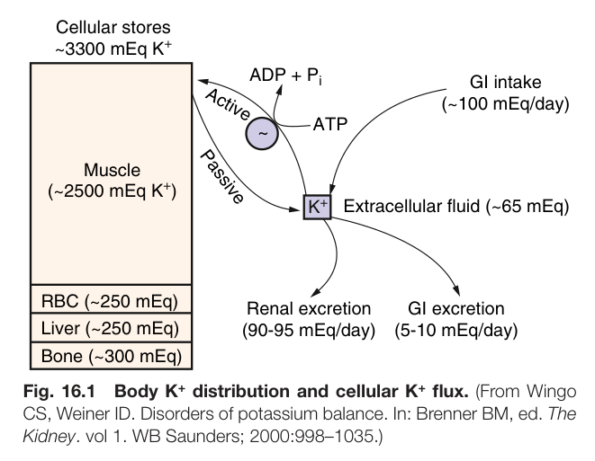

Fig. 16.1 Body K<sup>+</sup> distribution and cellular K<sup>+</sup> flux. (From Wingo CS, Weiner ID. Disorders of potassium balance. In: Brenner BM, ed. The Kidney. vol 1. WB Saunders; 2000:998–1035.)

---

### Fig_16_2

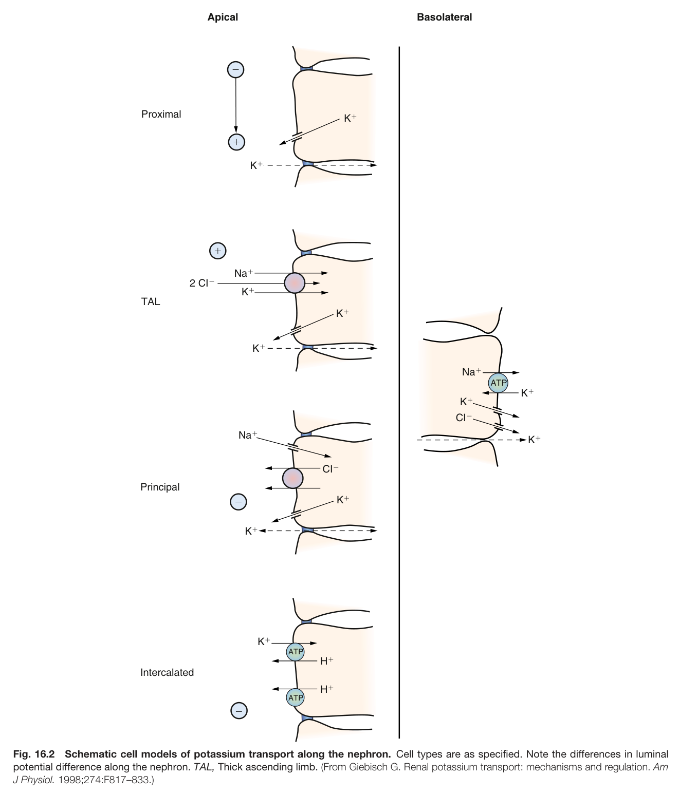

Fig. 16.2 Schematic cell models of potassium transport along the nephron. Cell types are as specified. Note the differences in lumina potential difference along the nephron. TAL, Thick ascending limb. (From Giebisch G. Renal potassium transport: mechanisms and regulation. Am J Physiol. 1998;274:F817–833.)

---

### Fig_16_3

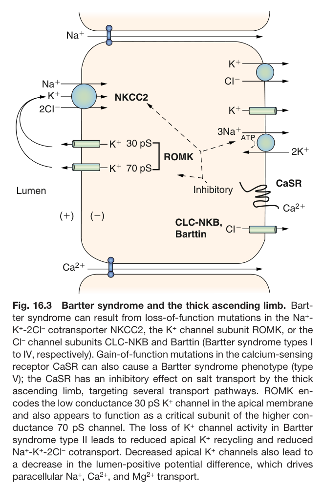

Fig. 16.3 Bartter syndrome and the thick ascending limb. Bart- ter syndrome can result from loss-of-function mutations in the Na<sup>+</sup>- K<sup>+</sup>-2Cl<sup>–</sup> cotransporter NKCC2, the K<sup>+</sup> channel subunit ROMK, or the Cl<sup>–</sup> channel subunits CLC-NKB and Barttin (Bartter syndrome types I to IV, respectively). Gain-of-function mutations in the calcium-sensing receptor CaSR can also cause a Bartter syndrome phenotype (type V); the CaSR has an inhibitory effect on salt transport by the thick ascending limb, targeting several transport pathways. ROMK en- codes the low conductance 30 pS K<sup>+</sup> channel in the apical membrane and also appears to function as a critical subunit of the higher con- ductance 70 pS channel. The loss of K<sup>+</sup> channel activity in Bartter syndrome type II leads to reduced apical K<sup>+</sup> recycling and reduced Na<sup>+</sup>-K<sup>+</sup>-2Cl<sup>–</sup> cotransport. Decreased apical K<sup>+</sup> channels also lead to a decrease in the lumen-positive potential difference, which drives paracellular Na<sup>+</sup>, Ca<sup>2+</sup>, and Mg<sup>2+</sup> transport.

---

### Fig_16_4

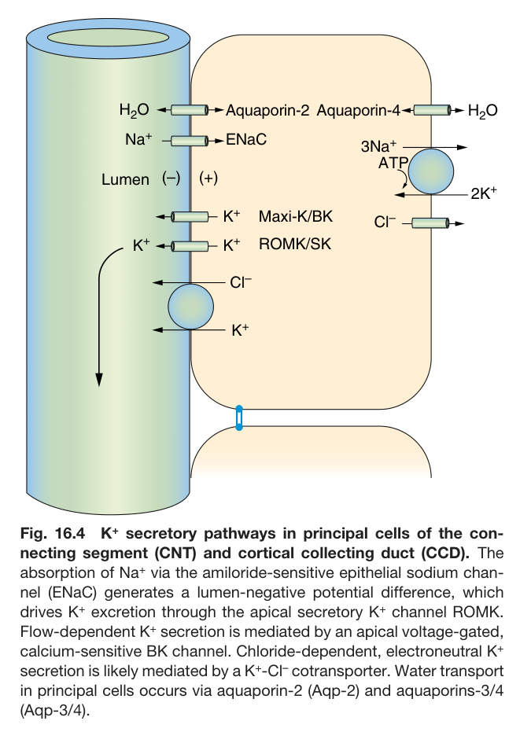

Fig. 16.4 K<sup>+</sup> secretory pathways in principal cells of the con- necting segment (CNT) and cortical collecting duct (CCD). The absorption of Na<sup>+</sup> via the amiloride-sensitive epithelial sodium chan- nel (ENaC) generates a lumen-negative potential difference, which drives K<sup>+</sup> excretion through the apical secretory K<sup>+</sup> channel ROMK. Flow-dependent K<sup>+</sup> secretion is mediated by an apical voltage-gated, calcium-sensitive BK channel. Chloride-dependent, electroneutral K<sup>+</sup> secretion is likely mediated by a K<sup>+</sup>-Cl<sup>–</sup> cotransporter. Water transport in principal cells occurs via aquaporin-2 (Aqp-2) and aquaporins-3/4 (Aqp-3/4).

---

### Fig_16_5

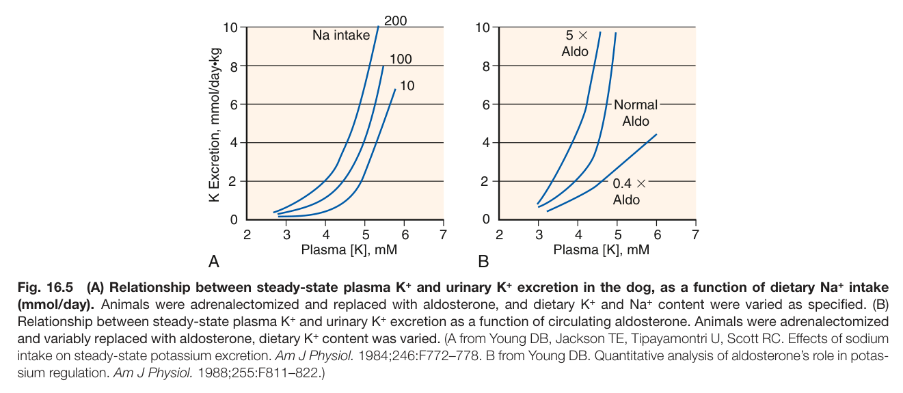

Fig. 16.5 (A) Relationship between steady-state plasma K<sup>+</sup> and urinary K<sup>+</sup> excretion in the dog, as a function of dietary Na<sup>+</sup> intake (mmol/day). Animals were adrenalectomized and replaced with aldosterone, and dietary K<sup>+</sup> and Na<sup>+</sup> content were varied as specified. (B) Relationship between steady-state plasma K<sup>+</sup> and urinary K<sup>+</sup> excretion as a function of circulating aldosterone. Animals were adrenalectomized and variably replaced with aldosterone, dietary K<sup>+</sup> content was varied. (A from Young DB, Jackson TE, Tipayamontri U, Scott RC. Effects of sodium intake on steady-state potassium excretion. Am J Physiol. 1984;246:F772–778. B from Young DB. Quantitative analysis of aldosterone’s role in potas sium regulation. Am J Physiol. 1988;255:F811–822.)

---

### Fig_16_6

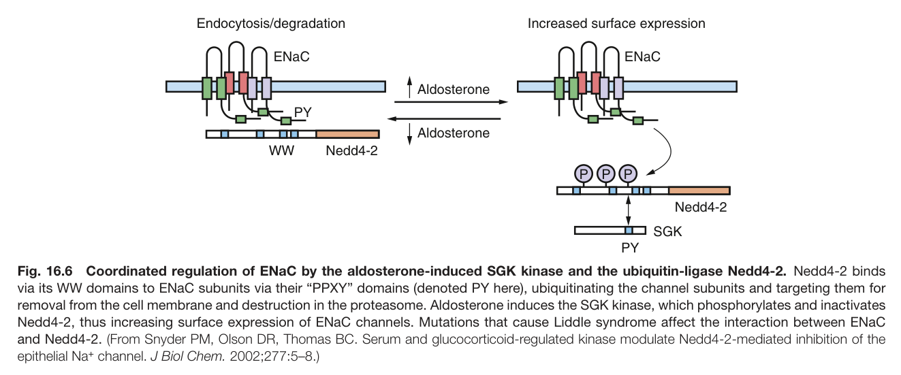

Fig. 16.6 Coordinated regulation of ENaC by the aldosterone-induced SGK kinase and the ubiquitin-ligase Nedd4-2. Nedd4-2 binds via its WW domains to ENaC subunits via their “PPXY” domains (denoted PY here), ubiquitinating the channel subunits and targeting them for removal from the cell membrane and destruction in the proteasome. Aldosterone induces the SGK kinase, which phosphorylates and inactivates Nedd4-2, thus increasing surface expression of ENaC channels. Mutations that cause Liddle syndrome affect the interaction between ENaC and Nedd4-2. (From Snyder PM, Olson DR, Thomas BC. Serum and glucocorticoid-regulated kinase modulate Nedd4-2-mediated inhibition of the epithelial Na<sup>+</sup> channel. J Biol Chem. 2002;277:5–8.)

---

### Fig_16_7

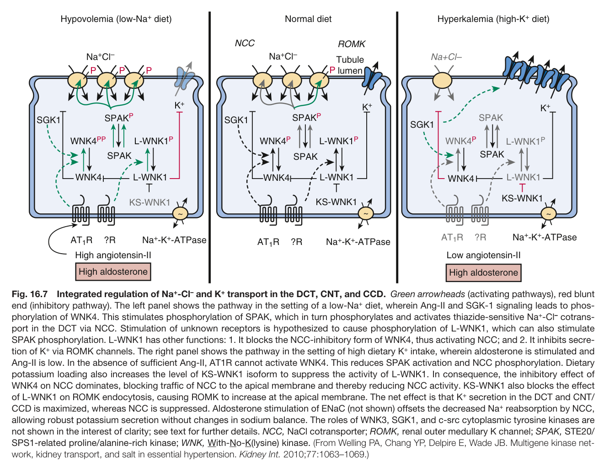

Fig. 16.7 Integrated regulation of Na<sup>+</sup>-Cl<sup>–</sup> and K<sup>+</sup> transport in the DCT, CNT, and CCD. Green arrowheads (activating pathways), red blunt end (inhibitory pathway). The left panel shows the pathway in the setting of a low-Na<sup>+</sup> diet, wherein Ang-II and SGK-1 signaling leads to phos- phorylation of WNK4. This stimulates phosphorylation of SPAK, which in turn phosphorylates and activates thiazide-sensitive Na<sup>+</sup>-Cl<sup>–</sup> cotrans- port in the DCT via NCC. Stimulation of unknown receptors is hypothesized to cause phosphorylation of L-WNK1, which can also stimulate SPAK phosphorylation. L-WNK1 has other functions: 1. It blocks the NCC-inhibitory form of WNK4, thus activating NCC; and 2. It inhibits secre- tion of K<sup>+</sup> via ROMK channels. The right panel shows the pathway in the setting of high dietary K<sup>+</sup> intake, wherein aldosterone is stimulated and Ang-II is low. In the absence of sufficient Ang-II, AT1R cannot activate WNK4. This reduces SPAK activation and NCC phosphorylation. Dietary potassium loading also increases the level of KS-WNK1 isoform to suppress the activity of L-WNK1. In consequence, the inhibitory effect of WNK4 on NCC dominates, blocking traffic of NCC to the apical membrane and thereby reducing NCC activity. KS-WNK1 also blocks the effect of L-WNK1 on ROMK endocytosis, causing ROMK to increase at the apical membrane. The net effect is that K<sup>+</sup> secretion in the DCT and CNT/ CCD is maximized, whereas NCC is suppressed. Aldosterone stimulation of ENaC (not shown) offsets the decreased Na<sup>+</sup> reabsorption by NCC, allowing robust potassium secretion without changes in sodium balance. The roles of WNK3, SGK1, and c-src cytoplasmic tyrosine kinases are not shown in the interest of clarity; see text for further details. NCC, NaCl cotransporter; ROMK, renal outer medullary K channel; SPAK, STE20/ SPS1-related proline/alanine-rich kinase; WNK, With-No-K(lysine) kinase. (From Welling PA, Chang YP, Delpire E, Wade JB. Multigene kinase net- work, kidney transport, and salt in essential hypertension. Kidney Int. 2010;77:1063–1069.)

---

### Fig_16_8

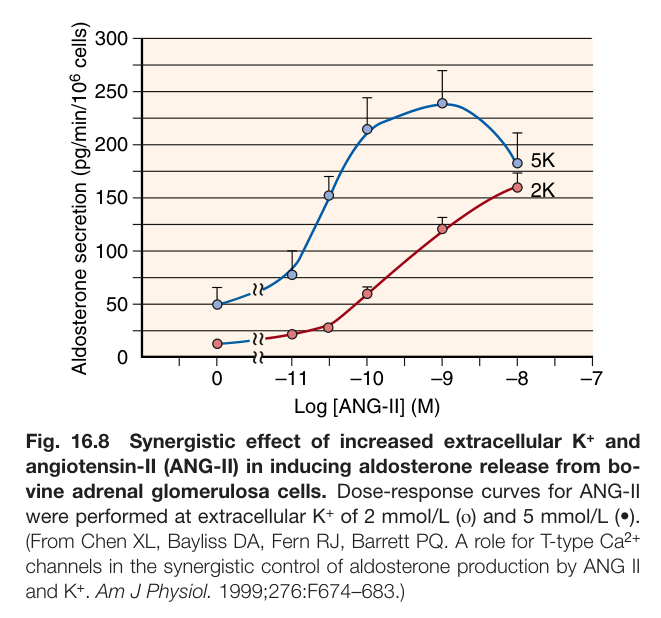

Fig. 16.8 Synergistic effect of increased extracellular K<sup>+</sup> and angiotensin-II (ANG-II) in inducing aldosterone release from bo- vine adrenal glomerulosa cells. Dose-response curves for ANG-II were performed at extracellular K<sup>+</sup> of 2 mmol/L (ο) and 5 mmol/L (•). (From Chen XL, Bayliss DA, Fern RJ, Barrett PQ. A role for T-type Ca<sup>2+</sup> channels in the synergistic control of aldosterone production by ANG II and K<sup>+</sup>. Am J Physiol. 1999;276:F674–683.)

---

### Fig_16_9

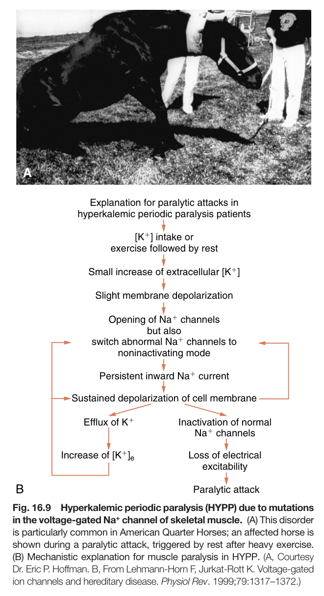

Fig. 16.9 Hyperkalemic periodic paralysis (HYPP) due to mutations in the voltage-gated Na<sup>+</sup> channel of skeletal muscle. (A) This disorder is particularly common in American Quarter Horses; an affected horse is shown during a paralytic attack, triggered by rest after heavy exercise. (B) Mechanistic explanation for muscle paralysis in HYPP. (A, Courtesy Dr. Eric P. Hoffman. B, From Lehmann-Horn F, Jurkat-Rott K. Voltage-gated ion channels and hereditary disease. Physiol Rev. 1999;79:1317–1372.)

---

### Fig_16_10

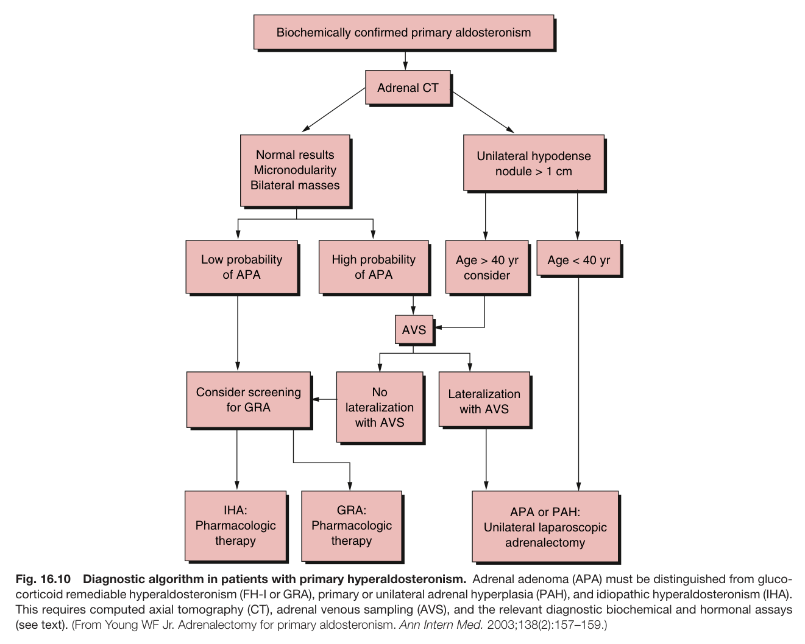

Fig. 16.10 Diagnostic algorithm in patients with primary hyperaldosteronism. Adrenal adenoma (APA) must be distinguished from gluco- corticoid remediable hyperaldosteronism (FH-I or GRA), primary or unilateral adrenal hyperplasia (PAH), and idiopathic hyperaldosteronism (IHA). This requires computed axial tomography (CT), adrenal venous sampling (AVS), and the relevant diagnostic biochemical and hormonal assays (see text). (From Young WF Jr. Adrenalectomy for primary aldosteronism. Ann Intern Med. 2003;138(2):157–159.)

---

### Fig_16_11

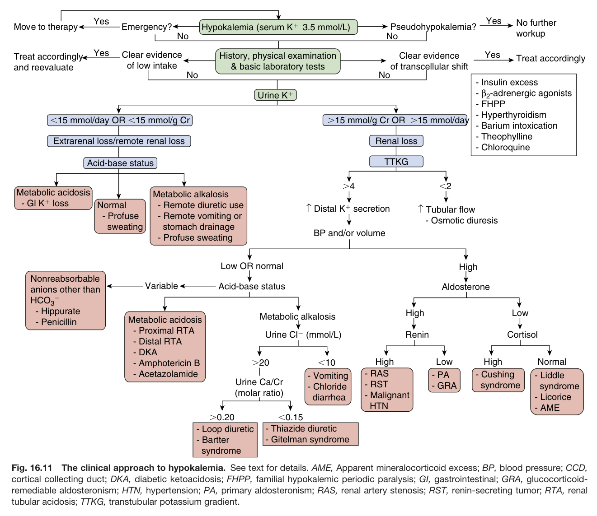

Fig. 16.11 The clinical approach to hypokalemia. See text for details. AME, Apparent mineralocorticoid excess; BP, blood pressure; CCD, cortical collecting duct; DKA, diabetic ketoacidosis; FHPP, familial hypokalemic periodic paralysis; GI, gastrointestinal; GRA, glucocorticoid- remediable aldosteronism; HTN, hypertension; PA, primary aldosteronism; RAS, renal artery stenosis; RST, renin-secreting tumor; RTA, rena tubular acidosis; TTKG, transtubular potassium gradient.

---

### Fig_16_12

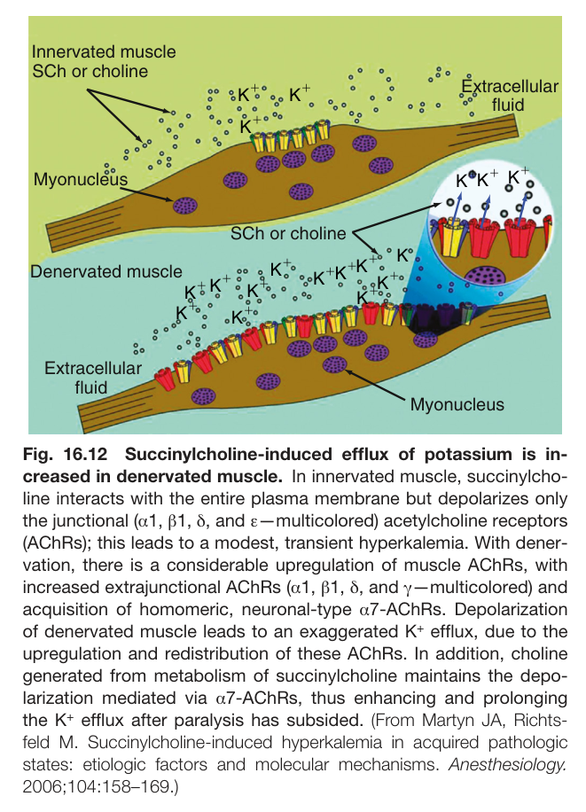

Fig. 16.12 Succinylcholine-induced efflux of potassium is in- creased in denervated muscle. In innervated muscle, succinylcho- line interacts with the entire plasma membrane but depolarizes only the junctional (α1, β1, δ, and ε—multicolored) acetylcholine receptors (AChRs); this leads to a modest, transient hyperkalemia. With dener- vation, there is a considerable upregulation of muscle AChRs, with increased extrajunctional AChRs (α1, β1, δ, and γ—multicolored) and acquisition of homomeric, neuronal-type α7-AChRs. Depolarization of denervated muscle leads to an exaggerated K<sup>+</sup> efflux, due to the upregulation and redistribution of these AChRs. In addition, choline generated from metabolism of succinylcholine maintains the depo- larization mediated via α7-AChRs, thus enhancing and prolonging the K<sup>+</sup> efflux after paralysis has subsided. (From Martyn JA, Richts- feld M. Succinylcholine-induced hyperkalemia in acquired pathologic states: etiologic factors and molecular mechanisms. Anesthesiology. 2006;104:158–169.)

---

### Fig_16_13

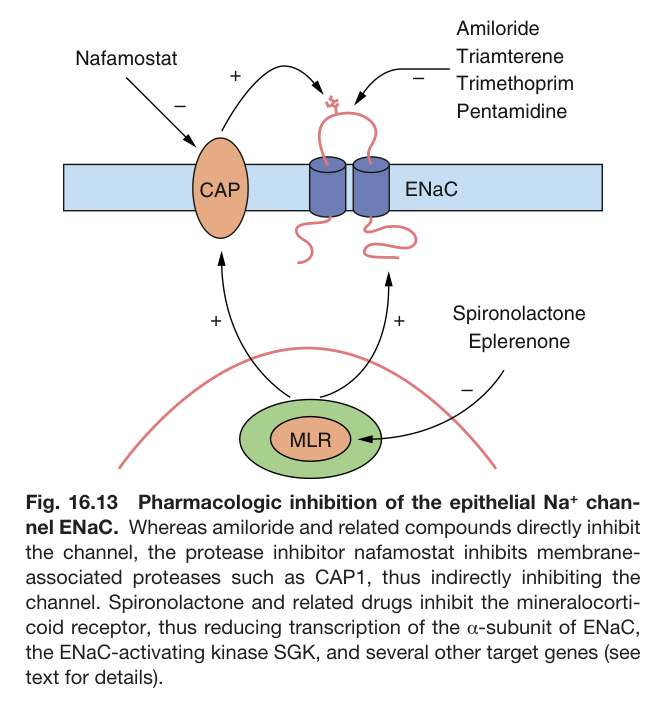

Fig. 16.13 Pharmacologic inhibition of the epithelial Na<sup>+</sup> chan- nel ENaC. Whereas amiloride and related compounds directly inhibit the channel, the protease inhibitor nafamostat inhibits membrane- associated proteases such as CAP1, thus indirectly inhibiting the channel. Spironolactone and related drugs inhibit the mineralocorti- coid receptor, thus reducing transcription of the α-subunit of ENaC, the ENaC-activating kinase SGK, and several other target genes (see text for details).

---

### Fig_16_14

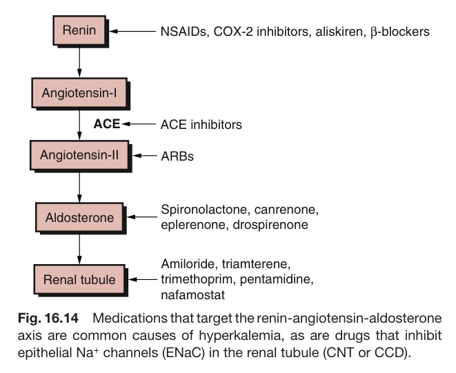

Fig. 16.14 Medications that target the renin-angiotensin-aldosterone axis are common causes of hyperkalemia, as are drugs that inhibit epithelial Na<sup>+</sup> channels (ENaC) in the renal tubule (CNT or CCD).

---

### Fig_16_15

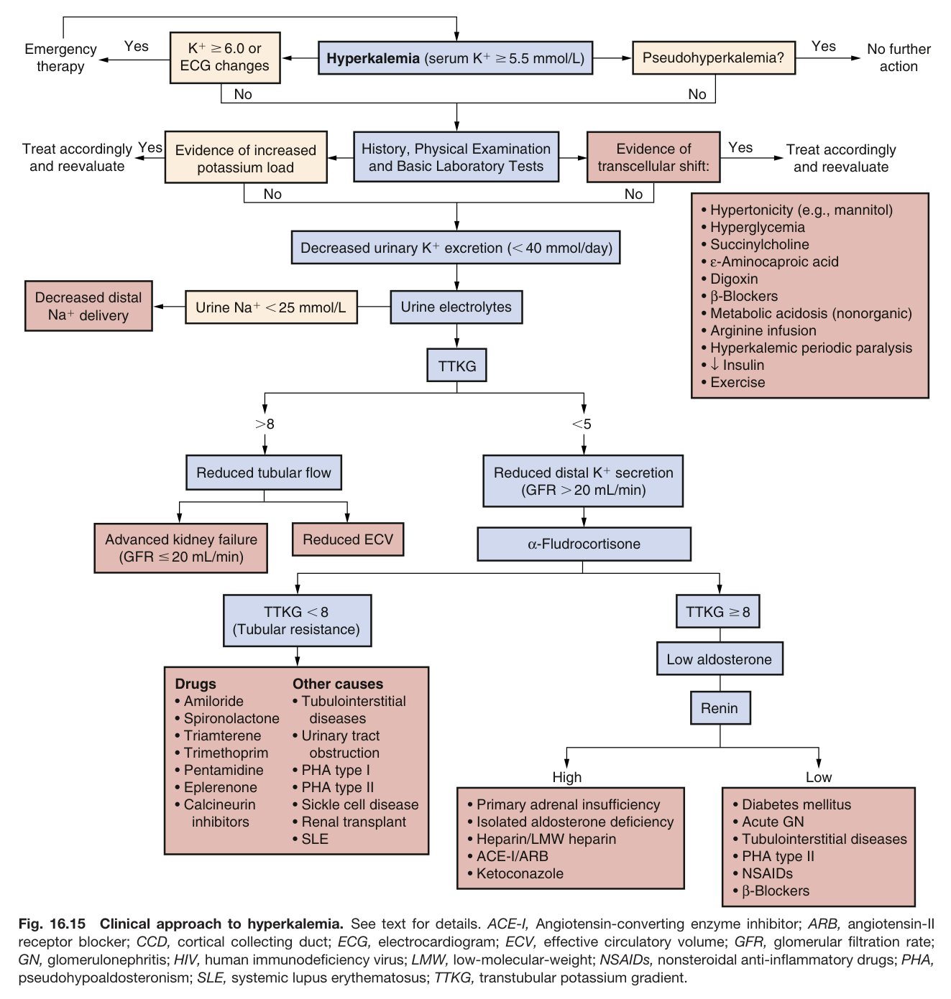

Fig. 16.15 Clinical approach to hyperkalemia. See text for details. ACE-I, Angiotensin-converting enzyme inhibitor; ARB, angiotensin-II receptor blocker; CCD, cortical collecting duct; ECG, electrocardiogram; ECV, effective circulatory volume; GFR, glomerular filtration rate; GN, glomerulonephritis; HIV, human immunodeficiency virus; LMW, low-molecular-weight; NSAIDs, nonsteroidal anti-inflammatory drugs; PHA, pseudohypoaldosteronism; SLE, systemic lupus erythematosus; TTKG, transtubular potassium gradient.

---

### Fig_16_16

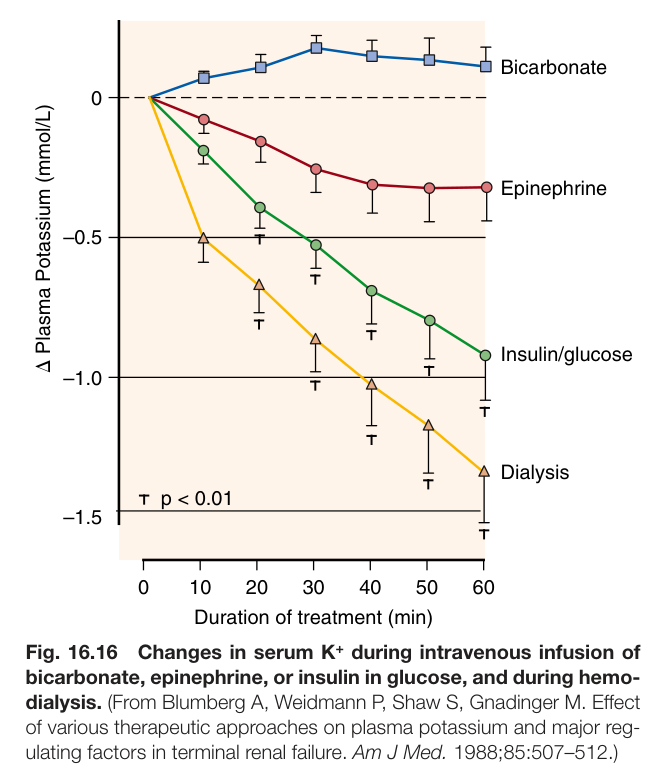

Fig. 16.16 Changes in serum K<sup>+</sup> during intravenous infusion of bicarbonate, epinephrine, or insulin in glucose, and during hemo- dialysis. (From Blumberg A, Weidmann P, Shaw S, Gnadinger M. Effect of various therapeutic approaches on plasma potassium and major reg- ulating factors in terminal renal failure. Am J Med. 1988;85:507–512.)

---

## Tables

### Table_16_1

#### Table Image

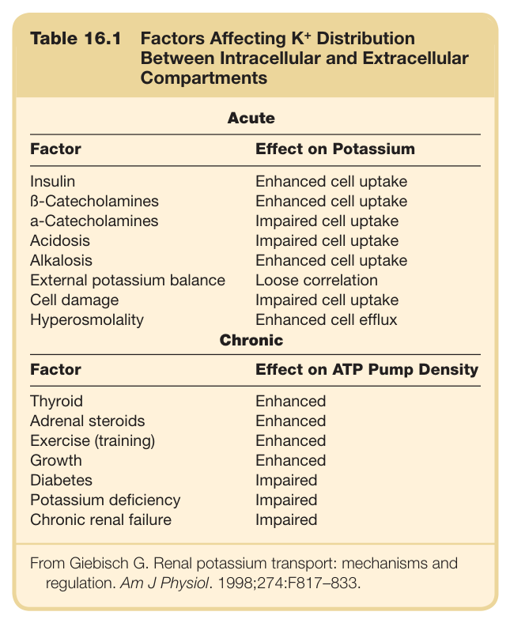

#### Table Data (CSV: [Table_16_1.csv](Table_16_1.csv))

```markdown
| Table Text (OCR) |
| :--- |
| Table 16.1  Factors Affecting K<sup>+</sup> Distribution Between Intracellular and Extracellular Compartments Acute    Factor  Effect on Potassium    Insulin  Enhanced cell uptake    β-Catecholamines  Enhanced cell uptake    a-Catecholamines  Impaired cell uptake    Acidosis  Impaired cell uptake    Alkalosis  Enhanced cell uptake    External potassium balance  Loose correlation    Cell damage  Impaired cell uptake    Hyperosmolality  Enhanced cell efflux    Chronic    Factor  Effect on ATP Pump Density    Thyroid  Enhanced    Adrenal steroids  Enhanced    Exercise (training)  Enhanced    Growth  Enhanced    Diabetes  Impaired    Potassium deficiency  Impaired    Chronic renal failure  Impaired    From Giebisch G. Renal potassium transport: mechanisms and regulation. Am J Physiol. 1998;274:F817-833. |
```

Table 16.1 Factors Affecting K<sup>+</sup> Distribution Between Intracellular and Extracellular Compartments

---

### Table_16_2

#### Table Image

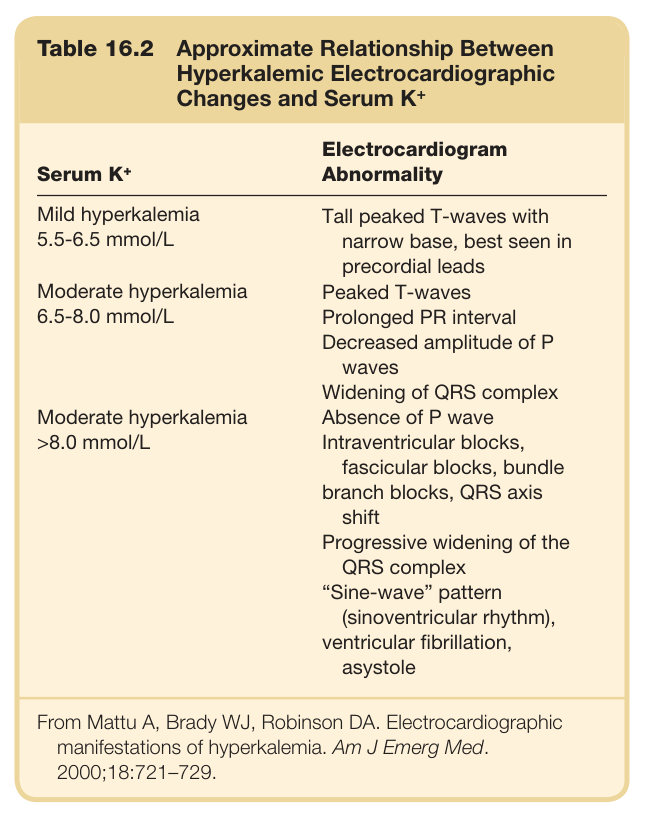

#### Table Data (CSV: [Table_16_2.csv](Table_16_2.csv))

```markdown
| Table Text (OCR) |
| :--- |
| Table 16.2  Approximate Relationship Between Hyperkalemic Electrocardiographic Changes and Serum K<sup>+</sup> Serum K+  Electrocardiogram Abnormality    Mild hyperkalemia5.5-6.5 mmol/L  Tall peaked T-waves with narrow base, best seen in precordial leads    Moderate hyperkalemia6.5-8.0 mmol/L  Peaked T-wavesProlonged PR intervalDecreased amplitude of P wavesWidening of QRS complex    Moderate hyperkalemia>8.0 mmol/L  Absence of P waveIntraventricular blocks, fascicular blocks, bundle branch blocks, QRS axis shiftProgressive widening of the QRS complex“Sine-wave” pattern (sinoventricular rhythm), ventricular fibrillation, asystole From Mattu A, Brady WJ, Robinson DA. Electrocardiographic manifestations of hyperkalemia. Am J Emerg Med. 2000;18:721–729. |
```

Table 16.2 Approximate Relationship Between Hyperkalemic Electrocardiographic Changes and Serum K<sup>+</sup>

---

### Table_16_3

#### Table Image

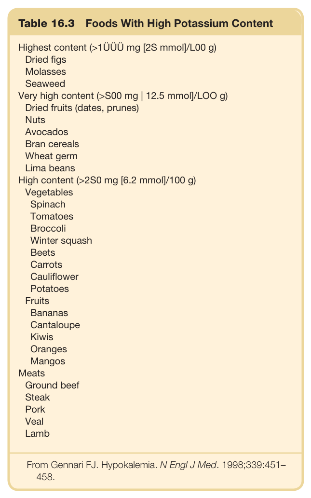

#### Table Data (CSV: [Table_16_3.csv](Table_16_3.csv))

```markdown
| Table Text (OCR) |
| :--- |
| Table 16.3  Foods With High Potassium Content Highest content (>1ÜÜÜ mg [2S mmol]/LOO g)    Dried figs    Molasses    Seaweed    Very high content (>S00 mg \| 12.5 mmol]/LOO g)    Dried fruits (dates, prunes)    Nuts    Avocados    Bran cereals    Wheat germ    Lima beans    High content (>2S0 mg [6.2 mmol]/100 g)    Vegetables    Spinach    Tomatoes    Broccoli    Winter squash    Beets    Carrots    Cauliflower    Potatoes    Fruits    Bananas    Cantaloupe    Kiwis    Oranges    Mangos    Meats    Ground beef    Steak    Pork    Veal    Lamb From Gennari FJ. Hypokalemia. N Engl J Med. 1998;339:451– 458. |
```

Table 16.3 Foods With High Potassium Content

---
