# 17. Disorders of Calcium, Magnesium, and Phosphate Balance - Figures and Tables Index

This document lists all figures, tables and boxes extracted from `17. Disorders of Calcium, Magnesium, and Phosphate Balance.pdf`.

## Table of Contents
- [Figures](#figures)
- [Tables](#tables)
- [Boxes](#boxes)

---

## Figures

### Fig_17_1

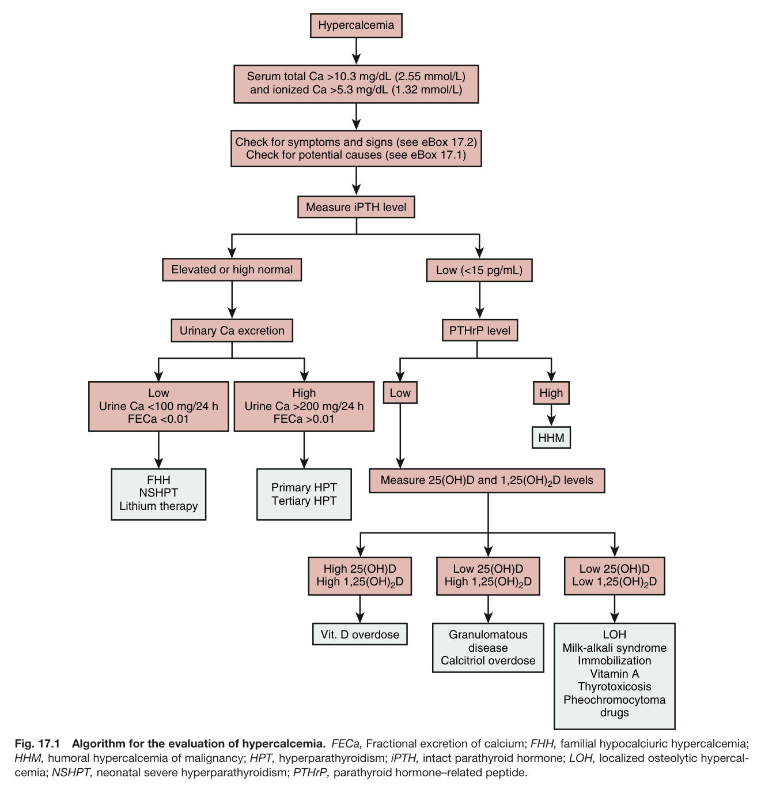

Fig. 17.1 Algorithm for the evaluation of hypercalcemia. FECa, Fractional excretion of calcium; FHH, familial hypocalciuric hypercalcemia; HHM, humoral hypercalcemia of malignancy; HPT, hyperparathyroidism; iPTH, intact parathyroid hormone; LOH, localized osteolytic hypercal- cemia; NSHPT, neonatal severe hyperparathyroidism; PTHrP, parathyroid hormone–related peptide.

---

### Fig_17_2

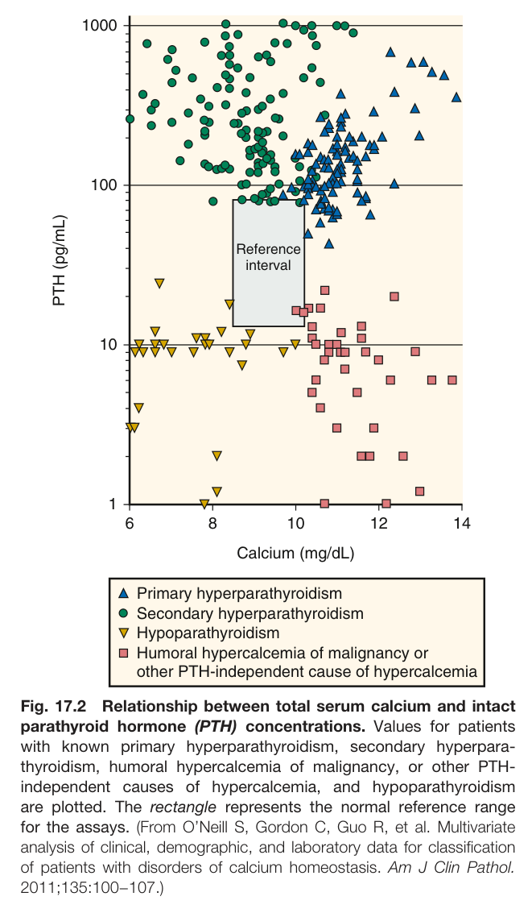

Fig. 17.2 Relationship between total serum calcium and intact parathyroid hormone (PTH) concentrations. Values for patients with known primary hyperparathyroidism, secondary hyperpara- thyroidism, humoral hypercalcemia of malignancy, or other PTH- independent causes of hypercalcemia, and hypoparathyroidism are plotted. The rectangle represents the normal reference range for the assays. (From O’Neill S, Gordon C, Guo R, et al. Multivariate analysis of clinical, demographic, and laboratory data for classification of patients with disorders of calcium homeostasis. Am J Clin Pathol. 2011;135:100−107.)

---

### Fig_17_3

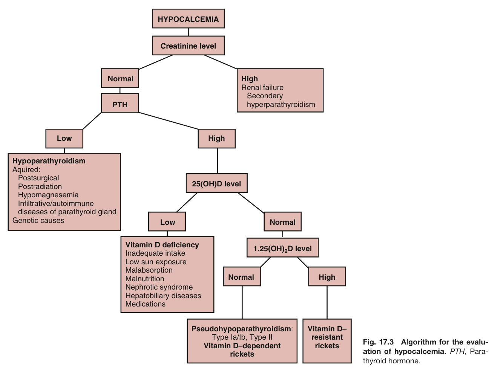

Fig. 17.3 Algorithm for the evalu- ation of hypocalcemia. PTH, Para- thyroid hormone.

---

### Fig_17_4

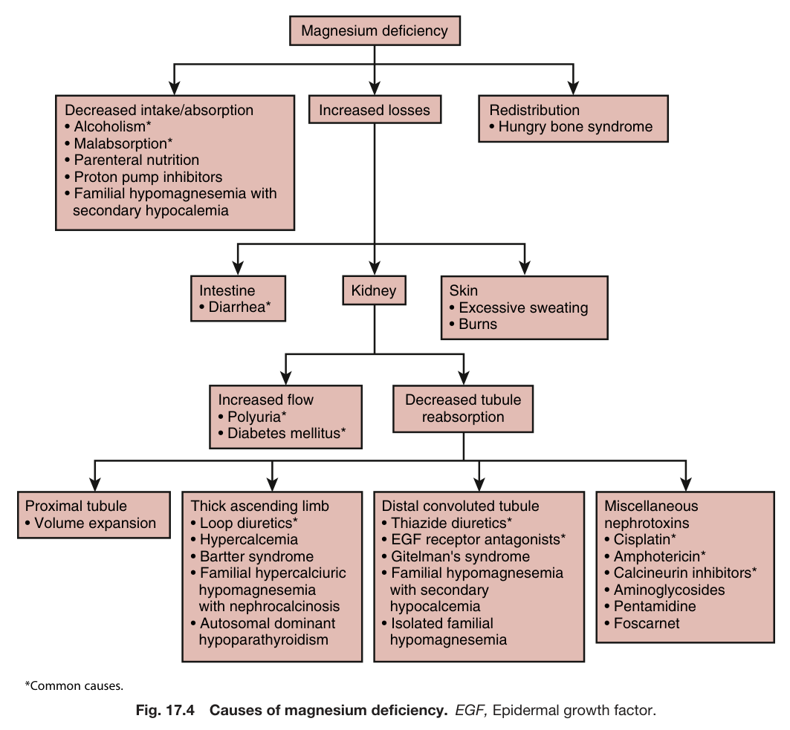

Fig. 17.4 Causes of magnesium deficiency. EGF, Epidermal growth factor.

---

### Fig_17_5

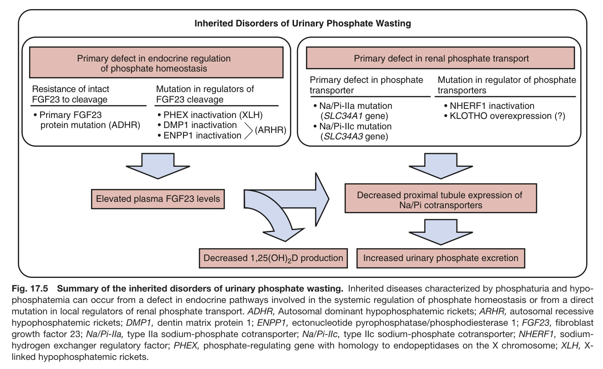

Fig. 17.5 Summary of the inherited disorders of urinary phosphate wasting. Inherited diseases characterized by phosphaturia and hypo- phosphatemia can occur from a defect in endocrine pathways involved in the systemic regulation of phosphate homeostasis or from a direct mutation in local regulators of renal phosphate transport. ADHR, Autosomal dominant hypophosphatemic rickets; ARHR, autosomal recessive hypophosphatemic rickets; DMP1, dentin matrix protein 1; ENPP1, ectonucleotide pyrophosphatase/phosphodiesterase 1; FGF23, fibroblast growth factor 23; Na/Pi-IIa, type IIa sodium-phosphate cotransporter; Na/Pi-IIc, type IIc sodium-phosphate cotransporter; NHERF1, sodium- hydrogen exchanger regulatory factor; PHEX, phosphate-regulating gene with homology to endopeptidases on the X chromosome; XLH, X- linked hypophosphatemic rickets.

---

## Tables

### Table_17_1

#### Table Image

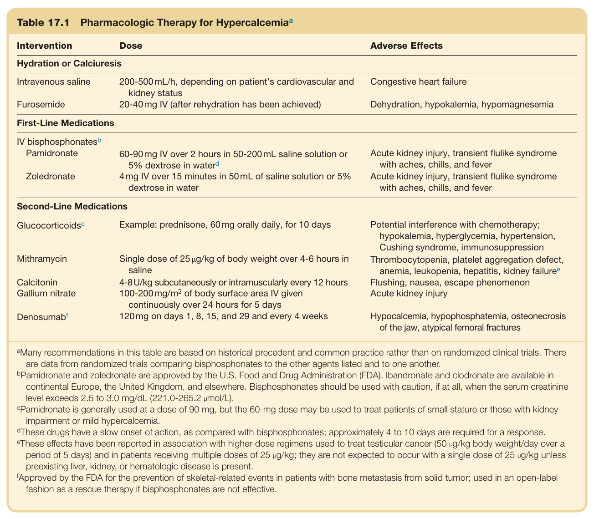

#### Table Data (CSV: [Table_17_1.csv](Table_17_1.csv))

```markdown
| Table Text (OCR) |
| :--- |
| Table 17.1  Pharmacologic Therapy for Hypercalcemia<sup>a</sup> Intervention  Dose  Adverse Effects    Hydration or Calciuresis    Intravenous saline  200-500 mL/h, depending on patient's cardiovascular and kidney status  Congestive heart failure    Furosemide  20-40 mg IV (after rehydration has been achieved)  Dehydration, hypokalemia, hypomagnesemia    First-Line Medications    IV bisphosphonates ^{b}     Pamidronate  60-90 mg IV over 2 hours in 50-200 mL saline solution or 5% dextrose in water ^{d}   Acute kidney injury, transient flulike syndrome with aches, chills, and fever    Zoledronate  4 mg IV over 15 minutes in 50 mL of saline solution or 5% dextrose in water  Acute kidney injury, transient flulike syndrome with aches, chills, and fever    Second-Line Medications    Glucocorticoidsc  Example: prednisone, 60 mg orally daily, for 10 days  Potential interference with chemotherapy; hypokalemia, hyperglycemia, hypertension, Cushing syndrome, immunosuppression    Mithramycin  Single dose of 25 μg/kg of body weight over 4-6 hours in saline  Thrombocytopenia, platelet aggregation defect, anemia, leukopenia, hepatitis, kidney failure ^{e}     Calcitonin  4-8 U/kg subcutaneously or intramuscularly every 12 hours  Flushing, nausea, escape phenomenon    Gallium nitrate  100-200 mg/m ^{2}  of body surface area IV given continuously over 24 hours for 5 days  Acute kidney injury    Denosumab ^{f}   120 mg on days 1, 8, 15, and 29 and every 4 weeks  Hypocalcemia, hypophosphatemia, osteonecrosis of the jaw, atypical femoral fractures <sup>a</sup>Many recommendations in this table are based on historical precedent and common practice rather than on randomized clinical trials. There are data from randomized trials comparing bisphosphonates to the other agents listed and to one another. <sup>b</sup>Pamidronate and zoledronate are approved by the U.S. Food and Drug Administration (FDA). Ibandronate and clodronate are available in continental Europe, the United Kingdom, and elsewhere. Bisphosphonates should be used with caution, if at all, when the serum creatinine level exceeds 2.5 to 3.0 mg/dL (221.0-265.2 μmol/L). <sup>c</sup>Pamidronate is generally used at a dose of 90 mg, but the 60-mg dose may be used to treat patients of small stature or those with kidney impairment or mild hypercalcemia. <sup>d</sup>These drugs have a slow onset of action, as compared with bisphosphonates; approximately 4 to 10 days are required for a response. <sup>e</sup>These effects have been reported in association with higher-dose regimens used to treat testicular cancer (50 μg/kg body weight/day over a period of 5 days) and in patients receiving multiple doses of 25 μg/kg; they are not expected to occur with a single dose of 25 μg/kg unless preexisting liver, kidney, or hematologic disease is present. <sup>f</sup>Approved by the FDA for the prevention of skeletal-related events in patients with bone metastasis from solid tumor; used in an open-label fashion as a rescue therapy if bisphosphonates are not effective. |
```

Table 17.1 Pharmacologic Therapy for Hypercalcemia<sup>a</sup>

---

### Table_17_2

#### Table Image

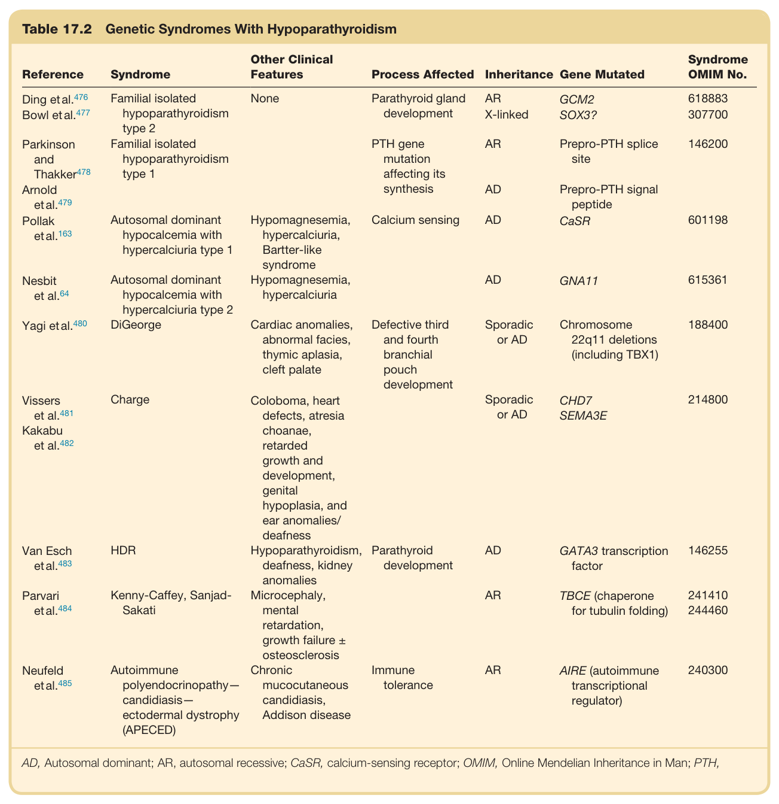

#### Table Data (CSV: [Table_17_2.csv](Table_17_2.csv))

```markdown
| Table Text (OCR) |
| :--- |
| Table 17.2  Genetic Syndromes With Hypoparathyroidism Reference  Syndrome  Other Clinical Features  Process Affected  Inheritance  Gene Mutated  Syndrome OMIM No.    Ding et al.476  Familial isolated hypoparathyroidism type 2  None  Parathyroid gland development  AR  GCM2  618883    Bowl et al.477  X-linked  SOX3?  307700    Parkinson and Thakker478  Familial isolated hypoparathyroidism type 1    PTH gene mutation affecting its synthesis  AR  Prepro-PTH splice site  146200    Arnold et al.479      AD  Prepro-PTH signal peptide      Pollak et al.163  Autosomal dominant hypocalcemia with hypercalciuria type 1  Hypomagnesemia, hypercalciuria, Bartter-like syndrome  Calcium sensing  AD  CaSR  601198    Nesbit et al.64  Autosomal dominant hypocalcemia with hypercalciuria type 2  Hypomagnesemia, hypercalciuria    AD  GNA11  615361    Yagi et al.480  DiGeorge  Cardiac anomalies, abnormal facies, thymic aplasia, cleft palate  Defective third and fourth branchial pouch development  Sporadic or AD  Chromosome 22q11 deletions (including TBX1)  188400    Vissers et al.481  Charge  Coloboma, heart defects, atresia choanae, retarded growth and development, genital hypoplasia, and ear anomalies/ deafness    Sporadic or AD  CHD7 SEMA3E  214800    Kakabu et al.482                Van Esch et al.483  HDR  Hypoparathyroidism, deafness, kidney anomalies  Parathyroid development  AD  GATA3 transcription factor  146255    Parvari et al.484  Kenny-Caffey, Sanjad-Sakati  Microcephaly, mental retardation, growth failure ± osteosclerosis    AR  TBCE (chaperone for tubulin folding)  241410244460    Neufeld et al.485  Autoimmune polyendocrinopathy—candidiasis—ectodermal dystrophy (APECED)  Chronic mucocutaneous candidiasis, Addison disease  Immune tolerance  AR  AIRE (autoimmune transcriptional regulator)  240300 AD, Autosomal dominant; AR, autosomal recessive; CaSR, calcium-sensing receptor; OMIM, Online Mendelian Inheritance in Man; PTH, |
```

Table 17.2 Genetic Syndromes With Hypoparathyroidism

---

## Boxes

### Box_e17_1

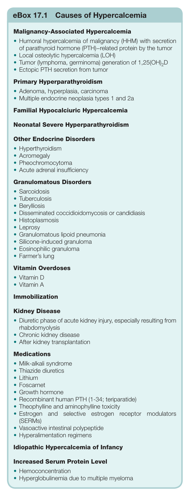

#### Box Text

```markdown
eBox 17.1 Causes of Hypercalcemia Malignancy-Associated Hypercalcemia • Humoral hypercalcemia of malignancy (HHM) with secretion of parathyroid hormone (PTH)−related protein by the tumor • Local osteolytic hypercalcemia (LOH) • Tumor (lymphoma, germinoma) generation of 1,25(OH)<sub>2</sub>D • Ectopic PTH secretion from tumor Primary Hyperparathyroidism • Adenoma, hyperplasia, carcinoma • Multiple endocrine neoplasia types 1 and 2a Familial Hypocalciuric Hypercalcemia Neonatal Severe Hyperparathyroidism Other Endocrine Disorders • Hyperthyroidism • Acromegaly • Pheochromocytoma • Acute adrenal insufficiency Granulomatous Disorders • Sarcoidosis • Tuberculosis • Berylliosis • Disseminated coccidioidomycosis or candidiasis • Histoplasmosis • Leprosy • Granulomatous lipoid pneumonia • Silicone-induced granuloma • Eosinophilic granuloma • Farmer’s lung Vitamin Overdoses • Vitamin D • Vitamin A Immobilization Kidney Disease • Diuretic phase of acute kidney injury, especially resulting from rhabdomyolysis • Chronic kidney disease • After kidney transplantation Medications • Milk-alkali syndrome • Thiazide diuretics • Lithium • Foscarnet • Growth hormone • Recombinant human PTH (1-34; teriparatide) • Theophylline and aminophylline toxicity • Estrogen and selective estrogen receptor modulators (SERMs) • Vasoactive intestinal polypeptide • Hyperalimentation regimens Idiopathic Hypercalcemia of Infancy Increased Serum Protein Level • Hemoconcentration • Hyperglobulinemia due to multiple myeloma
```

Box e17.1 Causes of Hypercalcemia

---

### Box_e17_2

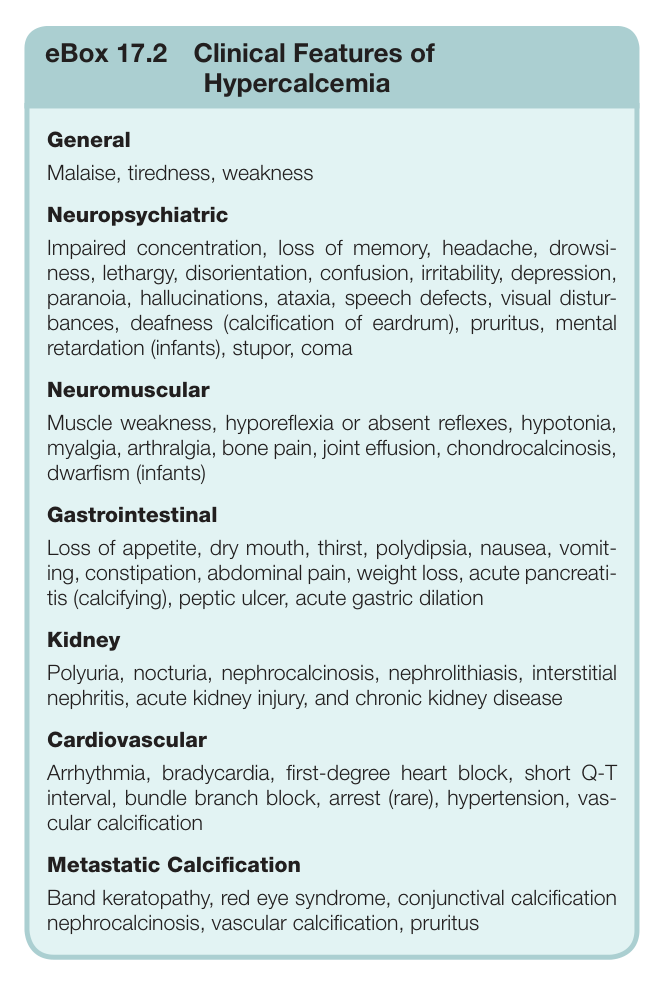

#### Box Text

```markdown
eBox 17.2 Clinical Features of Hypercalcemia General Malaise, tiredness, weakness Neuropsychiatric Impaired concentration, loss of memory, headache, drowsi- ness, lethargy, disorientation, confusion, irritability, depression, paranoia, hallucinations, ataxia, speech defects, visual distur- bances, deafness (calcification of eardrum), pruritus, menta retardation (infants), stupor, coma Neuromuscular Muscle weakness, hyporeflexia or absent reflexes, hypotonia, myalgia, arthralgia, bone pain, joint effusion, chondrocalcinosis, dwarfism (infants) Gastrointestinal Loss of appetite, dry mouth, thirst, polydipsia, nausea, vomit- ing, constipation, abdominal pain, weight loss, acute pancreati- tis (calcifying), peptic ulcer, acute gastric dilation Kidney Polyuria, nocturia, nephrocalcinosis, nephrolithiasis, interstitial nephritis, acute kidney injury, and chronic kidney disease Cardiovascular Arrhythmia, bradycardia, first-degree heart block, short Q-T interval, bundle branch block, arrest (rare), hypertension, vas- cular calcification Metastatic Calcification Band keratopathy, red eye syndrome, conjunctival calcification nephrocalcinosis, vascular calcification, pruritus
```

Box e17.2 Clinical Features of Hypercalcemia

---

### Box_e17_3

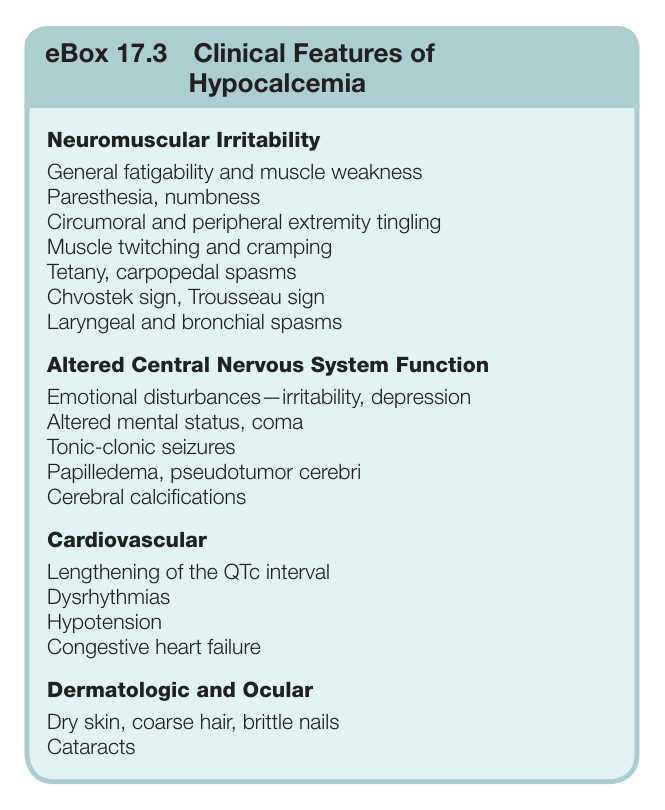

#### Box Text

```markdown
eBox 17.3 Clinical Features of Hypocalcemia Neuromuscular Irritability General fatigability and muscle weakness Paresthesia, numbness Circumoral and peripheral extremity tingling Muscle twitching and cramping Tetany, carpopedal spasms Chvostek sign, Trousseau sign Laryngeal and bronchial spasms Altered Central Nervous System Function Emotional disturbances—irritability, depression Altered mental status, coma Tonic-clonic seizures Papilledema, pseudotumor cerebri Cerebral calcifications Cardiovascular Lengthening of the QTc interval Dysrhythmias Hypotension Congestive heart failure Dermatologic and Ocular Dry skin, coarse hair, brittle nails Cataracts
```

Box e17.3 Clinical Features of Hypocalcemia

---

### Box_e17_4

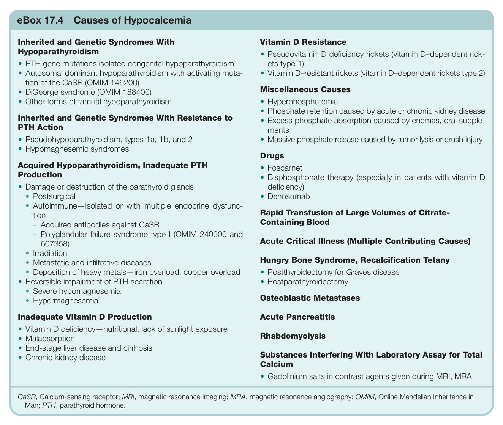

#### Box Text

```markdown
eBox 17.4 Causes of Hypocalcemia Inherited and Genetic Syndromes With Hypoparathyroidism • PTH gene mutations isolated congenital hypoparathyroidism • Autosomal dominant hypoparathyroidism with activating muta- tion of the CaSR (OMIM 146200) • DiGeorge syndrome (OMIM 188400) • Other forms of familial hypoparathyroidism Inherited and Genetic Syndromes With Resistance to PTH Action • Pseudohypoparathyroidism, types 1a, 1b, and 2 • Hypomagnesemic syndromes Acquired Hypoparathyroidism, Inadequate PTH Production • Damage or destruction of the parathyroid glands • Postsurgical • Autoimmune—isolated or with multiple endocrine dysfunc- tion – Acquired antibodies against CaSR – Polyglandular failure syndrome type I (OMIM 240300 and 607358) • Irradiation • Metastatic and infiltrative diseases • Deposition of heavy metals—iron overload, copper overload • Reversible impairment of PTH secretion • Severe hypomagnesemia • Hypermagnesemia Inadequate Vitamin D Production • Vitamin D deficiency—nutritional, lack of sunlight exposure • Malabsorption • End-stage liver disease and cirrhosis • Chronic kidney disease CaSR, Calcium-sensing receptor; MRI, magnetic resonance imaging; MRA, magnetic resonance angiography; OMIM, Online Mendelian Inheritance in Man; PTH, parathyroid hormone.
```

Box e17.4 Causes of Hypocalcemia

---

### Box_e17_5

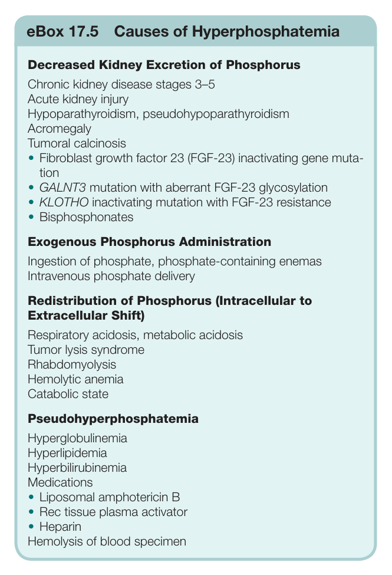

#### Box Text

```markdown
eBox 17.5 Causes of Hyperphosphatemia Decreased Kidney Excretion of Phosphorus Chronic kidney disease stages 3–5 Acute kidney injury Hypoparathyroidism, pseudohypoparathyroidism Acromegaly Tumoral calcinosis • Fibroblast growth factor 23 (FGF-23) inactivating gene muta- tion • GALNT3 mutation with aberrant FGF-23 glycosylation • KLOTHO inactivating mutation with FGF-23 resistance • Bisphosphonates Exogenous Phosphorus Administration Ingestion of phosphate, phosphate-containing enemas Intravenous phosphate delivery Redistribution of Phosphorus (Intracellular to Extracellular Shift) Respiratory acidosis, metabolic acidosis Tumor lysis syndrome Rhabdomyolysis Hemolytic anemia Catabolic state Pseudohyperphosphatemia Hyperglobulinemia Hyperlipidemia Hyperbilirubinemia Medications • Liposomal amphotericin B • Rec tissue plasma activator • Heparin Hemolysis of blood specimen
```

Box e17.5 Causes of Hyperphosphatemia

---

### Box_e17_6

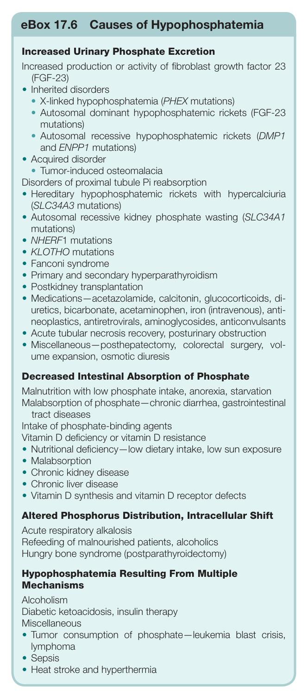

#### Box Text

```markdown
eBox 17.6 Causes of Hypophosphatemia Increased Urinary Phosphate Excretion Increased production or activity of fibroblast growth factor 23 (FGF-23) • Inherited disorders • X-linked hypophosphatemia (PHEX mutations) • Autosomal dominant hypophosphatemic rickets (FGF-23 mutations) Autosomal recessive hypophosphatemic rickets (DMP1 and ENPP1 mutations) • Acquired disorder • Tumor-induced osteomalacia Disorders of proximal tubule Pi reabsorption • Hereditary hypophosphatemic rickets with hypercalciuria (SLC34A3 mutations) • Autosomal recessive kidney phosphate wasting (SLC34A1 mutations) • NHERF1 mutations • KLOTHO mutations • Fanconi syndrome • Primary and secondary hyperparathyroidism • Postkidney transplantation • Medications—acetazolamide, calcitonin, glucocorticoids, di- uretics, bicarbonate, acetaminophen, iron (intravenous), anti- neoplastics, antiretrovirals, aminoglycosides, anticonvulsants • Acute tubular necrosis recovery, posturinary obstruction • Miscellaneous—posthepatectomy, colorectal surgery, vol- ume expansion, osmotic diuresis Decreased Intestinal Absorption of Phosphate Malnutrition with low phosphate intake, anorexia, starvation Malabsorption of phosphate—chronic diarrhea, gastrointestinal tract diseases Intake of phosphate-binding agents Vitamin D deficiency or vitamin D resistance • Nutritional deficiency—low dietary intake, low sun exposure • Malabsorption • Chronic kidney disease • Chronic liver disease • Vitamin D synthesis and vitamin D receptor defects Altered Phosphorus Distribution, Intracellular Shift Acute respiratory alkalosis Refeeding of malnourished patients, alcoholics Hungry bone syndrome (postparathyroidectomy) Hypophosphatemia Resulting From Multiple Mechanisms Alcoholism Diabetic ketoacidosis, insulin therapy Miscellaneous • Tumor consumption of phosphate—leukemia blast crisis, lymphoma • Sepsis • Heat stroke and hyperthermia
```

Box e17.6 Causes of Hypophosphatemia

---
