# 18. Epidemiology of Kidney Disease - Figures and Tables Index

This document lists all figures and tables extracted from `18. Epidemiology of Kidney Disease.pdf`.

## Table of Contents
- [Figures](#figures)
- [Tables](#tables)

---

## Figures

### Fig_18_1

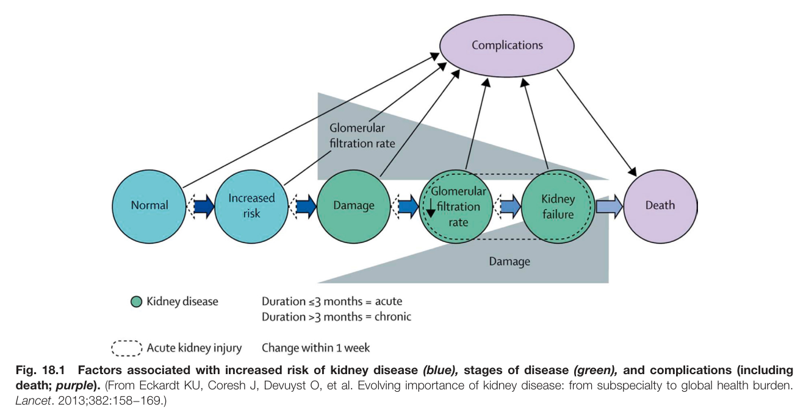

Fig. 18.1 Factors associated with increased risk of kidney disease (blue), stages of disease (green), and complications (including death; purple). (From Eckardt KU, Coresh J, Devuyst O, et al. Evolving importance of kidney disease: from subspecialty to global health burden. Lancet. 2013;382:158−169.)

---

### Fig_18_2

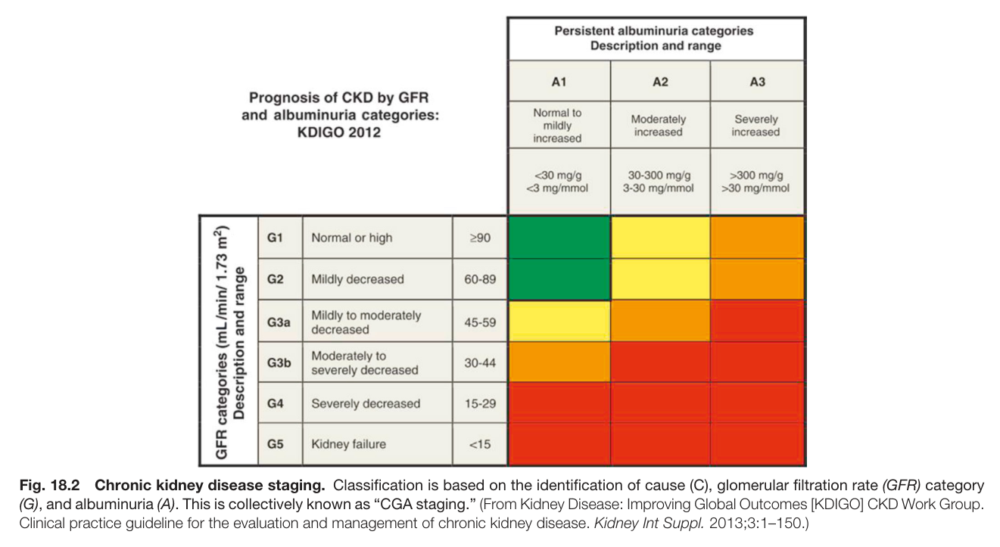

Fig. 18.2 Chronic kidney disease staging. Classification is based on the identification of cause (C), glomerular filtration rate (GFR) category (G), and albuminuria (A). This is collectively known as “CGA staging.” (From Kidney Disease: Improving Global Outcomes [KDIGO] CKD Work Group. Clinical practice guideline for the evaluation and management of chronic kidney disease. Kidney Int Suppl. 2013;3:1–150.)

---

### Fig_18_3

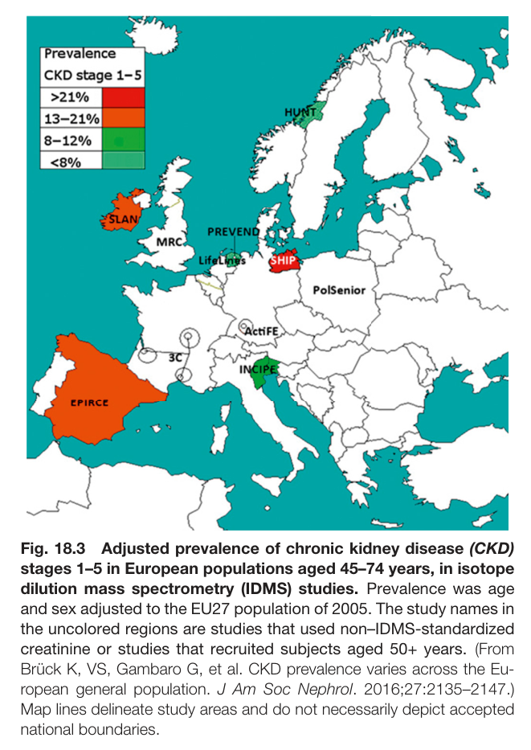

Fig. 18.3 Adjusted prevalence of chronic kidney disease (CKD) stages 1–5 in European populations aged 45–74 years, in isotope dilution mass spectrometry (IDMS) studies. Prevalence was age and sex adjusted to the EU27 population of 2005. The study names in the uncolored regions are studies that used non–IDMS-standardized creatinine or studies that recruited subjects aged 50+ years. (From Brück K, VS, Gambaro G, et al. CKD prevalence varies across the Eu- ropean general population. J Am Soc Nephrol. 2016;27:2135–2147.) Map lines delineate study areas and do not necessarily depict accepted national boundaries.

---

### Fig_18_4

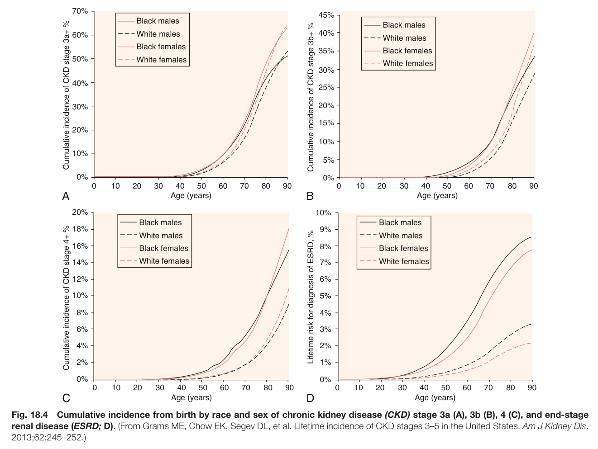

Fig. 18.4 Cumulative incidence from birth by race and sex of chronic kidney disease (CKD) stage 3a (A), 3b (B), 4 (C), and end-stage renal disease (ESRD; D). (From Grams ME, Chow EK, Segev DL, et al. Lifetime incidence of CKD stages 3–5 in the United States. Am J Kidney Dis. 2013;62:245–252.)

---

### Fig_18_5

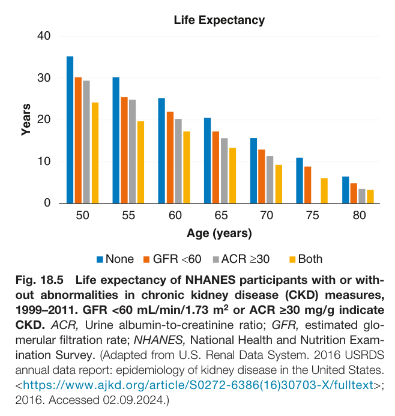

Fig. 18.5 Life expectancy of NHANES participants with or with- out abnormalities in chronic kidney disease (CKD) measures, 1999–2011. GFR <60 mL/min/1.73 m<sup>2</sup> or ACR ≥30 mg/g indicate CKD. ACR, Urine albumin-to-creatinine ratio; GFR, estimated glo- merular filtration rate; NHANES, National Health and Nutrition Exam- ination Survey. (Adapted from U.S. Renal Data System. 2016 USRDS annual data report: epidemiology of kidney disease in the United States. <https://www.ajkd.org/article/S0272-6386(16)30703-X/fulltext>; 2016. Accessed 02.09.2024.)

---

### Fig_18_6

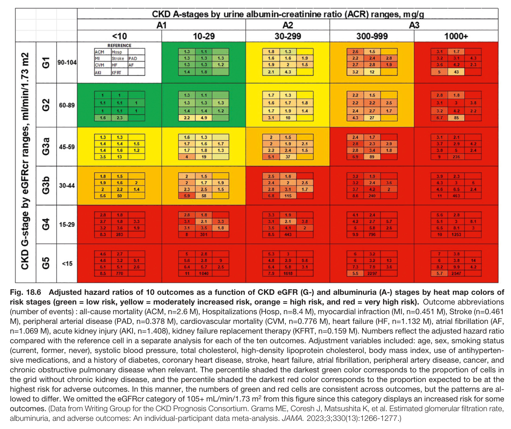

Fig. 18.6 Adjusted hazard ratios of 10 outcomes as a function of CKD eGFR (G-) and albuminuria (A-) stages by heat map colors of risk stages (green = low risk, yellow = moderately increased risk, orange = high risk, and red = very high risk). Outcome abbreviations (number of events) : all-cause mortality (ACM, n=2.6 M), Hospitalizations (Hosp, n=8.4 M), myocardial infraction (MI, n=0.451 M), Stroke (n=0.461 M), peripheral arterial disease (PAD, n=0.378 M), cardiovascular mortality (CVM, n=0.776 M), heart failure (HF, n=1.132 M), atrial fibrillation (AF, n=1.069 M), acute kidney injury (AKI, n=1.408), kidney failure replacement therapy (KFRT, n=0.159 M). Numbers reflect the adjusted hazard ratio compared with the reference cell in a separate analysis for each of the ten outcomes. Adjustment variables included: age, sex, smoking status (current, former, never), systolic blood pressure, total cholesterol, high-density lipoprotein cholesterol, body mass index, use of antihyperten- sive medications, and a history of diabetes, coronary heart disease, stroke, heart failure, atrial fibrillation, peripheral artery disease, cancer, and chronic obstructive pulmonary disease when relevant. The percentile shaded the darkest green color corresponds to the proportion of cells in the grid without chronic kidney disease, and the percentile shaded the darkest red color corresponds to the proportion expected to be at the highest risk for adverse outcomes. In this manner, the numbers of green and red cells are consistent across outcomes, but the patterns are al- lowed to differ. We omitted the eGFRcr category of 105+ mL/min/1.73 m<sup>2</sup> from this figure since this category displays an increased risk for some outcomes. (Data from Writing Group for the CKD Prognosis Consortium. Grams ME, Coresh J, Matsushita K, et al. Estimated glomerular filtration rate, albuminuria, and adverse outcomes: An individual-participant data meta-analysis. JAMA. 2023;3;330(13):1266-1277.

---

### Fig_18_7

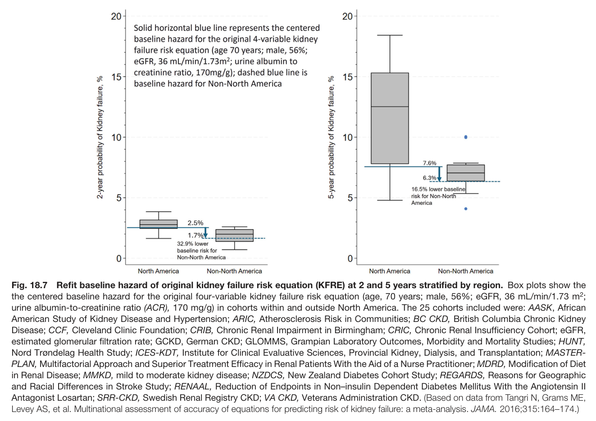

Fig. 18.7 Refit baseline hazard of original kidney failure risk equation (KFRE) at 2 and 5 years stratified by region. Box plots show the the centered baseline hazard for the original four-variable kidney failure risk equation (age, 70 years; male, 56%; eGFR, 36 mL/min/1.73 m<sup>2</sup>; urine albumin-to-creatinine ratio (ACR), 170 mg/g) in cohorts within and outside North America. The 25 cohorts included were: AASK, African American Study of Kidney Disease and Hypertension; ARIC, Atherosclerosis Risk in Communities; BC CKD, British Columbia Chronic Kidney Disease; CCF, Cleveland Clinic Foundation; CRIB, Chronic Renal Impairment in Birmingham; CRIC, Chronic Renal Insufficiency Cohort; eGFR, estimated glomerular filtration rate; GCKD, German CKD; GLOMMS, Grampian Laboratory Outcomes, Morbidity and Mortality Studies; HUNT, Nord Trøndelag Health Study; ICES-KDT, Institute for Clinical Evaluative Sciences, Provincial Kidney, Dialysis, and Transplantation; MASTER- PLAN, Multifactorial Approach and Superior Treatment Efficacy in Renal Patients With the Aid of a Nurse Practitioner; MDRD, Modification of Diet in Renal Disease; MMKD, mild to moderate kidney disease; NZDCS, New Zealand Diabetes Cohort Study; REGARDS, Reasons for Geographic and Racial Differences in Stroke Study; RENAAL, Reduction of Endpoints in Non–insulin Dependent Diabetes Mellitus With the Angiotensin II Antagonist Losartan; SRR-CKD, Swedish Renal Registry CKD; VA CKD, Veterans Administration CKD. (Based on data from Tangri N, Grams ME, Levey AS, et al. Multinational assessment of accuracy of equations for predicting risk of kidney failure: a meta-analysis. JAMA. 2016;315:164–174.)

---

### Fig_18_8

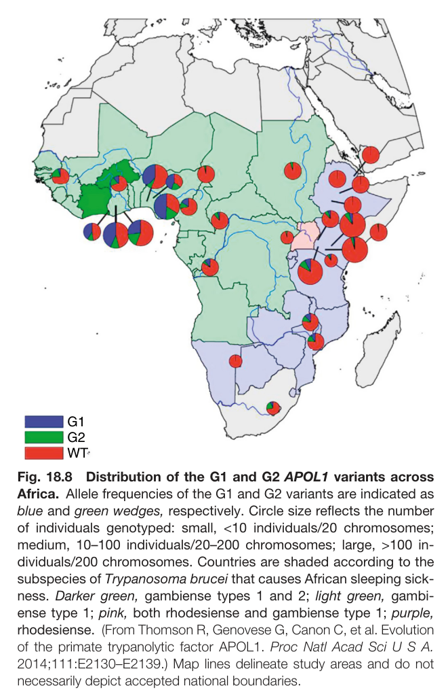

Fig. 18.8 Distribution of the G1 and G2 APOL1 variants across Africa. Allele frequencies of the G1 and G2 variants are indicated as blue and green wedges, respectively. Circle size reflects the number of individuals genotyped: small, <10 individuals/20 chromosomes; medium, 10–100 individuals/20–200 chromosomes; large, >100 in- dividuals/200 chromosomes. Countries are shaded according to the subspecies of Trypanosoma brucei that causes African sleeping sick- ness. Darker green, gambiense types 1 and 2; light green, gambi- ense type 1; pink, both rhodesiense and gambiense type 1; purple, rhodesiense. (From Thomson R, Genovese G, Canon C, et al. Evolution of the primate trypanolytic factor APOL1. Proc Natl Acad Sci U S A. 2014;111:E2130–E2139.) Map lines delineate study areas and do not necessarily depict accepted national boundaries.

---

### Fig_18_9

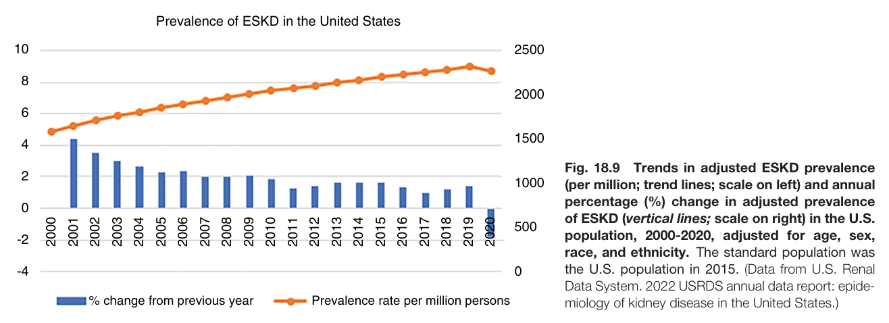

Fig. 18.9 Trends in adjusted ESKD prevalence (per million; trend lines; scale on left) and annual percentage (%) change in adjusted prevalence of ESKD (vertical lines; scale on right) in the U.S. population, 2000-2020, adjusted for age, sex, race, and ethnicity. The standard population was the U.S. population in 2015. (Data from U.S. Renal Data System. 2022 USRDS annual data report: epide- miology of kidney disease in the United States.)

---

### Fig_18_10

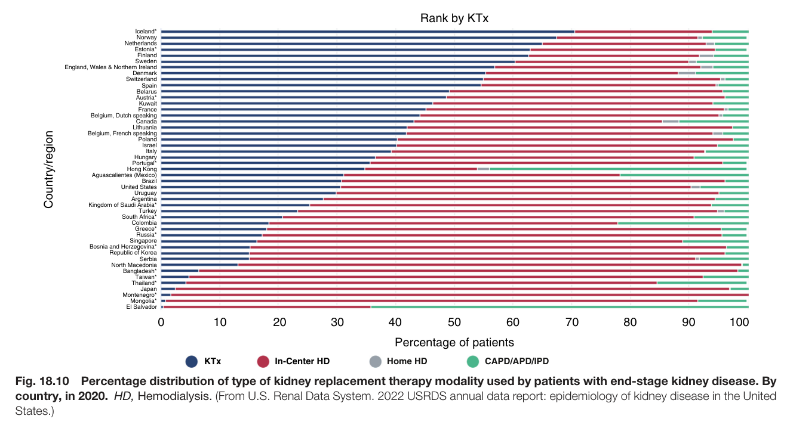

Fig. 18.10 Percentage distribution of type of kidney replacement therapy modality used by patients with end-stage kidney disease. By country, in 2020. HD, Hemodialysis. (From U.S. Renal Data System. 2022 USRDS annual data report: epidemiology of kidney disease in the United States.)

---

### Fig_18_11

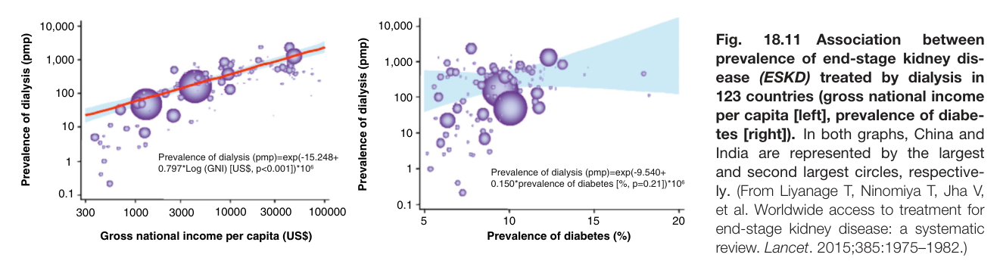

Fig. 18.11 Association between prevalence of end-stage kidney dis- ease (ESKD) treated by dialysis in 123 countries (gross national income per capita [left], prevalence of diabe- tes [right]). In both graphs, China and India are represented by the largest and second largest circles, respective- ly. (From Liyanage T, Ninomiya T, Jha V, et al. Worldwide access to treatment for end-stage kidney disease: a systematic review. Lancet. 2015;385:1975–1982.)

---

### Fig_18_12

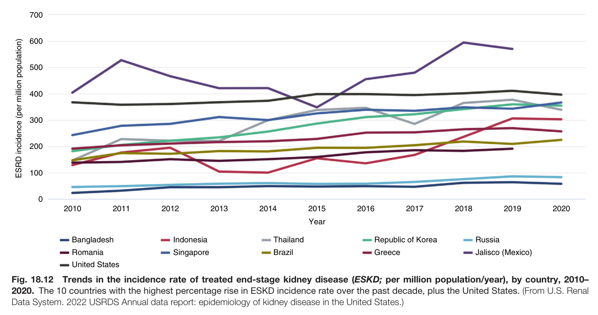

Fig. 18.12 Trends in the incidence rate of treated end-stage kidney disease (ESKD; per million population/year), by country, 2010– 2020. The 10 countries with the highest percentage rise in ESKD incidence rate over the past decade, plus the United States. (From U.S. Rena Data System. 2022 USRDS Annual data report: epidemiology of kidney disease in the United States.)

---

### Fig_18_13

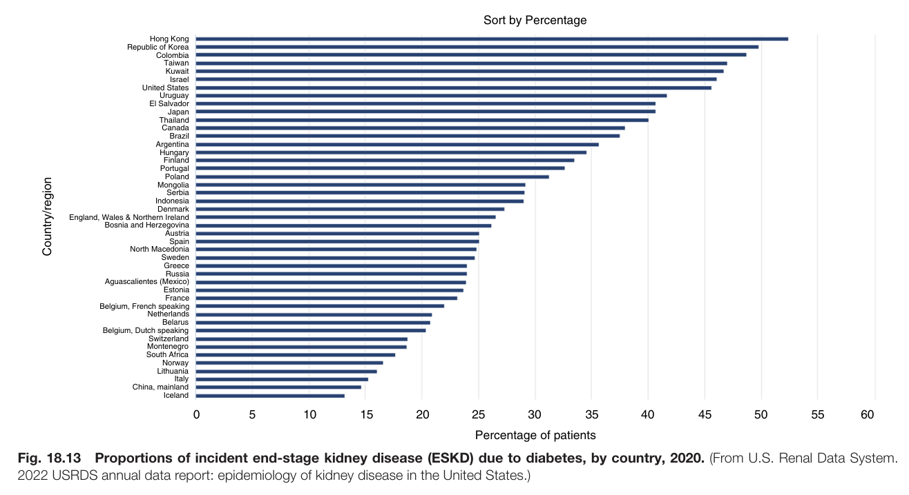

Fig. 18.13 Proportions of incident end-stage kidney disease (ESKD) due to diabetes, by country, 2020. (From U.S. Renal Data System. 2022 USRDS annual data report: epidemiology of kidney disease in the United States.)

---

### Fig_18_14

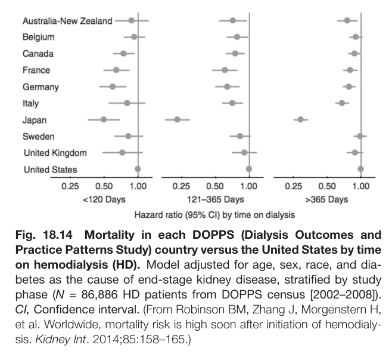

Fig. 18.14 Mortality in each DOPPS (Dialysis Outcomes and Practice Patterns Study) country versus the United States by time on hemodialysis (HD). Model adjusted for age, sex, race, and dia- betes as the cause of end-stage kidney disease, stratified by study phase (N = 86,886 HD patients from DOPPS census [2002–2008]). CI, Confidence interval. (From Robinson BM, Zhang J, Morgenstern H, et al. Worldwide, mortality risk is high soon after initiation of hemodialy- sis. Kidney Int. 2014;85:158–165.)

---

### Fig_18_15

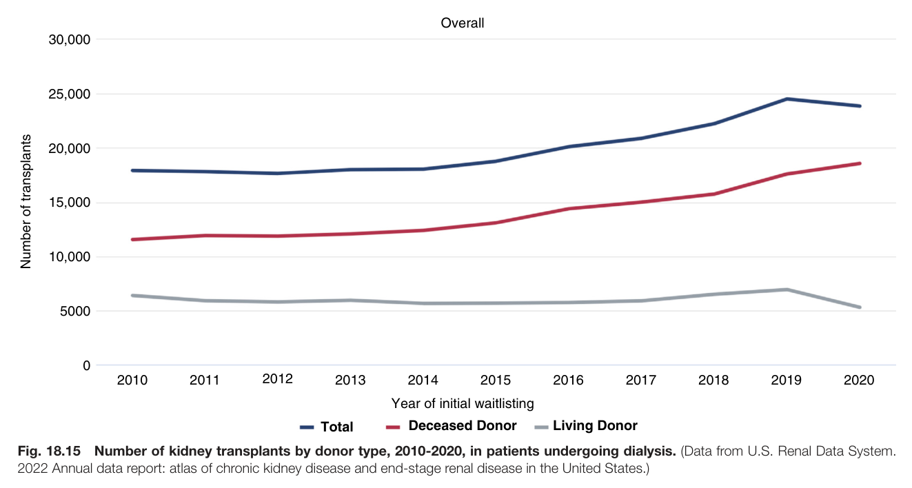

Fig. 18.15 Number of kidney transplants by donor type, 2010-2020, in patients undergoing dialysis. (Data from U.S. Renal Data System. 2022 Annual data report: atlas of chronic kidney disease and end-stage renal disease in the United States.)

---

### Fig_18_16

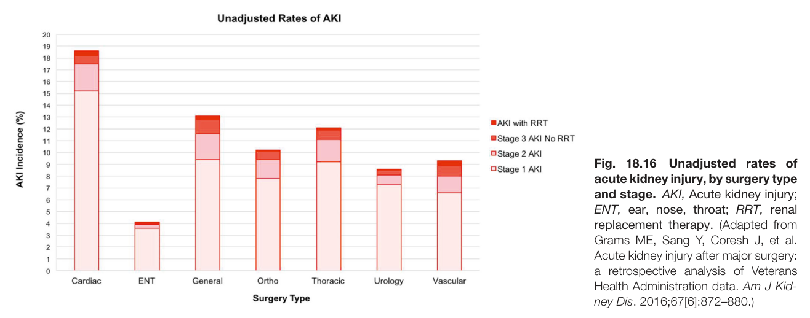

Fig. 18.16 Unadjusted rates of acute kidney injury, by surgery type and stage. AKI, Acute kidney injury; ENT, ear, nose, throat; RRT, renal replacement therapy. (Adapted from Grams ME, Sang Y, Coresh J, et al. Acute kidney injury after major surgery: a retrospective analysis of Veterans Health Administration data. Am J Kid- ney Dis. 2016;67[6]:872–880.)

---

### Fig_18_17

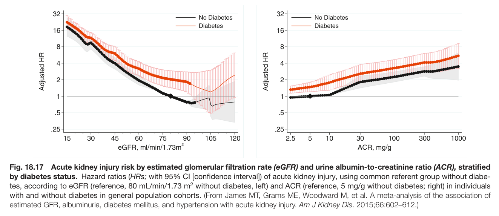

Fig. 18.17 Acute kidney injury risk by estimated glomerular filtration rate (eGFR) and urine albumin-to-creatinine ratio (ACR), stratified by diabetes status. Hazard ratios (HRs; with 95% CI [confidence interval]) of acute kidney injury, using common referent group without diabe- tes, according to eGFR (reference, 80 mL/min/1.73 m<sup>2</sup> without diabetes, left) and ACR (reference, 5 mg/g without diabetes; right) in individual with and without diabetes in general population cohorts. (From James MT, Grams ME, Woodward M, et al. A meta-analysis of the association of estimated GFR, albuminuria, diabetes mellitus, and hypertension with acute kidney injury. Am J Kidney Dis. 2015;66:602–612.)

---

## Tables

### Table_18_1

#### Table Image

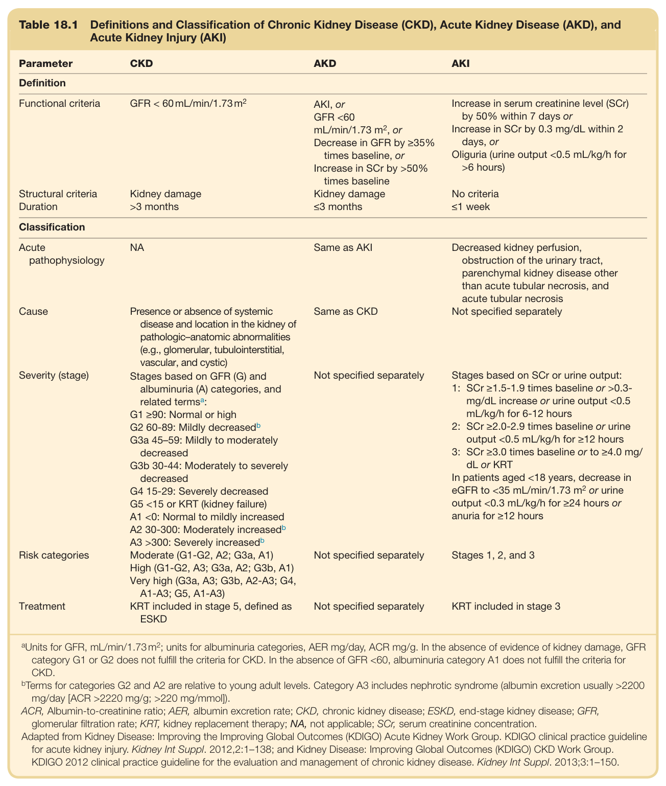

#### Table Data (CSV: [Table_18_1.csv](Table_18_1.csv))

```markdown
| Table Text (OCR) |
| :--- |
| Table 18.1  Definitions and Classification of Chronic Kidney Disease (CKD), Acute Kidney Disease (AKD), and Acute Kidney Injury (AKI) Parameter  CKD  AKD  AKI    Definition    Functional criteria  GFR < 60 mL/min/1.73  m^2   AKI, orGFR <60mL/min/1.73  m^2 , orDecrease in GFR by ≥35% times baseline, orIncrease in SCr by >50% times baseline  Increase in serum creatinine level (SCr) by 50% within 7 days orIncrease in SCr by 0.3 mg/dL within 2 days, orOliguria (urine output <0.5 mL/kg/h for >6 hours)    Structural criteria  Kidney damage  Kidney damage  No criteria    Duration  >3 months  ≤3 months  ≤1 week    Classification    Acute pathophysiology  NA  Same as AKI  Decreased kidney perfusion, obstruction of the urinary tract, parenchymal kidney disease other than acute tubular necrosis, and acute tubular necrosis    Cause  Presence or absence of systemic disease and location in the kidney of pathologic-anatomic abnormalities (e.g., glomerular, tubulointerstitial, vascular, and cystic)  Same as CKD  Not specified separately    Severity (stage)  Stages based on GFR (G) and albuminuria (A) categories, and related termsa:G1 ≥90: Normal or highG2 60-89: Mildly decreasedbG3a 45-59: Mildly to moderately decreasedG3b 30-44: Moderately to severely decreasedG4 15-29: Severely decreasedG5 <15 or KRT (kidney failure)A1 <0: Normal to mildly increasedA2 30-300: Moderately increasedbA3 >300: Severely increasedb  Not specified separately  Stages based on SCr or urine output:1: SCr ≥1.5-1.9 times baseline or >0.3- mg/dL increase or urine output <0.5 mL/kg/h for 6-12 hours2: SCr ≥2.0-2.9 times baseline or urine output <0.5 mL/kg/h for ≥12 hours3: SCr ≥3.0 times baseline or to ≥4.0 mg/ dL or KRTIn patients aged <18 years, decrease in eGFR to <35 mL/min/1.73  m^2  or urine output <0.3 mL/kg/h for ≥24 hours or anuria for ≥12 hours    Risk categories  Moderate (G1-G2, A2; G3a, A1)High (G1-G2, A3; G3a, A2; G3b, A1)Very high (G3a, A3; G3b, A2-A3; G4, A1-A3; G5, A1-A3)  Not specified separately  Stages 1, 2, and 3    Treatment  KRT included in stage 5, defined as ESKD  Not specified separately  KRT included in stage 3 <sup>a</sup>Units for GFR, mL/min/1.73m<sup>2</sup>; units for albuminuria categories, AER mg/day, ACR mg/g. In the absence of evidence of kidney damage, GFR category G1 or G2 does not fulfill the criteria for CKD. In the absence of GFR <60, albuminuria category A1 does not fulfill the criteria for CKD. <sup>b</sup>Terms for categories G2 and A2 are relative to young adult levels. Category A3 includes nephrotic syndrome (albumin excretion usually >2200 mg/day [ACR >2220 mg/g; >220 mg/mmol]) ACR, Albumin-to-creatinine ratio; AER, albumin excretion rate; CKD, chronic kidney disease; ESKD, end-stage kidney disease; GFR, glomerular filtration rate; KRT, kidney replacement therapy; NA, not applicable; SCr, serum creatinine concentration. Adapted from Kidney Disease: Improving the Improving Global Outcomes (KDIGO) Acute Kidney Work Group. KDIGO clinical practice guideline for acute kidney injury. Kidney Int Suppl. 2012,2:1–138; and Kidney Disease: Improving Global Outcomes (KDIGO) CKD Work Group. KDIGO 2012 clinical practice guideline for the evaluation and management of chronic kidney disease. Kidney Int Suppl. 2013;3:1–150. |
```

Table 18.1 Definitions and Classification of Chronic Kidney Disease (CKD), Acute Kidney Disease (AKD), and Acute Kidney Injury (AKI)

---
