# 19. Risk Prediction in Chronic Kidney DiseaseaaThe authors would like to thank Mackenzie Alexiuk for her invaluable editorial assistance throughout this chapter_ - Figures and Tables Index

This document lists all figures and tables extracted from `19. Risk Prediction in Chronic Kidney DiseaseaaThe authors would like to thank Mackenzie Alexiuk for her invaluable editorial assistance throughout this chapter_.pdf`.

## Table of Contents
- [Figures](#figures)
- [Tables](#tables)

---

## Figures

### Fig_19_1

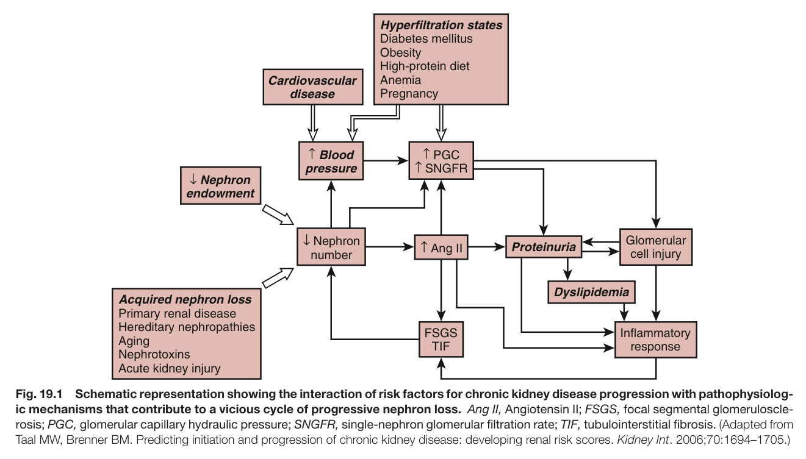

Fig. 19.1 Schematic representation showing the interaction of risk factors for chronic kidney disease progression with pathophysiolog- ic mechanisms that contribute to a vicious cycle of progressive nephron loss. Ang II, Angiotensin II; FSGS, focal segmental glomeruloscle- rosis; PGC, glomerular capillary hydraulic pressure; SNGFR, single-nephron glomerular filtration rate; TIF, tubulointerstitial fibrosis. (Adapted from Taal MW, Brenner BM. Predicting initiation and progression of chronic kidney disease: developing renal risk scores. Kidney Int. 2006;70:1694–1705.)

---

### Fig_19_2

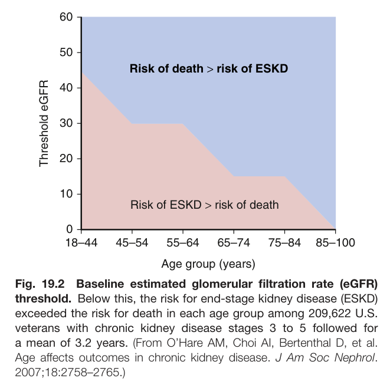

Fig. 19.2 Baseline estimated glomerular filtration rate (eGFR) threshold. Below this, the risk for end-stage kidney disease (ESKD) exceeded the risk for death in each age group among 209,622 U.S. veterans with chronic kidney disease stages 3 to 5 followed for a mean of 3.2 years. (From O’Hare AM, Choi AI, Bertenthal D, et al. Age affects outcomes in chronic kidney disease. J Am Soc Nephrol. 2007;18:2758–2765.)

---

### Fig_19_3

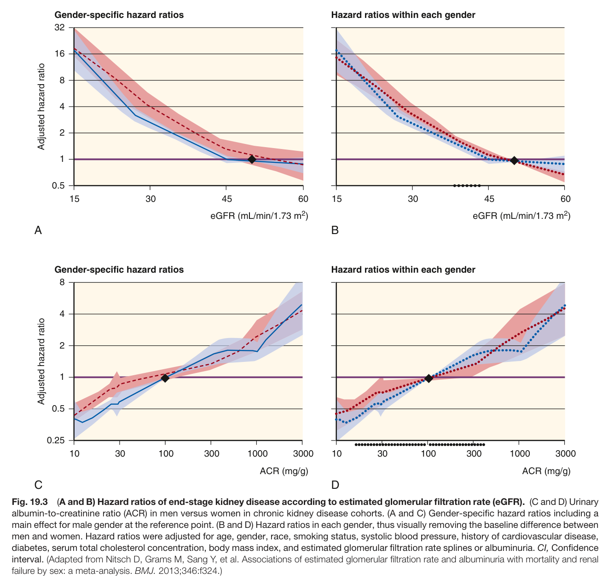

Fig. 19.3 (A and B) Hazard ratios of end-stage kidney disease according to estimated glomerular filtration rate (eGFR). (C and D) Urinary albumin-to-creatinine ratio (ACR) in men versus women in chronic kidney disease cohorts. (A and C) Gender-specific hazard ratios including a main effect for male gender at the reference point. (B and D) Hazard ratios in each gender, thus visually removing the baseline difference between men and women. Hazard ratios were adjusted for age, gender, race, smoking status, systolic blood pressure, history of cardiovascular disease, diabetes, serum total cholesterol concentration, body mass index, and estimated glomerular filtration rate splines or albuminuria. CI, Confidence interval. (Adapted from Nitsch D, Grams M, Sang Y, et al. Associations of estimated glomerular filtration rate and albuminuria with mortality and renal failure by sex: a meta-analysis. BMJ. 2013;346:f324.)

---

### Fig_19_4

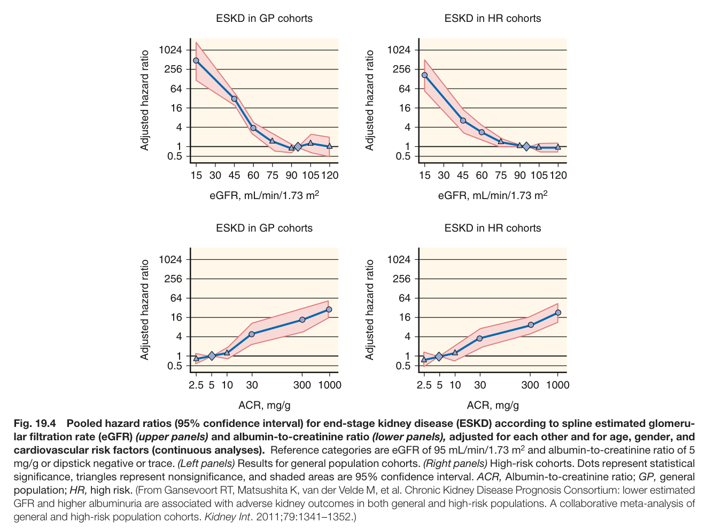

Fig. 19.4 Pooled hazard ratios (95% confidence interval) for end-stage kidney disease (ESKD) according to spline estimated glomeru- lar filtration rate (eGFR) (upper panels) and albumin-to-creatinine ratio (lower panels), adjusted for each other and for age, gender, and cardiovascular risk factors (continuous analyses). Reference categories are eGFR of 95 mL/min/1.73 m<sup>2</sup> and albumin-to-creatinine ratio of 5 mg/g or dipstick negative or trace. (Left panels) Results for general population cohorts. (Right panels) High-risk cohorts. Dots represent statistical significance, triangles represent nonsignificance, and shaded areas are 95% confidence interval. ACR, Albumin-to-creatinine ratio; GP, general population; HR, high risk. (From Gansevoort RT, Matsushita K, van der Velde M, et al. Chronic Kidney Disease Prognosis Consortium: lower estimated GFR and higher albuminuria are associated with adverse kidney outcomes in both general and high-risk populations. A collaborative meta-analysis o general and high-risk population cohorts. Kidney Int. 2011;79:1341–1352.)

---

### Fig_19_5

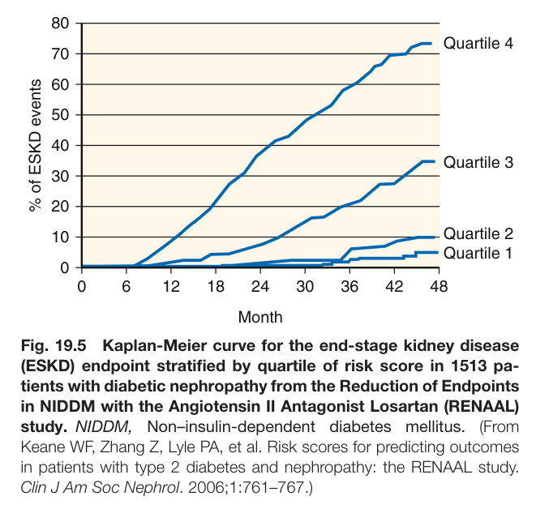

Fig. 19.5 Kaplan-Meier curve for the end-stage kidney disease (ESKD) endpoint stratified by quartile of risk score in 1513 pa- tients with diabetic nephropathy from the Reduction of Endpoints in NIDDM with the Angiotensin II Antagonist Losartan (RENAAL) study. NIDDM, Non–insulin-dependent diabetes mellitus. (From Keane WF, Zhang Z, Lyle PA, et al. Risk scores for predicting outcomes in patients with type 2 diabetes and nephropathy: the RENAAL study. Clin J Am Soc Nephrol. 2006;1:761–767.)

---

### Fig_19_6

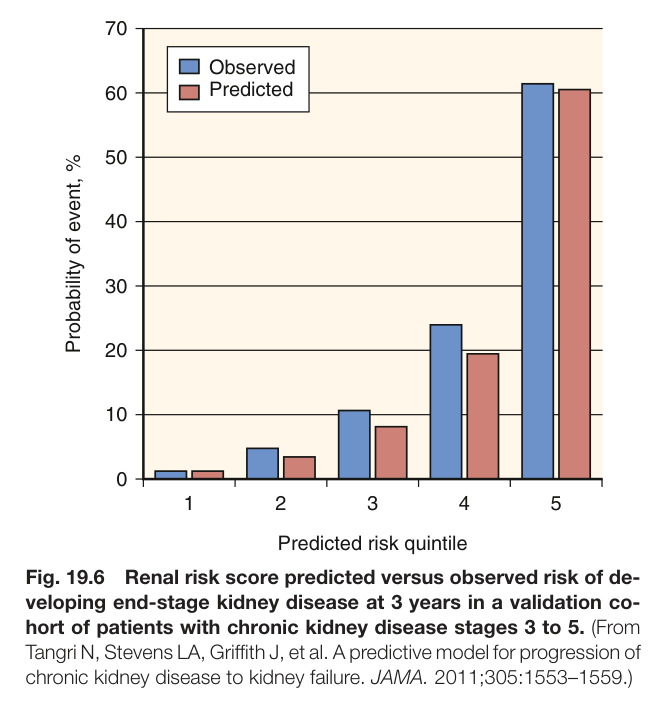

Fig. 19.6 Renal risk score predicted versus observed risk of de- veloping end-stage kidney disease at 3 years in a validation co- hort of patients with chronic kidney disease stages 3 to 5. (From Tangri N, Stevens LA, Griffith J, et al. A predictive model for progression of chronic kidney disease to kidney failure. JAMA. 2011;305:1553–1559.)

---

### Fig_19_7

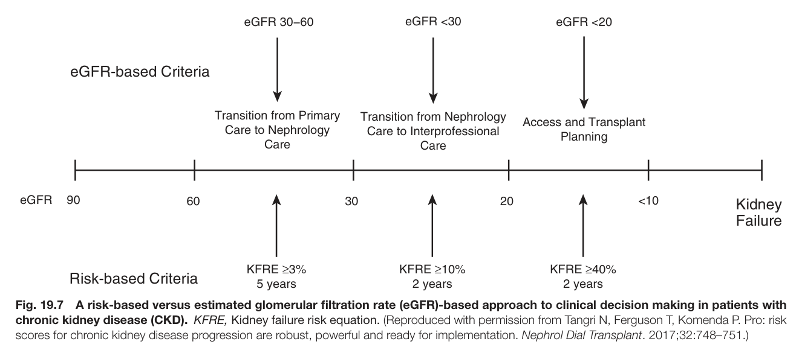

Fig. 19.7 A risk-based versus estimated glomerular filtration rate (eGFR)-based approach to clinical decision making in patients with chronic kidney disease (CKD). KFRE, Kidney failure risk equation. (Reproduced with permission from Tangri N, Ferguson T, Komenda P. Pro: risk scores for chronic kidney disease progression are robust, powerful and ready for implementation. Nephrol Dial Transplant. 2017;32:748–751.)

---

## Tables

### Table_19_1

#### Table Image

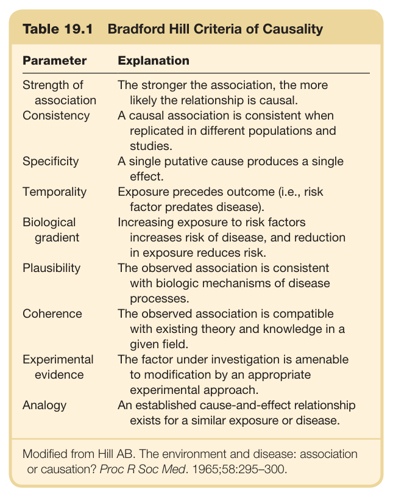

#### Table Data (CSV: [Table_19_1.csv](Table_19_1.csv))

```markdown
| Table Text (OCR) |
| :--- |
| Table 19.1  Bradford Hill Criteria of Causality Parameter  Explanation    Strength of association  The stronger the association, the more likely the relationship is causal.    Consistency  A causal association is consistent when replicated in different populations and studies.    Specificity  A single putative cause produces a single effect.    Temporality  Exposure precedes outcome (i.e., risk factor predates disease).    Biological gradient  Increasing exposure to risk factors increases risk of disease, and reduction in exposure reduces risk.    Plausibility  The observed association is consistent with biologic mechanisms of disease processes.    Coherence  The observed association is compatible with existing theory and knowledge in a given field.    Experimental evidence  The factor under investigation is amenable to modification by an appropriate experimental approach.    Analogy  An established cause-and-effect relationship exists for a similar exposure or disease. Modified from Hill AB. The environment and disease: association or causation? Proc R Soc Med. 1965;58:295–300. |
```

Table 19.1 Bradford Hill Criteria of Causality

---

### Table_19_2

#### Table Image

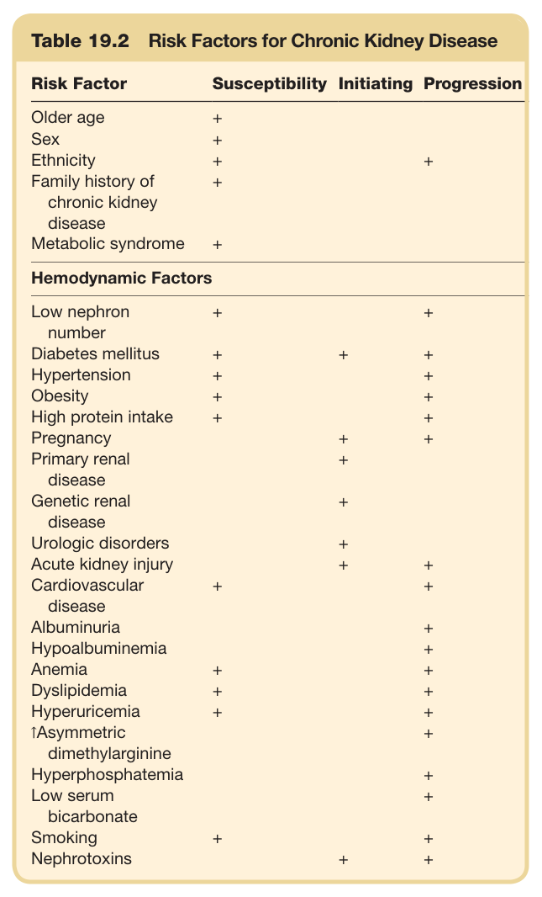

#### Table Data (CSV: [Table_19_2.csv](Table_19_2.csv))

```markdown
| Table Text (OCR) |
| :--- |
| Table 19.2  Risk Factors for Chronic Kidney Disease Risk Factor  Susceptibility  Initiating  Progression    Older age  +        Sex  +        Ethnicity  +    +    Family history of chronic kidney disease  +        Metabolic syndrome  +        Hemodynamic Factors    Low nephron number  +    +    Diabetes mellitus  +  +  +    Hypertension  +    +    Obesity  +    +    High protein intake  +    +    Pregnancy    +  +    Primary renal disease    +      Genetic renal disease    +      Urologic disorders    +      Acute kidney injury    +  +    Cardiovascular disease  +    +    Albuminuria      +    Hypoalbuminemia      +    Anemia  +    +    Dyslipidemia  +    +    Hyperuricemia  +    +    1Asymmetric dimethylarginine      +    Hyperphosphatemia      +    Low serum bicarbonate      +    Smoking  +    +    Nephrotoxins    +  + |
```

Table 19.2 Risk Factors for Chronic Kidney Disease

---

### Table_19_3

#### Table Image

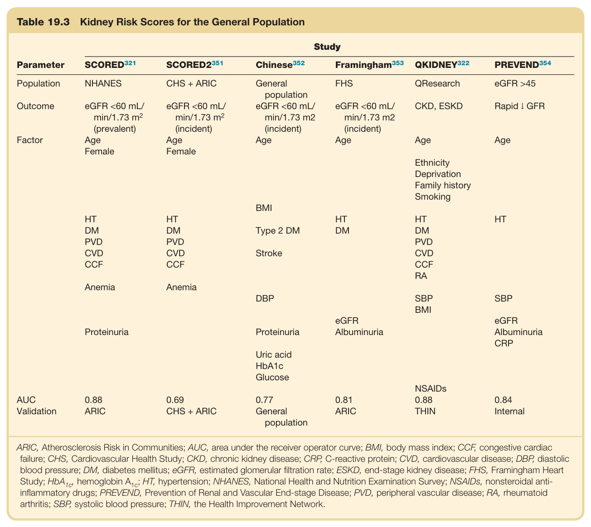

#### Table Data (CSV: [Table_19_3.csv](Table_19_3.csv))

```markdown
| Table Text (OCR) |
| :--- |
| Table 19.3 Kidney Risk Scores for the General Population Parameter   Study      SCORED^{321}    SCORED2^{351}    Chinese^{352}    Framingham^{353}    QKIDNEY^{322}    PREVEND^{354}     Population  NHANES  CHS + ARIC  General population  FHS  QResearch  eGFR >45    Outcome  eGFR <60 mL/min/1.73  m^2 (prevalent)  eGFR <60 mL/min/1.73  m^2 (incident)  eGFR <60 mL/min/1.73 m2(incident)  eGFR <60 mL/min/1.73 m2(incident)  CKD, ESKD  Rapid ↓ GFR    Factor  AgeFemale  AgeFemale  Age  Age  Age  Age    EthnicityDeprivationFamily historySmoking    BMI      HT  HT    HT  HT  HT    DM  DM  Type 2 DM  DM  DM    PVD  PVD      PVD    CVD  CVD  Stroke    CVD    CCF  CCF      CCFRA    Anemia  Anemia          DBP    SBP  SBP      BMI    Proteinuria    Proteinuria  eGFRAlbuminuria    eGFRAlbuminuriaCRP    Uric acidHbA1cGlucose          NSAIDs    AUC  0.88  0.69  0.77  0.81  0.88  0.84    Validation  ARIC  CHS + ARIC  General population  ARIC  THIN  Internal ARIC, Atherosclerosis Risk in Communities; AUC, area under the receiver operator curve; BMI, body mass index; CCF, congestive cardiac failure; CHS, Cardiovascular Health Study; CKD, chronic kidney disease; CRP, C-reactive protein; CVD, cardiovascular disease; DBP, diastolic blood pressure; DM, diabetes mellitus; eGFR, estimated glomerular filtration rate; ESKD, end-stage kidney disease; FHS, Framingham Heart Study; HbA , hemoglobin A<sub>1c</sub>; HT, hypertension; NHANES, National Health and Nutrition Examination Survey; NSAIDs, nonsteroidal anti- inflammatory drugs; PREVEND, Prevention of Renal and Vascular End-stage Disease; PVD, peripheral vascular disease; RA, rheumatoid arthritis; SBP, systolic blood pressure; THIN, the Health Improvement Network. |
```

Table 19.3 Kidney Risk Scores for the General Population

---

### Table_19_4

#### Table Image

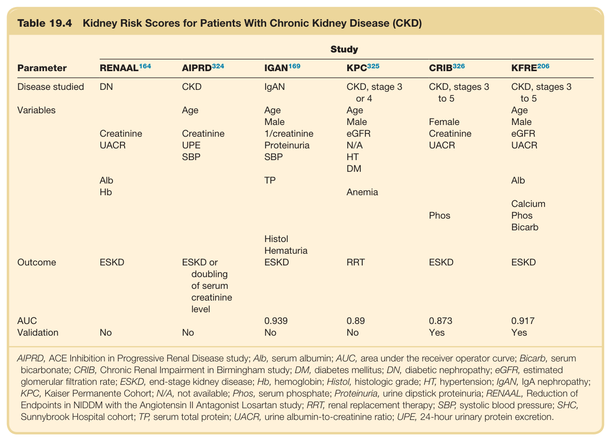

#### Table Data (CSV: [Table_19_4.csv](Table_19_4.csv))

```markdown
| Table Text (OCR) |
| :--- |
| Table 19.4  Kidney Risk Scores for Patients With Chronic Kidney Disease (CKD) Parameter  Study     RENAAL^{164}    AIPRD^{324}    IGAN^{169}    KPC^{325}    CRIB^{326}    KFRE^{206}     Disease studied  DN  CKD  IgAN  CKD, stage 3 or 4  CKD, stages 3 to 5  CKD, stages 3 to 5    Variables    Age  Age  Age    Age        Male  Male  Female  Male    Creatinine  Creatinine  1/creatinine  eGFR  Creatinine  eGFR    UACR  UPE  Proteinuria  N/A  UACR  UACR      SBP  SBP  HT              DM        Alb    TP      Alb    Hb      Anemia                Phos  Calcium Phos Bicarb        Histol              Hematuria          Outcome  ESKD  ESKD or doubling of serum creatinine level  ESKD  RRT  ESKD  ESKD    AUC      0.939  0.89  0.873  0.917    Validation  No  No  No  No  Yes  Yes AIPRD, ACE Inhibition in Progressive Renal Disease study; Alb, serum albumin; AUC, area under the receiver operator curve; Bicarb, serum bicarbonate; CRIB, Chronic Renal Impairment in Birmingham study; DM, diabetes mellitus; DN, diabetic nephropathy; eGFR, estimated glomerular filtration rate; ESKD, end-stage kidney disease; Hb, hemoglobin; Histol, histologic grade; HT, hypertension; IgAN, IgA nephropathy; KPC, Kaiser Permanente Cohort; N/A, not available; Phos, serum phosphate; Proteinuria, urine dipstick proteinuria; RENAAL, Reduction of Endpoints in NIDDM with the Angiotensin II Antagonist Losartan study; RRT, renal replacement therapy; SBP, systolic blood pressure; SHC, Sunnybrook Hospital cohort; TP, serum total protein; UACR, urine albumin-to-creatinine ratio; UPE, 24-hour urinary protein excretion. |
```

Table 19.4 Kidney Risk Scores for Patients With Chronic Kidney Disease (CKD)

---

### Table_19_5

#### Table Image

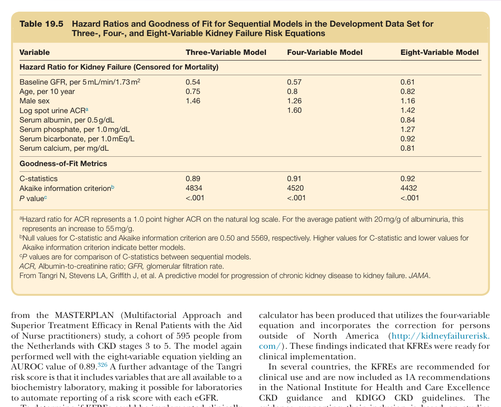

#### Table Data (CSV: [Table_19_5.csv](Table_19_5.csv))

```markdown
| Table Text (OCR) |
| :--- |
| Table 19.5  Hazard Ratios and Goodness of Fit for Sequential Models in the Development Data Set for Three-, Four-, and Eight-Variable Kidney Failure Risk Equations Variable  Three-Variable Model  Four-Variable Model  Eight-Variable Model    Hazard Ratio for Kidney Failure (Censored for Mortality)    Baseline GFR, per 5mL/min/1.73 m^2   0.54  0.57  0.61    Age, per 10 year  0.75  0.8  0.82    Male sex  1.46  1.26  1.16    Log spot urine  ACR^a     1.60  1.42    Serum albumin, per 0.5g/dL      0.84    Serum phosphate, per 1.0mg/dL      1.27    Serum bicarbonate, per 1.0mEq/L      0.92    Serum calcium, per mg/dL      0.81    Goodness-of-Fit Metrics    C-statistics  0.89  0.91  0.92    Akaike information  criterion^b   4834  4520  4432     P\ value^c   <.001  <.001  <.001 <sup>a</sup>Hazard ratio for ACR represents a 1.0 point higher ACR on the natural log scale. For the average patient with 20mg/g of albuminuria, this represents an increase to 55mg/g. <sup>b</sup>Null values for C-statistic and Akaike information criterion are 0.50 and 5569, respectively. Higher values for C-statistic and lower values for Akaike information criterion indicate better models. <sup>c</sup>P values are for comparison of C-statistics between sequential models. ACR, Albumin-to-creatinine ratio; GFR, glomerular filtration rate. From Tangri N, Stevens LA, Griffith J, et al. A predictive model for progression of chronic kidney disease to kidney failure. JAMA. |
```

Table 19.5 Hazard Ratios and Goodness of Fit for Sequential Models in the Development Data Set for Three-, Four-, and Eight-Variable Kidney Failure Risk Equations

---

### Table_19_6

#### Table Image

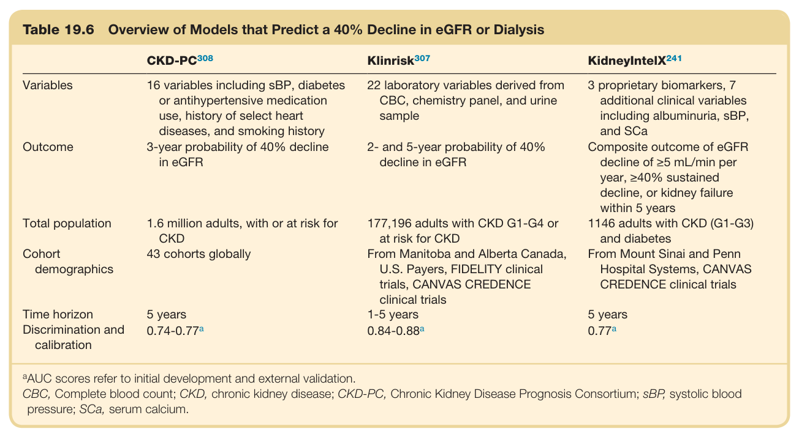

#### Table Data (CSV: [Table_19_6.csv](Table_19_6.csv))

```markdown
| Table Text (OCR) |
| :--- |
| Table 19.6  Overview of Models that Predict a 40% Decline in eGFR or Dialysis CKD-PC308  Klinrisk307  KidneyIntelX241    Variables  16 variables including sBP, diabetes or antihypertensive medication use, history of select heart diseases, and smoking history  22 laboratory variables derived from CBC, chemistry panel, and urine sample  3 proprietary biomarkers, 7 additional clinical variables including albuminuria, sBP, and SCa    Outcome  3-year probability of 40% decline in eGFR  2- and 5-year probability of 40% decline in eGFR  Composite outcome of eGFR decline of ≥5 mL/min per year, ≥40% sustained decline, or kidney failure within 5 years    Total population  1.6 million adults, with or at risk for CKD  177,196 adults with CKD G1-G4 or at risk for CKD  1146 adults with CKD (G1-G3) and diabetes    Cohort demographics  43 cohorts globally  From Manitoba and Alberta Canada, U.S. Payers, FIDELITY clinical trials, CANVAS CREDENCE clinical trials  From Mount Sinai and Penn Hospital Systems, CANVAS CREDENCE clinical trials    Time horizon  5 years  1-5 years  5 years    Discrimination and calibration  0.74-0.77a  0.84-0.88a  0.77a <sup>a</sup>AUC scores refer to initial development and external validation. CBC, Complete blood count; CKD, chronic kidney disease; CKD-PC, Chronic Kidney Disease Prognosis Consortium; sBP, systolic blood pressure; SCa, serum calcium. |
```

Table 19.6 Overview of Models that Predict a 40% Decline in eGFR or Dialysis

---
