# 20. Early Life Origins of Hypertension and Chronic Kidney Disease - Figures and Tables Index

This document lists all figures and tables extracted from `20. Early Life Origins of Hypertension and Chronic Kidney Disease.pdf`.

## Table of Contents
- [Figures](#figures)
- [Tables](#tables)

---

## Figures

### Fig_20_1

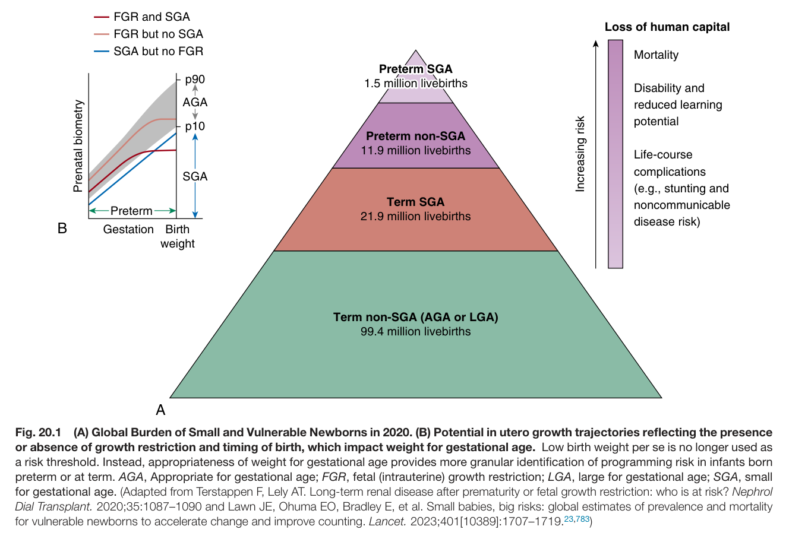

Fig. 20.1 (A) Global Burden of Small and Vulnerable Newborns in 2020. (B) Potential in utero growth trajectories reflecting the presence or absence of growth restriction and timing of birth, which impact weight for gestational age. Low birth weight per se is no longer used as a risk threshold. Instead, appropriateness of weight for gestational age provides more granular identification of programming risk in infants born preterm or at term. AGA, Appropriate for gestational age; FGR, fetal (intrauterine) growth restriction; LGA, large for gestational age; SGA, smal for gestational age. (Adapted from Terstappen F, Lely AT. Long-term renal disease after prematurity or fetal growth restriction: who is at risk? Nephro Dial Transplant. 2020;35:1087–1090 and Lawn JE, Ohuma EO, Bradley E, et al. Small babies, big risks: global estimates of prevalence and mortality for vulnerable newborns to accelerate change and improve counting. Lancet. 2023;401[10389]:1707–1719.<sup>23,783</sup>)

---

### Fig_20_2

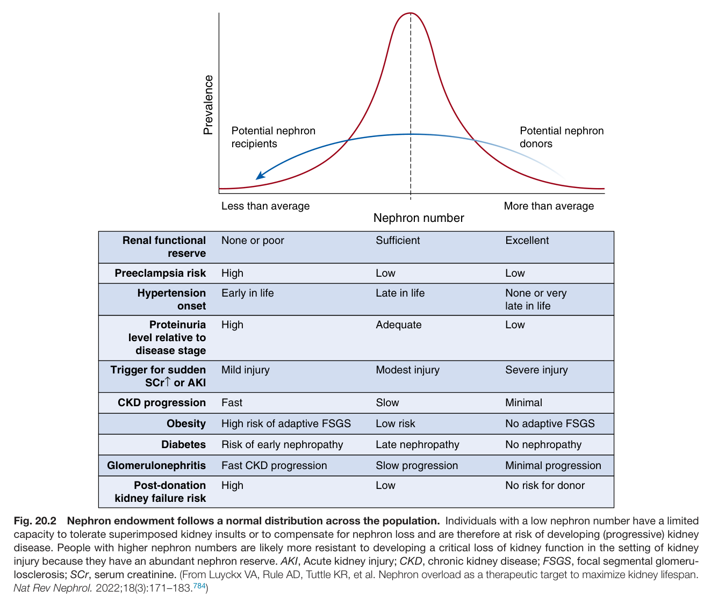

Fig. 20.2 Nephron endowment follows a normal distribution across the population. Individuals with a low nephron number have a limited capacity to tolerate superimposed kidney insults or to compensate for nephron loss and are therefore at risk of developing (progressive) kidney disease. People with higher nephron numbers are likely more resistant to developing a critical loss of kidney function in the setting of kidney injury because they have an abundant nephron reserve. AKI, Acute kidney injury; CKD, chronic kidney disease; FSGS, focal segmental glomeru- losclerosis; SCr, serum creatinine. (From Luyckx VA, Rule AD, Tuttle KR, et al. Nephron overload as a therapeutic target to maximize kidney lifespan. Nat Rev Nephrol. 2022;18(3):171–183.<sup>784</sup>)

---

### Fig_20_3

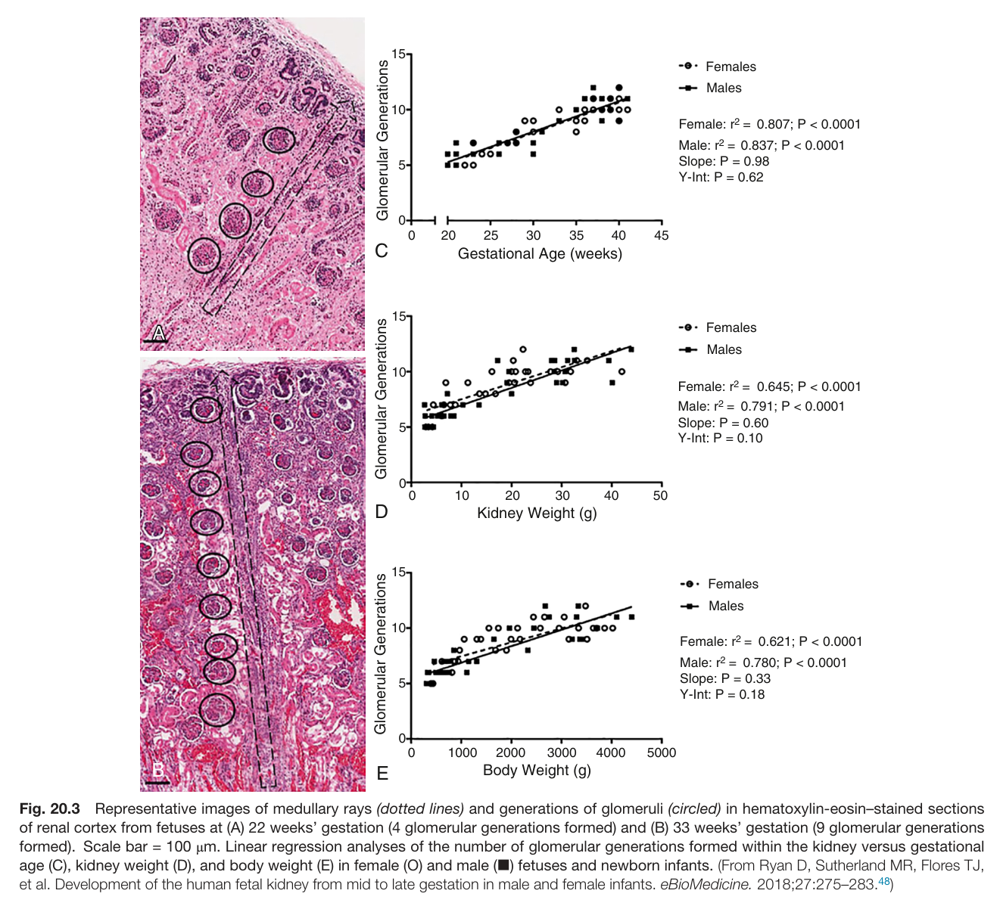

Fig. 20.3 Representative images of medullary rays (dotted lines) and generations of glomeruli (circled) in hematoxylin-eosin–stained sections of renal cortex from fetuses at (A) 22 weeks’ gestation (4 glomerular generations formed) and (B) 33 weeks’ gestation (9 glomerular generations formed). Scale bar = 100 μm. Linear regression analyses of the number of glomerular generations formed within the kidney versus gestationa age (C), kidney weight (D), and body weight (E) in female (O) and male (□) fetuses and newborn infants. (From Ryan D, Sutherland MR, Flores TJ, et al. Development of the human fetal kidney from mid to late gestation in male and female infants. eBioMedicine. 2018;27:275–283.<sup>48</sup>)

---

### Fig_20_4

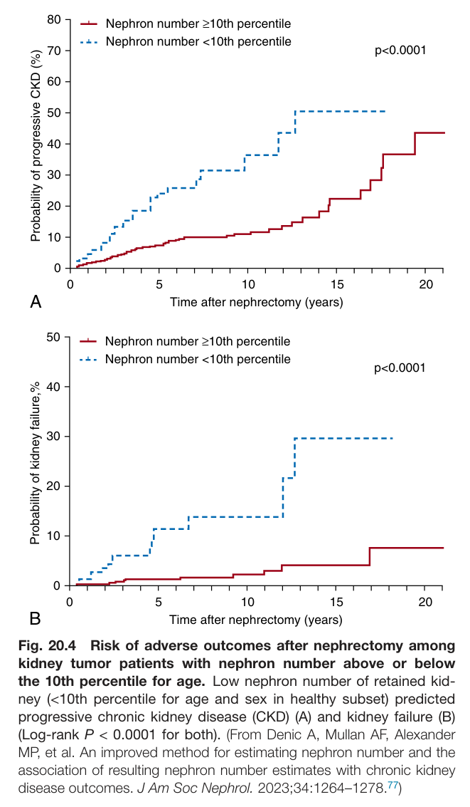

Fig. 20.4 Risk of adverse outcomes after nephrectomy among kidney tumor patients with nephron number above or below the 10th percentile for age. Low nephron number of retained kid- ney (<10th percentile for age and sex in healthy subset) predicted progressive chronic kidney disease (CKD) (A) and kidney failure (B) (Log-rank P < 0.0001 for both). (From Denic A, Mullan AF, Alexander MP, et al. An improved method for estimating nephron number and the association of resulting nephron number estimates with chronic kidney disease outcomes. J Am Soc Nephrol. 2023;34:1264–1278.<sup>77</sup>)

---

### Fig_20_5

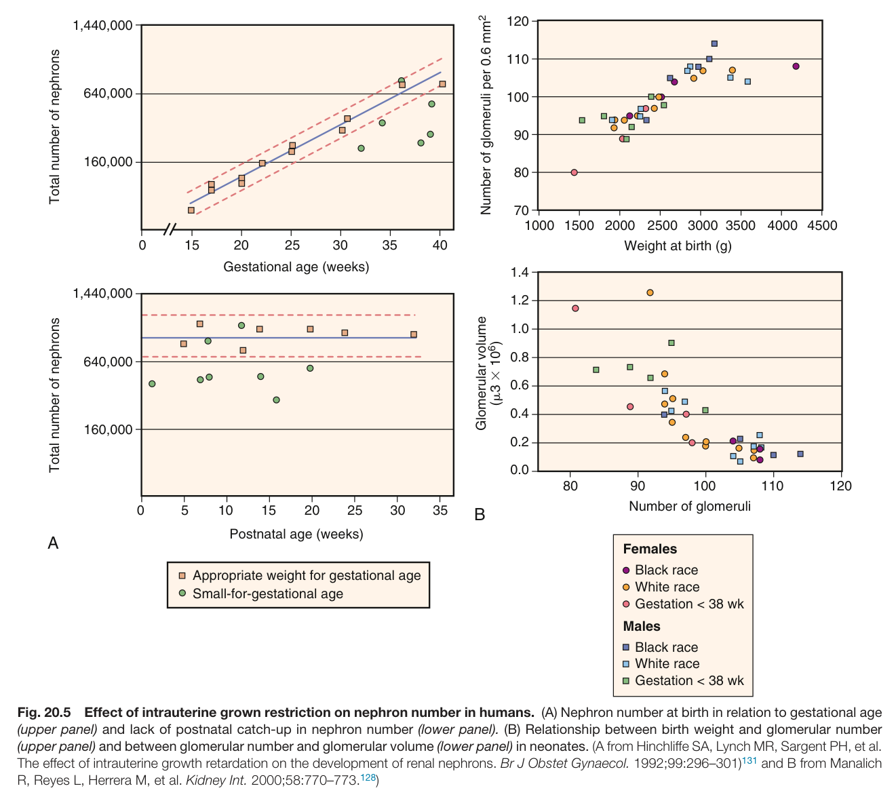

Fig. 20.5 Effect of intrauterine grown restriction on nephron number in humans. (A) Nephron number at birth in relation to gestational age (upper panel) and lack of postnatal catch-up in nephron number (lower panel). (B) Relationship between birth weight and glomerular number (upper panel) and between glomerular number and glomerular volume (lower panel) in neonates. (A from Hinchliffe SA, Lynch MR, Sargent PH, et al. The effect of intrauterine growth retardation on the development of renal nephrons. Br J Obstet Gynaecol. 1992;99:296–301)<sup>131</sup> and B from Manalich R, Reyes L, Herrera M, et al. Kidney Int. 2000;58:770–773.<sup>128</sup>)

---

### Fig_20_6

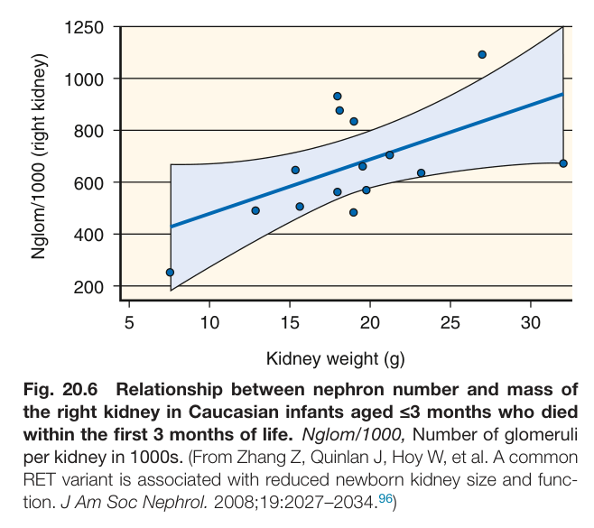

Fig. 20.6 Relationship between nephron number and mass of the right kidney in Caucasian infants aged ≤3 months who died within the first 3 months of life. Nglom/1000, Number of glomerul per kidney in 1000s. (From Zhang Z, Quinlan J, Hoy W, et al. A common RET variant is associated with reduced newborn kidney size and func- tion. J Am Soc Nephrol. 2008;19:2027–2034.<sup>96</sup>)

---

### Fig_20_7

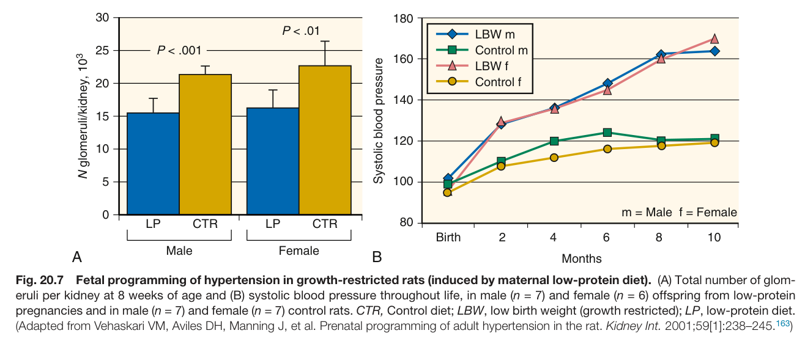

Fig. 20.7 Fetal programming of hypertension in growth-restricted rats (induced by maternal low-protein diet). (A) Total number of glom- eruli per kidney at 8 weeks of age and (B) systolic blood pressure throughout life, in male (n = 7) and female (n = 6) offspring from low-protein pregnancies and in male (n = 7) and female (n = 7) control rats. CTR, Control diet; LBW, low birth weight (growth restricted); LP, low-protein diet. (Adapted from Vehaskari VM, Aviles DH, Manning J, et al. Prenatal programming of adult hypertension in the rat. Kidney Int. 2001;59[1]:238–245.<sup>163</sup>)

---

### Fig_20_8

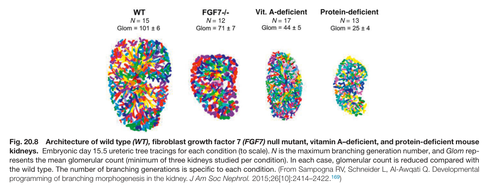

Fig. 20.8 Architecture of wild type (WT), fibroblast growth factor 7 (FGF7) null mutant, vitamin A–deficient, and protein-deficient mouse kidneys. Embryonic day 15.5 ureteric tree tracings for each condition (to scale). N is the maximum branching generation number, and Glom rep resents the mean glomerular count (minimum of three kidneys studied per condition). In each case, glomerular count is reduced compared with the wild type. The number of branching generations is specific to each condition. (From Sampogna RV, Schneider L, Al-Awqati Q. Developmental programming of branching morphogenesis in the kidney. J Am Soc Nephrol. 2015;26[10]:2414–2422.<sup>169</sup>)

---

### Fig_20_9

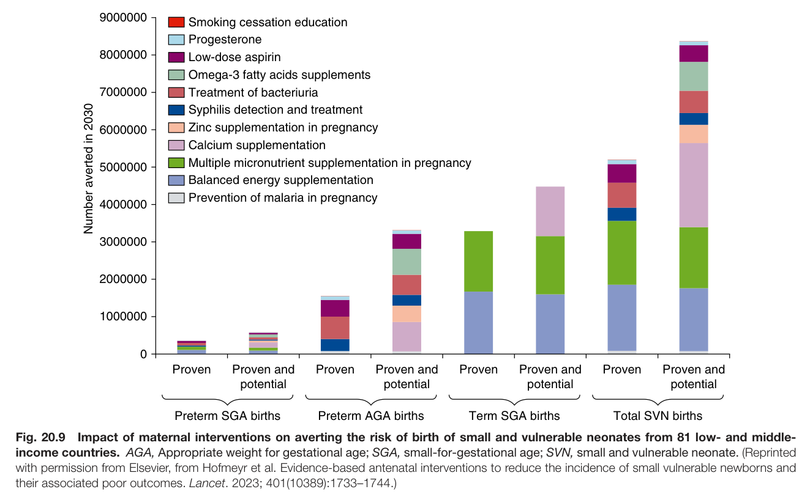

Fig. 20.9 Impact of maternal interventions on averting the risk of birth of small and vulnerable neonates from 81 low- and middle- income countries. AGA, Appropriate weight for gestational age; SGA, small-for-gestational age; SVN, small and vulnerable neonate. (Reprinted with permission from Elsevier, from Hofmeyr et al. Evidence-based antenatal interventions to reduce the incidence of small vulnerable newborns and their associated poor outcomes. Lancet. 2023; 401(10389):1733–1744.)

---

### Fig_20_10

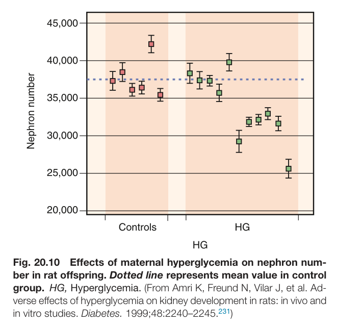

Fig. 20.10 Effects of maternal hyperglycemia on nephron num- ber in rat offspring. Dotted line represents mean value in control group. HG, Hyperglycemia. (From Amri K, Freund N, Vilar J, et al. Ad- verse effects of hyperglycemia on kidney development in rats: in vivo and in vitro studies. Diabetes. 1999;48:2240–2245.<sup>231</sup>)

---

### Fig_20_11

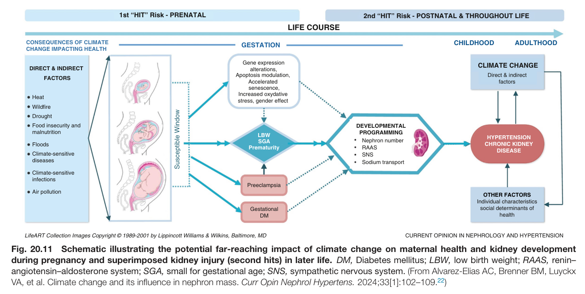

Fig. 20.11 Schematic illustrating the potential far-reaching impact of climate change on maternal health and kidney development during pregnancy and superimposed kidney injury (second hits) in later life. DM, Diabetes mellitus; LBW, low birth weight; RAAS, renin– angiotensin–aldosterone system; SGA, small for gestational age; SNS, sympathetic nervous system. (From Alvarez-Elias AC, Brenner BM, Luyckx VA, et al. Climate change and its influence in nephron mass. Curr Opin Nephrol Hypertens. 2024;33[1]:102–109.<sup>22</sup>)

---

### Fig_20_12

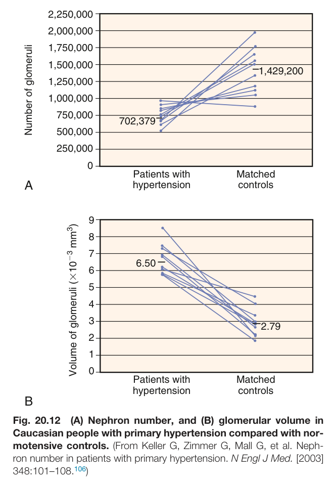

Fig. 20.12 (A) Nephron number, and (B) glomerular volume in Caucasian people with primary hypertension compared with nor- motensive controls. (From Keller G, Zimmer G, Mall G, et al. Neph- ron number in patients with primary hypertension. N Engl J Med. [2003] 348:101–108.<sup>106</sup>)

---

### Fig_20_13

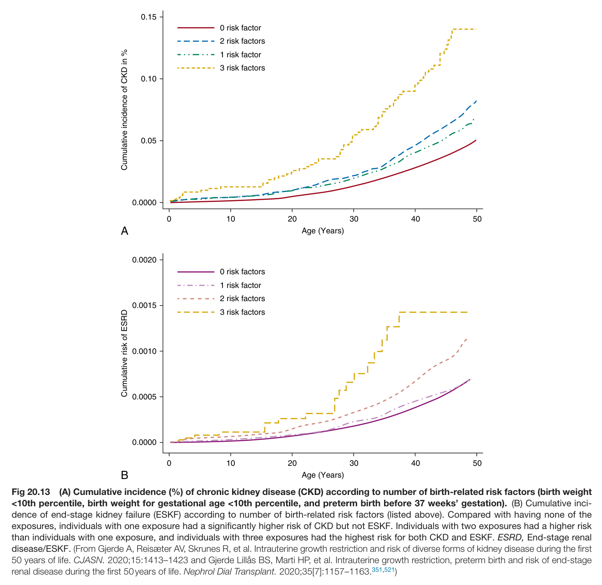

Fig. 20.13 (A) Cumulative incidence (%) of chronic kidney disease (CKD) according to number of birth-related risk factors (birth weight <10th percentile, birth weight for gestational age <10th percentile, and preterm birth before 37 weeks’ gestation). (B) Cumulative inci- dence of end-stage kidney failure (ESKF) according to number of birth-related risk factors (listed above). Compared with having none of the exposures, individuals with one exposure had a significantly higher risk of CKD but not ESKF. Individuals with two exposures had a higher risk than individuals with one exposure, and individuals with three exposures had the highest risk for both CKD and ESKF. ESRD, End-stage rena disease/ESKF. (From Gjerde A, Reisæter AV, Skrunes R, et al. Intrauterine growth restriction and risk of diverse forms of kidney disease during the firs 50 years of life. CJASN. 2020;15:1413–1423 and Gjerde Lillås BS, Marti HP, et al. Intrauterine growth restriction, preterm birth and risk of end-stage renal disease during the first 50 years of life. Nephrol Dial Transplant. 2020;35[7]:1157–1163.<sup>351,521</sup>)

---

### Fig_20_14

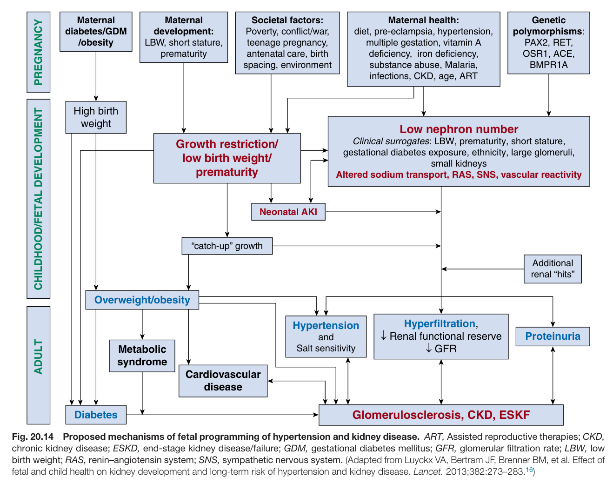

Fig. 20.14 Proposed mechanisms of fetal programming of hypertension and kidney disease. ART, Assisted reproductive therapies; CKD, chronic kidney disease; ESKD, end-stage kidney disease/failure; GDM, gestational diabetes mellitus; GFR, glomerular filtration rate; LBW, low birth weight; RAS, renin–angiotensin system; SNS, sympathetic nervous system. (Adapted from Luyckx VA, Bertram JF, Brenner BM, et al. Effect of fetal and child health on kidney development and long-term risk of hypertension and kidney disease. Lancet. 2013;382:273–283.<sup>16</sup>)

---

### Fig_e20_1

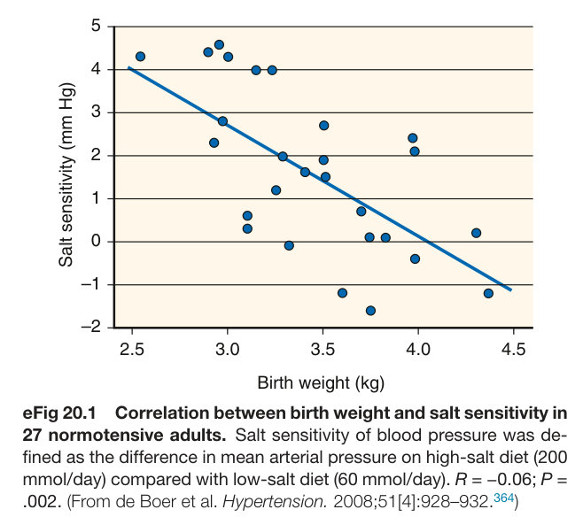

Fig. e20.1 Correlation between birth weight and salt sensitivity in 27 normotensive adults. Salt sensitivity of blood pressure was de- fined as the difference in mean arterial pressure on high-salt diet (200 mmol/day) compared with low-salt diet (60 mmol/day). R = −0.06; P = .002. (From de Boer et al. Hypertension. 2008;51[4]:928–932.<sup>364</sup>)

---

### Fig_e20_2

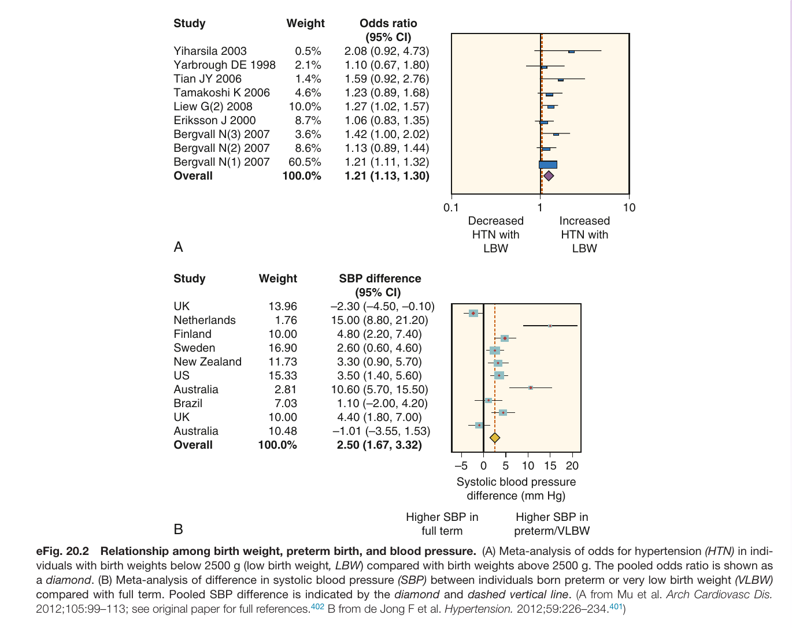

Fig. e20.2 Relationship among birth weight, preterm birth, and blood pressure. (A) Meta-analysis of odds for hypertension (HTN) in indi- viduals with birth weights below 2500 g (low birth weight, LBW) compared with birth weights above 2500 g. The pooled odds ratio is shown as a diamond. (B) Meta-analysis of difference in systolic blood pressure (SBP) between individuals born preterm or very low birth weight (VLBW) compared with full term. Pooled SBP difference is indicated by the diamond and dashed vertical line. (A from Mu et al. Arch Cardiovasc Dis. 2012;105:99–113; see original paper for full references.<sup>402</sup> B from de Jong F et al. Hypertension. 2012;59:226–234.<sup>401</sup>)

---

### Fig_e20_3

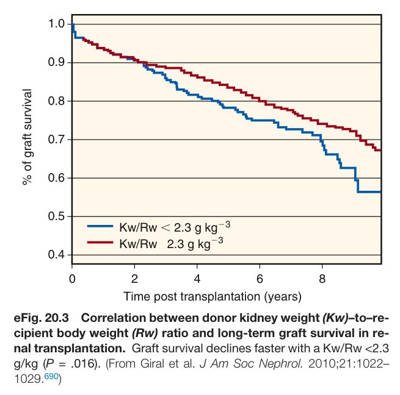

Fig. e20.3 Correlation between donor kidney weight (Kw)–to–re- cipient body weight (Rw) ratio and long-term graft survival in re- nal transplantation. Graft survival declines faster with a Kw/Rw <2.3 g/kg (P = .016). (From Giral et al. J Am Soc Nephrol. 2010;21:1022– 1029.<sup>690</sup>)

---

## Tables

### Table_20_1

#### Table Image

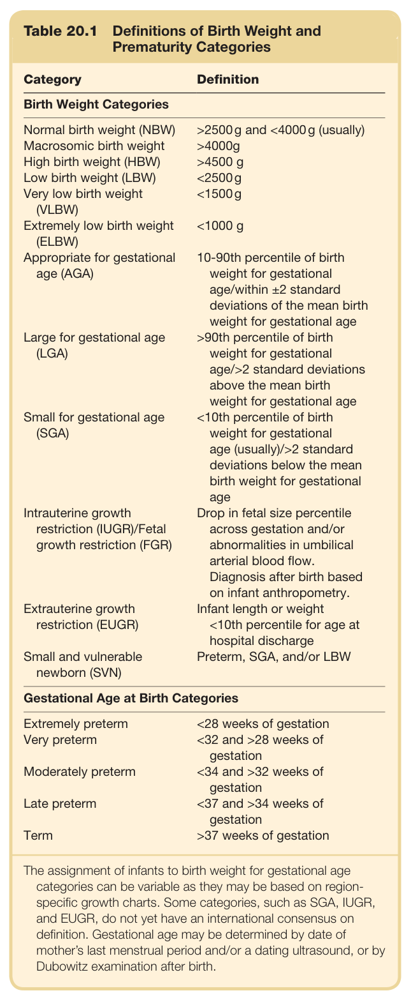

#### Table Data (CSV: [Table_20_1.csv](Table_20_1.csv))

```markdown
| Table Text (OCR) |
| :--- |
| Table 20.1  Definitions of Birth Weight and Prematurity Categories Category  Definition    Birth Weight Categories    Normal birth weight (NBW)  >2500 g and <4000 g (usually)    Macrosomic birth weight  >4000g    High birth weight (HBW)  >4500 g    Low birth weight (LBW)  <2500 g    Very low birth weight (VLBW)  <1500 g    Extremely low birth weight (ELBW)  <1000 g    Appropriate for gestational age (AGA)  10-90th percentile of birth weight for gestational age/within ±2 standard deviations of the mean birth weight for gestational age    Large for gestational age (LGA)  >90th percentile of birth weight for gestational age/>2 standard deviations above the mean birth weight for gestational age    Small for gestational age (SGA)  <10th percentile of birth weight for gestational age (usually)/>2 standard deviations below the mean birth weight for gestational age    Intrauterine growth restriction (IUGR)/Fetal growth restriction (FGR)  Drop in fetal size percentile across gestation and/or abnormalities in umbilical arterial blood flow.Diagnosis after birth based on infant anthropometry.    Extrauterine growth restriction (EUGR)  Infant length or weight <10th percentile for age at hospital discharge    Small and vulnerable newborn (SVN)  Preterm, SGA, and/or LBW |
```

Table 20.1 Definitions of Birth Weight and Prematurity Categories

---

### Table_20_2

#### Table Image

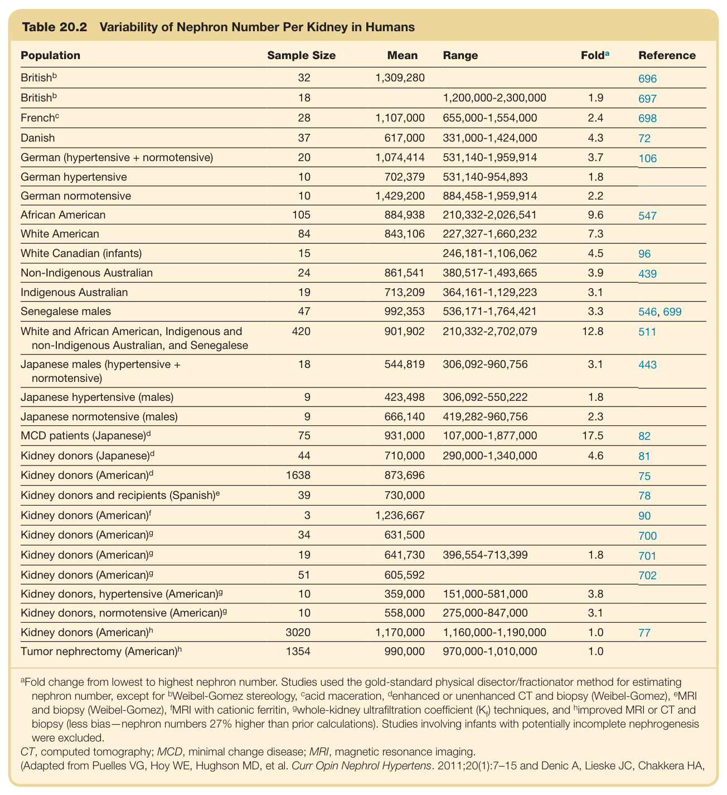

#### Table Data (CSV: [Table_20_2.csv](Table_20_2.csv))

```markdown
| Table Text (OCR) |
| :--- |
| Table 20.2  Variability of Nephron Number Per Kidney in Humans Population  Sample Size  Mean  Range   Fold^a   Reference     British^b   32  1,309,280      696     British^b   18    1,200,000-2,300,000  1.9  697     French^c   28  1,107,000  655,000-1,554,000  2.4  698    Danish  37  617,000  331,000-1,424,000  4.3  72    German (hypertensive + normotensive)  20  1,074,414  531,140-1,959,914  3.7  106    German hypertensive  10  702,379  531,140-954,893  1.8      German normotensive  10  1,429,200  884,458-1,959,914  2.2      African American  105  884,938  210,332-2,026,541  9.6  547    White American  84  843,106  227,327-1,660,232  7.3      White Canadian (infants)  15    246,181-1,106,062  4.5  96    Non-Indigenous Australian  24  861,541  380,517-1,493,665  3.9  439    Indigenous Australian  19  713,209  364,161-1,129,223  3.1      Senegalese males  47  992,353  536,171-1,764,421  3.3  546, 699    White and African American, Indigenous and non-Indigenous Australian, and Senegalese  420  901,902  210,332-2,702,079  12.8  511    Japanese males (hypertensive + normotensive)  18  544,819  306,092-960,756  3.1  443    Japanese hypertensive (males)  9  423,498  306,092-550,222  1.8      Japanese normotensive (males)  9  666,140  419,282-960,756  2.3      MCD patients (Japanese) ^d   75  931,000  107,000-1,877,000  17.5  82    Kidney donors (Japanese) ^d   44  710,000  290,000-1,340,000  4.6  81    Kidney donors (American) ^d   1638  873,696      75    Kidney donors and recipients (Spanish) ^e   39  730,000      78    Kidney donors (American) ^f   3  1,236,667      90    Kidney donors (American) ^g   34  631,500      700    Kidney donors (American) ^g   19  641,730  396,554-713,399  1.8  701    Kidney donors (American) ^g   51  605,592      702    Kidney donors, hypertensive (American) ^g   10  359,000  151,000-581,000  3.8      Kidney donors, normotensive (American) ^g   10  558,000  275,000-847,000  3.1      Kidney donors (American) ^h   3020  1,170,000  1,160,000-1,190,000  1.0  77    Tumor nephrectomy (American) ^h   1354  990,000  970,000-1,010,000  1.0 <sup>a</sup>Fold change from lowest to highest nephron number. Studies used the gold-standard physical disector/fractionator method for estimating nephron number, except for <sup>b</sup>Weibel-Gomez stereology, <sup>c</sup>acid maceration, <sup>d</sup>enhanced or unenhanced CT and biopsy (Weibel-Gomez), <sup>e</sup>MRI and biopsy (Weibel-Gomez), <sup>f</sup>MRI with cationic ferritin, <sup>g</sup>whole-kidney ultrafiltration coefficient (K ) techniques, and <sup>h</sup>improved MRI or CT and biopsy (less bias—nephron numbers 27% higher than prior calculations). Studies involving infants with potentially incomplete nephrogenesis were excluded. CT, computed tomography; MCD, minimal change disease; MRI, magnetic resonance imaging. (Adapted from Puelles VG, Hoy WE, Hughson MD, et al. Curr Opin Nephrol Hypertens. 2011;20(1):7–15 and Denic A, Lieske JC, Chakkera HA, |
```

Table 20.2 Variability of Nephron Number Per Kidney in Humans

---

### Table_20_3

#### Table Image

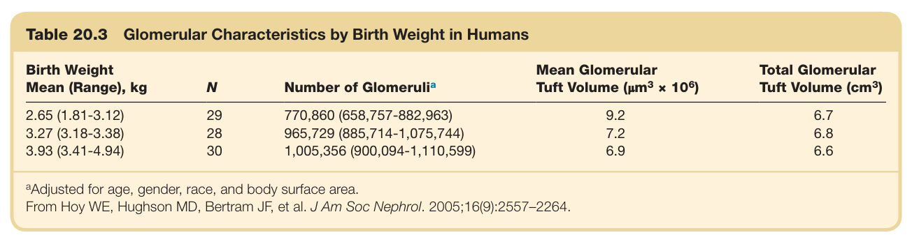

#### Table Data (CSV: [Table_20_3.csv](Table_20_3.csv))

```markdown
| Table Text (OCR) |
| :--- |
| Table 20.3  Glomerular Characteristics by Birth Weight in Humans Birth WeightMean (Range), kg  N  Number of Glomeruli ^{a}   Mean GlomerularTuft Volume ( \mu m^{3} \times 10^{6} )  Total GlomerularTuft Volume (cm ^{3} )    2.65 (1.81-3.12)  29  770,860 (658,757-882,963)  9.2  6.7    3.27 (3.18-3.38)  28  965,729 (885,714-1,075,744)  7.2  6.8    3.93 (3.41-4.94)  30  1,005,356 (900,094-1,110,599)  6.9  6.6 <sup>a</sup>Adjusted for age, gender, race, and body surface area. From Hoy WE, Hughson MD, Bertram JF, et al. J Am Soc Nephrol. 2005;16(9):2557–2264. |
```

Table 20.3 Glomerular Characteristics by Birth Weight in Humans

---

### Table_20_4

#### Table Image

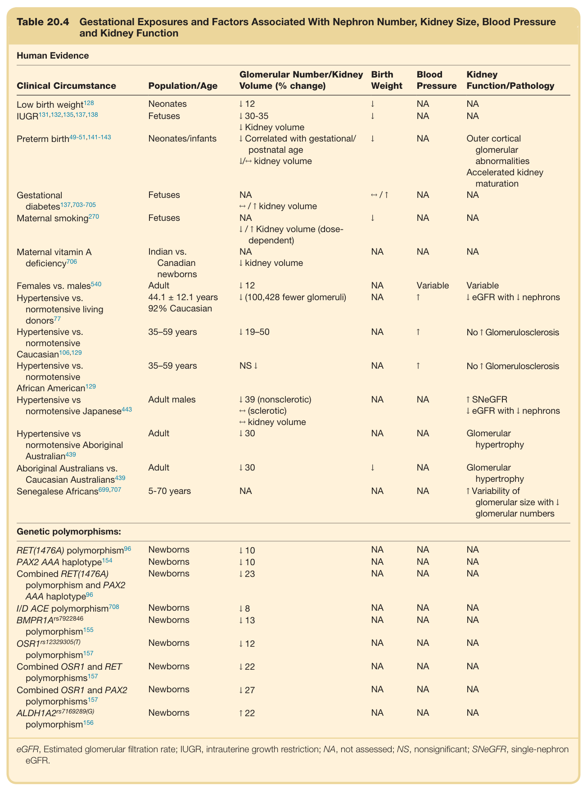

#### Table Data (CSV: [Table_20_4.csv](Table_20_4.csv))

```markdown
| Table Text (OCR) |
| :--- |
| Table 20.4  Gestational Exposures and Factors Associated With Nephron Number, Kidney Size, Blood Pressure and Kidney Function Human Evidence Clinical Circumstance  Population/Age  Glomerular Number/Kidney Volume (% change)  Birth Weight  Blood Pressure  Kidney Function/Pathology    Low birth weight ^{128}   Neonates  ↓ 12  ↓  NA  NA    IUGR ^{131,132,135,137,138}   Fetuses  ↓ 30-35↓ Kidney volume  ↓  NA  NA    Preterm birth ^{49-51,141-143}   Neonates/infants  ↓ Correlated with gestational/postnatal age↓/↔ kidney volume  ↓  NA  Outer cortical glomerular abnormalitiesAccelerated kidney maturation    Gestational diabetes ^{137,703-705}   Fetuses  NA↔/↑ kidney volume  ↔/↑  NA  NA    Maternal smoking ^{270}   Fetuses  NA↓/↑ Kidney volume (dose-dependent)  ↓  NA  NA    Maternal vitamin A deficiency ^{706}   Indian vs.Canadian newborns  NA↓ kidney volume  NA  NA  NA    Females vs. males ^{540}   Adult  ↓ 12  NA  Variable  Variable    Hypertensive vs. normotensive living donors ^{77}   44.1 ± 12.1 years92% Caucasian  ↓ (100,428 fewer glomeruli)  NA  ↑  ↓ eGFR with ↓ nephrons    Hypertensive vs. normotensiveCaucasian ^{106,129}   35-59 years  ↓ 19-50  NA  ↑  No ↑ Glomerulosclerosis    Hypertensive vs. normotensiveAfrican American ^{129}   35-59 years  NS ↓  NA  ↑  No ↑ Glomerulosclerosis    Hypertensive vs normotensive Japanese ^{443}   Adult males  ↓ 39 (nonsclerotic)↔ (sclerotic)↔ kidney volume  NA  NA  ↑ SNeGFR↓ eGFR with ↓ nephrons    Hypertensive vs normotensive Aboriginal Australian ^{439}   Adult  ↓ 30  NA  NA  Glomerular hypertrophy    Aboriginal Australians vs. Caucasian Australians ^{439}   Adult  ↓ 30  ↓  NA  Glomerular hypertrophy    Senegalese Africans ^{699,707}   5-70 years  NA  NA  NA  ↑ Variability of glomerular size with ↓ glomerular numbers    Genetic polymorphisms:    RET(1476A) polymorphism ^{96}   Newborns  ↓ 10  NA  NA  NA    PAX2 AAA haplotype ^{154}   Newborns  ↓ 10  NA  NA  NA    Combined RET(1476A) polymorphism and PAX2 AAA haplotype ^{96}   Newborns  ↓ 23  NA  NA  NA    I/D ACE polymorphism ^{708}   Newborns  ↓ 8  NA  NA  NA    BMPR1Ars7922846 polymorphism ^{155}   Newborns  ↓ 13  NA  NA  NA    OSR1rs12329305(T) polymorphism ^{157}   Newborns  ↓ 12  NA  NA  NA    Combined OSR1 and RET polymorphisms ^{157}   Newborns  ↓ 22  NA  NA  NA    Combined OSR1 and PAX2 polymorphisms ^{157}   Newborns  ↓ 27  NA  NA  NA    ALDH1A2rs7169289(G) polymorphism ^{156}   Newborns  ↑ 22  NA  NA  NA eGFR, Estimated glomerular filtration rate; IUGR, intrauterine growth restriction; NA, not assessed; NS, nonsignificant; SNeGFR, single-nephron eGFR. |
```

Table 20.4 Gestational Exposures and Factors Associated With Nephron Number, Kidney Size, Blood Pressure and Kidney Function

---

### Table_20_5

#### Table Image

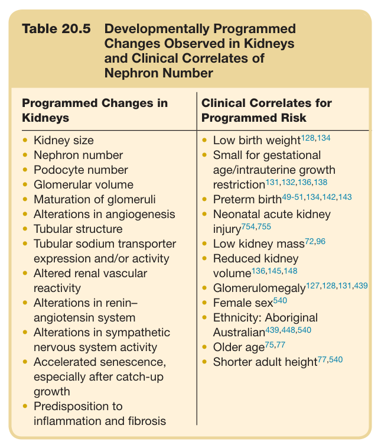

#### Table Data (CSV: [Table_20_5.csv](Table_20_5.csv))

```markdown
| Table Text (OCR) |
| :--- |
| Table 20.5  Developmentally Programmed Changes Observed in Kidneys and Clinical Correlates of Nephron Number Programmed Changes in Kidneys  Clinical Correlates for Programmed Risk    Kidney sizeNephron numberPodocyte numberGlomerular volumeMaturation of glomeruliAlterations in angiogenesisTubular structureTubular sodium transporter expression and/or activityAltered renal vascular reactivityAlterations in renin-angiotensin systemAlterations in sympathetic nervous system activityAccelerated senescence, especially after catch-up growthPredisposition to inflammation and fibrosis  Low birth weight ^{128,134} Small for gestational age/intrauterine growth restriction ^{131,132,136,138} Preterm birth ^{49-51,134,142,143} Neonatal acute kidney injury ^{754,755} Low kidney mass ^{72,96} Reduced kidney volume ^{136,145,148} Glomerulomegaly ^{127,128,131,439} Female sex ^{540} Ethnicity: Aboriginal Australian ^{439,448,540} Older age ^{75,77} Shorter adult height ^{77,540} |
```

Table 20.5 Developmentally Programmed Changes Observed in Kidneys and Clinical Correlates of Nephron Number

---

### Table_20_6

#### Table Image

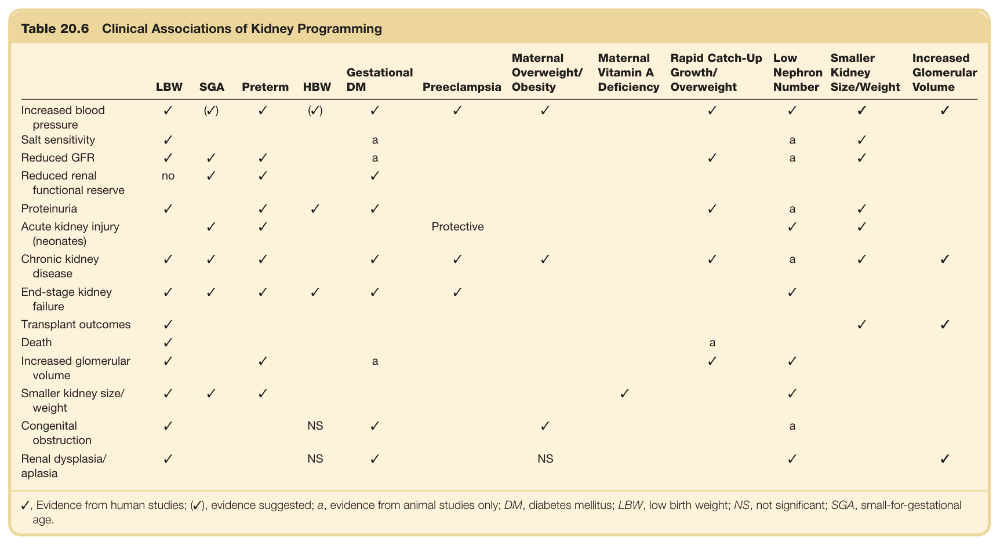

#### Table Data (CSV: [Table_20_6.csv](Table_20_6.csv))

```markdown
| Table Text (OCR) |
| :--- |
| Table 20.6Clinical Associations of Kidney Programming LBW  SGA  Preterm  HBW  Gestational DM  Preeclampsia  Maternal Overweight/ Obesity  Maternal Vitamin A Deficiency  Rapid Catch-Up Growth/ Overweight  Low Nephron Number  Smaller Kidney Size/Weight  Increased Glomerular Volume    Increased blood pressure  ✓  (✓)  ✓  (✓)  ✓  ✓  ✓    ✓  ✓  ✓  ✓    Salt sensitivity  ✓        a          a  ✓      Reduced GFR  ✓  ✓  ✓    a        ✓  a  ✓      Reduced renal functional reserve  no  ✓  ✓    ✓                  Proteinuria  ✓    ✓  ✓  ✓        ✓  a  ✓      Acute kidney injury (neonates)    ✓  ✓      Protective        ✓  ✓      Chronic kidney disease  ✓  ✓  ✓    ✓  ✓  ✓    ✓  a  ✓  ✓    End-stage kidney failure  ✓  ✓  ✓  ✓  ✓  ✓        ✓        Transplant outcomes  ✓                    ✓  ✓    Death  ✓                a          Increased glomerular volume  ✓    ✓    a        ✓  ✓        Smaller kidney size/ weight  ✓  ✓  ✓          ✓    ✓        Congenital obstruction  ✓      NS  ✓    ✓      a        Renal dysplasia/aplasia  ✓      NS  ✓    NS      ✓    ✓ <sub>g</sub><sup>e</sup> |
```

Table 20.6 Clinical Associations of Kidney Programming

---

### Table_20_8

#### Table Image

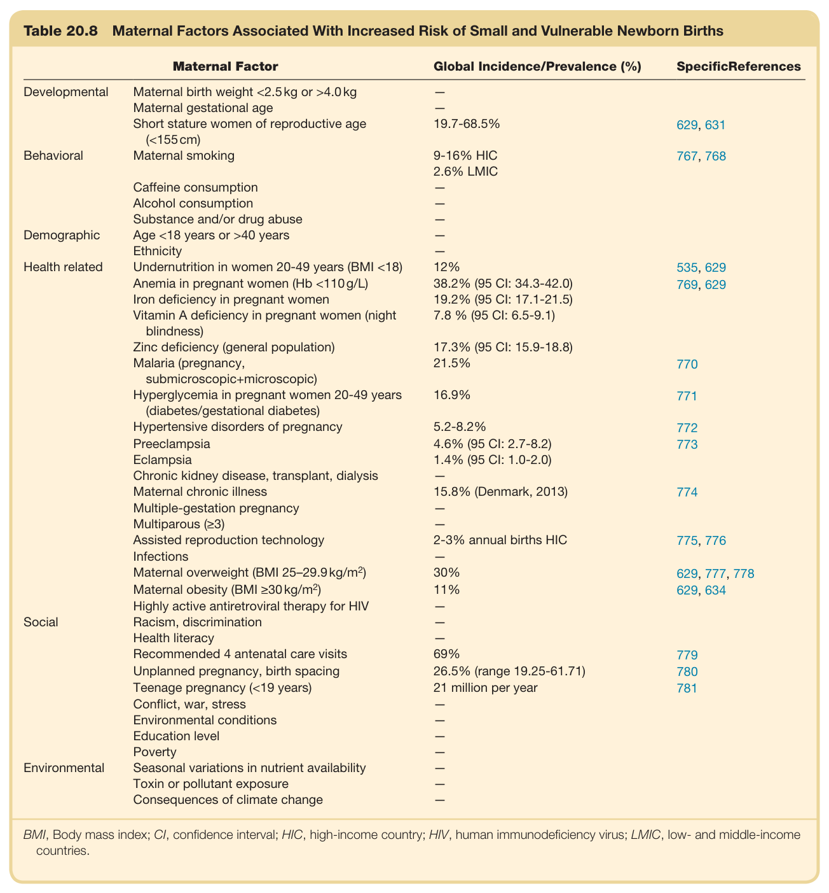

#### Table Data (CSV: [Table_20_8.csv](Table_20_8.csv))

```markdown
| Table Text (OCR) |
| :--- |
| Table 20.8  Maternal Factors Associated With Increased Risk of Small and Vulnerable Newborn Births Maternal Factor  Global Incidence/Prevalence (%)  SpecificReferences    Developmental  Maternal birth weight <2.5 kg or >4.0 kg  —      Maternal gestational age  —      Short stature women of reproductive age (<155 cm)  19.7-68.5%  629, 631    Behavioral  Maternal smoking  9-16% HIC  767, 768    2.6% LMIC      Caffeine consumption  —      Alcohol consumption  —      Substance and/or drug abuse  —      Demographic  Age <18 years or >40 years  —      Ethnicity  —      Health related  Undernutrition in women 20-49 years (BMI <18)  12%  535, 629    Anemia in pregnant women (Hb <110 g/L)  38.2% (95 CI: 34.3-42.0)  769, 629    Iron deficiency in pregnant women  19.2% (95 CI: 17.1-21.5)      Vitamin A deficiency in pregnant women (night blindness)  7.8% (95 CI: 6.5-9.1)      Zinc deficiency (general population)  17.3% (95 CI: 15.9-18.8)      Malaria (pregnancy, submicroscopic+microscopic)  21.5%  770    Hyperglycemia in pregnant women 20-49 years (diabetes/gestational diabetes)  16.9%  771    Hypertensive disorders of pregnancy  5.2-8.2%  772    Preeclampsia  4.6% (95 CI: 2.7-8.2)  773    Eclampsia  1.4% (95 CI: 1.0-2.0)      Chronic kidney disease, transplant, dialysis  —      Maternal chronic illness  15.8% (Denmark, 2013)  774    Multiple-gestation pregnancy  —      Multiparous (≥3)  —      Assisted reproduction technology  2-3% annual births HIC  775, 776    Infections  —      Maternal overweight (BMI 25-29.9 kg/m2)  30%  629, 777, 778    Maternal obesity (BMI ≥30 kg/m2)  11%  629, 634    Highly active antiretroviral therapy for HIV  —      Social  Racism, discrimination  —      Health literacy  —      Recommended 4 antenatal care visits  69%  779    Unplanned pregnancy, birth spacing  26.5% (range 19.25-61.71)  780    Teenage pregnancy (<19 years)  21 million per year  781    Conflict, war, stress  —      Environmental conditions  —      Education level  —      Poverty  —      Environmental  Seasonal variations in nutrient availability  —      Toxin or pollutant exposure  —      Consequences of climate change  — BMI, Body mass index; CI, confidence interval; HIC, high-income country; HIV, human immunodeficiency virus; LMIC, low- and middle-income countries. |
```

Table 20.8 Maternal Factors Associated With Increased Risk of Small and Vulnerable Newborn Births

---

### Table_20_9

#### Table Image

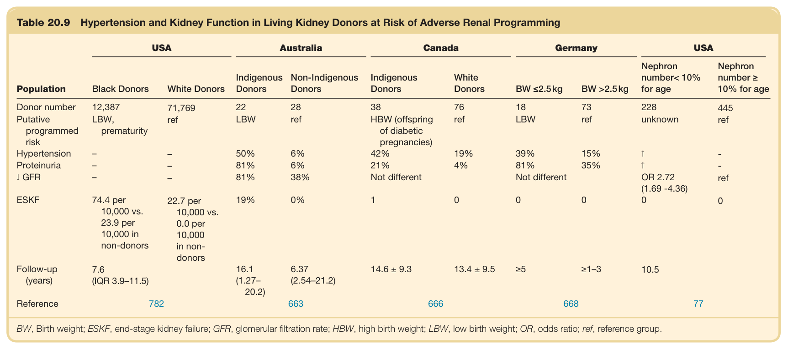

#### Table Data (CSV: [Table_20_9.csv](Table_20_9.csv))

```markdown
| Table Text (OCR) |
| :--- |
| Table 20.9Hypertension and Kidney Function in Living Kidney Donors at Risk of Adverse Renal Programming Population  USA  Australia  Canada  Germany  USA    Black Donors  White Donors  Indigenous Donors  Non-Indigenous Donors  Indigenous Donors  White Donors  BW ≤2.5 kg  BW >2.5 kg  Nephron number< 10% for age  Nephron number ≥ 10% for age    Donor number  12,387  71,769  22  28  38  76  18  73  228  445    Putative programmed risk  LBW, prematurity  ref  LBW  ref  HBW (offspring of diabetic pregnancies)  ref  LBW  ref  unknown  ref    Hypertension  -  -  50%  6%  42%  19%  39%  15%  ↑  -    Proteinuria  -  -  81%  6%  21%  4%  81%  35%  ↑  -    ↓ GFR  -  -  81%  38%  Not different    Not different    OR 2.72 (1.69 -4.36)  ref    ESKF  74.4 per 10,000 vs. 23.9 per 10,000 in non-donors  22.7 per 10,000 vs. 0.0 per 10,000 in non-donors  19%  0%  1  0  0  0  0  0    Follow-up (years)  7.6 (IQR 3.9-11.5)    16.1 (1.27-20.2)  6.37 (2.54-21.2)  14.6 ± 9.3  13.4 ± 9.5  ≥5  ≥1-3  10.5      Reference  782  663  666  668  77 BW, Birth weight; ESKF, end-stage kidney failure; GFR, glomerular filtration rate; HBW, high birth weight; LBW, low birth weight; OR, odds ratio; ref, reference group. |
```

Table 20.9 Hypertension and Kidney Function in Living Kidney Donors at Risk of Adverse Renal Programming

---

### Table_e20_1

#### Table Images (4 Parts)

- **Part 1 (Page 12)**:
  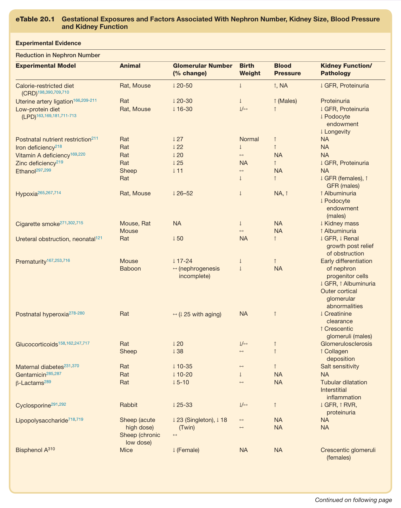

- **Part 2 (Page 13)**:
  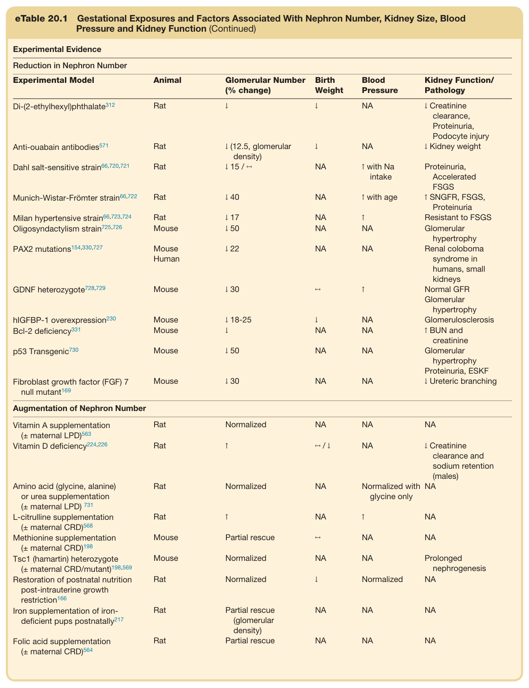

- **Part 3 (Page 14)**:
  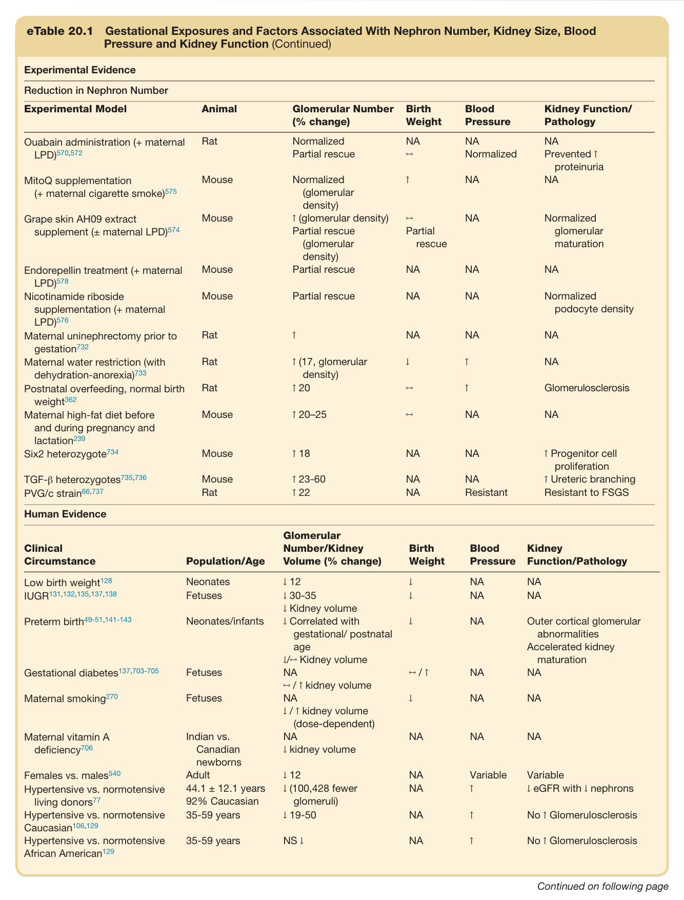

- **Part 4 (Page 15)**:
  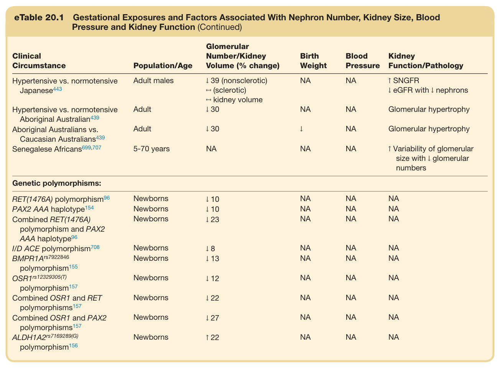

#### Table Data (CSV: [Table_e20_1.csv](Table_e20_1.csv))

```markdown
| Table Text (OCR) |
| :--- |
| eTable 20.1  Gestational Exposures and Factors Associated With Nephron Number, Kidney Size, Blood Pressure and Kidney Function Experimental Evidence Reduction in Nephron Number    Experimental Model  Animal  Glomerular Number (% change)  Birth Weight  Blood Pressure  Kidney Function/ Pathology    Calorie-restricted diet (CRD) ^{198,390,709,710}   Rat, Mouse  ↓ 20-50  ↓  ↑, NA  ↓ GFR, Proteinuria    Uterine artery ligation ^{166,209-211}   Rat  ↓ 20-30  ↓  ↑ (Males)  Proteinuria    Low-protein diet (LPD) ^{163,169,181,711-713}   Rat, Mouse  ↓ 16-30  ↓/↔  ↑  ↓ GFR, Proteinuria↓ Podocyte endowment↓ Longevity    Postnatal nutrient restriction ^{211}   Rat  ↓ 27  Normal  ↑  NA    Iron deficiency ^{218}   Rat  ↓ 22  ↓  ↑  NA    Vitamin A deficiency ^{169,220}   Rat  ↓ 20  ↔  NA  NA    Zinc deficiency ^{219}   Rat  ↓ 25  NA  ↑  ↓ GFR, Proteinuria    Ethanol ^{297,299}   Sheep  ↓ 11  ↔  NA  NA    Rat    ↓  ↑  ↓ GFR (females), ↑ GFR (males)    Hypoxia ^{265,267,714}   Rat, Mouse  ↓ 26-52  ↓  NA, ↑  ↑ Albuminuria↓ Podocyte endowment (males)    Cigarette smoke ^{271,302,715}   Mouse, Rat  NA  ↓  NA  ↓ Kidney mass    Mouse    ↔  NA  ↑ Albuminuria    Ureteral obstruction, neonatal ^{121}   Rat  ↓ 50  NA  ↑  ↓ GFR, ↓ Renal growth post relief of obstruction    Prematurity ^{167,253,716}   Mouse  ↓ 17-24  ↓  ↑  Early differentiation of nephron progenitor cells↓ GFR, ↑ Albuminuria    Baboon  ↔ (nephrogenesis incomplete)  ↓  NA  Outer cortical glomerular abnormalities    Postnatal hyperoxia ^{278-280}   Rat  ↔ (↓ 25 with aging)  NA  ↑  ↓ Creatinine clearance↑ Crescentic glomeruli (males)    Glucocorticoids ^{158,162,247,717}   Rat  ↓ 20  ↓/↔  ↑  Glomerulosclerosis    Sheep  ↓ 38  ↔  ↑  ↑ Collagen deposition    Maternal diabetes ^{231,370}   Rat  ↓ 10-35  ↔  ↑  Salt sensitivity    Gentamicin ^{285,287}   Rat  ↓ 10-20  ↓  NA  NA    β-Lactams ^{289}   Rat  ↓ 5-10  ↔  NA  Tubular dilatation Interstitial inflammation    Cyclosporine ^{291,292}   Rabbit  ↓ 25-33  ↓/↔  ↑  ↓ GFR, ↑ RVR, proteinuria    Lipopolysaccharide ^{718,719}   Sheep (acute high dose)  ↓ 23 (Singleton), ↓ 18 (Twin)  ↔  NA  NA    Sheep (chronic low dose)  ↔  ↔  NA  NA    Bisphenol A ^{310}   Mice  ↓ (Female)  NA  NA  Crescentic glomeruli (females) |
```

Table e20.1 Gestational Exposures and Factors Associated With Nephron Number, Kidney Size, Blood Pressure and Kidney Function (Continued)

---

### Table_e20_2

#### Table Image

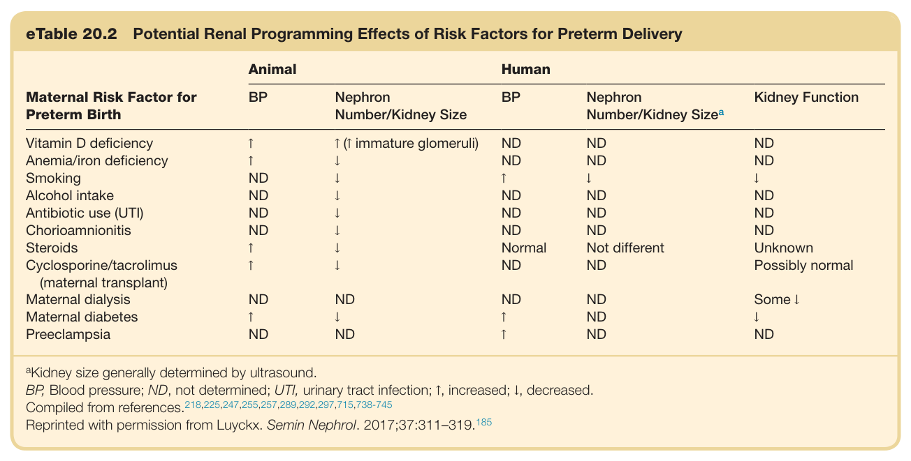

#### Table Data (CSV: [Table_e20_2.csv](Table_e20_2.csv))

```markdown
| Table Text (OCR) |
| :--- |
| eTable 20.2  Potential Renal Programming Effects of Risk Factors for Preterm Delivery Maternal Risk Factor for Preterm Birth  Animal  Human    BP  Nephron Number/Kidney Size  BP  Nephron Number/Kidney  Size^a   Kidney Function    Vitamin D deficiency  ↑  ↑ (↑ immature glomeruli)  ND  ND  ND    Anemia/iron deficiency  ↑  ↓  ND  ND  ND    Smoking  ND  ↓  ↑  ↓  ↓    Alcohol intake  ND  ↓  ND  ND  ND    Antibiotic use (UTI)  ND  ↓  ND  ND  ND    Chorioamnionitis  ND  ↓  ND  ND  ND    Steroids  ↑  ↓  Normal  Not different  Unknown    Cyclosporine/tacrolimus (maternal transplant)  ↑  ↓  ND  ND  Possibly normal    Maternal dialysis  ND  ND  ND  ND  Some ↓    Maternal diabetes  ↑  ↓  ↑  ND  ↓    Preeclampsia  ND  ND  ↑  ND  ND <sup>a</sup>Kidney size generally determined by ultrasound. BP, Blood pressure; ND, not determined; UTI, urinary tract infection; ↑, increased; ↓, decreased. Compiled from references.<sup>218,225,247,255,257,289,292,297,715,738-745</sup> Reprinted with permission from Luyckx. Semin Nephrol. 2017;37:311–319.<sup>185</sup> |
```

Table e20.2 Potential Renal Programming Effects of Risk Factors for Preterm Delivery

---

### Table_e20_3

#### Table Images (2 Parts)

- **Part 1 (Page 21)**:
  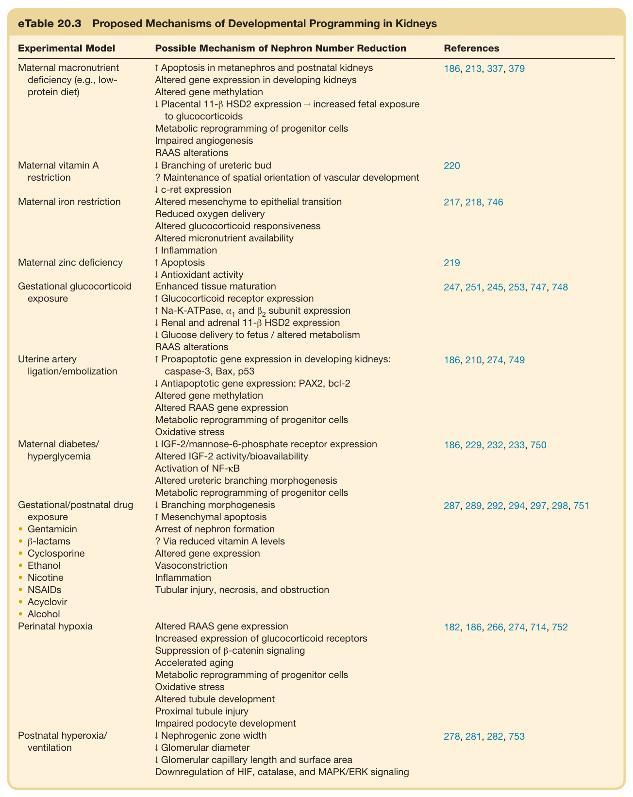

- **Part 2 (Page 22)**:
  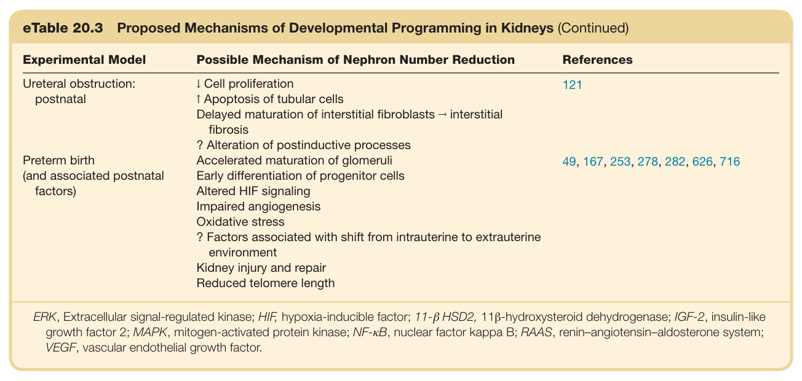

#### Table Data (CSV: [Table_e20_3.csv](Table_e20_3.csv))

```markdown
| Table Text (OCR) |
| :--- |
| eTable 20.3  Proposed Mechanisms of Developmental Programming in Kidneys Experimental Model  Possible Mechanism of Nephron Number Reduction  References    Maternal macronutrient deficiency (e.g., low-protein diet)  ↑ Apoptosis in metanephros and postnatal kidneysAltered gene expression in developing kidneysAltered gene methylation↓ Placental 11-β HSD2 expression → increased fetal exposure to glucocorticoidsMetabolic reprogramming of progenitor cellsImpaired angiogenesisRAAS alterations  186, 213, 337, 379    Maternal vitamin A restriction  ↓ Branching of ureteric bud? Maintenance of spatial orientation of vascular development↓ c-ret expression  220    Maternal iron restriction  Altered mesenchyme to epithelial transitionReduced oxygen deliveryAltered glucocorticoid responsivenessAltered micronutrient availability↑ Inflammation  217, 218, 746    Maternal zinc deficiency  ↑ Apoptosis↓ Antioxidant activity  219    Gestational glucocorticoid exposure  Enhanced tissue maturation↑ Glucocorticoid receptor expression↑ Na-K-ATPase,  \alpha_{1}  and  \beta_{2}  subunit expression↓ Renal and adrenal 11-β HSD2 expression↓ Glucose delivery to fetus / altered metabolismRAAS alterations  247, 251, 245, 253, 747, 748    Uterine artery ligation/embolization  ↑ Proapoptotic gene expression in developing kidneys:caspase-3, Bax, p53↓ Antiapoptotic gene expression: PAX2, bcl-2Altered gene methylationAltered RAAS gene expressionMetabolic reprogramming of progenitor cellsOxidative stress  186, 210, 274, 749    Maternal diabetes/hyperglycemia  ↓ IGF-2/mannose-6-phosphate receptor expressionAltered IGF-2 activity/bioavailabilityActivation of NF-κBAltered ureteric branching morphogenesisMetabolic reprogramming of progenitor cells  186, 229, 232, 233, 750    Gestational/postnatal drug exposureGentamicinβ-lactamsCyclosporineEthanolNicotineNSAIDsAcyclovirAlcohol  ↓ Branching morphogenesis↑ Mesenchymal apoptosisArrest of nephron formation? Via reduced vitamin A levelsAltered gene expressionVasoconstrictionInflammationTubular injury, necrosis, and obstruction  287, 289, 292, 294, 297, 298, 751    Perinatal hypoxia  Altered RAAS gene expressionIncreased expression of glucocorticoid receptorsSuppression of β-catenin signalingAccelerated agingMetabolic reprogramming of progenitor cellsOxidative stressAltered tubule developmentProximal tubule injuryImpaired podocyte development  182, 186, 266, 274, 714, 752    Postnatal hyperoxia/ventilation  ↓ Nephrogenic zone width↓ Glomerular diameter↓ Glomerular capillary length and surface areaDownregulation of HIF, catalase, and MAPK/ERK signaling  278, 281, 282, 753    Ureteral obstruction: postnatal  ↓ Cell proliferation↑ Apoptosis of tubular cellsDelayed maturation of interstitial fibroblasts → interstitial fibrosis? Alteration of postinductive processes  121    Preterm birth (and associated postnatal factors)  Accelerated maturation of glomeruliEarly differentiation of progenitor cellsAltered HIF signalingImpaired angiogenesisOxidative stress? Factors associated with shift from intrauterine to extrauterine environmentKidney injury and repairReduced telomere length  49, 167, 253, 278, 282, 626, 716 ERK, Extracellular signal-regulated kinase; HIF, hypoxia-inducible factor; 11-β HSD2, 11β-hydroxysteroid dehydrogenase; IGF-2, insulin-like growth factor 2; MAPK, mitogen-activated protein kinase; NF-κB, nuclear factor kappa B; RAAS, renin–angiotensin–aldosterone system; VEGF, vascular endothelial growth factor. |
```

Table e20.3 Proposed Mechanisms of Developmental Programming in Kidneys

---

### Table_e20_4

#### Table Image


#### Table Data (CSV: [Table_e20_4.csv](Table_e20_4.csv))

```markdown
| Table Text (OCR) |
| :--- |
| eTable 20.4  Programming Effects on the Renin–Angiotensin System Model  Species  Timing of Insult  Age and Sex of Offspring at Study  mRNA or Protein Expression  Physiologic Response  Reference(s)    Glucocorticoids  Sheep  Early gestation  40 mo ♀  ↔ Plasma renin, ANG II, or Aogen  ↑ Basal MAP, females only  170    Rat    6-7 mo ♂♀  ↔ Renal Aogen ↑ PRA, plasma Aogen in females only  ↑ Basal TBP, females only  163    Rat  Mid- to late gestation  6 mo  ↑ Renal ACE and renin in males and females  ND  354    Rat  Mid- to late gestation  4 and 8 wk ♂  ↔ PRA, plasma ANG II, and renal ANG II levels ↑ Urine ANG II at 4 and 8 wk  ↑ Basal TBP at 8 but not 4 wk of age  32 |
```

Table e20.4 Programming Effects on the Renin–Angiotensin System (Continued)

---
